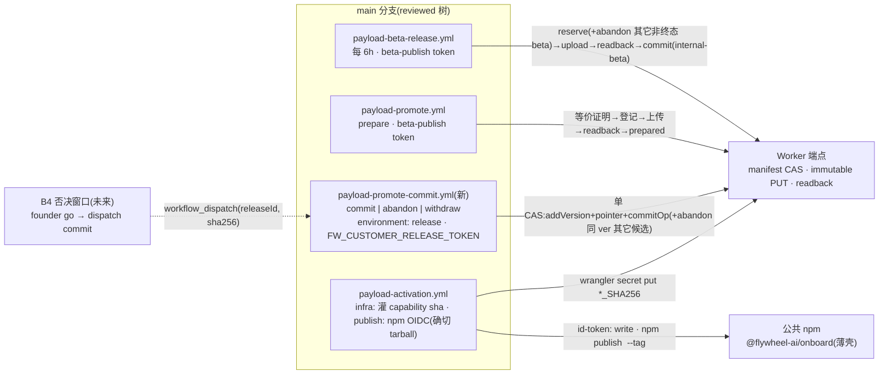
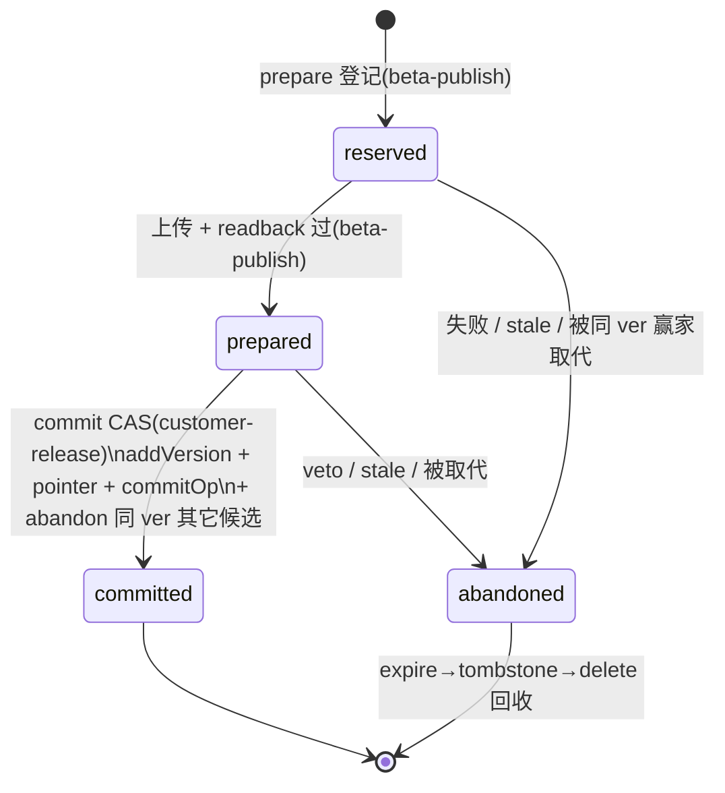

# FLY-2388 发布流水线 P4(B1) — 实施计划

Issue: FLY-2388 (https://linear.app/geoforge3d/issue/FLY-2388/1143b1-发布流水线-p4薄壳-npm-publish2faoidc-payload-immutable-key-上传-r2-回读验)
日期: 2026-09-08
基于: research.md

> **一句话**:在 FLY-1062/FLY-2387 已落地的机器件之上补齐四件事——① 修活 beta 线(ETag 归一化,52 天 210/210 失败的根因,含 cleanup 客户端);② 新建零构建、sha 绑定、`environment: release` 门控的 `payload-promote-commit.yml`(commit / abandon / withdraw 三动作),显式重谈 S4b;③ 薄壳 npm 发布改 trusted publishing(OIDC)+ **发布确切 tarball** + `--tag next` + registry 回读 + 幂等重跑;④ §7.3-7 staging 清理策略定稿(同版本单赢家、显式 abandon、stale 收敛,beta/release 两侧)。合同正文以**署名日期的 Amendment A1** 同步。**不做** B3/B4/B5、不改 manifest schema、不做任何真发布动作。
> **Lead 裁决已折入**(exploration §4):F1/D1/D2/D3/D4 全按默认;founder 手动前置清单进 founder HTML,B1 代码不阻塞于此。
> **评审记录**:§11 — Codex R1(9 项)→ R2(4 项)→ **R3 APPROVED**(1 项非阻塞已折入)。

---

## 0. 全景

## 1. 稳定身份与展示标签

| 身份 | 形状 | 谁分配 | 展示 |
|---|---|---|---|
| beta releaseId | `beta-<sourceCommit 40hex>`(定时);dispatch 可显式 | `payload-release.mjs` | — |
| promote releaseId | **唯一语法** `^[A-Za-z0-9][A-Za-z0-9._-]{2,63}$`,由 `scripts/release/lib/release-id.mjs`(`isReleaseId`)定义,prepare / commit / abandon 三个子命令与两个 workflow 的 Guards 步骤**都**执行同一正则(workflow 里逐字同串,并有测试比对脚本与 YAML 中的正则字面量相等);约定值 `rel-<cleanVer>-<yyyymmdd>` | prepare 输入,commit 复用 | run log 与 Discord 用 `releaseId + toDisplayLabel(ver)` |
| 候选 tuple | `{releaseId, ver, betaVersion, sourceCommit, sha256, objectKey}`(server-owned `createdAt`) | prepare | — |
| 审批物 | `expectedSha256` = `releasePayloadSha256` | founder go 时 Lead 从 prepare run log / `GET /admin/manifest` 抄 | Discord go 消息逐字 |
| 壳版本 | `packages/onboard-shell/package.json.version`(独立于 `doc/VERSION`) | PR 显式 bump | dist-tag 由 **唯一解析器** `scripts/release/lib/dist-tag.mjs` 决定:`^\d+\.\d+\.\d+$` → `latest`;`^\d+\.\d+\.\d+-[0-9A-Za-z.-]+$` → `next`;其它抛错 |
| 壳发布物 | 单一 `.tgz`(`npm pack --pack-destination <tmp>` 产物)+ 其 sha256 | activation publish 步 | registry 回读 sha256 必须逐字等于 |
| 一致性 | 版本串在 package.json / manifest / 对象 key / 版本目录不带 `v`;仅 UI/git tag 用 `toDisplayLabel` | 合同 §1.1 | — |

## 2. 分块(implement 节点的 progress chunk id;顺序即依赖)

### c0-beta-line-etag · 修活 beta 线(前置)

**改动**
1. `scripts/release/lib/endpoint-client.mjs`:导出纯函数 `normalizeEtag(v)`:非字符串 / 空 → 抛 `EtagProtocolError`;去首尾空白;剥 `W/` 前缀(大小写不敏感);剥首尾引号;结果必须匹配 **`^(?:[0-9a-f]{32}|[0-9a-f]{64})$`**(R2 md5 hex 或 harness sha256 hex,精确二选一),否则抛。`readManifest`:200 且缺 `ETag` 头 → 抛协议错误(不带 `null` 进 CAS 重试);`casUpdate` POST 归一化值;412 分支读 body 打印 `error` 字段(固定串,不含敏感值)。
2. **`scripts/release/payload-cleanup.mjs` 改为复用 `makeClient`**(现有自带 `api/readManifest/casUpdate`,`:54-60,:105-109` 原样回传 header ETag,同样被弱化打死);删本地实现。
3. `packages/payload-endpoint/src/handler.mjs`:`stripQuotes` → `normalizeEtag`(同规则,同源实现放合同包?**否**——合同包不管传输层;放 `packages/payload-endpoint/src/etag.mjs`,客户端 `lib/endpoint-client.mjs` 保有一份同规则并由共享向量测试锁等价);`baseEtag` 非法(非 null 且不可归一化)→ **400** `{"error":"bad baseEtag"}`,绝不落 500。响应侧不变。**需重部署生效**;客户端修复单独足以让 beta 线过。
4. harness:`packages/payload-endpoint/__tests__/serve.mjs` 新增 `FW_TEST_WEAK_ETAG=1`(仅 harness 层):回给客户端的 `ETag` 改写成 `W/"<etag>"`。

**测试(RED 先行)**
- 新 `scripts/__tests__/endpoint-client-etag.test.mjs`(`node --test`):向量表 `W/"x"`/`"x"`/`x`/` "x" ` 通过;拒绝集:空、`W/""`、非 hex、33 位、63 位、65 位;**显式登记进 `ci.yml` `payload-distribution` job**(CI 不 glob 该目录的 `.mjs`)。同一向量文件(`scripts/__tests__/fixtures/etag-vectors.json`)喂 `packages/payload-endpoint/src/etag.mjs` 的单测,锁两侧等价。
- pipeline **E1**:`FW_TEST_WEAK_ETAG=1` 跑 R1 全链 → 绿(修前逐字复现生产日志);**E1b** 突变(`normalizeEtag` 退回只剥引号)→ E1 红;**E1c**:`FW_TEST_WEAK_ETAG=1` 跑 cleanup 套件 C2(expire→tombstone→delete)→ 绿。
- handler-admin:baseEtag 四形态 200;真错 412;非法串 400;`null` 在非空 manifest 上 412(现行为不变)。
- 生产验证(implement 合入 main 后):下一次 6h 定时或手动 dispatch → `commit: internal-beta → 1.56.0-beta.1`;run URL 进 PR body。

### c1-promote-commit-workflow · 客户指针切换执行面

**新文件 `.github/workflows/payload-promote-commit.yml`**
- `on: workflow_dispatch` 输入:`confirm`(required,逐字 `COMMIT`)、`action`(choice `commit|abandon|withdraw`)、`release-id`、`expected-sha256`、`withdraw-version`、`fallback-version`(全 string,可空;按 action 在 Guards 校验)。
- `permissions: contents: read`;`concurrency: group: payload-release`。
- 单 job `commit`:`environment: release`;`if:` 逐字 = `JOB_GATE`;`timeout-minutes: 15`。
- 步骤:
  1. `Guards (main-only + explicit COMMIT confirm + input shape)`:ref main;`confirm`;`action=commit` ⇒ `release-id` 匹配 releaseId 正则 ∧ `expected-sha256` 匹配 `^[0-9a-f]{64}$`;`abandon` ⇒ `release-id`;`withdraw` ⇒ `withdraw-version` 与 `fallback-version` 都匹配 `CLEAN_SEMVER_RE` 且不相等;输入只经 `_INPUT` env(S8)。
  2. `Check out scripts (no build)`:**逐字** `uses: actions/checkout@34e114876b0b11c390a56381ad16ebd13914f8d5 # v4`(与 activation 同一 reviewed SHA)+ `with: {fetch-depth: 1, persist-credentials: false}`。**零 `pnpm install/build`、零打包**;脚本只依赖 node 内置模块 + `packages/release-contract/src/*.mjs`(零依赖 ESM,直接 import)。本 job **不得**出现任何其它 `uses:`;若将来需要,必须 40 位小写 hex pin 且进 S14 白名单。
  3. `Validate production manifest snapshot`:`node scripts/release/payload-promote.mjs validate-snapshot`(新零写子命令:`GET /admin/manifest` → **完整 `validateManifest`**;非空 → exit 1 并打印违规编号)。**合同层面(准确表述,不夸大)**:生产执行门 = 完整 `validateManifest`;它对形状的 accept/reject 结果与 JSON Schema 的一致性由 **differential corpus** 锁定(见 c4:枚举每个 schema keyword/boundary 的正负例,断言 `schema 拒 ⇒ validateManifest ≥ 1 条错误` 且所有合法形状两者都接受;**不**声称每条形状错误都编号 C-0——已知 `nextBetaN=0` 记 C-4、重复 tombstone 记 C-8)。CONTRACT.md:259 由 Amendment A1(c4)改为「激活/每次 commit 前运行合同包完整 `validateManifest`;其与 schema 的 differential corpus 在 CI 锁一致;有 ajv 的环境可额外跑 schema」——不在实现中暗替。
  4. `Run <action>`:三条 `if: inputs.action == '<x>'` 步各调对应子命令。
  5. `Render result (always)`:`if: always()`;读子命令写到 `$GITHUB_OUTPUT` 的 **action-specific JSON**(见下),打印 `PROMOTE_RESULT <json>`;子命令成功而渲染失败不改变 job 结论(渲染步 `continue-on-error: true`);恢复/查询方式 = `validate-snapshot` 顺带打印 `releaseOps[<id>]`/`channels` 摘要,幂等重跑得 `outcome=idempotent`。
- 凭据:`secrets.FW_CUSTOMER_RELEASE_TOKEN`、`vars.FW_ENDPOINT`;不引用其它 secret。

**`payload-promote.mjs` 改动**
- **argv parser 升级为 schema-aware**:每个子命令声明 `{valueFlags:[…], booleanFlags:[…], exclusive:[[…]], requires:{…}}`;value flag 必须消费下一个非 `--` 开头的 token;boolean flag 不消费;任意顺序、重复、`--x=y`、悬空、未知、位置参数一律拒;互斥/依赖违反拒。子命令表:
  - `prepare {release-id, beta, repo-root}`;`commit {release-id, expected-sha256}`;`withdraw {withdraw, fallback}`;
  - `abandon {release-id | stale-days} + [apply]`:`release-id` 与 `stale-days` 互斥且必一;`apply` 只能与 `stale-days` 同用;
  - `validate-snapshot {}`(零写)。
- `prepare`/`commit`/`abandon --release-id`:`isReleaseId` 校验(与 workflow 正则同源)。
- `commit`:`readbackVerify` 返回 `{size}`(流式计数),删第二次整对象 GET;**同一 CAS 内** abandon 其它 `kind=release ∧ state∈{reserved,prepared} ∧ ver===op.ver` 的候选;幂等路径零写。
- `withdraw`(**绑定当前指针**):mutate 内要求 `versions[w]` 为 `channel=release ∧ status=active` ∧ `isCleanSemver(w)` ∧ **`channels[customer-release].latest === w`**;`f` 为 `channel=release ∧ status=active ∧ isCleanSemver(f) ∧ f !== w`;幂等态**仅**「`versions[w].status===quarantined ∧ latest===f`」→ 零写成功;其它指针漂移(latest 既非 w 也非 f、或 w 已 quarantined 但 latest≠f)一律 fail-closed 零写。
- `abandon --release-id`:op 必须 `kind=release`;`reserved|prepared → abandoned` 单 CAS;已 `abandoned` 幂等;`committed` → exit 1(「已发布候选不可放弃,走 withdraw」)。
- `abandon --stale-days N [--apply]`:`N` 匹配 `^[1-9][0-9]*$`;对 `kind=release ∧ state∈{reserved,prepared} ∧ now−createdAt ≥ N 天`(用本地钟,服务端 `createdAt`)批量 abandon;无 `--apply` 只列出。
- **结果输出**:每个子命令成功时写 `$GITHUB_OUTPUT`(若 env 存在)`result=<json>`,并打印同一 JSON;形状:`commit → {action, releaseId, ver, sha256, outcome: committed|idempotent}`;`abandon → {action, releaseIds:[…], outcome: abandoned|idempotent|dry-run}`;`withdraw → {action, withdrawn, fallback, outcome: withdrawn|idempotent}`;缺失字段不出现(不填 `null`/`n/a`)。

**结构断言重写(`release-workflows-structure.test.sh`)**
- **S4b(重谈)**:`FW_CUSTOMER_RELEASE_TOKEN` 只允许在 `payload-promote-commit.yml` 与 `payload-activation.yml`(后者只做 sha 派生,c2),二者必须 `is_release_env_workflow`;其它 workflow 零引用。
- **S4e**:`payload-promote-commit.yml = {FW_CUSTOMER_RELEASE_TOKEN}`;activation = `{CLOUDFLARE_API_TOKEN, FW_BETA_PUBLISH_TOKEN, FW_CUSTOMER_RELEASE_TOKEN}`。
- **S11**:受门 secret 名单 = `{CLOUDFLARE_API_TOKEN, FW_CUSTOMER_RELEASE_TOKEN}`(job 级 `environment: release` + 逐字 gate)。
- **S13**:commit workflow 触发器 = `["workflow_dispatch"]` 且有 `confirm` 输入;S5a/S5b 不变。
- **新 S14(commit workflow 形状,parsed-YAML)**:恰一 job;`environment: release`;job gate 逐字;`permissions == {contents: read}`;`concurrency.group == payload-release`;零构建(任何 step 的 `run`/`uses` 不含 `pnpm install|pnpm build|package-onboard|npm ci|npm run build|setup-pnpm|actions/setup-node`);**`uses:` 白名单**:全部 `uses` 必须 ∈ `{actions/checkout}` 且 ref 匹配 `^[0-9a-f]{40}$`(tag/branch 形式即红;突变用例:把 SHA 换成 `@v4` → S14 红);每个 `${{ inputs. }}` 只在 `_INPUT:`/`if:` 行;secrets 集合 == `{FW_CUSTOMER_RELEASE_TOKEN}`;Guards 步 `run` 含与 `release-id.mjs` 逐字相同的正则(测试从两处提取比对)。

**测试(pipeline)**
- **W2a** withdraw 非当前 latest → 拒零写;**W2b** withdraw beta 版本 → 拒;**W2c** withdraw===fallback → 拒;**W2d** 并发指针推进(读后另一执行者把 latest 切到 C)→ CAS 412 重读后 fail-closed 零写;**W2e** 同参重跑 → idempotent;**W2f** 同 withdraw 不同 fallback 重跑 → 拒。
- **P9a** `abandon --release-id`(prepared → abandoned → cleanup 三步删对象);**P9b** abandon committed → exit 1;**P9c** commit 同 CAS abandon 同 ver 旧候选 + 幂等重跑零写;**P9d** `--stale-days` dry-run 零写 / `--apply` 只动过期 / `N` 非法拒 / `--apply` 无 `--stale-days` 拒;**P9e** `validate-snapshot` 对 C-1b 违规 seed 退出非零、对合法 seed 退出 0 零写;**P10** argv 矩阵(任意顺序、重复、`=`、悬空、未知、互斥、boolean 不吞值);**P11** releaseId 语法在 prepare/commit/abandon 三处一致拒。
- S14 对空/畸形 workflow 先红。

### c2-npm-oidc-shell · 薄壳 trusted publishing + 确切 tarball + dist-tag

**新 helper `scripts/release/shell-publish-helper.mjs`**(零依赖;可由本地 registry stub 驱动):
- `pack --out <dir>`:在 `packages/onboard-shell` 跑 `npm pack --pack-destination <dir> --json`,输出 `{tarball, sha, version, tag}`(`sha` = tarball 的 sha256 hex;字段名与 workflow output `steps.pack.outputs.sha` 逐字同名,S15 锁该映射;tag 由 `lib/dist-tag.mjs`);
- `gate <tgz>`:对**该文件**解包跑内容门(白名单文件集、零 secret、零私仓 slug 除 `package.json.repository.url` 唯一例外)——即 `onboard-shell-publish-gate.test.sh` 的 G 系列改为可对指定 tarball 运行;
- `preflight <tgz> --expect-sha <hex> --expect-tag <tag> --registry <url>`:`npm view <name>@<ver>` **E404 → `outcome=free`**;已存在 → 下载 registry tarball,本地重算 sha256:等于 expect 且 dist-tag 指向该版本 → `outcome=idempotent`(exit 0,后续 publish 步跳过);不等 → `outcome=conflict` exit 1(事故);其它错误 exit 1;
- `verify <tgz> --expect-sha --expect-tag --registry`:发布后轮询 12×15s,回读 sha256 与 dist-tag 都必须相等;不等 → exit 1(**发布已发生**,事故信号,写清)。

**`shell-publish-preflight.sh` 职责拆分(新 `--workflow` 模式)**
- `--workflow`:只跑 门 1(endpoint 非占位)+ 门 2(npm/node 工具链地板 + `repository.url` 存在且逐字等于本仓 URL + 目标 registry pin 为 npmjs);**不跑** 门 3(版本占用)与 门 4(源树 gate)——这两件由 helper 对**确切 tarball** 承担(版本存在性 = `preflight` 子命令的 free/idempotent/conflict;内容门 = `gate` 子命令)。
- `--founder-local`:行为不变(仍「已存在即拒」+ 源树 gate),是本地 `prepublishOnly` 兜底。
- 三种模式互斥;无模式参数 = 现行 OIDC 完整分支(保留给 `oidc-toolchain-floor` 测试)。

**`payload-activation.yml`(publish mode)——精确 dataflow**
- job `permissions`: `contents: read` + `id-token: write`;`setup-node` 保留 `registry-url`。
- 步序与绑定(step `id` 固定,后续步骤的 `env:` **逐字**引用 outputs;S15 断言这些映射):
  1. `Refuse placeholder endpoint`(`if: inputs.mode == 'publish'`)
  2. `Install pinned npm (trusted publishing floor)`:`npm i -g npm@<精确三段版本>`;测试断言 pin 精确且 ≥ 11.5.1
  3. `Publish preflight (workflow mode)`:`bash scripts/release/shell-publish-preflight.sh --workflow`
  4. `Pack exact tarball + resolve dist-tag`(`id: pack`):helper `pack --out "$RUNNER_TEMP/shell"` → outputs `tarball`、`sha`、`tag`
  5. `Content gate on the exact tarball`:`env: {TARBALL: ${{ steps.pack.outputs.tarball }}}`;helper `gate "$TARBALL"`
  6. `Registry preflight (free | idempotent | conflict)`(`id: reg`):`env: {TARBALL, SHA: ${{ steps.pack.outputs.sha }}, TAG: ${{ steps.pack.outputs.tag }}}`;helper `preflight "$TARBALL" --expect-sha "$SHA" --expect-tag "$TAG" --registry https://registry.npmjs.org/` → output `outcome`
  7. `npm publish @flywheel-ai/onboard`:`if: inputs.mode == 'publish' && steps.reg.outputs.outcome == 'free'`;`env: {TARBALL, TAG, NPM_CONFIG_PROVENANCE: "false"}`;`run: npm publish "$TARBALL" --access public --tag "$TAG"`;**无** `NODE_AUTH_TOKEN`
  8. `Verify the published version`:`env: {TARBALL, SHA, TAG}`;helper `verify "$TARBALL" --expect-sha "$SHA" --expect-tag "$TAG" --registry …`(outcome=idempotent 时同样跑,应立即通过)
- 步 1–6、8 的 `if` 逐字 = `inputs.mode == 'publish'`;**只有步 7** 的 `if` 逐字 = `inputs.mode == 'publish' && steps.reg.outputs.outcome == 'free'`。

**`packages/onboard-shell/package.json`**:`repository: {type: git, url: "git+https://github.com/xrliAnnie/flywheel.git"}`。`prepublishOnly` 仍跑 preflight `--founder-local`,preflight 新增:若 `npm_config_tag` 在 env 中(npm 生命周期内)则必须等于 `dist-tag.mjs` 解析值,否则 die。

**publish-gate**:G3 改为「除 `package.json.repository.url` 且值逐字等于上式外零 `xrliAnnie/`」;新 **G9** `repository.url` 逐字相等;G 系列改为可对指定 tarball 运行(helper `gate` 调用它),源树模式保留给 `--founder-local`。`oidc-toolchain-floor.test.sh` O0 正控改为「过门 2 后抵达门 3」。

**结构断言**
- **S4c 全局负断言**:`NODE_AUTH_TOKEN|NPM_TOKEN|NPM_PUBLISH_TOKEN` 在**所有** workflow 零出现;`id-token` 只在 activation 且 env-gated。S4e/S11 去 `NPM_PUBLISH_TOKEN`。
- **S12 改为 `prefix → 精确条件`**(不再 `prefix → mode`):infra 六步 + 新 `Stamp customer-release capability` = `inputs.mode == 'infra'`;publish 的步 1–6、8 = `inputs.mode == 'publish'`;`npm publish @flywheel-ai/onboard` = `inputs.mode == 'publish' && steps.reg.outputs.outcome == 'free'`;缺步/条件不等即红。
- **S15(activation publish 形状,parsed-YAML)**:`permissions.id-token == write`;步 4 `id == pack`、步 6 `id == reg`;步 5/6/7/8 的 `env` 逐字含对应 `${{ steps.pack.outputs.<tarball|sha|tag> }}` 映射;步 7 `run` 逐字 `npm publish "$TARBALL" --access public --tag "$TAG"` 且 env 含 `NPM_CONFIG_PROVENANCE: "false"`;步 6/8 的 helper argv 含 `--expect-sha "$SHA" --expect-tag "$TAG"`;步 2 pin 精确;步 8 在步 7 之后;preflight 步 argv 含 `--workflow` 且不含 `--founder-local`。**突变用例**:删任一 output 绑定 / 删 `outcome == 'free'` guard / 把 `"$TARBALL"` 换成目录 → S15 或 S12 红。

**测试**:dist-tag 向量(`1.2.3→latest`,`1.2.3-beta.1→next`,`1.2.3-rc.1→next`,`v1.2.3→拒`,`1.2→拒`,`1.2.3+meta→拒`);helper 四子命令对本地 registry stub(沿用 `shell-preflight-registry.test.sh` 家族):free / idempotent(同 sha 同 tag)/ conflict(sha 不同)/ conflict(tag 不同)/ verify 超时 / verify sha 不等;**端到端幂等 stub 用例(`shell-publish-idempotent.test.sh`)**:registry stub 预置同 sha+tag 的版本 → `preflight --workflow` 不拦 → `pack`/`gate` 过 → `reg` 输出 `idempotent` → publish 步(按 workflow 的 if 语义,用同一 bash 复现)被跳过 → `verify` 通过;反例:预置不同 sha → `conflict` exit 1;preflight `--founder-local` 对已存在版本仍 die(兜底不变);preflight `npm_config_tag` 不一致 → die。

**founder 一次性前置(不阻塞代码;进 founder HTML 清单)**:npmjs → 包 → Trusted publisher:GitHub Actions;Organization/user `xrliAnnie`;Repository `flywheel`;Workflow `payload-activation.yml`;Environment `release`;**Allowed actions:必须允许直接 `npm publish`**(本设计不用 staged publishing)。配置前 publish mode 以 `ENEEDAUTH/E404` fail-closed = 预期。

### c3-staging-policy · §7.3-7 清理策略定稿(beta + release)

1. **同版本单赢家(release)**:commit CAS 内 abandon 同 `ver` 其它非终态候选(c1)。
2. **单赢家(beta)**:`payload-release.mjs` reserve 的**同一 CAS** 内,abandon **所有**其它 `kind=beta ∧ state∈{reserved,prepared}` 的 op(不论 sourceCommit;赢家 = 本次 releaseId);显式 dispatch 同 HEAD 不同 releaseId 也被后续 run 收敛。**dedup 命中路径**(同 sourceCommit 已 committed)在 return 前先跑一次幂等 sweep CAS(存在非终态 beta op 才写,否则零写)。beta-publish 对 `kind=beta` abandon 有权(`transitions.mjs:315-319`)。
3. **被 veto / 放弃(release)**:`abandon --release-id`(B4 落地后由 B4 dispatch `action=abandon`)。
4. **搁浅(release)**:`abandon --stale-days 14 --apply`(runbook 手动;定时化归 B4/FLY-1143)。beta 侧 stale 由 2 收敛(每 6h 必有 run)。
5. 物理回收 = 既有 cleanup 三步(tombstone 前提含 abandoned op)。
6. **不做**:cleanup 定时 workflow(`FW_OPS_ADMIN_TOKEN` 能签发客户 key);拆 ops-admin = follow-up。

**测试**:**R4** 新 run abandon 旧 reserved/prepared beta(含同 HEAD 不同 releaseId)并正常 commit;**R4b** dedup 命中时仍 sweep(有非终态 → 一次 CAS;无 → 零写);**R4c** committed / kind=release 的 op 不受 beta sweep 影响;**R4d** 显式 `--release-id` 重跑已被 abandon 的候选 → fail-closed(现语义);cleanup **C4** abandoned release/beta 候选对象经 dry-run 列出、`--apply` 删除(含 `FW_TEST_WEAK_ETAG=1`)。

### c4-contract-amendment-runbook · 合同修订 + 运维文档 + 证据

- **`packages/release-contract/CONTRACT.md` 新增署名日期的 「Amendment A1 (FLY-2388, 2026-09-xx)」小节**,逐条列出被替代的句子与新文本(不改 schema、不改 C-n 语义):
  - §7 REQ-0 表 promote commit 行:触发 = `payload-promote-commit.yml`(`workflow_dispatch` + main-only + `environment: release`),凭据 = env `release` secret `FW_CUSTOMER_RELEASE_TOKEN`;授权源不变(B4 / founder go);
  - S4b 姿态:「零 workflow」→ 白名单 `{promote-commit, activation(仅 sha 派生)}`;
  - §1.2 dist-tag:「实现断言 = B1」→ 已实现(`dist-tag.mjs` + S15);
  - withdraw-with-fallback 执行面 = 同一 workflow `action=withdraw`,绑定当前指针;paused/无 fallback 仍 B5;
  - staging 策略(c3 六条)作为 §7.3-7 的工程定稿;
  - :259 激活门:**生产执行门 = 完整 `validateManifest`**;其形状 accept/reject 结果与 JSON Schema 的一致性由 differential corpus 在 CI 锁定(见下);不声称「每条形状错误都是 C-0」;有 ajv 的环境可额外跑 schema;
  - 「本合同不新增 commit workflow」等 B0 时态句子标注「已由 A1 替代」。
- **differential corpus 扩充(`packages/release-contract/__tests__/schema.test.mjs` + `examples/invalid/shape/`)**:按 schema 的每个 keyword/boundary 枚举正负例——根/channel/entry/op/ledger 各对象的 missing key、extra key、type 错、enum 错、semver/hex/ISO pattern 错、`nextBetaN` 的 `minimum`(0 与负数)、`tombstones` 的 `uniqueItems`、`schemaVersion` const;断言 **`schema 拒 ⇒ validateManifest 至少 1 条错误`**(不要求编号),**所有合法形状(`examples/*.json` + emptyManifest)两者都接受**;现有「shape 坏例被 C-0 拒」的断言保留给确实是 C-0 的子集。这是 A1 措辞的证据基础;corpus 不补全则 A1 不得写「一致性由测试锁」。
- 同步过时说明:`payload-promote.mjs:14` 与 `payload-promote.yml:8-10` 的 custody 注释;runbook §3/§4/§5/§7/§7b(标退役)/§9 custody 表;断案手册加「CAS conflict ×8 且无并发 = ETag 被改弱」。
- PR body:验收矩阵(§8)证据 + CI run + 「未做」清单 + founder 前置清单状态(未完成项如实标)。

## 3. 数据 / 结构模型

manifest `schemaVersion` 仍 1;字段零增减;时间戳 server-owned。B1 新增的唯一「状态」= workflow run 的 `PROMOTE_RESULT` JSON 行(非存储)。

## 4. 授权与凭据边界(REQ-0 对照,B1 行)

| 动作 | 门 | 授权源 | 触发 + 守卫 | 凭据落点 | 断言 |
|---|---|---|---|---|---|
| promote commit / abandon / withdraw | release(对外) | **B1 期间**:founder 每次实例化的「go」(Discord,Lead 核身;绝不 Lead 自发)→ Lead dispatch;**B4 后**:机器门 → B4 dispatch | `workflow_dispatch` + `confirm=COMMIT` + main-only + `environment: release` + 输入正则 + withdraw 绑当前指针 | `FW_CUSTOMER_RELEASE_TOKEN` = env `release` secret(runner mint 零回显) | S4b/S4e/S11/S13/S14;P4 零构建;C-6b 服务端;W2 系列 |
| 薄壳 npm publish | release(壳) | 进 main 的代码(FLY-1323)+ founder `ACTIVATE` dispatch | 同 activation | **无长期 token**;OIDC `id-token` 只在 activation;发布对象 = 确切 tarball | S4c(全局负)/S10/S12/S15 |
| beta | release(内部) | 进 main 的代码 | schedule/dispatch | `FW_BETA_PUBLISH_TOKEN` repo secret(不变) | S3/S4d |

**诚实边界**:本机所有 runner 共用 founder 的 GitHub 登录,`github.actor` 不能证明 founder;能 dispatch commit 的主体 = 有 repo write 的任何人。最坏结果 = **提前**发布一个由 main 代码 prepare、过等价证明、sha 绑定的候选,或把当前客户版本撤回到另一个 active release;**做不到**推任意字节给客户。B4 的机器门负责关「提前」的口子。

## 5. 迁移与回滚边界

- **数据迁移:无**。manifest 形状/schema 不变;生产 manifest 预期仍是空态;`validate-snapshot` 每次 commit 前跑。
- **可回滚**:全部代码改动 revert 即回;S 系列断言随 revert 一起回;CONTRACT.md A1 随 revert 一起回。
- **需重部署才生效**:handler 的 `normalizeEtag`(c0-3)——依赖 founder 把 `CLOUDFLARE_API_TOKEN` 放回 env `release` 后跑 activation `mode=infra`;在此之前客户端修复足以让 beta 线通过。
- **不可回滚项**:真 npm publish、真 customer-release commit——**本单不执行**;它们只在 QA 段经 founder go 发生;withdraw 可回退指针;npm 版本号不可复用。
- **凭据面前置(founder,不阻塞代码)**:① `CLOUDFLARE_API_TOKEN` → env `release`;② npmjs trusted publisher(含 Allowed actions 允许直接 publish);③ runner 代 mint `FW_CUSTOMER_RELEASE_TOKEN` → env `release`(零回显),再跑 activation `mode=infra` 灌 sha(新 step `Stamp customer-release capability sha256 into the Worker`,S12 map += infra;secret 缺失 → fail-closed 并打印指引)。

## 6. 负向守卫

| # | 守卫 | 测试 |
|---|---|---|
| N1 | 弱 ETag 不再假冲突;非 hex / 33–63 位 / 缺头 → 协议错误而非重试;handler 非法 baseEtag → 400 | 向量、E1/E1b/E1c、handler |
| N2 | commit 输入 sha ≠ op.sha256 → 零写 exit 1 | P3/P6 + 输入正则 |
| N3 | commit workflow 含任何构建/安装步 → S14 红 | S14 |
| N4 | `FW_CUSTOMER_RELEASE_TOKEN` 在非 env-gated workflow → 红 | S4b/S11 |
| N5 | 两个 legacy npm token 名在**任何** workflow 出现 → 红;`id-token` 在非 activation → 红 | S4c(全局) |
| N6 | 预发布壳版本未带 `--tag next` → 本地 preflight die;workflow 用同一解析器 | dist-tag 向量 + preflight `npm_config_tag` 测试 + S15 |
| N7 | abandon 已 committed 的 op → 拒 | P9b |
| N8 | 生产快照违反合同 → commit 不跑 | P9e |
| N9 | `repository.url` 不逐字相等 / 其它文件含私仓 slug → 红 | G3'/G9 |
| N10 | registry 回读 sha256 或 dist-tag ≠ 预期 → run 红(事故信号) | helper verify stub |
| N11 | beta sweep 不碰 committed / kind=release op | R4c |
| N12 | withdraw 非当前 latest / beta / =fallback / 指针漂移 → 零写拒 | W2a–f |
| N13 | boolean flag 吞值、互斥同现、`--apply` 无 `--stale-days` → 拒 | P10 |
| N14 | 版本已在 registry 且 sha/tag 不等 → conflict exit 1(不重发) | helper preflight stub |

## 7. 测试策略(TDD,先红后绿)

1. c0:向量测试 + E1 红(逐字复现生产日志)→ 实现 → 绿;E1b 突变;E1c cleanup;handler 四形态 + 400。
2. c1:S14/S4b'/S4e'/S11'/S13' 先红 → workflow → 绿;W2a–f;P9a–e;P10;P11。
3. c2:S15/S4c' 红 → 改 activation → 绿;G3'/G9;dist-tag 向量;helper 四子命令 stub 矩阵;O0 正控更新。
4. c3:R4/R4b/R4c/R4d/C4。
5. c4:CONTRACT.md A1 内嵌示例(若有)仍过 schema 测试;consumers-lint 绿。
6. 回归:`payload-distribution` 全套(含新登记的 `endpoint-client-etag.test.mjs`)+ `script-tests-2` onboard-shell 套件 + `contract-consistency` + `customer-e2e-acceptance`;**排除 `**/tmux-viewer.macos.test.ts`**。
7. 真机证据(implement 合入后 / QA 段):beta 线首条绿 run URL(c0);prepare 一次(候选 prepared);**commit 真跑 = QA 段 + founder go**;activation publish 真跑 = 壳有变更且 founder 前置完成后。

## 8. 验收矩阵(对 issue「一次端到端」六步)

| PRD §10 步 | B1 证据(hermetic,CI) | 真机证据(QA 段) |
|---|---|---|
| 2 打包 + 版本派生断言 | `package-onboard-version-injection` V1–V4、向量 22 条、P1 等价证明 | prepare run log:`PO_RELEASE_VERSION=<clean>` + 4 门绿 |
| 2 上传 staging(immutable key) | R2a–d、handler PUT 409/400/post-check | prepare run log:PUT 200(重跑 409 容忍) |
| 2 回读 hash 一致 | `readbackVerify`(R1/P1/P3) | prepare + commit 两处 `readback ok` |
| 4 manifest CAS 切指针 | P1、E1(弱 ETag 下仍成)、W2 系列 | commit run `PROMOTE_RESULT {"outcome":"committed"}`;customer key `GET /manifest` `latest=<clean>` |
| 「失败任一步不留半状态」 | R2 中断注入 ×3、R4、P9a/P9c、C4 | — |
| CI 断言绿 | `payload-distribution` + `release-workflows-structure` 全绿于 PR head | — |
| 与 B2 联合 E2E | `customer-e2e-acceptance.test.sh`(真 handler in-process) | 干净环境 `npx @flywheel-ai/onboard` 拉到 clean 版(QA 独立跑) |

## 9. 明确不做(边界)

- 不做 B3 判据、B4 否决窗口/送达回执/决策账本、B5 paused/无 fallback/客户话术/自动更新器。
- 不改 manifest schema、不改 PR2 客户端字节、不动 Worker 能力模型(除 ETag 归一化;不加 HEAD 路由)。
- 不做 cleanup 定时化、不拆 ops-admin;不做 npm staged publishing。
- 不做任何真 npm publish / 真 commit / 真 withdraw;不代 founder 操作任何凭据面。
- 不为 required reviewers 换套餐/换账号。

## 10. 待 Lead 的问题

无阻塞问题;非阻塞裁决已在 exploration §4 闭合。

## 11. Codex design review 记录

- **R1(CHANGES REQUESTED,9 项,全部接受)**:#1 withdraw 绑定当前指针 + 幂等态精确化 + W2a–f;#2 npm 发布确切 tarball + 幂等重跑(free/idempotent/conflict)+ helper 可 stub;#3 激活门改为单一可执行的 `validateManifest`(C-0⇔schema 由测试锁)并在 CONTRACT.md A1 明写;#4 CONTRACT.md 署名日期 Amendment A1 逐条替代过时句子 + 源码注释/runbook 同步;#5 ETag 精确 32|64、缺头协议错、handler 400、cleanup 复用共享 client、E1c、新测试登记 CI;#6 schema-aware argv(value/boolean/互斥)、`isReleaseId` 三处同源、`validate-snapshot` 正式子命令、P10/P11;#7 beta 单赢家按 releaseId 全量 abandon、dedup 命中先 sweep、R4b/R4c;#8 founder 清单加 Allowed actions、npm 精确 pin、S4c 全局负断言、dist-tag 解析器与 prepublishOnly 共用;#9 `PROMOTE_RESULT` 改 action-specific JSON step output、渲染步 `always()`、失败恢复 = `validate-snapshot` 查询。
- **R2(CHANGES REQUESTED,4 项,全部接受)**:#1 preflight 拆 `--workflow` 模式(只跑门 1/2),版本占用与内容门交 helper 对确切 tarball;端到端幂等 stub 用例;#2 publish dataflow 逐字写出(`id: pack`/`id: reg` outputs → 各步 `env` 绑定),S12 改 `prefix → 精确条件`,S15 断言绑定/argv/guard,突变用例;#3 commit workflow `actions/checkout` 逐字 pin 40-hex + `persist-credentials: false`,S14 `uses` 白名单 + hex ref,突变用例;#4 A1 措辞降为准确合同(执行门 = 完整 `validateManifest`;一致性由扩充的 differential corpus 锁;不再写 C-0 ⇔ schema)。
- **R3(APPROVED,1 项非阻塞,已折入)**:helper `pack` 的 sha 字段与 workflow output 统一命名为 `sha`,S15 锁映射。Codex thread `01a08424-d9fc-7761-9fd7-0e473db5aa4f`。
