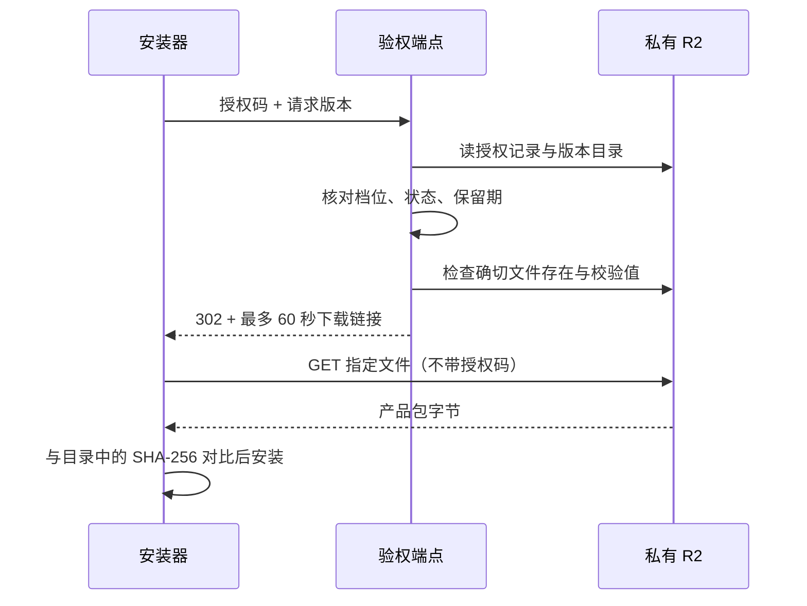
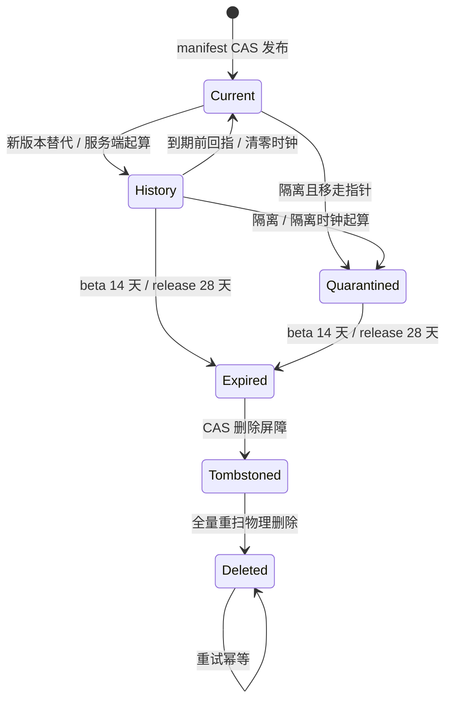

# FLY-2389 私有下载与保留期 — 实施计划
Issue: FLY-2389 (https://linear.app/geoforge3d/issue/FLY-2389/1143b2-r2-payload-托管-端点私有-bucket-验-key-薄端点entitlement-分级-presigned-get)
日期: 2026-09-09
基于: research.md

状态：待设计评审。此计划不是实现、部署或真实 E2E 成功证据。

Lead 确认收据：`6fb0c951-9ca7-4bb4-ae8b-ff7734ea14fe`（生命周期单执行器与 60 秒窗口）、`e3a8d08c-2f3e-4013-be30-74f20a791a40`（cleanup-only 定时化）、`5051dff0-8e4e-46d7-8339-4629e882a391`（B1 handler post-PUT 当前对象保护属于本单，限收尾检查）。

## 1. 给 founder 的说明

授权码决定能拿哪些产品包；端点检查后给出 60 秒有效的下载链接，由私有 R2 直接传文件。最新版本一直保留，旧版从被替换时才开始计算 14/28 天，自动清理前再核对它没有重新成为最新版。

payload 是实际产品包；manifest 是版本目录，也是内部测试版/客户正式版两条通道的唯一真相。entitlement 是授权档位，只有 `internal` 与 `customer`；presigned GET 是只允许下载一个指定文件的临时链接。沿用 B0/B1，薄壳安装命令与 manifest 返回形状不变。



最关键的取舍已获 Lead 确认（问题 `6fb0c951-9ca7-4bb4-ae8b-ff7734ea14fe`）：

- 生命周期只有 manifest 时钟 + tombstone CAS 清理一个执行器。R2 原生年龄规则只清未完成分段上传，不碰 payload/manifest/key。无需历史前缀迁移。
- 吊销 key 或隔离坏版后不再发新链接；已发链接可能在剩余 60 秒内继续开始下载，已下载字节不能召回。这是接受的边界。
- 自动化新增一个只能清理的能力；不把能签发客户授权码的 ops-admin 给计划任务。

交付给实现/QA 的五块：下载凭证、授权码单向吊销、保留期自动执行、B1 联合验收、部署与回退说明。REQ-0 保持 ship/release 独立；本单不建立新发布触发、不做计费/账号/席位/计量，不实现 B4/B5，不在设计节点部署。

## 2. 固定身份与数据模型

| 对象 | 唯一身份 / 形状 | 本次行为 |
|---|---|---|
| manifest | `manifest.json`，B0 schemaVersion=1 | 不改 schema，不再造 current/history 索引 |
| payload | `payloads/<无v版本>/<sha256>.tgz` | 一旦写入不覆盖；同 key 同字节；禁止路径来自请求自由拼接 |
| 通道 | `internal-beta` / `customer-release` | 映射只 import B0 导出；不从最大版本或 npm tag 推导 |
| 显示名称 | `toDisplayLabel(version)` | 仅 UI 用 `v`；HTTP 参数/对象/目录不带 `v` |
| key | `keys/<sha256(plaintext)>.json` | 保留 `{customerId,entitlement,revoked,createdAt,note}`，无新增授权数据库 |
| 授权档位 | `customer` / `internal` | customer 只见 release；internal 见 beta + release；latest 仍取各自指针 |
| license 明文 | `fwk_` + 32 随机字节的 hex | 只在签发成功时显示一次，不写仓库、日志或聊天 |
| 历史时钟 | active 使用 retentionSince；quarantined 使用 quarantinedAt | 服务端拥有；re-pin 清 retentionSince；再次退任重新起算 |
| 删除屏障 | manifest.tombstones 追加集合 | CAS 成功后禁止任何新引用；物理删除只从这个集合执行 |
| releaseId/sourceCommit/hash | B0/B1 不可变 tuple | B1 E2E 全链对齐，不改授权记录或版本派生 |

无需 SQL 或迁移数据库。所有新外部输入按下文边界验证；将来若引入 SQL，必须参数化，不把请求字段拼入语句。HTML 使用构建时 escaping；运行时只用 textContent/value。

## 3. 客户端点与签名合同

### 3.1 显式下载模式

`handleRequest` 新增 `delivery: { mode: 'stream' } | { mode: 'presigned', signGet }` 依赖。Worker 始终显式注入 presigned；`serve-node.mjs` 显式注入 stream；现有 test harness 显式 stream，新 presign harness 显式 presigned。未知/缺失 mode 返回固定 503，不因缺 secret 隐式降级。stream 保留本地 FsBucket 与受控回退能力，不能作为目标模式验收结果。

`signGet({objectKey, issuedAt, expiresIn}) → Promise<string>` 仅负责签一个 GET，禁止传入任意 method、endpoint、bucket 或 headers。放入新的 `src/presign.mjs`，生产用 `aws4fetch` 的 AwsClient.sign，`service=s3`、`region=auto`、`signQuery=true`。现有 stdlib/binding/依赖均无 SigV4 presigner；只新增该小型官方示例依赖并精确锁版本，不自行编写 SigV4，不加 SDK 抽象层。

配置 `FW_R2_ACCOUNT_ID` 必须为 32 位小写 hex，`FW_R2_BUCKET` 必须与 PAYLOADS 绑定 bucket 一致（此部署为 flywheel-payloads）。原部署为 default jurisdiction；构造 `https://<account>.r2.cloudflarestorage.com/<bucket>/<objectKey>`，不接受自由 URL。未来 jurisdiction 迁移另行明确 host，不悄悄回退。签名输入只取通过完整 B0 validator 的 entry.key。设置 `X-Amz-Expires` 与固定的 `X-Amz-Date`；用该库的时间参数/签名 header 完成，不自己拼签名。仅签 `host`，不签或转发 license Authorization。

### 3.2 请求顺序与截止

每个 `/manifest`、`/payload/:ver` 请求一开始记录 `requestStartedAt=now()`（所有 await 之前），每一步都使用此时间评估快照，签名有效期从这个时间的秒级向下取整值起算。这样在 auth 读取后请求卡顿，不能把吊销的存量窗口延长到重新签名时才起算。返回链接前再看当前 now，若链接已经到期则固定 503，绝不滑动续期。

1. 只从 Authorization Bearer 读取 key；拒缺失、空值、长度超过 512 字节、不可读 key record、revoked 不为 false、未知 entitlement。保持既有 key 文本兼容（不新增 fwk 格式硬门）；auth 失败统一 401 原字节。
2. 读取并完整 validateManifest；不存在或损坏均固定 503，不回显存储内容/异常/URL。损坏目录不签名。
3. `GET /manifest` 返回同一 `{latest,versions:[{ver,sha256}]}`；pointer null 的 never-activated/paused 503 语义不变。
4. `GET /payload/:ver` 安全 decode，一次解码后须满足 B0 isPayloadSemver；非法转义、编码斜杠/路径穿越、未知或不可见版本均同形 404。通过 visibleEntries 选 entry，不能按用户 URL 导出 R2 object key。
5. `visibleEntries(manifest, entitlement, nowMs)` 与 manifestView 同用：status 必须 active，档位符合；current 依据 latestSet 永不按年龄过滤；非 current 必须 `retentionSince + RETENTION_WINDOW_MS[channel] > nowMs`。到期即不可见，即使 scheduler 延迟尚未 stamp expired。所有调用方显式传注入时钟，测试不得落真实 Date.now。
6. presigned 模式 `bucket.head(entry.key)` 必须存在，size 与 customMetadata.sha256 逐字等于 entry；缺失/不匹配同形 404，不签空链接。管理端上传时写 checksum metadata 的机制保留。
7. current：TTL=60 秒；历史：TTL=`min(60, floor((截止时间 - issuedAt)/1000))`；`issuedAt=floor(requestStartedAt/1000)*1000`；<=0 时 404。在签名前和响应前检查当前时间仍小于 expiresAt，超过则 503，让下一请求重新验权。不得将亚秒精度四舍五入延长保留期。
8. 成功返回 **302**，空 body，Location 为签名 URL；`Cache-Control: private, no-store`、`Referrer-Policy: no-referrer`。manifest、所有客户错误、stream 成功也设置 no-store；不缓存 key/manifest/redirect，不用 Cache API。payload 对象上传时设置 `Cache-Control: private, no-store`，签名 GET 显式 `response-cache-control=private, no-store` 覆盖既有对象 metadata，防止旧对象被缓存。
9. 方法严格：客户 HEAD/PUT/POST、任意对象/list 请求不产生签名；仍用现有统一 404。日志只发 route template + status，不记录 Location、原始 path、key/hash、签名 query、底层异常。

只有前述快照授权发生在 revoke/quarantine 前的在途请求才可能继续产生尚未到期的链接；一个在变更提交后开始的新请求从强一致记录中被拒绝。到期检查限制“开始下载”，不是截断已开始的传输。

### 3.3 安装器与管理端兼容

原壳的标准 fetch 跟随跨 origin 302，移除 Authorization，然后验 manifest 中的 hash。保留接口与安装流程；在 `packages/onboard-shell/lib/endpoint.mjs` 将 fetch 捕获异常改成固定网络错误，防止底层异常消息带 URL/签名。R2 返回 403 时，现有壳可能映射为 key rejected 并提示更新授权码，这是兼容限制；重新执行会重新验权换 URL，不新增无界 retry。不得因对象端 403 放宽权限或绕过 hash。

B1 `/admin/payload/:ver/:sha` GET 保持 capability 认证 stream，用于 staging 回读校验。对未 commit 的 staging 不发客户链接。B1 prepare→commit 顺序、CAS/ETag、同 releaseId 重试语义保持。

## 4. license key 最小生命周期

复用现有 `scripts/release/license-key.mjs` 与 `node:crypto`，不新增 license 签名密钥。SHA-256 是存储标识而非可用授权码；保管明文仍使用私密交付渠道，设计/报告中不出现。

`PUT /admin/key/:sha` 仍只允许 ops-admin。body 仅接受 customerId 非空字符串（<=128 字符）、entitlement 枚举、revoked=false、可选 note 字符串（<=512）；未知字段拒绝；请求 JSON 上限 4 KiB，不能只相信 Content-Length，实际读取限额超出 413。预激活/paused 对应 pointer null 仍 409。

首次写使用 `onlyIf: {etagDoesNotMatch:'*'}`；createdAt 由服务端生成。已有 key 时，只有 customerId、entitlement、规范化 note 完全相同且 revoked=false，才返回原 200 **零写入**。其它情况 409；不可读旧记录不自动覆盖。条件创建竞态失败后重读一次并执行同样判断。禁止复活已 revoked key，禁止同 key 改档；需要变化就签新 key。已有 createdAt 不改。

`POST /admin/key/:sha/revoke`：已 revoked 返回 200 零写入，未知 404，不可读 409；active record 写 revoked=true，其余字段不变。PUT 不再更新已有 active record，因此并发 issue/revoke 不会重置 false；两次 revoke 都保持 true。key 无年龄清理规则、无 DELETE 路由。

CLI rotation 保持先 issue 新 key，再 revoke 旧 key；新签失败旧 key 不变，旧 revoke 失败必须非零退出并报告“新 key 已签发，旧 key 吊销未确认”，保留操作者已看到的新 key id，可用 revoke --key-id 重试，不能重新 run rotate 产生多枚新 key。异常只含操作/HTTP 状态，禁止回显服务端非受控 error/e.message。吊销成功说明“端点不再发新链接；旧链接最多剩余 60 秒”，不再承诺已经签出的 R2 GET 即时作废。

## 5. 保留期与自动清理

### 5.1 唯一时钟与执行器



保留 `RETENTION_WINDOW_MS`、`applyTransition`、`payload-cleanup.mjs` 三步协议。active 历史以 retentionSince，quarantined 以 quarantinedAt 起算；不得把 publishedAt、对象上传日、客户端提交时间用作退任时钟。到期读请求拒绝；后台物理删除在成功的后续调度中完成，不承诺到秒物理删除。re-pin 在 expire CAS 前成功则 CAS retry 必须重新判断并保留；expire 先成功则不能复活，B1/B5 选择另一有效 previous-good 或 paused。

清理每轮读取新的 manifest，并对全集 tombstones 重扫；删除失败 exit 2，不移除标记，下轮继续。时钟/非法状态由服务端判定，CLI 本地快钟不能提前删 current/历史。staging 继续复用 B1 abandoned op；cleanup 无权主动 abandon live reservation，当前 prepared/reserved 永不被时间规则误删。

### 5.2 最小 cleanup capability

新增 `cleanup`，Worker secret `FW_CLEANUP_TOKEN_SHA256`，CLI/调度输入 `FW_CLEANUP_TOKEN`。cleanup CLI 优先使用专用 token；未提供才兼容运营侧 `FW_OPS_ADMIN_TOKEN`，两者同时提供拒绝以消除操作者误判。自动 workflow 只配置前者。`capabilityOf` 读第四个 hash；若非空 capability hashes 重复，拒全部 admin auth 并返回固定配置错误，不允许 cleanup token 因重名命中更高能力。

| 操作 | cleanup | ops-admin | beta-publish/customer-release |
|---|---|---|---|
| GET /admin/manifest | 允许 | 原有允许 | 原有允许 |
| POST /admin/manifest 初始化 | **拒绝**（单独挡住当前初始分支） | 原有 | 原有 |
| POST /admin/manifest diff | 只 expire/tombstone；empty diff 可幂等 | 原有 | 原有 |
| DELETE /admin/payload/:ver/:sha | 只 tombstoned | 原有 | 拒绝 |
| key issue/revoke / payload PUT/GET | 拒绝 | 原有 key 能力 | 原有 payload 能力 |
| pointer/addVersion/reserve/prepare/commit/abandon/quarantine/ledger 修改 | 拒绝 | 原有权限不变 | 原有权限不变 |

所有 diff 仍执行 applyTransition、capabilityAllows 和完整 validator，不能给 cleanup 一个“可信直接写 manifest”通道。

### 5.3 上传收尾竞态修复

当前 post-PUT `hasLiveClaim` 忽略已提交的版本，并在 claim 消失时直接删对象。改为：在返回前读取的新 manifest 中，若 key 已 tombstoned 或既没有 reserved/prepared 引用、也没有 status!=expired 的 VersionEntry 引用，返回原 409，但**不在 PUT 收尾执行物理 delete**；交给 tombstone sweep 唯一删除器。若存在合法 active/quarantined entry，即使 op 已 committed，也保留并成功返回。tombstone 判断优先。

这既修 commit-before-PUT-response 误删 current，又避免“先读无引用、再删除时别人已重新 claim”的新竞态。失败上传的残留已有 op 可追踪；abandoned/expired 后通过既有 CAS 清理，不能增加第二个 orphan age 删法。接受暂时多占存储，不接受删除仍可下载的版本。

### 5.4 定时化与原生规则

新增 `.github/workflows/payload-cleanup.yml`：`schedule: '17 * * * *'` 每小时 + workflow_dispatch；job `if: github.ref == 'refs/heads/main' && (github.event_name == 'schedule' || github.event_name == 'workflow_dispatch')`，`environment: release`、`permissions: contents: read`、`timeout-minutes: 10`、`concurrency.group: payload-release`、`cancel-in-progress: false`。与 B1 共用单飞并依靠 CAS 保证正确性，取消/崩溃由下轮重扫恢复。

只 checkout 已审查的 main（复用 B1 的完整 SHA pin，persist-credentials:false）、setup-node 的现有完整 SHA pin，然后执行现有零依赖 cleanup CLI --apply。无 install/build、无 npm、无 Cloudflare 控制面 token、无 ops/customer-release/beta token。env 为 `FW_ENDPOINT=${{vars.FW_ENDPOINT}}` 与 `FW_CLEANUP_TOKEN=${{secrets.FW_CLEANUP_TOKEN}}`；目标 URL 必须存在且 HTTPS，缺配置非零失败（不能未激活 no-op 冒绿）。自动执行与 B2 激活一起在 GitHub release environment 配置专用 token，未配置前流程明确失败；设计不 dispatch。

GitHub 调度可延迟，不保证硬每小时 SLA。workflow 原生失败结论可见；runbook 要求运营核最近成功，超 2 小时无成功需调查并手工 dispatch 同一清理 workflow，不开第二执行器。expiry 读侧拒绝不依赖它成功。B2 不新增通知系统或发行授权链。

新增 `packages/payload-endpoint/r2-lifecycle.json` 用 Cloudflare REST lifecycle shape：一个 enabled rule，id=`abort-incomplete-multipart-7d`，conditions.prefix 空串，仅 `abortMultipartUploadsTransition.condition={type:'Age',maxAge:604800}`；无 deleteObjectsTransition、无 storageClassTransition。activation infra 用锁定 wrangler `r2 bucket lifecycle set` 应用并读回。原生 multipart 清理绝不代表本单 payload 历史清理验收，fixture 必须分别验两条线。

## 6. Secret custody、私有存储与激活

| 名称 | 由哪里注入 / 到哪里 | 权限与日志 |
|---|---|---|
| `CLOUDFLARE_API_TOKEN` | 已有 GitHub environment release → activation infra step env | 只部署/配置，不进入 Worker 或客户 workflow |
| `FW_R2_ACCESS_KEY_ID`、`FW_R2_SECRET_ACCESS_KEY` | GitHub environment release → activation infra stdin → 同名 Worker secret | bucket 限定 Object Read only；不使用控制面 token 来签 GET；不传 argv、不 echo |
| `FW_R2_ACCOUNT_ID`、`FW_R2_BUCKET` | activation 从已有 account variable / wrangler binding 生成 Worker 普通配置 | 身份不是 secret；两处 bucket 必须机器断言一致，禁止用户自由传 host |
| `FW_CLEANUP_TOKEN` | GitHub environment release → cleanup job env；activation infra 仅派生 hash | 至少 32 随机字节；禁止写入 Worker 明文 |
| `FW_CLEANUP_TOKEN_SHA256` | activation infra 将上述 hash 经 stdin 写 Worker secret | 与现有三 capability hash 同形；禁空值/重复 hash |
| `FW_OPS_ADMIN_TOKEN` | 既有运营进程 env → license CLI Authorization | 不新增 GitHub workflow custody、不读默认磁盘 secret 文件 |
| license key | CLI 随机生成 → 操作者私密交付；客户现有 0600 .env | 端点只存 hash key record；不新建 license signing key / keychain |

本节点未读取以上真实值，也不代行 token 签发。实现阶段只修改受审配置路径；真实激活由既有授权的 activation infra 工作流执行。保持 B1 main + environment release + ACTIVATE 的执行条件；合并不等于部署，不经常驻 Bridge/updater 发 payload。Flywheel 自托管部署仍由独立 updater 执行其窗口，不调用 restart-services。

activation infra 必须先校验所需 signer/cleanup secrets 非空、配置匹配，再部署目标 Worker。失败禁止宣布激活成功。凭据以 `wrangler secret put` stdin 注入，关闭 shell xtrace；任何失败日志只写操作名和状态，不 dump CF response/request 或 process.env。将现有 worker/wrangler “founder 手工部署”旧注释更新为 B1 的环境托管执行姿态。

私有前置需要可审计证据：bucket 公共 r2.dev 禁用、无已启用 public custom domain、无公开缓存路径、R2 原生规则与受审 JSON 相符。activation infra 在部署前读取检查，发现公开入口/危险删除规则 fail closed；不在本单自动删除未知外部配置。授权运营先处理现有公开配置，再重跑同一激活。审计只打印布尔状态/规则 id，不打印签名链接或 key 记录。

新部署预置 secrets/私有配置后再把 Worker 切为 presigned。manifest 与对象零搬迁；不以重新上传更新 Cache-Control（由签名 response override 兼容旧对象），保留同 tuple immutable。回退为受审旧 Worker stream 版本可恢复下载，原 bucket、manifest、key、tombstones 不回滚；cleanup 工作流可以停调度，已删除对象不能凭代码回退恢复。临时链接泄漏可等 60 秒；若 signer secret 泄漏，吊销 R2 credential 并重注入新对，停止签发期间返回 503，不把 bucket 改公开。

## 7. 实施切片（红 → 最小修复 → 绿 → commit）

每片先写下列明确反例并跑到预期红，再改最少代码；不复制本计划成实现框架。文件彼此有依赖，按顺序做，测试记录写入本目录 implementation/QA 对应文档时仍遵从当时 DOC-FLOW。

| 片 | 精确文件 | 行为与红测试 |
|---|---|---|
| C1 当前对象与授权码保护 | `packages/payload-endpoint/src/handler.mjs`; `__tests__/lifecycle.test.mjs`; `__tests__/handler-admin.test.mjs`; `scripts/release/license-key.mjs`; `scripts/__tests__/payload-key-cleanup.test.sh` | 注入 PUT 写后 commit，旧实现误删；issue 覆盖 revoked、改 entitlement、并发创建/revoke；先锁红再按 §4/§5.3 修复 |
| C2 可见集与真实签名 | `src/views.mjs`; `src/handler.mjs`; 新 `src/presign.mjs`; `package.json`; `pnpm-lock.yaml`; `src/worker.mjs`; `src/serve-node.mjs`; `__tests__/harness.mjs`; 新 `__tests__/presign.test.mjs`; `__tests__/handler-customer.test.mjs` | presigned 302、鉴权先于签名、current/截止/缺配置；使用 aws4fetch 真实 signer 的固定时间输出，mock 仅放对象传输 |
| C3 安装器字节链 | `packages/onboard-shell/lib/endpoint.mjs`; 新 `packages/payload-endpoint/__tests__/presigned-download.test.mjs`; `scripts/__tests__/customer-e2e-acceptance.test.sh` | 两个真实 loopback HTTP origin，调用真实 downloadPayload，302 后 Authorization 不到对象端，hash 对/错，网络错误脱敏；保留原 stream E2E |
| C4 最小清理能力 | `src/handler.mjs`; `src/transitions.mjs`; `src/worker.mjs`; `src/serve-node.mjs`; `__tests__/harness.mjs`; 新 `__tests__/cleanup-capability.test.mjs`; `scripts/release/payload-cleanup.mjs`; `scripts/__tests__/payload-key-cleanup.test.sh` | cleanup 只 expire/tombstone/delete；初始化、keys、upload/readback、pointer、abandon、ledger、quarantine 均拒，重复 hash 拒，ops 手动兼容 |
| C5 自动运行与配置 | 新 `.github/workflows/payload-cleanup.yml`; 新 `packages/payload-endpoint/r2-lifecycle.json`; `wrangler.toml`; `.github/workflows/payload-activation.yml`; `scripts/__tests__/release-workflows-structure.test.sh`; `.github/workflows/ci.yml` | parsed-YAML/JSON 测 main/environment/cron/concurrency/secret/steps 及突变；secret bulk 不出现在 publish；无危险 native TTL；私有性 fail closed |
| C6 合同同步/验收 | `packages/release-contract/CONTRACT.md` 新 Amendment B2; `doc/engineer/implementation/fly-1062-payload-release-runbook.md`; 新本目录 `acceptance.md` | 同步 read-time 历史过滤、60 秒链接、第四 capability、定时化替代手动暂缓、密钥不覆盖；列真实 R2 联合 E2E 证据字段，不写尚未执行的 PASS |

C3 的 HTTP 对象夹具收到任何 Authorization/Cookie 都直接失败；不能靠 Fetch mock 证明头移除。Node/FsBucket stream 保留，presigned 模式没有 signer 的 harness 必须显式报错，不能给测试兜底 stream。

## 8. 验收矩阵与命令

### 8.1 确定性夹具（必须进入 CI）

| ID | 输入 / 交错 | 必须观察到的结果 |
|---|---|---|
| P1 | customer key 请求 active clean；internal key 请求 beta | 302；真实签名只 GET 对应 immutable key，X-Amz-Expires<=60；最终字节 hash 等于 manifest |
| P2 | customer 请求 beta；双方请求 unknown/quarantined/expired；无效/revoked key | 不调用 signer；隐藏版本同字节 404；key 错同字节 401；响应无敏感内容 |
| P3 | 签后改 key/path/query/method/list/bucket，或超过 expiresAt | 签名验证/真实 R2 拒绝；测试不得只是判断 query 字段存在 |
| P4 | 模拟签前卡顿超过 60 秒、签后时钟超过 expiresAt；历史只剩 20 秒 | 不发过期 URL；20 秒上限不会越过历史截止；requestStartedAt 不滑动 |
| P5 | signer missing、head 缺失/hash/size 错、manifest 损坏、encoded traversal | 固定 503/404；不降级 stream，不签 staging，日志不含 key/query/Location |
| P6 | 发出 URL 后 revoke/quarantine；再请求新 URL；旧 URL 过 60 秒 | 新授权立即拒绝；旧凭证窗口如 §3，过期拒绝；不声称召回已开始传输 |
| K1 | 同 key 重放、不同档位重放、revoke 后 issue、并发 PUT 与 revoke | 只首次创建写；同 tuple 无写 200；变档/复活 409；revoked 永不变 false |
| K2 | rotation 新 issue 失败 / 旧 revoke 失败 / 全成功 | 旧 key 保留 / 非零且记录新 key id 供单独 revoke / 新有效旧拒；零密钥日志 |
| L1 | current beta/clean 静置 365 天 | 原生规则不选完整对象；read/expire/sweep 都不删 current，manifest/key 仍在 |
| L2 | supersede 两档，边界 T+14d/28d 的前 1ms、等于、后 1ms | 前保留；到期新下载拒，服务端允许 expire→tombstone→delete；老 publishedAt 不提前删 |
| L3 | A→B→回指 A→C；quarantine 的服务端时间；客户端伪造时间 | A 再次 current 时永不过期；C 后新窗口；quarantine 按隔离时钟；伪造不改截止 |
| L4 | expire CAS 与 re-pin 竞争；tombstone 与新 claim 竞争；DELETE 失败重启 | 各只有合法赢家；无 dangling pointer；失败保留标记，下轮重放成功 |
| L5 | PUT 存字节后、返回前 commit；或 abandon/tombstone；无引用后再 claim | current 字节不删；PUT 不直接删除；最终只 tombstone DELETE 可删 |
| A1 | cleanup token 尝试所有权限矩阵行；缺/重复 hash | 只有明确许可成功；初始 manifest 路径不能绕权限；未配置失败不冒绿 |
| A2 | workflow/JSON 突变：删 main/env guard、添 ops/signer secret、取消正在清理、加原生完整对象 TTL | 结构检查失败；正常配置正控通过 |
| E1 | B1 reserve→upload→readback hash→prepared→commit→customer 302→壳校验 | 同一 version/sourceCommit/hash/对象；CAS 失败旧 pointer 可下载；staging 不可见 |

C2 presign unit 使用固定虚构凭据与时间，并用独立已知 SigV4 测试向量验证生成结果；不能用同一 signGet 作为自证 verifier。P3 的真正 R2 拒绝由下节独立 QA 补足，本地 HTTP 双 origin 只证明客户端 redirect/header/hash 合同。

实现后执行（本节点仅已跑 research 中 28 个基线）：

```sh
node --test packages/payload-endpoint/__tests__/*.test.mjs
bash packages/payload-endpoint/__tests__/contract-consistency.test.sh
bash scripts/__tests__/payload-key-cleanup.test.sh
bash scripts/__tests__/payload-release-pipeline.test.sh
bash scripts/__tests__/customer-e2e-acceptance.test.sh
bash scripts/__tests__/release-workflows-structure.test.sh
node --test packages/release-contract/__tests__/*.test.mjs
pnpm exec wrangler deploy --dry-run --outdir /tmp/fly2389-worker --config packages/payload-endpoint/wrangler.toml
```

现有 CI endpoint glob 覆盖新增 `.test.mjs`；B1 脚本测试继续在 payload-distribution job。新增 workflow/lifecycle 检查加入已有结构 suite，Worker bundle 验 aws4fetch 与 contract 被打包且无 secret 值。不能以根 pnpm test 代替这些精准检查。

### 8.2 B1+B2 联合真实 R2 证据（激活前强制）

由独立 QA 在授权的隔离 Worker/private bucket 上执行，与生产发布门分离。无授权凭据时保持“真实 E2E 未执行”，不写 PASS，不把生产 current 换测试版本。

1. 记录被测代码 SHA、Worker 部署 id、隔离 bucket 身份、私有性/原生规则读回、signer Object Read only 作用域（只存脱敏证据）。
2. 使用真实 B1 发布脚本/包构建，beta 发布并 clean prepare→commit；记录 releaseId、version、sourceCommit、SHA-256、size、manifest ETag 和 CAS 结果；失败提交保持旧指针可读。
3. 用运营接口签一枚 internal 与 customer 测试 key，实际取 manifest/302；customer 下载 clean、internal 下载 beta 均成功且 hash 一致；customer beta、无 key、改签名/对象/method、过期 URL 均拒。signed URL 与 key 不进保存的 HTTP trace，只记 route、状态、断言布尔和 hash。
4. 签后 revoke 测试 key/隔离测试版本：新链接拒，旧链接最长 60 秒后拒；确认 raw R2 无签名 URL 拒绝、公开 r2.dev/custom domain 无绕行。
5. 正常旧壳或 B2 的薄壳通过同 endpoint 获得同字节；零仓库访问、零源码暴露的原 B1 安全门继续通过。没有发布到 npm 的新壳时用本地 packed shell，明确不能据此宣称 npm 发布已完成。
6. 14/28 天语义用注入服务端时钟夹具 L1–L5，不修改生产时钟或伪造 production timestamp；隔离真 R2 验 guarded DELETE/失败重扫与 native config 读回。运行一次 cleanup workflow，保存明确成功/失败结论与无 current 删除断言。最后按隔离资源清理契约吊销测试 key/token，删除仅此测试拥有的资源。

验收文件逐条写证据链接/摘要、实际输出和未执行项。B1 旧 FsBucket E2E 不能代替这一真实 R2 签名链；本设计批准不代表其已通过。

## 9. 合同修订、回退与完成条件

在 CONTRACT.md 署名 Amendment B2，明确替代原“active 全部可见”中历史到期延迟、payload 恒 stream、三个 capability 表、key 可更新行为；不改 JSON Schema/version/key。清理运行说明替换 runbook 的“未定时”一句，保留 ops-admin 运营 custody。精确列出消费者 sweep：Worker、Node、harness、shell、B1 admin readback、cleanup CLI、key CLI、activation、CI 结构检查均如 §7。

上线顺序：实现测试绿 → 独立 QA 隔离 B1+B2 E2E → 既有授权的 infra 部署配置/Worker → 正式 smoke → 自动清理已成功的证据；B4/B5 仍按 PRD 后续激活序。此顺序没有 merge、ship 或 release 新授权含义。

回退只回退程序/调度；不回退 schema1 manifest，不删除 tombstone、不恢复已吊销 key、不回写旧 pointer 伪装发布。旧版 stream 可以工作但不满足 B2 presign 目标，恢复后必须复验；若回退会恢复 key 覆盖或 PUT 误删 bug，使用保留 C1 安全修复的回退构建，禁止原样恢复带已知破坏性 bug 的 handler。

设计节点完成条件：exploration/research/plan + diagram-first HTML 均提交推送；request-review 的有效 verdict APPROVED；HTML 本地渲染/交互校验，publish-only 后托管 CSP 验证与 DESIGN-HTML 报告；更新 progress、写允许的角色学习记录，再执行 phase_design_complete 并 park。实现代码、真实 E2E、生产激活不属于此节点完成证明。

本地渲染限制：download.mmd / retention.mmd 各按标准 mmdc flags 尝试两次，均被 Chromium `bootstrap_check_in ... Permission denied` 拒绝；按任务 h 使用 `DIAGRAM PENDING LOCAL RENDER` 明示占位，保留 Mermaid 源码，无远端渲染或假 SVG。浏览器预览工具也因 approval policy=never 被拒，不能宣称完成视觉截图 QA；交互用静态结构及 Node DOM 模拟验证，托管后另验 CSP/nonce 与 HTTP，不把它们称作真实浏览器验证。
