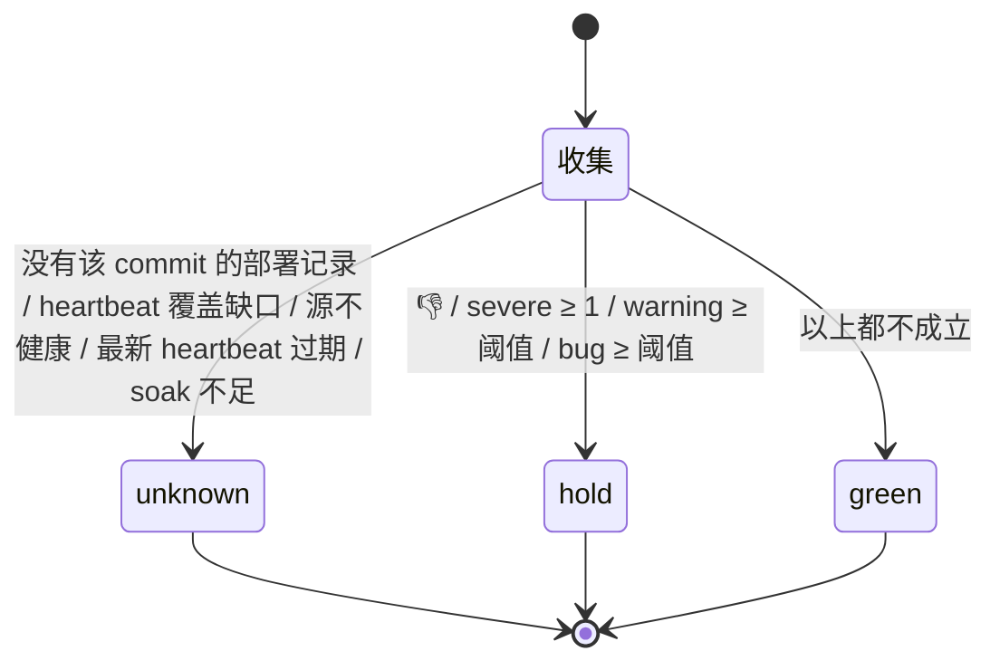

# FLY-2390 判据 c 聚合 — 探索
Issue: FLY-2390 (https://linear.app/geoforge3d/issue/FLY-2390/1143b3-判据-c-聚合消费-fly-942-原始事件-版本归因-watchdog-heartbeat源健康-报-bug-打版本-tag)
日期: 2026-09-10
基于: 无

> **一句话**:把「这个版本在我们自己机器上跑得健不健康」变成一个可查理由的三态信号 `green / hold / unknown`,给 B4 的否决窗口和每日日报用。所有客观信号缺席、过期、或观察者自己不健康时**一律 `unknown`**(fail-closed),绝不把「没看见事」当成「没事」。

---

## 0. 任务边界(只引 PRD 1098 §4 / §4.1 / §14 B3)

| 要做 | 不做(归谁) |
|---|---|
| 消费现存原始告警事件,**新增版本归因** | 重造 bug 检测 / 健康监控(PRD §1.4) |
| **新增** watchdog 自身 heartbeat / 数据源健康 | 否决窗口、送达回执、决策账本(B4) |
| 报 bug 时自动打「当前运行版本」tag,按版本聚合「这版 N 个」 | Bridge 按项目分频(B6);本单只**消费**§3 两档节奏,不实现 |
| Annie 当天可选 👍/👎(负向 veto) | 任何真实发布动作、manifest 写入(B1/B4) |
| 产出 `green / hold / unknown` + 理由可查 | 客户端更新器 / quarantine(B5) |
| 新的版本健康聚合日报 | 计费、多产品 |

验收(issue 原文):回放的 FLY-942 事件 + 注入的 heartbeat 缺失 / 版本 tag 各一组,聚合器输出三态各一例且理由可查;日报生成一份。

---

## 1. 现状审计(全部实核,2026-09-10)

### 1.1 「FLY-942 原始事件」今天是什么

**FLY-942 的探测器装配已被物理拆除**(FLY-1570 `e8f99d0ea` → FLY-1560 `830b0e7db`)。守卫测试 `packages/teamlead/src/bridge/__tests__/fly1560-teardown-guard.test.ts:18-70` 断言 `StuckWatcher.ts`、`watchdog-judge.ts`、`detection-escalation.ts` 等文件**不得存在**,`plugin.ts` 不得再出现 `upsertDetectionEscalation` 等符号。生产库 `detection_escalations` 只剩 16 行,最后一行 2026-08-03。

**今天仍在产出的原始事件面**(生产 `~/.flywheel/teamlead.db` 只读实核):

| 面 | 行数 / 新鲜度 | 内容 | 有没有版本 / 严重度 |
|---|---|---|---|
| `alert_threads`(FLY-927 工单账本,`StateStore.ts:6179`) | 746 行,最新 2026-09-11 01:04 | 只收 `route_class = ticket` 的告警;30 天内 13 种 kind,`workflow_engine_escalation` 282 条占大头 | **无版本、无严重度列** |
| `lead_events`(投递日志,`StateStore.ts:5769`) | 73,443 行 | 每个 Lead 收件人一行;`payload` JSON 含 `eventId / eventType / severity` | 有 severity(实核 `bridge_abnormal_exit` 66/66、`mailbox_dead_letter` 481/481 都带);**无版本** |
| `alert_mailbox_ledger`(FLY-2386) | — | 告警投递归属账本 | 无版本、无严重度 |
| shell 路径 `scripts/lead-alert.sh`(`deploy_failed / deploy_degraded / bridge_wrapper_fail / restart_storm_hold` 等 shell-only kind) | 直接 POST Discord,只在失败时落队列文件由 Bridge 60 s drain(`plugin.ts:13359`) | 更新器 / 重启失败 —— **对「这版坏了」最强的信号** | Bridge 侧**根本看不到成功发出的那条**(`plugin.ts:11365-11369` 明说 Bridge 与 shell 是竞速关系) |

**唯一的进程内咽喉**:`LeadAlertNotifier.alert(payload: AlertPayload)`(`packages/teamlead/src/LeadAlertNotifier.ts:928`)。`AlertPayload` 字段:`leadId / projectName / eventId / eventType / title / body / severity / sessionKey? / metadata? / ticket? / episodeId? / sourceFingerprint?`。100 种 `ALERT_EVENT_TYPES`(`:70-371`),`INFORMATIONAL_KINDS` 10 种(`:374`)。严重度是**每次发出时由发出方决定**的,不是 kind 固有属性。

### 1.2 版本身份:本机跑的到底是哪个版本

| 事实 | 出处 |
|---|---|
| `doc/VERSION` = `v1.56.0`(base,不带 -beta) | B0 合同 §1.1;`normalizeVersionFile` 在 `packages/release-contract/src/grammar.mjs:65` |
| Bridge 自报身份 `{buildMode: "built", buildSha, artifactBuildSha}` 于 `/health` | `bridge/build-identity.ts:11 resolveBridgeBuildIdentity()`;`plugin.ts:2340-2343`;实核 `d964e9fc…` |
| 更新器把 `origin/main` 部署到本机,写 `~/.flywheel/deployed-sha`,并按合并范围**逐 commit** 写 `deployment_events`(`source = fallback-git-log`,`deployed_sha` = 批次头,`deploy_batch_id` = 同值) | `scripts/update-flywheel.sh:21,231,639-652`;`scripts/restart-services.sh:100-135 record_deployed_range` |
| 生产 `deployment_events`:376 行,全部 `fallback-git-log / production`,最新 2026-09-11 00:52 | 只读实核 |
| **beta 线已活**:`payload-beta-release.yml` 每 6 h 从 main HEAD 铸 `X.Y.Z-beta.N`,`releaseId = beta-<sourceCommit>`;最近一次 `1.56.0-beta.4`(sourceCommit `92532e22…`,sha256 `0815cb69…`),2026-09-11 00:40 COMMITTED | `gh run view` 日志实核;B1 PR #1135 修活 |
| **Bridge 没有 payload endpoint 的任何配置**(`FW_ENDPOINT` 只在 GitHub vars/secrets 里;`packages/teamlead` 零引用) | grep 实核 |
| **本机部署的 commit ≠ beta 的 sourceCommit**:更新器 00:00/12:00 部署 `d964e9fc`,beta 00:40 铸自 `92532e22`。两条线各走各的(PRD §3.1 "发版与拉取更新是两条 detached 线") | 同上 |

⇒ **关键设计张力**:PRD 要「按 beta version/deployment 归因」,但本机从来不"装 beta payload",本机跑的是更新器部署的 main commit。**能诚实归因的身份只有 `sourceCommit`(40 hex)+ base version**;beta 号只是同一 `sourceCommit` 在 manifest 里的展示标签,而且未必存在(见 §4 Q1)。

### 1.3 报 bug 入口

- 没有专门的「报 bug」命令。程序化的**唯一咽喉**是 `POST /api/linear/create-issue`(`plugin.ts:3742` 挂载,`:3996` 创建;`:4004-4020` 把 label 名解析为 id,并合并项目 scope label)。调用方:`flywheel-comm dependency`、gemini-agent tool、runner-patrol 规则里的 curl 示例。
- 绕过 Bridge 的:两个 scheduler 脚本直用 Linear SDK;founder 自己的 `/create-issue` 用 Linear MCP(`~/.claude/commands/create-issue.md`,明文「只用已存在的 label,不建新 label」)。
- 生产 `projects.json` 六项目的 `linear` 绑定全 null(memory:FLY-2140 Epic 页面从未通电)⇒ **Bridge 侧「读 Linear 数个数」的路径不能当真相**。

### 1.4 Annie 👍/👎

- Bridge 没有 discord.js,**没有任何 reaction 事件监听**;founder 反应是 GatePoller 用 REST 轮询特定消息(`gate-poller.ts:2963-3050`,`GET /channels/{cid}/messages/{mid}/reactions/{emoji}?limit=100`,每 question 每 tick 一次)。
- 现有 approval-signal 只认 ✅(`approval-signal/reaction-approval-source.ts:11` "✅ only — 🆒 is not used (Annie)"),founder 身份 = `deriveCanonicalFounderId(DISCORD_OWNER_USER_ID, …)` fail-closed。
- 没有 👍/👎 的持久化。

### 1.5 日报

| 单元 | 状态 | 说明 |
|---|---|---|
| `com.flywheel.daily-digest`(FLY-727 完成日报) | **hold / pending-founder-optin**(`scripts/launchd/units.manifest`);本机 `launchctl list` 无此项 | 渲染路由 `/api/digest/render` 只在 `FLYWHEEL_DIGEST_CHANNEL` 设置时挂(`plugin.ts:4798`;本机 env 有该 key)。从未真跑过(`product/doc/FLY-1343.../research.md:80-84`) |
| `com.flywheel.daily-standup`(GEO-288) | **loaded**,3:00 PT | `StandupService` 自己 REST 发 Discord 到 `STANDUP_CHANNEL`;内容 = 系统状态 + 完成项 |
| `publish-report`(flywheel-comm) | 在用 | `POST /api/reports/publish` 托管 → 截图 → `POST /api/reports/deliver` 发一条 Discord(返回 messageId;`--publish-only` 时 messageId=null) |

### 1.6 必须遵守的仓库惯例

- **零新 timer**:FLY-1560 之后周期性工作一律做成 `GatePoller` rider(`gate-poller.ts:136-175` 的 `onXxxTick?` 回调,60 s 档 `riderDueThisTick`),single-flight、逐段 try/catch。
- **FLY-1560 守卫**:不得复活 `watchdog` 家族的文件名 / 符号名;`/health` 的 `liveness` 契约被 `packages/config/src/feature-flags/truth.ts:1073-1197` 锁死(w1 required、无 kill switch)。新组件**不进** `/health`。
- **FLY-2006 retention 消费者门**:读 `alert_threads / deployment_events / lead_events / detection_escalations / session_events` 的新代码必须在 `scripts/fly-2006-retention-consumer-gate.config.json` 登记 disposition,否则 `fly-2006-retention-consumer-gate.test.mjs` 红。
- StateStore 建表走 `CREATE TABLE IF NOT EXISTS` + 幂等 `ALTER TABLE ADD COLUMN`(FLY-267 先例),迁移记 `state_store_migration`。
- 路由挂载:`/api/*` 用 `tokenAuthMiddleware(config.apiToken, …)`(与 digest 同款,`plugin.ts:4806-4815`)。
- 外部输入(HTTP body、shell 回执文件、Discord 反应)在边界校验;所有 SQL 参数化。

---

## 2. 三个信号 —— 来源方案与取舍

### 2.1 信号 A:崩溃 / 卡死 / 报警数(消费现有原始事件 + 新增版本归因)

**候选**

| 方案 | 做法 | 优 | 劣 |
|---|---|---|---|
| A1 事后按时间 join | 评估时扫 `lead_events`(payload.severity)/`alert_threads`,按 `deployment_events` 时间线把每条事件落到当时的 `deployed_sha` | 零写路径 | ① 事件 ts 与部署 ts 在重启窗口内交叉,归因模糊;② `lead_events` 是**投递**日志,同一告警多个 Lead 收件人 = 多行,要按 `eventId` 去重;③ 只有 `alert()` 路径的 kind,shell-only kind 缺席;④ 受 FLY-2006 保留期裁剪,历史回算不稳 |
| **A2 发出时盖章(选)** | 在 `LeadAlertNotifier.alert()` 入口加一个**旁路 tap**:每个 payload 以 `eventId` 为主键写一行 `release_signal_events {event_id, kind, severity, project, observed_at, base_version, source_commit, build_mode, origin='bridge'}`,版本取当刻 `resolveBridgeBuildIdentity()` + `normalizeVersionFile(doc/VERSION)` | 归因在**事件发生那一刻**由跑着的进程自证,不靠时间猜;去重天然(eventId);与 alert_threads/lead_events 不互相镜像语义,只是一张**投影**(只存身份 + 严重度 + 版本) | 部署 B3 之前的历史事件没有版本 ⇒ 评估窗口只从 B3 自己的第一条 heartbeat 起算(fail-closed,正是我们要的) |
| A2' shell-only kind 补口 | `scripts/lead-alert.sh` **无论 Discord 发没发成功**都追加一行 JSONL 回执到 `~/.flywheel/state/release-signals/<date>.jsonl`(`origin='shell'`,含 `deployed-sha`);Bridge rider 每 60 s 幂等吸收进同一张表 | `deploy_failed / deploy_degraded / bridge_wrapper_fail` 这些「这版坏了」的最强信号进得来 | 多一个文件面;回执文件由 rider 校验(kind ∈ 白名单、sha 40hex、时间 ISO)后才入表 |

**哪些 kind 算「这版的健康」?** 100 种 kind 里大多数是 runner / workflow 过程事件(`workflow_engine_escalation` 30 天 282 条),不是 flywheel 产品自身的崩溃。**不维护平行 allowlist**(FLY-2386 教训),改用两条已有维度:
- `severity`(发出方定):`severe` 计入「崩/报警」;`warning` 计入阈值计数;`info` 与 `INFORMATIONAL_KINDS` 不计。
- `projectName`:只算 `flywheel` 与 `machine`(`FLEET_ALERT_PROJECT`,`LeadAlertNotifier.ts:639`)—— GeoForge3D / growth 项目的告警与 flywheel 版本无关(PRD §1.2:对外只有 flywheel 一个产品)。
- 在此之上允许一个**排除**名单(env `FLYWHEEL_READINESS_IGNORE_KINDS`,默认空),用于把已知噪音 kind 摘掉,变更走 flag 变更日志而不是改代码。

### 2.2 信号 A 的另一半:watchdog 自身 heartbeat / 源健康(新增)

「零事件」≠「健康」。要能区分「没事」和「观察者死了」:

- **coverage heartbeat**:GatePoller 60 s rider 每 tick 写一行 `release_signal_heartbeat {observed_at, source_commit, base_version, bridge_w1_freshness, alert_delivery_enabled, shell_spool_ok}`(按分钟 upsert,避免无界增长;保留 N 天由 FLY-2006 登记)。
- 评估时对目标 `sourceCommit` 的部署窗口(`deployment_events` 里该 `deployed_sha` 的最早 `deployed_at` → 下一批次 `deployed_at` 或 now)做**覆盖率**:窗口内相邻 heartbeat 间隔 > 容忍值(默认 10 min)累计缺口 > 阈值(默认 30 min)⇒ `unknown: heartbeat_gap`。
- 源健康:最新 heartbeat 里 `bridge_w1_freshness != 'fresh'` 或 `alert_delivery_enabled=false`(告警系统被禁用 = 事件根本发不出)⇒ `unknown: source_unhealthy`。外部旁证:`~/.flywheel/state/bridge-liveness-probe.json`(launchd 每 60 s 探 `/health`,`down.lastOkTs`)作为**第二来源**,两者矛盾以更保守者为准。
- 「注入 heartbeat 缺失」的验收 = 删掉 / 跳过窗口内一段 heartbeat 行 → 必须得到 `unknown`。

### 2.3 信号 B:这版收到几个 bug(报 bug 打版本 tag)

| 方案 | 取舍 |
|---|---|
| B1 Linear label `version:<x>` | label 必须预先存在(team-scoped,`/create-issue` 明文不建新 label);每个 commit 一个 label 不可行;Bridge 读 Linear 绑定全 null,**数不出来** |
| **B2 咽喉盖章 + 本地账本(选)** | `POST /api/linear/create-issue` 里:请求带 `bug: true`(或 labels 含配置的 bug label 名,默认 `Bug`)时,在 description 末尾追加一段机器可读页脚 `Reported-on-version: 1.56.0 @ <sourceCommit>`(**人看 / Linear 搜索用**),Linear 创建成功后写一行 `release_bug_reports {issue_identifier, base_version, source_commit, reported_at, reporter}`(**聚合真相**)。账本写失败 → 记 warn + `MetaAlertNotifier`,不回滚 Linear 创建 |
| B2' 手工补登 | founder 经 MCP 直报的 bug 不经过咽喉。提供 `flywheel-comm release-bug-tag --issue FLY-xxxx [--commit <sha>]`(默认当前 deployed-sha)补一行;同时把「/create-issue 命令加页脚」列为**部署前置项**,不在本仓 |

「这版 N 个」= 按 `source_commit` 计数;日报同时按 `base_version` 汇总(展示)。

### 2.4 信号 C:Annie 👍/👎(可选负向 veto)

- **锚点** = 当天日报在 Discord 的那条消息(`publish-report deliver` 返回 `messageId`)。日报脚本把 `{day, channelId, messageId, subject}` 回写 `POST /api/release-readiness/report-binding`。
- **采集** = GatePoller rider(与 ship-approval 反应同款 REST fetcher,每 tick 只查最近 2 天的绑定消息,每条消息每 tick 两个 GET:👍、👎),只认 `deriveCanonicalFounderId` 的用户;写 `release_founder_verdicts {day, subject_commit, sentiment, message_id, observed_at}`(同天同消息幂等;👍 与 👎 同时在 → 取 👎,fail-closed)。
- **语义**(PRD §4.1):👎 ⇒ `hold`;👍 ⇒ 不改判(客观信号说了算);没标 ⇒ 不阻塞。
- 备选(拒):要求 Annie 用命令 / 按钮 —— 违背 PRD「减 human-in-loop、只在想拦时出手」。

### 2.5 聚合与输出

- **subject**(被评估对象)= `{baseVersion, sourceCommit}`;展示标签 `v1.56.0 @ d964e9f`。beta 号**不是**输入:B4 拿着候选 `BetaCandidate.sourceCommit` 来问,B3 不需要 manifest、不需要 endpoint token。
- `evaluate(subject, now, policy) → { state, reasons[], evidence }`,纯函数,所有 IO 注入(与 `digest-service.ts:127` 的纯聚合同款),便于回放测试。
- 每次评估 append 一行 `release_readiness_verdicts {verdict_id, subject_commit, base_version, state, reasons_json, evidence_json, evaluated_at, policy_json}`;`GET /api/release-readiness/verdict?commit=<sha>` 返回**新鲜评估**(当场算)并落账;日报读账本 + 当场算。
- 三态判定(fail-closed 顺序:先判 unknown,再判 hold,最后才 green):

默认阈值(**工程建议,产品拍**,PRD §13-7;全部 env 可配并写进 verdict 的 `policy_json`):soak ≥ 12 h;heartbeat 新鲜 ≤ 10 min;覆盖缺口容忍 ≤ 30 min;`severe ≥ 1 → hold`;`warning ≥ 5 → hold`;`bug ≥ 1 → hold`。

### 2.6 日报

- 渲染:`POST /api/release-readiness/report/render {day?}` → HTML(与 digest 同款只渲染不写文件),内容:当前跑的 subject、三态 + 理由、事件按 kind/severity 表、bug 列表(可点 Linear)、heartbeat 覆盖时间轴、昨天的 👍/👎。
- 投递:新 launchd 单元 `com.flywheel.release-readiness-report`(policy `copy`,每天早上,时点与 B4 否决窗口对齐留给 B4/产品)→ 脚本 = 复用 `daily-digest.sh` 的锁与 env 处理 → `publish-report --kind release-readiness` → 回写 report-binding。**不**改 `daily-standup`(它是另一件事)。
- 日报**只展示健康**,不问发布(PRD §5.2「日常日报不每天问发布」);否决窗口消息是 B4 的。

---

## 3. 关键取舍一览

| 决定 | 选 | 弃 | 为什么 |
|---|---|---|---|
| 版本归因方式 | 发出时盖章(A2) | 事后时间 join(A1) | 重启窗口内时间 join 天生模糊;盖章由跑着的进程自证 |
| 身份 | `sourceCommit` + base | beta semver | 本机从不装 beta payload;beta 号只是同 commit 的展示标签,且可能不存在 |
| 计数维度 | severity + project | kind allowlist | 平行 allowlist 会漂(FLY-2386);排除名单走 flag 变更日志 |
| bug 计数真相 | 本地账本 | 读 Linear | 生产 Linear 绑定全 null;账本与页脚同一咽喉同一事务顺序 |
| 👍/👎 采集 | REST 轮询日报消息 | 事件监听 / 命令 | 仓库没有 discord.js;命令违背减 human-in-loop |
| 周期任务 | GatePoller rider | 新 setInterval | FLY-1560 零新 timer 惯例 |
| 观察者健康 | 自己的 heartbeat 表 | 挂进 `/health.liveness` | `/health` 契约被 truth.ts 锁死;不碰 |
| 未知 = 保守 | 先判 unknown 再判 hold 再 green | 缺数据默认 green | PRD §4.1 / Codex R1#1 fail-closed |

---

## 4. 需要 Lead / 产品拍板的问题(非阻塞,已 ask;默认值按下表继续)

| # | 问题 | 默认(本探索采用) |
|---|---|---|
| Q1 | 本机部署 commit(更新器)与 beta `sourceCommit`(6 h 铸版)通常**不相等**。B3 只对**真跑过**的 commit 给 green;B4 问一个本机没跑过的 beta ⇒ `unknown: no_deployment_evidence`。这会让 auto-ship 很少拿到 green,除非更新器与 beta 线对齐(另开 issue)。B3 是否按此 fail-closed 出货? | **是**;对齐问题另立 issue,不在 B3 |
| Q2 | 阈值默认:soak 12 h / severe≥1 / warning≥5 / bug≥1 → hold;heartbeat 新鲜 10 min、缺口容忍 30 min。产品是否先按这组出货(全部可配)? | **是** |
| Q3 | 计数范围:只算 `projectName ∈ {flywheel, machine}` 的非 info 告警;shell-only kind 由 `lead-alert.sh` 追加回执行进来。是否接受改 `lead-alert.sh`(只追加一行写文件,不改现有发送行为)? | **是** |

---

## 5. 非目标(本单明确不做)

- 不复活任何 watchdog 家族文件 / 符号(FLY-1560 守卫)。
- 不读 manifest、不持 endpoint token、不派生 beta 号。
- 不实现否决窗口、送达回执、决策记录(B4)。
- 不改 `/health` 契约、不改 `daily-standup`。
- 不做 Beta 分频(B6),只在日报里展示当前节奏配置值。
- 不做客户侧任何事(B5)。
