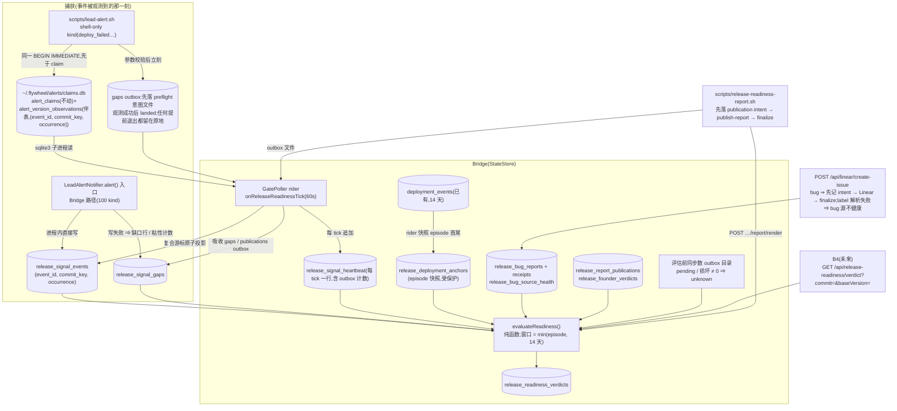
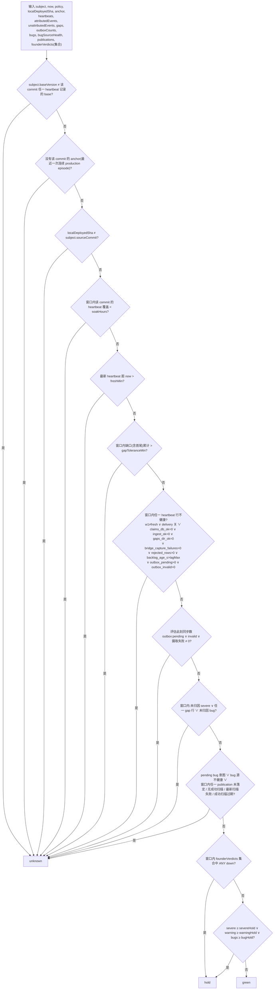

# FLY-2390 判据 c 聚合 — 实施计划
Issue: FLY-2390 (https://linear.app/geoforge3d/issue/FLY-2390/1143b3-判据-c-聚合消费-fly-942-原始事件-版本归因-watchdog-heartbeat源健康-报-bug-打版本-tag)
日期: 2026-09-10
基于: research.md

> **一句话**:每条原始告警在**被观测到的那一刻**记一条「(事件, 当刻版本, 第几次到达)」观测:Bridge 路径在 `alert()` 入口直接写自家账本,shell 路径在 claim 事务里写同库伴表(不看 claim 输赢);凡是「本该采到却没采到」的地方(shell 观测前退出、shell sqlite 失败、Bridge 账本写失败、outbox 未摄取 / 损坏、游标积压、坏行、bug 意图未落定、Bug label 解析失败、日报发布意图未落定、反应扫描失败或过期)都**持久化成缺口或源不健康**并让结论变 `unknown`;报 bug 走 create-issue 咽喉时**先记意图再调 Linear**;Annie 的 👍/👎 从 episode 内每条日报消息上分页轮询,**任一 👎 即 hold**;一个**纯函数** `evaluateReadiness(input)` 在**有界窗口 = min(部署 episode, 14 天)** 内按 fail-closed 顺序产出 `unknown → hold → green` 并落账;一个渲染路由 + 一个 launchd 脚本出日报。**不做**否决窗口 / manifest / 客户端 / 分频 / 任何真发布动作。
> **Lead 裁定已折入**:`c27ae449`(Q1 只对本机真跑过且当前仍跑着的 `sourceCommit` 给 green;Q2 阈值 env 可配并写进 verdict;Q3 shell 回执本地完成、先于 token 判定)。**`1d9ea778`(2026-09-11)**:R3 七项按「A 加强版」收口 —— #1/#6/#7 小修法修;#2–#5 各加一个最便宜的 fail-closed 守卫,完整版进 §12;不开 R4,以「R3 结论 + 本裁定」为 effective APPROVED。
> **Lead 指令 `d3cac253`**:只修评审器列出的 findings;advisory 进 §12 留档不修;最多 R3。
> **评审记录**:§11。

---

## 0. 全景



## 1. 稳定身份与展示标签

| 身份 | 形状 | 谁分配 | 展示 |
|---|---|---|---|
| **subject** | `{ baseVersion: "X.Y.Z", sourceCommit: 40hex 小写 }` | Bridge boot:`normalizeVersionFile(doc/VERSION)` + `resolveBridgeBuildIdentity().buildSha`;shell:`doc/VERSION` + `~/.flywheel/deployed-sha` | `v1.56.0 @ d964e9f` |
| `localDeployedSha` | 40hex \| null | 评估时读 `~/.flywheel/deployed-sha` | 与 subject 并列;不等 ⇒ 不可能 green |
| `verdictId` | `rr-<evaluatedAt ISO 紧凑>-<sourceCommit 前 12>`(碰撞见 §12 F2) | 评估时 | 日报 / API |
| **观测身份**(R3#1) | `(event_id, source_commit_key, occurrence)`;`occurrence` = 该 `(event_id, source_commit_key)` 下的到达序号(同一 `BEGIN IMMEDIATE` 内 `COALESCE(MAX(occurrence),0)+1`);**计数时按 `(episode, event_id)` 去重、severity 取最高** | 观测方 | — |
| **部署 episode** | `release_deployment_anchors(source_commit, episode_from, episode_to)`:rider 从 `deployment_events` 快照,`episode_from` 只写一次、`episode_to` 在看到下一批次时封口;**受保护不删**(R3#6) | rider | 日报窗口行 |
| 投影游标 | `(observed_at, event_id, source_commit_key, occurrence)` 复合、字典序 | rider | heartbeat `backlog_age_s` |
| heartbeat 身份 | `seq`,每 tick 一行、只追加 | rider | 时间轴按分钟聚合 |
| bug 意图 | `intent_id = bi-<ISO 紧凑>-<8 hex>`;落定后绑 Linear `identifier` | create-issue 咽喉 | 未落定的在日报单列 |
| 日报发布 | `day` + `publication_id = rp-<day>-<8 hex>`;`intent → published(messageId) / failed` | 脚本(经 outbox) | — |
| founder 裁决 | `(day)` 一天一条;`sentiment ∈ {down, up}`;👍👎同在 ⇒ `down`;**评估输入为 episode 内的集合** | rider | 日报「哪几天你标了 👎」 |
| 收口收据 | `receipt_id = br-<ISO 紧凑>-<8 hex>`,append-only;`resolved_by` **服务端固定 `master-api-token`**(R3#7) | resolve 路由 | 日报 bug 段 |
| 时间 | StateStore 全部时间列 = **ISO 8601 UTC TEXT**(`YYYY-MM-DDTHH:MM:SS.sssZ`);shell 伴表 `observed_at` unix 秒,rider 摄取时转换(R3#6) | — | — |
| 原因码 | §2.2 | 评估 | 日报逐条解释 |

**命名红线**:所有新文件 / 表 / 符号用 `release-readiness` / `release-signal` / `alert-version-observation`,**不含** `watchdog`。

## 2. 合同

### 2.1 状态机(fail-closed 顺序固定)



- 评估**收集全部**成立的原因(不短路),`state` 取最高优先级。
- **有界窗口(R3#6)**:`from = max(anchor.episode_from, now − 14 天)`,`to = min(anchor.episode_to ?? now, now)`;`episode_from < now − 14 天` ⇒ evidence 记 `windowTruncated=true, episodeFrom`,日报明示「只看最近 14 天」。窗口内的负面证据不会被保留期删掉(保留期 = 14 天,§3.4);窗口外的证据**不再影响结论**——这是有界窗口的明确语义,不是保留期静默改的。
- anchor 来自受保护的 `release_deployment_anchors`(rider 从 `deployment_events` 快照,`project_name='flywheel' ∧ environment='production'`,最近一次连续 episode;同一 sha 回滚再前进 ⇒ 新 episode 行,取最近)。
- **两条查询合同**:有归因证据按 subject 精确匹配(events / heartbeat / gaps 按 `source_commit`;bugs 按 `source_commit`;publications / founderVerdicts 按 `subject_commit`);无归因证据(`source_commit IS NULL` 的 severe 事件、任一 gap 行、NULL 的 pending / finalized bug)按窗口时间(与 project)归入「不可判归属」并阻断 green。
- **事件计数**:先按 `(event_id)` 在窗口内去重(同 event 多个 occurrence 取最高 severity),再按 kind / severity 计数;`project_name ∈ policy.projects`、`kind ∉ policy.ignoreKinds`;`info` 不计。
- **founder 集合语义(R3#5)**:窗口内每个 `published` publication 都在扫描集合(不是「最近 2 天」);`release_founder_verdicts` 取窗口内全部行;**ANY `down` ⇒ hold**,某天的 `up` 不清除另一天的 `down`;窗口滚过那一天(有界窗口)才自然失效。
- **outbox 同步计数(R3#3)**:`collect()` 在评估前直接 `readdir` 两个 outbox 目录(gaps / publications,不含 `landed/`),统计 pending 文件数与解析失败数;任一非零 ⇒ `outbox_pending`。这一步与 rider 无关,GET 时也做。
- 不做任何推断:`source_commit` 逐字比较;`localDeployedSha` 不等 ⇒ `unknown`。

### 2.2 原因码(稳定,`reasons_json` 元素 `{code, detail}`)

| state | code | detail |
|---|---|---|
| unknown | `subject_mismatch` | `{requestedBase, observedBases[]}` |
| unknown | `no_deployment_evidence` | `{sourceCommit, localDeployedSha}` |
| unknown | `not_currently_deployed` | `{sourceCommit, localDeployedSha}` |
| unknown | `soak_insufficient` | `{coveredHours, requiredHours}` |
| unknown | `heartbeat_stale` | `{lastHeartbeatAt, ageMin, freshMin}` |
| unknown | `heartbeat_gap` | `{gapMin, toleranceMin, largestGap:{from,to}}` |
| unknown | `source_unhealthy` | `{ticks:[{tickAt, …全部健康字段}] ≤10, total}` |
| unknown | `outbox_pending` | `{gapsPending, gapsInvalid, publicationsPending, publicationsInvalid, oldestPendingAt}` |
| unknown | `unattributed_severe` | `{count, sampleEventIds[≤3]}` |
| unknown | `capture_gap` | `{count, byReason:{shell_preflight, shell_claim_db, bridge_ledger_write}, sampleEventIds[≤3]}` |
| unknown | `unattributed_bug` | `{count, identifiersOrIntents[≤5]}` |
| unknown | `bug_intent_unresolved` | `{count, intentIds[≤5]}` |
| unknown | `bug_source_unhealthy` | `{lastFailureAt, lastSuccessAt, label}` |
| unknown | `founder_signal_unobserved` | `{days:[{day, publicationStatus, lastScanOkAt, lastScanError}]}` |
| hold | `founder_thumbs_down` | `{days:[{day, messageId}]}` |
| hold | `severe_alerts` | `{count, threshold, byKind}` |
| hold | `warning_alerts_over_threshold` | `{count, threshold, byKind}` |
| hold | `bug_reports_over_threshold` | `{count, threshold, identifiers}` |

`evidence_json` 固定键:`window{from,to,episodeFrom,episodeTo,windowTruncated}`、`counts{…}`、`heartbeat{…}`、`outbox{…}`、`founder{days:[…]}`、`localDeployedSha`、`policy`、`policyDefaulted[]`。

### 2.3 policy(全部 env,评估时读一次并写进 verdict;非法值 ⇒ 默认并记 `policyDefaulted`)

| env | 默认 | 含义 |
|---|---|---|
| `FLYWHEEL_READINESS_SOAK_HOURS` | `12` | 最低覆盖时长 |
| `FLYWHEEL_READINESS_HEARTBEAT_FRESH_MIN` | `10` | 最新 heartbeat 允许年龄;也是 founder 扫描 `last_scan_ok_at` 的新鲜阈值 |
| `FLYWHEEL_READINESS_GAP_TOLERANCE_MIN` | `30` | 缺口累计容忍(含首尾) |
| `FLYWHEEL_READINESS_BACKLOG_AGE_MAX_S` | `600` | 最老未消费观测行的年龄阈值(无 = 0) |
| `FLYWHEEL_READINESS_SEVERE_HOLD` / `WARNING_HOLD` / `BUG_HOLD` | `1` / `5` / `1` | hold 阈值 |
| `FLYWHEEL_READINESS_PROJECTS` | `flywheel,machine` | 计入的 `project_name` |
| `FLYWHEEL_READINESS_IGNORE_KINDS` | 空 | 排除的 kind |
| `FLYWHEEL_BUG_LABEL` | `Bug` | create-issue 判 bug 的 label 名;请求内解析为 team-scoped id 后比较 |
| `FLYWHEEL_DEPLOYED_SHA_FILE` | `~/.flywheel/deployed-sha` | 本机部署 sha 文件 |
| `FLYWHEEL_READINESS_REPORT_CHANNEL` | 未设 ⇒ 脚本 no-op | 日报频道(脚本侧) |

窗口上限 **14 天不是 env**:它与保留期同值、同源(`scripts/lib/fly-2006-retention-engine.mjs` 的 `RETENTION_MS`),evaluator 从同一常量导入。全部 env 登记 `truth.ts` `NON_FLAG_ALLOWLIST`;不新增 feature flag;日报时点固定在 plist(08:00)。

### 2.4 HTTP 合同

默认中间件 = `tokenAuthMiddleware(config.apiToken, config.geminiAgentToken)`(`/api/digest` 同款)。证据完整性的权威写用**现有 `masterOnlyAuthMiddleware`**(`bridge/dependency-route.ts:174-192`;它只验 bearer、不建立调用者身份,所以 `resolved_by` 由服务端固定,R3#7)。文档更正:`POST /api/linear/create-issue` 整体是 token 中间件,只有带 `parentId` 的请求走 master-only(`plugin.ts:3735-3747`)。

| 方法 路径 | 中间件 | 输入(边界校验) | 输出 |
|---|---|---|---|
| `GET /api/release-readiness/verdict?commit=&baseVersion=` | 默认 | 两者必填、`40hex` / `BASE_RE`,否则 400 | 200 verdict(当场评估 + append 落账) |
| `GET /api/release-readiness/verdict`(无参) | 默认 | — | 以本机身份为 subject;读不到 ⇒ 400 |
| `GET /api/release-readiness/verdicts?commit=&limit=` | 默认 | `limit` 1..100 | 历史(只读) |
| `POST /api/release-readiness/report/render` | 默认 | `{day?}` | `text/html`;512 KiB 上限 |
| `POST /api/release-readiness/bug-report` | 默认 | `{issueIdentifier, sourceCommit?, baseVersion?, reporter?}` | 201 / 200 幂等 |
| `POST /api/release-readiness/bug-intent/:intentId/resolve` | **masterOnlyAuthMiddleware** | `{issueIdentifier}` 或 `{abandon: true, reason: 1..200 非空}`;**忽略任何 actor 请求头** | 200 `{status, receiptId, resolvedBy:"master-api-token"}`;404 / 400;已落定 ⇒ 200 canonical 不覆写 |
| `POST /api/linear/create-issue`(既有) | 既有 | 新增校验:`bug` 缺省或**严格 boolean**,其它类型 ⇒ 400(R3#4) | 既有 + `readiness` 字段 |

resolve 实现:同一事务 `UPDATE … WHERE intent_id=? AND status='pending'`(CAS)+ `INSERT release_bug_resolution_receipts(…, resolved_by='master-api-token')`;`changes()=0` ⇒ 读回 canonical 行与其 receipt 返回。

HTML 渲染里所有事件 / issue / Discord 字符串经 `escapeHtml`(`bridge/xhs-review-html.ts:24`)。

## 3. 数据模型与迁移

### 3.1 shell 路径:preflight 意图 + claims.db 伴表(R3#1 / R3#2)

**preflight 意图(最便宜的守卫,Lead 裁定 #2)**:`lead-alert.sh` 在参数 / kind / severity 校验通过后(`:211-229` 之后)、任何 route / config / tool preflight(`:274-333, 372-419`)**之前**,只用 shell 内建 + `mv` 原子写 `~/.flywheel/state/release-readiness/gaps/<utc>-<lead>-<kind>-<8 hex>.intent.json`(`{eventIdHint:null, kind, severity, projectName, leadId, baseVersion|null, sourceCommit|null, observedAt, reason:'shell_preflight'}`;此时 event id 尚未算出,`eventIdHint` 留空)。观测事务成功后把该文件 `mv` 到 `gaps/landed/`;**任何提前退出、任何 sqlite 失败**都让文件留在原地 ⇒ rider 摄取为 gap 行(`reason='shell_preflight'` 或改写为 `shell_claim_db`)⇒ `capture_gap`。意图文件本身写失败 ⇒ 只 stderr 记 ERROR 并继续(告警不能因判据而丢);此时靠 rider 每 tick 的 `gaps_dir_ok` 探针(向同目录 `touch` 探针文件)—— 目录不可写 ⇒ heartbeat `gaps_dir_ok=0` ⇒ `source_unhealthy`。

```sql
CREATE TABLE IF NOT EXISTS alert_version_observations (
  event_id          TEXT NOT NULL,
  source_commit_key TEXT NOT NULL,   -- 40hex 小写,或 'null'
  occurrence        INTEGER NOT NULL,
  severity          TEXT NOT NULL CHECK (severity IN ('info','warning','severe')),
  project_name      TEXT NOT NULL,
  kind              TEXT NOT NULL,
  base_version      TEXT,
  observed_at       INTEGER NOT NULL, -- unix 秒
  PRIMARY KEY (event_id, source_commit_key, occurrence)
);
CREATE INDEX IF NOT EXISTS idx_alert_version_observations_cursor ON alert_version_observations(observed_at, event_id, source_commit_key, occurrence);
```

```sql
BEGIN IMMEDIATE;
-- ① 新增:观测,occurrence 在同一事务内派生,同一事件再来 = 新的一行(不 OR IGNORE)
INSERT INTO alert_version_observations (event_id, source_commit_key, occurrence, severity, project_name, kind, base_version, observed_at)
  VALUES (:event_id, :commit_key,
          (SELECT COALESCE(MAX(occurrence),0)+1 FROM alert_version_observations WHERE event_id=:event_id AND source_commit_key=:commit_key),
          :severity, :project, :kind, :base, :now);
-- ② 以下四条现有语句逐字不动
INSERT OR IGNORE INTO alert_claims VALUES (…);
INSERT OR IGNORE INTO alert_deliveries (…) VALUES (…);
UPDATE alert_deliveries SET … WHERE …;
SELECT state || '|' || COALESCE(lease_token,'') FROM alert_deliveries WHERE event_id=…;
COMMIT;
```

`alert_claims` 四列逐字不动;伴表与 `alert_claims` 同寿命。

### 3.2 Bridge 路径:进程内直接写(TS claimer 零改动)

`LeadAlertNotifier.alert(payload)` **入口第一步**:
```
occurrence = store.nextReleaseSignalOccurrence(eventId, commitKey)   // 同一事务内 MAX+1
store.insertReleaseSignalObservation({ eventId, commitKey, occurrence, kind, severity, projectName, baseVersion, sourceCommit, origin:'bridge', observedAt })
  → 抛错:store.insertReleaseSignalGap({ eventId, reason:'bridge_ledger_write', … })
      → 再抛错:this.captureFailures += 1   // 粘性:只在 rider 成功 append 了携带该计数的 heartbeat 行之后才由 rider 调 ackCaptureFailures(n) 扣减(peek → append → ack,R3#2)
```
进程在 ack 前崩溃 ⇒ 计数丢失,但那次崩溃本身会造成 heartbeat 缺口 / `bridge_abnormal_exit` 事件,评估仍 `unknown`(Lead 裁定的「写不了就让下一次 heartbeat 缺失导致 unknown」);完整持久化见 §12 F3。

### 3.3 StateStore 新表(`CREATE TABLE IF NOT EXISTS`;首建记 `state_store_migration('fly-2390-release-readiness-v1')`;时间列全部 ISO UTC TEXT)

| 表 | 列 | 约束 / 索引 |
|---|---|---|
| `release_signal_events` | `__rowid INTEGER PK AUTOINCREMENT, event_id, source_commit_key, occurrence INT, kind, severity, project_name, base_version, source_commit, origin CHECK IN ('bridge','shell'), observed_at, ingested_at` | `UNIQUE(event_id, source_commit_key, occurrence)`;`(source_commit, observed_at)`;`(observed_at)` |
| `release_signal_cursor` | `key PK ('claims'), last_observed_at_unix INT, last_event_id, last_commit_key, last_occurrence INT, updated_at` | 单行;与同批投影同事务推进 |
| `release_signal_heartbeat` | `seq INTEGER PK AUTOINCREMENT, tick_at, source_commit, base_version, w1_freshness, alert_delivery_enabled INT, claims_db_ok INT, ingest_ok INT, gaps_dir_ok INT, bridge_capture_failures INT, rejected_rows INT, backlog_age_s INT, outbox_pending INT, outbox_invalid INT` | 每 tick 追加;`(source_commit, tick_at)`;`(tick_at)` |
| `release_signal_gaps` | `gap_id PK, event_id NULL, reason CHECK IN ('shell_preflight','shell_claim_db','bridge_ledger_write'), severity, project_name, kind, source_commit, base_version, observed_at, ingested_at` | `(observed_at)` |
| `release_deployment_anchors` | `anchor_id PK, source_commit, episode_from, episode_to NULL, first_seen_at` | `(source_commit, episode_from)`;**protected** |
| `release_bug_reports` | `intent_id PK, issue_identifier UNIQUE NULL, status CHECK IN ('pending','finalized','abandoned'), base_version, source_commit, reporter, created_at, finalized_at, note` | `(source_commit, status)`;`(created_at)` |
| `release_bug_resolution_receipts` | `receipt_id PK, intent_id, action CHECK IN ('finalize','abandon'), issue_identifier, reason, resolved_by, resolved_at` | append-only |
| `release_bug_source_health` | `key PK ('bug_label'), label, last_success_at NULL, last_failure_at NULL, last_error NULL` | 单行(R3#4) |
| `release_report_publications` | `publication_id PK, day UNIQUE, subject_commit, base_version, status CHECK IN ('intent','published','failed'), channel_id, message_id UNIQUE NULL, intent_at, published_at, first_scan_ok_at, last_scan_ok_at, last_scan_at, last_scan_error` | `(subject_commit)` |
| `release_founder_verdicts` | `day PK, message_id, sentiment CHECK IN ('down','up'), founder_user_id, subject_commit, observed_at` | `(subject_commit)` |
| `release_readiness_verdicts` | `verdict_id PK, subject_commit, base_version, local_deployed_sha, state, reasons_json, evidence_json, policy_json, evaluated_at` | `(subject_commit, evaluated_at)` |

### 3.4 保留(FLY-2006,做减法;R3#6 时间与路径修正)

- 三张证据表 `release_signal_events` / `release_signal_heartbeat` / `release_signal_gaps` 进现有统一 **14 天** `RETENTION_TARGET_POLICIES`(`scripts/lib/fly-2006-retention-engine.mjs:132-145, 179-185`),时间列 ISO UTC TEXT 与现有 `julianday(t.<time>) < julianday(?)` 谓词直接兼容;`release_signal_events` 用 `__rowid` surrogate key 供引擎删除。
- 其余八张(cursor、anchors、bug_reports、receipts、bug_source_health、publications、founder_verdicts、verdicts)**protected**。
- 十一张表全部写入 `TEAMLEAD_TABLE_CLASSIFICATION`(`scripts/lib/fly-2006-retention-registry.mjs`)。
- `deployment_events` 保持现有 14 天策略**不动**;当前 episode 的锚点由受保护的 `release_deployment_anchors` 快照承担(R3#6「保护部署锚点」)。
- consumer-gate config:`targetTables` 加三张 14 天表;新读 `deployment_events` 的 `listDeploymentEpisodesForSha` 登记 `{usage: read, disposition: protect}`;新表消费者按 gate 扫描结果登记。
- inventory / apply / receipt 对三张新表各一条用真实 ISO 时间戳的测试。

### 3.5 迁移与回滚边界

- **数据迁移:无**。全新表;`alert_claims` / `alert_deliveries` / `deployment_events` / TS claimer 零改动。历史告警不回填。
- **回滚**:还原 PR 即可;新表 / 伴表 / outbox 文件是惰性数据。
- **不可回滚项:无**。

## 4. 代码结构与改动清单

```
packages/teamlead/src/bridge/release-readiness/
  policy.ts · evaluate.ts(纯函数)· subject.ts · service.ts(collect 含 outbox 同步计数)· ingest-rider.ts · report.ts · routes.ts · bug-footer.ts
packages/teamlead/src/bridge/lead-alert-helpers.ts   只导出 sqliteRunWithStdin / sqlString;createClaimsClaimer 零改动
packages/teamlead/src/LeadAlertNotifier.ts           alert() 入口:§3.2 观测 + 缺口 + 粘性计数(peek/ack)
packages/teamlead/src/StateStore.ts                  §3.3 十一张表 + listDeploymentEpisodesForSha + nextReleaseSignalOccurrence / insertReleaseSignalObservation / insertReleaseSignalGap / projectSignalBatch / appendHeartbeat / upsertDeploymentAnchor / bug intent+finalize+resolveCAS / bug source health / publications upsert(允许首次即 published|failed)/ verdict append
packages/teamlead/src/bridge/plugin.ts               ① 构造 service/rider;② GatePoller 加 onReleaseReadinessTick;③ 挂 /api/release-readiness(默认 + masterOnlyAuthMiddleware);④ create-issue:bug 严格 boolean 校验 → Bug label id 解析(失败 ⇒ bug_source_health.failure)→ isBug → intent → Linear → finalize
packages/teamlead/package.json                       + "flywheel-release-contract": "workspace:*"
packages/config/src/feature-flags/truth.ts           NON_FLAG_ALLOWLIST 加 §2.3 全部 env
scripts/lead-alert.sh                                §3.1:preflight 意图文件 + 伴表 + 观测 INSERT;成功后 landed
scripts/release-readiness-report.sh                  §4.3
scripts/launchd/com.flywheel.release-readiness-report.plist(08:00)+ units.manifest 一行(copy, 0,1)
scripts/lib/fly-2006-retention-registry.mjs / scripts/lib/fly-2006-retention-engine.mjs / scripts/fly-2006-retention-consumer-gate.config.json   §3.4
packages/flywheel-comm/src/commands/release-bug-tag.ts + index.ts case   `--issue` / `--resolve-intent <id> (--issue | --abandon --reason)`(resolve 走 master token)
engineering/doc/FLY-2390-criteria-c-aggregator/fixtures/   回放夹具(§6.1)
```

**不改** `MetaAlertNotifier.ts`、`createClaimsClaimer`、`liveness-manifest.ts`、`deployment_events` 保留策略。

### 4.1 GatePoller rider(`onReleaseReadinessTick`,60 s 档;顺序固定、逐段 try/catch、single-flight)

0. **outbox 盘点 + 目录探针**:`readdir` gaps / publications(不含 `landed/`)得 `outbox_pending`(含 `.intent.json`)、`outbox_invalid`(解析失败);向 gaps 目录 `touch` 探针 ⇒ `gaps_dir_ok`。
1. **anchor 快照**:对 `localDeployedSha` 调 `listDeploymentEpisodesForSha`,`upsertDeploymentAnchor`(`episode_from` 只写一次;看到更新批次时封 `episode_to`)。
2. **shell 观测投影(原子)**:复合 seek `LIMIT 500`,最多 10 页;坏行:有 `event_id` ⇒ NULL 归因投影,否则 `rejected_rows+1`;`projectSignalBatch` 同事务推进游标;之后 `MIN(observed_at)` 得 `backlog_age_s`。sqlite 失败 ⇒ `claims_db_ok=0`;事务失败 ⇒ `ingest_ok=0`。
3. **gap outbox 吸收**:`*.intent.json` 与 `*.json` 都摄取为 gap 行(`shell_preflight` / `shell_claim_db`)→ `landed/`;插入失败 ⇒ `ingest_ok=0`(R3#3)。
4. **publication outbox 吸收**:摄取 `intent` / `published` / `failed`;**允许首次即 `published|failed`**(快路径在首个 tick 前已改写),也允许先 `intent` 后 final;插入失败 ⇒ `ingest_ok=0`。
5. **heartbeat 追加一行**:`{…, gaps_dir_ok, bridge_capture_failures: notifier.peekCaptureFailures(), rejected_rows, backlog_age_s, outbox_pending, outbox_invalid}`;append 成功后 `notifier.ackCaptureFailures(n)`。
6. **founder 反应**:扫描集合 = **窗口内所有 `published` publication**(R3#5);每 emoji 分页到末页(≤20 页/tick,超限 = 失败);任一页非 200 ⇒ `last_scan_error`,不写裁决;全部成功 ⇒ 更新 `first/last_scan_ok_at`、清 `last_scan_error`;founder 身份过滤;👎 ⇒ `down`,否则 👍 ⇒ `up`,否则不写;**已写的 `down` 不因后续扫描无 👎 而删除**(裁决只增不删)。
7. **不评估**。

### 4.2 create-issue(`plugin.ts:3996` 前后)

1. 校验 `bug`:缺省或 boolean,否则 400。
2. 在现有 label 解析之后:`bugLabelId = resolveTeamScopedLabel(policy.bugLabel)`;**失败 ⇒ `bug_source_health.last_failure_at = now`(持久化,R3#4)**,并且:`body.bug === true` ⇒ 仍按 bug 处理;否则按非 bug 处理(评估已因 `bug_source_unhealthy` 阻断 green,直到下一次解析成功写 `last_success_at`)。成功 ⇒ `last_success_at = now`。
3. `isBug = body.bug === true || labelIds.includes(bugLabelId)`;非 bug ⇒ 字节不变。
4. bug ⇒ 页脚(幂等)→ `insertBugIntent(pending)`(失败 ⇒ 502 不调 Linear)→ `createIssue` → `finalizeBugIntent`(CAS + receipt,`action='finalize'`,`resolved_by='create-issue'`,服务端固定)。失败 / 崩溃 ⇒ pending ⇒ `unknown`;人工收口经 resolve 路由的 receipt `resolved_by='master-api-token'`。

**founder `/create-issue`(仓外)**:必须改走本路由(带 `bug:true`);部署前置验收项(QA 验证 StateStore 出现 finalized 行)。

### 4.3 日报脚本 `scripts/release-readiness-report.sh`

复制 `daily-digest.sh` 骨架。① 频道未设 ⇒ `exit 0`;② **同日幂等**:outbox 或 `landed/` 已有该 `day` 文件 ⇒ `exit 0`;③ render;④ **发送前**原子写 `publications/<day>.json` `status:'intent'`,失败 ⇒ `exit 1` 不发;⑤ `publish-report`,成功且 `messageId` 非空 ⇒ 改写为 `published`,否则 `failed`;改写失败 ⇒ 停在 `intent` ⇒ unknown;⑥ plist 固定 08:00,`units.manifest` policy `copy`,退出码 `0,1`。

日报内容:subject 与 `localDeployedSha`;窗口(含 `windowTruncated` 提示);三态 + 逐条原因;事件表;bug / pending 意图 / 未归因 bug / bug 源健康;heartbeat 时间轴(不健康 tick 标色);outbox 计数;窗口内每天的 👍/👎 与扫描状态。

## 5. 负向守卫(必须有测试)

| 守卫 | 断言 |
|---|---|
| 缺数据不放行 / 当前部署 / subject 绑定 / 不推断 commit / 首尾缺口 | 同 v3 |
| 同 SHA 回滚再前进(R3#1) | A@t100 warning,B,A@t300 severe:两行都在;anchor 取最近 episode;窗口内 severe 计入 ⇒ hold |
| NULL→NULL 跨 episode | 两条 NULL severe 不同 occurrence 都保留;各自按时间归入窗口 |
| 同 episode 重放 | 同 event 三个 occurrence ⇒ 计数 1、severity 取最高 |
| shell 观测前退出(R3#2) | 假 `projects.json` 缺失 / unknown lead / 缺工具 ⇒ `.intent.json` 留在 outbox ⇒ rider 摄取 ⇒ `capture_gap` |
| shell sqlite 失败 | 意图文件留原地 + 投递照旧 ⇒ `capture_gap` |
| gaps 目录不可写 | 探针失败 ⇒ `gaps_dir_ok=0` ⇒ `source_unhealthy` |
| Bridge 双写失败 + ack 语义 | 计数在 heartbeat append 失败时不扣减;append 成功后扣减;`>0` ⇒ `source_unhealthy` |
| outbox 同步计数(R3#3) | 有效未摄取 gap 文件 / 损坏文件 / publication 文件 ⇒ GET 当场 `outbox_pending`,即便 heartbeat 全健康 |
| outbox 摄取失败 | store 抛错 ⇒ `ingest_ok=0` |
| publication 首次即 published | 合法;先 intent 后 final 合法;`published → intent` 非法(拒) |
| Bug label 解析失败(R3#4) | UUID Bug label + 解析失败 ⇒ `bug_source_unhealthy`;恢复后窗口内仍有失败时间且无更新成功 ⇒ 仍 unknown;成功后 green 可达;`bug:"yes"` ⇒ 400 |
| founder 集合(R3#5) | day1 down + day2 up ⇒ hold;day1 down + day2 无反应 ⇒ hold;3+ 天同一 episode 全部被扫描;旧 intent/failed 只随窗口滚出 |
| 有界窗口(R3#6) | episode 20 天:窗口 = 最近 14 天,`windowTruncated=true`;第 15 天前的 severe 不计;anchor 仍在(protected) |
| 时间谓词 | 三张表 ISO 时间在 `julianday` 谓词下真的被清理(inventory/apply/receipt 各一) |
| resolve(R3#7) | 伪造 `x-flywheel-actor` ⇒ receipt `resolved_by='master-api-token'`;scoped token 403;无 reason 400;并发只一方成功;receipt 与状态同事务 |
| 其余(👍 不当健康证明、分页、输入边界、`alert_claims` / claimer 不变、页脚幂等、命名、转义、512 KiB、十一表分类) | 同 v3 |

## 6. 测试策略(TDD:先红后绿)

| 层 | 文件 | 覆盖 |
|---|---|---|
| 纯函数 | `release-readiness-evaluate.test.ts` | §2.1 每条分支;§5 全部守卫;两条查询合同;founder 集合;有界窗口 |
| policy | `release-readiness-policy.test.ts` | env 解析、默认、`policyDefaulted`;14 天常量与 retention 同源 |
| StateStore | `StateStore.release-readiness.test.ts` | 十一张表;episodes 查询;anchor 只写一次 / 封口;`nextReleaseSignalOccurrence` 同事务;`projectSignalBatch` 原子;resolve CAS + receipt;publications 状态机三种 interleaving |
| notifier | 现有测试 + 新例 | 入口观测在所有 early return 之前;occurrence 递增;双写失败计数 peek/ack |
| service | `release-readiness-service.test.ts` | outbox 同步计数(临时目录注入) |
| rider | `release-readiness-rider.test.ts` | 盘点 / 探针 / anchor / 投影 / 摄取 / heartbeat / 反应(集合、分页、失败) |
| 路由 | `release-readiness-routes.test.ts` + mount | 状态码;默认 vs master-only;伪造 actor 头 |
| create-issue | 扩 linear-proxy 测试 | 严格 boolean;label 解析失败两态;名 / UUID 命中;三段两崩溃点 |
| shell | `lead-alert-version-observation.test.sh` | 意图文件时机(校验后、preflight 前);三种提前退出;事务成功 ⇒ landed;四条语句逐字不变;no-token 仍观测 |
| 日报脚本 / launchd / retention / flags | 同 v3 | — |
| **回放验收** | `release-readiness-replay.test.ts` | §6.1 |

### 6.1 回放夹具(= 验收三态各一例,理由可查)

同 v3,追加:`events` 含同 SHA 回滚再前进与同 event 多 occurrence;`anchors.json`(含一个 20 天 episode);`outbox/` 目录夹具(有效未摄取 / 损坏);`bug-source-health.json`(失败态);`publications` 三天(down / up / 无反应)。断言三态各例:green 一例;hold 含 `founder_thumbs_down{days:[day1]}`(day2 up 不清除);unknown 含 `outbox_pending`、`bug_source_unhealthy`、`windowTruncated` 场景。实现节点提交 `fixtures/report-sample.html`。

## 7. 分块与完成判据

| chunk | 内容 | 完成判据 |
|---|---|---|
| C1 | 依赖 + policy / subject / evaluate + 纯函数测试 | 评估测试全绿 |
| C2 | StateStore 十一张表 + 方法 + 迁移 + retention registry/engine/gate 登记(`scripts/lib/`) | StateStore 测试绿;`fly-2006` 全族绿 |
| C3 | 捕获:notifier 入口(observation / gap / peek-ack)+ helpers 导出 + `lead-alert.sh`(意图文件 + 伴表) | notifier / shell 测试绿;零 diff 断言绿 |
| C4 | rider + service outbox 计数 + plugin 装配 | rider / service 测试绿;`fly1560-teardown-guard` 绿 |
| C5 | 路由(默认 + masterOnly)+ create-issue(boolean / label health / 三段)+ `release-bug-tag` + truth.ts | 路由 / linear-proxy 测试绿;`feature-flags-drift` 绿 |
| C6 | 日报渲染 + 脚本 + launchd + 回放夹具 + `report-sample.html` | 回放三态绿;脚本测试绿;`launchd-units-manifest` 绿 |
| C7 | 全仓 build、定向套件(排除 `tmux-viewer.macos`)、biome | CI 绿 |

## 8. 部署与激活次序

1. 合入 main → 更新器窗口部署(不重启任何服务)。
2. 首个 tick 建表、写 anchor 与 heartbeat;**12 h 后**才可能出现首个非 `unknown` verdict。
3. 日报单元由收敛脚本安装;频道 env 由 operator 设定。
4. **部署前置验收(QA)**:founder `/create-issue` 改走 Bridge 路由建 bug 并出现 finalized 行。
5. B4 接入面 = `GET /api/release-readiness/verdict?commit=&baseVersion=`。

## 9. 不做(显式)

- 不读 manifest / 不派生 beta 号 / 不持 endpoint token。
- 不实现否决窗口、送达回执、决策账本、任何 commit / withdraw(B1/B4/B5)。
- 不改 `/health`、不新增 timer、不复活 watchdog、不改 `MetaAlertNotifier`、不改 `createClaimsClaimer`、不改 `deployment_events` 保留策略。
- 不改 `alert_claims` 列、不改 `lead-alert.sh` 的发送 / 死信 / 队列 / lease 行为。
- 不回填历史;不自动对账 Linear;不做 B6;不改 `daily-standup` / `daily-digest`;不造新的保留期策略。

## 10. 风险

| 风险 | 缓解 |
|---|---|
| 更新器 commit ≠ beta sourceCommit ⇒ B4 常拿 `unknown` | Lead 已裁:另立对齐子单;verdict 带两 sha |
| Bridge 每条告警多两次进程内 StateStore 写(occurrence + observation) | sql.js 微秒级;失败有缺口 / 计数兜底 |
| 意图文件在告警高峰期数量 | 成功即 landed;rider 每 tick 摄取;`landed/` 随 14 天保留由 janitor 清理(实现节点加入现有 log-janitor 清单) |
| pending 意图 / 未落定发布 / bug 源失败 ⇒ 长期 `unknown` | 日报单列 + 显式人工收口;这是设计 |
| 有界窗口 14 天 | 与保留期同源;日报明示 `windowTruncated` |

## 11. 评审记录

| 轮 | 结论 | 处理 |
|---|---|---|
| R1(2026-09-10) | CHANGES REQUESTED,6 blocking + 1 non-blocking | 全部采纳 |
| R2(2026-09-10) | CHANGES REQUESTED,6 blocking + 1 non-blocking | 6 blocking 全部采纳;#7 进 §12 |
| R3(2026-09-10,隔离 CODEX_HOME 上以完整上下文重跑,thread `01a08e57-5098-7a00-a549-9c0f9355fb22`) | CHANGES REQUESTED,7 blocking | 按 Lead 指令 `d3cac253` 不开 R4;findings 原文经 `1d9ea778` 上报。**Lead 裁定(2026-09-11)**:#1 观测加 `occurrence`、按 episode 去重、severity 悲观合并;#6 有界窗口 = min(episode, 14 天)、部署锚点快照进受保护表、时间列 ISO UTC、`__rowid`、路径改 `scripts/lib/`;#7 `resolved_by` 服务端固定 `master-api-token`、复用 `masterOnlyAuthMiddleware`、文档事实更正;#2 shell 观测前退出 ⇒ preflight 意图文件 ⇒ gap,写不了 ⇒ 目录探针 ⇒ 源不健康,Bridge 计数改粘性 peek/ack;#3 评估前同步数 outbox,pending / 损坏 / 摄取失败任一非零 ⇒ unknown;#4 Bug label 解析失败 ⇒ 持久化 bug 源不健康 ⇒ unknown,`bug` 严格 boolean;#5 扫描集合 = 窗口内全部 publication,输入为集合,ANY 👎 ⇒ hold,up 不清 down。以「R3 结论 + 裁定 `1d9ea778`」为 **effective APPROVED**(rounds=3) |

## 12. Follow-ups(留档,不在本单修)

| # | 来源 | 内容 |
|---|---|---|
| F1 | Codex R2#7 | shell 事务合同表述已在 v3 改为只描述 shell lease;留档核对 |
| F2 | Codex R2#7 | `verdictId` 同毫秒并发可能撞 PK;实现可改 UUID 后缀并加并发测试(零设计成本) |
| F3 | Codex R3#2 完整版 | Bridge 观测 / 缺口双写失败的 durable outbox(而非内存粘性计数);shell 意图文件写失败本身的 durable 记录 |
| F4 | Codex R3#3 完整版 | outbox 各阶段结果先纳入本 tick health 再 append heartbeat 的严格排序;损坏文件的隔离目录与 reason 展示 |
| F5 | Codex R3#4 完整版 | Bug label 解析失败时拒绝无法分类的 label-bearing create(v1 只标源不健康,不拒) |
| F6 | Codex R3#5 完整版 | 与 PRD「当天可选反馈」对齐的 reaction eligibility / finalization 窗口与 👎 清除规则(v1 = 窗口内 ANY down,随有界窗口滚出) |
