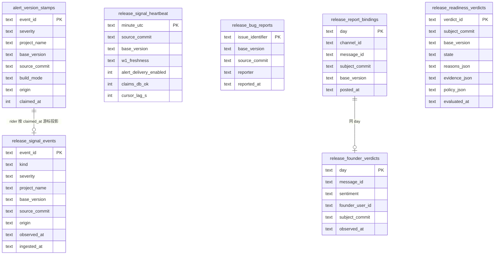

# FLY-2390 判据 c 聚合 — 调研
Issue: FLY-2390 (https://linear.app/geoforge3d/issue/FLY-2390/1143b3-判据-c-聚合消费-fly-942-原始事件-版本归因-watchdog-heartbeat源健康-报-bug-打版本-tag)
日期: 2026-09-10
基于: exploration.md

> 目的:把 exploration 里的方案落到**具体文件、函数、表、消费者**上,给 plan 做蓝本。所有行号为 2026-09-10 `main`(`d964e9fc`)实核。

---

## 1. 原始事件的完整宇宙:`~/.flywheel/alerts/claims.db`

exploration §1.1 说 Bridge 侧 `alert()` 看不到 shell 成功发出的告警。调研发现一个更好的接入点:**两条路径都在发出前先去同一个 sqlite 文件抢 claim**。

| 项 | 事实 | 出处 |
|---|---|---|
| 文件 | `${FLYWHEEL_CLAIMS_DB:-~/.flywheel/alerts/claims.db}` | `scripts/lead-alert.sh:492`;TS `DEFAULT_CLAIMS_DB`(`bridge/lead-alert-helpers.ts`) |
| `alert_claims(event_id PK, lead_id, event_type, claimed_at INTEGER)` | 「intentionally remains the shared four-column compatibility table」—— **不许改列** | `lead-alert.sh:488-512`;`lead-alert-helpers.ts:133-138` |
| `alert_deliveries(event_id PK, state, lease_token, lease_until, attempt_count, updated_at, last_error)` | shell 侧「companion receipt table」先例 —— **同库加伴表是既有模式** | `lead-alert.sh:514-521` |
| shell 写法 | `sqlite3 "$CLAIMS_DB" <<<"$CLAIM_SQL"`,`BEGIN IMMEDIATE` 一个事务里 `INSERT OR IGNORE` claim + delivery | `lead-alert.sh:505-540` |
| Bridge 写法 | `createClaimsClaimer(dbPath)` 返回 `(eventId, leadId, kind) → true/false/null`,经 `sqliteRunWithStdin` 子进程执行同款 SQL;在 `LeadAlertNotifier.alert()` 里被调用(`payload.eventId / leadId / eventType`) | `lead-alert-helpers.ts:116-160`;`LeadAlertNotifier.ts:996-1010` |
| 生产内容 | 33,853 claims;最近 30 天含 `deploy_degraded 61 / deploy_failed 26 / crash_loop 21 / bridge_abnormal_exit 142 / mailbox_dead_letter 534`;`alert_deliveries` sent 2022 / dead_lettered 1091 / queued 94 | 只读实核 |
| 清理 | 没有任何脚本 DELETE `alert_claims`(grep 全仓无命中)—— 只增 | grep 实核 |

⇒ **捕获点**定在 claim 事务:两条路径各自在自己的 claim SQL 里**多插一行伴表** `alert_version_stamps(event_id PK, severity, project_name, base_version, source_commit, build_mode, origin, claimed_at)`。`alert_claims` 四列不动;shell 侧 `record_delivery` 逻辑不动;Bridge 侧 `createClaimsClaimer` 签名扩一个可选对象参数(旧调用形状保持可用)。

**shell 侧的版本来源**:`lead-alert.sh` 今天不读版本。用 `${FLYWHEEL_DEPLOYED_SHA_FILE:-~/.flywheel/deployed-sha}`(更新器写,`update-flywheel.sh:21`)+ `${FLYWHEEL_REPO}/doc/VERSION`;任一读不到或格式不对 → 盖 `source_commit=NULL / base_version=NULL`(**不猜**),评估侧把 NULL 归因行计入 `unattributed`,窗口内出现 ≥1 条 severe 未归因行 ⇒ `unknown: unattributed_severe`(保守)。

**Bridge 侧的版本来源**:`resolveBridgeBuildIdentity()`(`bridge/build-identity.ts:11`)在 boot 时解析一次;`normalizeVersionFile(readFileSync(doc/VERSION))`(`release-contract/src/grammar.mjs:65`)同样 boot 时一次。`packages/teamlead` 今天**不依赖** `flywheel-release-contract`;加 `"flywheel-release-contract": "workspace:*"`(零依赖包,B0 §2 已声明它是 B3 的消费者)。

## 2. Bridge 摄取:GatePoller rider → StateStore 投影

| 项 | 事实 | 出处 |
|---|---|---|
| 零新 timer | 周期性工作一律做 `GatePoller` 的 `onXxxTick?` 回调;`riderDueThisTick(anchor, everyNTicks, ready, setAnchor)` 决定当 tick 是否轮到;默认 20 tick ≈ 60 s | `gate-poller.ts:136-175, 612-690, 1337-1349` |
| 装配处 | `new GatePoller({... onLeadPatrolTick: leadPatrolTickPass, onSummaryAbsorptionTick: summaryAbsorptionPass, ...})`;pass 用 `createXxxPass({store, ...deps})` 工厂造,内部 single-flight + try/catch | `plugin.ts:10721, 10861-10870`;样板 `createSummaryAbsorptionPass`(`plugin.ts:10527`) |
| 读 claims.db | 复用 `createClaimsReader`/`sqliteRunWithStdin` 的子进程 sqlite3 方式;按 `claimed_at > cursor` 增量读伴表,cursor 存 StateStore(`release_signal_cursor`) | `lead-alert-helpers.ts:73` |
| 投影表 | `release_signal_events`(见 §5)以 `event_id` 为 PK,`INSERT OR IGNORE`,天然幂等 | — |
| heartbeat | 同一 rider 每 tick upsert `release_signal_heartbeat`(按分钟粒度,`minute_utc PK`);字段 `source_commit / base_version / w1_freshness / alert_delivery_enabled / claims_db_ok / cursor_lag_s` | w1 取 `buildLivenessManifest` 的 tracker snapshot(`bridge/liveness-manifest.ts:251,302`);`alert_delivery_enabled` = `LeadAlertNotifier.deliveryEnabled()`(`LeadAlertNotifier.ts:~920`) |
| 外部旁证 | `~/.flywheel/state/bridge-liveness-probe.json`(launchd `com.flywheel.bridge-liveness-probe` 每 60 s)`down.lastOkTs / down.since` | `scripts/bridge-liveness-probe.sh:40, 71-86`;本机 loaded 实核 |

## 3. 部署时间线(soak 窗口的边界)

| 项 | 事实 | 出处 |
|---|---|---|
| 写入 | 更新器每次 deployed-sha 前进 OLD→NEW,按 `git log OLD..NEW` 逐 commit `report-deployed --project flywheel --source fallback-git-log --merge-sha <c> --deployed-sha NEW --deploy-batch-id NEW` | `restart-services.sh:100-135` |
| 表 | `deployment_events(project_name, issue_identifier, pr_number, merge_sha, deployed_sha, deploy_batch_id, environment, source, source_event_id, deployed_at, recorded_at, metadata_json, dedup_key)` | `StateStore.ts:5737` |
| 读 | 只有 `getDeploymentEventsInRange(sinceUtc, untilUtc)`;需要新增 `getDeploymentWindowForSha(project, sha)` = `{firstDeployedAt = min(deployed_at) where deployed_sha=sha, nextBatchAt = min(deployed_at) where deployed_sha≠sha and deployed_at > firstDeployedAt}` | `StateStore.ts:10045` |
| 生产 | 376 行全 `fallback-git-log`,最新 2026-09-11 00:52;本机 `deployed-sha = d964e9fc…` | 实核 |
| 边界 | 同一 sha 可能出现在多个批次(回滚再前进)——取**最近一次**连续窗口;`environment` 只算 `production` | — |

## 4. 三个外部接口面

### 4.1 报 bug 咽喉(信号 B)

| 项 | 事实 | 出处 |
|---|---|---|
| 路由 | `POST /api/linear/create-issue`,`tokenAuthMiddleware(config.apiToken, config.geminiAgentToken)`;body `{title, description, priority, team, project, labels[], parentId}` | `plugin.ts:3742-4032` |
| label 处理 | 名字经 `resolveTeamScopedLabel` 解析(不存在 → 404,不建新 label);再合并项目 scope label | `plugin.ts:3966-3993` |
| 创建 | `client.createIssue({teamId, title, description, priority, labelIds, projectId?, parentId?})` → `res.json({ok, issue:{id, identifier, url}})` | `plugin.ts:3996-4013` |
| 调用方 | `flywheel-comm dependency`(`commands/dependency.ts:323`);gemini-agent tool(`gemini-agent/src/tools/registry.ts:111`);runner-patrol 规则 curl 示例(`lead-rules-base/runner-patrol-rules.md:426`,已带 `labels:["Flywheel"]`) | 子代理 sweep |
| 绕过者 | `scripts/xiaohongshu-scheduler.ts:222`、`scripts/meeting-notes-scheduler.ts:514` 直用 Linear SDK(非 bug 场景);founder `/create-issue`(`~/.claude/commands/create-issue.md`,仓外)用 Linear MCP | 同上 |
| 结论 | 在创建成功之后(拿到 `identifier`)、且请求 `labels` 含 bug label(名字匹配 env `FLYWHEEL_BUG_LABEL`,默认 `Bug`,大小写不敏感)或 body `bug: true` 时:① description 已在创建前追加页脚;② `store.insertReleaseBugReport(...)`。页脚格式固定一行:`Reported-on-version: <base> @ <sourceCommit40>`(无版本时写 `unknown`,不省略) | — |

`flywheel-comm` 新子命令的挂点:`packages/flywheel-comm/src/index.ts:406-436` 的 `switch`(`publish-report` / `report-deployed` 同处),命令文件放 `src/commands/`。

### 4.2 日报与 👍/👎 锚点(信号 C)

| 项 | 事实 | 出处 |
|---|---|---|
| 渲染只读模式 | `POST /api/digest/render {day?}` → HTML;Bridge **不写文件**;脚本写文件再交 `publish-report` | `bridge/digest-route.ts:1-45`;`plugin.ts:4791-4820` |
| 脚本样板 | `scripts/daily-digest.sh`:env 覆盖快照/恢复(R4#3)、mkdir 锁、等 `restart.lock.d`、等 `/health`、render、512 KiB 上限、`publish-report` | `daily-digest.sh:1-140` |
| 单元清单 | 新 launchd 单元必须登记 `scripts/launchd/units.manifest`(policy `copy` / `hold`),`launchd-units-manifest.test.sh` 守卫 | `scripts/launchd/units.manifest` |
| deliver 回执 | `publish-report` stdout JSON 信封含 `messageId`(`--publish-only` 为 null);`kind` 字段目前只被 `token_report` 消费(`reports-route.ts:511`),其它值原样透传、不报错 | `commands/publish-report.ts:75-110, 300-306` |
| 反应轮询 | 每 Lead 的 `reactionFetcherImpl` = `GET ${DISCORD_API}/channels/{cid}/messages/{mid}/reactions/{emoji}?limit=100`,`Authorization: Bot ${lead.botToken ?? config.discordBotToken}`;非 200 fail-closed | `gate-poller.ts:2975-3030` |
| founder 身份 | `deriveCanonicalFounderId(DISCORD_OWNER_USER_ID, founderConsentUserId)`,两者都在且不等 → `null`(拒) | `approval-signal/canonical-founder-id.ts:22-33` |
| 现有 emoji 合同 | approval-signal 只认 ✅;👍/👎 无任何持久化 | `approval-signal/reaction-approval-source.ts:11` |

⇒ 绑定表 `release_report_bindings(day PK, channel_id, message_id, subject_commit, base_version, posted_at)` 由脚本在 deliver 成功后 `POST /api/release-readiness/report-binding` 写入;rider 只轮询 **最近 2 天** 的绑定(每条消息两个 GET:`👍` `👎`),写 `release_founder_verdicts`。

### 4.3 B4 的读面

- `GET /api/release-readiness/verdict?commit=<40hex>` → 当场评估 + 落账 + 返回 `{verdictId, subject, state, reasons, evidence, policy, evaluatedAt}`。
- B4 拿 `BetaCandidate.sourceCommit`(B0 `identity.mjs:18 deriveBetaCandidate`)来问;B3 不读 manifest。
- `commit` 必须 40 hex,否则 400;找不到部署窗口 → 200 且 `state=unknown, reasons=[no_deployment_evidence]`(**是合法答案不是错误**)。

## 5. 数据模型草案(StateStore,全部 `CREATE TABLE IF NOT EXISTS`)

`alert_version_stamps` 在 **claims.db**(捕获);其余六张在 **StateStore**(评估与展示)。`release_signal_cursor` 是单行 KV(`last_claimed_at`),并入 `release_signal_heartbeat` 的 `cursor_lag_s` 展示。

## 6. 保留与消费者登记(FLY-2006)

- 新读 `deployment_events` 的代码(`getDeploymentWindowForSha`)必须登记到 `scripts/fly-2006-retention-consumer-gate.config.json` 的 `consumers`,格式 `{file, relation, baseTable, usage: read|anti_join, disposition: protect|candidate_guarded}`;gate 扫 `packages/` 与 `scripts/` 的生产源码(`fly-2006-retention-consumer-gate.mjs:50`)。
- 新表的保留:`release_signal_events` / `release_signal_heartbeat` 30 天;`release_readiness_verdicts` 90 天;`release_bug_reports` / `release_founder_verdicts` / `release_report_bindings` 不删(小表)。登记进同一 config 的 `targetTables`,并把消费者标 `protect`。
- claims.db 伴表 `alert_version_stamps`:与 `alert_claims` 同寿命(今天都不清理),不引入新清理。

## 7. 测试基础设施

| 层 | 事实 |
|---|---|
| Bridge 单测 | vitest;`StateStore.create(":memory:")`(`__tests__/digest-service.test.ts:85`);纯聚合 + 注入 IO 的样板 `aggregateDeploymentDigest`(`digest-service.ts:127`) |
| 路由挂载测试 | `__tests__/digest-route-mount.test.ts`(有/无 token 两态) |
| shell 测试 | `scripts/__tests__/lead-alert-*.test.sh` 一族(fly927 / strict-delivery / dirs),用假 `sqlite3`/`curl` 夹具;CI 由 `ci-shell-suite-enumeration.test.sh` 枚举,新脚本要进枚举 |
| 排除 | 跑套件必排除 `**/tmux-viewer.macos.test.ts`(会开 Terminal.app) |
| 守卫 | `fly1560-teardown-guard.test.ts` 禁 watchdog 家族名 —— 本单命名全用 `release-readiness` / `release-signal`,不含 `watchdog` |
| 图 | `mmdc 11.12.0` 在 `/opt/homebrew/bin/mmdc`;founder HTML 复用 `engineering/doc/FLY-2388-release-pipeline-p4/founder-design.template.html` 的评论层结构 |

## 8. 风险与开放点(带到 plan)

1. **Q1(已 ask c27ae449)**:更新器 commit ≠ beta sourceCommit。默认按 fail-closed 出货;日报显式列出「最新 beta 的 sourceCommit 在本机是否跑过」提醒对齐。
2. **claims.db 是子进程 sqlite3 访问**(不是 sql.js):伴表插入放在同一 `BEGIN IMMEDIATE` 事务里;sqlite3 CLI 缺失或超时 → claim 本身已有降级路径(`won === null`),伴表随之缺席 —— heartbeat 的 `claims_db_ok=0` 让评估变 `unknown`,不会静默。
3. **重启窗口**:部署重启期间 Bridge 不写 heartbeat 属正常,缺口容忍 30 min 覆盖;超过则 `unknown`,这正是「部署本身坏了」该有的答案。
4. **Discord 反应轮询配额**:每 tick 最多 2 天 × 2 emoji = 4 个 GET,与 ship-approval 轮询同级。
5. **页脚注入**是对 Linear 内容的改动,只在 bug 场景、只追加一行,且被 `FLYWHEEL_READINESS_BUG_FOOTER=0` 关闭时零改动(默认开)。

## 9. 补充(设计完成后调研子代理回报,2026-09-11;供实现节点)

> **以 plan.md v4 为准**:本文 §1 / §2 / §4.2 写的「claim 事务盖章(`alert_version_stamps`)」「按分钟 upsert heartbeat」「`report-binding` 路由 + 只轮询最近 2 天」是初版方案,已被 Codex 三轮评审 + Lead 裁定改成「观测按 `(event_id, 版本, occurrence)`、Bridge 在 `alert()` 入口直写、heartbeat 每 tick 追加、publication 走 outbox、窗口内全部日报都扫」。事实与行号仍有效,方案以 plan 为准。

- `POST /api/linear/create-issue` 的 gemini-agent **scoped token 也可达**(`bridge/__tests__/gemini-scoped-token.test.ts:26`)⇒ intent → Linear → finalize 三段对 scoped 调用方同样生效,测试要覆盖两种 token。
- 现有路由测试文件:`packages/teamlead/src/__tests__/create-issue.test.ts:152`(`POST /api/linear/create-issue (GEO-298)`),plan §6 的「扩现有 linear-proxy 路由测试」即扩它。
- founder 建单的 prompt 侧文件共**三份**都在仓外:`~/.claude/commands/create-issue.md`、`~/clawd/skills/create-issue/SKILL.md`、`~/clawdbot-workspaces/clawd/skills/create-issue/SKILL.md`;plan §4.2 / §8-4 的「改走 Bridge 路由」前置验收要覆盖三处,由 Lead 派发。
