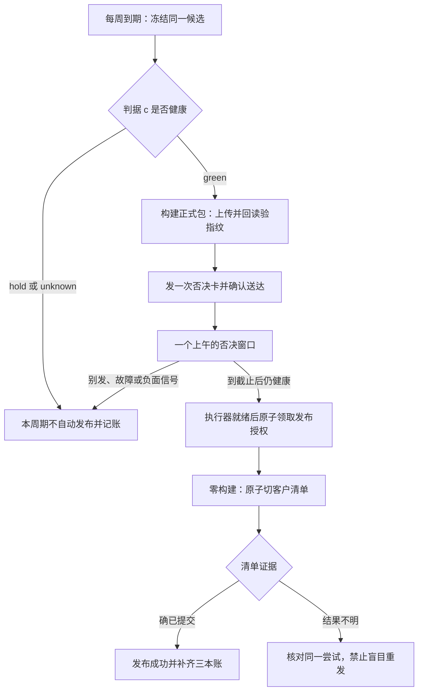
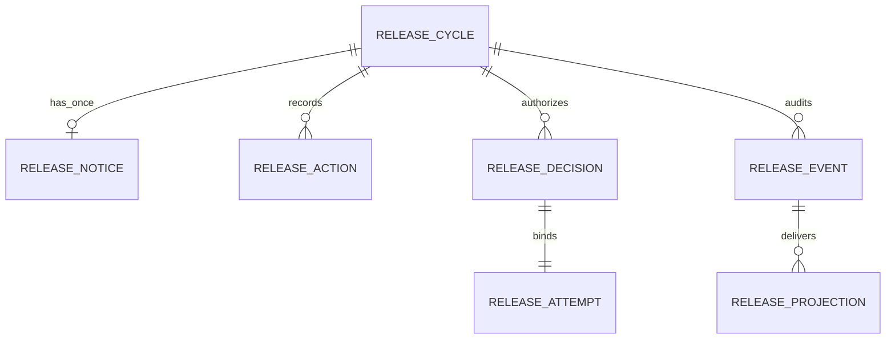

# FLY-2391 默认发布与否决 — 实施计划
Issue: FLY-2391 (https://linear.app/geoforge3d/issue/FLY-2391/1143b4-auto-ship-on-silenceopt-out-fail-closed-状态机-否决窗口绑不可变候选delivery)
日期: 2026-09-14
基于: research.md

状态: 待正式设计评审。本文规定后续 implementation 的完整范围；本节点只写设计与报告。

## 1. Annie 会看到什么

每周到期，系统准备好一个确定的客户版本，早上发一张「今天默认发布，想拦请在下午截止前点『别发』」卡片。她不操作且健康检查始终符合条件，系统到点发布。她按一次「别发」，收到「已拦下，本周期不自动发布」回执。没把握、通知失败或系统故障，就停住并说明原因。日常健康日报不再增加发布提问。

manifest 是客户取版本时读取的发布清单；只有它的客户指针切换成功才算发布。candidate 是本周期冻结的候选 beta；releaseArtifact 是在否决窗口之前已构建好的最终客户安装包。两者来源代码相同，但版本字样不同，所以分别记录 hash（文件内容的指纹）。



## 2. 范围与决策

- 实现 PRD §5.1–5.5、§6.2，继承 §7.3 与 B0/B1/B2/B3/B5。产品范围仅 flywheel。
- ship/PR 合并授权完全独立。不得写 `approved_to_ship`、PR-head approval、review/ship gate；不调用 `writeGateResponseAndRunPostWrite` 充当 release 授权。
- B4 cycle/decision 唯一真相在 Bridge 的 StateStore；B0 manifest 仍为 schemaVersion=1。端点控制信箱只传递不可变尝试、授权和执行结果，不决定 readiness，也不拥有第二套 cycle 状态机。
- 默认关，先 observe，再真手动 E2E，最后 founder 授权 canary。B6 cadence 不作依赖。
- 采用专用 release Discord app 的最小 Gateway 按钮接收器，复用现有 `ws`，生命周期由 Bridge 管理，独立于 Claude/Codex Lead。注册 app/凭据/频道、无 HTTP interaction endpoint 的配置证明属于激活操作，本设计不执行。
- 自动执行器走新窄 workflow 和 endpoint 能力；保留 Bridge 对 `FW_CUSTOMER_RELEASE_TOKEN` 的启动删除。拒绝把现有 COMMIT 输入或 GitHub environment 名称当授权。

## 3. 配置与唯一身份

新增项目 `customer_release` 配置，经 `packages/config/src/customer-release-config.ts` strict parser 读取：

| 字段 | 语义/校验 |
|---|---|
| mode | `off | observe | canary`，缺失为 off |
| timezone | 必填 IANA 时区；不默用机器 UTC |
| weekday / notice_local / deadline_local | 周期日 1–7、HH:mm；早上 notice、同日下午 deadline；由 Annie/HL 选定，未定不得激活 |
| minimum_veto_minutes | 必填 120–480；deadline-notice 至少此长；迟送不可缩短窗口 |
| policyRevision / founderEnableReceiptId | 配置摘要与 founder 生效回执；缺失/不匹配拒绝 canary |
| channelId / guildId / applicationId / botUserId | 启用前验证存在、属于该项目且 founder 可访问；owner 由 canonical resolver 单一派生 |
| bot_token_env / decision_token_env / executor workflow binding | 仅环境变量名及 repo/workflow 的稳定数字 id，值不入日志/账本 |

新增动态旗标 `auto_release_on_silence_enabled=false`。mode=canary、此旗标 true、合法 founder enable receipt、endpoint 对应 activation epoch 同时成立才允许 auto claim。配置/owner/凭据来源变更 bump epoch，取消尚未 claim 的旧周期；不得靠改 revision 再生成同一周窗口。后续政策修改走新的显式 founder 配置记录，不让普通 flag PATCH 绕过 enable 校验。

`cycleId = sha256(JSON.stringify([projectStableId, scheduleSlotDate]))`；slotDate 为配置时区该周发布日的 YYYY-MM-DD。DB UNIQUE(project_id, slot_date)，不包含易变 policyRevision；每个项目最多一个 unresolved commit attempt。DST 不存在/重复时刻、时钟倒退 >5 秒、漏过整段时间，不 catch-up 自动发，记 `unknown/schedule_invalid` 或 `missed_cycle`，下一周期再来。

周期冻结 beta manifest entry 与 B0 `BetaCandidate`。必须其 sourceCommit 等于 B3 当前已部署来源且满足 soak；若多个同 commit beta，按合法 betaN 最大者一次选择。后续新 beta 不替换冻结项；实际部署切离 frozen source 按 B3 得 unknown 取消。准备完成后调用 `deriveVetoBinding`：

```ts
type VetoBinding = {
  releaseId: string; betaVersion: string; betaPayloadSha256: string;
  releaseVersion: string; releasePayloadSha256: string; sourceCommit: string;
}; // 从 flywheel-release-contract 导入，不另造生产定义
```

所有 API 严格限制长度、hex、semver、枚举与未知字段。对象 key 从 B0 helper 派生。SQL 参数化；不把消息、版本或工具输出拼入 SQL/HTML/脚本。

## 4. 耐久结构与提交顺序



StateStore 的同一 native SQLite connection，新 store 模块 `bridge/customer-release/store.ts`，所有更新附预期 state/revision 条件并检查 affected rows：

| 表 | 主键与关键列 |
|---|---|
| customer_release_cycles | cycle_id PK；project_id+slot_date UNIQUE；release_id UNIQUE；frozen_beta_json、binding_json（prepared 后 write-once）、binding_digest、subject_json、policy_json、activation_epoch、state、revision、window_opened_at、deadline_at、cancel_reason、latest_verdict_id、invalidated_event_seq、created_at |
| customer_release_notices | cycle_id PK；notice_id UNIQUE；message_digest、send_state=`intent/sending/uncertain/delivered/rejected`、channel/app/bot/founder、message_id、delivered_at、access_probe_at；绑定内容/目标全部冻结 |
| customer_release_actions | interaction_id PK；cycle_id、full_binding_digest、actor_id、action=`veto/go/enable/disable`、received_at、effective_at、result、decision_id；保存可信事件安全字段，不保存 interaction token |
| customer_release_decisions | decision_id PK；attempt_id UNIQUE；cycle_id、binding_json、base_etag、trigger、actor、verdict_id、evidence_revision、activation_epoch、claimed_at、not_after、permit_json、state |
| customer_release_events | seq 单增 PK；event_id UNIQUE；cycle_id 可空、subject_commit、kind、who、when、reason、digest；追加式 |
| customer_release_projections | (event_id,target) PK；target=`linear/github`，外部 id、content_digest、state、attempt、retry_at；Bridge 源事件本身即第三本账 |

同事务：动作+周期状态+事件；B3 故障证据+失效事件+匹配周期取消；claim+decision+outbox intent。事务内不 await 网络；失败全回滚。`window_opened_at IS NOT NULL` 永远不可清空，历史事件不可变。不按 runner 生命周期清除此账本。

Endpoint 在私有 R2 新 `control/customer-release/<project>/<attemptId>/` 前缀存 create-only attempt、permit、started、result；不出现在 customer manifest/download/list API，通用 payload PUT 不得写这个前缀。只允许 dedicated roles。内容带 schemaVersion、audience、max byte size；marker 为恢复证据，不是业务授权或发布证明。控制对象不能被 ordinary cleanup capability 删除。

## 5. 全转移合同

每行都要求具名测试；未列转移一律 409/no mutation。事件去重优先于当前资格检查，重复动作返回原收据。

| ID | 起点 + 输入/条件 | 终点 + 原子效果 |
|---|---|---|
| T01 | 无 cycle；有效配置且本周期到期 | evaluating；唯一插入、冻结 beta，重复 tick 同行 |
| T02 | evaluating；c=hold/unknown、无合格 beta或配置无效 | cancelled；保存具体理由，本周期不再选另一候选 |
| T03 | evaluating；fresh green | preparing；持久 prepare intent，随后 dispatch B1 |
| T04 | preparing；同 source/artifact 已 prepared、回读验 hash/等价证明齐 | notice_pending；write-once binding、notice intent |
| T05 | preparing；确定 prepare/CI/hash失败或错过通知时段 | cancelled；记 hold/unknown；清理意图 |
| T06 | notice_pending；唯一消息回读一致、访问与 transport 健康、剩余窗口够长 | window_open；一次写 delivered receipt、openedAt、固定 deadline |
| T07 | notice_pending；明确失败、模糊投递无法恢复、消息内容不符、晚到 | cancelled；不补发第二张窗口卡 |
| T08 | preparing/notice_pending/window_open/awaiting_attempt；可信 founder veto | cancelled；action + veto reason + abandon outbox，响应已拦下 |
| T09 | evaluating/preparing/notice_pending/window_open/awaiting_attempt；当前候选负面/unknown、系统故障、flag关、epoch漂移 | cancelled；同事务 latch，不因恢复 green 重开 |
| T10 | window_open；now>=deadline 且无失效、刚取证 green | awaiting_attempt；只准备执行器，不产生发布许可 |
| T11 | awaiting_attempt；精确 ready attempt、fresh green、无 veto、activation合法 | committing；同步 claim、唯一 decision、待投递 permit |
| T12 | committing；exact op+tuple committed（包括丢回包后重查） | published；提交事实+who/when/trigger+投影意图 |
| T13 | committing；端点 durable 明确未调用 PUT/明确 CAS 412 | awaiting_attempt；结束旧 attempt；新尝试必须重查 green和失效，窗口不重开 |
| T14 | committing；PUT 可能已发但缺确定结果 | commit_unknown；保留 active attempt，禁止新 claim |
| T15 | commit_unknown；精确 committed | published；补记同一发布，零写 manifest |
| T16 | commit_unknown；exact abandon CAS 已赢或其他已证明终态 | cancelled；此后旧 ETag 提交不可能赢；记录实际 fence 证据 |
| T17 | cancelled；准备合法的新手动候选卡，founder 在新 binding 点 go | manual_ready；旧 cycle 窗口仍已消耗，保存 fresh manual action |
| T18 | manual_ready；执行器 ready且安全不变量齐 | committing；claim trigger=founder_go 或 founder_override，允许 readiness hold/unknown、仍需可信 founder 与全部技术安全门 |
| T19 | 任意终态；重复 tick/action/result | 原态；返回原 receipt，不再次发布/通知/投影 |
| T20 | committing/commit_unknown/published；后来 veto/故障 | 原执行态；记 post_claim_intervention，并核对/请求独立 B5 withdraw，绝不答已拦下 |

auto 权限表达式：`mode=canary && enabled && enableReceiptValid && epochMatches && now>=deadline && noticeDelivered && fullBindingEqual && c===green && sourcesHealthy && !invalidated && !veto && !unresolvedAttempt`。任何缺失/异常都不生成 auto claim。

## 6. 窗口与通知

deadline 是配置时区当日下午的固定时刻；`openedAt=durable receipt time`。只有 `deadline-openedAt >= minimum_veto_minutes` 才可开窗；晚送取消本周期，不把窗口悄悄顺延到晚上。预构建可在 notice 时刻前运行，到 notice 时刻前绝不投递默认发布卡。

卡片展示 beta 与 clean 版本、短 source/hash（完整绑定存服务端）、日期时区、明确截止、唯一「别发」按钮。customId 是 `cr:veto:<随机128位notice引用>`，不是权限本身；服务端取不可变完整 binding。消息正文 hash 包含按钮/截止/绑定/目标，不能在窗口内改候选或截止。

先持久 `sending`，再一次 POST。使用 nonce/enforce_nonce 辅助去重，但成功条件仍是实际 messageId、回读匹配 app/bot/channel/content digest、founder member 与有效频道查看权限、Gateway ready/heartbeat 确认。并不声称 Annie 已阅读，只证明通知已送到她可访问的指定位置。无法证明权限/送达时 unknown。

发送超时或进程在 POST 前后崩溃：`uncertain`，按 frozen nonce/marker 在目标频道有限完整扫描恢复同一条消息；0 条但无法证明未发送，不重 POST；多条/截断/读取失败均取消并告警。明确 pre-send 429/拒绝可在时间预算内重试同一 intent；绝不在模糊 POST 后创建新 intent。日报展示只读 cycle summary，任何 report/render/刷新动作都不创建 cycle/notice。

每 30 秒复验消息仍存在、内容/按钮一致、founder 权限仍存在；删除、编辑漂移、权限移除或扫描错误写 T09。最后 claim 前再次探测；探测到 claim 之间有 revision 守卫。

## 7. 一次否决、手动 go 与身份

新 `interaction-gateway.ts` 通过 Discord TLS Gateway authenticated bot session 收 INTERACTION_CREATE；启动查 `/users/@me` 与 application identity 精确匹配配置。ready 未成立、断线、session invalid、heartbeat 未 ACK、事件序列 gap：同步失效所有未 claim 周期；即使 resume 成功也不恢复这些周期。

严格校验 event schema/type、applicationId、guild/channel/messageId、nonce 引用、canonical founder id、member/user 非 bot、消息绑定和当前 activation epoch。不接受普通 master/runner bearer、自由文本、模型意见、Lead 代点或未经身份验证的 HTTP JSON。

接收交互时在同一个串行队列同步事务写 action；SQLite durable commit 成功后才回复「已拦下」。在 3 秒回应预算内完成；失败则不报成功并将本周期失效。重复 interactionId 返回原结果。deadline 边界以 Bridge 耐久受理时刻/事务顺序为准，截止前已受理的 veto 必须先于 T11；截止后但 claim 前仍保守接受 veto。界面不承诺网络未送达的点击已生效。

claim 后按钮显示「提交中」；迟到动作记录 post_claim_intervention。取消 workflow、删除 permit 文件、在另一份控制对象写 revoked 都不能被视为拦截成功证据。

veto 通过 B1 abandon intent 清理 prepared releaseId；它永不复活。若 Annie 后来要手动 go，先由受控准备任务执行新增 `rebind-prepared-artifact`：源为旧完整 op、同 beta active、同 objectKey/hash/source、回读字节，创建新 releaseId/op 并以现成对象 prepared，零构建。出一张明确「手动发这一个版本」的新卡，绑定新 releaseId 的完整 VetoBinding；需新的 founder go。它不是第二个沉默窗口。

手动 go 记录 `founder_go`（green）或 `founder_override`（hold/unknown，并保存原理由）。不覆盖 CI、等价证明、hash、immutable tuple、active beta、clean semver 永不复用、CAS；无可验证 artifact/身份时拒绝。此前卡片的 go 不自动迁移到新 binding。

## 8. 执行时授权与远端提交

### 8.1 零构建执行器与控制信箱

新增 `.github/workflows/payload-auto-release.yml`：workflow_dispatch、main-only、固定 reviewed workflow/code SHA、全局 `payload-release` queue；独立 `release-auto` environment 仅存 `FW_AUTO_RELEASE_EXECUTOR_TOKEN`，没有人工逐次 approval、没有 customer/ops 凭据、没有构建/发布 npm 权限。是否建立此环境须激活时 founder 授权；不删除原 release environment 保护。

执行器输入 cycleId/releaseId/full binding digest；这些输入不是授权。先重读完整 binding并流式回读对象 hash，再调用新增受限 API：

| API | 主体/效果 |
|---|---|
| POST /admin/release-attempts | executor；strict fullBinding/baseEtag/readbackSha256；端点重新 derive，生成 attemptId+随机nonce+端点时间，create-only；不接受客户端 manifest |
| GET /admin/release-attempts/pending | decision-writer；有界分页、只返回本项目 ready attempt，无 customer key |
| PUT /admin/release-attempts/:id/permit | decision-writer；create-only，不同内容 409；endpoint 校验 audience/epoch/claim/full tuple/etag/expiry/decision id，禁止 executor 写 |
| GET /admin/release-attempts/:id | executor/decision-writer；精确读取本 attempt，敏感 token 不返回 |
| POST /admin/release-attempts/:id/execute | executor；消费该 attempt 的 permit，端点构造唯一合法 release diff，不接受任意 pointer |
| POST /admin/release-attempts/:id/fence | executor + 对该 attempt 的 Bridge fence intent；仅 exact prepared→abandoned，禁止其他写 |

Bridge 仅新增 `FW_RELEASE_DECISION_TOKEN`，可读 pending、投递决定/精确 fence 意图，不能调用 customer manifest、keys、withdraw、payload PUT。现有 beta-publish 用于 prepare。Endpoint 的 role hash 必须互异，缺失/重复拒绝配置；worker、serve-node 与全部 handler harness 同步注入。

### 8.2 claim 的原子语义

Bridge 每 1 秒有界 poll pending（最多 1 active 项目/attempt，失败退避），执行器就绪后才授权；不让排队任务拿早上的 green。claim 前先完成远端 manifest/notice/access 探测，再在同步事务里重新 collect/evaluate frozen B3 subject、读最新 epoch/失效 revision/veto/clock/Gateway health，检查 T11。调用 collect 的 filesystem错误即 unknown。事务提交持久 decision 后才能投递 permit；失败重投同一字节，不能多 mint。

permit 包含 endpoint audience、project/cycle/decision/attempt/nonce、fullBinding、baseEtag、activationEpoch、action=commit、trigger/actor、verdictId/evidenceRevision、claimedAt/notAfter。validity 最大 30 秒，端点本地时间校验 future/expiry，时钟偏差 >5 秒拒绝；这只是允许发起 CAS 的期限，不是完成发布期限。

claim 是本次 readiness/veto 授权的不可撤销截止点，必须在窗口之后。claim 前已持久的 veto/hold/unknown 全部赢；claim 后的故障/否决只形成提交后处置请求。没有架构能用两份数据库伪造跨网原子撤销；本设计明确呈现该边界。

### 8.3 端点执行与每次重试

1. permit 与 attempt 全字段一致、模式/epoch匹配、未过期；R2 create-only `started` marker 保证一个 attempt 只有一个执行者。重放只重查结果，不再 PUT。
2. 重读 manifest，要求 current ETag=permit.baseEtag；deriveVetoBinding 全等，prepared、active beta、对象 metadata/hash证据齐；使用提取的 B1 commit diff builder，不复制 vocabulary。所有准备性 await 结束后最后检查许可时间，随后最多一次 R2 manifest CAS。
3. pointer+version entry+releaseOp committed+同版本其他候选 abandon 在一次 CAS 内；人工/自动同一 B0 校验。marker 和 result 不替代 manifest。
4. 明确未调用 PUT 的 guard failure 或明确 CAS 412，durable 写 `no_write`。同一 cycle 可以创建新 attempt，但必须新的实时 B3 claim；有新的负面就取消，不重开窗口。最多 3 次明确 no_write 重试，超过取消，防止反馈循环。
5. PUT 超时/回包丢失、started 后崩溃都视为可能提交，不因许可到期或 workflow 失败重新执行。Bridge 标 commit_unknown，endpoint/Bridge 重查 exact op+full tuple。
6. 精确 committed → T12/T15；仍 prepared 不能证明旧 PUT 已死。若要确定停住，精确 abandon CAS 与旧提交争同一个 manifest ETag：abandon 赢则旧 commit 必败；commit 赢则真实已发布，进入 B5 withdraw 处置。fence 回包丢失也重查，不谎报 canceled。

自动 workflow 停止/超时不会自动回滚客户指针。新 cycle 在 unresolved attempt 时仅记 missed/held，禁止新提交。disable 阻止新 claim；已有许可/started 必须 drain/reconcile/fence 后才能声明自动发布已完全关闭。

### 8.4 旧入口不能绕过新授权

endpoint 增加受部署配置管理的 `releaseDecisionRequired`（默认 false，激活前必须 true）：在所有新增 clean release entry/commit diff 上要求 permit，只允许上述 endpoint-generated diff。启用后裸 `/admin/manifest` customer/ops 提交 clean release 返回 `release_decision_required`；beta、withdraw、cleanup 合法原功能保持原权限。

现有 `payload-promote.mjs commit` 与人工 commit workflow 增加 decision attempt 输入并接同一执行路径；手动来源必须是 Bridge 已验证 founder go。旧无决策参数模式仅允许 endpoint policy=false 的既有手动流程；policy=true 不回退。activation workflow 和 B1 acceptance 同步迁移。自动任务从不拥有能关 policy 的管理权限；关停应保持 policy=true，把系统退回 founder 手动 go，避免回退成无审计提交。

## 9. 健康失效不能只靠轮询

新增 `invalidateCustomerReleaseCycles` 同连接事务 helper，由以下写点按冻结 subject 匹配调用：release heartbeat 不健康/归因丢失，bug report/intent/health failure，founder down/scan failure，deployment anchor 关闭/切换，readiness verdict 非 green，publication/outbox 读取失败。对项目级来源错误失效该项目所有未 claim 周期。成功记录永远不清除 latch。

StateStore 的 B3 源事务同时追加 RELEASE_EVENT，确保扫描失败→恢复成功发生在两次 scheduler tick 之间仍会取消周期。FS outbox 每次 claim 重新 collect，正常 tick 每 30 秒检查；不可观察到的外部事实不伪称已知。

Bridge 启动统一取消残留 preparing/notice_pending/window_open/awaiting_attempt（unknown/restart），只 reconcile committing/unknown。正常 tick gap >90 秒、clock 回退、Gateway heartbeat 失效、notice 探测失败也取消。默认 flag off 时关闭新的 schedule/notice/dispatch，但保留 action receipt 与 in-flight reconciliation。没有基于 elapsed time 的强制“未发布”结论。

## 10. 三本账、迁移与回退

Bridge 追加 event 保存 cycle/releaseId/full tuple、who、when、trigger=`silence_auto/founder_go/founder_override`、readiness reasons、action/notice/decision/attempt/manifest 证明。Linear 与 GitHub 为可恢复投影：固定 `release-event:<eventId>` marker 查回、创建/更新已知外部 id、回读摘要后标 delivered；发送结果模糊先查 marker 不盲目重发。Linear 放绑定 release cycle 的 issue/comment，GitHub 放 releaseVersion 的版本记录/同候选固定记录，不污染 PR approval。取消/未发布也留账。

网络投影失败记 accounting_pending；它不把 publication 改回失败，也不触发再次提交。用户能看到发布事实与哪本账待补。日报只显示这些事实；不说「三本账一致」直到两个投影都回读确认。

增量 CREATE TABLE/INDEX，不 backfill 旧通知成 receipt、不把既有 approved PR 当 release go、不补开历史 cycle。部署先 endpoint strict policy 的可用版本，再 Bridge/workflow/Gateway，最后激活。迁移测试在旧数据库合法行上重复两次，历史表不变；未知 schema 只读停自动。

retention 将 release cycle/action/decision/event 与 projection 注册到现有数据库保留注册表/fixture；未决/active永不删，终态审计保留至少 365 天、原始 delivery/attempt transport 终态后 30 天可清理，但 receipt digest/full tuple/actor/trigger永久留在事件摘要。控制信箱清理必须 Bridge 已证实 terminal、无 in-flight CAS、审计投影完整；不对 active 前缀开 R2 age-only lifecycle。B1 staging 仍走原 cleanup/tombstone 合同。

回退：先 disable 新 claim → drain/fence unknown → 确认 manifest 实态 → stop B4 scheduler/Gateway → 回退应用字节。数据库 additive 表保留；endpoint decision policy保持启用，人工 go 接同一审计路径。endpoint 降到不认识该 policy 的旧版前，必须撤销 narrow executor/decision token、证明没有 in-flight写并保持手动发布环境硬 gate；此维护是单独操作，不在本设计执行。

## 11. 实施任务与 TDD

每块严格「写具名失败用例→运行确认红→最小实现→运行绿→重构→提交」。仅下面列出的生产位置可因本任务改动；其他消费者如需扩大必须把依据追加到设计修正。

| 块 | 文件与明确工作 | 红灯用例/交付 |
|---|---|---|
| I1 合同/存储 | 新 `packages/config/src/customer-release-config.ts` 并接 config 导出/项目解析；新 `bridge/customer-release/{types,store,policy}.ts`；StateStore 初始化、flag 定义、retention registry | missing config default off、同周改 revision 不重开、两进程 reserve 只一行、事务回滚、旧库重复迁移；`customer-release-store.test.ts`/`customer-release-policy.test.ts` |
| I2 健康与周期 | 新 `{scheduler,runtime}.ts`；`release-readiness/service.ts` 和 StateStore 所有上述 B3 源写点；plugin start/stop | T01–T05/T09/T10、失败后恢复不能清 latch、瞬时错误不被成功覆盖、重启不补发、新 beta 不换 candidate；`customer-release-scheduler.test.ts`/`customer-release-invalidation.test.ts` |
| I3 通知与动作 | 新 `{notice,interaction-gateway,actions}.ts`；plugin 生命周期、canonical founder helper；日报 report/routes 只读扩展 | T06–T08/T17/T19/T20、两个动作并发、错 app/user/card/hash、发送模糊/晚到、storage失败先于ACK、Gateway断线、日报不新开窗；`customer-release-notice.test.ts`/`customer-release-actions.test.ts` |
| I4 窄执行端 | 新 `packages/payload-endpoint/src/release-attempts.mjs`；handler/worker/serve-node/harness；提取 B1 diff builder；`scripts/release/payload-promote.mjs` 接受 attempt mode；新 auto workflow | 默认无能力、role不能越权、full tuple漂移、不能客户端构造 manifest、T11–T16、started重复/延迟PUT；`release-attempts.test.mjs`/`payload-auto-release.test.mjs` |
| I5 连接与手动路径 | 新 Bridge `{executor,decisions}.ts`；控制信箱 poll+claim+result；现有 commit/activation workflows 与 `payload-promote` rebind-prepared-artifact；B0 CONTRACT 更新消费者说明（schema不改） | T18、manual override不越技术门、旧路径policy=true拒绝、abandoned不得复活、新op同bytes需新go、shadow零permit |
| I6 记账与交付 | 新 `{accounting,report}.ts`；日报/render只读摘要；注册表/清理fixture；runbook与activation evidence reader | 线性化后投影失败不重发，HTTP模糊恢复单一marker，独立ship账零写入，disable drain；`customer-release-accounting.test.ts` |

I1→I2→I3→I4→I5→I6；测试与纯 report 设计可并行，但共享 StateStore edits 顺序执行。不要把本计划中的 TDD 描述误记成已运行测试。

### 11.1 必须覆盖的交错矩阵

| 场景 | 必须断言 |
|---|---|
| deadline-1ms veto / 同 tick claim | action/cancel 先提交，zero permit/manifest PUT |
| claim先赢、随后veto | 原 claim不撤回，不响应已拦下，post_claim_intervention落账 |
| hold/unknown 在 claim 前一条事务 | no claim；即使下条恢复green也不再开窗 |
| prepare回包丢失 | 查同releaseId，窗口后不再prepare/rebuild |
| notice POST成功但messageId丢失 | 恢复同一message；查不清就取消，零第二POST |
| 消息删除/修改/权限撤销/不新鲜 | T09；旧receipt不可继续授权 |
| ready attempt排队一天 | 到执行时重新claim；本周期过时则取消，不能用早先green |
| permit过期/不匹配audience、epoch、nonce、ETag | no PUT；重放不mint第二decision |
| CAS 412 后 c变unknown | 新claim拒绝，窗口计数仍1 |
| 两执行器同attempt | 唯一started；至多一个PUT，其余查询 |
| started后崩溃/PUT超时/许可过期 | commit_unknown，不把expiry当no-write，不新dispatch |
| PUT成功回包丢失/manifest后被withdraw | 按releaseOps已committed识别曾发布，另记撤版；不因pointer不在候选而重发 |
| fence与旧PUT两种次序 | abandon赢→旧CAS失败；commit赢→真实published+后续withdraw，禁止“成功否决” |
| manual go hold/unknown + hash错误/beta失活 | founder override只过readiness，技术错误依然拒绝 |
| 新beta、配置revision变化、日常report重放 | 不换候选、不重开本周窗口、无额外发布提问 |
| flag关/Bridge重启/clock回退/90秒tick gap | 未claim取消；inflight只reconcile，不新授权 |
| accounting两个远端之一500 | manifest提交次数仍1；projection恢复后同eventId两边一致 |

### 11.2 精确验证命令（实施节点执行）

```sh
pnpm --filter flywheel-teamlead exec vitest run src/bridge/__tests__/customer-release-store.test.ts src/bridge/__tests__/customer-release-policy.test.ts src/bridge/__tests__/customer-release-scheduler.test.ts src/bridge/__tests__/customer-release-invalidation.test.ts src/bridge/__tests__/customer-release-notice.test.ts src/bridge/__tests__/customer-release-actions.test.ts src/bridge/__tests__/customer-release-accounting.test.ts
pnpm --filter flywheel-teamlead exec vitest run src/__tests__/StateStore.release-readiness.test.ts src/bridge/__tests__/release-readiness-evaluate.test.ts src/bridge/__tests__/release-readiness-service.test.ts src/bridge/__tests__/release-readiness-rider.test.ts src/bridge/__tests__/release-readiness-routes.test.ts src/bridge/__tests__/release-readiness-report.test.ts
node --test packages/payload-endpoint/__tests__/*.test.mjs
node --test scripts/__tests__/payload-promote-controls.test.mjs scripts/__tests__/payload-auto-release.test.mjs
bash scripts/__tests__/payload-promote-argv.test.sh
bash scripts/__tests__/release-workflows-structure.test.sh
bash scripts/__tests__/payload-release-pipeline.test.sh
pnpm --filter flywheel-release-contract test:run
pnpm --filter flywheel-teamlead typecheck
pnpm lint
```

后续 implementation/QA 还执行其注入的 build/CI gate；本设计不以 focused pass 宣称全仓或生产通过。

## 12. 最后灰度与验收收据

下表全部满足前 `auto_release_on_silence_enabled=false`。每份 activation record 必须带环境、代码/配置摘要、端点、精确 manifest/subject/releaseId/hash、执行者、时间、真实输出与证据 URL；只写“已合入”/fixture PASS 不合格。

| 顺序 | 必须的真实证据 |
|---|---|
| A0 B0 | endpoint/Bridge/scripts 读同一合同版本，旧客户端兼容 |
| A1 B1+B2 | 同endpoint的immutable upload/readback、CI版本断言、commit CAS、下载 entitlement与cleanup安全联合E2E |
| A2 B3 | 真实beta Actions receipt/publishedSourceCommit/localDeployedSha/冻结subject一致；fresh green/hold，不带no_deployment_evidence/not_currently_deployed；故障能出unknown |
| A3 B5 | 同manifest真实install/update/即时rollback；previous-good有效/已过期/首版坏的quarantine或pause；客户端不反复装坏版 |
| A4 observe | 至少覆盖green、hold、unknown、veto与投递故障的模拟决策；无真实默认发布卡/permit/commit；observe使用隔离id空间不消费生产cycle |
| A5 真手动E2E | 新B4 notice/action/decision→窄executor→同artifact CAS→真实客户读到→三本账回读一致；再演练否决、精确fence及withdraw |
| A6 founder启用 | Annie/HL决定实际时刻；canonical founder新的enable动作绑定project/policy digest、证据bundle digest、activation epoch；机器/Lead代点无效 |
| A7 最后canary | 首个周期自动收紧为单项目单候选，真实卡一动作否决能停且留账；另一个到期green无动作成功，hold/unknown零自动commit |

启用动作有自己独立的 authorization receipt，不借 PRD批准、设计review、ship授权。A7 失败立即disable新claim并reconcile/fence，不在本节点部署或开启。指标：silence_auto占比、hold/unknown误发数=0、重复窗口=0、重复commit=0、通知未证实却claim=0、accounting_pending时长、post_claim_intervention及quarantine时延。

## 13. 风险与诚实边界

- 送达证明不是已读证明；权限、消息内容和回读都必须可证。
- 暴露的许可不能靠本地改状态撤销。30秒只是提交请求准入期限；已发出的R2 PUT可能更晚返回。unknown必须保持未决直到exact manifest或fence证据。
- 所有系统只对已观察并耐久接收的事实作保证；在claim前窗口内收到的否决必须阻止发布，claim后事件走独立处置。不得对用户显示误导的“已拦下”。
- B3 当前只认可正在部署的源码，可能因换版本取消本周期；v1保持fail-closed，不放宽soak归因。
- 新Gateway app与endpoint窄权限是必须交付的实现，不是已有能力或上线证明。生产网络/按钮/权限验证属于A5。
- 不设计晚发crash-loop自动降级、免费付费分档或新beta cadence；这些保留原PRD开放项。

## 14. 设计节点完成条件

探索/调研/本计划提交推送 → 注入 request-review 得有效 `reviewVerdict=APPROVED` → 只修blocking findings，advisories归Follow-ups → diagram-first founder HTML（逐卡留言/分块复制/CSP nonce/零外部资产）提交推送 → publish-only并验证托管页 → DESIGN-HTML ready Lead receipt → `complete --route phase_design_complete` → 按控制器回执 park。设计完成不等于实现、QA或生产激活完成。

## Implementation adapter clarification — 2026-09-15

I4 的 pending API 需要 R2 list({prefix, delimiter:"/", limit, cursor})。现有本地生产适配器 FsBucket 与 MemoryBucket 尚未提供 list。实现范围补入 packages/payload-endpoint/src/fs-bucket.mjs 和 __tests__/memory-bucket.mjs 的单目录 delimiter 分页，配套 release-listing.test.mjs；它们只是同一 endpoint 的存储适配，并不新增 cycle/授权真相。限定prefix及分页参数、cursor绑定prefix、只返回本页条目，不扫描payload/license的其他目录。FsBucket使用本地目录枚举后排序，分页限制响应及metadata读取数，不将其声称为跨实例或恒定目录枚举成本。

端点部署绑定新增 release-control-config.mjs：FW_RELEASE_CONTROL_JSON 的 schemaVersion=1 对应 projectId/audience/activationEpoch/mode/enabled；FW_RELEASE_DECISION_REQUIRED 控制旧clean提交gate。缺失control关闭窄执行；非法配置同时关闭窄执行并保留旧入口硬gate。只更改源代码与fixture配置，本节点不部署、不配置生产变量或启用。
