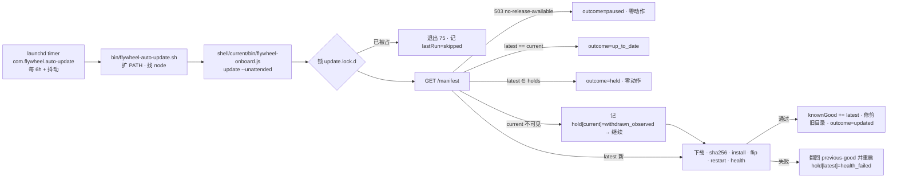

# FLY-2392 客户自动更新器 + 止血 — 探索

Issue: FLY-2392 (https://linear.app/geoforge3d/issue/FLY-2392/1143b5-客户自动更新器-止血定时更新器查-customer-release-装-即时失败回滚单飞-central)
日期: 2026-09-13
基于: 无

> **一句话**:在 FLY-1062(薄壳 + 版本目录 + `update` 命令)、FLY-2387(manifest 合同)、FLY-2388(withdraw 单 CAS)、FLY-2389(paused 503 wire)已落地的基础上,补齐 PRD §8 的三件事——① 客户机定时自动更新(单飞 + 即时失败回滚);② central withdraw 自动挑 previous-good、无 previous-good 时显式 paused,客户端记 quarantined 不重装;③ `rollback` / `install <旧版>` 两条客户本地命令。**不改 manifest schema、不改 v1 customer wire、不动 B4。**

---

## 0. 范围来源

PRD `product/doc/FLY-1098-release-cicd/prd.md` §8(客户升级 + 止血)与 §14 B5;激活序 B0 → (B1‖B2) → B3 → **B5** → B4。issue 正文只引 §8:

| PRD | 要求 | 本 issue 落点 |
|---|---|---|
| §8.1 | 定时查 `customer-release` 指针 → 有新版就下载 → 装进新版本目录 → 原子切 symlink → 重启 → 即时 health check;失败自动翻回旧版;**客户端自更新单飞** | 定时器 + `update --unattended` + 锁 |
| §8.2-1 | CAS 把 `customer-release` 回指最近一个仍可用的 last-known-good 并重新 pin | withdraw 自动派生 fallback |
| §8.2-2 | 没有可用 previous-good → 显式 `updates-paused / no-release-available`:现有安装保持原版本、新安装收到诚实可重试错误,绝不 dangling | withdraw `--allow-pause` 写 `latest=null`;客户端识别 503 |
| §8.2-3 | 客户端记录 quarantined 版本,在出现更高的允许版本或显式 override 前不重装 | 本地 hold 账本 |
| §8.3 | `flywheel rollback`(秒回上一版,本地目录还在)+ `flywheel install <旧版本号>`(只保证保留窗口内且非 quarantined) | 两条新子命令 |
| §14 B5 验收 | 三情况各一条 E2E:有 previous-good / previous-good 已过期 / 首个 release 就坏;quarantine 后客户端不再升级并有本地记录 | 真端点 + 真脚本的 acceptance 脚本 |

PRD 明确**不在**本 issue:晚期 crash-loop 自动降级(§13-2 open)、客户 changelog(§13-5)、B4 灰度。

---

## 1. 现状盘点(2026-09-13 worktree 事实,带出处)

### 1.1 客户侧薄壳 `@flywheel-ai/onboard`(FLY-1062)

- 三个命令,平铺 `if` 链:无参/`install` → `runOnboard`;`license set`;`update` → `runUpdate`(`packages/onboard-shell/bin/flywheel-onboard.js:22-35`)。**没有** `rollback`、`install <ver>`、`status`。零运行时依赖(`packages/onboard-shell/package.json` 无 `dependencies`),`files` 只有 `bin/lib/README.md`。
- 耐久根:`<stateDir>=$FLYWHEEL_STATE_DIR||~/.flywheel`;`runtime/versions/<ver>`(npm `--prefix`,真 PKG_ROOT 在其下 `node_modules/<payload>`)+ `runtime/current` symlink(`lib/config.mjs:15-31`,`lib/install.mjs:11-24,68-82,136-139`)。`current` 直接指 PKG_ROOT,切换 = tmp symlink + `renameSync`。
- **previous-good 无持久记录**:旧版本目录只是「没删」(`install.mjs:132-135` 注释:rollback slot;pruning 是 follow-up);`runUpdate` 只在进程内记 `oldPkgRoot`(`lib/update.mjs:55-66`)。
- **版本判定 = 字符串不等**:`shouldDownload: (m) => m.latest !== oldVer`(`update.mjs:78`)。指针后退会被当成「更新」安装——这正是 withdraw 后客户端自动降回 previous-good 的机制,**不需要 semver 比较**,但也意味着没有任何「别装这版」的记忆。
- health gate 与回滚:`restartServices` 跑 `<pkgRoot>/scripts/packaged/restart-packaged-services.sh`(`update.mjs:22-33`);该脚本经 supervisor seam 重启 `bridge` + 每个 `lead-<project>-<leadId>`,然后 90s 轮询 `/health`(`scripts/packaged/restart-packaged-services.sh:17-20,47-73`)。失败 → 删新版本目录、翻回旧版并重启;没有旧版则删 `current` 并报 `updateRollbackDegraded`(`update.mjs:101-152`)。**失败的版本被删得无痕,下一次 `update` 会原样再装一遍。**
- 首装路径 `runOnboard` **没有** restart / health gate,只有静态文件门 `verifyPkgRoot`(`install.mjs:51-62`),装完 exec `scripts/flywheel-onboard.sh` 交给 Buddy 引导。
- **无锁 / 无单飞**:`packages/onboard-shell` 全文无 lock/flock/mkdir 互斥。仓内先例 `scripts/update-flywheel.sh:353-395`(`mkdir` 原子锁目录 + pid/ident/created + PID 复用证明 + 退出码 75)。
- 本地状态文件只有两个:`<stateDir>/.env`(0600,授权码)与 `<stateDir>/onboard-journal.json`(0644,`{installedVersion, updatedAt}`,best-effort 合并写,`lib/journal.mjs`)。
- 错误分类 `EndpointError.kind ∈ {unauthorized, network, protocol, checksum}`;**任何非 2xx 非 401/403 都归 `network`**(`lib/endpoint.mjs:42-43`),文案 `MSG.network`「连不上安装服务器」(`lib/messages.mjs`)。paused 的 503 与 quarantined 版本的 404 今天都会被说成「网络问题」。
- 定时器:**客户机上没有**。`scripts/launchd/com.flywheel.updater.plist` 是 founder 开发机的 git 自更新(`scripts/update-flywheel.sh` 在 packaged 树上直接 `exit 3` 拒跑);`scripts/packaged/bootstrap-services.sh:19-21` 明说 packaged 路径不装它。supervisor 渲染器已支持 `kind:"timer"` + `intervalSeconds`/`schedule`(`scripts/lib/supervisor.sh:195-247`),label 规则 `com.flywheel.<name>`(`:169`)——**名字不能叫 `updater`**,否则与 founder 机同 label。`exec` 按空白切词(`:206-209`),路径含空格不可用。
- 装服务的时机:`bootstrap-services.sh` 的 `emit_specs()` 吐 bridge / daily-standup / 每 Lead 的 spec(`:114-134`),由 `provision-fleet-host.sh:484` 在 packaged 首装调用。launchd 最小 env 由各 wrapper 自扩 PATH(`scripts/flywheel-bridge-wrapper.sh:54`)。

### 1.2 manifest 合同(FLY-2387,`packages/release-contract`)

- 根 6 键:`schemaVersion=1, channels{internal-beta,customer-release}.{latest}, versions, releaseOps, releaseLedger, tombstones`;entry 11 键含 `status ∈ {active,quarantined,expired}`、`quarantinedAt`、`retentionSince`(`schema/manifest.schema.json`,`src/validator.mjs:17-48`)。**没有** history/withdrawn/pinned 字段;「pinned」= 是某指针的 `latest` ⇔ `retentionSince===null`(C-5)。
- **paused 是派生态,不是枚举**:`latest===null` 合法当且仅当该 channel 无 `active` entry(C-1b,`validator.mjs:266-285`)。fixture `examples/paused.json`、`examples/withdraw-fallback.json` 正是 B5 两个场景。
- 状态一向:`active→quarantined`、`active→expired`、`quarantined→expired`,无 un-quarantine(`packages/payload-endpoint/src/transitions.mjs:39-44`)。clean semver 永不复用(C-3)。
- 合同禁止消费者按 `max(versions)` 推断(`CONTRACT.md:46`);**customer wire v1 冻结**为 `{latest, versions:[{ver,sha256}]}`,`additionalProperties:false`,加字段必须开 `/v2/manifest`(`CONTRACT.md:250`)。
- 没有 semver 比较导出;客户端 `isSafeVersion` 只是路径安全门,不是版本文法。

### 1.3 服务端(FLY-2389,`packages/payload-endpoint`)

- 客户路由:`GET /manifest`、`GET /payload/:ver`(Bearer license key;`src/handler.mjs:151-197`)。可见集 = `status=active ∧ channel 允许 ∧ (是 latest ∨ 未过保留期)`(`src/views.mjs:16-30`)。quarantined 版本从 `versions[]` 消失,`/payload/<ver>` 同形 404。
- **paused 已实现**:`manifestView` 返回 `{empty:true, reason:"paused"|"never-activated"}` → 503 `{"error":"no-release-available"}` / `{"error":"not activated"}`(`handler.mjs:164-173`);paused entitlement 拒发新 key(`:583-593`)。
- `GET /manifest` **无 ETag、无 Cache-Control 之外的条件请求支持**;无限流、无 `Retry-After`。
- 「current 永不过期」= `retentionSince=null`;离开 latest 时盖 `now`;**过期后拒绝 re-pin**(`transitions.mjs:256-265` `re-pin refused — retention deadline passed`)。expire 需 `ops-admin|cleanup` capability(`transitions.mjs:306-335`);`quarantine` 与 `pointer` 需 `customer-release`。
- 已部署:`DEFAULT_ENDPOINT=https://flywheel-onboard-endpoint.xrliannie-b.workers.dev`(`onboard-shell/lib/config.mjs:12`);生产 delivery=presigned 302(60s)。真 R2 激活证据仍未执行(`engineering/doc/FLY-2389-payload-access-lifecycle/acceptance.md`)。
- 本地可跑的真端点:`src/serve-node.mjs`(FsBucket,stream 模式,`LISTENING host:port`);测试壳 `__tests__/serve.mjs` 另有 `POST /__test__/clock` 拨钟。

### 1.4 发布流水线 withdraw(FLY-2388)

- `scripts/release/payload-promote.mjs withdraw --withdraw <ver> --fallback <ver>`(`:512-571`):单 CAS 内校验「被撤版 = 当前 `customer-release` 指针」「fallback 是 active release」,写 `status=quarantined` + `latest=fallback`;服务端盖 `quarantinedAt`、清 fallback 的 `retentionSince`。同状态重跑 `outcome:"idempotent"` 零写。
- **fallback 是运维手填**,无 last-known-good 派生;**无 previous-good 时直接 fail(零写)**;**没有任何路径写 `latest=null`**。四处明文「paused / 无 fallback 仍归 B5」(`CONTRACT.md:231,273`;`doc/engineer/implementation/fly-1062-payload-release-runbook.md:61`)。
- 执行面 `.github/workflows/payload-promote-commit.yml`(`workflow_dispatch`、main-only、`environment: release`、`confirm=COMMIT`、`action=withdraw`、`withdraw-version`/`fallback-version` 必填且不同)。并发:Actions `concurrency: payload-release` + manifest ETag CAS(`scripts/release/lib/endpoint-client.mjs:73-107`,8 次重试,mutate 每次重判)。
- withdraw **不通知任何人**、不动对象、不召回 60s 内已签链接、不影响已装客户机。客户端唯一可观察信号 = 下次 `GET /manifest` 的 `latest` 变了。

### 1.5 测试基座

- 薄壳 bash 套件 6 个(`packages/onboard-shell/__tests__/*.test.sh`),经 `ONBOARD_ENDPOINT_IMPL` 可切到真 handler(`packages/payload-endpoint/__tests__/contract-consistency.test.sh`)。`onboard-shell-qa-gaps.test.sh` Q2 已覆盖「无旧版 + 新版不健康 → degraded 且 current 不悬空」。
- 全链 E2E `scripts/__tests__/customer-e2e-acceptance.test.sh`(真 serve-node + 真 `payload-release.mjs`/`payload-promote.mjs`/`license-key.mjs` + 真 npm pack 装到干净 HOME,E1–E6)。CI job `payload-distribution`(`.github/workflows/ci.yml:1341-1464`)。
- 记忆提醒:跑套件必排除 `**/tmux-viewer.macos.test.ts`。

---

## 2. 缺口清单(全部已核实为「不存在」)

| # | 缺口 | 影响的 PRD 条 |
|---|---|---|
| G1 | 客户机无定时器,只有交互式 `update` | §8.1 |
| G2 | 无锁/单飞 | §8.1「单飞」、§7.3-5 |
| G3 | previous-good 无持久记录,`rollback` 命令没东西可读 | §8.3 |
| G4 | 失败/quarantined 版本无本地账本,删得无痕、会重装 | §8.2-3 |
| G5 | 老版本目录无限增长 | 工程债(plan 风险 #10) |
| G6 | paused 503 / quarantined 404 被说成「网络问题」 | §8.2-2「诚实可重试错误」 |
| G7 | withdraw 不派生 last-known-good、不会写 paused | §8.2-1/2 |
| G8 | 「previous-good 已过期」时 re-pin 被拒而 C-1b 又不许 `latest=null`(仍有 status=active 的过期 entry)——**withdraw 会卡死**,除非同一 CAS 先 expire 它,而 `customer-release` capability 没有 expire 权 | §14 三情况之二 |
| G9 | 定时器 label 与 founder 机 `com.flywheel.updater` 撞名风险 | 工程 |

---

## 3. 设计选项与取舍

### A. 定时器的载体与「跑哪份薄壳」

| 选项 | 内容 | 取舍 |
|---|---|---|
| **A1(选)** | packaged bootstrap 多吐一个 `kind:"timer"` spec `auto-update`(label `com.flywheel.auto-update`),`exec` = `<stateDir>/bin/flywheel-auto-update.sh`;该 wrapper 扩 PATH、找 node、跑 **薄壳的固定副本** `<stateDir>/shell/current/bin/flywheel-onboard.js update --unattended` | 零网络依赖找壳;壳副本由薄壳自己在每次人工 `npx … install/update` 时 `cpSync` 自身(零依赖,`files` 只有 bin/lib)到 `<stateDir>/shell/versions/<shellVer>` 并原子切 `shell/current`——人工跑一次新壳就自动更新副本。多一个目录、多一段自拷贝逻辑 |
| A2 | timer 直接跑 `npx -y @flywheel-ai/onboard update` | 每次 tick 依赖 npm registry 与 npx 缓存语义;launchd 最小 env 下 `npx` 路径不稳;离线时行为不确定。否 |
| A3 | 把更新逻辑放进 payload(`runtime/current/scripts/...`)由 payload 自更新 | 破坏「薄壳与 payload 独立发布」(§7.3-4);坏 payload 会带坏自己的更新器。否 |

### B. 本地账本(单一真相)

| 选项 | 内容 | 取舍 |
|---|---|---|
| **B1(选)** | 新文件 `<stateDir>/update-ledger.json`(0644,原子写,永不含 key):`knownGood[]`(通过 health gate 的版本 + 时间,有界)、`holds{ver:{reason,at,attempts}}`、`lastRun{at,trigger,outcome,latest,detail}`、`runs[]`(有界 30 条)。**previous-good 是派生值** = `knownGood` 中最新且 `≠ current` 且本地目录仍在且 `verifyPkgRoot` 通过的那个;`current` 仍以 symlink + `.flywheel-prebuilt` 为真相,账本不镜像它 | 账本与目录事实可能漂移 → 派生时重验目录;简单 |
| B2 | 扩 `onboard-journal.json` | journal 是 resume hint 且 best-effort 合并写;把「安全关键」的 hold 混进去语义不清。否 |
| B3 | 无账本,只看目录 | 无法表达 hold / 失败次数。否 |

### C. 客户端如何「记 quarantined」

| 选项 | 内容 | 取舍 |
|---|---|---|
| **C1(选)** | wire 不给状态,客户端**从不可见推断**:某版本 X 要么是 `latest`、要么在 `versions[]`(在保留期内)、要么不可见。触发 hold 的三类本地事实:① 新版 health gate 失败 → `hold[ver]={reason:"health_failed",attempts}`;② 人工 `rollback` 从 X 翻走 → `hold[X]={reason:"manual_rollback"}`;③ tick 时发现 current X 不在可见集且 `latest≠X` → `hold[X]={reason:"withdrawn_observed"}`(诚实标签:观察到被撤,不是读到 quarantined 字面)。**hold 的清除只有两条路**:指针指向另一个未 hold 的版本(自然越过),或显式 `install <ver>` override | 不改 wire、不改 schema;标签诚实 |
| C2 | 开 `/v2/manifest` 带 `status` | wire 冻结,需版本化路由 + 双路由维护;B5 不需要。记为 follow-up |

### D. withdraw 自动派生 fallback + paused 写路径 + 过期 entry 处理(G7/G8)

| 选项 | 内容 | 取舍 |
|---|---|---|
| **D1(选)** | `payload-promote.mjs withdraw` 的 `--fallback` 变可选:缺省 = 在同一 CAS 的 mutate 内派生 **last-known-good** = `channel=release ∧ status=active ∧ ver≠withdrawn ∧ (retentionSince===null ∨ retentionSince+28d > now)` 中 `retentionSince` 最新者(即最近离开指针的那个;并列取 `publishedAt` 最新)。无候选 → 需要显式 `--allow-pause` 才写 `latest=null`,否则零写非零退出。**同一 CAS** 把已过保留期但仍 `active` 的 release entry 置 `expired`(否则 C-1b 拒绝 `latest=null`)——为此把 `expire` op 对 `channel=release ∧ 期限已过` 的 entry 开放给 `customer-release` capability(服务端 `transitions.mjs` capability 表一处改动;期限判定仍由服务端时钟) | 三情况都能一次 CAS 收口;capability 扩一条要 Codex 审 |
| D2 | 维持手填,无 previous-good 时等每小时 `payload-cleanup.yml` 先 expire 再手动 pause | 止血延迟最多 1h+;两步人工。否 |
| D3 | 服务端新 `POST /admin/withdraw` 一把梭 | 与「manifest 是唯一 commit point、admin 只有 manifest CAS」合同相悖。否 |

### E. 失败重试预算

`health_failed` 的 hold 允许**再试 1 次**(`attempts<2` 时下个 tick 可重装;每次都是真重启,代价可接受),第 2 次仍败 → 硬 hold 直到指针换版。理由:一次性瞬时故障(端口被占、机器刚醒)不该把一个版本永久拉黑;两次失败再说「这版在这台机器上不行」。

### F. 更新时机

固定间隔(默认 6h,`StartInterval`)+ wrapper 内 0–10 分钟随机抖动;不判 Bridge 是否忙(v1 不做,给 Lead 的 Q2)。重启对客户是可感知的中断,PRD §8.1 已接受(Chrome/VS Code 型)。

### G. `rollback` 与自动更新器的冲突

没有 hold 的话,人工 `rollback` 6 小时后会被 timer 升回去。C1 的 `manual_rollback` hold 解决;`--unattended` 模式对 `latest ∈ holds` 输出 `held` 并零动作。

### H. `install <ver>` 语义

先取 manifest;`ver` 必须在 `versions[]`(= 服务端已判「可见:active、在保留期或是 latest」),否则诚实报「该版本不可安装(已撤回或已超出保留期)」,**不去打 `/payload/<ver>` 撞 404**。成功后清 `holds[ver]`(显式 override),走同一条 install→flip→restart→health→失败回滚路径。

---

## 4. 初步形状(细节进 plan)

---

## 5. 向 Lead 的问题(非阻塞,已按默认值继续)

| # | 问题 | 我的默认 |
|---|---|---|
| Q1 | 自动检查间隔默认值:6h(与内部 beta 节奏一致)还是 12h/24h? | 6h,可由 `<stateDir>/auto-update.json` 的 `intervalSeconds` 覆盖(bootstrap 时读) |
| Q2 | 自动更新前是否要判「Bridge 空闲」(无在飞 session)再重启?v1 是否接受盲重启 | v1 盲重启,记为 follow-up |
| Q3 | D1 把「expire 已过期 release entry」开放给 `customer-release` capability,还是保守走 D2 两步 | D1 |
| Q4 | `flywheel-onboard auto-update on|off|status` 三个开关子命令要不要进 v1 | 进(客户止血的最后一道手闸;实现很薄) |
| Q5 | 客户端「记 quarantined」采用推断标签 `withdrawn_observed`(C1),`/v2/manifest` 状态字段留 follow-up | C1 |

---

## 6. 诚实边界

- 客户机感知 withdraw 的时延 = 定时间隔(默认 ≤6h + 抖动),没有推送;止血速度指标以此为上限。
- 「记 quarantined」是从不可见集推断,wire 不给理由;expired-after-supersede(客户机 28 天没开机)与 quarantined 在客户端同形,都记 `withdrawn_observed`,行为一致(都换到 latest)。
- 首装(`runOnboard`)仍无 health gate:PRD §14「首个 release 就坏」的客户侧含义是「fresh install 后 `update`/timer 的失败态明确」以及「central paused 后新安装收到诚实可重试错误」,不是给首装加重启门(首装由 Buddy 引导接管启动)。
- 晚期 crash-loop 自动降级(§13-2)不做;launchd `KeepAlive` 的 Bridge 自拉起与本 issue 无关。
- 不改 manifest schema、不改 v1 wire、不加 ETag 条件请求(每 tick 一次完整 `GET /manifest`,量级可忽略)。
- 真 R2 / 真 Worker 的激活证据仍是 FLY-2389 的未执行清单;本 issue 的 E2E 用 `serve-node`(stream)与测试壳(clock),presigned 路径由既有两 origin 测试覆盖。
- Linear MCP 401,issue 评论未读(与记忆一致);范围以 issue 正文 + PRD §8 为准。
