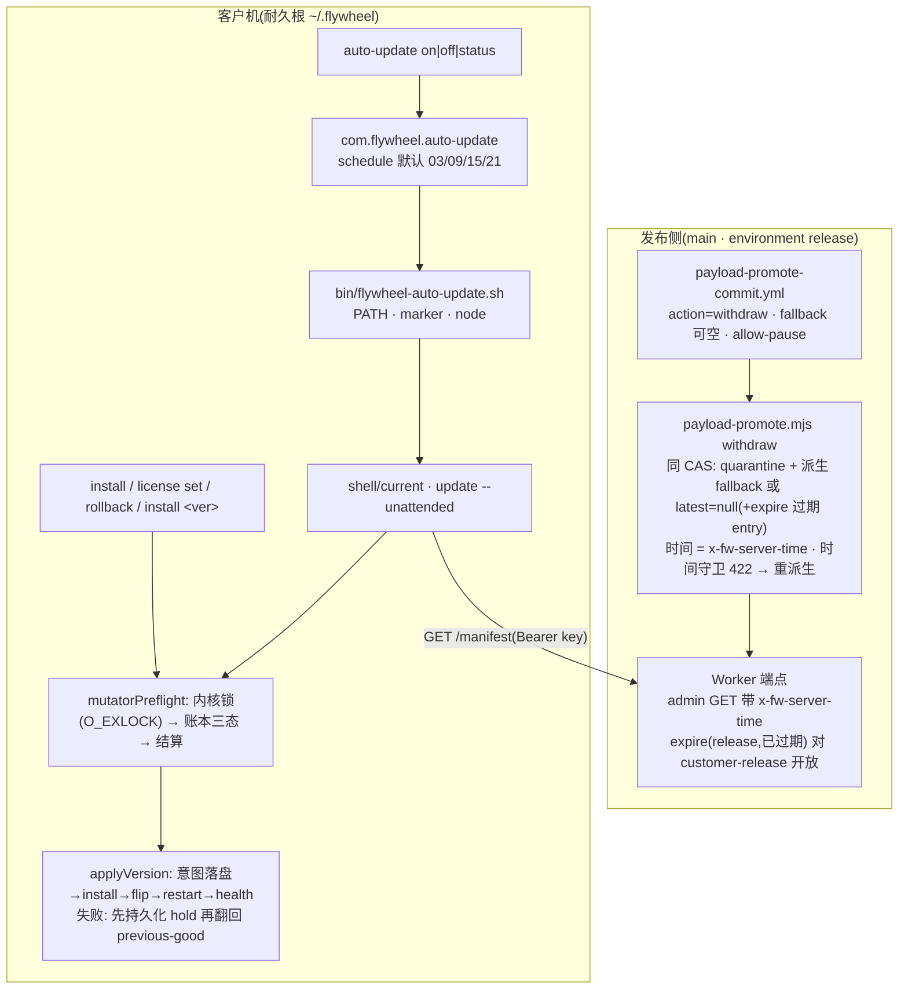

# FLY-2392 客户自动更新器 + 止血 — 实施计划

Issue: FLY-2392 (https://linear.app/geoforge3d/issue/FLY-2392/1143b5-客户自动更新器-止血定时更新器查-customer-release-装-即时失败回滚单飞-central)
日期: 2026-09-13
基于: research.md

> **一句话**:给客户机加一个 launchd/systemd 定时器,按低活动时窗跑薄壳 `update --unattended`(围栏单飞锁 + 本地账本 + 失败即时回滚 + hold 记忆 + 被撤版立即降回);给发布流水线的 withdraw 补「自动挑 previous-good / 无可用则显式 paused」的同 CAS 收口(以服务端时间为唯一权威,时间守卫 422 有界重派生);给客户加 `rollback`、`install <旧版>`、`auto-update on|off|status`。**不改 manifest schema、不改 v1 customer wire、不动 B4、不做晚期 crash-loop 降级。**
> **Lead 裁定已折入**(research §0,question `4b157705`):6h 可配;盲重启 + 默认 03:00 时窗 + 已知缺口记 follow-up;expire 对 release 开放给 customer-release 一处改动;`auto-update on|off|status` 进 v1;`withdrawn_observed` 推断标签。
> **评审记录**:§11 — Codex R1(7 HIGH + 3 MEDIUM,全部折入 v2)→ R2(6 HIGH + 1 MEDIUM,全部折入 v3)→ R3(4 HIGH + 1 MEDIUM,全部折入 v4;安全阀已报 Lead,question `12c767ea`)→ R4(Lead 授权受限确认轮:2 条 R3 残留 + 1 条新 HIGH + 1 LOW,全部折入 v5;新 HIGH 已按规则上报 Lead,question `7e62f2d4`)。
> **修订轨迹**:v1 初稿 → v2 折入 R1 → v3 折入 R2 → v4 折入 R3 → v5 折入 R4 → v6 折入 R5 阻断项(self-reapply 的恢复策略由耐久 applying 唯一派生:绝不 rm/flip current;结算表 `flipped|target`、`recovering|target` 两行分支)+ 收窄 inode 比对措辞。R5 后按 Lead 裁定(question `7e62f2d4`)走 leadAcceptance,见 review.md。

---

## 0. 全景



---

## 1. 稳定身份与展示标签

| 身份 | 值 / 形状 | 谁定 | 展示 |
|---|---|---|---|
| 定时器 spec 名 / label | `auto-update` → `com.flywheel.auto-update`(linux `auto-update.timer`) | bootstrap `emit_specs` | `status` 打「自动更新:开/关」 |
| wrapper | `<stateDir>/bin/flywheel-auto-update.sh <stateDir>`(源自 payload `scripts/packaged/flywheel-auto-update.sh`) | bootstrap `install_bin` | 不展示 |
| 壳固定副本 | `<stateDir>/shell/versions/<shellVer>/` + `<stateDir>/shell/current` symlink;临时目录 `.tmp-*`/`.trash-*` | 薄壳自拷(每次人工命令结束 + `auto-update on`) | `status` 打「更新程序版本」 |
| 账本 | `<stateDir>/update-ledger.json`,`schemaVersion:1`;读取三态 `missing / valid / corrupt` | 薄壳 | `status` 摘要;corrupt 有专门文案 |
| 账本 `applying` | `{operation:update|rollback|install_version, ver, fromVer, fromPkgRoot, targetCreated, phase:installing|flipped|recovering, holdOutgoingReason, clearHoldOnVer, startedAt, trigger}`;`flipped` 在 flip **前**写;成功意图在最初写入 | 薄壳 | — |
| `knownGood[].origin` | `health / outgoing` | 薄壳 | — |
| 配置 | `<stateDir>/auto-update.json` `{schemaVersion:1, checkEveryHours, applyHour, applyGraceHours}`,默认 `6 / 3 / 2` | 客户/支持 | `status` 打「每 N 小时检查,凌晨 H 点安装」 |
| 关闭 marker | `<stateDir>/auto-update.off`(存在即关) | `auto-update off` | — |
| 锁 | darwin:`<stateDir>/update.lock`(永不删除)经 `open(O_RDWR|O_CREAT|0x20|O_NONBLOCK)` 取内核独占锁,持有 = fd 打开,内核自动释放;非 darwin:`update.lock.d/owner.json{pid,created}`,不自动回收 | 所有改 `current` 的命令 | 拿不到 → 文案「另一个更新正在进行」;非 darwin dead-pid → 「上次更新异常退出,请删除 update.lock.d 后重试」 |
| 日志 | `<stateDir>/logs/auto-update.log`(append-only;≤256KB 尾部保留);锁失败**只**写这里 | wrapper + 薄壳 | — |
| 退出码 | `0` 成功/无事;`1` 失败;`2` 用法;`75` 锁被占 | 薄壳 | — |
| `lastRun.outcome` 枚举 | `updated / up_to_date / held / deferred / paused / rolled_back / degraded / unauthorized / error / settled` | 薄壳 | `status` 中文映射 |
| `holds[ver]` | `{reason: health_failed|manual_rollback|withdrawn_observed, at, attempts, lastAttemptId}`;`lastAttemptId = applying.startedAt`,同一 attempt 重放不递增 | 薄壳 | `status`「暂不安装」列表 |
| admin 时间头 | `GET /admin/manifest` 响应头 `x-fw-server-time: <canonical ISO>`(仅 admin 路由);client 仅在 `requireServerTime:true`(withdraw)时强制 | 端点 / client | — |
| 时间守卫 422 | violations 逐字 `re-pin refused — retention deadline passed` / `expire refused — retention window not elapsed` → withdraw 有界重派生(3 次) | client | run log |
| withdraw 结果 | `{action:"withdraw", withdrawn, fallback:<ver>|null, latest:<ver>|null, outcome:"withdrawn"|"paused"|"idempotent", expired:[…]}` | `payload-promote.mjs` | run log / `PROMOTE_RESULT` |
| workflow 新输入 | `allow-pause`(boolean,默认 false);`fallback-version` 变可选;二者互斥 | `payload-promote-commit.yml` | GitHub UI |
| 新 `EndpointError.kind` | `paused / notActivated / notAvailable` | 薄壳 | `MSG.paused / MSG.notActivated / MSG.versionNotAvailable` |

**一个真相**:`current` 仍由 symlink + `.flywheel-prebuilt` 定义;账本不镜像 current;previous-good 是派生值(research §2.6);withdraw 的「过期」只按服务端时间;channel 名只从 `flywheel-release-contract` 导出,薄壳代码不写 `"customer-release"` 字面量。

---

## 2. 范围与文件清单

### 2.1 服务端(`packages/payload-endpoint`)
- `src/transitions.mjs`:expire op 增 `channel`;`capabilityAllows` `case "expire"` 增 `RELEASE_CAPABILITY ∧ op.channel==="release"`。
- `src/handler.mjs:267-278`:admin GET manifest 响应加 `x-fw-server-time`(`new Date(requestStartedAt).toISOString()`)。
- 测试:新 `__tests__/expire-capability.test.mjs`(已过期 release → 200;未过期 → 422;beta → 403;tombstone → 403);`handler-admin.test.mjs` 增「admin GET 带 canonical 时间头且随注入时钟变化;customer GET 不带」。

### 2.2 流水线(`scripts/release`,`.github/workflows`)
- `scripts/release/lib/endpoint-client.mjs`:`readManifest({requireServerTime=false})` 解析头(存在则严格;缺失只在 require 时抛错);`casUpdate(mutate, describe, {requireServerTime=false, timeGuardRetries=0})`:mutate 签名扩为 `(copy, current, {serverNowMs})`;时间守卫 422(逐字匹配)在 `timeGuardRetries` 内重读重判,其它 422 立即抛错。现有调用方零改动。
- `scripts/release/payload-promote.mjs` `cmdWithdraw`:按 research §1.3 v2(终态重放先判;`--fallback` 可选;`--allow-pause`;互斥;`X` 集 expire;`requireServerTime:true, timeGuardRetries:3`;结果 JSON 增 `latest`、`expired`)。
- `.github/workflows/payload-promote-commit.yml`:`fallback-version` 描述改「可空=自动」;新增 `allow-pause`;Guards 更新;withdraw step 组装参数。
- `scripts/__tests__/release-workflows-structure.test.sh` S13 输入集加 `allow-pause`。
- `scripts/__tests__/payload-promote-controls.test.mjs`:W3a–W3j(research §1.3);新 `endpoint-client-server-time.test.mjs`(头缺失:非 require 返回 null、require 抛错;非法 → 抛错;合法 → 数值;时间守卫 422 重试计数与耗尽);`endpoint-client-etag.test.mjs` 的 fixture 加头以证明「解析但不强制」两路;`payload-release-pipeline.test.sh:546-557,793-798` 的 proxy 透传 `x-fw-server-time`;`payload-promote-argv.test.sh` 加 withdraw 参数形状(缺 `--withdraw`、`--fallback` 与 `--withdraw` 相同、`--fallback` 与 `--allow-pause` 并存 → 拒)。
- `doc/engineer/implementation/fly-1062-payload-release-runbook.md` §4 重写(含「端点先于脚本」部署顺序);`packages/release-contract/CONTRACT.md` 追加 **Amendment B5**(替代「paused/无 fallback 仍归 B5」时态句;记录 admin 时间头为可选响应头、withdraw 强制;schema 与 C-n 不变)。

### 2.3 薄壳(`packages/onboard-shell`)
- `lib/endpoint.mjs`:503 body 逐字解析 → `paused / notActivated`;payload 404 → `notAvailable`。
- `lib/messages.mjs`:新增文案(§1 与 `ledgerCorrupt`、`lockBusy`、`rollbackNone/Done/FailedRestored`、`heldSkip`、`deferred`、`autoUpdate*`、`versionNotAvailable`、`paused`、`notActivated`、`shellCopyFailed`)。
- 新 `lib/preflight.mjs`:`mutatorPreflight(cfg, {ident, exec}) → ctx{lock, ledger}` = 拿锁 → 账本三态(corrupt → 抛 `LedgerCorrupt`)→ `settleInflight`;**所有改 current 的入口**(`runOnboard`、`runLicenseSet`、`runUpdate`、`runRollback`、`runInstallVersion`、`auto-update on`)第一步调用;已持 ctx 的续跑(`license set` → `runOnboard`)传 `{ctx}` 不二次取锁。
- `lib/license.mjs`:`runLicenseSet` 第一步 `mutatorPreflight`(在 prompt / `fetchManifest` / `persistKey` 之前),续跑 `runOnboard(cfg, {…, ctx})`(R3#5)。
- `lib/onboard.mjs`:`messageFor` 三种新 kind;`runOnboard` 接入 preflight(首装只在账本 missing/valid 且无 inflight 时走现有路径);任何结束路径(含快路径 handoff 前)刷新壳副本 + `bootstrap --only auto-update`(失败只记日志)。
- 新 `lib/lock.mjs`(research §2.2 v5:darwin `O_EXLOCK` 内核锁 + inode 比对;非 darwin mkdir 锁不自动回收;无 token/回收/fencing)。
- 新 `lib/ledger.mjs`:`readLedger → {state, ledger}`(`applying` 字段非法/未知 operation 也判 corrupt)、`writeLedger`、`recordRun`、`addKnownGood(ver, origin)`、`setHold`、`clearHold`、`previousGood`、`holdBlocks`、`setApplying/clearApplying`、`commitApplySuccess(ledger, applying)`(单次原子写;**只从耐久 `applying` 读 holdOutgoingReason/clearHoldOnVer**)。
- 新 `lib/apply.mjs`:`applyVersion`(§3.2)与 `settleInflight`(§3.3)。
- 新 `lib/schedule.mjs`、`lib/shell-copy.mjs`(research §2.4 v2)、`lib/prune.mjs`。
- `lib/update.mjs` 重写(§3.1);新 `lib/rollback.mjs`、`lib/install-version.mjs`、`lib/auto-update.mjs`。
- `bin/flywheel-onboard.js` 分发;`README.md`。
- 测试:`__tests__/onboard-shell-rotation.test.sh` 增 U5–U13;新 `__tests__/onboard-shell-updater.test.sh`;新 `__tests__/lock-ledger.test.mjs`(node --test);`__tests__/stub-endpoint.mjs` 增 `STUB_MODE=paused` 与 `STUB_VERSIONS`;**`__tests__/onboard-shell-publish-gate.test.sh:57-89` 精确文件集加入全部新 `lib/*.mjs`**;`onboard-shell-secret.test.sh` S 矩阵扩到 ledger 与 auto-update.log。
- `packages/release-contract/__tests__/consumers-lint.test.mjs` `SCAN_ROOTS` 加 `packages/onboard-shell/lib`。

### 2.4 packaged 脚本(`scripts/packaged`,`scripts/lib`,`scripts/package-onboard.sh`)
- 新 `scripts/packaged/flywheel-auto-update.sh`(§3.9)。
- `scripts/packaged/bootstrap-services.sh`:`emit_specs` 增 `auto-update` timer spec;`install_bin` 增 wrapper;新 `--only <name>`(只装该 spec,跳过 host.json/Lead 物化/其他 spec)。
- `scripts/package-onboard.sh` `PO_SCRIPT_FILES` 加 `packaged/flywheel-auto-update.sh`;**`scripts/package-onboard-files.allow` 同步加入**;**`engineering/doc/FLY-1062-npm-distribution/packaged-path-audit.md` 加处置行**(X1 闭包,`package-onboard.test.sh:419-434`)。
- 测试:`scripts/__tests__/packaged-seams.test.sh` 增 timer spec 渲染断言;`provision-prebuilt.test.sh` dry-run 输出集更新;新 `scripts/__tests__/packaged-auto-update-wrapper.test.sh`;`package-onboard.test.sh` 必须绿。

### 2.5 全链验收(`scripts/__tests__`,`.github/workflows/ci.yml`)
- 新 `scripts/__tests__/customer-auto-update-acceptance.test.sh`(§4 C8 场景;用 `packages/payload-endpoint/__tests__/serve.mjs` admin 模式 + `/__test__/clock` + 真发布脚本 + npm-pack 装壳 + fake packer 的 fail marker)。
- `ci.yml`:`payload-distribution` job 末尾加该脚本;薄壳步骤加新 bash 套件与 `node --test packages/onboard-shell/__tests__/*.test.mjs`;`script-tests` 加 wrapper 测试。

### 2.6 不做
B4;`/v2/manifest`;Bridge 空闲判定;晚期 crash-loop 降级;客户 changelog;真 R2/npm 动作;对现有 `restart-packaged-services.sh` 的健康门语义改动;customer wire 任何字段。

---

## 3. 决策树与状态机(实现合同)

### 3.0 统一前置 `mutatorPreflight`(所有改 current 的入口)

```
P1 拿锁(research §2.2 v5:darwin 内核独占锁,EAGAIN → 追加 auto-update.log 一行;退 75;不写账本;非 darwin dead-pid 也 75 不回收)。锁由内核维持,不需要变更点核验
P2 unattended: 查 auto-update.off(持锁后、任何网络前)→ 存在则退 0 零动作
P3 readLedger:corrupt → MSG.ledgerCorrupt 退 1(零网络、零 flip、零 restart、零 handoff);missing → 空账本
P4 settleInflight(§3.3);结算写盘失败 → 退 1,不联网
```
适用:`runOnboard`(含 `installedComplete` 快路径:P4 之后才允许 handoff)、`license set`(自己先 preflight,再 prompt/联网/写 key,续跑 `runOnboard` 复用同一 ctx)、`update`、`rollback`、`install <ver>`、`auto-update on`。

### 3.1 `update` 决策树(`--unattended` 与人工共用,差异标注)

```
0  mutatorPreflight
1  key = storedKey;无 → unauthorized 退 1(unattended 不 prompt)
2  manifest = GET /manifest
   paused → outcome=paused 退 0(人工:打印 MSG.paused)
   notActivated → outcome=error,MSG.notActivated 退 1
   unauthorized → unattended: outcome=unauthorized 退 1;人工: 现有 rotate 一次
3  cur = current 版本(.flywheel-prebuilt),可为 null
4  visible = versions[].ver;latest = manifest.latest
5  若 cur 非 null 且 cur ∉ visible → setHold(cur, withdrawn_observed) 写盘;immediate=true
6  若 latest === cur → 清 pendingVersion;outcome=up_to_date 退 0
7  若 holdBlocks(latest) → outcome=held 退 0(人工:MSG.heldSkip)
8  若 unattended 且 !immediate 且 !inApplyWindow → pendingVersion=latest;outcome=deferred 退 0
9  applyVersion(latest):成功 outcome=updated 退 0;失败 → rolled_back 或 degraded 退 1
10 成功且账本 commit 后:pruneVersions
11 人工模式在任何结束路径(含 up_to_date/held/paused)前:refreshShellCopy + bootstrap --only auto-update(失败只记日志)
```
- 「首装无 current(cur=null)」的 unattended tick:进第 8 步(不算 immediate)。人工 `update` 路径保持现状(可装)。

### 3.2 `applyVersion(cfg, {operation, ver, tarball|null, fromPkgRoot, exec, trigger, holdOutgoingReason?, clearHoldOnVer?})`

```
a  确定目标目录形态:
     exists ∧ verifyPkgRoot 通过 → reuse(targetCreated=false,不下载)
     exists ∧ 失败 → rm 后 fresh;不存在 → fresh(targetCreated=true)
   写账本 applying={operation, ver, fromVer, fromPkgRoot, targetCreated, phase:"installing", holdOutgoingReason, clearHoldOnVer, startedAt, trigger}(写失败 → error 退 1,零动作;R3#1:成功意图从这一刻起耐久)
   (锁由内核持有,无需逐步核验)
b  fresh: 下载(sha256)+ installVersion(失败 → installVersion 自删 prefix;清 applying;outcome=error)
c  **先**写 phase="flipped"(flip 意图;写失败 → targetCreated 才 rm 新目录,清 applying,outcome=error,current 未动)
   然后 flipCurrent(newPkgRoot);flip 失败 → targetCreated 才 rm 新目录;current 不变;清 applying;outcome=error
d  restartServices(newPkgRoot)(90s 门)
e  成功: commitApplySuccess(applying) 单次原子写 = knownGood += {fromVer, origin:"outgoing"}(fromVer 非 null 且 ∉ holds)再 += {ver, origin:"health"};
   holds[fromVer]=applying.holdOutgoingReason(若非 null);clearHold(applying.clearHoldOnVer)(若非 null);pendingVersion=null;清 applying。参数只来自耐久 applying,结算重放与首次执行走同一函数。
   写失败 → 不改 current(已健康运行)、applying 留在 flipped 供下次结算(结算会 restart 复验并再次尝试落账);退 1 报 error
f  失败(顺序固定):
   f1 尝试持久化 failure receipt:setHold(ver, health_failed) 且 `attempts` 只在 `holds[ver].lastAttemptId !== applying.startedAt` 时 +1 并把 `lastAttemptId=applying.startedAt`(R4#1:同一 attempt 的任何重放都幂等);与 phase="recovering" 同一原子写
      写失败 → **仍继续 f2–f3 恢复旧服务**(失败即时回滚优先),applying 留在 flipped;§3.3 的每个 `flipped` 非 target 形状都会**先补写同一 receipt** 再继续,所以 hold 与计数都不会丢也不会重复;最终 outcome=degraded 退 1
   f2 targetCreated 才 rm 新目录(reuse 的目录保留)
   f3 **self-reapply 判定**(R5#1):`isSelfReapply(applying) = operation==="install_version" ∧ fromVer===ver ∧ fromPkgRoot===null ∧ targetCreated===false`,由耐久 applying 唯一派生 → **绝不 rm/flip current、绝不删目录**:直接进 f4,outcome=degraded,restored=false
      否则 fromPkgRoot 存在且 verifyPkgRoot 通过: flipCurrent(from) + restartServices(from) → restored;旧版 restart 失败 → current 留在 from,restored=false
      否则(非 self-reapply 且 fromPkgRoot 不可用)→ rm current(无处可回),restored=false
   f4 清 applying;写盘;outcome = restored ∧ residueCleared ? rolled_back : degraded
```

### 3.3 崩溃窗口与结算分支(`settleInflight`)

结算只看 `applying`(phase、targetCreated、ver、fromPkgRoot)与磁盘事实(current 指向:`target` / `from` / `dangling` / `other` / `none`;目录存在;verifyPkgRoot),不看时间;结算写盘失败 → 退 1,不联网。

| `phase` | current 指向 | 结算 |
|---|---|---|
| `installing` | 任意(flip 尚未被授权) | `targetCreated` → 幂等 rm `versions/<ver>`(记录 residue 结果);清 applying;不记 hold |
| `flipped` | `target` | `restartServices(target)`:通过 → `commitApplySuccess(applying)`(outcome=settled);失败 → 按 f1–f4(**self-reapply:f1 receipt 后直接清 applying,outcome=degraded,current 与目录不动**) |
| `flipped` | `from` | **先**写 failure receipt(按 f1 规则:`lastAttemptId !== applying.startedAt` 才 +1)+ `targetCreated` → 幂等 rm target;再 `restartServices(from)` 复验:通过 → 清 applying,outcome=rolled_back;失败 → current 留在 from,清 applying,outcome=degraded(R3#2 序列二) |
| `flipped` | `dangling` / `none` | **先**写 failure receipt(同上,幂等)(R3#2 序列一);`targetCreated` → 幂等 rm target 残留;再按 f3–f4 翻回 from(复验);from 不可用 → rm current,degraded |
| `flipped` | `other` | 先写 failure receipt(幂等);不动 current;清 applying;outcome=degraded 并写 detail |
| `recovering` | `target` | f1 后 f2 前崩溃:**self-reapply → 不 rm/flip,清 applying,outcome=degraded**(R5#1);否则继续 f2–f4(f2 幂等) |
| `recovering` | `dangling` / `none` | f2 后 f3 前崩溃:幂等重跑 f2 清理残留;继续 f3–f4 |
| `recovering` | `from` | f3 后 f4 前崩溃:`restartServices(from)` 复验;通过 → 清 applying,outcome=rolled_back(hold 已在);失败 → current 留在 from,清 applying,outcome=degraded |
| `recovering` | `other` | 非本次事务的状态(人为干预):不动 current;清 applying;outcome=degraded 并写 detail |
- 通用规则:`flipped`/`recovering` 下凡 current 不是 `target`,结算在清 applying 前**一律保证 target 已有本 attempt 的 failure receipt**(`lastAttemptId` 幂等);凡 current 是 `from`,**一律 restart/health 复验**后才定 rolled_back/degraded;`targetCreated` 的清理幂等重跑并把 residue 结果写进 `lastRun.detail`;**`isSelfReapply(applying)` 为真的事务在任何相位、任何 current 指向下都不 rm/flip current、不删目录**,失败只留 receipt + degraded。
- 每个相位边界都有注入崩溃的测试(U6a–U6h):install 完成后、phase=flipped 写后 flip 前、flip 后、首次 restart 失败后、hold 写后、目标清理后、flip-back 后、旧版 restart 后、最终账本 commit 前;另加 phase 写失败、hold 写失败、旧版复验失败(U6i–U6k);再加 R3#2 三条:f1 写失败后 f2 与 f3 之间 kill、f1 写失败且旧版 restart 失败、递归清理中途 kill(U6l–U6n);R4#1:U6l 预置 `attempts=1` 且已过 1h,新增「结算写 receipt 后、清 applying 前再 kill」(U6o),断言最终 `attempts` 恰为 2、同一 tick 不再 apply。U6 断言每个注入点的「耐久 phase + symlink 形状 + restart 调用序列 + hold/attempts」。
- 结算永远在拿锁之后、读 manifest 之前。

### 3.4 hold 判定 `holdBlocks(ledger, ver, now)`

- `manual_rollback`、`withdrawn_observed` → 恒阻止。
- `health_failed`:`attempts >= 2` → 阻止;`attempts === 1` 且 `now - at < 1h` → 阻止;否则放行(允许第二次尝试)。
- 显式 `install <ver>` 不查 hold(override),成功后在同一原子写中 `clearHold(ver)`。

### 3.5 previous-good 派生 `previousGood(cfg, ledger)`

`knownGood`(含 `outgoing`)从新到旧,取第一个 `ver ≠ current ∧ versionPrefix 存在 ∧ pkgRootOf ∧ verifyPkgRoot 通过 ∧ !holds[ver]`。无 → null。首次成功 A→B 后 = A(research §2.6 v2)。

### 3.6 `rollback`

```
mutatorPreflight → target = previousGood;null → MSG.rollbackNone 退 1
from = current;applyVersion({operation:"rollback", ver:target, tarball:null, reuse 路径, holdOutgoingReason:"manual_rollback"})
成功: hold 已在同一原子写内(不再二次写);kill 于 commit 前 → 结算从耐久 applying 重放同一 commit(B 必 held);MSG.rollbackDone 退 0
失败: applyVersion 已按 f 翻回 from(reuse 的 target 目录保留);MSG.rollbackFailedRestored / degraded 退 1
```

### 3.7 `install <ver>`

```
isSafeVersion(ver) 否 → 用法错误 退 2
mutatorPreflight → key → manifest(paused → MSG.paused 退 1;versions[] 无 ver → MSG.versionNotAvailable 退 1,不请求 /payload)
ver === current ∧ verifyPkgRoot(current) 失败 → **v1 fail-closed**(R4#2):MSG.currentDamaged「当前安装已损坏,请把这条信息发给我们」退 1,不动磁盘(绝不先删 current 目标;staging 替换留 follow-up)
ver === current ∧ holds[ver] 不存在 ∧ verify 通过 → 「已经是这个版本」退 0
ver === current ∧ holds[ver] 存在 ∧ verify 通过 → self-reapply(R3#4/R4#2/R5#1):applyVersion({operation:"install_version", ver, fromVer: ver, reuse 当前目录(targetCreated=false), fromPkgRoot:null, clearHoldOnVer: ver});flip 为幂等自指;**无 distinct rollback 目标**:restart 失败只走 f1(receipt 递增)→ f4,outcome=degraded,current 不动、目录不删——**崩溃结算亦然**(§3.2 f3 / §3.3 由耐久 applying 派生 `isSelfReapply`,任何路径都不 rm current)
否则 applyVersion({operation:"install_version", ver, clearHoldOnVer: ver});成功 退 0;失败同 update
```

### 3.8 `auto-update on|off|status`

- `status`:读 marker、`auto-update.json`、账本(三态)、`shell/current` 版本、`supervisor_is_loaded auto-update timer`(经 current payload;无 payload → 「未安装」);中文摘要 + `--json`。退 0。
- `off`:写 marker;若 current payload 存在 → `supervisor_stop auto-update timer`(失败只警告,marker 已足够止血)。退 0。
- `on`(R1#8 / R2#6 顺序):**保留 marker** → mutatorPreflight → `refreshShellCopy` 并验证 `shell/current/bin/flywheel-onboard.js` 存在可读(失败 → MSG.shellCopyFailed 退 1,marker 仍在)→ `bootstrap-services.sh --only auto-update --state-dir <stateDir>`(旧 payload 不支持 `--only` → 文案「当前安装的版本还不支持自动更新,先运行 update」退 1,marker 仍在)→ 成功才原子删 marker → `supervisor_trigger auto-update timer` 一次(trigger 失败 → 重建 marker,退 1)。任何失败路径 marker 必须仍存在(测试断言)。

### 3.9 定时器与时窗

- spec:`{name:"auto-update", kind:"timer", exec:"/bin/bash <stateDir>/bin/flywheel-auto-update.sh <stateDir>", schedule:[{hour:h_i, minute:0}…]}`,`h_i = (applyHour + k·checkEveryHours) mod 24`。
- wrapper:`set -u`;`STATE="$1"`;PATH 扩展同 bridge wrapper;`[ -e "$STATE/auto-update.off" ] && exit 0`;`command -v node` 失败 → 日志一行,退 0;日志 >256KB → `tail -c 131072` 覆盖;副本缺失 → 日志一行,退 0;`exec node "$STATE/shell/current/bin/flywheel-onboard.js" update --unattended >>log 2>&1`。
- `inApplyWindow(now)`:`localHour ∈ [applyHour, applyHour+applyGraceHours)`(跨午夜取模)。配置校验失败 → 用默认并在 `lastRun.detail` 记 `config_invalid`。

### 3.10 withdraw

实现规格 = research §1.3 v2 原文(终态重放先判 → active 校验 → 服务端时间派生 C/X → 三分支)+ 时间守卫 422 有界重派生(`timeGuardRetries:3`,仅 auto/allow-pause 路径会因此改选;显式 fallback 落出 C 时 mutate 自己 exact-fail)。关键约束:mutate 内禁止 `Date.now()`;`--fallback` 与 `--allow-pause` 互斥;显式 fallback 保持 exact binding;auto/allow-pause 的重放是 goal-idempotent(零写,报告当前 latest);重试耗尽 → 零写非零退出。

### 3.11 锁

research §2.2 v5 原文:darwin `open(update.lock, O_RDWR|O_CREAT|0x20|O_NONBLOCK)` 内核独占锁(EAGAIN → 75;持有者退出/SIGKILL 自动释放;fd CLOEXEC 不泄漏子进程;取锁后 inode 比对;锁文件永不删除;`runOnboard` 在 handoff 前释放);非 darwin mkdir 锁不自动回收(dead-pid → 75 + 文案);锁失败只写日志。本机实测记录在 research §2.2 v5。

---

## 4. Chunks(TDD:每块先写红测试)

| # | 块 | 测试(先红) | 实现 |
|---|---|---|---|
| C1 | 服务端 expire 放开 + admin 时间头 | `expire-capability.test.mjs` 四条;handler-admin 时间头两条 | `transitions.mjs`、`handler.mjs` |
| C2 | withdraw v3 | controls W3a–W3j;`endpoint-client-server-time.test.mjs`(require/非 require、非法头、时间守卫 422 重试与耗尽、非时间 422 不重试);etag fixture 加头;pipeline proxy 透传头 + W4;argv 三条;S13 更新 | `endpoint-client.mjs`、`payload-promote.mjs`、workflow、runbook §4、CONTRACT Amendment B5 |
| C3 | 薄壳错误分类与文案 | negatives N5(503 paused 逐字 → `MSG.paused`,不含「网络」)、N6(not activated)、N7(payload 404 → notAvailable)、N8(503 其它 body → 仍 network) | `endpoint.mjs`、`messages.mjs`、`onboard.mjs` |
| C4 | 锁 + 账本 + schedule 单元 | `lock-ledger.test.mjs`:真实双进程竞争(一个 75 一个成功)/持有者 SIGKILL 后下一进程立即取锁/子进程不继承锁 fd 且子进程再 open 同文件 EAGAIN/unlink 后 inode 不等 → 拒绝/非 darwin:pid 活 75、pid 死 75+文案且目录不动/锁失败不写账本;账本 `applying` 非法 operation 判 corrupt;holds `lastAttemptId` 幂等递增真值表;账本 missing/valid/corrupt 三态、corrupt 保留原文件、knownGood 上限与 origin、holdBlocks 真值表、previousGood 派生、`commitApplySuccess` 单写含 holdOutgoing/clearHoldOn;schedule 校验表与 `inApplyWindow` 跨午夜 | `lock.mjs`、`ledger.mjs`、`schedule.mjs` |
| C5 | `applyVersion` + 结算 + `update` 重写 + 统一前置 | rotation U5(reuse 零下载)、U5b(reuse 目标 restart 失败 → 目录保留、current 恢复、hold 持久化)、U6a–U6k(§3.3 注入点与写失败)、U7(corrupt ledger + held latest → 零网络零 restart 零 current 变化)、U8(health_failed 第二次允许、第三次 held)、U9(unattended 无 TTY、throwing promptFn 不被调用)、U10(fresh install A→B 首次成功 → A 保留 → rollback 成功;存量无账本同)、U11(unattended 持锁后 marker 出现 → 零动作)、U12(`runOnboard` 无参 + 快路径:corrupt → 退 1 不 handoff;flipped → 先结算再 handoff;recovering 同)、U13(`license set`:corrupt ledger 下零网络零 key 写入且 throwing promptFn 不被调用;持锁 ctx 传递不二次取锁);updater 套件:时窗 deferred / 窗内 updated / 被撤版立即降回 + withdrawn_observed / paused 零动作 / 修剪只在 commit 后且只留两目录 / 账本与日志永不含 key / 人工 up_to_date 也刷新壳副本 | `preflight.mjs`、`apply.mjs`、`update.mjs`、`prune.mjs`、`onboard.mjs`、`license.mjs`、`stub-endpoint.mjs` 扩展 |
| C6 | `rollback` / `install <ver>` | rollback 成功 → 同一写内 manual_rollback hold;**真正新进程 kill:目标 health 成功后、最终 commit 前 → 重启结算从耐久 applying 重放,B 必须 held**;commit 后 kill 同;无目标文案;目标不健康 → 翻回原版且目标目录保留;install 不可见版本不打 payload 路由(KEYLOG);install 同写清 hold(含 commit 前 kill 重放);**install <ver> 于 ver===current 且 held 且 verify 通过:成功 → restart 过、hold 清;失败 → receipt 递增、outcome=degraded、current 不动目录不删(绝无 rolled_back);真进程 kill 于 f1 receipt/phase 写后、f4 前 → 重启结算后 current symlink 与目录均在、attempts 只增一次、outcome≠rolled_back;f1 写失败后由 `flipped|target` 重结算同性质(R5#1)**;ver===current 未 held 且 verify 通过 → no-op;**ver===current 且 verify 失败 → 退 1 零磁盘变更(rm/写盘边界注入证明目录仍在)** | `rollback.mjs`、`install-version.mjs`、`bin` 分发 |
| C7 | 定时器载体 + 打包闭包 | packaged-seams timer 渲染;wrapper 四条;`auto-update on` 失败路径 marker 仍在(壳副本失败 / 旧 payload / bootstrap 失败 / trigger 失败);**存量机迁移:current 已支持 `--only` + 无壳副本 + latest 不变 → `on` 后首个 trigger 真正进入 unattended update(日志有 outcome 行)**;壳自拷 crash 注入;`package-onboard.test.sh` X1 与 publish-gate G2 绿 | `flywheel-auto-update.sh`、`bootstrap-services.sh`、`package-onboard.sh` + `.allow` + audit 表、`shell-copy.mjs`、`auto-update.mjs`、publish-gate 清单 |
| C8 | 全链验收 + CI | `customer-auto-update-acceptance.test.sh`:① 有 previous-good(9.9.9→9.9.10;withdraw auto → 客户 tick 立即降回,reuse 零下载,`withdrawn_observed`,再 tick 不升);② previous-good 已过期(拨服务端钟 +30d;withdraw → paused + expired;客户 tick paused,current 不变;新客户机首装诚实文案退 1 且目录干净);③ 首版即坏(fail marker → degraded + hold + current 不悬空;withdraw `--allow-pause` → paused);④ 更新成功 / 失败即时回滚(attempts 1→2→held;restart 调用计数);⑤ 首次成功后 rollback 有目标;⑥ GET 后 POST 前拨钟跨线的 withdraw 终态确定。ci.yml 登记 | — |
| C9 | 文档 | README、runbook §4(部署顺序)、CONTRACT Amendment B5、`packaged-path-audit.md`、`doc/engineer/implementation/` auto-update 运维段 | — |

顺序:C1 → C2 → C3 → C4 → C5 → C6 → C7 → C8 → C9;C1/C2 与 C3–C7 可并行(不同包),C8 依赖全部。

---

## 5. 负向护栏(必须有对应红测试)

1. 薄壳任何路径不得把 key 写入账本/日志/子进程 env(S 矩阵扩到 ledger、auto-update.log)。
2. `--unattended` 绝不调用 `promptFn`。
3. `latest ∉ versions[]`(协议错)仍 `protocol` → `MSG.generic`,不得当 paused。
4. 503 body 非逐字 `no-release-available`/`not activated` → 仍 `network`。
5. 复用本地目录必须 `verifyPkgRoot` 通过;绝不对已存在 prefix 直接 `npm install`;失败时只删本次新建的目录。
6. 目录修剪只在成功 apply 的账本 commit 之后;永不删 current 与 previous-good;账本 corrupt 或派生失败 → 不修剪。
7. hold 于 `withdrawn_observed`/`manual_rollback` 无自动过期;`health_failed` 最多两次尝试;hold 在开始翻回前先尝试持久化;rollback 的 hold 与成功落账同一原子写。
8. 锁:darwin 只用内核 `O_EXLOCK`(禁止任何用户态 stale 判定/回收);锁文件永不删除,取锁后 inode 比对;非 darwin 绝不自动回收 dead-pid 锁;锁失败不写账本。
9. 账本 corrupt(含 `applying` 非法 operation/intent)→ 所有改 current 的命令(含无参 install 快路径与 `license set`,后者在 prompt/联网/写 key 之前)退出;结算写盘失败不联网。
10. `phase="flipped"` 必须在 `flipCurrent` 之前落盘;`installing` 相位下 current 绝不指向 target(否则是 `other`,保守处理);`flipped`/`recovering` 下 current≠target 时清 applying 前 target 必已有本 attempt 的 receipt(`lastAttemptId` 幂等,`attempts` 绝不因重放超过 2);current=from 必复验;结算只从耐久 `applying` 重放 `commitApplySuccess`。
11. 时窗只约束 unattended 普通升级;被撤版降回与人工命令不受时窗。
12. withdraw:显式 fallback 已过期(服务端时间)→ 零写;`--fallback` 与 `--allow-pause` 并存 → 用法错;C 非空却给 `--allow-pause` → 仍选 fallback 不 pause;mutate 内无 `Date.now()`;require 模式头缺失/非法 → 抛错零写;非时间守卫 422 不重试;重试耗尽零写。
13. 服务端:customer-release 对未过期 release entry 的 expire → 422;beta → 403;tombstone → 403;customer `/manifest` 不带时间头。
14. `install <ver>` 对不可见版本不得请求 `/payload/<ver>`;`ver===current` 且 held 不得 no-op;`ver===current` 且 verify 失败零磁盘变更;self-reapply 失败绝不报 rolled_back,且**任何相位的结算都不得 rm/flip current**(`isSelfReapply` 由耐久 applying 派生)。
15. wrapper 在 marker / node 缺失 / 副本缺失时退出 0 且日志一行;`auto-update on` 任何失败路径 marker 仍存在;`on` 未验证壳副本可执行不得装 timer。
16. 薄壳源码不含 channel 字面量(consumers-lint 扩根)。
17. 壳副本:半份 `.tmp-*` 不可能成为 `shell/current`;已存在目标必须通过校验才跳过。
18. 新 payload 脚本未进 `.allow` / audit 表 → `package-onboard.test.sh` 红;新 `lib/*.mjs` 未进 publish-gate 精确集 → G2 红。
19. 非 withdraw 的 endpoint-client 调用方对无时间头的端点行为不变(etag 测试 fixture 无头仍绿)。

---

## 6. 迁移与回滚边界

**迁移(既有客户机)**:账本缺失 = 空账本(`missing`);壳副本缺失 → wrapper 无操作;定时器由下一次人工 `install`/`update`(任何结果)或 `auto-update on` 安装,两者都先刷新壳副本;旧 payload(无 `--only`)→ 文案提示先 `update`。首次成功 update 后 `knownGood` 含 outgoing 旧版,rollback 立即可用。数据迁移为零:manifest schema、journal、`.env`、customer wire 不变;admin 时间头是可选响应头,旧 client 忽略;只有新 withdraw 对旧端点 fail-closed——**部署顺序:端点先于流水线脚本**(同一 PR 合入后 `payload-activation.yml` 先 deploy Worker,再跑 withdraw;runbook 写明)。

**回滚边界**:
- 服务端:revert C1 后 customer-release token 的 expire → 403、时间头消失 → 新 withdraw 抛错零写(fail-closed);其它脚本不受影响(opt-in);已 expired 的 entry 保持(状态一向)。
- 流水线:revert C2 后 workflow 回到双必填;已 paused 的 manifest 是合法状态,下一次 commit 自然恢复指针。
- 客户机:卸载 = `auto-update off`(marker + bootout)或删除 plist;账本/配置文件无害可留;`shell/` 目录可删。
- 不存在需要迁回的 schema。

---

## 7. 诚实边界(v1 已知缺口)

- **Bridge 空闲判定缺失**(Lead Q2 条件②):时窗内盲重启;follow-up「auto-update 前探 Bridge 在飞 session」。
- 止血时延上限 = 到下一个 tick(默认 ≤6h);无推送。
- launchd 睡眠期间错过的触发在唤醒时合并触发;出 grace 窗则顺延到次日窗内 tick。
- `withdrawn_observed` 是推断,不区分「被撤」与「28 天未开机后 supersede 版过期」;行为一致。
- 首装无 health gate(现状不变);「首版即坏」客户侧形状 = update 失败 + degraded + hold。
- 壳副本只在人工命令与 `auto-update on` 时刷新。
- `$HOME` 含空格不支持(supervisor `exec` 切词)。
- linux systemd 路径只保证渲染与单元测试,不做真机验证(与 bootstrap 现状一致)。
- 真 R2/Worker 激活证据仍是 FLY-2389 清单;本 issue 的 E2E 用 serve.mjs/serve-node。
- 结算依赖 `applying` 已落盘;`applying` 写盘本身失败时零动作。`flipped, current→from/other` 行在无法得知 target 是否重启过时保守记 hold(可能多记一次 health_failed,代价是该版本需要显式 `install <ver>` 或指针换版)。
- 时间守卫 422 重试是有界的(3 次);服务端时钟持续跨线的极端情况下 withdraw 零写退出,由运维重跑。
- darwin 锁由内核维持,安全性前提是**持锁期间无人 unlink `~/.flywheel/update.lock`**;取锁后的 inode 比对只覆盖 open→stat 这一窗口,不能检测「比对之后」的 unlink(R5 follow-up 措辞);网络文件系统上的 flock 语义不在承诺内。非 darwin 崩溃后自动更新停摆直到人工删锁(v1 非客户平台)。
- `install <ver>` 对 verify 失败的 current 只 fail-closed,不自动修复(staging 原子替换留 follow-up)。

---

## 8. 风险表

| 风险 | 缓解 |
|---|---|
| 时窗与间隔错配导致永不落窗 | `checkEveryHours` 必须整除 24 且 schedule 从 `applyHour` 起算(校验) |
| 结算分支误判 | 只看 `applying.phase` + current 指向分类 + 目录/verify 事实;十一个注入点测试 |
| 账本写失败导致 hold 丢失 | 写失败 = error;recovery 仍恢复旧服务并留下可再结算的耐久状态 |
| 并发 CAS 漂移 / GET→POST 跨线 | 派生在 mutate 内、用该次读取的服务端时间;412 与时间守卫 422 都重读重判(W3e/W3i/W3j) |
| runner 与端点时钟偏差 | mutate 禁用本机时钟;W3h ±30 天 |
| 旧端点无时间头 | 只 withdraw fail-closed;其它脚本不变;部署顺序端点先行 |
| 锁双持 / stale 回收 | darwin 内核锁消灭 stale 与回收;非 darwin 不回收;`update.lock` 永不由实现删除;inode 比对只防 open→stat 窗口内的替换 |
| CI(ubuntu)跑不到 darwin 锁分支 | 本机套件 + QA 节点 macOS 证据;非 darwin 分支在 CI 覆盖 |
| S13 / packaged / publish-gate 结构测试锁死 | C2/C7 同步更新 |
| `payload-release-pipeline.test.sh` 依赖旧 withdraw 参数 | 显式 `--fallback` 路径行为不变;proxy 透传新头 |

---

## 9. 完成定义(design 节点交付 → implement 节点验收)

- 全部 C1–C9 落地;§5 十九条护栏各有红→绿测试(含 v5 改写的 8/10/14)。
- `customer-auto-update-acceptance.test.sh` 六场景绿并登记进 `payload-distribution` job;薄壳套件(含 publish-gate G2)、controls、argv、S13、packaged-seams、`package-onboard.test.sh`(X1)、`endpoint-client-etag` 绿。
- 全仓 lint/build 绿;不跑 `**/tmux-viewer.macos.test.ts`。
- runbook §4(含部署顺序)、CONTRACT Amendment B5、README、audit 表更新。
- PR body 附:六场景 E2E 输出摘录、`status` 示例输出、withdraw paused 的 `PROMOTE_RESULT` 示例、darwin 双进程锁 + SIGKILL 释放测试输出(macOS 本机)、U6 注入矩阵输出。

---

## 10. Follow-ups(不在本 issue)

- Bridge 空闲判定后再重启(Lead Q2 条件②)。
- `/v2/manifest` 带 status/reason 字段。
- 晚期 crash-loop 自动降级(PRD §13-2)。
- `GET /manifest` ETag/`If-None-Match`。
- 壳副本自动刷新(壳变更极少,暂不做)。
- verify 失败的 current 自动修复(独立 staging prefix 安装后原子替换)。
- 非 darwin 客户平台的锁(需要 flock 绑定或 Node 原生支持)。
- 把 withdraw 的 fallback 派生移到服务端单次 mutation(若时间守卫重试在实践中仍嫌复杂)。

---

## 11. 评审记录

### R1(2026-09-13,Codex xhigh,thread `01a09cfc-2033-7010-b89b-001eb73ca2ea`)— CHANGES REQUESTED,7 HIGH + 3 MEDIUM,全部接受并折入 v2

| # | 级别 | 要点 | 处置 |
|---|---|---|---|
| 1 | HIGH | withdraw 的过期判定用 runner 时钟 | admin GET 加 `x-fw-server-time`;mutate 用 `serverNowMs`;W3h/W3i |
| 2 | HIGH | 损坏账本当空账本是 fail-open | 三态;corrupt 零网络零动作 |
| 3 | HIGH | 结算表漏 recovery 自身的崩溃形状 | `applying.phase`;hold 先持久化;结算表 + 注入测试 |
| 4 | HIGH | 首次成功后 previous-good 被修剪 | `knownGood.origin=outgoing`;修剪只在 commit 后;U10 |
| 5 | HIGH | 失败路径删除复用的旧目录 | `targetCreated`;U5b |
| 6 | HIGH | 锁竞态 / 未持锁写账本 / `runOnboard` 未纳入 | owner.json 原子发布 + 宽限 + token;锁失败只写日志;`runOnboard` 持锁 |
| 7 | HIGH | withdraw 幂等伪码矛盾 | 终态重放先判;goal-idempotency;互斥;W3f/W3g |
| 8 | MED | `auto-update on` 先删 marker;unattended 不复查 | 成功后才删;持锁后复查 |
| 9 | MED | 打包闭包三处漏列 | `.allow`、audit 表、publish-gate 精确集 |
| 10 | MED | 壳副本拷贝非 crash-safe | temp → 校验 → rename → 切 symlink |

### R2(2026-09-13,同 thread)— CHANGES REQUESTED,6 HIGH + 1 MEDIUM,全部接受并折入 v3

| # | 级别 | 要点 | 处置 |
|---|---|---|---|
| 1 | HIGH | GET 时间 ≠ POST 时间;无 412 跨线直接 422 | 时间守卫 422 逐字匹配 → 有界重读重判(3 次);W3j;重试耗尽零写(§3.10、research §1.3) |
| 2 | HIGH | `flipped` 在 flip 后才写留下删 current 目标的窗口;f1 写失败不恢复;from 复验失败无 degraded 路径 | `flipped` 在 flip 前落盘;结算按 current 指向五分类八行表;f1 写失败仍恢复旧服务并留可结算状态;U6a–U6k(§3.2、§3.3) |
| 3 | HIGH | rollback 的 hold 是第二次写 | `applyVersion(holdOutgoing)` 并入 `commitApplySuccess` 单次原子写;kill 前后测试(§3.2 e、§3.6) |
| 4 | HIGH | stale 回收 ABA | v3 曾用 `claim.<T>` 独占 + 重读 token 核身;**R3#3 指出仍有洞,v4 改为 rename 上位/回收 + fencing**(见 R3 表) |
| 5 | HIGH | `runOnboard`/`license set` 未纳入三态与结算 | `mutatorPreflight` 统一前置,含快路径 handoff 前;U12/U13(§3.0) |
| 6 | HIGH | `auto-update on` 可装出永远 no-op 的 timer | `on` 先刷壳副本并验证可执行;人工命令任何结果都刷新;迁移验收(§3.8、C7) |
| 7 | MED | 时间头强制合同影响整个控制面 | `requireServerTime` opt-in,仅 withdraw 强制;etag fixture 与 pipeline proxy 更新;护栏 19(§2.2) |

### R3(2026-09-13,同 thread)— CHANGES REQUESTED,4 HIGH + 1 MEDIUM,全部接受并折入 v4;安全阀已报 Lead(question `12c767ea`)

| # | 级别 | 要点 | 处置 |
|---|---|---|---|
| 1 | HIGH | `applying` 未持久化 rollback/install 的成功意图,结算无法重放 | `applying` 增 `operation`、`holdOutgoingReason`、`clearHoldOnVer`;`commitApplySuccess(applying)` 只读耐久记录;非法 intent 判 corrupt;C6 真新进程 kill 测试(§3.2、research §2.6) |
| 2 | HIGH | f1 写失败后 `flipped+dangling` 丢 hold、`flipped+from` 不复验、清理不幂等 | 通用规则:current≠target 一律先补 hold;current=from 一律复验;清理幂等并记 residue;U6l–U6n(§3.3) |
| 3 | HIGH | missing-owner 回收与 claim 崩溃仍可双持/锁死 | v4 曾改为预填充 rename 上位 + rename 回收 + 用户态 fencing;**R4 新 HIGH 指出 fencing 是 check→use,v5 整体换成内核锁**(见 R4#3) |
| 4 | HIGH | `install <ver>` 于 `ver===current` 且 held 时 no-op | held 或 verify 失败 → 走复用目录 apply/restart,同写清 hold;仅未 held 且 verify 通过才 no-op(§3.7) |
| 5 | MED | `license set` 先联网写 key 才 preflight | `runLicenseSet` 第一步 preflight,ctx 传给 `runOnboard`;`lib/license.mjs` 进 C5;U13(§3.0、§2.3) |

### R4(2026-09-13,同 thread;Lead 授权受限确认轮,question `12c767ea`)— CHANGES REQUESTED:R3 残留 2 条 + 新 HIGH 1 条 + LOW 1 条,全部折入 v5;新 HIGH 已上报 Lead(question `7e62f2d4`)

| # | 级别 | 要点 | 处置 |
|---|---|---|---|
| 1 | HIGH(R3#2 残留) | `flipped` 非 target「已有 hold 不加」丢失本次失败计数,可致第三次尝试;直接 +1 又会重放重复计数 | failure receipt 绑定 `applying.startedAt`(`holds[ver].lastAttemptId`),同一 attempt 重放不递增;与 phase→recovering 同一原子写;U6l 预置 attempts=1 + U6o(写 receipt 后清 applying 前 kill)断言恰为 2(§3.2 f1、§3.3、research §2.6) |
| 2 | HIGH(R3#4 残留) | verify 失败的 current 走「先 rm 再 fresh」会在 applying 前删 current;held+valid 自重装无 distinct rollback 目标却可能报 rolled_back | verify 失败 → v1 fail-closed 零磁盘变更(`MSG.currentDamaged`);held+valid self-reapply `fromPkgRoot:null`,失败只 degraded;修复留 follow-up(§3.7、C6) |
| 3 | **新 HIGH** | `assertOwned()` 是 check→use,非原子,无法兑现「被顶掉者零变更」 | **换内核锁**:darwin `open(2)` `O_EXLOCK`(0x20)经 Node 实测——第二进程 EAGAIN、退出/SIGKILL 自动释放、fd CLOEXEC、inode 比对防 unlink;不再有 stale/回收/fencing;非 darwin mkdir 锁不自动回收(诚实边界)(research §2.2 v5、§3.11、护栏 8) |
| 4 | LOW(follow-up 类,已顺手折入) | U13 应断言 corrupt ledger 时不 prompt | U13 加 throwing promptFn(C5) |

### Lead 裁定记录(flywheel-eng-lead,2026-09-13)

| question | 裁定原文(逐字) |
|---|---|
| `4b157705-7d65-46a5-877c-f7f649287527` | Ruling: Q1 6h default, configurable: yes. Q2 v1 blind restart accepted with two conditions written into the design: default update window is a configurable low-activity hour (default 03:00 local) and the limitation is documented as a v1 known gap with the idle-check as follow-up. Q3 the former: open the expire transition for channel=release already-expired entries to the customer-release capability in transitions.mjs, one place, with a test; do not wait for the hourly cleanup. Q4 yes, on\|off\|status in v1. Q5 yes, withdrawn_observed inferred label, /v2/manifest status field as follow-up. |
| `12c767ea-ed3f-484a-9ffb-805f0704d87b` | Ruling: R4 confirmation round authorized with exactly that scope: the reviewer verifies only the five R3 items as folded into v4; any new LOW/MEDIUM goes to Follow-ups; any new HIGH = stop and report to me before another round. Your five dispositions are accepted (operation+intent persistence, non-target flipped shapes always re-hold and re-verify from, rename-based lock takeover with per-change fencing token, held install re-applies via reuse dir and clears hold, license set preflights itself with lock context). If R4 is still not APPROVED but its findings are only residue of those five (no new HIGH), record leadAcceptance per the FLY-2443 precedent with the R4 findings listed verbatim in review.md, then publish HTML and phase_design_complete. R5 is not authorized. |
| `7e62f2d4-9eca-4ee8-98f7-2a3c3e65fffe` | 裁定: A) 批 R5, 只验 3 条: 新 HIGH assertOwned 原子性(darwin O_EXLOCK 内核锁, 锁文件不删, 取锁后比对 inode; 非 darwin mkdir 锁不自动回收 dead-pid, 边界写明), #2 attempts 重放计数绑 attempt id, #4 verify 失败的 current 不删 fail-closed. LOW 进 follow-up. R5 后无论结果都收口: APPROVED 即交; 否则 leadAcceptance 按 FLY-2443 先例, R5 条目逐字进 review.md, 只修阻断级, 不开 R6. |

### R5(2026-09-13,同 thread;Lead 授权,question `7e62f2d4`,只验 3 条)— CHANGES REQUESTED:内核锁 ✓、attempts ✓、第三项剩 1 条阻断;另 1 条 MEDIUM follow-up。按 Lead 裁定走 leadAcceptance(R5 条目逐字见 review.md),不开 R6

| # | 级别 | 要点 | 处置 |
|---|---|---|---|
| 1 | HIGH(R3#4 残留) | held-current self-reapply 的崩溃结算(`recovering|target`、`flipped|target` 再失败)走通用 f3,`fromPkgRoot=null` 分支会 rm current | v6:`isSelfReapply(applying)` 由耐久 applying 唯一派生;§3.2 f3 与 §3.3 两行显式分支「绝不 rm/flip current,receipt 后清 applying,degraded」;C6 加真进程 kill(f1 后 f4 前)与 `flipped|target` 重结算断言 |
| 2 | MED(follow-up) | inode 比对只覆盖 open→stat 窗口,措辞高估 | §7/§8 措辞收窄;实现永不删锁文件的前提不变 |

