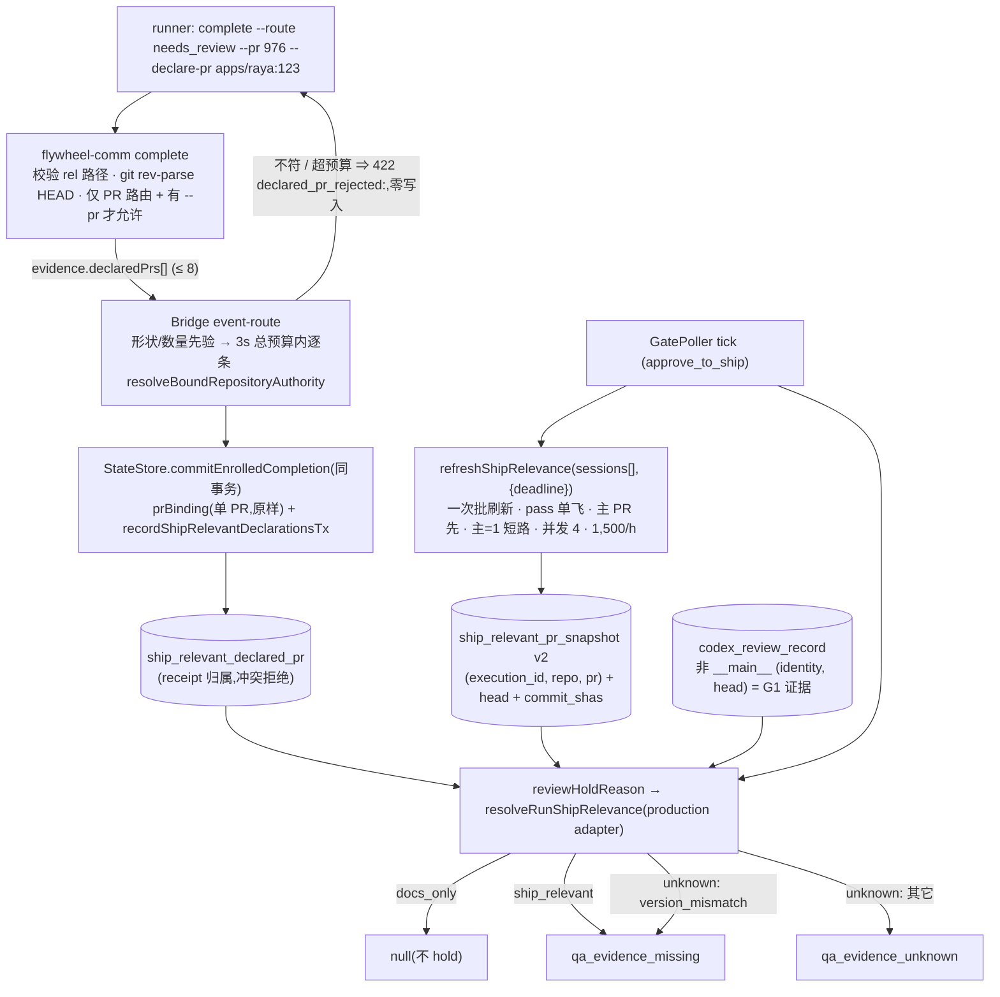
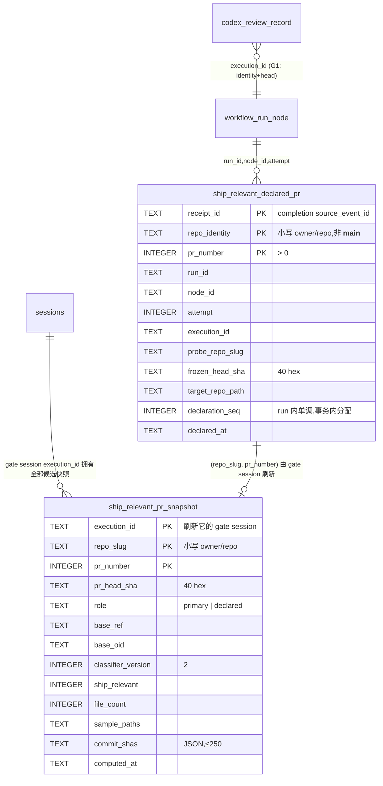

# FLY-2395 docs-only 判定覆盖全部 target repo — 实施计划

Issue: FLY-2395 (https://linear.app/geoforge3d/issue/FLY-2395/2309b1-docs-only-判定覆盖全部-target-repo-今天只看主仓实测漏-833且已在放行-qa-证据门p0-影子跑前置)
日期: 2026-09-06
基于: research.md

**Status**: **effective APPROVED**(R4.2;Codex 4 轮 + 剩余 2 项由 Lead 2026-09-06 裁定,见 §13;修订记录见 §12)
**方案**: B′(见 exploration §3;B 的声明形状 + 新的分类证据表)。**Lead 已批 B′**(2026-09-06,ask `56ff5e3f` 回复:「批 B′,不要字面 B」,附 4 条要求:①从未被用=无写入方写成事实段 → §1;②新表登记 `protectedCurrentOrReference` → C1;③负向护栏单独阳性测试 → C2 与 §9;④复现数字以只读副本为准写进验收 → §9)。Lead 同日裁定:Codex 评审继续 R4 不自批;预算与批回调**只做本单最小版**、复用现有机制;R4 后仍未批则把剩余项原文报 Lead 裁,不开 R5。

---

## 0. 目标与非目标

**目标**:docs-only 的充要条件 = 这一单**全部** PR(主 PR + 全部已声明 nested PR)分类快照都是 `ship_relevant=0` 且 `Σ file_count ≤ 50`;
任一 PR 拿不到快照、或存在**未被任何声明覆盖**的 nested 代码评审证据 ⇒ 整单 `unknown` ⇒ 不算 docs-only。

**非目标(⛔)**:不改 `founder-only-authority`;不改 land seam(`expected_count===1`)、`workflow_pr_manifest`、`workflow_declared_pr`、`workflow_node_pr_binding` 主键;不让 nested PR 成为收口条件;不改写历史快照;影子跑期间不给 runner 新增硬失败;**不承诺「GitHub 上全部 PR 的全集」**(本单没有独立于 runner 自声明的 inventory 来源,见 §10 残余)。

## 1. 先回答 Lead 的两问(spec「开工前必答」)

1. **manifest / declared_pr 从未被使用 = 没接写入方。** FLY-1434 ⑥ 设计为 Lead 派单时 `POST /api/runs/:runId/pr-manifest` 登记 expectedCount;全仓零调用方(flywheel-comm 无子命令、scripts / 插件缓存 / Lead skill 零引用、`declaredPrs` evidence 字段从未实现)。读侧全活,靠「无 manifest = single-PR」沉默。非 flag、非废弃 ⇒ 不触发「停下报 Lead」。
2. **声明入口绕开绑定层 —— 对;但落点不能是 `workflow_declared_pr`。** 它是 closeout 授权台账:`claimWorkflowPrFinalization` 见未 seal 的 manifest 即 `manifest_not_sealed`;seal 后 land gate entry 只接受 `expected_count===1`,多 PR ⇒ `land_gate_entry_sealed_manifest_stale` ⇒ land 拒绝。写它 = 改规矩(Codex R1 已独立核实)。⇒ 声明由 `complete` 直接写**新表**。

## 2. 总体流



## 3. 数据模型



### 3.1 DDL

```sql
CREATE TABLE IF NOT EXISTS ship_relevant_declared_pr (
  receipt_id TEXT NOT NULL,
  repo_identity TEXT NOT NULL CHECK (repo_identity <> '__main__' AND length(repo_identity) > 0),
  pr_number INTEGER NOT NULL CHECK (pr_number > 0),
  run_id TEXT NOT NULL,
  node_id TEXT NOT NULL,
  attempt INTEGER NOT NULL CHECK (attempt > 0),
  execution_id TEXT NOT NULL,
  probe_repo_slug TEXT NOT NULL CHECK (length(probe_repo_slug) > 0),
  frozen_head_sha TEXT NOT NULL CHECK (length(frozen_head_sha) = 40),
  target_repo_path TEXT NOT NULL,
  declaration_seq INTEGER NOT NULL CHECK (declaration_seq > 0),
  declared_at TEXT NOT NULL,
  PRIMARY KEY (receipt_id, repo_identity, pr_number),
  FOREIGN KEY (run_id, node_id, attempt) REFERENCES workflow_run_node(run_id, node_id, attempt)
);
CREATE INDEX IF NOT EXISTS idx_ship_relevant_declared_pr_run ON ship_relevant_declared_pr(run_id, declaration_seq);

CREATE TABLE IF NOT EXISTS ship_relevant_pr_snapshot (
  execution_id TEXT NOT NULL,
  repo_slug TEXT NOT NULL,
  pr_number INTEGER NOT NULL CHECK (pr_number > 0),
  pr_head_sha TEXT NOT NULL CHECK (length(pr_head_sha) = 40),
  role TEXT NOT NULL CHECK (role IN ('primary','declared')),
  base_ref TEXT NOT NULL,
  base_oid TEXT NOT NULL,
  classifier_version INTEGER NOT NULL,
  ship_relevant INTEGER NOT NULL CHECK (ship_relevant IN (0,1)),
  file_count INTEGER NOT NULL,
  sample_paths TEXT,
  commit_shas TEXT NOT NULL,
  computed_at TEXT NOT NULL,
  PRIMARY KEY (execution_id, repo_slug, pr_number)
);
```

**稳定身份**
- 声明行 = 「哪一次 completion 事件(receipt)声明了哪个 (identity, pr)」。`receipt_id = source_event_id`,drain 重放同一事件 ⇒ 同 receipt。写法:事务内先 `SELECT`;同 receipt + 全元组相等 ⇒ no-op(幂等);同 receipt + 任一字段不等 ⇒ 抛 `declaration_conflict` 让 completion 事务回滚(**不用 `INSERT OR IGNORE`**,它会吞掉 CHECK 违反);不同 receipt(同 execution 的 attempt 2)⇒ 新行。声明只追加不改不删。
- 快照行 = 「gate session 对一个 (repo, pr) 的当前分类」,键不含 head,`pr_head_sha` 是列:同 PR 换 head ⇒ UPSERT 覆盖(与今天的语义一致);同 SHA 不同 repo / 不同 PR ⇒ 不同行。服务层缓存键 = `${executionId}:${repoSlug}:${prNumber}:${head}`。
- **旧表 `ship_relevant_diff_snapshot` 冻结**:不再写入、不再读取;保留在 registry(`protectedCurrentOrReference`)原组;退役归后续单写者清理单,本单不删。
- `commit_shas`:分类时先读 PR metadata 的 `commits`(GitHub `/pulls/{n}` 返回的总数);`commits > 250` ⇒ 该 PR `unknown:commits_incomplete`(endpoint 只能给 250 个,无法证明完整);否则 `GET /pulls/{n}/commits?per_page=100` 逐页取,**取到的条数必须恰等于 `commits`**,否则 `commits_incomplete`;末尾 metadata 复核同时校验 head / base / changed_files / `commits` 未漂移(漂移 ⇒ `metadata_drift`)。测试:249 / 250 / 251 / 短页 / 中途漂移。
- **当前候选投影(R2 #1)**:声明历史不可变,但分类只认「每个 `(repoIdentity, prNumber)` 的**当前** head」。投影规则(确定、可审计,R3 #1):每个 receipt 落库时在 StateStore 事务内分配 **run 级单调序号** `declaration_seq = 1 + MAX(declaration_seq) WHERE run_id = ?`(同 receipt 的全部行共享同一序号;sql.js 单写者事务串行化保证不重复);同一 run 内同 `(identity, pr)` 的全部声明行按 `declaration_seq DESC` 取第一条为当前。**不用** node-local 的 `attempt`(它只在 `(run_id, node_id)` 内有序)、不用 wall clock、不用随机 UUID 破 tie。其余行只作审计与 G1 历史来源,**不再各自要求快照**。新 receipt 落库后,旧 head 的快照在 adapter 里立即因 `pr_head_sha ≠ 投影 head` 判 `declared_snapshot_missing`,**不享受任何租约**。同 PR 换 head 的返工(attempt 1 `raya#123@H1` → attempt 2 `raya#123@H2`)⇒ 只按 H2 分类,H1 的评审 head 靠 H2 的 `commit_shas` 覆盖,盖不住 ⇒ `unknown:nested_review_uncovered`(安全侧)。run 上限按**投影后的唯一 PR 数**计。

**显示标签**(诊断面 / 日志):`primary` → `主 PR`,`declared` → `声明 PR`;verdict 三值 `docs_only / ship_relevant / unknown` 直接用英文标识。

## 4. 判定(纯函数核 + 两个 adapter,`bridge/run-ship-relevance.ts`)

### 4.1 核(不碰 store、不看时间)

```ts
export interface PrClassification { repoSlug: string; prNumber: number; headSha: string; shipRelevant: 0 | 1; fileCount: number; commitShas: ReadonlySet<string>; }
export interface RunShipRelevanceFacts {
  primary: { repoIdentity: string; repoSlug: string; prNumber: number; headSha: string; classification?: PrClassification; missingReason?: string };
  declared: Array<{ repoIdentity: string; repoSlug: string; prNumber: number; headSha: string; classification?: PrClassification; missingReason?: string }>;
  nestedReviews: Array<{ repoIdentity: string; headSha: string }>;   // G1,来自 codex_review_record,非 __main__
}
export type RunShipRelevance =
  | { verdict: "docs_only"; fileCount: number; prs: PrView[] }
  | { verdict: "ship_relevant"; reason: "primary_ship_relevant" | "declared_ship_relevant" | "file_budget_exceeded"; prs }
  | { verdict: "unknown"; reason: "primary_snapshot_missing" | "primary_snapshot_stale" | "primary_snapshot_version_mismatch"
      | "declared_snapshot_missing" | "declared_snapshot_stale" | "nested_review_uncovered" | "declaration_overflow" | "scope_unresolved"; prs };
export function resolveRunShipRelevanceCore(f: RunShipRelevanceFacts): RunShipRelevance;
```

顺序(前者短路后者;全部 fail-closed):
0. **已知代码即定案(R2 #2)**:`primary` 或任一 `declared` 已有 `classification.shipRelevant === 1` ⇒ 立即 `ship_relevant`(一个已证实的代码 PR 足以证明整单不可能 docs-only;其余候选缺失与否不影响结论,C3 的短路正是靠这一条成立)。
1. `primary.classification` 缺 ⇒ `unknown:<primary.missingReason>`。
2. 任一 `declared[i].classification` 缺 ⇒ `unknown:<missingReason>`。
3. **G1 精确对账**:覆盖集 = `{primary} ∪ declared`。对每条 `nestedReviews (identity, head)`,必须存在覆盖集里一条 `repoIdentity` 相等且(`headSha === head` **或** `classification.commitShas.has(head)`)⇒ 否则 `unknown:nested_review_uncovered`。superseded attempt 的评审记录**仍承重**(同一 run 的代码痕迹不因返工消失;安全侧)。
4. `Σ fileCount > 50` ⇒ `ship_relevant:file_budget_exceeded`。
5. 否则 `docs_only`。

**反一刀切**:`declared=[]`、`nestedReviews=[]`、primary=0 ⇒ 必须 `docs_only`(测试钉死)。

### 4.2 production adapter(`resolveRunShipRelevance(store, session, now)`)

组装 facts,每一步失败都给出**区分 legacy 与 authority 冲突**的 reason:
- run 归属:`store.resolveWorkflowRunForExecution(executionId) → {kind:'none'} | {kind:'one', runId} | {kind:'many'}`。`many` ⇒ `unknown:scope_unresolved`;`none` = **已证明 legacy**(非 workflow 会话)⇒ 声明集为空、G1 只看本 execution 的 codex 记录;`one` ⇒ 声明集 = 该 run 全部声明行经 §3 **投影**后的当前候选集,G1 = run 全部 execution 的 codex 非 `__main__` 记录。
- primary 身份:`one` 时来自 `store.resolveWorkflowNodePrBindingForSession(executionId, head) → none|one|many`,`none/many` ⇒ `unknown:scope_unresolved`(workflow 会话必须有唯一绑定);`none`-run(legacy)时 `repoIdentity='__main__'`,`repoSlug = project.projectRepo`(小写)。
- 快照读取:`store.getShipRelevantPrSnapshot(executionId, repoSlug, prNumber)`;校验 `pr_head_sha` = 期望 head(primary 用绑定 head,declared 用投影 head;不符 ⇒ `*_snapshot_missing`,租约不作数)、`classifier_version === 2`(否则 `*_version_mismatch`)、`computed_at` 在 ±60s 窗内(否则 `*_stale`)。
- 投影后唯一 PR 数 > `MAX_DECLARED_PRS_PER_RUN` 的判定在**组装 facts 时**就返回 `unknown:declaration_overflow`,该 execution 不进刷新队列、不消耗预算。
- scope 访问器**非可选**:store 缺方法或抛错 ⇒ `unknown:scope_unresolved`(review-hold 现有 catch 分支保留 `qa_evidence_unknown`)。

### 4.3 historical adapter(只给 C5 回溯用,`resolveRunShipRelevanceCounterfactual`)

输入历史副本事实,**显式忽略版本与时效**,标注 `mode:'counterfactual'`,不是生产 gate 重放:
- primary 候选(确定性):run 内全部 execution 的 v1 `ship_relevant_diff_snapshot` 行按 `computed_at` 最新一条(并列取 `execution_id` 字典序最大);记录它的 `ship_relevant` 作「旧分类基线」,`commitShas = ∅`。
- declared = 新表行(历史为空);nestedReviews = run 全部 execution 的 codex 非 `__main__` `(identity, head)`。
- 输出同 `RunShipRelevance` 外加 `basis: {primaryExecutionId, primaryComputedAt, snapshotVersion:1}`,让每个 run 的结论可审计。
- 生产对照:同一份历史副本走 production adapter,新表为空 ⇒ 每个 run 都是 `unknown:primary_snapshot_missing`(不是 version_mismatch;旧表零读取);脚本同时打印这一列,证明历史结论不是偷用了生产规则的放宽版。

### 4.4 review-hold 映射

`docs_only → null`;`ship_relevant → "qa_evidence_missing"`;`unknown:primary_snapshot_version_mismatch → "qa_evidence_missing"`(仅当新表里出现版本 ≠ 2 的行,即未来再翻版本时的行为;单测向新表注入 version=1 验证映射);其它 `unknown → "qa_evidence_unknown"`。**冷启动真实语义(R2 #6)**:部署后新表为空,在飞 `awaiting_review` 主会话第一 tick 是 `primary_snapshot_missing → qa_evidence_unknown`,刷新成功后下一 tick 直接读到 v2;旧表 v1 行不参与。角色门 / Codex 门 / QA 记录门原样。

## 5. 分 chunk(每 chunk 独立可 build、可 review;顺序即依赖)

### C1 · StateStore:两张新表 + API + retention 登记
- DDL(§3.1)放 `ship_relevant_diff_snapshot` 建表之后。
- API:`recordShipRelevantDeclarationsTx({receiptId, runId, nodeId, attempt, executionId, rows, now})`——先按 `receipt_id` 读出已有**全集**,与入参集合排序后逐字段比较(比较全部 caller / authority 派生字段,**排除服务端生成的 `declared_at` 与 `declaration_seq`**;既有 completion 分支的只读比较用同一个 canonicalizer):全等 ⇒ no-op;已有集合非空且不全等(含换 PR 号 / 换 identity / 多一条少一条)⇒ 抛 `declaration_conflict`;为空 ⇒ 事务内取 `declaration_seq` 后整批 INSERT;`listShipRelevantDeclarationsForRun(runId)` 与 `projectCurrentShipRelevantCandidates(runId)`(§3 投影,按 `declaration_seq` 返回唯一 `(identity, pr)` 集合);`listNestedCodexReviewHeadsForRun(runId)` / `...ForExecution(executionId)`;`resolveWorkflowRunForExecution(executionId)`(zero/one/many);`resolveWorkflowNodePrBindingForSession(executionId, head)`(zero/one/many);`putShipRelevantPrSnapshot` / `getShipRelevantPrSnapshot(executionId, repoSlug, prNumber)` / `deleteShipRelevantPrSnapshotsExcept(executionId, keep: Array<{repoSlug, prNumber}>)`。
- retention:两张表 → `protectedCurrentOrReference`;fixture JSON 加两行;`fly-2006-database-retention-sweep.test.ts` 计数 173→175、170→172。
- 测试:`StateStore.ship-relevant-declared-pr.test.ts`(同 receipt 全集幂等且**保留原 `declaration_seq`、不分配新序号** / 同 receipt 换 PR 号 ⇒ 冲突 / 同 receipt 多一条 ⇒ 冲突 / 不同 receipt 同 execution 新行 / CHECK 拒 `__main__`、pr=0 时**抛错**而非静默 / **投影**:同 PR H1→H2 只留 H2;(a) node A attempt 2 先声明 H_docs、node B attempt 1 后声明 H_code ⇒ 必须选 B/H_code;(b) 同 `declared_at`、不同 receipt ⇒ 按 `declaration_seq` 选,不按 UUID;(c) 新 receipt 落库后旧 head 快照立即 head 不符 ⇒ unknown,不得继续 docs_only);`StateStore.ship-relevant-pr-snapshot.test.ts`(同 SHA 不同 repo 两行、同 SHA 不同 PR 两行、同 PR 换 head 覆盖、except 保留集合);zero/one/many 三态各一例;retention 计数。

### C2 · 判定核 + 两个 adapter + review-hold + 版本翻 2
- `bridge/run-ship-relevance.ts`(§4);`ship-relevant-diff.ts` `SHIP_RELEVANT_CLASSIFIER_VERSION = 2`,导出 `MAX_DOCS_ONLY_FILES`。
- `review-hold.ts`:`AutoQaHeldStore` 增**必需**的 scope 读面(新接口 `RunShipRelevanceStore`,StateStore 实现;测试 fake 显式实现);docs-only 分支改调 production adapter。
- 测试 `run-ship-relevance.test.ts`(核):六条规则各一例;**primary=1 + declared 缺 ⇒ ship_relevant**;**declared[0]=1 + declared[1] 缺 ⇒ ship_relevant**;反一刀切;预算 50 / 51;**Codex R1 三反例**:同 identity 两个 head 只声明 docs head ⇒ `nested_review_uncovered`;primary 本身在 nested 仓且被 G1 覆盖 ⇒ 不误判;历史 head 在声明 PR 的 `commit_shas` 里 ⇒ 覆盖。adapter:ambiguous run / many bindings / workflow-bound 缺绑定 / 访问器抛错 / repo 不符 / head 不符 / 新表注入 version 1 映射 `qa_evidence_missing` / 新表为空 ⇒ `primary_snapshot_missing`;**集成:同 run 同 execution 两 attempt 同 PR H1→H2,只按 H2 分类,H1 评审由 H2 `commit_shas` 覆盖,否则 unknown**。
- 测试 `review-hold.test.ts`(**spec 硬回归**,main 角色、`awaiting_review`、Codex 满足、无 QA 记录、主仓=0):
  (a) + 未覆盖 nested Codex 记录 ⇒ `qa_evidence_unknown`(今天 `null`);(b) + 已声明 nested 快照=1 ⇒ `qa_evidence_missing`;(c) + 已声明 nested 快照=0、合计 ≤50、评审 head 在 commit_shas ⇒ `null`;(d) 无声明无证据 ⇒ `null`;(e) 新表为空(冷启动)⇒ `qa_evidence_unknown`;(f) 新表 version=1 行 ⇒ `qa_evidence_missing`。

### C3 · 生产者:服务泛化为候选元组 + run 级刷新调度
- `ShipRelevantDiffService` 键改 `${executionId}:${repoSlug}:${prNumber}:${head}`;store 接口换成 C1 的 v2 方法(旧 `deleteOther…` 不再被调用,签名不动);`classifyShipRelevantDiff` 增 `commits` 总数校验 + `/pulls/{n}/commits` 拉取与 `commit_shas`(§3)。
- **Bridge 级预算(R2 #3 / R3 #2;按 Lead 裁定做最小版)**:`ShipRelevantGitHubApi` 签名改 `(path, {signal}) => Promise`,`plugin.ts` 把 signal 传给 `execFileP("gh", …, {signal})`,超时即杀子进程。预算与调度**全部放在现有 `ShipRelevantDiffService` 内部**(它已有 `inFlight` / `retryAfter` / `metadataAfter` 三张内存表和租约逻辑),不新造通用限流件:
  - **持续预算**:一个滑动 60 分钟计数器 `SHIP_RELEVANCE_GITHUB_BUDGET_PER_HOUR = 1500`(GitHub REST 5,000/h 的 30%,其余留给 Bridge 其它 GitHub 消费者);计数满 ⇒ 本 pass 不发请求(候选保持 unknown,安全侧);**保证范围 = 单进程生命周期内不超过 1,500/滚动小时**(Bridge 重启归零,§13 已签收);收到 GitHub 429 ⇒ 该候选删 snapshot、`retryAfter` 退避、verdict unknown(fail-closed);
  - 每 pass ≤ 40 请求、并发 ≤ 4(一个 `Promise` 池)、pass deadline 2.5s(GatePoller 传入,到点整体 abort);
  - 公平:每候选内存 `lastAttemptAt`;排序 = 缺快照者按 `lastAttemptAt` 升序(固定输入顺序不会每 pass 重试同一批),其次 stale 者按 `computed_at` 升序;
  - **nested 租约**:declared PR 的 docs 侧 metadata 租约 = 30s(复用 `metadataRetryMs` 同侧上限),主 PR 保持 FLY-1251 裁定的 10s 不动 —— nested PR 不由 Bridge land,30s+3s 的 retarget 检出延迟只影响 hold 早晚,不影响任何合并动作(**Lead 已裁 A,§13**);
  - **为什么这个最小版够**:影子跑期间同时 pending 的 docs gate 实测 ≤ 3、raya 类单 nested = 1,稳态 = 3 × (360 + 120) = 1,440/h < 1,500;超出即节流成 unknown,不会拖垮别的 GitHub 消费者;它不需要跨进程、不需要持久化、不需要给别的调用方复用。
  - **可运营规模(由 soak 测试给出,写进 PR body)**:「3 gate × 1 nested」= 1,440/h ✓;「1 gate × 8 nested」= 1,320/h ✓;「3 gate × 8 nested」= 3,960/h ✗(节流 ⇒ 部分候选 unknown,不超预算)。
- `plugin.ts` 的 `ensureShipRelevantDiff(session)` 改为批回调 `refreshShipRelevance(sessions, {deadline})`,**run 级刷新**:
  1. **pass 单飞**:每 execution 一个 in-flight Promise,上一轮未完成 ⇒ 本 tick 直接返回;**GatePoller seam 替换(R3 #4,最小改)**:`GatePollerConfig.ensureShipRelevantDiff?(session)` **删除**,改为同形状的批回调 `refreshShipRelevance?(sessions: Session[], opts: {deadline: number}) => Promise<void>`;poll 内两阶段:第一阶段沿现有循环收集**已通过 ownership / superseded 检查**的 `approve_to_ship` 会话并按 `execution_id` 去重,调用一次批刷新;第二阶段对同一集合执行同步 `reviewHoldReason`(其余循环体不动)。不保留旧逐 gate await(避免 batch 前后各刷一次)。
  2. 主 PR 先(repo 来自唯一绑定;legacy 用 projectRepo);主=1 ⇒ **短路**,不刷新 nested(§4.1 第 0 步保证 verdict 就是 `ship_relevant`);
  3. nested 候选(投影后)受全局并发与预算约束,任一已知 `=1` ⇒ 短路其余;
  4. `deleteShipRelevantPrSnapshotsExcept(executionId, 主 ∪ 声明)`。
- 容量测试(vitest,fake api 计数 + fake clock):主=1 时 nested 零调用;**三个同时 pending 的 docs gate**:一个慢 gate(每次 1s)不饿死另两个、一轮 pass 全局请求 ≤ 40、pass 不叠加;deadline 到点后 `signal.aborted` 为真且 fake execFile 收到 kill;连续 10 tick 无遗留 in-flight;**1 小时 fake-clock soak**:三个 pending gate(各 1 主 + 1 nested)含初次全分类(metadata + files + trees + commits + 末尾复核)与租约续期,断言总请求 ≤ 1,500 且每个候选 60s 时效可达;再跑「3 gate × 8 nested」断言总请求仍 ≤ 1,500(节流生效)并报告哪些候选未能形成 docs-only 证明;run overflow 的 execution 零请求;**retarget / force-push 边界(Lead 硬要求①,阳性用例写死)**:declared PR 在 docs head 上有 snapshot 且在 30s 租约内被 force-push 到代码 head ⇒ 租约到期后的第一次 metadata 复核必须删 snapshot 并返回 `unknown:head_mismatch`,随后重分类为 `ship_relevant`;断言最坏 fail-open 窗口 = 30s + 一个 poll(3s),超过该窗口绝不再出现 docs_only;GitHub 429 ⇒ 删 snapshot、unknown、退避。
- **声明上限统一为 8**(R2 #5):`MAX_DECLARED_PRS_PER_COMPLETION = 8`(wire,C4 先验)与 `MAX_DECLARED_PRS_PER_RUN = 8`(投影后唯一 PR 数,adapter 唯一引用),都以上述 N=8 容量测试为依据;超出 ⇒ `unknown:declaration_overflow`,声明本身照记(见 C4 入口预算)。

### C4 · 声明入口:CLI + event-route + completion 事务 + 提示词
- `flywheel-comm complete`:`--declare-pr <rel-path>:<pr-number>`(repeatable);**仅**当 `route ∈ {needs_review, pr_handoff}` 且给了 `--pr` 才接受,否则退出 1(`--declare-pr requires --pr on a PR route`);≤ 8 条否则退出 1;校验 rel 安全(复用 `resolveEvidenceRepo`)、`pr>0`、`git rev-parse HEAD`(拿不到 ⇒ 退出 1);`evidence.declaredPrs: [{targetRepoPath, prNumber, headSha}]`;drain 重试提示命令**逐条带回** `--declare-pr`(安全 quoting);`no_code_artifact_present` 类校验把 `declaredPrs` 视为 PR evidence(与 `landingStatus` 同处理)。测试 `complete.test.ts`:路由不合 / 无 `--pr` / 格式错 / 路径逃逸 / 无 head / 9 条 ⇒ 退出 1;正常 ⇒ payload 数组;drain 重试命令含全部声明。
- `event-route.ts`:**先验**(数组 ≤ 8、每项形状、`prNumber` 安全整数、head 40 hex、I/O 前只按 `(targetRepoPath, prNumber)` 去重——同一 checkout 不同 PR 是合法声明,同 path 的 authority 结果复用)再做 I/O;逐 path `resolveBoundRepositoryAuthority`(并发 4,总预算 3s,用 `AbortSignal` 杀子进程);I/O 后按 `(repoIdentity, prNumber)` 去重;identity `__main__` ⇒ 422 `declared_pr_rejected:main_repo_must_use_pr`;与冻结的 primary `(identity, pr)` 完全相同 ⇒ 422 `duplicates_primary`(primary 在 nested 仓时防 role 冲突与 file_count 重复累计);head 不等 ⇒ `head_mismatch`;超预算 ⇒ `authority_timeout`;非 enrolled(无 generalized context)带声明 ⇒ 422 `declared_pr_rejected:not_enrolled`。任何 422 都在 DB 写入之前,零副作用。
- `commitEnrolledCompletion`:`declaredPrs?` 入参;在 `prBinding` 三路之外、`workflow_node_completion` INSERT 之前调 `recordShipRelevantDeclarationsTx`(receipt = `sourceEventId`);事务回滚即整体消失。**重放分支(R3 #3)**:该方法在进入大事务前的「既有 completion」分支里增加**只读**的 receipt 全集相等检查——相等 ⇒ 沿既有幂等路径;不等 ⇒ 返回结构化 `declaration_conflict`(HTTP 409),**该分支绝不 INSERT**;真正的空集 INSERT 只发生在最终 completion 事务内。测试:同事件重放幂等;同事件换 PR 号 / 多一条 ⇒ 409 `declaration_conflict`(HTTP 级,断言既有 completion 行与声明行零变化);同 path 不同 PR ⇒ 两条声明;nested-primary 重复声明 ⇒ 422;completion 被拒(`stale_execution_superseded`)⇒ 表零行;5s 客户端 abort 后同事件重放 ⇒ 恰一次事实、无子进程泄漏。
- `edge-worker/Blueprint.ts:1921` 提示词补:「every PR you opened in a nested repository must be declared with `--declare-pr <relative-repo-path>:<NUMBER>` (max 8); an undeclared nested change makes the ship classification `unknown`」。

### C5 · 回溯脚本 + 验收证据
- `scripts/fly-2395-ship-relevance-retro.mjs --db <只读副本>`:cohort = spec SQL(有 v1 快照的 run 全集);每 run 用 **historical adapter**(§4.3)算,输出:

  ```
  mode=counterfactual db=<path> copied_at=<ts>
  cohort_total=<N> docs_only_baseline=<a> with_nested_review=<b>
  positive: <b>/<b> flipped to non-docs-only (unknown:nested_review_uncovered)
  negative: <a-b>/<a-b> remain docs_only
  ```
  阳性或反向任一不满 ⇒ 退出非 0;只读打开;每 run 一行 `basis` 可审计。
- 测试 `scripts/__tests__/fly-2395-ship-relevance-retro.test.mjs`:fixture 小库**用 v1、旧时间戳、多 head**(4 个 run:纯 docs 单 head / docs 多 execution 多 head / docs+nested 评审 / code);另加一例断言**生产 adapter** 对同一 fixture 全 `unknown:primary_snapshot_missing`(新表为空、旧表零读取)——证明两条 adapter 真的不同、脚本没有偷用放宽后的生产规则。
- PR body 附:副本时间戳、四个数、比例。

## 6. 上限与预算(一处定义,三处引用)

| 项 | 值 | 来源 |
| --- | --- | --- |
| `MAX_DECLARED_PRS_PER_COMPLETION` | 8 | C3 容量测试;raya 类单实测 1 个 nested PR |
| `MAX_DECLARED_PRS_PER_RUN` | 8 | 投影后唯一 PR 数上限(adapter 唯一引用);超出 `unknown:declaration_overflow` |
| completion 端 authority 总预算 | 3s(并发 4) | 客户端 5s abort 之内 |
| GatePoller 每 pass 刷新时限 | 2.5s,并发 4,每 pass ≤ 40 请求 | 3s tick 之内;pass 单飞;跨 gate 一次批量调度、持久 round-robin |
| `SHIP_RELEVANCE_GITHUB_BUDGET_PER_HOUR` | 1,500(服务内滑动计数) | GitHub REST 5,000/h 的 30%;**单进程生命周期内不超过 1,500/滚动小时**(重启归零为已签收残余,§13);GitHub 429 后 fail-closed |
| nested docs 租约 | 30s(主 PR 10s 不动) | **Lead 已裁(§13)**:接受 30s + 3s poll 的 bounded fail-open |
| `MAX_DOCS_ONLY_FILES` | 50(合计) | 既有 |
| `commit_shas` 上限 | 250 | 以 PR metadata `commits` 为总数;>250 或取到条数 ≠ 总数 ⇒ `unknown:commits_incomplete` |

## 7. 迁移 / 回滚

- **迁移**:两张表 `CREATE TABLE IF NOT EXISTS` 启动即建;旧快照表冻结不读不写;在飞 `awaiting_review` 主会话在部署后第一 tick 是 `primary_snapshot_missing → qa_evidence_unknown`(新表为空),刷新成功后下一 tick 读到 v2(几秒)。无数据回填。
- **回滚边界**:回退代码即回到单 PR 语义;新表留在库里无害(`protectedCurrentOrReference`,无人读);旧代码继续写旧表。**不需要**回滚 SQL。
- **不可逆点**:无。

## 8. 负向护栏清单(实现必须各有一条红→绿测试)

| 护栏 | 触发 | 结果 |
| --- | --- | --- |
| G0 fail-closed | 任一 PR 无快照 / 过期 / 版本不符 / head 不符 | `unknown` |
| G1 精确对账 | nested Codex 评审 `(identity, head)` 不被主 PR、声明 PR 的 head 或 `commit_shas` 覆盖 | `unknown:nested_review_uncovered` |
| G3 反一刀切 | 无声明无证据主仓=0 | 必须 `docs_only` |
| G4 入口 | 指向主仓 / head 不符 / 重复 / 路径逃逸 / 非 PR 路由 / 非 enrolled / 超 8 / 超预算 | 422 或 CLI 退出 1,零写入 |
| G5 预算 | Σ file_count > 50;投影后声明 > 8;commits > 250 或条数 ≠ 总数 | `ship_relevant` / `unknown` |
| G6 事务 | completion 被拒 / 同 receipt 冲突 | 声明零行 / 回滚 |
| G7 retention | 新表未登记 | `schema_unclassified`(建表即红,测试守) |
| G8 scope | run 归属 many / workflow 会话缺唯一绑定 / 访问器缺失或抛错 | `unknown:scope_unresolved` |
| G9 容量 | 主=1 时 nested 零调用;pass 单飞;三 gate 公平、全局请求 ≤ 40/pass、abort 杀子进程 | 容量测试断言 |
| G10 投影 | 同 PR 多声明 | 只认确定性投影出的当前 head;旧 head 评审靠 `commit_shas` 覆盖 |

## 9. 验收(照 spec 与 Lead 要求逐条对应)

| 要求 | 证据 |
| --- | --- |
| 复现数字以只读副本为准(Lead ④) | 副本 `2026-09-06T23:35:28Z`:`docs_only_runs=35, docs_only_with_nested=8, code_runs=257, code_with_nested=3`(spec 2026-09-03:33/8/212/3;核的是比例与方向:8/35≈23% vs 3/257≈1%);脚本重跑时报出自己的全集规模 |
| 阳性:带 nested 的 docs-only run 全部翻成非 docs-only | C5 `positive: 8/8`(historical adapter,reason 全为 `nested_review_uncovered`;实际数以脚本为准) |
| 反向:其余仍 docs-only(不许一刀切) | C5 `negative: 27/27`(spec 写 22 是旧副本) |
| 负向护栏单独阳性测试(Lead ③) | 核测试「nested 评审 `(identity, head)` 未被覆盖 ⇒ `unknown:nested_review_uncovered`」+ review-hold (a) |
| review-hold 回归:主仓 docs-only + nested 代码 ⇒ hold(今天 null) | C2 review-hold (a)(b);今天的行为以「旧表 v1」对照注释保留 |
| retention `assertClassifiedSchema` 通过(Lead ②) | C1 计数测试 173→175、170→172 |
| 生产对照 | 同一副本走 production adapter 全 `unknown:primary_snapshot_missing` |
| 容量 | C3 三 gate 测试 + 1 小时 soak,总请求 ≤ 1,500 |

## 10. 残余(诚实写明,不许在实现中声称覆盖)

- **G1 依赖 Codex 评审记录存在**:nested 代码既没被 Codex 评审、也没被声明 ⇒ 本单看不见。B4 影子跑台账应把「事后发现的 nested PR」记为分母卫生指标。
- **G2(子仓 HEAD 相对 baseline 偏移)本单不做**:它无法证明 PR 全集(runner 开完 PR 切回 baseline、或在别的 worktree 开 PR 都看不见),且放在 completion 热路径撞 5s 期限。留作后续异步证据单;届时需带 `probe_status` 判别式记录与 baseline 校验。
- 声明 PR 若被 force-push 掉了曾被评审的 head ⇒ 该 run 永久 `unknown`(安全侧,不试图放宽)。
- **两个 bounded fail-open(Lead 2026-09-06 签收,§13)**:(i) declared nested PR 的 docs snapshot 在 30s metadata 租约 + 3s poll 内可能仍被信任,最坏约 33 秒后才重新 hold;(ii) 1,500/h 预算计数在 Bridge 重启后归零,只在单进程生命周期内成立。两条都要写进 B4(FLY-2398)的已知限制。
- 25 条 main 角色历史快照的免 QA 追查 —— 未核,不引用。

## 11. 影响面(消费者 sweep)

- `ShipRelevantDiffService` 构造方:`plugin.ts` 1 处 + 测试。
- `GatePollerConfig.ensureShipRelevantDiff` 消费者(改为 `refreshShipRelevance`):`plugin.ts:10059`、`gate-poller.ts:118/897`、测试 `gate-poller-ship-readiness-hold.test.ts`、`gate-poller.test.ts`、`gate-poller-fly1041-*.test.ts`、`gate-poller-founder-*.test.ts`(实现时 `grep -rn ensureShipRelevantDiff` 全仓再核一次)。
- `SHIP_RELEVANT_CLASSIFIER_VERSION` 读方:`review-hold.ts`、`ship-relevant-diff.ts`、两处测试。
- `commitEnrolledCompletion` 调用方:`event-route.ts` 1 处(其它调用方不传新字段)。
- `complete` CLI:新增可选参数,非删改;Blueprint 提示词同 PR 改;插件 fork / 缓存不调用 `--declare-pr`(PR body 仍写明 sweep 时间戳)。
- 旧 `ship_relevant_diff_snapshot` 读写方全部退出:`review-hold.ts`、`ship-relevant-diff.ts`、`plugin.ts`;StateStore 的四个旧方法保留不删(后续清理单)。

## 12. 修订记录

- **R4.1(2026-09-06,吸收 Codex R4 的机械项 #3 #4)**:receipt 相等比较同时排除 `declaration_seq`,重放保留原序号;§0 引用改 §10;删 §4.2 重复的 overflow 条;总体流改为批回调。Codex R4 剩余 #1(nested 30s 租约 = 新的 bounded fail-open,需 Lead 裁 A/B)与 #2(进程内 1,500/h 计数重启归零,需 Lead 签收残余或加最小 restart fence)按 Lead 裁定不开 R5,原文报 Lead 裁,结果记入 §13。
- **R4(2026-09-06,吸收 Codex R3 + Lead 批复)**:#1 声明 receipt 事务内分配 run 级 `declaration_seq`,投影只按它;新 receipt 落库后旧 head 快照立即 head 不符;#2 持续预算 = 服务内滑动 60 分钟计数 1,500/h + `lastAttemptAt` round-robin + nested 租约 30s(待 Lead 确认)+ 1 小时 soak 给出可运营规模;overflow 不进队列;按 Lead 裁定全部做在现有 `ShipRelevantDiffService` 内、不新造通用件,并写明为什么够;#3 既有 completion 分支只读比较 receipt 全集返回 `declaration_conflict`,绝不 INSERT;#4 GatePoller seam 换成同形状批回调、两阶段、删旧逐 gate await,消费者写进 §11。补回 R2 重写时遗漏的验收表(§9),Lead 四条要求映射写进 Status 行。
- **R3(2026-09-06,吸收 Codex R2)**:#1 声明按 `(identity, pr)` 确定性投影出唯一当前 head,旧行只作审计与 G1 来源;#2 「任一已知代码 ⇒ ship_relevant」提到缺失检查之前(§4.1 第 0 步),与 C3 短路一致;#3 Bridge 级调度器:全局并发 4、每 pass 请求 ≤ 40、oldest-stale-first、跨 gate 批量刷新、`AbortSignal` 透传到 `gh` 子进程,容量测试改为三 gate;#4 receipt 级全集比较、I/O 前按 `(path, pr)` 去重、I/O 后按 `(identity, pr)` 去重、拒绝与 primary 重复;#5 上限统一为 8(wire 与投影后 run 各一个常量,adapter 只引用 run 常量);#6 冷启动真实语义 `primary_snapshot_missing → qa_evidence_unknown`,version_mismatch 只在新表注入 v1 时出现,C5 生产对照改为 `primary_snapshot_missing`;#7 `commit_shas` 以 metadata `commits` 为总数校验并纳入末尾漂移复核。
- **R2(2026-09-06,吸收 Codex R1)**:#1 G1 改 `(identity, head)` 精确对账,覆盖集 = 主 PR ∪ 声明,多轮 head 靠 `commit_shas`;#2 快照改新表全元组键、声明表 receipt 归属、冲突拒绝、放弃 `INSERT OR IGNORE`、明确 gate session 拥有快照;#3 拆核 / 生产 adapter / 历史 adapter,fixture 用 v1 旧时间多 head 并加「生产 adapter 全 unknown」对照;#4 completion 先验 + 3s 预算 + AbortSignal + 非 enrolled 拒绝;#5 pass 单飞、主=1 短路、并发 4、2.5s 时限、上限 8/16 来自容量测试;#6 zero/one/many 判别、访问器必需、version mismatch 独立 reason 映射 `qa_evidence_missing`;#7 去掉 nullable run / legacy 写入,`--declare-pr` 限 PR 路由,drain 重试带回声明,`deleteOther` 不再改签名;#8 G2 移出本单(§9)。

## 13. Lead 裁定记录(2026-09-06,effective APPROVED 依据)

Codex design review 走了 4 轮(8 → 7 → 4 → 2 条),按 Lead 裁定不开 R5,剩余两项原文报 Lead,Lead 裁定如下(逐字):

> 裁:#1 取 A,#2 取 A。理由:影子跑一次都不真合并,nested 不由 Bridge land,33 秒只影响 hold 早晚;1,500/h 预算保留。附带三条硬要求:① retarget/force-push 边界测试——超窗必须删 snapshot 或返回 unknown,阳性用例写死;② 这两个 bounded fail-open 逐字写进 plan §13 与 B4(FLY-2398)的已知限制,B4 影子跑报表里「被 33 秒窗口误判 docs-only 的单」单列一行计数(为 0 也报 N);③ #2 文案改「单进程生命周期内不超过 1,500/滚动小时」,GitHub 429 后 fail-closed。以此为 effective APPROVED 依据写 design-review.json 过门。

映射:
- **#1(nested docs 租约)取 A**:declared nested PR 的 docs 侧 metadata 租约 30s,主 PR 维持 FLY-1251 的 10s;这是一个新的 **bounded fail-open**:snapshot 在旧 docs head 上、PR 被 retarget / force-push 到代码 head 后,最多 30s + 3s poll ≈ 33 秒内仍可能判 docs_only,之后必须删 snapshot 或 unknown。硬要求①落在 C3 容量测试的「retarget / force-push 边界」用例(阳性写死)。
- **#2(预算计数)取 A**:计数器留在 `ShipRelevantDiffService` 进程内;保证文案为「**单进程生命周期内不超过 1,500/滚动小时**」;Bridge 重启归零是已签收残余;GitHub 429 后该候选 fail-closed(硬要求③,C3)。
- **硬要求②(跨单)**:两个 bounded fail-open 已写进本 plan §10 与本节;**B4(FLY-2398)必须**把它们列入已知限制,且影子跑报表单列一行「被 33 秒窗口误判 docs-only 的单 = N」(为 0 也报)。本单实现 PR body 要把这一句转给 B4 的 issue(评论或链接),由 Lead 确认 B4 已接收。

Codex R4 的机械项 #3(receipt 相等排除 `declaration_seq`)与 #4(引用 / 重复 / 流程图同步)已在 R4.1 修正。

