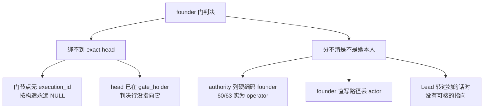

# FLY-2396 founder 门判决绑 exact head + 「是否 founder 本人」字段 — 探索

Issue: FLY-2396 (https://linear.app/geoforge3d/issue/FLY-2396/2309b2-founder-门判决绑-exact-head-新增是否-founder-本人字段authority-是权限不是作者p0)
日期: 2026-09-06
基于: 无(上游为 `product/doc/FLY-2309-auto-merge-rollout/build-issues.md` §B2)

## 0. 一句话

founder 门的每一条判决(过卡 / 打回)今天都**没有**和「她当时看的那个 head」绑在一起,
而且 `authority='founder'` 只表示「以 founder 权限提交」,不表示「她本人写的」;
本单要把这两件事各自变成一条**写入时就定死的事实**,不做任何猜测。

## 1. 我核过的事实(只读副本 `~/.flywheel/teamlead.db`,2026-09-06 18:09 拷贝)

### 1.1 复现 SQL(spec 末尾两条)

| 查询 | spec 冻结值 | 2026-09-06 实测 |
| --- | --- | --- |
| `workflow_run_node` 中 `node_id='founder_gate'` 的 `execution_id IS NULL` / 总数 | 358 / 358 | **421 / 421** |
| founder 门打回按 `(run_id,node_id,attempt)` join 到非空 `execution_id` | 0 | **0** |
| `authority='founder' AND source_node_id='founder_gate'` 总数 | 55 | **63** |

spec 的 55 条 = `requested_at <= 2026-09-03T21:28:57.010Z` 的前 55 条;之后又新增 8 条。
本文两个口径都报。

### 1.2 门节点为什么绑不上 head:它不是 runner

`founder_gate` 是门节点,没有 execution,`commitWorkflowTransitionTx` 故意不给它写
`execution_id`(`StateStore.ts:50462`)。所有 `workflow_node_pr_binding` 行都挂在
**喂门的那个节点**(implement / qa)上,`node_id='founder_gate'` 的绑定行**一条都没有**
(唯一写入点 `recordWorkflowNodePrBindingTx` 的两个调用方都取 `context.binding.node_id`)。

### 1.3 但 head 其实早就记着 —— 只是判决行没有指向它

`workflow_gate_holder`(402 行)按 `(run_id, gate_node_id, attempt, head_sha)` 记每一次
开卡:`question_id`(UNIQUE)、`card_message_id`、`state`(approved / superseded / …)。
`workflow_ship_target_binding` 按 `approve_question_id` 记 `frozen_head_sha` + repo 身份。
`workflow_node_pr_binding` 按 `(run_id, head_sha)` 能反查 `pr_number`。

缺的只是**判决行**(`workflow_rework_request` / 过卡的 `workflow_claims`)没有 `question_id`,
所以今天只能靠 run 级松 join 近似。

### 1.4 回溯:遗留判决能绑到 exact head 的比例

回溯规则(全是等值 join,没有时间窗猜测):

* 打回:`workflow_gate_holder` 中 `(run_id, 'founder_gate', source_attempt)` 恰好一行
  → `head_sha`;再用 `(run_id, head_sha)` 反查 `workflow_node_pr_binding` 拿 `pr_number`
  和 `probe_repo_slug`。交叉验证:`workflow_ship_target_binding.superseded_at ==
  requested_at`(同一事务时间戳)给出的 head 与 holder 一致 61/62,唯一不一致的是
  `f5bd6f2b`(head-fold 返工,holder 记的是她看的旧 head,`base_revision` 记的是
  前移后的新 head —— holder 才是对的)。
* 过卡:`workflow_run_node.state='done'` 的门节点 → 同 attempt 的 holder(285/285 唯一)。

脚本 `retro-bind.sql`(同文件夹,只读)2026-09-06 实跑结果(要求 head 是 40 位 git sha):

| 集合 | 总数 | 能绑 `head_sha` | 能绑 `(repo, pr_number, head_sha)` |
| --- | --- | --- | --- |
| 打回,spec 冻结集 | 55 | **54 / 55** | **53 / 55** |
| 打回,今天全集 | 63 | **62 / 63** | **61 / 63** |
| 过卡(门节点 done) | 285 | **285 / 285** | **281 / 285** |

绑不上的,逐条:
* `f9529033`(2026-07-24):holder 的 head 是 64 位 artifact digest,git-head 时代之前 → head 与 PR 都不绑。
* `bbaf0439`(2026-08-18,FLY-1852,run 已 terminated):holder head `5ae6ea00` 与 ship target
  冻结 head `6a83a293`(= PR 873 的绑定 head)**不一致**,同一秒写入;不猜哪个是她看的,记未绑 PR。
* 过卡 4 条:`authority_mode='runner_ship'`,没有 PR 主体。

遗留行 `founder_authored`:**63 条:5 attested / 58 未判定 / 0 猜测**(attestation 只来自
spec §B2 表,见 `legacy-attestation.json`);阳性对照 5 条按 1,1,0,0,0 正确分开。

⚠️ `workflow_rework_request.base_revision` **不是**她看的 head:它是 operator 的
`session_head`,63 条里只有 45 条与任何 PR 绑定 head 相等(`c8f001a6` 就不等)。
不能拿它当绑定依据。

### 1.5 `authority` 是权限:63 条的来源

| 写入路径 | 条数 | `authority_context_json.authority` | 是谁打的字 |
| --- | --- | --- | --- |
| `openOperatorRework`(Bridge `POST /api/runs/:runId/rework`,master token)| **60** | `"operator"`,`principal:"master"` | Lead |
| `commitWorkflowTransitionTx` 经 `founder_feedback` 源事件(她在卡上直接写) | 3 | `"founder"` | founder 本人(handler 已核 `authorId === canonicalFounderId`)|

`openOperatorRework` 的 SQL 把 `authority` **硬编码成 `'founder'`**
(`StateStore.ts:38038-38052`),而它自己的 context 写的是 `operator`。这就是 FLY-2261
「47 里只有 21」和本单「5 里只有 2」的机制根源。

spec 的 5 条阳性对照**全部**是 operator 路径(Lead 打字)。所以「是不是她本人」在这 5 条里
指的是**判断是不是她的**(Lead 转述她的 thread 原话 → 是;Lead 自己的判断、机械返工 → 不是),
而不是「谁按的回车」。这个语义要在字段定义里写死,不然又会滑回文本判断。

### 1.6 系统已经知道她是谁 —— 但 rework 路径把它丢了

* `canonicalFounderId`:`bridge/approval-signal/canonical-founder-id.ts`,fail-closed。
* 文本 / 反应 / 语音三条 founder 信号入口都先核 `authorId === canonicalFounderId`。
* `write-gate-response.ts` 把 `actor` 写进 `workflow_source_event.payload`;
  `applyWorkflowSourceEvent` 只在**过卡**路径把 actor 进 `workflow_claims.evidence`,
  **打回**路径丢弃。
* `founder_deferred_approval` 已有 `author_user_id` + `founder_id_at_capture` 的成对写法
  (11/11 相等)—— 这是本单要复用的「作者事实」形状。
* `isTrustedApprovalAttribution(actor, founderId)` 对 `"bridge"` /
  `"bridge-founder-consent"` 也返回 true —— 它是**权限**判据;`actor === founderId` 才是
  **作者**判据。两者在代码里已经是两个函数,只是没落成两个字段。

### 1.7 Bridge 能不能核一条 Discord 消息是谁发的

Bridge 有 Discord REST 层(`bridge/discord-utils.ts`:post / edit / delete),没有
「按 id 取消息」的 helper,但 `GET /channels/{channel}/messages/{id}` 是同一个 token、
同一个层,加一个函数即可。Bridge **没有**本地留存入站 Discord 消息的 author 索引,
所以核验只能在线做(提交时一次 REST 调用),或者不核。

### 1.8 `/api/runs/:runId/rework` 的消费者 sweep(2026-09-06)

| root | 结果 |
| --- | --- |
| `packages/` | 仅 `runs-route.ts`(定义)与 `founder-consent/reserved-endpoints.ts`(登记) |
| `scripts/` | 0 |
| `~/.claude/plugins/cache/*/`(全文 grep `.md/.sh/.ts/.js`) | 0 |
| 插件 fork 源 `xrliAnnie/claude-plugins-official` | **未检查**(本机无 checkout) |

⇒ Lead 现在是用 curl 直连。新增字段为**可选**,不破坏现有调用。

## 2. 问题拆解

## 3. 方案空间

### 3.1 exact head 绑定

| 选项 | 做法 | 取舍 |
| --- | --- | --- |
| **A. 判决快照表(选)** | 新增不可变表 `workflow_founder_gate_verdict`,过卡 / 打回各写一行,同事务内从 holder + ship_target + pr_binding 解析出 `(question_id, repo, pr_number, head_sha)` 落盘;解析失败整笔事务回滚 | 100% 由构造保证;两周表(B4)一张表读完;多一张表 |
| B. 判决行加列 | `workflow_rework_request` 加 `gate_question_id`,过卡靠 `workflow_claims.subject_digest` | 少一张表;但过卡 / 打回两套词汇,PR 号要靠可被 retire 的 `workflow_node_pr_binding` 事后 join,不是快照 |
| C. 只做视图 | 用 §1.4 的回溯规则做 SQL 视图 | 零写入改动;但「100%」不是构造保证,是 join 碰巧 |

选 A。B 的两套词汇正是 CLAUDE.md 说的 mirrored vocabularies;C 满足不了「新数据 100%」。

### 3.2 「是否 founder 本人」字段

| 选项 | 做法 | 取舍 |
| --- | --- | --- |
| **D. 作者事实 + 引用核验(选)** | 字段 `founder_authored ∈ {0,1}` + `author_evidence_json`。founder 直写路径:`actor === founder_id_at_capture`;operator 路径:Lead 提交时附 `founderMessageRef`,Bridge 经 REST 核 `author.id === canonicalFounderId` ∧ 消息在该卡的 thread ∧ 时间 ≥ 卡开;核过 → 1,没附 → 0,附了核不过 → **拒收** | 事实可回查(消息 id 落盘);多一次 REST;Lead 要多传一个字段 |
| E. Lead 自报枚举 | body 里 `origin: founder\|lead` | 零核验成本;但「谁写的」又变成 Lead 的一个判断 —— 正是 spec 禁的那种东西换了个壳 |
| F. 文本前缀 | 解析 `[提交人=…]` | ⛔ spec 明令禁止 |

选 D。E 被否是因为它把「资格」重新交回提交者自述;F 直接违规。

### 3.3 遗留 63 条

不可变触发器禁 UPDATE,也不该 UPDATE:历史行没有作者事实。
* 回溯报告脚本按 §1.4 规则报 head / PR 可绑比例(两个口径)。
* `founder_authored` 对遗留行一律 **未判定(NULL)**;只把 spec §B2 那张表的 5 条作为
  **人工 attestation**(`attested_by = "FLY-2309 build-issues §B2"`)以 JSON 附在回溯脚本旁,
  其余 58 条不猜。阳性对照测试同时验两件事:attestation join 出 2 是 / 3 不是;
  机制测试用仿这 5 条形状的 fixture(有效引用 / 引用别的 thread / 无引用 / 机械返工)。

## 4. 边界(照 spec)

* 不动 merge 授权契约:`workflow_rework_request.authority` 列、`isTrustedApprovalAttribution`、
  land / ship 放行逻辑一行不改。新表只记事实,没有任何读者把它当放行条件。
* `openOperatorRework` 硬编码 `'founder'` 的问题**不在本单修**(改它会动授权契约),
  记为已知限制,在新表里用 `founder_authored=0` + `evidence.kind='operator'` 把真相记下来。

## 5. 给 Lead 的非阻塞问题(已发,question 5c97aa23)

1. 遗留 63 条只用 spec 表的 5 条做 attestation,其余记未判定 —— 默认照此。
2. 引用核验失败整条拒收而非降级写 0 —— 默认照此。
