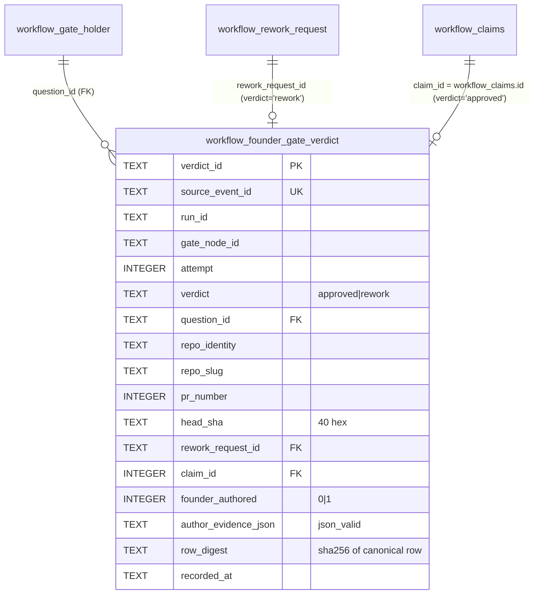

# FLY-2396 founder 门判决绑 exact head + 「是否 founder 本人」字段 — 实施计划

Issue: FLY-2396 (https://linear.app/geoforge3d/issue/FLY-2396/2309b2-founder-门判决绑-exact-head-新增是否-founder-本人字段authority-是权限不是作者p0)
日期: 2026-09-06
基于: research.md

**Status**: lead-accepted(Codex R1–R4 收敛 10→8→5→2;Lead 裁定 a44a653f 以 leadAcceptance 收口)
**Lead 裁定(2026-09-06)**:
* question 5c97aa23:遗留 63 条只用 spec §B2 的 5 条做人工 attestation,其余记未判定;报表固定写
  「63 条:5 attested / 58 未判定 / 0 猜测」;引用核验失败整条 4xx 拒收,原因进响应体。
* question 7b04e019(已发,默认照此):新 verdict 表不留 git-only 口子;引用核不过 → 4xx,基础设施故障 → 503。

## 0. 一句话

新增不可变表 `workflow_founder_gate_verdict`:founder 门每一次过卡 / 打回在**同一事务**内写一行,
快照 `(question_id, repo, pr_number, head_sha)` 与 `founder_authored` + 作者证据;
三元组解析不出就整笔回滚(判决本身也不落库);作者事实只来自 `actor === founder_id_at_capture`
或 Bridge 核过的 founder 消息引用,绝不从文本猜。

## 1. 稳定身份与显示标签

| 事物 | 稳定身份 | 显示标签(报表 / 日志) |
| --- | --- | --- |
| 判决行 | `verdict_id = 'fgv:' + sha256(source_event_id)` | `FLY-xxxx 门判决 #attempt` |
| 判决种类 | `verdict ∈ {'approved','rework'}` | 过卡 / 打回 |
| head 绑定 | `(question_id, head_sha)`,`question_id` FK → `workflow_gate_holder.question_id` | `repo#pr @ head[0:8]` |
| 作者事实 | `founder_authored ∈ {0,1}`(遗留行不在本表,报表侧显示「未判定」) | 她本人 / 非她本人 / 未判定 |
| 证据种类 | `author_evidence_json.kind ∈ {'gate_response','gate_response_legacy_payload','founder_message','operator'}` | 见 §3.2 / §3.3 |
| 部署分界 | `state_store_migration.migration_id = 'fly-2396-founder-gate-verdict-v1'` 的 `applied_at` | 遗留 / 新数据 |
| 适用域 | **每一条** founder 门判决;当前生产 holder 自 2026-08-10 起 100% 为 `land / git_head`(364 个);`runner_ship`(28)/ `engine_terminal`(10)全部在此之前,已休眠 | — |

## 2. 数据模型



DDL(`StateStore.ts` 表创建区,紧接 `migrateWorkflowReworkEngineAuthority()` 之后;
`workflow_claims` 已在更早处创建,FK 目标存在):

```sql
CREATE TABLE IF NOT EXISTS workflow_founder_gate_verdict (
  verdict_id TEXT PRIMARY KEY,
  source_event_id TEXT NOT NULL UNIQUE,
  run_id TEXT NOT NULL,
  gate_node_id TEXT NOT NULL,
  attempt INTEGER NOT NULL CHECK (attempt > 0),
  verdict TEXT NOT NULL CHECK (verdict IN ('approved','rework')),
  question_id TEXT NOT NULL,
  repo_identity TEXT NOT NULL CHECK (length(repo_identity) > 0),
  repo_slug TEXT NOT NULL CHECK (length(repo_slug) > 0),
  pr_number INTEGER NOT NULL CHECK (pr_number > 0),
  head_sha TEXT NOT NULL CHECK (length(head_sha) = 40 AND head_sha NOT GLOB '*[^0-9a-f]*'),
  rework_request_id TEXT,
  claim_id INTEGER,
  founder_authored INTEGER NOT NULL CHECK (founder_authored IN (0,1)),
  author_evidence_json TEXT NOT NULL CHECK (json_valid(author_evidence_json)),
  row_digest TEXT NOT NULL CHECK (length(row_digest) = 64),
  recorded_at TEXT NOT NULL,
  CHECK ((verdict = 'rework' AND rework_request_id IS NOT NULL AND claim_id IS NULL)
      OR (verdict = 'approved' AND claim_id IS NOT NULL AND rework_request_id IS NULL)),
  FOREIGN KEY (run_id) REFERENCES workflow_run(run_id),
  FOREIGN KEY (question_id) REFERENCES workflow_gate_holder(question_id),
  FOREIGN KEY (rework_request_id) REFERENCES workflow_rework_request(request_id),
  FOREIGN KEY (claim_id) REFERENCES workflow_claims(id)
);
CREATE INDEX IF NOT EXISTS workflow_founder_gate_verdict_run
  ON workflow_founder_gate_verdict(run_id, gate_node_id, attempt);
-- 与 workflow_rework_request 同款不可变触发器:no_update / no_delete
-- 部署分界 receipt(沿用 fly-1832 / fly-2324 的 state_store_migration 模式,但时间戳用 ISO 毫秒,
-- 与 workflow_rework_request.requested_at 同形;现有 receipt 是 'YYYY-MM-DD HH:MM:SS',TEXT 比较会错序):
INSERT OR IGNORE INTO state_store_migration (migration_id, applied_at)
  VALUES ('fly-2396-founder-gate-verdict-v1', strftime('%Y-%m-%dT%H:%M:%fZ','now'));
```

DDL、触发器、索引、receipt 四者放在**一个显式 `this.db.raw.transaction(() => { … })()`** 里,
crash / reopen 测试证明表与 receipt 不会只存在其一。

`row_digest = canonicalSubmissionDigest({source_event_id, run_id, gate_node_id, attempt, verdict, question_id,
repo_identity, repo_slug, pr_number, head_sha, rework_request_id, claim_id, founder_authored, author_evidence_json})`,
重放时整条比对(§3.1 第 3 条)。

`author_evidence_json` 形状(全部字段由代码写入,不含用户文本):

```jsonc
{ "kind": "gate_response", "actor": "<discord id | bridge | bridge-founder-consent>", "founder_id_at_capture": "<discord id>", "source_event_id": "founder-feedback:<qid>" }
{ "kind": "gate_response_legacy_payload", "actor": "...", "source_event_id": "..." }   // payload 无 founder_id_at_capture → founder_authored=0
{ "kind": "founder_message", "channel_id": "...", "message_id": "...", "author_user_id": "...", "founder_id_at_capture": "...",
  "message_ts": "<ISO>", "card_message_ts": "<ISO>", "verified_at": "<ISO>", "question_id": "...", "head_sha": "...", "card_message_id": "..." }
{ "kind": "operator", "principal": "master" }
```

## 3. 改动清单(按依赖顺序)

### 3.1 StateStore:表 + 解析器 + 写入 helper(`packages/teamlead/src/StateStore.ts`)

1. **DDL + 触发器 + 索引 + migration receipt**(§2)。
2. `private resolveFounderGateBindingTx({ runId, questionId }): { holder, repoIdentity, repoSlug, prNumber, headSha }`
   —— 全部等值 join,任一步不满足即 throw,错误消息统一前缀
   **`founder decision source payload invalid: verdict unbound (<reason>)`**(命中 projector 现有终态分类
   `source payload invalid`,见 §3.5):
   * holder:`SELECT * FROM workflow_gate_holder WHERE question_id = ? AND run_id = ?`(不限 state);缺 → `holder_missing`。
   * `holder.head_sha` 非 40 hex(含 `snapshot_digest` 主体)→ `head_not_git`。
   * ship target:`SELECT * FROM workflow_ship_target_binding WHERE approve_question_id = ?`;缺 → `ship_target_missing`;
     `run_id !== runId`(列可为 NULL,生产现有 1 行 NULL)→ `ship_target_run_mismatch`;
     `target_repo_identity` / `probe_repo_slug` 为空串(表只有 NOT NULL 没有非空 CHECK,`:21815-21830`)→
     `repo_identity_missing` / `repo_missing`;`frozen_head_sha !== holder.head_sha` → `head_mismatch`。
   * PR:`SELECT DISTINCT pr_number, probe_repo_slug FROM workflow_node_pr_binding WHERE run_id = ? AND head_sha = ? AND target_repo_identity = ?`
     (三键:run + head + `ship_target.target_repo_identity`);规约为 distinct `(pr_number, probe_repo_slug)` 元组:
     0 个 → `pr_missing`;>1 个 → `pr_ambiguous`;元组的 `probe_repo_slug !== ship_target.probe_repo_slug` → `repo_mismatch`。
   * 每一条确定性坏绑定都在 resolver 里以上述 terminal 前缀抛出;**不能**靠 verdict 表的 CHECK 约束在 INSERT 时才失败
     (原始 SQLite constraint error 不含 `source payload invalid`,会被 projector 当 retryable 永久堵队头)。
   * 不做任何兜底、不用 `base_revision`、不用 session head。
3. `private recordFounderGateVerdictTx(input)`:
   * 计算 `row_digest`;INSERT。
   * `source_event_id` 撞 UNIQUE → 读回已有行,`row_digest` 相同 → 幂等返回;不同 → throw
     `founder decision source payload invalid: verdict replay mismatch`(终态)。
4. 四个调用点(同事务):

| 调用点 | 位置 | 输入 |
| --- | --- | --- |
| 过卡 | `applyWorkflowSourceEvent` approve 分支:claim INSERT(`:52879-52901`)→ **`claimId = this.workflowClaimIdBySeq(serverSeq)`**(`:54098-54104`,`id` 与 `server_seq` 是两列,当前碰巧相等不可依赖)→ 写 verdict → `claim_written` 事件 | `verdict='approved'`, `claim_id=claimId`, `question_id=decisionQuestionId`, 作者事实来自 payload(§3.2) |
| 打回(门在当前节点) | feedback 分支,`commitWorkflowTransitionTx` 返回后(`:52713` 之后),用已有返回字段 `transition.reworkRequestId`(`WorkflowTransitionResult` 已含,`:65749-65763`;fresh 与 replay 都返回) | `verdict='rework'`, `question_id=questionId` |
| 打回(carryover) | `openPendingCarryoverFounderFeedbackTx` INSERT(`:52037-52058`)之后 | 同上 |
| 打回(operator) | `openOperatorRework`,见下 | `verdict='rework'` |

**`openOperatorRework` 控制流**(`:37560` 起的 `this.db.transaction(...)` 只在 callback 抛异常时回滚,`:584-585`)。
fresh 分支的**第一个 mutation 是 `:37812-37817`**:`heldNeedsLead` 分支里对 `workflow_output_credential` /
`workflow_submission_credential` 的 revoke UPDATE;之后 `:37821` 起 UPDATE `workflow_run_node` /
`workflow_rework_verification_path`,`:37884-37902` 是 rollback-hold 的 node 状态改写。
* 在 receipt / replay 比对(`:37569-37615`)之后、**`if (heldNeedsLead && …)` 那个 mutation block(`:37812`)之前**,
  把 snapshot / target / `sourceNodeId`(`:37959` 的规则,前移计算)判定与下列三步整体前移:
  (a) 当前 holder 读取(`state IN ('materializing','awaiting_review','approved')`,必须恰好一行);
  (b) `kind='founder_message'` 时 CAS:`holder.question_id / head_sha / card_message_id` 与 evidence 逐字段相等;
  (c) `resolveFounderGateBindingTx({ runId, questionId: holder.question_id })`。
  仅当 `sourceNodeId` 是 gate 节点时执行 (a)–(c) 与 verdict 写入。
* (a)–(c) 任一失败 **throw** typed sentinel `OperatorReworkRejected { reason }`(`founder_gate_holder_missing` /
  `founder_gate_holder_ambiguous` / `founder_gate_holder_changed` / `founder_gate_verdict_unbound`),事务整体回滚;
  `openOperatorRework` 在 transaction 外 catch sentinel 映射为 `WorkflowOperatorReworkResult { ok:false, reason, detail }`,
  其它异常照旧上抛。preflight 段落里**禁止**普通 `return` 报错(实现者注释 + G19 回归定位)。
* verdict 行在 rework INSERT(`:38038`)之后、ship target supersede(`:38121`)之前写(解析结果在 (c) 已冻结,写入不再查询)。
* route 映射:`founder_gate_holder_changed` → 409 `GATE_HOLDER_CHANGED`;`founder_gate_verdict_unbound` → 409
  `FOUNDER_GATE_VERDICT_UNBOUND`;holder missing / ambiguous → 409。
* 测试(G19):失败前后对测试库做**全 schema dump 比对**(所有表,含 `workflow_run_event`、route / delivery /
  delivery-attempt、`workflow_actor`、`workflow_run`、resume attachment、两张 credential 表),证明零变化;
  至少三个变体:普通 fresh、`heldNeedsLead + live credential`、admitted rollback-hold —— 后两条证明 sentinel 在
  `:37812` / `:37884` 两条早期写路径之前触发。

### 3.2 founder 直写路径的作者事实(payload **保持 v1**)

* `bridge/approval-signal/write-gate-response.ts` 有**两个**独立 payload literal,都要加可选键
  `founder_id_at_capture: args.founderId`(仅当为字符串时写入):
  1. `trustedFounderMessage` 分支的 `approvalSource.payload`(`:558-575`)—— founder 在 thread 直接写字 / 反应的真实来源;
  2. `trustedFounderDecision` 分支的 payload(`:589-605`)。
  `schema_version` 保持 1:`flywheel-comm/src/db.ts:2439-2442` 写死 1,`applyWorkflowSourceEvent:52217-52223`
  要求 row 与 payload 都为 1 否则 poison;digest 由同一写者对最终 payload 计算,多一个键不影响。
* `applyWorkflowSourceEvent`(approve / feedback / carryover 三处):
  `founder_authored = (typeof payload.founder_id_at_capture === 'string' && payload.actor === payload.founder_id_at_capture) ? 1 : 0`;
  无该键 → 0,`kind='gate_response_legacy_payload'`。
* 不改 `isTrustedApprovalAttribution` 与任何放行判断。
* 测试落在 `write-gate-response.test.ts`:两条分支各断言最终 payload 含该键、`schema_version=1`、digest 与 row 一致;
  projector 测试只手工构造 payload 不算证明。

### 3.3 operator 路径:`founderMessageRef` 核验(Bridge route 层)

**依赖注入**(`bridge/plugin.ts:4462-4478` → `createRunsRouter` `auth` deps 新增两项,测试可注入):
* `canonicalFounderId: () => string | null`(复用 `deriveCanonicalFounderId` 的现有 resolver)。
* `gateBotToken: (holder) => string | undefined`:**严格复用卡片投递的选法**(`bridge/plugin.ts:9430-9446`):
  `store.getSession(holder.source_execution_id)` → `store.getSessionLabels(...)` → `resolveLeadForIssue(projects, run.project_name, labels)`
  → `lead.botToken ?? config.discordBotToken`。source session / Lead / token 任一缺失 → 503 `DISCORD_TOKEN_UNAVAILABLE`。
  多 Lead 项目不得退化成 `resolveLeadForIssue(project, [])` 取第一个。

**`bridge/discord-utils.ts`** 新增 `fetchDiscordMessageFromChannel(channelId, messageId, botToken, fetchImpl = fetch)`
→ `{ ok:true, message:{ id, channelId, authorId, timestampMs } } | { ok:false, kind:'not_found'|'forbidden'|'rate_limited'|'server'|'network', status? }`。
`timestampMs = Date.parse(message.timestamp)`,NaN → `kind:'server'`(响应不合法)。

**`bridge/runs-route.ts` `POST /:runId/rework`**:
1. 新可选 body 字段 `founderMessageRef`:`{ channelId, messageId }` 或 `{ url }`(`https://discord.com/channels/<guild>/<channel>/<message>`)。
   id 必须是 17–20 位数字,否则 400 `FOUNDER_MESSAGE_REF_INVALID`。
2. 无 ref → `founderAuthorEvidence = { kind:'operator', principal:'master' }`,直接进 `openOperatorRework`(行为与今天一致)。
3. 有 ref:
   a. `canonicalFounderId()` 为 null → **503** `FOUNDER_IDENTITY_UNRESOLVED`。
   b. `store.currentFounderGateHolder(runId)`(新增只读 helper,同 §3.1 (a) 的规则)→ 0 行 409 `GATE_HOLDER_MISSING`,
      >1 行 409 `GATE_HOLDER_AMBIGUOUS`;`card_message_id` 为 NULL → 409 `GATE_CARD_NOT_BOUND`。
   c. `gateBotToken(holder)` 缺 → 503 `DISCORD_TOKEN_UNAVAILABLE`。
   d. GET 引用消息:`not_found` → 404 `FOUNDER_MESSAGE_REF_NOT_FOUND`;`forbidden` → 503 `DISCORD_TOKEN_UNAVAILABLE`;
      `rate_limited` / `server` / `network` → **503** `DISCORD_UNAVAILABLE`(可重试,不写任何行)。
   e. `authorId !== canonicalFounderId` → 422 `FOUNDER_MESSAGE_REF_NOT_FOUNDER`。
   f. GET `/channels/{channelId}/messages/{holder.card_message_id}`:`not_found` → 422 `FOUNDER_MESSAGE_REF_OUTSIDE_GATE_THREAD`;
      其它失败同 d。这一步就是把 `5ae599c6`(引另一个 issue 的 2074 原话)挡在外面的机制。
   g. **时间下界 = 卡片消息本身的 `timestampMs`**(f 步已取到;holder 在 `question_intent` 就创建,卡片可能晚于它才发出):
      `message.timestampMs < cardMessage.timestampMs` → 422 `FOUNDER_MESSAGE_REF_BEFORE_CARD`;
      另要求 `message.timestampMs >= Date.parse(holder.created_at)` 作时钟异常兜底,同码。
   h. 通过 → `founderAuthorEvidence = { kind:'founder_message', channel_id, message_id, author_user_id, founder_id_at_capture,
      message_ts, card_message_ts, verified_at, question_id: holder.question_id, head_sha: holder.head_sha, card_message_id }`。
4. 所有 4xx / 503 响应体:`{ success:false, code, reason, recorded:false }`;不调用 `openOperatorRework`。
   `recorded:false` 是给调用方的显式信号:**503 是「没记录、可重试」,不是「已记录」**(Lead 裁定 7b04e019);
   两类(核验失败 4xx / 基础设施 503)各自要有阳性测试断言 `recorded:false` 且库中零行。

**`openOperatorRework`**(同步、同事务,控制流见 §3.1):
* 入参 `founderAuthorEvidence` **必填**;形状不合法 → `invalid_operator_rework_request`。
  现有调用方要同步改(编译迁移清单):`bridge/runs-route.ts` + 测试
  `StateStore.engine-invariant` / `StateStore.founder-kickback-newcard-loop` / `StateStore.workflow-engine-transition` /
  `StateStore.workflow-rework` / `hold-shape-registry` / `workflow-engine-dispatcher`(全部传 `{ kind:'operator', principal }`)。
* **receipt**:`operator_rework_requested` receipt payload 增加 `founderAuthorEvidenceIdentityDigest`,
  = `canonicalSubmissionDigest` 于 evidence 的**稳定身份子集**:`kind, channel_id, message_id, card_message_id,
  author_user_id, founder_id_at_capture, message_ts, card_message_ts, question_id, head_sha`(`operator` 类只有 `kind, principal`);
  **排除 `verified_at`**(它是 route 每次核验的观测时间,同一请求重试必然不同)。
  replay 比对多这一项:同 `clientRequestId` + 同 ref 重试(只有 `verified_at` 变)→ `idempotentReplay=true`,返回首次结果;
  ref / author / head / card 任一不同 → `operator_request_conflict`。
  首次写入的 verdict `author_evidence_json` 仍保留 `verified_at` 作观测时间。
* **前向兼容(版本化 replay)**:生产现有 115/115 条 `operator_rework_requested` receipt 都没有该字段
  (全是 `principal='master'` 的无引用旧请求)。replay 比对规则:
  * receipt 含 `founderAuthorEvidenceIdentityDigest` → 与当前 evidence 的稳定摘要严格相等,否则 conflict。
  * receipt **缺**该字段(旧 receipt)→ 仅当当前 evidence 恰为 `{ kind:'operator', principal: payload.principal }`
    (无引用旧语义)才 `idempotentReplay=true` 并返回原结果;当前 evidence 是 `founder_message` 或 principal 不同 →
    `operator_request_conflict`。旧 replay **不补** verdict、不猜作者,仍属 cutoff 前遗留数据。
* authority context 增加同一个 `founderAuthorEvidenceIdentityDigest`(context 是 JSON,增键不改契约)。

### 3.4 回溯与报表

* `scripts/fly2396-retro-report.mjs`(新,Node):
  1. `sqlite3 ~/.flywheel/teamlead.db ".backup <tmp>/teamlead-snapshot.db"`(SQLite online backup,WAL-safe;不用 `cp`)。
  2. 健康检查:`PRAGMA quick_check` 必须**恰好一行且为 `ok`**;`PRAGMA foreign_key_check` 必须**零行**;否则退出非 0。
  3. 模式判定(同一 immutable 连接内查 `sqlite_master` 与 receipt):
     * **部署后**:`workflow_founder_gate_verdict` 表与 receipt `fly-2396-founder-gate-verdict-v1` 都必须存在,
       cutoff = receipt `applied_at`;缺任一 → 退出非 0,禁止 stub。
     * **部署前**(表与 receipt 都不存在,今日生产即此态):拒绝运行,除非显式 `--pre-deploy-cutoff <ISO>`;
       此时在同一连接里建 `CREATE TEMP TABLE workflow_founder_gate_verdict (rework_request_id TEXT)` 作兼容空表
       (否则 SQL prepare 阶段 `no such table`),输出首行标 `PRE-DEPLOY EVIDENCE (cutoff=<ISO>)`。
     * 两种语义不混用;cutoff(receipt 或 CLI)都做**严格 UTC ISO-instant 校验**:先过正则
       `^\d{4}-\d{2}-\d{2}T\d{2}:\d{2}:\d{2}(\.\d{1,3})?Z$`(完整日期 + `T` + 时分秒 + 可选 ≤3 位小数 + `Z`),
       再要求 `Number.isFinite(Date.parse(value))`,规范化为毫秒 ISO 后才传 `.parameter`;
       `"0"`、`"2026-09-06"`、`"09/06/2026"`、无 `Z`、带时区偏移等 `Date.parse` 能吃但不合合同的输入一律退出非 0。
  4. **单一 SQLite 连接**完成全部步骤(TEMP 表只对创建它的连接可见):以 `sqlite3 "file:<snapshot>?immutable=1"`
     的 stdin session 依次喂 `.parameter set :legacy_cutoff '<ISO>'`、`CREATE TEMP TABLE legacy_attestation(...)` +
     由 JSON 生成的 INSERT、(部署前)兼容空表、`.read retro-bind.sql`;原样打印输出。
* `retro-bind.sql` 修订:
  * 遗留集合:`WHERE julianday(r.requested_at) < julianday(:legacy_cutoff) AND NOT EXISTS
    (SELECT 1 FROM workflow_founder_gate_verdict v WHERE v.rework_request_id = r.request_id)`;
    用 `julianday` 而非 TEXT 比较(`'…T01:00:00.000Z' < '… 12:00:00'` 为假,同日会错排);上线后新增判决不改变 63 / 5 / 58。
  * head 校验改为 `length = 40 AND NOT GLOB '*[^0-9a-f]*'`。
  * **删除** `legacy_attestation` 的 DROP / CREATE / 内嵌 5 行 INSERT,SQL 只读 runner 建好的 TEMP 表
    (`legacy-attestation.json` 为单一来源)。
* 报表固定三段:head 可绑 / (repo,pr,head) 可绑 / founder_authored「N attested / M 未判定 / 0 猜测」,两个口径都报。
* 设计期实测(2026-09-06,`.backup` 快照与 `cp` 副本结果一致):repro `421/421` 与 `0`;
  spec55 `54 head / 53 triple`;全集 `62 / 61`;`63 条:5 attested / 58 未判定 / 0 猜测`;阳性对照 `1,1,0,0,0`。

### 3.5 projector 处置(新错误不得卡死投影)

`founder-approval-projector.ts:101` 以正则判终态(`source payload invalid` 等)→ durable deadletter
(founder 输入类先经 alert sink,`accepted` 才前移 cursor,`:252-296`);其它错误 retryable 且 `break`(队头阻塞)。
本单所有**确定性**失败(§3.1 的 unbound / mismatch / replay mismatch)都用前缀
`founder decision source payload invalid: …`,归入终态:事务回滚 → deadletter → founder-input alert → cursor 前移;
瞬态 DB 错误保持 retryable。不扩正则、不加新分类。

### 3.6 retention registry

`scripts/lib/fly-2006-retention-registry.mjs` `protectedAuthority` 加 `workflow_founder_gate_verdict`;
同步 `packages/teamlead/src/__tests__/fly-2006-database-retention-sweep.test.ts` 的精确集合;
确认 terminal archive / maintenance 不删 `workflow_gate_holder` / `workflow_claims` / `workflow_rework_request`
(都已在 `protectedAuthority`,FK 目标不会先消失)。

### 3.7 只读查询面(给 B4 两周表)

`StateStore.listFounderGateVerdicts({ runId?, since? })` 只读;不新增 HTTP 端点(B4 决定读法)。

## 4. 迁移与回滚

| | 做法 |
| --- | --- |
| 迁移 | `CREATE TABLE IF NOT EXISTS` + 触发器 + 索引 + `state_store_migration` receipt;启动幂等;不改任何旧表、不 backfill |
| 旧数据 | 不进新表;报表侧「未判定」 |
| 回滚(代码) | `git revert` 写入路径与 route;payload 仍 v1,多出的 `founder_id_at_capture` 键对旧 `applyWorkflowSourceEvent` 是未读键,digest 由写者对完整 payload 计算,旧代码校验同一 digest 仍通过 |
| 回滚(表) | 表与行留在库里;**retention registry 的 `workflow_founder_gate_verdict` 条目必须保留**(旧 registry 遇到未分类表抛 `schema_unclassified`,`fly-2006-retention-registry.mjs:108-136`,maintenance 会停),所以回滚 PR 不得 revert §3.6 那一行;若要退役表,走单独审批的表退役 PR(DROP + registry 同步),不在本单 |
| 旋钮 | 无(founder 规矩:不留开关) |
| 回滚边界 | 一旦 B4 开始读本表,回滚需与 B4 一起裁;本单单独可回滚 |

## 5. 负向守卫(必须有测试)

| # | 守卫 | 期望 |
| --- | --- | --- |
| G1 | 过卡时 holder 缺 / head 非 git sha | 事务回滚:无 claim、无 verdict、holder 状态不变;错误命中终态分类 |
| G2 | 过卡 / 打回时 PR 绑定缺 | 回滚,`verdict unbound (pr_missing)` |
| G3 | ship target 冻结 head ≠ holder head | 回滚,`head_mismatch` |
| G4 | 同一 `source_event_id` 重放 | `row_digest` 相同幂等;任一字段不同 → `replay mismatch` |
| G5 | 直写 payload `actor='bridge-founder-consent'` | `founder_authored=0`,claim 照常(权限不受影响) |
| G6 | 直写 payload 无 `founder_id_at_capture` | `founder_authored=0`,`kind='gate_response_legacy_payload'` |
| G7 | operator 打回,ref 指向 author ≠ founder | 422,无 rework 行、无 verdict 行、holder 未 supersede |
| G8 | operator 打回,ref 在别的 thread(仿 `5ae599c6`) | 422 `OUTSIDE_GATE_THREAD` |
| G9 | operator 打回,`holder.created_at < 消息 < 卡片消息` | 422 `BEFORE_CARD` |
| G10 | operator 打回,无 ref(仿 `54f0d683` / `f5bd6f2b`) | 写行,`founder_authored=0`,`kind='operator'` |
| G11 | operator 打回,有效 ref(仿 `c8f001a6` / `3f9f9f1c`) | 写行,`founder_authored=1`,`kind='founder_message'`,`message_id` 落盘 |
| G12 | 新表 UPDATE / DELETE | 触发器 ABORT |
| G13 | route 收到 ref 但 `canonicalFounderId` 解析不出 | 503,不写 |
| G14 | 放行读者守卫(denylist + 审计过的 allowlist) | 生产源码引用 `workflow_founder_gate_verdict` / `founder_authored` / `listFounderGateVerdicts` 的合法位置**只有**:StateStore DDL 与 §3.1 四个 writer、row / input 类型定义、migration receipt 常量、`listFounderGateVerdicts`、`fly-2006-retention-registry.mjs`、`retro-bind.sql` / `fly2396-retro-report.mjs`;`land-executor` / `approval-signal/*` / `post-ship-finalization` / `external-merge-reconcile` / 任何 release policy 文件出现即失败;新增位置需改测试的 allowlist(有意的摩擦) |
| G15 | 同 run 同 head 多条 PR 绑定且 `pr_number` 不一致 | 回滚,`pr_ambiguous` |
| G16 | PR 绑定 `probe_repo_slug` ≠ ship target | 回滚,`repo_mismatch` |
| G17 | 坏判决(G1/G2)之后的合法 source row | 坏行 deadletter + alert + cursor 前移;后一行正常投影 |
| G18 | alert sink 未 accept | cursor 不前移,下轮重试 |
| G19 | operator TOCTOU:核验 holder A 后 A 被 supersede、B 成为 current | 409 `GATE_HOLDER_CHANGED`,§3.1 列出的全部表整表快照前后一致 |
| G20 | 同 `clientRequestId`、不同 ref 重放 | `operator_request_conflict` |
| G21 | Discord 429 / 5xx / 网络失败 | 503,无行;404 → 404 |
| G22 | retention registry 分类 | `workflow_founder_gate_verdict ∈ protectedAuthority`,sweep 精确集合测试更新 |
| G23 | 回溯:WAL 中有未 checkpoint 提交 | `.backup` 快照包含;`cp` 副本缺失(对照) |
| G24 | 回溯:上线后新增第 64 条打回 | 遗留报表仍为 63 / 5 / 58 |
| G25 | 过卡 verdict 的 `claim_id` | fixture 使 `workflow_claims.id !== server_seq`,断言 FK 与 `listFounderGateVerdicts` 指向 claim PK |
| G26 | 回溯 runner 健康检查 | 健康快照通过;`quick_check` 非 `ok` 失败;`foreign_key_check` 非空失败;TEMP attestation 确被 SQL 消费 |
| G27 | 多 Lead 项目 token 选择 | 两个 Lead 不同 token,选中 holder `source_execution_id` 对应的那个,不是项目第一个 |
| G28 | 同 `clientRequestId` + 同 ref 重试(仅 `verified_at` 不同) | `idempotentReplay=true`,返回首次结果,不冲突 |
| G29 | cutoff 边界与格式 | 同日、同秒 fixture:`julianday` 比较正确;receipt 为 ISO 毫秒;`"0"` / `"2026-09-06"` / `"09/06/2026"` / 无 `Z` / 带偏移 等 `Date.parse` 可解析但不合合同的输入全部退出非 0 |
| G34 | 503 不是「已记录」 | 每个 503 code(身份解析、token、Discord 429 / 5xx / 网络)与每个 4xx code 各一条阳性测试:响应体 `recorded:false`,`workflow_rework_request` / verdict 表零新行,holder 未 supersede |
| G33 | 旧 receipt(无 `founderAuthorEvidenceIdentityDigest`)升级路径 | 用旧 payload 形状预置 immutable receipt:同 `clientRequestId` + 无引用 → 成功重放;附任意 ref → conflict;两者都不产生 verdict 或任何其它 mutation |
| G30 | 迁移原子性 | DDL + 触发器 + 索引 + receipt 在一个事务;crash / reopen 后要么全有要么全无 |
| G31 | 部署前旧 schema 快照 | 无表无 receipt:无 flag 拒绝;`--pre-deploy-cutoff` 下输出 63 / 5 / 58 与 `PRE-DEPLOY` 标记;部署后禁止 stub |
| G32 | resolver 的 ship target 坏行 | `run_id` NULL / 不等、repo 字段空串 → terminal 前缀错误,不是 INSERT constraint error |

## 6. 测试计划(TDD,先红后绿)

**RED 清单前列(Lead 收口裁定 a44a653f 的两条 residue,实现节点第一批写红的测试):**
1. G33 —— 旧 `operator_rework_requested` receipt(无 `founderAuthorEvidenceIdentityDigest`,生产 115/115)的版本化 replay:
   同 `clientRequestId` + 无引用 → 幂等重放;附任意 ref → `operator_request_conflict`;两者零 mutation。
2. G29 —— cutoff 严格 UTC ISO-instant 正则校验(非 `Date.parse`):`"0"` / `"2026-09-06"` / `"09/06/2026"` / 无 `Z` / 带偏移全部退出非 0。

| 文件 | 覆盖 |
| --- | --- |
| `packages/teamlead/src/__tests__/StateStore.founder-gate-verdict.test.ts`(新) | DDL / 触发器 / FK / CHECK / receipt;G1–G4、G12、G15、G16、G25、G30、G32;`listFounderGateVerdicts` |
| `packages/teamlead/src/__tests__/StateStore.workflow-rework.test.ts`(扩) | operator 路径 G10、G11、G19(三个变体 + 全 schema dump)、G20、G28、G33、holder_ambiguous、unbound → `ok:false` |
| `packages/teamlead/src/bridge/__tests__/founder-approval-projector.test.ts`(扩) | 直写 approve / feedback / carryover 三条都产生 verdict 行;G5、G6、G17、G18 |
| `packages/teamlead/src/bridge/__tests__/write-gate-response.test.ts`(扩) | 两条分支 payload 含 `founder_id_at_capture`、v1、digest |
| `packages/teamlead/src/bridge/__tests__/runs-route.founder-message-ref.test.ts`(新) | G7–G9、G13、G21、G27、G34、url 解析、deps 注入缺失 → 503、`fetchImpl` 夹具(200 / 404 / 403 / 429 / 500 / throw / invalid timestamp) |
| `packages/teamlead/src/bridge/__tests__/discord-utils.test.ts`(扩) | `fetchDiscordMessageFromChannel` 各分支 |
| `packages/teamlead/src/__tests__/fly2396-retro-report.test.ts`(新) | 夹具库(含 5 条阳性对照形状 + WAL 未 checkpoint 帧 + 一份无新表无 receipt 的旧 schema)跑 runner:G23、G24、G26、G29、G31、计数与 1,1,0,0,0 |
| `packages/teamlead/src/__tests__/fly2396-authorship-boundary.test.ts`（由 FLY-2453 重述） | G14 |
| `packages/teamlead/src/__tests__/fly-2006-database-retention-sweep.test.ts`(扩) | G22 |

运行:`pnpm -F teamlead typecheck`(`tsc --noEmit`,覆盖 `openOperatorRework` 全部调用方的编译迁移)→
`pnpm -F teamlead vitest run --exclude '**/tmux-viewer.macos.test.ts' <上述文件>` → 全套一次。

## 7. 验收证据(QA 节点要拿到的)

1. `.backup` 快照上 runner 原样输出:`repro 421/421 与 0`(spec 冻结值 358/358 与 0 是 PR #1063 当日;两者都写进 QA 报告)。
2. 回溯三段式:spec 冻结集 `55:54 head / 53 (repo,pr,head)`;全集 `63:62 / 61`;
   `founder_authored`:`63 条:5 attested / 58 未判定 / 0 猜测`;阳性对照 1,1,0,0,0。部署前跑标 `PRE-DEPLOY EVIDENCE`。
3. 新数据 100%:测试库里跑 approve、feedback、carryover、operator(有 / 无 ref)五种判决,
   `SELECT COUNT(*) FROM workflow_founder_gate_verdict` = 判决数,且表约束保证每行 `(repo_slug, pr_number, head_sha)` 非空。
4. G7–G9、G13、G19–G21 的响应体含 `code` 与 `reason`。
5. G14、G22、G27 通过;`typecheck` 绿。

## 8. 诚实边界

* 本单**不修** `openOperatorRework` 把 `authority` 硬编码成 `'founder'` 的问题(它参与 rework 授权契约);
  真相记在新表的 `founder_authored=0 / kind='operator'` 里。
* 遗留 63 条的 `founder_authored` 永远不会被系统判定;只有人工 attestation(5 条)。
* 「她本人」= 「判决绑到了一条经 Bridge 核实为她所发、且在该卡 thread 里、卡片发出之后的消息」。
  Lead 不附引用的转述会记成 0;Lead 附了一条她在该 thread 里说的无关消息,系统也会记 1 —— 本表记的是
  **绑定事实**,不是意图判断。这一条写进表注释与 B4 的读法说明。
* `runner_ship` / `engine_terminal` 门(2026-08-10 后零新建)若复活,其判决会因缺 PR 绑定被 fail-closed 拒绝;
  复活前需先补 PR 绑定,不在本单。
* Discord REST 不可用时 operator 打回若带 ref 会被 503 拒;不带 ref 照常。不做离线缓存。
* 回滚不含表退役;registry 条目随表长期保留。
* 插件 fork 源 `xrliAnnie/claude-plugins-official` 未做消费者 sweep(本机无 checkout);字段为新增可选,不阻塞。
