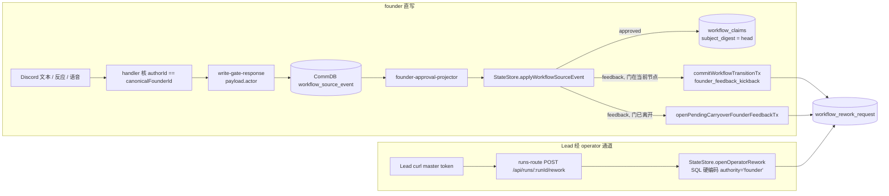

# FLY-2396 founder 门判决绑 exact head + 「是否 founder 本人」字段 — 调研

Issue: FLY-2396 (https://linear.app/geoforge3d/issue/FLY-2396/2309b2-founder-门判决绑-exact-head-新增是否-founder-本人字段authority-是权限不是作者p0)
日期: 2026-09-06
基于: exploration.md

## 1. 写入点地图(每一条 founder 门判决从哪里进库)



| 写入点 | 文件:行 | 判决 | 此刻手上有什么 |
| --- | --- | --- | --- |
| 过卡 | `StateStore.ts:52842-52901` `applyWorkflowSourceEvent` approve 分支 | approved | `decisionHolder`(question_id / head_sha / attempt / authority_mode)、`approvedHead`、`payload.actor` |
| 打回(门在当前节点) | `StateStore.ts:52690-52713` → `commitWorkflowTransitionTx` INSERT `:50651-50675` | rework | `holder`、`approvedHead`、`response.feedback`;**payload.actor 未传入** |
| 打回(门已离开,carryover) | `StateStore.ts:51924` / INSERT `:52037-52058` | rework | `questionId`、`approvedHead`、`feedback`;actor 未传入 |
| 打回(Lead operator) | `runs-route.ts:967-1100` → `openOperatorRework` `:37515`,INSERT `:38038-38052` | rework | `run.current_node_id`(`:37959`)、`principal:"master"`、`feedback`;holder 在 `:38121-38131` 被 supersede 前可查 |

四个点都在**同一个 StateStore 事务**里,判决快照行可以和判决原行同事务写,任一失败整笔回滚。

## 2. exact head 的解析链(写入时同事务查,不猜)

```mermaid
flowchart LR
  Q[question_id] --> GH[(workflow_gate_holder<br/>question_id UNIQUE → run_id, attempt, head_sha, authority_mode, card_message_id, created_at)]
  Q --> ST[(workflow_ship_target_binding<br/>approve_question_id → probe_repo_slug, target_repo_identity, frozen_head_sha)]
  GH --> PB[(workflow_node_pr_binding<br/>run_id + head_sha → pr_number, probe_repo_slug)]
  ST -.frozen_head_sha 必须 == holder.head_sha.-> GH
```

* `head_sha`:holder 行,必有(question_id UNIQUE,`state` 任意值都保留 head)。
* `repo`:`workflow_ship_target_binding.probe_repo_slug`(402 个 holder 对应 398 个 ship target;
  缺的 4 个都是 `runner_ship`);兜底用 `workflow_node_pr_binding.probe_repo_slug`。
* `pr_number`:`workflow_node_pr_binding` 同 run 同 head 的行。**它可以被 retire**
  (`StateStore.ts:47792-47795`),所以必须在判决时**快照**,不能事后 join。
* `authority_mode='land'` 的判决三元组必须齐全;`runner_ship` / `engine_terminal` 没有
  PR 主体,允许 `pr_number` / `repo` 为 NULL 并记 `binding_kind='git_head_only'`。

**回溯口径与写入口径是同一条链**:回溯脚本按 holder(run, attempt 唯一)走,
写入时按 question_id 走;两者在 holder 上汇合。

## 3. 「是否 founder 本人」的事实来源

### 3.1 已有的作者判据(权限 ≠ 作者,代码里已是两个函数)

| 函数 | 语义 | 位置 |
| --- | --- | --- |
| `isTrustedApprovalAttribution(from, founderId)` | **权限**:`"bridge"` / `"bridge-founder-consent"` / `from === founderId` 都算 | `flywheel-comm/src/founder-attribution.ts:37-44` |
| `msg.authorId !== canonicalFounderId → return null` | **作者**:只认她的 Discord user id | `founder-ship-approval-handler.ts:217`、`voice-approval-source.ts:57`、`founder-reaction-approval-factory.ts:77-81` |
| `founder_deferred_approval.author_user_id` + `founder_id_at_capture` | 作者事实的**落盘形状**(成对存,11/11 相等) | `StateStore.ts:18551` |

### 3.2 三条路径各自的作者事实

| 路径 | `founder_authored` | 证据 |
| --- | --- | --- |
| founder 直写(source event) | `payload.actor === founder_id_at_capture` ? 1 : 0 | `{kind:"gate_response", actor, founder_id_at_capture, source_event_id}` |
| Lead operator + 有效 `founderMessageRef` | 1 | `{kind:"founder_message", channel_id, message_id, author_user_id, founder_id_at_capture, message_ts, verified_at}` |
| Lead operator 无引用 | 0 | `{kind:"operator", principal}` |
| Lead operator 引用核不过 | **不写**,4xx 拒收 | 响应体 `code` + `reason` |
| engine | 0 | `{kind:"engine"}` |

`write-gate-response.ts:575-606` 的 payload 要补两个字段:`founder_id_at_capture`
(= `args.founderId`)与 `schema_version: 2`;`applyWorkflowSourceEvent` 读到 v1 payload
(没有该字段)时按 `founder_authored=0, evidence.kind="gate_response_legacy_payload"` 处理,
不猜。

### 3.3 `founderMessageRef` 的核验(Bridge 做,不信 Lead 自述)

Bridge 已有 Discord REST 层(`bridge/discord-utils.ts`,同一个 bot token),缺一个
`GET /channels/{channel}/messages/{id}`。核验规则(全部 fail-closed):

1. `ref = {channelId, messageId}`(或 Discord 消息链接,由 route 解析成两个 snowflake;
   格式不合 → 400 `FOUNDER_MESSAGE_REF_INVALID`)。
2. `GET /channels/{channelId}/messages/{messageId}` → 200,否则 4xx `FOUNDER_MESSAGE_REF_NOT_FOUND`。
3. `message.author.id === canonicalFounderId`,否则 `FOUNDER_MESSAGE_REF_NOT_FOUNDER`;
   `canonicalFounderId` 解析不出 → `FOUNDER_IDENTITY_UNRESOLVED`(与现有 fail-closed 一致)。
4. 同一 thread:holder 的 `card_message_id` 必须能在**同一个 channelId** 下取到
   (`GET /channels/{channelId}/messages/{card_message_id}` → 200),否则
   `FOUNDER_MESSAGE_REF_OUTSIDE_GATE_THREAD`;holder 无 `card_message_id`(402 里 17 条这种)
   → `GATE_CARD_NOT_BOUND`。这条规则就是把 `5ae599c6`(引另一个 issue 的 2074 原话)挡在外面的机制。
5. `message.timestamp >= holder.created_at`,否则 `FOUNDER_MESSAGE_REF_BEFORE_CARD`。

核验在 route 层(async)完成后,把 evidence 作为输入交给同步的 `openOperatorRework`;
store 不做网络 I/O。

## 4. 遗留行怎么处理

* `workflow_rework_request` 有 `no_update` / `no_delete` 触发器(`StateStore.ts:22977-22991`),
  也**不该**改:历史行没有作者事实。
* 回溯脚本 `retro-bind.sql` 只读;输出两个口径(spec 冻结 55 / 今天 63)的 head 与
  (repo, pr, head) 可绑数;`founder_authored` 列对遗留行输出 **未判定**,再 LEFT JOIN
  `legacy-attestation.json`(5 条,`attested_by="FLY-2309 build-issues §B2"`)。
* 报表格式按 Lead 裁定:「63 条:5 attested / 58 未判定 / 0 猜测」三段分开,不合并成比例。

## 5. 持久化候选:表还是列

| | 新表 `workflow_founder_gate_verdict` | `workflow_rework_request` 加列 + `workflow_claims.evidence` |
| --- | --- | --- |
| 过卡 / 打回一个词汇 | ✅ | ❌ 两套 |
| PR 号快照(抗 retire) | ✅ | ❌ 事后 join |
| 迁移 | `CREATE TABLE IF NOT EXISTS` + 不可变触发器,零改旧表 | 走 `migrateWorkflowReworkEngineAuthority` 那种整表重建 |
| B4 两周表读法 | 一张表 | 两张表 + 视图 |

选新表。`workflow_rework_request.authority` 硬编码 `'founder'` 的问题不在本单碰
(它参与 rework 授权契约:`verification_policy` / `invalidation_scope` 的选择)。

## 6. 现有测试与夹具(plan 里直接复用)

| 用途 | 文件 |
| --- | --- |
| StateStore + CommDB 真库夹具、`bindActorHead`、legacy manifests | `packages/teamlead/src/__tests__/StateStore.workflow-rework.test.ts` |
| 迁移合同测试范式 | `packages/teamlead/src/__tests__/fly2248-migration-contract.test.ts` |
| founder 直写投影(approve / feedback) | `packages/teamlead/src/bridge/__tests__/founder-approval-projector.test.ts` |
| runs-route 家族(路由级测试) | `packages/teamlead/src/bridge/__tests__/runs-route.*.test.ts` |
| canonicalFounderId fail-closed | `packages/teamlead/src/bridge/__tests__/canonical-founder-id.test.ts` |
| Discord REST 夹具(`fetchImpl` 注入) | `bridge/discord-utils.ts` 现有签名 `fetchImpl: typeof fetch = fetch` |

⚠️ 跑套件必排除 `**/tmux-viewer.macos.test.ts`(会真开 Terminal.app)。

## 7. 消费者 sweep(CLAUDE.md FLY-1914 规则,虽为增量改动仍列)

| root | 时间 | 结果 |
| --- | --- | --- |
| `packages/`、`scripts/` | 2026-09-06 | `/api/runs/:runId/rework` 仅定义与登记,无调用方 |
| `~/.claude/plugins/cache/*/` | 2026-09-06 | 0 引用 |
| `xrliAnnie/claude-plugins-official` fork 源 | — | **未检查**(本机无 checkout) |

新字段可选、旧请求体原样可用,不需要同步改造任何调用方。
