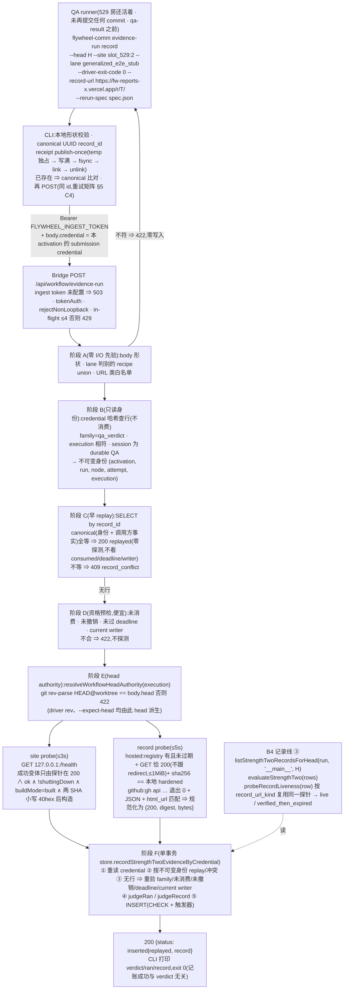
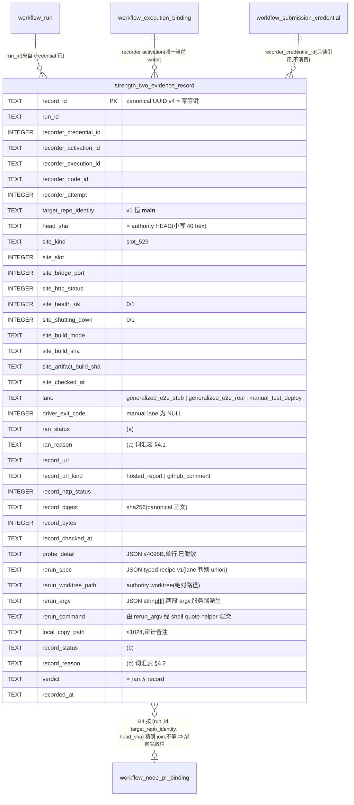

# FLY-2397 强度二证据台账 — 实施计划

Issue: FLY-2397 (https://linear.app/geoforge3d/issue/FLY-2397/2309b3-强度二证据台账-真环境跑过-外部可查可重跑的记录两个独立字段p0-影子跑前置)
日期: 2026-09-06
基于: research.md

**Status**: **effective APPROVED**(v5 = commit `6bca3d21b`;Codex R1→R4 全部吸收零拒绝 + Lead leadAcceptance 裁定 2026-09-07,见 §13;修订记录见 §12)
**方案**: exploration §3 **B 路**(新子命令 `evidence-run record` → Bridge 新 route → 新表 `strength_two_evidence_record`),Lead 已批(ask `14a0e53c`,2026-09-07,两条裁定见 §1)。

---

## 0. 目标与非目标

**目标**:把 founder 定的闸②「强度二」两半 —— (a) 在 529 房把链路从头到尾真跑一次、(b) 留下外部可查、能被重跑的记录 ——
落成一张**只追加、不可改删**的台账,两半各自是独立的字段 + 独立的判定函数 + 独立的测试;
「没有台账行 = 不满足」「有台账行但记录地址取不到 = 不满足」两条 fail-closed 规则钉成代码;交付读面给 B4(记录线 ③)。

**非目标(⛔)**:不改 `founder-only-authority`;不改 `qa-result` / `workflow_claims` / `workflow_submission_credential` 的**消费与 `submission_digest`** 合同(本单只**只读**查 credential,见 §5 C3);
不给 `auto_qa_record` 加列(它已无生产写入方);不接 `review-hold` / land / founder gate(本单只记账不拦人);
不解决 FLY-1833 型 flaky(§10);不新建托管面;不判「这一类改动强度二证不证得了」(FLY-2029 型由 Lead 人判,不在本表);
**v1 只支持 529 槽位房 + 主仓**(`site_kind='slot_529'`、`target_repo_identity='__main__'`;「其它场地」「nested 仓」没有可派生的重跑配方与 authority,§10.7–10.8)。

## 1. Lead 裁定(逐字要点,plan 照此收敛)

1. 写入者 = 新子命令 → Bridge 新 route → 新表,与 `qa-result` / `workflow_claims` 解耦;「跑过」与「判 PASS」分开记账,跑过但 FAIL 也记;⛔ 不改 `qa-result` 的 `submission_digest` 合同;新表登记 retention registry `protectedCurrentOrReference`。
2. 半边 (b)「外部可查可重跑」**在写入时判定**:写记录时 Bridge 真去取一次地址(HTTP 200 + 内容 digest),把 `checked_at / status / digest` 存进行里;之后地址过期**不回溯改判**。B4 报表把记录分三态单列:`live` / `verified_then_expired` / `unsatisfied`。托管 14 天过期作为已知限制写进 plan(§10)并告知 B4。

## 2. 总体流



## 3. 数据模型



### 3.1 DDL(放 `migrate()` 里 `founder_review_card_binding` 建表块之后,`StateStore.ts:~21690`)

`StateStore` 运行引擎是 native `better-sqlite3`(FLY-663,WAL);`json_valid` / `json_extract` 已在 `StateStore.ts:15886` 生产 SQL 里使用,C1 的 migration 测试再以本表的 CHECK 证明一次。

```sql
CREATE TABLE IF NOT EXISTS strength_two_evidence_record (
  record_id TEXT PRIMARY KEY CHECK (record_id GLOB '[0-9a-f][0-9a-f][0-9a-f][0-9a-f][0-9a-f][0-9a-f][0-9a-f][0-9a-f]-[0-9a-f][0-9a-f][0-9a-f][0-9a-f]-4[0-9a-f][0-9a-f][0-9a-f]-[89ab][0-9a-f][0-9a-f][0-9a-f]-[0-9a-f][0-9a-f][0-9a-f][0-9a-f][0-9a-f][0-9a-f][0-9a-f][0-9a-f][0-9a-f][0-9a-f][0-9a-f][0-9a-f]'),
  run_id TEXT NOT NULL CHECK (length(run_id) > 0),
  recorder_credential_id INTEGER NOT NULL,
  recorder_activation_id TEXT NOT NULL CHECK (length(recorder_activation_id) > 0),
  recorder_execution_id TEXT NOT NULL CHECK (length(recorder_execution_id) > 0),
  recorder_node_id TEXT NOT NULL CHECK (length(recorder_node_id) > 0),
  recorder_attempt INTEGER NOT NULL CHECK (recorder_attempt > 0),
  target_repo_identity TEXT NOT NULL DEFAULT '__main__'
    CHECK (target_repo_identity = '__main__' OR (
      target_repo_identity GLOB '?*/?*' AND target_repo_identity NOT GLOB '*/*/*'
      AND target_repo_identity NOT GLOB '*[^a-z0-9._/-]*' AND length(target_repo_identity) <= 200)),
  head_sha TEXT NOT NULL CHECK (length(head_sha) = 40 AND head_sha NOT GLOB '*[^0-9a-f]*'),
  site_kind TEXT NOT NULL CHECK (site_kind IN ('slot_529')),
  site_slot INTEGER NOT NULL CHECK (site_slot >= 1),
  site_bridge_port INTEGER NOT NULL CHECK (site_bridge_port BETWEEN 1 AND 65535),
  site_http_status INTEGER,
  site_health_ok INTEGER CHECK (site_health_ok IS NULL OR site_health_ok IN (0,1)),
  site_shutting_down INTEGER CHECK (site_shutting_down IS NULL OR site_shutting_down IN (0,1)),
  site_build_mode TEXT CHECK (site_build_mode IS NULL OR length(site_build_mode) BETWEEN 1 AND 32),
  site_build_sha TEXT CHECK (site_build_sha IS NULL OR (length(site_build_sha) = 40 AND site_build_sha NOT GLOB '*[^0-9a-f]*')),
  site_artifact_build_sha TEXT CHECK (site_artifact_build_sha IS NULL OR (length(site_artifact_build_sha) = 40 AND site_artifact_build_sha NOT GLOB '*[^0-9a-f]*')),
  site_checked_at TEXT NOT NULL,
  lane TEXT NOT NULL CHECK (lane IN ('generalized_e2e_stub','generalized_e2e_real','manual_test_deploy')),
  driver_exit_code INTEGER,
  ran_status TEXT NOT NULL CHECK (ran_status IN ('satisfied','unsatisfied')),
  ran_reason TEXT NOT NULL CHECK (ran_reason IN ('ok','site_unreachable','site_timeout','site_bad_payload','site_not_ready','site_head_mismatch','lane_unproven','driver_nonzero')),
  record_url TEXT NOT NULL CHECK (length(record_url) BETWEEN 12 AND 2048),
  record_url_kind TEXT NOT NULL CHECK (record_url_kind IN ('hosted_report','github_comment')),
  record_http_status INTEGER,
  record_digest TEXT CHECK (record_digest IS NULL OR (length(record_digest) = 64 AND record_digest NOT GLOB '*[^0-9a-f]*')),
  record_bytes INTEGER CHECK (record_bytes IS NULL OR record_bytes >= 0),
  record_checked_at TEXT NOT NULL,
  -- 字节上限用 CAST AS BLOB(length(TEXT) 数的是字符);换行/NUL 用 instr(含 NUL 的 GLOB pattern 会被 SQLite 截断,'*'||char(0)||'*' 退化成 '*' 且整式恒假)
  probe_detail TEXT NOT NULL CHECK (json_valid(probe_detail) AND length(CAST(probe_detail AS BLOB)) <= 4096 AND instr(probe_detail, char(10)) = 0),
  rerun_spec TEXT NOT NULL CHECK (json_valid(rerun_spec) AND length(CAST(rerun_spec AS BLOB)) <= 2048),
  rerun_worktree_path TEXT NOT NULL CHECK (rerun_worktree_path GLOB '/*' AND length(CAST(rerun_worktree_path AS BLOB)) <= 1024
    AND instr(rerun_worktree_path, char(10)) = 0 AND instr(rerun_worktree_path, char(0)) = 0),
  rerun_argv TEXT NOT NULL CHECK (json_valid(rerun_argv) AND length(CAST(rerun_argv AS BLOB)) <= 4096),
  rerun_command TEXT NOT NULL CHECK (length(CAST(rerun_command AS BLOB)) BETWEEN 1 AND 4096),
  local_copy_path TEXT CHECK (local_copy_path IS NULL OR (length(CAST(local_copy_path AS BLOB)) BETWEEN 1 AND 1024 AND instr(local_copy_path, char(10)) = 0 AND instr(local_copy_path, char(0)) = 0)),
  record_status TEXT NOT NULL CHECK (record_status IN ('satisfied','unsatisfied')),
  record_reason TEXT NOT NULL CHECK (record_reason IN ('ok','url_not_in_registry','url_expired','url_timeout','url_unreachable','url_http_error','url_body_too_large','digest_mismatch','gh_timeout','gh_unreachable','gh_not_found','gh_forbidden','gh_bad_payload','gh_url_mismatch')),
  verdict TEXT NOT NULL CHECK (verdict IN ('satisfied','unsatisfied')),
  recorded_at TEXT NOT NULL,
  -- 两半各自 status ⇔ reason='ok';verdict 只能是两半的合取
  CHECK ((ran_status = 'satisfied') = (ran_reason = 'ok')),
  CHECK ((record_status = 'satisfied') = (record_reason = 'ok')),
  CHECK ((verdict = 'satisfied') = (ran_status = 'satisfied' AND record_status = 'satisfied')),
  -- (a) satisfied 的运行时事实全部在行里且互相一致(显式 IS NOT NULL,防 NULL 穿透)
  CHECK (ran_status <> 'satisfied' OR (
    site_http_status IS NOT NULL AND site_http_status = 200
    AND site_health_ok IS NOT NULL AND site_health_ok = 1
    AND site_shutting_down IS NOT NULL AND site_shutting_down = 0
    AND site_build_mode IS NOT NULL AND site_build_mode = 'built'
    AND site_build_sha IS NOT NULL AND site_build_sha = head_sha
    AND site_artifact_build_sha IS NOT NULL AND site_artifact_build_sha = head_sha
    AND lane IN ('generalized_e2e_stub','generalized_e2e_real')
    AND driver_exit_code IS NOT NULL AND driver_exit_code = 0)),
  -- (b) satisfied 的运行时事实全部在行里
  CHECK (record_status <> 'satisfied' OR (
    record_http_status IS NOT NULL AND record_http_status = 200
    AND record_digest IS NOT NULL AND record_bytes IS NOT NULL AND record_bytes > 0)),
  -- lane 与 driver 的一致性
  CHECK ((lane = 'manual_test_deploy') = (driver_exit_code IS NULL))
);
CREATE INDEX IF NOT EXISTS idx_strength_two_evidence_record_run_repo_head
  ON strength_two_evidence_record(run_id, target_repo_identity, head_sha, recorded_at, record_id);
CREATE TRIGGER IF NOT EXISTS strength_two_evidence_record_no_update
  BEFORE UPDATE ON strength_two_evidence_record
  BEGIN SELECT RAISE(ABORT, 'strength_two_evidence_record is immutable'); END;
CREATE TRIGGER IF NOT EXISTS strength_two_evidence_record_no_delete
  BEFORE DELETE ON strength_two_evidence_record
  BEGIN SELECT RAISE(ABORT, 'strength_two_evidence_record is immutable'); END;
```

**信任边界(准确表述)**:schema 自己能证明的是 —— `satisfied` 行的 readiness 事实(200 / ok / 未 shutdown / built)、两个 SHA 恰等 head、lane 已证明、退出码 0、地址 200 + digest + 非零字节 —— **全部非空且互相一致**;
schema 不能证明的是「这些事实来自真的探针」—— 这一层由 store 的 public API 只接收探针**原始字段**(不接收已判定的 `ok`)并在事务内自行调 judge 组装 `*_status / *_reason / verdict` 来保证(§5 C1)。直接 SQL 写伪 satisfied 行必须同时伪造全部一致的事实列,C1 为每条交叉 CHECK 写直接 SQL 负例。

**schema-safe normalization(坏 payload 也必须落得进行)**:typed 列(`site_http_status / site_health_ok / site_shutting_down / site_build_mode / site_build_sha / site_artifact_build_sha`)只接收**类型与范围合法**的 raw 值(整数状态码、严格布尔 → 0/1、`buildMode` ≤ 32 字符、SHA 小写 40 hex);不合法的 raw 值置 **NULL**,截断脱敏后的原值只进 `probe_detail`。这样 `site_bad_payload`(大写 SHA、非布尔 `ok`、超长 `buildMode`)的行照样 INSERT 成功且 `ran_status='unsatisfied'`,不会撞 CHECK。
C1 的 migration 测试必须包含**一条完整合法行成功 INSERT**(不能只测负例),以及 `rerun_worktree_path` 含换行 / 含 NUL 各自失败。

### 3.2 稳定身份与不变量

- **行身份** = `record_id`(canonical UUID v4,两端同一正则,DDL GLOB)。**replay canonical** = 调用方事实(`head_sha, site_slot, lane, driver_exit_code, record_url, rerun_spec(规范化 JSON:键排序、无空白), local_copy_path`)**加上**服务端从 credential 行解析出的**不可变身份**(`recorder_credential_id / activation_id / execution_id / run_id / node_id / attempt`)。
  同 id 且 canonical 全等 ⇒ 200 `replayed`(**零探测、不看 credential 当前的 consumed / deadline / writer 状态**——首次已提交的事实不因 credential 随后被消费或 session 终态而失去可确认性);同 id 任一不等 ⇒ 409 `record_conflict`(零写入);新 id ⇒ 新行。
  canonical 之外只有服务端探测/派生字段(`site_* 探测列, *_checked_at, record_http_status/digest/bytes, probe_detail, *_status/*_reason, verdict, recorded_at, rerun_worktree_path, rerun_argv, rerun_command, target_repo_identity`)。
- **绑定** = `(run_id, target_repo_identity, head_sha)`;`run_id` 只来自 credential 行;`head_sha` 只来自 authority(`resolveWorkflowHeadAuthority`,`bridge/head-authority.ts:18`),body 的 `head` 仅作交叉校验;`target_repo_identity` v1 恒 `'__main__'`(route 写死,CLI 无入口)。
  同 `(run_id, repo, head)` 允许多行,只追加;**同 run、同 SHA、不同 repo 不互相承重**(读 API 按三元组;测试钉死)。
- **不变量**(触发器 + CHECK):行不可 UPDATE / DELETE;`verdict = ran ∧ record`;两半各自 `status ⇔ reason='ok'`;非 `ok` 的 reason 词汇表两半不相交(`site_*/lane_*/driver_*` vs `url_*/gh_*/digest_*`),测试断言 `RAN_REASONS ∩ RECORD_REASONS = {'ok'}`;`satisfied` 的事实列非空且一致;`manual_test_deploy ⇔ driver_exit_code IS NULL`。
- **显示标签**(诊断 / HTML / B4 表头):`ran` → `真环境跑过`,`record` → `外部记录可取`,`verdict` → `强度二`;reason 与三态 `live / verified_then_expired / unsatisfied` 用英文标识不翻译。

## 4. 判定(§4.1–4.3 是纯函数,`packages/teamlead/src/strength-two/judge.ts`,store 与 route 共用,不碰 I/O、不看时钟;§4.4 是只读探测,不改台账)

### 4.1 `judgeRan(input)` — (a) 真环境跑过

```ts
/** 成功变体只能由 probeSite 在完整校验后构造(模块私有构造函数;类型带 brand)。 */
export type SiteProbe =
  | { ok: true; httpStatus: 200; healthOk: true; shuttingDown: false; buildMode: 'built'; buildSha: Sha40Lower; artifactBuildSha: Sha40Lower }
  | { ok: false; reason: 'unreachable' | 'timeout' | 'bad_payload' | 'not_ready'; httpStatus?: number; raw: SiteRawFacts; detail: string };
export interface RanInput { siteProbe: SiteProbe; headSha: string; lane: Lane; driverExitCode: number | null }
export function judgeRan(i: RanInput): { satisfied: boolean; reason: RanReason }
```
顺序(前者短路后者;每条一个 reason):
1. `siteProbe.ok === false` ⇒ `unreachable → site_unreachable`、`timeout → site_timeout`、`bad_payload → site_bad_payload`(非 JSON / 缺字段 / SHA 非小写 40 hex)、`not_ready → site_not_ready`(HTTP ≠ 200 或 `ok !== true` 或 `shuttingDown === true` 或 `buildMode !== 'built'`;与 `test-deploy.sh:2219-2224` readiness 同源)
2. **防御性重验**(不信任类型):`httpStatus !== 200 || healthOk !== true || shuttingDown !== false || buildMode !== 'built' || !isSha40Lower(buildSha) || !isSha40Lower(artifactBuildSha)` ⇒ `site_not_ready` / `site_bad_payload`(测试用手工构造的矛盾 success 对象钉死)
3. `buildSha !== headSha || artifactBuildSha !== headSha` ⇒ `site_head_mismatch`
4. `lane === 'manual_test_deploy'` ⇒ `lane_unproven`(房是真的、head 是对的,但「从头到尾」无机器证词)
5. `driverExitCode !== 0` ⇒ `driver_nonzero`(A3 诊断退出、stub fatal、任何非零都算;步骤 1–7 完成 ≠ 从头到尾)
6. 否则 `ok`。

### 4.2 `judgeRecord(probe)` — (b) 外部可查可重跑

```ts
/** 两个 provider 的成功证据统一为非可选三元组;由探针在完整校验后构造。 */
export interface RecordEvidence { httpStatus: 200; digest: Sha256Hex; bytes: number /* > 0 */ }
export type RecordProbe =
  | { kind: 'hosted_report'; outcome: 'not_in_registry' | 'expired' | 'timeout' | 'unreachable' | 'http_error' | 'body_too_large' | 'digest_mismatch'; httpStatus?: number; digest?: string; bytes?: number; detail: string }
  | { kind: 'hosted_report'; outcome: 'ok'; evidence: RecordEvidence }
  | { kind: 'github_comment'; outcome: 'timeout' | 'unreachable' | 'not_found' | 'forbidden' | 'bad_payload' | 'url_mismatch'; detail: string }
  | { kind: 'github_comment'; outcome: 'ok'; evidence: RecordEvidence };
export function judgeRecord(p: RecordProbe): { satisfied: boolean; reason: RecordReason; httpStatus?: number; digest?: string; bytes?: number }
```
- 映射是一一的:hosted `outcome` → `url_not_in_registry / url_expired / url_timeout / url_unreachable / url_http_error / url_body_too_large / digest_mismatch`;github `outcome` → `gh_timeout / gh_unreachable / gh_not_found / gh_forbidden / gh_bad_payload / gh_url_mismatch`;`ok` ⇒ `ok` 并回传 `evidence` 三元组。
- `outcome==='ok'` 但 `evidence` 缺任一字段 / `bytes<=0` / digest 非 64-hex ⇒ **抛不变量错误**(实现错,不是判定;§5 C3 转 500 零写入)。
- github 的 `evidence.httpStatus` 由探针在 `gh api` **退出 0 + JSON 含 `body`/`html_url`** 时规范化为 `200`(`gh api` 本身在非 2xx 时非零退出)。
- 无论结果如何,只要取到正文就回传 `digest / bytes / httpStatus` 落行(**取不到也写行**,这是阳性对照 2 的形态)。

### 4.3 `evaluateStrengthTwo(rows)` — 行集合 → 结论(B4 / 未来闸② 的唯一入口)

```ts
export type StrengthTwoVerdict = {
  ran: { satisfied: boolean; reason: RanReason | 'no_ledger_row' };
  record: { satisfied: boolean; reason: RecordReason | 'no_ledger_row' };
  verdict: 'satisfied' | 'unsatisfied';
  basisRecordId: string | null;
};
export function evaluateStrengthTwo(rows: readonly LedgerRow[]): StrengthTwoVerdict
```
- 输入 = `listStrengthTwoRecordsForHead(runId, targetRepoIdentity, headSha)` 的结果;签名**不接收** claim / summary(自称不是输入)。
- `rows.length === 0` ⇒ 两半 `no_ledger_row`、`unsatisfied`、`basisRecordId=null`(**阳性对照 1**)。
- 存在 `verdict='satisfied'` 的行 ⇒ 取 `recorded_at` 最大(并列取 `record_id` 字典序最大)⇒ `satisfied`,两半 `ok`。
- 否则取 `recorded_at` 最大的行 ⇒ `unsatisfied`,两半照抄该行。**两半独立**成对测试:`ran ok + record url_http_error` ⇒ `ran.satisfied===true, record.satisfied===false`(**阳性对照 2**);`ran site_head_mismatch + record ok` ⇒ 反之;两者 verdict 都 `unsatisfied`。

### 4.4 `probeRecordLiveness(row, deps)` — 给 B4 三态,不参与判定(只读探测,会执行 fetch / `gh api`,**不改台账**)

`row.record_status==='unsatisfied'` ⇒ `unsatisfied`;否则**按 `record_url_kind` 复用 §5 C2 的同一个 provider 探针**(hosted 取 HTML bytes、github 用 `gh api` 取 comment body),
`outcome==='ok'` 且 `evidence.digest === row.record_digest` ⇒ `live`;其它任何结果 ⇒ `verified_then_expired`。注入 `fetch / execFile / registry`;不写表。
测试:hosted live / hosted 过期 / github public live / github private(gh 有权)live / github 404 / 评论被编辑 ⇒ `verified_then_expired`。

## 5. 分 chunk(顺序即依赖;每 chunk 独立可 build、可 review)

### C1 · StateStore:新表 + 事务 API + retention 登记
- DDL(§3.1)。类型 `StrengthTwoEvidenceRecordRow`。
- `recordStrengthTwoEvidenceByCredential(input)` —— **单事务**,次序照抄 `submitWorkflowDecisionByCredential`(`StateStore.ts:49196-49300`:先重读 credential、先答 replay、再验资格):
  ```ts
  input: { credential: string /* raw token */, recordId,
           callerFacts: {recorderExecutionId, headSha, siteSlot, lane, driverExitCode, recordUrl, rerunSpec, localCopyPath?},  // 全部进 canonical
           authority: {headSha, worktreePath}, siteProbe: SiteProbe, recordProbe: RecordProbe, rerun: {argv: string[][], command: string}, probeDetail: string, now }
  → { ok: true; status: 'inserted' | 'replayed'; row }
  | { ok: false; reason: 'credential_not_found' | 'credential_family_mismatch' | 'credential_execution_mismatch' | 'record_conflict'
                     | 'credential_consumed' | 'credential_revoked' | 'credential_expired' | 'not_current_writer:<writer_session_missing|writer_session_terminal|writer_binding_stale>'
                     | 'credential_not_durable_qa' | 'authority_head_mismatch' }
  ```
  ① `getWorkflowSubmissionCredentialByToken`(hash 查,**不写** `consumed_at` / `submission_digest`)⇒ 缺 ⇒ `credential_not_found`;`family !== 'qa_verdict'` ⇒ `credential_family_mismatch`;`execution_id !== callerFacts.recorderExecutionId` ⇒ `credential_execution_mismatch`;
  ② 由 credential 行得不可变身份 `(id, activation_id, run_id, node_id, attempt, execution_id)`;
  ③ `SELECT by record_id`:有行 ⇒ canonical 比较(§3.2)⇒ `replayed` / `record_conflict`——**此分支不看 consumed / revoked / deadline / writer / role**(replay-first:首次已提交的事实不因 role 后续漂移而失去可确认性);
  ④ 无行 ⇒ 在 INSERT 紧前、**从同一事务快照**重验(顺序固定):`consumed_at != null` ⇒ `credential_consumed`;`revoked=1` ⇒ `credential_revoked`;`now ≥ absolute_deadline_at` ⇒ `credential_expired`;`classifyCurrentWorkflowWriterTx({run,node,attempt,execution,activation})` 非 ok ⇒ `not_current_writer:*`;**重新 `getSession(execution)`,`session_role` 与 `chat_thread_role` 必须都是 `'qa'`** ⇒ 否则 `credential_not_durable_qa`(这两列可被 session upsert `StateStore.ts:7915` 与公开 metadata patch `:9188-9216` 改写,而 `classifyCurrentWorkflowWriterTx` 不看它们,所以 role 是**新写资格**,只有事务内的读才算数);`authority.headSha !== callerFacts.headSha` ⇒ `authority_head_mismatch`;
  ⑤ `judgeRan / judgeRecord` 在事务内由 store 调用(store **不接收**已判定的 status);⑥ INSERT(`target_repo_identity='__main__'`,`driver_exit_code` 在 manual lane 置 NULL);任何 CHECK 违反 ⇒ 抛,事务回滚。**不用 `INSERT OR IGNORE`**。
- 读 API:`listStrengthTwoRecordsForRun(runId)`、`listStrengthTwoRecordsForHead(runId, targetRepoIdentity, headSha)`(按 `recorded_at, record_id`)。
- `classifyCurrentWorkflowWriterTx`(`StateStore.ts:46065`)保持私有,由本事务方法内部复用;不新增公开入口。
- retention:`protectedCurrentOrReference` 加 `strength_two_evidence_record`;fixture 加一行;硬计数**相对 +1**。
- 测试 `StateStore.strength-two-evidence-record.test.ts`(真 credential 铸造 helper,复用 decision 测试族的 activation fixture):
  同 id canonical 全等 ⇒ `replayed`、不改 `recorded_at`、探针输入被忽略、**credential 已被消费 / session 已终态时仍 `replayed`**;同 id 换 `record_url` / 换 `rerun_spec` 一字 / 换 credential(另一 execution)⇒ `record_conflict` 零变化;不同 id 同 head ⇒ 两行;同 run 同 SHA 不同 repo ⇒ `listStrengthTwoRecordsForHead` 互不可见;
  **资格竞态**:探针结果准备好后、调用事务前分别 consume / revoke / 让 deadline 过去 / 起 replacement attempt / **把 `session_role` 改成 `main`** / **把 `chat_thread_role` 改成 `main`** ⇒ 对应 reason(后两者 `credential_not_durable_qa`)、零行;**replay-first 钉死**:已有行后把任一 role 改掉再同 id 重放 ⇒ 仍 `replayed`;`review_verdict` family ⇒ `credential_family_mismatch`;credential 行在调用前后逐字段相等(只读);
  UPDATE / DELETE 被触发器拒;直接 SQL 负例逐条(`verdict='satisfied'` 配任一半 unsatisfied、`ran='satisfied'` 配 `site_http_status=500` / `site_health_ok=0` / `site_build_mode='source'` / `site_build_sha IS NULL` / `≠ head` / `lane='manual_test_deploy'` / `driver_exit_code=1`、`record='satisfied'` 配 `http_status=204` / `digest IS NULL` / `bytes=0`、大写 hex、非 canonical UUID、`rerun_spec`/`probe_detail`/`rerun_argv` 非 JSON、`probe_detail` 含换行或 >4096、repo `/owner`·`owner/`·`owner//repo`·`owner/repo/extra`、manual lane 带 exit code);retention 计数 + `assertNoUnclassifiedSchema` 通过;better-sqlite3 上 `json_valid` CHECK 生效。

### C2 · 判定核 + 两个探测器(`strength-two/judge.ts`、`bridge/strength-two-probes.ts`)
- §4 的 `judgeRan / judgeRecord / evaluateStrengthTwo` 纯函数与 `probeRecordLiveness`(只读探测)在 teamlead;`RAN_REASONS / RECORD_REASONS / LANES` 常量与 recipe validator、shell-quote helper 放在 **flywheel-comm 的共享合同模块**(§C4,依赖方向 teamlead → flywheel-comm 已存在:`packages/teamlead/package.json:63` `"flywheel-comm": "workspace:*"`);测试从 `sqlite_master` 读回建表 SQL,断言常量集合 == DDL 字面集合。
- `probeSite({slot, selfPort, slotsFilePath, fetchImpl, timeoutMs=3000, maxBodyBytes=SITE_BODY_MAX_BYTES})`:读 `~/.flywheel/test-slots.json`(路径注入)取 `slots[slot-1].bridgePort`;缺 ⇒ `port_unresolved`(C3 转 422);等于 `selfPort` ⇒ `port_is_self`(422)。**`selfPort` 由 handler 按本次请求取 `req.socket.localPort`**(Bridge 的 `createBridgeApp()` 在 `plugin.ts:7188` 先挂路由、`app.listen()` 在 `:7466-7474` 之后才发生,`server.address()` 在挂载时不存在;`config.port` 在 `port:0` 的测试与动态监听场景下又会漏,所以只信本连接的本地端口);`GET http://127.0.0.1:<port>/health`,`AbortSignal.timeout`;**正文用 bounded stream reader**:累计超过 `maxBodyBytes`(64 KiB;真实 /health 约 3–4 KB)即 `reader.cancel()` 并判 `bad_payload`,deadline 到点亦 cancel,不做无界 `response.json()`;网络异常 ⇒ `unreachable/timeout`;非 JSON / 缺字段 / SHA 非小写 40 hex ⇒ `bad_payload`;`status !== 200 || ok !== true || shuttingDown === true || buildMode !== 'built'` ⇒ `not_ready`;**只有全部通过才构造 success 变体**(模块私有 `makeSiteOk`)。原始字段(`status, ok, shuttingDown, buildMode, buildSha, artifactBuildSha`)进 `raw`;落列前经 §3.1 的 **schema-safe normalization**(合法才进 typed 列,否则 NULL,原值只进 `probe_detail`)。**永不抛可预期 I/O**。
- `probeRecord({url, registry, hostOverride, vercelProjectName, fetchImpl, execFileImpl, now, timeoutMs=5000, maxBodyBytes=1MiB})`:
  - URL 分类(严格正则,research §1.5;path 以 `/` 结尾、token hex、host 恰等于 `vercelProjectName`.vercel.app 或 `hostOverride.publicBaseUrl` 前缀);其它 ⇒ `unsupported`(C3 转 422)。
  - hosted:`registry.list()` 找 token(`createdAt + RETENTION ≤ now` ⇒ `expired`);`registry.readReportHtml(token)` 算 `localSha256`;`fetch(url,{signal, redirect:'manual'})`;`status !== 200` 或 3xx ⇒ `http_error`;按 `maxBodyBytes` 截断 ⇒ `body_too_large`;`sha256(body) !== localSha256` ⇒ `digest_mismatch`;否则 `ok` + `{200, digest, bytes}`(`bytes<=0` 不可能出现在 `ok`:空正文 sha 与本地不等)。registry 文件读错 / JSON 损坏 ⇒ **抛不变量错误**(基础设施 ⇒ C3 500 ⇒ CLI 重试)。
  - github:`execFile('gh',['api',`repos/${o}/${r}/issues/comments/${id}`],{signal, maxBuffer: 1MiB})`;退出码 + stderr 映射:`404` ⇒ `not_found`、`401/403` ⇒ `forbidden`、AbortError ⇒ `timeout`、ENOENT/其它 spawn 错 ⇒ `unreachable`、非 JSON / 缺 `body`|`html_url` / maxBuffer ⇒ `bad_payload`;`html_url`(去 fragment)== 给的 URL(去 fragment)且 fragment `#issuecomment-<id>` 的 id == path id ⇒ 否则 `url_mismatch`;通过 ⇒ `ok` + `{httpStatus:200, digest:sha256(body), bytes:byteLength(body)}`(`body` 为空串 ⇒ `bad_payload`)。
  - `probe_detail` 生成:两个探针的 `raw / detail / 耗时 / 重定向` 合成单行 JSON,stderr 与 detail 各截 256 字符、去换行、**脱敏**(`Bearer …`、`ghp_/gho_/ghu_`、`sk-`、`token=`、`credential`)后总长 ≤ 4096(超出再截 `detail`)。
- 测试 `judge.test.ts`:§4.1 六条顺序各一例 + 短路顺序 + **矛盾 success 对象**(`{ok:true, httpStatus:500,…}` 手工构造 ⇒ `site_not_ready`);§4.2 每个 outcome 一例、`ok` 缺 digest / `bytes=0` ⇒ 抛不变量;§4.3 空集 / 两半独立成对 / 多行取最新 satisfied / 并列按 `record_id`;词汇表交集 `= {'ok'}`。
- 测试 `strength-two-probes.test.ts`(fake fetch / fake execFile / fake slots 文件 / fake registry):port 未解析;port 等于 `selfPort`(fetch **零调用**);`/health` 正文超过 `SITE_BODY_MAX_BYTES` ⇒ `bad_payload` 且 reader 已 cancel;**持续流**(永不结束的 body)在 deadline 后 cancel、不再读取;`/health` **HTTP 500 + 其余 ready 字段** ⇒ `not_ready`;200 + `ok:false`;200 + `buildMode:'source'`;`shuttingDown:true`;超时;非 JSON;大写 SHA ⇒ `bad_payload`;hosted 各分支含 redirect、204、1 MiB+1、同长度不同正文、发布前原始 HTML sha ≠ hardened;github `html_url` 不匹配、403、404、非 JSON、maxBuffer、空 body;URL 分类反例;**探针对任何注入的 fetch/execFile 异常都不抛**(fuzz);`probe_detail` 脱敏与单行/长度断言。

### C3 · Bridge route(`bridge/strength-two-evidence-route.ts`,挂 `/api/workflow`,与 decision 路由并列)
- 挂载(`plugin.ts` `/api/workflow` 段):`config.ingestToken` **未配置 ⇒ 整条路由 503**(同 `plugin.ts:2356` `/design-review-validation`);已配置 ⇒ `tokenAuthMiddleware(config.ingestToken)` + `rejectNonLoopback`(从 `workflow-decision-routes.ts:455` 抽成共享 util)+ in-flight 计数 ≤ 4(`try/finally` 释放),超出 429 `busy`。
- 阶段(§2;A–E 在事务外,F 在事务内,**F 是权威**):
  - **A 先验(零 I/O)**:body 形状、`record_id` canonical UUID、`head` 小写 40 hex、`site` 形状(`slot_529:<n>`)、`lane` 枚举、`driver_exit_code`(generalized 必填整数;manual 必须缺省)、`rerun_spec` 按 lane 判别的 union(§C4)、URL 类白名单 ⇒ 不符 422。
  - **B 只读身份**:`getWorkflowSubmissionCredentialByToken(body.credential)` ⇒ 缺 422 `recorder_credential_unknown`;`family !== 'qa_verdict'` ⇒ 422 `recorder_credential_family`;`execution_id !== body.recorder_execution_id` ⇒ 422 `recorder_credential_mismatch`;`getSession(execution)` 的 `session_role`/`chat_thread_role` 非 `qa` ⇒ 422 `recorder_not_durable_qa`(同 `workflow-decision-routes.ts:824-830`;**此处只是便宜预检,非权威**——权威判定在阶段 F 事务内从同一快照重读 session,§C1 ④,store 返回 `credential_not_durable_qa` 时 route 同样映射为 422 `recorder_not_durable_qa`,两处词汇对齐)。
  - **C 早 replay**:`SELECT by record_id` 有行 ⇒ canonical 比较 ⇒ 200 `replayed` / 409(零探测;不看资格)。
  - **D 资格预检**(便宜,避免为明显不合格的请求探测;**非权威**):consumed / revoked / deadline / current writer ⇒ 422 `recorder_credential_consumed|revoked|expired` / `recorder_not_current_writer:*`。
  - **E authority**:`resolveWorkflowHeadAuthority(store, execution)`(`bridge/head-authority.ts:18`;`git -C <worktree> rev-parse HEAD`,5s)⇒ 抛 ⇒ 422 `head_authority_unavailable:<execution_not_found|worktree_not_found|git_head_unavailable|invalid_git_head>`;`prHeadSha !== body.head` ⇒ 422 `head_authority_mismatch`(附 `expectedHeadSha`);worktree 路径含 `\n`/NUL 或非绝对 ⇒ 422 `recorder_worktree_unsafe`;extra slots 按 slots registry 校验(§C4)⇒ 不合 422 `rerun_spec_invalid:<extra_slot_missing|extra_slot_duplicate|extra_slot_is_main>`。
  - 探针:`probeSite({…, selfPort: req.socket.localPort})` 与 `probeRecord` `Promise.allSettled` 并行(墙钟上界 ≈ 5s);`rejected` 只可能是不变量错误 ⇒ 500 `probe_infrastructure_failure:<site|record>` 零写入;`port_unresolved / port_is_self / unsupported` ⇒ 422。
  - 渲染:`rerun_argv` = 两段 argv(deploy 段、driver 段;manual lane 无 driver 段),全部从 `head / slot / lane / spec` 派生;`rerun_command` = `cd <q(worktree)> && [ "$(git rev-parse HEAD)" = <q(head)> ] && TMPDIR=/tmp/ TEST_REPLY_BY_ISSUE=1 bash <argv0…> [&& node <argv1…>]`,每个 token 经 **POSIX single-quote helper** `shellQuote`(`'` → `'\''`;来自共享合同模块 `flywheel-comm/strength-two-contract`,§C4,两端共用,含 apostrophe / 空格 / `$` / 反引号 / 换行拒绝的测试)。
  - **F 事务**:`store.recordStrengthTwoEvidenceByCredential(...)`(§C1)⇒ `ok:false` 映射:`record_conflict` 409;其它 422 `evidence_run_rejected:<reason>`;`ok:true` ⇒ 200。
- 拒绝码汇总(全部零写入):422 `evidence_run_rejected:<body_shape|record_id_invalid|head_invalid|site_invalid|site_kind_unsupported|lane_invalid|driver_exit_code_required|driver_exit_code_forbidden|rerun_spec_invalid:*|record_url_kind_unsupported|recorder_credential_unknown|recorder_credential_family|recorder_credential_mismatch|recorder_not_durable_qa|recorder_credential_consumed|recorder_credential_revoked|recorder_credential_expired|recorder_not_current_writer:*|head_authority_unavailable:*|head_authority_mismatch|recorder_worktree_unsafe|slot_port_unresolved|slot_port_is_self>`;409 `record_conflict`;429 `busy`;500 `probe_infrastructure_failure:*`;503 未配置;401/403 中间件。
  ⚠️ 探测**失败**不是拒绝:`site_*` / `url_*` / `gh_*` / `digest_mismatch` 都**写行**(§4)。
- 响应 200:`{ok:true, status:'inserted'|'replayed', record:{record_id, run_id, target_repo_identity, head_sha, verdict, ran:{status,reason}, record:{status,reason,http_status,digest,bytes}, rerun_command}}`。
- 测试 `strength-two-evidence-route.test.ts`(supertest + 真 StateStore + fake probes + 真 credential 铸造 + fake git authority):每个 422 一例并断言表零行(含 **shared bearer 冒充**、**持自己合法 `review_verdict` credential 的 design runner**、自有 execution 但错 family、**wrong head**(worktree HEAD ≠ body.head)、非 durable QA、同 execution 多 node、stale replacement、terminal session、已消费、已撤销、过 deadline、extra slot 缺/重/等主槽、worktree 含 apostrophe 的合法路径**可正确 quote**、含换行 ⇒ 422);ingest token 未配置 ⇒ 503;非 loopback 403;错 token 401;第 5 个并发 429 且 `finally` 后计数归零;**self-port**:测试让 slots registry 指向真实 ephemeral Bridge 端口(`app.listen(0)` 后写 slots 文件)⇒ 422 `slot_port_is_self` 且 site fetch 零调用;**raw facts 归一化端到端**(route → 真 StateStore):`/health` 返回大写 SHA / 非布尔 `ok` / 超长 `buildMode` 三例都 `200 inserted` 且 `ran_status='unsatisfied'`、typed 列为 NULL、`probe_detail` 含截断原值;完整 happy path 一行 `verdict='satisfied'`(hosted);**github happy path 落到真 StateStore 一行 `satisfied`**;**阳性对照 2 端到端**(fake fetch 404 ⇒ 200 inserted,`record_status='unsatisfied'`、`verdict='unsatisfied'`、`ran_status='satisfied'`);对称组合;replay 全等 ⇒ 200 `replayed` 零探测、**且在 credential 已被 qa-result 消费之后仍 replayed**;replay 换 execution ⇒ 409 零写入;**探针进行中并发 consume / revoke / replace / expire / 改 `session_role` / 改 `chat_thread_role` ⇒ 事务 F 拒绝、零行**(fake probe 暂停 seam;后两者 422 `recorder_not_durable_qa`);**role 漂移后同 id 重放 ⇒ 仍 200 `replayed`**(route 与 store 的 replay-first 语义一致);探针不变量错误 ⇒ 500 零行;探针并行 fake clock 总耗时 < 5.5s;credential 行前后逐字段相等。

### C4 · CLI(`flywheel-comm evidence-run record`)+ Blueprint 提示词
- 参数:`--exec-id`(或 `FLYWHEEL_EXEC_ID`)、`--head <40hex>`(交叉校验用;服务端以 authority 为准)、`--site slot_529:<n>`、`--lane generalized_e2e_stub|generalized_e2e_real|manual_test_deploy`、`[--driver-exit-code <int>]`(generalized 必填,manual 禁止)、`--record-url <https://…>`、`--rerun-spec <path.json>`、`[--local-copy <path ≤1024>]`、`[--record-id <uuid>]`;credential 由 `currentWorkflowCredentialFromEnv({executionId, kind:'submission', envName:'FLYWHEEL_WORKFLOW_SUBMISSION_CREDENTIAL'})`(`workflow-activation.ts:48`)取得,**不进 receipt、不进日志、不进 stdout**。
- `rerun_spec` schema v1(**以 lane 为判别的穷尽 union,无重复信息**;两端同一 validator,单一来源导出):
  ```ts
  type RerunSpecV1 =
    | { schemaVersion: 1; lane: 'generalized_e2e_stub' | 'generalized_e2e_real';
        deploy: { leadLabel?: Label; extraLeads?: Array<{ slot: number; deptLabel: Label }> };  // ≤4;有 extraLeads 必须有 leadLabel
        driver: { issue: /^[A-Z]+-\d+$/; timeoutMs: int, 10000 ≤ x ≤ 3_600_000 } }
    | { schemaVersion: 1; lane: 'manual_test_deploy';
        deploy: { generalized: boolean; stubRunner?: boolean /* 仅 generalized */; leadLabel?: Label; extraLeads?: … } };
  Label = /^[A-Za-z0-9._-]{1,64}$/
  ```
  `spec.lane` 必须等于 `--lane`(422 `rerun_spec_invalid:lane_mismatch`);manual lane 的 `deploy.generalized === false` 时 **`stubRunner` 必须缺省**(`test-deploy.sh:248-251` 拒绝 `--stub-runner` 不带 `--generalized`;422 `rerun_spec_invalid:stub_runner_requires_generalized`);slot / head / `--expect-head`(generalized 房)/ `--stub-runner` / `--real` / `--timeout-ms` 全由服务端从 `site / authority head / lane / spec` 派生;未知键 ⇒ 422。
- **共享合同模块(两端同一份代码,可构建)**:新文件 `packages/flywheel-comm/src/strength-two-contract.ts`,导出 `LANES / RAN_REASONS / RECORD_REASONS / RECORD_ID_PATTERN / validateRerunSpecV1 / canonicalizeRerunSpec / shellQuote(单引号 helper:`'` → `'\''`,拒绝含换行/NUL 的 token)/ renderRerunCommand(argv[][] → 一行)`;`packages/flywheel-comm/package.json` `exports` 增加 `"./strength-two-contract": "./dist/strength-two-contract.js"`(与既有 `./ship-eligibility` 等同形);teamlead 的 judge / route / store 只从 `flywheel-comm/strength-two-contract` 导入(依赖方向 teamlead → flywheel-comm,不反向);C4 加 teamlead 侧 import 的构建覆盖(`pnpm -r build` 后 teamlead 测试真正解析到 dist 导出)。测试 `strength-two-contract.test.ts`:validator 每条规则正反例;`shellQuote` 对 apostrophe / 空格 / `$` / 反引号 / 分号 / 空串 的输出经 `sh -c 'printf %s'` 回读逐字相等,换行 / NUL 抛错。派生规则:`generalized_e2e_stub` ⇒ deploy `--generalized --stub-runner --expect-head <head>`,driver 无 `--real`;`generalized_e2e_real` ⇒ deploy `--generalized --expect-head <head>`,driver `--real`;`manual_test_deploy` ⇒ deploy 按 `spec.deploy.generalized/stubRunner`(generalized 时加 `--expect-head <head>`),无 driver 段。extra slots:服务端读同一份 `~/.flywheel/test-slots.json`,每个 extra slot 必须存在、彼此唯一、≠ main slot(与 `scripts/lib/qa-multilead.sh:263-287` 同判据)。
- receipt(**publish-once,no-clobber**):目录 `<resolveRunnerStateDir(execId)>/evidence-run/`(`packages/flywheel-comm/src/runner-state.ts:4`;`mkdir 0700`,`lstat` 非 symlink),文件 `<record_id>.json`(canonical payload,**不含 credential / bearer**):
  ① 同目录 `openSync(tmp, 'wx', 0o600)`(tmp 名含 pid+random)→ 写满 → `fsyncSync` → `closeSync`;② `linkSync(tmp, dest)`:成功 ⇒ `unlinkSync(tmp)`;`EEXIST` ⇒ `unlinkSync(tmp)`,读 dest 比对 canonical:全等 ⇒ 复用 id 重放;不等 ⇒ 本地 `receipt_conflict` exit 1,**不 POST、不覆盖**;③ 目录 `fsync`(尽力)。`--record-id` 显式给出时同样规则。dest 若是 symlink 或 mode 非 0600 ⇒ exit 1 `receipt_unsafe`。
- 重试 / 退出码矩阵(同 `record_id`;**共 3 次尝试** = 初次 + 2 次重试,退避 1s、2s,最后一次后不 sleep):

  | 响应 | 动作 | exit |
  | --- | --- | --- |
  | 200 `inserted` / `replayed` | 打印 `strength-two: verdict=<v> ran=<s>/<r> record=<s>/<r> record_id=<id>` | 0(**与 verdict 无关**) |
  | 409 `record_conflict` | 打印 reason,不重试 | 1 |
  | 422 `evidence_run_rejected:*` | 打印 reason,不重试 | 1 |
  | 400 / 401 / 403 / 404 / 405 / 413 / 其它 4xx(除 408、429) | 打印 status + body,不重试(404 = 路由不存在,回滚场景) | 1 |
  | 408 / 429 / 5xx / 网络错 / 15s 超时 / 非 JSON / 2xx 非 200 | 重试 | 用尽 ⇒ 2,提示 `--record-id <id>` 重跑 |
- `Blueprint.ts`(QA 阶段提示,`:1772` 附近 `generalizedVerdictAction` 之前)补:「If you exercised this head in a 529 room, record strength-two evidence **immediately after the driver exits: while the room is still up, before `test-teardown.sh`, before committing anything else in this worktree (the record binds `git rev-parse HEAD`, which must equal the room's buildSha), and before `qa-result`** (the record is authenticated by your unconsumed submission credential): `node <comm> evidence-run record --exec-id … --head $(git rev-parse HEAD) --site slot_529:<n> --lane generalized_e2e_stub|generalized_e2e_real --driver-exit-code <driver exit code> --record-url <published QA report URL> --rerun-spec <spec.json>`. A torn-down room, a HEAD that differs from the room's buildSha, or an unreachable report URL records as unsatisfied (fail-closed). This records evidence only; it is not a verdict and does not change any gate.」提示词只描述已实现的行为。
- 测试 `evidence-run.test.ts`:每个本地校验失败 exit 1;receipt 协议:tmp 写完后 publish 前崩溃 ⇒ 无 dest、tmp 可清;publish 后响应前崩溃 ⇒ 重跑复用 id;两个并发 writer 同 id 同 payload ⇒ 一个 publish 一个比对通过;同 id 不同 payload ⇒ 后者 exit 1 不覆盖;dest 为 symlink ⇒ exit 1;mode 0600 / 目录 0700;credential 不出现在 receipt / stdout / stderr;矩阵每行一例(含 404 ⇒ exit 1 无重试、429 ⇒ 重试、最后一次后无 sleep);`rerun_spec` 反例(带 `head`、带 `slot`、`lane` 不等、`timeoutMs=9999` / `3_600_001`、未知键、manual 带 driver、generalized 缺 driver、extraLeads 无 leadLabel)。

### C5 · 验收脚本 + 验收文档
- `scripts/fly-2397-strength-two-acceptance.mjs --db <只读副本> --cutover <ISO>`(`--cutover` 必填 = 本表 migration 上线时刻,实现节点以部署时间写死进 acceptance.md):
  1. **阳性对照 1(固定 cohort,真副本)**:SQL 写死为
     `SELECT workflow_run_id, subject_digest FROM workflow_claims WHERE predicate='qa_passed' AND subject_kind='git_head' AND subject_digest GLOB '<40×[0-9a-f]>' AND issued_at < :cutover AND json_extract(evidence,'$.summary') LIKE '%vercel.app%'`;
     **先断言 n > 0**,打印候选全集、排除数(`subject_kind='snapshot_digest'` 或 digest 非法者);对每条按 `(workflow_run_id, '__main__', subject_digest)` 调 `evaluateStrengthTwo(listStrengthTwoRecordsForHead(...))` ⇒ 必须全部 `no_ledger_row / unsatisfied`;
  2. **阳性对照 2 / 对称组合 / 反向对照**:三组 canonical rows **写死在代码里并版本化**(`STRENGTH_TWO_ACCEPTANCE_ROWS_V1`,导出常量,内容 sha256 写进 acceptance.md),脚本在 `:memory:` 库上插入后调 `evaluateStrengthTwo`:`ran ok + record url_http_error(404)` ⇒ `unsatisfied ∧ ran.satisfied`;`ran site_head_mismatch + record ok` ⇒ `unsatisfied ∧ record.satisfied`;两半 `ok` ⇒ `satisfied`;**运行者不能提供 fixture**;
  3. 打印 `cutover=<ts> cohort_total=<N> cohort_excluded=<k> positive_1=<n>/<n> positive_2=pass symmetric=pass negative=pass rows_sha256=<…>`;任一不满 ⇒ 退出非 0;生产副本只读打开。
- 测试 `scripts/__tests__/fly-2397-strength-two-acceptance.test.mjs`:fixture 小库(3 条 pre-cutover claim + 1 条 `snapshot_digest` 应被排除 + 0 行台账)跑通并报 `excluded=1`;cohort 为空 ⇒ 脚本失败;通过**导出的 evaluator seam** 注入一组把阳性对照 2 改成 `record ok` 的 rows ⇒ evaluator 断言失败(证明断言不是恒真)。
- `engineering/doc/FLY-2397-strength-two-evidence-ledger/acceptance.md`(实现节点写,本 plan 定骨架):四条对照的机器输出、副本时间戳、cutover、全集规模、rows sha256;**§10 缺口原文保留**;给 B4 的接口说明(§4.3 / §4.4 / 三态 / `(run, repo, head)` join / 「绑定失败」栏)。

## 6. 上限与预算(一处定义,多处引用)

| 项 | 值 | 来源 |
| --- | --- | --- |
| `SITE_PROBE_TIMEOUT_MS` | 3,000 | 同机 loopback,/health 常态 <50ms |
| `RECORD_PROBE_TIMEOUT_MS` | 5,000 | 两个探针并行,路由墙钟上界 ≈ 5s(+ authority `git rev-parse` ≤5s 在探针之前串行) |
| `RECORD_BODY_MAX_BYTES` | 1 MiB | 托管报告上限 512 KB(`publish-report.ts:57`)的 2 倍;超出 `url_body_too_large`;`gh` `maxBuffer` 同值 |
| `SITE_BODY_MAX_BYTES` | 64 KiB | 真实 `/health` 约 3–4 KB;bounded stream reader,超出 cancel ⇒ `site_bad_payload` |
| `probe_detail` | ≤ 4096 **bytes**(`length(CAST … AS BLOB)`;生成器按 `Buffer.byteLength` 缩减),单行,脱敏 | DDL CHECK;每次记账最多放大表 ~4 KB |
| `local_copy_path` / `rerun_worktree_path` | ≤ 1024 bytes | DDL CHECK |
| `rerun_spec` / `rerun_argv` / `rerun_command` | ≤ 2048 / 4096 / 4096 bytes | DDL CHECK |
| 路由并发 | in-flight ≤ 4,超出 429 | 事件循环上 ≤ 4 × (≤512 KB 本地读 + ≤1 MiB 哈希 + ≤64 KiB /health parse) |
| CLI 超时 / 尝试 | 15,000 ms / 共 3 次尝试,退避 1s·2s | 覆盖 ≈10s 服务端上界(authority 5s + 探针 5s)+ 余量 |
| `driver.timeoutMs` | 10,000 ≤ x ≤ 3,600,000 | 驱动器下限 `qa-529-generalized-e2e.mjs:83`;上限防无界配方 |
| `extraLeads` | ≤ 4,存在/唯一/≠主槽 | `qa-multilead.sh:263-287`;沙箱 4 槽 |
| 同 `(run, repo, head)` 行数 | 不设上限 | 每次记账一行;B4 只看最新 satisfied |
| 出站流量 | 每次记账 ≤ 1 fetch + ≤ 1 `gh api` + 1 loopback /health + 1 本地 git | 由 QA 触发,非轮询;不进 GatePoller |

## 7. 迁移 / 回滚

- **迁移**:`CREATE TABLE IF NOT EXISTS` 启动即建;无数据回填;无 `state_store_migration` receipt。
- **回滚边界**:回退代码 ⇒ 路由消失,CLI 收到 404 ⇒ **exit 1 不重试**(§C4 矩阵);表留在库里无害(`protectedCurrentOrReference`,无人读);触发器随表留下。**不需要**回滚 SQL。
- **不可逆点**:无(本单不改任何门;credential 只读)。
- **与 FLY-2395 的合并顺序门**:两单都改 `StateStore.ts`(migrate 块 + API)、`plugin.ts`(`/api/workflow` 挂载段)、`Blueprint.ts`(QA/implement 提示)、retention 三处。**后合者必须 rebase 并重跑**:`fly-2006-database-retention-sweep`、`StateStore.*.test.ts`(两单新表)、两单的 route 测试、Blueprint 快照测试。不承诺只有一处交叉。

## 8. 负向护栏清单(实现必须各有一条红→绿测试)

| 护栏 | 触发 | 结果 |
| --- | --- | --- |
| **R-0 durable-QA 事务内重验(Lead 裁定:residue 首条,实现阶段必须先有这条红测)** | 探针期间 `session_role` / `chat_thread_role` 被改写(upsert / metadata patch),binding、credential、session status 都不变 | 事务 F 拒 `credential_not_durable_qa`,零行;同 id 重放仍 `replayed`(replay-first) |
| G0 只认台账 | `evaluateStrengthTwo` 的输入类型不含 claim / summary;空集 | 两半 `no_ledger_row`,`unsatisfied` |
| G1 地址真取 | registry 缺 / 过期 / 非 200 / redirect / 超时 / 超 1 MiB / 远端 ≠ 本地 hardened / gh 404·403·非 JSON·空 body·URL 不符 | 行照写,`record_status='unsatisfied'`,verdict `unsatisfied` |
| G2 房身份 | 房不可达 / 超时 / 非 JSON / HTTP≠200 / `ok:false` / shutdown / `buildMode≠built` / 任一 SHA ≠ head / 矛盾 success 对象 | `ran_status='unsatisfied'`(`site_*`);port 未解析 / 是自身 ⇒ 422 不写 |
| G3 两半独立 | `ran ok + record url_*` 与 `ran site_* + record ok` 成对 | 各自一半 true、verdict `unsatisfied`;CHECK 拒绝 `verdict='satisfied'` 配任一半 unsatisfied |
| G4 身份 | shared bearer 冒充 / `review_verdict` credential / 非 durable QA / 已消费·撤销·过期 / 非当前 writer / 探针期间并发消费·替换 | 422,零写入;credential 行零变化 |
| G5 authority | body.head ≠ worktree HEAD / worktree 缺失或不安全 | 422,零写入;head 只来自 `git rev-parse` |
| G6 入口 | URL 类不支持 / spec 重复·矛盾·越界 / lane 不等 / extra slot 缺·重·等主槽 / 非 529 场地 | 422,零写入 |
| G7 不可改删 | UPDATE / DELETE | 触发器 ABORT |
| G8 幂等 | 同 id canonical 全等(含 credential 事后已消费) / 同 id 换任一事实或换 execution / receipt 本地不等 | replay 零探测 / 409 零写入 / 本地 exit 1 不 POST 不覆盖 |
| G9 伪 satisfied | 直接 SQL 写 `satisfied` 配缺失或不一致的事实列 | CHECK 拒绝 |
| G10 基础设施 vs 判定 | registry 文件损坏 / 探针实现抛错 / `ok` 缺 evidence | 500 零写入(CLI 重试),**不**伪装成 `url_*` |
| G11 注入 | worktree 含 apostrophe / 空格(合法)· 含换行(拒绝) | 正确 quote / 422 |

## 9. 验收(硬,逐条映射 spec)

| spec | 实现里的证据 |
| --- | --- |
| 一条记录至少含:绑的 head、在哪跑的、跑的是哪条链路、外部可查的记录地址、怎么重跑 | DDL 列 `head_sha / site_* / lane / record_url / rerun_spec + rerun_worktree_path + rerun_argv + rerun_command`,全部 NOT NULL;head 来自 authority,重跑命令由服务端派生并钉 head |
| 两半必须是两个独立字段 | `ran_status/ran_reason` 与 `record_status/record_reason` 两组列;`judgeRan` / `judgeRecord` 两个函数;CHECK 绑定 |
| fail-closed:没有台账行 = 不满足;只认台账不认自称 | §4.3 空集分支;函数签名不接收 claim;C5 固定 cohort(n>0)跑在真副本上 |
| 阳性对照 1 | C2 测试 + C5 脚本(cohort 全集、排除数一并报) |
| 阳性对照 2 | C2 测试(404)+ C3 端到端(fake fetch 404 ⇒ 行在、unsatisfied、ran 仍 true)+ C5 代码内 canonical row |
| 两半分别被单独测到 | C2/C3/C5 三层都有成对的非对称用例;词汇表交集 `= {'ok'}` |
| 登记 retention registry(`protectedCurrentOrReference`) | C1 三处 + sweep 测试通过 |
| 已知不解(flaky)保留说明 | §10 原文进 acceptance.md |

## 10. 已知不解与残余(照 spec 明写,实现不许悄悄声称覆盖)

0. **residue 首条(Lead 裁定,leadAcceptance 条件)**:R4 唯一 BLOCKER —— durable-QA 角色必须在权威 INSERT 事务内重验 —— 已在 v5 吸收(§5 C1 ④、§8 R-0);它没有再经 Codex 复审,所以**实现阶段必须先写这条红测**(store 层 + route 层各一条:探针期间改任一 role ⇒ 零行;role 漂移后同 id 重放 ⇒ 仍 `replayed`),红→绿之后才允许进入其它 chunk 的绿测。
1. **flaky(FLY-1833 型)**:一个 flaky 的端到端测试照样会偶然全绿 ⇒ 台账照记「跑过 + 有记录」,判满足。本单没有新解法;acceptance.md 保留这句。
2. **驱动器退出码是自报项**:(a) 的机器证词只到「房活着、built、head 恰等 authority HEAD」;「跑到第 9 步」由 recorder 报 `driver_exit_code`。`rerun_command` 让任何人能重跑核实,但本单不替你重跑。
3. **托管报告 14 天过期**(FLY-2283):(b) 在写入时判定,过期不回溯改判;B4 用 `probeRecordLiveness` 分 `live / verified_then_expired`;**已告知 B4**(本 plan §4.4 即接口)。
4. **head 漂移 / 记账顺序**:head 只认 QA worktree 的 `git rev-parse HEAD`,且必须等于房的 buildSha ⇒ QA 必须在**再提交任何 commit 之前**记账;记账后再推 docs commit ⇒ 新 head 无行 ⇒ B4 记入「绑定失败」栏,不猜、不放宽。
5. **`github_comment` 类的凭据面**:Bridge 内 `gh` 的 token 若无该仓权限 ⇒ `gh_forbidden`(fail-closed),不是本单要修的。
6. **stub-runner 房的结构性盲区**(记忆库):`lane=generalized_e2e_stub` 的行是「链路跑过」,不是「显示面验过」;B4 若要按 lane 分层,列已在。
7. **只支持 529 槽位房**:spec 写「在哪跑的(529 房 / 其它)」;v1 的 `site_kind` 只有 `slot_529`,「其它」场地没有可派生的重跑配方与可探的身份,route 拒绝(422 `site_kind_unsupported`)而不是生成假配方。要收「其它」需先定义那种场地的 typed adapter,另立单。codex-runner 房同理(驱动器无对应模式),只能作 `manual_test_deploy`(`lane_unproven`)。
8. **只支持主仓**:`target_repo_identity` v1 恒 `__main__`;nested 仓的 head authority 属于 FLY-2395 的声明/绑定域,本单不解析。B4 join 键已含 repo 列,后续扩展不改键。
9. **记账必须在 `qa-result` 之前**:身份靠未消费的 submission credential;`qa-result` 之后再记 ⇒ `recorder_credential_consumed`(422);但**已记过的行在 credential 消费后仍可 replay 确认**。返工的新 attempt 有新 credential,可再记。

## 11. 实现时待核(先测后定,不默认放宽)

- `gh api` 在 Bridge 进程里的凭据面是否与 `ship-relevant-diff` 用同一把 token(research §5);不足则 `gh_forbidden`。
- `Promise.allSettled` 与 authority `git rev-parse` 串行后的真实墙钟(fake clock 测试给上界,实机 acceptance.md 记一次实测)。

## 12. 修订记录

- v1(2026-09-06):初稿,送 Codex design review R1。
- v2(2026-09-07,R1 反馈,10 BLOCKER + 1 MINOR 全部吸收):typed recipe;hosted 恰 200 + hardened digest;site 完整 readiness;503 + 只读 credential 身份;replay canonical 含身份;`(run, repo, head)` 键;liveness 按 kind;词汇表 total;C5 固定 cohort;DDL 交叉 CHECK;引擎/上界/合并门校正。
- v3(2026-09-07,R2 反馈,6 BLOCKER + 2 MINOR 全部吸收,零拒绝):
  1. credential 资格改在**INSERT 同一事务内重读并重验**(次序照抄 `submitWorkflowDecisionByCredential`);exact replay 按不可变身份先答且**不依赖** consumed / deadline / writer 当前状态;新增探针期间并发 consume / revoke / replace / expire ⇒ 零行,与 INSERT 后响应丢失、随后 consume ⇒ replayed 的竞态测试。
  2. 身份收紧:`family==='qa_verdict'` + durable QA session(同 decision route)+ `resolveWorkflowHeadAuthority` 派生 head(body.head 只交叉校验)⇒ `driver_rev` 列与 `--driver-rev` / `--repo-identity` 参数删除,driver rev = authority head;`target_repo_identity` v1 写死 `__main__`;新增 review credential / 错 family / wrong head 反例。
  3. site probe 成功变体**只由探针在完整校验后构造**(brand 类型)+ judge 防御性重验 + DDL 新增 `site_http_status / site_health_ok / site_shutting_down / site_build_mode` 列并进 satisfied CHECK;§3.1 信任边界改为准确表述;新增 HTTP 500 + ready payload、矛盾 success 对象三层负例。
  4. recipe 改为**以 lane 判别的穷尽 union**,删除 `runnerMode`;v1 拒绝 `site=other`(DDL enum 只剩 `slot_529`);extra slots 走 slots registry(存在/唯一/≠主槽);`rerun_argv` 数组 + POSIX shell-quote helper;worktree 含换行/NUL 拒绝;`timeoutMs` 上限 3,600,000。
  5. receipt 改为 publish-once 协议(同目录独占 temp → 写满 → fsync → `link` → unlink;EEXIST 只比对);路径钉为 `resolveRunnerStateDir(execId)/evidence-run/<record_id>.json`;新增并发 writer / 崩溃点 / symlink / mode 测试。
  6. 两个 provider 成功统一为非可选 `{httpStatus:200, digest, bytes>0}`;`gh api` 退出 0 + JSON 规范化为 200;新增 github route→真 StateStore satisfied 插入 E2E 与 hosted 缺 digest / 零字节不变量测试。
  7. C5 三组 canonical rows 写死在代码并版本化(sha256 进 acceptance.md),运行者不能提供 fixture;cohort SQL 按真实 schema 写死(`workflow_run_id`、`subject_kind='git_head'`、小写 40-hex、`json_extract`)。
  8. 重试矩阵 total 化(4xx 逐类、共 3 次尝试、最后不 sleep;404 ⇒ exit 1,§7 同步);repo GLOB 收紧(拒 `/owner`、`owner/`、`owner//repo`、`owner/repo/extra`);`probe_detail` ≤4096 单行脱敏、`local_copy_path` ≤1024;in-flight `finally` 释放。
- v4(2026-09-07,R3 反馈,4 BLOCKER + 2 MINOR 全部吸收,零拒绝):
  1. DDL 的换行 / NUL 条件改为 `instr(col, char(10)) = 0 AND instr(col, char(0)) = 0`(含 NUL 的 GLOB pattern 被 SQLite 截断,原式恒假会拒绝一切合法路径);C1 migration 测试新增**完整合法行成功 INSERT** + 换行 / NUL 各自失败。
  2. 新增 **schema-safe normalization**(§3.1):typed site 列只收合法值,不合法置 NULL、原值只进 `probe_detail`;route → 真 StateStore 的大写 SHA / 非布尔 `ok` / 超长 `buildMode` 三例 `200 inserted / ran unsatisfied`。
  3. `selfPort` 改取本次请求的 `req.socket.localPort`(`createBridgeApp()` 在 `app.listen()` 之前挂路由,`server.address()` 当时不存在;`config.port` 在 `port:0` 场景漏);测试用真实 ephemeral 端口写进 slots registry ⇒ 422 且 site fetch 零调用。
  4. 新增 `SITE_BODY_MAX_BYTES = 64 KiB` bounded stream reader(超出 / deadline 都 cancel,不做无界 `response.json()`),纳入 §6 并测 over-cap 与持续流。
  5. 共享合同模块落为 `packages/flywheel-comm/src/strength-two-contract.ts` + `package.json` exports `./strength-two-contract`,teamlead 单向导入并加构建覆盖;manual recipe 收窄 `generalized:false ⇒ stubRunner 缺省`(`test-deploy.sh:248-251`)。
  6. C1 签名补 `callerFacts.recorderExecutionId`;所有长度上限改为字节(`length(CAST … AS BLOB)`)并让生成器按 `Buffer.byteLength` 缩减;§4 只称三个 judge 为纯函数,`probeRecordLiveness` 改称「只读探测,不改台账」。
- v5(2026-09-07,R4 反馈,1 BLOCKER 吸收,零拒绝):durable-QA 角色(`session_role` / `chat_thread_role` 都为 `qa`)升为**新写资格**,在 `recordStrengthTwoEvidenceByCredential` 的 replay 分支之后、judge/INSERT 之前从同一事务快照重读 session 重验(store 新 reason `credential_not_durable_qa`,route 映射 422 `recorder_not_durable_qa`);阶段 B 的 role 检查明确为非权威预检;新增探针期间改任一 role ⇒ 零行、以及 role 漂移后同 id 重放仍 `replayed` 的竞态测试(store 与 route 两层)。
- v5.1(2026-09-07,Lead leadAcceptance 后):Status 改 effective APPROVED;§8 顶部加 R-0;§10 加 residue 首条;新增 §13。

## 13. Lead 裁定记录(leadAcceptance,2026-09-07)

- **裁定**(ask `dd5b8e8a`,flywheel-eng-lead):**(B) leadAcceptance —— 以 v5(commit `6bca3d21b`)为 effective APPROVED,不开 R5。**
- **收敛轨迹**:Codex design review R1 → R4 = 10 BLOCKER + 1 MINOR → 6B + 2M → 4B + 2M → 1B;每一项全部吸收、零拒绝;方向(新命令 → 新路由 → 新表;两半独立字段;写入时判定 (b))从未被推翻。
- **R4 唯一 BLOCKER** —— durable-QA 角色须在权威 INSERT 事务内重验 —— 已在 v5 吸收(§5 C1 ④),并带 role 竞态 + replay-first 测试(§5 C1 / C3);按 Lead 要求列为 **residue 首条(§10.0)** 并置于 **§8 护栏清单最前(R-0)**;**实现阶段必须先有这条红测**。
- **design-review.json** 按 leadAcceptance 形状写:`acceptedBy: flywheel-eng-lead`,`codexFinalVerdict: "R4 1 BLOCKER absorbed in v5"`,`rounds: 4`,`codexThreadId: 01a0797b-d565-79c0-b40b-0292b198ccee`。
- 早先的两条 Lead 裁定(ask `14a0e53c`)见 §1;R4 是否开的 ask `d68da9ec` 被本裁定覆盖。
