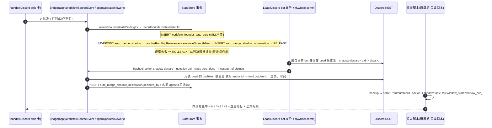

# FLY-2398 自动合并影子跑(两周) — 实施计划
Issue: FLY-2398 (https://linear.app/geoforge3d/issue/FLY-2398/2309b4-自动合并影子跑两周-四条记录线-错判率表一次都不真的自动合并p1-依赖-b1b2b3)
日期: 2026-09-08
基于: research.md

**Version**: v5(吸收 Codex R1 11 条 + R2 9 条 + R3 6 条 + R4 残余 #6 与 follow-up)
**Status**: 待 Lead leadAcceptance(R4 后不开 R5,Lead 裁定 ask `3ceaf73f`)
**Source**: `product/doc/FLY-2309-auto-merge-rollout/build-issues.md` §B4、`prd.md` §4–§5;同文件夹 exploration.md / research.md

行号以 `main` @ `ee113cab9` 为准。

---

## 0. 目标与非目标

**目标**:每一条 founder 门判决(`workflow_founder_gate_verdict`)在**同一事务**里冻结一行「影子观察」(线①机器判的类 + 线③强度二两半);给 Lead 一条**身份可核实**、只追加、枚举字段的「人判的类」声明通路(线②);交一份只读 SQL + 包装脚本,任何人拿库副本都能复算 N1 / N2 / N3 与四条线各自的覆盖率,**每一个 0 都带全集规模**。

**非目标**(⛔):不写任何合并执行代码;不改 `founder-only-authority` / merge 授权契约;不改 B1/B2/B3 的表、判定核、`review-hold.ts`;不改 founder 的 Discord 卡文案与任何动作;不补历史判决;不做配置类 / 单点修改类的机器判定;不做 B5。

## 1. 稳定身份与显示标签

| 概念 | 稳定标识(库 / 代码) | 显示标签(报表 / HTML) |
| ---- | ------------------- | --------------------- |
| **cohort 单元** | 一次 **founder 门动作**,稳定键 `action_key ∈ claim:<workflow_claims.id> / rework:<workflow_rework_request.request_id> / dead:<project>|<source_event_id>`(死信表 PK 是 `(project, source_event_id)` 复合键,§6.3);`question_id` 只是精确绑定后的属性,不是动作身份 | 「一次过卡」 |
| 观察行 | `auto_merge_shadow_observation.verdict_id`(= 判决主键,1:1) | 「影子观察」 |
| 机器判的类 | `machine_class ∈ docs_only / ship_relevant / unknown`(照 `RunShipRelevance.verdict`) | 纯文档 / 含代码 / 判不了 |
| 机器判不了的原因 | `machine_reason`(照 `RunShipRelevanceUnknownReason` 与 ship_relevant reason 原词) | 英文原词 |
| 强度二两半 | `s2_ran_*` / `s2_record_*` / `s2_verdict`(照 FLY-2397 词汇表) | 真环境跑过 / 外部记录可取 / 强度二 |
| 人判的类 | `declared_class ∈ pure_docs / config_only / single_point_change / other_code` | 纯文档类 / 配置类 / 单点修改类 / 其它代码 |
| 声明行 | `auto_merge_shadow_declaration.declaration_id`(客户端 canonical UUID v4,幂等键);**一条声明属于一张卡**(`question_id`) | 「类别声明」 |
| 声明人 | `declared_by` = **Bridge 从项目名册解析出的 Lead `agentId`**(服务端派生,不信 body) | Lead 名 |
| 她有没有打回 / 是不是她本人 | `workflow_founder_gate_verdict.verdict` / `founder_authored`(B2 原字段,不镜像语义) | 批准 / 打回;她本人 / 非她本人 |
| 报表三个数 | `N1` `N2` `N3`(PRD §5.1 原名) | 纯文档类错判率(她本人口径)/(founder 权限口径)/ 她本人打回的那几条 |

## 2. 总体流



## 3. 数据模型

```mermaid
erDiagram
  workflow_founder_gate_verdict ||--o| auto_merge_shadow_observation : "verdict_id(1:1,同事务)"
  workflow_gate_holder ||--o{ auto_merge_shadow_declaration : "question_id(声明属于卡)"
  workflow_run ||--o{ auto_merge_shadow_declaration : "run_id(冗余,来自 holder)"
  strength_two_evidence_record }o..o| auto_merge_shadow_observation : "SQL 逐列重算断言"
  auto_merge_shadow_observation {
    TEXT verdict_id PK
    TEXT run_id
    TEXT question_id
    TEXT gate_execution_id
    TEXT repo_identity
    INTEGER pr_number
    TEXT head_sha
    TEXT observed_at "= verdict.recorded_at"
    TEXT machine_class
    TEXT machine_reason
    INTEGER machine_file_count
    INTEGER machine_candidate_count "= relevance.prs.length,>=0"
    INTEGER machine_declared_projected_count "= projectCurrentShipRelevantCandidates().length"
    INTEGER machine_primary_snapshot_age_ms
    INTEGER machine_declared_max_snapshot_age_ms
    TEXT machine_basis_json "字节预算编码,<=16384"
    TEXT s2_ran_status
    TEXT s2_ran_reason
    TEXT s2_record_status
    TEXT s2_record_reason
    TEXT s2_verdict
    TEXT s2_basis_record_id
    INTEGER s2_row_count "recorded_at<=observed_at 且 exact head"
    INTEGER s2_other_head_row_count "同(run,repo)其它 head 行数,<=observed_at"
    INTEGER shadow_version "1"
  }
  auto_merge_shadow_declaration {
    TEXT declaration_id PK "canonical UUID v4"
    TEXT question_id FK
    TEXT run_id FK
    TEXT declared_class "4 值枚举"
    TEXT declared_by "名册 agentId,服务端派生"
    TEXT discord_channel_id UK-part
    TEXT discord_message_id UK "一条消息只能用一次"
    TEXT discord_author_user_id "= lead.botUserId"
    TEXT message_ts "Discord 消息时间"
    INTEGER declaration_seq "question 内单调"
    TEXT declared_at
  }
```

### 3.1 DDL(放 `migrate()` 里 `migrateFounderGateVerdictLedger()` 调用之后,`StateStore.ts:~24115`;DDL + 触发器 + 索引 + receipt 在一个显式 `this.db.raw.transaction(() => {…})()` 内)

```sql
CREATE TABLE IF NOT EXISTS auto_merge_shadow_observation (
  verdict_id TEXT PRIMARY KEY,
  run_id TEXT NOT NULL CHECK (length(run_id) > 0),
  question_id TEXT NOT NULL CHECK (length(question_id) > 0),
  gate_execution_id TEXT NOT NULL CHECK (length(gate_execution_id) > 0),
  repo_identity TEXT NOT NULL CHECK (length(repo_identity) > 0),
  pr_number INTEGER NOT NULL CHECK (pr_number > 0),
  head_sha TEXT NOT NULL CHECK (length(head_sha) = 40 AND head_sha NOT GLOB '*[^0-9a-f]*'),
  observed_at TEXT NOT NULL,
  machine_class TEXT NOT NULL CHECK (machine_class IN ('docs_only','ship_relevant','unknown')),
  machine_reason TEXT CHECK (machine_reason IS NULL OR machine_reason IN (
    'primary_ship_relevant','declared_ship_relevant','file_budget_exceeded',
    'primary_snapshot_missing','primary_snapshot_stale','primary_snapshot_version_mismatch',
    'declared_snapshot_missing','declared_snapshot_stale','declared_snapshot_version_mismatch',
    'nested_review_uncovered','declaration_overflow','scope_unresolved')),
  machine_file_count INTEGER CHECK (machine_file_count IS NULL OR machine_file_count >= 0),
  machine_candidate_count INTEGER NOT NULL CHECK (machine_candidate_count >= 0),
  machine_declared_projected_count INTEGER NOT NULL CHECK (machine_declared_projected_count >= 0),
  machine_primary_snapshot_age_ms INTEGER,
  machine_declared_max_snapshot_age_ms INTEGER,
  machine_basis_json TEXT NOT NULL CHECK (json_valid(machine_basis_json) AND length(CAST(machine_basis_json AS BLOB)) <= 16384),
  s2_ran_status TEXT NOT NULL CHECK (s2_ran_status IN ('satisfied','unsatisfied')),
  s2_ran_reason TEXT NOT NULL CHECK (length(s2_ran_reason) BETWEEN 1 AND 64),
  s2_record_status TEXT NOT NULL CHECK (s2_record_status IN ('satisfied','unsatisfied')),
  s2_record_reason TEXT NOT NULL CHECK (length(s2_record_reason) BETWEEN 1 AND 64),
  s2_verdict TEXT NOT NULL CHECK (s2_verdict IN ('satisfied','unsatisfied')),
  s2_basis_record_id TEXT,
  s2_row_count INTEGER NOT NULL CHECK (s2_row_count >= 0),
  s2_other_head_row_count INTEGER NOT NULL CHECK (s2_other_head_row_count >= 0),
  shadow_version INTEGER NOT NULL CHECK (shadow_version = 1),
  CHECK ((machine_class = 'docs_only') = (machine_reason IS NULL)),
  CHECK (machine_class <> 'docs_only' OR machine_file_count IS NOT NULL),
  CHECK ((s2_verdict = 'satisfied') = (s2_ran_status = 'satisfied' AND s2_record_status = 'satisfied')),
  CHECK ((s2_row_count = 0) = (s2_ran_reason = 'no_ledger_row' AND s2_record_reason = 'no_ledger_row' AND s2_basis_record_id IS NULL)),
  CHECK (s2_row_count = 0 OR s2_basis_record_id IS NOT NULL),
  FOREIGN KEY (verdict_id) REFERENCES workflow_founder_gate_verdict(verdict_id),
  FOREIGN KEY (run_id) REFERENCES workflow_run(run_id)
);
CREATE INDEX IF NOT EXISTS idx_auto_merge_shadow_observation_run
  ON auto_merge_shadow_observation(run_id, observed_at, verdict_id);
CREATE TRIGGER IF NOT EXISTS auto_merge_shadow_observation_no_update
  BEFORE UPDATE ON auto_merge_shadow_observation
  BEGIN SELECT RAISE(ABORT, 'auto_merge_shadow_observation is immutable'); END;
CREATE TRIGGER IF NOT EXISTS auto_merge_shadow_observation_no_delete
  BEFORE DELETE ON auto_merge_shadow_observation
  BEGIN SELECT RAISE(ABORT, 'auto_merge_shadow_observation is immutable'); END;

CREATE TABLE IF NOT EXISTS auto_merge_shadow_declaration (
  declaration_id TEXT PRIMARY KEY CHECK (declaration_id GLOB
    '[0-9a-f][0-9a-f][0-9a-f][0-9a-f][0-9a-f][0-9a-f][0-9a-f][0-9a-f]-[0-9a-f][0-9a-f][0-9a-f][0-9a-f]-4[0-9a-f][0-9a-f][0-9a-f]-[89ab][0-9a-f][0-9a-f][0-9a-f]-[0-9a-f][0-9a-f][0-9a-f][0-9a-f][0-9a-f][0-9a-f][0-9a-f][0-9a-f][0-9a-f][0-9a-f][0-9a-f][0-9a-f]'),
  question_id TEXT NOT NULL CHECK (length(question_id) > 0),
  run_id TEXT NOT NULL CHECK (length(run_id) > 0),
  declared_class TEXT NOT NULL CHECK (declared_class IN ('pure_docs','config_only','single_point_change','other_code')),
  declared_by TEXT NOT NULL CHECK (length(declared_by) BETWEEN 1 AND 64 AND declared_by NOT GLOB '*[^A-Za-z0-9._-]*'),
  discord_channel_id TEXT NOT NULL CHECK (length(discord_channel_id) BETWEEN 1 AND 32 AND discord_channel_id NOT GLOB '*[^0-9]*'),
  discord_message_id TEXT NOT NULL UNIQUE CHECK (length(discord_message_id) BETWEEN 1 AND 32 AND discord_message_id NOT GLOB '*[^0-9]*'),
  discord_author_user_id TEXT NOT NULL CHECK (length(discord_author_user_id) BETWEEN 1 AND 32 AND discord_author_user_id NOT GLOB '*[^0-9]*'),
  message_ts TEXT NOT NULL,
  declaration_seq INTEGER NOT NULL CHECK (declaration_seq > 0),
  declared_at TEXT NOT NULL,
  UNIQUE (question_id, declaration_seq),
  FOREIGN KEY (question_id) REFERENCES workflow_gate_holder(question_id),
  FOREIGN KEY (run_id) REFERENCES workflow_run(run_id)
);
CREATE TRIGGER IF NOT EXISTS auto_merge_shadow_declaration_no_update
  BEFORE UPDATE ON auto_merge_shadow_declaration
  BEGIN SELECT RAISE(ABORT, 'auto_merge_shadow_declaration is immutable'); END;
CREATE TRIGGER IF NOT EXISTS auto_merge_shadow_declaration_no_delete
  BEFORE DELETE ON auto_merge_shadow_declaration
  BEGIN SELECT RAISE(ABORT, 'auto_merge_shadow_declaration is immutable'); END;

INSERT OR IGNORE INTO state_store_migration (migration_id, applied_at)
  VALUES ('fly-2398-shadow-observation-v1', strftime('%Y-%m-%dT%H:%M:%fZ','now'));
```

**没有自由文本列**:`declared_by` 是名册 `agentId`(`[A-Za-z0-9._-]`),Discord 三个 id 只许数字,`machine_basis_json` 由代码组装且只含 repo/pr/sha/数字/枚举(§4.1 编码规则保证每个字符串字段有字节上限)。
`s2_*_reason` 用长度上限不用 IN 列表:词汇表属于 FLY-2397,由 **`flywheel-comm/strength-two-contract`** 导出(`RAN_REASONS` / `RECORD_REASONS`,`packages/flywheel-comm/src/strength-two-contract.ts:10-38`;`strength-two/judge.ts` 只 import 类型)。store 层写入前用该 contract 校验 `∪ {'no_ledger_row'}`,不合法 ⇒ §4.4 回滚。

### 3.2 稳定身份与不变量

- 观察行身份 = `verdict_id`;一条判决恰有零或一条观察;零 = 观察写入失败(§4.4)⇒ 报表「线①③观察缺失」⇒ 表作废。
- `observed_at ≡ verdict.recorded_at`(同一个 `input.recordedAt`);`run_id / question_id / repo_identity / pr_number / head_sha` 全部照抄 `binding`,报表逐列断言与判决行相等(§6.4)。
- `machine_candidate_count = relevance.prs.length`(**overflow 时合法为 0**,因 adapter 返回 `prs: []`,`run-ship-relevance.ts:336-342`);`machine_declared_projected_count` 单独来自 `projectCurrentShipRelevantCandidates(runId).length`(overflow 时 ≥ 9)。两者独立,互不推导。
- 声明行身份 = `declaration_id`;**replay canonical** = `(question_id, declared_class, discord_channel_id, discord_message_id)`;同 id 全等 ⇒ 200 `replayed`(零写入、零 Discord 调用);同 id 任一不等 ⇒ 409 `declaration_conflict`;新 id ⇒ 校验 Discord 消息(§5.1)后新行,`declaration_seq = 1 + COALESCE(MAX(declaration_seq) WHERE question_id = ?, 0)`(事务内分配,不用 wall clock)。
- **一条 Discord 消息只能支撑一条声明**(`discord_message_id UNIQUE`);同一张卡再声明必须再发一条消息。
- **当前声明投影 = 每张卡(question_id)`declaration_seq` 最大的一行**;声明**不跨卡**、不跨 run 回填(Codex R1 #4)。
- 两表只追加(触发器)。

## 4. 冻结逻辑(线①③)

### 4.1 纯函数 `buildShadowObservation(facts)` — `packages/teamlead/src/auto-merge-shadow/observation.ts`(与 `strength-two/judge.ts` 同级、同纯度)

```ts
export interface ShadowObservationFacts {
  verdictId: string; runId: string; questionId: string; gateExecutionId: string;
  repoIdentity: string; prNumber: number; headSha: string; observedAt: string;
  relevance: RunShipRelevance;                                    // resolveRunShipRelevance 返回值,原样
  declaredProjectedCount: number;                                 // projectCurrentShipRelevantCandidates(runId).length
  snapshotsByCandidate: ReadonlyArray<{ role; repoSlug; prNumber; snapshot?: Pick<ShipRelevantPrSnapshot,'pr_head_sha'|'computed_at'|'classifier_version'|'ship_relevant'|'file_count'> }>;
  nestedReviews: ReadonlyArray<{ repoIdentity: string; headSha: string }>;   // 与 adapter 同分支取(run 已知 ⇒ ForRun,否则 ForExecution)
  strengthTwo: StrengthTwoVerdict;                                // evaluateStrengthTwo(rows ≤ observedAt)
  strengthTwoRowCount: number; strengthTwoOtherHeadRowCount: number;
}
export function buildShadowObservation(facts): AutoMergeShadowObservationRow
```

- `machine_class / machine_reason / machine_file_count` 照 `relevance` 三态取,**不重判**;`machine_candidate_count = relevance.prs.length`。
- `machine_primary_snapshot_age_ms = observedAt − primary.computed_at`(无快照 ⇒ NULL);`machine_declared_max_snapshot_age_ms = max` over declared(无声明 PR / overflow ⇒ NULL)。
- **basis 字节预算编码(Codex R1 #7)**——上界由构造证明,不靠代表性 fixture:
  - **预算按最终 JSON 字节算**(Codex R3 #4):上界 = `Buffer.byteLength(JSON.stringify(basis), 'utf8') ≤ 16384`,不是字段字节手算;每个外来字符串先过 **escape-safe 编码**,再进对象,保证 `JSON.stringify` 不会扩写。
  - **仓身份键 `repoIdentityKey`**(给 SQL 做 `(identity, head)` 精确比较):`lower(repoIdentity)` **仅当**满足 ASCII 仓身份文法 `^[a-z0-9._-]+/[a-z0-9._-]+$` 且 ≤ 200 字节(与 `strength_two_evidence_record.target_repo_identity` 的 CHECK 同文法、同上限)才原样放入 —— 该文法不含引号 / 反斜杠 / 控制字符,`JSON.stringify` 零扩写;否则置 `null` 并写 `repoIdentityKeyOmitted=true`(报表单列「身份不可比」)。stock SQLite 没有 sha256,所以不用摘要做键。
  - 其它外来字符串 `s`(`repoSlug` 展示、不合文法的 identity 展示)编码为 `enc(s)`:先取 UTF-8 字节,若 ≤ 64 字节且**全部是可打印 ASCII 且不含 `"` `\`** 则原样;否则 `前 48 字节的 hex(96 hex 字符) + '#' + sha256(s) 前 16 hex`(= 113 字节,纯 `[0-9a-f#]`)。⇒ **展示字段 ≤ 113 字节且零扩写**。
  - 时间字段(`snapshotComputedAt`):`Date.parse` 成功 ⇒ 规范化为 24 字节 canonical ISO;失败 ⇒ `null` + `snapshotComputedAtInvalid=true`(`ship_relevant_pr_snapshot.computed_at` 是任意 TEXT)。SHA 字段:不匹配 `^[0-9a-f]{40}$` ⇒ `null` + 对应 `*Invalid=true`。数字字段:非安全整数 ⇒ `null`。**所以每个字段都有由代码保证的形状与上限,与上游 DDL 是否有 CHECK 无关。**
  - 每个 PR 候选对象最多 16 个键(含 invalid 标记);最坏 ≈ 键名 260 + `repoIdentityKey` 200 + 展示 113 + 两个 SHA 82 + 三个数字 60 + 时间 26 + 两个枚举 40 + 标记 30 ⇒ **≤ 820 字节**;候选数 ≤ 9 ⇒ ≤ 7 380 字节。
  - nested review 对象 ≤ 200 + 113(展示,仅 key 为 null 时才带)+ 42 + 键名 60 ⇒ **≤ 420 字节**;上限 `SHADOW_NESTED_REVIEW_MAX = 16` ⇒ ≤ 6 720 字节;超出按 `(repoIdentityKey ?? enc, headSha)` 字典序保留前 16 条,写 `nestedReviews.originalCount / encodedCount / truncated=true`。
  - 顶层固定键 ≤ 200 字节。合计 **< 14.4 KB < 16 384**,且是**对编码后 JSON 的上界**。最后一道保险:编码完成后仍 `byteLength > SHADOW_BASIS_MAX_BYTES` ⇒ 丢弃整个 `nestedReviews` 列表(`nestedReviews = {dropped:true, originalCount}`)再量;仍超 ⇒ 抛错进 §4.4 回滚(按上面的上界这一步不可达,测试用人为缩小的预算常量触发它)。
  - 测试:200 个控制字符的 identity、含 `"` 与 `\` 的 slug、1 024 字节 slug、非法 `computed_at`、大写 SHA、9 候选 + 64 nested 同时出现 ⇒ `byteLength ≤ 16384`、INSERT 成功、`truncated=true`、相应 `*Invalid` 标记为真;201 字节合法文法 identity ⇒ `repoIdentityKey=null, repoIdentityKeyOmitted=true`。
  - 分类结论所需事实(每候选的 role / pr / repoIdentityKey / expectedHead / snapshotHead / shipRelevant / fileCount / missingReason)**永不被裁**;只有 nested 列表会截断或整体丢弃,且都在 JSON 里可见。
- 单测:三态各一;声明 PR 0 / 8;**overflow 用生产 adapter 的真实返回值**(`declaration_overflow`, `prs: []`)⇒ 成功组装 `machine_class='unknown', machine_candidate_count=0, machine_declared_projected_count=9`;nested 33 条截断;最长字符串构造。

### 4.2 store 内调用点 `recordAutoMergeShadowObservationTx`(private,`StateStore.ts`)

在 `recordFounderGateVerdictTx` **`INSERT` 成功之后、`return` 之前**(只在非重放分支;重放分支在 `existingRow` 处已 return,`:54314-54325`):

1. `holder = SELECT source_execution_id FROM workflow_gate_holder WHERE question_id = ?`。
2. `relevance = resolveRunShipRelevance(this, { execution_id, pr_number: binding.prNumber, pr_head_sha: binding.headSha }, new Date(recordedAt))`;`now` = 判决时刻。StateStore 已实现 `RunShipRelevanceStore` 的 7 个方法(research §1.1),TS 用 `satisfies` 钉死。
3. `declaredProjectedCount = this.projectCurrentShipRelevantCandidates(runId).length`(run 已知时;`resolveWorkflowRunForExecution` 为 none ⇒ 0)。
4. 对 `relevance.prs` 每个候选 `getShipRelevantPrSnapshot(execution_id, repoSlug, prNumber)`;`nestedReviews` 按 adapter 同分支:run 已知 ⇒ `listNestedCodexReviewHeadsForRun(runId)`,否则 `listNestedCodexReviewHeadsForExecution(execution_id)`。
5. `rows = listStrengthTwoRecordsForHead(runId, repoIdentity, headSha).filter(r.recorded_at <= recordedAt)`;`otherHead = COUNT(*) FROM strength_two_evidence_record WHERE run_id=? AND target_repo_identity=? AND head_sha<>? AND recorded_at<=?`;`verdict = evaluateStrengthTwo(rows)`;两半 reason 用 contract 词汇表校验。
6. `row = buildShadowObservation(...)` → `INSERT`。

### 4.3 时序与幂等

- 判决重放(同 `source_event_id` 同 digest)⇒ `existingRow` 分支返回,不重算不重写观察;测试:重放两次,观察表仍 1 行。
- 判决 poison(digest 不等)⇒ 判决抛错 ⇒ 外层事务回滚 ⇒ 观察不落。
- 判决 INSERT → 观察 INSERT 之间无 yield(同步 better-sqlite3),无中间可见态。

### 4.4 观察失败不许拖垮判决(SAVEPOINT 隔离)

```ts
this.db.run("SAVEPOINT auto_merge_shadow");
try { this.recordAutoMergeShadowObservationTx(...); this.db.run("RELEASE SAVEPOINT auto_merge_shadow"); }
catch (error) {
  this.db.run("ROLLBACK TO SAVEPOINT auto_merge_shadow"); this.db.run("RELEASE SAVEPOINT auto_merge_shadow");
  console.warn(`[auto-merge-shadow] observation skipped for ${verdictId}: ${message}`);
}
```
先例 `StateStore.ts:24899-24906`。代价明写:该判决无观察行 ⇒ 报表线①③覆盖率 < 100% ⇒ **表作废**。有意为之:宁可作废表,不碰她的批准路径。
测试(红→绿,C1 第一条):注入让 INSERT 必失败的桩,断言判决行存在、观察行不存在、外层事务提交、warn 一次。

## 5. 线②:身份可核实的声明通路(Codex R1 #3、#4)

### 5.0 为什么不能只靠 ingest token

`FLYWHEEL_INGEST_TOKEN` 被注入 runner 与 Codex recovery context(`plugin.ts:7891-7896`;测试名 `runner-visible-ingest`),本机 runner 拿它能冒充 Lead 写任何 `declared_by`。本机所有进程同用户,任何落盘 / 环境变量里的秘密 runner 都读得到。**唯一 runner 拿不到的 Lead 身份是 Lead 自己的 Discord bot token**(名册 `ProjectEntry.leads[].botToken`,`resolveFounderGateBotToken` 已按 holder 反查 Lead)。FLY-2396 的 operator 路径已用同一手法核实「这条消息是 founder 发的」(`founderMessageRef` → `fetchDiscordMessageFromChannel` → 比对 author)。线②照做:**声明 = Lead 用自己 bot 身份发的一条结构化 Discord 消息,Bridge 用该 Lead 的 token 取回、核对作者、正文、时间,再落库。**

### 5.1 Bridge 路由 `POST /api/workflow/shadow-declaration`(新文件 `bridge/auto-merge-shadow-route.ts`)

- 挂法照 `evidence-run`(`plugin.ts:2070-2096`):`config.ingestToken` 未配置 ⇒ 503;配置了 ⇒ `tokenAuthMiddleware(config.ingestToken)`(仅作传输层门,不作身份)+ `rejectNonLoopback`。
- body 键白名单:`declaration_id`(canonical UUID v4)、`question_id`(≤128 特权文本)、`declared_class`(4 值枚举)、`message_ref`(与 FLY-2396 `founderMessageRef` **同一形状**:`{url}` 单键 Discord 消息 URL,或 `{channelId, messageId}` 双键 snowflake `^\d{17,20}$`;解析器 = 把 `runs-route.ts:266-289` 的 `parseFounderMessageRef` **导出**后复用,additive,B2 测试不变)。**没有 `declared_by` / `run_id` 字段**;多余键 ⇒ 400 `unexpected_key`。
- **Discord 取件 helper(Codex R2 #6)**:现有 `fetchDiscordMessageFromChannel`(`discord-utils.ts:92-156`)只返回 `id / channelId / authorId / timestampMs / content`,丢掉了 `author.bot` 与 `edited_timestamp`。本单 **additive 扩展**其返回类型:新增可选字段 `authorIsBot?: boolean`(来自 `author.bot === true`)与 `editedTimestampMs?: number | null`(`edited_timestamp` 非 null 时解析),既有字段与失败分支不变;B2 消费者(`runs-route.ts`)不读新字段,现有测试 `runs-route.founder-message-ref.test.ts` / `discord-utils.test.ts` 必须全绿。签名变化列入 §13。
- 服务端解析顺序(全部在读事务外做探测,再进写事务重验):
  1. `holder = getWorkflowGateHolderByQuestionId(question_id)`;无 ⇒ 404 `question_unknown`;`gate_node_id !== 'founder_gate' || authority_mode !== 'land' || subject_kind !== 'git_head'` ⇒ 422 `not_a_ship_gate`;`run_id` 取自 holder。
  2. 同 id 已存在 ⇒ canonical 全等 200 `replayed` / 不等 409(**在任何 Discord 调用之前**)。
  3. **Lead 身份解析**(Codex R3 #6 / R4 #6):新增共享底层 resolver `resolveLeadForHolder({store, projects, holder})` 于 `founder-gate-bot-token.ts`,只做事实解析、**不带策略**:`run = getWorkflowRun(holder.run_id)`、`source = getSession(holder.source_execution_id)`、`labels = getSessionLabels(holder.source_execution_id)`(抛错 ⇒ `labels = undefined`),返回 `{ ok: false, reason } | { ok: true, lead, matchMethod: 'label' | 'general', labels }`。**两个封装、两种策略**:
     - **legacy `resolveFounderGateBotToken`(B2 founder 卡 token)保持今天的语义不变**:`ok:false` ⇒ `undefined`;`ok:true` ⇒ `(lead.botToken ?? fallbackToken)`,**含 `matchMethod === 'general'` 的第一个 Lead 回退**(`ProjectConfig.ts:1079-1101`)。新增回归测试:空 labels / 不命中 labels ⇒ 返回值与当前代码逐字相同(现有 `founder-gate-bot-token.test.ts:6-67` 只覆盖命中与 session 缺失,补这两条)。
     - **shadow 专用 `resolveLeadIdentityForShadowDeclaration`(严格策略)**:`ok:false`、`labels === undefined || labels.length === 0`、`matchMethod === 'general'`、或 `agentId / botToken / botUserId / chatChannel` 任一为空 ⇒ 路由 503 `lead_identity_unavailable`;**禁止 general 回退**(这里是声明人认证,不是通知投递)。成功 ⇒ `{agentId, botToken, botUserId, chatChannel}`。
     - 测试(G28):多 Lead 项目按标签命中第二个 Lead;session 缺失;labels 空;labels 不命中 —— 严格封装 503,legacy 封装与今天一致。
  4. **频道必须是该 Lead 配置的 `chatChannel`**:`channel_id !== lead.chatChannel` ⇒ 403 `channel_not_lead_channel`(在任何 Discord 调用之前判,缩小凭证范围到一个频道)。
  5. `fetchDiscordMessageFromChannel(channel_id, message_id, lead.botToken)`;`network / server / rate_limited` ⇒ 503 `discord_unavailable`;`not_found / forbidden` ⇒ 404 `message_not_found`;`message.authorId !== lead.botUserId` ⇒ 403 `author_not_lead`;`message.authorIsBot !== true` ⇒ 403 `author_not_bot`;正文与 `` `shadow-declare ${question_id} ${declared_class}` `` **字符串全等**(先 `trim`,不做正则)⇒ 否则 422 `message_body_mismatch`;`message.timestampMs < Date.parse(holder.created_at)` ⇒ 422 `message_predates_card`;`message.editedTimestampMs != null` ⇒ 422 `message_edited`。
  6. 写事务:重验 holder 仍存在;`discord_message_id` 已被用 ⇒ 409 `message_already_used`;分配 `declaration_seq`;INSERT;`declared_by = lead.agentId`、`discord_author_user_id = message.authorId`、`message_ts = ISO(message.timestampMs)`。201 `{ok:true, status:'created', declaration}`。
- 声明晚于判决(holder 已 `approved/superseded`)照常接受,报表单列「声明晚于判决」;拒绝会把「迟到」逼成「未声明」。
- 不发 Discord 消息、不发 alert、不改 holder、不触发 gate 逻辑;Discord 只读一次。
- **反例测试(零写入)**:只有 runner bearer 无 message_ref ⇒ 400;`{url}` 与 `{channelId, messageId}` 两种形状都接受,`{channel_id, message_id}` 下划线形状 / 三键 / 非 snowflake ⇒ 400;消息作者是 runner / founder / 别的 Lead 的 bot ⇒ 403;`authorIsBot=false` ⇒ 403;频道 ≠ `lead.chatChannel` ⇒ 403;正文缺 question_id 或 class 不一致或多一个字符 ⇒ 422;已编辑 ⇒ 422;同一消息第二次 ⇒ 409;消息早于卡 ⇒ 422;Discord 不可用 / 429 ⇒ 503 且零写入;非 loopback ⇒ 403。

### 5.2 CLI `flywheel-comm shadow-declare`(新文件 `commands/shadow-declare.ts`,注册在 `index.ts`)

```
flywheel-comm shadow-declare --question <qid> --class pure_docs|config_only|single_point_change|other_code --message-ref <discord message URL | channelId/messageId> [--declaration-id <uuid-v4>]
```
CLI 把 `--message-ref` 规范成 body 的 `{url}` 或 `{channelId, messageId}`(与 §5.1 同形),不做别的转换。
- 环境:`FLYWHEEL_BRIDGE_URL`、`FLYWHEEL_INGEST_TOKEN`(与 `review-ruling` 同)。
- Lead 的两步:① 在**自己的 Lead 频道**(不是 founder 的卡 thread,免得她看到噪音)以 bot 身份发一条 `shadow-declare <qid> <class>`;② 用消息链接跑本命令。
- `--declaration-id` 缺省 `randomUUID()`,成功失败都打到 stdout 供重试;exit 0 = created/replayed;1 = 用法/env;2 = Bridge 4xx/5xx/网络。不重试、不轮询。

### 5.3 提示 Lead(prompt-promise 边界,明写不保证)

`formatGateQuestion`(`hook-payload.ts:1393`)`isApprove` 分支追加**一行**:
`Shadow run (FLY-2398, Lead-only, do not relay to the founder): post "shadow-declare <qid> <class>" in your Lead channel, then run flywheel-comm shadow-declare --question <qid> --class <class> --message-ref <that message>`。
golden 测试更新;非 approve 分支不变;founder 卡文案零改动(卡由 Bridge 直发,不经此文本;founder 卡渲染 golden 不变)。**不保证 Lead 执行** ⇒ 「未声明」是唯一诚实度量;没有任何机制因未声明而 hold / 提醒 / 改卡。

## 6. 报表:只读 SQL + 包装脚本

### 6.1 文件

- `engineering/doc/FLY-2398-auto-merge-shadow-run/shadow-table.sql` —— 唯一口径定义;`sqlite3 -bail -header "file:<copy>?immutable=1"`,单连接,TEMP 表,命名参数 `:window_start` `:window_end`(`.parameter set`)。
- `scripts/fly-2398-shadow-table.mjs` —— 包装:`--db`(默认 `~/.flywheel/teamlead.db`;**先 `.backup` 到临时文件再 `immutable=1` 打开**,从不直接读生产文件)、`--window-start/--window-end`(必填,`STRICT_UTC_INSTANT`)、`--sql`、`--sqlite`、`--format md|json`、可选 `--probe-record-liveness`(§6.6)。
- 测试 `scripts/__tests__/fly-2398-shadow-table.test.mjs`:用 `StateStore` 造 fixture 库(照 `fly-2395-ship-relevance-retro.test.mjs`)。

### 6.2 窗口守卫(Codex R1 #2 / R2 #8:`RAISE()` 只能在 trigger 里用;GLOB 的 `*` 会放过垃圾后缀)

参数**只接受** canonical UTC 毫秒形式 `YYYY-MM-DDTHH:MM:SS.sssZ`(恰 24 字节);脚本把 `STRICT_UTC_INSTANT` 通过的输入统一 `toISOString()` 后再传。
脚本侧 preflight(fail-closed,照 `fly2396-retro-report.mjs:280-300`):`sqlite_master` 含 `workflow_founder_gate_verdict / auto_merge_shadow_observation / auto_merge_shadow_declaration / workflow_gate_holder / workflow_claims / workflow_rework_request / workflow_source_deadletter`;receipt `fly-2398-shadow-observation-v1` **恰 1 行**;`start >= applied_at`;`start < end`。任一失败 ⇒ exit 1,不执行 SQL。
SQL 侧再守一次(任何人直接跑 .sql 也 fail-closed),TEMP 守卫表 + `.bail on`:
```sql
CREATE TEMP TABLE guard (ok INTEGER NOT NULL CHECK (ok = 1));
INSERT INTO guard SELECT
  (SELECT COUNT(*) FROM state_store_migration WHERE migration_id = 'fly-2398-shadow-observation-v1') = 1
  AND length(:window_start) = 24 AND length(:window_end) = 24
  AND :window_start GLOB '[0-9][0-9][0-9][0-9]-[0-9][0-9]-[0-9][0-9]T[0-9][0-9]:[0-9][0-9]:[0-9][0-9].[0-9][0-9][0-9]Z'
  AND :window_end   GLOB '[0-9][0-9][0-9][0-9]-[0-9][0-9]-[0-9][0-9]T[0-9][0-9]:[0-9][0-9]:[0-9][0-9].[0-9][0-9][0-9]Z'
  AND julianday(:window_start) IS NOT NULL AND julianday(:window_end) IS NOT NULL
  AND strftime('%Y-%m-%dT%H:%M:%fZ', :window_start) = :window_start      -- round-trip:非法日期(02-30)会变
  AND strftime('%Y-%m-%dT%H:%M:%fZ', :window_end)   = :window_end
  AND julianday(:window_start) >= julianday((SELECT applied_at FROM state_store_migration WHERE migration_id = 'fly-2398-shadow-observation-v1'))
  AND julianday(:window_start) <  julianday(:window_end);
```
固定长度 + 逐位 `[0-9]` + 固定分隔符 ⇒ 没有 `*`;`strftime` round-trip 拒非法日期。负例:无 receipt / 双 receipt / start=end / start>end / start<receipt / 垃圾后缀 / 缺毫秒 / 带 offset / `2026-02-30`。

**所有时间比较一律 `julianday()` 两侧**(Codex R2 #3):`workflow_claims.issued_at` 是 `datetime('now')` 的 `YYYY-MM-DD HH:MM:SS`(`StateStore.ts:23913`),`workflow_rework_request.requested_at` / `workflow_founder_gate_verdict.recorded_at` / `workflow_source_deadletter.at` 是 ISO 毫秒;TEXT 字典序在两种格式间**不表示时间序**(`'2026-09-08 12:00:00' >= '2026-09-08T00:00:00.000Z'` 为假)。fixture:同日、边界秒、毫秒、end-exclusive 各一。

### 6.3 cohort:不依赖四线任何一线的「founder 门动作」全集,一动作一键,绑定与基数 fail-closed(Codex R1 #1 / R2 #1 #2 / R3 #1 #2)

```sql
-- 动作键:claim:<id> / rework:<request_id> / dead:<project>|<source_event_id>;时间取动作自己的账本
-- (a) 批准:founder challenge 签发的 founder_approved claim,主题 git_head
CREATE TEMP TABLE approvals AS
SELECT 'claim:' || c.id AS action_key, 'approved' AS action, c.id AS claim_id, NULL AS request_id, NULL AS dead_key,
       c.workflow_run_id AS run_id, c.issued_at AS acted_at,
       json_extract(c.evidence, '$.questionId') AS evidence_question_id, c.authority_id, lower(c.subject_digest) AS claim_head,
       h.question_id AS holder_question_id, lower(h.head_sha) AS holder_head, h.attempt,
       -- 绑定合同:证据 question = authority_id = holder question;claim 主题 head = holder head;run 相同;holder 是 land/git_head founder_gate
       (h.question_id IS NOT NULL
        AND c.authority_id = h.question_id
        AND json_extract(c.evidence, '$.questionId') = h.question_id
        AND lower(c.subject_digest) = lower(h.head_sha)) AS binding_ok
  FROM workflow_claims c
  LEFT JOIN workflow_gate_holder h
         ON h.question_id = json_extract(c.evidence, '$.questionId')
        AND h.run_id = c.workflow_run_id AND h.gate_node_id = 'founder_gate'
        AND h.authority_mode = 'land' AND h.subject_kind = 'git_head'
 WHERE c.decision_kind = 'founder_decision' AND c.predicate = 'founder_approved'
   AND c.issuer_kind = 'founder_challenge' AND c.subject_kind = 'git_head'
   AND julianday(c.issued_at) >= julianday(:window_start) AND julianday(c.issued_at) < julianday(:window_end);
-- (b) 打回:先按动作聚合 holder,恰 1 个才投影 question/head;PK 含 head_sha ⇒ 同 (run,gate,attempt) 可多行,多解绝不 LIMIT 1
CREATE TEMP TABLE rework_holders AS
SELECT r.request_id, COUNT(h.question_id) AS holder_count,
       MIN(h.question_id) AS only_question_id, MIN(lower(h.head_sha)) AS only_head          -- 仅在 holder_count = 1 时使用
  FROM workflow_rework_request r
  LEFT JOIN workflow_gate_holder h
         ON h.run_id = r.run_id AND h.gate_node_id = r.source_node_id AND h.attempt = r.source_attempt
        AND h.authority_mode = 'land' AND h.subject_kind = 'git_head'
 WHERE r.source_node_id = 'founder_gate' AND r.authority IN ('founder','lead')
   AND julianday(r.requested_at) >= julianday(:window_start) AND julianday(r.requested_at) < julianday(:window_end)
 GROUP BY r.request_id;
CREATE TEMP TABLE reworks AS
SELECT 'rework:' || r.request_id, 'rework', NULL, r.request_id, NULL,
       r.run_id, r.requested_at,
       NULL, NULL, NULL,
       CASE WHEN rh.holder_count = 1 THEN rh.only_question_id END AS holder_question_id,
       CASE WHEN rh.holder_count = 1 THEN rh.only_head END AS holder_head,
       r.source_attempt,
       (rh.holder_count = 1) AS binding_ok
  FROM workflow_rework_request r JOIN rework_holders rh ON rh.request_id = r.request_id;
-- (c) 丢失的动作:founder 源事件进了死信;身份 = (project, source_event_id) 复合键(表 PK 即如此)
CREATE TEMP TABLE lost AS
SELECT 'dead:' || d.project || '|' || d.source_event_id, 'lost', NULL, NULL, d.project || '|' || d.source_event_id,
       NULL, d.at, NULL, NULL, NULL, NULL, NULL, NULL, 0
  FROM workflow_source_deadletter d
 WHERE (d.source_event_id GLOB 'founder-approval:*' OR d.source_event_id GLOB 'founder-feedback:*')
   AND julianday(d.at) >= julianday(:window_start) AND julianday(d.at) < julianday(:window_end);
CREATE TEMP TABLE cohort_all AS SELECT * FROM approvals UNION ALL SELECT * FROM reworks UNION ALL SELECT * FROM lost;
-- 判决基数:每动作恰 1 条匹配判决才投影;0 或 ≥2 都是 uncovered(verdict 表对 claim_id / rework_request_id 都没有 UNIQUE)
CREATE TEMP TABLE verdict_match AS
SELECT a.action_key, COUNT(v.verdict_id) AS verdict_match_count, MIN(v.verdict_id) AS only_verdict_id
  FROM cohort_all a
  LEFT JOIN workflow_founder_gate_verdict v
         ON (a.action = 'approved' AND v.claim_id = a.claim_id) OR (a.action = 'rework' AND v.rework_request_id = a.request_id)
 GROUP BY a.action_key;
```
- `c.authority_id = decisionQuestionId` 是写入时已断言的不变量(`StateStore.ts:55096`),`subject_digest = approvedHead`(`:55117`);报表**仍独立重验**,不依赖「写路径通常只写一条」。`workflow_claims.evidence.questionId` 副本实测 313/313 非空;`issuer_kind='founder_challenge' AND subject_kind='git_head'` 313/313。
- (a) `binding_ok = 0`(holder 绑不上 / authority 不等 / head 不等)⇒ 动作**留在 cohort**,四线按合同 uncovered。
- (b) `holder_count <> 1` ⇒ `holder_question_id / holder_head` 为 NULL,`binding_ok = 0`;报表单列 `holder_ambiguous`。这是 FLY-2396 `retro-bind.sql:25-49` 的 `holder_count` 做法,但**不再有 `LIMIT 1`**。
- `verdict_match_count <> 1` ⇒ 线④ uncovered,①②③随之 uncovered;报表单列 `duplicate_verdict` 条数。
- 排除:`r.authority IN ('qa','engine')` 的 founder_gate 返工(不是 founder 门动作,B2 也不记判决);operator 打回被 409 拒绝的请求没有 durable 行 ⇒ 不是动作(明写)。
- 同一卡先批准后被 operator 重开 ⇒ 两个动作、两条判决、两行,不会交叉积;跨项目同 `source_event_id` 的死信是两个动作。

### 6.4 四条线**各自**的覆盖率 + 有效性(Codex R2 #1 / R3 #1 #2)

先定义每动作的公共谓词(`acts` 表,§6.5 投影):
- `action_binding_ok` = `cohort_all.binding_ok = 1`(approval 三项合同 / rework 唯一 holder;`lost` 恒 0)。
- `verdict_ok` = `verdict_match_count = 1` 且该判决 `v.verdict = action` 且 `v.run_id = run_id` 且 `v.question_id = holder_question_id` 且 `lower(v.head_sha) = holder_head`。
- `mirror_ok` = 观察行存在且 §6.5 线①镜像列断言全过。
- `s2_ok` = 观察行存在且 §6.5 线③强度二重算断言全过。
- `decl_ok` = `holder_question_id` 非空且该卡有当前声明。

| 线 | covered ⇔ | 作废条件 |
| -- | --------- | -------- |
| ④ 她有没有打回 / 是否本人 | `action_binding_ok ∧ verdict_ok` | `covered4 <> |cohort_all|` ⇒ `TABLE_VOID: line4` |
| ① 机器判的类 | `action_binding_ok ∧ verdict_ok ∧ mirror_ok` | `covered1 <> |cohort_all|` ⇒ `TABLE_VOID: line1` |
| ③ 强度二两半 | `action_binding_ok ∧ verdict_ok ∧ mirror_ok ∧ s2_ok`(先过镜像绑定,再看重算) | `covered3 <> |cohort_all|` ⇒ `TABLE_VOID: line3` |
| ② 人判的类 | `action_binding_ok ∧ decl_ok` | `covered2 <> |cohort_all|` ⇒ `TABLE_VOID: line2` |

四行各打印 `coveredN / |cohort_all|`,分母**含** `lost` 动作(死信直接体现为 `10 / 11`)。有效性用**等号**(`coveredN = |cohort_all|`),而不是 `<`:多匹配已在 `verdict_match_count` 处折成 uncovered,`acts` 每动作恒一行,`covered > cohort` 结构上不可能,但等号让它也作废。
`TABLE_VALID` ⇔ 四条线全等(隐含 `lost = 0`、`holder_ambiguous = 0`、`duplicate_verdict = 0`、`binding_mismatch = 0`)。作废时仍完整打印全部数字,结论行为 `TABLE_VOID: <line list>`。
线②另打印 N1/N2 资格覆盖 `|eligible_docs_cards| / |docs_cards|`(§6.5),它**不冒充**线②覆盖率。

### 6.5 口径(全部先按卡/动作,再聚合 run;Codex R2 #4 / R3 #3)

```sql
CREATE TEMP TABLE acts AS  -- 每动作恰一行;判决与观察只在 verdict_match_count = 1 时投影
SELECT a.*, vm.verdict_match_count,
       v.verdict_id, v.verdict, v.founder_authored, v.rework_request_id AS v_request_id, v.recorded_at,
       v.repo_identity AS v_repo_identity, v.pr_number AS v_pr_number, lower(v.head_sha) AS v_head_sha, v.question_id AS v_question_id, v.run_id AS v_run_id,
       wr.issue_id,
       o.verdict_id IS NOT NULL AS has_obs,
       o.run_id AS o_run_id, o.question_id AS o_question_id, o.repo_identity AS o_repo_identity, o.pr_number AS o_pr_number, lower(o.head_sha) AS o_head_sha, o.observed_at,
       o.machine_class, o.machine_reason, o.s2_verdict, o.s2_ran_status, o.s2_ran_reason, o.s2_record_status, o.s2_record_reason,
       o.s2_basis_record_id, o.s2_row_count, o.s2_other_head_row_count, o.machine_declared_max_snapshot_age_ms, o.machine_basis_json
  FROM cohort_all a
  JOIN verdict_match vm ON vm.action_key = a.action_key
  LEFT JOIN workflow_founder_gate_verdict v ON vm.verdict_match_count = 1 AND v.verdict_id = vm.only_verdict_id
  LEFT JOIN workflow_run wr ON wr.run_id = a.run_id
  LEFT JOIN auto_merge_shadow_observation o ON o.verdict_id = v.verdict_id;
CREATE TEMP TABLE decl AS  -- 线②:每张卡 declaration_seq 最大
SELECT d.* FROM auto_merge_shadow_declaration d
  JOIN (SELECT question_id, MAX(declaration_seq) mseq FROM auto_merge_shadow_declaration
         WHERE julianday(declared_at) < julianday(:window_end) GROUP BY question_id) m
    ON m.question_id = d.question_id AND m.mseq = d.declaration_seq;
CREATE TEMP TABLE docs_cards AS            -- 机器判纯文档且四线绑定齐的动作(卡级)
SELECT acts.*, decl.declared_class, decl.declared_at
  FROM acts LEFT JOIN decl ON decl.question_id = acts.holder_question_id
 WHERE acts.machine_class = 'docs_only' AND acts.action_binding_ok AND acts.verdict_ok AND acts.mirror_ok;
CREATE TEMP TABLE eligible_docs_cards AS   -- PRD §4.2②:该卡未声明 ⇒ 不进分子分母(卡级判断,不回连 run)
SELECT * FROM docs_cards WHERE declared_class IS NOT NULL;
CREATE TEMP TABLE d_all AS SELECT DISTINCT run_id FROM docs_cards;
CREATE TEMP TABLE d     AS SELECT DISTINCT run_id FROM eligible_docs_cards;
N1_num  = COUNT(DISTINCT run_id) FROM eligible_docs_cards WHERE verdict = 'rework' AND founder_authored = 1
N2_num  = COUNT(DISTINCT e.run_id) FROM eligible_docs_cards e JOIN workflow_rework_request r ON r.request_id = e.v_request_id
          WHERE e.verdict = 'rework' AND r.authority = 'founder'
N2_wide = 同上不限 authority(单独标题「全部打回(含 lead/operator)」,不冒充 N2)
-- N3 ≡ N1 分子明细(Codex R1 #5);她的原话按写路径取(Codex R3 #3):
--   authority='founder' ⇒ r.founder_feedback_verbatim;authority='lead' AND founder_authored=1 ⇒ json_extract(r.founder_quote_json,'$.text')(openOperatorRework 把 verbatim 写 NULL,原话在 quote,StateStore.ts:39468-39499)
N3      = SELECT e.run_id, e.issue_id, e.holder_question_id, e.v_pr_number, e.v_repo_identity, e.v_head_sha, r.authority,
                 CASE r.authority WHEN 'founder' THEN r.founder_feedback_verbatim ELSE json_extract(r.founder_quote_json, '$.text') END AS founder_feedback_text,
                 r.lead_feedback, e.recorded_at
            FROM eligible_docs_cards e JOIN workflow_rework_request r ON r.request_id = e.v_request_id
           WHERE e.verdict = 'rework' AND e.founder_authored = 1
          断言 COUNT(DISTINCT run_id) == N1_num;断言 founder_feedback_text 非 NULL(fixture 含 operator 路径 founder_message 阳性)
N2_detail = 另起标题,列 N2 − N1 那部分(founder 权限但非她本人)
未声明明细 = docs_cards WHERE declared_class IS NULL(先按卡列,再聚合 run)
```
`acts` 显式投影 `workflow_run.issue_id`、判决的 `pr_number / repo_identity / head_sha`(唯一来源 = 判决行,观察行同名列只用于镜像断言),N3 不再引用不存在的列。
`N1/N2/N3` **只读 `eligible_docs_cards`**,不用 `run_id IN d` 回连全部卡。fixture 四组多卡:Q1 未声明 docs rework + Q2 已声明 docs approved ⇒ `d = 1, N1 = 0, N3 = 0 行, 未声明卡 = 1`;Q1/Q2 都声明 ⇒ `N1 = 1`;同卡重声明取 seq 最大;跨窗口迟到声明不计。
输出第一块永远是全集:`|cohort_all|` / `lost` / `holder_ambiguous` / `binding_mismatch` / `duplicate_verdict` / `runs_in_cohort` / `|docs_cards|` / `|eligible_docs_cards|` / `|d_all|` / `|d|`;再 `N1 = a / |d|`、`N2 = b / |d|`、`N2_wide = c / |d|`;`|d| = 0` ⇒ `N1 = 0 / 0 (no population)`,不打印比率。

**线①镜像列断言 `mirror_ok`**(任一不等 ⇒ 该动作线①③ uncovered):`o_run_id = v_run_id`、`o_question_id = v_question_id`、`o_repo_identity = v_repo_identity`、`o_pr_number = v_pr_number`、`o_head_sha = v_head_sha`、`observed_at = recorded_at`、`o_question_id = holder_question_id`。
**线③强度二重算断言 `s2_ok`**(Codex R1 #8):对 `strength_two_evidence_record s WHERE s.run_id = o_run_id AND s.target_repo_identity = o_repo_identity AND s.head_sha = o_head_sha AND julianday(s.recorded_at) <= julianday(observed_at)`:`COUNT(*) = s2_row_count`;basis 行 = 有 `verdict='satisfied'` 则 `ORDER BY recorded_at DESC, record_id DESC LIMIT 1` 于 satisfied 子集,否则于全集;比 `record_id = s2_basis_record_id`、`ran_status / ran_reason / record_status / record_reason / verdict` 五列全等;0 行时两半 `no_ledger_row` 且 basis NULL;`s2_other_head_row_count` 同法重算(`head_sha <> o_head_sha`)。

### 6.6 卫生指标与残余指标(每项「N / 全集」,为 0 也报;命名照实)

| 指标 | 定义 | 备注 |
| ---- | ---- | ---- |
| 未声明 | `docs_cards − eligible_docs_cards` 卡明细(run_id, issue_id, question_id),再聚合 run | PRD §4.2② 单列一栏 |
| 声明晚于判决 | `julianday(decl.declared_at) > julianday(recorded_at)` 的卡数 | 只报不阻止 |
| holder 多解 | `holder_count <> 1` 的 rework 动作数 | 线①②③④ uncovered 来源 |
| 绑定不合 | approval `binding_ok = 0` 的动作数(authority / head / holder 任一不等) | 同上 |
| 判决重复 / 缺失 | `verdict_match_count >= 2` / `= 0` 的动作数,分开报 | 同上 |
| 机器判不了 | `machine_class = 'unknown'` 卡数 + `machine_reason` 分布 | 不进分母 |
| 强度二无台账行 | `docs_cards` 中 `s2_row_count = 0 AND s2_other_head_row_count = 0` | 起跑期预计接近 100%(台账 09-08 才上线) |
| **绑定失败(线③)** | `s2_row_count = 0 AND s2_other_head_row_count > 0` —— exact head 无行、同 (run,repo) 别的 head 有行(B3 残余 §10.4 head 漂移) | 与「无台账行」分开报 |
| 绑定失败(线①) | `machine_reason = 'scope_unresolved'` 卡数 | |
| 强度二判决后补账 | `julianday(s.recorded_at) > julianday(observed_at)` 且同 `(run,repo,head)` 的行数 | |
| 人判 vs 机判矢阵 | `declared_class × machine_class`(4×3)按卡计 | |
| operator 判决 | `author_evidence_json.kind = 'operator'` 卡数 | 背景 |
| receipt 前判决 | `julianday(recorded_at) < julianday(applied_at)` 的判决总数 | 窗口外背景 |
| **声明 PR 快照年龄 > 30s 的 docs_only 卡数 / docs_only 卡总数(代理指标)** | `docs_cards` 中 `machine_declared_max_snapshot_age_ms > 30000` | ⚠️ 报表与 HTML 逐字附注:「**不等价于误判单数,精确数需 PR head 变更事件台账**」。Lead 2026-09-08 已裁 A 接受此口径(ask `fdf4a298`,原话见 §12.1);不另立台账单 |
| **判决后新增 nested 评审 (identity, head)(代理指标,上界)** | **先按卡**:对每张 `docs_cards` 行,取该卡自己的 `observed_at` 与 `machine_basis_json`,计算 `codex_review_record` 中 `execution_id` 属于同 run、`julianday(created_at) > julianday(observed_at)`、`target_repo_identity <> '__main__'`、且 `(lower(target_repo_identity), lower(target_pr_head_sha))` ∉ 该卡 basis 的 `prs[].(repoIdentityKey, expectedHead) ∪ prs[].(repoIdentityKey, snapshotHead) ∪ nestedReviews[].(repoIdentityKey, headSha)`(`json_each`)的行数 ⇒ 卡命中 = 行数 > 0;**再聚合 run,优先级固定(Codex R4 follow-up)**:① 任一卡命中 ⇒ run = `hit`;② 否则任一卡 basis 含 `repoIdentityKey IS NULL` 的候选 ⇒ run = `incomparable`(不算命中也不算未命中);③ 否则 run = `clear`。三态分别计数,分母都是 `|d_all|`;fixture 含「一卡命中 + 一卡不可比 ⇒ hit」 | ⚠️ 用完整 `(identity, head)` 对比较(Codex R2 #7);B1 的 covered 集还含候选 `commit_shas`(`run-ship-relevance.ts:181-195`),basis 不冻结它 ⇒ 祖先 head 会被**误报为新增** ⇒ 上界;fixture 含「两仓同 SHA」与「同 run 两张 docs 卡、两套 basis/时间」 |

### 6.7 `--probe-record-liveness`(可选,非 SQL)

对 `d_all` 中 `s2_verdict='satisfied'` 的 basis 行调用 FLY-2397 `probeRecordLiveness`(fetch / `gh api`),输出 `live / verified_then_expired / unsatisfied` 一列,标题明写「非只读 SQL 可复现」;默认关。

## 7. 分 chunk(顺序即依赖;每 chunk 独立可 build、可 review)

### C0 · registry 分类先行(独立 commit,回滚不撤)
- `scripts/lib/fly-2006-retention-registry.mjs` `protectedCurrentOrReference` +2;`scripts/__tests__/fixtures/fly-2006-teamlead-production-tables.json` +2;`fly-2006-database-retention-sweep.test.ts:275` 118 → 120。**这一 commit 只含这三处**,是 §9 回滚合同的前提。

### C1 · StateStore:两张表 + receipt + 冻结点 + 声明 API
- DDL / 触发器 / 索引 / receipt 一个显式事务(§3.1);crash/reopen 测试;**一条完整合法观察行与一条合法声明行成功 INSERT**;每条 CHECK 一条直接 SQL 负例;触发器 UPDATE/DELETE 各一条。
- `auto-merge-shadow/observation.ts`(§4.1)+ 单测(含生产 adapter overflow 真实返回、最长字符串构造)。
- `recordAutoMergeShadowObservationTx` + SAVEPOINT(§4.2–4.4)嵌入 `recordFounderGateVerdictTx`;四个调用点各一条集成测试;重放不重写;**失败不拖垮判决(先写)**;`s2_other_head_row_count` 正例(同 run 另一 head 记账后判决)。
- `recordAutoMergeShadowDeclaration(input)`(事务内 seq、replay 三态、`discord_message_id` 唯一)、`getWorkflowGateHolderByQuestionId` 若无则新增只读、`listAutoMergeShadowObservations({runId?, since?})`、`listAutoMergeShadowDeclarations(questionId)`。

### C2 · 路由 + CLI + Lead 提示
- `bridge/auto-merge-shadow-route.ts`(§5.1)+ 测试(§5.1 反例全集 + 201/200/409;Discord fetch 注入桩;零 Discord 发送、零 alert)。
- `plugin.ts` 挂载(照 evidence-run 段;注入 `projects` 与 `fetchDiscordMessageFromChannel`)。
- `commands/shadow-declare.ts` + `index.ts` 注册 + usage;测试:env 缺 ⇒ 1;Bridge 409 ⇒ 2 且 stdout 含 declaration_id;成功 ⇒ 0。
- `formatGateQuestion` 追加行 + golden 更新;founder 卡渲染 golden 不变。

### C3 · 报表 SQL + 脚本 + 隔离测试
- `shadow-table.sql`(§6.2–6.6)+ `fly-2398-shadow-table.mjs`(§6.1)+ fixture 测试(§10 对照)。
- **两层隔离测试**(Codex R1 #11 / R2 #9)`__tests__/fly2398-no-gating-readers.test.ts`:
  - (a) 精确扫描:输入 = `packages/` + `scripts/` 全部源文件 **+ 显式加入** `engineering/doc/FLY-2398-auto-merge-shadow-run/shadow-table.sql`(照 `fly2396-no-gating-readers.test.ts:42-53` 把 SQL 文件当输入);正则 `auto_merge_shadow_observation|auto_merge_shadow_declaration|recordAutoMergeShadow|listAutoMergeShadow|buildShadowObservation`;命中集合与**测试源码里冻结的静态 `ALLOWED`** 做双向 `toEqual`(实现时先跑一次取真实命中、人工审计后**写死进测试**,以后任何新增 reader 都会让测试变红;**不在运行时生成白名单**)。预期 ALLOWED:`StateStore.ts`、`auto-merge-shadow/observation.ts`、`bridge/auto-merge-shadow-route.ts`、`scripts/fly-2398-shadow-table.mjs`、`scripts/lib/fly-2006-retention-registry.mjs`、`shadow-table.sql`;`plugin.ts` 只 import 路由工厂(名字不含正则词)、`hook-payload.ts` / `index.ts` / `shadow-declare.ts` 只含 CLI 文案 ⇒ **不在 ALLOWED 内,也不要求命中**。
  - (b) 禁区断言:枚举 `land-executor / approval-signal / post-ship-finalization / external-merge-reconcile / review-hold / gate-poller / run-ship-relevance / strength-two` 目录与文件,断言不 import `auto-merge-shadow/*` 且不含 (a) 的正则。
  - (c) 存在性检查(与 (a) 拆开):`plugin.ts` 挂载了 `/api/workflow/shadow-declaration`、`index.ts` 注册了 `shadow-declare`、`hook-payload.ts` 含提示行 —— 各自用直接字符串断言,不借 (a) 的正则。
- `review-hold.test.ts` 全量重跑 + 新增「docs_only 仍返回 null」用例。

### C4 · 验收文档 + 起跑
- `acceptance.md`:C0–C3 证据;529 房走一张真卡(批准一次)⇒ 观察行 1 条;Lead bot 发消息 + `shadow-declare` ⇒ 声明行 1 条;报表脚本输出含全集与四线覆盖率;窗口早于 receipt ⇒ 拒绝。
- 生产部署后第一天:只读副本跑一次报表,把四条 `covered / cohort` 贴进 issue 评论作为起跑证据;起跑日期由 founder 拍(§12.8)。

## 8. 上限与预算(一处定义,多处引用)

| 常量 | 值 | 定义处 | 引用处 |
| ---- | -- | ------ | ------ |
| `SHADOW_BASIS_MAX_BYTES` | 16384 | `auto-merge-shadow/observation.ts` | DDL CHECK、编码器、测试 |
| `SHADOW_STRING_MAX_BYTES` / 编码形状 | 64(可打印 ASCII、无 `"` `\` 才原样)/ 否则 `hex(前 48B) + '#' + 16hex`(113B) | 同上 | 编码器、测试 |
| `SHADOW_NESTED_REVIEW_MAX` | 16 | 同上 | 编码器、测试 |
| `SHADOW_IDENTITY_KEY_GRAMMAR` | `^[a-z0-9._-]+/[a-z0-9._-]+$`(= `strength_two_evidence_record.target_repo_identity` CHECK 文法) | 同上 | `repoIdentityKey` 门、SQL 比较 |
| `SHADOW_IDENTITY_KEY_MAX_BYTES` | 200(= `strength_two_evidence_record.target_repo_identity` 上限) | 同上 | `repoIdentityKey` 原样/置空规则、SQL `(identity, head)` 比较 |
| 声明 PR 上限 | 8(`MAX_DECLARED_PRS_PER_RUN`) | `bridge/run-ship-relevance.ts:13` | 不新定义 |
| `SHADOW_DECLARATION_LEASE_MS` | 30000 | `shadow-table.sql` 注释 + 脚本常量 | 代理指标(= FLY-2395 §13 nested docs 租约) |
| Discord id 上限 | 32 位数字 | DDL + 路由 | |

冻结路径每判决 ≤ 9 次快照 SELECT + 2 次强度二 SELECT + 1 次 INSERT,同步同事务,纯函数;< 5ms(C1 给上界)。声明路径 1 次 Discord GET(≤ 5s 超时,超时 503)。

## 9. 迁移 / 回滚(Codex R1 #10)

| | |
| - | - |
| 迁移 | `CREATE TABLE IF NOT EXISTS` × 2 + 触发器 + 索引 + receipt,启动幂等,一个显式事务;无回填 |
| 提交结构 | 同一 PR 内 **C0 单独 commit 在前**,C1–C3 在后;PR body 写明回滚只 revert C1–C3 |
| 回滚 | `git revert` C1–C3 的 commit(**不 revert C0**);表、receipt、已写行留在库里,registry 仍把两表归 `protectedCurrentOrReference` ⇒ `assertNoUnclassifiedSchema` 继续通过、sweep 不停 |
| 回滚演练测试 | C3 含一条:模拟「代码回到 C0 状态 + 库里两表存在」⇒ registry 分类测试与 `assertNoUnclassifiedSchema` 通过(即 C0 自身的测试在两表存在的库上跑) |
| 回滚边界 | 不影响任何判决、gate、合并(它们从未读这两张表,C3 隔离) |
| 部署 | 独立 updater 窗口(00:00/12:00),不手工 restart |

## 10. 负向护栏清单(实现必须各有一条红→绿测试)

| # | 护栏 | 测试 |
| - | ---- | ---- |
| G1 | 观察 INSERT 失败 ⇒ 判决照常提交,观察缺失,warn 一次 | §4.4 |
| G2 | 判决重放 ⇒ 观察不重算不重写 | §4.3 |
| G3 | 判决 poison ⇒ 两表都不落 | |
| G4 | overflow(`prs: []`)⇒ 观察成功写 `unknown:declaration_overflow`,`machine_candidate_count=0` | 生产 adapter 真实返回 |
| G5 | 机器判 `unknown` 不进 `d_all` | fixture |
| G6 | 卡未声明 ⇒ 不进 `d`,进「未声明」;**Q1 未声明 + 同 run Q2 已声明 ⇒ Q1 仍未声明,矩阵不套用 Q2 类别** | fixture 四组:Q1→返工→Q2;Q1 未声明/Q2 已;同卡重声明取 seq 最大;跨窗口迟到 |
| G7 | `founder_authored=0` 打回不进 N1 也不进 N3;`authority='lead'` 不进 N2 但进 N2_wide;`N3 DISTINCT run == N1_num` | fixture:三种打回各 1 ⇒ N1=1, N2=2, N2_wide=3, N3 行数 1 |
| G8 | `|d|=0` ⇒ `0 / 0 (no population)`;`TABLE_VALID` 仍按四线覆盖判 | |
| G9 | 观察缺失 ≥ 1 ⇒ `TABLE_VOID: line1_3`;声明缺失 ≥ 1 ⇒ `TABLE_VOID: line2`;死信 ≥ 1 或判决缺失 ⇒ `TABLE_VOID: line4` | 三个 fixture |
| G10 | 逐列断言任一不等 ⇒ `TABLE_VOID: line1_3` | 直接 SQL 伪造观察行(CHECK 合法但与台账/判决不符) |
| G11 | 窗口非法(无 receipt / 双 receipt / start=end / start>end / start<receipt / 垃圾后缀 / 缺毫秒 / 带 offset / `02-30`)⇒ 脚本 exit 1;直接跑 .sql ⇒ guard CHECK 失败 `.bail` 终止 | 九个独立用例 |
| G21 | 时间比较跨格式正确:`workflow_claims.issued_at`(`YYYY-MM-DD HH:MM:SS`)在窗口起始当天的批准进 cohort;end-exclusive 边界秒不进 | fixture:同日 / 边界秒 / 毫秒 / end-exclusive |
| G22 | 同卡先批准后 operator 重开 ⇒ cohort 两动作、两判决、两行,无交叉积;rework holder 多解(**构造成其中一张恰好就是判决绑定的那张**)⇒ `holder_question_id` 仍 NULL,线①②③④全部 uncovered,`TABLE_VOID`,`holder_ambiguous = 1` | fixture |
| G23 | nested 代理:两仓同 SHA ⇒ 新仓 head 计为新增;identity 201 字节或不合文法 ⇒ 「身份不可比」/「不可判」;同 run 两张 docs 卡两套 basis ⇒ 先按卡后聚合,结果钉死 | fixture |
| G24 | approval 绑定不合:claim `authority_id ≠ holder question` / `subject_digest ≠ holder head` ⇒ 动作在 cohort、四线 uncovered、`binding_mismatch = 1`、`TABLE_VOID` | 直接 SQL 造合法 claim 行 |
| G25 | 同一动作两条判决(直接 SQL 造第二条 `claim_id` 相同的 verdict)⇒ `verdict_match_count = 2`、线④ uncovered、`duplicate_verdict = 1`、`acts` 仍恰一行、N3 不重复 | 直接 SQL |
| G26 | 跨项目同 `source_event_id` 的两条死信 ⇒ 两个 `dead:` 动作 | fixture |
| G27 | N3 的 `founder_feedback_text`:founder_feedback 路径取 `founder_feedback_verbatim`;operator 路径 `founder_authored=1` 取 `founder_quote_json.text`;两者都非 NULL;`DISTINCT run == N1_num` | fixture 含 operator founder_message 阳性 |
| G28 | Lead 身份解析:labels 空 / 不命中 / session 缺失 ⇒ 503 零写入;多 Lead 项目按标签命中第二个 Lead ⇒ 用其 token/botUserId/chatChannel | 路由 + resolver 测试 |
| G29 | basis 编码:控制字符 identity、含 `"` `\` 的 slug、非法 `computed_at`、大写 SHA、9 候选 + 64 nested 同时出现 ⇒ `byteLength ≤ 16384`、INSERT 成功;人为缩小预算常量 ⇒ 先丢 nested 再抛错进 G1 路径 | §4.1 |
| G12 | 声明路由反例全集零写入(§5.1);Discord 不可用 ⇒ 503 零写入;同消息重用 ⇒ 409 | |
| G13 | 两表 UPDATE/DELETE ⇒ 触发器 ABORT | |
| G14 | 两层隔离(§7 C3);`review-hold` 行为不变 | |
| G15 | founder 卡文案与动作路径零改动 | 卡 golden;`applyWorkflowSourceEvent` 现有测试全绿 |
| G16 | basis 最坏构造(最长合法字符串 × 9 候选 + 64 nested)≤ 16384 且 `truncated=true`;分类事实未裁 | §4.1 |
| G17 | 脚本从不直接打开生产库:`.backup` → `immutable=1` | 参数断言 |
| G18 | 输出无裸 0(每个 0 后跟 `/ N`) | 输出正则 |
| G19 | 非法 `s2_*_reason` ⇒ G1 回滚路径 | 桩 judge 返回非法词 |
| G20 | 回滚演练:C0 状态 + 两表存在 ⇒ registry 与 `assertNoUnclassifiedSchema` 通过 | §9 |

## 11. 验收(照 spec 与 PRD 逐条)

| spec 条 | 证据 |
| ------- | ---- |
| 四条记录线覆盖率 100%(缺一条不作数) | §6.3 cohort 独立于四线;§6.4 四行各自 `covered / cohort`,任一 < 100% 或死信 > 0 ⇒ `TABLE_VOID`(G9);529 房实测一张卡四线齐 |
| 表可被独立重算 | `shadow-table.sql` 单文件;脚本只做 `.backup` + 传参 + preflight;fixture 对照数值钉死;acceptance.md 附真副本一次输出 |
| founder 动作变化量 = 0 | G15;声明消息发在 Lead 频道不进她的 thread |
| 报 0 必报全集 | G8 / G18;第一块永远是全集 |
| 一次都不真的自动合并 | 零合并代码;G14 两层隔离;PR body 附 `grep -rn "auto_merge_shadow" packages scripts` 全清单 |
| 唯一新增人类动作 = Lead 枚举声明 | §5;没有自由文本列;声明人由名册派生 |
| 三个分母卫生指标 | §6.6 前三行 + §6.4 覆盖率 |
| Lead 硬要求②(33 秒窗单列一行,为 0 也报) | §6.6 「声明 PR 快照年龄 > 30s 的 docs_only 卡数 / 总数(代理指标)」+ 逐字附注;**Lead 2026-09-08 已裁 A 接受替代口径**(ask `fdf4a298`,§12.1 引原话)—— 以此为满足依据,不是「已 ask」 |
| B1 残余 G1 | §6.6 「判决后新增 nested 评审 (identity, head)(代理指标,上界)」,完整身份对比较 |
| 四条线各自覆盖率(不是三行) | §6.4 四行 `coveredN / |cohort_all|`,分母含死信动作 |
| 不动 merge 授权契约 | §0;G14 |

## 12. 诚实边界(照 spec 明写,实现不许悄悄声称覆盖)

1. **33 秒窗指标是代理,不是命中数**(Codex R1 #9 / R2 #5):真实命中需要 PR head 变更的 durable 证据,库里没有。Lead 2026-09-08 裁定(ask `fdf4a298`,逐字):「A:接受代理口径。报表与 HTML 里按你说的如实命名(『快照年龄 > 30s 的 docs_only 卡数 / 总数』),并加一句『不等价于误判单数,精确数需 PR head 变更事件台账』。不另立台账单,那是 B5 规矩提案时再看。」⇒ 报表列名与附注照此逐字落地;FLY-2395 §13 硬要求②以此替代口径视为满足。
2. **nested 事后发现指标是上界**:用完整 `(identity, head)` 对比较;basis 不冻结 `commit_shas`(预算),祖先 head 会被误报为新增;identity > 200 字节的候选记「身份不可比」。
3. **线③起跑时几乎全是 `no_ledger_row`**:台账 09-08 才上线、今天 0 行;作为数报出,不折进「不满足」;对 N1/N2 无影响。
4. **「她本人」= B2 的绑定事实**(FLY-2396 §8),不是意图判断;N1 继承。
5. **N2 的 `authority='founder'`** 今天不含 operator 重开(`'lead'`);另报 N2_wide;改口径要改 PRD。
6. **未声明的卡不进分母**是 PRD 原话;线②覆盖率 < 100% 同时也是作废条件(PRD §5.2 第二条)——两条同时成立,报表同时打印 `covered/cohort` 与 `|d|/|d_all|`。这意味着**Lead 一张卡不声明,整张表就不作数**;这是 PRD 定的,不是 B4 放宽或收紧的。
7. **观察失败即表作废**(§4.4)是有意选择;不加 flag、不加重试、不加补写、不告警(告警 duty 写路径今天未接);第一天人工跑报表看覆盖率。
8. **计时起点 founder 未定**(PRD Q1)。Lead 2026-09-08 答复(ask `70d912cc`):「按默认写 plan 并标待 founder 拍;起点做成可配置常量而不是硬编码」⇒ 设计:起点**不是代码常量**,是报表脚本必填参数 `--window-start`,receipt 为最早下界;建议起点 = 观察表上线后首个 UTC 零点;**以她的答复为准**。
9. **只覆盖 `authority_mode='land'` + `subject_kind='git_head'` 的门**(B2 只记这类判决);`runner_ship` / `engine_terminal` 若复活不在表里。
10. **声明依赖 Discord 可达**:Discord 不可用时 Lead 声明 503,可稍后重试(消息已在,幂等 id 重放);若整段窗口 Discord 长期不可达,线②覆盖率掉 ⇒ 表作废,照实。
11. **同机同用户的边界**:runner 拿不到 Lead 的 bot token(它在名册文件里——若名册文件对 runner 可读,则这条边界也不成立;实现时核 `~/.flywheel/projects.json` 权限并写进 acceptance.md)。
12. **flaky(FLY-1833 型)**:B3/B4 都无新解法。
13. **`probeRecordLiveness` 不进只读 SQL**。

## 13. 影响面(消费者 sweep)

- `recordFounderGateVerdictTx` 调用方 4 处(`StateStore.ts:39490 / 54060 / 54923 / 55147`)—— 签名不变;现有测试 `StateStore.founder-gate-verdict.test.ts` / `StateStore.workflow-rework.test.ts` / `runs-route.founder-message-ref.test.ts` 必须全绿。
- `formatGateQuestion` 消费者:`MailboxLeadRuntime` / `CommDBLeadRuntime`;golden 更新一处。
- `flywheel-comm` 新增子命令(非删改);插件 fork / 缓存不调用它(PR body 仍写 sweep 时间戳与三 root 检查结果,照 CLAUDE.md FLY-1914 合同)。
- `fetchDiscordMessageFromChannel`(`discord-utils.ts:92`):**additive** 增加可选返回字段 `authorIsBot` / `editedTimestampMs`;消费者 `runs-route.ts`(B2 operator 路径)不读新字段;`discord-utils.test.ts` / `runs-route.founder-message-ref.test.ts` 必须全绿,并各加一条「新字段存在时旧行为不变」。
- `parseFounderMessageRef`(`runs-route.ts:266`):由模块内函数改为 **export**(additive);B2 测试不变。
- `founder-gate-bot-token.ts`:新增导出 `resolveLeadForHolder`(无策略事实解析)与 `resolveLeadIdentityForShadowDeclaration`(严格策略);`resolveFounderGateBotToken` 改为基于前者的薄封装,**保留 general 回退与 fallbackToken 语义**;`founder-gate-bot-token.test.ts` 必须全绿并新增「空 labels / 不命中 labels ⇒ 与今天同值」两条回归 + 严格封装用例。
- `resolveLeadForIssue` / `ProjectEntry.leads[].{agentId, botToken, botUserId, chatChannel}`:只读复用,不改签名;`matchMethod === 'general'` **只在 shadow 严格封装里**视为失败。
- retention registry / fixture / 硬计数三处(C0)。
- `plugin.ts` 新挂一条路由。
- 不动:`review-hold.ts`、`run-ship-relevance.ts`、`ship-relevant-diff.ts`、`strength-two/*`、`workflow_founder_gate_verdict` 任何列、Discord 卡渲染、`workflow_gate_holder`。

## 13a. Lead 裁定记录(2026-09-08,effective APPROVED 依据)

Codex design review 走了 4 轮(R1 11 条 → R2 9 条 → R3 6 条 → R4 限定复核:R3 #1–#5 RESOLVED、#6 NOT RESOLVED、1 条 follow-up MEDIUM)。按 Lead 裁定(ask `3ceaf73f`)R4 后不开 R5;v5 用文档修法吸收 #6 与 follow-up 后交 Lead,Lead 裁定如下(ask `f0fe1ad1`,逐字):

> leadAcceptance:接受 v5。依据:R4 5/6 已解;#6 的 v5 修法是保守的正解 —— founder 卡 token 选择行为不变(legacy 封装保留 general 回退 + fallbackToken),严格解析只进 shadow 封装且失败 503;聚合优先级 hit > incomparable > clear 写死。两条硬要求带进实现:①general 回退的两条回归测试必须落地且在 PR 里;②v5 未经 Codex,这两处改动在实现的 code review 里会被再审,届时不许再翻回「行为不变的严格封装」那种自相矛盾写法。写 design-review.json(leadAcceptance,注明 R4 verdict 与本 question id)后过门。

映射到实现(实现节点必须照办):
- **硬要求①** → C1/C2:`founder-gate-bot-token.test.ts` 新增「空 labels ⇒ 与今天同值」「不命中 labels ⇒ 与今天同值」两条回归,红→绿,**PR 里必须有**;G28 同时断言 shadow 严格封装 503。
- **硬要求②** → 实现 PR 的 code review 把 §5.1 第 3 步(两个封装、两种策略)与 §6.6 nested 代理聚合优先级列为**必审项**;任何把 legacy 封装改成严格解析、或把严格封装加 general 回退的改法都是回退到 R4 #6 的矛盾,不许过。
- 其它 Lead 早前裁定:计时起点不写死、报表参数化(ask `70d912cc`);33 秒代理口径 A(ask `fdf4a298`)。

## 14. 修订记录

| 版本 | 日期 | 变更 |
| ---- | ---- | ---- |
| v1 | 2026-09-08 | 首版 |
| v5 | 2026-09-08 | R4(Lead 限定只核 R3 六条):#1–#5 RESOLVED;#6 NOT RESOLVED —— v4 一句「`resolveFounderGateBotToken` 改薄封装且行为不变」与严格解析自相矛盾;v5 拆成无策略底层 `resolveLeadForHolder` + legacy 封装保留 general 回退与 fallbackToken(补两条回归)+ shadow 严格封装 503;follow-up MEDIUM:nested 代理多卡聚合优先级 `hit > incomparable > clear` 写死并加混合 fixture。**v5 未再经 Codex 复审**,按 Lead 裁定交 leadAcceptance;实现阶段必须先写 §5.1 第 3 步的两条 legacy 回归红测 |
| v4 | 2026-09-08 | 吸收 Codex R3 全部 6 条:#1 rework holder 先按动作聚合,`holder_count = 1` 才投影,无 `LIMIT 1`;公共谓词 `action_binding_ok`,线①②③都要求它,线③先过镜像再重算;#2 approval `binding_ok`(authority_id = question、subject_digest = head、run 相同),`verdict_match_count = 1` 才投影判决,有效性用等号,死信键含 project;#3 `acts` 显式投影 issue_id / pr / repo / head,N3 原话按写路径取(`founder_feedback_verbatim` 或 `founder_quote_json.text`);#4 basis 预算按 `JSON.stringify` 后字节算,escape-safe 编码,identity 文法门,时间/SHA/数字规范化或置空,nested 上限 16,末道保险丢 nested;#5 nested 代理先按卡再聚合 run;#6 共享 `resolveLeadIdentityForHolder`,labels 空 / general 回退一律 503 |
| v3 | 2026-09-08 | 吸收 Codex R2 全部 9 条:#1 `cohort_all` 含死信,四线各自一行、分母含 lost;#2 动作稳定键 `claim:/rework:/dead:`,只按键连接判决,holder 多解不展开;#3 时间比较一律 `julianday()`;#4 `eligible_docs_cards` 卡级,N1/N2/N3 不回连 run;#5 33 秒代理口径取得 Lead 逐字接受(`fdf4a298`)后才在 §11 视为满足;#6 Discord helper additive 加 `authorIsBot / editedTimestampMs`,`parseFounderMessageRef` 导出复用,频道必须 = `lead.chatChannel`,正文字符串全等;#7 nested 代理用 `(repoIdentityKey, head)` 完整身份,identity ≤200 原样入 basis,nested 上限 24,预算重算 < 13.9KB;#8 guard 固定长度 + 逐位 GLOB + `strftime` round-trip;#9 隔离测试静态冻结 ALLOWED、SQL 文件显式入输入、存在性检查拆开 |
| v2 | 2026-09-08 | 吸收 Codex R1 全部 11 条:#1 cohort = claims ∪ rework ∪ deadletter,四线各自覆盖率,任一 < 100% 作废;#2 guard TEMP 表 + `.bail` 替代非法 `RAISE()`,脚本 preflight;#3 声明改为 Lead Discord bot 身份核实,`declared_by` 服务端派生,body 无 declared_by;#4 声明属于卡,按 question_id 投影;#5 N3 ≡ N1 分子明细;#6 `machine_candidate_count ≥ 0` + `declared_projected_count`,nested 与 adapter 同分支,词汇表自 `flywheel-comm/strength-two-contract`;#7 字节预算编码器,上界由构造证明;#8 `s2_other_head_row_count` 绑定失败 + 逐列断言;#9 两个 B1 指标改为诚实代理命名,ask Lead 接受;#10 C0 registry 独立 commit + 回滚演练;#11 两层隔离测试,ALLOWED 由真实命中生成 |
