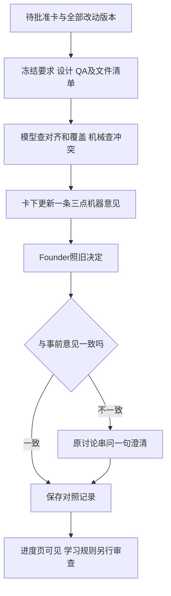

# FLY-2399 自动审批判断与学习 — 实施计划
Issue: FLY-2399 (https://linear.app/geoforge3d/issue/FLY-2399/2309b5-自动合并放手前要改的三条规矩提案交-founder-拍p2-文档单-依赖-b4-结果)
日期: 2026-09-10
基于: research.md

Status: APPROVED — R3 effective verdict; receipt and non-blocking advisories in review-response.md
Revision: R3 — bounds mechanical refresh and history publication; defines legacy freeze migration after request 20bb10b3-2aec-4647-8f24-4be32d733de8
Policy: ship-judgment-v1
基线: 92532e22a

## 1. 交付与权威

本issue按founder 2026-09-11 00:12Z新要求从文档单升级为三段工程单。Lead裁定 `732273a7-c56c-43d6-9d1a-ba62f35b1bea` 与 `2cc7b5e0-d88b-4657-8e90-064122e0dc5e` 是本版范围依据；[产品规格](../../../product/doc/FLY-2399-auto-approve-learning/proposal.md)供founder阅读。B4两周表不存在，不再是前置；32次观测和6条retro仅为背景。

此节点只交设计；后续实现：每张dry_run ship卡自动三点意见、机器vs founder决定台账、分歧一次澄清、卡/审计/进度页可见。M2一键revert不建；M3保留直接否决并记录明确关联的解释。R1规则文件、三态flag定义、旧auto三闸、批准来源信任、merge与updater契约均不改。不是把旧三闸变成LLM授权。

## 2. Founder看到的流程

本轮新增队列范围固定为 `project_name=flywheel`，与旧窄口现有项目范围一致；唯一常量在新contract，入口、扫描、配额、投递均核此范围。其它配置项目即使默认dry_run也零新任务、零Opus调用、零新消息；不新增默认开启的跨项目能力或另一个flag。新意见只有 Flywheel 的 `dry_run` 生效。`off`不启动新意见/新澄清；历史只读仍可查。`auto`沿用既有FLY-2453意见、标记、批准逻辑；新三点不会喂给它。模式变化使新意见待发送任务过期；新sender只把自己拥有的已发消息标「历史试判，模式已变」，不删历史、不编辑旧sender的消息。新三点测试必须同时证明旧auto三闸仍在，非docs code即使新意见可也不得自动批准。新语义分数不进入旧auto precision统计。

## 3. 稳定身份与单一协议

新 `packages/teamlead/src/ship-judgment/contract.ts` 是唯一运行词汇表；页面、store、队列、校验与测试从它导入，不复刻到comm/旧auto合同。

| 对象 | 稳定键/字段 | 规则 |
|---|---|---|
| 卡 | project_name/run_id/question_id/card_message_id/thread_id | 服务端当前holder派生；不信模型或调用者声明 |
| 改动集合 | 排序 `(repo_identity,pr_number,head_sha,diff_base_sha)` + manifest_revision，canonical JSON sha256为targets_digest | head/diff_base为完整40位；diff_base是模型实际diff的固定基准，机械main_sha另存；多仓缺一个即unknown；短head只展示 |
| 语义输入 | input_id UUID；semantic_digest + policy_version + model_snapshot_digest | 只含模型实际读取的issue/plan/QA/完整文件清单/diff及其版本；main与在飞PR不在此键内 |
| 机械快照 | mechanical_digest=canonical JSON hash(main SHAs、相关PR head/文件集合、分页完整性与机械结果)；fetched_at另存 | 排除采集时点、updatedAt、评论/标签；机械变化先重算展示摘要，不直接铸opinion或触发PATCH |
| 语义评估 | evaluation_id UUID；input_id FK UNIQUE | 一份语义输入至多一份结果，原样缓存；不依赖机械项 |
| 判断 | opinion_id UUID，question内ordinal，evaluation_id/input_id，mechanical_digest、presentation_digest，created_at，visible_at | 展示摘要含语义身份、三点结论、被引用证据及检查范围；仅实质变化且未超限才追加，visible_at来自真实回执 |
| 每点 | verdict=`pass|fail|undetermined`，evidence[]，reason_code | evidence是合法input source id+原句范围/文件路径，不能自由URL |
| 总判断 | `can|cannot|recommend_reject|undetermined` | 显示「可/不可/建议拒/不可判定」，由确定性汇总器派生 |
| 来源 | `machine|lead_manual|legacy_retro` | 机器不是Lead真人签字，Lead判断不是founder决定 |
| 实际决定 | outcome_id，source_kind/id，authorship，decided_at，observed_at | approved/rework引用B2；canceled另用可信事件；无决定是null，不写approved |
| 澄清 | 根id=`sha256("question",opinion_id,outcome_id)`；答复id=`sha256("reply",root_id,reply_source_id,reply_revision_digest)` | canonical JSON数组编码后哈希，根与答复分命名空间；绑定原卡/原版本/原决定，不绑定后来新卡 |

每点 evidence `{source_id,quote_start,quote_end,quote,file_path?}`；offset按Unicode code points，引用必须与冻结正文逐字一致、非空且≤500字。文件路径必须在已冻结文件清单内；缺或伪造引用使该点undetermined，不允许用模型confidence补救。

## 4. 输入收集：SELECT活库，模型只读冻结包

生产collector通过StateStore只读SELECT取当前holder、scope、manifest、QA record及review plan路径；它不备份生产DB、不向权威表写入。收集器将小型输入包交新的审计store写入专用表；模型进程没有DB句柄或路径，不读活库。长网络/Git/模型工作不放事务，最终写回用短事务重验身份与两类digest。模型返回后先冻结语义评估，再组合当前机械项；main或在飞集合变化不丢弃仍有效的语义结果。

### 4.1 材料与边界

- issue正文取现有项目Linear适配器，只读；保存identifier+UUID+revision/time+正文hash。
- plan从review job有效target_path / 当前issue目录的plan.md解析到冻结PR tree中的blob，拒绝绝对路径、`..`、symlink越界。PRD引用或同目录founder-design页面作为补充；HTML去script/style及标签，实体解码成纯文本，保留标题段落来源。已确认修订独立source，不把过时PRD当唯一要求。
- QA ship report优先同run/repo/head的当前有效strength-two记录的正文；受控hosted HTML通过既有报告存储适配器取回，取正文并去标签，保留原digest与清洗后digest。报告hash/head mismatch、不可取、失败/撤回PASS应明确输入，`satisfied`布尔本身不代表用例齐全。
- PR文件清单全量分页，保存改名前后路径/状态及统计。取冻结base/head diff摘要（按文件的新增/删除/patch片段）用于要求映射；二进制、截断文件明确列出。禁止复用docs_only的文件数提前返回作为全清单。
- repo只用项目配置/已声明且核验的repo，API/Git参数用argv，禁止shell拼接；对象读使用隔离bare临时仓与固定Git配置，不checkout/reset工作分支。网络重定向须仍在允许的GitHub/Linear/报告源；不能fetch模型引用的新地址。凭据不进输入包。
- 取回上限每件256KiB、整包96KiB UTF-8（含提示和来源索引）；超限不偷偷截成「全部读完」，该次输出undetermined `input_budget_exceeded`并列缺资料。完整文件清单最多1000项、在飞PR最多200张；分页或清单超过预算记unknown，仍给当前卡投递不可判定。

### 4.2 冲突机械判断（不交给模型）

对每个target repo固定main SHA，用隔离bare仓执行 `git merge-tree --write-tree <main_sha> <head_sha>`；正常退出0且无冲突才通过，正常冲突为fail，缺对象/超时/意外错误undetermined。非main目标分支另记录目标base并检查，不能冒称检查了main。

经GitHub分页枚举同project配置范围中所有open且非draft PR，排除本次target自身；每张取完整文件集，按 `(repo_identity, normalized_path)` 求交，rename两端都算。任一交集为fail（「有同改，需要协调」），不让模型把它改为pass；不同仓同路径不算撞。跨项目配置未知/当前project还有无法穷举repo/PR分页失败→undetermined。0在飞PR要同时保存全集规模0与成功取全证据，不能把网络失败当0。

保存main SHAs、PR id/head、文件集合digest、fetched_at、分页完整性；updatedAt最多用于诊断，不进入机械或展示digest。只读预检与模型返回时取得最近60秒内的机械结果；机械摘要变化先重算结果及展示摘要，不为模型排新输入。若当前卡、目标head或模型实际读取的issue/plan/QA/文件/diff内容变更，旧语义结果才失效；main前进但固定diff字节未变不失效，确实改变了模型读取的diff字节才按语义变化重评。不只检查主仓head；超过60秒的机械缓存不能作为当前通过证明。

**项目共享采集**：新`ship-judgment/project-refresh.ts`每project单一lease，每60秒至多一次GitHub集合刷新；所有卡复用同一个完整快照，不能每卡重复分页。PR文件缓存键为repo/PR/head，未变head复用文件集；列表的open/draft/base/head状态变化才失效相关缓存，评论/标签不重取文件。merge-tree缓存按repo/main/head/target-base共享，仍遵守60秒检查有效期。冷启动/缓存过期时卡等待单次共享刷新；失败或预算不足为undetermined，不沿用过期pass。项目机械GitHub调用每滚动60分钟≤120次（含失败、分页、重试，调用前持久预留），429同时遵守retry-after；这是本功能机械采集的独立上限，不声称约束Bridge其它用途。集合≤200PR、缓存正文≤4MiB，任一超限不截断冒称完整。缓存、lease、调用时间队列保存在§6项目状态表；模型96KiB包不包含完整共享缓存。

**展示去重与有界更新**：`presentation_digest`只含当前语义input/evaluation身份、三点verdict、展示的引用原句/冲突PR与路径、明确的检查范围及成功穷举数量、overall/reason。无关PR的head/updatedAt、fetched_at、清洁main的SHA以及旧三闸统计计数不在此摘要内；它们留作检查元数据，既有意见保留其原始检查时刻，不声称新取证。旧三闸统计在真正更新意见时顺带取当次值，实时统计仍由只读报表提供。摘要等同则不铸opinion、不改desired_id、不PATCH。摘要变化先在delivery保存一个可覆盖的最新candidate（≤96KiB）和dirty_since，连续变化合并；至少间隔10分钟提交一次意见，每卡任意滚动60分钟最多6条opinion，含无input的错误意见。新sender对该卡意见消息的PATCH请求也最多6次/滚动60分钟，含失败重试、状态/模式标记；POST继续沿uncertain防重协议且每卡≤2次/滚动60分钟。所有时间槽在同一CAS事务预留，重启不清零；第一个意见可立即发布。

超限保留最新candidate与next_eligible_at，只读页面显示「检查已变化，卡片更新待限频窗口」，不排成无限队列。卡上固定写「截至<原检查时间>的试判；后续检查可能待更新，仍由你批准」，不标实时绿灯。下一槽发送前重验当前身份、材料与60秒机械有效性；过期candidate不直接投递。重复的不可判定也去重。决定观察把当时dirty_since/pending候选摘要复制到outcome；若在决定前已知展示与当前检查不同，标refresh_pending并排除前瞻成绩，不能以延迟投递的旧可冒充当前预测。已结束卡只留历史候选状态，不补发当前建议。限频不会阻塞原批准或灭火入口。

边界：本项不是全语义冲突证明，不覆盖跨文件运行协议/共享资源竞争；卡上固定展示「检查范围：main合并＋同项目在飞文件」。设计/QA须把这些语义风险落到用例；不能借助低precision假装更多安全保证。

## 5. 评估器、输出与成本

### 5.1 进程

新增独立 `ship-judgment/subscription-evaluator.ts`，参考现有subscription classifier的execFile与JSON envelope，**不复用其审批prompt/返回布尔或隐式一次重试**。模型用 `getModelConfigSnapshot().bindings.opus`，经 `resolveAllowedCanonicalModel(...runtimeVendor:'claude')` 与允许effort验证，记录实际model、effort、配置digest（当前默认Opus 5，运行以配置为准）；本策略选择high effort，若该模型不支持high则按该模型允许的默认值记录，不偷偷换模型。

单次订阅CLI `-p` + JSON输出；空工具 `--tools ''`、空MCP配置与`--strict-mcp-config`、空`--setting-sources`、`--no-session-persistence`、禁插件/禁hooks设置、固定system prompt和空临时cwd。只继承启动认证所需最小env，不继承Bridge token、DB路径或项目工具。输入正文经stdin写完关闭，不拼shell或把私有材料放命令行。120秒总子进程墙钟超时，TERM后最多5秒KILL，shutdown也abort并回收；退出callback之后才释放并发槽。日志只记错误码与digest，不回显认证/原始CLI stderr。实际无工具隔离需要QA证明，禁插件单独不足。

模型只返回两点（alignment/coverage）及requirement→usecase→test映射；conflict由collector拼入。要求编号优先原文已有ID，否则用source id+段落范围生成稳定ID；模型不得发明需求或把自己假设当已批准需求。所有已提取需求ID必须出现一次，遗漏/重复/非输入ID让coverage或alignment undetermined；QA `N/A`须引用已接受范围及理由，不允许只因没有测试而自行豁免。

### 5.2 严格输出

输出JSON精确字段：`schema_version:1, alignment:{verdict,evidence,reason_code}, coverage:{verdict,evidence,reason_code}, requirements:[{requirement_id,implementation_evidence[],use_cases:[{use_case_id,test_ref,result,report_evidence[]}]}]`；每个字符串≤2000字、总stdout≤64KiB、最多100个要求/200个用例；拒绝未知字段、错类型、错误envelope、工具调用迹象、非结束成功、缺少citation。合成保存的意见再含conflict与overall。

确定性总判定优先级：任一点undetermined→overall undetermined；否则alignment/coverage fail→recommend_reject；否则conflict fail→cannot；三点pass→can。模型不能直接控制总判定。缺报告是unknown；报告明确failed/要求明确未实现才fail。所有未评估项保留unknown，不能用另一点的fail把整次失败伪装为成功完成评估。

### 5.3 耐久预算与调度

在plugin卡物化完成处仅enqueue，独立30秒tick扫描有效dry_run卡补漏；不await模型于Bridge主poll，扫描每轮最多50张，持久游标保证公平，机械采集遵守§4.2共享60秒节律。一个Bridge全局模型并发1，每卡最多3个不同语义输入版本；每project UTC日最多30次真实模型spawn（含失败）。预算预留/lease同事务，跨重启有效；只计真实spawn，等待预算不铸evaluation，次日可运行同input；实际失败则铸失败evaluation，该input不重跑。同一semantic input最多1次模型attempt，无自动重试。卡版本、项目日配额与§4.2意见/网络限频各自独立，不能相互绕过。保持模型材料不变，连续10次无关机械元数据变化：总spawn=1、语义版本=1、日配额=1、总opinion=1、初始POST=1、PATCH=0；10次真正冲突结果翻转压入一小时：spawn仍1，opinion≤6，PATCH尝试≤6，余项合并成1个最新candidate；第4次真实语义变化才触发模型卡上限。

模型超限生成不调用模型的undetermined候选，按同一展示去重/限频投递，daily上限次日可重排；每卡3版达到后保持undetermined并交Lead补证，不造新卡绕过。输入96KiB、输出64KiB、120秒、最多30调用/日是硬资源边界；保存实际usage、CLI报告cost如有，无则NULL/unknown。`--max-budget-usd`不作为订阅硬预算证明。采集每网络调用20秒/Git20秒、总采集60秒，无限慢IO不能占住模型队列。

## 6. 持久化、迁移与恢复

新增八张专用表，在StateStore一次迁移事务中CREATE IF NOT EXISTS+receipt，参数化写入；命名与固定CHECK枚举来自本合同。外键指向现有run/question与新表。另对旧delivery加两个nullable冻结时间列，保留旧state枚举/外键和授权语义（下文明确迁移）。

| 表 | 必需字段、唯一性与更新策略 |
|---|---|
| `ship_judgment_input` | input_id PK；卡完整身份、semantic_ordinal、模型可见target head/diff引用、source正文/索引/requirements目录、semantic_digest、policy/model快照、requested_at；UNIQUE(question_id,semantic_digest,policy_version,model_snapshot_digest)；不含机械侧main/在飞数据；只追加 |
| `ship_judgment_evaluation` | evaluation_id PK；input_id FK UNIQUE；只在实际模型attempt结束后保存；alignment/coverage、引用/要求映射JSON、模型结果码、created_at、耗时/usage/cost；只追加；即使机械变化也可复用 |
| `ship_judgment_opinion` | opinion_id PK；input_id/evaluation_id为nullable FK（采集失败可无input，预算等待可无evaluation，此时overall必须undetermined）；question内ordinal；机械快照/digest、presentation_digest、三点与overall、status(complete/undetermined/stale)、reason、created_at；UNIQUE(question_id,ordinal)；仅展示实变且获频率槽时追加；投递时间从delivery读取 |
| `ship_judgment_job` | input_id PK FK；state(queued/running/done/failed)、lease_owner/generation/expires_at、budget_day/reserved_at、spawned_at/finished_at；UNIQUE input；预算凭此表聚合，spawn前CAS预留，不重复消费 |
| `ship_judgment_outcome` | outcome_id PK；source_kind/id UNIQUE；question/run/card/targets_digest、authorship(founder_verified/lead_proxy/auto/unknown)、decision、decided_at/observed_at、B2 verdict_id nullable、evidence_json（含决定时展示dirty证据，不能重建则unknown）；只追加；取消不要求伪B2 FK |
| `ship_judgment_clarification` | clarification_id PK；opinion_id/outcome_id UNIQUE对；reply_source_id UNIQUE nullable、reply_text/digest、founder_id/verified_at、resolution(pending/explained/unavailable)、supersedes nullable；解释修正追加新行/事件，不改旧回答；队列状态在delivery |
| `ship_judgment_delivery` | purpose(opinion/clarification/ack)、subject_id、question/thread/card、desired_id、posted_id/message_id、visible_at、state/generation/lease/retry_after/attempt、marker；PRIMARY KEY(purpose,subject_id)，同卡opinion subject_id=question；可更新；opinion行另存latest_candidate_json/digest、dirty_since、next_eligible_at、滚动POST/PATCH预留时间数组（各最多2/6项），插入opinion频率由不可变created_at聚合 |
| `ship_judgment_project_state` | project_name PK；mechanical_cache_json（≤4MiB）、digest/fetched_at、lease/generation、api_reserved_times（最近60分钟≤120项）；history_dirty/digest、last_attempt_at、next_due_at、published_manifest/url/expires_at/as_of、building_manifest、last_error；可更新，仅缓存与调度，无卡权限或批准事实 |

澄清修订实现：初始行是question事件，根id与答复id严格按§3两个带类型前缀的派生式生成；不同reply_source_id或经核验的编辑版本产生不同答复id，同源同版本幂等返回。答复用`supersedes`链接初始/旧答复；UNIQUE(opinion_id,outcome_id)仅用于根问题的partial index `WHERE supersedes IS NULL`，回答source UNIQUE防重放。状态投影计算，不UPDATE已记录原话。输入/evaluation/意见/outcome/clarification禁止UPDATE/DELETE；job/delivery/project_state是可变调度状态。新八表分类进`scripts/lib/fly-2006-retention-registry.mjs`的protectedCurrentOrReference，迁移receipt写现有迁移表，不新增第九表；不落14天删除组；SQL重算无需临时托管URL。T1同时改生产表fixture `scripts/__tests__/fixtures/fly-2006-teamlead-production-tables.json`并按序加入八表；同步 `packages/teamlead/src/__tests__/fly-2006-database-retention-sweep.test.ts` 的硬编码计数与真实schema断言：以本基线143→151 protectedCurrentOrReference、204→212全表、201→209去掉3张retired optional；其它分组计数不变，并断言八个精确表名属于该组。实现若合入其它表变化，先按真实schema重算基线再+8，不任意放宽数值或仅改计数骗绿。

数据源正文保存最小必要的96KiB包与原source digest，避免报告14天到期后只剩死链接。访问沿现有项目审计权限；页面只出摘要与来源，不暴露完整内部提示或凭据。大型原始证据留既有artifact，不复制全报告库。

语义evaluation先按input_id只追加保存；组合opinion与插入/更新投递intent短事务一致提交。模型成功但语义身份漂移→评估留档且不向当前卡贴旧「可」；仅机械漂移则复用evaluation重查机械，不额外spawn。job崩溃留下running lease：启动回收为failed `worker_lost`且记undetermined；为避免订阅重复收费不重跑已spawn输入。CLI成功但DB提交失败也不猜执行结果，durable lease恢复未知。任何判断DB错误不能阻挡现有founder gate，只记录诊断待补投递。

历史六条手工JSONL由一次只读导入器先校验并按文件digest+行号生成legacy_retro记录，完整短head/原文保留，缺绑定进入隔离清单，不猜40位head或补预测时间。后来有可信材料只追加关联；retro标记永不洗成prospective。不得写手工源文件、修改已有B4/B2行或把Lead观点当founder-authored。

## 7. 卡投递、决定与学习

### 7.1 单条意见

Flywheel dry_run的新队列接管「当前语义意见」展示，但保留旧三闸快照取样：把StateStore现有refreshAutoNarrowOpinion拆成共同snapshot捕获与可选legacy delivery intent两个步骤，dry_run调用capture-only，auto调用原capture+delivery；旧gate1/2/3判定、缓存比较、统计分母及source writer不变。新语义消息的次级区读取并显示「旧窄口三闸/样本统计（非本次语义得分）」，不让旧精度断供，也不把新can写入旧eligible。测试证明dry_run真实founder决定后旧统计样本数照常增加。

**不认领或复用旧followup message_id。** 旧auto_narrow sender永远只拥有其原消息；新sender只有ship-judgment marker与自己的message_id。迁移时legacy sender用下述冻结字段把自己的旧消息标「旧三闸历史意见」后停止dry_run常规刷新；posting/uncertain先按原协议恢复确认，不能新sender替它处理。新sender发一条当前语义意见并保留历史链接；旧物理消息仍在，界面不称已删除。mode翻auto后旧sender可更新自己的旧消息，新sender只将自己的消息标历史；auto→dry_run相反。两套sender从不PATCH对方id，模式切换要撤销旧lease generation，任何在途发送回执重新验证后才更新状态。新卡正常只有一条当前机器意见。

旧表迁移明确采用**增列，不重建表**：在同一迁移receipt下用PRAGMA table_info检查后，分别ALTER TABLE auto_narrow_opinion_delivery ADD COLUMN legacy_freeze_requested_at TEXT NULL、legacy_frozen_at TEXT NULL，默认NULL。旧state仍为pending/posting/uncertain/delivered/gone，两条snapshot FK不变；gone只表示消息不存在，绝不代表冻结。StateStore的AutoNarrowOpinionDeliveryRow、row mapper、claim查询/完成CAS同步新增字段；改动消费者是StateStore.ts、bridge/auto-narrow-gate.ts及bridge/auto-narrow-opinion-delivery.ts，不涉及任何批准writer。

进入dry_run时原sender短事务增加generation、设置freeze_requested_at、frozen_at=NULL；已稳定绑定的自身消息排一次历史标记PATCH，完成成功且generation/模式仍匹配才设置frozen_at并保留delivered。冻结请求期间不产生普通legacy delivery intent；请求未完成按原重试/uncertain协议恢复，不误称已冻；无实际消息时直接记冻结完成，仍保留原gone/无message事实，不发送一条历史空消息。frozen_at非空的dry_run行不被普通claim选中，后续tick零PATCH。翻auto时必须先原子清空两个时间并增加generation，随后显式调用原capture+delivery以当前controlAppliedAt重建desired快照/正常claim，再进入原auto检查；不依赖误用gone后的偶然自愈。off遵守原停止投递规则，不自行解冻；恢复dry_run继续未完成冻结。旧程序忽略nullable新列可运行旧显示；再升级时按当前模式清空并重建冻结请求，不能相信旧时间仍代表消息内容。T1迁移重放、旧版本兼容以及T4模式往返需单独验证。

投递协议参考既有auto-narrow：intent→claim generation→POST/PATCH→绑定真实message。POST响应丢失进入uncertain先扫描稳定marker，确认找不到才能按两次同frontier空扫描间隔≥30秒重发；429按retry-after；其他失败指数退避1/2/4/8/16分钟后每小时，有持久错误可见，不丢intent。持卡Lead bot身份由项目名册解析；marker不作为权限。卡状态已结束则不重启gate，结果列入历史页；已发当前消息可标为已决定。

### 7.2 决定观察与比较

唯一新增的B2事实消费者明确为 `packages/teamlead/src/ship-judgment/outcomes.ts`，只读B2可信founder verdict与现有终态source事件；不改recordFounderGateVerdictTx、claim/approve写路径。明确把该精确路径加入 `packages/teamlead/src/__tests__/fly2396-authorship-boundary.test.ts` 的ALLOWED，保留当前5项及禁止land/approval-signal/post-ship/external-merge组件消费的负向断言；这是被本次设计审查覆盖的只读对照消费者扩展，不是权限扩展。测试标题补明“核心否决＋只读历史对照”，不得通过改方法名避开扫描。其余新模块只消费新outcome记录，不直接读B2或其founder_authored字段；导入器只交隔离retro，不成为B2消费者。所有新测试放入__tests__目录（该扫描不跳过旁置.test.ts）；精确命中集合应为旧5项加outcomes.ts，共6项，新增任意第7项必须失败。`founder_authored=1`仍核源capture身份，自动/代理排除人工成绩。cancel缺B2字段：只有已认证founder原消息与终态事件、原run映射共同可核时存founder_verified canceled；否则unknown归因，不猜她本人。

选同卡/同targets_digest、在首次真实决定之前完成且**投递可见**的最新意见；created_at与visible_at均须严格早于decided_at，同毫秒或缺时序证据不算前瞻。报告保留read_gap_ms=decided_at-visible_at（两原时间均已保存），可按间隔重算；脚注明确“投递在先不证明founder看过，动作一致不是因果或质量正确率”，不凭间隔推定已读。未来更新时间不能回填当时输入。决定先于模型/消息到达→late；没有决定→pending；新head→superseded；全部排除主比较。批准后同head又打回另保留post-decision override统计，不覆盖首次决定。

| 机器 | founder | 处理 |
|---|---|---|
| can | approved | aligned |
| can | rework/canceled | divergent，问澄清；cancel另列方向类，不混质量错误率 |
| recommend_reject | approved | divergent，问澄清 |
| recommend_reject | rework | aligned（仅动作一致，不等于理由一致） |
| cannot | approved | divergent，问是条件变化还是判断遗漏；上下文变更则标context_changed不记错判 |
| cannot | rework/canceled | abstained，保留交叉表，不宣称正确拒绝 |
| undetermined | 任意 | abstained，不计准确率、不自动追问原因 |
| 任意 | 未决定/auto/代理/未知作者 | 不计人工答案；不会用机器自批教自己 |

报表：按固定UTC区间、policy/model版本，完整4×3交叉表、可建议的人工批准比例、可建议后打回比例、取消比例；每个比例带分子/分母，0/0为不可算。另列所有卡总数、无意见、未知、late、retro、pending、绑定失败、投递失败、有效前瞻配对数。Lead手工观点独立列，与machine不合并。禁止拿103卡批准率当质量准确率，禁止把32观测与22PR相加。

### 7.3 澄清与否决

根问题唯一`opinion_id+outcome_id`，发送到原issue thread且replyTo原决定/原卡：一句短问带机器与她的决定链接；不要求额外点按钮，不发频道顶层。保存澄清message_id，等待明确reply引用该消息的canonical founder原文；迟到答复仍可解释历史卡，不能作用于新head。非founder、跨thread、错误reply id、edited未经再核原消息不结案；无明确引用保持pending，可由Lead提交原消息ref经服务端重新fetch核验，不信自由文本author。

回复observer只追加学习/ack intent，绝不调用approve_to_ship、review-ruling、rework或取消接口。仅当 `message_reference.message_id === 已持久绑定的clarification_message_id` 且thread与canonical founder均匹配，才路由到学习分支并停止这条解释的后续宽泛分类；不得按thread相同、存在pending澄清、含批准词或“引用了任意消息”匹配。现行审批handler本来要求replyToCard，新增学习observer不以修改它为前提；canonical founder明确另回ship卡的批准/打回照旧。此为解释消息路由隔离，不扩充批准词或放宽任何身份守卫；含有批准词的澄清回复也只解释，ack说明若要过卡需回原卡。只有成功durable接收后才发「已记录，未改变批准」收据。反向验收必须预置同thread pending澄清，再让founder明确回复原ship卡的approve和rework，两者仍分别到tryFounderShipApproval并产生真实B2；回复第三条普通消息既不结澄清也不批准。

合后thread已归档/发送403时不擅自unarchive：delivery记unavailable，进度页「分歧待澄清」保留与原thread链接，通过既有Lead工作队列交人工跟进；不能说已问到founder。当前不是新需求入口改造：合前直接否决走原有handler；合后新解释仅记原话，Lead按既有revert PR/后续任务流程处理，不能声称旧卡打回能撤销合并。

学习产物仅是版本化候选规则（证据链接、支持例/反例、适用范围、未确认原因）。本轮不自动改prompt、policy、R1、阈值或flag；经后续review的规则更新另起policy版本，以预先冻结且隐藏founder答案的评估集做前后对照，不能拿同批训练例当验证。2107原因pending，不训练为已确认硬规则。

## 8. 可见性消费者与回滚

现有 `epic-page/{model,materialize,generate,render-html,render-markdown,audit-dictionary}.ts` 同步新增只读机器建议摘要及来源；不覆盖FLY-2485 Lead note、不改既有阶段和Epic计数。沿StateStore.readEpicItemFacts读当前项；**主HTML不内联30天全量历史或其JSON**。每个现有child只添枚举状态＋短audit id链接，渲染后含转义/属性的增量≤256B/child，完整依据入现有audit sidecar。页面级历史区只显示最新20张卡的一行状态与原卡链接，含样式/总数/入口整体≤16KiB；不得把20项的所有引用/原文塞进主HTML。

完整30天历史改成独立静态HTML分页（新ship-judgment/history-pages.ts，复用现有ReportRegistry/ReportBlobStore普通报告发布，不新增公共读库路由或放宽CSP）。按一个冻结as_of，project独立查询全部卡、含已完成/退出active Epic的项，每张取as_of时最新意见及决定；每页20条，正文转义后每行≤2KiB、每页含CSP≤64KiB，超长依据仅显示摘要＋稳定audit id和原卡链接。页数与总数明示，下一页用普通同源链接，上一页使用浏览器返回（不预写尚未生成的URL），零运行时fetch。生成从末页向前串行发布，前页只链接已经发布且核验200的下一页，最后把第1页URL传给主Epic候选页；任何子页失败均保留旧history入口/旧生成时间并显示此次history刷新失败，不能让history失败阻断主Epic当前进度发布。失败轮未引用的新页随普通报告retention回收，不删旧入口；14天托管到期通过正常刷新从保护账本重建，30天是查询窗口不是URL寿命。超过30天仍可由只读show按id取得审计。

**历史发布不挂在Epic刷新await链上。** opinion/outcome/澄清变化只设置project_state.history_dirty；独立后台timer每分钟检查，项目串行lease、每30分钟至多开始一轮（失败也占一轮），与Epic的5秒去抖事件无关。轮次先固定as_of、查询30天窗口并计算history_content_digest：排序后的展示记录id/修订/状态/摘要、窗口实际成员及页模板版本；不含as_of、当前时间或随机报告token。digest未变且旧manifest所有URL仍有效，则零stagePublish、零Blob、零公网核验，沿用URL及原生成时间；历史变化最多延迟30分钟，主进度页即时读取已有状态不等待它。

唯一无内容变化的重发例外是已发布最早URL达到12天（在14天TTL前）或已知失效：按同一30分钟限频重建，明确记录renewal原因。发布成功才原子替换完整manifest/URL/digest/as_of，再排一次正常Epic刷新；新变化若在构建中到达，保留dirty到下一允许轮。每次网络验证≤10秒、整轮≤120秒，可取消；失败/超时保留旧入口并持久记录错误，首次无旧入口显示历史暂不可用。Epic只读这些状态，既不执行历史分页网络请求，也不因它重启失败而等待；部分成功URL记录到本轮manifest，重启可复用同一冻结轮，不重复铸token。project_state保存last_attempt_at/next_due_at及lease，重启不能重新开始未到期轮。U9同时测无变化零发布、内容变化合并、30分钟硬间隔、网络挂起时主Epic仍可立即发布、TTL续期例外。

**容量合同**：保留publisher渲染前后两道512KiB门，不提高门槛。T5更新founder-budget.test.ts与fixtures/founder-budget.ts：原8-root/60-child规模不降，带新摘要＋20条最大历史预览＋现有notes/attention状态，原基础页仍≤491520B；实际hardening后必须≤524288B。按FLY-2484方法用“0 attention行＋真实截断告警＋新摘要/预览＋明确的notes-per-issue条件”重新实测求cap，验证bytes(cap)≤上限与cap<200时bytes(cap+1)>上限，触顶只报≥200。随后在同一cap用真实applyAttentionBudget验证含最大attention输入仍能整行裁剪且可发布。若旧页面自身太近上限，本新增可选摘要按整行缩到0并保留≤1KiB历史入口/总数及缺省提示；不能静默丢任务或改旧计数。所有预算按真实UTF-8渲染字节计算，最小入口也无法容纳则按原publisher明确失败，保留上一发布页，不伪称成功。

新增comm只读 `ship-judgment show --project --question|--id`、`report --project --from --to`，通过现有认证只读路由查询；不得扩scope token写权限。返回schema_version、policy、来源、读失败显式错误；网页失败保留旧生成时间不把失败当空。历史自动来源从既有auto audit只读展示「窄口自动批」，不为本单新增批准事件。

回滚：新功能写新八表、旧delivery两列冻结投影及只读页面；停止新worker/回退程序由独立updater执行，保留审计表和nullable新列。旧state枚举/三闸计算/flag revision不改，旧版本忽略冻结字段继续旧显示；已发新意见成为注明策略版本的历史消息，不伪装旧gate1/2/3结果。学习读入口旧版不可用是已知限制，保存静态审计导出。不得为了回滚删表/重写分支/撤销已开始land。

## 9. 实现任务与验收矩阵

实现者按TDD逐组：先写失败测试→确认失败→最小实现→确认阳性与阴性同时通过→提交。以下是待实现文件，不是本design已完成代码。每组可独立提交，顺序T1→T2→T3→T4→T5；T6贯穿最终QA。

| 任务 | 精确新增/修改面 | 完成证据 |
|---|---|---|
| T1 协议与账本 | 新`ship-judgment/contract.ts`；改`StateStore.ts`迁移与专用读写；旧delivery两列及row/claim映射；retention registry、生产表fixture与retention sweep计数；fly2396-authorship-boundary.test.ts仅加outcomes.ts | JSON/SQL边界、唯一键/并发CAS、八表迁移/重启/回滚兼容；schema classification过 |
| T2 冻结与冲突 | 新`ship-judgment/{collect,conflicts,project-refresh}.ts`；复用配置/PR/QA读取 | 多仓、共享分页/cache、120请求/小时、rename、merge-tree与非重叠反例；超预算/缺材料unknown |
| T3 语义与队列 | 新`ship-judgment/{subscription-evaluator,evaluate,worker}.ts`；plugin物化/独立timer/shutdown接线 | 模型无工具、120s kill、每日/每卡并发预算、漂移不贴旧结果；真实语义样本及prompt诱导 |
| T4 展示/学习 | 新`ship-judgment/{delivery,outcomes,learning}.ts`；新`bridge/ship-judgment-routes.ts`；plugin消息分流；旧auto gate/sender冻结与auto显式恢复，原授权检查不变 | 当前卡一条、uncertain找回、founder先决定late、真作者与cancel、澄清只问一次且不批准、旧auto行为不变 |
| T5 进度/查询 | 改上述epic-page六消费者＋founder-budget.test.ts/其fixture；新history-pages.ts独立节流复用普通报告发布；新comm `commands/ship-judgment.ts`和index只读注册；新导入器`scripts/import-ship-judgment-retro.mjs` | 独立30天分页/已完成单/512KiB容量与cap重测/计数不变/转义/失败可见；retro6行不入前瞻；只读report可重算 |
| T6 独立QA | 新下述测试与隔离QA driver/报告，接入`.github/workflows/ci.yml`现有TeamLead分片收录 | 真卡→意见→真实身份决定→分歧→解释→审计/进度页；变异体阻断；exact-head CI |

测试位置：`packages/teamlead/src/ship-judgment/__tests__/{collect,conflicts,project-refresh,evaluate,worker,learning,history-pages}.test.ts`；`packages/teamlead/src/__tests__/StateStore.ship-judgment.test.ts`；`packages/teamlead/src/bridge/__tests__/ship-judgment-delivery.test.ts`；`packages/teamlead/src/epic-page/__tests__/ship-judgment.test.ts`；`packages/flywheel-comm/src/commands/__tests__/ship-judgment.test.ts`。

| 用例 | 阳性与关键负例 | 必须证明 |
|---|---|---|
| U1 对齐 | 完整code实现pass；同包遗漏已批准要求fail；引用不在输入unknown | 不仅分类docs、不能编引用 |
| U2 覆盖 | 每usecase有可查测试pass；漏关键用例fail；报告丢失/截断unknown；N/A需范围依据 | CI绿/测试数量不替代覆盖 |
| U3 冲突 | main可合且在飞不重叠pass；main冲突或同仓rename交集fail；跨仓同名pass；分页缺失unknown；20卡同tick只发1轮项目分页，未变head零文件重取 | Git和文件集两半均测；共享cache超过60秒不当pass，项目第121请求被挡且重启保留计数 |
| U4 资源/隔离 | 冻结输入可重放；10次无关机械变动总opinion=1/POST=1/PATCH=0；10次真实翻转opinion≤6/PATCH≤6且仅1个pending；均仅1次模型调用；第4版语义才超限；超时/坏JSON/超预算unknown；恶意原文零工具 | 失败不自动批准、不绕预算，机械不烧配额 |
| U5 时序 | 同卡先可见再决定进配对；决定先到/换head/多仓漂移/同时间排除；检查变化但限频未投递为refresh_pending，未知历史dirty状态不补猜 | 事后样本或待刷新旧可不能洗成当前预测 |
| U6 恢复 | 成功post→patch；丢响应/重启先scan；generation失效不得覆盖；dry_run→auto→dry_run各sender仅改自己的不同message id | 请求失败/重启仍遵守6 PATCH/小时；冻结后legacy零PATCH、auto清冻结后正常恢复；不争抢消息 |
| U7 权威 | 真founder可配对；auto/代理/unknown不算人工；精确回复澄清中的“批准”不批准；同thread有pending澄清时回复原卡approve/rework仍写B2 | 新observer权威写计数0；旧合法批准/打回不被吞掉；authorship白名单恰6路径 |
| U8 分歧 | can对rework一次提问；cannot对approved问条件变化；unknown不算错；cancel保留方向 | 对照矩阵与分母准确 |
| U9 可见性 | 30天内已完成单在独立历史页；21条2页且总数准确；大量历史不增主HTML；子页失败/慢请求不等待主进度；无内容变化零新发布、复用URL；30分钟内多事件至多1轮，重启不绕；12天到期更新例外；XSS仅文本 | 原60-child≤480KiB、hardening后≤512KiB、重测cap，零计数回归 |
| U10 旧路 | off无新任务；其它project dry_run也零任务/模型/消息；Flywheel dry_run旧快照仍增且新意见零approve；auto旧三闸照旧拒绝代码 | 新can不升级权限、不跨项目扩张、旧precision不冻结 |

聚焦命令（后续代码存在后执行）：`pnpm --filter flywheel-teamlead exec vitest run src/ship-judgment/__tests__ src/__tests__/StateStore.ship-judgment.test.ts src/bridge/__tests__/ship-judgment-delivery.test.ts src/epic-page/__tests__/ship-judgment.test.ts`；`pnpm --filter flywheel-comm exec vitest run src/commands/__tests__/ship-judgment.test.ts`。旧路回归 `pnpm --filter flywheel-teamlead exec vitest run src/bridge/__tests__/auto-narrow-gate.test.ts src/__tests__/StateStore.auto-narrow-approval.test.ts src/__tests__/StateStore.founder-gate-verdict.test.ts src/__tests__/fly2396-authorship-boundary.test.ts src/__tests__/fly-2006-database-retention-sweep.test.ts src/bridge/__tests__/founder-reply-deliverer.test.ts src/bridge/__tests__/founder-ship-approval-handler.test.ts src/epic-page/__tests__`。静态门 `pnpm lint`、`pnpm -r build`、`pnpm typecheck`；新增测试须检查CI分片明确收录，不把本地通过称CI通过。

语义质量：至少12个冻结输入fixture（代码可建议、需求偏离、遗漏用例、冲突、缺资料、诱导各≥2），独立QA先写期望与引用再隐藏答案调用真实绑定模型。报告逐例原输出/映射/结果，至少能让完整的代码正例「可」，高风险缺陷反例不能「可」；不以全unknown算通过。三份同源变异分别移除需求映射/覆盖核验/冲突检查，应各杀死对应负例。6条retro只能演示导入，不能是前瞻质量验收集。

隔离链路QA使用全新slot与获授权的测试bot/founder actor，真实卡与收信、一次真实模型、进度页与审计逐项链接到相同head；不操作生产卡或生产flag。模型不可用则诚实报告未通过语义验收，不用mock替代。全部实现/QA完成前，本design仅有文档和HTML验证。

## 10. 设计节点收口

本节点提交exploration/research/plan、product规格、Mermaid源/本地SVG与互动HTML；进入design_review后注册新gate+request-review，按有效reviewVerdict修订直至APPROVED。HTML仅在最终批准后push/publish-only并report hosted URL。完成精确route `phase_design_complete`，随后park保持goal，后续由DAG继续；不派实现/QA、不请求ship、不合并。
