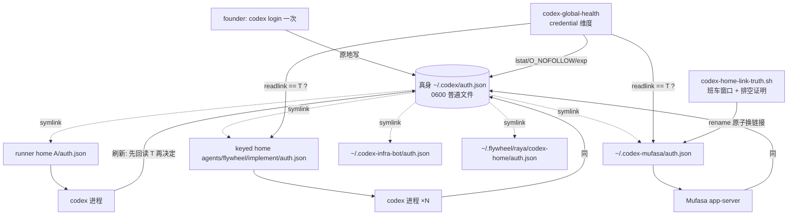

# FLY-2404 全机一份 Codex 凭据 — 实施计划

Issue: FLY-2404 (https://linear.app/geoforge3d/issue/FLY-2404/codex凭据-全机只用一份-codex-凭据runnerleadraya-的每个-codex-home-不再各存一份-authjson)
日期: 2026-09-06
基于: research.md

**Status**: draft(Codex 设计评审 R4 后修订 v5;Lead 2026-09-07 四条指示已并入)
**Version**: v1.57.0
**修订**: R1 → R2 按 Codex 评审 11 条改写;R2 → R3 按 8 条改写;R3 → R4 按 6 条改写;R4 → v5 按 Codex R4 6 条 + Lead 答复(question 380ac111)4 条改写(见 §9)

## 0. 一句话

**新建**的 Codex home(runner execution home、首次创建的 keyed home)的 `auth.json` 直接是指向主机真身 `~/.codex/auth.json` 的绝对路径 symlink;**已存在**的家(活体 keyed home、Lead、Raya)只在班车窗口由带排空证明的迁移脚本换成链接,provision 绝不热切;真身是全机受管家里唯一允许「不是链接」的凭据文件;`codex-global-health` 探真身健康与链接漂移并按原因给恢复动作;founder 在主机 `codex login` 一次即修复「真身缺失/过期」这一类故障。

## 1. 已验证的前提(引用 exploration / research,不再复核)

| 前提 | 依据 |
|------|------|
| Codex 0.153.2 刷新前先回读磁盘,刷新失败按快照记账并在回读到新 token 时清除 ⇒ 多进程共享一份 auth.json 安全 | exploration §3.2(`login/src/auth/manager.rs` 2431-2464、2503-2518、2536-2555;测试 `auth_tests.rs:1176`) |
| Codex 的 `save` 是原地 truncate 写,跟随 symlink,不换 inode;`logout` 只删链接 | exploration §3.1(`storage.rs` 158-165、206-224) |
| Codex 只在 access token 距到期 5 分钟内主动刷新;JWT 带 exp 时 `last_refresh` 8 天规则不生效 | exploration §3.2 + wave B |
| 6 进程并发 + 1 次真实轮换 + 严格假权威下 5 次 `refresh_token_reused` 全部自愈,零 401 | exploration §4;`exp-evidence/` |
| 没有 Codex 配置能把 auth.json 指到别处;keyring 按 home 分 key | exploration §3.1 |
| 副本制造点只有 `provisionCodexHomeAt` 1508 行;legacy 路径 `writeFileSync` 对已存在的链接会写穿真身,keyed 路径 `atomicWriteFile` 会把链接换回普通文件 | research §2.1 |
| `provisionCodexAgentHome` 每次准入都持锁调 `provisionCodexHomeAt`;锁只串行化 provision,不证明家里没有其他活进程(多 lease) | `codex-home.ts` 1638-1697 |
| legacy 路径对 home 目录只 `mkdirSync`+`chmodSync`,**没有**目录级 symlink 守卫(`ensurePlainDirectory` 只在 keyed 路径 534/1649 行) | R1 核实 |
| `readCodexSourceAuth` 校验普通文件 + `O_NOFOLLOW`,**不校验 0600** | `codex-home.ts` 637-669 |
| READ_DENY 已被 FLY-1241 删除,`read-deny-removed.sentinel.test.ts` 扫描生产 `packages/`+`scripts/` 禁止再出现 | R1 核实 |
| CommDB 按项目分片:`~/.flywheel/comm/<project>/comm.db`(flywheel / geoforge3d / growth / joycon-typeless …) | R1 核实 |
| ledger `OBSERVATION_SOURCES = ["status","use","save","provision"]`(`codex-account-core.mjs:24` + `.d.mts:57`) | R1 核实 |
| 7 个 Lead launcher 全部 `set -u`、都没有 `REPO_ROOT`、都有 `FLYWHEEL_LEAD_DRY_RUN` 分支;只有 `run-codex-lead-mufasa-tui-fullaccess.sh`、`run-codex-lead-raya-tui-fullaccess.sh`、`run-codex-infra-bot-tui.sh` 调 `derive_codex_lead_home`(生产形态) | R1 核实 |
| keyed home 常量:marker `.flywheel-agent-home.json`、lease 目录 `.flywheel-leases/<executionId>`、锁目录 `agents/<project>/.locks/<role>`(`withMkdirLock`);lease 是**持久**文件,为 Bridge crash/restart reown 而存在,停 Bridge 不会清空 | `codex-home.ts` 330-332、531、1646、1705 |
| 当前主机 `~/.codex-*` 有 19 个目录(历史/QA/手工),17 个含普通 auth.json、2 个无 auth.json;只有 mufasa、infra-bot 是生产 Lead | R2 核实 |
| Bridge FLY-1638 准入刹车的真实合同:`POST /api/admission/pause` body `{durationSeconds:1..3600, reason?, leaseId?}` 返回 `leaseId`(带 leaseId 再 POST = 续租);`POST /api/admission/resume` body `{leaseId}`(必须 UUID);`GET /api/admission/quiescence` 在 pause active 下返回 `{quiescent: total===0, components:{readoptCandidateSessions, dispatcherInflight, durableLaunchClaims, admissionCrossing}}`;全部由 `config.apiToken`(环境 `TEAMLEAD_API_TOKEN`)Bearer 保护,**不是** `FLYWHEEL_INGEST_TOKEN` | R3 核实(`plugin.ts` 1708-1912) |
| `ResidentCodexLeadTarget` 只有 `projectName/projectRoot/leadId/leadKey`,**没有** codexHome;patrol 取 Lead 的 codexHome 是执行 `scripts/resident-codex-lead-recover.sh --project <p> --lead <id> --probe`(内部按 wrapper→key 映射 `derive_codex_lead_home`,90-106、153 行输出 `codexHome`);`plugin.ts:10467-10479` 目前只调 `reportCodexGlobalHealth(metaAlertNotifier)`,拿不到 `projects` | R3 核实 |
| `CODEX_AGENT_HOME_LEASES` / `CODEX_AGENT_HOME_LOCKS` / marker 读取 / lease 枚举都是 `codex-home.ts` 私有,没有公开 API | R3 核实 |
| 生产 Lead 的 codexHome 权威来自 `resident-codex-lead-roster.ts findResidentCodexLeadTargets(projects)`(patrol 已用它) | R2 核实 |
| 生产 business 链 228eace0 会在 2026-09-12T03:22Z 前后被所有持有者同时抢刷新 | exploration §2.2 |

## 2. 假设与边界

- **A1** 一份凭据 = 主机 `~/.codex` 当前登录账号(现为 business)。**Lead 2026-09-07 裁定(question 380ac111)**:本单**不**自动把 Mufasa(school)、infra-bot(personal)并入 business;切换按「逐 home 清单」执行 —— 新 spawn 的 runner home 与 keyed home 默认切、Raya 切、每个 Lead/伴侣 home 是清单上一项,由 Lead 逐个批准后才在班车窗口切(§4.3)。
- **给 founder 的后果原文(Lead 要求写明)**:「配额集中到一个账号 = 更快打满」—— 今天 Codex 用量分散在 business / school / personal 三个 ChatGPT 账号上,每个账号各自有 usage limit;全机只用一份凭据后,runner、Lead、Raya 的所有 Codex 用量都记在同一个账号上,撞 usage limit 的时间会比现在早,撞上时是全机同时停,而不是只停一个 Lead。这是「只登一次」的直接代价,本单不解决配额问题。
- **A2** 真身路径只由 `FLYWHEEL_CODEX_SOURCE_HOME`(默认 `~/.codex`)决定;不新增第二个「真身在哪」变量。
- **A3** 生产 Raya 的家是 `~/.flywheel/raya/codex-home`,由 raya 仓库 provision;本仓交付脚本与合同,接入是跨仓依赖,**本单验收对 Raya 的范围见 §5 的显式缩小**。
- **A4** 已存在的家只在班车重启窗口、由迁移脚本在排空证明下切换;provision 对已存在的普通文件 auth.json **保持今天的复制行为**并打标,绝不热切。
- **A5** 旧 execution home 不由 provision 迁移;一次性 sweep 脚本只在权威判据全部成功且判无活体时删 auth.json 副本。
- **A6** 「全机一份凭据」的声明范围 = **受管活跃家**(新 spawn 的 execution home、keyed home、三个生产 Lead home、Raya home)。profile pool(`~/.codex/profiles/*/auth.json`)与尚未 sweep 的旧 execution home 里仍有普通文件,其中 school/personal 的链与 business 真身无关、不会因真身轮换而失效 —— 它们是 sweep 与 pool 生命周期的事,本单只盘点(§3 WS-E)不声称已消灭。
- 边界:不写/不打印/不提交任何 token 值(测试 fixture 用假 JWT);不动 Claude 侧账号轮换;不改 merge/authority;不改 FLY-2358 keyed home 的 lease/scrub 语义;不动 Seatbelt 规则;**不重新引入 READ_DENY**(FLY-1241 sentinel)。

## 3. 工作流(WS)

顺序按 9/12 炸弹倒推:WS-A + WS-B(脚本)先合;keyed home 与 Lead 的切换在合入后的第一个班车窗口;WS-C/D/E 并行。

### WS-A 出生引擎:新家建链接,旧家不热切(`packages/claude-runner/src/codex-home.ts`)

**安全原语(新,provision 与脚本共用语义,TS 与 bash 各一份实现、同一套测试向量)**
- `codexCredentialTruthPath(env)`:`sourceCodexDir(env)` 必须是**绝对路径**(相对的 `FLYWHEEL_CODEX_SOURCE_HOME` ⇒ 抛错),对已存在的 source 目录 `realpathSync` 得到 canonical source dir,真身 = `join(canonicalSourceDir, "auth.json")`;symlink target 永远由这个 canonical 绝对路径构造。
- `openCredentialTruth(env)`:`lstat` 非链接 → `openSync(O_RDONLY|O_NOFOLLOW)` → `fstat` 必须 regular **且 mode & 0o777 === 0o600** → 读字节做 identity 校验(现有 `identifyCodexAuth`)。0600 是新增校验;不合格抛 `credential truth must be a 0600 regular file`。`readCodexSourceAuth` 改为调用它。
- `assertHomeIsPlainDirectory(home)`:`lstat` 必须是目录且非链接;**legacy 路径也调用**(补上目录级守卫);对 home 做 `realpathSync`(祖先含 symlink 时得到真实位置),用 segment-safe `relative(canonicalSourceDir, canonicalHome)` 判定:相等或不以 `..` 开头 ⇒ 拒绝(canonical home 落在真身目录内,含祖先 symlink 指入的情形)。之后仍以 `lstat + O_NOFOLLOW + fstat` 校验最终 `auth.json`。
- `placeCredentialLink(home, truthPath)`:在同目录建临时链接 `auth.json.link.<rand>` → `symlinkSync(truthPath, tmp)` → `renameSync(tmp, <home>/auth.json)`(POSIX rename 对 symlink 原子替换,无 unlink→symlink 空窗)→ `lstat`+`readlink` 复核。绝不对 dest `chmodSync`/`writeFileSync`。

**provision 决策表(`provisionCodexHomeAt` 1508 行处)**

| `lstat(<home>/auth.json)` | 动作 | 日志 |
|---|---|---|
| 不存在 | `placeCredentialLink` | `credential_linked` |
| 链接且 `readlink` === truthPath | 幂等,不动 | — |
| 链接指向别处 / 悬空 | **拒绝**:抛 `credential_link_drift`,provision 失败,`scrubOnFailure`,零写(修复只走 WS-B 脚本排空) | `credential_link_drift home=<home> target=<old>`(error) |
| 普通文件(旧副本) | **保持今日行为**:`writeManagedFile` 覆盖副本(不换成链接),并写标记文件 `<home>/.credential-copy-pending`(内容为 ISO 时间) | `credential_copy_pending_migration home=<home>`(warn) |
| 目录 / 其他 | 抛错,provision 失败,`scrubOnFailure` | — |

普通文件与错链两行保证 A4:已存在的家无论处于多 lease 还是 reown,provision 都不改变其链接状态;迁移与修复只由 WS-B 在排空下完成,完成后标记文件被脚本删除。只有 auth.json **完全缺失**的新家直接建链接;legacy execution home 每次都是新目录 ⇒ 永远走第一行。

**其他**
- `.active` 照旧写真身 profile;ledger `recordCodexAccountObservation` 仍用 `source:"provision"`(不新增 source 值,不动 `codex-account-core.{mjs,d.mts}` 白名单)。
- **新导出** `migrateCodexAgentHomeCredential({ home, env, keepBackup?, unlink? })`(`codex-home.ts` + `src/index.ts` 接线、进构建产物):封装 keyed home 的 path 解析、marker 校验、`withMkdirLock(agents/<project>/.locks/<role>)`、lease 枚举、锁内重验与 `placeCredentialLink` / 回滚替换;私有常量不外泄,CLI 只做薄包装。非 keyed home 走同文件的 `migrateCodexHomeCredential`(无锁版本,同一原语)。
- 模块头注释、`CodexTmuxAdapter.ts:2613-2645` 注释、`scripts/lib/qa-codex-home-provision.mjs:106-108` 注释同步。

**测试(先红后绿)** `packages/claude-runner/test/codex-home.test.ts`
- 新家 ⇒ `lstat` 是链接、`readlink` === 真身绝对路径;真身 bytes/inode/mode 不变。
- 家里已有普通文件 ⇒ 仍是普通文件、字节被真身刷新、出现 `.credential-copy-pending`;真身不变。(legacy 与 keyed 各一条;keyed 再加「两个 lease 并存时第二次准入不改链接状态」)
- 家里链接指向别处 / 悬空 ⇒ provision 拒绝、零写、`scrubOnFailure` 触发;真身不变(legacy 与 keyed 各一条;keyed 再加「另一 lease 活着时不改链接」)。
- 家目录是 symlink(legacy 路径)⇒ 拒绝,零残留。
- home === sourceCodexDir 或在其下 ⇒ 拒绝;**home 的祖先是指入真身目录的 symlink** ⇒ 拒绝;相对 `FLYWHEEL_CODEX_SOURCE_HOME` ⇒ 拒绝;source dir 本身是 symlink ⇒ 链接 target 用 realpath 后的绝对路径。
- 真身非 0600 ⇒ 拒绝,零残留(legacy 与 keyed)。
- 故障注入:`symlinkSync` 抛错 / `renameSync` 抛错 ⇒ 家里没有半成品(`auth.json.link.*` 不残留),`scrubOnFailure` 触发。
- `removeCodexHome` 删家后真身 bytes/inode 不变。
- 现有 `:1806-1818` 拒绝 symlink 源、`:1780-1802` 未知 identity 不动家:保留。
- `:1667-1696` pin 拒绝断言改 `lstat`+`readlink` 不变(去掉跟随链接的 `mtimeMs`);`:1847-1866`/`:1730-1752` 改为 lstat 断言 + 真身 0600。
- `test/runner-env-isolation.real-tmux.test.ts` 不改,跑一次确认(排除 `**/tmux-viewer.macos.test.ts`)。
- `scripts/__tests__/fly1663-qa-launchd.test.sh:293-343` 补 `[[ -L ]]`;`:404-415`、`:975-1035` 保留。
- `scripts/__tests__/test-deploy-fly1389.test.sh:709-735` 假 codex 刷新改为原地 truncate 写(与真 Codex 一致),断言刷新后 `auth.json` 仍是链接、真身 last_refresh 前进。

**回滚顺序(必须按序)**:(1) 走 §4.1 的 owned-pause 协议(Bridge 存活)让 keyed lease 归零;Lead 逐个从 launchd 卸载;(2) 对每个已切家跑 `codex-home-link-truth.sh --unlink`(链接原子换回 0600 普通文件副本,内容 = 真身当前字节;活 lease 下拒绝);(3) 再部署旧代码、resume。先 revert 后启动会让旧 legacy provision 写穿真身,禁止。

### WS-B 迁移脚本与 Lead / Raya 接入

**新脚本** `scripts/codex-home-link-truth.sh <home> [--unlink] [--keep-backup]`(外层 gate)+ **Node helper** `packages/claude-runner/bin/flywheel-codex-link-truth.mjs`(薄包装,调用 `dist` 导出的 `migrateCodexAgentHomeCredential` / `migrateCodexHomeCredential`;不复制任何 keyed home 常量)

执行顺序(**幂等判定先于任何排空检查**):
1. 参数:`<home>` 绝对路径、在 `$HOME` 下、`lstat` 是目录且非链接;`resolve(home)` ≠ 真身目录且不在其下;真身经 WS-A 同款校验(0600 普通文件、JSON 可解析、identity 经 `codex-account-core.mjs readCodexAuthIdentity`,只输出 profile 名)。不合格 ⇒ 退出 2。
2. **只读幂等判定**:`lstat(<home>/auth.json)` 是链接且 `readlink` === 真身 ⇒ 输出 `already`,退出 0,**不做任何排空检查**(launcher 每次启动都会走到这里,此时该 launchd job 本身就是 running,不能因此拒绝)。
3. 确需写入时才做**排空证明**(三条全部成功才允许写;任一检查不可用 ⇒ 退出 5 fail-closed):
   - 进程:`ps -axo pid,ppid,command` 成功;候选 = basename 为 `codex` 的进程,再用 `ps -E -o command= -p <pid>` 核环境含 `CODEX_HOME=<home>`;**排除脚本自身的祖先 PID 链**。命中 ⇒ 退出 3。
   - keyed home(存在有效 `.flywheel-agent-home.json`):lease 非空 ⇒ 退出 3(由 `migrateCodexAgentHomeCredential` 内部判定,脚本不硬编码目录名)。
   - Lead home:**不按 home 反猜 label**。脚本新增参数 `--lead <project>/<leadId>`(launcher 与手工切换都显式传 tuple);有该参数时调用 `scripts/resident-codex-lead-recover.sh --project <p> --lead <id> --authority`(**新增的纯 authority 模式**:只做 projects/manifest/plist/wrapper 校验,输出 `{codexHome,label,wrapper}`,**不要求活进程**;现有 `--probe` 保持 = authority + 进程证明),要求其 `codexHome` === `<home>`(不等 ⇒ 退出 2),然后 `launchctl print gui/$UID/<label>` 为 running ⇒ 退出 3。无 `--lead` 参数 ⇒ 不做 launchd 检查(legacy/keyed/Raya 路径)。首次存量迁移必须在 job 已从 launchd 卸载的窗口手工完成;此后 launcher 内调用总是走第 2 步返回 0。
4. 写入由 helper 完成:
   - keyed home:在 `withMkdirLock(agents/<project>/.locks/<role>)` 临界区内**重验** marker、`.flywheel-leases` 为空、`lstat` 目标仍是普通文件/错链,然后临时链接 + `rename`;临界区内任一重验失败 ⇒ 退出 3,零写。准入 `admitCodexAgentHome` 走同一把锁 ⇒ admit 与迁移只有一方成功。
   - 非 keyed home(Lead/Raya/legacy):无锁,同样临时链接 + `rename`。
   - `--keep-backup`:**先**用 `O_NOFOLLOW` 读出的已验证字节在隔离目录 `~/.flywheel/codex-credential-backups/<home-slug>.<ts>.json` 以 `O_EXCL` 0600 创建、`fsync` 文件、**再 `fsync` 备份目录**(目录项落盘),**原 auth.json 保持在位**;任一步失败 ⇒ 零改动退出 2;之后才做临时链接 + rename,**rename 后 `fsync` home 目录**。后置条件恒为「原 auth 仍在」或「正确链接已在」,绝不缺失;目录 fsync 失败计入故障注入用例(备份目录 fsync 失败 ⇒ 零改动;home 目录 fsync 失败 ⇒ 链接已在位但状态 `uncertain`,退出码 6,cutover driver 必须等 health 对该家重验为 `linked` 才能推进,不得当成功)。
   - 默认不留备份,只把元数据(profile、account_id sha8、exp、mtime)追加到 `~/.flywheel/reports/fly2404-link-truth.jsonl`。
   - 成功后删除 `.credential-copy-pending`。
5. `--unlink`(回滚专用):读真身字节 → 同目录 0600 临时普通文件 → rename 覆盖链接 → 写回 `.credential-copy-pending`;keyed home 同样在锁内。
6. 输出一行 `[link-truth] home=<home> state=linked|already|refused|unlinked reason=<...>`;**不打印文件内容**。退出码:0 成功或 already / 2 参数、真身或备份不合格 / 3 有活体或锁内重验失败 / 5 排空检查不可用。

**Lead launcher(只改三个生产形态 launcher)**:`run-codex-lead-mufasa-tui-fullaccess.sh`、`run-codex-lead-raya-tui-fullaccess.sh`、`run-codex-infra-bot-tui.sh`。放在 `derive_codex_lead_home` 行之后、**真实启动分支内、`FLYWHEEL_LEAD_DRY_RUN` 分支之外**;仓库根用各 launcher 自己已解析的脚本目录(`script_dir="$(cd "$(dirname "${BASH_SOURCE[0]}")" && pwd)"` → `"$script_dir/../../../scripts/codex-home-link-truth.sh"`,并 `[ -x ]` 校验),不引入 `$REPO_ROOT`:
```bash
"$link_truth" --lead "$FLYWHEEL_PROJECT/$FLYWHEEL_LEAD_ID" "$CODEX_HOME" || { rc=$?; echo "codex-home-link-truth failed rc=$rc" >&2; exit "$rc"; }
```
正常启动时家里已是正确链接 ⇒ 脚本在第 2 步返回 0,不触发任何排空检查(job 自身 running 不会自阻断);只有家里仍是普通文件/错链时才会走排空并因 job running 退出 3 —— 这正是「存量迁移必须在 bootout 窗口手工完成」的强制。其余四个 mufasa 旧形态 launcher 不接(它们不 provision auth,只用家里现成的 auth.json;迁移后那就是链接);`run-codex-lead-mufasa.sh:55-56` 删「copy the School profile auth there first」注释。`codex-lead-tui-home.sh:748` 错误提示补悬空链接说明。

**Raya(跨仓依赖,阻塞本单对 Raya 的验收)**:本仓不新增指向 `~/.flywheel/raya/codex-home` 的代码(守卫测试 `codex-lead-home-rule.test.sh:64`、`raya-activation-preflight.test.sh:154` 不动)。交付物:脚本 + 本节合同 + 一条给 raya 仓库的 issue(owner:Lead 指派;内容:「launcher 在真实启动分支调用 `<flywheel>/scripts/codex-home-link-truth.sh "$CODEX_HOME"`,退出非 0 则不起;并在 Bridge 环境设置 `FLYWHEEL_CODEX_EXTRA_HOMES=$HOME/.flywheel/raya/codex-home`」)。部署顺序:本仓 WS-A/B/C 先 ship → raya issue 落地 → Raya 班车窗口切换 → QA 采证。

**测试** `scripts/__tests__/codex-home-link-truth.test.sh`(同族 bash 测试,fixture root 用 `FLYWHEEL_CODEX_SOURCE_HOME` 隔离):
- 普通副本 ⇒ 链接;真身 bytes 不变;报告 jsonl 多一行且不含 JWT 形状字符串;默认无备份文件。
- `--keep-backup` ⇒ 隔离目录 0700/文件 0600。
- 已是正确链接 ⇒ `already`,零写;**且在 fixture 的 `launchctl` 报 running、`ps` 不可用的情况下仍退出 0**(幂等先于排空)。
- launchd running + 普通文件/错链 ⇒ 退出 3。
- keyed home:lease 非空 ⇒ 退出 3;为空 ⇒ 可切;**并发栅栏**(vitest,`codex-home.test.ts`,两个可串行化结果):(a) admit 先取锁 ⇒ 迁移因活 lease 拒绝(退出 3,零写);(b) 迁移先取锁 ⇒ 迁移成功,随后 admit 看到正确链接按决策表幂等通过;共同断言:任何时刻不存在「无锁迁移」或「活 lease 下替换」(用锁目录探针 + lease 目录快照证明)。
- `--keep-backup`:备份成功后、rename 前注入故障 ⇒ 原 auth 仍在位;备份失败 / 备份目录 fsync 失败 ⇒ 零改动;home 目录 fsync 失败 ⇒ 链接在位 + 退出 6 `uncertain`。
- Lead 映射:`--lead growth/mufasa-lead`(fixture roster)⇒ authority 模式返回 `~/.codex-mufasa` + label,job 已卸载时仍能解析并可发现 link drift;authority 的 `codexHome` ≠ `<home>` ⇒ 退出 2;wrapper/label 漂移 ⇒ authority 非 0 ⇒ 退出 2;`.codex-raya`(仓内 derive)与跨仓 `~/.flywheel/raya/codex-home`(EXTRA_HOMES)各自只出现在其声明的权威里。
- `resident-codex-lead-recover.test.sh`(现有族):`--authority` 不要求进程、输出三字段;`--probe` 行为不变。
- 空闲(无 codex 进程、无 lease)⇒ 可切;launcher 祖先带 `CODEX_HOME=<home>` 环境 ⇒ **仍可切**(自身祖先被排除)。
- 有真实 `codex` 进程(fixture:一个名为 `codex` 的 `sleep` 包装,环境含 `CODEX_HOME=<home>`)⇒ 退出 3,家不动。
- `ps` 不可用(PATH 里放一个退出 1 的假 `ps`)⇒ 退出 5,家不动。
- 真身缺失 / 是链接 / 非 0600 / home 等于真身目录 ⇒ 退出 2,家不动。
- `--unlink` ⇒ 0600 普通文件,字节等于真身,`.credential-copy-pending` 出现。
- launcher 合同:`codex-lead-home-rule.test.sh` 增「三个生产 launcher 在 derive 行之后、dry-run 分支外调用 link-truth 并传播退出码」;`FLYWHEEL_LEAD_DRY_RUN=1` 下零副作用(现有合同不破)。

### WS-C 单点故障探测 + 分类器真身裁决

**`packages/teamlead/src/bridge/codex-global-health.ts`**(research §3.4 修订)
- 新增纯函数 `classifyCredential(input): CredentialHealth` 与现有 `classifyCodexGlobal` **分离**;`checkCodexGlobalHealth` 返回两者,`reportCodexGlobalHealth` 按**固定优先级**合成最终 severity:`credential severe > binary severe > credential warning > binary warning > healthy`;日志与 alert body 使用同一个合成结果。
- `CredentialHealth.reason`:`healthy` | `config-invalid` | `authority-unavailable` | `link-missing`(受管家 `auth.json` 不存在 / `readlink` ENOENT,例如家内 `codex logout` 删了链接)| `truth-missing` | `truth-not-regular`(链接/非文件)| `truth-mode`(非 0600)| `truth-unparseable` | `truth-expiring`(exp−now < 30 min)| `truth-expired`(exp ≤ now+5 min)| `link-drift`(某家 readlink ≠ 真身)| `copy-pending`(某家仍是普通文件)。detail 列出涉及的家。
- **抗撕裂**:`truth-unparseable` 需在同一 tick 内间隔 50 ms 重读 3 次都失败才成立(有界重读);且探针保存上一 tick 结果,`truth-unparseable` 首次出现只 warning,连续两个 tick 才 severe;healthy 复位计数。其他 reason 无 debounce。**状态必须跨 tick 存活**:`createCredentialProbe(...)` 在 GatePoller 创建之前只调用**一次**,得到一个长期存活实例,boot 检查与所有 `onHealthTick` 复用**同一引用**;probe 内 single-flight(重叠调用共享同一个 in-flight Promise,不把同一观测计两次;GatePoller 的 `onHealthTick` 是 fire-and-forget,慢 probe 与下一 tick 可能重叠)。
- severity:`truth-missing/not-regular/mode/expired/link-drift` severe;`truth-expiring` warning;`copy-pending` 在 `FLYWHEEL_CODEX_LINK_DEADLINE`(ISO 时间)之前 warning、之后 severe;**deadline 为空 = 立即 severe**(默认严格;部署时显式设一个班车窗口后的时间)。
- **逐 reason remediation**(alert body 与日志同源):
  - `truth-missing/expired/unparseable`:「founder 在主机 `codex login` 一次即可全机恢复;活体进程无需重启」
  - `truth-mode/not-regular`:「`chmod 600 ~/.codex/auth.json` / 用普通文件替换链接;不需登录」
  - `link-drift/link-missing/copy-pending`:「班车窗口停对应进程后运行 `scripts/codex-home-link-truth.sh <home>` 再启动;这不是登录能修的」
  - `authority-unavailable`:「`resident-codex-lead-recover.sh --authority` 对该 Lead 失败:先修 projects/manifest/plist/wrapper 一致性,凭据状态在此之前不可知」
- **受管家清单只来自权威**,不用 `~/.codex-*` glob:
  - keyed home:`readdir(codexHomesRoot()/agents/<project>)` 逐项**显式排除 `.locks`**,只收含有效 `.flywheel-agent-home.json`(version 1)的目录;
  - 生产 Lead home:对 `findResidentCodexLeadTargets(projects)` 的每个 target 执行 `scripts/resident-codex-lead-recover.sh --project <p> --lead <id> --authority`(与 patrol 同一个 helper 的**纯 authority 模式**,不要求活进程,10 s 超时),取其 JSON 的 `codexHome`;Lead 已卸载 / 起不来时仍能解析,所以缺链/错链在停机状态也能被看到;authority 失败或无 `codexHome` ⇒ 该 Lead 记 `authority-unavailable` **severe**(不能静默漏检);两个 target 解析到同一 home ⇒ `config-invalid`;
  - Raya:`FLYWHEEL_CODEX_EXTRA_HOMES`。
  历史 `~/.codex-*`(现 19 个)只进 WS-E 盘点报告,不进健康 verdict。EXTRA_HOMES 任一项非法(非绝对 / 不在 `$HOME` 下 / 不存在)⇒ `config-invalid` **severe**(不静默忽略,否则 Raya 会被漏检)。
- 新环境变量 `FLYWHEEL_CODEX_EXTRA_HOMES`、`FLYWHEEL_CODEX_LINK_DEADLINE` **注册进 `packages/config/src/feature-flags/truth.ts`**(与现有 `FLYWHEEL_CODEX_*` 同表);EXTRA_HOMES 非法项 ⇒ `config-invalid` severe;DEADLINE 非法 ISO ⇒ 视为空(= 立即严格)。部署步骤(§4)显式设置两者。
- 复用 `codex_global_unhealthy` meta-alert,不新增 MetaAlertReason;title 按 credential/binary 区分。
- **`plugin.ts:10467-10479` 调用点改**:在构造 GatePoller **之前**一次性 `const credentialProbe = createCredentialProbe({ projects, flywheelRoot: residentCodexLeadFlywheelRoot, homeDir: homedir(), env: process.env })`(复用 10012-10016 行已解析的值),boot 与 `onHealthTick` 都调用 `reportCodexGlobalHealth(metaAlertNotifier, { credentialProbe })` 传同一引用;probe 内部异步执行 helper 且 single-flight,`reportCodexGlobalHealth` 接受 `Promise` 化的 probe(现有 binary 检查保持同步)。

**`packages/teamlead/scripts/codex-lead-tui-home.sh`**(research §3.5):`classify_auth_dead` 命中 `refresh_token_reused` 时读真身 JWT exp;exp − now > 300 s ⇒ `AUTH_DEAD_CODE=""` 返回 1 并 log `benign refresh race, truth healthy`,外层 start 失败路径重试一次(只一次);否则原判。其他码不变。

**`scripts/codex-with-fallback.sh:124-126`**:分类顺序改为 usage/rate-limit 先判(现有 429 分支已在前);`refresh_token_reused` 命中时读真身 exp:健康 ⇒ 打印 `POSSIBLE_BENIGN_REFRESH_RACE (truth healthy; see codex-global-health)` 并按原退出码退出,**不再打 AUTH_EXPIRED、不再建议 profile 轮换**;真身不健康 ⇒ 维持 `AUTH_EXPIRED` 但提示改为「founder codex login on host」。`account-rotation-notice.ts:8` 文案改为指向真身。

**测试**
- `codex-global-health.test.ts`:`classifyCredential` 表驱动(每个 reason 一条 + 合成优先级 4 条 + 有界重读/两 tick debounce 2 条 + deadline 空/前/后 3 条 + EXTRA_HOMES 非法项 severe 1 条 + 家清单:`.locks` 被排除、无 marker 目录被排除、`~/.codex-<qa>` 不进 verdict、roster 里的 Lead home 进 verdict、helper probe 失败 ⇒ `authority-unavailable` severe、两 target 同 home ⇒ `config-invalid` 6 条 + probe 抛错不抛出 1 条);composition 层测试(现有 `codex-global-health` 接线测试扩展):同一 probe 实例第一次 unparseable 为 warning、下一 cadence 才 severe、healthy 复位;boot 与 tick 注入的是**同一引用**(`toBe`);重叠两次调用只产生一次观测;`link-missing` 分类 1 条;`reportCodexGlobalHealth` 断言 alert body 含对应 remediation 且与 log 一致。
- `feature-flags` 现有注册表测试随两个新变量更新。
- `codex-lead-tui-home-zombie-reap.test.sh`:增「reused + 真身健康 ⇒ 不 die、重试一次」「reused + 真身过期 ⇒ die」「invalidated + 真身健康 ⇒ 仍 die」。
- `scripts/__tests__/codex-guard.test.sh` 同族:`codex-with-fallback` 对 reused 的两分支。
- `account-rotation-notice` 单测改锁新文案。

### WS-D 残留门

- `scripts/test-deploy.sh:610`:`find "${SLOT_DIR}/cdxh" \( -type f -o -type l \) -name auth.json`。测试:`test-deploy-generalized.test.sh` 增「链接残留同样拦住 slot 释放」。
- `scripts/lib/qa-launchd-lead.sh:247` 不改。

### WS-E 一次性清理 `scripts/codex-home-credential-sweep.mjs`

- **两组根,严格分开**:
  - `inventoryRoots`(只读盘点,永不删):legacy execution home `~/.flywheel/codex-homes/<execution-id>/`、keyed home、历史 `~/.codex-*`、profile pool `~/.codex/profiles/*/`、Raya home、隔离备份目录。盘点按 `account_id sha8 + refresh_token sha8` 聚合每条链的家数、最新 mtime、是否与真身同链;畸形 JSON / 链接 / 非 0600 单列。**不输出 token**。
  - `deletionTargets`(唯一可写集合):(a) 已证明无活体的 legacy execution home 的 `auth.json`;(b) `~/.flywheel/codex-credential-backups/` 里超过 7 天 TTL 的文件。keyed / Lead / Raya / profile pool **永不**进入该集合,测试用 fixture 证明「即使被盘点也绝不删除」。
- **权威判据(全部成功才可能判无活体;任一不可读/缺失/schema 漂移/权限错误 ⇒ 该家 `skipped:<reason>`,绝不算 inactive)**:
  1. 枚举 `~/.flywheel/comm/*/comm.db`(所有项目分片,只读打开,`sessions` 表必须存在且含 `execution_id` 列)+ 根 `~/.flywheel/comm.db`;execution id 出现在任一分片的 `sessions` ⇒ active;
  2. Bridge `GET /api/sessions`(Bearer `TEAMLEAD_API_TOKEN`,超时 3 s;不可达 / 非 200 ⇒ 全部 skip);
  3. 进程:同 WS-B 的候选 + `ps -E` 核环境;`ps` 失败 ⇒ 全部 skip;
  4. 家里无 lease 文件。
- **mutation-time fence(`--apply` 必需;脚本自己 own 一个 pause)**:
  1. `POST /api/admission/pause {durationSeconds: 900, reason: "fly2404-sweep"}`(Bearer `TEAMLEAD_API_TOKEN`,来源:环境变量,缺失 ⇒ 退出 2)⇒ 记下 `leaseId`;每 300 s 带 `leaseId` 续租;任何时刻续租失败 ⇒ 停止一切写入。
  2. `GET /api/admission/quiescence` 必须 `quiescent===true`(readopt 候选、dispatcher inflight、durable launch claims、admission crossing 全部为 0);否则等待最多 10 分钟后放弃(零写)。
  3. `/health` `uptime` ≥ 300 s(排除 Bridge 启动期 reown 窗口)。
  4. 对每一个候选,在 `unlink` **紧前**重验**同一组**权威(1-4 + quiescence + 自己的 pause 仍 active + uptime);任一变化 ⇒ 该家 skip。
  5. 结束(或失败)时用同一 `leaseId` `POST /api/admission/resume`。
- **失败语义与 write-ahead receipt**:首次 mutation 之前任一 fence 失败 ⇒ 退出非 0 且**零写**。每个目标的删除是三步:(i) `O_APPEND` 写入并 `fsync` 一行 `phase:intent`(canonical path、dev/inode、size、chain sha8、ts)到 `~/.flywheel/reports/fly2404-sweep-<ts>.jsonl`;(ii) 最终重验 → `unlink` → `fsync` 被删文件的父目录;(iii) append + fsync `phase:applied`。启动时扫描上一份 receipt 里未闭合的 intent,用 `lstat` 对账:文件已不在 ⇒ `recovered:applied`,仍在且 dev/inode 一致 ⇒ `recovered:not-applied`,其他 ⇒ `ambiguous`(列出,不再自动删)。备份 TTL 删除走同一协议。后续失败 ⇒ 停止、退出非 0、stdout 汇总 `applied=<n> skipped=<m> ambiguous=<k> aborted_at=<home>`。
- 默认 dry-run 打印计数与前 20 个候选;`--apply` 只 `unlink` 集合 (a)(b);不进 Bridge 常驻逻辑。
- 测试:fixture root(`FLYWHEEL_CODEX_HOMES_ROOT`)+ 两个假 comm 分片 + 假 Bridge(`/health`、`/api/sessions`、`/api/admission/pause|resume|quiescence`,校验 Bearer 与 body):非默认分片活体家不动;无活体家只少 auth.json;dry-run 零写;某分片不可读 ⇒ 全部 skip 且退出非 0;`ps` 失败 ⇒ 全部 skip;错误 token ⇒ 退出 2 零写;pause 无 body 被 400 ⇒ 零写;quiescent=false 超时 ⇒ 零写;续租失败在第 2 个家之前 ⇒ 第 1 个家 `applied` receipt 已写、退出非 0、`applied=1`;kill 注入:unlink 前 / unlink 后 applied 前 / 父目录 fsync 失败三例,重跑分别对账为 not-applied / recovered:applied / ambiguous;**最终重验时插入活体** ⇒ 该家 skip;keyed / Lead / profile / Raya fixture 在 inventory 里出现但绝不删;过期备份删、未过期备份留;链接/畸形 auth 单列不删;结束后 resume 被调用且带同一 leaseId。

## 4. 切换 runbook(班车窗口,由实现/QA 节点交 Lead 执行)

**前置**:WS-A/B/C 合入并部署;Bridge 环境已设 `FLYWHEEL_CODEX_LINK_DEADLINE=<本窗口后 24h>`、`FLYWHEEL_CODEX_EXTRA_HOMES=$HOME/.flywheel/raya/codex-home`;`codex-global-health` 只报受管家(keyed + roster Lead + Raya)的 `copy-pending` warning,历史 `~/.codex-*` 不在 verdict 内。

### 4.1 keyed home 与 legacy 活体(owned-pause 协议,**不停 Bridge**)

驱动脚本 `scripts/codex-credential-cutover.sh`(WS-B 交付;所有 API 调用带 `TEAMLEAD_API_TOKEN`):
- a. `POST /api/admission/pause {durationSeconds: 3600, reason: "fly2404-cutover"}` ⇒ 原子写(tmp+rename)`leaseId` 到 `~/.flywheel/state/fly2404-cutover.json`;每 600 s 带 `leaseId` 续租;续租失败 ⇒ 中止并告警。**Bridge 全程存活**(停 Bridge 会同时失去续租、quiescence 与 resume 通道,且 TTL 过期后新 Bridge 会短暂重开 admission;active owned pause + `quiescent===true` + lease 为空 + 与 admission 同一把锁已是充分 fence)。
- b. 预检(第 0 步):sweep dry-run 的「active legacy executions」清单只作预告。
- c. 轮询 `GET /api/admission/quiescence` 直到 `quiescent===true`;**然后再跑一次**同一套 legacy 权威扫描(comm 分片 + Bridge sessions + ps),这第二次结果才是 mutation gate:清单必须为空,或逐条由 Lead 记 owner 与处置(等其终态 / `close-runner` 后重新 spawn);quiescence 不统计已在运行的 legacy session,所以这一步不可省。
- d. 枚举**所有**带有效 marker 或 `.credential-copy-pending` 的 keyed home(`readdir agents/<project>/`,排除 `.locks`;当前只有 `agents/flywheel/implement`,但不硬编码),逐个等待其 lease 目录为空(execution 走到终态时 `retireCodexExecutionHome` 释放;可超过一小时,靠续租撑住;超时默认 4 h ⇒ resume 并中止),然后 `codex-home-link-truth.sh <home>`(helper 在准入锁内重验;活 lease ⇒ 退出 3 ⇒ 回到等待)。
- e. 全部 keyed home 为 `linked` 后,用同一 `leaseId` `POST /api/admission/resume`,删除状态文件。
- crash-resume:脚本重跑时读状态文件:lease 仍有效 ⇒ 接管继续;已过期 ⇒ 以 `resumed_by_ttl` 记录后重新走 a(此时 admission 可能已短暂重开,c 步会再次扫描);状态文件损坏 ⇒ 中止并要求人工 resume。
- fixture 测试:无 body 被 400、错误 leaseId 被拒、续租、超时中止、resume 带同一 leaseId、「预检后 pause 前注入 legacy reown」⇒ 第二次扫描抓到并阻止、「出现第二个 pending keyed home」⇒ 两个都迁移、状态文件损坏 ⇒ 中止。

### 4.2 定时炸弹:2026-09-12T03:22Z(Lead 要求单独成节)

- 事实:主机 `~/.codex` 的 business 链 228eace0、111 个旧 execution home、活体 keyed home `agents/flywheel/implement`(8 个进程)持**同一条** refresh token 链;access token 2026-09-12T03:27Z 到期;Codex 在到期前 5 分钟才主动刷新,届时所有持有者同时抢刷新,只有一个赢;主机若输 ⇒ 之后所有新 spawn 复制到死凭据(exploration §2.2)。
- **切换必须在 2026-09-12 之前落地**(4.1 完成 ⇒ keyed home 与新 spawn 都指向真身,真身怎么刷新都赢)。
- **若来不及**,班车窗口先让真身赢一次(Lead 指示③;机制按实验更正):
  1. 首选:founder 在主机 `codex login` 一次(新链,旧副本即刻作废但其 access token 到 9/12 仍可用)。
  2. 备选(founder 不在场):运维强制刷新 = 实验 wave B2 同法 —— 记录真身元数据后,把真身 access token 的 `exp` 改为已过期(文件原地写,不换 inode),在一个 `auth.json` symlink 到真身的隔离 home 里跑一次 `codex exec --skip-git-repo-check -s read-only "respond ok" </dev/null`,Codex 会用真实 refresh token 向权威刷新并原地写回真身。
  3. **普通 `codex exec` 一次不会提前刷新**(wave B 实证:JWT 带 exp 时只按 exp 判断),不能作为步骤。
  4. gate:真身 `last_refresh` 前进且 exp 距今 ≥ 9 天;不满足 ⇒ 停止并告警(说明 refresh token 已被别处消耗,只能 founder 登录)。
- 9/12 之后旧副本持有者各自死亡是预期结果;活体 keyed home 若尚未切换会在此时死 ⇒ 这就是 4.1 必须先于 9/12 的原因。

### 4.3 逐 home 清单(Lead 指示②:Lead 逐个批,本单不自动并入)

| home | 现账号 | 默认动作 | 批准 |
|------|--------|---------|------|
| 新 spawn 的 execution home | (随真身)| WS-A 自动链接 | 本单 |
| keyed `agents/flywheel/implement` | business(与真身同链) | 4.1 自动迁移 | 本单 |
| Raya `~/.flywheel/raya/codex-home` | business(独立链) | raya issue 落地后 `codex-home-link-truth.sh`(Lead 指示:Raya 切) | 本单 + raya issue |
| Mufasa `~/.codex-mufasa` | **school** | **不自动**;清单项:从 launchd 卸载 job → `codex-home-link-truth.sh --lead growth/mufasa-lead ~/.codex-mufasa` → 重新装载;切后该 Lead 用 business 配额 | Lead 逐项批 |
| infra-bot `~/.codex-infra-bot` | **personal** | 同上,`--lead flywheel/codex-infra-bot-lead` | Lead 逐项批 |
| 其他伴侣 / 历史 `~/.codex-*` | 各异 | 不在受管清单;只盘点 | 不切 |

未批准的 Lead home 在探针里是 `copy-pending`(deadline 前 warning、后 severe);Lead 可把 `FLYWHEEL_CODEX_LINK_DEADLINE` 后移或批准切换,二者必居其一,否则告警持续。

### 4.4 观察与清理

- 观察一个班车周期:`codex-global-health` 无 credential severe、无 `codex_global_unhealthy`;4.1.c 清单为空或例外全部关闭。
- 一周后跑 `codex-home-credential-sweep.mjs --apply`:它**自己**获取独立的 owned pause(WS-E fence 第 1 步),与切换的 pause 无关。

**回滚**:同一 owned-pause 协议(4.1 a→c,Bridge 存活),等每个 keyed home 的 lease 归零后 `codex-home-link-truth.sh --unlink`;每个已切 Lead 逐个从 launchd 卸载后 `--unlink --lead <tuple>` 再重新装载;然后部署旧代码、resume。

## 4A. 可行性证据(Lead 指示④)

- 报告:exploration.md §4(N=6,codex-cli 0.153.2,2026-09-07 00:24-00:28 UTC)。
- 脚本与账本:`engineering/doc/FLY-2404-shared-codex-credential/exp-evidence/run-wave.sh`(波次驱动)、`exp-evidence/fake-authority.py`(严格假权威,对已轮换 refresh token 返回 401 `refresh_token_reused`)、`exp-evidence/wave-summaries.md`(每波每进程统计)、`exp-evidence/waveC-authority-ledger.jsonl` / `waveD-authority-ledger.jsonl`。
- 结论:wave B2 一次真实轮换(链 bc77da87 → 92e5f59d,inode/0600 不变,6 条 symlink 完好);wave C 严格假权威下 1 ROTATED + 5 REUSED,6 个进程全部自愈、零 401;wave D 稳态零权威调用。QA 节点可用同一脚本在班车窗口后对生产真身复跑 wave A(无刷新)作为回归。

## 5. 验收(对应 issue 三条,含显式缩小)

| issue 验收 | 证据 | 范围 |
|-----------|------|------|
| 并发验证报告(N≥4、含≥1 次真实刷新)无 401 | 已完成:exploration §4 + `exp-evidence/` | 完成 |
| 新 spawn 的 runner home `auth.json` 是链接,`codex exec` 真会话通 | QA 节点 spawn 一个 Codex runner:`lstat` + 会话产出;实现节点 `codex-home.test.ts` 绿 | 本单 |
| (4.1.c)pause 后第二次 legacy 扫描清单为空或逐条有 owner 处置 | cutover 脚本输出 + Lead 签字 | 本单 |
| Lead home 逐项批准记录(4.3) | Lead 在 issue thread 的逐项批复 | 本单只切已批项 |
| Raya 与 Lead home 切到共享后 `codex-global-health` 全绿一个班车周期 | **Lead 部分**(mufasa、infra-bot、keyed home):本单 QA 在班车窗口后采证 Bridge log `[codex-health]` 与 meta-alert;**Raya 部分**:依赖 raya 仓库 issue,本单只验收脚本与探针对 Raya home 的检测,Raya 全绿由该 issue 的 QA 采证 | 部分缩小,已在 A3/A6 声明 |

## 6. 负面守卫

- 真身是链接 / 非 0600 / 不可解析 ⇒ provision 与脚本拒绝,零残留。
- 家目录是链接 ⇒ legacy 与 keyed 都拒绝。
- home 等于或位于真身目录 ⇒ 拒绝(防自指)。
- 家里已有普通文件 ⇒ provision 不热切,只打标;迁移必须经脚本排空证明。
- 排空检查任一不可用 ⇒ 脚本退出 5;sweep 任一权威不可用 ⇒ skip。
- 脚本自身祖先不算活体;真实 codex 进程才算。
- 链接目标不是真身 ⇒ provision 拒绝零写 / 探针 `link-drift` / 只有 WS-B 排空脚本能修。
- 幂等判定先于排空:已正确链接的家在任何进程/launchd 状态下都退出 0。
- keyed 迁移在准入锁内重验;sweep `--apply` 只在自己 own 的 pause 有效、quiescent、Bridge 过启动期、unlink 紧前同权威重验通过时写;首次写后按 receipt 报 partial progress。
- Lead home 权威 = patrol 同一个 probe helper;probe 失败 ⇒ severe,不静默。
- 盘点根与删除目标分离;keyed / Lead / Raya / profile pool 永不进删除集合。
- 受管健康只看权威清单(marker / roster / EXTRA_HOMES),历史 `~/.codex-*` 不进 verdict;EXTRA_HOMES 非法 ⇒ severe。
- 探针绝不跑 `codex exec`、绝不读 refresh token、绝不把 usage limit 判成凭据死;撕裂读有界重读 + 两 tick 才 severe。
- 分类器与 fallback 只对 `refresh_token_reused` 做真身裁决,其余码维持判死。
- 残留门对链接与普通文件一视同仁。
- 不引入 READ_DENY;sentinel 测试不加例外。

## 7. 诚实边界

- 撕裂读窗口(Codex 自己的 truncate 写)无法消除;探针以有界重读 + debounce 吸收,不能保证某一次请求不撞上。
- 一份凭据 = 受管活跃家同死;founder 一次登录只修「真身缺失/过期」,不修 mode/链接漂移(那需要窗口 relink)。
- 配额集中到一个账号 = 更快打满,且打满时全机同停(§2 给 founder 的原文)。
- 配额集中到一个账号是并入的直接后果,不在本单解决。
- Raya 接入是跨仓依赖;本单对 Raya 的验收缩小到脚本 + 探针检测。
- profile pool 与未 sweep 的旧 home 里仍有普通文件,school/personal 链不因 business 真身轮换失效;本单只盘点、按权威判据 sweep,不声称全盘消灭。
- `--keep-backup` 是显式选择,备份是完整凭据,靠 TTL sweep 清理;默认不留。

## 8. Mermaid:切换后的读写关系



## 9. R1 评审逐条处置

| # | 处置 | 落点 |
|---|------|------|
| 1 热切 keyed home | 接受:provision 只对「缺失」建链接,普通文件保持复制 + 打标;迁移只走脚本排空;回滚顺序改为先停先 unlink | WS-A 决策表、回滚 |
| 2 9/11 `codex exec` 不刷新 | 接受:应急路径改为 founder `codex login` + last_refresh/exp gate | §4 |
| 3 launcher `set -u`/无 REPO_ROOT/dry-run/自我命中 | 接受:只接三个 derive 形态 launcher、用自身脚本目录、放真实启动分支、扫描排除祖先、fail-closed | WS-B |
| 4 READ_DENY 已删 | 接受:全部删除,不加 sentinel 例外 | §2 边界、§6 |
| 5 安全原语不足 | 接受:真身 0600 校验、legacy 目录守卫、拒绝自指、tmp+rename 原子换链接、故障注入测试 | WS-A 原语 |
| 6 sweep 权威 | 接受:所有 comm 分片 + Bridge 快照 + ps 成功为前提,任一失败 skip | WS-E |
| 7 探针优先级/撕裂/remediation | 接受:分离 classifyCredential、固定优先级、有界重读 + 两 tick、逐 reason remediation | WS-C |
| 8 环境变量注册/Raya 闭环 | 接受:注册 truth.ts、deadline 空=严格、部署步骤;Raya 验收显式缩小并列跨仓 issue | WS-C、§4、§5 |
| 9 `source:"migrate"` | 接受(简化):provision 不再迁移,不新增 source;脚本只写元数据报告 | WS-A、WS-B |
| 10 备份与「唯一凭据」范围 | 接受:默认不留备份、`--keep-backup` 隔离目录 + TTL;A6 缩小声明;§7 错误断言删除;sweep 按链指纹盘点 | A6、WS-B、WS-E、§7 |
| 11 `codex-with-fallback` 误报 | 接受:同一真身健康判据,先判 usage limit,reused 健康时不报 AUTH_EXPIRED | WS-C |

### R2 评审逐条处置

| # | 处置 | 落点 |
|---|------|------|
| 1 lease 路径错、停 Bridge 不清 lease | 接受:`.flywheel-leases`(helper 读 TS 常量);runbook 改为拉准入刹车 → execution 走终态 → lease 目录为空为证 → 停 Bridge;停后 lease 仍在 ⇒ 拒绝 | WS-B 第 3 步、§4.1 |
| 2 check-to-write 竞态 | 接受:keyed 迁移由 Node helper 在 `withMkdirLock(.locks/<role>)` 内重验后 rename;并发 admit 栅栏测试 | WS-B 第 4 步、测试 |
| 3 launchd 自阻断 / 幂等顺序 | 接受:只读幂等判定先于所有排空检查;launchd guard 只在确需写时;首次迁移必须 bootout 窗口 | WS-B 第 2-3 步、测试 |
| 4 健康枚举过宽 | 接受:受管清单只来自 marker(排除 `.locks`)/ roster / EXTRA_HOMES;`~/.codex-*` 只进盘点;EXTRA_HOMES 非法 ⇒ `config-invalid` severe | WS-C |
| 5 provision 热修错链 | 接受:错链/悬空 ⇒ provision 拒绝零写,只有脚本排空后修 | WS-A 决策表、测试 |
| 6 sweep 无 mutation fence | 接受:`--apply` 需 `/api/admission/pause` active + Bridge uptime ≥ 300 s + unlink 紧前同权威重验;Bearer 来源写明 | WS-E |
| 7 `--keep-backup` 破坏原子性 | 接受:先 `O_EXCL` 0600 备份 + fsync、原 auth 在位、再临时链接 rename;备份失败零改动;故障注入测试 | WS-B 第 4 步 |
| 8 runbook 缺活体 legacy 盘点 | 接受:第 0 步 gate:活体 legacy execution 清单为空或逐条 owner 处置;进验收表 | §4.0、§5 |

### R3 评审逐条处置

| # | 处置 | 落点 |
|---|------|------|
| 1 pause API 真实合同 / 租约 | 接受:owned-pause 协议(durationSeconds + leaseId 续租 + 同 leaseId resume + 持久状态文件 + quiescence/lease 双等待 + 超时);sweep 自己 own 独立 pause;回滚同协议 | §4.1、WS-E fence、回滚 |
| 2 sweep fence / token / 失败语义 | 接受:`quiescence` 必须 true、`TEAMLEAD_API_TOKEN`、逐家重验同一组权威(含 Bridge sessions)、首写前零写 / 首写后 durable receipt + partial progress | WS-E |
| 3 Lead home 权威不存在 | 接受:用 patrol 同一个 `resident-codex-lead-recover.sh --probe` 的 `codexHome`;`plugin.ts` 调用点改为注入 `projects`+`flywheelRoot`;bash 映射与之同源(`derive_codex_lead_home` 三个 key);probe 失败 severe | WS-C、WS-B 第 3 步 |
| 4 helper 无公开 API / 并发测试矛盾 | 接受:`codex-home.ts` 导出 `migrateCodexAgentHomeCredential` / `migrateCodexHomeCredential`,CLI 薄包装;并发测试改为两个可串行化结果 | WS-A 其他、WS-B |
| 5 盘点与删除未拆 | 接受:`inventoryRoots` 与 `deletionTargets` 分离;fixture 证明受管家永不删 | WS-E |
| 6 备份目录 fsync | 接受:备份文件 fsync → 备份目录 fsync → 替换 → home 目录 fsync;失败语义进故障注入 | WS-B 第 4 步 |

### R4 评审 + Lead 答复逐条处置

| # | 处置 | 落点 |
|---|------|------|
| R4-1 debounce 状态每 tick 重建 / 重叠 / link-missing | 接受:probe 单实例在 GatePoller 前创建、boot 与 tick 同引用、single-flight;新增 `link-missing`;composition 层测试 | WS-C |
| R4-2 停 Bridge 失去 pause 通道 | 接受 Codex 建议:keyed 迁移**不停 Bridge**;crash-resume 状态机;回滚显式卸载每个 Lead job | §4.1、回滚 |
| R4-3 legacy gate 在 pause 前 / 硬编码 keyed home | 接受:预检保留,pause + quiescent 后二次扫描为真 gate;枚举所有 marker/pending keyed home | §4.1 c-d |
| R4-4 Lead 权威不可调用 / probe 绑进程 | 接受:recover.sh 新增 `--authority` 纯模式;health 与脚本都用它;launcher 显式传 project/lead tuple;不按 home 反猜 | WS-B、WS-C |
| R4-5 receipt write-after-delete / fsync 失败退出 0 | 接受:intent → unlink+目录 fsync → applied 三步 receipt + 启动对账;home 目录 fsync 失败退出 6 `uncertain` | WS-E、WS-B |
| R4-6 truth 路径可相对 / 祖先 symlink | 接受:source home 必须绝对、realpath 规范化、segment-safe relative 判定;新增两例测试 | WS-A 原语 |
| Lead-① 真身 = business | 采纳 | A1 |
| Lead-② Lead/伴侣不自动并入,逐 home 清单 + 配额后果原文 | 采纳 | A1、§4.3、§7 |
| Lead-③ 9/12 单独成节 + 真身先赢 | 采纳,但机制更正:普通 `codex exec` 不刷新,改为 founder login 首选 / wave B2 同法强制刷新备选,以真身元数据前进为 gate | §4.2 |
| Lead-④ 实验写入 plan 并附脚本路径 | 采纳 | §4A |

