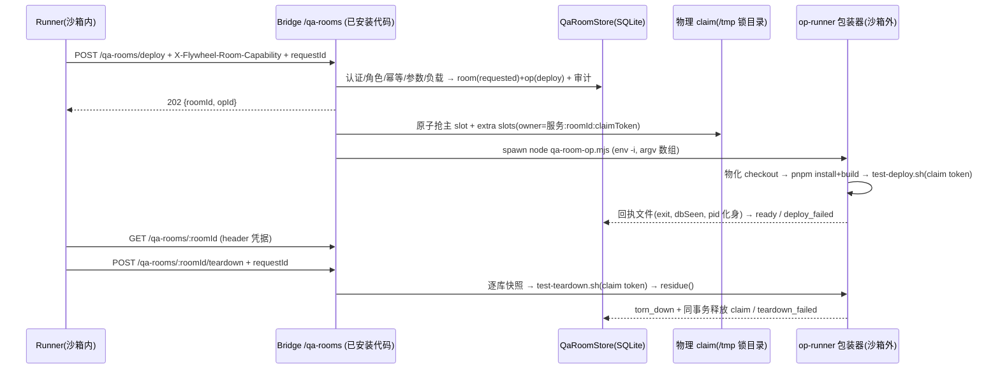

# FLY-2405 起房服务 — 实施计划
Issue: FLY-2405 (https://linear.app/geoforge3d/issue/FLY-2405/载体起房服务-codex-runner-在沙箱里起不了-529-测试房launchctl-bootstrap-eio-看不到沙箱外进程)
日期: 2026-09-28
基于: research.md

> 修订记录：v1 → v2（Codex 设计评审 R1：8 HIGH + 3 MEDIUM 全部处理，见 §10）。

## 0. 目标、非目标、信任模型

**目标**：沙箱内任何 runner（Codex / Claude 一视同仁）用 `flywheel-comm room deploy|status|teardown` 起、查、拆 529 测试房；执行在 Bridge 进程侧（沙箱外，`env -i` 最小环境）；越权被拒并留审计；拆房零残留；Lead 零手工。

**非目标**：不给 runner 任何生产 launchd / 生产 Bridge 操作权；不实现 codex:rescue 与任意"沙箱外 job"（只在 §9 评估）；不实现 e2e driver 代跑（§9 follow-up）；不做 merge / deploy。

**信任模型（诚实边界，R1-#1）**：起房服务**不是**让不可信代码变安全的沙箱。今天 Lead 手工起房时，会在宿主权限下构建并运行 runner 推上去的分支代码——服务保持**同一信任级别**，只把"谁能触发、触发哪份字节、留什么痕"收紧并结构化：

1. **哪份字节**：服务从项目已登记的 origin 远端 `git fetch` 精确 SHA，物化到服务独占目录 `~/.flywheel/qa-rooms/src/<roomId>/`（`git worktree add --detach`，不在任何 runner 的可写根内）；runner 自己工作树里的脏字节、检查后替换一律无效。SHA 必须是 owner exec 所属 issue 分支 `origin/<branch>` 的祖先或 tip（`git merge-base --is-ancestor`），否则 `bad_expect_head`。
2. **谁能触发**：只有持本 exec 能力凭据（§3.1）、`session_role ∈ {qa, implement}`、exec 运行中的 runner。
3. **控制脚本**：`test-deploy.sh` / `test-teardown.sh` 取自上述物化 checkout（被测版本本身就可能改这些脚本，这与 Lead 手工 `--expect-head` 流程一致）；服务层的锁、快照、残留判定、审计在 **Bridge 已安装代码** 里，不受被测字节影响。
4. **生产隔离**：服务从不接收 label / plist / 路径 / 配置目录类参数（§3.4 键白名单），env 由服务生成；这是"服务不开后门"的保证，不是"被测脚本不能作恶"的证明——后者与今天手工起房同级，由代码评审 + 分支保护承担。

**字节兼容**：`FLYWHEEL_QA_ROOM_SERVICE` 未设 → 不挂载路由，CLI 从 Bridge 应答判定 `room_service_disabled`（exit 3），手工起房流程逐字不变；脚本改动全部以"服务 claim token 存在"为开关，缺省路径逐字不变。

## 1. 架构



## 2. 数据模型（StateStore 幂等建表；`QaRoomStore` 封装，StateStore 暴露 `qaRooms`，与既有 store 并存）

**`qa_rooms`**：`room_id` PK（uuid）· `request_id` UNIQUE（幂等键）· `request_hash`（规范化请求 sha256）· `owner_exec_id` / `owner_issue_id` / `owner_role` / `owner_adapter`（均服务端推导）· `slot` · `extra_slots_json` · `expect_head` · `source_dir` · `state`（`requested|queued|deploying|ready|deploy_failed|tearing_down|teardown_failed|torn_down|refused|canceled`）· `active_op_id`（CAS 串行化）· `claim_token_hash` · `claimed`（是否真正持有物理 claim）· `last_error` · 时间戳。

**`qa_room_ops`**：`op_id` PK · `room_id` · `kind`（`deploy|teardown`）· `request_id` UNIQUE · `attempt` · `state`（`pending|running|succeeded|failed|supervisor_lost`）· `pid` / `pid_start` / `pgid`（化身 = pid + `ps -o lstart=`）· `deadline_at` · `receipt_path` · `exit_code` · `result_json`。

**`qa_room_capabilities`**：`exec_id` · `attempt` · `hash`（sha256）· `issued_at` · `revoked_at`；`UNIQUE(exec_id, attempt)`。

**`qa_room_audit`**（只追加）：`room_id?` · `actor_kind`（`runner|lead|unverified`）· `actor_id`（未认证时为 null，payload execId 仅记在 `claimed_actor`）· `action` · `outcome` · `reason` · `at`。

**`qa_room_snapshots`**：`room_id` · `op_id` · `db_role`（`teamlead|comm`）· `source_path` · `dest_path` · `sha256` · `at`——durable snapshot receipt。

## 3. 接口与认证

### 3.1 能力凭据（R1-#3）

- 在 `run-dispatcher` 公共 launch 路径（fresh 与 retry 两个位点，同 `workflowSubmissionCredential` 的接线方式）为 `role ∈ {qa, implement}` 生成 32 字节随机 capability：**先**写 `qa_room_capabilities` hash，**再**经 `BlueprintContext.qaRoomCapability` 注入 `TmuxAdapter` 与 `CodexTmuxAdapter` 的 env（`FLYWHEEL_QA_ROOM_CAPABILITY`）。不依赖 Claude HTTP hook 的 callback token。
- retry / resume 新 attempt → 新凭据，旧 attempt 置 `revoked_at`；exec 终态 → 全部撤销；Bridge 重启不影响已持久化 hash。老 session（无凭据）→ `unauthenticated`，需重派。
- 测试从**两种真实 adapter 构造出的 env** 取凭据发请求，不在路由测试里手造 hash。

### 3.2 认证器（R1-#4）

- 服务启用前提：`apiToken` 与 `ingestToken` 均非空且不同；否则服务拒绝挂载并在启动日志 + 告警里写明（fail-closed）。
- 独立认证器 `qaRoomAuth`（不复用 `tokenAuthMiddleware` 的"未配置即放行"）：
  - runner 面：`Authorization: Bearer <ingest>` + `X-Flywheel-Exec-Id` + `X-Flywheel-Room-Capability`（常量时间比较、未撤销、exec 运行中）。凭据只走 header，永不进 query / body / 日志。
  - Lead 面：`Authorization: Bearer <apiToken>`；ingest token 调 Lead 面 → 401 并审计。
- 每个认证拒绝写 `qa_room_audit`（`actor_kind=unverified`）。

### 3.3 路由

runner 面（`/qa-rooms/*`）：`POST /deploy`、`GET /:roomId`、`POST /:roomId/teardown`、`GET /by-request/:requestId`（找回响应丢失的房）。
Lead 面（`/api/qa-rooms/*`）：`GET /`、`GET /:roomId`、`POST /:roomId/teardown`（代拆；`--accept-missing-snapshot --reason` 仅此面可用）。Lead 不能 deploy。
非 owner 的 runner 查询 / 拆他人房 → `room_not_owned` + 审计（不回显日志）。

### 3.4 参数校验（边界，R1-#5）

- `slot` / extra slots：∈ `test-slots.json`；`expectHead`：`/^[0-9a-f]{40}$/` + §0 祖先校验；`mode` 枚举；`extra-lead`：`^\d+:[a-z][a-z0-9-]{0,31}$`；`seed`：枚举白名单。
- **TEST_* 逐键白名单**（未知键默认拒绝）：`TEST_REPLY_BY_ISSUE ∈ {0,1}`、`TEST_QA_ROOM_SERVICE ∈ {0,1}`。路径、配置目录、插件、token 类键（如 `TEST_LEAD_CLAUDE_CONFIG_DIR`、`TEST_API_TOKEN`、`TEST_INGEST_TOKEN`、`TEST_BOT_TOKEN_*`）一律 `invalid_param`；需要的 token 由服务生成，只以引用形式记录。
- 负向守卫：任一字段含 `com.flywheel.` → `production_label_refused`。

### 3.5 拒绝原因（单一枚举 `QA_ROOM_REFUSALS`，审计 / HTTP / CLI 共用）

`unauthenticated` · `runner_role_refused` · `exec_not_running` · `room_not_owned` · `slot_busy` · `slot_unknown` · `bad_expect_head` · `invalid_param:<field>` · `production_label_refused` · `tool_unavailable:<name>` · `idempotency_conflict` · `room_busy` · `room_service_disabled` · `room_service_draining` · `snapshot_failed` · `snapshot_missing_unobserved` · `probe_error`。

### 3.6 CLI（R1-#9/#10）

```
flywheel-comm room deploy --slot <n> --expect-head <sha> [--mode slot|mirror|roundtable]
     [--generalized] [--codex-runner] [--extra-lead <slot>:<dept>]... [--seed <flag>]...
     [--env TEST_X=v]... [--wait]
flywheel-comm room status <roomId> [--json]
flywheel-comm room teardown <roomId> [--lead [--accept-missing-snapshot --reason <text>]] [--wait]
```

- CLI 首次请求前生成 `requestId` 并落盘 `$FLYWHEEL_RUNNER_STATE_DIR/qa-room-requests/<requestId>.json`（temp+rename，同 `request-review`）；有界重试同一 requestId；响应丢失后用 `/by-request/:requestId` 找回。服务端：同 owner + 同 `request_hash` → 返回同一 room/op；hash 不同 → `idempotency_conflict`。
- 退出码：0 成功 / 已受理；2 被拒；3 服务关闭或 drain；4 Bridge 不可达；5 异步操作失败（`deploy_failed|teardown_failed`）。`--wait` 按 **opId** 等到该操作终态，不因短暂读到 `ready` 判拆房完成。

## 4. 物理 claim 协议（R1-#2）

- 物理 claim = 现有 `/tmp/flywheel-test-slot-<N>.lock` 目录，服务模式下写 `owner` 文件：`service:<bridgeInstanceId>:<roomId>:<sha256(claimToken)>`。
- 服务在 spawn 前按 slot 升序**原子**抢主 slot 与全部 extra slots（`mkdir`），任一失败回滚本次新抢的锁 → room `refused/slot_busy`，`claimed=0`，**无任何 teardown 权**。
- 脚本服务模式（env 有 `FLYWHEEL_QA_SLOT_CLAIM_TOKEN`）：`test-deploy.sh` 校验锁 owner 与 token 匹配而非自己抢锁；**不**自动回收"陈旧"外来锁（遇到即 fail）；`test-teardown.sh` 校验 token 后清理，**不释放**锁（含 borrowed slots）——锁由服务在 residue 为空、快照回执已提交后，在与 `torn_down` 同一流程里释放（先写 DB 状态 `releasing`，再删锁，再 `torn_down`；崩溃后按状态重放）。
- 手工模式（无 token）逐字不变。服务只对 owner 文件匹配自己 room 的锁执行删除；PID 死不构成删除依据。
- 多 Bridge（多个 StateStore）共存：互斥由物理锁目录保证，DB 只记录本服务持有的 claim。

## 5. 操作执行与恢复（R1-#6）

- **op-runner 包装器** `scripts/lib/qa-room-op.mjs`（Bridge 已安装代码的一部分）：由 Bridge `spawn(process.execPath, [wrapper, opSpecPath], {env: minimalEnv, detached: true, shell: false})`；包装器负责物化 checkout、pnpm install + build、跑脚本、每 2 秒探测 DB 坐标（§6）、最后**原子写回执** `<opDir>/receipt.json`（exit、dbSeen、起止时间）。
- **串行化**：`UPDATE qa_rooms SET active_op_id=? WHERE room_id=? AND active_op_id IS NULL` CAS；deploy 进行中收到 teardown → teardown op 记为 `pending` 并在 deploy op 终态后执行（屏障），不并发。所有回写带 `(op_id, attempt)`，旧 attempt 回写被丢弃。
- **toolDirectories**：必需 `bash node pnpm git jq tmux python3 gh sqlite3 claude`，`--codex-runner` 另需 `codex`；在 Bridge 的 `PATH` 上解析真实路径取目录去重 + `/usr/bin:/bin:/usr/sbin:/sbin`；缺失 → `tool_unavailable:<name>`，不 spawn。零写死用户路径。该 PATH 同时传给脚本、launchd plist env 投影（脚本用 `PATH` 生成 plist `EnvironmentVariables`，测试断言投影结果含 codex 目录）。
- **minimalEnv**：`HOME USER LOGNAME TMPDIR LANG PATH` + 白名单 TEST_* + `FLYWHEEL_QA_DEPLOY_ID` + `FLYWHEEL_QA_SLOT_CLAIM_TOKEN`；`TEST_QA_ROOM_SERVICE=1` 由 `test-deploy.sh` 映射为房内 Bridge 的 `FLYWHEEL_QA_ROOM_SERVICE=1`（R1-#11，脚本改动 + env 投影测试）。
- **pretrust**：`--codex-runner` 房的 workspace 预信任（`$HOME` 根锁）在包装器内、沙箱外完成（沿用现有 pretrust 脚本，若存在）。
- **重启恢复矩阵**（Bridge 启动 + 既有周期 tick piggyback，零新 timer）：

| 持久状态 | 观察 | 处置 |
|---|---|---|
| room `requested`，op `pending`，未 spawn | — | 重新校验身份/凭据/claim 后 spawn；owner 已终态 → `canceled`（释放本服务 claim） |
| room `queued` | 每 tick | 重新校验身份、凭据、负载；owner 终态 → `canceled` |
| op `running` | 有回执 | 按回执落终态 |
| op `running` | 无回执，pid+lstart 匹配存活 | 保持 running，tick 复查；超 `deadline_at` → 按进程组 TERM→KILL，确认退出后 `failed:timeout` |
| op `running` | 无回执，pid 死或化身不符 | `supervisor_lost` → room `*_failed`，快照策略按"未完整观测" |
| room `releasing` | — | 重放删锁 → `torn_down` |

- 探测工具（ps / lsof / launchctl）自身出错 → `unknown`，拆房判 `teardown_failed:probe_error`，**不**当无残留。

## 6. 快照与残留

**DB 坐标**：服务按 slot 与布局生成候选清单并在**每次** teardown 前重新探测：slot 根 `teamlead.db`；`state/comm/<project>/comm.db`（新布局）；`$HOME/.flywheel/comms/<project>/comm.db`（旧布局）。逐库处理，不用单一布尔。

**规则**（R1-#7）：
1. 任一现存 DB → 必须快照：`sqlite3 <db> ".backup <dest>"`（一致性含 WAL）到 `~/.flywheel/qa-evidence/qa-rooms/<roomId>/<opId>/`，逐文件 sha256 写 `qa_room_snapshots` 回执；任一失败 → `snapshot_failed`，不拆。
2. 无现存 DB，且该房此前 teardown op 已有快照回执 → `snapshot:already_taken:<opId>`，继续（QA@2 "物理已清再拆"场景）。
3. 无现存 DB、无回执，deploy op 回执完整且 `dbSeen=false`（包装器全程观测过）→ `snapshot:skipped:no_db_created`，继续（QA 返工 2 "建库前失败"场景，无需 `--skip-snapshot`）。
4. 无现存 DB、无回执、未完整观测（`supervisor_lost`）且 `dbSeen` 不确定 → `snapshot_missing_unobserved`，拒拆；仅 Lead `--accept-missing-snapshot --reason` 可放行并审计。

**residue()**（QA@2 HIGH-1）：只认房间归属集合——op 记录的 pid/pgid（化身匹配）、`launchctl print gui/<uid>/com.flywheel.qa.*<slot>*` 存在、`lsof -iTCP:<slotPort> -sTCP:LISTEN`、`lsof -d cwd` 在房间目录内的进程。**命令行文本永不参与**。为空 → 进入 §4 释放流程 → `torn_down`。

**幂等收尾**：`teardown_failed` 房可由 owner 或 Lead 重拆；重拆从快照规则 1 开始重新走，residue 为空即释放 claim。

## 7. 拆房坑（R1 补充）

- 陈旧 launch marker：`test-deploy.sh` 写 marker 时写入 `FLYWHEEL_QA_DEPLOY_ID`；所有读者（本快照为 `test-teardown.sh`；实现基线若含 `scripts/lib/qa-launchd-lead.sh` 一并改）只在 deployId 匹配时判 `runtime_started`。
- 死 Codex socket 软链：reaper（本快照 `test-teardown.sh`；基线若含 `scripts/lib/qa-reap-codex-slot-daemons.mjs` 一并改）区分三态：目标不存在或 `lsof -U` 确认无持有者 → 死，删软链 + 审计；有持有者 → 活；探测失败 → unknown（拒拆，不删）。

## 8. 分块与测试（先红后绿，只跑相关测试）

| 块 | 内容 | 测试 |
|---|---|---|
| C1 | `QaRoomStore` 五张表 + StateStore 接入 + 幂等迁移 | 状态机合法转移、CAS、幂等键、审计追加 |
| C2 | 能力凭据：dispatcher 发放（fresh+retry）+ 双 adapter env 注入 + 撤销 | 从 `TmuxAdapter`/`CodexTmuxAdapter` 真实 env 构造取凭据；retry 旧凭据失效 |
| C3 | `qaRoomAuth` + 路由 + 参数白名单 + 负载门 + drain | 无 token / 两 token 相同→不挂载；ingest 调 Lead 面 401+审计；generic 角色 `runner_role_refused`；他人房 `room_not_owned`+审计；`TEST_LEAD_CLAUDE_CONFIG_DIR`/`TEST_API_TOKEN` 拒；生产 label 拒 |
| C4 | 物理 claim 协议 + 两脚本服务模式 | 两个独立 StateStore 抢同 slot；手工房占槽 → `slot_busy` 且不 teardown；borrowed slot 冲突；释放后崩溃重放；手工模式字节不变（sentinel） |
| C5 | op-runner 包装器 + toolDirectories + minimalEnv + 重启恢复矩阵 | **最小 env 中 codex 可解析且投影进 plist env**；缺 codex → `tool_unavailable:codex`；无写死路径；各崩溃窗口、超时、PID 复用 |
| C6 | 快照 + residue + 幂等收尾 | **回归①** 外来进程命令行含房间路径 → 仍 `torn_down`；**回归②** 物理已清 + `teardown_failed` → 重拆成功、锁与 claim 释放；**回归③** 建库前失败 → `skipped:no_db_created`；只有 CommDB；WAL 未落盘数据被快照；部分快照失败拒拆；`supervisor_lost` 缺失回执拒拆 |
| C7 | 拆房坑：marker deployId、socket 三态 | `scripts/__tests__/qa-room-teardown-guards.test.sh` |
| C8 | CLI `flywheel-comm room` | 退出码；requestId 落盘 + 响应丢失找回；并发重复请求；`--wait` 按 opId |
| C9 | 指引：`agents/qa-executor.md`、`packages/qa-framework/agents/qa-parallel-executor.md`、Blueprint QA 节点一句"要房就调起房服务"；**不改 implement/engineer 提示词** | Blueprint 片段断言 |

依赖顺序：C1 → C2 → C3 → C4 → C5 → C6 → C7 → C8 → C9。

## 9. 评估项（本单不实现）

- **e2e driver 代跑**：现有 driver 的 slot/CommDB 坐标契约与新布局不一致（R1-#8），需先修 driver 契约再做"受管 driver op"（绑定 issue/slot/manifest、超时、拆房前停止屏障）→ follow-up。本单 pretrust 在 deploy 包装器内完成，runner 在房内的"真验证"用自己能做的手段（访问房内 Bridge health、跑房内 runner 流程）。
- **codex:rescue / 嵌套诊断**：同一"受管 op"模式可承载，但会把模型会话带出沙箱，风险面更大 → follow-up，`qa_room_ops.kind` 预留扩展位。

## 10. 验收、回滚、R1 处理表

**QA 判据**：精确头 full CI 全绿；外层房 N 由 Lead 起（`--generalized --codex-runner`，`TEST_QA_ROOM_SERVICE=1` → 房内 Bridge 启用服务）；房内真 Codex runner 只用 `room deploy|status|teardown` 起内层房 M、做一项真验证、拆房零残留；Claude runner 同样走通；INTRUDER `room_not_owned`；generic 节点 `runner_role_refused`；拆房期间宿主挂一个命令行含房间路径的观察进程 → 仍 `torn_down`。

**回滚**：`FLYWHEEL_QA_ROOM_SERVICE=drain` → 拒新 deploy，保留 status/teardown 让既有房收尾；`=0`/未设 → 若库中无非终态房则不挂载，否则启动时自动按 drain 运行并告警，直到非终态房归零（启动时读取，改值需重启 Bridge）。代码回滚 = revert PR（先 drain 至零）。

| R1 项 | 处理 |
|---|---|
| #1 可信执行面 | §0 信任模型 + 服务物化 checkout + 祖先校验 |
| #2 物理 claim | §4 |
| #3 双 adapter 凭据 | §3.1 / C2 |
| #4 认证 fail-closed | §3.2 |
| #5 TEST_* 白名单 | §3.4 逐键 |
| #6 恢复与并发 | §5 包装器 + 回执 + CAS + 恢复矩阵 |
| #7 逐库快照 | §6 |
| #8 driver | 移出本单（§9），pretrust 保留 |
| #9 幂等键 | §3.6 |
| #10 status 凭据 | header 凭据 + `/by-request` |
| #11 开关映射与回滚 | §5 映射 + §10 drain |
