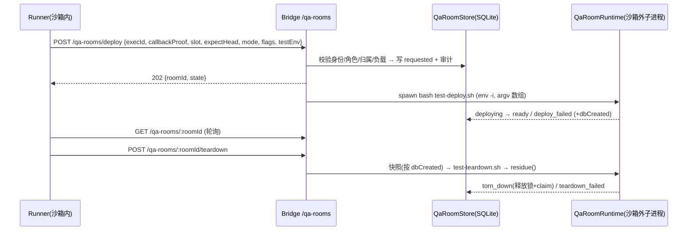

# FLY-2405 起房服务 — 实施计划
Issue: FLY-2405 (https://linear.app/geoforge3d/issue/FLY-2405/载体起房服务-codex-runner-在沙箱里起不了-529-测试房launchctl-bootstrap-eio-看不到沙箱外进程)
日期: 2026-09-28
基于: research.md

## 0. 目标与非目标

**目标**：沙箱内的任何 runner（Codex / Claude 一视同仁）用一条命令 `flywheel-comm room deploy|status|teardown` 起、查、拆 529 测试房；真正的执行在 Bridge 进程侧（沙箱外，`env -i` 最小环境）；越权被拒并留审计；拆房零残留；Lead 零手工。

**非目标**：不改 `test-deploy.sh` / `test-teardown.sh` 的起房语义；不给 runner 任何生产 launchd / 生产 Bridge 操作权；不实现 codex:rescue 出沙箱（只预留 job kind）；不做 merge / deploy。

**字节兼容**：`FLYWHEEL_QA_ROOM_SERVICE` 未设或 `=0` → 路由不挂载、CLI 返回 `room_service_disabled`（exit 3），现有手工起房流程逐字不变。

## 1. 架构



## 2. 数据模型

新表 `qa_rooms`（StateStore 幂等建表，`QaRoomStore` 封装，StateStore 暴露 `qaRooms`）：

| 列 | 说明 |
|---|---|
| `room_id` TEXT PK | uuid，稳定标识 |
| `slot` INTEGER | ∈ test-slots.json；`UNIQUE(slot) WHERE state NOT IN ('torn_down')` 即 slot 锁 |
| `owner_exec_id` TEXT | 服务端从认证推导，非 payload |
| `owner_issue_id`, `owner_role`, `owner_adapter` | 审计用快照 |
| `state` TEXT | `requested|queued|deploying|ready|deploy_failed|tearing_down|teardown_failed|torn_down` |
| `deploy_id` TEXT | 写入 `.flywheel-qa-launch-started` marker，防陈旧 marker |
| `expect_head` TEXT | 40 位 sha，精确头 |
| `request_json` TEXT | 已校验参数（不含 secret） |
| `bridge_pid`, `lead_pid`, `pgids_json`, `launchd_labels_json`, `slot_port` | R5 残留判定的"房间归属集合" |
| `db_created` INTEGER | R6 快照策略 |
| `snapshot_status` TEXT | `taken|skipped:no_db_created|missing:already_removed|failed` |
| `created_at`, `updated_at` | |

`qa_room_audit`（只追加）：`id, room_id, actor_kind(runner|lead), actor_id, action, outcome, reason, at`。每个拒绝都写一行。

"service claim" = `qa_rooms` 行本身；slot 文件锁由脚本维护。**收尾事务**：`torn_down` 状态写入与 claim 释放同一 SQLite 事务；slot 文件锁由 teardown 脚本删除，服务在写 `torn_down` 前复核锁目录不存在（存在且 pid 死 → 删除并审计）。

## 3. 接口

### 3.1 Bridge 路由（runner 面，ingest-token 认证，同 `/review-requests`）

- `POST /qa-rooms/deploy` → 202 `{roomId,state}` | 4xx `{reason}`
- `GET /qa-rooms/:roomId` → `{state, slot, snapshotStatus, lastError, logTail}`（logTail 已脱敏、≤ 8 KiB）
- `POST /qa-rooms/:roomId/teardown`

body 必带 `execId` + `callbackProof`；Bridge 校验顺序：ingest token → callback proof（常量时间比较 `sessions.callback_token_hash`）→ exec 运行中 → `session_role ∈ {qa, implement}` → 归属 → 参数校验 → 负载门。

### 3.2 Lead 面（`/api/qa-rooms/*`，apiToken）

`GET /api/qa-rooms`、`GET /api/qa-rooms/:id`、`POST /api/qa-rooms/:id/teardown`（代拆，`actor_kind=lead`）。Lead 不能 deploy。

### 3.3 CLI

```
flywheel-comm room deploy --slot <n> --expect-head <sha> [--mode slot|mirror|roundtable]
     [--generalized] [--codex-runner] [--extra-lead <slot>:<dept>]... [--seed <flag>]...
     [--env TEST_X=v]... [--run-driver <name>] [--wait]
flywheel-comm room status <roomId> [--json]
flywheel-comm room teardown <roomId> [--lead] [--wait]
```

退出码：0 成功/已受理；2 被拒（打印 reason）；3 服务关闭；4 Bridge 不可达（有界重试后）。`--wait` 轮询到终态（`ready|deploy_failed|torn_down|teardown_failed`）。

### 3.4 参数校验（边界）

- `slot`：整数且在 test-slots.json；`expectHead`：`/^[0-9a-f]{40}$/`；`mode` 枚举；`extra-lead` 正则 `^\d+:[a-z][a-z0-9-]{0,31}$`；`seed` 枚举白名单；`testEnv` 键 `^TEST_[A-Z0-9_]{1,64}$`、拒 `TEST_BOT_TOKEN_*`、值 ≤ 4 KiB 且无 NUL；`run-driver` ∈ 白名单（`qa-529-generalized-e2e` 等，代码常量）。
- 负向守卫：任意字段出现 `com.flywheel.` 且非 `com.flywheel.qa.` → `production_label_refused`；出现 `/` 或 `..` 的 driver 名 → 拒。

### 3.5 拒绝原因（稳定 code，审计与 CLI 共用单一枚举 `QA_ROOM_REFUSALS`）

`unauthenticated`、`runner_role_refused`、`exec_not_running`、`room_not_owned`、`slot_busy`、`slot_unknown`、`bad_expect_head`、`invalid_param:<field>`、`production_label_refused`、`tool_unavailable:<name>`、`load_gate_queued`（非拒绝，状态 queued）、`room_service_disabled`。

## 4. 执行面 `QaRoomRuntime`（packages/teamlead/src/bridge/qa-room-runtime.ts）

1. **toolDirectories**：必需工具集 `node pnpm git jq tmux python3 gh sqlite3` + `codex`（`--codex-runner` 必需，否则可选）。对每个在 Bridge 的 `process.env.PATH` 上解析可执行路径，取 `dirname`（同时保留 realpath 目录），去重、保序 → 最小 PATH（再追加 `/usr/bin:/bin:/usr/sbin:/sbin`）。缺必需工具 → `tool_unavailable:<name>`，不 spawn。**零写死用户路径**。
2. **minimalEnv**：`HOME USER LOGNAME TMPDIR LANG PATH` + 校验过的 `TEST_*` + `FLYWHEEL_QA_DEPLOY_ID`。
3. **预检**：在 expect-head worktree 内 `git rev-parse HEAD` == expectHead（否则 `bad_expect_head`），`pnpm install --frozen-lockfile`、affected build。
4. **spawn**：`spawn("bash", [scriptPath, ...argv], {env, cwd, detached:true, shell:false})`，stdout/stderr → 房间日志文件；记录 pid/pgid。
5. **dbCreated 探测**：deploy 结束（成功或失败）时检查 `teamlead.db`/`comm.db` 是否存在于房间状态目录，任何时刻出现过即置真。
6. **residue()**（R5）：只认房间归属集合 —— 记录的 pid 与 pgid 成员、`launchctl print gui/<uid>/<qa label>` 存在、`lsof -iTCP:<slotPort> -sTCP:LISTEN`、cwd 在房间目录内的进程。**不读命令行文本**。
7. **拆房前坑修**：死 Codex socket 软链（目标不存在或 `lsof -U` 无持有者）→ 删除 + 审计；`.flywheel-qa-launch-started` marker 的 deployId ≠ 房间 deployId → 视为陈旧。
8. **快照**（R6）：`db_created=0` → `skipped:no_db_created`；库在 → 导出行集（现有导出钩子）失败则 `snapshot_failed` 不拆；库不在且状态 `teardown_failed` → `missing:already_removed` 继续。
9. **幂等收尾**：`teardown_failed` 可由 owner 或 Lead 重拆；residue 为空 → `torn_down` + 同事务释放 claim。

启动恢复：Bridge 启动时把 `deploying|tearing_down` 且子进程已死的房转为对应 `*_failed`（带 `bridge_restart` 原因），不自动重跑。

## 5. 分块（C1–C7）与测试（先红后绿，只跑相关测试）

| 块 | 内容 | 测试（新增/相关） |
|---|---|---|
| C1 | `QaRoomStore` + StateStore 接入（`qaRooms` 与 main 既有 store 并存）+ 迁移 | `qa-room-store.test.ts`：状态机合法转移、slot 唯一、审计追加、幂等建表 |
| C2 | 路由 + 认证 + 角色 + 归属 + 参数校验 + 负载门 | `qa-room-routes.test.ts`：未认证 401、callbackProof 错、generic 角色 `runner_role_refused`、他人房 `room_not_owned`（审计行在）、生产 label 拒、服务关闭不挂载 |
| C3 | `QaRoomRuntime`：toolDirectories / minimalEnv / spawn / dbCreated | `qa-room-runtime.test.ts`：**最小 env 中 codex 可解析**、`--codex-runner` 缺 codex → `tool_unavailable:codex`、无写死路径（注入假 PATH）、argv 数组无 shell |
| C4 | residue() + 幂等收尾 + 快照策略 | **回归①** 外来进程命令行含房间路径 → 仍 `torn_down` 零残留；**回归②** 物理已清 + `teardown_failed` → 再拆成功、锁与 claim 释放；**回归③** 从未建库 → 跳过快照、审计 `skipped:no_db_created`；有库的房快照失败仍拒拆 |
| C5 | 拆房坑：死 socket 软链、陈旧 marker（`test-teardown.sh` 小改 + 单测） | `scripts/__tests__/qa-room-teardown-guards.test.sh` |
| C6 | CLI `flywheel-comm room` | `room.test.ts`：退出码、`--wait` 终态、Bridge 不可达有界重试 |
| C7 | 文档与指引：`agents/qa-executor.md`、`packages/qa-framework/agents/qa-parallel-executor.md`、Blueprint QA 节点一句"要房就调起房服务"；**不改 implement/engineer 提示词** | 断言字符串测试（Blueprint 片段） |

## 6. 验收（QA 判据）

1. 精确头 full CI 全绿。
2. 外层房 N 由 Lead 起（`--generalized --codex-runner`，`TEST_QA_ROOM_SERVICE=1`）；房内真 Codex runner 只用 `room deploy|status|teardown` 起内层房 M、做一项真验证、再拆，零残留；Claude runner 同样走通。
3. INTRUDER 拆他人房 → `room_not_owned` + 审计；generic 节点起房 → `runner_role_refused`。
4. 拆房期间宿主挂一个命令行含房间路径的观察进程 → 仍 `torn_down`。

## 7. 回滚与风险

- 回滚：`FLYWHEEL_QA_ROOM_SERVICE=0` 立即卸路由；表保留无副作用。代码回滚 = revert PR。
- 风险：Bridge 被 runner 当成"沙箱外执行器"。缓解：只跑两个固定脚本 + 白名单 driver；argv 数组；角色+归属+callbackProof；审计全留。
- 风险：Bridge 重启丢子进程。缓解：启动恢复转 `*_failed`，靠幂等重拆收尾。
- 风险：日志含 secret。缓解：logTail 经已有 secret 脱敏函数，env 不回显。
