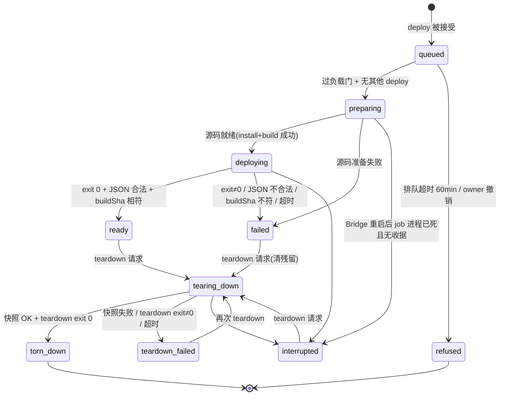
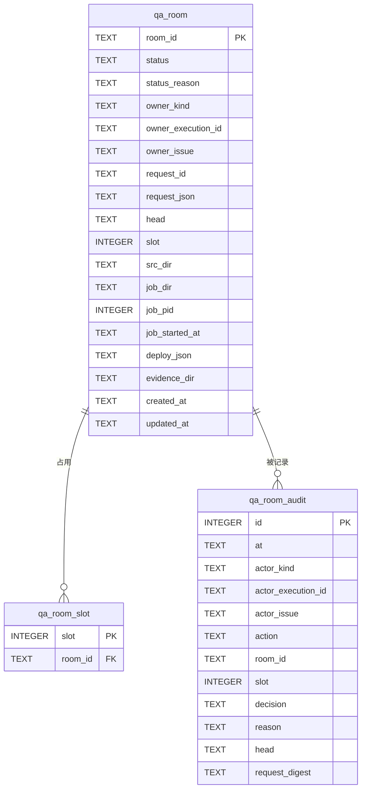

# FLY-2405 起房服务 — 实施计划
Issue: FLY-2405 (https://linear.app/geoforge3d/issue/FLY-2405/载体起房服务-codex-runner-在沙箱里起不了-529-测试房launchctl-bootstrap-eio-看不到沙箱外进程)
日期: 2026-09-26
基于: 无(doc tier = plan_only;审计结论直接写在本文 §1)

---

## 0. 一句话

Bridge(在沙箱外、由 launchd 起的常驻进程)新增一个**起房 / 拆房服务**:runner 用
`flywheel-comm room deploy|status|wait|teardown|list` 发一个**结构化请求**,Bridge 在沙箱外、用最小环境、
从「精确到 commit 的独立源码目录」跑 `test-deploy.sh` / `test-teardown.sh`,并负责房位归属、负载排队、
拆房前证据快照与审计。Codex 体和 Claude 体走同一条路。同时修掉两个已知拆房坑。

## 1. 审计结论(现状事实,均已读码核对)

| # | 事实 | 位置 |
|---|---|---|
| F1 | Codex runner 以 `workspace-write` Seatbelt 沙箱运行,`network_access=true`(所以能 POST 到 `127.0.0.1:9876` 的 Bridge 与 `127.0.0.1:198N` 的房内 Bridge);但 `launchctl bootstrap gui/501`、看沙箱外 `ps`、嵌套 `sandbox-exec` 都被拒 | `claude-runner/src/CodexTmuxAdapter.ts:1559-1567`、`codex-daemon-runtime.ts:527-541,640-643` |
| F2 | 房间 Lead 是 launchd 任务:`qa-launchd-lead.sh:837` `launchctl bootstrap <domain> <plist>`,label 形如 `com.flywheel.qa.lead.slot-<N>.<agent>`;生产 label 不含 `.qa.` | `scripts/lib/qa-launchd-lead.sh:17-27,837` |
| F3 | 房内 Bridge 跑的是**被调用的那份 `test-deploy.sh` 所在仓库**(`REPO_ROOT`)的代码;`--from-branch` 只决定 runner 沙箱 clone | `test-deploy.sh:19-20,1203-1228` |
| F4 | `--expect-head` 只在 `--generalized/--test-discipline` 下可用;plain 房只能靠 `/health.buildSha`(source 模式 = 源码目录 git HEAD)核版本 | `test-deploy.sh:283-315`;`teamlead/src/bridge/build-identity.ts:5-42` |
| F5 | 部署**不做** `pnpm install`,只在重建锁下 `pnpm --filter` 构建若干包;缺依赖 dist 时会失败 | `test-deploy.sh:513-602,529-534` |
| F6 | 部署 stdout 不纯:preflight 子 shell 的构建输出没重定向到 stderr,会落在最终 JSON 前面 | `test-deploy.sh:513-602` |
| F7 | 房位锁 = `mkdir /tmp/flywheel-test-slot-N.lock`;pid 文件态 `claiming` / BridgePID / `diagnostic-evidence-pending` / `cycle-failed`;锁在 preflight(构建)**之后**才取 | `test-deploy.sh:113-167,616` |
| F8 | 部署/拆房/qa 库里**没有负载门**;唯一负载门是 Bridge `RunnerAdmissionController`(load1/核 > 8.0 拒,18 核 = 144) | `teamlead/src/bridge/runner-admission.ts:191-330` |
| F9 | 拆房坑 A:`qa-reap-codex-slot-daemons.mjs` 的 `liveSockets()` 见到 `state/cdx-sock/*.sock` 是软链就直接抛 `socket authority contains a symlink`;codex ≥0.157 的 `--listen` socket **一律是软链**(指向 `/private/tmp/codex-daemon-<uid>/…`),死掉后变悬空软链 ⇒ 每个跑过真 Codex 的房拆房都被拒、保留房位(今天 slot 1、slot 4) | `scripts/lib/qa-reap-codex-slot-daemons.mjs:90-102`;`claude-runner/src/codex-daemon-runtime.ts:1415-1425` |
| F10 | 拆房坑 B:`.flywheel-qa-launch-started` marker 只要是普通文件就置 `runtime_started=1`;之后 `codex remote-control stop` 失败即 `failed=1`。marker 在 `launchctl bootstrap` **之前**写,bootstrap 失败(或上次拆房半途)留下的陈旧 marker 会让「根本没起来的运行时」被判成已启动 ⇒ 拆房失败、保留房位 | `test-deploy.sh:1894-1895`;`scripts/lib/qa-launchd-lead.sh:1369-1415` |
| F11 | 拆房 `rm -rf SLOT_DIR` 会删光 bridge.log、teamlead.db、房内 CommDB;只归档 kill-ledger 等少量证据;不存在「拆房前导 DB」钩子。拷 SQLite 必须 `VACUUM INTO`(裸 cp 丢 WAL) | `test-teardown.sh:695-769,1283`;记忆 FLY-2248 |
| F12 | runner→Bridge 认证只有两把全舰队 bearer:`TEAMLEAD_API_TOKEN`(Lead/master,已从 runner pane 剔除)与 `TEAMLEAD_INGEST_TOKEN`(runner 看到的 `FLYWHEEL_INGEST_TOKEN`)。调用者身份靠 body 里的 `execution_id` + `store.getSession()`;qa 节点另有 `submission_credential`,implement/design 节点基本没有 | `teamlead/src/bridge/plugin.ts:1460-1552,2712-2772`;`tmux-environment-scrub.ts:7-22`;CommDB `runner_workflow_activation` 实测 |
| F13 | 长任务先例:`fleet-console.spawnEngine` = spawn 前写 journal、`detached+unref`、日志落 0600 文件、owner sidecar、启动时 reconcile;Bridge 重启不杀任务 | `teamlead/src/bridge/fleet-console.ts:443-520` |
| F14 | 生产 Bridge 由 `com.flywheel.bridge` LaunchAgent 起,**不在沙箱里** | `scripts/launchd/com.flywheel.bridge.plist`、`scripts/flywheel-bridge-wrapper.sh` |
| F15 | runner 起房指引只在 `.flywheel/agents/nodes/qa.md:54-66`(注入 prompt)与 `edge-worker/src/Blueprint.ts:1989`(strength-two 证据提示「before `test-teardown.sh`」);其余是 `doc/qa/framework/*`、`packages/qa-framework/*` 文档 | 见路径 |
| F16 | `codex:rescue` 伴侣总是自起 `thread/start` 且只有 read-only/workspace-write 两档,无「不套沙箱」开关;Raya 529 harness 的 subject preflight 也无 skip 开关 | `~/.claude/plugins/cache/openai-codex/codex/1.0.0/scripts/codex-companion.mjs:383,460` |

## 2. 目标 / 非目标

**目标(本单交付)**

- G1 `flywheel-comm room deploy|status|wait|teardown|list` + Bridge 路由 `/api/qa-rooms*`;runner 只发请求,脚本在 Bridge 侧(沙箱外)执行。
- G2 护栏:房位归属(谁起谁拆;Lead 可代拆;同 issue 后继可接管已终止 owner 的房)、精确头核验、负载门排队(阈值 = 现有 admission 的 8.0/核 × 核数 = 本机 144)、拆房前自动 DB/日志快照、追加式审计;请求合同里**没有**任何 launchd label / 任意 env / 任意 argv 字段。
- G3 修拆房坑 A(悬空 / 合法软链 socket)与坑 B(陈旧 launch marker),顺带修 F6 stdout 不纯。
- G4 QA 规则与 runner 指引改为「要房就调起房服务」,Codex / Claude 一视同仁。
- G5 对 `codex:rescue` 与诊断类嵌套 codex 给出评估结论(§12),本单不实现。

**非目标**

- 不改 `test-deploy.sh` 的房间拓扑/参数语义;不改房内隔离边界规则(`isolation-boundary.ts` 的 `outside_root` 是 Lead 明令保持的房内行为,见记忆 FLY-2903)。
- 不给 runner 任何生产 launchd 操作;不提供「在房里执行任意命令」「restart drill 的 `launchctl kickstart`」这类动作(列入 follow-up)。
- 不做自动回收孤儿房(只在 `list` 标记,留 follow-up)。
- 不把 `codex:rescue` / 嵌套 codex 搬到服务里。

## 3. 总体设计

```mermaid
sequenceDiagram
    autonumber
    participant R as Runner(沙箱内 Codex/Claude)
    participant C as flywheel-comm room
    participant B as 生产 Bridge(沙箱外)
    participant DB as StateStore(qa_room*)
    participant J as 受信包装器 qa-room-job.sh
    participant S as 房源码目录 src/<sha>
    R->>C: room deploy --head <sha> [...]
    C->>B: POST /api/qa-rooms (ingest bearer + exec_id + request_id)
    B->>B: 校验合同 / 身份 / 头在 origin 上
    B->>DB: 写 room(queued) + 审计(accepted) + 占房位
    B-->>C: 202 {room_id, status: queued}
    loop 每 5s 调度 tick
        B->>B: 负载门 load1 < 144 且无其他 deploy 在跑?
    end
    B->>J: spawn detached, env -i 最小环境 (prepare+deploy)
    J->>S: git worktree add --detach <sha>; pnpm install; pnpm -r build
    J->>S: bash scripts/test-deploy.sh <slot> [白名单参数]
    J-->>B: 写 exit/stdout/stderr 收据文件
    B->>B: 解析房 JSON;GET 房 /health 核 buildSha == sha
    B->>DB: room -> ready (存房 JSON)
    C-->>R: 轮询 GET /api/qa-rooms/:id → ready + 房 JSON
    R->>R: 在房里做真验证(HTTP 到 127.0.0.1:198N、读房内 DB 等)
    R->>C: room teardown --room <id>
    C->>B: POST /api/qa-rooms/:id/teardown
    B->>J: spawn detached (snapshot + teardown)
    J->>J: VACUUM INTO 房内所有 *.db + 拷日志 → ~/.flywheel/qa-evidence/rooms/<id>/
    J->>S: bash scripts/test-teardown.sh <slot>
    B->>DB: room -> torn_down,释放房位,源码目录引用计数归零则移除
```

### 3.1 状态机



`failed / teardown_failed / interrupted` **一律继续占房位**(fail-closed,保留诊断现场),只能通过 teardown 离开。
`refused` 从未占过真实房位(见 §6),释放服务侧预留。

## 4. 身份与授权

**威胁模型(诚实):** 所有 runner 与 Bridge 同一 macOS 用户;Claude runner 根本不在沙箱里,Codex runner 能读 CommDB、能写 `~/.flywheel`。
所以本服务的护栏针对的是**「好意但会犯错 / 被旧指令驱动」的 runner**(拆错房、在高负载时起房、带错头),
**不是**对抗恶意 runner 的安全边界。这与今天「Lead 手工代起」的信任根相同,不更宽。

| 调用者 | 如何认定 | 可做 |
|---|---|---|
| runner | `Authorization: Bearer <FLYWHEEL_INGEST_TOKEN>` + body `execution_id`;Bridge 查 `store.getSession(execution_id)` 必须存在且**非终态**;资格:`session_role === "qa"` 或当前 workflow activation 的 node 类型 ∈ {`qa`,`implement`};若该 activation 带 `submission_credential`,则 body 必须携带且 `credential.execution_id === execution_id`(沿用 evidence-run 的校验函数,防过期 attempt) | deploy(owner=自己)、status/wait/list(只看自己 issue 的房)、teardown(见下) |
| Lead | `Authorization: Bearer <TEAMLEAD_API_TOKEN>`(runner pane 已剔除此变量,F12) | 全部动作、任何房 |

所有路由 `rejectNonLoopback`(复用 `workflow-decision-routes.ts:459`)。

**teardown 授权(按顺序判):**
1. Lead → 允许(审计 `actor=lead`)。
2. runner 的 `execution_id === room.owner_execution_id` → 允许。
3. owner session 已终态 **且** 调用者 session 的 `issue_identifier === room.owner_issue` → 允许,审计记 `takeover_from=<旧 exec>`(QA 返工 attempt 换了 exec id 时不用麻烦 Lead)。
4. 其他 → `403 room_not_owned`,写审计 `refused`。

## 5. 请求合同(严格 schema,未知字段一律拒)

`POST /api/qa-rooms` body:

| 字段 | 类型 / 约束 | 映射到 test-deploy |
|---|---|---|
| `execution_id` | UUID(runner 必填;Lead 可省) | — |
| `request_id` | UUID,客户端生成;`(actor, request_id)` 唯一 ⇒ 重试幂等 | — |
| `credential` | 可选字符串(见 §4) | — |
| `head` | 必填,40 位小写 hex | 源码目录 = 该 commit;generalized/test-discipline 时另传 `--expect-head` |
| `slot` | `"auto"` 或 1..N(N = `test-slots.json` 条数) | 位置参数 |
| `mode` | `slot`\|`mirror`\|`roundtable`,默认 `slot` | `--mode` |
| `from_branch` | `^[A-Za-z0-9._/-]{1,200}$` 且不含 `..`,默认 `main` | `--from-branch` |
| `generalized` / `test_discipline` / `codex_runner` / `stub_runner` / `no_lead` / `alerts` / `codex_home_reconcile` | bool | 对应 flag;组合合法性由服务先按 F-表复核一遍,再交给脚本兜底 |
| `extra_leads` | `[{slot:int, label:^[A-Za-z0-9._-]{1,40}$}]`,≤4 | `--extra-lead s:label` |
| `lead_label` | 同上字符集 | `--lead-label` |
| `lead_ready_timeout_sec` / `lead_channel_timeout_sec` | 1..3600 | 对应 flag |
| `digest_channel` | 17–20 位数字 | `--digest` |
| `env` | 仅允许键:`TEST_REPLY_BY_ISSUE ∈ {0,1}`、`TEST_BRIDGE_DEPT_SCOPE_REJECT ∈ {on,off}`、`TEST_CODEX_LEAD_OUTBOUND_MODE ∈ {direct,bridge}` | 注入包装器环境 |

显式拒绝(`400` + 审计 `refused`):未知字段;任意值里出现 `com.flywheel.` 但不含 `.qa.` 的字符串(`production_target_refused`);`slot`/`extra_leads.slot` 越界;`voice_fixture`、`TEST_API_TOKEN`、`TEST_INGEST_TOKEN`、`TEST_LEAD_CLAUDE_CONFIG_DIR` 等本版不开放项(`field_not_supported`)。
teardown body:`{execution_id?, request_id, credential?, skip_snapshot?: bool}`(`skip_snapshot=true` 必须审计理由字段 `reason`,≤200 字)。

**argv 由服务端从已校验字段拼成数组**(`spawn` 不经 shell 解释),永远不会出现请求原文拼接。

## 6. 房位、并发、负载门

- 表 `qa_room_slot(slot INTEGER PRIMARY KEY, room_id TEXT NOT NULL)`:主键即互斥。受理 deploy 时在**同一事务**里为主房位 + 所有 extra-lead 房位插行;任何一个冲突 ⇒ `409 slot_busy`。
- `slot=auto`:从 1..N 升序挑第一个满足「不在 `qa_room_slot` 中 **且** `/tmp/flywheel-test-slot-<n>.lock` 不存在」的(mode=mirror 限 1..3);锁目录是跨实例(手工起房、房中房)的唯一真相。显式 slot 若锁目录已存在 ⇒ `409 slot_occupied_outside_service`(**不**让 test-deploy 自己的「陈旧锁自动回收」去拆别人的手工房)。
- 进入 `preparing` 前再查一次锁目录(排队期间可能被手工占用),冲突 ⇒ `refused(slot_taken_while_queued)` 并释放预留。
- 并发:同一时刻最多 1 个 `preparing|deploying` 作业;最多 1 个 `tearing_down` 作业(teardown 本来就持有 cmux mutator 租约);每个 runner exec 最多 1 个活跃房。
- 负载门:调度 tick(5s)对队首 deploy 调 `RunnerAdmissionController.probe()` 的同一计算(阈值来自同一个 `FLYWHEEL_RUNNER_LOAD_PER_CORE`,默认 8.0 × `os.cpus().length`,本机 = 144);`load1 ≥ 阈值` ⇒ 保持 `queued`,`status` 返回 `queue_reason=load_pressure, load1, threshold`。排队超过 60 min ⇒ `refused(load_gate_timeout)`。**teardown 不过负载门**(释放资源不应被高负载卡住)。
- 作业墙钟上限:prepare+deploy 45 min、teardown 15 min;超时 ⇒ 对作业进程组 SIGTERM,10s 后 SIGKILL,状态 `failed(timeout)` / `teardown_failed(timeout)`。

## 7. 作业执行

### 7.1 受信包装器 `scripts/lib/qa-room-job.sh`

- 从**生产 Bridge 自己的 checkout**(`FLYWHEEL_DIR`,即 main 上已合入的代码)执行,不是从被测 head 执行;被测代码只经它在房源码目录里调用 `test-deploy.sh` / `test-teardown.sh`。
- 子命令:`prepare <sha> <src_dir> <repo_root>`、`deploy <src_dir> <argv...>`、`teardown <src_dir> <slot> <evidence_dir> [--skip-snapshot]`。
- 每个作业目录 `~/.flywheel/state/qa-rooms/jobs/<room_id>/<phase>/`(0700):`stdout`、`stderr`、`pid`(包装器 pid + `ps -o lstart=` 起始时间)、最后原子写入 `receipt.json`(`{phase, exit_code, finished_at}`,先写临时文件再 `mv`)。

### 7.2 源码目录(精确头)

- 位置 `~/.flywheel/state/qa-rooms/src/<sha>/`,以 `git -C <bridgeRepoRoot> worktree add --detach <dir> <sha>` 建立(`bridgeRepoRoot` = 运行本服务的 Bridge 自己的 checkout,其 `origin` 是 flywheel 主仓;**不是**项目 projectRoot——房内项目是 sandbox clone,origin 不同);同一 sha 被多个房复用(引用计数 = 活跃房中 `head=sha` 的行数),最后一个房 `torn_down` 后 `git worktree remove --force` 并 `git worktree prune`。
- 准备步骤(包装器 `prepare`):`git fetch origin --prune` → 校验 `git branch -r --contains <sha>` 非空(**头必须已推到 origin**,否则 `failed(head_not_on_origin)`)→ worktree add(已存在且 `git rev-parse HEAD == sha` 且工作树干净则复用)→ `pnpm install --frozen-lockfile --prefer-offline` → `pnpm -r build`。
  - 这就是 issue 要求的「先 pnpm install + build 防旧 dist」:源码目录**永远是该 sha 的干净检出**,不会继承 runner 工作树里的旧 dist 或未提交改动。
- 为什么不直接用 runner 的工作树:runner 可能边测边改、dist 可能陈旧、「谁的工作树」在房中房/接管场景下不唯一;独立检出让「房里跑的就是这个 sha」成为结构性保证,也让 teardown 用与 deploy 配对的同一份脚本。

### 7.3 最小环境

包装器以 `spawn("/bin/bash", [...], {detached:true, env:<allowlist>})` 启动(Node 侧构造 env 对象,等价 `env -i`):
`HOME`、`USER`、`LOGNAME`、`SHELL=/bin/bash`、`LANG=en_US.UTF-8`、`LC_ALL=en_US.UTF-8`(记忆:launchd 无 LANG 时 tmux 输出被清洗)、`TMPDIR=/tmp/`(记忆:runner TMPDIR 陷阱)、
`PATH` = Bridge 启动时解析出的 `node`/`pnpm`/`git`/`jq`/`tmux`/`python3`/`gh` 所在目录 + `/usr/bin:/bin:/usr/sbin:/sbin`,
`FLYWHEEL_QA_ROOM_ID`,以及 §5 白名单里的 `TEST_*`。
**不传**任何 `TEAMLEAD_*` / `FLYWHEEL_*`(除上面一个)/ Discord / Codex / 生产 token;`test-deploy.sh` 自己会 `source ~/.flywheel/.env` 取 `TEST_BOT_TOKEN_N`、`LINEAR_API_KEY`(F-审计 1),与今天手工起房一致。

### 7.4 结果判定

- deploy:`receipt.exit_code == 0` → 解析 stdout(容忍前置噪声:取最后一个以 `{` 开头的行到结尾做 `JSON.parse`;必须含 `slot, port, bridgeUrl, slotDir`)→ `GET http://127.0.0.1:<port>/health` 且 `buildSha === head`(generalized 另要求 `buildMode=built` 与 `artifactBuildSha === head`,与 test-deploy 自身一致)→ `ready`,存 JSON。任一不满足 → `failed(<reason>)`。
- 房 JSON 里的 token 文件路径(`apiTokenPath`、`reportHost.tokenPath`)**原样返回路径不返回内容**(房内 token 本就是 0600 文件,runner 同用户可读,与今天一致)。
- `status` 的 `log_tail`:只取 stderr 里以 `[test-deploy]` / `[test-teardown]` / `[qa-room-job]` 开头的行(这些 `log()` 行本就遵守不打印 token 的约定,FLY-1189),最多 40 行 / 8KB。

### 7.5 Bridge 重启恢复

- spawn **之前**写 `status=preparing|deploying|tearing_down` + `job_dir`;spawn 后写 `job_pid/job_started_at`。
- Bridge 启动时 reconcile 每个进行中行:`receipt.json` 存在 → 按 §7.4 定案;pid 活着且 `lstart` 相符 → 继续由 tick 轮询;否则 → `interrupted`(**继续占房位**)。与 `fleet-console.spawnEngine` 同型(F13)。

## 8. 拆房前证据快照(钩子)

包装器 `teardown` 在调用 `test-teardown.sh` 之前:
1. 对 `SLOT_DIR` 下(深度 ≤3)所有 `*.db` 执行 `sqlite3 <db> "VACUUM INTO '<evidence>/<相对路径>.db'"`,随后对快照 `PRAGMA quick_check` 并统计表数 >0;
2. 拷 `bridge.log`、各 Lead 日志、`launch-manifest.json`、`campaign-manifest.json`、`launchd-leads.json`、房 JSON;**排除**任何 token 文件(`*token*`、`room-info.json` 里只保留非 token 键)。
3. 目标 `~/.flywheel/qa-evidence/rooms/<room_id>/`(0700);写 `manifest.json`(文件、大小、sha256、源路径)。
4. 任一步失败 ⇒ **不执行** teardown,`teardown_failed(snapshot_failed)`;owner 可以带 `skip_snapshot=true` + `reason` 重试(审计)。
5. 快照保留 14 天:服务在每次 teardown 成功后顺手删 mtime > 14 天的 `rooms/*`。

teardown 的响应与 `status` 返回 `evidence_dir`,runner 在沙箱内可只读访问(`~/.flywheel` 在其可读范围)。

## 9. 审计

`qa_room_audit`(追加式,`BEFORE UPDATE/DELETE … RAISE(ABORT)` 触发器,沿用 `strength_two_evidence_record` 写法):
`id, at, actor_kind(runner|lead), actor_execution_id, actor_issue, action(deploy|teardown), room_id, slot, decision(accepted|refused|completed|failed), reason, head, request_digest(规范化 JSON 的 sha256,去掉 credential)`。
所有**变更类**请求(受理 / 拒绝)与所有终态迁移都写一行;`status/list/wait` 只读不写。

## 10. 拆房坑修复

**坑 A(F9)— `qa-reap-codex-slot-daemons.mjs` `liveSockets()`:**
- `.sock` 是软链时:`readlink` 目标 → 若 `realpath` 失败(ENOENT = 悬空)⇒ 视为**已死**,`unlink` 该软链并继续;
- 若目标存在且 canonical 路径位于 `/private/tmp/codex-daemon-<uid>/` 之下(codex ≥0.157 的固定布局,与 `codex-daemon-runtime.ts:1415-1425` 一致)⇒ 按普通 socket 探活,活着就计入 residual(交给上面的 per-execution reap 结果判);
- 其他目标 ⇒ 仍抛错(fail-closed)。
- **不**改 `isolation-boundary.ts`(房内 Bridge 侧 reap 被 `outside_root` 拒是 Lead 明令保持的行为);服务起的 teardown 在最小环境下 `FLYWHEEL_ISOLATION_ROOT` 未设,走生产语义 reap,与今天从干净 shell 手工拆房一致。

**坑 B(F10)— `qa_launchd_stop_codex_entry`:**
- marker 不再单独置 `runtime_started=1`;改为置 `launch_attempted=1`。
- `runtime_started` 只由真实证据置位:launchd/pid 文件里的活 pid、daemon pid 文件、control socket(原逻辑保留)。
- `codex remote-control stop` 失败只在 `runtime_started=1` 时计 `failed`(原逻辑)。
- home-residue 普查在 `runtime_started=1 || launch_attempted=1` 时都跑(保住「有逃逸进程就不退役 home」的安全性);marker-only 且普查为空 ⇒ 正常退役 home。

**F6 — `test-deploy.sh` stdout 纯化:** preflight 构建子 shell 的 stdout 重定向到 stderr(`>&2`),让 stdout 只剩最终 JSON。服务端解析仍容忍前置噪声(旧 head 的房也能用)。

## 11. QA 规则与 runner 指引(G4)

- `.flywheel/agents/nodes/qa.md:54-66`:把「自己跑 `scripts/test-deploy.sh`」改为「用 `flywheel-comm room deploy --head $(git rev-parse HEAD) --from-branch <PR 分支> [...]` 起房,`room teardown --room <id>` 拆房;不论 Codex 还是 Claude 体」,并写明:head 必须先 push;`room wait` 在工具超时后续等;证据看 `evidence_dir`;不要在沙箱里直接调 `test-deploy.sh` / `launchctl`。
- `edge-worker/src/Blueprint.ts:1989`:文本「before `test-teardown.sh`」→「before `flywheel-comm room teardown`」。
- 文档同步:`doc/qa/framework/529-room-playbook.md`、`real-runner-e2e-guide.md`、`packages/qa-framework/README.md`、`packages/qa-framework/agents/qa-parallel-executor.md` 加「首选起房服务;脚本直跑仅限 Lead / 沙箱外人工」一节(不删除脚本用法)。
- 新增子命令,不删改任何现有 CLI 子命令 ⇒ 不触发 FLY-1914 消费者 sweep 要求(PR body 注明)。

## 12. 第 5 条评估:`codex:rescue` 与诊断类嵌套 codex

结论:**不走本服务**,本单不实现,理由与去向:
- 这两类的本质是「在沙箱外执行一段任意的 Codex 会话」,等于给 runner 一个通用越狱口;起房服务之所以可控,恰恰因为动作集合是固定的两条脚本 + 严格 schema。
- `codex:rescue` 的用途(第二意见 / 复审)已有沙箱外正路:Bridge 自跑的 `request-review` / `gate review_code`(FLY-2379 当晚就是改走这条);建议 implement/engineer/general 节点文件里把「用 `codex:rescue`」改为「Codex 体用 `request-review`」——列为 follow-up,避免扩大本单。
- 529 harness 的 subject preflight(Raya 仓)与需要真嵌套 codex 的诊断:短期由 Claude 体承担(选项 C);长期可在本服务上加「房内白名单驱动脚本」动作(只允许房源码目录里固定路径的 driver,参数同样走 schema)——列为 follow-up。

## 13. 数据模型



- `qa_room.status` 有 `CHECK` 限定于 §3.1 的 11 个值;唯一索引 `(owner_kind, owner_execution_id, request_id)`。
- 迁移:新 `private migrateQaRoomTables()`,`CREATE TABLE/INDEX/TRIGGER IF NOT EXISTS`,从 `migrate()` 调用(`StateStore.ts:10351` 的既有模式)。纯新增表,回滚无须降级。

## 14. 失败模式

| 场景 | 行为 |
|---|---|
| 头没 push 到 origin | `failed(head_not_on_origin)`,不占真实房位(尚未调 test-deploy),释放服务预留 |
| install/build 失败 | `failed(prepare_failed)` + log_tail;释放预留(未碰房位) |
| test-deploy exit≠0 | `failed(deploy_exit_<n>)`,**保留**房位,提示 `room teardown` |
| buildSha 不符 | `failed(head_mismatch)`,保留房位 |
| Bridge 重启 | §7.5 reconcile |
| 高负载 | `queued(load_pressure)`,60 min 后 `refused(load_gate_timeout)` |
| owner 已终态、房还在 | `list` 标 `owner_terminal=true`;同 issue 后继或 Lead 可拆 |
| 快照失败 | `teardown_failed(snapshot_failed)`,不拆 |
| 服务关闭 | `503 room_service_disabled` |

「失败但未碰房位」判据:prepare 阶段失败时 test-deploy 尚未被调用,锁目录不可能由本作业创建;服务再查一次锁目录不存在才释放,否则转 `failed` 并保留。

## 15. 开关与部署

- `FLYWHEEL_QA_ROOM_SERVICE`:`on|off`。默认:生产 Bridge(未设 `FLYWHEEL_ISOLATION_ROOT`)= on;房内 slot Bridge = off,除非显式 `on`。
- 房内开启通道(给本单 QA 的「房中房」验收用):`test-deploy.sh` 新增 `TEST_QA_ROOM_SERVICE=1` 知识点 → 在 slot Bridge 环境里放 `FLYWHEEL_QA_ROOM_SERVICE=on`;需在 `lib/qa-slot-env-contract.json` 登记该键。
- 合并 ≠ 部署:随常规 updater 窗口上线,本单不重启任何服务。
- 回滚:生产 `.env` 设 `FLYWHEEL_QA_ROOM_SERVICE=off`(下次 Bridge 重启生效)或 revert PR;已起的房仍可用脚本手工拆;新表惰性保留。

## 16. 实施分块(chunks)

| Chunk | 内容 | 主要文件 | 测试 |
|---|---|---|---|
| C1 | 坑 A + 坑 B + F6 | `scripts/lib/qa-reap-codex-slot-daemons.mjs`、`scripts/lib/qa-launchd-lead.sh`、`scripts/test-deploy.sh` | 新增 `scripts/__tests__/fly2405-teardown-pits.test.sh`:悬空软链 → 通过并 unlink;合法目标活 socket → 计 residual;非法目标 → 仍拒;marker-only + 无进程 → 退役成功;marker + 活 pid → 原失败语义不变;扩 `fly1663-qa-launchd.test.sh` 回归;F6 用 stub pnpm 断言 stdout 纯 JSON |
| C2 | StateStore 表 + 方法 | `packages/teamlead/src/StateStore.ts`(或新 `qa-room-store.ts` 由 StateStore 调用) | 迁移幂等、PK 互斥、触发器拒改审计、状态 CHECK |
| C3 | 受信包装器 | `scripts/lib/qa-room-job.sh` | `scripts/__tests__/fly2405-room-job.test.sh`:stub git/pnpm/test-deploy;收据原子性;快照(真 sqlite3 WAL 库 → VACUUM INTO 非空);token 文件排除;skip-snapshot |
| C4 | Bridge 服务 + 路由 | 新 `packages/teamlead/src/bridge/qa-room-service.ts`、`qa-room-routes.ts`;`plugin.ts` 挂载 + runner-tier 旁路 + reconcile | vitest:schema(未知字段 / 生产 label / 越界 slot 拒并审计)、授权四分支、幂等、auto slot、负载门(注入 loadavg)、并发上限、超时杀组、reconcile 三分支、buildSha 不符、JSON 容错解析 |
| C5 | CLI | `packages/flywheel-comm/src/commands/room.ts` + `index.ts` switch | 参数校验、`--wait` 轮询 / 退出码(0 ready|torn_down,1 失败,2 传输,3 仍在进行)、重试沿用 evidence-run 的 3 次退避与脱敏 |
| C6 | 指引与文档 + 房内开关 | `.flywheel/agents/nodes/qa.md`、`Blueprint.ts:1989`、`doc/qa/framework/*`、`packages/qa-framework/*`、`scripts/lib/qa-slot-env-contract.json`、`test-deploy.sh` 知识点 | Blueprint 快照测试更新;env contract 测试 |

测试纪律:只跑相关测试(`pnpm --filter teamlead exec vitest run <files>`、`pnpm --filter flywheel-comm exec vitest run <files>`、`bash scripts/__tests__/<file>`);**排除** `**/tmux-viewer.macos.test.ts`;任何调 `startBridge` 的 vitest 先 export 隔离 `FLYWHEEL_CODEX_HOMES_ROOT`(记忆 FLY-2877)。

## 17. 验收(QA 节点执行)

1. **房中房真沙箱验收**(合并前,在被测 head 上):用本分支起一间 `--generalized --codex-runner` 房 N(`TEST_QA_ROOM_SERVICE=1`,由 Claude QA 体或 Lead 起;这是唯一需要沙箱外人工的一步,因为被测服务还不在生产);在房 N 内派一个**真 Codex runner**(真实 Seatbelt 沙箱),任务:`flywheel-comm room deploy --slot auto --head <head>` 起房 M → 在房 M 做一项真验证(至少:`/health.buildSha == head` + 一次房 M Bridge 的鉴权 API 往返,如向房 M 注入一条 issue 并观察 run 进入可见状态)→ `room teardown` → 断言:房 M 锁目录、`SLOT_DIR`、`launchctl list | grep com.flywheel.qa.lead.slot-M` 全部为空,evidence_dir 快照非空。全程 Lead 零手工(房 N 除外)。同样再派一个 Claude runner 走一遍。
2. **越权**:runner A 拆 runner B 的房 → 403 + 审计 `refused/room_not_owned`;请求里带 `com.flywheel.bridge` → 400 + 审计 `production_target_refused`;未知字段 → 400 + 审计。
3. **拆房坑回归**:房 M 用 `--codex-runner` 跑过真 Codex 后 teardown 一次通过(坑 A);人工在一个 codex home 放陈旧 marker 后 teardown 通过(坑 B)。
4. **合并后生产冒烟**(ship 后第一次真实使用即为验证):一个真实 Codex QA 体用生产服务起房→验证→拆房,Lead 零手工。

## 18. 诚实边界 / 已知限制

- L1 服务执行的是**被测 head 的脚本与代码**(在沙箱外、以用户身份)。这与今天 Lead 手工代起的信任根相同;服务只是把「谁能请求、能请求什么、何时执行、留下什么记录」收紧并记账,**不是**针对恶意代码的沙箱。
- L2 同用户威胁模型:作业目录在 `~/.flywheel` 下,Codex runner 可写;收据防的是意外,不防篡改。
- L3 不自动回收孤儿房;`list` 标记 + 同 issue 接管 + Lead 代拆。
- L4 房内需要 `launchctl` 的动作(restart drill `kickstart -k`、房内 Lead 重启)不在本单;runner 仍做不了。
- L5 `codex:rescue` / 嵌套 codex 诊断不在本服务(§12)。
- L6 头必须已 push 到 origin;本地未推提交不能起房。
- L7 首次某 sha 起房要 `pnpm install` + 全量构建,耗时数分钟且吃 CPU;同 sha 复用源码目录。
- L8 部署在跑时 Bridge 被 updater 重启:作业不中断(detached),但若包装器本身也被系统杀掉则落 `interrupted`,需 teardown 清场。

## 19. Follow-ups(不在本单)

- 节点文件把 `codex:rescue` 改为 Codex 体走 `request-review`。
- 服务加「房内白名单 driver 脚本」动作(529 harness / restart drill)。
- 孤儿房(owner 终态超过 N 小时)自动告警 Lead。
- 房内 Bridge 侧 reap 在 codex ≥0.157 软链 socket 下被 `outside_root` 拒(记忆 FLY-2903)的产品化处理——需要 Lead 另行裁定是否改隔离规则。
