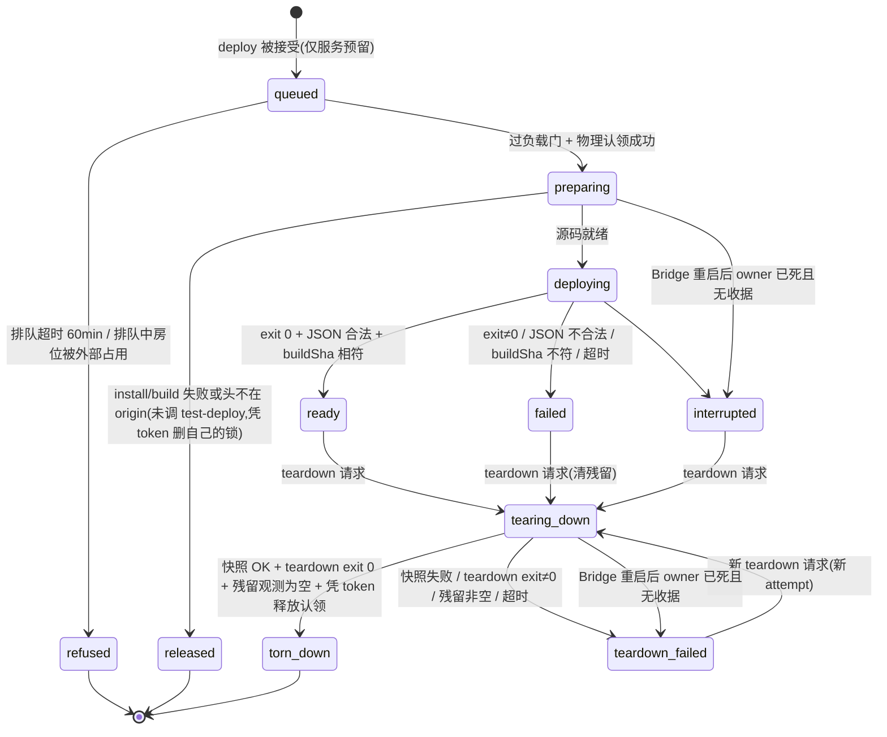
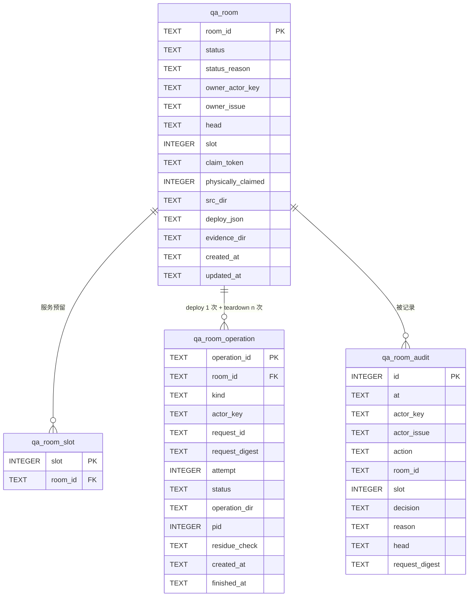

# FLY-2405 起房服务 — 实施计划
Issue: FLY-2405 (https://linear.app/geoforge3d/issue/FLY-2405/载体起房服务-codex-runner-在沙箱里起不了-529-测试房launchctl-bootstrap-eio-看不到沙箱外进程)
日期: 2026-09-26
基于: exploration.md、research.md(v2 增量 §10c / C8 的依据);§1–§19 首轮为 plan_only,R3 APPROVED
版本: v2(2026-09-26 重派:追加「服务代跑 529 generalized e2e driver」;v1 已批准正文除明确标注「v2」的段落外不改)

---

## 0. 一句话

Bridge(在沙箱外、由 launchd 起的常驻进程)新增一个**起房 / 拆房服务**:runner 用
`flywheel-comm room deploy|status|wait|teardown|list` 发一个**结构化请求**,Bridge 在沙箱外、用最小环境、
从「精确到 commit 的独立源码目录」跑 `test-deploy.sh` / `test-teardown.sh`,并负责房位归属、负载排队、
拆房前证据快照与审计。Codex 体和 Claude 体走同一条路。同时修掉两个已知拆房坑。
**v2:** 服务再多一个固定动作 `room drill`——在沙箱外代跑 `scripts/qa-529-generalized-e2e.mjs`,
因为该 driver 在 Codex 沙箱里既写不了 `~/.claude.json.lock`(pretrust),又会把沙箱外活进程误判为死(§10c)。

## 1. 审计结论(现状事实,均已读码核对)

| # | 事实 | 位置 |
|---|---|---|
| F1 | Codex runner 以 `workspace-write` Seatbelt 沙箱运行,`network_access=true`(所以能 POST 到 `127.0.0.1:9876` 的 Bridge 与 `127.0.0.1:198N` 的房内 Bridge);但 `launchctl bootstrap gui/501`、看沙箱外 `ps`、嵌套 `sandbox-exec` 都被拒 | `claude-runner/src/CodexTmuxAdapter.ts:1559-1567`、`codex-daemon-runtime.ts:527-541,640-643` |
| F2 | 房间 Lead 是 launchd 任务:`qa-launchd-lead.sh:837` `launchctl bootstrap <domain> <plist>`,label 形如 `com.flywheel.qa.lead.slot-<N>.<agent>`;生产 label 不含 `.qa.` | `scripts/lib/qa-launchd-lead.sh:17-27,837` |
| F3 | 房内 Bridge 跑的是**被调用的那份 `test-deploy.sh` 所在仓库**(`REPO_ROOT`)的代码;`--from-branch` 只决定 runner 沙箱 clone | `test-deploy.sh:19-20,1203-1228` |
| F4 | `--expect-head` 只在 `--generalized/--test-discipline` 下可用;plain 房只能靠 `/health.buildSha`(source 模式 = 源码目录 git HEAD)核版本 | `test-deploy.sh:283-315`;`teamlead/src/bridge/build-identity.ts:5-42` |
| F5 | 部署**不做** `pnpm install`,只在重建锁下 `pnpm --filter` 构建若干包;缺依赖 dist 时会失败 | `test-deploy.sh:513-602,529-534` |
| F6 | 部署 stdout 不纯:preflight 子 shell 的构建输出没重定向到 stderr,会落在最终 JSON 前面 | `test-deploy.sh:513-602` |
| F7 | 房位锁 = `mkdir /tmp/flywheel-test-slot-N.lock`;pid 文件态 `claiming` / BridgePID / `diagnostic-evidence-pending` / `cycle-failed`;锁在 preflight(构建)**之后**才取 | `test-deploy.sh:113-167,616` |
| F8 | 部署/拆房/qa 库里**没有负载门**;唯一负载门是 Bridge `RunnerAdmissionController`(load1/核 > 8.0 拒,18 核 = 144) | `teamlead/src/bridge/runner-admission.ts:191-330` |
| F9 | 拆房坑 A:`qa-reap-codex-slot-daemons.mjs` 的 `liveSockets()` 见到 `state/cdx-sock/*.sock` 是软链就直接抛 `socket authority contains a symlink`;codex ≥0.157 的 `--listen` socket **一律是软链**(指向 `/private/tmp/codex-daemon-<uid>/…`),死掉后变悬空软链 ⇒ 每个跑过真 Codex 的房拆房都被拒、保留房位(今天 slot 1、slot 4) | `scripts/lib/qa-reap-codex-slot-daemons.mjs:90-102`;`claude-runner/src/codex-daemon-runtime.ts:1415-1425` |
| F10 | 拆房坑 B:`.flywheel-qa-launch-started` marker 只要是普通文件就置 `runtime_started=1`;之后 `codex remote-control stop` 失败即 `failed=1`。marker 在 `launchctl bootstrap` **之前**写,bootstrap 失败(或上次拆房半途)留下的陈旧 marker 会让「根本没起来的运行时」被判成已启动 ⇒ 拆房失败、保留房位 | `test-deploy.sh:1894-1895`;`scripts/lib/qa-launchd-lead.sh:1369-1415` |
| F11 | 拆房 `rm -rf SLOT_DIR` 会删光 bridge.log、teamlead.db、房内 CommDB;只归档 kill-ledger 等少量证据;不存在「拆房前导 DB」钩子。拷 SQLite 必须 `VACUUM INTO`(裸 cp 丢 WAL) | `test-teardown.sh:695-769,1283`;记忆 FLY-2248 |
| F12 | runner→Bridge 认证只有两把全舰队 bearer:`TEAMLEAD_API_TOKEN`(Lead/master,已从 runner pane 剔除)与 `TEAMLEAD_INGEST_TOKEN`(runner 看到的 `FLYWHEEL_INGEST_TOKEN`)。调用者身份靠 body 里的 `execution_id` + `store.getSession()`;qa 节点另有 `submission_credential`,implement/design 节点基本没有 | `teamlead/src/bridge/plugin.ts:1460-1552,2712-2772`;`tmux-environment-scrub.ts:7-22`;CommDB `runner_workflow_activation` 实测 |
| F13 | 长任务先例:`fleet-console.spawnEngine` = spawn 前写 journal、`detached+unref`、日志落 0600 文件、owner sidecar、启动时 reconcile;Bridge 重启不杀任务 | `teamlead/src/bridge/fleet-console.ts:443-520` |
| F14 | 生产 Bridge 由 `com.flywheel.bridge` LaunchAgent 起,**不在沙箱里** | `scripts/launchd/com.flywheel.bridge.plist`、`scripts/flywheel-bridge-wrapper.sh` |
| F15 | runner 起房指引只在 `.flywheel/agents/nodes/qa.md:54-66`(注入 prompt)与 `edge-worker/src/Blueprint.ts:1989`(strength-two 证据提示「before `test-teardown.sh`」);其余是 `doc/qa/framework/*`、`packages/qa-framework/*` 文档 | 见路径 |
| F16 | `codex:rescue` 伴侣总是自起 `thread/start` 且只有 read-only/workspace-write 两档,无「不套沙箱」开关;Raya 529 harness 的 subject preflight 也无 skip 开关 | `~/.claude/plugins/cache/openai-codex/codex/1.0.0/scripts/codex-companion.mjs:383,460` |

## 2. 目标 / 非目标

**目标(本单交付)**

- G1 `flywheel-comm room deploy|status|wait|teardown|list` + Bridge 路由 `/api/qa-rooms*`;runner 只发请求,脚本在 Bridge 侧(沙箱外)执行。
- G2 护栏:房位归属(谁起谁拆;Lead 可代拆;同 issue 后继可接管已终止 owner 的房)、精确头核验、负载门排队(阈值 = 现有 admission 的 8.0/核 × 核数 = 本机 144)、拆房前自动 DB/日志快照、追加式审计;请求合同里**没有**任何 launchd label / 任意 env / 任意 argv 字段。
- G3 修拆房坑 A(悬空 / 合法软链 socket)与坑 B(陈旧 launch marker),顺带修 F6 stdout 不纯。
- G4 QA 规则与 runner 指引改为「要房就调起房服务」,Codex / Claude 一视同仁。
- G5 对 `codex:rescue` 与诊断类嵌套 codex 给出评估结论(§12),本单不实现。
- G7(v2 范围追加,Lead 2026-09-26 17:0xZ 重开):`flywheel-comm room drill` —— 服务在沙箱外代跑 529 generalized e2e driver(`--real` 含宿主 pretrust),结果与 strength-two 证据合同一一对应(§10c)。
- G6(范围追加,Linear 评论 1ae93545,来自 FLY-2910 QA@2):支持**带告警值守的房**——可选注入值守 token + dispatcher 身份 + 值守 Lead 身份映射到 slot Lead,使 `/duty/alert-board` 与 B 类工单帖能在整房里 E2E(§10b)。

**非目标**

- 不改 `test-deploy.sh` 的房间拓扑/参数语义;不改房内隔离边界规则(`isolation-boundary.ts` 的 `outside_root` 是 Lead 明令保持的房内行为,见记忆 FLY-2903)。
- 不给 runner 任何生产 launchd 操作;不提供「在房里执行任意命令」「restart drill 的 `launchctl kickstart`」这类动作(列入 follow-up)。
- 不做自动回收孤儿房(只在 `list` 标记,留 follow-up)。
- 不把 `codex:rescue` / 嵌套 codex 搬到服务里。
- (v2)不开放任意 driver / 任意 argv;不改 driver 与 `runner-workspace-trust.sh` 代码;不放宽 Codex 沙箱可写根。

## 3. 总体设计

```mermaid
sequenceDiagram
    autonumber
    participant R as Runner(沙箱内 Codex/Claude)
    participant C as flywheel-comm room
    participant B as 生产 Bridge(沙箱外)
    participant DB as StateStore(qa_room*)
    participant J as 受信包装器 qa-room-job.sh
    participant S as 房源码目录 src/<room_id>
    R->>C: room deploy --head <sha> [...]
    C->>B: POST /api/qa-rooms (ingest bearer + exec_id + request_id)
    B->>B: 校验合同 / 身份 / 头在 origin 上
    B->>DB: 写 room(queued) + deploy 操作 + 审计 + 服务预留房位
    B-->>C: 202 {room_id, operation_id, status: queued}
    loop 每 5s 调度 tick
        B->>B: 负载门 load1 < 144 且无其他 deploy 在跑?
    end
    B->>B: 物理认领:mkdir 锁目录 + 写 service-claim(room_id+claim token)
    B->>J: spawn detached,最小环境(prepare+deploy 同一操作)
    J->>J: 先写 owner sidecar(operation_id, pid, lstart)
    J->>S: git worktree add --detach <sha>; pnpm install; pnpm -r build
    J->>S: FLYWHEEL_QA_ROOM_CLAIM=<token> bash scripts/test-deploy.sh <slot> [白名单参数]
    J-->>B: 写本操作的 receipt.json
    B->>B: 解析房 JSON;GET 房 /health 核 buildSha == sha
    B->>DB: room -> ready (存房 JSON)
    C-->>R: 轮询 GET /api/qa-rooms/:id → ready + 房 JSON
    R->>R: 在房里做真验证(HTTP 到 127.0.0.1:198N、读房内 DB 等)
    R->>C: room teardown --room <id>
    C->>B: POST /api/qa-rooms/:id/teardown (新 request_id)
    B->>J: spawn detached,新 teardown 操作(attempt n)
    J->>J: 快照:VACUUM INTO 必需库 + 发现库 + 拷日志 → staging → 原子发布
    J->>S: FLYWHEEL_QA_ROOM_CLAIM=<token> bash scripts/test-teardown.sh <slot>
    B->>B: 沙箱外残留观测(锁目录 / SLOT_DIR / launchd label / 进程)
    B->>DB: room -> torn_down,释放预留,删除 src/<room_id>
```

### 3.1 状态机



**两层占位,口径统一:**
- **服务预留**(`qa_room_slot` 行):`queued` 起就有,防同实例内两个请求抢同一房位。
- **物理认领**(锁目录 + `service-claim` 文件,§6.1):`preparing` 起才有;只有持有物理认领的房才可能调按 slot 拆房的脚本。
- `refused` / `released`:从未调用 test-deploy、物理认领(若有)已凭 token 自己删除 ⇒ 终态,不能 teardown(只做作业/源码清理)。
- `failed / interrupted / teardown_failed`:**保留**预留与物理认领(fail-closed,保留诊断现场),只能通过 teardown 离开;每次 teardown 前脚本都会核对认领 token(§6.1),房位已被别人占则拒绝,绝不按 slot 误拆。

## 4. 身份与授权

**威胁模型(诚实):** 所有 runner 与 Bridge 同一 macOS 用户;Claude runner 根本不在沙箱里,Codex runner 能读 CommDB、能写 `~/.flywheel`。
所以本服务的护栏针对的是**「好意但会犯错 / 被旧指令驱动」的 runner**(拆错房、在高负载时起房、带错头),
**不是**对抗恶意 runner 的安全边界。这与今天「Lead 手工代起」的信任根相同,不更宽。

| 调用者 | 如何认定 | 可做 |
|---|---|---|
| runner | `Authorization: Bearer <FLYWHEEL_INGEST_TOKEN>` + body `execution_id`;Bridge 查 `store.getSession(execution_id)` 必须存在且**非终态**;资格:`session_role === "qa"` 或当前 workflow activation 的 node 类型 ∈ {`qa`,`implement`};若该 activation 带 `submission_credential`,则 body 必须携带且 `credential.execution_id === execution_id`(沿用 evidence-run 的校验函数,防过期 attempt) | deploy(owner=自己)、status/wait/list(只看自己 issue 的房)、teardown(见下) |
| Lead | `Authorization: Bearer <TEAMLEAD_API_TOKEN>`(runner pane 已剔除此变量,F12) | 全部动作、任何房 |

**actor_key(非空):** runner 编码为 `runner:<execution_id>`;Lead 编码为 `lead:<lead_id>`,`lead_id` 取自请求头 `X-Flywheel-Lead-Id`(CLI 从 Lead 环境 `FLYWHEEL_LEAD_ID` 读,缺失即 400)。幂等、审计、「每 actor 一个非终态房」都按它算。

所有路由 `rejectNonLoopback`(复用 `workflow-decision-routes.ts:459`)。

**teardown 授权(按顺序判):**
1. Lead → 允许(审计 `actor=lead`)。
2. 调用者 `actor_key === room.owner_actor_key` → 允许。
3. owner session 已终态 **且** 调用者 session 的 `issue_identifier === room.owner_issue` → 允许,审计记 `takeover_from=<旧 actor_key>`(QA 返工 attempt 换了 exec id 时不用麻烦 Lead)。
4. 其他 → `403 room_not_owned`,写审计 `refused`。

## 5. 请求合同(严格 schema,未知字段一律拒)

`POST /api/qa-rooms` body:

| 字段 | 类型 / 约束 | 映射到 test-deploy |
|---|---|---|
| `execution_id` | UUID;runner 必填,Lead 不传 | — |
| `request_id` | UUID,客户端生成 | — |
| `credential` | 可选字符串(见 §4) | — |
| `head` | 必填,40 位小写 hex;**选择 Bridge / Lead 跑的源码** | 源码目录 = 该 commit;generalized/test-discipline 时另传 `--expect-head` |
| `slot` | `"auto"` 或 1..N(N = `test-slots.json` 条数) | 位置参数 |
| `mode` | `slot`\|`mirror`\|`roundtable`,默认 `slot` | `--mode` |
| `from_branch` | 默认 `main`;`^[A-Za-z0-9._/-]{1,200}$` 且不含 `..`;**只选择 sandbox 仓(`flywheel-qa-sandbox`)里 runner 用的 fixture 分支,与 `head` 无关**;非 main 须调用方事先推到 sandbox remote(服务不代推) | `--from-branch` |
| `generalized` / `test_discipline` / `codex_runner` / `stub_runner` / `no_lead` / `alerts` / `codex_home_reconcile` | bool | 对应 flag;服务按 test-deploy 的组合约束先复核,再交给脚本兜底 |
| `extra_leads` | `[{slot:int, label:^[A-Za-z0-9._-]{1,40}$}]`,≤4 | `--extra-lead s:label` |
| `lead_label` | 同上字符集 | `--lead-label` |
| `lead_ready_timeout_sec` / `lead_channel_timeout_sec` | 1..3600 | 对应 flag |
| `digest_channel` | 17–20 位数字 | `--digest` |
| `alert_duty` | bool,要求 `alerts=true` | `--alert-duty`(新,§10b) |
| `env` | 仅允许键:`TEST_REPLY_BY_ISSUE ∈ {0,1}`、`TEST_BRIDGE_DEPT_SCOPE_REJECT ∈ {on,off}`、`TEST_CODEX_LEAD_OUTBOUND_MODE ∈ {direct,bridge}` | 注入包装器环境 |

`POST /api/qa-rooms/:id/teardown` body:`{execution_id?, request_id, credential?, skip_snapshot?: bool, reason?: string(1..200)}`;`skip_snapshot=true` 时 `reason` **必填**,否则禁止出现。

显式拒绝(`400` + 审计 `refused`):未知字段;任意字符串值里出现 `com.flywheel.` 而不含 `.qa.`(`production_target_refused`);`slot`/`extra_leads.slot` 越界;`voice_fixture`、`TEST_API_TOKEN`、`TEST_INGEST_TOKEN`、`TEST_LEAD_CLAUDE_CONFIG_DIR` 等本版不开放项(`field_not_supported`)。

**幂等:** 每个变更请求落一行 `qa_room_operation`,`UNIQUE(actor_key, request_id)`(两列均 `NOT NULL`)。同 key 同 `request_digest`(规范化 payload 去掉 credential 后的 sha256)⇒ 返回原 operation(传输重试不会再占房位);同 key 不同 digest ⇒ `409 request_conflict`。业务重试(比如拆房失败后再拆)用**新** `request_id`,产生新 attempt。

**argv 由服务端从已校验字段拼成数组**(`spawn` 不经 shell 解释),永远不会出现请求原文拼接。

## 6. 房位、并发、负载门

### 6.1 物理认领合同(服务 ↔ 脚本)

- 进入 `preparing` 时,Bridge 对主房位与所有 extra-lead 房位按升序原子地 `mkdir /tmp/flywheel-test-slot-<n>.lock`,写 `pid=claiming` 与 `service-claim`(内容 `room_id` + 随机 `claim_token`,0600);任一 mkdir 失败 ⇒ 回滚已建的(只删带自己 token 的)并 `refused(slot_taken_while_queued)`。
- 包装器以 `FLYWHEEL_QA_ROOM_CLAIM=<claim_token>` 调脚本。脚本改动(C1):
  - `test-deploy.sh claim_slot()` 与 `qa_multilead_claim_set`:锁目录存在且 `service-claim` 的 token == `FLYWHEEL_QA_ROOM_CLAIM` ⇒ **收养**(视为已认领);
  - 锁目录带 `service-claim` 但 token 不匹配(或调用方没给 token)⇒ **一律不自动回收**(不走 `claiming>300s` / 死 PID 回收分支),返回占用;
  - `test-teardown.sh`:若设置了 `FLYWHEEL_QA_ROOM_CLAIM`,在**任何**破坏性步骤前核对主房位与 campaign 借位锁的 `service-claim` token,不符 ⇒ exit 1 `claim_mismatch`,什么都不动;
  - **失败清理不得删认领(自检补)**:`test-deploy.sh` 现有 `cleanup_on_failure` trap 与约 15 处早退路径直接 `rm -rf /tmp/flywheel-test-slot-N.lock`(`test-deploy.sh:697-887,1084-1151`)。改为统一调用新 helper `qa_release_slot_lock <lockdir>`:若 `FLYWHEEL_QA_ROOM_CLAIM` 已设且该锁 `service-claim` token 相符 ⇒ **保留锁目录**(把 `pid` 改写为 `service-failed`,log 一行),否则按原逻辑删除。这样服务侧 `failed` 房一定仍持有物理认领,后续 token 核对的 teardown 能清残留。
  - **回滚不删收养锁(自检补)**:`qa_multilead_claim_set` 失败回滚现在对本次认领的所有锁 `rm -rf`(`qa-multilead.sh:462-489`);改为只删「本次调用新 mkdir 的」,收养的锁原样保留。
  - **拆房不自己放锁(R2 #1)**:`test-teardown.sh` 在设置了 `FLYWHEEL_QA_ROOM_CLAIM` 时,**跳过** `qa_multilead_release_borrowed_locks`(`test-teardown.sh:900`)与末尾主锁 `rm -rf`(`:1302`),改为把主锁与所有借位锁的 `pid` 改写为 `service-cleaned`;锁目录与 `service-claim` 原样保留。于是 teardown 任意一步失败、或脚本成功但收据没写成,重试时 token 核对仍然成立;test-teardown 在「已清理过的房位」上再跑一次是幂等的(各步骤对缺失对象本就 best-effort 跳过,C1 加用例钉住)。
  - **释放由 Bridge 在残留观测之后做**:teardown 脚本 exit 0 → 在仍持有全部认领时做 §7.4 残留观测(观测范围 = 本房主位 + 借位,这些房位此刻仍属于本房,不会把别人的新房算成残留)→ 事务写 `qa_room.release_state='releasing'` → 对每个锁「读 `service-claim`,token 相符才 `rm -rf`,不存在视为已释放,token 不符则停下记 `release_conflict`」→ 事务写 `torn_down`、删 `qa_room_slot` 行。Bridge 在 `releasing` 中途崩溃,重启后幂等重做这一段即可;任何阶段都不会去碰带外国 token 的锁。
  - `service-failed` / `service-cleaned` 与 `diagnostic-evidence-pending` / `cycle-failed` 同级:任何自动回收路径都不碰。
  - 未设置该 env(Lead 手工路径)行为不变。
- 服务从不在请求 slot 上看到「锁目录已存在」时继续:`queued` 受理时检查一次、认领时 mkdir 原子判定一次。
- `released` 路径:prepare 失败时 test-deploy 未被调用,Bridge 核对 `service-claim` token 相符后删除自己建的锁目录,再释放预留。

### 6.2 自动选位、并发、负载门

- `slot=auto`:从 1..N 升序挑第一个「不在 `qa_room_slot` 中且锁目录不存在」的(mode=mirror 限 1..3)。
- 并发:同一时刻最多 1 个 `preparing|deploying` 操作;最多 1 个 teardown 操作;每个 runner actor 最多 1 个非终态房。
- 负载门:调度 tick(5s)对队首 deploy 计算 `load1` 与阈值(`FLYWHEEL_RUNNER_LOAD_PER_CORE` 默认 8.0 × `os.cpus().length`,本机 = 144,与 `RunnerAdmissionController` 同一旋钮);**`load1 >= 阈值` ⇒ 保持排队**(注意 admission 自己用的是 `>`,本服务按 issue 用 `>=`,测试覆盖等于阈值的边界)。`status` 返回 `queue_reason=load_pressure, load1, threshold`。排队超 60 min ⇒ `refused(load_gate_timeout)`。**teardown 不过负载门**。
- 墙钟上限:deploy 操作(prepare+deploy)45 min、teardown 15 min;超时 ⇒ 对操作进程组 SIGTERM,10s 后 SIGKILL,状态 `failed(timeout)` / `teardown_failed(timeout)`。

## 7. 作业执行

### 7.1 受信包装器 `scripts/lib/qa-room-job.sh`

- 从**运行本服务的 Bridge 自己的 checkout**(生产 = main 上已合入代码)执行;被测代码只经它在房源码目录里调用 `test-deploy.sh` / `test-teardown.sh`。
- 子命令:`deploy <operation_dir> <sha> <src_dir> <bridge_repo_root> -- <argv...>`(内部顺序 prepare → deploy)、`teardown <operation_dir> <src_dir> <slot> <evidence_root> [--skip-snapshot]`。
- 每个**操作**一个目录 `~/.flywheel/state/qa-rooms/<room_id>/ops/<operation_id>/`(0700):
  1. 包装器**第一件事**原子写 `owner.json`(`operation_id`、自身 pid、`ps -o lstart=` 起始时间),写不成立即 exit 97,不做任何副作用;
  2. `stdout`、`stderr`、`phase`(`prepare|deploy|snapshot|teardown`,每进一阶段覆写);
  3. 结束时原子写 `receipt.json` = `{operation_id, phase_reached, exit_code, finished_at}`(临时文件 + `mv`)。
- Bridge 只接受 `receipt.operation_id == 当前操作 id` 的收据;旧 attempt 的目录原样保留作历史,不参与判定。

### 7.2 源码目录(精确头,每房独立)

- 位置 `~/.flywheel/state/qa-rooms/<room_id>/src/`,**每房独立**,不跨房/跨 Bridge 实例共享(房中房、多实例都不会互删);房 `torn_down` 或 `released` 后 `git worktree remove --force` + `git worktree prune`。
- `git -C <bridgeRepoRoot> worktree add --detach <dir> <sha>`(`bridgeRepoRoot` = 运行本服务的 Bridge 自己的 checkout,其 `origin` 是 flywheel 主仓;**不是**项目 projectRoot)。
- prepare:`git fetch origin --prune` → `git branch -r --contains <sha>` 非空(**头必须已推到 origin**,否则 `released(head_not_on_origin)`)→ worktree add → `pnpm install --frozen-lockfile --prefer-offline` → `pnpm -r build`。这就是 issue 要求的「先 pnpm install + build 防旧 dist」:源码目录永远是该 sha 的干净检出。
- 为什么不用 runner 的工作树:runner 可能边测边改、dist 可能陈旧、接管/房中房场景下「谁的工作树」不唯一;独立检出让「房里跑的就是这个 sha」成为结构性保证,也让 teardown 用与 deploy 配对的同一份脚本。

### 7.3 最小环境

包装器以 `spawn("/bin/bash", [...], {detached:true, env:<allowlist>})` 启动(Node 侧构造 env 对象,等价 `env -i`):
`HOME`、`USER`、`LOGNAME`、`SHELL=/bin/bash`、`LANG=en_US.UTF-8`、`LC_ALL=en_US.UTF-8`(记忆:launchd 无 LANG 时 tmux 输出被清洗)、`TMPDIR=/tmp/`(记忆:runner TMPDIR 陷阱)、
`PATH` = Bridge 启动时解析出的 `node`/`pnpm`/`git`/`jq`/`tmux`/`python3`/`gh`/`sqlite3` 所在目录 + `/usr/bin:/bin:/usr/sbin:/sbin`,
`FLYWHEEL_QA_ROOM_ID`、`FLYWHEEL_QA_ROOM_CLAIM`,以及 §5 白名单里的 `TEST_*`。
**不传**任何 `TEAMLEAD_*` / 其他 `FLYWHEEL_*` / Discord / Codex / 生产 token;`test-deploy.sh` 自己会 `source ~/.flywheel/.env` 取 `TEST_BOT_TOKEN_N`、`LINEAR_API_KEY`,与今天手工起房一致。

### 7.4 结果判定

- deploy 操作:`receipt.exit_code == 0 && phase_reached == deploy` → 解析 stdout(容忍前置噪声:取最后一个以 `{` 开头的行到结尾 `JSON.parse`;必须含 `slot, port, bridgeUrl, slotDir, projectName`)→ `GET http://127.0.0.1:<port>/health` 且 `buildSha === head`(generalized 另要求 `buildMode=built` 且 `artifactBuildSha === head`)→ `ready`。`phase_reached == prepare` 且非 0 → `released(prepare_failed)`(§6.1 释放);`deploy` 阶段非 0 或核验不过 → `failed(<reason>)`。
- teardown 操作:`exit_code == 0` 后,Bridge 在沙箱外做**残留观测**:主/借位锁目录**仍在**且 `pid=service-cleaned`、`service-claim` 为本房 token(释放在观测之后,见 §6.1)、各房位 `SLOT_DIR` 不存在、`launchctl list` 无 `com.flywheel.qa.lead.slot-<n>.` 前缀的 label、`ps -axo pid,command` 无引用 `SLOT_DIR` 的进程;结果写入操作记录 `residue_check`,非空 ⇒ `teardown_failed(residue)`。runner 用 `room status` 读到的就是这份沙箱外观测(沙箱内 `ps` 本就看不全)。
- 房 JSON 里的 token 文件路径原样返回路径、不返回内容(房内 token 本就是 0600 文件,与今天一致)。
- `log_tail`:只取 stderr 里以 `[test-deploy]` / `[test-teardown]` / `[qa-room-job]` 开头的行(这些 `log()` 行遵守不打印 token 的约定,FLY-1189),最多 40 行 / 8KB。

### 7.5 Bridge 重启 / 崩溃恢复(确切顺序)

0. 受理时写 operation `status=queued` + 预生成 `claim_token`;过负载门后先 mkdir 物理认领 → 1. 事务里写 operation 行 `status=spawning`(含 `operation_dir`)与 `physically_claimed=1` → 2. spawn → 3. 事务里写 `status=running, pid`;若第 3 步写库失败 ⇒ 立刻 `kill(-pid)` 整个进程组,操作记为 `failed(spawn_record_failed)`。
- 启动 reconcile 先处理 `queued` 操作(R2 #2):**不**套运行中恢复规则,保持排队、沿用原 `queued_at` 期限;若发现锁目录已带本房 `claim_token`(认领 mkdir 成功后、写库前崩溃;token 在受理时就生成并落库),则收养为已认领再按正常流程 spawn——同一 operation 只认领一次。`qa_room.release_state='releasing'` 的房重做 §6.1 的释放段。
- 启动 reconcile 每个 `spawning|running` 操作,按序判:
  1. 当前操作目录有 `receipt.json` 且 `operation_id` 相符 ⇒ 按 §7.4 定案;
  2. 有 `owner.json` 且其 pid 活着、`lstart` 相符 ⇒ 视为仍在跑,由 tick 继续轮询(不重复 spawn);
  3. 其余(含 `spawning` 且没有 `owner.json`:父进程在 spawn 前后崩溃)⇒ 若 `owner.json` 缺失且无任何同 `operation_id` 进程,deploy 操作记 `interrupted`、teardown 操作记 `teardown_failed(interrupted)`;两者都**保留**物理认领,只能再发 teardown。
- 对照 `fleet-console.ts:504-525,670-676` 的同型协议(子进程自报 owner、父进程落库失败杀组、恢复优先尊重活 owner)。

## 8. 拆房前证据快照(钩子)

包装器 `teardown` 在调用 `test-teardown.sh` 之前:
1. **必需库清单**(从房 JSON 坐标得出,不靠目录深度):`<slotDir>/teamlead.db`、`<slotDir>/state/comm/<projectName>/comm.db`;extra-lead / campaign 有独立库时按 `campaign-manifest.json` 追加。
2. **补充发现**:`find <slotDir> -name '*.db' -not -path '*/project-slot-*' -not -path '*/node_modules/*'`(不设深度上限,排除 runner clone 与依赖目录)。
3. 每个库 `sqlite3 <db> "VACUUM INTO '<staging>/<相对路径>'"`,再对快照 `PRAGMA quick_check` + 表数 > 0;对必需库另断言 `sessions` 表(teamlead)/`sessions` 与 `mailbox` 表(comm)存在(不断言非空——空房是合法的)。
4. 拷 `bridge.log`、Lead 日志、`launch-manifest.json`、`campaign-manifest.json`、`launchd-leads.json`、房 JSON(去掉 token 值);排除任何 token 文件。**(v2)** 另拷 `<slotDir>/e2e-evidence/`(driver 证据,§10c)。
5. staging = `~/.flywheel/qa-evidence/rooms/<room_id>/<operation_id>.partial/`;全部成功后写 `manifest.json`(`expected`/`exported`/`missing` 三栏,文件大小、sha256、源路径)并 `mv` 为 `<operation_id>/`;每次 attempt 独立目录,旧快照保留,**不会**因目标已存在而失败。
6. 必需库任一 `missing` 或导出失败 ⇒ **不执行** teardown,`teardown_failed(snapshot_failed)`;owner 可带 `skip_snapshot=true` + `reason` 重试(审计)。
7. 保留 14 天:每次 teardown 成功后顺手删 mtime > 14 天的 `rooms/*`。

teardown 结果与 `status` 返回 `evidence_dir`(最新成功 attempt 的目录),runner 在沙箱内只读访问。

## 9. 审计

`qa_room_audit`(追加式,`BEFORE UPDATE/DELETE … RAISE(ABORT)` 触发器,沿用 `strength_two_evidence_record` 写法):
`id, at, actor_key, actor_issue, action(deploy|teardown), room_id, slot, decision(accepted|refused|completed|failed), reason, head, request_digest(规范化 JSON 的 sha256,去掉 credential)`。
所有**变更类**请求(受理 / 拒绝)与所有终态迁移都写一行;`status/list/wait` 只读不写。

## 10. 拆房坑修复

**坑 A(F9)— `qa-reap-codex-slot-daemons.mjs` `liveSockets()`:**
- `.sock` 是软链时:`readlink` 目标 → 若 `realpath` 失败(ENOENT = 悬空)⇒ 视为**已死**,`unlink` 该软链并继续;
- 若目标存在且 canonical 路径位于 `/private/tmp/codex-daemon-<uid>/` 之下(codex ≥0.157 的固定布局,与 `codex-daemon-runtime.ts:1415-1425` 一致)⇒ 按普通 socket 探活,活着就计入 residual(交给上面的 per-execution reap 结果判);
- 其他目标 ⇒ 仍抛错(fail-closed)。
- **不**改 `isolation-boundary.ts`(房内 Bridge 侧 reap 被 `outside_root` 拒是 Lead 明令保持的行为);服务起的 teardown 在最小环境下 `FLYWHEEL_ISOLATION_ROOT` 未设,走生产语义 reap,与今天从干净 shell 手工拆房一致。

**坑 B(F10)— `qa_launchd_stop_codex_entry`:**
- marker 不再单独置 `runtime_started=1`;改为置 `launch_attempted=1`。
- `runtime_started` 只由真实证据置位:launchd/pid 文件里的活 pid、daemon pid 文件、control socket(原逻辑保留)。
- `codex remote-control stop` 失败只在 `runtime_started=1` 时计 `failed`(原逻辑)。
- home-residue 普查在 `runtime_started=1 || launch_attempted=1` 时都跑(保住「有逃逸进程就不退役 home」的安全性);marker-only 且普查为空 ⇒ 正常退役 home。

**F6 — `test-deploy.sh` stdout 纯化:** preflight 构建子 shell 的 stdout 重定向到 stderr(`>&2`),让 stdout 只剩最终 JSON。服务端解析仍容忍前置噪声(旧 head 的房也能用)。

## 10b. 带告警值守的房(G6)

**现状(读码核对):** 房里起不了告警值守的四个结构性原因——
1. 值守 Lead id 写死:TS 3 处(`infra-event-router.ts:110 ALERT_DUTY_LEAD_ID`、`infra-alert-mailbox.ts:3 INFRA_ALERT_OWNER_LEAD_ID`、`alert-duty-seat.ts:2 ALERT_DUTY_SEAT.leadId`)+ shell 3 处(`packages/teamlead/scripts/lead-body.sh:184`、`claude-lead.sh:2504-2509`、`scripts/flywheel-lead-wrapper-v2.sh:457-458`),全是 `claude-infra-bot-lead`;slot Lead 叫 `flywheel-test-N` ⇒ `lead-inbox-runtime.ts:804-806` 抛 `unknown infra alert owner`。无任何覆盖入口。
2. 值守 token:`FLYWHEEL_ALERT_DUTY_TOKEN`(`config.ts:155-171`,不得等于 API/ingest token)房里从不设置,且被 `test-deploy.sh:905-930` 的通配清洗剥掉 ⇒ `/duty/*` 503。
3. dispatcher:`FLYWHEEL_ALERT_SENDER_TOKEN_ENV`(存的是**变量名**)在 `qa-generalized.sh:13` 清洗名单里,`qa-generalized-bridge-wrapper.sh:10` 发现非空会**直接让 Bridge 启动失败**。
4. 收件:B 类帖要进 Lead,需要 slot 的 `access.json` 有告警频道组、`requireMention:false`、dispatcher bot id 在 `allowBots`(`apply-alert-duty-gate.sh:56-60` 只改已存在的组);现在 `test-deploy.sh:1363-1371` 只写 chat/roundtable 组。

**设计(新 flag `--alert-duty`,必须同时 `--alerts`;服务字段 `alert_duty`):**
- **值守 Lead id 单一来源**:新增 `resolveAlertDutyLeadId(env)`(放在 `alert-duty-seat.ts`),返回 `FLYWHEEL_ALERT_DUTY_LEAD_ID`——**仅当 `FLYWHEEL_ISOLATION_ROOT` 已设(即房内)才采信**,否则恒为 `claude-infra-bot-lead`(生产拼错变量也改不了路由)。TS 三处常量改为调用它;shell 三处守卫改为读同一变量、同样只在隔离根存在时采信。房注入 `FLYWHEEL_ALERT_DUTY_LEAD_ID=<slot Lead agentId>`。
- **环境逐层传递(R2 #3)**:值守 Lead 的第一层守卫在 `flywheel-lead-wrapper-v2.sh:427` 读的是 **wrapper 自己的环境**(来自 launchd plist),不是子进程环境。因此 `--alert-duty` 时 test-deploy 把四个变量同时写进:(a) 值守 slot Lead 的 **plist `EnvironmentVariables`**(`qa-launchd-lead.sh:193` 的 Claude 分支,wrapper 与其守卫直接可见);(b) 该 Lead 的 manifest `SERVER_ENV`(body 与 `lead-body.sh:184` 守卫可见);(c) `claude-lead.sh:2504-2509` 最终 `env -i` 围栏的放行名单同样以隔离根 + 覆盖 id 判定;(d) `lead-duty-provision.sh:42` 调 seat CLI 时显式传 `FLYWHEEL_BRIDGE_URL=<slot Bridge URL>`(否则回落 9876 生产 Bridge,顺带关闭 R2 advisory #6)。四个变量:`FLYWHEEL_ISOLATION_ROOT=<SLOT_DIR>`、`FLYWHEEL_ALERT_DUTY_LEAD_ID=<值守 slot Lead agentId>`、`FLYWHEEL_ALERT_DUTY_TOKEN`、`FLYWHEEL_BRIDGE_URL`。extra Lead 与非值守 Lead **不**写 token。v1 只支持 Claude Lead carrier 当值守 Lead;Codex Lead + `--alert-duty` ⇒ 部署拒绝(`alert_duty_requires_claude_lead`)。
- **值守 token**:每房随机生成(与 API/ingest token 不同),经 `BRIDGE_EXTRA_ENV` 注入 slot Bridge,并注入 slot Lead 环境(值守 seat 的 shell 守卫据上一条放行);在 `qa-slot-env-contract.json` 登记为 `clear`/`unchecked`,确保环境里残留的任何值先被剥掉。token 值写 `SLOT_DIR/alert-duty-token`(0600),房 JSON 只给路径。
- **dispatcher 身份**:只用**已登记的测试 bot**(R2 #4)。`test-slots.json` 的 `alertChannel` 新增可选 `dispatcherSlot`(整数,指向 `slots[]` 里的一个测试房位),默认取 `repairBotTokenEnv` 所对应的那个房位;校验全部在**取值、网络预检与注入之前**:
  1. 该房位必须存在于 `test-slots.json.slots[]`,其 `tokenEnvVar` 必须匹配 `^TEST_BOT_TOKEN_[0-9]+$`;任何其他名字(`CASS_BOT_TOKEN`、`FLYWHEEL_ALERT_DISPATCH_BOT_TOKEN`、`CLAUDE_INFRA_BOT_TOKEN` 等)一律拒绝(`dispatcher_not_test_bot`);
  2. 该房位不得是本房主位或任一 extra-lead 房位;
  3. 用该 token 调 Discord `/users/@me` 得到的 bot 用户 id 必须 == 该房位登记的 `botAppId`(实现时先实测这两者相等;不等则在 `test-slots.json` 补 `botUserId` 并改比它,仍 fail-closed),且 **≠** 本房所有 Lead bot 的实测 id(同一 bot 换了变量名也能挡住);
  4. 只有通过 1–3 的那个变量名才进入 generalized 豁免与 `BRIDGE_EXTRA_ENV` 注入;`clear` 合同只管环境残留,不再被当作注入白名单。房注入 `FLYWHEEL_ALERT_SENDER_TOKEN_ENV=<该测试变量名>` 与该变量的值;`qa-generalized.sh` 的清洗名单与包装器断言在 `--alert-duty` 时对**这一个名字**豁免(断言改为:要么为空,要么等于显式注入的测试名)。生产 `FLYWHEEL_ALERT_DISPATCH_BOT_TOKEN`、`CLAUDE_INFRA_BOT_TOKEN`、`CASS_BOT_TOKEN` 等一律不进房(通配清洗 + 合同 `clear`)。
- **收件**:`--alert-duty` 时在 slot Lead 的 `access.json` 追加告警频道组(`requireMention:false`,`allowBots` 含 dispatcher bot 的用户 id,部署时用该 token 调 Discord `/users/@me` 解析);复用 `--alerts` 已有的频道读写预检,把 dispatcher token 加进被探测列表。
- **前提(运维,非代码)**:记忆记录 slot 2/3/4 的 bot 对告警频道 GET 403;频道权限需 Lead 在 Discord 侧授予。部署预检失败会明确报 `alert_channel_forbidden`,不静默降级。

## 10c. (v2)服务代跑 529 generalized e2e driver(G7)

**为什么(依据见 research.md R1/R2):** `qa-529-generalized-e2e.mjs --real` 在 POST 前调 `runner-workspace-trust.sh pretrust-dual`,
要 `mkdir ~/.claude.json.lock` 并写 `~/.codex/config.toml`,Codex 沙箱可写根不含这两处 ⇒ 直接失败;
更隐蔽的是 driver 的 `processAlive()` 用 `kill(pid,0)`、吞掉异常当「死」,而 Codex Seatbelt 只放行 `signal (target same-sandbox)`,
沙箱内探房内 Bridge 起的活进程得 `EPERM`(本机已复现)⇒ 存活判断**静默判错**。所以只挪 pretrust 不够,整条 driver 要回到沙箱外。

**请求合同** `POST /api/qa-rooms/:id/drills`(严格 schema,未知字段拒,规则同 §5):

| 字段 | 约束 | 映射 |
|---|---|---|
| `execution_id` / `request_id` / `credential` | 同 §5 | — |
| `driver` | 枚举,v2 只有 `"qa529_generalized_e2e"` | 服务端固定为 `<房源码目录>/scripts/qa-529-generalized-e2e.mjs` |
| `issue` | `^[A-Z]+-\d+$` | `--issue` |
| `real` | bool,默认 false;true 要求房 deploy 时 `generalized=true` 且 `stub_runner=false`,false 要求 `generalized=true` 且 `stub_runner=true` | `--real`(⇔ strength-two lane `generalized_e2e_real` / `_stub`) |
| `timeout_ms` | 整数,10_000..3_600_000(与 `strength-two-contract.ts` 同界),默认 900_000;**这是 driver 的逐阶段等待预算**(每个 `waitFor` 各自重算期限,`qa-generalized-e2e-lib.mjs:39-54`),不是整次运行的总时长 | `--timeout-ms` |

slot 不在请求里:永远是该房主位(从房记录取)。argv 服务端拼数组、`spawn` 不经 shell。

**前置与授权:**
- 房 `status == ready` 且 deploy 请求 `generalized == true`,否则 `409 room_not_drillable`;
- **(R1 #2)配置必须可复现**:drill 只接受「现行 strength-two 证据合同能完整表达」的房配置——`from_branch == main`、`codex_runner == false`、deploy 请求的 `env` **恰好**为 `{TEST_REPLY_BY_ISSUE: "1"}`(R2:空 `env` 同样拒绝——部署在未设该变量时按 `${TEST_REPLY_BY_ISSUE:-0}` 不注入 reply 开关,而复跑配方固定以 1 部署,两者不是同一种房;服务**不**在 drill 时补环境或改配方)、`mode == slot`、不带 `alerts/alert_duty/no_lead/test_discipline/codex_home_reconcile`;`lead_label`、`extra_leads` 可带(合同 `deploy` 有这两项)。不满足 ⇒ `409 drill_config_not_reproducible`,响应列出冲突字段。理由:合同的 `deriveRerunArgv` 不输出 `--codex-runner` / `--from-branch`,`renderRerunCommand` 固定 `TEST_REPLY_BY_ISSUE=1`;在表达不了的房上 drill,runner 记下的复跑配方会默默换成另一种房(例如 Codex runner 房被复跑成 Claude runner 房)。扩展合同以覆盖 Codex runner 房列入 follow-up;
- 服务用 Bridge 自己(已合入代码)的 `validateRerunSpecV1` 从房的**有效配置**生成 `rerun_spec`(lane = `real ? generalized_e2e_real : generalized_e2e_stub`,`deploy = {leadLabel?, extraLeads?}`,`driver = {issue, timeoutMs}`),校验不过同样 `409 drill_config_not_reproducible`;runner 原样拿它当 `--rerun-spec`,不自己拼;
- 授权同 teardown(§4:Lead / owner / 同 issue 接管),否则 `403 room_not_owned`;
- 每房同时最多 1 个 drill(非终态 drill 存在 ⇒ `409 drill_in_progress`);
- drill **不**过服务负载门(`--real` 起的真 runner 由房内 Bridge 自己的 `RunnerAdmissionController` 按宿主 load 把关,不双重排队);
- 与拆房互斥:drill 进行中,runner 发 teardown ⇒ `409 drill_in_progress`;Lead teardown 可强制:先对 drill 进程组 SIGTERM→10s→SIGKILL、drill 记 `failed(cancelled_by_teardown)`,再照常拆。

**执行(包装器新子命令)** `qa-room-job.sh drill <operation_dir> <src_dir> <slot_dir> -- <argv...>`:
1. 同 §7.1:第一件事写 `owner.json`;`phase=drill`;
2. **已知写权限故障守卫**:`mkdir "$HOME/.flywheel-qa-room-probe.<operation_id>" && rmdir …`(即 pretrust 锁所在的 `$HOME` 根);失败 ⇒ exit 96,不跑 driver(`failed(sandboxed_executor)`)。这只是针对本次已知故障形状的守卫;「driver 在沙箱外执行」的依据仍是执行者来源——launchd 起的 Bridge 的子进程(F14)——不是这个探针,也不做通用沙箱检测;
3. 记下 `<slot_dir>/e2e-evidence/` 现有子目录清单,`cd <src_dir>` 以 §7.3 最小环境 + 房 deploy 时的 `env` 白名单值运行 driver(与 `renderRerunCommand` 的 `TMPDIR=/tmp/ TEST_REPLY_BY_ISSUE=…` 前缀同语义);不传 `GH_TOKEN`,`gh` 用宿主已登录状态(与 Lead 手工跑同源);
4. **先拷后拆**:无论 driver 退出码,把本次新出现的 `e2e-evidence/*` 目录 `cp -R` 到 `<operation_dir>/evidence/`,写 `evidence/manifest.json`(相对路径、大小、sha256);拷贝失败记 `evidence_copy=failed`;
5. 原子写 `receipt.json` = `{operation_id, phase_reached:"drill", exit_code:<driver 退出码>, evidence_copy:"ok|failed|empty", finished_at}`。

**总期限(R1 #1)**:driver 自己**没有**整次运行的总时长,`timeout_ms` 按阶段各算一次。服务另设一个**服务安全上限**(独立政策,不是 driver 超时):
`deadline_at = spawned_at + phase_bound × timeout_ms + 15 min`,其中 `phase_bound` = 包装器在 spawn 前对房源码目录里 driver 源码做静态计数 `grep -c 'await waitFor(' <driver>`(当前 = 15)再 +1(前次 run 收敛),计数为 0 或读不到 ⇒ 拒跑 `failed(driver_shape_unknown)`。
`phase_bound` 与 `deadline_at` 在 spawn 时写入 operation 行,**Bridge 重启不重置**;只有越过 `deadline_at` 才杀组记 `failed(service_deadline)`。默认 900_000ms 时上限约 4h15m;该值与复跑命令无关(直接复跑本就无总上限),`status` 里原样展示 `deadline_at` 与 `phase_bound`。CLI 的等待上限只决定何时以退出码 3 返回,**不影响**作业期限。

**判定(Bridge):**
- 有匹配收据 ⇒ drill 操作 `succeeded`(= driver 跑完了),`result_json = {driver_exit_code, outcome, evidence_copy, evidence_copy_dir, rerun_spec, log_tail}`;**`evidence_copy_dir` 只有在 `evidence_copy == "ok"` 时才非空**,`failed/empty` 时为 `null`(R1 #3:部分拷贝的目录存在也不代表完整);操作失败时另有 `reason`(`service_deadline / sandboxed_executor / interrupted / driver_shape_unknown / cancelled_by_teardown`),不依赖房状态表达原因;
  `outcome`:0 → `passed`;20(driver 内 `A3_DIAGNOSIS_EXIT`)→ `a3_diagnosis`;21(lib 导出 `STUB_FATAL_DIAGNOSIS_EXIT`)→ `stub_fatal_diagnosis`;其他 → `driver_failed`。Bridge **不** import 房源码目录里的被测代码(不在 Bridge 进程里执行未合入代码),映射表写在服务里,由 C8 的契约测试钉住它与 driver 源码(`A3_DIAGNOSIS_EXIT` 字面量、lib 导出常量)一致;`driver_exit_code` 始终原样返回,`outcome` 只是便利标签。
- 无收据 + 越过 `deadline_at` ⇒ 杀组,`failed(service_deadline)`;探针拒跑 ⇒ `failed(sandboxed_executor)`;Bridge 重启且 owner 已死无收据 ⇒ `failed(interrupted)`(§7.5 同协议)。
- drill 不改变 `qa_room.status`(房仍 `ready`,可再 drill 或 teardown);driver 失败是测试结论,不是房故障。
- `log_tail` 取 stdout 中 `[qa529]` 开头行 + stderr 末尾,最多 40 行 / 8KB(driver 不打印 token)。

**与 strength-two 证据合同的衔接:** 服务**不**代调 `evidence-run record`(record 绑定 runner 自己的 submission credential 与 QA attempt)。
runner 用 drill 结果里的 `driver_exit_code` → `--driver-exit-code`、`rerun_spec` → `--rerun-spec`(服务生成、已校验)、`evidence_copy_dir` → `--local-copy`(仅当 `evidence_copy == ok`;否则不得 record 为完整副本,应重跑 drill 或报 Lead)。

**CLI** `flywheel-comm room drill --room <uuid> --issue <FLY-N> [--real] [--timeout-ms N] [--request-id] [--wait|--no-wait] [--timeout-sec]`:
默认 `--wait`,等待上限默认 30 min(`--timeout-sec` 可调,1..1800),到点仍未结束退 3,并打印 `room wait --room <id> --operation <operation_id>` 供续等;退出码在 C5 的约定上**新增 4**:
0 = driver 跑完且退出 0;4 = driver 跑完但非 0(看输出里的 `driver_exit_code` / `outcome`);1 = 拒绝 / 服务侧失败(超时、中断、沙箱探针);2 = 传输失败;3 = 仍在进行。
`room status` / `wait` 对房输出增加 `drills: [{operation_id, status, reason, driver_exit_code, outcome, evidence_copy, evidence_copy_dir, rerun_spec, deadline_at}]`(最近 5 次);POST 回执同样带 `operation_id`。
**(R1 #4)续等绑定操作**:`room wait --room <id> --operation <operation_id>` 只看这一个操作(服务按 `operation_id` 直接查,不受「最近 5 次」限制),对它套 0/4/1/3 语义;该操作不属于此房 ⇒ 1 `operation_not_in_room`;房已 `torn_down` 而 drill 仍非终态不可能发生(拆房与 drill 互斥),若出现按 1 报 `inconsistent_state`。不带 `--operation` 的 `room wait` 行为不变(看房状态)。`room drill --wait` 内部即等自己 POST 得到的 `operation_id`。

**数据模型改动**(分支未合入、生产库无这些表 ⇒ 直接改 `CREATE TABLE`,无迁移):
`qa_room_operation.kind` CHECK 加 `'drill'`、新增列 `result_json TEXT`、`deadline_at TEXT`、`phase_bound INTEGER`;`qa_room_audit.action` CHECK 加 `'drill'`;
`UNIQUE(room_id,kind,attempt)` 保留(drill attempt 按房递增)。

## 11. QA 规则与 runner 指引(G4)

- `.flywheel/agents/nodes/qa.md:54-66`:把「自己跑 `scripts/test-deploy.sh`」改为「用 `flywheel-comm room deploy --head <candidate-sha> [...]` 起房,`room teardown --room <id>` 拆房;不论 Codex 还是 Claude 体」,并写明:`--head` 选择 Bridge / Lead 跑的 flywheel 源码(必须先 push 到 flywheel origin);`--from-branch` 只选 sandbox 仓里 runner 用的 fixture 分支,默认 `main`,非 main 须自己先推到 sandbox remote;`room wait` 在工具超时后续等;证据看 `evidence_dir`;不要在沙箱里直接调 `test-deploy.sh` / `launchctl`。
- (v2)`.flywheel/agents/nodes/qa.md` 同段追加:要跑 529 generalized e2e 一律 `flywheel-comm room drill --room <id> --issue <FLY-N> [--real]`,再用 `room status` 的 `driver_exit_code` / `evidence_copy_dir` 调 `evidence-run record`(先 record 再 qa-result);沙箱内**不要**直接 `node scripts/qa-529-generalized-e2e.mjs`(pretrust 会失败、存活探测会静默判错)。
- `edge-worker/src/Blueprint.ts:1989`:文本「before `test-teardown.sh`」→「before `flywheel-comm room teardown`」。
- 文档同步:`doc/qa/framework/529-room-playbook.md`、`real-runner-e2e-guide.md`、`packages/qa-framework/README.md`、`packages/qa-framework/agents/qa-parallel-executor.md` 加「首选起房服务;脚本直跑仅限 Lead / 沙箱外人工」一节(不删除脚本用法)。
- 新增子命令,不删改任何现有 CLI 子命令 ⇒ 不触发 FLY-1914 消费者 sweep 要求(PR body 注明)。

## 12. 第 5 条评估:`codex:rescue` 与诊断类嵌套 codex

结论:**不走本服务**,本单不实现,理由与去向:
- 这两类的本质是「在沙箱外执行一段任意的 Codex 会话」,等于给 runner 一个通用越狱口;起房服务之所以可控,恰恰因为动作集合是固定的两条脚本 + 严格 schema。
- `codex:rescue` 的用途(第二意见 / 复审)已有沙箱外正路:Bridge 自跑的 `request-review` / `gate review_code`(FLY-2379 当晚就是改走这条);建议 implement/engineer/general 节点文件里把「用 `codex:rescue`」改为「Codex 体用 `request-review`」——列为 follow-up,避免扩大本单。
- 529 harness 的 subject preflight(Raya 仓)与需要真嵌套 codex 的诊断:短期由 Claude 体承担(选项 C);长期可在本服务上加「房内白名单驱动脚本」动作(只允许房源码目录里固定路径的 driver,参数同样走 schema)——列为 follow-up。
- **(v2)** 上一条的「白名单 driver」动作已为 flywheel 仓的 `qa-529-generalized-e2e.mjs` 这**一个** driver 落地(§10c);其他 driver(Raya 仓 harness、restart drill)仍是 follow-up,加入时只需在服务端枚举里登记新值 + 对应 schema。

## 13. 数据模型



- `qa_room_operation.status ∈ {queued, spawning, running, succeeded, failed, refused}`(R2 #2):deploy 操作受理即 `queued`;只有物理认领成功、准备 spawn 时才转 `spawning`;排队超时 / 房位被占 ⇒ `refused`。teardown 操作不排负载门,受理即 `spawning`(仍受「最多 1 个 teardown」并发位约束,等位期间为 `queued`)。
- `qa_room.status` 用 `CHECK` 限定于 §3.1 的 11 个值(queued, refused, preparing, released, deploying, ready, failed, interrupted, tearing_down, torn_down, teardown_failed);`qa_room_operation` `UNIQUE(actor_key, request_id)`,`actor_key`/`request_id` 均 `NOT NULL`;`kind ∈ {deploy, teardown}`;`queued_at` 持久化,排队期限按它算(重启不重置)。`qa_room` 另有 `release_state ∈ {held, releasing, released}`。
- `claim_token` 只存 Bridge 本地 StateStore,不在任何 API 响应里返回。
- 迁移:新 `private migrateQaRoomTables()`,`CREATE TABLE/INDEX/TRIGGER IF NOT EXISTS`,从 `migrate()` 调用(`StateStore.ts:10351` 既有模式)。纯新增表,回滚无须降级。

## 14. 失败模式

| 场景 | 行为 |
|---|---|
| 排队中房位被手工 / 其他实例占用 | 认领 mkdir 失败 ⇒ `refused(slot_taken_while_queued)`,释放预留 |
| 头没 push 到 origin / install / build 失败 | `released(...)`:test-deploy 未调用,凭 token 删自己的锁,释放预留,删源码目录 |
| test-deploy exit≠0 / buildSha 不符 / JSON 不合法 | `failed(<reason>)`,**保留**预留 + 物理认领,提示 `room teardown` |
| 老 failed 房的房位后来被别人占(理论上不可能:认领不释放) | 仍防御:teardown 脚本核 `service-claim` token 不符 ⇒ `claim_mismatch`,零破坏 |
| Bridge 重启 / 崩溃 | §7.5 |
| 高负载 | `queued(load_pressure)`,60 min 后 `refused(load_gate_timeout)` |
| owner 已终态、房还在 | `list` 标 `owner_terminal=true`;同 issue 后继或 Lead 可拆 |
| 快照失败 | `teardown_failed(snapshot_failed)`,不拆;可带 reason 跳过 |
| 拆完仍有残留 | `teardown_failed(residue)`,附残留清单,可再拆或交 Lead |
| 释放认领时某锁已带外国 token | 该锁不删,房记 `teardown_failed(release_conflict)` 交 Lead;其余本房锁照常释放 |
| 服务关闭 | `503 room_service_disabled` |
| (v2)drill 执行者在沙箱内 | 探针失败 ⇒ `failed(sandboxed_executor)`,driver 不跑 |
| (v2)drill 中 runner 发 teardown | `409 drill_in_progress`;Lead 可强制(先杀 drill 组) |
| (v2)driver 跑完但证据拷贝失败 | drill `succeeded` + `evidence_copy=failed`,runner 不得拿它当 local copy;拆房快照另有一份 `e2e-evidence/` |

## 15. 开关与部署

- `FLYWHEEL_QA_ROOM_SERVICE`:`on|off`。默认:未设 `FLYWHEEL_ISOLATION_ROOT` 的 Bridge(生产)= on;房内 slot Bridge = off,除非显式 `on`。
- 房内开启通道(本单「房中房」验收用):`test-deploy.sh` 新增 `TEST_QA_ROOM_SERVICE=1` 知识点 → slot Bridge 环境放 `FLYWHEEL_QA_ROOM_SERVICE=on`;在 `lib/qa-slot-env-contract.json` 登记该键。房中房的内层房有自己的 `src/<room_id>` 与自己的认领 token,与外层互不影响(§7.2、§6.1)。
- 合并 ≠ 部署:随常规 updater 窗口上线,本单不重启任何服务。
- 回滚:生产 `.env` 设 `FLYWHEEL_QA_ROOM_SERVICE=off`(下次 Bridge 重启生效)或 revert PR;已起的房仍可用脚本手工拆(手工路径不带 `FLYWHEEL_QA_ROOM_CLAIM`,但带 `service-claim` 的锁不会被 test-deploy **自动**回收,只能显式 `test-teardown.sh <n>`,而手工 teardown 不带 env 时不做 token 核对 ⇒ Lead 手工拆可用);新表惰性保留。

## 16. 实施分块(chunks)

| Chunk | 内容 | 主要文件 | 测试 |
|---|---|---|---|
| C1 | 坑 A + 坑 B + F6 + §6.1 认领合同(收养 / 拒自动回收 / teardown token 核对) | `scripts/lib/qa-reap-codex-slot-daemons.mjs`、`scripts/lib/qa-launchd-lead.sh`、`scripts/test-deploy.sh`、`scripts/lib/qa-multilead.sh`、`scripts/test-teardown.sh` | 新增 `scripts/__tests__/fly2405-teardown-pits.test.sh`:悬空软链 → 通过并 unlink;合法目标活 socket → 计 residual;非法目标 → 仍拒;marker-only + 无进程 → 退役成功;marker + 活 pid → 原失败语义不变。新增 `fly2405-service-claim.test.sh`:token 相符收养;带 token 的 teardown 不删主锁/借位锁、改写 `service-cleaned`;借位清理后 reap 失败再试 token 核对仍通过;已清理房位上重跑 teardown 幂等;带 token 的 deploy 在早退 / trap 失败路径后锁目录仍在且 `pid=service-failed`;campaign 回滚只删新建锁、收养锁保留;token 不符 / 无 token 时 `claiming>300s` 与死 PID 分支都不回收;teardown token 不符零破坏;无 env 手工路径不变;campaign 借位同理。F6 用 stub pnpm 断言 stdout 纯 JSON。回归 `fly1663-qa-launchd.test.sh`、`test-deploy-generalized.test.sh` |
| C2 | StateStore 表 + 方法 | `packages/teamlead/src/StateStore.ts`(或新 `qa-room-store.ts` 由 StateStore 调用) | 迁移幂等;`qa_room_slot` PK 互斥;`UNIQUE(actor_key,request_id)` 对 Lead 无 exec 的真实约束;审计触发器拒改;状态 CHECK |
| C3 | 受信包装器 | `scripts/lib/qa-room-job.sh` | `scripts/__tests__/fly2405-room-job.test.sh`:stub git/pnpm/test-deploy;`owner.json` 先于副作用;收据带 operation_id 且原子;快照用真实目录层级(`state/comm/<p>/comm.db`)+ WAL 未 checkpoint 的已提交行 → 两库 rowset 都在;半快照后重试、快照成功后脚本失败再重试都能走通;token 文件排除;skip-snapshot |
| C4 | Bridge 服务 + 路由 | 新 `packages/teamlead/src/bridge/qa-room-service.ts`、`qa-room-routes.ts`;`plugin.ts` 挂载 + runner-tier 旁路 + 启动 reconcile | vitest:schema(未知字段 / 生产 label / 越界 slot 拒并审计)、授权四分支、幂等(同 digest 回原操作 / 异 digest 409)、auto slot、认领 mkdir 竞争、负载门(注入 loadavg,覆盖 `==阈值`)、并发上限、超时杀组、spawn 后落库失败杀组、reconcile(含第二次 teardown 中重启;高负载排队时重启 → 负载下降后同一 operation 执行且只认领一次;认领后写库前崩溃 → 收养;`releasing` 中途崩溃 → 幂等重做;释放时锁已被外国 token 占 → `release_conflict` 不删)、buildSha 不符、JSON 容错解析、残留观测非空 |
| C5 | CLI | `packages/flywheel-comm/src/commands/room.ts` + `index.ts` switch | 参数校验、`deploy/teardown` 默认 `--wait` 至多 30 min、`wait` 续等;退出码 0 = ready/torn_down,1 = 失败/拒绝,2 = 传输失败,3 = 仍在进行(打印 room_id,供工具超时后续等);重试沿用 evidence-run 的 3 次退避与脱敏;Lead 模式自动带 `X-Flywheel-Lead-Id` |
| C7 | 带告警值守的房(§10b) | `alert-duty-seat.ts`、`infra-event-router.ts`、`infra-alert-mailbox.ts`、`lead-inbox-runtime.ts`、`lead-body.sh`、`claude-lead.sh`、`flywheel-lead-wrapper-v2.sh`、`test-deploy.sh`、`qa-room.sh`、`qa-generalized.sh`、`qa-generalized-bridge-wrapper.sh`、`qa-slot-env-contract.json` | vitest:`resolveAlertDutyLeadId` 无隔离根时忽略覆盖、有隔离根时采信;shell:**不启动 launchd 的完整环境传递测试**(渲染 plist + manifest 后,用其环境逐层跑 wrapper-v2 守卫、`lead-body.sh` 守卫、`claude-lead.sh` 围栏、`lead-duty-provision.sh`(stub seat CLI 与 fetch,断言请求打到 slot URL))⇒ 值守 Lead seat=true 且 token 到达最终 pane 环境;extra / 非值守 Lead、以及无隔离根的「生产 + 普通覆盖」都拿不到 token;dispatcher 三类:指向生产变量名 → 拒,不同变量名同一 bot → 拒,合规且不同的测试 bot → 过;三处调用点走同一函数(grep 守卫测试:仓内不再有第二个 `claude-infra-bot-lead` 字面量常量用于路由)。shell:`--alert-duty` 无 `--alerts` 拒绝;dispatcher 与 slot bot 相同拒绝;access.json 追加组;生产 token 名不进房 env(env dump 断言);generalized 包装器仅豁免显式测试名 |
| C8(v2) | 服务代跑 driver(§10c) | `qa-room-job.sh` 加 `drill` 子命令;`qa-room-contract.ts`(drill schema + 可复现配置判定 + `rerun_spec` 生成)、`qa-room-runtime.ts`(drill 分支的 argv/env 构造与收据读取,避免落进 teardown 参数分支)、`qa-room-service.ts`(前置/授权/互斥/判定/总期限/重启恢复)、`qa-room-routes.ts`(`POST /api/qa-rooms/:id/drills`)、`qa-room-store.ts`(kind/action CHECK + `result_json`)、`flywheel-comm/src/commands/room.ts`(`drill` + 退出码 4 + status 的 `drills`);§8 快照加 `e2e-evidence/`;`qa.md` 指引 | shell `fly2405-room-job.test.sh` 追加:stub driver 各退出码(0/20/stub-fatal/1)→ 收据原样;`owner.json` 先于副作用;`$HOME` 根不可写(把 HOME 指向只读临时目录)⇒ exit 96 且 driver 未被调用;只拷本次新增的 `e2e-evidence` 子目录 + manifest sha256;拷贝失败 → `evidence_copy=failed`;argv 严格等于 `node <src>/scripts/qa-529-generalized-e2e.mjs <slot> --issue X [--real] --timeout-ms N`;环境 env dump 无 `GH_TOKEN`/`TEAMLEAD_*`。vitest:schema(未知字段、driver 非枚举、issue 格式、timeout 越界拒并审计);`real` 与房 deploy 的 stub_runner 组合不符 ⇒ 409;非 `ready` / 非 generalized 房 ⇒ 409;授权四分支;同房第二个 drill ⇒ 409;drill 中 runner teardown ⇒ 409、Lead teardown ⇒ 先杀 drill 再拆;outcome 映射 + 契约测试(映射表 == driver 的 `A3_DIAGNOSIS_EXIT` 与 lib 的 `STUB_FATAL_DIAGNOSIS_EXIT`);超时杀组;重启恢复三分支;drill 不改 `qa_room.status`;幂等(同 digest 回原操作)。总期限:连续多阶段各未超 `timeout_ms`、累计超过单阶段预算仍不被杀;越过 `deadline_at` 才杀;重启后 `deadline_at` 不重置;`phase_bound` 静态计数(driver 源码 fixture)与 0 计数拒跑。可复现配置:`codex_runner` / 非 main `from_branch` / `TEST_REPLY_BY_ISSUE=0` / **空 `env`(宿主 `.env` 未定义该变量)** / `alerts` 各自 ⇒ 409 `drill_config_not_reproducible`;合规房配置 → `rerun_spec` → `deriveRerunArgv`/`renderRerunCommand` 往返,断言复跑 argv 与房的有效部署参数一致(lead_label / extra_leads 覆盖),并比较**实际注入**的 reply/chat 开关(服务侧包装器环境构造 vs 复跑命令前缀)而不只比 argv 或 schema。证据:driver exit 0 + 部分拷贝失败 ⇒ `outcome=passed` 但 `evidence_copy=failed`、`evidence_copy_dir=null`,CLI 输出里可见。CLI:退出码 0/4/1/2/3;`room wait --operation` 绑定目标操作(后继 drill 先完成、目标不在最近 5 条、operation 属于别的房);`drills` 字段渲染 |
| C6 | 指引与文档 + 房内开关 | `.flywheel/agents/nodes/qa.md`、`Blueprint.ts:1989`、`doc/qa/framework/*`、`packages/qa-framework/*`、`scripts/lib/qa-slot-env-contract.json`、`test-deploy.sh` 知识点 | Blueprint 相关快照测试更新;env contract 测试 |

顺序:C1 → C2 → C3 → C4 → C5 → C7 → C8 → C6(v2 R1 #5 统一口径:代码块全部完成后最后写 C6 文档;C8 依赖 C3 的收据格式与 C4 的服务骨架;C7 与 C2–C5 无依赖、可提前);C7 与 C2–C5 无依赖,可在 C1 之后任意位置做(C4 依赖 C1 的认领合同与 C3 的收据格式)。

测试纪律:只跑相关测试(`pnpm --filter flywheel-teamlead exec vitest run <files>`、`pnpm --filter flywheel-comm exec vitest run <files>`、`bash scripts/__tests__/<file>`);**排除** `**/tmux-viewer.macos.test.ts`;任何调 `startBridge` 的 vitest 先 export 隔离 `FLYWHEEL_CODEX_HOMES_ROOT`(记忆 FLY-2877)。

## 17. 验收(QA 节点执行)

1. **房中房真沙箱验收**(合并前,在被测 head 上):
   - 外层房 N:用本分支起 `--generalized --codex-runner` 房,`TEST_QA_ROOM_SERVICE=1`;由 Claude QA 体(不在沙箱里)或 Lead 起,**也由起它的一方负责拆**——这是唯一需要沙箱外手工的一步,因为被测服务还没进生产。
   - 在房 N 内派一个**真 Codex runner**(真实 Seatbelt 沙箱),任务:`flywheel-comm room deploy --slot auto --head <head> --generalized --stub-runner`(generalized 会铸房 M 的 API token,供鉴权往返)起房 M → 在房 M 做一项真验证:`/health.buildSha == head` + 用 `roomInfo`/`apiTokenPath` 里的 token 对房 M Bridge 做一次鉴权 API 往返(如 `/api/runs/start` 起一个 stub run 并读到它的状态)→ `room teardown` → 读 `room status` 返回的**沙箱外残留观测**为空 + `evidence_dir` 快照 `manifest.json` 的 `missing` 为空。全程 Lead 零手工(房 N 除外)。
   - 同样再派一个 Claude runner 走一遍。
   - **(v2)** 房 M 用 `--generalized --stub-runner --env TEST_REPLY_BY_ISSUE=1` 起(drill 的可复现前提)时,沙箱内的 Codex runner 再跑 `flywheel-comm room drill --room <M> --issue <FLY-N>`,通过条件:`outcome == passed`(driver exit 0 = 1–9 步全过)、`evidence_copy == ok`、证据副本里 step 1–9 的记录文件齐全(不是只看 manifest 非空——driver 在写 owner 之后失败也会留下非空证据)、`rerun_spec` 能被 `evidence-run record` 接受;随后 runner 用这些字段真记一次 `evidence-run record`。额度允许时另起一间 `--generalized`(非 stub、**Claude runner**,合同可表达)房跑 `room drill --real`,确认 `~/.claude.json` 预置由服务在沙箱外完成、runner 零手工。Codex runner 房的 drill 当前被 `drill_config_not_reproducible` 拒绝(有意,见 §10c),验收里验这条拒绝。负例:把包装器的 HOME 指到只读目录的单测已覆盖写权限守卫,不在真机重复。
2. **越权**:runner A 拆 runner B 的房 → 403 + 审计 `refused/room_not_owned`;请求里带 `com.flywheel.bridge` → 400 + 审计 `production_target_refused`;未知字段 → 400 + 审计。
3. **拆房坑回归**:房 M 用 `--codex-runner` 跑过真 Codex 后 teardown 一次通过(坑 A);在一个 codex home 放陈旧 marker 后 teardown 通过(坑 B)。
4. **告警值守房**:服务起一间 `alerts + alert_duty` 房 → 用房 JSON 给的 duty token 调房 Bridge `/duty/alert-board` 得 200;在房内触发一条 B 类(founder 升级类)告警 → 由测试 dispatcher bot 发帖 → slot Lead 的 mailbox 出现对应 `discord_chat` 行并被投递;拆房后生产 `~/.flywheel` 告警目录前后无变化。若告警频道权限未授予,如实记为前提未满足,不算通过。
5. **合并后生产冒烟**(ship 后第一次真实使用即验证):一个真实 Codex QA 体用生产服务起房 → 验证 → 拆房,Lead 零手工。

## 18. 诚实边界 / 已知限制

- L1 服务执行的是**被测 head 的脚本与代码**(沙箱外、以用户身份)。这与今天 Lead 手工代起的信任根相同;服务只把「谁能请求、能请求什么、何时执行、留下什么记录」收紧并记账,**不是**针对恶意代码的沙箱。
- L2 同用户威胁模型:操作目录在 `~/.flywheel` 下,Codex runner 可写;收据/owner 文件防的是意外,不防篡改。
- L3 不自动回收孤儿房;`list` 标记 + 同 issue 接管 + Lead 代拆。
- L4 房内需要 `launchctl` 的动作(restart drill `kickstart -k`、房内 Lead 重启)不在本单;runner 仍做不了。
- L5 `codex:rescue` / 嵌套 codex 诊断不在本服务(§12)。
- L6 头必须已 push 到 flywheel origin;非 main 的 sandbox fixture 分支要调用方自己推到 sandbox remote。
- L7 每房独立源码目录 ⇒ 每次起房都要 `pnpm install` + 全量构建(数分钟、吃 CPU);为了正确性放弃跨房复用(评审 R1 #4),优化留 follow-up。
- L8 部署中 Bridge 被 updater 重启:操作不中断(detached);若包装器也被系统杀掉则 `interrupted`,需 teardown 清场。
- L9 手工路径(不带 `FLYWHEEL_QA_ROOM_CLAIM`)的 teardown 不核 token —— 这是给 Lead 保留的逃生口,不是 runner 路径。

- L11(v2)drill 只开放 `qa529_generalized_e2e` 一个 driver;driver 失败时 runner 不能在沙箱外交互式调试,只能读日志 / 证据副本或请 Lead。driver 自身的 `processAlive` 吞 EPERM 语义不改——它在服务里跑时不会遇到 EPERM;若有人仍在沙箱内直跑,结果不可信(指引已禁止)。
- L10 告警值守房依赖 Discord 侧把测试 bot 加进告警频道(运维前提);值守 Lead id 覆盖只在房内生效,生产路由不可被环境变量改写(有意为之)。

## 19. Follow-ups(不在本单)

- (R2 advisory #5)旧 head 不认识 `service-claim` 协议:服务只支持含 C1 的 head;可在 prepare 后检查源码目录 `test-deploy.sh` 是否含该协议并给出 `head_lacks_claim_protocol` 清晰错误。另:合并前仍在用旧脚本手工起房的人,其 `claiming>300s` 自动回收仍可能抢走服务的准备中锁(结果是本房 deploy 失败、token 核对拒拆,安全但失败)——可考虑认领时把 `pid` 写成 Bridge 自身 PID 以避开旧脚本的回收分支。
- (R2 advisory #6)已被 §10b 的 `FLYWHEEL_BRIDGE_URL` 显式传递顺带覆盖;若实现时拆分,保留 stub fetch 断言请求目标。

- 节点文件把 `codex:rescue` 改为 Codex 体走 `request-review`。
- (v2 R1 #2)扩展 strength-two `RerunSpecV1`(`codexRunner`、`fromBranch`、reply 开关)及其验证器/命令生成器,之后放开 Codex runner 房等配置的 drill。
- 服务加「房内白名单 driver 脚本」动作的**其余** driver(Raya 529 harness / restart drill);v2 已做 `qa529_generalized_e2e`。
- 孤儿房(owner 终态超过 N 小时)自动告警 Lead。
- 房内 Bridge 侧 reap 在 codex ≥0.157 软链 socket 下被 `outside_root` 拒(记忆 FLY-2903)的产品化处理——需要 Lead 另行裁定是否改隔离规则。

## 20. (v2)实现交接

- 实现已进行到 `implement 2/7`:C2 已提交(`7ada7ed3c`);C1/C3/C4/C5/C7 的 WIP 由 Lead 原样救出在 `22c94c810`(未改内容)。
- 该轮实现体最后的进度账本原文(`a8ae0af2a`):「C3 14 shell tests green;C1 claims18/pits5/launchd60/multilead29 green but generalized native socket regression red (lsof observation). C4 state17+runtime8+schema26 green; route/wiring in progress. C5 two audit fixes. C7 alert-duty implementation.」
- 新实现体:先 `git show 22c94c810 --stat` 与读上一条,再按 §16 顺序(C1–C5、C7 代码 → C8 → C6 文档)推进;C8 会改 C2 已提交的 `CREATE TABLE`(kind/action CHECK、`result_json`),分支未合入,直接改即可。

