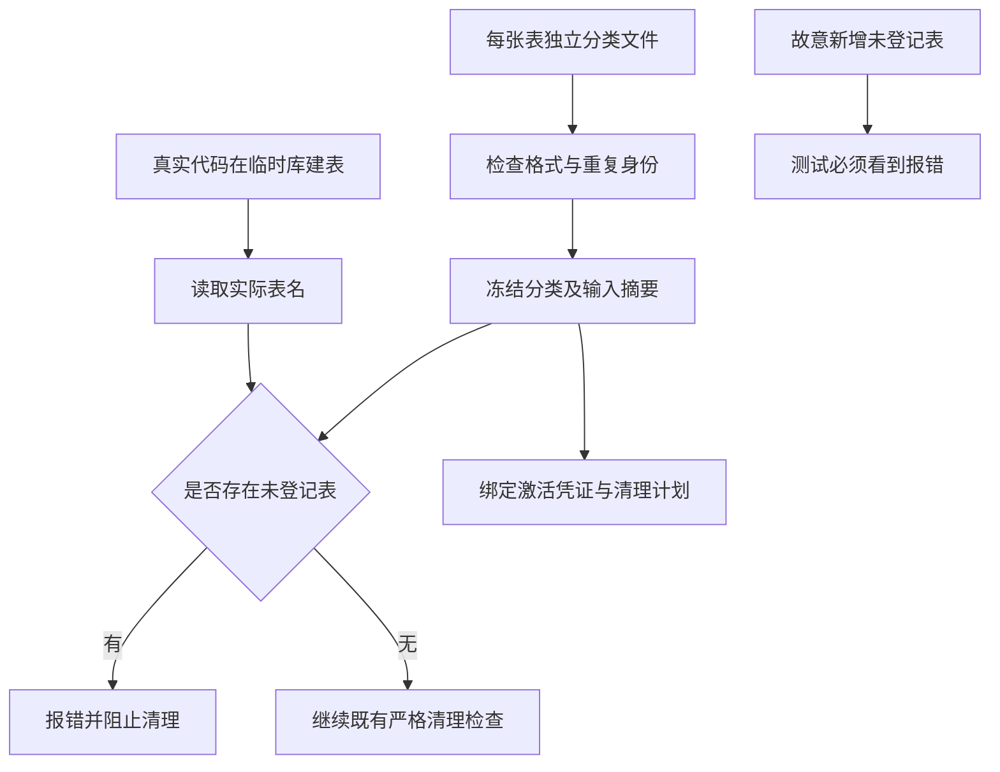

# FLY-2413 并行追加保留分类 — 实施计划
Issue: FLY-2413 (https://linear.app/geoforge3d/issue/FLY-2413/fly-2006-retention-registry-是并发热点任何加表的单都要改同一个测试文件同批-pr-必然互撞)
日期: 2026-09-14
基于: research.md

## 1. 给 founder 的说明

目标：新增不同数据库表时，各自追加自己的分类文件；统一测试保持稳定，漏登记和危险漂移仍会报警。

“保留分类”是对一张表能否参与清理的审查结论；它需要独立登记。“实际表结构”是程序建库后真正存在的表；它只用来核对登记，不能替自己批准分类。“摘要”是输入文件的内容标识；任一片段变化，旧清理授权必须失效。



| 步骤 | 交付 | 通过标准 |
|---|---|---|
| 1 | 严格按表加载器与旧 API 适配 | 不同表天然并集；重复身份拒绝 |
| 2 | 独立观测与稳定守卫测试 | 新表不用修改统一测试；关闭守卫后负向测试会红 |
| 3 | 清理证据摘要闭包 | 片段变更拒绝旧授权和未完成计划，写库前停止 |
| 4 | 一次性分类迁移及消费者精确更新 | 每个 identity/classification 与基线相同，原安全检查仍有效 |
| 5 | 合并与变异体验收证据 | A/B 独立追加合并成功，所有必要变异体被杀死 |

本单不运行生产清理、不改变窗口/删除规则、不替已有凭证补签。它消除 retention 清单的文本热点，不能消除两项功能同时修改 StateStore 建表代码的冲突。部署及之后的运维激活仍按已有独立授权流程处理。

## 2. 技术合同与文件结构

新增目录 `scripts/lib/fly-2006-retention-tables/{teamlead,comm}/`。每张表文件名 `<table>.json`；无中心 manifest、index 或 import 清单。owner 以表路径归属体现，不引入第二个可漂移的 owner 枚举。主键是 database+table；两个数据库同名表合法。

示例文件 `scripts/lib/fly-2006-retention-tables/comm/mailbox_identity.json`：

```json
{
  "database": "comm",
  "table": "mailbox_identity",
  "classification": "protectedCurrentOrAuthority"
}
```

所有文件恰有三个字段。table 必须匹配 `[a-z][a-z0-9_]*` 且不得以 `sqlite_` 开头；database 必须为固定目录名；文件名必须等于 table+'.json'。teamlead 分类固定为 `deleteTarget / retiredOptional / protectedAuthority / protectedCurrentOrReference`；comm 固定为 `deleteTarget / protectedCurrentOrAuthority`。保持已有枚举，不加入默认值或通配符。

新增 `scripts/lib/fly-2006-retention-loader.mjs`，职责仅目录读取、严格解码、分类汇总、输入快照；不接受环境变量或 CLI 指定生产分类路径，不运行片段中的代码。测试可直接调用参数化 loader 指定临时目录，生产 registry 仅用 import.meta.url 推导固定目录。

建议接口（下列都是新接口，旧 API 全部保留）：

```ts
type Entry = { database: 'teamlead' | 'comm'; table: string; classification: string };
type InputFile = { path: string; sha256: string }; // 模块根相对 POSIX 路径
// compile 接受已解码条目，统一测试 duplicate 和分类，不读取磁盘。
compileRetentionEntries(entries: readonly Entry[]): Readonly<Record<string, Readonly<Record<string, readonly string[]>>>>;
// snapshot 包含确定性排序后的输入清单、冻结 classifications 及其 digest。
loadRetentionSnapshot(root: URL): Readonly<{ classifications: ReturnType<typeof compileRetentionEntries>; inputs: readonly InputFile[]; digest: string }>;
// 对比相同固定目录当前输入集合；任何变化/非法文件抛 registry_inputs_changed 或具体格式错误。
assertRetentionInputsUnchanged(): void;
retentionRegistryDigest(): string; // 先 assert，再返回同一已加载快照的摘要
```

模块关系：loader 不 import registry。registry 顶层加载一次快照，导出原有两库对象和纯分类函数；新增两个 digest API 包装 loader 对固定 root 的复查。RETENTION_MS、mailbox/time 函数留在 registry 原文件。

### 2.1 读取与拒绝规则

固定根目录只包含 teamlead、comm 两个普通目录；两目录都必须存在且非空。根内不放 README（维护说明放 `scripts/lib/fly-2006-retention-tables.md`）。子目录只接受普通 `.json` 文件；拒绝符号链接、嵌套目录、未知扩展、路径与声明不符、非对象/数组、缺字段/多字段/字段类型错、未知分类、重复 identity。同身份重复即使同分类也抛 `schema_registry_overlap:<database>`，不能 `Set` 静默去重或覆盖。文件和目录用 lstat 检查，不跟随软链。parse 错误包含相对路径和稳定码，不输出整份原始输入。

编译核心步骤：

```js
const seen = new Set();
for (const entry of entries) {
  // exact keys、database、table 和该库分类检查先完成
  const key = `${entry.database}:${entry.table}`;
  if (seen.has(key)) throw new Error(`schema_registry_overlap:${entry.database}`);
  seen.add(key);
  result[entry.database][entry.classification].push(entry.table);
}
// 所有既有分类 key 均保留，数组排序后冻结，再冻结库对象与根对象。
```

`assertClassifiedSchema` / `assertNoUnclassifiedSchema` 签名和 `unknown_retention_database / schema_unclassified / schema_missing / schema_registry_overlap` 错误前缀不变。所有实际表名按原守卫看待；SQL 查询继续参数化值，表名只来自受控已验证 identity，JSON 不携带 SQL。

### 2.2 与执行策略的关系

新通用测试比较每库 classification.deleteTarget 的集合与 `RETENTION_TARGET_POLICIES` 同库 table 的去重集合完全相等；允许多个 policy target 共享同表。不能由片段自动生成 SQL 或删除 predicate。新增保护表只加本表片段和 feature 自有测试；若新增删除目标，必须同时修改独立执行策略与其测试，此类语义变更不承诺零共享文件。

## 3. 测试与独立真值

新增 `packages/teamlead/src/__tests__/fly-2413-retention-registry.test.ts`，保留旧大测试中与清理行为、authority、cohort、快照及 VACUUM 有关的原测试。

- 将旧 `classifies the current production schemas...` 移到新测试，仍真实调用 StateStore.create / new MailboxQueue，关闭 handle 后用 better-sqlite3 只读 sqlite_master。它验证实际表均已分类，不声称完整生产相等；延迟/历史表继续由 strict inventory 和 feature 测试覆盖。
- 删除旧全局 table fixture import、数量断言及 `classifies the production schema...` 当前全集断言。对 optional-retired、unknown、missing 的有意义测试迁入新文件，以固定的小型独立数据输入验证守卫。
- 旧 quota 保护断言移至新增 `packages/teamlead/src/__tests__/fly-2413-quota-retention-protection.test.ts`，以后同类新 feature 断言放自己的文件。其他已有逐表安全断言保留在一次性迁移保护测试中，或移到对应 feature 文件；不能把它们当作每次新表都追加的全局覆盖要求。
- 不把片段展开全集或新自动生成的 JSON 当独立实际 schema；不引入更新 snapshot 命令让红灯自动变绿。

最小固定模型：compile 两个 comm 条目 `required_a`（protected）与 `required_b`（deleteTarget），测试 guard 工厂（新增内部 `createSchemaAssertions(classifications)`，生产旧 exports 调用其结果）。实际列表字面量来自测试，不从期望读回。strict guard 对 `['required_a']` 报 missing required_b，对 `['required_a','required_b','unexpected']` 报 unclassified unexpected。另用 teamlead retiredOptional 固定模型证明 optional 缺失可通过。

真实库变异体：对 temporary StateStore 数据库执行固定 SQL `CREATE TABLE fly2413_unregistered_probe(id INTEGER PRIMARY KEY)`；重读系统目录并调用生产 `assertNoUnclassifiedSchema`，必须抛 `schema_unclassified:teamlead:fly2413_unregistered_probe`。删除该临时表后正常通过。只修改 /tmp 的临时 DB，不修改项目 schema、不复制 live DB。

## 4. 摘要与生命周期

片段摘要采用明确版本域与排序的路径+字节 hash，包含 registry 源、loader 源、全部 JSON。不要只散列汇总分类，因为文件添加/移除、格式或加载器变化也需要可追溯。摘要输入按模块相对 POSIX path 码点排序，UTF-8 JSON 序列化：

```js
const registryDigest = sha256(JSON.stringify({
  format: 'fly-2413-retention-inputs-v1',
  inputs: inputsSortedByPath.map(({ path, sha256 }) => [path, sha256])
}));
```

加载阶段以同一次文件读取的 bytes 产生条目和 hash，冻结输入快照。每次 `retentionRegistryDigest()` 重新枚举、校验并散列固定输入集，与冻结 inputs 对比；变化时抛 `registry_inputs_changed`，要求新进程。不能把缓存的旧 classifications 与热读的新摘要拼在一起。该检测用于源码部署/维护过程的意外变化；不声称能抵御具有任意本地源码写权限的攻击者或每条 DELETE 间的文件修改。

`engineSourceDigest()` 保留原五文件顺序/依赖，并额外纳入 `retentionRegistryDigest()`；`fly2139ActivationRequirements().registrySha256` 改为调用同函数。复查一定发生在 destructive apply 打开可写 DB 前；activation creation 同样使用复查后的 requirements。不要在 CLI 或 janitor 复制一套解析器。

兼容策略：activation receipt schemaVersion=1、manifest schemaVersion=2、字段名不变，字段的 digest 语义扩展为完整输入闭包。所有旧激活凭证和未完成旧 manifest 自然失配。禁止自动重签/补写/忽略失配；现有 no-clobber activation 创建行为不改。运维按已有授权流程保留旧凭证审计并显式重激活；移除凭证的既有行为是 inventory-only，不在本设计阶段执行。

`executeFly2006Apply` 已完成回执的重放会先于源码校验返回；保留该历史证据行为。此处“拒绝旧 manifest”专指对未完成 manifest 继续删除，不追溯作废已完成回执。

回滚为完整回滚 loader+全部片段+registry adapter+engine 摘要变更；不能只回滚部分输入。更旧代码不会认识新 digest，恢复执行仍需授权后的新 inventory/激活。历史 evidence 文件只读不改。不增加数据库 migration、flag 或双写过渡。

## 5. 一次性迁移与消费者清单

实现开始时重新检查 TURN 和分支实际 SHA，先保存当时旧 registry 的有序 `(database,table,classification)` 映射到临时迁移证据，再生成单表文件。不得从 main 的旧数字猜测、不得用当前数据库自动决定分类。一次迁移证据应记录 base SHA、输入/输出身份分类映射摘要及差异为空，存本 issue `implementation-evidence.md`；它是历史证据，不是未来会编辑的运行总表。

本设计基线是 teamlead 228（21/3/40/164）、comm 29（7/22）；实施时如基线已新增表，保留它们，数量只作审计信息。删除目标集合、optional 集合和每张表分类必须完全守恒。

| 文件 | 具体改动 |
|---|---|
| `scripts/lib/fly-2006-retention-registry.mjs` | 删除 words 和手写两库表单，保留 facade、guard 和 value policy，新增 digest 导出 |
| `scripts/lib/fly-2006-retention-loader.mjs` | 严格数据加载、compile、snapshot 核心 |
| `scripts/lib/fly-2006-retention-tables/{teamlead,comm}/*.json` | 一 identity 一文件，无中心清单 |
| `scripts/lib/fly-2006-retention-tables.md` | 新增表操作说明、分类/错误/摘要和兼容规则 |
| `scripts/lib/fly-2006-retention-engine.mjs` | 更新两个 digest consumer |
| `packages/teamlead/src/__tests__/fly-2006-database-retention-sweep.test.ts` | 去掉重复总列表；保留原清理行为测试 |
| `packages/teamlead/src/__tests__/fly-2413-retention-registry.test.ts` | 新通用 loader/真实 schema/并集合并/红灯守卫测试 |
| `packages/teamlead/src/__tests__/fly-2413-quota-retention-protection.test.ts` | 承接 quota 的独立延迟表保护合同 |
| `packages/teamlead/src/__tests__/fly2139-standing-policy.test.ts` | 片段变化的 activation 和 manifest 链路负向控制 |
| `scripts/__tests__/fixtures/fly-2006-teamlead-production-tables.json` | 删除；当前唯一 runtime-test consumer 同步去掉 |
| `packages/teamlead/src/__tests__/fly2396-authorship-boundary.test.ts` | ALLOWED 中 registry 换为 teamlead/workflow_founder_gate_verdict.json；仅对固定 retention JSON 目录加扫描，保持 exact 路径约束，命中数仍 6 |
| `packages/teamlead/src/__tests__/fly2398-narrow-boundary.test.ts` | registry 换为 teamlead/auto_merge_shadow_{declaration,observation}.json 两条 exact 路径；固定 retention JSON 纳入扫描，不全局放宽 JSON |
| `scripts/fly1645-receipt-residue-gate.config.json` | 两个旧 registry linePattern 换成对应 teamlead 单表 JSON 路径，linePattern 为锚定的 `"table": "receipt_root_lineage",` / `"table": "receipt_handle_requests",`，保持原总命中数；relayStateAllowedFiles 的 registry 仍保留（mailbox 函数未搬） |
| `scripts/__tests__/fly1674-residue.test.sh` | 删除 registry/旧 fixture 的两个例外，改为 teamlead/three_stage_turn.json 与 comm/three_stage_turn.json 精确路径+token；其他例外不动 |

## 6. 顺序实施任务（本节点不执行）

### Task 1 — loader 与 facade

- [ ] 写 loader 的 RED：无目录/空库/非 JSON/softlink/坏 JSON/额外字段/路径身份不符/未知库或分类/重复身份，错误码和相对路径可断言；不同库同名表成功。
- [ ] 写 `compileRetentionEntries` 并集 RED：分别编译 A、B 和 A+B；A+B 应包含两者且与输入顺序无关，冻结输出不可变；重复 A 必须抛 overlap。
- [ ] 跑新文件 focused test 确认因新 API 缺失或行为断言失败；实现 §2 精确边界、§4 输入 snapshot，重跑 GREEN。
- [ ] 在临时证据保存旧映射；按表生成全部片段，替换 facade；运行映射逐项 equality（包括分类）和 existing API smoke。
- [ ] 提交 `refactor(retention): load per-table classification fragments`。

### Task 2 — 通用守卫与负向控制

- [ ] 按 §3 写固定微型 missing/unknown/optional fixtures 和真实临时 DB 未登记表用例，运行 RED 后提取内部 guard 工厂，旧 facade 签名不改。
- [ ] 删除 global fixture 和全局数字；迁移独立 quota 保护测试；对 deleteTarget/RETENTION_TARGET_POLICIES 加集合相等断言。
- [ ] GREEN 后在隔离模块副本中将 unknown check 替换为 no-op，再运行同一负向用例。必须因 expect(...).toThrow 未抛而 FAIL，恢复后 PASS。禁止仅用非零进程码代表 mutation 被杀死。
- [ ] 对 missing check 做同类 no-op 变异体，固定独立 actual list 测试必须 FAIL；恢复后 PASS。
- [ ] 提交 `test(retention): keep drift guards independent of registry data`。

### Task 3 — 摘要与授权失配

- [ ] RED：临时模块树中创建正确 activation receipt（测试专用 canonical home）；只改一张有效保护分类片段；新进程 validate 必须 `activation_receipt_invalid`。旧进程继续 digest 则必须 `registry_inputs_changed`。
- [ ] RED：临时库有一条可删旧记录，原输入完成 inventory，之后只改有效片段；用普通 apply 与有效 fixture authority，必须 `engine_digest_mismatch`，记录仍在；未改的正向控制确实删一条。不要让 activation 的更早拒绝遮住 manifest 测试。
- [ ] 实现 §4 两个入口的完整 snapshot digest；保留 completed receipt 的早返回。
- [ ] 分别删去 activation digest 和 engine digest 中的片段贡献，运行对应测试，必须为断言失败；恢复后 GREEN。
- [ ] 片段 add/remove/edit、非法 JSON、文件顺序变化各测：合法集合变化改摘要，枚举顺序不改摘要，非法输入拒绝。测试只用临时模块副本/临时数据库，不改共享 policy 文件与生产凭证。
- [ ] 提交 `fix(retention): bind fragment inputs to cleanup evidence`。

### Task 4 — 精确路径守卫与迁移证据

- [ ] 按 §5 更新两套 source-boundary 测试扫描及 exact allowed paths、两套 residue 例外；不得为了绿改成目录通配许可。
- [ ] 运行下方全部 checks，真实命中数量与原语义符合；把迁移映射 diff=empty、所有变异体基线/禁用/恢复日志摘要写 `implementation-evidence.md`。
- [ ] 临时 Git 仓库演示两个并行分支只新增 A/B 两张保护表片段，普通 merge 成功，合并后加载结果为 A∪B；从合并结果删去 B 片段但实际库仍有 B，守卫必须红。该证据只说明 retention 文件层，无 StateStore 并发保证。
- [ ] 提交 `test(retention): migrate exact boundary guards and record mutation proof`；根据实际提交范围请求代码评审并交独立 QA，不自行 ship。

## 7. 验证命令与验收矩阵

在 implementation checkout 安装依赖并构建必要 workspace 包后，从 repo root 执行（不能把未发现测试当成功）：

```sh
pnpm --filter flywheel-teamlead exec vitest run src/__tests__/fly-2413-retention-registry.test.ts src/__tests__/fly-2413-quota-retention-protection.test.ts src/__tests__/fly-2006-database-retention-sweep.test.ts src/__tests__/fly2139-standing-policy.test.ts src/__tests__/fly2396-authorship-boundary.test.ts src/__tests__/fly2398-narrow-boundary.test.ts
node --test scripts/__tests__/fly-2006-retention-consumer-gate.test.mjs
node scripts/fly-2006-retention-consumer-gate.mjs
node scripts/fly1645-receipt-residue-gate.mjs --main-only
bash scripts/__tests__/fly1674-residue.test.sh
pnpm --filter flywheel-teamlead typecheck
```

| 必须证明的条件 | 权威证据 |
|---|---|
| 新增保护表不需改统一测试/中心清单 | A/B 临时 Git merge、变更路径、加载并集及未改测试文件 hash |
| 漏登记仍会红 | 真实初始化库新增未登记表，生产 guard 报精确 table |
| 不靠同源全集掩盖 missing | 独立固定 actual list 的 strict guard 负向测试 |
| 合并解错/漏片段仍会红 | 合并库保留表但删除 B 片段，unknown 失败 |
| 重复声明不被覆盖 | compile duplicate same/different classification 均 overlap |
| 守卫本身没有被关闭 | 四个 no-op 变异体各自被对应断言杀死，正常版均绿 |
| 不能新增隐式删除权 | 分类 deleteTargets 等于独立执行策略，正向删除仅既有 fixture |
| 旧清理证据不会越过文件变动 | fresh-process activation/unfinished manifest 分别拒绝，行未删；old-process inputs changed 拒绝 |
| 历史完成证据仍可重放 | complete apply receipt 重放测试保持，不要求新源码授权历史事实 |
| 迁移没有改变原分类 | per-identity mapping equality + protected/delete/optional 集合差异为空 |
| 旧 exact source guards 没有被放宽 | 四个 boundary/residue checks 实际通过 |

## 8. 风险、后续与交付状态

一次性拆分约 257 个小文件增加目录规模，换取之后每表独立编辑；不引入生成产物提交清单。保留表名边界和自动发现的严格错误路径，避免拼写错文件被跳过。

初始化不是完整生产 schema 证明，延迟创建与历史表证据仍属于专属 feature / strict inventory。将所有迁移统一建库或建立完整生产 schema catalog 属后续工作，不在本单暗中完成。

设计阶段只运行可用的静态/隔离验证，未运行上述未来实现 tests、未清理生产数据、未证明最终实现 mutation 已通过。有效设计评审结果、最终 HTML 发布与 hosted 检查将记录在 progress 和交付证据中。
