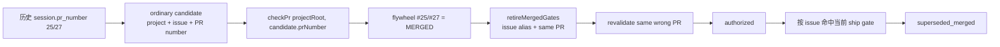

# FLY-2426 主仓锚 PR 误退休 — 调研
Issue: FLY-2426 (https://linear.app/geoforge3d/issue/FLY-2426/批准通路2394-founder-的两条批准通路对同一张卡全部失效-reaction-挂-13-小时reply-to)
日期: 2026-09-07
基于: exploration.md

## 结论

根因已定位：`external-merge-reconcile.ts` 的 ordinary path 把同一 issue 的每个历史 `sessions.pr_number` 都当成当前项目仓库的 PR 号探测；`TerminalGateRetirement` 随后只按 issue alias 找 gate，没有核对这张 gate 自己持久化的主仓 ship-target / node-PR binding。嵌套 Raya PR 号因此撞上 flywheel 主仓同号的旧 merged PR，并在 retirement 前再次探同一个错误号码，形成一条内部自洽但对象错误的 authority 链。

Founder reaction / reply pickup 没有先坏。两张 gate 在 founder 操作前已经被写成 terminal disposed，所以后来两条官方批准入口都只能跳过它们。

## 生产副本取证方法

- 来源：生产 `teamlead.db` 与 `comm/flywheel/comm.db`。
- 方式：以 SQLite `mode=ro` 打开源库，使用 backup API 生成独立副本，再对副本运行 `PRAGMA integrity_check`；两库均为 `ok`。
- 副本时点：2026-09-07 11:21 PDT。
- 所有 SQL 复算只读/改写副本；没有对生产库执行写入。

## 两次误退休的实际判定材料

### FLY-2394

| 项 | 当时链路中的值 |
| --- | --- |
| 错误 ordinary candidate session | `adcbba07-1f5e-435a-a193-0786103e3792`，completed implement，`pr_number=25`，head `3383848e…`（Raya PR head） |
| reconciler 第一次 probe | 项目根为 flywheel，实际探 `xrliAnnie/flywheel#25` |
| 第一次结果 | `state=MERGED`，`mergedAt=2026-03-16T07:06:49Z`，merge commit `77dcd18d…` |
| `canonicalIssueId` | `FLY-2394` |
| `issueAliases` | 去重后仅 `['FLY-2394']` |
| 旧 `revalidate()` | 再探 flywheel `#25`，因此返回 `authorized` |
| gate 自己的主仓锚 | question `workflow-gate:5c070923…`；ship target `__main__ / xrliannie/flywheel / head 750cd9bd…`；node binding `PR #1103` |
| 主仓锚当前事实 | flywheel `#1103` OPEN，`mergedAt=null` |
| 退休结果 | 创建 `03:00:37.893Z`，`03:01:04.507Z` 写为 `superseded_merged` |

### FLY-2381

| 项 | 当时链路中的值 |
| --- | --- |
| 错误 ordinary candidate session | `8c2094e7-edfd-4036-87d9-3220a564b591`，completed implement，`pr_number=27`，head `310c7487…`（旧 Raya delivery head） |
| reconciler 第一次 probe | 项目根为 flywheel，实际探 `xrliAnnie/flywheel#27` |
| 第一次结果 | `state=MERGED`，`mergedAt=2026-03-17T03:28:34Z`，merge commit `87e60ace…` |
| `canonicalIssueId` | `FLY-2381` |
| `issueAliases` | 去重后仅 `['FLY-2381']` |
| 旧 `revalidate()` | 再探 flywheel `#27`，因此返回 `authorized` |
| gate 自己的主仓锚 | question `workflow-gate:b0e6fd43…`；ship target `__main__ / xrliannie/flywheel / head 297b715c…`；node binding `PR #1109` |
| 主仓锚当前事实 | flywheel `#1109` OPEN，`mergedAt=null` |
| 退休结果 | 创建 `08:31:49.899Z`，`08:32:58.258Z` 写为 `superseded_merged` |

以上 `mergedAt` 都早于本次事故数月且不可逆，因此能确定两次历史 revalidation 在旧闭包下都会得到 `authorized`；不是用当前瞬时 OPEN/CLOSED 状态猜测历史。

## FLY-2379 反例为什么没有中招

FLY-2379 的嵌套仓是 Raya `#26`，flywheel `#26` 确实也是 2026-03-17 已 merged 的旧 PR。但生产副本里的 FLY-2379 session 集合没有 `pr_number=26`；带 PR 的 ordinary candidates 全部是主仓 `#1106`。因此 candidate builder 从未生成 `(FLY-2379, 26)`，只会探 flywheel `#1106`，结果 OPEN，后续 retirement 根本不执行。

这解释了“同样号码碰撞却 protected”：差异是错误号码有没有落进 `sessions.pr_number`，不是 run 活跃度、delivery contract stall、rotation 或 negative cache。

## 当前代码因果链

承重点：

1. candidate construction 不携带 repo identity。
2. ordinary probe 总在项目主仓根执行。
3. `retireExternalAuthority()` 仅验证 question 的 issue 是否属于 aliases，再信任 revalidation；它没有把 `input.prNumber` 与 question 自己的 workflow ship target / node binding 比较。
4. revalidation 闭包只看归一化 `state === 'merged'`，没有明确要求 fresh `mergedAt`。

另有一个同函数内的扩大面：它同时扫描 `approve_to_ship` 与 `founder_review`。后者没有 `workflow_gate_holder`（holder/materializer 是 ship gate 专用），所以如果只给 holder 分支加 anchor guard，founder-review 卡仍会落回 issue-global legacy path。不存在“某个外部 PR merge 可以替 founder 完成本轮 artifact review”的语义，而且 `workflow_run.status='held'` 仍是可恢复 live 状态；因此 founder review 的 merged-retirement 必须不分 run status 无条件 fail closed，等待正常 review/newer-family transition 或 issue-done 收敛。

## 已存在、可复用的权威数据

不需要新增 schema 或碰 FLY-2427 的 `StateStore.ts`：

- `getCurrentWorkflowGateHolderByQuestionId(questionId)`：确认 question 仍是当前 workflow holder。
- `getWorkflowRun(runId)`：绑定 issue。
- `getWorkflowShipTargetBinding(questionId)`：提供 question 固定的 `run_id / target_repo_identity / probe_repo_slug / frozen_head_sha`。
- `getCurrentWorkflowNodePrBindingForHead(runId, headSha)`：从当前 node attempt 精确解析 `pr_number / repo identity / probe slug / head`，冲突时返回 undefined。

当前坏例三层数据完全一致地指出主仓 anchors `#1103/#1109`，因此可以在不可逆 CommDB 退休前做 question-local 比对。

## `sessions.pr_number` 生产副本测量

Lead 要求的只读 census 使用一个刻意保守、可由单库复算的口径：

1. `sessions.pr_number IS NOT NULL`；
2. 同一 issue 至少有一条 `workflow_node_pr_binding.target_repo_identity='__main__'`，所以能观测到正式主仓 anchor；
3. 该 session PR number 与该 issue 的**所有**已记录主仓 binding PR number 都不相等。

这个口径不拿旧 session head 与最新 head 比，避免把同一 PR 的正常追加提交误报；也不推断尚无 workflow binding 的老 issue，因此结果是“可证明的错误仓库/错误 PR 候选”下界，不是全量历史污染估计。

副本结果：`sessions.pr_number` 非空 1,095 行、涉及 694 个 issue；严格 mismatch 为 **3 行 / 3 个 issue**（按行 0.27%，按 issue 0.43%）。

| issue | session / 角色 | session PR | 已记录主仓 anchor | 跨仓库证据 |
| --- | --- | --- | --- | --- |
| FLY-2097 | `89030911-675d-46bd-b15d-966114a02963` / completed implement | `#3`, head `cdbe65a2…` | flywheel `#973` | 该实现明确交付到 Raya PR `#3`；而 flywheel `#3` 是 2026-02-28 merged 的无关 “v0.1.0 Core Loop” |
| FLY-2381 | `8c2094e7-edfd-4036-87d9-3220a564b591` / completed implement | `#27`, head `310c7487…` | flywheel `#1109` | 历史 Raya delivery；flywheel `#27` 是 2026-03-17 merged 的无关旧 PR |
| FLY-2394 | `adcbba07-1f5e-435a-a193-0786103e3792` / completed implement | `#25`, head `3383848e…` | flywheel `#1103` | Raya PR `#25` head；flywheel `#25` 是 2026-03-16 merged 的无关旧 PR |

复算 SQL 的核心是按 issue 建 `DISTINCT (issue_id, main_binding.pr_number)` 集合，再以两个 `EXISTS / NOT EXISTS` 比较 session；没有写库、没有依赖 GitHub 的标题启发式。GitHub 只用于解释三个号码各自属于哪个 PR family。

## `sessions.pr_number` 其他生产读取点

对 `packages/teamlead/src` 与 `packages/flywheel-comm/src` 排除测试和 external reconciler 后做了两类 grep：直接 `SessionRecord.pr_number` 属性读取，以及直接从 `sessions` SQL row 读取 `pr_number`。直接属性读取共 25 个文件：

- authority / ship 决策面：`approval-signal/deferred-approval.ts`、`founder-reaction-approval-handler.ts`、`founder-ship-approval-handler.ts`、`founder-action-drain.ts`、`founder-consent/wiring.ts`、`gate-poller.ts`、`merge-ship-gate.ts`、`lifecycle-routes.ts`、`workflow-decision-routes.ts`、`run-ship-relevance.ts`、`land-source-session.ts`、`land-executor.ts`、`plugin.ts`；
- reconciliation / lifecycle 辅助：`canceled-pr-close.ts`、`complete-marker-reconciler.ts`、`done-running-reconciler.ts`、`review-hold.ts`、`stale-blocker-guard.ts`；
- projection / report / observability：`DirectEventSink.ts`、`commdb-probes.ts`、`digest-service.ts`、`event-route.ts`、`tools.ts`、`voice-routes.ts`；
- persistence mapping：`StateStore.ts`。

另有两个 direct-SQL consumer：`packages/flywheel-comm/src/commands/verify-approval.ts` 与 `packages/flywheel-comm/src/ship-eligibility.ts`。这些调用点多数已经同时要求 head、current node binding 或 operation identity，或只用于显示；本单不据此扩大修改范围。真正造成当前事故的是 external reconciler 将历史 session number 当作主仓号，再由 terminal retirement 对 current question 做 issue-global 退休。修复仍限定在这两个承重点，其他读取点只作为后续审计清单写入 PR。

## 修复边界

### 采用

在 `TerminalGateRetirement` 处理每张 current workflow gate 时，要求：

1. holder 的 run 仍 active/current 且 issue 与 question 解析结果一致；
2. ship-target 未 supersede，且 question/run/head 全部精确匹配；
3. target repo identity 为 `__main__`；
4. 当前 node PR binding 与 ship-target 的 repo identity、probe slug、head 一致；
5. `input.prNumber` 等于该 binding 的主仓 anchor PR number。

任何缺失、歧义、跨仓或号码不等都 fail closed，不退休 current workflow gate。没有 current workflow holder 的 legacy gate 保持原有 issue-alias + fresh revalidation 行为，避免破坏已验证的主仓外部 merge 收敛。

同时让 `PrMergeInfo` 保留 provider 的 `mergedAt`，并令 retirement 的 fresh revalidation 只有在 `state=merged` 且 `mergedAt` 是有效时间戳时才返回 authorized。

`gate-origin-preflight.ts` 已有相似的 holder → run → ship target → node binding 读取链，但它解决的是“卡能否展示”，明确允许 `engine_terminal` 和旧 `authority_mode=null`；本单解决的是“外部 PR merge 能否授权不可逆退休”，必须额外比较 PR number，且对这两种没有 PR authority 的 mode 拒绝。两者读同一份权威数据，但允许矩阵不同。本单不改 preflight，避免把卡展示语义和退休语义耦合，也不扩大到 FLY-2427 正在改的恢复面。

### 已知但不在本单修复的残余

同一个错误 ordinary probe 还会流向 `handleParked()` / turn-belt reclaim。`handleCompletedUnfinalized()` 有 exact-head 防线，而 parked path 的 identity 防线较弱，理论上可能把跨仓同号的 merged 证据用于 session finalization。这不是 FLY-2394/2381 已发生的状态写入，也不属于本单批准的 gate-retirement 范围；PR 必须把它列为待 Lead 拆单的 follow-up 候选，不得宣称三条 census 已被全面 contained。本节点不自行建票、不改 Runner 终局、Linear Done、archive 或 reclaim。

### 不采用

- 只收窄 `issueAliases`：不能纠正错误 probe 对象，也不满足主仓锚绑定。
- 按 PR number 阈值区分 nested/main：号码空间没有语义保证。
- 删除历史 session 或改 session 默认值：掩盖因果且破坏回放。
- 改 approval pickup / delivery stall：gate 在 pickup 前已退休，方向错误。
- 新增 StateStore API/schema：现有 exact binding API 已足够，而且会与 FLY-2427 扩大碰撞面。

## 测试矩阵

1. **硬红阴性**：current workflow gate anchor `#1103` OPEN；同 issue 历史 candidate `#25` 在主仓同号 MERGED；真实 TerminalGateRetirement 不得退休 question。
2. **旧逻辑变异**：临时绕过 anchor comparison，测试必须红，证明断言命中生产调用点。
3. **正向 current workflow**：candidate 与主仓 anchor 相同且 fresh `mergedAt` 有效，仍退休。
4. **fresh mergedAt 负例**：fresh state 虽报 merged 但 `mergedAt` 缺失/非法，不授权退休。
5. **legacy 正向**：没有 current workflow holder 的旧 approve gate + 已 merged 主仓 PR，行为不变。
6. **既有 suite**：terminal gate retirement 与 external merge reconcile 全量回归。

## 与 FLY-2427 的碰撞面

计划只改：

- `packages/teamlead/src/bridge/terminal-gate-retirement.ts`
- `packages/teamlead/src/bridge/external-merge-reconcile.ts`
- 各自现有测试文件

不改 `StateStore.ts`，预计不改 `plugin.ts`，也不触碰 FLY-2427 新增/修改的 recovery 文件。交付前仍对 `origin/main` 和 `flywheel-FLY-2427` 各跑一次 `git merge-tree`。
