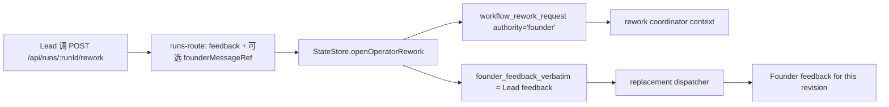

# FLY-2430 Lead 返工署名收窄 — 探索
Issue: FLY-2430 (https://linear.app/geoforge3d/issue/FLY-2430/批准通路缩小-现有-rework-端点已能让-lead-替-founder-提返工-只修它的署名feedback-记成-lead-提交)
日期: 2026-09-07
基于: 无

## 目标

只修既有 `POST /api/runs/:runId/rework` 的 provenance。Lead 通过该端点提交的 `feedback` 必须成为 Lead 署名的返工指令；若引用 founder 原消息，引用正文与消息 id 单列保存。不得再把 Lead 文本写入 `founder_feedback_verbatim`，也不得把 request authority 写成 `founder`。

## 范围裁定

2026-09-07 23:05 的 founder 缩小声明覆盖 issue 里更早的“新增 `lead_kickback` 路径”方案：

- 不新增 API 或 source-event kind；继续使用已经在生产验证过的 operator rework 通路。
- 不改变批准入口、识别词、founder 身份校验、`founder_approval` 写入或 ship authority。
- 不改变 operator rework 的生命周期语义：旧 gate/card 被 supersede，返工后生成新 gate/card。
- 不把旧卡改成“Lead 打回后仍可批准”；这是已作废新通路的判据，不属于本次收窄。
- 不重写历史数据库行；历史 `authority='founder'` 无法在没有可靠 actor/quote 原始证据时安全回填。

## 当前因果链

当前错误不是返工机制缺失，而是写入层把 operator/Lead 文本硬编码成 founder authority，replacement prompt 又只读取 `founder_feedback_verbatim` 并标成 founder feedback。

## 当前证据

- `packages/teamlead/src/bridge/runs-route.ts` 已有 canonical `/:runId/rework`，master token + loopback guard，body 当前接受 `targetNodeId`、`feedback`、`clientRequestId`、可选 `leadId`/`founderMessageRef`。
- `packages/teamlead/src/StateStore.ts::openOperatorRework` 的 request insert 硬编码 `'founder'`，并把 `input.feedback.trim()` 写入 `founder_feedback_verbatim`。
- 同一函数的 authority context / `operator_rework_requested` receipt 只暴露泛化 `feedback`/`principal`，没有明确 `actor`、`founder_quote`、`lead_feedback`。
- `packages/teamlead/src/bridge/workflow-engine-dispatcher.ts` 对 replacement 只读取 `founder_feedback_verbatim`，渲染固定标题 `Founder feedback for this revision`。
- `packages/teamlead/src/bridge/workflow-rework-coordinator.ts` 会把 request authority 与 authority context 原样送进 phase wake；`workflow-rework-wake-copy.ts` 当前只序列化 JSON，没有 Lead 人类可读署名。
- `packages/teamlead/src/bridge/discord-utils.ts` 校验引用消息的 id/author/timestamp，但返回值丢弃 `content`，因此当前无法单列保存 founder 原话。
- FLY-2427 已在 `origin/main@4bbd7c1f0` 合入，本分支已 fast-forward 到该基线；本单不会重新放开 Lead 对 ship response gate 的写入。

## 期望不变量

1. 新 operator rework request 的 durable authority 是 `lead`。
2. durable payload 明确包含 `actor=<configured lead id>`、`lead_feedback=<Lead 指令>`、`founder_quote={message_id,text}|null`、`authority='lead'`。
3. `founder_quote` 为 `null` 时仍显式持久化；有引用时正文必须来自经过当前 founder id、当前 gate thread/card、时序校验的 Discord 消息。
4. Lead actor 必须是 run 所属项目的 configured Lead，且 `isReservedApprovalAttribution` 拒绝 `bridge`、`bridge-founder-consent` 与 17–20 位 snowflake。
5. idempotent replay 比对 actor、quote 与 Lead feedback，不能让同一 `clientRequestId` 改署名或正文。
6. replacement prompt 与 phase wake 都显示 `Lead submitted` / `lead:<id>`；founder quote 和 Lead feedback 分段，绝不借用 founder-verbatim 字段。
7. 任何 `feedback` 内容（包括 `approve` 或 JSON approval）都只产生 rework events，不产生 `founder_approval` source event。

## 非目标

- 新命令、新 endpoint、新 `lead_kickback` kind。
- 修改 `isExplicitFounderKickback`、founder reply/reaction 解析或 approval thresholds。
- 改变 operator rework 的 gate supersession、claim revocation、target routing、verification policy 或 new-card loop。
- 猜测或批量修复历史 provenance。
