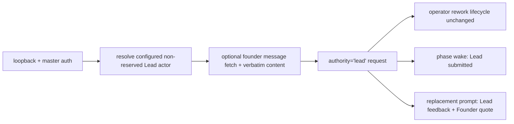

# FLY-2430 Lead 返工署名收窄 — 实施计划
Issue: FLY-2430 (https://linear.app/geoforge3d/issue/FLY-2430/批准通路缩小-现有-rework-端点已能让-lead-替-founder-提返工-只修它的署名feedback-记成-lead-提交)
日期: 2026-09-07
基于: research.md

## 1. 交付边界

在既有 `POST /api/runs/:runId/rework` 和 `operator_rework_requested` 通路内，把新写入从错误的 founder attribution 改成 Lead attribution。保留原有 target routing、quiescence、gate/card supersession、claim revocation、delivery、TURN、重验与新卡机制。完全不修改 founder approve/reply/reaction 的转换路径。



## 2. Locked data contract

新 Lead request 同时满足：

```ts
{
  authority: "lead";
  actor_id: string; // configured Lead agent id
  founder_quote: { message_id: string; text: string } | null;
  lead_feedback: string;
  founder_feedback_verbatim: null;
}
```

同一结构写进 `authority_context_json` 与 source receipt，字段名固定为 `authority`、`actor`、`founder_quote`、`lead_feedback`。`founder_quote:null` 必须显式存在。验证路径新建的 chained Lead request 必须从 active parent 的三个分列逐字段继承，并在 child context 里重复同一 shape。历史 qa/founder/engine 行保持原值，新列为 NULL。

## 3. TDD Task A — Route identity 与 quote boundary

**测试文件**

- `packages/teamlead/src/bridge/__tests__/runs-route.founder-message-ref.test.ts`
- `packages/teamlead/src/bridge/__tests__/runs-route.run-management.test.ts`
- `packages/teamlead/src/bridge/__tests__/discord-utils.test.ts`

**RED**

1. 无 body `leadId` 时，从 run `selected_by` 得到 actor；显式 `leadId` 时保存该 actor。
2. `bridge`、`bridge-founder-consent`、17–20 位 snowflake、非项目 roster id、字面量 `unassigned`、无法解析 actor：分别返回 `LEAD_ATTRIBUTION_RESERVED` / `LEAD_ATTRIBUTION_NOT_CONFIGURED` / `LEAD_ATTRIBUTION_REQUIRED` typed 4xx，`openOperatorRework`/quiescence 均未调用。
3. 引用 founder 消息时把 Discord `content` 字节原样传成 `{message_id,text}`；空 string 合法且显式保留；无引用传 `null`。
4. 既有 wrong author / wrong thread / before-card / unavailable 分支仍无 write。

**GREEN**

- `discord-utils.ts` 成功 DTO 加 `content:string`；只对非 string fail-closed，空 string 合法。
- `runs-route.ts` 在 quiescence 前解析 run 与 project roster，调用 `isReservedApprovalAttribution`，得到 actor。
- `authorizeRework` 接收同一 actor；`openOperatorRework` 改传 `actor`、`leadFeedback`、`founderQuote`。
- 更新 `doc/engineer/implementation/turn-manual-handoff-runbook.md`：legacy NULL/`unassigned` `selected_by` 的三字段请求必须增加 configured `leadId`。

## 4. TDD Task B — Durable request、migration 与 replay

**测试文件**

- `packages/teamlead/src/__tests__/StateStore.workflow-rework.test.ts`
- 必要时更新仅构造 `WorkflowReworkRequestRow` 的 coordinator fixture。

**RED**

1. canonical operator open 的 request 断言 `authority:'lead'`、actor/quote/feedback 分列、founder-verbatim 为 null。
2. `rework_requested`、`operator_rework_requested` 与 resume attachment receipt 都断言 Lead payload；receipt 保留 `feedback`/`principal` legacy aliases，但展示与 engine 不读取它们。
3. 同 `clientRequestId` 变更 actor、quote message/text 或 Lead feedback → `operator_request_conflict` 且 user-table snapshot 不变。
4. actor 为 reserved/snowflake/空值 → invalid 且零 mutation。
5. 同 `clientRequestId` 的 pre-deploy receipt（只有 `feedback`/`principal`/evidence digest）在新代码下仍无写 idempotent replay；不伪造新字段。
6. 从已含 `engine`、尚无 `lead`/新列的 schema 启动两次：行不丢、FK clean、schema 含 lead 与新列、immutable triggers 仍存在。
7. 真实 operator open → delivery active → implement completion 的 chained QA request 继承 actor/quote/Lead feedback，transaction 成功且 verification path 继续。
8. `leadFeedback:'approve'` 与 approval JSON 的 operator rework event 集不含 `founder_approval`；它们仍只是 rework input，本单不新增 approval 文本分类器。

**GREEN**

- `workflow_rework_request` 增 `lead` authority 与 nullable `actor_id` / `founder_quote_json` / `lead_feedback`，conditional CHECK 禁止 Lead row 复用 founder-verbatim。
- 扩展现有 rebuild migration；early-return sentinel 必须要求 schema 同时包含 `lead` 与三个新列，copy 旧列，新列补 NULL，boot 幂等。
- `WorkflowReworkRequestRow` 暴露 typed `actor_id`、`founder_quote`、`lead_feedback`。
- `openOperatorRework` input 使用 `actor`/`leadFeedback`/`founderQuote`；request、authority context、events 与 receipt 全部写 Lead shape。新 receipt 保留 legacy aliases，replay comparator 按 prior payload shape 分支。
- `recordWorkflowTransition` 的 chained Lead writer 从 active request columns 继承并复写 Lead shape；parent 字段缺失时 fail-closed，不从旧 `feedback` 猜。
- 保持 source uid/kind、request id、routing、gate supersession 与 transaction CAS 原样。

## 5. TDD Task C — Wake/replacement 展示与 replay

**测试文件**

- `packages/teamlead/src/bridge/__tests__/workflow-rework-wake-copy.test.ts`
- `packages/teamlead/src/__tests__/workflow-engine-dispatcher.test.ts`
- `packages/teamlead/src/bridge/__tests__/workflow-rework-coordinator.test.ts`

**RED**

1. phase wake 对 lead request 包含 `Rework submitted by lead:<id>`，并保留结构化 `founder_quote`/`lead_feedback`。
2. fresh replacement 的 agent content 分三段显示 Lead 提交者、Lead feedback、Founder quote；quote null 显示显式 none。
3. lead row 若 actor/quote/feedback 与 authority context 不一致，replacement 在 spawn 前 fail-closed。
4. founder authority 的现有 `Founder feedback for this revision` 行为保持逐字。

**GREEN**

- `workflow-rework-wake-copy.ts` 只对完整 lead shape增加人类可读 attribution；其余 wake 字节行为不变。
- `workflow-engine-dispatcher.ts` 把 replacement context 改成 authority-aware union；lead 分支读取新列并校验 context，founder 分支继续只读 `founder_feedback_verbatim`。
- 不把 founder quote 合并进 Lead feedback，不用文本内容猜 authority。

## 6. Refactor 与完整性扫描

1. 抽出最小的 founder-quote parse/compare/render helper（仅在两个消费点确实重复时）；不重构 rework engine。
2. `rg` 扫描 `founder_feedback_verbatim` 全部读写点以及 rework request `authority` 全部 reader/writer。`appendWorkflowReworkRouteRevision` 对 lead 返回 `rework_route_not_revisable` 是明确保留的边界（operator target 已由 API 明确），增加阴性测试；transition 的 founder-only comparator 对 lead 不适用。
3. `rg` 扫描 `WorkflowReworkRequestRow` fixtures 与手写旧 schema，补齐 type 或迁移期待，不改无关语义。
4. `rg` / focused tests 证明 FLY-2427 `respond` 拒绝逻辑与 healthy holder 路径没有 diff。
5. 检查 git diff，只允许 TeamLead rework attribution、相关 tests 与 FLY-2430 文档。

## 7. Focused verification

依次运行（单 fork，避免饱和主机）：

```bash
pnpm --filter flywheel-teamlead exec vitest run --maxWorkers=1 \
  src/bridge/__tests__/discord-utils.test.ts \
  src/bridge/__tests__/runs-route.founder-message-ref.test.ts \
  src/bridge/__tests__/runs-route.run-management.test.ts

pnpm --filter flywheel-teamlead exec vitest run --maxWorkers=1 \
  src/__tests__/StateStore.workflow-rework.test.ts \
  src/bridge/__tests__/workflow-rework-coordinator.test.ts \
  src/bridge/__tests__/workflow-rework-wake-copy.test.ts \
  src/__tests__/workflow-engine-dispatcher.test.ts

pnpm --filter flywheel-teamlead exec vitest run --maxWorkers=1 \
  src/bridge/founder-consent/__tests__/gate-response-router.test.ts \
  src/bridge/__tests__/write-gate-response.test.ts \
  src/__tests__/StateStore.land-lifecycle.test.ts \
  src/__tests__/StateStore.land-carryover.test.ts
```

测试名/路径以实际 package tree 为准；若 aggregate 文件过重，仍只按文件 filter 串行，不降低断言。

## 8. Repository gates 与 review

1. `pnpm lint`
2. `pnpm -r build`
3. `pnpm test:packages:run`（按项目红线排除真实打开 Terminal.app 的 `**/tmux-viewer.macos.test.ts`；若脚本自身已排除则不额外改命令）
4. 运行本分支新增的每个 `scripts/__tests__/*.test.sh`（预期无新增 shell test）。
5. 在 exact code head 运行项目规定的 `codex:rescue` code review，不使用 raw `codex exec`；修复 blocking finding 后重新跑相关 tests/gates并开新 review round。
6. 注册 `review_code` gate + `request-review --type code`，轮询 structured `reviewVerdict`；CHANGES 必须新 head 新 gate。
7. code review 通过后更新进度证据；创建 `engineering/doc/milestones/FLY-2430.md` 并作为 literal last commit。
8. push feature branch，创建 PR；不 dispatch QA、不请求 ship、不 merge/部署。
9. 通过 `ask --report` 向 Lead 报告 PR、验证边界与 advisories；最后 `complete --route needs_review --pr <NUMBER>`。

## 9. 验收矩阵

| 要求 | 权威证据 |
|---|---|
| 现有端点不新增通路 | route/source kind diff + focused route test |
| actor 是 configured Lead | route negative controls + StateStore payload |
| founder quote / Lead feedback 分列 | DB row + event + wake + replacement prompt assertions |
| authority 是 lead | schema constraint + request/event assertions |
| 不再 founder-verbatim | Lead row CHECK + `founder_feedback_verbatim:null` + prompt test |
| replay 署名不漂移 | new-shape same-id conflict + legacy-shape no-write replay tests |
| reserved/snowflake 拒绝 | route/store zero-mutation tests |
| 批准路径不变 | FLY-2427/respond focused regression + diff absence + no approval event test |
| 返工机制不变 | existing workflow-rework suite：supersession→delivery→retest→new card |

## 10. 明确不做

- 不新增 `lead_kickback` event、CLI、HTTP path 或 gate writer。
- 不让旧 ship card 在 rework 后继续可批准。
- 不修改 gate card 的批准/打回文案；那属于已作废的新入口设计。
- 不修改 founder feedback classifier、threshold、trusted writer set。
- 不回填无法证明 actor/quote 的历史错误行。
- 旧版验收写的“Lead 在这条路径提交 `approve` / approval JSON 必须拒绝”属于已作废的新 `lead_kickback` 路径语义；23:05 的“只修署名”不授权给现有 operator rework 新增文本分类器。现有 endpoint 会把这些字符串当普通返工指令，但测试必须证明它们永远不产生 approval source event。

## 11. Design review R1 处置

- HIGH `chained-rework-inherits-lead-authority`：在 Task B 增加 chained writer 的字段继承、fail-closed 规则与真实 active verification path test。
- 其余 migration sentinel、legacy NULL actor/runbook、legacy replay、空 quote、authority reader sweep、test path 与旧 approve 阴性判据均按上述章节明确收敛。
