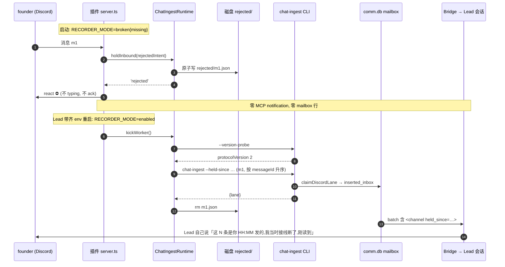

# FLY-2443 Claude Lead fail-open 旁路改 fail-closed — 实施计划

Issue: FLY-2443 (https://linear.app/geoforge3d/issue/FLY-2443/通路claude-claude-lead-的-fail-open-旁路改-fail-closed缺-env-不再绕过-mailbox)
日期: 2026-09-08
基于: research.md

**Version**: plan v5(v4 → v5 收 Codex R4 对 R3#1 的两条残留:回滚 PR = 除 `plugin.json` 外树等于 preimage + manifest JIT patch+1;cache 更新不再单独跑,由 `restart-services.sh` 在 `restart.lock.d` 内一次完成 update + recheck + wave。v2 吸收 Codex R1 六条;v3 吸收 R2 四条;v4 吸收 R3 四条:撤回对 `cutover-discord-plugin.sh` 的误用、改回受管 updater + `restart-services.sh` 波并把状态门绑到该波、回滚 = fork revert PR 树等于 preimage、逐 Lead census 快照存档、重试候选只取 head-of-line、tmp 写入进外层 try/finally)
**Status**: **effective APPROVED**(v5 = commit `9bca90612`;Codex R1→R4 全部吸收零拒绝 + Lead leadAcceptance 裁定 2026-09-08,见 §9;修订轨迹见 §10)

## 0. 一句话

Discord 插件在 `broken` 模式(三 env 缺任一)下不再直推会话:每条入站消息打 ⛔ 回执、原子落盘到 `rejected/` 保留区;Lead 带齐 env 重启后由插件自动按序、幂等重放进 mailbox,信件带 `held_since` 标记让 Lead 自己向 founder 说明迟到;超过 24 小时的陈旧信不进会话,以 DEAD 行留档并借既有 `dead_letter_alerts` 告警。`stock` / `isolated` 两个有意的非 Flywheel 形态不变;Codex 侧不碰。

## 1. 范围与红线

- **改**:fork 仓 `xrliAnnie/claude-plugins-official` `external_plugins/discord/`(`chat-receipt-recorder.ts`、`chat-receipt-runtime.ts`、`server.ts`、两份测试、`.claude-plugin/plugin.json`);主仓 `packages/flywheel-comm/src/{chat-delivery-envelope,discord-chat-ingest,mailbox-queue,index}.ts` 及其测试。
- **不改**:`packages/teamlead/src/lead-backends/codex/**`(Codex 侧);`resolveRecorderMode` 的四态判定;`enabled` 路径的 `acceptInbound()` / `ingest()` / `drainIngestPass()` 字节(`kickWorker` / `scheduleIngestRetry` 只做增量:多跑一个 replay pass、多算一处候选时刻);Bridge 的告警 sink;任何 FLY-1730 删掉的东西(`AdviseFn` / `advise` / `channel.send('⚠️')` / `adviseBroken`)。
- **停下来的条件**(Lead 裁定):若实现中发现必须复活 1730 删掉的东西,停下报 Lead。本计划自检未触发。
- **不做**(诚实边界):不给 lead 配 `DISCORD_ALERT_CHANNEL`;不做「重放后撤 ⛔」;不做运行时重判 env(修 env 必须重启 Lead);`stock` / `isolated` 仍 legacy 直推;被拒消息之间保序,但与恢复后新到的实时消息之间**不**保证相对顺序(实时信不等重放,避免恢复后再次卡住 founder);双重故障(broken 且 `rejected/` 写盘失败)时消息丢失但**仍不直推**,stderr 留 `message_id`/`channel_id` 供从 Discord 历史手工补。

## 2. 稳定标识与展示词(单一事实源)

| 类别 | 值 | 定义处 | 说明 |
|---|---|---|---|
| delivery 值 | `'mailbox' \| 'legacy' \| 'rejected'` | 插件 `chat-receipt-runtime.ts` | `rejected` 新增;`server.ts` 唯一分叉依据 |
| 回执 reaction | `REJECTED_REACTION = '⛔'` | 插件 `chat-receipt-recorder.ts` 导出常量 | 取代 ack reaction;不发任何文字 |
| 保留区 | `<STATE_DIR>/chat-receipt-spool/rejected/<messageId>.json` | 插件 runtime | 0700 目录 / 0600 文件;与 `ingest/` 并列,互不读 |
| 保留文件形状 | `RejectedIntentV1` | 插件 `chat-receipt-recorder.ts` | 见 §3.2 |
| envelope 字段 | `heldSince?: string`(UTC ISO)· `heldReason?: 'discord_wiring_broken'` | 主仓 `chat-delivery-envelope.ts` | optional;`normalize` 白名单校验 |
| 模型可见属性 | `<channel … held_since="…" held_reason="discord_wiring_broken">` | 主仓 `renderDiscordChatContent` | 仅在字段存在时输出 |
| 陈旧 DEAD reason | `DISCORD_WIRING_BROKEN_STALE_REASON = 'discord_wiring_broken_stale'` | 主仓 `discord-chat-ingest.ts` 导出 | 不进 `QUARANTINE_DEAD_REASONS` / FROZEN 列表 |
| CLI flag | `--held-since <iso>` · `--held-reason discord_wiring_broken` · `--dead-letter-reason discord_wiring_broken_stale` | 主仓 `index.ts runChatIngest` | 三者都 optional;后两者要求前者在场 |
| 能力门 | `chat-ingest --version-probe --json` → `protocolVersion: 2` | 主仓 `index.ts:730` | 插件重放前探;`<2` 不重放只保留 |
| 能力探针退避 | `CAPABILITY_RETRY_INITIAL_MS = 5_000` · `CAPABILITY_RETRY_MAX_MS = 5 * 60_000`(指数,进程内) | 插件 runtime 常量 | 探针失败/`<2` 时的**独立**重试时钟;rejected 文件到期不等于可工作(§3.3) |
| 陈旧窗口 | `REJECTED_STALE_AFTER_MS = 24 * 60 * 60_000` | 插件 runtime 常量 | 理由见 research §6;以 `inbound.ts`(Discord 创建时刻)对比重放时刻 |
| DEAD 时刻 | `deadLetteredAt` = `runChatIngest` 进程内 `new Date()` | 主仓 `index.ts` → `claimDiscordLane({deadLetter:{reason, at}})` | **不是** CLI flag,不信任插件时钟;事务内 `markDead(...) === true` 否则抛错回滚 |
| 结构化日志 event | `discord_mailbox_inbound_rejected` · `discord_mailbox_rejected_write_failed` · `discord_mailbox_rejected_duplicate` · `discord_mailbox_rejected_conflict` · `discord_mailbox_replay_awaiting_cli` · `discord_mailbox_replay_verdict` · `discord_mailbox_replay_stalled` · `discord_mailbox_replay_corrupt_intent` | 插件 runtime(经既有 `this.log`) | JSON 单行;字段见 §3.3 |
| 插件版本 | fork `main` 当时版本 **JIT patch+1**(撰写时 0.0.6 → 0.0.7;若并行 fork PR 先落则再 +1) | fork `.claude-plugin/plugin.json` | 合并前按 fork main 重算;cutover + Lead 重启才生效(§6) |

## 3. 设计

### 3.1 核心流程



陈旧分支(重放时 `now - inbound.ts > 24h`):第 12 步加 `--dead-letter-reason discord_wiring_broken_stale`,CLI 在**同一事务**内 `enqueue` + `markDead`,行为 DEAD 不进会话;Bridge `listUncoveredLeadDeadLetters` 捡到 → `dead_letter_alerts` → 既有 sink(research §4.3)。

### 3.2 数据形状

**插件 `RejectedIntentV1`**(`rejected/<messageId>.json`)

```ts
interface RejectedIntentV1 {
  v: 1
  kind: 'rejected'
  receivedAt: string          // 插件收到时刻 UTC ISO(= held_since)
  missing: string[]           // 缺失 env 名,来自 RecorderMode.broken.missing
  inbound: InboundMeta        // messageId/originChannelId/authorId/authorName/ts/text/attachments(原文完整)
  routing: Omit<RoutingMeta, 'leadId'>   // chatId/channelKind/routedToRoundtable/inRoundtableThread/replyRoute?
  attempts: number            // 重放尝试次数
  nextAttemptAt: string       // 重放退避,同 scheduleIngestIntent 公式
  advisedAt: string | null    // stall 日志一次性 latch
}
```

- 不含 `leadId`:broken 时可能没有;重放时用 `mode.leadId` 经既有 `buildBeginArgs(inbound, {...routing, leadId}, founderId)` 重建 `BeginArgs`。`priority` 字段照旧由 `buildBeginArgs` 计算,但它**不进** `ingestFlags`,主仓 `discord-chat-ingest.ts` 仍固定 `priority: 1` —— 本单不改 priority 语义,重放信与实时信优先级一致。
- 解析走新 `parseRejectedIntent`,它**独占**调用两个新 validator:`normalizeInboundMeta(value): InboundMeta`(messageId/originChannelId/authorId 为 snowflake、authorName 非空、ts 为 UTC ISO、text 为 string、attachments 经 `normalizeAttachments`)与 `normalizeRoutingMeta(value): Omit<RoutingMeta,'leadId'>`(chatId snowflake、channelKind ∈ dm/guild、`routedToRoundtable` / `inRoundtableThread` 为 boolean、replyRoute 经 `normalizeReplyRoute`)。既有 `normalizeBeginArgs` **不改调用结构**(`BeginArgs` 没有 channelKind / routedToRoundtable / inRoundtableThread,不能也不该从它反推 routing 状态);两条路径只共享底层字段 helper(`msgField` / `requiredString` / `stringValue` / `utcTimestamp` / `normalizeAttachments` / `normalizeReplyRoute`),spool codec 输出字节不变(现有用例逐字保留作回归)。损坏文件改名 `.corrupt` 并记 `discord_mailbox_replay_corrupt_intent`(同 `drainIngestPass` 做法)。

**主仓 envelope**:`ChatDeliveryEnvelopeV1` 增 `heldSince?` / `heldReason?`;`normalizeChatDeliveryEnvelope` 对 `heldSince` 用 `assertUtcIsoTimestamp`,`heldReason` 只接受 `'discord_wiring_broken'`,两者要么都无要么都有。`discordBatchPartitionKey` 不变(不含新字段)。

**主仓 verdict**:`DiscordLaneVerdict` 的 `inserted_inbox` 变体增 `deadLettered?: true`;插件 `parseLaneVerdict` 只读 `lane`,兼容。

### 3.3 插件改动(fork)

**`chat-receipt-recorder.ts`**
- 导出 `REJECTED_REACTION`、`RejectedIntentV1`、`buildRejectedIntent(inbound, routing, missing, now)`、`encodeRejectedIntent` / `parseRejectedIntent`。
- `STOCK_INBOUND_INSTRUCTION` 末尾追加一句(`deliveryInboundInstruction()` 同步):`If a <channel> tag carries held_since, this Lead's mailbox wiring was broken when that message arrived and it was held until now; before acting on held messages, tell the sender in that chat_id how many held messages you just read and when they were sent.` 这是 Lead 裁定 (d)③ 的唯一文字面,属提示词引导,**不是**运行时保证(QA 只证明属性已渲染 + 指令句在场,发言本身按观察记录)。
- `resolveRecorderMode` **不动**。

**`chat-receipt-runtime.ts`**
- `holdInbound(intent: RejectedIntentV1 | undefined): Promise<'rejected' | 'legacy'>`:`mode.kind !== 'broken'` → `'legacy'`(stock/isolated 原样);broken → `ensureRejectedDir()` + **no-clobber 写入**(下条)→ log `discord_mailbox_inbound_rejected {message_id, channel_id, missing}` → `'rejected'`。写盘失败 → log `discord_mailbox_rejected_write_failed {message_id, channel_id, error}` 仍返回 `'rejected'`(**永不**回退 legacy)。
- **no-clobber 合同(首个完整 intent 获胜)**:新 helper `writeJsonCreateOnly(path, value): 'created' | 'exists'`:`try { writeFileSync(tmp, json, {flag:'wx', mode:0o600}); try { linkSync(tmp, path) } catch (e) { if (e.code === 'EEXIST') return 'exists'; throw e } ; return 'created' } finally { rmSync(tmp, {force:true}) }` —— 外层 `finally` 同时覆盖 tmp 写入失败(可能已留下部分 inode)、link EEXIST、link 其他异常与成功四种出口,`.tmp` 一律清掉;`linkSync` 目标已存在时原子失败且**不替换**。不复用会 `rename` 覆盖的 `writeJsonAtomic`。EEXIST 时读出既有文件:`inbound`/`routing`/`missing` 深比较相等 → `discord_mailbox_rejected_duplicate`(幂等,不改字节);不等 → `discord_mailbox_rejected_conflict {message_id}`,保留原文件、丢弃新写。既有文件的 `receivedAt` / `attempts` / `nextAttemptAt` / `advisedAt` 在任何重复到达下都不变。测试注入新增专用 `writeRejectedIntent?: (path, intent) => 'created' | 'exists'`(默认 `writeJsonCreateOnly`),不复用只接受 `IngestIntentV1` 的 `writeIngestIntent`;success / duplicate / conflict 三种情况后目录中都断言零 `.tmp`。
- `kickWorker()` / `ingestWorkerLoop()`:enabled 时每轮先 `replayRejectedPass()` 再 `drainIngestPass()`;`progress` 取或,`workRemains` 取或。
- **能力探针与独立退避**:进程内状态 `capability: { protocolVersion?: number; retryAt: number; failures: number }`。`replayRejectedPass` 开头:若 `capability.protocolVersion >= 2` 直接继续;否则若 `now < retryAt` → 本 pass 视为「能力未就绪」,返回 `{progress:false, workRemains:false}`;否则执行 `chat-ingest --version-probe --json`,成功且 `protocolVersion>=2` → 记住并 `failures=0`;失败或 `<2` → `failures+1`,`retryAt = now + min(CAPABILITY_RETRY_INITIAL_MS * 2**(failures-1), CAPABILITY_RETRY_MAX_MS)`,log **一次**(latch)`discord_mailbox_replay_awaiting_cli {protocol_version, retry_at}`,返回 `{progress:false, workRemains:false}`。
- `scheduleIngestRetry()`:候选时刻 = `ingest/` 各 intent 的 `nextAttemptAt` ∪ **仅 `rejected/` 当前 head(messageId 最小的非损坏文件)一份的 `max(head.nextAttemptAt, capability.retryAt)`**。后继文件在 barrier 生效期间**不参与**唤醒计算(否则 m1 退避中、m2 已到期会武装 0ms timer 热转)。这样探针一次失败后不热转;m1 退避时恰好一个 timer 落在 m1 的重试时刻;在无新消息、无重启的情况下到点自动重探/重放。
- `replayRejectedPass()` **head-of-line barrier(保序)**:
  1. 列 `rejected/` 合法文件名(同 `isIntentFilename`),按 `BigInt(messageId)` 升序。
  2. 从最小者开始逐个处理,每 pass 最多 5 条(同 `INGESTS_PER_PASS`):
     - 文件损坏 → 改名 `.corrupt` + log,`progress=true`,**前移**到下一个(唯一允许越过的情况);
     - `nextAttemptAt` 未到 → **立即停止本 pass**(不处理更大的 messageId);
     - 到期 → `begin = buildBeginArgs(inbound, {...routing, leadId: mode.leadId}, founderId)`;`stale = now - Date.parse(inbound.ts) > REJECTED_STALE_AFTER_MS`;argv = 既有 `ingestFlags(begin, founderId)` + `--held-since receivedAt --held-reason discord_wiring_broken` + (stale ? `--dead-letter-reason discord_wiring_broken_stale` : []);
     - `parseLaneVerdict` 有 lane(含 `active_inbox` / `archived` = 幂等命中)→ log `discord_mailbox_replay_verdict {message_id, lane, stale, held_since}` → 删文件 → `progress=true` → 前移;
     - 无 lane → `attempts+1`,按 `scheduleIngestIntent` 同公式写回 `nextAttemptAt`(写回失败 → log + `scheduleIngestRetry(INGEST_RETRY_INITIAL_MS)`);`receivedAt` 起算超 5 分钟且 `advisedAt` 为空 → log 一次 `discord_mailbox_replay_stalled`;然后**立即停止本 pass**。
  3. 返回 `{progress, workRemains: rejected/ 仍有合法文件}`。
  因此任何时刻进入 mailbox 的被拒消息都是当前最小 messageId,m2 绝不会先于 m1。
- `diagnoseNode()` 不变(它的 probe 只打日志,不喂 `capability`;两者分开以免启动竞态)。

**`server.ts`**
- 启动 banner(`:109-113`)改为:`DISCORD MAILBOX WIRING BROKEN: missing …; inbound delivery is FAIL-CLOSED — messages get ⛔ and are held under <STATE_DIR>/chat-receipt-spool/rejected until this Lead restarts with FLYWHEEL_COMM_CLI, FLYWHEEL_COMM_DB and FLYWHEEL_LEAD_ID all set`。
- 入站(`:1716-1782`):
  ```ts
  const rejectedIntent = RECORDER_MODE.kind === 'broken'
    ? buildRejectedIntent({...inboundMeta}, {...routingWithoutLeadId}, RECORDER_MODE.missing, new Date())
    : undefined
  const delivery = ingestArgs
    ? await chatIngestRuntime.acceptInbound(ingestArgs)
    : await chatIngestRuntime.holdInbound(rejectedIntent)
  if (ingestArgs) chatIngestRuntime.kickWorker()
  if (delivery === 'rejected') {
    void msg.react(REJECTED_REACTION).catch(err => process.stderr.write(`discord channel: rejected reaction failed: ${err}\n`))
    return            // 无 typing keepalive、无 ack reaction、无 MCP notification
  }
  … 原有 typing / ack / legacy 分支逐字保留 …
  ```
  `acceptInbound(ingestArgs)` 与 `kickWorker()` 仍在 120 字符内(FLY-1730 结构测试)。
- `.claude-plugin/plugin.json`:合并前按 fork `main` 当时版本 **JIT patch+1**(见 §2 / §6),不写死。

### 3.4 主仓改动(flywheel-comm)

- `chat-delivery-envelope.ts`:字段 + 校验(§3.2)。
- `discord-chat-ingest.ts`:`IngestDiscordChatArgs` 增 `heldSince? / heldReason? / deadLetter?: { reason: typeof DISCORD_WIRING_BROKEN_STALE_REASON; at: string }`;`renderDiscordChatContent` 追加 `held_since` / `held_reason` 两个属性(经 `escapeXml`);`ingestDiscordChatOnQueue` 在**导出边界**做运行时校验(`heldReason` 白名单、`deadLetter.reason` 白名单、`deadLetter.at` 为 UTC ISO、`deadLetter` 在场必须 `heldSince` 在场),再把 `deadLetter` 传给 `claimDiscordLane`;导出 `DISCORD_WIRING_BROKEN_STALE_REASON`。
- `mailbox-queue.ts` `claimDiscordLane(input & { deadLetter?: { reason: string; at: string } })`:在**同一** `.immediate()` 事务内,`enqueue` 结果为 `inserted` 且 `deadLetter` 在场时调用 `markDead(row.id, deadLetter.at, deadLetter.reason)`,**要求返回 `true`,否则抛错让事务回滚**(不留 QUEUED 残行);返回 `{ lane:'inserted_inbox', deliveryId, seq, deadLettered:true }`。已存在(`active_inbox`)或已归档时**不**改动既有行(不杀活信)。`dead_at` = `deadLetter.at`(重放时刻),与 72h archive 时钟一致;`created_at` 仍是 envelope `ts`(原始消息时刻),两者各司其职。
- `index.ts runChatIngest`:flag `--held-since <iso>`、`--held-reason <r>`、`--dead-letter-reason <r>`;`--held-reason` / `--dead-letter-reason` 不带 `--held-since` → 抛错;reason 不在白名单 → 抛错;`deadLetter.at` 由本进程 `new Date().toISOString()` 生成(不接受 flag,不信任插件时钟);`--version-probe` 输出 `protocolVersion: 2`。**门铃**:`result.lane === 'inserted_inbox' && !result.deadLettered` 才 `nudgeLeadInboxBestEffort`(DEAD 行不是可投递消息,不敲门)。

### 3.5 负向守卫(必须在代码里能证明)

| 守卫 | 证明方式 |
|---|---|
| broken 下零 MCP 直推 | 结构测试:`server.ts` 中 `method: 'notifications/claude/channel'`(排除 `/permission` 子串)出现恰一次,且位于 `if (delivery === 'legacy')` 块内;`delivery === 'rejected'` 块内不含 `mcp.notification` |
| broken 下零 CLI 调用 | runtime 单测:`holdInbound` 期间 `runCommand` 零调用 |
| 零文字广播 | 结构测试沿用 FLY-1730 四条负断言;新增 `server.ts` 的 `rejected` 块不含 `.send(` / `.reply(` |
| 永不回退 legacy | runtime 单测:注入抛错的专用 `writeRejectedIntent` → 仍返回 `'rejected'`,且 `discord_mailbox_rejected_write_failed` 事件恰一次(证明确实击中 rejected 写盘失败分支,不是 ingest 分支);另一条用真实 `writeJsonCreateOnly` + 注入「写 tmp 到一半抛错」的 fs seam → 目录零 `.tmp`、返回 `'rejected'`、事件恰一次 |
| stock / isolated 不变 | `resolveRecorderMode` 现有用例逐字保留;`holdInbound(undefined)` 在 stock/isolated 返回 `'legacy'` |
| enabled 路径不变 | 现有 `chat-receipt-runtime.test.ts` 18 用例逐字保留并绿;`acceptInbound` 签名与返回值不变 |
| 旧 CLI 不重放 | runtime 单测:probe 返回 `protocolVersion:1` → 零 `chat-ingest` 非 probe 调用、文件保留、日志一次 |
| 探针失败不热转、可自愈 | runtime 单测(fake `setTimer`/`now`):probe 失败一次 → 本 pass 后 `setTimer` 恰一次且 delay ≥ 5s(不是 0ms);无新消息、无重启,推进时钟到 `retryAt` 后再 probe=2 → 重放发生 |
| 被拒消息之间保序、不热转 | runtime 单测两条反例(fake timer):m1 在退避、m2 到期 → m2 零调用,`setTimer` **恰一次**且 delay = m1 的重试时刻(不是 0ms),零立即 re-kick;m1 CLI 无 verdict → m2 零调用且文件保留,同样恰一个 timer;时钟推进到 m1 重试时刻后才有进展 |
| no-clobber | runtime 单测:同 messageId 重复 `holdInbound`(含在 `attempts`/`nextAttemptAt` 已推进之后)→ 原文件字节逐位不变、`discord_mailbox_rejected_duplicate` 一次;内容不同 → `discord_mailbox_rejected_conflict`,原文件不变;三种出口后目录零 `.tmp` |
| 幂等 | 主仓单测:同 messageId 二次 `chat-ingest --held-since` → `active_inbox`,行数不变;插件单测:`active_inbox` 也删文件 |
| 陈旧不进会话 | 主仓单测:`--dead-letter-reason` → 行 `state='DEAD'`、`dead_reason` 正确、`dead_at` = 注入的重放时刻(≠ `created_at`)、`claimDiscordLane` 事务内完成(注入 `markDead` 返回 false/抛错 → 无残留 QUEUED 行、identity 也回滚);`deadLettered:true` 时零 nudge 调用 |
| 陈旧可告警 | 主仓单测:该 DEAD 行被 `listUncoveredLeadDeadLetters` 列为 `lead_unacked` 候选 |
| 导出边界校验 | 主仓单测:直接调用 `ingestDiscordChatOnQueue` 传非白名单 reason / 非 UTC `at` / 缺 `heldSince` → 抛错,零写入 |
| 未知 flag 仍报错 | 主仓单测:旧 CLI 语义不变(`parseArgs` strict) |

## 4. 分块与顺序

| # | 块 | 仓 | 内容 | 验收 |
|---|---|---|---|---|
| A1 | envelope + render | 主仓 | §3.4 前两项 | vitest:normalize 往返、属性渲染、非法 heldReason 拒绝 |
| A2 | claimDiscordLane dead-letter | 主仓 | §3.4 第三项 | vitest:事务内 DEAD、不杀活信、`listUncoveredLeadDeadLetters` 捡到 |
| A3 | CLI flag + probe v2 | 主仓 | §3.4 第四项 | vitest:flag 组合校验、probe 输出;`pnpm --filter flywheel-comm test` 全绿 |
| B1 | recorder 常量/形状/指令句 | fork | §3.3 recorder | bun test:`parseRejectedIntent` 正反例;指令句用例更新 |
| B2 | runtime holdInbound + replay | fork | §3.3 runtime | bun test:三 env 缺失各一条(§5.1)+ 重放矩阵(§5.2) |
| B3 | server.ts 分叉 + banner + 版本(JIT patch+1) | fork | §3.3 server | bun test 结构测试(§3.5);`bun build server.ts --target=bun` 通过;fork CI `validate-discord-runtime` 绿 |
| C | 主仓锚 PR | 主仓 | 本文档夹 + `check-discord-plugin.sh` 无需改(marker 仍在);**不新增任何部署脚本**(§6 全走既有 `update-discord-plugin.sh` / `restart-services.sh`)| CI 绿 |

顺序:A → C(主仓 PR)与 B(fork PR)并行开发;**部署顺序**主仓先、插件后;颠倒也安全(research §5)。

## 5. 测试矩阵

### 5.1 验收三条(issue 原文)

对 `missing ∈ {FLYWHEEL_COMM_CLI, FLYWHEEL_COMM_DB, FLYWHEEL_LEAD_ID}` 各一条 bun 用例,其余两个 env 在场:
1. `resolveRecorderMode` → `{kind:'broken', missing:[X]}`;
2. `holdInbound(intent)` → `'rejected'`;`rejected/<messageId>.json` 存在、`missing` 为 `[X]`、`inbound.text` 与原文逐字相等;`runCommand` 零调用(= 消息不进 mailbox 也不进会话);
3. 回执:`server.ts` 结构断言 `delivery === 'rejected'` 块内 `msg.react(REJECTED_REACTION)`、无 ack reaction、无 typing、无 `mcp.notification`(= Discord 可见「未投递」)。

### 5.2 重放矩阵(bun)

| 场景 | 断言 |
|---|---|
| 3 条 rejected(messageId 乱序写入),probe=2 | argv 顺序按 messageId 升序;每条含 `--held-since <receivedAt>` `--held-reason discord_wiring_broken`;verdict 后文件删除 |
| 其中 1 条 `inbound.ts` 早于 24h | 仅该条含 `--dead-letter-reason discord_wiring_broken_stale`;日志 `stale:true` |
| probe=1 / probe 失败 | 零 chat-ingest 调用;文件保留;`discord_mailbox_replay_awaiting_cli` 恰一次;`setTimer` 一次且 delay ≥ 5s;时钟推进到 `retryAt` 后 probe=2 → 自动重放 |
| verdict=`active_inbox` | 文件删除(幂等) |
| CLI 无 verdict | 文件保留,`attempts=1`,`nextAttemptAt` 推后 5s;本 pass 立即停止(m2 零调用);`setTimer` 恰一次、delay=5s(head 的时刻,m2 不参与) |
| m1 退避未到期、m2 到期 | m2 零调用(head-of-line);恰一个 timer 落在 m1 时刻,零 0ms 唤醒 |
| 重复 hold(同 id、同内容 / 不同内容) | duplicate:字节不变;conflict:原文件不变、日志一次 |
| 损坏文件 | 改名 `.corrupt`,日志一次,**前移**到下一个 |
| 实时消息与重放交错 | `acceptInbound` 照常即时 ingest;不等待重放(边界记录) |

### 5.3 主仓(vitest)

envelope 往返 / 属性渲染 / reason 白名单 / DEAD 事务 / 不杀活信 / dead-letter 候选 / 幂等 / probe v2 / 未知 flag 报错。

### 5.4 端到端(QA 节点,隔离 lead 或 529 房)

1. 启一个 lead,unset 其中一个 env → Discord 发消息 → 断言:⛔ 出现、`rejected/<id>.json` 在、`mailbox` 无该 `delivery_id`、stderr 有 `discord_mailbox_inbound_rejected` 且无 legacy 投递;
2. 带齐 env 重启 → 断言:`mailbox` 行 `delivery_content` 含 `held_since`;观察 Lead 是否在频道说明(记录,不作硬门);
3. 把一份 rejected 文件的 `inbound.ts` 改成 25h 前再重启 → 断言:行 `state='DEAD'`、`dead_reason='discord_wiring_broken_stale'`、`dead_letter_alerts` 出现候选;
4. 证据先拷后拆(runner memory:先 copy 再 teardown)。
5. **部署路径两条落点(Lead leadAcceptance 附带要求,不是文档摆设)**:
   - 回滚版本号断言:实现段在主仓 `scripts/__tests__/` 现有 discord-plugin 测试族里加一条**只读**断言脚本用例(不新增部署脚本):给定 `<preimage sha>` 与 `<revert sha>`,`git diff … ':!…/plugin.json'` 为空且 `plugin.json` 仅 `"version"` 一行为新 patch 才 PASS;QA 用它核实真实 revert PR(若本单最终无需回滚,则用一次性本地 git 源构造正例/反例证明该断言本身可用)。
   - 「cache 更新只发生在 `restart.lock.d` 内」的证据:QA 判据 = 上线窗口内 `update-discord-plugin.sh` 的调用者是 `restart-services.sh`(`check_discord_plugin_fork` 的日志行 `Discord plugin pointer is stale or invalid; updating through Claude CLI...` 与 `Discord plugin updated and verified successfully` 出现在同一次 restart-services 日志中),且窗口内没有独立的 `update-discord-plugin.sh` 进程/日志;这证明的是「本次窗口遵守了合同」,不是「竞态不可能发生」。
6. fork main 冻结窗口在 QA 报告里按「限制 + 事后硬门 B 检出」措辞,⛔ 不得写成「已消除竞态」。

## 6. 上线 / 回滚 / 迁移

- **迁移**:无 schema 变更(envelope 字段 optional;`mailbox` 表不动);无历史数据要动;`rejected/` 目录按需创建。
- **上线 runbook(reviewed bytes → running bytes 闭环;执行者 = Lead / 独立 updater,本节点与 implement 节点都不执行;零新脚本、零新围栏,全部是既有受管路径)**:
  1. **冻结收据**(写入 `~/.flywheel/discord-plugin-cutover/FLY-2443-<UTC ts>-freeze.json`,后续每步对照):
     - `mainSha`:主仓已部署 SHA(`/health` 的 `buildSha`),且 `node <deployed>/packages/flywheel-comm/dist/index.js chat-ingest --version-probe --json` 输出 `protocolVersion:2`;
     - `target`:fork `main` 上本单 PR 的 merged SHA(40 位)+ 其 `plugin.json` version(合并前按当时 fork main JIT patch+1;FLY-1676 R-2:版本不 bump 则 `claude plugin update` 报 already latest、registry 不动);
     - `preimage`:cutover 前 `~/.claude/plugins/installed_plugins.json` 里 `discord@flywheel-plugins` 的 `gitCommitSha` / `version` / `installPath` 三字段原样抄录(回滚身份 = 这个,不是名义 `0.0.6`);
     - `claudeLeads`:`~/.flywheel/manifests/*.json` 中 `leadBackend.backendId == claude-code`、非 `flywheel-test-*`、launchd 已 loaded 的 Lead id 列表;
     - `waveStartedAt`:第 3 步开始前的 UTC 时刻。
  2. **fork main 冻结窗口(操作纪律,不新造机制;这是限制,不是保证)**:从 fork PR 合并起到第 4 步收据归档止,fork `main` 不得再合任何 PR(FLY-1676 qa-report R-1 同款「merge 与 cutover 背靠背」)。它**没有消除**「precheck 之后、updater 拉取之前 fork main 被推进」的竞态,只是把它压缩到秒级并靠事后硬门 B(registry SHA == target)兜底;设计文档与 QA 判据都按「限制 + 事后检出」如实表述,不写成「已消除」。紧接第 3 步之前做 precheck:`git ls-remote https://github.com/xrliAnnie/claude-plugins-official.git main` 必须等于 `target.sha`;不等则停止(多出的提交不在本单 review 内)。**不单独运行** `update-discord-plugin.sh`:单独跑它会在 `discord-plugin-update.lock.d` 下改 cache,而 `restart-services.sh` 只认 `restart.lock.d`,两把锁互不围栏,自主重启波可能在「cache 已变、target 未核」的窗口里把字节装进 Lead。
  3. **一次受管操作 = `scripts/restart-services.sh`**:它在 `restart.lock.d` 内顺序执行 `check_discord_plugin_fork`(checker 报 OUTDATED → 自己调 `update-discord-plugin.sh` → recheck,任一失败则中止 wave 并告警 `discord_plugin_integrity_failed`,**不重启任何 Lead**)→ Lead 重启波 → `write_leads_restart_status`。cache 更新、复核、重启在同一把锁下,没有可被别的波插入的间隙。旧 adapter 不会自己换字节,只有重启后的 Claude Code 才 exec 新 `server.ts`。
  4. **验收收据**:
     - 硬门 A(聚合,由第 3 步写入):`leads-restart-status.json` 的 `codeDeployedSha == mainSha`、`leadsRestartStatus == healthy`、`failed == 0`、`skipped == 0`、`recordedAt > waveStartedAt`;
     - 硬门 B(registry):`~/.flywheel/bin/check-discord-plugin.sh` 输出 `OK … matches fork main (<target.sha>)`,且 registry `gitCommitSha == target.sha`(不是「当时的 main」);
     - 硬门 C(逐 Lead,操作者存档快照 `~/.flywheel/discord-plugin-cutover/FLY-2443-<UTC ts>-census.txt`):`ps axww -o pid=,ppid=,lstart=,command=` 全量快照;对每个 adapter 行(argv 含 `plugins/cache…discord…server.ts`)取其 PPID 的父命令,按与 `cutover-discord-plugin.sh` `command_has_loaded_claude_lead` 相同的规则归属(父 argv 含 `--agent <leadId>` / `--agent=<leadId>` / `claude-lead.sh <leadId>`);断言:`claudeLeads` 中每个 id **恰一个** adapter、adapter argv 路径 == `<target installPath>/server.ts`、零 `preimage.installPath`、零 `ppid=1` 孤儿、每个 adapter `lstart > waveStartedAt`。快照文件与 freeze.json 一起归档,是本单的持久收据;
     - 辅助(非门):adapter stderr 出现 `discord_mailbox_ingest_capability` 且含 `"protocolVersion":2`、无 `DISCORD MAILBOX WIRING BROKEN`(stderr 不是持久账本,只作佐证)。
     - 任一硬门不过 → 视为部署失败,进入回滚边界;硬门 B 的 SHA ≠ target 尤其意味着冻结窗口被打破,必须回滚而不是「接受当时的 main」。
  5. PR body 必须写「merge ≠ 生效」与本 runbook 指针。
- **回滚边界(修复性 roll-forward,同 FLY-1730 §D3 / §回滚原则;不新造反向脚本)**:
  - 插件:在 fork 上开 revert PR:`git revert <target.sha>`,然后**只**把 `.claude-plugin/plugin.json` 的 version 改成当时 fork main 的 **JIT patch+1**(不能回到 preimage 的旧版本号:版本非新则 updater 报 already latest、registry 停在 FLY-2443 target)。合并前断言两条:(a) `git diff <preimage.gitCommitSha> <revert sha> -- external_plugins/discord ':!external_plugins/discord/.claude-plugin/plugin.json'` 为空;(b) `git diff <preimage.gitCommitSha> <revert sha> -- external_plugins/discord/.claude-plugin/plugin.json` 仅 `"version"` 一行不同且为新 patch。冻结 revert SHA/version 为新的 `target`,重走第 2-4 步(同样的冻结窗口、同一把 `restart.lock.d`、硬门 A/B/C)。已落盘的 `rejected/*.json` 对 preimage 字节是陌生目录,不读不删,零影响;回滚后 broken 重新 fail-open —— 这是有意回到旧行为,须在回滚记录里明示。
  - 「cache 已变、未重启」的中间态(第 3 步在 recheck 后、wave 前中止):生产运行字节仍是 preimage;按上一条开 revert PR 并重走第 3 步即可,`restart-services.sh` 会先把 registry 推进到 revert SHA 再波。
  - 主仓:回退 CLI 后新插件重放时探到 `protocolVersion:1` → 只保留不重放,不丢不直推;探针按独立退避自愈。
  - 双向都不需要数据迁移。

## 7. 与 FLY-1730 红线的对账(自检)

新代码不含 `AdviseFn` / `advise:` / `adviseBroken` / `content: \`⚠️ ${text}\`` / `chatIngestRuntime.settle`;插件不新增任何 `channel.send` / `msg.reply`;`acceptInbound` 后仍紧跟 `kickWorker()`。唯一文字面是 Lead 自己在会话里的发言,由 stock 指令句引导。未触发「停下报 Lead」。

## 8. 开放问题

无阻塞项。非阻塞:24h 窗口值若 Lead 有异议可改常量,不影响结构。

## 9. Lead 裁定记录(leadAcceptance,2026-09-08)

- **裁定**(ask `44461d46`,flywheel-eng-lead):**A —— leadAcceptance,以 v5(commit `9bca90612`)为 effective APPROVED,不再加轮。** Lead 自核了 R4 两条残留并确认:(a) 回滚 = revert 除 `plugin.json` 外 + manifest JIT patch+1 是照抄 FLY-1730 §D3 既有合同;(b) `update-discord-plugin.sh`(`discord-plugin-update.lock.d`)与 `restart-services.sh`(`restart.lock.d`)确实不互围,由 `restart-services.sh` 的 `check_discord_plugin_fork` 在 `restart.lock.d` 内一次做完 update + recheck + wave 正是既有设计。
- **进实现的三条要求**(已落到本文):① 两条残留要有可验证落点 → §5.4 第 5 条;② fork main 冻结窗口是**限制不是保证**,设计与 QA 判据都如实写 → §6 第 2 步、§5.4 第 6 条;③ 零新脚本、零新调度器、零新 launchd → §1 / §4 行 C / §6 标题。
- **早先裁定**(ask `82731579`,见 research §1):⛔ reaction 做;文字通知不做;alert channel 接线不做;dead-letter + 自动重放做(三约束);陈旧窗口由设计定 24h。R4 是否开的 ask `329b8d50` 裁 A(最后一轮)并给出收口规则;本裁定覆盖之。
- **Codex 线程**:`01a08014-c2d9-7882-b63a-10d9d1340d08`;`design-review.json` 按 leadAcceptance 形状写(`acceptedBy: flywheel-eng-lead`、`codexFinalVerdict: "CHANGES_REQUESTED@R4 (2 BLOCKER = R3#1 residuals, both absorbed in v5)"`、`rounds: 4`)。
- **R4 follow-up**:Codex R4 未列出额外的 LOW/MEDIUM/HIGH,follow-up 为空。

## 10. 修订轨迹

| 版本 | 触发 | 内容 |
|---|---|---|
| v1 | 初稿 | 结构:broken → rejected;⛔;`rejected/` 保留区;健康重放;stale → DEAD 借既有 dead_letter_alerts;CLI v2 能力门 |
| v2 | Codex R1(3 BLOCKER + 2 HIGH + 1 MEDIUM,全收) | 探针独立退避;head-of-line 保序;no-clobber;DEAD 时刻由主仓进程生成并事务内断言;上线 exact-SHA + 重启闭环;去掉 priority 误述 |
| v3 | Codex R2(1 BLOCKER + 1 HIGH + 2 MEDIUM,全收) | 回滚绑真实 registry preimage;逐 Lead PPID census + 状态文件硬门;`writeJsonCreateOnly` finally + 专用注入;validator 形状改准 |
| v4 | Codex R3(2 BLOCKER + 1 HIGH + 1 MEDIUM,全收) | 撤回对 `cutover-discord-plugin.sh` 的误用;受管 updater + `restart-services.sh` 波;回滚 = revert;重试候选只取 head;tmp 写入进外层 try/finally |
| v5 | Codex R4(R3#1 两条残留 BLOCKER,全收) | 回滚 PR = revert 除 `plugin.json` 外 + JIT patch+1;cache 更新不单独跑,由 `restart-services.sh` 在 `restart.lock.d` 内一次完成 |
| v5.1 | Lead leadAcceptance | Status 改 effective APPROVED;§5.4 加两条落点与措辞要求;§6 第 2 步改「限制不是保证」;新增 §9 / §10 |

方向(拒收 + ⛔ + 本地保留 + 健康重放 + 陈旧留档借既有告警)从 v1 起未被推翻;所有 Codex 意见零拒绝。

