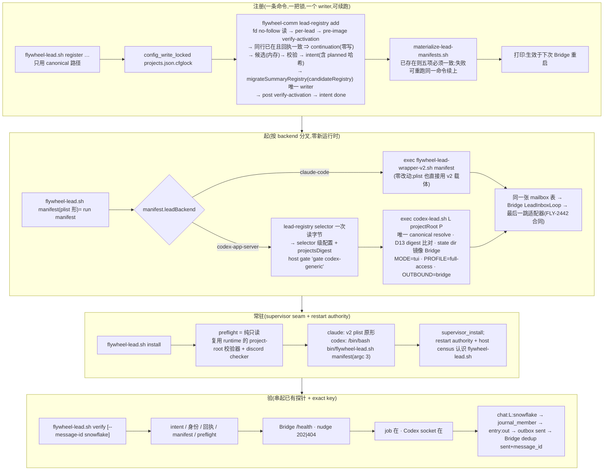

# FLY-2444 任意仓起一个 Lead — 实施计划

Issue: FLY-2444 (https://linear.app/geoforge3d/issue/FLY-2444/产品-任意仓起一个-lead最小闭环flywheel-lead-launcherclaude-codex-注册一行-一页文档raya)
日期: 2026-09-08
基于: research.md

> 成色标记:✅ founder / Lead 已拍 · 【实核】本机读码 / 实测(命令与行号在 research.md)· ⬜ 工程判断 · R1-n / R2-n / R3-n = Codex design review 第一 / 二 / 三轮第 n 条的处置 · L-n = Lead 裁定(ask 6f8d9a56)。
> ⛔ 本 plan 通过 design review 前不写实现码。**规范唯一来源 = 本 plan**;research.md 只保留事实。
> 版本:v4(R1 九条 + R2 十条 + R3 七条全部折入;范围 = `claude` + `codex/full-access`)。

## 0. 目标 · 非目标 · 授权 · gate

- **目标**(issue 三条):① `flywheel-lead` launcher,按名册 `backend` 分叉 Claude / Codex,起一个 Lead 进程并接入 mailbox → 最后一跳适配器(合同由 FLY-2442 出);② 注册一行:一条命令完成 projects.json 行 + summary 回执重铸 + manifest;③ 一页文档:装 / 注册 / 起 / 验。
- **范围收窄(R1-3)**:本单只交付 **`claude`** 与 **`codex` = `full-access` windowed TUI**。`companion` / `write-capable` 不在注册面。
- **前置收窄(R2-8)**:summary granularity 必须为 **`per-lead`**(生产现值);`per-project` 下 `register` 在 preflight 78 并说明。
- **前置收窄(R2-6)**:本入口只支持默认 state root `FLYWHEEL_STATE_DIR = $HOME/.flywheel`(Bridge `resolveCodexLeadStateDir` 与 `resolveDbPath` 固定用 `homedir()`,`lead-inbox-runtime.ts:1233`、`resolve-db-path.ts:21`);`host_config_load` 解析出非默认 root ⇒ 78。**`codex-lead.sh` 本身不改这一点**(R3-2,§3.3 D11)。
- **交付边界(✅ L-1)**:本单交付 = launcher + 注册命令 + 文档 + 隐居台架(temp home)证据;生产 projects.json 注册与 Bridge 重启是部署动作,归 FLY-2445 的 founder 窗口按本单文档执行。**文档必须「照着念就能跑」**:每步命令逐字可复制、每步有可验证的成功判据(哪张表出现哪一行、哪个日志出现哪一句),不得出现「按需调整 / 视情况」。
- **非目标**:不造发布流水线(FLY-2388)、不改打包机制(只登记清单);不做 Bridge 热加载;不改 Bridge 任何注册 / 授权代码;不迁 mufasa / infra-bot 手写 launcher;不动 Claude 入站(FLY-2443);不写 FLY-2442 的合同;不做 Raya 迁移本身(FLY-2445);不做语音;不改名册校验规则;不做 `unregister`;不做 crash 自动修复。
- **授权边界**:实现节点只写代码与测试,不在生产 `~/.flywheel` 注册任何 Lead、不重启 Bridge、不装 plist。
- **承接裁定(✅ 不重议)**:FLY-398 windowed TUI;FLY-350 `full-access` 与 `companion:true` 互斥;FLY-1726 单一权威、一次 resolve、launcher 只带 selector;FLY-2259 `CODEX_HOME = derive_codex_lead_home <key>`;FLY-2030 回执栅栏;FLY-1663 restart authority 只放行显式审过的载体;✅ L-2 三个默认:`tui` / `full-access` / 出站 `bridge` 且 **cross-dept 必须留空**(FLY-2442 的 cross-dept 授权未落地,声明 roundtable 频道会撞 runtime 硬门,`codex-lead-runtime.ts:616-628`);Codex home key = agentId;✅ L-3 回执按 `restart-services.sh:200-215` 的真实判据(路径 `~/.flywheel/state/summary-registry/migration-receipt.json`、`verify-activation` 同一命令)铸并在事务内自验。
- **FLY-2442 是实现 gate 也是完成 gate(R1-scope / R2-10)**:出站三键名、Bridge 出站探针与 exact idempotency-key 证据形态绑定 FLY-2442 **已批准并合入 main** 的合同。在它合入前,本单可以先合 registrar / launcher 的 staged PR,但 **FLY-2444 issue、最终 `implementation-evidence.md` 与「ready for FLY-2445」状态保持未完成**,直到 FLY-2442 合入、批 C 的实际出站 env 与批 F #10 取消 `SKIP` 并全绿。`SKIP(pending FLY-2442)` 只是中间态证据,不得进入最终验收报告。

## 1. 架构

## 2. 稳定身份(全文只用这些名字)

| 类别 | 名字 | 说明 |
|---|---|---|
| 入口脚本 | `scripts/flywheel-lead.sh` → `converge-flywheel-bin.sh` 原名复制为 **`~/.flywheel/bin/flywheel-lead.sh`**(mode 555;不做无扩展名别名,R2-3) | 动词:`register` `run` `preflight` `install` `stop` `verify` `recover`;**唯一位置参数且为已存在文件路径 ⇒ 等价于 `run <manifest>`**(plist 形,R3-1) |
| plist argv(codex) | `/bin/bash <bin>/flywheel-lead.sh <manifest>`(**argc 3**,`argv[2]` = manifest,与 v2 载体同形;`_lead_restart_plist_key_and_manifest` 不改) | R3-1 |
| plist argv(claude) | `/bin/bash <bin>/flywheel-lead-wrapper-v2.sh <manifest>`(既有已审载体) | `install` 直接渲染这一形 |
| host gate 载体名 | `codex-generic`(`flywheel-lead.sh` 内字面量 `"$HOST_TMUX_GATE_BIN" gate codex-generic` / `verify codex-generic`) | census 用 grep 认 |
| 事务命令 | `flywheel-comm lead-registry add` / `lead-registry recover` / `lead-registry selector` | 三个子命令,`packages/flywheel-comm/src/commands/lead-registry.ts` + 纯函数 `lead-registry-add.ts`、`lead-registry-recover.ts` |
| 唯一 writer | `migrateSummaryRegistry` 扩可选输入 `candidateRegistry` + 测试钩子 `afterProjectsRename?` | `summary-registry-migration.ts:300-380` |
| canonical 路径(R2-5) | `PROJECTS = $HOME/.flywheel/projects.json`;`RECEIPT = $HOME/.flywheel/state/summary-registry/migration-receipt.json`(= `restart-services.sh:203`,L-3);summary root `= $HOME`;`INTENT = <RECEIPT>.lead-registry-intent.json` | shell 入口不接受路径覆盖;TS 的 `--projects-file/--receipt-file/--summary-config-home` 是测试接口,help 标 `(test only)` |
| 锁 | `<PROJECTS>.cfglock`,`config_write_locked <lock> 5 …`;超时 75;TS 端 `add`/`recover` 都要求 `FLYWHEEL_SUMMARY_CONFIG_LOCK_HELD=1` | 无锁拒写 |
| 备份 | `<PROJECTS>.bak-fly2444-<UTC 戳>`、`<RECEIPT>.bak-fly2444-<同戳>` | 只在 intent 里被引用 |
| intent(R2-7) | `{schemaVersion:1, phase:"pending"\|"done", leadKey, startedAt, projectsShaBefore, receiptDigestBefore, projectsShaPlanned, receiptDigestPlanned, projectsShaAfter?, receiptDigestAfter?, backups:{projects, receipt}}`;temp+rename,no-follow | crash 恢复锚 |
| manifest | `~/.flywheel/manifests/
-<L>.json`(既有;含 `projectsFile`) | `materialize-lead-manifests.sh` create-if-absent |
| launchd label | `com.flywheel.lead.
-<L>`;supervisor spec `name = "lead.
-<L>"` | 与 restart-services / patrol / recover 一致 |
| 日志 | `~/.flywheel/logs/lead-
-<L>.log` | 与 FLY-2216 raya 模板一致 |
| persona | `<projectRoot>/.lead/<L>/identity.md` | 两 harness 同处 |
| Codex home | `CODEX_HOME = derive_codex_lead_home "<L>"` = `~/.codex-<L>`;`FLYWHEEL_CODEX_BIN = $CODEX_HOME/packages/standalone/current/codex` | key = agentId(✅ L-2) |
| Codex state dir | **唯一 owner = `codex-lead.sh`**,root `${FLYWHEEL_STATE_DIR:-$HOME/.flywheel}/state/codex-lead`(既有调用方不变,R3-2),三分支镜像 Bridge `resolveCodexLeadStateDir(P,L)` 生产调用形;入口已强制 root 默认 ⇒ 生产两端一致 | `lead-inbox-runtime.ts:1204-1264` |
| 名册漂移栅栏(R2-5 / R3-6) | `lead-registry selector` 一次 fd 读 `$PROJECTS` 原始字节 → `projectsDigest = sha256(rawText)`(与 `resolveLeadIdentity` 同式,`lead-identity.ts:504-516`,**含末尾换行**)→ 入口导出 `FLYWHEEL_LEAD_EXPECTED_PROJECTS_DIGEST`;`codex-lead.sh` resolve 后与 `FLYWHEEL_LEAD_PROJECTS_DIGEST` 比对 | D13 |
| 出站证据链 | mailbox `delivery_id = chat:<L>:<snowflake>` → Lead `journal.db` `journal_member.delivery_id → entry_id` → key `<entry_id>:out` → Lead `outbox.db` `status=sent` → Bridge `~/.flywheel/codex-lead-outbound-dedup.db` `outbound_dedup(idempotency_key=<entry_id>:out).status=sent, message_id` | `chat-delivery-envelope.ts:54-56`;`SqliteJournalStore.ts:104-109`;`LeadInputRouter.ts:331-335`;`SqliteOutboundDedupStore.ts:23-47`;`codex-lead-runtime.ts:890` |
| 出站检查器 | `packages/teamlead/src/bin/inspect-lead-outbound.ts` → `dist/bin/inspect-lead-outbound.js --state-dir --delivery-id --dedup-db` | 只读、参数化 SQL、JSON |
| project-root 校验器(R3-5) | `packages/teamlead/src/bin/preflight-codex-project-root.ts` → `dist/bin/preflight-codex-project-root.js --project-root --state-dir --codex-home`,内部调用**同一个** `resolveFullAccessProjectRoot`(`codex-lead-runtime.ts:455`) | 只读;不复制 shell 规则 |
| 出站 env | `FLYWHEEL_CODEX_LEAD_OUTBOUND=bridge`;`FLYWHEEL_BRIDGE_URL`;`FLYWHEEL_API_TOKEN` | **名字以 FLY-2442 合入的合同为准**;§3.3 只留一处映射 |
| teamlead 校验器 | `FLYWHEEL_TEAMLEAD_PROJECTS_VALIDATOR = $FLYWHEEL_DIR/packages/teamlead/dist/bin/validate-projects.js` | `commands/summary-registry.ts:25-50` |
| 文档 | `engineering/doc/FLY-2444-flywheel-lead-launcher/lead-in-any-repo.md` | 一页文档 |
| 退出码 | `0` 成功;`64` 用法;`75` 锁超时;`78` 配置 / 前置缺失 / 需人工恢复;`70` 内部错误(已回滚) | 每个动词共用 |

## 3. 设计

### 3.1 `flywheel-comm lead-registry add`(事务核,可续跑)

**输入**:`--project-name` `--project-root` `[--project-repo]` `[--general-channel]` `[--memory-allowed-users a,b]`(缺省不写;给了必须非空)`--lead-id` `--chat-channel` `--bot-token-env` `--bot-user-id` `--harness claude|codex` `[--model]` `[--effort]` `[--model-context-window]` `[--summary-role recipient|producer|exempt]`(默认 `recipient`)`[--labels a,b]`(默认 `[<lead-id>]`)`[--can-spawn-runners true|false]`(默认 `false`)`[--dry-run]`;测试接口 `--projects-file` `--receipt-file` `--summary-config-home`。
`--harness` 映射:`claude` ⇒ `backend:"claude-code", carrier:"v2"`;`codex` ⇒ `backend:"codex-app-server", codexProfile:"full-access"`。

**文件读取(R1-6 / R2-7)**:`openSync(path, O_RDONLY|O_NOFOLLOW)` → `fstat` 常规文件 → 从 fd 读;父目录 `lstat` 非符号链接。写入 temp + rename + 目录 fsync。`migrateSummaryRegistry` 内部仍按路径 IO(`summary-registry-migration.ts:300-352`):本单持锁内、调用前一刻再 no-follow 检查一次;残余窗口写进 §7。

**步骤(纯函数 `planLeadRegistryAdd(registry, receipt, granularity, input) → {kind:"add"|"continuation", candidateRegistry, candidateText, manifest, leadKey, planned:{projectsSha, receiptDigest}}` + 执行器)**:
1. intent 存在且 `pending` ⇒ `lead_registry_recovery_required`,78,零写入。
2. granularity 必须 `per-lead`,否则 `lead_registry_granularity_unsupported`,78。
3. **pre-image**:`verifySummaryRegistryActivation` ok,否则 `lead_registry_preimage_stale`,78。
4. **续跑判定(R3-3)**:若名册里已有 (P,L),且**该行 deep-equal 于本次输入应用默认值后的候选行**(字段集与值逐一相等,顺序无关),且项目级 `projectRoot/projectRepo/generalChannel` 与输入一致 ⇒ `kind=continuation`:输出 `{ok:true, continuation:true, leadKey}`,**零写入**,退出 0(让 shell 重试 manifest)。已有 (P,L) 但任一字段不同 ⇒ `lead_registry_lead_exists`(拒绝,打印差异字段名)。L 在**别的**项目 ⇒ `lead_registry_lead_exists`。
5. 项目存在 ⇒ `projectRoot` 必须相等(`lead_registry_project_root_conflict`),追加;不存在 ⇒ 新项目 `{projectName, projectRoot, projectRepo?, generalChannel?, memoryAllowedUsers?(仅给了才写), leads:[…]}`。
6. 候选校验:`compileLeadIdentityRows(candidate)` → 候选写 temp → `deps.validateTeamleadCandidate(tempPath)`(编译版 validator;缺 ⇒ `lead_registry_validator_missing`,78)→ `resolveLeadIdentity` 对 (P,L) 成功。
7. manifest 从已校验候选生成;`candidateText = JSON.stringify(candidate, null, 2) + "\n"`(与 `migrateSummaryRegistry:324` 同式)⇒ `projectsShaPlanned`;`receiptDigestPlanned = compileSummaryAssignments(candidate, per-lead).digest`。
8. `--dry-run` ⇒ 输出候选行 / manifest / planned 哈希 / 将写路径(或 continuation 判定),退出 0,零写入。
9. 写(唯一 writer):备份两文件 → intent(`pending`,before + planned + 备份路径)→ `migrateSummaryRegistry({projectsPath, candidateRegistry, assignmentsPath(临时), receiptPath, expectedSha256 = sha256(磁盘现文件), homeDir})` → 断言磁盘 `sha256(projects) == projectsShaPlanned` 且回执 `summaryAssignmentDigest == receiptDigestPlanned` → `verifySummaryRegistryActivation` ok(= restart-services 同一判据,L-3)→ intent `done` → 删 intent。
10. **异常回滚**(throw):备份恢复(先回执后名册)→ 哈希 == before → 删 intent → `lead_registry_rolled_back:<原因>`,70;恢复失败 ⇒ 保留 intent,`lead_registry_rollback_failed` + 备份路径,70。
11. 输出 `{ok:true, leadKey, projectsFile, receiptFile, backups, effectiveAt:"next-bridge-restart"}`。

### 3.2 `flywheel-comm lead-registry recover`(R3-4)与 `lead-registry selector`(R3-6)

**`recover`**:参数只有测试接口 `--projects-file` `--receipt-file` `--summary-config-home`(缺省 canonical);要求 `FLYWHEEL_SUMMARY_CONFIG_LOCK_HELD=1`。逻辑(纯函数 `classifyRecovery(intent, currentProjectsSha, currentReceiptDigest, activationOk)`):

| intent | 当前 (projects, receipt) | 判定 | 动作 | 退出 |
|---|---|---|---|---|
| 不存在 | — | 无事可做 | 输出 `{ok:true, state:"none"}` | 0 |
| schema/phase 非法 | — | 拒绝 | `lead_registry_intent_invalid` | 78 |
| `done` | — | 上次收尾前中断 | 删 intent | 0 |
| `pending` | (before, before) | 未落任何写 | 删 intent | 0 |
| `pending` | (planned, before) | 两次 rename 之间 crash | fd 绑定读 `backups.projects` → temp+rename+fsync 恢复名册 → 重算 == before → 删 intent | 0 |
| `pending` | (planned, planned) 且 `verify-activation` ok | 事务已完成只差收尾 | intent `done` → 删 | 0 |
| `pending` | 其他 | crash 后有人另行写过 | **拒绝**,打印四组哈希与备份路径 | 78 |

每个动作后先重新做哈希 / activation verify 再删 intent。shell `flywheel-lead.sh recover` = `config_write_locked` 包一层,不自己碰文件。

**`selector --project P --lead L [--projects-file]`**:一次 fd no-follow 读原始字节 → `projectsDigest = sha256(rawText)` → 解析 → 输出 `{projectsDigest, projectName, leadId, projectRoot, chatChannel, generalChannel?, backend, codexProfile?, botTokenEnv}`;找不到 (P,L) ⇒ 78。**shell 不再自己读 `$PROJECTS` 字节**(command substitution 会剥末尾换行,R3-6)。

### 3.3 `flywheel-lead.sh`(shell 入口)

公共前置:`host_config_load` → `FLYWHEEL_STATE_DIR == $HOME/.flywheel`(否则 78)→ `FLYWHEEL_COMM_CLI` / `FLYWHEEL_TEAMLEAD_PROJECTS_VALIDATOR`(缺 ⇒ 78)→ `jq` `node` 在。`$FLYWHEEL_DIR` 只来自 host-config。

| 动词 | 行为 | 失败 |
|---|---|---|
| `register <§3.1 公开参数>` | canonical 路径;`config_write_locked <cfglock> 5 env FLYWHEEL_SUMMARY_CONFIG_LOCK_HELD=1 node $CLI lead-registry add …`(`ok` 或 `continuation` 都继续)→ `materialize-lead-manifests.sh`;manifest 已存在 ⇒ `projectName/leadId/projectDir/projectsFile/leadBackend.backendId` 五项必须一致,否则 78「rm 该 manifest 后重跑」→ 打印:生效时机 / 下一步 `preflight`+`install` / `verify --stage registered` | 75 / 透传 / 78;**materialize 失败后重跑同一命令 = 续跑**(R3-3) |
| `<manifest>`(唯一位置参数,plist 形)≡ `run <manifest>`;`run --project P --lead L` = 糖 | 读 manifest(缺 ⇒ 78);`backend = manifest.leadBackend.backendId`(缺 ⇒ `claude-code`);**claude** ⇒ `exec /bin/bash <bin>/flywheel-lead-wrapper-v2.sh <manifest>`;**codex** ⇒ §3.4 | 78 逐项列全 |
| `preflight <manifest>` | §3.5 纯只读 | 任一 FAIL ⇒ 78 |
| `install --project P --lead L` | `preflight` 通过 → spec:claude `exec = "/bin/bash <bin>/flywheel-lead-wrapper-v2.sh <manifest>"`;codex `exec = "/bin/bash <bin>/flywheel-lead.sh <manifest>"`;共同 `{name:"lead.P-L", kind:"service", keepAlive:true, throttleInterval:30, stdout:"<state>/logs/lead-P-L.log"}` → `FLYWHEEL_SUPERVISOR_DARWIN_INSTALL=1 supervisor_install` | 目标 plist 已存在且 argv 不是上述两形之一 ⇒ 78;preflight 失败 ⇒ 不写 plist、不 bootstrap |
| `stop --project P --lead L` | bootout + 删 plist(仅限两形);不删 manifest、不动名册 / 回执;打印「Bridge 仍会为该 Lead 泵;注销见 §3.7」 | 非两形 ⇒ 78 |
| `recover` | `config_write_locked … lead-registry recover` | 透传 |
| `verify …` | §3.6 | 任一 FAIL 退出 1 |

### 3.4 Codex 分支:selector 级 env + `codex-lead.sh` 唯一 owner

**`run` 的 codex 分支**:① `set -a; source ~/.flywheel/.env`;② `node $CLI lead-registry selector --project P --lead L` 一次拿到 selector 级配置 + `projectsDigest`(`codexProfile` 必须 `full-access`;`.env` 里 `${botTokenEnv}` 必须非空 —— 只做存在检查,不导出 token);③ host gate `gate codex-generic` + `verify codex-generic`(逻辑抽成 `scripts/lib/lead-host-tmux-gate.sh`;三份手写 wrapper 不改);④ 导出下表 env 后 `exec codex-lead.sh L <projectRoot> P`。入口不调用 resolver、不导出身份 env。

| env(全名) | 值 | 谁设 |
|---|---|---|
| `FLYWHEEL_PROJECTS_FILE` / `FLYWHEEL_LEAD_EXPECTED_PROJECTS_DIGEST` | `$PROJECTS` / selector 的 `projectsDigest` | 入口 |
| `FLYWHEEL_CODEX_LEAD_MODE` | `tui` | 入口 |
| `FLYWHEEL_CODEX_LEAD_PROFILE` / `FLYWHEEL_CODEX_LEAD_SANDBOX` | `full-access` / `workspace-write` | 入口 |
| `FLYWHEEL_LEAD_CHAT_CHANNEL_ID` | selector 的 `chatChannel` | 入口 |
| `FLYWHEEL_LEAD_CROSS_DEPT_CHANNEL_IDS` | **`unset`,必须**(✅ L-2;`.env` 带入则 unset 并打印;文档明写「等 FLY-2442 落地后才允许配 cross-dept」) | 入口 |
| `FLYWHEEL_LEAD_CORE_CHANNEL_ID` | 不设 | — |
| `FLYWHEEL_CODEX_LEAD_PROJECT_DIR` / `FLYWHEEL_CODEX_TUI_CWD` | `realpath(projectRoot)` | 入口 |
| `FLYWHEEL_CODEX_LEAD_HOME_KEY` → `CODEX_HOME` / `FLYWHEEL_CODEX_BIN` | `L` → `derive_codex_lead_home L` / `$CODEX_HOME/packages/standalone/current/codex` | 入口 |
| `FLYWHEEL_COMM_DB` / `FLYWHEEL_COMM_CLI` | `$HOME/.flywheel/comm/P/comm.db` / 公共前置 | 入口 |
| `FLYWHEEL_LEAD_ACTIONS_MAIN_JS` / `FLYWHEEL_LEAD_ACTIONS_NODE_BIN` | `$FLYWHEEL_DIR/packages/teamlead/dist/lead-backends/codex/lead-actions/lead-actions-main.js` / `command -v node` | 入口 |
| `FLYWHEEL_LEAD_ACTIONS_STATE_DIR` / `FLYWHEEL_CODEX_LEAD_STATE_DIR` | 由 `codex-lead.sh` 设(D11 / D12) | codex-lead.sh |
| `FLYWHEEL_LEAD_SYSTEM_PROMPT_FILES` | `<projectRoot>/.lead/L/identity.md` | 入口 |
| `FLYWHEEL_CODEX_LEAD_OUTBOUND` / `FLYWHEEL_BRIDGE_URL` / `FLYWHEEL_API_TOKEN` | `bridge` / `.env`(缺则 `http://localhost:9876`)/ `.env` 的 `FLYWHEEL_API_TOKEN` 或 `TEAMLEAD_API_TOKEN`(缺 ⇒ 78)。**以 FLY-2442 合入合同为准** | 入口 |
| `FLYWHEEL_ROOT` / `FLYWHEEL_TEAMLEAD_ROOT` | `$FLYWHEEL_DIR` / `$FLYWHEEL_DIR/packages/teamlead` | 入口 |
| `DISCORD_BOT_TOKEN` 及全部身份 env | resolver 从 `.env` `${!botTokenEnv}` 取(`canonical-lead-identity.sh:150-197`) | codex-lead.sh(经 resolver) |

**`codex-lead.sh` 的四处改动**(现有调用方:529 台架经 `qa-codex-lead-wrapper.template.sh:45-55` 以 full-access 调它,slot-local `FLYWHEEL_STATE_DIR`,`scripts/test-deploy.sh:1507-1523`;R2-9 / R3-2):
- D7:`:146` `ensure-daemon` 仅当 `FLYWHEEL_CODEX_LEAD_PROFILE != full-access` 才调。**对 529 full-access 形态是行为变化**(daemon 改由 TUI runtime 独占,`codex-lead-tui-runtime.ts:1052-1075`);批 D 用 529 台架验证 daemon 由 runtime 起、一次真实 restart 后 heartbeat / socket / window 收敛。
- D11:state dir 规则镜像 `resolveCodexLeadStateDir(P,L)`:① `FLYWHEEL_CODEX_LEAD_STATE_DIRS` 已设 ⇒ 必须是 JSON 且 `[P][L]` 为绝对路径,否则 78;② 否则 legacy `<root>/<L>` **已存在** ⇒ 用它;③ 否则 hex 形。**root = `${FLYWHEEL_STATE_DIR:-$HOME/.flywheel}/state/codex-lead`(既有公式,不改;R3-2)**。生产通用路径由入口强制 root 默认,与 Bridge `homedir()` 一致;529 继续用 slot root + 启动后给 Bridge 的显式 `STATE_DIRS` map(`test-deploy.sh:1921-1923`),不在本单改。
- D12:`FLYWHEEL_LEAD_ACTIONS_STATE_DIR` 缺省 = `STATE_DIR`;已设且 ≠ ⇒ 78(529 显式注入的 slot-local 值与 D11 在 slot root 下算出的相同,`qa_launchd_codex_state_dir` 同公式 —— 批 D 断言)。
- D13:resolve 后 `FLYWHEEL_LEAD_EXPECTED_PROJECTS_DIGEST` 已设且 ≠ `FLYWHEEL_LEAD_PROJECTS_DIGEST` ⇒ `identity_projects_digest_drift`,78;未设跳过。
- 新只读子命令 `codex-lead.sh --print-state-dir <L> 
`:只输出 D11 结果,零副作用(供 `verify` #8)。

### 3.5 `preflight`(R1-8 / R2-2 / R3-5):纯只读清单

不 exec wrapper-v2 / `codex-lead.sh`,不调 `gate`/`verify`。检查项(全部列出再退):

| 共同 | manifest 在且五项一致;`.lead/L/identity.md` 可读;`.env` 有 `${botTokenEnv}`;`$FLYWHEEL_COMM_CLI` / validator 在;intent 非 pending;`tmux` 可执行;host gate 脚本在 |
|---|---|
| claude | `claude` 可执行;`CHECK=~/.flywheel/bin/check-discord-plugin.sh` 与 `UPDATE=~/.flywheel/bin/update-discord-plugin.sh` **都可执行**;`$CHECK --print-contract == discord@flywheel-plugins/v1`;**运行 `$CHECK`**(只读 registry / marker / SHA 校验,`check-discord-plugin.sh:22-129`)通过 —— 与 `claude-lead.sh:1058-1129` 同一组判据;wrapper-v2 在 bin 且与仓库源 `cmp` 相等 |
| codex | `$CODEX_HOME` 目录、`$FLYWHEEL_CODEX_BIN` 可执行、`$CODEX_HOME/auth.json` 在、`codex-home-link-truth.sh --lead P/L $CODEX_HOME` 通过、`lead-actions-main.js` 在、`codex-lead-tui-runtime.js` 在、`codexProfile == full-access`、**`preflight-codex-project-root.js --project-root <realpath> --state-dir <D11 结果> --codex-home $CODEX_HOME` 通过**(= `resolveFullAccessProjectRoot` 的硬规则:不得等于 / 包含 `$HOME`,不得与 `~/.flywheel` / state dir / `CODEX_HOME` 重叠,`codex-lead-runtime.ts:448-510`)、host gate **`probe codex-generic`** 通过、`FLYWHEEL_API_TOKEN`/`TEAMLEAD_API_TOKEN` 在 |

**host gate 新动作 `probe <carrier>`**(改 `scripts/host-tmux-selection-gate.sh`):与 `gate` 同一段计算,但 applicability 为 `required` 且 marker 缺失时不写 marker;不建 receipt 目录、不写 receipt、不发 alert;输出同 `gate` 判定行与退出码。`gate`/`verify` 字节不变。测试:`probe` 前后 state root 树 + 哈希零差异。

`install` 只在 `preflight` 退出 0 时写 plist;测试对 state root、manifests、plist 目录做前后树/哈希比较。

### 3.6 `verify` 的检查序列

| # | 检查 | 判定 | 阶段 |
|---|---|---|---|
| 1 | intent 不存在或 `done` | `pending` ⇒ FAIL「需 `recover`」 | registered+ |
| 2 | `lead-identity resolve --projects-file $PROJECTS` | ok,`backend` = manifest `leadBackend.backendId` | registered+ |
| 3 | `summary-registry verify-activation --projects-file $PROJECTS --receipt-file $RECEIPT` | ok | registered+ |
| 4 | `preflight <manifest>` | 全 PASS | registered+ |
| 5 | `GET $BRIDGE/health` | `ok:true`,打印 `buildSha` | installed+ |
| 6 | `POST $BRIDGE/api/lead-inbox/nudge {leadId:L, project:P}` | 202 = 泵在;404 ⇒ FAIL「注册已成功;Bridge 尚未重启,泵不存在」 | installed+ |
| 7 | job:`launchctl print gui/<uid>/com.flywheel.lead.P-L` 有 `state = running` 且恰一个 pid | — | live |
| 8 | codex:`<stateDir>/lead-inbox.sock` 是 socket(stateDir = `codex-lead.sh --print-state-dir L P`);claude:`~/.claude/teams/L/inboxes/` 在 | — | live |
| 9 | `--message-id <snowflake>` ⇒ `delivery_id = chat:L:<snowflake>`;`flywheel-comm message-status <delivery_id> --db $HOME/.flywheel/comm/P/comm.db` | 有行且 `state=ACKED`;打印 `delivered_at` | live |
| 10 | codex + `--message-id`:`node dist/bin/inspect-lead-outbound.js --state-dir <stateDir> --delivery-id chat:L:<snowflake> --dedup-db ~/.flywheel/codex-lead-outbound-dedup.db` ⇒ 每跳 exact key;任一跳缺 ⇒ FAIL 指出断点 | 全链 ⇒ 回复经 Bridge 出站 | live;**FLY-2442 合入后取消 SKIP** |

`--stage registered` 只跑 #1–#4;#6 的 404 是预期中间态。

### 3.7 注销(人工,R1-9 / R3-7)

本单不提供 `unregister`。真正移除:`stop` → `config_write_locked` 内手改名册删行 → `scripts/migrate-summary-registry.sh <PROJECTS> <assignments.json> <RECEIPT> <sha>` 用去掉该行的 assignments 重铸回执 → 删 manifest → 等 Bridge 重启。
**`migrate-summary-registry.sh` 改一处(R3-7)**:`FLYWHEEL_COMM_CLI` 未设时 `source lib/host-config.sh` 并默认 `$FLYWHEEL_DIR/packages/flywheel-comm/dist/index.js`(存在则走 dist 分支;不存在才回落 `pnpm exec tsx`),打包态与 monorepo 同一条命令可跑;批 G 从安装树真跑一次这条 re-mint。一页文档给出逐字命令(含 assignments.json 的生成命令:`jq` 从当前回执 `.assignments` 过滤掉该行 + `.projectAggregators` 原样)。

### 3.8 restart authority / inventory / host census 接入(R2-1 / R3-1)

- `scripts/lib/lead-restart-lifecycle.sh` `_lead_restart_validate_authority_once`(`:528-590`)新增 case `flywheel-lead.sh)`:`argc == 3`;`argv[2] == manifest`;(P,L) 与 label 一致(既有);`project_backend == codex-app-server`;`manifest_backend ∈ {"", codex-app-server}`;名册行 `codexProfile == "full-access" && canSpawnRunners == false && companion != true`;`backend=codex-app-server`。Claude 不走本 case。
- `_lead_restart_plist_key_and_manifest`(`:699-708`)**不改**(argc 3 的 `argv[2]` 就是 manifest;R3-1 已把 plist 形定为无子命令)。
- `scripts/host-tmux-selection-gate.sh` census(`:103-170`):basename 列表加 `flywheel-lead.sh`,`expected_carrier=codex-generic`;字节 `cmp`;三条字面量 grep 沿用。
- `converge-flywheel-bin.sh:155` 不加。
- `resident-codex-lead-recover.sh` / `codexResidencyPatrol` 仍只认三份手写 wrapper —— 通用载体暂不支持 `codexResidencyPatrol:true`;`register` 不写该字段;记 follow-up。
- **Lead 约束(✅ ask 43e18197,四条)**:① 两个文件各**恰好加一个字面量 case**,不许通配 / 前缀 / 模式匹配;② 新条目照抄既有条目的绑定强度(label / manifest / backend / profile / 部署字节 `cmp`),一样不能少;③ 阴性对照:未登记 basename 仍必须 `die`,有测试证明;④ 不动现有四条,不动 restart 授权的任何其它逻辑。
- 回归(批 E):**断言五种载体 plist 的完整 `ProgramArguments` 数组与 inventory 提取的 manifest 路径**(不是字符串包含);新形 + 四种既有形同批 census 通过;未登记 basename 仍拒;authority 对新形的正反格;**dry-run 证据(Lead 要求)**:在仓形夹具里加载「现有整批 Lead 形状 + 一个新形」后,`restart-services.sh` 的 Lead 波次清单收敛与 census 对**现有整批**仍放行(不是只证明新 Lead 能过),输出贴进 `implementation-evidence.md`。

### 3.9 一页文档 `lead-in-any-repo.md`(✅ L-1)

四段,Claude / Codex 只在「装」不同。**每步 = 一条可逐字复制的命令 + 一条成功判据**(输出里的哪一行 / 哪张表的哪一行 / 哪个日志的哪一句);不出现「按需 / 视情况」;所有占位符只有 `<project>` `<lead-id>` `<channel-id>` `<bot-user-id>` `<BOT_TOKEN_ENV>` `<snowflake>` 六个,开头一次性定义。
1. **装**:Flywheel 已装且 Bridge 在跑(`curl /health` ⇒ `"ok":true`);`~/.flywheel/.env` 有 `<BOT_TOKEN_ENV>` + `TEAMLEAD_API_TOKEN`(`grep -c` ⇒ 1);仓里有 `.lead/<lead-id>/identity.md`;summary 模式 per-lead(`jq .granularity` ⇒ `per-lead`);Claude:`claude --version` + `check-discord-plugin.sh`(⇒ 退出 0);Codex:standalone codex 装进 `~/.codex-<lead-id>` + founder 登录(引用 FLY-2259 §4.0.2 逐字命令;判据 `auth.json` 在、`codex --version` 输出)。
2. **注册**:`flywheel-lead.sh register …`(判据:输出含 `"effectiveAt":"next-bridge-restart"`;`jq` 查名册出现该行;`verify-activation` ⇒ `"ok":true`);明写「生效于下次 Bridge 重启(班车 00:00 / 12:00 或 founder 票)」。
3. **起**:`preflight`(判据:全 PASS)→ `install`(判据:`launchctl print` 有 `state = running`;日志出现 `tui-window: real TUI up (<project>-<lead-id>` / Claude 出现 `[lead] … Comm DB:`)。
4. **验**:`verify --stage live`(判据:#1–#8 PASS);打一句,复制 snowflake,`verify --message-id`(判据:#9 `state=ACKED`;#10 全链;FLY-2442 合入前 #10 显示 `SKIP(pending FLY-2442)` —— **该状态不算验收通过**)。
附:cross-dept 频道:「等 FLY-2442 落地后才允许配」;回滚 / 注销 / crash 恢复(§3.7、`recover`)逐字命令。

### 3.10 登记与闭包(R1-7 / R2-3 / R2-4 / R3-7)

- `scripts/package-onboard.sh` `PO_SCRIPT_FILES` 加 `flywheel-lead.sh` `flywheel-config-lock.sh` `flywheel-config-lock.py` `migrate-summary-registry.sh` `lib/lead-host-tmux-gate.sh`;`PO_PACKAGE_ASSET_FILES` 加 `teamlead:scripts/lib/canonical-lead-identity.sh`;`package-onboard-files.allow` 同步;`audit-grep-allowlist.tsv` 按需。
- `converge-flywheel-bin.sh:81/:92` `FILES` 加 `flywheel-lead.sh lib/lead-host-tmux-gate.sh`。
- `packages/flywheel-comm/src/index.ts` 注册 `lead-registry`;`packages/teamlead` build 产出 `dist/bin/inspect-lead-outbound.js`、`dist/bin/preflight-codex-project-root.js`。
- CI:`scripts/__tests__/flywheel-lead.test.sh`、`host-tmux-selection-gate-probe.test.sh`、`lead-restart-lifecycle-generic-carrier.test.sh`、`migrate-summary-registry-cli-resolve.test.sh` 加进 `ci.yml` 枚举;teamlead 侧 `codex-lead-args.test.sh` 扩格、新增 `codex-lead-state-dir-parity.test.sh`。

## 4. 负向守卫(每条一格测试)

| 场景 | 行为 |
|---|---|
| intent `pending` | `register`/`preflight`/`run`/`verify` 78 + 四组哈希;`recover` 按 §3.2 表,非枚举态拒 |
| `recover`:无 intent / `done` / schema 非法 / 并发第二次调用(锁) | 0 / 0 / 78 / 75 |
| granularity ≠ per-lead / state root ≠ `$HOME/.flywheel` | 78,零写入 |
| pre-image 回执与名册不一致 | `lead_registry_preimage_stale` 78 |
| 同 (P,L) 已在且 deep-equal + 回执一致 | `continuation`,零写入,退出 0 |
| 同 (P,L) 已在但任一字段不同 / L 在别的项目 / root 冲突 / 校验失败 / validator 缺 | 各自错误码,零写入 |
| **TS 成功后 materialize 首次失败,重跑同一公开命令** | 成功;名册 / 回执字节不变(R3-3) |
| 全新项目不带 `--memory-allowed-users` | 通过真实 validator;空列表 ⇒ 64 |
| 名册 / 回执 / intent / manifest / plist 为符号链接或非常规文件 | 拒绝 |
| 无 `LOCK_HELD` / 锁超时 / 锁内 sha 不等 / 回执写 throw / 子进程在 `afterProjectsRename` 被 kill / 落盘哈希 ≠ planned | 拒写 / 75 / 回滚 70 / 回滚 70 / pending split ⇒ recover 恢复 / 回滚 70 |
| manifest 已存在且五项任一不一致 | 78 |
| `selector`:文件末尾单换行 / 无换行 / 额外空白 | `projectsDigest` 与 resolver 的 `FLYWHEEL_LEAD_PROJECTS_DIGEST` 逐字相等(三格) |
| `run` codex:selector 与 resolve 之间名册被替换 | D13 78 |
| `run` codex:`codexProfile != full-access` / `.env` 带入 cross-dept | 78 / unset + 打印 |
| state dir 三分支;非法 `STATE_DIRS`;`LEAD_ACTIONS_STATE_DIR` 冲突;529 slot root 下 D11 == `qa_launchd_codex_state_dir` | 逐字相等 / 78 / 78 / 相等 |
| `preflight`:projectRoot == `$HOME` / 是 `$HOME` 祖先 / 在 `.flywheel` 下 / 与 CODEX_HOME 或 state dir 重叠 | 78(经真实 `resolveFullAccessProjectRoot`) |
| `preflight` claude:checker 缺 / updater 缺 / contract 不等 / checker 失败 | 78 |
| `preflight` / `probe` | state root、manifests、plist 目录前后零差异 |
| `install`:preflight 失败 / 非两形 plist 存在 | 不写 plist、零差异 / 78 |
| authority:新形 argc ≠ 3 / argv[2] ≠ manifest / backend 非 codex / profile 非 full-access | 拒 |
| inventory:五种载体 `ProgramArguments` 完整数组 → manifest 提取 | 逐一断言 |
| census:同批五形通过;未登记 basename 拒 | — |
| `migrate-summary-registry.sh`:`FLYWHEEL_COMM_CLI` 未设、dist 在 / 不在 | 走 dist / 回落 tsx |
| `verify` #6 404 / #10 更晚无关出站 | FAIL 文案「等 Bridge 重启」/ 不算通过 |

## 5. 迁移与回滚边界

- **迁移**:无名册字段、无回执格式变化;三份手写 launcher / wrapper / plist 模板零字节不动。**行为变化只有一处**:529 full-access 的 daemon 改由 TUI runtime 起(D7)。
- **回滚(注册)**:throw 自动回滚;crash 走 `recover` 枚举状态;备份只在 intent 引用范围内有效。
- **回滚(常驻)**:`stop`。
- **回滚(代码)**:revert PR;authority / census / 登记清单跟随;回滚 runbook 第一步先 `stop` 已装的 `flywheel-lead.sh` 形 Lead(否则 census 会拒整批)。

## 6. TDD 批次

每批:失败测试 → 最小实现 → 保绿重构 → 独立 commit → `progress.md`。仓门:`pnpm -r build && pnpm --filter flywheel-comm test && pnpm --filter flywheel-teamlead test -- --exclude '**/tmux-viewer.macos.test.ts' && bash scripts/__tests__/flywheel-lead.test.sh && bash scripts/__tests__/host-tmux-selection-gate-probe.test.sh && bash scripts/__tests__/lead-restart-lifecycle-generic-carrier.test.sh && bash scripts/__tests__/migrate-summary-registry-cli-resolve.test.sh && bash packages/teamlead/scripts/__tests__/codex-lead-args.test.sh && bash packages/teamlead/scripts/__tests__/codex-lead-state-dir-parity.test.sh`。

| 批 | 内容 | 测试 |
|---|---|---|
| A | `lead-registry-add.ts` / `lead-registry-recover.ts` 纯函数;`migrateSummaryRegistry` 加 `candidateRegistry` + `afterProjectsRename` 钩子 | 新项目 / 追加 / continuation 判定(deep-equal 正反)/ 重复 / root 冲突 / 缺 aggregator / 默认值 / planned 哈希确定性;`classifyRecovery` 七态;`candidateRegistry` 与 `source` 同回执 |
| B | `commands/lead-registry.ts`(`add` / `recover` / `selector`) | temp home,真实 `migrateSummaryRegistry` + 真实编译版 validator:成功路径 intent 删且哈希 == planned;dry-run 零写;granularity 拒;pre-image 拒;continuation 零写;stale sha 回滚;throw 回滚;子进程 `process.exit` ⇒ pending split ⇒ `recover` 恢复;(planned,planned) ⇒ done;其他态拒;symlink 拒;无 LOCK_HELD 拒;`selector` 三种末尾形态 digest == resolver |
| D | `codex-lead.sh` D7 / D11 / D12 / D13 / `--print-state-dir`;`preflight-codex-project-root.ts` | `codex-lead-args.test.sh` 扩格;parity 三分支 + 529 slot root 一致;project-root 校验器四负格;529 台架真实起停验证 D7 |
| C | `scripts/flywheel-lead.sh` `register` / `run` / `preflight` / `recover`(仓形夹具;codex 分支跑真实 `canonical-lead-identity.sh` → 真实 `codex-lead.sh`,只 stub TUI runtime 与 home 脚本) | claude 分支 exec 到 wrapper-v2;codex env 表逐键;resolve 恰一次;D13 触发;前置缺失全列;cross-dept unset;manifest 五项;非默认 root 78;锁超时 75;materialize 失败后续跑;`preflight` 零差异;plist 形单参数 ≡ run |
| P | host gate `probe` | probe 零写入;判定与 gate 一致;既有 `gate`/`verify` 测试族不变 |
| E | `install` / `stop` + authority / census | 五种载体完整 `ProgramArguments` 与 manifest 提取;label 点号;preflight 失败零差异;非两形拒;`stop` 不动名册 / 回执 / manifest;authority 正反;census 同批五形;未登记拒 |
| F | `verify` + `inspect-lead-outbound.ts`(fake Bridge 202/404;temp comm.db 用真实 `chat-ingest`;temp journal/outbox/dedup 真实 schema) | #1–#9 正反;#10 全链 / 每跳缺失 / 更晚无关出站;`SKIP` 文案锁住 |
| G | 登记 + `migrate-summary-registry.sh` CLI 解析 | 枚举测试绿;白名单快照绿;**真实 `package-onboard-smoke` 后从安装树跑 `register --dry-run`、claude `preflight`、codex `preflight` + temp `HOME` 夹具 `FLYWHEEL_LEAD_DRY_RUN=1 run <manifest>`(真实 helper → `codex-lead.sh` 链)、以及 §3.7 的 re-mint 命令** |
| H | 文档 + `implementation-evidence.md` | 文档每条命令在夹具上真跑,输出与判据贴 evidence;evidence 顶部写 FLY-2442 gate 状态 |

顺序:A → B → D → C → P → E → F(#1–#9)→ G → H;C 的出站三键与 F #10 在 FLY-2442 合入后作为同一 issue 的收尾批,issue 在此之前不得标完成(§0)。

## 7. 验收映射与诚实边界

| issue 验收 | 本单证据 | 谁在真机上跑 |
|---|---|---|
| 非 flywheel 仓按文档起一个 Codex Lead,打字 → mailbox → 泵 → 回复经 Bridge 出站,不改 flywheel 仓 | 批 C/F 在 temp home 走通 #1–#9;#10 与出站 env 在 FLY-2442 合入后补齐并全绿后才算闭合 | **生产真机 = FLY-2445 的 founder 窗口**(✅ L-1);FLY-2445 按本单文档逐字执行并把 `verify --message-id` 十项输出贴回 Epic |
| 同一文档起一个 Claude Lead 也通 | 批 C:claude 分支 exec 到 wrapper-v2 + verify #1–#6;真机现有 Claude Lead manifest 可 `preflight` 只读对照 | 同上 |

**本设计做**:一个入口、单 writer 可续跑事务注册(pre-image + intent 含 planned 哈希 + throw 回滚 + `recover` 枚举恢复)、Codex full-access 的 selector 级合成层 + 名册漂移栅栏、`codex-lead.sh` 四处对齐、只读 `preflight`(复用 runtime 校验器与 discord checker)与 gate `probe`、通用 Codex 载体进入 restart authority / census(argc 3 无子命令形)、exact-key verify、逐字可跑的一页文档、打包闭包登记。
**本设计不做**:Bridge 热加载;改 Bridge 注册 / 授权代码;crash 自动修复;`unregister`;companion / write-capable;per-project 模式;非默认 state root;`codexResidencyPatrol` 对通用载体;打包态 label 连字符不一致;`match.labels` 必填;mufasa / infra-bot 迁移;Raya `RAYA_METRICS_DIR` 残留(FLY-2445);migration IO 层的 TOCTOU(持锁内残余);529 的 launcher 入口化(529 不是 `flywheel-lead.sh` 的消费者,只用于 D7 验证);语音。

## 8. 风险

| 风险 | 对策 |
|---|---|
| FLY-2442 合同与出站三键 / 探针不一致 | §0 双 gate;§2 一处映射;收尾批 |
| D7 改变 529 full-access 行为 | 批 D 台架真实起停验证;§5 明写 |
| authority / census 扩一个 basename 引入误放行 | 新 case 绑定 label + manifest + backend + profile + 部署字节;正反格 |
| 名册并发写 | 锁 + sha + 回滚 + D13 |
| verify 误把「等重启」报失败 | #6 文案 + `--stage` |
| FLY-913 护栏拦含 launchctl 字样的 Bash | 脚本用 Write 落文件再执行 |

## 9. Lead 裁定记录

| ask | 裁定 | 落点 |
|---|---|---|
| 6f8d9a56(2026-09-08) | ① 边界写死:本单交付 launcher + 注册命令 + 文档 + 隐居台架证据;生产注册与 Bridge 重启归 FLY-2445 founder 窗口;文档逐字可跑、每步有成功判据、不留白 ② 三个默认 tui / full-access / 出站 bridge 且 cross-dept **必须**留空并写明「等 FLY-2442 落地」;home key = agentId ③ 回执按 `restart-services.sh` 真实判据铸并自验;停线条件 = 需要改 Bridge 注册 / 授权代码 | §0、§3.4、§3.9、§7 |
| 43e18197(2026-09-08) | 范围不 STOP:向 `lead-restart-lifecycle.sh` / `host-tmux-selection-gate.sh` 两张字面量白名单各加一条 = 向既有机制注册,附四条约束 + 现有整批 Lead 放行的 dry-run 证据;轮次:R4 为最后一轮,只验 R3 七条,新出 LOW/MED/HIGH 记 follow-up,新出 BLOCKER 停下报 Lead;跑完冻结设计进实现 | §3.8、§6 批 E |

## 10. 修订轨迹

| 版本 | 触发 | 主要变化 |
|---|---|---|
| v1 | 初稿 | 一个入口四动词;codex-lead.sh 一处改动 |
| v2 | Codex R1(9 条) | 单一身份 owner;只做 full-access;state-dir 三分支;exact-key 出站链;pre-image + intent + 单 writer;PO 出货;dry-run 定义;stop 语义;FLY-2442 gate |
| v3 | Codex R2(10 条) | 通用载体进 restart authority / census;只读 preflight + gate probe;canonical 路径;state root 默认;intent 含 planned 哈希 + recover 枚举态;per-lead 前置;529 行为变化;完成 gate |
| v4 | Codex R3(7 条)+ Lead 裁定 | argc 3 无子命令形;D11 root 沿用既有公式;续跑 continuation;`lead-registry recover/selector` 子命令;preflight 复用 runtime 校验器与 discord checker;字节保真 digest;migrate wrapper 自动解析编译版 CLI;白名单四条约束 + dry-run 证据 |
| v4(冻结) | Codex R4 APPROVED(限定复核 R3 七条) | 无变化;进实现 |

## 11. Follow-up(不在本单)

- Bridge 热加载 projects.json 新行。
- `unregister`;crash 自动恢复协议;migration IO 层 fd 绑定。
- 通用载体支持 `codexResidencyPatrol`(recover.sh authority)。
- 打包态 `bootstrap-services.sh` 改走 `flywheel-lead.sh install`,统一 label 形态。
- `match.labels` 可选;per-project 模式下的 aggregator selector。
- mufasa / infra-bot 迁到通用载体;companion / write-capable 进注册面;cross-dept 在 FLY-2442 之后开放。
