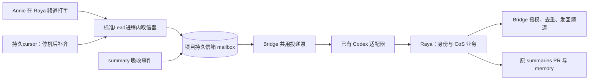

# FLY-2445 Raya 标准 Lead — 实施计划
Issue: FLY-2445 (https://linear.app/geoforge3d/issue/FLY-2445/raya-raya-迁为标准-codex-lead注册进-flywheel走-mailboxraya-仓删掉-ingest-名册)
日期: 2026-09-08
基于: research.md

状态：v3，R3 effective reviewVerdict=APPROVED（gate aa6390a0-34f1-485d-ac14-543e148a39c2）；两条非阻塞建议已作路径与图示澄清。规范入口为本文件；逐文件执行表为 inventory.md；本单不实现、不部署、不申请 ship。

## 1. Founder 视角

Raya 成为 Flywheel 的标准 Codex Lead：Flywheel 收信、保管信件、唤起同一个 Raya 并发回回复；Raya 仓只保留她是谁、如何统管项目，以及 summary、日报和会议的业务。

**mailbox 是持久信箱，已入库的信不会因进程重启而消失；Bridge 是团队共用的保管、投递与出站授权服务；适配器负责把信交给模型运行程序。** Discord取信器实际运行在标准Lead进程内：Raya停机时新信先留在Discord，重启后靠持久cursor补齐。cursor是“已经收到哪条消息”的位置记录；首次启动若没有它，现有程序会跳到最新消息而跳过停机窗口，所以本计划P4b写入与P6补录验收不可跳过。



**可见交付**：#raya 一次文字对话能逐跳查证；至少一个真实 summary 轮次被 Raya 收到并对账；代码仓不再有自建收信/名册/驱动/安装器；独立班车回执能证明新 Lead 实际加载了两仓指定版本。

**边界**：④负责迁移与保全业务，不在这里重新设计⑥的产品判断。⑤负责共享语音能力，不能留第二个 app-server 作为临时捷径。保留会议业务/状态不等于本单已证明音频可用；未接上共享能力时，会议/追问状态机、解析和持久化保留；外部通知与问答明确 transport unavailable。可独立的 calendar adapter 保留，整场会议不伪报完成。进入音频明确显示不可用，不假报启动成功。涉及完整语音恢复的验收仍归⑤。日报/portfolio 在调研基线尚未合入，⑥只提取其业务，不合回旧壳。

## 2. Gate、顺序与发布单位

1. 本节点完成文档、独立设计评审、committed HTML 发布与 Lead 报告，再 `complete --route phase_design_complete` / park。它不请求 ship、不启动实现节点。
2. Lead 已裁定“founder 拍后实现”不增加额外 hold；按本节点 publish/report/no-wait 合同完成，DAG 正常推进。后到 founder 反馈由当前 TURN holder 写 design-correction 增量应用，不回滚分支。有效工程设计评审仍必需，页面意见汇总不是通过信号。
3. ① FLY-2442 已合入；③ FLY-2444 #1126 仍 OPEN。实现可在隔离分支准备，生产迁移必须检查①/③和本单平台增量已合入并由 updater 部署，不能从兄弟 worktree 偷接生产依赖。
4. 两个 PR：Flywheel 的通用接入/主动出站/部署消费者；Raya 的 persona+CoS 提取与旧基础设施删除。每个 PR 的 head、review、QA 和 merge 授权独立，不以另一个 PR 的通过代替。
5. 先部署 Flywheel 兼容新旧**验收格式**的平台增量，再合入可部署的 Raya 新包，最后一个获批切换窗口停旧 owner、启新 owner。兼容格式不代表同时运行两个 owner。

## 3. 身份、配置与唯一真相

| 项 | 固定合同 |
|---|---|
| project / lead / key | `raya` / `raya` / `raya-raya`，不得改为 `flywheel/raya` |
| 显示名 | `Raya`；可改显示不改身份；Lead 名称解析使用 NFKC 和去空白，不拿显示名当主键 |
| role / summary assignment | `generalChannel == chatChannel` 派生 `cos`；`summaryRole=recipient`；无 runner spawn，无 companion |
| backend/profile/carrier | `codex-app-server` / `full-access` / 标准可见 TUI；不是 headless 生产服务 |
| 工作区 | `~/Dev/raya-lead-workspace`，与 `~/.flywheel`、Codex home、平台 state 不重叠；真实路径检查拒绝 symlink 绕过 |
| persona | Raya 仓新增 `.lead/raya/identity.md` 为唯一 persona 源，迁移现 `IDENTITY.md` 内容后删除旧重复源；部署按 SHA 投影进外部工作区同路径 |
| memory | 外部工作区 `memory/` 为原 raya-memory git 仓的完整历史迁移，`MEMORY.md` 不覆盖；旧绝对路径更新有清单；persona 明示每轮读取这里 |
| 业务状态 | 外部工作区 `state/`；原 data/state 仅用于审计/迁移读取，切换后没有业务 writer 再写旧目录 |
| 平台状态 | 由公共 `codex-lead.sh --print-state-dir raya raya` 求得；Bridge 同函数语义；Raya 不读写 journal/outbox/thread 管理 API |
| registry / manifest | `~/.flywheel/projects.json` 唯一身份源；`manifests/raya-raya.json` 只是有 digest 的投影 |
| job / 日志 | `com.flywheel.lead.raya-raya` / `logs/lead-raya-raya.log`；不得启专用旧 wrapper |
| operator 告警 | 注册 `alertChannel=chatChannel`、`alertBotTokenEnv=RAYA_BOT_TOKEN`、`alertFallbackToCore=false`。若宿主已有 FLY-927 统一告警频道/发送身份，则按公共优先级用该落点；P5必须记录有效频道、P6证明告警可达，不把被动巡检当告警 |
| Codex home | `~/.codex-raya`；由公共安装/登录流程准备，不复制旧 home 的 auth.json，不在工作区放凭据 |
| 模型 | 注册保留 `gpt-6-astra`, `xhigh`, `1050000`；新 thread 实际回执核对 model，context clamp 如实记录 |
| bot / 频道 | 原 bot identity 和 #raya 不变。token 只按 `RAYA_BOT_TOKEN` 名称从 owner 配置解析；botUserId 独立核对，不从 token 自证 |
| mailbox | `comm/raya/comm.db.mailbox`；与 Mufasa 共享 schema/泵/适配器，按现有项目隔离各自数据库；不做全局合库 |

### 3.1 14 人名册与附加字段

新增**可选** `LeadConfig.cosContext` 业务元数据对象，只存在中央 projects.json 的 Lead 行内；不复制 agentId/botUserId/projectRoot/voice。旧 profile 导入必须新增受锁的中央更新入口，不能调用③的add去更新14个已有Lead。未知 leadId、重复别名、路径越界、冲突字段、基线 digest 漂移均拒绝；不静默取最后一条。

批次A新增 `flywheel-lead.sh import-cos-context --input <0600导入文件> --expected-projects-sha <digest> --expected-receipt-sha <digest> [--dry-run]`，包装 `lead-registry import-cos-context` 与新增纯规划器 `lead-registry-cos-context.ts`。输入包含schemaVersion、14行canonical project/lead与cosContext，以及每行旧值digest；它只准更新已有行的cosContext，禁止改身份、角色、权限配置或添加Lead。先在内存生成完整candidate，再取 `projects.json.cfglock`、重读两文件并校验CAS（比较并确认文件仍是计划时版本）。调用③新增的 `migrateSummaryRegistry({candidateRegistry,...})` 扩展完成registry+assignment receipt写入；当前main的 `applyManifest` 本身只改summaryRole，不能承担元数据更新。

复用并扩展③pending intent/recover，intent区分add与cos-context-import、记录两文件before/planned摘要和备份。任何写后失败，在仍持锁且两文件属于本事务before/planned组合时成对恢复；发现未知digest则保留intent并停止，不能覆盖别人的更新。重启recover同样检查这些组合；已完全相同输入重跑字节不变，混合新旧字段且无匹配intent拒绝。receipt和registry核验通过后重物化受影响manifest；物化失败保留“未激活”，可续跑。导入文件只是一回迁移输入与只读证据，不成为运行名册。Raya自己的add和14行导入是P2内两个有序可恢复子事务，各有digest，Bridge在两者完成前不加载候选。

| 旧字段 | 新来源/行为 |
|---|---|
| leadId | `agentId`，逐个精确匹配现有中央行，14 条必须一一对应；不自动新增旧名单中的未知人 |
| discordUserId | `botUserId`；不等则停止导入，不能用旧 profile 覆盖身份 |
| displayName / aliases | `cosContext.displayName:string`、`aliases:string[]`；名称只用于选择，解析结果返回稳定 leadId；全局多义返回候选，禁止误投 |
| workspaceCwd | canonical projectRoot 加 `cosContext.workingSubdirectory`（缺省 `.`）；将旧绝对路径 realpath 后转换为 root 内相对路径。越界或根不匹配停止；不得无条件丢弃原子目录，也不存第二个绝对项目根 |
| identityPath | `cosContext.identityPath`，绝对普通文件、只读资料，禁止 protected credential 路径或其父目录授权 |
| memoryPaths | `cosContext.memoryPaths`，绝对业务文件列表；保留而不把全部 HOME 交给模型 |
| writableRoots | `cosContext.writableRoots`，只描述已有获准的业务 roots，不因导入自动给任何新进程写权限；与安全配置逐项核验 |
| voice | 既有 `LeadConfig.voice`；如值不兼容就记录原值并要求明确映射，不强制当作 voiceId |

平台新增 `lead-directory.ts` 只读投影函数，输入已验证 `ProjectEntry[]`，输出上述组合；Raya 消费 `LeadDirectory` 接口，不读 profile.json/voice-leads.json。投影携带 `projectsDigest`；每次请求在 Bridge 重查当前 registry，缓存过期不可改用旧可编辑名单。

### 3.2 平台剩余特判

- `codex-lead-runtime.ts` 与 `codex-lead-tui-runtime.ts` 删除以 `leadId==='raya'` 决定 metrics 必需性的分支。所有 Codex Lead 的 context-usage 统一落其平台 state 的 `metrics/`（已有 recorder 复用）；历史 Raya metrics 只读保留。无 `RAYA_METRICS_DIR` 的 canonical Raya 必须能 preflight/start。业务报告按新平台指标投影读取，不自建采样 daemon。
- ③ 注册器扩 `--roundtable-channel`，写既有 `LeadConfig.roundtableChannel`；selector返回它；launcher从此字段推导cross-dept，不再受ambient env覆盖。这个字段同时启用该频道的入站轮询与出站授权：入站保持已有mention gate（只有明确提及/回复本Lead等现有允许条件才触发），不把每条讨论都交给Raya。缺字段则该频道既不收也不发；roundtable新增频道的历史不追放，切换前已由旧owner负责的频道则必须纳入P4b逐频道cursor计划。
- ③add规划器与CLI同时扩 `--alert-channel`、`--alert-bot-token-env`、`--alert-fallback-to-core`，只映射已有LeadConfig字段，校验snowflake、环境变量名与布尔值。缺省保持其他Lead原行为；Raya注册显式设置，不依靠未配置时的静默跳过。平台operator告警沿现有公共lead-alert机制，不由Raya业务包自行发信。
- 不注册③尚不支持的 `codexResidencyPatrol:true`。标准 launchd 持有进程；业务停滞的现有 mailbox/liveness 观测保留。泛化 residency patrol 属独立后续，不伪称本单具备。

## 4. 保留业务端口；④不新建 Lead 问答 API

Raya 新 `packages/cos/` 不 import Discord SDK、Codex RPC 或 launchctl；只接收纯数据、调用注入端口。端口实现在 Flywheel，且所有 Lead 可使用同一实现；不能给 Raya 写专用 runtime。

### 4.1 端口合同

```ts
type LeadRef = { project: string; leadId: string };
type RequestKey = { requestId: string; revision: number };
interface CoSPorts {
  directory(): Promise<{ projectsDigest: string; leads: readonly CoSLead[] }>;
  request(input: { key: RequestKey; to: LeadRef; kind: 'question' | 'meeting';
    correlation: string; body: string; expiresAt: number }): Promise<QueueReceipt>;
  reply(input: { key: RequestKey; body: string }): Promise<QueueReceipt>;
  announce(input: { eventId: string; target: 'chat' | 'roundtable'; text: string }):
    Promise<{ status: 'sent' | 'pending' | 'ambiguous'; messageId?: string }>;
  voiceIntent(input: { meetingId: string; action: 'start' | 'stop' }):
    Promise<{ status: 'accepted' | 'unavailable'; reason?: string }>;
}
type CoSLead = { ref: LeadRef; botUserId: string; displayName: string; aliases: string[];
  projectRoot: string; identityPath?: string; memoryPaths: string[];
  writableRoots: string[]; voice?: string | { voiceId: string; rate?: string; pitch?: string } };
type QueueReceipt = { status: 'unavailable'; reason: 'lead_transport_not_available' } |
  { requestId: string; deliveryId: string; recipient: LeadRef; status: 'queued' | 'already_queued' };
```

这些是**新增合同**，不是现有 API。业务入口 `packages/cos/src/cli.ts` 是一次性命令，不是常驻 daemon；由标准 Raya turn 调用。共享模型只由现有 Lead 跑：summary/daily-report 的生成提示进入当前标准 turn，不再 `thread/start` 另开脑。

### 4.2 Lead 间 request/reply：保留状态，明确不可用

Lead 对问题 `b2ea8602-feee-41d5-8743-380fa13e47e2` 已明确：**Lead→Lead 问答 API 不在④里建，由 Lead 开后续新单**。删除 v1 的新 API、StateStore 表、签名服务与 CLI 扩展任务，不把不存在的能力包装成平台已经提供。

④的 `request`/`reply` 端口固定返回 `{status:'unavailable',reason:'lead_transport_not_available'}`，不产生外部请求，不写 sent/queued/delivered，不把失败误转 timeout；旧 request/meeting 的 UUID、状态、截止时间和已知外部 receipt 原样保存，另记能力不可用原因。解析、状态转移和恢复算法在纯业务夹具内可跑；真实外部投递未接好前不能声称完整会议/追问可用。

summary 看不懂需要追问时保持 PR 未读，并在 #raya 的本轮报告明确指出“待追问，跨 Lead 通道尚未接入”；不能为了完成吸收把不理解的 PR merge。无歧义 summary 仍可读、核验、merge并更新memory，满足④收件/吸收最低验收。

后续新单接口输入至少须保持 requestId/revision、canonical sender/recipient、roundId+PR 或 meeting UUID、过期与幂等语义；可复用 `RuntimeRegistry.enqueueLeadEvent`，但这些是后续设计输入，不是④交付承诺。不能用 Runner `ask/respond` 冒充。会议邀请未来必须有独立 mailbox deliveryId 与 Discord messageId；④不再沿用旧假回执写法。

### 4.3 所有 Raya 可见出站经 Bridge

`lead-actions` bridge 模式的 `discord_send`/业务 announce 复用 `CodexOutboundSender`，保留 alias 验证、频率限制和 FLY-680 roundtable 自动续聊限制。新增可选 `eventId`：业务调用必须给稳定 key（如 `summary:<roundId>:report`、`meeting:<uuid>:<revision>:invite`），重复相同内容返回同一结果；相同 key 内容不同拒绝。普通无 eventId 主动调用由可信服务分配并持久化 UUID 后才发送。

主动 outbox 用 `<stateDir>/lead-actions-outbox.db`，单一可信 lead-actions 进程拥有；与 runtime 的自动回复 outbox 分开**文件所有者**，两者复用同一实现与 Bridge去重表，不在 Raya 仓建立队列。bridge 模式不将 Discord token 注入发信代码；ACK 工具也不要求发信 token。Bridge API凭据仅由可信子进程消费，绝不输出到工具响应。

Bridge 404/403、网络断开和 ambiguous 不切 direct；queue pending不能写 report sent。启动后恢复 pending 由同一可信服务调现成 outbox flush机制；若已有 sender 无后台flush，则新增在该服务唯一生命周期内的 bounded flush调用，不造第二个 Raya daemon。SIGTERM flush/close 与持久 pending 恢复有测试。

roundtable 只使用 registry 声明且① probe允许的频道；不为了会议向任意 Lead 私聊频道扩授权。**后续启用会议邀请时须有两份不同证据**：共享频道 messageId 与目标 Lead mailbox deliveryId；不能像旧实现把一个 messageId 填两栏。

## 5. 逐文件删留与⑥/⑤接力

完整清单见 inventory.md；执行时以其中 main 274 文件与三个功能分支单独比对，任何新增文件必须补一行处置，不用旧行数估计。

| 提取业务目的地（Raya） | 来源与要求 |
|---|---|
| `.lead/raya/identity.md` | IDENTITY.md 全文语义；memory 路径、空轮对账规则、Bridge tools、请求回执同步 |
| `packages/cos/src/{meeting,meeting-calendar,meeting-store}.ts` | brain meeting + contracts meeting；保留 parse/schedule/reschedule/cancel、calendar ID 与业务恢复；删除 gateway、thread/RPC、私有 profile loader |
| `packages/cos/src/{lead-questions,question-store}.ts` | 2379 controller 后半+store asks；保留生命周期；去掉私有 REST polling、threadId 与 controller 主循环 |
| `packages/cos/src/{ports,cli}.ts` | 上述纯端口及一次性入口；公共 CLI/tool caller通过参数数组调用，不使用 shell拼接 |
| `packages/cos/src/{voice-intent,readback-policy,action-policy}.ts` | 仅保留业务期望、attributed session、founder/readback/approval判据；硬 credential 隔离归平台⑤验收，未具备能力即 unavailable |
| `packages/cos/src/daily-report/**` | 从2380提取 collector/format/storage/repo-writer/options；生成走当前 Lead；发送用announce，定时事件走已有中央节奏⑥ |
| `packages/cos/src/portfolio/**` | 从2381提取 goal/evidence/drift/state，替换 SystemTurnRequest/submitSystemTurn/sendPlain；⑥不恢复旧驱动 |

删除 `apps/brain` 与 `apps/voice` 中基础设施及旧可执行 probes；保留原 Git SHA 给⑤提取纯音频算法、模型license与有意义fixtures。⑤不得从旧 cli/AppServerClient 复制出新的专属 Codex脑。迁移不删除 `.git` history、旧 review证据、业务数据与 summary内容。

负向 grep 的判据是**当前可执行/可导入代码、安装命令、依赖、build产物**中零自建 ingest/app-server/名册/launchd。历史文档可能包含这些词；报告须同时给全仓命中及分类，不能声称字面全仓零字符串。测试只保留业务/禁止项断言，旧 driver 测试随 driver 删除；禁止把实现挪进 tests 规避。

## 6. 可恢复迁移事务与部署回执

迁移由既有 updater 唯一执行，在其窗口/获批变更票内；新增 source-only library 扩展现有 `updater-raya-deploy.sh`，没有新调度器。本节点不运行以下生产动作。

### 6.1 前置与落点

班车配置明确区分 `Raya code checkout=~/.flywheel/raya/code`（生产部署源）与 `Lead workspace=~/Dev/raya-lead-workspace`（运行数据）。工作区不作为第二个自动 git pull源：部署从冻结 Raya SHA导出受管理的 `.lead/` 与 `packages/cos` build到版本目录，原子更新业务指针；`memory/`、`state/` 从不覆盖。persona投影为普通文件并带内容digest，受管文件修改则部署停止，不能覆盖用户/Lead未提交工作。

snapshot manifest（0600）记录：迁移ID、Flywheel部署SHA、RayaSHA、registry原始digest、summary receipt digest、旧/新路径及内容hash、旧job的PID/start-time/argv、当前实际会话状态、summary PR快照/业务schema、checkpoint。只存元信息；不复制 token/auth/credential。

### 6.2 Checkpoint顺序

| 阶段 | 动作 | 失败/恢复 |
|---|---|---|
| P0 staged | 确认①③已部署；两PR批准；外部workspace与Codex home准备；受保护身份/凭据边界验证；新业务提取测试通过；登记manifest与每个既有收信频道的cursor迁移范围 | 失败零生产切换，保留原owner；不能证明旧收件起止位置则不进入切换 |
| P1 snapshot | 解析实际业务路径，停接新会议/语音请求进入明确maintenance；记录每源hash/状态与未决外部请求；memory干净且有最新commit | 无法判定状态或有未知writer停止，不假报idle |
| P2 register | 公共register添加raya；新import-cos-context子事务更新14行及summary receipt；各自受同一cfglock协调并验证manifest；新进程尚不启用收信 | registrar pending按扩展recover；已有同行不同不覆盖；事务checkpoint与Discord cursor是两种独立记录 |
| P3 quiesce | 既有updater在获批窗口停旧brain与旧voice并阻止launchd重拉；验证两个旧PID/start-time身份已退出；记录每频道最后连续确认处理完的snowflake、旧owner最后观测值、停止时刻与证据 | 不能确认旧owner停止不启动新owner；不使用killall，不扩大停止范围；未知副作用写入manifest的unresolved条目并使切换失败，不声称有运行时待核队列 |
| P4 migrate | 冻结后重新校验hash；迁移业务状态到workspace，保留round/request/meeting IDs；thread/PID不导入；旧profile备份转为只读非运行证据，删除运行读取入口 | 每文件copy+fsync+rename与manifest记账可续跑；重跑已匹配hash跳过，目标不同停止不覆盖 |
| P4b seed-inbound | 批次E的updater迁移helper在新Lead完全停止时解析公共stateDir；按下文严格写入 `<stateDir>/inbound-cursor.json`；读回核验并将seed digest/逐频道snowflake落manifest | 无cursor、损坏、路径/摘要冲突、unresolved非空均fail-closed，禁止执行P5 install；缺文件不允许走baseline到latest |
| P5 activate | 启动前确认P4b读回通过、Bridge进程环境能解析RAYA_BOT_TOKEN且独立botUserId核验一致、有效告警落点可用、目标label/plist无异构占用；在允许窗口加载registry/receipt；公共preflight→install；唯一新job与TUI运行 | 缺token不得使用核心bot token继续；异构同label plist停止并报告，不覆盖；nudge404保留待验态不重复注册；失败不回退direct |
| P6 prove | 一条P3停旧后/P5启新前的已知窗口messageId真实补录为mailbox delivery_id；普通新消息逐跳、summary轮次、Bridge身份/告警落点证据、unavailable守卫、denied-secret正负对照、回执写盘 | 窗口消息缺失或仅新探针成功仍failed；必须证明source id、delivery id、当前activation对应；queued不等于deployed |
| P7 committed | 原子写v2 deploy-receipt后更新known-good anchor；去掉旧运行入口/安装路径；归档迁移manifest | receipt写失败不得推进anchor；anchor写失败保留已写回执并报告，按同迁移ID收敛 |

**P4b实现与所有者**：批次E在Flywheel新增 `scripts/lib/raya-standard-migration.sh`（仅被现有updater调用）与一次性 `packages/teamlead/src/bin/seed-lead-inbound-cursor.ts`，复用公共stateDir resolver与 `FileInboundCursorStore` 格式 `{ "<channelId>": "<lastConfirmedMessageId>" }`。工具由teamlead现有tsconfig编译到 `${FLYWHEEL_TEAMLEAD_ROOT}/dist/bin/seed-lead-inbound-cursor.js`，班车以node调用该构建产物，先检查它是存在的普通非symlink文件。`scripts/package-onboard.sh`的PO_SCRIPT_FILES复制清单及 `scripts/package-onboard-files.allow`显式纳入新的source-only shell helper，并验证打包产物包含dist/bin工具；`scripts/converge-flywheel-bin.sh`所有适用FILES列表加入 `lib/raya-standard-migration.sh`，对应安装测试必须在隔离打包树中找到并运行工具。helper核验真实路径、普通非symlink文件、十进制snowflake字符串（比较用BigInt，禁止Number精度损失）、频道范围、迁移ID、before摘要及无活writer；在同目录0600临时文件写入、fsync、rename、目录fsync，再用新store实例逐频道load比对。新state只能不存在或恰为本intent的seed；其他内容停止，不覆盖。新owner曾启动后绝不把游标倒退到seed，恢复时只读当前游标并对账。P5再次检查seed与manifest一致才install；班车在这两个步骤间崩溃也不能绕过前置。

**旧副作用不明的限制**：④不新增运行时holdback队列，也不导入旧journal来伪造已处理记录。P3必须得到“已确认完成的连续前缀 + 后续确定未处理的后缀”边界。任何窗口内消息可能已回复、已merge或已改calendar但无法确认，迁移helper把其source id/已知receipt/原因写入0600 manifest的unresolved列表，汇报数量与非秘密编号并停止P4b/P5。部署责任人先按实际外部回执完成对账；若仍不能形成上述边界，本次迁移保持failed/maintenance，不自动重放、不声称收件恢复。仅在证明旧文字入口根本未运行时，可记录P1切换起点前的频道最后消息为历史基线，并明确更早历史不在本次补录范围；不能凭缺旧cursor推断这一点。

**窗口补齐证明**：P3后、P5前在获授权测试发信面发一条无业务副作用的唯一标记消息（或选已存在真实窗口消息），记录source messageId和时间；P5由标准 `RestPollDiscordInboundSource.start()` 从seed向后读取，经过原 `CodexDiscordMailboxStrategy`/`ingestDiscordChat` 入 `comm/raya/comm.db` 的mailbox表，禁止helper直接造mailbox/ACKED行。P6查询同source id对应 `chat:raya:<messageId>` delivery、当前turn/journal与Bridge回复，并写入v2 cutover证据。隔离测试还覆盖超过一页窗口、seed损坏/缺失、重跑前后cursor不倒退、未知副作用阻止install；只有新发探针成功不算窗口补录通过。

旧voice在切换窗停用；只在⑤共享voice capability提供真实ready证据后重新启音频。本单不能以旧voice继续运行换取表面连续性。P6必须真实跑通标准文字与summaries；question/meeting须证明状态保留、外部传输明确不可用且没有旧fallback。

### 6.3 生产注册命令（由部署责任人执行）

先按③ `lead-in-any-repo.md` 完成公共runtime、独立Codex home登录、preflight与外部workspace准备；`FW_RAYA_BOT_ID`/`FW_RAYA_CHANNEL`来自经核验现有身份与频道，非新增bot；两变量必填且snowflake检查通过。`FW_RAYA_ROUNDTABLE`仅在确认双向授权时填，否则省略相应参数，不在本文硬编码未核验bot id。Bridge与Lead是两个独立进程，必须分别在其实际环境内验证RAYA_BOT_TOKEN已解析、认证botUserId吻合；只看到.env里有变量名不足以通过，也不输出token或其摘要。

```bash
"$HOME/.flywheel/bin/flywheel-lead.sh" register \
  --project-name raya --project-root "$HOME/Dev/raya-lead-workspace" \
  --project-repo xrliAnnie/raya --general-channel "$FW_RAYA_CHANNEL" \
  --lead-id raya --chat-channel "$FW_RAYA_CHANNEL" \
  --bot-token-env RAYA_BOT_TOKEN --bot-user-id "$FW_RAYA_BOT_ID" \
  --harness codex --model gpt-6-astra --effort xhigh \
  --model-context-window 1050000 --summary-role recipient \
  --can-spawn-runners false --roundtable-channel "$FW_RAYA_ROUNDTABLE" \
  --alert-channel "$FW_RAYA_CHANNEL" --alert-bot-token-env RAYA_BOT_TOKEN \
  --alert-fallback-to-core false
```

`--roundtable-channel`及三个alert参数是本计划平台增量，不是当前③已支持的参数。部署前必须先证明命令help/validator已包含它们。无roundtable授权时字段缺席、既不收也不发；④文字+summary验收不依赖跨Lead问答可用。P5记录公共lead-alert的实际频道/发送身份配置优先级；有FLY-927统一落点时保留它，无统一落点时显式回到登记的#raya，不能静默丢弃。P6用隔离告警事件或获授权生产探针证明到达，禁止模拟登录失效去破坏当前会话。

### 6.4 v2 receipt 与消费者

保留文件 `~/.flywheel/raya/deploy-receipt.json`。v2顶层完整键集如下，不省略当前22个v1键；新增8键，共30键。批次E必须将 `scripts/__tests__/updater-raya-deploy.test.sh` 的 `receipt_keys`/`keys == $expected` 精确断言改成分schema的v1=22键、v2=30键，不能通过删除pin或只测子集掩盖漂移。

| 处置 | 完整键集与语义 |
|---|---|
| 保留当前语义 | `checked_at` epoch秒；`outcome`含refused；`state`、`failure`；`checkout_before`、`head`、`origin_main`、`ledger`、`rollback_sha`、`deployed_sha`仍指Raya源/部署事务；`node_bin`、`preflight_rc`；`interrupt_notice` |
| 保留键、仅作旧carrier历史 | `identity`、`session_grace`、`session_at_cutover`、`generation`、`gen_before`、`brain_pid`、`voice`、`voice_pid`。无真实旧值则null；不得把新Lead的PID塞进brain/voice键，不能用这些键判v2健康 |
| 升版 | `schemaVersion:2` |
| 新增 | `flywheel_deployed_sha`、`migration_id`、`carrier`、`lead`、`business`、`checks`、`cutover`、`rollback_target` |
| 删除 | 无；旧carrier历史键未来移除须另升schema |

以下为完整形状，失败早于进程启动时允许证据为null，不能填假PID、假messageId。successful current/deployed要求lead/business/checks非null且各布尔检查为true；迁移首次成功还要求cutover的窗口证据完整。之后current回执保留cutover历史并重新验证当前activation，不能借旧窗口探针代替新进程检查。

```ts
type OldProcess = { pid: number; start: string | null };
type OldPidPair = { before: number | null; after: number | null };
type StandardRayaReceipt = {
  schemaVersion: 2; checked_at: number;
  outcome: 'deployed' | 'current' | 'rolled_back' | 'failed' | 'refused';
  state: string; failure: string | null; deployed_sha: string | null;
  checkout_before: string | null; head: string | null; origin_main: string | null;
  ledger: string | null; rollback_sha: string | null;
  identity: string | null; session_grace: string | null; session_at_cutover: string | null;
  generation: { brain: string; voice: string } | null;
  gen_before: { brain: OldProcess | null; voice: OldProcess | null } | null;
  interrupt_notice: string | null; brain_pid: OldPidPair | null;
  voice: string | null; voice_pid: OldPidPair | null;
  node_bin: string | null; preflight_rc: number | null;
  flywheel_deployed_sha: string | null; migration_id: string; carrier: 'standard-lead';
  lead: { project: 'raya'; id: 'raya'; key: 'raya-raya'; identity_digest: string;
    registry_digest: string; summary_receipt_digest: string; manifest_digest: string;
    pid: number; process_started_at: string; activation_id: string;
    thread_id: string; tui_visible: boolean } | null;
  business: { source_sha: string; artifact_digest: string; persona_digest: string;
    workspace: string; state_schema_version: number } | null;
  checks: { preflight: boolean; unique_owner: boolean; pump: boolean;
    text_delivery_id: string; outbound_message_id: string; summary_round_id: string;
    summary_delivery_id: string; mailbox_acked: boolean; bridge_sent: boolean;
    bridge_identity_verified: boolean; alert_channel_id: string;
    alert_delivery_id: string; alert_reachable: boolean } | null;
  cutover: { seed_digest: string; seeded_at: string; old_stopped_at: string;
    activated_at: string; activation_id: string;
    channels: Array<{ channel_id: string; seeded_after: string }>;
    window_message_id: string; window_delivery_id: string; window_outbound_message_id: string;
    unresolved_count: 0 } | null;
  rollback_target: { carrier: 'standard-lead'; raya_sha: string; flywheel_sha: string;
    manifest_digest: string; artifact_digest: string; receipt_digest: string } | null;
};
```

每次declare current也要重新检查活进程/manifest/artifact一致，不能只因SHA等于anchor就盖成功章。text probe与summary证据必须属于当前activation/两个SHA；旧v1 receipt可读用于历史，绝不证明新carrier已部署。rollback_sha保留Raya旧值用于历史，自动标准回滚必须读取通过验证的rollback_target两仓配对；首次迁移为null即没有可自动回退的标准版本。旧receipt不可被猜测为该配对。

Flywheel修改消费者：`update-flywheel.sh` host capability改查canonical manifest/carrier；`updater-raya-deploy.sh`用公共preflight/verify和新job identity；`lead-patrol-snapshot.sh`继续报告源SHA漂移并显示receipt schema与当前carrier mismatch；`founder-only-authority.md` R1、`summary-inflow.md`、`linear-issue-context.ts`改为上述证据，不改变founder merge/deploy权力。

### 6.5 回滚界线

- P3前：abort本次迁移，回滚本事务写的registry与summary receipt；CAS校验当前digest仍属本事务。若已有其他Lead合法更新则停止回滚并重算，不覆盖整份旧名册。
- P3后、P6失败：停新owner的精确进程身份；保留新mailbox/journal/outbox、业务状态与summary PR变化。优先回退到仍走标准通路的上一个已验Flywheel+Raya版本；业务state只做向前兼容读取，不覆盖备份快照。
- **首次迁移没有已验标准版本**：保持新通路maintenance与持久收件，报告failed；要恢复旧brain/voice属于恢复已被founder要求退役架构，需单独当前授权。设计不内置自动旧脑fallback。
- registry删除采用③受锁注销流程并重铸summary receipt，不删除mailbox到达记录或把未读PR标已阅。恢复可逆数据副本不意味着可以回滚已发消息、summary merge或calendar变更；这些按receipt对账。
- 任一出现身份漂移、未知活owner、并发工作区改动、回执不匹配时fail-closed，保留证据，不“清理掉”错误现场。

## 7. 实施任务与真实验证

每批按 **先写失败用例 → 跑到失败 → 最小代码 → 同组通过 → commit** 执行；无生产测试bot发信面授权前只跑隔离夹具。禁止用founder本人账号作为测试身份。

| 批 | 文件/行为 | RED与GREEN判据 |
|---|---|---|
| A 注册/指标 | `ProjectConfig.ts`、`flywheel-comm/src/{lead-registry-add,commands/lead-registry,lead-identity}.ts`、新增`lead-registry-cos-context.ts`更新规划器与import-cos-context命令、③candidateRegistry写入与recover复用、新增`teamlead/src/lead-directory.ts`、`scripts/flywheel-lead.sh`、两个Codex runtime | 真实③launcher fixture注册raya含alert/roundtable；14个已有行更新成功而add仍拒绝改行；CAS冲突、两文件写边界失败与recover；重跑字节不变；unknown/duplicate/path冲突拒绝；roundtable有mention才触发、缺字段不收不发；无旧metrics env仍启动 |
| B 业务不可用守卫 | Raya `packages/cos/src/{ports,lead-questions,question-store,meeting}.ts` 与业务测试 | unavailable不触发外部发送、不写queued/delivered；请求/会议状态及UUID保持；summary待追问保持PR未读并可见报告 |
| C 共享主动出站 | `lead-actions/{config,lead-actions-main,mcp-config}.ts`、`discord-send-core.ts`注入sender seam、`CodexOutboundSender.ts`现有outbox复用、roundtable selector | 断Bridge直接Discord调用数=0；pending重启后同key送一次；ambiguous无盲重发；错误频道403；别的Lead缺roundtable行为不变；ACK无需发信token |
| D Raya提取/删除 | inventory.md全部active文件；新增`packages/cos/**`；persona与manifest/package/README/lockfile调整 | 提取前保存业务行为测试，提取后同场景通过；安装包和build目录同扫；没有空入口或import断裂；日报⑥未合部分不作为已上线通过项 |
| E 班车事务 | `scripts/lib/updater-raya-deploy.sh`、`update-flywheel.sh`、`lead-patrol-snapshot.sh`、新增source-only `scripts/lib/raya-standard-migration.sh`及一次性 `teamlead/src/bin/seed-lead-inbound-cursor.ts`；`scripts/package-onboard.sh`、`scripts/package-onboard-files.allow`、`scripts/converge-flywheel-bin.sh`与隔离安装tests、R1/模板 | P0–P7含P4b各边界失败恢复；缺/坏seed或unresolved阻止install；live writer/已推进cursor不覆盖；Bridge缺token/label占用停止；v1=22/v2=30精确receipt_keys断言及null失败回执；两SHA回滚配对；receipt失败anchor不动 |
| F 旧入口闭包 | Raya旧脚本及Flywheel dedicated Raya launcher/wrapper/plist/preflight、`resident-codex-lead-recover.sh`、restart allowlist、converge/package inventories、QA caller | old入口不再可启动brain；尤其 `com.flywheel.lead.raya-raya.tui.plist` 与新label同名，P5实际检查存在即比对carrier，异构则拒绝而不覆盖；全消费者sweep；缺检查root标未检查 |
| G 隔离整链 | 新`teamlead/src/bridge/__tests__/raya-standard-migration.test.ts`与`scripts/__tests__/raya-standard-migration.test.sh`，复用RestPollDiscordInboundSource真实store/ingest夹具 | 两项目、两bot；明确已知P3/P5窗口source id入mailbox及最终回复；超过一页补齐、重启不重放、未知旧副作用零install；text+attachment现有能力回归；summary→memory→receipt；问答/会议unavailable；统一与per-lead告警落点各通过 |
| H 部署验收 | 仅独立班车窗口和部署责任人 | 下面验收矩阵全部真实证据齐；生成v2 receipt；Lead对外报告上线时引用两SHA、receipt路径与消息id |

建议命令（实施前先核当前package脚本，新增测试路径由本计划创建）：

```bash
pnpm --filter flywheel-comm test
pnpm --filter flywheel-teamlead test
bash scripts/__tests__/flywheel-lead.test.sh
bash scripts/__tests__/updater-raya-deploy.test.sh
bash scripts/__tests__/lead-patrol-snapshot.test.sh
bash scripts/__tests__/raya-standard-migration.test.sh
pnpm lint
pnpm build
```

Raya新业务包 `pnpm test && pnpm typecheck && pnpm build && pnpm lint`。如果包名不匹配，先读`package.json`改成真实过滤器，不把“0包匹配”当PASS。不用为了文档变更重跑全产品测试；本节点只验文档链接/diagram/HTML/CSP/comment行为。

### 7.1 需求→验收证据

| 要求 | 必须看到的证据 | 不足以证明 |
|---|---|---|
| 与Mufasa同路 | 同版本公共launcher/adapter；两条独立source message分别在正确项目mailbox；Raya exact delivery→journal→outbox→Bridge dedup→Discord实际目标核实；Mufasa回归对照 | 只有health或一条日志写“sent” |
| 停机窗口不丢信 | P4b写入/读回的seed digest与频道位置；一条时间确在P3停旧与P5启新之间的已知messageId，在 `comm/raya/comm.db` 获得真实delivery_id及标准通路回复；未决旧副作用为0 | 只有启新后发的探针成功，或手写ACKED行，或把事务checkpoint当收信cursor |
| 身份/告警可用 | Bridge与Lead实际认证同一已登记botUserId；无token的前置失败；公共告警有效频道和delivery证据，含FLY-927优先级 | .env有变量名；日志只有warning；只有被动liveness巡检 |
| 仓里零旧基础设施 | inventory对每个tracked active文件的处置；全仓rg命中分类；package lock/entrypoints/build产物与安装树扫描；故意塞入driver的mutation用例失败 | 只grep apps/brain或忽略tests/probes |
| summary不断 | 切换前PR快照不丢；切换窗口新PR仍未读；真实summary_absorption_round进入raya mailbox并ACK；Raya执行对账并发Bridge可见报告；有效纯summary fixture被读后的merge与memory provenance | 仅有`summary_due`给producer，或旧merged PR |
| 保留CoS问答/会议 | 原request/meeting UUID、calendar event、未决状态保持；纯业务回归通过；外部transport unavailable且零旧请求/私发副作用 | 状态机保留被宣称为外部会议已发起；Discord messageId冒充mailbox receipt |
| 日报/portfolio保全 | 2380/2381提取清单与业务tests，⑥接力明确；没有重新引入SystemTurn/private generator | 把未合分支功能写成迁移前已在线 |
| 合入≠上线 | v2 deploy-receipt、生产Raya SHA/Flywheel SHA、当前job及TUI、persona/artifact digest、实际preflight/text/summary对应本activation | PR MERGED、旧v1回执、anchor文件或旧进程 |
| 权限不放宽 | 新sandbox内memory positive control可读、protected credential negative control denied；server founder-only gate及summary prefix+non-executable全diff校验；不读真实credential内容 | persona一句“不要读”或mock permission错误 |

上述真实验收若尚无授权发信面，用隔离结果+明确“生产未验”交接，保持部署验收未完成，不伪造生产回执。

## 8. 风险与未决裁定

高风险是两仓部署顺序、首次切换无标准known-good、元数据/路径迁移、主动出站与旧业务状态恢复。所有风险都有上文具体停止线和用例；不通过保留旧壳来回避。

Lead 已答两条问题：

- `9c72c361-ffb0-4da1-85bf-8607ee4bb06e`：删 Raya 自有 driver/launchd/ingest/名册；保留 meeting/CoS 状态机；语音重挂归⑤ FLY-2446；R1 改为 canonical Lead 身份，保留 updater+deploy-receipt；不加额外实现hold，后到反馈增量处理。
- `b2ea8602-feee-41d5-8743-380fa13e47e2`：④最低验收=标准文字+summary收件/吸收；允许 registry roundtableChannel 投影和③launcher unset修正；Lead问答API由Lead另开单；④ question/meeting transport unavailable并保留状态机，禁止第二driver与Discord fallback。

v2按此裁定修改任务、验收与HTML；追问API从本单删除不是“已实现”。v3不扩大该范围，补齐R2指出的迁移cursor执行与验收缺口，以及registry更新入口、完整回执、token/告警/label停止线和双向roundtable语义。后续单号由Lead提供后可追加索引，不阻塞本设计节点。

## 9. 设计节点交付审计

提交本文件、exploration/research/inventory、design-evidence.md、Mermaid源码与单脚本CSP nonce的founder-design.html。HTML每section有独立意见框、按pathname隔离localStorage、实时汇总、1800字符分块和clipboard拒绝fallback；页面意见第一行严格为`【页面意见汇总】FLY-2445`。图在本地渲染成功则提交并内联SVG；首次失败后按任务规定的标准参数重试一次，仍失败则使用明确的`DIAGRAM PENDING LOCAL RENDER`占位，保留源码并报告失败。DOM行为、托管CSP结构与真实浏览器视觉/交互分别记录证据，不能互相冒充；当前宿主未能启动Chromium，已依此例外发布，详见design-evidence.md。

评审：`gate review_design --no-block`取得questionId→`request-review --type design --question-id ... --plan ...`；只认effective reviewVerdict。CHANGES修后新gate；APPROVED advisories报Lead。最后progress+commit+push，publish-only，DESIGN-HTML report，再phase_design_complete与park。设计阶段完成不等于FLY-2445迁移完成。
