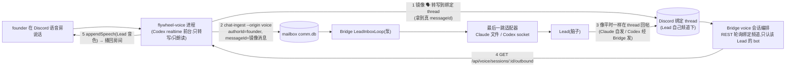

# FLY-2446 通用 voice 进程 — 探索
Issue: FLY-2446 (https://linear.app/geoforge3d/issue/FLY-2446/语音-通用-voice-进程会议模式所有-lead-可挂rg随身模式先-raya-用独立-codex-realtime-进程语音文字经)
日期: 2026-09-08
基于: 无

> 本单是 Epic FLY-2441 的 ⑤「共享语音能力」。① FLY-2442(Codex 出站经 Bridge + 五段合同页)、② FLY-2443(Claude fail-closed)已合入 main;③ FLY-2444(通用 launcher)、④ FLY-2445(Raya 迁标准 Codex Lead)在各自分支、未合入。本单**只出设计**,不实现;实现等 ④ 定下接口。
> 取证锚点:flywheel 本分支 `d7b75c755`;raya 仓 main `0f77e97`(FLY-2439 §D 引的是 `b1b5a64`,两者 `apps/voice` 无差异);Codex CLI `0.153.2`(本机 `~/.local/bin/codex`),协议源 `openai/codex` tag `rust-v0.153.2`。行号均以此为准。

## 0. 一句话

**把 Raya 仓私有的第二个 Codex 进程,改成 Flywheel 拥有的一个通用「嘴和耳朵」进程:它只做转写与朗读,脑子永远是被挂上的那个 Lead;founder 的话变成 mailbox 里一条普通文字消息走原路进 Lead,Lead 在 Discord 里的回复经 Bridge 送回给它念出来。**

founder 2026-09-08 直令拆成四句(每句在 §3–§5 各有一格落点):

| # | 直令原文 | 设计落点 |
|---|---|---|
| F1 | 一个独立的 voice 进程(Codex realtime),任何 Lead(含 Claude Lead)开会时挂上 | §3 进程形状;§6.1 身份 |
| F2 | 语音转写成文字消息进 mailbox,走与文字完全相同的路(泵 → 适配器 → Lead) | §4.1 入站 |
| F3 | Lead 的回复经 Bridge 交给 voice 进程 TTS;文字↔语音因此天然互通 | §4.2 回程 |
| F4 | 会议模式 = 通用能力,所有 Lead 都要有;RG(随身)模式 = 先只给 Raya,但做成通用能力、可选择给谁开(07:46Z) | §5 两种模式;§6.3 registry 字段 |

## 1. 现状(全部已验证,带 file:line)

### 1.1 Raya 语音今天是什么(raya `apps/voice`,13,683 行)

| 事实 | 证据 |
|---|---|
| 两个 launchd job = 两个 OS 进程:`com.xrli.raya.brain`(文字)/ `com.xrli.raya.voice`(语音,`RunAtLoad=false`,由 brain `launchctl kickstart -p` 拉起) | `~/Library/LaunchAgents/com.xrli.raya.{brain,voice}.plist`;`apps/brain/src/voice-mode.ts:470-524` |
| **realtime 由 spawn 那一刻的 argv 决定**:语音 `--enable realtime_conversation app-server --strict-config`,文字没有;没有「会话中途开 realtime」的 RPC | `apps/voice/src/config.ts:23-28`(`CODEX_ARGV`);`codex/AppServerClient.ts:91-98` |
| 语音把 realtime 挂在**同一个 Codex thread** 上:`thread/start` → `thread/realtime/start {threadId, transport:{type:"websocket"}, outputModality:"audio", voice, version:"v2", prompt}`;模型的「能力」全靠这个 thread(`approvalPolicy:never`、`workspace-write`、网络开) | `codex/CodexLeg.ts:154-164`;`codex/RealtimeTransport.ts:191-203`;`packages/contracts/src/codex-session.ts:117-133` |
| 两进程只共用 `RAYA_CODEX_HOME`;各存各的 thread ⇒ **语音里说过的话,文字侧不知道** | FLY-2439 `build-v3.py:277-292` |
| 「让模型念指定文本」= `thread/realtime/appendSpeech` + `Speaker` 的确认协议(注入后等 assistant 转写,比对是否真念了,结果 `confirmed/unconfirmed/failed/dropped`);播报格式 `【Raya 系统播报\|非 Annie 发言】` | `speech/Speaker.ts:153, 384-458, 396` |
| 音频主链:Discord opus → 48k/2ch → Silero VAD 抢话门 → 24k mono `appendAudio`(20 ms 一帧,闭麦时送静音不断流)→ 模型 `outputAudio/delta` 24k → 升 48k/2ch → `@discordjs/voice` 播回;平台侧抢话 `input_audio_buffer.speech_started` → 本地让位 | `pipeline/Uplink.ts:145-156`;`pipeline/Downlink.ts:108-217`;`runtime.ts:1148-1195` |
| 「问 Lead 并把答案接回本次语音会话」这条路**不存在**:`voice-inbox/items.jsonl` 没有生产写入方、生产目录不存在;`relay_to_lead` 是单向、「不反对就发」 | FLY-2439 `research.md:352-399`(D19–D28) |
| 会议模式已是 `leadId` 参数化(profile 数据换身份,`meeting ?? default` 分支),**不是 Raya 专属**;founder 为此打回过一次设计 | `apps/voice/src/meeting-context.ts:20-61`;`cli.ts:167-218`;FLY-2032 `exploration.md:26,103` |
| 转写只落在 `<stateDir>/voice-evidence/events.jsonl` 的 `realtime_transcript` 行 + `#raya` 字幕镜像(`🗣️ **Annie**:` / `💬 **Raya**:`);没有独立的会议记录产物 | `runtime.ts:1741-1755`;`discord/VoiceTextMirror.ts:42-100` |
| RG/耳机/随身模式在 raya 仓**不存在**;只有 `ShipGateFlow.ts:18-19` 一句「与 flywheel `voice-core/headphone/phrases.ts` 逐字对齐」 | 全仓 grep 耳机/随身/headphone |

### 1.2 Flywheel 文字通路今天是什么(合同已成文)

五段合同页 `engineering/doc/FLY-2442-codex-outbound-bridge/mailbox-adapter-contract.md`:**信先进 mailbox,再按 harness 投递;只有最后一跳分叉**。接新 harness 的七条清单在其 §7。对本单要紧的事实:

| 段 | 事实 | 证据 |
|---|---|---|
| ① ingest | 唯一入口 `ingestDiscordChat` / CLI `flywheel-comm chat-ingest --content-stdin …`;**envelope 全部 id 必须是 Discord snowflake**(`chatId/originChannelId/messageId/authorId/replyChannelId`);幂等键 `chat:<leadId>:<messageId>`;**没有 origin/来源字段**,渲染时 `source="plugin:discord:discord"` 是字面量 | `packages/flywheel-comm/src/chat-delivery-envelope.ts:48-57, 82-86`;`discord-chat-ingest.ts:63-88, 146`;`index.ts:712-838` |
| ② mailbox | `mailbox.source_kind TEXT` 无 CHECK(已有 ~20 种值)、`type` 无 CHECK、`recipient_kind ∈ {lead,runner,bridge}`、`state ∈ {QUEUED,LEASED,ACKED,DEAD}`;插入前必须先占 `mailbox_identity` | `mailbox-schema.ts:192-249` |
| ③ 泵 | Bridge `LeadInboxLoop`,每 Lead 一个;活跃 1 s / 空闲 30 s;批 ≤10 条 / 30 s 窗 / 3 个在飞;**必须 ack** 否则槽满停投;门铃 `POST /api/lead-inbox/nudge` 可丢 | `bridge/lead-inbox-loop.ts:29-30, 444-492`;`mailbox-queue-config.ts:13-23` |
| ④ 最后一跳 | 只按 `lead.backend === "codex-app-server"` 分叉:Claude = 两阶段写 `~/.claude/teams/<lead>/inboxes/<lead>.json`(claude 内建轮询);Codex = HMAC unix socket → TUI 进程内 journal | `bridge/lead-inbox-runtime.ts:1244-1270`;`lead-delivery-adapter.ts:55-88` |
| ⑤ 回程 | Claude Lead:插件问 `reply-guard` 后**自己**发;Codex Lead:`POST /api/lead-outbound/send`(Bearer `TEAMLEAD_API_TOKEN`,token 服务端按 `(project,lead)` 解析,持久去重,`probe:true` 只授权不发);**Bridge 没有任何「读 Lead 回复」的路由或可订阅账本** | `codexLeadBridgeWiring.ts:65-129`;`codex/CodexLeadOutboundHandler.ts:126-171`;`bridge/plugin.ts:3078-3103` |
| registry | `~/.flywheel/projects.json` 唯一身份源;`LeadConfig.voice?: string \| {voiceId,rate?,pitch?}`(FLY-546,edge-tts 音色)已存在并在加载期校验;`backend`、`roundtableChannel`、`playwrightMcp` 等都是「缺席即关、消费者只认 `=== true`」的每 Lead 可选字段;feature-flag 注册表**没有 per-Lead scope** | `ProjectConfig.ts:35,147,194, 545-561`;`packages/config/src/feature-flags/registry.ts:29` |
| Bridge 语音路由 | `/api/voice/{scope,context,gate-binding,ship-approval}` 已存在(FLY-546/1160),`tokenAuthMiddleware` 保护;`roundtableChannelIds` 来自 `FLYWHEEL_LEAD_CROSS_DEPT_CHANNEL_IDS` | `bridge/voice-routes.ts:204-319`;`plugin.ts:9378-9395` |
| Codex 进程客户端 | Flywheel 自己有 stdio JSON-RPC 客户端 `CodexLeadProcess`(spawn + initialize/initialized + `request/notify`),Lead 壳用它起 `app-server --strict-config` | `lead-backends/codex/CodexLeadProcess.ts:166-292`;`codex-lead-runtime.ts:1312-1314` |
| 会议产物 | FLY-2033 已合入(#985,launchd `hold`):只读 `<meetingStateDir>/meetings/<uuid>/meeting.json` + `voice-evidence/events.jsonl` 里的 `realtime_transcript` 行,按 `meeting_container_starting/live` 锚点切信任窗;`leadId` 来自存档,无 Raya 过滤 | `packages/teamlead/src/meeting-notes-scheduler.ts:600-682`;`meeting-notes-config.ts:212-275` |
| 已有语音素材 | `packages/voice-core`/`voice-bridge`(Huddle)/`voice-headphone`(耳机 daemon)共 ~20k 行,**走 Gemini Live + edge-tts,不走 Codex realtime**;`com.flywheel.voice-bridge` 目前**未加载**(launchctl list 无此 label);FLY-1850/1851 已判它「是素材,不是资产」 | FLY-2439 `research.md` §G.3;`launchctl list` 2026-09-08 |

### 1.3 Codex app-server realtime 协议(0.153.2,源码核过)

这是「语音进程只做嘴和耳朵」能不能成立的技术底座。

| 能力 | 事实 | 证据(`codex-rs/…` @ `rust-v0.153.2`) |
|---|---|---|
| 请求面 | `thread/realtime/{start,appendAudio,appendText,appendSpeech,stop,listVoices}` | 二进制 strings + `app-server-protocol/src/protocol/v2/realtime.rs:197-372` |
| 通知面 | `thread/realtime/{started,itemAdded,item/started,item/transcript/delta,item/completed,transcript/delta,transcript/done,outputAudio/delta,sdp,error,closed}`;转写带 `role: user\|assistant` | `realtime.rs:379-479` |
| **`clientManagedHandoffs`** | *"Leaves Codex response handoffs to the client's explicit append calls instead of forwarding them automatically. Defaults to false."* ⇒ 设 `true` 后,**本地 Codex thread 的任何输出都不会自动进语音**;`handoff_out` 直接 return | `realtime.rs:199-202`;`core/src/realtime_conversation.rs:802-804` |
| `includeStartupContext` | 设 `false` 不注入 Codex 的启动上下文(Recent Work / Workspace 等 5,300 token 预算) | `realtime.rs:233-235`;FLY-2032 `research.md:56-63` |
| `outputModality` | `audio \| text`;`text` 只在 v2 可用 | `realtime.rs:230-232`;`realtime_conversation.rs:1418-1424` |
| **`appendSpeech` 的真实语义** | 不是 TTS 直读:把文本作为 `[BACKEND] …` 的「standalone handoff」注入,再 `response.create` 让实时模型**用自己的声音把它说出来**;文本按 **1,000 token 预算截断** | `realtime_conversation.rs:1006-1029, 2122-2126, 2237-2247`;`REALTIME_ASSISTANT_OUTPUT_TOKEN_BUDGET = 1_000` (`:100`) |
| `appendText {text, role∈user\|developer\|assistant}` | 往会话里加一条文本项,不触发 response;v2 上 `role=developer` 行为**未验**(FLY-2032 P-N2) | `realtime.rs:319-330` |
| config 级 `session_type` | `[realtime] session_type = "conversational" \| "transcription"`;transcription = 只转写不回话;是 CODEX_HOME 的 `config.toml` 键,不是逐会话参数 | `realtime_conversation.rs:1425-1427`;二进制 `RealtimeWsModeconversationaltranscription` |
| 纯语音轮不落持久历史 | `realtime_conversation.rs` 全文无 `history/rollout/record` ⇒ 断电只能靠我们自己的 evidence 兜 | FLY-2032 `research.md:47` |

## 2. 上游约束(不可违反,来源已核)

| # | 约束 | 来源 |
|---|---|---|
| C1 | 「一场只有一个 AI」是**约束**,「那个 AI 是 Raya」是**身份**;⛔ 不许焊死。目录叫 `raya` 不改变任何 Lead 的知识边界;参会 Lead / 语音 runtime / 会后 runner 三个身份分开 | FLY-2032 `exploration.md:26,103`;FLY-2033 `exploration.md:14-17` |
| C2 | ⑤ **不能留第二个 app-server 作为临时捷径**;**不得从旧 cli/AppServerClient 复制出新的专属 Codex 脑**;音频不可用时明确报不可用,不假报启动成功;旧 voice 在 ④ 切换窗停用,只在 ⑤ 提供真实 ready 证据后重启音频 | FLY-2445 `plan.md:29,150,184` |
| C3 | ④ 给 ⑤ 留的接口:`voiceIntent({meetingId, action:'start'\|'stop'}) → {status:'accepted'\|'unavailable'}`;`LeadDirectory` 投影带 `voice`;两个旧名册(14 个 profile 目录 + `voice-leads.json`)收敛到 `projects.json` 只读派生 | FLY-2445 `plan.md:104-109`;`research.md:63-64` |
| C4 | 载体 = Codex,耳朵嘴巴都归它;**版本 = v2**(v3 八场全死);链路每段常开流,没声音送静音;Discord 原有行为完全不变,语音是叠加 | FLY-1850 `prd.md:297-299, 377-406, 1791` |
| C5 | 打断 = **工程实施时判定**(能做就做,难就算了);⛔ 不写「打断待定」也不写「打断做不到」 | `prd.md:1861-1864, 2052` |
| C6 | ⛔ PRD 层一个阈值都不写;⛔ 不用事件日志量首声(常开流下服务端眼里它一直在说) | `prd.md:2613-2686, 2629-2636` |
| C7 | 「还在干活」的指示必须走**听觉**通道(RG:她不看屏幕);会议模式**不能假设她全程不看屏幕**(R-3)⇒ 指示器出口按模式分叉;等待音 B 音色成立、必须能**动态**开关(R-46) | `prd.md:1167-1178`;FLY-1851 `prd.md:557-559, 3854` |
| C8 | 音色跟 Lead 人设:`alloy`→Honey Lemon、`verse`→Tadashi、`marin`→主管 Lead;其余「未选」 | `prd.md:2063-2078, 2441-2458` |
| C9 | 复述只留一格:动手前念专名/编号,**念转写原文** | `prd.md:830-944` |
| C10 | 会上「立刻执行」的能力必须存在(R-40);语音要知道每个 Lead 的身份和 memory(R-53~56,不带限定);会中进出不失忆(R-58) | FLY-1851 `prd.md:3556-3607, 4128-4169` |
| C11 | 排会唯一入口 = founder 对 CoS(Raya)说;双通知;Lead 问答 API 不在 ④,由 Lead 另开单 | FLY-2032 `plan.md:40-41`;FLY-2445 答问 `b2ea8602` |
| C12 | 隐私/录音是空白不是已定;唯一硬要求:测试房与主 voice channel 隔离,主房归自用 | `prd.md:2864-2890` |
| C13 | ⛔ 不预拆 build 子单 | `prd.md:2744-2746` |

## 3. 核心问题:脑子在哪 —— 语音进程只做「嘴和耳朵」

FLY-2439 v3 §D2 给 founder 的两个选项是「一个脑子两个 I/O 适配器」与「维持两套」。founder 直令选的是第三条:**独立 realtime 进程 + 经 mailbox 与文字互通**。它成立的前提是:语音进程里那个 Codex realtime 会话**不是脑子**。

### 3.1 前台会话(realtime)的角色定义

| 角色 | 谁 | 做什么 | 不做什么 |
|---|---|---|---|
| 耳朵 | 前台会话 `transcript/done role=user` | 把 founder 的话变成文字 | 不理解、不回答 |
| 嘴 | 前台会话 `appendSpeech` | 把 Lead 的回帖念出来(Lead 音色) | 不改写、不加料 |
| 节奏 | 前台会话自带的抢话 / 短应答 + 等待音 | 「我在听」「已转达」「它还在想」 | 不回答实质问题 |
| **脑子** | **被挂上的 Lead**(Claude 或 Codex,走它今天的路) | 读 mailbox、想、在 Discord 回帖 | — |
| 编排 | Bridge | 起/停会话、绑频道、把 Lead 回帖递给语音进程、留账 | 不碰模型 |

### 3.2 「no-brain 守卫」怎么落到协议上(§1.3 的四个旋钮)

1. `clientManagedHandoffs: true` —— 本地 Codex thread 的输出永远不会被自动送进语音。
2. `includeStartupContext: false` —— 前台模型没有任何工作区/近期工作上下文可以「知道」。
3. 后台 thread `thread/start`:`cwd` = 空的临时目录、`sandbox: read-only`、`approvalPolicy: never`、`network_access: false`、`baseInstructions` = 「你不是脑子,任何输入只回一个句点」。就算实时模型自己决定 delegate,后台跑一轮也无害,且 `item/*` 里的 `handoff_request` 会被计数成 QA 指标(目标 0)。
4. `prompt`(≤ 8,192 估算 token)= 前台角色书:你是 `<displayName>` 的声音不是脑子;`【系统播报】` 逐字念、不归属给 Annie、不声称任何效果(这三条 Raya `cli.ts:92-105` 已有);用户说完只应一个字或不出声;绝不回答问题、绝不编事实、绝不说「我已经做了」。

**诚实边界**:守卫 1–3 是协议级硬保证(源码可证),守卫 4 是提示级软约束。FLY-1851 §20/§44 已记录实时模型「会把能力说大、会凭空造议题」。因此每一句 assistant 转写都经 `Speaker` 确认协议比对:与待念文本匹配 → `confirmed`;不匹配 → `unconfirmed`,以 `🤖` 前缀镜像进绑定 thread、落 evidence、计入 QA 指标。**前台自行开口的内容不进 mailbox、不代表 Lead。** 这条限制在 §8 和 founder HTML 里明写。

### 3.3 为什么不是 transcription 模式 + 另一个 TTS

`session_type = "transcription"` 能把「回答」这个能力整个关掉(比提示更硬),但它同时关掉 `appendSpeech` 的出口(没有 response 就没有声音),TTS 得另找嗓子(edge-tts / `say` / ElevenLabs)。C4 已定「耳朵嘴巴都归 Codex」,founder 试过系统合成音后明确不要(`prd.md:1524-1543`,「换好嗓子」= 未追求)。所以 v1 取 conversational + 守卫;transcription 模式列为 §7 的**已知退路**,不是 v1。

## 4. 通路草图

### 4.1 入站:founder 的话 → mailbox(F2)

设计要点(每条都对着 §1.2 的硬约束):

- **不改 envelope 的 id 规则,而是先造出真 id。** 语音进程把每句转写作为 `🗣️ **Annie**:` 镜像消息发进绑定 thread(Raya `VoiceTextMirror` 已有此形状),拿到该消息的 snowflake;再以 `messageId = 镜像消息 id`、`authorId = 说话人的 Discord 用户 id`(语音房里的说话人本来就是一个 Discord 用户,`receiver.speaking` 给的就是 snowflake)、`originChannelId/chatId = 绑定 thread id` 调 `ingestDiscordChat`。幂等键 `chat:<lead>:<镜像 id>` 天然成立;Lead 自己的取信器若也看到这条 bot 消息,要么按 bot 过滤掉、要么撞同一幂等键 —— 都不会产生第二行。
- **加一个可选来源字段,照 FLY-2443 `heldSince/heldReason` 的先例。** `ChatDeliveryEnvelopeV1.origin?: "discord" | "voice"`(缺席 = discord);`origin=voice` 时再带 `voiceSessionId`;渲染改 `source="voice"` 并附一行给模型的口播提示(「这句会被念出来,请用可以说出口的短句回」);`chat-ingest --origin voice --voice-session <id>`;`--version-probe` 的 `protocolVersion` 2 → 3 让生产者可探测。
- **`from_agent` 走既有规则**:`authorId === founderId` ⇒ `founder`。只有授权说话人(founder + QA 白名单)的转写会被 ingest;其他人的声音不上行(Raya `activeOwner` 逻辑保留)。
- **②③④ 零改动。** 语音进程是合同 ① 里「任何能调 `ingestDiscordChat` 的取信器」;它不是 Lead,不需要 `LeadDeliveryAdapter`,ack 由 Lead 照旧完成。
- **批与延迟**:泵按 10 条 / 30 s 成批,门铃可丢。一句话可能等下一次 tick 才到 Lead,这是文字通路今天的节奏,不为语音另造快车道(与 FLY-1851 R-45「不做快慢车道」一致)。语音进程拿到 `deliveryId` 后可查 `message-status`,把「已送到 Lead」作为**一个**指示器来源(不是阈值)。

### 4.2 回程:Lead 的回复 → TTS(F3)

- **Lead 的回复行为零改动。** Claude Lead 照旧问 reply-guard 后自己回帖;Codex Lead 照旧 `POST /api/lead-outbound/send`。它们回到的是绑定 thread —— 文字侧的人立刻能看到,这就是「文字↔语音天然互通」。
- **Bridge 是回程的中继与授权者。** 会话 live 期间,Bridge 用该 Lead 的 bot token(它本来就按 `(project,lead)` 持有)对绑定频道集做 REST 轮询(与 `RestPollDiscordInboundSource` 同族,3 s 级),只接受 `author == 该 Lead 的 registry.botUserId` 的消息,按 messageId 去重、持久 cursor,写入 `voice_outbound` 账本;语音进程 `GET /api/voice/sessions/:id/outbound?afterSeq=` 取走并逐条 `appendSpeech`,念完回 `POST …/spoken {messageId, status}`。「Bridge 发了」和「她听到了」从此是两条独立证据。
- **Codex Lead 的即时 tee**(`/api/lead-outbound/send` 命中绑定频道时直接入账本)是 v2 优化,不在 v1:v1 只保留一种机制,两种 harness 同路。
- **长回帖**:`appendSpeech` 1,000 token 截断 ⇒ Raya `Speaker` 的分块 + 块间隙沿用;抢话可打断后续块(C5:能做就做)。
- **founder 在 thread 打字**:走 Lead 的普通取信 → Lead 回帖 → 同样被念出来。她中途转看屏幕(R-3)不需要任何特殊处理。

### 4.3 编排:谁起会话、谁停

| 动作 | 会议模式 | RG 模式 |
|---|---|---|
| 起 | CoS(Raya)的 `voiceIntent({meetingId,'start'})` ⇒ `flywheel-comm voice-session start --mode meeting --lead 
/<l> --meeting-id … --evidence-dir …` ⇒ `POST /api/voice/sessions`;QA/运维也可直接用 CLI 对任一 Lead 起一场 | Lead 收到 founder 的固定命令(`进入语音模式` / `/voice`)后调同一 CLI `--mode rg` |
| Bridge 校验 | Lead 存在;`voiceModes.meeting !== false`;同一语音房无活动会话;`evidenceDir` realpath 在允许根内 | Lead 存在且 `voiceModes.rg === true`,否则 403 `voice_mode_not_enabled` |
| 绑定频道集 | Bridge 用 Lead bot 在其 `chatChannel` 下开一条 thread(`🎙️ <topic> <date>`)= 唯一绑定频道 | Lead 的 `chatChannel` 本身 + 一条会话 thread(镜像与状态行落在 thread,Lead 在 chatChannel 的**主动**发言也被念) |
| 语音进程 | 常驻 daemon 空闲轮询 `GET /api/voice/sessions/desired`;有 desired ⇒ 起 Codex 前台(`--enable realtime_conversation app-server --strict-config`)+ 进语音房;上报 `warming → live` | 同 |
| 停 | founder 离房 / 口头退出 / `voice-session stop` / `voiceIntent stop`;Lead 不留房等(R-15/R-39) | 同 |
| 产物 | 语音进程写 `<evidenceDir>/voice-evidence/events.jsonl`(`realtime_transcript` 行 + `meeting_container_*` 锚点)与 `meetings/<id>/voice-signal.json` ⇒ FLY-2033 零改动 | `~/.flywheel/voice/sessions/<id>/events.jsonl` |

## 5. 两种模式:同一底座,只在四格分叉

| 格 | 会议(所有 Lead 默认开) | RG 随身(默认关,Raya 开) |
|---|---|---|
| 谁起 | CoS 排会 / CLI | founder 对该 Lead 的固定命令 |
| 绑定频道集 | 会话 thread | Lead chatChannel + 会话 thread(主动发言也念) |
| 指示器出口(C7) | thread 状态行(她可看屏)+ 等待音 | **只信听觉**:等待音 + 前台短应答;状态行仍写但不依赖 |
| 产物 | 会议 evidence → FLY-2033 | 会话 evidence(无 issue/notes) |

以下**不是**模式差异,是 Lead 侧的业务规则,留在 persona / skill / 现有 Bridge 路由里,语音进程不知道:RG 的「这个不用告诉我」筛选记忆(§5.3,④ 保留在 `packages/cos/*-policy.ts`)、动手前念编号(C9)、用嘴批 ship(现有 `/api/voice/ship-approval`)、会上立刻执行(R-40 = Lead 本来就能做的事)。

## 6. 身份与数据(草案,plan 定稿)

### 6.1 稳定身份

| 项 | 值 |
|---|---|
| 包 / 可执行 | `packages/voice-codex` / `flywheel-voice`(与既有 `voice-core`/`voice-bridge`/`voice-headphone` 并存,不改它们) |
| launchd | `com.flywheel.voice`,`units.manifest` 先 `hold`(与 `com.flywheel.meeting-notes` 同)QA 后 `managed`;wrapper `scripts/flywheel-voice-wrapper.sh` 逐行镜像 `flywheel-voice-bridge-wrapper.sh`;pid `~/.flywheel/pids/voice.pid`;日志 `/tmp/flywheel-voice.log` |
| 状态目录 | `~/.flywheel/voice/`(0700):`codex-home/`(前台专用 CODEX_HOME,独立登录;不与任何 Lead 共享 auth)、`sessions/<id>/`、`scratch/`(后台 thread 的空 cwd) |
| Discord 身份 | 一个专用语音 bot(`voice.json.botTokenEnv`);进房、发 🗣️ 镜像与状态行。推荐复用既有 Huddle orchestrator bot(`HuddleConfig.orchestratorBotTokenEnv`),前提是 `com.flywheel.voice-bridge` 不再加载(今天就是) |
| 宿主配置 | `~/.flywheel/voice.json`:`{schemaVersion:1, guildId, voiceChannelId, botTokenEnv, qaVoiceChannelIds?, qaAllowUserIds?}`;founder id 沿用 Bridge 的 `DISCORD_OWNER_USER_ID` |
| Bridge 表(teamlead.db) | `voice_sessions`、`voice_outbound`(FLY-2006 保留注册表三处同改) |
| Bridge 路由 | `POST /api/voice/sessions`、`GET /api/voice/sessions/desired`、`GET/POST /api/voice/sessions/:id/{outbound,state,spoken,stop}`,全部 `tokenAuthMiddleware` |
| registry 字段 | `LeadConfig.voiceModes?: {meeting?: boolean; rg?: boolean}`(meeting 缺席 = 开,rg 缺席 = 关);`LeadConfig.realtimeVoice?: <v2 十个音色之一>`(与 `voice` 字段分开:后者是 edge-tts 语义,FLY-546 消费者不动) |
| envelope | `origin?: "discord"\|"voice"`、`voiceSessionId?`;`chat-ingest --origin voice --voice-session`;`protocolVersion 3` |
| CLI | `flywheel-comm voice-session start\|stop\|status`(Bridge HTTP 薄客户端) |

### 6.2 从 raya `apps/voice` 提取什么(C3:按原 SHA 提纯音频,不提脑)

| 提取(纯音频/协议/证据) | 不提取(脑子与旧通路) |
|---|---|
| `pipeline/{Uplink,Downlink,UplinkSpeechGate,SileroVad,JitterBuffer}`、`audio/{Resample,AudioClock,Bed,Mixer}`、`models/silero_vad.onnx` + license、`speech/{Speaker,TranscriptLog}`、`codex/RealtimeTransport`(协议校验层,改挂到 Flywheel 的 `CodexLeadProcess`)、`session/Coordinator`(纯 reducer)、`discord/{DiscordAdapter,VoiceRoom,VoiceTextMirror}`、`evidence.ts`、有意义的 fixtures | `codex/CodexLeg` 的 baseInstructions/ACTIONS 合同、`codex/AppServerClient`(用 Flywheel 自己的 `CodexLeadProcess`)、`actions/{OutboxWatcher,ReadbackGate}`(`relay_to_lead` 被 mailbox 通路取代)、`inbox/InboxReader`(`voice-inbox` 被 Bridge 回程取代)、`approval/*`(ship 审批留在 Bridge 既有路由,v1 不接)、`meeting-context.ts`(身份改由 registry 投影) |

## 7. 被否决的替代方案

| 方案 | 为什么不 |
|---|---|
| 一个脑子两个 I/O 适配器(Lead 的 Codex 会话从一开始带 realtime 起) | 只对 Codex Lead 可行,Claude Lead 根本没有 realtime;共享会话常开 realtime 的成本/稳定性零数据;抢话/超时语义两套要先合一。founder 07:46Z 已选独立进程 |
| 语音进程直接给 Lead 发文件/socket(自己当适配器) | 违反合同 ②③④「不许绕过 mailbox、不许自建泵」;Claude/Codex 两套最后一跳都要重写 |
| 放宽 envelope 的 snowflake 规则,造 `voice:<uuid>` 假 id | 幂等键、回程路由、去重表全建立在 snowflake 上;造假 id 等于为语音另造一套机制(FLY-1850 §5.5 反对)。先发镜像消息拿真 id 更便宜 |
| 语音进程自己读绑定 thread(不经 Bridge) | 能省一次轮询,但 founder 直令 F3 明写「经 Bridge」;且「哪个作者算 Lead」需要 registry 的 `botUserId`,放 Bridge 只维护一份 |
| transcription 模式 + edge-tts / `say` 念 | C4 定「嘴归 Codex」;founder 试过合成音不要。保留为退路(§8) |
| 用 Lead 自己的 bot 进语音房 | 语音进程要持有全部 Lead token;镜像消息与 Lead 回帖同一作者难分。一个专用语音 bot + Lead 音色 + 状态行落名承载「对面是谁」(FLY-2032 ⑩ 同一裁定) |
| 每 Lead 一个 voice 进程 | 一个语音房同时只有一场;常驻一个 daemon 按会话切身份即可(FLY-2032 C0 = 形态 S 的通用版) |
| 把 RG 做成 feature flag | flag 注册表没有 per-Lead scope;`LeadConfig` 可选字段是既定模式 |

## 8. 未验证 / 开放问题(不阻塞设计)

| # | 问题 | 处置 |
|---|---|---|
| U1 | 前台模型在 conversational 下能否被提示压到「只应一个字」;它自行开口的比例 | plan 里列为 QA 指标(`unconfirmed` 比例、`handoff_request` 计数);若不可接受,退路 = transcription 模式 + 另一嗓子(需 founder 重拍 C4) |
| U2 | `appendText role=developer` 在 v2 的行为(FLY-2032 P-N2) | 不依赖它;只用 `appendSpeech` |
| U3 | 前台 CODEX_HOME 独立登录 vs 共享池账号 auth.json 软链(0.153.2 刷新协议已核安全) | plan 写成 rollout 前置;默认独立登录 |
| U4 | 复用 Huddle orchestrator bot 还是新建 bot | 非阻塞问 Lead;设计对两者无差 |
| U5 | Lead 侧调用 `voice-session start` 用哪种凭证(Codex Lead 有 `FLYWHEEL_API_TOKEN` 别名;Claude Lead 进程未核) | plan 核;兜底 = 运维 CLI 起会话不影响验收 |
| U6 | Bridge 3 s 轮询 + 泵 30 s 窗的端到端体感 | 不定阈值(C6);靠等待音 + 状态行 + 前台短应答填沉默;QA 用房内录音波形量(`prd.md:2629-2636`) |
| U7 | ④ 未合入前 Raya 的 `voiceIntent` 没有调用方 | 验收用 CLI 对 Claude Lead + Mufasa(Codex)各起一场即可满足 issue 验收 |

## 9. 验收映射

| issue 验收 | 证据链 |
|---|---|
| 一个 Claude Lead 与一个 Codex Lead 各自挂上同一种 voice 进程完成一次会议 | 同一 `flywheel-voice` 二进制、两次 `voice-session start --lead` 只换 `
/<l>`;`voice_sessions` 两行 `live → ended`;evidence 各一份 |
| 语音转写在 mailbox 可查 | `flywheel-comm message-status`/SQL:`mailbox` 行 `source_kind='voice'`、`delivery_id=chat:<lead>:<镜像id>`、`state=ACKED` |
| 回复经 Bridge → TTS | `voice_outbound` 行(messageId、author=Lead bot)→ `spoken=confirmed` 回执 → 房内录音波形有声 |
| RG 对 Raya 可用,对其他 Lead 默认关、可配置开 | Raya 行 `voiceModes.rg=true` ⇒ 200;任一未配置 Lead ⇒ 403 `voice_mode_not_enabled`;给它配上 ⇒ 200(负向对照) |
