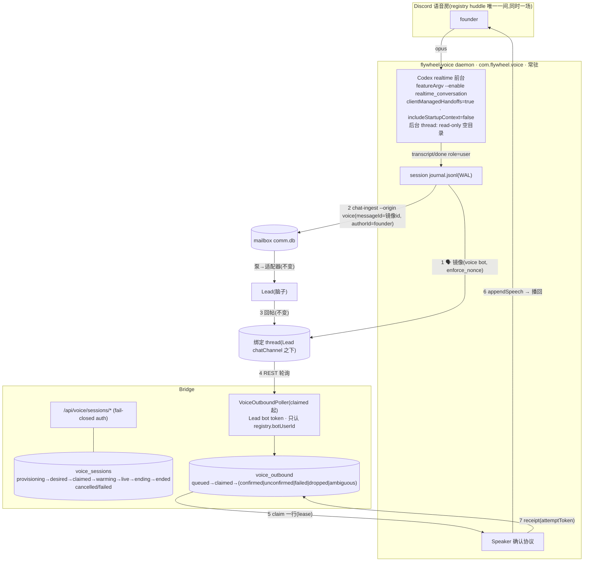

# FLY-2446 通用 voice 进程 — 实施计划
Issue: FLY-2446 (https://linear.app/geoforge3d/issue/FLY-2446/语音-通用-voice-进程会议模式所有-lead-可挂rg随身模式先-raya-用独立-codex-realtime-进程语音文字经)
日期: 2026-09-08
基于: research.md

状态:v4,**Codex R4 APPROVED**(2026-09-08;R1 八阻塞 → R2 四阻塞 → R3 两阻塞 → R4 零阻塞、一条文档润色已同步;Lead 裁定 `111dca6e` 冻结 R4 范围;处置见 §10)。本节点只出设计:不实现、不部署、不申请 ship;实现等 ④ FLY-2445 合入后由 DAG 派发。

## 0. 目标 · 非目标 · 授权 · gate

**目标**:一个 Flywheel 拥有的语音 daemon `flywheel-voice`,任何 Lead(Claude / Codex)按会话挂上;founder 口述 → mailbox 普通文字消息 → 泵 → 适配器 → Lead(②③④ 零改动);Lead 在 Discord 回帖 → Bridge 中继 → daemon 朗读(Lead 音色);会议模式所有 Lead 默认开,RG 模式默认关、按 Lead 开。

**非目标**:Lead↔Lead 问答 API(Lead 另开单);多 AI 同房;每 Lead 一个 bot;打断之外的话语权控制(闭麦/pause);RG「用嘴批 ship」(Bridge `/api/voice/ship-approval` 原样保留);迁或删 `voice-core/voice-bridge/voice-headphone`;产品口径里的任何阈值;改 Raya 仓(④ 删旧 driver,本单只给 CoS 的 `voiceIntent` 一个可调用的 CLI);打包进 npm(`package-onboard`)。

**授权边界**:新增的每个可执行面满足 FLY-2442 合同页 §7 七条。daemon 是合同 ① 的取信器与 ⑤ 的一个收听者,不是 Lead:无 `LeadDeliveryAdapter`、不 ack、不写泵。founder/Lead 已定的硬约束(exploration §2 C1–C13)不在本计划内重议。

**gate**:plan 定稿 → `stage set design_review --plan …` → Codex 设计评审 effective APPROVED → founder HTML 发布 → `complete --route phase_design_complete`。QA 硬门(§7):真语音房、两种 harness 各一场、录音波形而非事件日志、真实 `selectMeetingTranscript` 非空。

## 1. 架构



## 2. 稳定身份(全文只用这些名字)

| 类别 | 身份 | 值 / 位置 |
|---|---|---|
| 包 / bin | `packages/voice-codex` / `flywheel-voice` | 新包;不改 Gemini 线三包 |
| launchd | `com.flywheel.voice` | `scripts/launchd/com.flywheel.voice.plist`:`RunAtLoad true`、`KeepAlive {SuccessfulExit:false}`(exit 0 = 停住不拉;exit ≠0 = 拉)、`ThrottleInterval 30`;`units.manifest` 先 `hold`,QA 后 `managed` |
| wrapper | `scripts/flywheel-voice-wrapper.sh` | 逐行镜像 `flywheel-voice-bridge-wrapper.sh`:host-config、`.env`、FLY-2190 gate、**FLY-1501 restart-storm gate**、pid、exec;配置坏/锁冲突 ⇒ `meta-alert.sh` fail-loud + exit 0(launchd 不拉,不成风暴) |
| 进程锁 | `acquireProcessLifetimeFileLock` | `packages/teamlead/src/lead-backends/codex/ProcessLifetimeFileLock.ts`(macOS 无 `flock`);helper 缺失 = 致命 fencing 失败 ⇒ exit 0 |
| pid / 日志 | `~/.flywheel/pids/voice.pid` / `/tmp/flywheel-voice.log` | — |
| 状态目录 | `~/.flywheel/voice/`(0700) | `codex-home/`(前台专用 CODEX_HOME)、`scratch/<sessionId>/`、`sessions/<sessionId>/journal.jsonl`(0600,每条 fsync)、`daemon.json`(`bootId`) |
| Discord 身份 / 房间 | **registry `huddle` 块唯一权威**:`guildId`、`voiceChannelId`、`orchestratorBotTokenEnv`,新增 `orchestratorBotUserId` | `packages/teamlead/src/ProjectConfig.ts:254-264`(`HuddleConfig`);Lead 裁定 `804c102d`:复用 Huddle orchestrator bot,不新建 |
| 宿主本地配置 | `~/.flywheel/voice-host.json`(0600,可选) | `{ schemaVersion:1, qaVoiceChannelIds?:[], qaAllowUserIds?:[], evidenceRoots?:[] }`;**不含**身份/房间/token 三值 |
| founder id | Bridge `config.discordOwnerUserId` | 会话投影字段 `founderUserId` |
| Bridge 表 | `voice_sessions`、`voice_outbound` | teamlead.db;FLY-2006 分组 `protectedCurrentOrReference` |
| Bridge 路由 | `POST /api/voice/sessions`;`GET …/sessions/desired`;`GET …/sessions/by-meeting/:meetingId`;`GET …/sessions/:id`;`POST …/sessions/:id/{claim,renew,state,stop}`;`GET …/sessions/:id/outbound`;`POST …/sessions/:id/outbound/:seq/{claim,receipt}` | `packages/teamlead/src/bridge/voice-session-routes.ts`;鉴权见 §3.2 |
| lease | `lease_token`(32 字节随机 hex,claim 时发)、`lease_expires_at`;claim/renew 响应带 `leaseTtlMs` | 请求头 `X-Voice-Lease`;daemon 以单调时钟维护 **hard local deadline** |
| ④ adapter(Flywheel 侧) | `packages/teamlead/src/cos-ports/voice-intent.ts` → `createVoiceIntentPort({ bridgeUrl, tokenEnv }).voiceIntent({ meetingId, action })` | 返回 `{status:'accepted'}` ⇔ 2xx(含 `already_exists`),否则 `{status:'unavailable', reason}`;与 FLY-2445 `CoSPorts.voiceIntent` 签名一致 |
| 会议 authority | `.flywheel/meeting-notes.yaml` → `loadMeetingNotesConfig` + `canonicalizeMeetingStateDir` + `loadTrustedCurrentMeeting` | `packages/teamlead/src/meeting-notes-config.ts:113-137, 212-219`;请求体**不携带** `stateDir` |
| teamlead 导出 seam | `flywheel-teamlead/codex-process`(`CodexLeadProcess`、`spawnCodexAppServer`)、`flywheel-teamlead/process-lock` | 窄 subpath exports,新包 build+import smoke test |
| registry 字段 | `LeadConfig.voiceModes?: { meeting?: boolean; rg?: boolean }`、`LeadConfig.realtimeVoice?: string`、`HuddleConfig.orchestratorBotUserId: string` | `voice`(edge-tts)不动 |
| envelope | `ChatDeliveryEnvelopeV1.origin?: "discord" \| "voice"`、`voiceSessionId?: string` | `chat-ingest --origin voice --voice-session <uuid>`;probe `protocolVersion: 3` |
| mailbox 行值 | `source_kind="voice"`,`type` 仍 `"discord_chat"` | — |
| CLI | `flywheel-comm voice-session start\|stop\|status` | 运维用:`--meeting-id <uuid> [--state-dir <dir>]`(`--state-dir` 仅本地 drift 自检)或 `--mode … --project … --lead …`;④ adapter 不经 CLI,直接调 Bridge 路由(§3.9) |
| 会话状态 | `provisioning → desired → claimed → warming → live → ending → ended`;`cancelled`、`failed` 终态 | 终态不可改;每次转移带 `reason` |
| 朗读状态 | `queued → claimed → {confirmed, unconfirmed, failed, dropped, ambiguous}` | `playing` 只是 daemon 内存态,不进 DB;`suspended` 随抢话链一起不进 v1(§3.7) |
| 显示标签 | 会议 thread `🎙️ <topic> · <YYYY-MM-DD>`;RG thread `🎧 随身 · <YYYY-MM-DD HH:mm>`;镜像 `🗣️ **<founder 显示名>**:`;前台自言 `🤖(前台自言)`;状态行 `📻` | `voice-codex/src/labels.ts` 一处;Bridge poller 按这些前缀跳过 voice bot 自己的消息 |
| 固定口令 | `退出语音模式`;`等待音关掉` / `等待音打开` | NFKC+去空白精确匹配;只认 founder;daemon 本地处理,无 route |
| 镜像 nonce | `base36(sha256(sessionId + ":" + transcriptId))[0:25]` + `enforce_nonce:true` | Discord 合同:nonce ≤25 字符,同作者短窗口去重 |

## 3. 设计

### 3.1 会话创建与 provisioning(Bridge)

**入口** `POST /api/voice/sessions`,body 二选一:
- ④ 形态:`{ meetingId }` —— **请求体不带路径**。Bridge 从仓内受版本控制的 `.flywheel/meeting-notes.yaml` 经 `loadMeetingNotesConfig` → `canonicalizeMeetingStateDir` 得到唯一 canonical `meetingStateDir`,再 `loadTrustedCurrentMeeting`(`meeting-notes-config.ts:113-137, 212-219`),要求 `id === meetingId`、`status ∈ {starting, live, interrupted}`;`leadId` 必须在**全 registry** 恰好解析到一个 `(projectName, agentId)`(`ProjectConfig.ts:644-652` 只保证 exact key 唯一,`agentId` 跨项目可重名 ⇒ 0 个 404 `lead_not_found`、多个 400 `lead_ambiguous`,不猜);派生 `mode="meeting"`、`projectName/leadId`、`topic`、`evidenceDir = meetingStateDir`。CLI 的 `--state-dir` 只是可选自检:与 canonical realpath 逐字比对,不等 ⇒ 400 `state_dir_drift`。**幂等**:同 `meetingId` 已有非终态行且规范化 intent(project、lead)相同 ⇒ 200 `already_exists`;不同 ⇒ 409 `meeting_intent_conflict`。
- 运维形态:`{ mode, projectName, leadId, evidenceDir?, topic? }`(meeting 必带 `evidenceDir`,须在 `evidenceRoots` 内)。验收证据只认 ④ 形态。

`requested_by` 与 `credential_tier` **从鉴权结果派生**(master / ingest),body 的 `requestedBy` 只作说明字段。

**校验阶梯**(每级一格负向测试):503 `voice_unavailable(master_token_unset)`(§3.2)→ 401 → 400(字段/UUID/枚举)→ 404 `lead_not_found` / 400 `lead_ambiguous` → 403 `voice_mode_not_enabled` → 503 `voice_unavailable(huddle_missing|bot_env_unset)` → 400 `evidence_dir_rejected` → 400 `meeting_invalid`(id/status/已有终态 signal)→ **preflight**(§3.3)失败 503 `voice_unavailable(<reason>)` → 事务:插 `provisioning` 行,`provisioning_step='reserved'`。

**唯一约束**(DDL §3.6):`voice_channel_id` 上 partial UNIQUE(`state NOT IN ('ended','failed','cancelled')`)⇒ 并发 start 只有一个能插行,另一个 409 `session_active`;`meeting_id` 非空时 UNIQUE(同上 partial)。**先占账,再做外部副作用。**

**provisioner = 单一 reducer**(创建请求与巡检恢复跑同一段代码,输入是该行,输出是下一步或终态;每一步「先写 intent 列,再做副作用,再写回执列」,三处都是同 owner 的 CAS `WHERE session_id=? AND provisioning_step=? AND cancel_requested_at IS NULL`):

| step(intent 已持久化) | 副作用 | 回执 | 崩溃后恢复(reducer 重入) |
|---|---|---|---|
| `reserved` | 抓每个 bound 文本频道高水位(`GET /channels/{id}/messages?limit=1`,Lead bot;RG 的 `chatChannel` 在此刻抓,thread 尚不存在) | `outbound_cursor[chatChannel]` | 无副作用,重做;抓不到 ⇒ `failed(provisioning_cursor)` |
| `root_requested`(先持久化 `provisioning_nonce = base36(sha256(sessionId+":root"))[0:25]`) | Lead bot 发根卡(`postDiscordMessageToChannel` 扩 `options.nonce` + `enforceNonce:true`,`allowed_mentions:{parse:[]}`;根卡文本由 `labels.ts` 定长模板生成并断言**单块**——`splitDiscordMessage` 返回 >1 块即拒绝,不给多块派 nonce) | `root_message_id` | **root unknown**:同 nonce 重发,Discord 返回既有消息 ⇒ 写回执;窗外仍未知 ⇒ `failed(provisioning_root_unknown)`,**不再断言「无外部副作用」**,巡检把可能存在的根卡列入 `orphan_candidates` 记录 |
| `thread_requested` | `startThreadFromMessage`(`chat-thread-utils.ts:641`) | `thread_id` | Discord 回「已有 thread」⇒ `GET /channels/{chat}/messages/{root}` 取 `thread.id` |
| `member_requested` | `addThreadMember(threadId, founderUserId)`(`:393`) | `member_added_at` | 幂等重做(已是成员即 2xx/204) |
| `thread_cursor` | thread 高水位 = `root_message_id`(**排除根卡本身**,见 §3.6);`bound_channel_ids` 定稿 | `outbound_cursor[thread]`、`bound_channel_ids` | 无副作用,重做 |
| `finalize` | — | CAS `provisioning → desired` | 重做 CAS |

**stop 在 provisioning 期间**:`stop` 不直接终态化 provisioning 行,只写 `cancel_requested_at`;provisioner 在每个副作用**前后**的 CAS 都带 `cancel_requested_at IS NULL`,看到取消即停止推进并自己收尾为 `cancelled`:已有根卡 ⇒ 在根卡下回 `📻 语音会话已取消`,已有 thread ⇒ best-effort 归档;收尾结果写 `reason`。provisioner 死了(`updated_at` 早于 🔶 `provisioningStaleMs`,默认 120,000)⇒ 巡检以同一 reducer 接手(它读到 `cancel_requested_at` 同样走取消收尾)。

**反例测试**(每格一测):每一步 intent 写后、副作用后、回执前崩溃各一;root unknown 同 nonce 重发命中/窗外;root/no-thread;thread/no-member;thread/no-cursor;finalize 前崩;每一步前后收到 cancel;两个 provisioner 同时接手同一行(CAS 只有一个赢)。

### 3.2 鉴权(修正 R1-1)

现状:`app.use("/api", apiAuthWithRunnerTierDelegation(...))`(`bridge/plugin.ts:2908-2914`)先于 `/api/voice` 挂载(`:9372-9427`);delegation 只放行 `/lead-inbox/nudge`、`/reports*`(`:1254-1269`);`masterOrIngestAuthMiddleware` 在 master 未设时 `next()`(`:1229-1247`,fail-open)。

设计:
- `apiAuthWithRunnerTierDelegation` 增加**精确前缀**委托 `req.path === "/voice/sessions" || req.path.startsWith("/voice/sessions/")`;FLY-546 四条 `/api/voice/{scope,context,gate-binding,ship-approval}` 不变。
- 新 `voiceSessionAuthMiddleware(masterToken, ingestToken)`,**fail-closed**:master 未配置 ⇒ 503 `voice_unavailable(master_token_unset)`;无/坏 header ⇒ 401;`safeCompare` 命中 master ⇒ tier `master`,命中 ingest ⇒ tier `ingest`。两种 tier 都能 start/stop/status;`claim/renew/state/outbound/receipt` 只允许 master(daemon 从 `.env` 拿)。
- 测试:master 未设 503;坏 token 401;master 正测;ingest 正测;ingest 调 `claim` 403;FLY-546 四条路由鉴权字节不变。

### 3.3 会话前 preflight(Bridge,provisioning 之前;修正 R1-8)

用 huddle orchestrator bot token:
1. `GET /users/@me` ⇒ id 必须 `=== huddle.orchestratorBotUserId`(registry 拥有,不从 token 推)。
2. 语音房 CONNECT/SPEAK:`GET /guilds/{g}/members/{botId}`、`GET /guilds/{g}/roles`、`GET /channels/{voiceChannelId}`,按 Discord 权限算法(base ∪ roles → @everyone overwrite → role overwrites → member overwrite)算出 `CONNECT|SPEAK|VIEW_CHANNEL`;实现 `computeChannelPermissions` 纯函数(表驱动单测)。
3. 绑定文本频道(voice bot 要在新 thread 发镜像/状态行):对 `chatChannel` 同法算出 `VIEW_CHANNEL|READ_MESSAGE_HISTORY|SEND_MESSAGES_IN_THREADS`(建 thread 的 `CREATE_PUBLIC_THREADS` 属 Lead bot,见第 4 项)。
4. Lead bot(建根卡/thread/回帖用它):`GET /users/@me` ⇒ id `=== lead.botUserId`(registry 拥有);对 `chatChannel` 同法算出 `SEND_MESSAGES|CREATE_PUBLIC_THREADS|READ_MESSAGE_HISTORY|VIEW_CHANNEL`。
5. 原生取信器不会吃镜像(修正 R1-4):Claude Lead ⇒ 读该 Lead 插件 access 文件,`allowBots` **不得**含 voice bot id(插件 `server.ts:1603-1606`:bot 消息默认丢,只放行 `allowBots`);Codex Lead ⇒ registry `huddle.orchestratorBotUserId` 存在即由 §3.5 的 gateway 忽略列表生效(启动期断言该 Lead 的运行版本 ≥ 含此改动的 SHA,否则 unavailable)。

任一失败 ⇒ 503 `voice_unavailable(<reason>)`,**不引入新 bot、不建 thread、不插行**。

### 3.4 lease 与状态机(修正 R1-3)

| 转移 | 谁 | 条件 |
|---|---|---|
| `provisioning → desired` | Bridge | §3.1 |
| `desired → cancelled` | Bridge(stop) | 终态,无 daemon 参与 |
| `provisioning → cancelled` | **provisioner**(创建请求或巡检接手者,凭 `provisioner_epoch`) | stop 只写 `cancel_requested_at`;provisioner 在下一个 CAS 看到它即收尾(§3.1);巡检接手时换新 `provisioner_epoch`,旧 provisioner 的 CAS 因 epoch 不等而失败 |
| `desired → claimed` | daemon `POST …/claim { daemonBootId }` | CAS;响应 `{ leaseToken, leaseTtlMs, leaseExpiresAt, projection }`;`projection` = mode/project/lead/displayName/realtimeVoice/guildId/voiceChannelId/threadId/boundChannelIds/founderUserId/qaAllowUserIds/evidenceDir/meetingId |
| `claimed → warming → live` | daemon `state` | 需 `X-Voice-Lease` 匹配且未过期 |
| `claimed/warming/live → ending` | Bridge(stop / `voiceIntent stop`) | daemon 在下一次 `renew` 响应里看到 `state:"ending"` |
| `ending → ended` | daemon `state` | 带 `reason ∈ {she-left, text-stop, voice-stop}` |
| 任一非终态 → `failed` | Bridge(lease 过期、provisioning 超时、`ending` 超时 🔶)或 daemon(带 lease,或带 **stale lease 只允许写 failed**) | `reason` 必填 |

- **lease 时序合同**(修正 R2-4 / R3-1,次序是硬约束,值 🔶 且由配置校验拒绝违例):`leaseTtlMs`(默认 15,000)由 Bridge 在每次 claim/renew 响应里返回;daemon 在**发出**请求时记 `t_send`(单调时钟),收到成功响应后 `deadline = t_send + leaseTtlMs − leaseHttpTimeoutMs`(响应耗时已含在 `t_send` 之后,再扣一个超时作安全边际,不把网络耗时加到 deadline 后面);`leaseRenewMs`(默认 4,000)+ `leaseHttpTimeoutMs`(默认 2,000)= 6,000 **< leaseTtlMs / 2 = 7,500**;Bridge 侧 `lease_expires_at = server_now + leaseTtlMs`(`server_now ≥ t_send` 对应的服务端时刻),巡检只在 `lease_expires_at + clockSkewGraceMs`(默认 5,000)之后才置 `failed(lease_lost)`。⇒ daemon 本地 deadline(≤ `t_send + 13,000`)严格早于 Bridge 释放 partial UNIQUE(≥ `t_send + 20,000`)。
- **hard local deadline 处处生效**:join、每条镜像 POST、每次 ingest、每次 outbound claim、每个 `appendSpeech` 块前都检查 `now_mono < deadline`;到点即刻 kill-switch(停上行、停播放、离房、不再镜像/ingest、`thread/realtime/stop`、kill 子进程、journal `fenced`)。renew 连续失败 🔶 `leaseMissMax`(默认 2)次、收到 409/终态 **只能更早**触发 kill-switch,不能延后。
- Bridge 每个 mutation(`state/renew/outbound/claim/receipt`)与 poller 的每次 insert 在同一事务里校验「行仍非终态 + lease 未过期 + 当前 lease_token 匹配」;poller 在会话进入终态后不再 insert。
- Bridge 巡检:超过 `lease_expires_at + clockSkewGraceMs` 的 `claimed/warming/live` ⇒ `failed(lease_lost)`;`ending` 超过 🔶 `endingTimeoutMs` ⇒ `failed(ending_timeout)`;终态时把 `voice_outbound` 的 `queued → dropped`、`claimed → ambiguous`,并发状态行。
- 精确反例:Bridge 在 expiry+grace 后创建并 claim 新会话时,旧 daemon(renew 全部挂住)已在自己的 deadline 停流离房,fake Discord 与 fake 音频出口断言旧 owner **零**副作用。
- **daemon 重启 = 先问 lease 再动手**(修正 R3-1):读 `daemon.json` 与 `sessions/*/journal.jsonl`;对 journal 未终结的会话,先用 journal 里的旧 lease 调 `POST …/renew`。(a) 200 且行仍 `claimed/warming/live` ⇒ lease 仍归本机(短暂重启,未过 expiry):按上式建立保守本地 deadline,在 deadline 内做 §3.5 的 journal 折叠(镜像/ingest 均受 deadline 检查),折叠完再 `POST …/state { failed, reason:"daemon_restart", abandonedCount }`;(b) 409/终态/过期 ⇒ **无 authority**:不镜像、不 ingest,把未终结前缀全部写 `abandoned(recovery_fenced)`,再以 stale lease 写 `failed(daemon_restart, abandonedCount)`(Bridge 只接受 stale lease 写 failed)。Bridge 收到 `abandonedCount > 0` 就在 thread 发 `📻 有 N 句可能没送到,请再说一遍`。两种情况都不接管、不进房,然后进 Idle。`GET …/sessions/desired` 语义不变。不做通用 takeover;若产品坚持补投,另立窄 recovery authority(不在本单)。
- 反例测试:stop-before-claim ⇒ cancelled;stop-during-warming ⇒ ending → daemon 收尾 → ended(text-stop);renew 分区 ⇒ Bridge failed + 旧 daemon kill-switch(旧 lease 之后写 state/receipt 全 409);新会话起后旧 lease 不能写任何行。

### 3.5 上行:口述 → 镜像 → mailbox(修正 R1-4)

**脱敏只在输入边界做一次**(修正 R2-3):`transcript/done` 的 raw 文本只存在于内存,立刻 `safeText = scrubTranscript(raw)`(`packages/voice-core/src/scrub.ts:43`);journal、镜像、mailbox、evidence `realtime_transcript`、状态行全部只见 `safeText`。Bridge poller 对 Lead 回帖同样在写 `voice_outbound.text` 前 `scrubTranscript`;daemon 朗读的是已脱敏文本。单号/人名/普通数字不受影响(`BARE_RANDOM` 只吃 ≥40 位随机串)。

**journal(WAL,0600,同步 fsync)**每句话四条记录:`captured{transcriptId, speakerUserId, safeText, nonce}` → `mirror_requested` → `mirrored{messageId}` → `ingested{deliveryId, lane}`;任一放弃写 `abandoned{stage, reason}`。nonce 在 `captured` 时就确定(`base36(sha256(sessionId+":"+transcriptId))[0:25]`),所以任何前缀都能重入。

1. `transcript/done role=user` 且说话人 ∈ `{founderUserId} ∪ qaAllowUserIds` ⇒ `captured`。
2. 镜像:`POST /channels/{thread}/messages { content: "🗣️ **<名>**: " + safeText, nonce, enforce_nonce:true, allowed_mentions:{parse:[]} }`(voice bot token)。响应 2xx ⇒ `mirrored`。超时/未知 ⇒ 在 🔶 `mirrorRetryWindowMs`(默认 60,000,远小于 Discord 去重窗)内**同 nonce 重试**,Discord 返回既有消息即幂等;窗外仍未知 ⇒ `abandoned(mirror_unknown)` + 状态行 `📻 有一句可能没送到,请再说一遍`。
3. ingest:`flywheel-comm chat-ingest --origin voice --voice-session <id> --lead <leadId> --chat-id <thread> --origin-channel-id <thread> --message-id <镜像id> --author-id <speaker> --author-name <名> --ts <iso> --msg-kind guild --founder-id <founderUserId> --reply-channel-id <thread> --content-stdin --db <comm.db>`。verdict(`mailbox-queue.ts:212-222` 五种)处置(修正 R3-2):**成功集合只有两种** —— `inserted_inbox` ⇒ `ingested`;`active_inbox` ⇒ 读回该 `delivery_id` 的行(`flywheel-comm message-status --json --with-envelope`),逐字段核 `origin/voiceSessionId/authorId/text`,全等 ⇒ `ingested`(重放),不等 ⇒ `abandoned(ingest_identity_conflict)` + 状态行 + QA 指标(原生取信器抢先吃了镜像,§3.3-5 失守)。`inserted_external`(`carrier='external'` 才会出现,`mailbox-queue.ts:740-753`;`ingestDiscordChatOnQueue` 硬编码 `carrier:"inbox"`,`discord-chat-ingest.ts:141-155`,所以它意味着不变量被破坏,那行不会走 `LeadInboxLoop`)、`legacy_external`、`archived` ⇒ 一律 `abandoned(ingest_lane_<lane>)` fail-loud(状态行 + evidence),不当成功。非 0 退出 ⇒ 退避重试 🔶 次,仍失败 ⇒ `abandoned(ingest_failed)` + 状态行。
4. **重启折叠**(启动时按 journal 前缀重入,三种未终结前缀都覆盖):`captured` 无 `mirror_requested` ⇒ 用已定 nonce 走步 2;`mirror_requested` 无 `mirrored` ⇒ 窗内同 nonce 重试、窗外 `abandoned`;`mirrored` 无 `ingested` ⇒ 步 3。折叠完成后才写 `failed(daemon_restart)`。

**Codex 取信器忽略 voice bot**(① 的一处小改):`CodexDiscordGateway.passesFilters`(`CodexDiscordGateway.ts:266-275`)增加 `ignoredAuthorIds`(来自 registry `huddle.orchestratorBotUserId`,缺席则空集,字节兼容);测试:voice bot 消息不入 mailbox,其他 bot 行为不变。Claude 插件不改(默认丢 bot)。

**镜像文本**:`scrubTranscript`(`packages/voice-core/src/scrub.ts:43`)脱敏后再发;evidence 原文也脱敏后落盘(修正 R1-8:凭据不进任何外部出口与磁盘;单号/人名/数字不受影响,`BARE_RANDOM` 只吃 ≥40 位随机串)。

### 3.6 下行:Lead 回帖 → 朗读(修正 R1-5)

**表**

```sql
CREATE TABLE IF NOT EXISTS voice_sessions (
  session_id TEXT PRIMARY KEY, mode TEXT NOT NULL CHECK(mode IN ('meeting','rg')),
  project_name TEXT NOT NULL, lead_id TEXT NOT NULL, guild_id TEXT NOT NULL, voice_channel_id TEXT NOT NULL,
  provisioning_step TEXT NOT NULL DEFAULT 'reserved' CHECK(provisioning_step IN ('reserved','root_requested','thread_requested','member_requested','thread_cursor','finalize','done')),
  provisioner_epoch TEXT, provisioning_nonce TEXT, root_message_id TEXT, thread_id TEXT, member_added_at TEXT,
  cancel_requested_at TEXT, orphan_candidates TEXT NOT NULL DEFAULT '[]',
  bound_channel_ids TEXT NOT NULL DEFAULT '[]', meeting_id TEXT, evidence_dir TEXT,
  requested_by TEXT NOT NULL, credential_tier TEXT NOT NULL CHECK(credential_tier IN ('master','ingest')),
  state TEXT NOT NULL CHECK(state IN ('provisioning','desired','claimed','warming','live','ending','ended','cancelled','failed')),
  reason TEXT, daemon_boot_id TEXT, lease_token TEXT, lease_expires_at TEXT,
  outbound_cursor TEXT NOT NULL DEFAULT '{}', created_at TEXT NOT NULL, updated_at TEXT NOT NULL, ended_at TEXT);
CREATE UNIQUE INDEX IF NOT EXISTS voice_sessions_active_room ON voice_sessions(voice_channel_id)
  WHERE state NOT IN ('ended','cancelled','failed');
CREATE UNIQUE INDEX IF NOT EXISTS voice_sessions_active_meeting ON voice_sessions(meeting_id)
  WHERE meeting_id IS NOT NULL AND state NOT IN ('ended','cancelled','failed');
CREATE TABLE IF NOT EXISTS voice_outbound (
  seq INTEGER PRIMARY KEY AUTOINCREMENT, session_id TEXT NOT NULL, message_id TEXT NOT NULL UNIQUE,
  channel_id TEXT NOT NULL, author_id TEXT NOT NULL, text TEXT NOT NULL, observed_at TEXT NOT NULL,
  phase TEXT NOT NULL DEFAULT 'queued' CHECK(phase IN ('queued','claimed','confirmed','unconfirmed','failed','dropped','ambiguous')),
  attempt_token TEXT, claimed_at TEXT, finished_at TEXT);
CREATE INDEX IF NOT EXISTS voice_outbound_session_phase ON voice_outbound(session_id, phase, seq);
```

FLY-2006 三处同改(注册表分组、fixtures 表清单、sweep 硬计数 +2),与 DDL 同一 chunk。

**poller**(每会话一个,`claimed` 起到终态止):复用 `RestPollDiscordInboundSource` 的 `after=<cursor>` 拉取与分页语义,但 cursor 来自 `voice_sessions.outbound_cursor`(provisioning 已播种,**不走它的「无 cursor 基线到最新」分支**,`:163-192`);组合不继承。过滤:`author.id === lead.botUserId`;**按 exact id 排除 `root_message_id`**(根卡是 Lead bot 发的,否则会被当回帖念);跳过 `📻/🗣️/🤖` 前缀与空文本。写账:同一事务 `INSERT OR IGNORE voice_outbound(phase=queued, text=scrubTranscript(content))` + cursor **前进到本页最高 id**(无论是否被过滤;只前进)+ 校验会话非终态。轮询失败只记事件与状态行 `📻 回程暂时不通`,不置 failed。

**daemon**:`GET …/outbound`(带 lease)返回 `phase='queued'` 的行(≤ 🔶 20,按 seq);对每行 `POST …/outbound/:seq/claim` ⇒ Bridge CAS `queued → claimed` 发 `attemptToken`;daemon 本地进入 playing(内存态,不进 DB)→ `Speaker.speak({pendingKey: "voice:" + message_id, text: stripForSpeech(text)})` → `POST …/outbound/:seq/receipt { attemptToken, status }`,status ∈ `confirmed|unconfirmed|failed|dropped`。receipt 幂等:同 token 同 status 200 no-op;token 不匹配 409;非 `claimed` 行 409。

**crash 窗**:claim 后崩 ⇒ 行留在 `claimed`,daemon 重启不重拉(只拉 `queued`),Bridge 终态巡检置 `ambiguous`;声音已进房但 receipt 超时 ⇒ daemon 本地重试 receipt(同 token),不重念;会话结束时 `queued → dropped`、`claimed → ambiguous`。反例测试:append 前崩、append 后崩、receipt 超时、跨重启不重念、created→live 窗口内的 Lead 主动发言被念、根卡不被念、整页被过滤后 cursor 仍前进。

`stripForSpeech`:去 markdown 壳/链接壳/代码围栏标记,不改词、不改数字与编号(C9);按估算 token 分块 ≤ 🔶 `speechChunkTokens`(默认 600,低于 `appendSpeech` 的 1,000 预算),块间隙 🔶。

### 3.7 daemon 生命周期与前台

- **Idle**:每 🔶 `idlePollMs`(默认 5,000)`GET …/sessions/desired`;不起 Codex、不进房。
- **claim → warming**:`renew` 起跑;起前台:`CodexLeadProcess({ spawnChild: () => spawnCodexAppServer({ codexBin, mcpArgv: [], codexHome: ~/.flywheel/voice/codex-home, featureArgv: ["--enable","realtime_conversation"], baseEnv: allowlist }) })` + `start()`(修正 R1-7:`spawnCodexAppServer` 增加受测的 `featureArgv?` 前缀 seam,`codex-lead-runtime.ts:1297-1352`;默认调用字节不变)。`startThreadWithResult({ cwd: scratch/<id>, sandbox:"read-only", approvalPolicy:"never", baseInstructions: NO_BRAIN, config:{ sandbox_workspace_write:{ network_access:false } } })`(`CodexLeadProcess.ts:391`)⇒ 回执 `sandbox !== "read-only"` 或 `cwd` 不等 ⇒ `failed(thread_receipt_drift)`。`thread/realtime/start { threadId, transport:{type:"websocket"}, version:"v2", outputModality:"audio", voice: realtimeVoice, prompt: buildFrontendPrompt(displayName), clientManagedHandoffs:true, includeStartupContext:false, delegationAckFiller:false }`;`prompt` 估算 token > 8,192 ⇒ 拒绝启动。进房(`joinVoiceChannel` + `entersState(Ready)`)⇒ evidence `meeting_container_starting`(会议)/ `session_starting`(rg)+ voice-signal `ready`。
- **live**:founder 在场 ⇒ `state live` + evidence `meeting_container_live` / `session_live` + signal `live`;不在场 ⇒ 等 🔶 `presenceGraceMs`(默认 120,000)⇒ `failed(no_human)`。上行只收授权说话人;`transcript/done role=user` ⇒ §3.5;回程 ⇒ §3.6;`realtime_transcript` 行按既有形状 `{ts, kind:"realtime_transcript", role, text, generation, speakerUserId?}` 写 evidence(`meeting-notes-scheduler.ts:643-675` 只认这个形状),journal 的 delivery 阶段**另写**,不替代。
- **前台自言**:assistant 转写不匹配任何待念块 ⇒ `unconfirmed` 段 ⇒ 镜像 `🤖(前台自言)…` + evidence `frontend_utterance`,不进 mailbox;`item/*` 出现 `handoff_request` ⇒ evidence `frontend_delegation`(QA 指标目标 0)。
- **指示器**:Lead 回帖之间播放等待音(提取 `audio/Bed.ts` B 音色);`📻` 状态行按事件写(`已转达`/`<displayName> 在想`/`已念完`),不按时间写;口令 `等待音关掉/打开` 本地切换。
- **抢话(barge-in)v1 默认关**(修正 R2-6,C5「难就算了」):Raya 的抢话决策与 tail/resume 住在 `InboxReader`/`InboxArbitrator`,本单不提取它们;v1 只提取 Uplink 的 VAD 门(闭麦送静音)与 Downlink,不做让位;`Speaker` 的 `suspendInbox`/`suspended` 路径不接线。v1 **不暴露**任何抢话开关(没有行为的开关是假开关);真房 QA 后若要开,另立最小 arbitration adapter 时再加配置,不搬 `InboxReader`。v2 回合制下 founder 说的话会被排队、不丢(FLY-1850 `prd.md:1814-1826`)。
- **结束与信号映射**(修正 R1-6):founder 离房 ⇒ `ended(she-left)`;`stop`/`voiceIntent stop` ⇒ `ended(text-stop)`;口令退出 ⇒ `ended(voice-stop)`;`realtime/closed`、子进程退出、lease 丢失、kill-switch ⇒ `failed(<reason>)` 且 voice-signal 写 **`interrupted`**,绝不写非法 `ended`。voice-signal 写入复用 Raya `writeMeetingVoiceSignal` 的语义(meeting id 匹配、时间单调、`ended` 终态不可覆盖、reason 枚举,raya `packages/contracts/src/meeting.ts:558-613`):提取为 `voice-codex/src/meeting-voice-signal.ts` 并带原测试。收尾序列:停上行 → 念完当前块或丢弃(🔶 `drainMs`)→ evidence `meeting_container_ended`/`session_ended` → signal → 离房 → `thread/realtime/stop` → kill 子进程 → `state` → 删 `scratch/<id>` → Idle。不留房等。
- **退出码**:0 = 干净/拒绝(配置坏、锁冲突、helper 缺失;launchd 不拉);1 = 运行期崩溃(launchd 拉)。

### 3.8 envelope / chat-ingest / registry / host 配置

- envelope:`origin?`、`voiceSessionId?` 成对校验(照 `heldSince/heldReason`,`chat-delivery-envelope.ts:113-125`);渲染 origin=voice ⇒ `source="voice" voice-session="<id>"` + 一行 `[voice] 这句话是 founder 口述并会被念给她听;请在本 thread 用可说出口的短句回复。`;`sourceKind: "voice"`,`type` 不变;CLI `--origin`、`--voice-session`;probe v3;`message-status --with-envelope` 输出 origin/voiceSessionId/authorId/text 供 §3.5 核对。旧生产者字节快照不变。
- registry:`voiceModes`(对象、键 ∈ `meeting|rg`、严格布尔)、`realtimeVoice`(∈ `REALTIME_V2_VOICES` 十个,新常量文件 `packages/teamlead/src/realtime-voices.ts`,缺席投影 `marin`)、`huddle.orchestratorBotUserId`(snowflake,必填于本功能:缺席 ⇒ `voice_unavailable(huddle_bot_user_id_missing)`,不影响其他功能)。C8 三个音色映射与 `orchestratorBotUserId` 由运维写 registry(rollout 清单)。
- `voice-host.json` loader:`readTrustedFile` 风格;缺文件合法(QA 列表空、`evidenceRoots` 默认 = 各 `projectRoot` + `~/.flywheel`)。

### 3.9 CLI 与 ④ 接力

`flywheel-comm voice-session start (--meeting-id <uuid> [--state-dir <dir>] | --mode meeting|rg --project <p> --lead <l> [--evidence-dir <abs>] [--topic <text>]) [--json]`;`stop (--session <id> | --meeting-id <uuid>)`;`status (--session <id> | --meeting-id <uuid>)`。`--state-dir` **可选**、只做本地 drift 自检(§3.1),HTTP 请求体不带路径。token 解析 `TEAMLEAD_API_TOKEN` → `FLYWHEEL_INGEST_TOKEN`;输出一行 JSON。删除 v1 的 `set --hold-music`(口令已覆盖)。

④ 的 `CoSPorts.voiceIntent({meetingId, action})` 由 Flywheel 侧 `createVoiceIntentPort({ bridgeUrl, tokenEnv })`(§2,批 C′)实现:直接调 `POST /api/voice/sessions { meetingId }` / `POST …/stop`(经 `by-meeting` 查行),**只传 `meetingId`**;`accepted` ⇔ 2xx(含 `already_exists`);其余 ⇒ `unavailable` 带 reason。这是 ⑤ 给 ④ 的唯一接口;④ 未合入前它没有生产调用方,验收 G 依赖 ④ 且 C′ 必须先于 G。

### 3.10 launchd / 重启分类 / 提取

- plist、wrapper、`units.manifest`(`hold`)见 §2;`restart-services.sh classify_changes` 增 `packages/voice-codex/*`、`scripts/flywheel-voice-wrapper.sh` → `restart_voice`(单元未加载时 no-op 并打印)。daemon 不进 Codex Lead 六处基名白名单。
- 从 raya `0f77e97` 提取(research §1.3 清单)每文件头注明来源;不提取 CodexLeg/AppServerClient/OutboxWatcher/ReadbackGate/InboxReader/approval/meeting-context。

## 4. 负向守卫(每条一格测试)

| # | 输入 | 期望 |
|---|---|---|
| G1 | master 未配置 / 无 token / 坏 token | 503 / 401 / 401;无副作用 |
| G2 | ingest tier 调 `claim/renew/state/outbound/receipt` | 403 |
| G3 | `mode=rg` 且 `voiceModes.rg` 缺/false;`"true"` 字符串 | 403;registry 加载期拒 |
| G4 | `mode=meeting` 且 `voiceModes.meeting=false` | 403 |
| G5 | 并发两次 start 同房 | 恰一行,另一 409;无第二张根卡 |
| G6 | 同 `meetingId` 重复 start(intent 相同 / 不同) | 200 `already_exists` / 409 |
| G7 | `evidenceDir` 缺/symlink/根外;`meeting.json` id 不符/终态/leadId 未知/已有 `ended` signal | 400 |
| G8 | preflight 任一失败(`/users/@me` 不符、CONNECT 缺、chatChannel 403、`allowBots` 含 voice bot) | 503 `voice_unavailable(<reason>)`,无副作用 |
| G9 | provisioning 抓 cursor 失败 / 发根卡失败 / 建 thread 失败 | failed 且无后续副作用;根卡有 thread 无时恢复取 `thread.id` |
| G10 | provisioning 超时无根卡 | `failed(provisioning_abandoned)` |
| G11 | 第二次 claim / claim 非 desired | 409 |
| G12 | 坏 lease、过期 lease、旧 lease 写非 failed、终态再写 | 409 |
| G13 | stop before claim / during warming / during live | cancelled / ending→ended(text-stop) |
| G14 | renew 分区 | Bridge `failed(lease_lost)`;旧 daemon kill-switch;之后 state/receipt 全 409;新会话起后旧 lease 写不了任何行 |
| G15 | `ending` 超时 | `failed(ending_timeout)` |
| G16 | thread 里非 Lead bot 作者 / Lead 在非绑定频道 / voice bot 前缀 | 不入 `voice_outbound` |
| G17 | 同 `message_id` 两次观察;cursor 事务中途崩 | 一行;cursor 不回退到已写行之前 |
| G18 | 终态时 `queued` / `claimed` 行 | dropped / ambiguous |
| G19 | claim 后 daemon 崩 | 行留 claimed,重启不重念,巡检置 ambiguous |
| G20 | receipt 超时重试 / token 不匹配 / 重复 receipt | 幂等 200 / 409 / 200 no-op |
| G21 | created→live 窗口内 Lead 在 chatChannel 发言(rg) | live 后被念 |
| G22 | envelope `origin=voice` 无 `voiceSessionId`(反之亦然);`--origin` 非枚举 | 抛错 |
| G23 | 旧生产者不传 `--origin` | 渲染字节与 v2 一致(快照) |
| G24 | ingest verdict `active_inbox` 且回读行字段相同 / 不同 | `ingested` / `abandoned(ingest_identity_conflict)` + 状态行 |
| G25 | 镜像超时:窗内同 nonce 重试得既有消息 / 窗外 | `mirrored`(幂等)/ `abandoned(mirror_unknown)` |
| G26 | daemon 重启:journal 有 `mirrored` 无 `ingested`,且 `renew` 成功(lease 仍有效) | 在本地 deadline 内重放 ingest,再 `failed(daemon_restart)`;不进房;renew 被拒/过期的情形见 G42 |
| G27 | Codex gateway 收到 voice bot 消息 / 其他 bot 消息 | 忽略 / 行为不变 |
| G28 | 非授权说话人音频 | 不上行、无 captured |
| G29 | thread 回执 sandbox ≠ read-only | `failed(thread_receipt_drift)`,不进房 |
| G30 | realtime start 参数 | 单测锁死 `clientManagedHandoffs===true && includeStartupContext===false && version==="v2"`;`spawnCodexAppServer` 无 `featureArgv` 时 argv 字节不变 |
| G31 | `prompt` 超 8,192 估算 token | 拒绝启动 |
| G32 | 待念文本超块上限 / 含 `sk-…` | 分块;脱敏后念与镜像;数字与单号原样 |
| G33 | assistant 转写不匹配待念块 / `handoff_request` | `🤖` 镜像 + evidence,不 ingest / evidence 计数 |
| G34 | 异常终局(closed/子进程退出/lease 丢) | voice-signal `interrupted`;`ended` 仅三种 reason;终态 signal 不可覆盖 |
| G35 | 真实 `selectMeetingTranscript` 对一场会 | 非空;mismatched meeting / 无终态 signal ⇒ untrusted |
| G36 | 第二个 daemon 实例 / 锁 helper 缺失 / 配置坏 | exit 0 + meta-alert;launchd 不拉;无风暴 |
| G37 | founder 一直不进房 | `failed(no_human)`,离房,子进程退出 |
| G38 | FLY-2006 `assertClassifiedSchema` | 两表已分组,硬计数 +2 |
| G39 | provisioning 每步 intent 后/副作用后/回执前崩;root unknown 同 nonce 命中 / 窗外;每步前后 cancel;双 provisioner 抢同一行 | reducer 重入到位;`failed(provisioning_root_unknown)` 不断言无副作用;`cancelled` 由 provisioner 收尾;CAS 只一个赢 |
| G40 | ④ 形态:body 带 `stateDir`;`--state-dir` 与 canonical 不等;`leadId` 跨项目重名 | 400 `unexpected_field` / 400 `state_dir_drift` / 400 `lead_ambiguous` |
| G41 | Lead bot `/users/@me` ≠ `lead.botUserId`;chatChannel 缺 `CREATE_PUBLIC_THREADS` | 503 `voice_unavailable(<reason>)` |
| G42 | journal 只有 `captured` 就崩(旧 lease 仍有效 / 已过期且新会话已 claim);verdict `inserted_external` / `legacy_external` / `archived` | 有效 ⇒ 用已定 nonce 走镜像 → ingest;无效 ⇒ `abandoned(recovery_fenced)`、零外部副作用、Bridge 发丢话状态行;三种 lane 一律 `abandoned(ingest_lane_*)` fail-loud |
| G43 | 含 `sk-…` 的口述 / Lead 回帖 | journal、镜像、mailbox、evidence、`voice_outbound.text` 全为脱敏文本;raw 不落盘(读文件断言) |
| G44 | renew 全部挂住,Bridge 在 expiry+grace 后开新会话;默认配置 `4,000 + 2,000 < 7,500` | 旧 daemon 在本地 deadline(`t_send + ttl − httpTimeout`)已停流离房,fake Discord/音频出口零副作用;配置校验拒绝违例,默认值必须通过 |
| G45 | 根卡 id 出现在 thread 轮询页;整页被作者过滤 | 不入 `voice_outbound`;cursor 前进到页最高 id |
| G46 | `voiceIntent` port:Bridge 2xx / `already_exists` / 503 / 网络错 | `accepted` / `accepted` / `unavailable(reason)` / `unavailable(bridge_unreachable)` |
| G47 | 新包从 `flywheel-teamlead/codex-process`、`/process-lock` 导入 | build + import smoke 绿;根入口不被执行 |

## 5. 迁移与回滚边界

- 全部增量:新包、新单元(`hold`)、新表、新路由、可选 registry 字段、可选 envelope 字段、`spawnCodexAppServer` 可选 seam、Codex gateway 可选忽略列表。不改泵、适配器、Lead 出站、FLY-546 四条路由、Gemini 线三包、`chat_threads`。
- 回滚 = 停单元 + 不写 registry 新字段;表与路由留着无害;envelope/gateway 字段缺席即旧行为。
- 数据:两表与 journal/evidence 是证据,保留、追加式。
- Raya 侧:旧 voice 由 ④ 在切换窗停;本单不碰 `com.xrli.raya.voice`;恢复旧 voice 需单独授权。

## 6. TDD 批次

| 批 | 范围 | 关键测试 | 自验 |
|---|---|---|---|
| A | flywheel-comm:envelope、渲染、`sourceKind`、CLI 旗标、probe v3、`message-status --with-envelope`、`voice-session` 客户端(`--state-dir` 仅自检) | G22–G24 客户端侧、字节快照 | `pnpm --filter flywheel-comm test` |
| B | teamlead registry:`voiceModes`、`realtimeVoice`、`huddle.orchestratorBotUserId`、`REALTIME_V2_VOICES`、`voice-host.json` loader、`computeChannelPermissions`、`resolveLeadByAgentIdAcrossRegistry`(0/1/多)、`discord-utils.postDiscordMessageToChannel` 增 `nonce/enforceNonce`;**subpath exports** `flywheel-teamlead/codex-process`、`/process-lock` | G3、G8、G40 `lead_ambiguous`、G47 | `pnpm --filter teamlead test -- ProjectConfig voice-host channel-permissions lead-resolve discord-utils exports` |
| C | Bridge:两表 + FLY-2006 三处、鉴权、`voice-session-routes.ts`、provisioning reducer + cancel + 恢复、lease TTL 合同/巡检、poller(root 排除、cursor 前进)、receipt、状态行、④ 形态 canonical 解析 | G1–G2、G5–G21、G38–G41、G44–G45 | `pnpm --filter teamlead test -- voice-session`;`node scripts/fly-2006-retention-consumer-gate.mjs`;`scripts/__tests__/fly-2006-*` |
| C′ | ④ adapter:`packages/teamlead/src/cos-ports/voice-intent.ts`(`createVoiceIntentPort`)+ contract test;注入点 = FLY-2445 批次里 `CoSPorts` 的 Flywheel 实现处(④ 合入后一行接线,本单先交可注入函数) | G46 | `pnpm --filter teamlead test -- cos-ports/voice-intent` |
| D | Codex lane:`spawnCodexAppServer.featureArgv`、`CodexDiscordGateway.ignoredAuthorIds` | G27、G30 字节不变 | `pnpm --filter teamlead test -- codex-lead-runtime CodexDiscordGateway` |
| E | `packages/voice-codex`:提取 + 原测试、journal(三前缀折叠)、边界脱敏、daemon 循环(fake Bridge + fake 子进程 + 单调时钟 deadline)、前台守卫、信号映射、`stripForSpeech`、labels、无抢话接线 | G25–G26、G28–G34、G36–G37、G42–G44 | `pnpm --filter flywheel-voice-codex test`(排除 `**/tmux-viewer.macos.test.ts`) |
| F | launchd:plist、wrapper、manifest、`classify_changes` | `launchd-census.sh` 认单元;wrapper dry-run 走两道 gate | `scripts/launchd-census.sh --check` |
| G | 真房 QA `scripts/qa/fly2446-two-lead-run.mjs`:经 ④ adapter 由 Raya 排两场会(一个 Claude Lead、一个 Codex Lead),录波形,拉三方账 + `selectMeetingTranscript`;RG 正负对照 | §7 全部、G35 | 依赖 ④ 合入 |

顺序:A ∥ B → C、C′、D → E → F → G(C′ 必须先于 G)。每批 PR 附本表对应行。

## 7. 验收映射与诚实边界

| issue 验收 | 证据(同一次运行) |
|---|---|
| Claude Lead 与 Codex Lead 各挂上同一种 voice 进程完成一次会议 | 同一 `flywheel-voice` 二进制 sha;`voice_sessions` 两行(`lead_id` 不同,`credential_tier`、`meeting_id` 来自 ④ adapter,`live→ended`);两份 evidence;`selectMeetingTranscript` 非空 |
| 语音转写在 mailbox 可查 | SQL `mailbox` 行 `source_kind='voice'`、`delivery_id=chat:<lead>:<镜像id>`、`ACKED`;journal 同 `deliveryId` |
| 回复经 Bridge → TTS | `voice_outbound` 行 `author_id=lead.botUserId`、`phase=confirmed`(附 `attempt_token`)→ 房内录音波形该时段有声(峰值下 25 dB 判有声);不用事件日志量首声 |
| RG 对 Raya 可用,其他 Lead 默认关、可配置开 | Raya `voiceModes.rg=true` ⇒ 200;未配置 Lead ⇒ 403;临时配上 ⇒ 200 |

**诚实边界**:前台「只应一字、不回答」是提示级约束,协议级只保证本地 Codex 输出不进语音与无上下文/无工具/只读沙箱;自言句子 `🤖` 标出、不代表 Lead,QA 报计数不承诺 0。端到端节奏(轮询 + 泵成批 + Lead 思考)不给数字。会中断电只有 evidence 转写。镜像窗外未知 ⇒ 那句话丢,状态行提示重说。④ 未合入前 `voiceIntent` 无调用方,批 G 不能先于 ④ 完成。抢话 v1 默认关(C5「难就算了」),founder 在对面说话时插话会被排队而不是丢,这是回合制的既知交换(FLY-1850 `prd.md:1861-1864`),不写成产品限制。

## 8. 风险

| 风险 | 处置 |
|---|---|
| Huddle orchestrator bot 缺语音房 CONNECT/SPEAK 或 chatChannel 权限 | preflight 503 明报;修权限属运维,不新建 bot |
| 前台 CODEX_HOME 登录/额度 | rollout 前置;耗尽 ⇒ `failed(codex_auth)` |
| `@discordjs/voice`/`onnxruntime-node` monorepo 构建 | 批 E 首个 commit 做 install 冒烟 |
| Codex Lead 运行版本未含 gateway 忽略列表 | preflight 断言 SHA,否则 unavailable |
| Discord nonce 去重窗口(官方「几分钟」)短于重试窗 | `mirrorRetryWindowMs` 默认远小于;窗外明确 abandoned |

## 9. Lead 裁定记录

- `804c102d-8e54-4c15-8188-3303e29e178b`(2026-09-08):复用既有 Huddle orchestrator bot,不新建;会话路由接受 `TEAMLEAD_API_TOKEN` 或 `FLYWHEEL_INGEST_TOKEN`(fail-closed 实现见 §3.2),配合 registry 校验 + 单活动会话 + founder 必须在房。

## 10. 修订轨迹

- v1 → v2(Codex R1,8 BLOCKER + 1 NON-BLOCKING):R1-1 鉴权改精确委托 + fail-closed 中间件、tier 派生 `requested_by`;R1-2 provisioning 先占账(partial UNIQUE)再副作用、meetingId 幂等、④ adapter 从 `meeting.json` 派生、不用 `chat_threads`;R1-3 全程 lease/renew/kill-switch、stop 各阶段语义、stale-lease 只写 failed;R1-4 journal WAL、`enforce_nonce` ≤25、`active_inbox` 回读核对、Codex gateway 忽略 voice bot、插件 `allowBots` preflight;R1-5 `voice_outbound` phase/attempt CAS、Speaker 全集 + ambiguous、cursor 在 provisioning 播种;R1-6 精确 `realtime_transcript` 形状、voice-signal 合同与 `interrupted` 映射、`selectMeetingTranscript` 验收;R1-7 `spawnCodexAppServer.featureArgv` + `startThreadWithResult`、`acquireProcessLifetimeFileLock`、`KeepAlive.SuccessfulExit:false` + restart-storm gate;R1-8 registry huddle 唯一权威 + `orchestratorBotUserId`、preflight 五项、scrub 进所有出口、`allowed_mentions` 空;R1-9 删 `set`,批 G 依赖 ④ adapter。**部分接受**:CLI 运维形态保留(同一路由,QA/运维需要),但验收证据只认 ④ 形态。
- v2 → v3(Codex R2,4 BLOCKER + 3 NON-BLOCKING):R2-1 provisioning 改单一 reducer(每步 intent→副作用→回执 CAS、根卡 nonce+`enforce_nonce`、root unknown 不断言无副作用、cancel 由 provisioner 消费、每步崩溃/取消反例);R2-2 ④ 形态请求体只带 `meetingId`,Bridge 从 `.flywheel/meeting-notes.yaml` 经 `canonicalizeMeetingStateDir`/`loadTrustedCurrentMeeting` 解析,`--state-dir` 仅自检,`leadId` 全 registry 唯一解析否则 fail-closed,Lead bot `/users/@me` + 写权限 preflight,④ adapter 落到 `packages/teamlead/src/cos-ports/voice-intent.ts`(批 C′);R2-3 脱敏只在输入边界一次、raw 不落盘,journal 三前缀折叠(含 captured-only),`legacy_external`/`archived` fail-loud;R2-4 lease TTL 合同(`renew + timeout < ttl/2`、单调时钟 hard deadline、Bridge `expiry + grace` 才释放、零副作用反例);R2-5 删 DB `playing`、根卡 exact id 排除、cursor 过滤页前进;R2-6 抢话 v1 默认关、删 `suspended`、不提取 `InboxReader`;R2-7 teamlead 窄 subpath exports + smoke test。
- v3 → v4(Codex R3,2 BLOCKER + 3 NON-BLOCKING):R3-1 重启先 `renew` 问 lease,有效才在保守 deadline 内折叠,否则 `abandoned(recovery_fenced)` 零副作用 + Bridge 发丢话状态行;deadline 改 `t_send + ttl − httpTimeout`,默认值改 `4,000 + 2,000 < 7,500`;R3-2 成功集合只剩 `inserted_inbox` 与回读一致的 `active_inbox`,`inserted_external` 归 fail-loud;R3-3 DDL 补 `provisioning_step/provisioner_epoch/provisioning_nonce/member_added_at/cancel_requested_at/orphan_candidates`,状态表改 provisioner 终结 `cancelled`,根卡断言单块;R3-4 `--state-dir` 可选自检、port 只传 `meetingId`、C′ 先于 G;R3-5 voice bot preflight 补 `SEND_MESSAGES_IN_THREADS`,删 `bargeIn` 假开关。
- v4 R4 APPROVED(Codex,0 BLOCKER + 1 NON-BLOCKING 文档同步):§2 CLI 行改为运维形态、`--state-dir` 可选;§3.4 claim 响应补 `leaseTtlMs`;G26 限定在 renew 成功、被拒情形指向 G42。均已同步,无合同变化。
