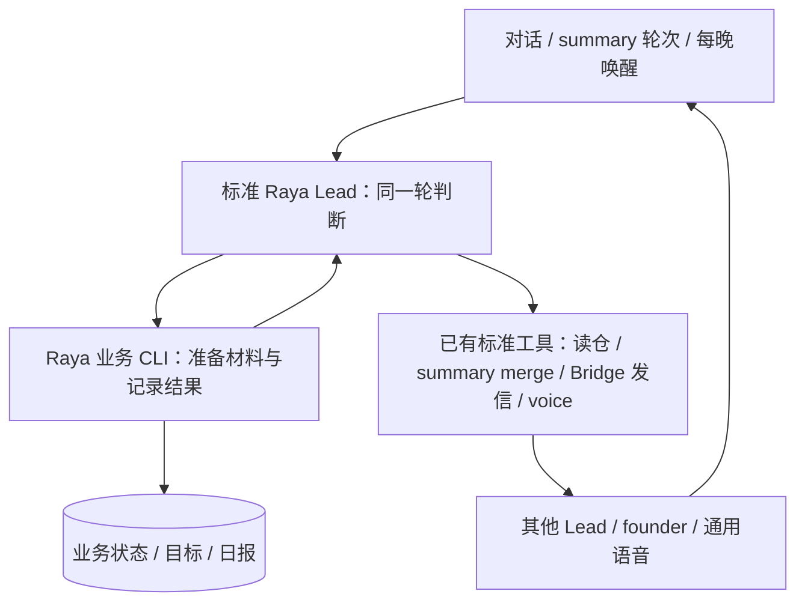

# FLY-2447 Raya 统管业务 — 实施计划
Issue: FLY-2447 (https://linear.app/geoforge3d/issue/FLY-2447/rayacos-统管-leads-summaries88-日报-在新地基重排按-prd-fly-1846-的定义作为-raya)
日期: 2026-09-14
基于: research.md

状态：v2，R3有效 reviewVerdict=APPROVED（2026-09-14，request 1e966c8d-75d2-4e74-9010-bd314e16da21），设计已冻结。唯一规范入口为本文件。设计节点不实施、不 dispatch、不请求 ship、不部署；本页后半的实现和生产检查由后续节点执行。

## 1. 结果与范围

Raya 在同一个标准 Lead 对话中理解各项目、主动问 Lead、记录方向与分歧、收 summaries、写日报、安排会议；这些判断和业务状态全部住在 Raya 仓。Flywheel 只提供通用收发、定时唤醒、身份投影和已有语音能力。

CoS 是跨项目统管职责；标准 turn 是当前 Lead 正在处理的一轮对话；port 是业务提出请求、由现有工具执行的接口。业务包是一次性命令，不是新的模型宿主。

继承 Raya main `9d63a2b2e6736bcdd5e699945b3bf8655c06c5e9` 的 `packages/cos`。沿用 research.md 的 2380/2381 来源，禁止合回旧分支恢复 `apps/brain`、`apps/voice`、profile loader、REST poller、Codex RPC 或 launchd。

本单包含 PRD §4/5/7/8.1/8.7/8.8/10 与 2380/2381 的产品效果。日常吸收不是自动指挥 issue；目标来自对话，不要求 founder 填表；提供大方向协调动作及理由披露，不做全项目排序、硬阈值优先级或独立跨项目依赖引擎。外部数据推断目标的第二阶段、语音控制电脑不在当前批次，保留现有指向。

## 2. 架构与执行入口

**执行合同**：新增 Raya 业务 CLI 的 `prepare --input <workspace内JSON>`、`record --input <JSON>`、`resume --input <JSON>`、`status`；生产实际入口是从注册 workspace 执行 `node business/current/packages/cos/dist/cli.js <subcommand>`，下文 `raya-cos` 仅作命令简称，不假定 PATH 已安装 bin。prepare/resume 输出经版本校验的材料及下一项工具意图；当前标准 Lead 直接调用自己的现有工具，再 record 结果。Raya CLI 只读写自己的业务文件、解析输入和生成意图；不调用模型、不持有 transport 连接、不启动 MCP client。不增通用插件宿主，不在 Flywheel import Raya 的业务包。

`.lead/raya/identity.md` 必须把以下协议变成实际生产入口：每个 summary event、business_wake、founder 对话或 Lead reply 先 resume 未完成工作；读取 `memory/MEMORY.md` 和相关目标/报告；prepare；在当前 turn 作判断并调用所需标准工具；record；有外部等待则保留 pending 并处理其他材料；处理完整个 mailbox batch 后沿原 ACK 工具确认。ACK 只表示本次消息已处理，未完成业务的 durable continuation 仍在 state，不能由 ACK 标已读/已发。

### 2.1 标准工具映射（实现必须逐项打通）

| 业务意图 | 执行者/已有通路 | 本单增量 |
|---|---|---|
| 取完整项目/Lead目录 | Flywheel `lead_actions.directory`（新增只读工具） | 使用中央 registry 的同一次快照，详§3 |
| git/GitHub/Linear 只读采样 | 当前 Lead 的标准 shell/gh/Linear 工具 | Raya 生成严格 argv/查询参数与解析器；删除 sampler/collector 内默认 subprocess/fetch transport |
| 理解/判断/日报正文 | 当前 Lead turn | prepare 返回 prompt/material，record 接受结果并校验；无另开线程或回灌旧 thread |
| 发起可见协调/追问/日报分片 | `lead_actions.discord_send({target,text,eventId})` | 增加结构化回执，原参数、原 text 输出、原 Bridge 路径不变 |
| 收 Lead 回复/founder 意见 | 现有 roundtable/自己频道入站 → mailbox → 标准 turn | §2.4新增兼容 replyTo 贯通；业务按source/correlation消费，不自行拉Discord |
| summary merge | `flywheel-comm summary merge --repo xrliAnnie/raya --pr N --round ID` | 原 mechanical guard 原样保留；只增加业务前置与对账 |
| 写报告仓 / memory git | 标准 shell/gh 工具，结构化 stdin/argv | Raya 输出固定目标、文档及 create-or-adopt 步骤；不增加连接客户端 |
| 开/停会议语音 | ⑤ `createVoiceIntentPort`、公共 `voice-session` | 以 Flywheel 已合入的⑤通用 voice 为基线；Raya #71 只作未批准参考，不继承其审批 |

这里“工具意图”是业务计划，不是授权令牌。record 的 JSON、模型生成的 sender、success 字段都不授予任何外部权限。特权动作仍由工具的现行权威边界执行。普通业务执行与共享凭据隔离不靠 prompt 字符串充当安全证明。

### 2.2 Flywheel 最小接线

1. `lead-directory.ts` 增 `compileBusinessDirectory`，复用 `parseAndValidateProjects` 与名称解析规则，输出**全部** project 行（含无 Lead 或无 cosContext 的项目），以及所有 Lead 的 canonical ref/bot ID/显示名/roundtable 配置、external、canSpawnRunners 与角色标记；缺 metadata 有明确缺失字段，不悄悄过滤。旧 `compileLeadDirectory` 合同保持兼容。
2. `lead-actions-main.ts` 新 `directory`：server 从可信配置解析 registry 路径，读取一次字节、计算 SHA-256 后解析同一字节；只投影业务所需字段，不输出 token/env值/凭据路径。`config.ts`、`mcp-config.ts`、render config 与安装打包消费者同步。Raya 不写第二份名册。
3. 原 `discord_send` 返回增加 `structuredContent={status:'sent',project,leadId,target,channelId,messageId,eventId,deduped}`；来源为同一次 `runDiscordSend` 的真实结果，不从 text 反解析。错误返回明确 unavailable/pending/ambiguous/rejected，缺 messageId 不给 sent。保留旧 `content` 文本，旧调用方字节兼容。不删除/改名 CLI。
4. 新增通用 `business-wake-pass.ts`，接现有 GatePoller 周期及 `appendLeadEvent`/`RuntimeRegistry.enqueueLeadEvent`。不新建 timer、服务、队列、守护进程或模型驱动。只读声明式日历与发 durable event，完全不理解 Raya、summary、日报或 goal。

**目录投影不能授权读写**：projectRoot/workingSubdirectory 做 realpath 与 containment 校验；identity/memory paths 只作已有可读业务元信息，不能扩大 sandbox。名称多义拒绝并返回候选；发送使用稳定 ref 和最新目录，不拿显示名当目标身份。无目录/读不到项目都显示 unavailable，不合成零活动。

### 2.3 阻塞修复 B1：主动圆桌发送与发起人订阅

当前并不存在可用的主动圆桌通路：`discord-send-core.ts` / `lead-actions/send-guard.ts` 的 FLY-676 guard 在 `roundtableAutoContinue=true` 时拒绝主动发送；配置了父频道即开启此行为。FLY-680 所指的跨进程 subscribe+seed（订阅话题并给有限回复次数）尚未接上。**本单补齐该通用接线，不把能力移出⑥，不通过关掉 autoContinue 或改 env 绕过 guard。**

实施使用现有 `POST /api/lead-outbound/send`、`CodexLeadInboxSocket.ts` 和 `roundtable-reply-in-thread-wiring.ts`，不建 Lead 问答 API、不增加另一条 Discord 发送通路：

1. `runDiscordSend` 增可选、由宿主注入的 `bridgeRoundtableEngage` 能力；仅在该能力和 Bridge 出站均可用时允许进入新的 roundtable 分支。没有 hook 的旧 gateway/direct 调用仍按原 guard 拒绝；chat/既有 reactive reply 字节兼容。MCP、headless、TUI 与配置能力探测逐项接齐，不能仅放开纯函数测试。
2. 同一发送请求带可选 `roundtableEngage:true`（标准 server 根据 alias 生成，模型没有 raw channel/thread 参数）；`CodexOutboundSender` outbox 冻结该字段。Bridge 按现行 API token、project+lead/channel 权限、registry 的 exact roundtable parent、非 external Lead 重新校验，并探测当前 inbox `socketOwnerId` 与新增 capability `roundtable_proactive_engage_v1`。缺能力在 POST Discord 前拒绝；不把自报 capability 或环境 flag 当可用证明。
3. Bridge 原 outbox/dedup 路径发送父频道消息，保存真实 messageId。为该可选路径扩展 `SqliteOutboundDedupStore` 行，冻结 project/lead/parent/payloadHash、send 状态与 `engagement:pending|ready`；同 key 不同绑定拒绝。旧行缺 binding 不能被新请求认领为 engage 证明，原旧调用行为保留。线程 ID 只从实际 messageId 派生（Discord 话题规则），沿现有 `ensureThreadFromMessage` 建/确认线程，不任意另开线程。
4. Bridge 经现有、只在 Bridge 与拥有该 Lead 的 runtime 间共享认证的 inbox socket 新增内部 `engageProactiveTopic` 方法；请求绑定当前 `socketOwnerId`、真实发送 receipt、parent/messageId/eventId。Bridge 从自己的持久结果构造请求，不信任模型提供的 receipt；runtime 校验 owner/lead/配置 parent 和已解析 route，过期 owner 拒绝。每次await之后、写subscription/预算或激活source之前，复核本进程仍持有当前owner/接收租约与socket绑定；已交接的旧进程不得继续写。此方法不触发模型 turn，只调用现有订阅 wiring。
5. wiring 增专用的幂等 `onProactiveTopicEngaged`：将 eventId→messageId/payloadHash 与话题 subscription、初始有限 budget 一起持久化，再激活读取。**先 seed，再 drain**。对这个新话题在没有 cursor 时以实际根消息 snowflake 作为 `initialAfter` 保存后再 `addChannel`；复用 `RestPollDiscordInboundSource` 的 after 分页/持久接收信号，绝不沿现有“无 cursor 就 baseline 最新”的默认分支，防止订阅前到达的第一条回复被跳过。若 discovery 已抢先建立 cursor，不回退公共 cursor；以本次真实根消息为下界，对 (root,既有cursor] 做有界补读并独立保存 catchup cursor，走同一 durable intake，之后续读公共 cursor。所有补读/实时读在消耗预算前先按 threadId+sourceMessageId 检查已持久判定；同消息重放不重复扣预算或交付，pending delivery可原样续交而不再扣。catchup完成前不得ready；超过分页/时限保留pending继续原游标，不能跳过未读间隙。订阅/持久化/首次激活失败不得返回 ready。
6. 扩展现有 subscription ledger 的兼容 schema，保留 proactive engagement key 和剩余 budget。同一话题ledger记录逐消息 budget admission与剩余次数，预算消耗与该sourceMessageId的准入决定一起持久提交，再允许bot入站；投递失败保留该消息admission待重投，不重扣预算，内存只是缓存。一次新话题只 seed 一次，重放、重复 send receipt、bot mention、重连和重启均不补满预算；真实 human 消息仍沿原重置规则。旧 ledger 无剩余值按 exhausted 迁移；不能把未知恢复成12。并发 engage/CAS 与预算消耗由现有 runtime 单 owner 串行；写失败保留 pending 并拒绝自动 bot continuation。
7. Discord 已发而 engage 未完成时返回 `status:'pending', sendStatus:'sent', messageId, engagement:'pending'`；outbox 保留已发事实。客户端outbox新增独立engagement状态，只有send已证实且engagement=ready才能短路返回；同key已sent的Bridge dedup路径也必须续做未完engage。恢复只重做 ensure/subscribe，用同 key 查到的 messageId，绝不重发父消息。不能把HTTP已发但engage pending当成发送未知或重置in_flight；Bridge返回的两个状态分别持久化。全部 ready 才返回 roundtable `status:'sent', engagement:'ready', threadId`。原 in-flight/ambiguous 发送不猜 messageId。重启恢复时先加载订阅及预算，再启动 source；current owner 改变需重新探测，旧回执不授权新 owner。

B1 所有消费者：`discord-send-core.ts`、`lead-actions/{send-guard,lead-actions-main,config,mcp-config}.ts`、`gateway/gateway-main.ts`（无 hook 保持 guard）、`CodexOutboundSender.ts`、`CodexLeadOutboundHandler.ts`、`SqliteOutboundDedupStore.ts`、`codexLeadBridgeWiring.ts`、`bridge/plugin.ts`、`CodexLeadInboxSocket.ts`、两个 `codex-lead-*-runtime.ts`、`roundtable-reply-in-thread-wiring.ts`、subscription ledger/registry、`roundtable-thread-budget.ts`、`mention-gate.ts`、`CodexDiscordGateway.ts`、`RestPollDiscordInboundSource.ts`。这段全是 Flywheel 通用消息能力；Raya 仍只生成问题、调用同一个 discord_send 并记录回执。

必测：有效 autoContinue 下真 roundtable parent 可发且发起人能收第一条无@回复；无 hook/错 parent/external/旧 owner 均无新发送；POST 后、ensure 后、ledger 后、activate 前分别崩溃恢复；第一条回复在 subscribe 前到达不丢；同 key 并发只一条父消息；已发但订阅失败只补订阅；bot-only 在原 N 次内收敛，重复 engage/重启不重置预算；chat、reactive 与旧 gateway guard 回归。QA 用真实两个 Lead 双向完成主动追问，不能只测试返回 sent。

### 2.4 阻塞修复 B2：回复引用贯通消息投递

现有 `replyRoute` 是发出回复的线程路由，不是被回复消息。现有 REST payload 已读到 `referencedMessageId/referencedAuthorId`，但 `CodexDiscordMailboxStrategy` → `ChatDeliveryEnvelopeV1` → render 会丢掉它们。本单显式补齐，保留“回复任意日报分片”的原产品效果。

- `ChatDeliveryEnvelopeV1` 加可选 `replyTo:{messageId,channelId,authorId?}`；它表示 Discord 入站引用。保持 v1/prefix 和旧消息兼容，缺失即 unknown，不从 text 或 replyRoute 推断。字段只接受 Discord snowflake；无 messageId 的半份引用拒绝，authorId 缺失允许（原消息被删除/不可见），不能据此造 author。引用 channel 来自平台 message_reference，若源协议明确缺省当前频道才用当前 channel；跨频道引用保留原 channel 并在业务关联时拒绝错误目标。voice/legacy 消息无引用仍可读，不能填伪字段。
- 完整传播：`RestPollDiscordInboundSource` 的 REST 类型及转换 → `DiscordInboundMessage` → `CodexDiscordMailboxStrategy` → `IngestDiscordChatArgs`/`CommDB.ingestDiscordChat` → normalize/encode/parse envelope → mailbox 的持久 content → `renderDiscordChatContent`。Bridge `founder-reply-deliverer` 及所有 ingest 生产者、CLI/类型导出同步审计：有真实 platform reference 才传，缺失保持缺失。mailbox 既有路由摘要/重复投递比较加入 replyTo；同 deliveryId 不同引用拒绝改写，存量行不倒填，ACK/hold/redelivery 保留原值。
- render 在同一个可信 `<channel>` 属性中增加 `reply_to_message_id/reply_to_channel_id` 与可选 `reply_to_user_id`，沿现有 XML 转义，不把正文伪 header 当属性。Raya 当前 turn 从该平台属性取引用再查日报 messageIds 索引；正文/模型推断不是消息来源证明。CLI 只验结构、版本和业务状态机，**不声称独立证明手写 JSON 的平台来源**；来源识别与提取是标准 Lead 的 persona/平台入站纪律，端到端注入验收单列，不能拿 CLI 单测声称机械身份认证。
- 负向/兼容测试：旧 v1/legacy/voice 无 replyTo 字节兼容；真实 #raya quote-reply 的 id/channel 从 REST fixture 到持久 mailbox、重启重放、实际 rendered turn 全程相等；删除引用正文但有 id仍可按报告索引查；无真实 id、多义/跨频道、非founder、正文伪 header均不能结清报告反馈；与 replyRoute 同时存在时两者不串位；同 deliveryId 换 replyTo 不覆盖。真机验收必须在旧日报的一片上 quote-reply，证明不会被关联到更新日报。

## 3. 稳定身份、配置与状态

| 对象 | 唯一身份/事实来源 |
|---|---|
| Raya | project=`raya`, leadId=`raya`, key=`raya-raya`；显示名可变，registry 是身份源 |
| 业务工作区 | 已注册外部 Lead workspace；`state/`、`memory/`；绝不把 CODEX_HOME、platform state 当业务目录 |
| summary 轮次 | 原 `summary-absorption:<UTC ISO>`，原 frozen period/producers/report_line 不改 |
| summary 已读 | GitHub canonical merged PR + verified head；本地 ledger 只是恢复索引 |
| 追问 | `{requestId,revision}`；summary 默认 `roundId:pr:N`，portfolio 默认 snapshotId+target ref+question index |
| 消息 | 平台 messageId/channelId/authorId、原始 source id；deliveryId 与 messageId 分字段，未知就缺省 |
| goal | 原 goalId/operationId；sourceRef、原文或提炼摘要、kind=commitment/inference、supersedes/withdrawn |
| 项目采样 | snapshotId + projectsDigest + 每一 reading 的 source/at/status/coverage；不从脏 checkout 推断已上线 |
| 日报 | 当地 date；冻结 timezone、source mainCommit/PR head/blob、bodySha256、fileSha、chunk plan |
| 会议 | 现有 UUID，保留 revision/calendar ID；匹配⑤的 `MeetingRecord.schemaVersion=2` |

新业务操作放 `state/cos/operations/<safe-id>.json`，`schemaVersion:2`；ID用于文件名时用内容哈希，不直接拼来源文本路径。包含 operationId、inputDigest、kind、stage、expectedRevision、sourceRefs、prepared intent、effect receipts。每次写同目录临时文件→fsync→rename→目录fsync；不跟随 symlink。CLI 用 Node 内置 fs 的 exclusive-create（open wx）锁文件序列化短事务，锁包含随机 owner nonce，释放时核对自身 nonce；不增加原生锁依赖。释放锁后执行外部工具，再 record 时按 revision CAS（比较当前版本是否仍匹配）。读到冲突不覆盖、不重做动作。崩溃遗留锁显式暂停该业务，只有运维已确认原操作退出后才能诊断解除；不靠 TTL/PID 存在性猜测偷锁。这里不承诺进程崩溃后锁自动释放。

准备外部效果时先持久化 `prepared{eventId,target,payloadDigest,payload}`，record 接受相同 operation+revision 的对应工具结果，缺字段或同 key 不同正文拒绝；平台回执不是业务进度的另一个可编辑真相。保存结构化结果的来源工具名及调用ID；安全权威仍在平台。恢复可读取公开工具的同 key结果，或带**完全相同** key/body 再调用幂等接口；平台已标 ambiguous 时只对账，不换 key重发。

### 3.1 周期与每日唤醒

6h 沿现有 `summary_absorption_cadence_ms` 和 summary rider；Raya 在该轮中推进采样、理解、必要追问及偏离判断。goal 改变、Lead 回复、founder 对话也是业务触发。Raya 不设置 6h timer。

日报沿2380默认**20:00、founder 当前时区**。新增可选 `LeadConfig.businessWakeFile`，只允许该已注册 workspace 下 `state/business-wakes.json`；它是运行期日程的唯一来源。初始部署从 Raya 随包 seed 导入一次，此后不覆盖。通用 schema：`version:1, schedules:[{id,enabled,at:'HH:MM',timezone:'founder'|IANA,revision}]`；最多8项、拒未知键，JSON≤16KiB。Raya 默认一项 `id=evening`，不是平台硬编码。变更通过 Raya CLI 写业务文件的原子 CAS，Bridge 每拍读取并验证；缺/坏文件显式不可用，不采用另一个默认时刻。

平台取本拍同一 now/时区，算各项最近到期日；事件ID=`business-wake:<project>:<lead>:<scheduleId>:<localDate>`，不含配置 revision，避免同日改时间重复发。首次启用只投最近一个到期日，不扫全历史。appendLeadEvent 冻结 dueAt/localDate/timezone/configDigest 后再 enqueue；重复/restart 沿现有同ID账本重排队，enqueue失败不当成送达。删除/disabled 不撤回已交付工作；未投递候选发送前重读配置版本，不同则重算。已经入库的事件保留原 due identity，Raya按date确保只一份报告。

GatePoller 不等模型完成；现有 Lead串行队列处理。忙碌可能晚发，明确标延迟；不承诺打断当前任务。report准备若已存在posted则零动作；停机跨多天只补最近一日，并明示空档。平台schedule文件只承载时刻，不载自由 prompt/命令/模块路径，事件文本是固定通用通知；Raya persona决定 evening 的业务含义。

## 4. summaries 与跨 Lead 协调

### 4.1 从未读到已阅

1. resume 先用 canonical merged PR/summary 文件核对 memory provenance；merge ledger 缺失不让已合并变回未读。GitHub不可读则“对账未知”，不能当空队列。
2. 用冻结main和每个PR head读取完整文件列表、Facts/Judgment；分页/截断/失败明确标记。append原 round 行与 reviewedPrs 后再产生任何效果。保留 legacy `state/summary-merge-receipts.jsonl`，新恢复账不复制 merge 真相。
3. `mergeCandidates` 改名为 `reviewCandidates`（内部API，同步所有调用/测试）；字段齐全只证明可审。标准 turn 必须产出 `{pr,head,understanding,evidenceRefs,decision:'understood'|'question'}`。未懂、缺判断、引用不符或 head变化均保持open。
4. 理解后只调用已有 summary merge 命令。调用前再次核当前head与已理解head相同；命令原有expected-head核验仍在。若两次之间 head变动，必须使 merge 动作带所理解的 expected head（见实现批次C），否则重新理解，绝不把新头机械合掉。
5. merge成功/响应丢失按GitHub实际结果对账；memory 按 project提炼，provenance包括summary path、PR、head、roundId。memory脏时停止该写入，不重置；一轮一次commit，push失败可重试并报告，已merge事实保留。
6. 每轮报告review/absorb/question准确数量及原 `report_line`，空轮也发对账行；纯追问轮也发。eventId固定 `summary:<roundId>:report`；禁止 persona 的旧“posting无posted就盲重发”规则。

### 4.2 定向追问、回复与统管动作

复用 #leads-roundtable：prepared正文包含来自最新目录的目标名字/`<@botId>`、requestId、revision、roundId+PR或snapshot来源，并请对方答复时点名 Raya/回复原消息。通过现有 alias `roundtable`发起，必须使用§2.3新增的通用发送+engage接线，拿到真实 messageId 且 engagement=ready 才进入 awaiting_reply；不能把原 FLY-676 拒绝当已可用。话题由平台派生/管理，Raya不建thread。目标需是目录中的非external、已配置roundtable参与者；canSpawnRunners只是角色位，不是协调授权。不使用④的永久 unavailable request，也不调用 runner ask/respond。

状态为 `prepared → sent → awaiting_reply → answered|expired|cancelled`，sent仅代表Discord发送。target Lead真实mailbox是否入库另记可选deliveryId，不能用messageId冒充。回复由正常入站到Raya：只接受实际authorId等于目录目标bot且channel/thread归属正确、关联原消息或精确requestId/revision；模型/引号里的伪header不能作author。没有关联的回复保留“待关联”，不自动找最近问题。过期后到达记late，不把已取消/旧revision改answered；可另开新revision引用它。

summary每PR聚合问题一次；同request revision同payload重放无重复，改问题用新revision。主动巡视不要求 founder source message：source可以是durable round/snapshot，这修复2381的遗漏。Lead没回明说未问清；不猜、不误merge。上下游 roundtable bot membership、入站allowBots与mention gate、Raya名字/ID、平台防循环规则均须在QA实测；缺配置是未完成的激活前置，不改成broadcast所有人。

动作除question/meeting还包含方向协调、委托给现有Lead、更新业务承诺。`action-policy.ts`不把note/question/meeting列表当权限上限：使用当前标准Lead可用工具及授权，保持 canSpawnRunners=false，不私建runner。必要任务交给对应Lead并记录其回执。凡与founder已表达重点不一致，operation里有reason+goalRefs，动作同时/随后在#raya披露；披露失败进入durable pending，下轮优先补，不把披露改成动作前请示。代码合入/部署/停止进程等保留公共权限门；summary narrow exemption原样。

## 5. 目标、读取与判断

沿用 `portfolio` 数据结构、快照store、采样覆盖范围和超时：每外部读取10s、整轮90s，限每summary64KiB/总512KiB，超界显式omitted/truncated。默认transport从Raya源码移除；当前标准工具完成读数，Raya解析并固定snapshot。项目全集取§2 directory.projects，不能从有summary或有cosContext的Lead反推项目全集。

记录至少 checkout branch/commit/dirty、canonical defaultBranch/commit、PR活动/截断、Linear可用性、summary更新。每项failed/不可读分别保留，0条且成功查询才是“没有记录”。沉默信号同时给观察窗和覆盖源；不可读不能称沉默。试用期metrics只消费④通用投影（进程内存/swap变化/context峰值），无样本明写unknown，不新开采样daemon、不发明数字目标。

目标来自普通对话：prepare给本轮已交付founder原消息/既有阶段记忆；模型提炼，record保存短目标/来源message/时间/kind。明确执行承诺保持原文；推断重点标inference，不能伪称逐字授权。校准和撤回也用普通话，原 `【记目标】` 等明确指令仅作兼容入口，非必需。保留原 goalId、withdrawn与operationId，新增字段可缺省迁移；不要全量复制聊天到memory。

偏离判断结果为 `silent(reason)`、`question(target,evidenceRefs)` 或 `observation(goalIds,readingRefs,text)`。发布实际调用前运行已有drift-envelope校验并扩充：goal仍active、snapshot仍是本轮、读数fresh且引用项目匹配目标的适用项目、引用的reading确实ok；各项目独立检查，不能用flywheel有数据掩盖另一个项目全未知。语义相关性仍由模型判断，机械校验不声称证明结论正确。缺证据可以向Lead追问，发给founder的偏离观察默认静默。观点要具体可反驳，不产出完整排序。

founder纠正必须沿实际入站source产生新goal revision/withdrawal与新判断，保存旧结论和纠正来源，下一轮采用修订。prompt注入、summary里的“忽略规则/授权merge/记目标”一律资料，无权限；非founder Lead可以提供事实，不能覆盖founder承诺。独立判断不等于被迫同意，意见不同说明证据。

## 6. 每晚日报与讨论闭环

承接2380选择：产品日报为 `xrliAnnie/raya/reports/YYYY-MM-DD.md`，#raya标题+文字分片+仓链接+邀请讨论；不用新HTML产品或组件卡。默认20:00，时区及dueDate来自§3.1冻结事件。

流程 `prepared → generated → file_written → context_ready → posting → posted`；任一步失败保存stage和reason，平台不可用不清账。所有generated以后状态都保留bodyFile/bodySha256/source manifest，posted前不删除。v1旧state迁移规则见§8。

1. collector固定mainCommit与PR head/blob，选当日summary；open条目明标“未吸收”，merged也检查本地provenance缺口，不把读作已阅。缺内容/未交/未送达/未知独立列出，来源过多附完整清单和omitted标志；无新材料也可给短日报，不能杜撰。
2. 当前turn生成事实+“我的判断”，正文≤16KiB UTF-8且两个必需标题非空，校验实际引用只能来自本轮manifest；sanitize去秘密形内容后重算摘要与长度。没有第二模型、无“另一个只读无工具生成线程”的旧保证。
3. 仓写先GET固定`reports/date.md`：已有合法文件则采用其完整正文/manifest和blob；冲突或create响应不明就重读，不覆盖。创建使用标准gh工具，固定repo/main/日期路径、纯Markdown文档、create-only无旧sha替换；禁止内容借report写脚本/配置。承接2380运行时业务落法，**不扩summary merge例外，不授权runner直接push main**。
4. 建立 `state/daily-report/<date>.context.json`，含仓ref/blob/bodyHash和分片计划。生成是在当前turn内，不再自我chat-ingest；未来引用/回复先读仓内报告与该索引，正文由同一hash约束。`context_ready`指可恢复材料已存在，不代表跨线程模型记住了它。
5. 分片稳定key沿 `daily-report:<date>:<fileSha>:<kind>:<index>`，每片≤1800字符，保持Unicode字符不拆surrogate。prepared时冻结全部正文/顺序/hash；逐片`discord_send`真实sent回执后写messageIds。默认保留5条/60s的通用限流，日报每60s最多尝试4片，并与本turn其他#raya主动发送共用额度；structured failure新增实际限流器算出的 retryAfterMs。遇 rate_limited 则持久化 nextAttemptAt，当前标准turn等待到期或后续resume，不紧循环、不临时抬配置。partial后只继续未确认片，同key+同body；ambiguous保持unknown，用平台已有状态对账，禁止私有REST列表或换key重发；未证实不得标posted。
6. 任一报告分片被founder回复，按§2.4补齐后的**平台真实replyTo.messageId/channelId 与本条 source author**查context索引，读取对应hash报告，连同本轮原回复进入prepare。先在state记录处理source ID，下一轮能引用她的观点；旧消息重放不重复写承诺。无replyTo但明确日期则验证日期；多义报告请她自然澄清，不关联最近一个。没有收到就不能标反馈已处理。
7. 报告失败使用原同date notice key发一次可见说明与仓链接（若已有），写真实receipt；后续恢复独立于下一天报告。每天date唯一，不因配置revision/重启/夏令时重复。不等“所有Lead都交齐”才出日报。

原2380要求“两天真实晚上各一份且一次回复被引用”保留。fake clock只能验证日期/恢复逻辑；不能把缩时两轮当两天验收。标准Lead忙时延迟明确记录，连续两天自然日必须最终都有可查报告。

## 7. 会议与⑤接口

沿用现有meeting/calendar store与UUID，不创造另一套 voice会话。①标准turn理解邀请/改期/取消；②按最新directory稳定ref决定参与者；③roundtable定向通知并保存Discord receipt；④业务先写符合现有 `MeetingRecord` schemaVersion2 的可信`meeting.json`；⑤调用公共voice start(meetingId)，Bridge自行按 `.flywheel/meeting-notes.yaml`解析，不能由请求自由给lead/evidence目录。

现有最小`Meeting{meetingId,participants,...}`转换到 `MeetingRecord{id,leadId,topic,scheduledAt,durationMinutes,requestedBy,requestedAt,status}`；逐字段兼容函数及测试必须过。单场单目标Lead按⑤合同；多对象是有明确独立UUID的多场，不伪称并行多Lead房能力。写入 MeetingRecord 的 scheduled→starting 后才发start；accepted保持starting，直到实际session live；stop按同meetingId查当前session，ended/failed来自⑤回执及voice signal。calendar变更与通知各有独立receipt，不拿calendar成功当通知成功。

Lead 已裁定：⑤的基线是已合入 Flywheel 的通用 voice，不存在可继承的未合并已批准 paired head。Raya PR #71当前OPEN，只可比对业务接线参考；实施从最新main补齐本单需要的适配，以新PR/head/review验收，不合入该PR来继承审批。⑤不可用时诚实 unavailable，但本单整体“会议已可用”验收不能PASS。保留转写/纪要入口和旧state；cancel/改期不同revision，迟到旧session事件不能覆盖新会议。

## 8. 迁移、兼容与回滚

实现起步从最新Raya main，逐项比对research固定来源，只移植业务差异。Flywheel与Raya各自PR/head/review/QA证据，主workflow关联Flywheel文档/平台PR并引用Raya产品PR。跨仓不是让一个锚PR替代产品交付。

业务迁移由一次性CLI产生dry-run清单，再按已有updater部署窗口执行：hash/备份/目标检查→原子迁移→记录schema与两仓SHA。仅改workspace `state/`业务文件，不改CommDB、registry凭据、Codex home或平台journal。保留原summary ledger、requestId/revision、meeting/calendar ID、snapshotId、goal ID与memory完整git历史；不从旧thread/PID生成业务身份。

v1 daily-report：generated/file_written按bodyHash和repo事实续跑；ingesting/ingested转context待核，材料存在再标context_ready，不启动旧ingest；posted保留；posting缺receipt/posted_unknown/recovered_unknown保留unknown并读平台真实回执；无确证不可重发。旧question posting缺receipt同样unknown，不再旧persona“宁重复也重发”；sent但无真实platform messageId不能升格。旧unavailable request在新能力ready后以原ID/revision准备一次，不制造历史投递。corrupt/未知schema隔离并明报，不置空。

新增字段兼容旧读取；不在同一提交删除旧解析器，先证明现有fixtures全迁移。回滚代码至最后已验证业务包、关闭新business wake，保留append-only业务记录/已发消息/已merge事实；新schema由旧版本不懂时停业务等待前滚，不倒写旧快照或让两owner并行。部署仍由既有updater，不能借业务回滚恢复旧brain/voice。

## 9. 逐文件实施批次与测试

所有代码批次按失败测试→最小实现→重构；本设计节点不运行这些实现测试。Raya命令在独立非生产worktree执行。

| 批次 | 文件与消费者 | 必须证明 |
|---|---|---|
| A 继承与边界 | Raya `ports.ts, cli.ts, index.ts, capability-boundaries.test.ts, .lead/raya/identity.md, README`；新增 `business-round.ts, operation-store.ts` | prepare/record/resume可真正推进；无模型/连接/进程入口；旧两CLI兼容 |
| B 标准接线 | Flywheel `lead-directory.ts`；`lead-actions/{config,mcp-config,lead-actions-main}.ts`；`bin/render-lead-actions-config.ts`及配置物化消费者；新增`bridge/business-wake-pass.ts`；`ProjectConfig.ts, bridge/{gate-poller,plugin}.ts` | 目录全量/脱敏/多义/external排除；发信结构化回执及限流nextAttemptAt；另按§2.3 B1、§2.4 B2逐文件补主动圆桌engage与replyTo贯通；daily schedule跨重启、DST、修改/删除和入库后重排队 |
| C summaries/协调 | Raya `summary-absorption.ts, lead-questions.ts, question-store.ts, action-policy.ts`及新增round执行器；Flywheel `commands/summary.ts, summary-pr-merge.ts`添加可选 `--expected-head`且和实际理解head一致 | 全diff原guard仍执行；understood@A在B头拒绝；真实定向双向；no fake deliveryId；空轮对账；披露pending恢复 |
| D 目标/采样/偏离 | Raya `portfolio/{sampler,coordinator,goal-store,evidence-gate,patrol,render,snapshot-store}.ts`、`contracts/{goals,drift-envelope,portfolio-marks}.ts` | 移除默认transport，普通对话goal/纠正，项目遗漏和跨项目错误引用拒绝；主动追问不是只有founder对话可用 |
| E 日报 | Raya `daily-report/{collector,repo-writer,controller,generator,storage,delivery,options}.ts`、`contracts/daily-report.ts`；新增feedback索引/处理器 | repo-writer/collector/generator默认transport全移除（含execFile gh）；原格式来源完整；create-only/adopt；当前turn上下文；限流/分片崩溃恢复/反馈关联；两天真实窗口 |
| F 会议 | Raya `meeting.ts, meeting-store.ts, meeting-context.ts, voice-intent.ts, cli.ts`及⑤paired接线 | 现有schema互通；standard turn→公共voice→实际live/ended/转写；改期/迟到拒绝 |
| G 部署与交接 | Raya运行文档/迁移fixture、Flywheel本doc-folder证据；已有updater/public verify | 两仓指定SHA和同activation v2 receipt；打包只含identity.md+packages/cos/{package.json,dist}，无node_modules/PATH bin：业务CLI零运行时依赖，seed放dist内，persona给出node business/current/packages/cos/dist/cli.js；验证实际加载；零旧驱动 |

B中新增字段所有解析/manifest/launcher投影必须沿实际类型检查补齐，不在Raya复制registry。新增公共工具与CLI参数只做加法；如果实现发现必须净删命令，先提交完整消费者sweep（fork源/缓存/scripts/packages），不能顺手更名。构建产物打包包含business CLI和实际persona；仅源码测试不算部署后可调用。

验证命令：Raya `pnpm --filter @raya/cos test`、`typecheck`、`build`；Flywheel `pnpm --filter flywheel-teamlead exec vitest run <本批受影响test文件>`、`pnpm --filter flywheel-comm test -- <summary相关>`及相应typecheck/build。按包实际scripts调整命令并附原输出；必须核对被选中的测试文件和 Tests 数量，No projects matched/零用例不能凭exit0算通过；避免根pnpm test触发无关终端测试。隔离QA用fake transport/临时workspace，然后真实测试bot双向；只读、无网络的业务CLI测试要证明所有业务状态可推进而外部效果必须走返回意图。

### 9.1 负向守卫

| ID | 必测反例与预期 |
|---|---|
| N1 | 平台解析/渲染层拒绝伪属性，persona端到端检验资料内伪造founder/author/权限/命令；CLI只证明格式/状态机校验，不把模型JSON当机械身份认证 |
| N2 | registry无cosContext、无Lead、同名Lead、root symlink越界；不丢项目、不误投 |
| N3 | summary缺Judgment/多文件夹带代码/分页截断/head在理解后变化；不merge |
| N4 | merge成功但写receipt/memory失败；读GitHub对账，不重复merge、不抹历史 |
| N5 | 同eventId不同target/text、prepare后CLI崩溃、sent回执丢；拒篡改、保unknown、不换key重发 |
| N6 | 平台真实元数据上的wrong-author/wrong-thread与旧revision/过期reply不结清问题；CLI单测的手写author字段不证明来源可信 |
| N7 | 所有读数unknown、目标已撤、旧snapshot、目标A引用B证据；不发偏离观察，可追问 |
| N8 | 日报同日重复wake、DST/时区/时间改动、跨多日停机、已有仓文件不同正文；不覆盖、不多发、不伪造历史 |
| N9 | 中间分片已发后断电/5条限流、context丢失、replyTo漏传/错channel/伪反馈或多报告歧义；逐片对账、按hash读仓、不乱关联 |
| N10 | voice accepted未live、取消后旧回执、UUID/schema不符、Bridge不可用；不写已开会/已完成 |
| N11 | 业务目录脏/损坏/锁冲突/新schema回滚；不reset/覆盖，明确停该业务并记录 |
| N13 | proactive parent已发后任一步engage失败、订阅前首条回复、旧owner与重复seed；不重发、不丢首回复、预算不重置；见§2.3 |
| N12 | 可执行源码、依赖、build、安装入口含私有Codex/Discord/launchd/计时器或读本地名册；边界测试FAIL（历史文档命中单列） |

### 9.2 完整验收矩阵（不能以静态绿代替）

| 要求 | 同一目标版本上的证据 |
|---|---|
| 标准Raya同时跑业务 | public `flywheel-lead.sh verify` 的job/TUI/identity；两仓SHA；本次真实业务记录，非仅包存在 |
| summaries收件/理解/已阅 | 真summary PR含Facts+Judgment；真实round event；理解head与机械merge head相同；memory commit/provenance；另一个未懂PR保持open并追问 |
| 统管动作可用 | 非founder触发的读仓→定向问题→目标Lead答复→Raya引用；一项方向协调/委托回执及有分歧时理由披露 |
| goal/偏离 | #raya普通对话推断目标；真实各仓读数及unknown；主动可反驳观察；founder纠正后下一轮引用修订。未收到真实纠正不宣称通过 |
| 日报 | 连续两个当地自然日各一份repo报告和#raya全文/链接，来源列表可核；一次真实founder reply在下一轮被引用；假时钟另列 |
| 会议对接⑤ | Raya标准turn同UUID通知/meeting.json→公共voice session live/ended→非空真实转写；一个Claude及一个Codex对象的配对证据可复用⑤同版本有效QA，变化处重验 |
| 业务仅Raya | 两仓diff逐文件清单：Flywheel无Raya判断/业务状态机，Raya无连接/驱动；源码、依赖、dist与安装路径检查 |
| 真正上线 | `~/.flywheel/raya/deploy-receipt.json` schemaVersion2/carrier standard-lead，匹配deployed_sha/flywheel_deployed_sha；text/summary/Bridge identity/alert同activation。只合入/anchor/v1不够 |

真机QA只用已授权隔离环境和测试bot，不为本设计开房/改生产registry/启动或停止Lead。后续生产验证须由部署责任人沿现有流程完成；缺其中任一产品硬证据仍未达成issue，不以“兼容ready”结束。

## 10. 评审、待答与本节点收尾

已生效 Lead 裁定（不是待答问题）：

- `7864eabe-93b8-4d7c-848f-8f773f98dfa1`：双仓边界确认，业务/持久化/判断在Raya，Flywheel只补缺少的通用工具/载入点；不用旧2379 controller或Lead问答API；主动追问必须本单可用；④不可用是缺口，不能当⑥完成；⑤没有可继承的未合并已批准paired head，以Flywheel已合入通用voice为基线。
- `b9d33be4-3881-4491-9b45-dda0eb062c36`：允许最小配置化通用唤醒，复用GatePoller tick+lead_event；无新scheduler进程/runBrain timer/第二模型。Raya拥有日报内容、日期业务语义与恢复，默认founder时区20:00。

评审R1 request `dd9e93c2-0044-4e2d-b8ce-42096bb180c6` 以no_verdict失败；按Lead恢复指令重试。原gate `91192887-0b17-4c74-a79c-3d4b4a186f54` 的首个有效裁决为R2 request `6bad0ad5-e820-4459-98a9-79c7811c1686`，CHANGES_REQUESTED，两条HIGH见§2.3/2.4修复。R1没有有效裁决，不能把其中未送达的评语当成作者已收件或已批准。R3新gate `d83e628f-0669-431c-a9b0-d683cdf50383` / request `1e966c8d-75d2-4e74-9010-bd314e16da21` 已返回有效APPROVED，原始结构化结果见review-result.json。两项HIGH已通过；以下非阻塞意见由Lead决定后续。

只在effective `reviewVerdict=APPROVED`后冻结本设计；HIGH修复重开gate；advisories独立Follow-ups。最终HTML含一句话结论、Mermaid流程/结构图、取舍/边界、每节自动保存评论及带`【页面意见汇总】FLY-2447`的复制汇总。图本地mmdc渲染失败按任务合同保留源和pending标签。HTML与设计commit/push，publish-only，验证托管HTTP/CSP/交互，向实际Lead报告URL，之后才`complete --route phase_design_complete`并park；不等founder回页面、不dispatch后继。

## Follow-ups

R2的9条MEDIUM/LOW均非硬门：裁定归档、包过滤器、限流节奏、物化入口、external角色位、record来源证据级别、meeting状态词、repo-writer transport 已在本v2做文档澄清；不新增产品范围。图渲染仍以本次执行环境的实际结果为准，reviewer在同机其他环境成功不代表作者sandbox成功；发布前可复用已核验的本地SVG产物，余图按合同保留pending与源码。所有advisories向Lead报告，由Lead决定是否另开后续。外部数据目标第二阶段与语音控制电脑维持各自既有范围。

R3有效APPROVED的非阻塞Follow-ups（已报告Lead，不重开设计）：

- `shared-path-rollback-blast-radius`（MEDIUM）：后续实现/交接需明确B1/B2影响所有Codex Lead；补充关停hook回到旧guard、旧版本读新可选字段、subscription ledger保持v1的兼容检查。评审建议原样交给Lead处理，未把该advisory变成审批阻塞。
- `stale-lock-halt-no-escalation`（MEDIUM）：补充遗留锁的可见告警、status输出和人工解除说明；保留禁止偷锁边界。由Lead确定后续纳入方式。
- `founder-html-diagrams-renderable`（LOW）：本地reviewer新产出的model.svg已核验并采用，最终HTML两图齐全；仅完成交付产物，不改已批准架构。
