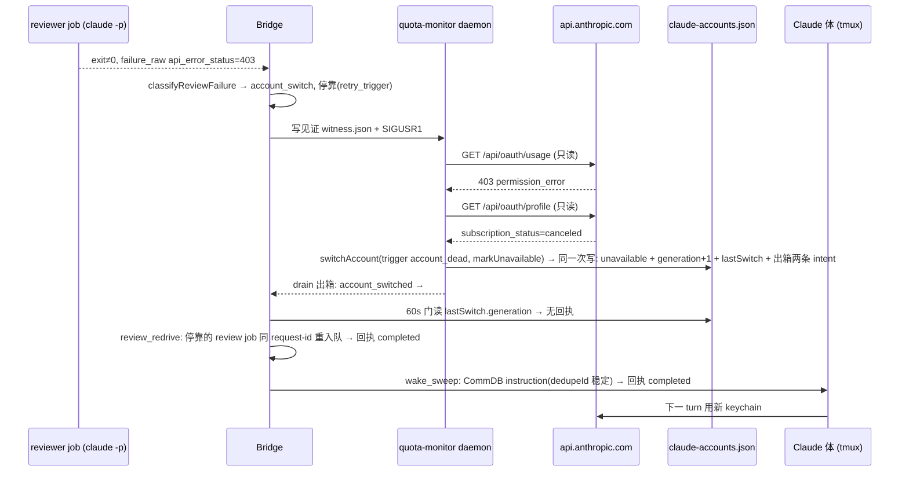
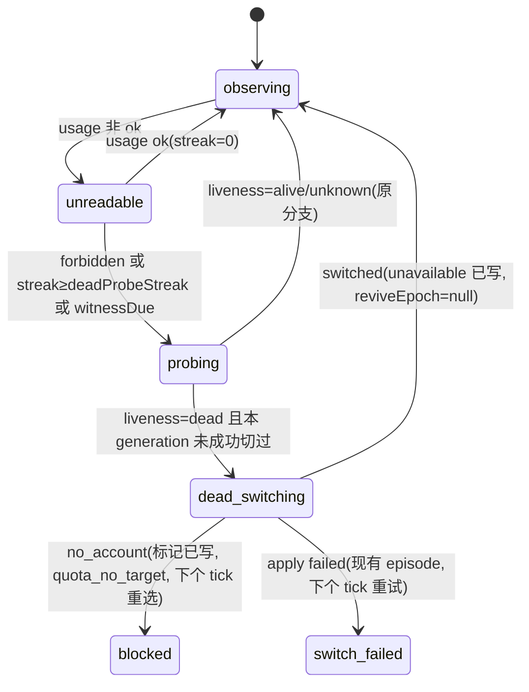

# FLY-2452 死号切号 — 实施计划
Issue: FLY-2452 (https://linear.app/geoforge3d/issue/FLY-2452/账号切号-claude-号被-disable订阅到期时切号器不切quota-poll-只当-backoffreviewer-job)
日期: 2026-09-09
基于: research.md

版本: v5(Codex R1 八条 + R2 七条 + R3 五条 + R4 两条全部吸收,见 §10;Lead 裁定 R4 为最后一轮,见 §11)

## 1. 目标与验收

让 Claude 账号池在活跃号**整体不可用**(订阅取消 / 到期 / org 禁用)时自愈,三处闭环:

| # | 验收(issue 原文) | 本计划的可证明形式 |
|---|---|---|
| A1 | reviewer 首个 403-disabled 到切号完成 ≤ 1 个 poll 周期,无需 founder | hermetic 集成测试 §6.1:真实 coordinator 收到 403 失败 → 真实 `writeQuotaWitness` → 真实 `pollOnce`(注入 fetch)本 tick 探活 → `switchAccount` 提交 → `lastSwitch.triggerKind==="account_dead"`;FLY-2271 场景 `dead-account` 从 daemon 侧再证一次,日志时间差 < `basePollMinutes` |
| A2 | 切号后之前 failed 的 review job 自动重入队 | 同一集成测试:停靠行(`retry_trigger='account_switch'` 且 `retry_parked_at_ms < 切号时刻`)在 consumer tick 后 `claim → running`,不靠 runner 重 POST;**没有回看窗口**,停靠多久都会被扫到,由三道守卫决定重放或终态 |
| A3 | 本轮 403 过的 Claude 体收到复工 send 并继续 | 同一集成测试:真实 CommDB 里出现 `id = account-switch-wake:g<gen>:<execId>` 的 instruction 行(vendor `claude-code` 的 running session 各一条);「并继续」= QA 节点手工验收:复捕 pane 要求身份行翻到新邮箱 + 出现活动行,证据 artifact 进 QA 报告 |
| A4 | dead profile 不再被轮回选中 | `unavailable` 进 `isAuthUnusable`;selector 测试 `verifyCandidate`/`fetchUsage` 对它调用数 0;FLY-1182 手工演练 S8 `use <dead>` 被拒 |
| A5 | 告警带 `account_dead:<profile>` 进 #flywheel-engineer,与 usage-limit 可区分 | 新 kind `account_dead` 按 `quota_no_target` 的 manual-ticket 姿态镜像到 7 处合同(§5 C3b);成功切号时它的 intent 与切号结果**同一次写入**出箱(§2 不变量 13),daemon 崩溃也能重放;路由:daemon 用 `ProjectConfig.loadProjects()` 解析 `flywheel-eng-lead.alertChannel`,按 `notify` 同款方式以 `FLYWHEEL_UNIFIED_ALERT_CHANNEL_ID=<engineer>` 注入子进程(**保持 unified 模式**,🎫 ticket header 与 manual-ticket 生命周期与 `quota_no_target` 完全一致);shell 新增独立谓词 `carries_delivery_channel`(现有三个 switch kind + `account_dead`)只用于 `write_record` 的 `deliveryChannelId` 分支,`is_quota_switch_kind`(即 `--plain-message` 白名单)**不变**,transient 队列行携带 `deliveryChannelId=<engineer>`,Bridge drain 重放仍落 #flywheel-engineer;切号通知 triggerLabel `account_dead:<profile>` |
| A6 | 回归测试覆盖三处;不改 founder-only 边界 | §6 测试清单;不重启、不 merge、不 ship |

## 2. 不变量

1. **切号决定只来自 daemon 自己的只读探活**(usage 403 `permission_error` 或 profile 订阅状态,真值表 research §1.3)。Bridge 的见证只让 daemon「现在看一眼」,不授权切号;伪造见证最坏是一次多余的只读 GET。
2. 探活永不 refresh token、永不调 `claude`;FLY-2271 台架「`claude.log` 为空」断言继续成立。
3. `unavailable` 是单向门:只有 `flywheel-claude-quota-guard unavailable-clear` 能删;任何自动路径(`freshenVerifiedAccount` / `syncFreshenedActiveAccountInStore` / pool-rebuild)不删。
4. `liveness ∈ {alive, unknown}` 永不切号(fail-closed);`dead` 才切。去重只针对**已成功切号**(`deadAccountEpisode.switchedGeneration`)和**同进程并发尝试**;`no_account` / 暂态失败每个 tick 重新选号,告警去重交给现有 episode 机制。
5. 死号标记与切号提交是**同一把账号锁内的同一次 `writeStore`**:`SwitchInput.markUnavailable` 由 executor 在锁内合入 `working` store;成功切号与 `no_account` 两条路径都把标记写盘,`failed`(apply 失败)路径不写(store 未变)。
6. review job:`account_switch` 停靠不写 `retry_at`、不消耗 `auto_retry_count`;重入队仍经过 kill switch → gate open → head 重验三道门,与 FLY-2177 的 reset 路径共用同一守卫函数;gate 失效走现有终态 reason。
7. Bridge 的切号事件键是**校验过的 `lastSwitch.generation`**,不是 store `generation`(reconcile / freshen / pool-rebuild 都会推进 generation 但不构成切号)。旧 store 没有 `lastSwitch` → 不做任何事。
8. 每个切号事件的两项动作(`review_redrive`、`wake_sweep`)各自有 `(switch_generation, action)` 回执;`begin` 时把校验后的切号快照 `{generation, triggerKind, from, to, atMs}` 存进回执 `switch_json`,重放只用快照(store 的 `lastSwitch` 可能已被更新的切号覆盖);只有动作**完成后**才写 `completed`;wake 的 CommDB 写入用确定性 `dedupeId`,崩溃后重放落在同一主键。可重试失败(CommDB 打不开 / `insertInstruction` / `clearDeclaredState` / `insertEvent` 抛错,StateStore 写失败)一律保持 `pending`,下个 tick 或 boot 重放;只有定义好的永久排除(vendor 非 `claude-code`、`started_at` 不早于切号、非 running、flag off)计入 outcome 并 `completed`。
9. 复工 send 只发给 CommDB `sessions.vendor === 'claude-code'`(生产 Claude adapter 的字面值)且 StateStore `status='running'` 且 `parseSqliteUtcMs(started_at) < switch.atMs`(解析失败或相等 → 视为「之后」不发,fail-closed)的 session;只在快照 `triggerKind === 'account_dead'` 时发,`witness`/`manual`/`quota` 一律 skipped,即使 `from` 号已 `unavailable`。
10. 零新 env、零新常驻进程、零新 timer(挂 GatePoller 现有 tick);新旋钮走 `quota-monitor.json` 可缺省字段。
11. 所有外部输入(API body、见证文件、`failure_raw`、store 字段)在边界校验长度/形状/时间窗;告警 body 不含 token、不含 API message 原文。
12. 不改 `/review-requests` HTTP 合同、runner 合同、`CLAUDE.md`;不动 founder-only 边界。
13. 成功的 `account_dead` 切号把**两条** intent 与切号结果原子写入同一个 `pendingSwitchNotifications` 出箱:`account-switch-g<gen>`(现有 `account_switched`)和 `account-dead-g<gen>`(新 kind `account_dead`);现有 drain(peek → send → ack)逐条投递,daemon 在切号提交后任何时刻崩溃都不会丢 A5。`no_account` 路径的告警走现有 `blockedEpisode`(已持久化在 monitor state)。**容量预检在任何外部 mutation 之前**:executor 现有预检(`switch-executor.ts:838-854`)改为按 trigger 计算所需 intent 数(`account_dead` 为 2,其余 1,已存在的同 eventId 不重复计),`pending.length + 所需 > 64` 即返回 `failed/notification_outbox_full`,`applyProfile` 调用数为 0、Keychain/store 均不变。
14. 时间因果只用数值毫秒:review job 停靠写 `retry_parked_at_ms INTEGER`(coordinator `this.now()`),切号快照 `atMs = Date.parse(lastSwitch.at)`;比较用 `<`,相等按「之后」处理。不做 TEXT 时间戳比较。
15. `account_dead` 告警走 **unified 模式 + 每次调用注入频道**(与 `account_switched → notify` 同一机制),不剥 unified env;shell 通过独立谓词 `carries_delivery_channel` 为它写 `deliveryChannelId`,所以 primary 与 transient 重放都落 #flywheel-engineer;`--plain-message` 白名单(`is_quota_switch_kind`)不变,`account_dead --plain-message` 必须 `config_error`,🎫 header 永远渲染;frozen informational 集不变。
16. 停靠行分页用复合 keyset 游标 `{afterParkedAtMs, afterRequestId}`,SQL 条件 `retry_parked_at_ms > ? OR (retry_parked_at_ms = ? AND request_id > ?)`;游标取自**上一页最后一行读出时**的值(不依赖该行处理后的状态)。

## 3. 总体流程



### 3.1 daemon 内部状态



## 4. 文件范围

daemon(`packages/teamlead/src/account-heal/`):`quota-usage-api.ts`、`account-identity.ts`、新 `account-liveness.ts`、`quota-monitor.ts`、`quota-monitor-state.ts`、`quota-monitor-config.ts`、`quota-monitor-alert.ts`、`quota-monitor-runtime.ts`、`switch-executor.ts`、`account-switch-notification.ts`、`account-switch-repair.ts`(仅文案)、`account-store.ts`、`account-candidate-selector.ts`、`quota-guard-cli.ts`、`quota-pool-rebuild.ts`、新 `quota-witness.ts`。

告警 kind 合同(`account_dead`,逐处镜像 `quota_no_target` 的 manual-ticket 姿态):`scripts/lead-alert.sh:200`(allowlist)、`packages/teamlead/src/LeadAlertNotifier.ts`(`ALERT_EVENT_TYPES`,**不**进 `INFORMATIONAL_KINDS`)、`bridge/kind-contract.ts:211`(`{owner:"claude", arc:"human_by_design"}`)、`bridge/alert-kind-copy.ts:390,650`(两个 switch)、`bridge/infra-event-router.ts:67`(actionable quota tickets 列表)、`bridge/AlertChannelHub.ts:301`(`QUOTA_MONITOR_MANUAL_TICKET_KINDS`)、`account-heal/quota-monitor.ts:76-93` + `quota-monitor-alert.ts` `ROUTING`(读 `ProjectConfig.loadProjects()`,只读);测试:`kind-contract.test.ts:41`(`QUOTA_MONITOR_KINDS`)、`quota-monitor-alert-contract.test.ts`、`quota-monitor-alert.test.ts`、`LeadAlertNotifier.test.ts`、`drained-alert-routing.test.ts`。**不**进 `ticket-owner-map.ts`(`quota_no_target` 也不在)、**不**进 informational 集合(TS/shell 镜像都不改)。

Bridge(`packages/teamlead/src/bridge/`):`review-quota-retry.ts`、`review-request-coordinator.ts`、`quota-daemon-wake.ts`、`gate-poller.ts`、`plugin.ts`、`runner-auth-scan.ts`、`capacity-snapshot.ts`、新 `account-switch-consumer.ts`;`packages/teamlead/src/account-heal/detection-classifier.ts`;`packages/teamlead/src/StateStore.ts`。

flag:`packages/config/src/feature-flags/registry.ts`、`store-policy.ts`、`bridge/flag-store-runtime.ts`。

retention:`scripts/lib/fly-2006-retention-registry.mjs`、`scripts/__tests__/fixtures/fly-2006-teamlead-production-tables.json`、`packages/teamlead/src/__tests__/fly-2006-database-retention-sweep.test.ts`。

台架:`scripts/qa-fly-2271-switch-evidence-e2e.sh`(CI 之外的 operator 脚本,现状不在 shell suite 枚举内,保持)、`scripts/qa-fly-1182-isolated-switch-drill.sh`(`ci-shell-suite-manual-only.txt:73-75` 已列为 manual-only,保持);新增 vitest 集成测试 `packages/teamlead/src/__tests__/account-switch-e2e.test.ts`(CI 自动)。

文档:本文件夹;最后一提交 `engineering/doc/milestones/FLY-2452.md`。

超出范围即停下问 Lead:改 `/review-requests` payload、改 CommDB schema、改 workflow engine、让 daemon 敲 tmux 键、自动解除 `unavailable`、新增 Bridge 侧 Discord 告警 kind、给停靠行加 TTL。

## 5. TDD 切片(每片先红后绿)

### C1 — 端点合同与死号判据(纯函数)

**Red**:
* `quota-usage-api.test.ts`:403 + 实测 body → `{error:"forbidden", errorCode:"oauth_not_allowed_for_organization"}`;403 + 非 JSON → `{error:"forbidden", errorCode:null}`;403 + `error_code` 超 64 字节或含非 `[a-z_]` → `errorCode:null`;401/429/5xx 行为不变(现有用例继续绿)。
* `account-identity.test.ts`:profile 200 带 `organization.subscription_status/organization_type` → `subscription` 字段;字段缺失或形状不对 → `subscription: undefined`,identity 照常。
* 新 `account-liveness.test.ts`:research §1.3 真值表**逐行**一个用例(8 行),外加 `past_due` → `unknown(profile_past_due)`、`claude_free`+`active` → `unknown(free_org_unconfirmed)`、profile 网络错 + forbidden 未知 code → `unknown(forbidden_unconfirmed)`。

**Green**:`quota-usage-api.ts` 新分支;`ProfileIdentity` 加可选 `subscription`;`account-liveness.ts` 导出 `classifyAccountLiveness(usage, profile): {verdict:"dead"|"alive"|"unknown", reason}`。`AccountUsageResult.error` 联合类型加 `"forbidden"`;全仓 grep `.error ===` 的穷举点确认无 never 断言被打破(`account-candidate-selector.ts:253` 的 `usage_${usage.error}` 自动得到 `usage_forbidden`)。

### C2 — 账号池 `unavailable`、`lastSwitch`、解除入口

**Red**:
* `account-store.test.ts`:`isAuthUnusable({unavailable:{...}})===true`;`readStoreStrict` 接受合法 `unavailable`/`lastSwitch`、拒绝 `markedBy` 非枚举、字段超 200 字节、`lastSwitch.generation` 非正整数、`triggerKind` 非枚举;`selectNextAccount` 跳过 `unavailable`;`syncActiveAccountInStore(path, name, {lastSwitch})` 在 `synced` 时同写 `lastSwitch{triggerKind:"witness", from, to, generation: new}`,`noop` 时不写。
* `account-candidate-selector.test.ts`:panorama `{status:"unavailable:<reason>", excludedBy:"auth"}`,且 `verifyCandidate`/`fetchUsage` 对它调用数 0。
* `quota-guard-cli.test.ts`:`unavailable-clear --name x` 锁内删字段、generation 不变、audit log 一行 `cmd:"unavailable-clear"`;未标记的号 exit 0 不写;`unavailable-list` 只读输出。
* `quota-pool-rebuild.test.ts`:重建保留 `unavailable` 与 `lastSwitch`。
* `capacity-snapshot.test.ts`:`unavailable` 的号计入 `claudeUnavailable`(`structural: account_unavailable:<name>`)。
* `switch-executor.test.ts`:`freshenVerifiedAccount` 不删 `unavailable`;`syncFreshenedActiveAccountInStore` 不改 `lastSwitch`。

**Green**:`AccountEntry.unavailable`、`AccountStore.lastSwitch`(`{generation, triggerKind: "quota"|"model"|"manual"|"repair"|"account_dead"|"witness", from, to, at}`)、`markAccountUnavailable(store, name, mark)` 纯函数、`isAuthUnusable` 一行、selector 状态串、CLI 两个子命令、pool-rebuild / capacity-snapshot 各一处、`syncActiveAccountInStore` 第三参数 + `quota-monitor-runtime.ts:479-510` reconcileActive 传入 `{triggerKind:"witness"}`。

### C3 — daemon:探活、切号事务、见证消费

**Red**(`quota-monitor.test.ts`;`quota-monitor-state.test.ts`;`switch-executor.test.ts`):
* state 往返:三个新字段进 `V2_STATE_KEYS`/`emptyQuotaMonitorState`;旧文件缺字段 → 默认值;generation 前进不清 `deadAccountEpisode`/`witnessCursor`。
* config:`deadProbeStreak` 缺省 2、范围 1..10、非法回落默认(不进 monitorOnly)。
* poll:`fetchUsage→forbidden` + `fetchIdentity→canceled` → 一次 tick 内 `quota_switch_decision trigger={kind:"account_dead",profile}`,`switchAccount` 收到 `trigger.kind==="account_dead"`、`quotaPreverified:true`、`markUnavailable:{name, mark}`;outcome `switched`;`reviveEpoch===null`;`lastSwitchAt===now`;`deadAccountEpisode.switchedGeneration===switched.generation`。
* `rate_limited` ×1 → `backoff`,`fetchIdentity` 调用数 0;×2 → 探活;探活 `alive` → 仍 `backoff`,`fetchIdentity` 恰 1 次;`unknown` → 不切,日志行 `liveness=unknown`。
* cooldown:`lastSwitchAt = now-1min` 时 `account_dead` 仍切。
* 去重与重试(R1 #6):(a) 同 profile 同 generation **已成功切过** → 第二 tick 不调 `switchAccount`;(b) 第一 tick `no_account` → 第二 tick **再调** `switchAccount`(候选 reset 到期后成功);(c) 第一 tick `no_account` → 人工 `unavailable-clear` 另一个候选 → 第二 tick 再调并成功;(d) 第一 tick apply `failed`(暂态)→ 第二 tick 再调;(e) 三者的告警都由现有 `blockedEpisode`/`pendingSwitchFailure` 去重,不重复刷屏。
* 见证:合法见证 + `backoffUntilMs` 未到期 → 本 tick 探活;`observedAt` 超 6h / 未来 5min+ / uid 不符 / symlink / 同 digest 已消费 → 忽略并记 `witness_rejected:<why>`;消费后 `witnessCursor.digest` 更新;见证为 `alive` 时不切、cursor 仍前进。
* `sweepCandidates` 跳过 `unavailable`(`verifyCandidate` 未被调用)。
* `switch-executor.test.ts`(R1 #5 事务边界):`SwitchInput.markUnavailable` → 成功路径 store 一次写含 `unavailable` + `activeAccount` + `generation+1` + `lastSwitch` + 出箱两条 intent(`account-switch-g<gen>` kind `account_switched`、`account-dead-g<gen>` kind `account_dead`,后者 body 首行 `account_dead:<profile>`,signature 同 eventId);出箱已有 63 条时**在 `applyProfile` 之前**返回 `failed/notification_outbox_full`(`applyProfile` 调用数 0,Keychain/store 字节不变;扩展现有 `switch-executor.test.ts:692-713` 的满 64 合同,不弱化);62 条时双 intent 成功且 outbox 恰为 64;非 `account_dead` trigger 在 63 条时仍成功(只需 1 条);`account-store.test.ts`:`isSwitchNotificationIntent` 接受 kind `account_dead`、仍拒绝其它 kind;`account-switch-notification.test.ts`:drain 两次分别投两条,第一条 `pending`(sender 返回 `process_error`)时第二条不越过它(peek 顺序稳定),下个 tick 重试;R2 #1 崩溃窗口:store 提交后立刻崩 → 重启后 drain 仍投出 `account_dead`。`no_account` 路径 store 一次写含 `unavailable`(generation 不变、`activeAccount` 不变、无 `lastSwitch` 变更);apply `failed` 路径 store 未写;CAS drift(锁内 `working.generation !== observedGeneration`)→ `failed active_marker_drift` 且未写;lease lost → 未写;`account_dead` 的 commitSwitch 不写 `quotaExhaustedUntil/switchCooldownUntil`;通知 body 首行含 `account_dead:<profile>`;`account-switch-notification.test.ts` `triggerLabel`。
* `quota-monitor-runtime.test.ts`:新增 `readWitness` dep 默认实现读 state 同目录 `quota-monitor-witness.json`。

**Green**:`quota-monitor.ts` 新函数 `probeActiveLiveness`、`handleAccountDead`(去重键 `deadAccountEpisode.switchedGeneration`,只在 `switched` 后写;成功路径**不**在进程内直接发 `account_dead`,由出箱 drain 投递;`no_account` 路径用现有 `openBlockedEpisode`,detail 前缀 `account_dead:<profile>`);`SwitchNotificationIntent.alert.kind` 扩为 `"account_switched" | "account_dead"`(`account-store.ts:85-96`、`isSwitchNotificationIntent`);`commitSwitch` 对 `account_dead` trigger 调两次 `enqueueSwitchNotification`;`SwitchInput.markUnavailable?: {name, mark}`,`switchAccount` 锁内先 `working = markAccountUnavailable(working, ...)`,`no_account` 分支新增 `writeStore(working)`(仅当标记确实改变了 store),`commitSwitch` 写 `lastSwitch`;`SwitchTrigger`/`SwitchNotificationTrigger` 新 arm;`quota-witness.ts` 导出 `readQuotaWitness(path, {uid, now})`/`writeQuotaWitness`;`account-switch-repair.ts:222-226` 文案改为「切号成功那一刻 Bridge 会向在跑的 Claude 体投复工指令」。

### C3b — 告警 kind `account_dead`:manual-ticket 姿态,逐处镜像 `quota_no_target`

单一模型(R2 #7):`account_dead` 是**可动作的 quota-monitor ticket kind**(人要「解除或移除 profile」),与 `quota_no_target` 同一姿态;**不是** informational。

**Red**(先红的都是既有 parity 测试):
* `kind-contract.test.ts:41` `QUOTA_MONITOR_KINDS` 加 `account_dead` → 「每个 actionable quota kind 都是 manual ticket」(`:296-303`)、「shell allowlist 能发每个 quota kind」(`:546-551`)、informational 镜像不变(`:292-294`、`:559-561`)先红。
* `quota-monitor-alert-contract.test.ts`:`ROUTING` 全覆盖 + allowlist 含 `account_dead`。
* `alert-kind-copy.test.ts`:title/emoji switch 覆盖;`LeadAlertNotifier.test.ts` / `drained-alert-routing.test.ts`:kind 进 `ALERT_EVENT_TYPES` 后 echo-immunity 正则与 drained routing 覆盖。
* `quota-monitor-alert.test.ts`:`RoutingPolicy.primaryChannel:"lead"` + `leadId:"flywheel-eng-lead"` → 子进程 env `FLYWHEEL_UNIFIED_ALERT_CHANNEL_ID` 被替换为 `loadProjects()` 解析出的 eng-lead `alertChannel`(注入 `readLeadAlertChannel` dep;解析不到 → `{primary:"config_error"}` fail-closed,与 `notify` 缺 env 同形),`FLYWHEEL_ALERT_SENDER_TOKEN_ENV` 保留,argv 仍 `--lead quota-monitor --project flywheel --kind account_dead --severity severe --mention-user <founder>`;其余 kind argv/env 不变。
* `quota-monitor-alert-contract.test.ts`:解析 `lead-alert.sh` 的 `carries_delivery_channel` case 行,断言含 `account_dead` 与现有三个 switch kind;解析 `is_quota_switch_kind` case 行,断言**不含** `account_dead`。
* `lead-alert` shell 测试(R4 #1):`--kind account_dead --plain-message` → `config_error` 退出;普通 `account_dead` 在 fake curl 失败时 transient 行仍带 engineer `deliveryChannelId` 且 content 含 🎫 header。
* `drained-alert-routing.test.ts`(R3 #3 端到端):真实 `lead-alert.sh` 在 unified 模式、fake curl 失败 → transient 队列行 `deliveryChannelId === <engineer>`、`eventType === account_dead`、content 含 🎫 header;真实 `LeadAlertNotifier` drain → 发到 engineer 频道而非 unified 频道,并 attach actionable 生命周期(与该文件里 `account_switched → notify` 的既有用例同形)。

**Green**(8 处产品代码,零条件措辞):`scripts/lead-alert.sh:200` allowlist + 新增谓词 `carries_delivery_channel()`(集合 = `account_switched|account_switch_degraded|quota_switch_confirmation|account_dead`),`write_record`(`:639-655`)的 `deliveryChannelId` 分支改用它,`is_quota_switch_kind`(`:130-134`,`--plain-message` 授权 `:217-223`)保持原集合;`LeadAlertNotifier.ts` `ALERT_EVENT_TYPES`;`kind-contract.ts:211` `account_dead: { owner: "claude", arc: "human_by_design" }`;`alert-kind-copy.ts:390,650` 两个 switch(title「Claude 账号已死,已拉黑」);`infra-event-router.ts:67` actionable quota tickets 列表;`AlertChannelHub.ts:301` `QUOTA_MONITOR_MANUAL_TICKET_KINDS`;`quota-monitor.ts` `QuotaMonitorAlertKind` + `quota-monitor-alert.ts` `ROUTING`(`{mention:true, severe:true, primaryChannel:"lead", leadId:"flywheel-eng-lead"}`)与 `primaryChannel:"lead"` 分支(`readLeadAlertChannel(leadId)` 默认实现 = `ProjectConfig.loadProjects()`(`ProjectConfig.ts:309`)→ project `flywheel` → `leads[].agentId===leadId` 的 `alertChannel`,17–20 位数字才接受)。**不**改 `ticket-owner-map.ts`、`INFORMATIONAL_KINDS`(TS/shell)、`--lead` 值。

### C4 — Bridge:review job 停靠、StateStore 列/表、切号回执

**Red**:
* `review-quota-retry.test.ts`:`classifyReviewFailure` 对 `codex_review_job.failure_raw` 原文 fixture(`"api_error_status":403` + `Your organization has disabled Claude subscription access for Claude Code`)→ `{kind:"account_switch"}`;429 fixture → `quota_reset`(既有用例改名保留);403 + 无关 result → null;`api_error_status":4030` → null。
* `StateStore.codex-review.test.ts`:新库有 `retry_trigger TEXT` 与 `retry_parked_at_ms INTEGER` 列,legacy 表迁移补列;`recordCodexReviewJobFailure(..., {retryTrigger:"account_switch", parkedAtMs})` 同一条 UPDATE 写两列、`retry_at` NULL、`auto_retry_count` 不变、`failure_attempt_count+1`;reset 路径写 `retry_trigger='reset_at'`、`retry_parked_at_ms` NULL;`claim` 清两列;`listAccountSwitchParkedCodexReviewJobs({beforeMs, limit, after?: {parkedAtMs, requestId}})` 只返回 `status='failed' AND retry_trigger='account_switch' AND retry_parked_at_ms < ?` 且(有游标时)`(retry_parked_at_ms > ? OR (retry_parked_at_ms = ? AND request_id > ?))`,`ORDER BY retry_parked_at_ms, request_id LIMIT ?`,**无回看窗口**;R3 #2 测试:同毫秒 5 行 + 非单调 requestId(`z…`, `a…`)交错、`limit=2` 逐页,处理中对上一页的行 claim(清空 `retry_parked_at_ms`)与 terminalize 后,下一页仍从游标(上一页最后一行**读出时**的 `(parkedAtMs, requestId)`)续,无跳行无重复(R2 #5:FLY-2177 的 24h 只用于 patrol 展示,durable 重试查询本身没有 lookback);`retry_parked_at_ms == beforeMs` 的行不返回(R2 #2 相等 fail-closed);`updated_at` 在同一秒内先后两行仍按毫秒列区分。
* 新表 `account_switch_action_receipt(switch_generation INTEGER NOT NULL, action TEXT NOT NULL CHECK(action IN ('review_redrive','wake_sweep')), status TEXT NOT NULL CHECK(status IN ('pending','completed')), switch_json TEXT NOT NULL, started_at_ms INTEGER NOT NULL, completed_at_ms INTEGER, outcome_json TEXT, PRIMARY KEY(switch_generation, action))`:`beginAccountSwitchAction(gen, action, switchSnapshot)` 返回 `started | already_pending | already_completed`(`already_pending` 时返回**已存的**快照,调用方不得用新快照);`completeAccountSwitchAction` 只能 `pending→completed`;`listPendingAccountSwitchActions()` 按 generation 升序返回含快照的行。
* `fly-2006-database-retention-sweep.test.ts` hard counts +1;registry group `protectedCurrentOrReference`;fixture 加行(排序)。
* `review-request-coordinator.test.ts`:403 失败 → 行停靠(`retry_parked_at_ms === this.now()`)、alert 文案 `armed for the next Claude account switch`、无 timer、`writeQuotaWitness` + `wakeQuotaDaemon` 各被调 1 次(注入 spy);`redriveAfterAccountSwitch({generation, atMs})` → 停靠行同 requestId 重入队并 `claim`;gate expired → `gate_expired` 终态;kill switch off → 返回 `{deferred:true}` 不入队;`retry_parked_at_ms >= atMs` 的行不入队;停靠 3 天的旧行照样入队(无 lookback);第二次同参数调用 0 动作(行已 claim);分页:200 行停靠(其中 50 行同毫秒、requestId 乱序)→ 全部恰好处理一次。

**Green**:`classifyReviewFailure`;`recordCodexReviewJobFailure` 参数扩展(单条条件 UPDATE:`retry_trigger = ?`,`retry_at = CASE WHEN ? = 'account_switch' THEN NULL ELSE <原表达式> END`);查询与回执表 API;DDL 进 `openDatabase` 建表段 + retention 三处登记;coordinator 抽 `retryIfStillEligible(requestId, origin: "reset_timer"|"account_switch")`,`handleScheduledRetry` 改为调它;新公开方法 `redriveAfterAccountSwitch`。

### C5 — Bridge:切号 consumer、复工 sweep、pane 检测

**Red**:
* 新 `account-switch-consumer.test.ts`(fake store 文件 + 真实 StateStore + 真实 CommDB 临时文件):
  * `lastSwitch.generation` 前进(`account_dead`)→ 两个 action 各 `begin(快照) → 执行 → complete`;`outcome_json` 记 `{requeued, retired, deferred}` / `{sent, skipped_vendor, skipped_started_after, skipped_not_running}`。
  * R2 #3:`begin` G 后崩(回执 `pending`,快照 G)→ 停机期间 store `lastSwitch` 变成 G+1 → boot `replayPending()` 先用 G 的快照完成 G 的两项动作(wake `dedupeId` 与内容都来自 G 的 from/to,CommDB 不抛「同 id 内容不同」),再 `tick()` 处理 G+1;两项各自 completed。
  * R2 #4:`insertInstruction` 抛错 / CommDB 打不开 / `clearDeclaredState` 抛错 / `insertEvent` 抛错 / StateStore `complete` 写失败 → `wake_sweep` 保持 `pending`,下个 tick 重放成功后 `completed`;每种失败一个用例。
  * store `generation` 前进但 `lastSwitch` 不变(模拟 freshen / pool-rebuild)→ 0 动作。
  * `lastSwitch` 缺失 → 0 动作;store 不可读 → warn。
  * `triggerKind` 为 `quota`/`witness`/`manual` → 只有 `review_redrive`,`wake_sweep` 回执 `completed` outcome `skipped:trigger_kind`;**即使** `from` 号已 `unavailable` 也 skipped(R2 #6 负例)。
  * 一个 60s 门内多次 tick 只读一次文件;boot 时先跑一次并重放 `listPendingAccountSwitchActions()`。
  * kill switch off → `review_redrive` 保持 `pending`,下个 tick 再试;flag `account_switch_wake_sweep` off → `wake_sweep` 直接 `completed` outcome `skipped:flag_off`(**不**在 flag 重开后补发:那时体的状态已不可知,记为已知边界)。
  * 崩溃窗口(R1 #3):`begin` 后崩 → 重启重放,动作再执行且幂等;首条 `insertInstruction` 后崩 → 重放时同 `dedupeId` 命中已存在行不重复;`clearDeclaredState` 前后崩 → 重放各再做一次(幂等);`insertEvent` 前后崩 → `session_events` `INSERT` 用固定 `event_id` 幂等;`complete` 前崩 → 重放全部幂等后 complete。
  * sweep 目标:三个 running session,CommDB vendor 分别 `claude-code`、`codex`、`none`,再加一个 CommDB 无行(NULL)的、一个 parked 的 `claude-code`、一个 `started_at` 晚于切号的 `claude-code`、一个 `started_at` 与切号同毫秒的、一个 `started_at` 不可解析的 → 恰好 1 条 instruction;`started_at` 两种生产格式都测:`DirectEventSink` 的带毫秒无 `Z`(`DirectEventSink.ts:79-81`)与 HTTP 路径的 `sqliteDatetime()` 秒级(`bridge/types.ts:5-10`),都经 `parseSqliteUtcMs`(`founder-notify-utils.ts:6-23`)转毫秒后比较;正例行由真实 `registerSession` 路径生成(与 `TmuxAdapter.registrationVendor` 同源);`dedupeId === "account-switch-wake:g<gen>:<execId>"`;内容为 `WAKE_TEXT(from, to)` 常量;`clearDeclaredState` 被调;`session_events` 一行 `account_switch_wake`。
* `detection-classifier.test.ts`:`account_disabled` 命中两条 token;`runner-auth-scan.test.ts`:命中 → `writeQuotaWitness({source:"runner_pane", executionId})` + `wakeQuotaDaemon`,**不**发 alert、不调 `recordAuthHealth`。
* `gate-poller.test.ts`:新 hook `onAccountSwitchTick`/`onAccountSwitchReady` 与 `onFlagScanTick` 同形接线。
* flag `account_switch_wake_sweep`:registry / `STORE_MANAGED_FLAGS` / default-on codec / `flag-store-runtime.test.ts` 直接切换证明,先红。

**Green**:`account-switch-consumer.ts`(`createAccountSwitchConsumer({store, readStore, commDbPathFor, coordinator, sweepEnabled, now, log})` 返回 `{tick, replayPending}`;`validateLastSwitch()` 校验 generation 正整数、triggerKind 枚举、from/to 合法 profile 名、`at` 可 `Date.parse` 且不在未来 5min 外;wake 内容 `WAKE_TEXT(snapshot.from, snapshot.to)`);`plugin.ts` 接线(holder 模式,与 `runnerQuotaScanPassHolder` 相同;boot 顺序:`redriveOnBoot()` → `replayPending()` → `tick()`);`WAKE_TEXT`;`runner-auth-scan.ts` 新分支;`detection-classifier.ts` 新类别 `account_disabled`(不在 `AUTH_VOCAB`/`login_expired` 路径上,不产生 `runner_login_expired`);`gate-poller.ts` 新 hook。

### C6 — 台架、集成测试与文档

* **CI 自动**:`packages/teamlead/src/__tests__/account-switch-e2e.test.ts`(§6.1)。
* **operator 脚本**:`qa-fly-2271-switch-evidence-e2e.sh` 新场景 `dead-account`(research §7.1),mock server 加 `$ROOT/usage-override.json` 每请求重读;断言含 `liveness=dead`、`trigger.kind==="account_dead"`、`.active` 变更、`unavailable.reason`、`lastSwitch.triggerKind`、alert log 含 kind `account_dead` + `--lead quota-monitor`,且 fake lead-alert 记录的 `FLYWHEEL_UNIFIED_ALERT_CHANNEL_ID` 等于 fixture projects.json 里 `flywheel-eng-lead.alertChannel`(与 §6.1 同一合同)、`claude.log` 为空、A1 时间差 < basePollMinutes(=1)。fake lead-alert 只记录 argv,kind 合法性由 C3b 的 parity 单测证明,脚本不重复证明。
* **manual-only 演练**:`qa-fly-1182-isolated-switch-drill.sh` S8/S9(research §7.2);它已在 `ci-shell-suite-manual-only.txt` 里,不改分类,`ci-shell-suite-enumeration.test.sh` 继续通过。
* **QA 节点手工验收(A3「并继续」)**:529 房或隔离 tmux 起一个真实 Claude 体,切号后复捕 pane,证据 = 切号前 / 切号后两张 pane 截图 + CommDB 该 instruction 行 + `session_events` 行;写进 QA 报告,不在 CI。
* 本文件夹 progress / 里程碑 `engineering/doc/milestones/FLY-2452.md` 作为 literal last commit。

## 6. 精确语义

### 6.1 hermetic 集成测试(A1/A2/A3 的自动证明)

单进程 vitest,临时目录:真实 `StateStore`(`codex_review_job` 一行 running job)+ 真实 `CommDB`(两个 session 行 vendor `claude-code`/`codex`)+ 真实 `ReviewRequestCoordinator`(注入 `reviewRound` 返回 403 fixture、gate 探针 open、`writeQuotaWitness` 指向临时 witness 路径、`wakeQuotaDaemon` spy)+ 真实 `makeQuotaMonitorRuntime(...).tick()`(R3 #4:不是裸 `pollOnce`;注入 `fetchUsage`→403、`fetchIdentity`→canceled、`switchAccount` 用真实 executor + fake `applyProfile`、`readWitness` 指向同一路径、`deliverAlert`/`alert` 收集)+ 真实 `createAccountSwitchConsumer`。断言链:job `failed/account_switch` → witness 文件存在 → 第一次 `tick()` outcome `switched` 且 store `unavailable`/`lastSwitch`,executor 成功后 drain 第一条(`account_switched`),runtime 的 `drainCommittedSwitchNotification()`(`quota-monitor-runtime.ts:602-628`)drain 第二条(`account_dead`)→ 收集顺序恰为 `[account_switched, account_dead]` 且 `pendingSwitchNotifications` 为空 → consumer `tick` → job `running`(claim)→ CommDB 有 `account-switch-wake:g<gen>:<claude execId>` 且无 codex 的 → 两条回执 `completed` → `account_dead` 那次调用注入的 `FLYWHEEL_UNIFIED_ALERT_CHANNEL_ID` 等于 fixture projects.json 里 eng-lead 的 `alertChannel`。不起 tmux、不起 Bridge HTTP。

### 6.2 常量与旋钮

| 名 | 值 | 位置 |
|---|---|---|
| `deadProbeStreak` | 默认 2,范围 1..10 | `quota-monitor.json` 可缺省 |
| `WITNESS_MAX_AGE_MS` | 6h | `quota-witness.ts` |
| `WITNESS_MAX_FUTURE_MS` | 5min | `quota-witness.ts` |
| `ACCOUNT_SWITCH_TICK_MS` | 60s | `account-switch-consumer.ts` |
| `PARKED_PAGE_SIZE` | 100 | `account-switch-consumer.ts` |
| `retry_parked_at_ms` | 停靠时 coordinator `this.now()` | `codex_review_job` 新列 |
| `DEAD_REASON_MAX` | 200 字节 | `account-store.ts` |
| wake `dedupeId` | `account-switch-wake:g<switch_generation>:<executionId>` | `account-switch-consumer.ts` |

### 6.3 崩溃窗口与重放

| 窗口 | 后果 | 处理 |
|---|---|---|
| daemon 在锁内 `writeStore` 前崩 | 什么都没写 | 下个 tick 探活再次 `dead` → 重做;`deadAccountEpisode.switchedGeneration` 未写所以允许 |
| 出箱只剩 1 个空位而 `account_dead` 需要 2 | 预检在 `applyProfile` 前拒绝,`failed/notification_outbox_full` | 现有 `pendingSwitchFailure` episode 告警;下个 tick drain 腾出空位后重试 |
| `account_dead` primary 发送失败进 transient 队列 | 队列行带 `deliveryChannelId=<engineer>` | Bridge drain 重放到 #flywheel-engineer(不回退 unified 频道) |
| daemon `no_account` 写了标记但没切 | `unavailable` 在,active 仍是死号 | 下个 tick 再选号(不变量 4);`quota_no_target` episode 去重告警 |
| daemon 切号写盘后、通知 drain 前崩 | 出箱里 `account_switched` + `account_dead` 两条 intent 仍在 | 现有 drain 机制下个 tick 逐条补发(FLY-2240);A5 不丢 |
| daemon 切号后、Bridge 60s 门前 Bridge 重启 | 无回执 | boot `tick()` 读 `lastSwitch.generation` > 已 completed → 正常处理 |
| Bridge `begin` 后、动作中崩 | 回执 `pending`(含快照) | boot `replayPending()` 用回执里的快照重放;每一步幂等(claim 清列、`dedupeId`、固定 `event_id`) |
| Bridge `begin` G 后崩,停机期间 daemon 又切到 G+1 | store `lastSwitch` 只剩 G+1 | `replayPending()` 用 G 的快照先完成 G(wake 内容/dedupeId 都是 G 的),再 `tick()` 处理 G+1 |
| wake 的某个副作用抛错 | 回执仍 `pending` | 下个 tick / boot 重放;不会「只记日志」 |
| 一个 60s 门内两次切号且都还没 `begin` | `lastSwitch` 只剩最新 | 合并到最新事件:review 捞 `retry_parked_at_ms < 最新 atMs`,覆盖两次的停靠行;wake 只发一次(新 key 对两次都有效);不做事件账本 |
| 见证写入与 SIGUSR1 之间 | daemon 没被叫醒 | 下个自然 tick 读见证;最坏晚一个 `computeNextDelay` |
| 切号后新 active 也是死号 | review 再失败 → 再停靠(`retry_parked_at_ms ≥ 最新 atMs`,不被同事件再捞);daemon 下个探活再切、新 `lastSwitch` → 新事件 | 不变量 4/7/8/14 保证不成环 |
| founder 手动 `/login`(witness reconcile) | `syncActiveAccountInStore` 写 `lastSwitch{triggerKind:"witness"}` | Bridge 做 `review_redrive`,`wake_sweep` skipped(9-8 场景下 review 会自愈,活体仍需 Lead `send`——记为已知边界,归 FLY-2109) |

### 6.4 no-clobber

* store 写全部在 `withAccountsLock` 内 CAS `generation`(现有合同 `account-store.ts:526-529`);`markUnavailable` 与 `commitSwitch` 在同一把锁、同一次 `writeStore`(executor 内)。
* monitor state 写走现有 temp+fsync+rename。
* 见证文件单写者(Bridge)单读者(daemon),覆盖写;daemon 不删它,只推进 cursor。
* CommDB instruction 用 `dedupeId`;`session_events` 用固定 `event_id`;回执表用主键;不用「先查后写」。
* 出箱两条 intent 与 store 切号结果同一次 `writeStore`;drain 的 peek → send → ack 对每条独立,ack 只按精确 eventId。

## 7. 自验证命令

```bash
pnpm --filter @flywheel/teamlead test -- --exclude '**/tmux-viewer.macos.test.ts' \
  src/__tests__/quota-monitor.test.ts src/__tests__/quota-monitor-state.test.ts \
  src/__tests__/quota-monitor-alert-contract.test.ts src/__tests__/quota-monitor-alert.test.ts \
  src/__tests__/account-switch-e2e.test.ts src/__tests__/StateStore.codex-review.test.ts \
  src/__tests__/fly-2006-database-retention-sweep.test.ts \
  src/bridge/__tests__/review-quota-retry.test.ts src/bridge/__tests__/review-request-coordinator.test.ts \
  src/bridge/__tests__/account-switch-consumer.test.ts src/bridge/__tests__/kind-contract.test.ts \
  src/bridge/__tests__/alert-kind-copy.test.ts src/bridge/__tests__/flag-store-runtime.test.ts \
  src/__tests__/LeadAlertNotifier.test.ts src/bridge/__tests__/drained-alert-routing.test.ts \
  src/__tests__/account-store.test.ts src/__tests__/account-switch-notification.test.ts src/__tests__/switch-executor.test.ts
node scripts/fly-2006-retention-consumer-gate.mjs
bash scripts/__tests__/ci-shell-suite-enumeration.test.sh
bash scripts/qa-fly-2271-switch-evidence-e2e.sh dead-account     # operator 脚本
bash scripts/qa-fly-1182-isolated-switch-drill.sh                 # manual-only
```

## 8. 提交顺序

1. docs(本文件夹,已批准 plan);2. C1;3. C2;4. C3;5. C3b;6. C4(DDL + retention 三处同一提交);7. C5;8. C6 集成测试 + 台架;9. review 修补;10. `engineering/doc/milestones/FLY-2452.md` literal last commit。

## 9. 回滚

* daemon:revert 提交 + 独立 updater 窗口 `scripts/lib/restart-quota-monitor.sh`;`unavailable`/`lastSwitch` 字段对旧代码是透明附加字段(旧代码 `{...entry}` 原样带过,只是不排除该号——退化为今天的行为)。
* Bridge:`account_switch_wake_sweep` flag 关 sweep;`review_quota_auto_retry` 关重入队;列/表保留(additive)。
* 告警 kind:allowlist 多一个 kind 对旧 daemon 无影响。
* 见证文件对旧 daemon 无意义,可直接删。

## 10. Codex R1 意见处置

| # | 处置 | 落点 |
|---|---|---|
| 1 kind 合同 | 接受:`account_dead` 贯通 8 处;放弃 Bridge 侧新 kind `runner_account_disabled`(pane 命中只写见证 + wake) | C3b、C5、§4 |
| 2 vendor | 接受:`claude-code` 字面值,负例 codex/none/NULL,正例走 `registerSession` | 不变量 9、C5、research §4.4 |
| 3 回执与崩溃 | 接受:`(switch_generation, action)` 回执 pending/completed;wake `dedupeId`;两个 flag 语义分别定义 | 不变量 8、C4、C5、§6.3 |
| 4 事件键 | 接受:以 `lastSwitch.generation` 为键;reconcile 显式写 `lastSwitch{witness}`;freshen/pool-rebuild 不触发 | 不变量 7、C2、C5 |
| 5 事务边界 | 接受:`SwitchInput.markUnavailable`,executor 锁内同写;`no_account` 也持久化标记;崩溃表重写 | 不变量 5、C3、§6.3 |
| 6 去重封死 | 接受:只对成功切号去重;no_account/暂态失败每 tick 重选;三个同-generation 测试 | 不变量 4、C3 |
| 7 台架 | 接受:新增 hermetic 集成测试(A1/A2/A3 自动部分);pane「并继续」明确为 QA 手工验收 + 证据 artifact;不再写「若存在」 | A1-A3、C6、§6.1 |
| 8 past_due | 接受:真值表进 research §1.3,`past_due`/未知 → `unknown` fail-closed | C1、research |

### Codex R2 意见处置

| # | 处置 | 落点 |
|---|---|---|
| 1 `account_dead` 无持久交付点 | 接受:intent 与切号结果原子进同一出箱,kind 联合扩展,drain 逐条投递;崩溃测试 | 不变量 13、C3、§6.3 |
| 2 时间屏障 | 接受:review 停靠写 `retry_parked_at_ms` 数值列;session `started_at` 经 `parseSqliteUtcMs` 转毫秒;相等/不可解析 fail-closed;两种格式测试 | 不变量 14、C4、C5 |
| 3 pending 遇新切号 | 接受:回执 `begin` 时存切号快照 `switch_json`,重放只用快照;`pending G → G+1 → restart` 测试 | 不变量 8、C4、C5、§6.3 |
| 4 wake 失败语义 | 接受:可重试失败保持 pending,永久排除才 completed;research §4.4 同步;逐副作用失败测试 | 不变量 8、C5 |
| 5 24h lookback | 接受:删除回看窗口,按毫秒列分页扫全部停靠行;不加 TTL(列入超范围) | A2、C4、§6.2 |
| 6 wake 触发 OR 分支 | 接受:删除 research 的「from 已 unavailable」分支,trigger kind 是唯一权威;负例 | 不变量 9、C5、research §4.3 |
| 7 alert lifecycle 模型 | 接受:选定 manual-ticket 姿态,逐处镜像 `quota_no_target`(7 处 + 5 个测试),删除 informational/ticket-owner-map/条件措辞 | C3b、§4 |

### Codex R3 意见处置

| # | 处置 | 落点 |
|---|---|---|
| 1 双 intent 容量预检 | 接受:预检按 trigger 所需 intent 数在 `applyProfile` 前拒绝;63/62 条测试;扩展既有满 64 合同 | 不变量 13、C3、§6.3 |
| 2 分页游标 | 接受:复合 keyset `{afterParkedAtMs, afterRequestId}`,游标取读出时值;同毫秒 + 乱序 requestId + 跨页 claim/terminalize 测试 | 不变量 16、C4 |
| 3 transient 路由与生命周期 | 接受:改为保持 unified 模式 + 每次调用注入 engineer 频道(`loadProjects()` 解析),shell 为 `account_dead` 写 `deliveryChannelId`(R4 改为独立谓词 `carries_delivery_channel`)让 transient 行带频道;端到端 shell→drain 测试 | 不变量 15、A5、C3b、§6.3 |
| 4 集成测试第二次 drain | 接受:跑真实 runtime `tick()`,断言两条 intent 顺序与出箱清空 | §6.1 |
| 5 research 残留 | 接受:同步 schema / begin 合同 / parkedAtMs / session 语义,并全文检索旧字段名 | research §4.2-4.4 |

### Codex R4 意见处置(均由 R3 #3 派生,非新 blocker)

| # | 处置 | 落点 |
|---|---|---|
| 1 `is_quota_switch_kind` 耦合 plain-message 授权 | 接受:新增独立谓词 `carries_delivery_channel` 只管 `deliveryChannelId`;`--plain-message` 白名单不变;两条 shell 断言 | 不变量 15、C3b |
| 2 两处 `--lead flywheel-eng-lead` 残留 | 接受:§3 时序图与 C6 台架断言改为 `--lead quota-monitor` + 注入频道等于 fixture eng-lead alertChannel | §3、C6 |

## 11. Lead 裁定记录与修订轨迹

* 2026-09-09 03:41Z(问题 76c15f4e):探活用只读端点,`claude -p` 记为被拒;死号拉黑到人工解除;告警带 `account_dead:<profile>`。
* 2026-09-09 04:49Z(问题 f9b4b289):R4 为最后一轮,冻结范围 = R3 五项;R4 若只剩 MEDIUM/LOW 则记入 plan 视为接受、不开 R5;新 blocker 则先报。R4 实际返回两条 R3 #3 派生的小修订(无新 blocker),按裁定以本 v5 吸收并冻结。
* 修订轨迹:v1(`c00dc8859`)→ v2(`66cecda7a`,R1 8 条)→ v3(`1c459d078`,R2 7 条)→ v4(`0ba3fa06e`,R3 5 条)→ v5(本提交,R4 2 条)。
* 实现节点开工前的 follow-up:无(R4 两条已在本版吸收)。
