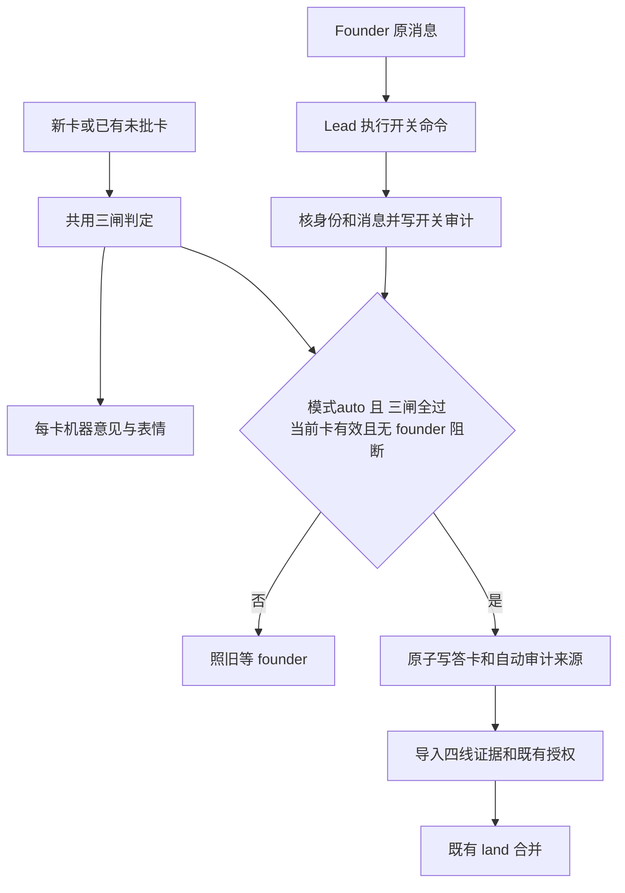

# FLY-2453 自动合并窄口开关 — 实施计划
Issue: FLY-2453 (https://linear.app/geoforge3d/issue/FLY-2453/2309b45-自动合并窄口开关founder-一句现在放开-现在停止切换开着时同时过三道闸机器判纯文档-人声明-pure-docs)
日期: 2026-09-08
基于: research.md

Version: v4（吸收 R2 评审与 Lead b19c5f83 单向时效裁定）
Status: APPROVED（有效设计评审 R3，2026-09-09T03:44Z）
Review receipt: fdf2d72e-3e3a-48bb-9e05-ab32add89496 / question 6e04ef27-4ae4-46df-ae18-9f0ba93b83b6
Founder HTML: https://fw-reports-a53de2.vercel.app/r/51bec88dabceec8cacb4b73410db18bf/
代码基线: `d7b75c755`，已含 FLY-2398 / #1130 与 FLY-2397 / #1113。

## 1. Founder 会看到什么

你在工程频道说「现在放开」，Lead 执行绑定这条原消息的命令并确认成功。系统从此检查新卡，也重新检查已有未批准的卡。只有机器判纯文档、该卡最新 Lead 提交的代理声明 pure_docs、强度二满足三项同时成立，才替你批准并走既有 land。你说「现在停止」，关闭提交后不再新增自动批准，已批准的合并继续。

第二道闸是「Lead 提交的 pure_docs 声明（代理声明，可被审计与打回，不是人类逐卡批准）」。它由实现侧/Lead 的 bot 提交，不是独立人类检查；founder 的人类授权是控制开关。你打回的同一版本永远不自动批；修正后的新版本重新过三闸后仍可能自动批，并未把拒绝范围扩成整张 PR。

在 dry_run（默认）或 auto 模式，每张 ship 卡都会在同一 issue thread 附一条机器意见，并在卡上加 🤖（三闸全过）或 🚫（至少一闸未过）。意见写出三项结果、一个理由、置信数和最近 200 个有效人工样本的自动批命中率与整体动作一致率；目标 98% 只显示，不成为第四道闸，也不能自动打开开关。机器意见不是批准。

此设计是 founder 2026-09-09 直令的受控例外，FLY-2399 的未来规矩提案仍另行处理。程序发行默认 dry_run（只展示意见，绝不批准）；issue 引文、报告达到 98%、Lead 判断以及部署本身均不能开启。

## 2. 稳定身份与合同

- 开关：`auto_merge_narrow_gate`。显示「纯文档窄口自动批准」。类型为 `off | dry_run | auto`，默认 `dry_run`；off完全静默，dry_run只出意见，auto出意见并可自动批准。只存显式项目 scope；此轮允许 `flywheel` 且控制者为该项目 `flywheel-eng-lead`。其它项目不得借本授权开启，未来扩展需另有 founder 项目授权。
- 开关执行者：经现有 Lead 身份验证得到的 agentId；授权者：配置的 canonical founder。Lead 指令给定本项目 founder ID `1138241636057481306`、工程频道 `1516209714097291335`，由项目名册/配置解析并测试钉住，不在全局 flag 定义里硬编码给其它项目。
- 自动 actor：`bridge-auto-narrow-gate`；来源：`decision_source=auto_narrow_gate`；人工来源分为 `founder_manual`（B2 founder_authored=1）与 `other_manual`（保留其它既有合法来源），未知旧数据为 `legacy_unknown`。值与解析器统一放 `packages/flywheel-comm/src/auto-narrow-contract.ts`，两包复用。
- 卡身份：`(project, run_id, question_id, gate_node_id, attempt, source_execution_id, repo_identity, pr_number, head_sha)`。`head_sha` 为小写 40 位 hex；repo identity 沿用已有 canonical identity，不用 display slug 或 issue title 作键。
- 自动源事件：`auto-narrow:<question_id>`，一个 question 最多一个；新卡产生新 id。相同 id 不同 payload digest 是 poison，不覆盖旧批准。
- 被 founder 打回的阻断键：`(project, repo_identity, head_sha)`，跨 question / attempt / run 保留；仅 `founder_authored=1 && verdict=rework` 构成永久已确认阻断。未确定归属的已接收 founder 输入构成临时阻断。

## 3. 架构与唯一判定核



抽取 `StateStore.recordAutoMergeShadowObservationTx` 里的事实读取为私有 `collectShipDecisionFactsTx(binding, at)`；现有 B4 与新增窄口都调用它。返回 B1 relevance、原始 candidate snapshots、B3 evaluateStrengthTwo 结果与绑定记录、该卡 latest declaration。公开的 `evaluateAutoNarrowCandidate(questionId, at)` 只返回只读评估给意见页；最终 writer 在事务里重算，不接受调用者传 `eligible=true`。

三闸固定如下，任意缺失均 false：

```ts
const gate1 = facts.relevance.verdict === 'docs_only';
const gate2 = facts.latestDeclaration?.declared_class === 'pure_docs';
const gate3 = facts.strengthTwo.verdict === 'satisfied';
const threeGatesPassed = gate1 && gate2 && gate3;
```

机器 relevance 覆盖整个 run 的主 PR、声明 PR 和 nested review；不减少 B1 的 repo、file budget、分类版本、snapshot freshness 或 unknown 分支。闸②沿用 B4 的 `authorId=lead.botUserId && authorIsBot=true` 验证与 `declared_by=lead.agentId`，不宣称人类独立确认。B3 exact run/repo/head 过滤、记录时点与「最新满足行优先」保持原语义，不新探测或重定义强度二。

## 4. 开关入口、审计与重放

CLI 保留 set/apply 命令外形，窄口额外要求原消息引用；Lead 身份由当前 lease/carrier 自动携带，凭据不进日志：

```sh
node "$FLYWHEEL_COMM_CLI" feature-flags set --name auto_merge_narrow_gate \
  --project flywheel --to auto --reason "founder <message-id>" \
  --founder-message-ref "1516209714097291335/<message-id>"
```

停止用相同命令 `--to dry_run` 并绑定新的「现在停止」消息。当前无off短句，生产入口拒绝to=off，off仅作为可读状态及台架fixture；不增加自然语言解析。不是本节点要执行的操作。

`feature-flags.ts` 只对本 protected flag 调用 `authorizeLeadWrite` / `postCarrierClaim`；`flag-routes.ts` 先分流到新 `bridge/auto-narrow-control-route.ts` 的 async stage/apply handler。通用 flag 的同步路径与行为保留。服务端用现有 Lead 授权 helper 再核 lease / carrier、身份 digest、活跃实例与 project/agent 归属；不能只信 CLI 或 body。

Stage 与 apply 都执行以下检查；apply 在网络核实后、最终 StateStore 事务内再核当前身份租约、expectedChangeSeq、最新已消费消息顺序及开启消息年龄（auto网络取回时通过但等锁后过期仍拒绝；停止不做墙钟年龄检查）：

1. `name/project/to/reason/founder_message_ref` 形状严格、未知键拒绝，named project 存在；拒绝 `*`、clear、YAML/env/legacy override、无原消息、非所属 Lead。
2. reason 严格等于 `founder <message-id>`，引用的 channel 必须就是本项目工程频道，**不接受子 thread 或其它频道替代**（按 Lead 裁定）。从该 Lead botToken 取原消息，超时 5 秒；作者必须为 canonical founder、`authorIsBot=false`、未编辑、未删除。网络失败 503，不写 flag。
3. 允许首尾空白及有限标点 `，。！,.!；;、`，只从两端剥离；中间字符不改。**全角/半角问号不剥离**，含 `？/?` 的消息一律拒绝，包括「现在放开？」与「现在停止?」。剩余内容必须全等于两条短句之一并与 to 一致；不得接受引用、复合句、同义句、模型判断。正文最长 256 UTF-8 bytes。
4. **开启与停止分开检查年龄。** 新 `to=auto` 在stage/apply及最终事务内都要求 `-5000 <= now - message_created_at <= 600000ms`（服务器时钟，边界含等号），允许5秒未来时钟偏差，超界拒绝开启。`to=dry_run` 不做墙钟年龄检查：只要第1–3条身份/原文验证与第5条消息顺序通过，即使Lead延迟数小时处理也能停止；不能要求founder重发。两方向消息时间均须等于snowflake解出的毫秒时点，不刷新时间、不以HTTP拉取时间代替。已经消费过且同payload的消息只能查询原receipt与当前状态，不生成新token、不切换；仍核当前身份、绑定与载荷。已开启状态没有TTL，十分钟不会自动停止它。
5. 以 Discord snowflake 的整数顺序拒绝早于该项目最后已消费控制消息的请求，同时防止旧auto覆盖新dry_run及旧停止覆盖更新auto；同 message + 同 payload 返回原 receipt 和当前 effective 值，不重复写，不把当前 dry_run 改回 auto；同 message + 不同 payload 为 409。
6. token 绑定目标、project、Lead identity digest、founder message id/content digest、expectedChangeSeq，沿用现有一次性 confirm token。apply 再取消息，不拿 stage 缓存当永久授权。失败写已有 fleet denied audit，reason 用有限枚举，无 token/消息全文泄漏。年龄错误码 control_message_expired / control_message_future 仅适用于开启；停止不因消息年龄拒绝。
7. StateStore `applyAutoNarrowControlChange` 一个 IMMEDIATE 事务内复用私有 scoped flag 写核，更新 flag row/changelog，并 INSERT immutable control event；任一步失败全部回滚。公开 `applyScopedFlagValueChange` / `applyFlagValueChange` 对此 flag 一律拒绝，只有该专用方法可调用私有核。
8. 成功返回 effective、control_event_id、opening_at、founder_message_id、flag_revision。Lead 收到成功回执才在 founder 原消息对应的讨论 thread 确认；HTTP失败或stale response不说已切；Lead在原thread明确说明“尚未切换成功”及有限错误原因，停止遇到可重试传输/数据库错误继续重试同一原消息，不默默要求founder再次发话。

同值的新指令也追加审计并增加 flag revision；若已 auto 再 auto，`opening_event_id` 保留该连续开启区间的第一条；dry_run/off→auto 创建新区间。关闭不清历史授权或被拒绝 head。

Registry 增加可选 `controlAuthority: 'founder_message'`；只有这个字段的 spec 可取 `source='code_default' / scope='project' / valueKind='enum' / enumValues=['off','dry_run','auto'] / toggleable='conversational' / default='dry_run'`，不配 envVar/configKey。`store-policy.ts` 增一个明确、仅接受此结构的分支；getFlagStoreCodec对此flag必须使用strict三态enum codec（非法raw报错，不借现有boolean optInCodec），scope writer私有核接受此enum。原flag规则不变。resolve/report 读命名项目 flag+control receipt；缺行显示并运行 dry_run；非法值或receipt与revision不匹配也降为dry_run/degraded，禁止auto，绝不回退 `*`。手机报告只显示状态/开启时间/授权引用及「由 founder 原消息控制」，不生成普通 toggle/clear 命令。

具体修改 `validateFlagAuthoringPolicy` 的两处独立合同：project-scope 子句只对上述完整 founder_message spec 接受 code_default/project/enum/无configKey；enum codec 子句只对该受保护类型测试 invalid raw **抛错**，其余 enum 仍要求原 fallback。正常 enum 成员与默认值仍完整 round-trip。CLI/stage/apply 的非法写直接拒绝；运行 reader 才在专用 wrapper 内捕获 codec 错误并返回 `{mode:'dry_run', degraded:true, reason:'invalid_raw'}`，所以“写时严格”和“读损坏数据时降级”属于不同边界。显式 off fixture 是合法静默读值，不需要伪造 founder receipt；只有 auto 必须有匹配的控制证据，dry_run 的不匹配保留 degraded 标记。生产 API 仍不能写 off。

## 5. 持久化模型

新增表由 C0 单独 migration commit 引入，DDL 使用参数化 DML、CHECK、索引；append-only 表 UPDATE/DELETE 触发器拒绝。不能把用户内容插进 SQL。

`auto_narrow_control_event`（StateStore，只追加）：

- PK `event_id` canonical UUID v4；`project_name`、`control_seq`，UNIQUE(project_name, control_seq)。
- `mode` CHECK IN (dry_run,auto)；只有两条 founder 短句能产生控制事件，off 不是伪造第三条指令。`flag_revision` 正整数；`flag_change_seq` 绑定既有 changelog id。
- `founder_message_id` UNIQUE、`founder_channel_id`、`founder_author_id` 为 17–20 位数字；`message_created_at` / `applied_at` canonical UTC ISO 毫秒。
- `message_digest` SHA256；`command_text` 仅两个短句；`executed_by` 既有 agent-id 文法与 64 byte 上限。
- `opening_event_id`：auto 时非空、自引或指向同项目auto事件；其它模式时 NULL。`schema_version=1`。
- 写入后同事务验证 changelog 的 name/scope/to_raw/changed_by 和 flag row revision 全等。event 失败不留下无授权auto。

`auto_narrow_decision_audit`（StateStore，只追加）：

- PK `source_event_id`；UNIQUE(question_id)，UNIQUE(verdict_id)，`decision_source CHECK='auto_narrow_gate'`。
- 绑定 project/run/question/gate/attempt/execution/repo/pr/head，`control_event_id`、`opening_event_id`、`flag_revision`。
- `declaration_id` / `declaration_seq`，`s2_basis_record_id`，`observation_digest`，`source_payload_digest`，`decision_at`，`policy_version=1`。
- FK 到控制事件、B4 declaration、B2 verdict；其它已有跨生命周期数据只保存稳定键，不能依赖 sessions 存活。

`auto_narrow_opinion_snapshot`（StateStore，只追加）：

- PK `opinion_id`（question + ordinal）；question/run/project/head/card_message_id；ordinal 单调，captured_at UTC。
- gate1/gate2/gate3 0/1、eligible 0/1，CHECK eligible=(gate1 AND gate2 AND gate3)；declaration_id nullable、machine_reason、s2_basis_record_id、有限 reason code、policy_version=1。
- 已发布统计快照 `sample_n` 0..200、`agree_n` 0..sample_n、`precision_a` / `precision_b`（0≤a≤b≤sample_n）、`confidence_lower` nullable 0..1、metric_version=1；b<5时NULL并显示「样本不足」。
- `sample_start_at` / `sample_end_at` / `last_eligible_human_at` nullable canonical UTC：本次窗口的人工样本起止时间与最近eligible人工对照时间；空样本三列均NULL，无eligible对照则最后一列NULL。C0首次建表就包含三列，不在C3追加migration，不回填不存在的历史样本时间。
- snapshot 是意见与样本事实，不是 authority，任何 flag/claim reader 不从它直接放行。

`auto_narrow_opinion_delivery`（StateStore，可更新）：

- PK question_id；绑定 issue thread/card id；desired_opinion_id、posted_opinion_id、followup_message_id nullable。
- generation、attempt、state (`pending|posting|uncertain|delivered|gone`)、correlation_marker、posting_at、first_zero_scan_at、scan_frontier、next_attempt_at、last_error_code。
- reaction_applied (`none|eligible|ineligible`)，automatic_label_pending 0/1。每卡只有一条 follow-up，更新用 PATCH。

预算：每个 B4 basis 仍≤16384 bytes；自动源 payload 含 observation、绑定和引用，总≤24576 bytes，按真实 JSON.stringify 字节检查。超限保留人工等待，不裁掉门权或三闸事实。意见文案≤1800字符，allowed_mentions.parse=[]，单条消息，reason 使用有限模板、repo/issue 显示 text escaping。

## 6. 自动批准的提交点与恢复

入口为现有 GatePoller 每轮完成 founder 输入处理、source drain、卡 materialization / relevance refresh 后的新 `reconcileAutoNarrowGate` rider，复用原 timer，不新启 daemon。每轮最多20张，按 `(last_attempt_at, question_id)` 公平轮转；单个失败隔离。刷新用已有 bounded PR snapshot refresher，不在锁内访问 GitHub。

资格：仅当前 engine-owned active run，current_node 为其 founder ship gate，holder authority_mode=land / subject_kind=git_head / state=awaiting_review / materialization completed，已绑定真实 Discord card 与 exact repo/pr/head。现有 gateAuthority 与 review hold 检查全部保留；unknown 或绑定不一致等待，绝不更新 stored head 来凑资格。

最终提交固定顺序，伪代码中的两个方法是本单新建的私有边界：

```ts
store.withAutoNarrowDecisionLock(questionId, (facts) => {
  // StateStore raw.transaction(...).immediate(): all reads occur after lock.
  // No async work or required StateStore write in this outer transaction.
  if (facts.control.mode !== 'auto' || !facts.threeGatesPassed || facts.blocked) return;
  return comm.insertAutoNarrowApprovalWithSource({
    // CommDB IMMEDIATE: recheck question + pending founder input, then write.
    envelope: buildAutoNarrowEnvelope(facts),
  });
});
```

外层锁内重读开关与控制引用、holder、latest declaration、B1/B3 facts、已确认拒绝历史。内层 CommDB IMMEDIATE 再确认该 question 未答、未过期 disposition / supersede，expectedOwner 等于 holder source execution；检查未投影 founder_feedback 及尚未结算的相关 founder 输入。所有结构源自服务端，调用者不能传任意 actor 或预判结果。

**CommDB 事务提交就是自动批准生效点。** response 结构包含 `approved:true`、head、question、actor、`decision_source`、控制/来源引用；与完整 source envelope、question disposition 同事务提交。source kind 复用 `founder_approval` 作为既有授权事件类别，但 envelope 明确是 founder 授权例外，不伪造人按卡。source_event_id=`auto-narrow:<qid>`。

外层 StateStore 事务不做必须保存的写，因此 CommDB 已提交后崩溃不会丢审计。停止到dry_run也写 StateStore，不能穿过这把锁：dry_run先提交→不批准；source先提交→已批，停止不撤销。没有“先读auto、await网络、回来直接批”的路径。

这是一条新引入的跨库写锁顺序，不能继承两个连接默认 5000ms 的等待。进入这个同步私有边界前，保存两连接原 `busy_timeout` 并临时设为 **0ms**，退出 `finally` 恢复；全程不 await，不与其它任务交错修改连接设置。StateStore 或 CommDB 任一 `SQLITE_BUSY/SQLITE_LOCKED` 都立即释放已持有锁、记 retryable contention、停止本轮剩余候选，交下个既有 tick 重试，不当 poison、失败批准或跳过三闸。单轮另设 200ms 时间预算，候选之间无锁时检查预算并退出；20 张只是数量上限。实现需再次审计所有反向嵌套锁调用点；发现 CommDB 写锁内再取 StateStore 写锁时必须消除该反向边界才能交付。529 用独立进程分别持有两库写锁 1 秒，证明窄口立即返回无写入、Bridge 不等 5 秒、计时设置恢复且释放后可重试成功。

CommDB 源 envelope 冻结完整 B4 observation（`verdict_id`由source id确定）、该卡 declaration_id、control/opening event/revision、actual decision time、policy version、绑定字段；末端禁止不带来源的裸 auto response。

`applyWorkflowSourceEvent` 增 auto discriminator：actor/source同时匹配，完整字段和字节预算合法，绑定控制事件、declaration、s2 record、observation digest一致，才进入既有 approval 分支。`founder_authored=0`，author evidence.kind=`auto_narrow_gate`。claim沿用现有 founder_challenge / founder_approved 作为**授权门的历史类别**，evidence 增 decision_source/control/source 引用；该类别不能被报表当作人的作者身份。

自动分支在**同一 StateStore 事务**写 strict B4 observation + B2 verdict + auto audit + claim + holder + receipt + land 激活；观察、审计或任何一步失败全部回滚。临时写失败必须保留 retryable 错误，不能被 source projector 的 poison 正则误判成永久 deadletter。人工 branch 的 savepoint best-effort不变。

重放先查已有 receipt，digest相同返回原 claim，不重算当前dry_run/off、声明或快照；控制原事件和source完整性仍验证。收到source但尚未投影时已经属于已批准，进程重启后继续导入；source不是有效批准或缺证据则不产 claim/land，并明确报错。

## 7. Founder 打回、并发与身份负向护栏

- 最终锁内查 B2 任何同 project/repo/head 的 founder_authored rework，跨 run/新卡也阻止。新增必要索引；不依赖 session 还在。
- 此轮按 issue 明定的 head 粒度阻断；修改后的新 head 必须重新铸卡、声明和取证，三闸重新满足时仍可能自动批。没有把一个版本的拒绝扩成整张 PR 永久退出窄口，避免暗改 founder 指定的授权范围。该取舍须在 founder 页面直接写明；如希望修正稿也逐张人工复核，应另由 founder 扩大到 PR 粒度，本轮不悄悄推断。
- CommDB 已接收尚未投影的 founder_feedback 可能先于账本；通过其 question 解析 repo/head，命中旧卡同 head也阻止。无法解析但属于同 issue/run 则保守阻止，交既有 projector处理。
- StateStore `founder_decision_convergence` 未结项及 `founder_deferred_approval` 的拒绝/未知项也阻止。外层锁后新 StateStore 输入无法插入；内层锁后新 CommDB response无法抢先。数据库未收到的 Discord 发言不在这条瞬时保证内，既有输入轮询继续处理。
- 相同question人工答卡先赢→auto写0行；auto先赢→保留一次批准，后续 founder 返工走原有新卡/撤销与land截止规则，不做本单独立回滚。
- `bridge-auto-narrow-gate` 加到 reserved actor，**不加入** `TRUSTED_BRIDGE_APPROVAL_WRITERS` / `isTrustedApprovalAttribution`。generic `respond`、gate-response route、generic source writer及 founder_review writer均拒绝此actor/auto envelope。
- 只有新 internal narrow writer构造 auto source；无新的通用 approve HTTP入口。`verify-approval` 旧 runner/session路径仍不信此actor；本单只走 engine land。`external-merge-reconcile` 的 actor fallback也保持拒绝，正常已授权land的operation路径不改。
- `land-executor` 的 holder/head/QA/CI/founder-review/operation lease条件不削减；只消费已有导入 claim，不查影子表代替授权。不改变 R1其它情况。

## 8. 每卡机器意见（Lead 新增范围）

新卡materialization成功后立即记录opinion snapshot + delivery intent；默认dry_run即运行，auto也运行，不等Lead或founder；off不创建意见或投递intent。529证明触发点来自真实铸卡返回，不是单元测试直接调用 formatter。首次常见情况是「闸②未声明」，如实显示。

在同一issue thread发一条：

```text
🤖 机器意见:可自动批 / 不可自动批 | 闸① 机器判纯文档 ✓/✗ · 闸② Lead代理声明 pure_docs ✓/✗ · 闸③ 强度二证据 ✓/✗ | 置信 0.xx | 一句理由 | 最近 N 张与 founder 决定一致率 xx%
```

模板再附「模式dry_run/auto；意见不是批准；目标98%，不据此自动开启」。卡加🤖或🚫。declaration / B3 evidence / B1 snapshot改变时重算，只在内容改变时追加新opinion snapshot、PATCH同一follow-up并替换bot自己的反应；不会每tick发新消息。历史预测保留，人工对照不能用之后的新意见覆盖。

自动source已提交后，durable delivery state安排PATCH原卡，保留原卡问答与绑定文案并加 exact banner `窄口自动批（开关由 founder 于 <opening_at> 打开）`。只在source已存在时标「自动批」，事前的可自动批意见不得冒充已批准。页面/消息故障不撤销已批准，durable pending修复；尚未自动批时不因显示失败改成普通批准。

投递复用 `founder-thread-notifier.ts` 的 correlation marker、bounded scan与明确unknown处理模式：先写posting intent，再发，响应丢失记uncertain；按marker查同thread历史，found绑定，ambiguous保持待查，只有两次间隔≥30秒、稳定frontier的完整零结果才重发。超时不当作零结果。只扫描有明确下界的post时间范围，分页不完整不得判zero。follow-up已知ID用幂等PATCH；reaction 复用 `approval-signal/founder-ack.ts` 已有的 bot PUT `/reactions/{emoji}/@me` 低层请求能力，必要时抽到 `discord-utils.ts` 并让原调用者共用，再增加 DELETE @me；保留相同超时/429语义与原回归，不复制另一套请求器，不删founder反应。

停止回dry_run后继续显示机器意见，意见文案中的模式刷新；off停止新增意见/更新/反应，已有消息不删除。已提交批准的自动批标记仍作为旧交付责任补齐。除本例新增消息与reaction外，不改其它卡入口或决定规则。

## 9. 统计口径与置信显示（Lead c63827c4 已裁定）

固定 `window=200`、`targetPrecision=0.98`，定义在 `auto-narrow-contract.ts`，不是新feature flag，不参加放行。先取同project最近200张有 `founder_authored=1` 判决的卡；自动source、operator rework与未知归因不计真值。按每卡首个人工decision_at/verdict_id倒序取窗，再检查B4四线和判决前opinion覆盖；缺覆盖不以更旧样本补满，显示缺样数量。

每张question一票：prediction取不晚于首个人工判决的最后一个opinion snapshot；实际结果取截至统计时该卡的founder判决，出现任何founder rework则actual=false，否则founder approved为true。这样「先批后打回」不被算成正确。后续same repo/head的新卡打回另列反例，不凭run重复计票。

主指标为**自动批命中率（precision）**：在窗内有完整四线和prediction的N张里，b为三闸全过的张数，a为其中founder批准且未打回的张数；主指标=a/b。98%目标针对这个值，不针对整体动作一致率。

次指标为整体动作一致率M/N：prediction与actual同为true或同为false计入M。明确标「动作一致，不是代码正确率」；非文档不自动批不等于应该被founder打回。自动批准卡永远不能给自己提供人工真值。

置信显示主指标a/b的95% Wilson下界：

```ts
const z = 1.959963984540054;
const lower = b < 5 ? null :
  ((a / b) + z*z/(2*b) - z*Math.sqrt((a/b)*(1-a/b)/b + z*z/(4*b*b)))
  / (1 + z*z/b);
```

b<5显示「置信：样本不足」，不得伪造0.xx；b=0主指标不可判，N=0次指标不可判。样本足够显示 `自动批命中 a/b（下界0.xx）· 整体一致M/N`，每条意见注明「下界不是这张卡的正确概率」。N<200或有缺覆盖时显示规模，不能只报百分数。机器意见通过最新B4观察+判决样本查询，不从当前可变PR快照复造历史预测。

每条意见同时展示人工样本起止日期、最近一个 eligible 人工对照的时间及距今天数；snapshot 追加 `sample_start_at/sample_end_at/last_eligible_human_at` nullable UTC 字段。超过7天没有新的 eligible 人工样本时，命中率前加「历史样本，非近期验证」；没有 eligible 样本仍写样本不足。7天只改变提示，既不改200张窗口、Wilson公式，也不改变放行。auto 开启后可能长期没有新人工真值，必须如实显示，不能用自动批样本填充。

两周报表继续由独立cohort算四线覆盖；来源分`auto_narrow_gate / founder_manual / other_manual / legacy_unknown`。自动组声明用audit冻结的declaration_id，人工历史规则保持。源响应已提交而destination未投影属于待导入/缺覆盖，不消失；离线副本若只有StateStore，必须明确报告不能枚举尚未导入的CommDB源，运行报表脚本要同时备份CommDB以补入auto source全集。两份备份先StateStore再CommDB，记录各自cutoff；跨库差异只记pending使覆盖无效，不猜测补成已导入。

保留旧人工N1/N2/N3的语义，但明确排除自动approval；同一自动head后有独立founder打回时，在自动组另报「被人工复核X/N，其中打回Y/X；未复核N-X」，X=0不可判。不得把自动组没有打回当0%错误，也不拿它增加人工98%分母。CLI ship report输出零表格；原始shadow SQL的机器可读行不需删除。

## 10. 迁移、回滚与生产边界

C0先加四表、索引、append-only触发器与retention分类，再做运行逻辑。旧B2/B4行不回写、不回填人工作者；查询用source evidence及新audit精确分组，旧未知仍未知。schema receipt幂等；每个新表都登记protectedCurrentOrReference，delivery作为未结交付保留引用，不因TTL消失。修改生产表fixture、硬计数、retention consumer gate。

不产生auto种子：新表为空、无flag row就是dry_run。冷启动不从env/YAML读取；损坏或无receipt的auto行降为dry_run。default-enable policy的governance例外在R1新增条款明确引用，本flag部署默认dry_run，只出意见；不执行“发布即自动批准”。

回滚先由founder新「现在停止」按同一路径关闭，停止新的自动源；等待已提交源投影完成并清理已开始land的交付责任，再回退C1以后运行代码，**保留C0 schema/retention与已写证据**。禁止在有未投影auto source时回滚到不懂该envelope的projector；独立updater的升级/回退预检必须检测这一条件并拒绝unsafe rollback。无权限替founder切换模式的runner只能报告并等待，不手工改库。部署仍由updater窗口进行，merge不等于上线。

本design节点生产零改动：不执行本单feature-flags、不安装定时任务、不手工restart。新founder指令允许部署后默认dry_run展示；自动批准仍须独立当前授权。实现/QA仅529独立库与假Discord/GitHub接口；真实生产首次auto另需founder当前原消息。

## 11. 分块实现与测试顺序

每块按 failing test → minimal implementation → refactor → commit。下面所有新增API均为拟实现名称，现有函数锚点见research；本设计节点不写这些实现。

### C0 — schema和中央合同

文件：新增 `packages/flywheel-comm/src/auto-narrow-contract.ts` 与相应 export；修改 `packages/teamlead/src/StateStore.ts` migration；新增 `packages/teamlead/src/__tests__/StateStore.auto-narrow-schema.test.ts`；修改 `scripts/lib/fly-2006-retention-registry.mjs`、`scripts/__tests__/fixtures/fly-2006-teamlead-production-tables.json`、`packages/teamlead/src/__tests__/fly-2006-database-retention-sweep.test.ts`、`scripts/__tests__/fly-2006-retention-consumer-gate.test.mjs`。

- [ ] 红测：全新库四表在、两种合法控制事件/opinion/audit可插；opinion的sample_start_at/sample_end_at/last_eligible_human_at三列从C0就存在，合法NULL/UTC往返与空样本NULL规则受测；三态flag codec与只含两种命令的control-event CHECK区分；schema重跑不重复；非法mode/身份/字节上限/空引用拒绝；append-only UPDATE/DELETE拒绝；四表全分类且不会被sweep删。
- [ ] 实现§5 schema，source/actor/metric常量及strict envelope parser，加入package exports。数据库CHECK与parser复用共享预算数字，跨列CHECK显式IS NOT NULL。
- [ ] 跑新suite及retention suite；预期全绿。单独提交 `feat: add narrow approval evidence schema (FLY-2453)`，作为回滚保留底座。

### C1 — founder控制入口

文件：新增 `packages/teamlead/src/bridge/auto-narrow-control-route.ts`、`bridge/__tests__/auto-narrow-control-route.test.ts`；修改 `bridge/flag-routes.ts`、`bridge/plugin.ts`、`bridge/flag-store-runtime.ts`、`bridge/feature-flag-render.ts`、`bridge/feature-flag-report-html.ts`、`StateStore.ts`；config `feature-flags/registry.ts`、`store-policy.ts`、`resolve.ts`；comm `commands/feature-flags.ts`。

- [ ] 红测：正确founder/工程频道/Lead/两短句开关；空白及允许标点边界；「现在放开？」/「现在停止?」与其它问号组合全部拒绝；伪作者/runner/错Lead/错频道/编辑/超时/对不上to/旧message/停止后重放auto/wildcard/clear/generic direct write全部拒绝。
- [ ] 红测：stage后消息被编辑、租约换代、另一个dry_run先提交，apply失败；事件INSERT失败flag不变；同消息重放不写第二行；auto消息年龄-5000/0/600000ms通过、-5001/600001ms拒绝，stage有效而apply过期拒绝，从未消费的三周前放开消息拒绝；dry_run延迟15分钟/数小时与主机时钟偏差仍成功，早于已消费新auto的旧stop仍拒绝，旧receipt查询不重开，auto持续十分钟后仍auto；其它flag保持原用法。
- [ ] 实现§4，读report状态与运行状态同源；默认无行=dry_run；env/YAML/*都不能进入auto。测试手机页面无普通开关/clear命令。
- [ ] 跑config authoring/drift/resolve、flag route/store/runtime、CLI测试；提交C1。

### C2 — 共用资格和严格自动source

文件：新增 `packages/teamlead/src/auto-narrow/eligibility.ts`、`bridge/auto-narrow-gate.ts`、`bridge/__tests__/auto-narrow-gate.test.ts`；修改 `StateStore.ts`、`bridge/gate-poller.ts`、`bridge/plugin.ts`、`bridge/founder-approval-projector.ts`、comm `db.ts`、`founder-attribution.ts`。新增 `StateStore.auto-narrow-approval.test.ts`、comm `__tests__/auto-narrow-source.test.ts`。

- [ ] 三闸独立红测（其余为true）：machine=ship_relevant/unknown；声明缺失/config_only/别卡；B3 unsatisfied/别head/无row。每个case断言response/source/claim/land均0，原holder仍awaiting。
- [ ] 抽取collectShipDecisionFactsTx复用B4，保持手动savepoint行为；最终锁内现算、snapshot fresh含全部repo。禁止only-primary或从旧观察读资格。
- [ ] 实现StateStore IMMEDIATE→CommDB IMMEDIATE同步边界，响应+来源同事务；触发器让source INSERT失败必须回滚response。两库各自锁争用、0ms busy恢复、整轮停止重试及释放后成功必须有多连接/独立进程证据。
- [ ] projector验证auto来源并strict写观察/audit/claim/receipt/land；故障重试/cursor reset不重复；auto source提交后dry_run再投影仍恢复一次。
- [ ] 阻断历史拒绝、旧卡未投影feedback、未分类输入和deferred拒绝；人工/auto并发一方胜；新head必须重铸卡重证据。
- [ ] actor只reserved，证明`isTrustedApprovalAttribution(autoActor)=false`且founder_review不能过。保留verify-approval与external fallback负例。
- [ ] 跑§12列出的source/land/rework回归；提交C2。

### C3 — 意见、反应与卡标记

文件：新增 `packages/teamlead/src/auto-narrow/opinion.ts`、`bridge/auto-narrow-opinion-delivery.ts` 与对应 `__tests__`；修改 `bridge/gate-materializer.ts`、`bridge/gate-poller.ts`、`bridge/plugin.ts`，复用 `founder-thread-notifier.ts` scan / `discord-utils.ts` post/edit helper；复用或抽取 `approval-signal/founder-ack.ts` bot reaction 请求并保留原测试。

- [ ] 红测从真实materialize返回触发：flag dry_run/auto每卡都有一条follow-up与正确reaction；三项全显、字段有限、无mentions注入；fresh声明使原消息PATCH，不发第二条。
- [ ] 实现snapshot+delivery intent先写，post超时unknown扫描恢复；多worker只一个generation写；PATCH/reaction失败保持pending；两次完整零扫描才授权重发。
- [ ] 实现source提交后才加自动批banner；dry_run时意见继续、off时零新意见。有效样本N=0/1/200、eligible分母b=0/4/5、缺覆盖、自动自计分排除、窗口排序、同卡重复判决各有确定数值测试；样本日期/最新eligible时间/7天历史提示边界必须可复现。
- [ ] 跑opinion/delivery/materializer与原founder-notifier tests；提交C3。

### C4 — 来源报表、R1和验收

文件：修改 `engineering/doc/FLY-2398-auto-merge-shadow-run/shadow-table.sql`、`scripts/fly-2398-shadow-table.mjs` 与现有脚本测试；`engineering/doc/FLY-2396-founder-gate-head-origin/retro-bind.sql` 显式排除auto；重述下面B2/B4两份边界测试合同；R1只增§13文本。新增 `scripts/fly-2453-narrow-gate-mutations.mjs`、`engineering/doc/FLY-2453-auto-merge-narrow-gate/acceptance.md` 与529驱动（按项目现有529脚本同形组织）。

- [ ] 将 `packages/teamlead/src/__tests__/fly2398-no-gating-readers.test.ts` 明确重命名为 `fly2398-narrow-boundary.test.ts`，同步CI分片/引用/describe与B4研究文档：FLY-2453正式新增唯一例外——当前卡 Lead declaration 经受保护的窄口核参与授权；旧 observation、opinion、统计仍绝不授予权限。分别冻结这些表/方法的精确消费者，禁止通用 approve、land-executor、verify-approval 和其它 gate 直接读取它们绕过source/claim，不用一条模糊白名单宣称“影子事实永不gate”。添加引入非法读者必红的负例与弱化声明身份核验必红的回归。
- [ ] 同样将 `packages/teamlead/src/__tests__/fly2396-no-gating-readers.test.ts` 重命名为 `fly2396-authorship-boundary.test.ts`，同步CI/引用/describe/it和B2研究文档，撤去“out of every merge authorization reader”的绝对承诺。新合同：founder_authored仅是作者事实，**不能单独提供正向批准**；但本单明确以founder_authored rework作为窄口负向否决，并允许来源统计。精确冻结三类消费者；禁止land/通用批准直接拿authorship替代claim。负例证明仅有founder_authored=1却无合法source/claim不能land，正反例证明同repo/head的人工rework必挡auto、移除该否决查询必红。不可只加ALLOWED文件而保留虚假文案。

- [ ] SQL fixture包含同卡后改声明、自动样本、手工批准/打回、operator、缺观察、source未投影与deadletter；断言每来源cohort与四线覆盖、人工N1/N2不被自动approval稀释、0复核不可判。
- [ ] 变异驱动复制相关源到临时隔离目录，分别删除gate1、gate2、gate3检查；每次对应测试必须红，并保存stdout/exit/assertion。mutant绿或变异未应用均失败；清理临时目录，不改生产/共享源码后再忘记恢复。
- [ ] 529使用独立两库、fakeFounder身份和fakeDiscord；run完整materialize→声明→B3→source→projector→land effects。断言approve+land实际走、审计含founder message id、四线全、每卡机器意见+emoji。
- [ ] 保存§12清单的输出、SHA、case与mutation证据；ship report按结论/验证/边界/下一步，零表格。提交C4并提交code review，之后交QA；本design节点不派发。

## 12. 必须有的验证证据

实现阶段命令（新增文件名按C0–C4固定）：

```sh
pnpm --filter flywheel-config test:run
pnpm --filter flywheel-comm test:run
pnpm --filter flywheel-teamlead exec vitest run src/__tests__/StateStore.auto-narrow-schema.test.ts src/__tests__/StateStore.auto-narrow-approval.test.ts src/bridge/__tests__/auto-narrow-gate.test.ts src/bridge/__tests__/auto-narrow-control-route.test.ts
node --test scripts/__tests__/fly-2398-shadow-table.test.mjs scripts/__tests__/fly-2006-retention-consumer-gate.test.mjs
node scripts/fly-2453-narrow-gate-mutations.mjs
pnpm typecheck
```

禁止在此桌面 runner 执行根 `pnpm test`：它递归包含会真开 Terminal.app 的 `packages/core/test/tmux-viewer.macos.test.ts`。本单只跑上述目标包及下面列出的回归；若确需 core 回归，必须用该包 `vitest run --exclude test/tmux-viewer.macos.test.ts` 并确认当前测试配置仍排除此桌面副作用文件。

实现先核package name/test脚本与基线；teamlead新测试在CI既有suite分片显式登记，不能只本地跑。回归至少涵盖 `StateStore.founder-gate-verdict`、`StateStore.workflow-source-projector`、`StateStore.workflow-rework`、`gate-materializer`、`land-executor`、`flag-routes`、`feature-flag-report-controls`、`strength-two-judge` 与B4静态读者。

验收逐项证据：

- dry_run+纯文档卡：response/source/claim/land=0，holder等待，机器意见仍出现。
- auto+三闸全过：一张response、一条source、一条audit、一条B2 verdict、一条B4 observation，declaration与B3 basis精确绑定，land执行一次。
- 三闸任一失败：全部等待；三个mutant逐个杀死。
- 关闭后新卡及已有未答卡：零新auto source；两连接并发dry_run→auto批准、auto批准→dry_run按提交顺序钉死。
- 崩溃窗：source前、source后但projection前、projection事务中、projection后但cursor前、Discord post成功回执丢失、PATCH/reaction失败；逐一验证恢复不双批/双land/乱显示。
- founder先打回同repo/head：换卡、换run、重开flag仍不自动批；异repo同SHA不误共享黑名单。
- stop消息优先级：旧auto重放、stage在先dry_run后apply、auto/dry_run并发、same-value重申与message复用。
- schema/retention/rollback：保留C0后历史source、audit不丢，未投影auto源阻止旧binary回退。
- 新增可见性：dry_run/auto均每新卡一条follow-up、一个bot意见reaction；声明变化PATCH原消息；窗口最多200、目标98%只显示，自动样本不能增加一致率。
- 生产未触碰：529数据库路径/端口和fixture身份清单；生产flag前后只读值一致；无restart/merge/部署命令。

以上是实现与QA的待执行证据，不是本设计节点已经跑过的测试。

## 13. R1精确增补文本

仅在 `packages/teamlead/lead-rules-base/founder-only-authority.md` R1新增下段（保留其它字节，若其它段有旧“无例外”泛述，以本明确新增例外为限定，不顺手重写）：

> ### 窄口自动批（2399 M1 的实现；FLY-2453）
>
> Founder 可用当前工程频道原消息「现在放开」/「现在停止」控制本项目 `auto_merge_narrow_gate`，缺省 dry_run（仅展示机器意见）。只有所属 Engineering Lead 可执行绑定该消息的 feature-flags 命令；服务端核 founder 作者、频道、未编辑与精确短句（疑问句不算指令）；开启须十分钟内的新消息，停止不因消息年龄过期，两者均须通过消息顺序校验，并原子记录执行者、时间、原消息及开关版本。Lead 的判断、历史消息、累计一致率或默认启用规矩均不能打开它。
>
> 模式为 auto 时，仅对已铸成且仍有效的 land ship 卡，在批准时同时满足：机器分类 docs_only、该卡最新 Lead 提交的代理声明 pure_docs、既有强度二证据 satisfied，且无 founder 打回同仓同 head 或待处理相关 founder 输入，才由引擎以 bridge-auto-narrow-gate 身份写带审计来源的 approve_to_ship 响应并走既有 land。第二道闸是 Lead 提交的 pure_docs 声明（代理声明，可被审计与打回，不是人类逐卡批准），不是独立人类检查。自动批准不冒充 founder 本人；四条影子记录线照记，decision_source=auto_narrow_gate。「现在停止」回到 dry_run，只展示意见、不再新增自动批准，已批准进入 land 的不回滚。
>
> 此例外只适用于上述窄口。其它 R1 动作、非文档类、founder_review、R2–R5、合并后独立 updater 部署与原有 head/QA/CI 守卫均照旧。

## 14. 设计交接与裁定

- Lead question `77a3ae46-5866-4df2-837e-37ed05d16059` 已回复：接受精确短句校验（允许首尾空白/标点），指定founder/工程频道/未编辑；auto扫描已有pending；新增每卡机器意见、emoji、200样本和98%目标。回复已ack，新增范围由C3、§8–9覆盖。
- 统计问题 `c63827c4-c02b-4b8a-9d64-a7ed70680ad3` 已裁定：主指标为自动批precision，Wilson95%下界用于置信，eligible分母<5显示样本不足；整体二分类一致为次指标；自动批准不当真值，98%仅显示。
- [lead-instruction 65835c4e-dee8-49c0-81ae-b4aaf9347367]：founder 02:55Z 修正为off/dry_run/auto，默认dry_run，放开→auto，停止→dry_run；本v4完整吸收。Lead答复5265bccc已接受：off仅维护/台架状态，无聊天短句，生产API拒绝Lead自由reason切off；部署即dry_run展示，auto仍须新放开消息。
- design节点交付exploration/research/plan、可评论HTML、Mermaid源和验证记录；本机图形渲染及标准重试均因权限失败，按任务明确fallback交付“DIAGRAM PENDING LOCAL RENDER”标识，未生成SVG，不冒充已渲染图。设计review effective APPROVED后提交推送，publish-only并向Lead报告URL，写≤5条durable memory，`complete --route phase_design_complete` 后park。
- 整体issue仍需implementation、code review、529 QA与后续ship；design完成不是生产已开启。

- Lead question `c231bc31-75da-46c1-b440-a49a002e712f` 已确认：闸②复用2398的提交侧代理声明，不是人类逐卡确认；所有面向founder文字明确标识。当时接受的双向十分钟已由后续b19c5f83裁定覆盖；最终只有开启限十分钟，停止不做墙钟年龄检查，已开启不自动到期，off维护/台架边界不变。疑问号不属于可剥离标点。

- Lead question `b19c5f83-61bf-4b6e-9f22-9f21dddc30ba` 明确覆盖c231bc31的双向时效：只有to=auto限10分钟并容忍5秒未来偏差；to=dry_run无年龄限制，仍核身份/原文/消息顺序，停止不依赖本机墙钟。v4与HTML、C1验收、R1增补同步。
