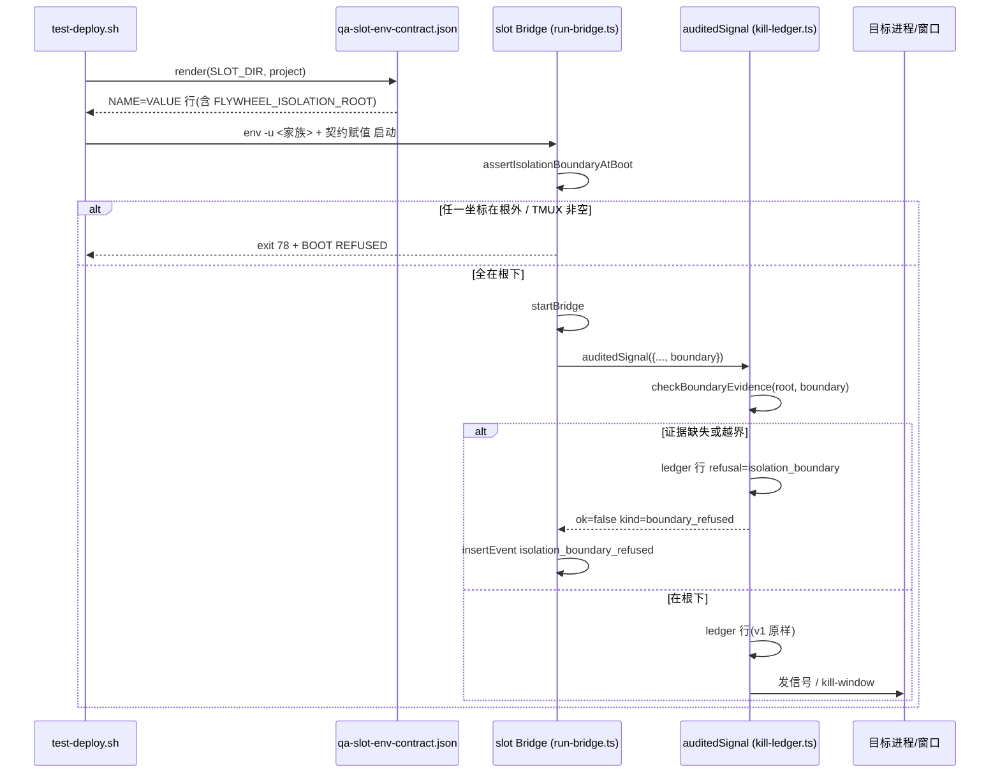

# FLY-2454 529 房 test slot 隔离洞修复 — 实施计划
Issue: FLY-2454 (https://linear.app/geoforge3d/issue/FLY-2454/529-房隔离-修两处-test-slot-隔离洞-test-deploy-走漏-resident-codex-三根-env-slot)
日期: 2026-09-09
基于: research.md

**Status**: codex-approved(3 轮:R1 5 条 → R2 3 条 → R3 APPROVED,2026-09-09)
**Source**: exploration.md · research.md

## 0.0 Codex R3 非阻塞实现备注(实现节点照做,不改批准范围)

- **T7 底层 matcher 要窄**:`kill-path-inventory.ts:57-73` 的文本规则会把 `signal: "kill-window"` 这类 audited **metadata** 也命中,`worktree-process-reaper.ts:437/453` 的 `deps.killGroup` / `deps.kill` 是绑定到 audited 默认 wrapper 的依赖 seam、并不在 `mutate` 闭包里。为「audited call metadata」和「精确绑定到 audited 默认 wrapper 的依赖 seam」各设窄规则(或改用 AST/scope-aware 扫描),未知直杀仍必红;不要用宽泛的文件 allowlist。
- **fence 与 import 顺序**:`run-bridge.ts:21-24` 有 `packages/config` 的静态 import,ESM 会先执行依赖再执行本模块。要严格做到「任何 import 副作用之前」,采用首个 side-effect bootstrap module 或 top-level dynamic import,并同步调整 `scripts/__tests__/flywheel-log-rotate.test.sh:332-341`(它目前只允许 config 一个静态 import)的断言。production 无 root 分支仍须无 I/O、无额外探测、无输出差异。
- **no-target ledger 行的确切 JSON**:`KillLedgerEntry.target` 现为必填;`recordBoundaryRefusal` 写的行采用 `targetKind: "none"`、`target: null`(v1 追加的专用 kind,读者不校验),并加 exact-shape 测试。
- 文字:§5 第 2 条与 T1 测试措辞已按 boot 轴改写。

## 0. 一段话

在 `scripts/test-deploy.sh` 起的 slot Bridge 里加一条**不可被走漏毒化的参照物** `FLYWHEEL_ISOLATION_ROOT=${SLOT_DIR}`,让 Bridge 进程自己做两件事:启动时自检所有破坏性坐标都在这个根下(否则拒绝启动),每次发信号前校验目标坐标在这个根下(否则拒绝并留痕)。同时把 slot 的 env 处置收成一份契约文件(单一来源),把 slot CommDB 从 `~/.flywheel/comm/` 搬进 `${SLOT_DIR}/state/comm`,并用真进程夹具把「守卫关掉就会杀、打开就不杀」钉进 CI。生产环境永不设该变量,所有新代码在生产下逐字等价于今天。

## 0.1 Lead 裁定(2026-09-09,question f21ccd61)

exploration §6 的两个非阻塞问题 Lead 已答,按裁定写死:

1. **CommDB 搬进 `${SLOT_DIR}/state/comm` 并统一 Bridge / Codex Lead 路径:通过。** 条件:(a) 必须有回归测试证明**生产启动路径在 `FLYWHEEL_COMM_DB` 与 `FLYWHEEL_COMM_ROOT` 都未设时字节等价**(这是保护每一个在线 Lead 的东西);(b) launcher(`claude-lead.sh`)的改动只限那一行。
   - 对 (b) 的落法:`claude-lead.sh` 有两处 HOME 推导——`:676` 的 `export FLYWHEEL_COMM_DB=…` 与 `:2366` 给 inbox-mcp 的 MCP 配置 `env.FLYWHEEL_COMM_DB` 重新从 HOME 算一次。launcher **只改 `:676` 一行**;第二处不动,改在 **inbox-mcp 层**解决:`packages/inbox-mcp/src/index.ts` 的 CommDB 路径改为「`FLYWHEEL_COMM_ROOT` 已设 ⇒ `join(COMM_ROOT, FLYWHEEL_PROJECT_NAME, "comm.db")`,否则 `FLYWHEEL_COMM_DB`」。生产 Lead 环境无 `FLYWHEEL_COMM_ROOT` ⇒ 仍读 MCP 配置里的 `FLYWHEEL_COMM_DB`,字节等价;slot Lead 的 launchd manifest 带 `FLYWHEEL_COMM_ROOT`,stdio MCP 子进程继承 Lead 进程环境 + 配置 env,于是 inbox 与 Bridge 指向同一颗 slot 库。**实现期必核(用真 carrier env)**:在 slot 里起 claude Lead 后 `ps eww`/`/proc` 读 inbox-mcp 进程实际 env,证明 `FLYWHEEL_COMM_ROOT` 到达且解析出的路径 == Bridge 的 `commDbPathForProject(project)`;核不到就报 Lead,不擅自改第二行。
   - 回归测试见 T5(`claude-lead-comm-db-path.test.sh` + `resolve-db-path.test.ts` + `inbox-mcp` 路径优先级测试的 env 未设分支)。
2. **真机阴性对照只做 2287 形状**(生产 tmux 诱饵窗口 + slot stop-runner 动作 + 舰队快照逐字比对);**2231 形状由 hermetic RED/GREEN 承担**,不做 2h15m 停留。§6 验收按此写。

## 1. 稳定标识(一次定死,文档与代码同名)

| 类别 | 标识 | 说明 |
| --- | --- | --- |
| env(隔离根) | `FLYWHEEL_ISOLATION_ROOT` | 绝对路径;test-deploy 写 `${SLOT_DIR}`;Bridge 内 `realpath` 后使用;生产永不设 |
| env(CommDB 根) | `FLYWHEEL_COMM_ROOT` | 已存在;slot 值 `${SLOT_DIR}/state/comm` |
| 契约文件 | `scripts/lib/qa-slot-env-contract.sh` | bash 可 source;函数 `qa_slot_env_contract_render <SLOT_DIR> <TEST_PROJECT_NAME>` 输出 `NAME=VALUE` 行;`qa_slot_env_contract_names <redirect|clear|passthrough>` 输出名字 |
| 契约条目处置词(caller 轴) | `redirect` / `clear` / `passthrough` | 只这三个;`passthrough` 必带理由字段。`clear` 只表示「caller 的 ambient 值被删」,启动器/包装器**可以**再合法提供一个 slot 值 |
| 契约条目启动断言(boot 轴) | `boot: "mustBeUnderRoot" \| "mustBeAbsent" \| "mustBeUnderRootIfSet" \| "unchecked"` | 与 caller 轴正交。`redirect` 条目默认 `mustBeUnderRoot`;真正必须缺席的坐标(`TMUX`、`TMUX_PANE`、`FLYWHEEL_TMUX_SOCKET_OVERRIDE`、`FLYWHEEL_COMM_DB`、`FLYWHEEL_COMM_DIR`)标 `mustBeAbsent`;日志类路径标 `mustBeUnderRootIfSet`;非坐标配置(`FLYWHEEL_ROUNDTABLE_CHANNEL_ID`、`VERCEL_TOKEN`、`FLYWHEEL_REPORT_HOST_OVERRIDE_URL`)标 `unchecked` |
| `CodexRunnerOrphanSweepDeps.signalGroup` 返回值 | `SignalGroupResult = { ok: true } \| { ok: false; kind: AuditedSignalFailureKind; error: string }` | 现为 `boolean`(`codex-runner-orphan-reaper.ts:58-68`),改为保留失败种类的判别联合,TERM/KILL 两处分支据此区分 `boundary_refused` |
| 无目标留痕原语 | `recordBoundaryRefusal(input, deps)`(kill-ledger.ts 导出) | 与 `auditedSignal` 写同一种 ledger 行(`refusal: "isolation_boundary"`, `refusalReason: "no_evidence"`)+ 同一 stderr 前缀,但不含 mutate;给「有杀意但拿不到任何坐标」的路径用(周期 MCP 孤儿扫描) |
| 模块(共享) | `packages/claude-runner/src/isolation-boundary.ts` | 导出 `resolveIsolationRoot(env)`、`assertIsolationBoundaryAtBoot(env, coords)`、`checkBoundaryEvidence(root, evidence)`、类型 `BoundaryEvidence` |
| `AuditedSignalInput.boundary` | `BoundaryEvidence = { socketPath?: string; codexHome?: string; ledgerPath?: string; tmuxSocketPath?: string; worktreePath?: string }` | 可选;slot 模式必填且全部在根下 |
| `AuditedSignalDeps.env` / `AuditedSignalAsyncDeps.env` | 注入用 env,默认 `process.env` | 隔离根解析、ledger root 与 boundary 判定**同一个** env 来源 |
| 新失败种类 | `AuditedSignalResult.kind = "boundary_refused"` | 与现有 `invalid_target | ledger_failed | signal_failed` 并列;`error` 含 `reason` |
| 拒绝原因词 | `no_evidence` / `outside_root` | 只这两个 |
| ledger 行新可选字段 | `refusal: "isolation_boundary"`、`refusalReason`、`boundary: BoundaryEvidence`、`isolationRoot: string` | `schemaVersion` 仍为 1(追加可选字段;仓内无生产读者,`kill-ledger-append.mjs` 只写不读——研究已核,T2 仍加新旧行解析测试) |
| 审计/事件名(**唯一**) | `isolation_boundary_refused` | 同一个字串同时用作:各 caller 的 `audit(event)` 名、`store.insertEvent.event_type`、T8 查询键。plugin 的 orphan audit sink 把 audit 名原样写成 `event_type`(`plugin.ts:8547-8560`),所以不能再有第二个名字。payload:`{ targetKind, target, evidence, isolationRoot, reason, source }` |
| 权威留痕 | kill ledger 行 + stderr `[isolation-boundary] REFUSED` | StateStore 事件是**附加**(只有握着 store 的 caller 写);teardown 归档以 ledger 为准,事件为辅 |
| stderr 行前缀 | `[isolation-boundary] REFUSED ...` / `[isolation-boundary] BOOT REFUSED ...` | grep 关键字 |
| Bridge 启动拒绝退出码 | `78`(EX_CONFIG) | run-bridge.ts 在 `startBridge` 之前退出 |
| 清扫器结果计数 | `CodexRunnerOrphanSweepResult.boundaryRefused: number` | 新增字段,默认 0 |
| 证据归档目录 | `${FLYWHEEL_QA_EVID_DIR:-$HOME/.flywheel/qa-evidence}/slot-<N>/<UTC ts>/` | 复用 truth.ts 已登记的 `FLYWHEEL_QA_EVID_DIR`;内含 `kill-ledger/*.ndjson`、`boundary-events.json`、`launch-manifest.json` |
| 快照脚本 | `scripts/qa-fly-2454-fleet-snapshot.sh` | 输出 research §7 两段清单,排序后打印;`--out <file>` |
| 显示标签(文档/报告) | 「隔离根」= `FLYWHEEL_ISOLATION_ROOT`;「边界拒绝」= `boundary_refused` | 不再造第二套词 |

## 2. 任务分解

顺序按依赖排;每个任务 RED → GREEN,先写测试。

### T1 共享模块 `isolation-boundary.ts`(claude-runner)

- `resolveIsolationRoot(env)`:未设 → `null`;设了但非绝对路径 / 含 `\0\r\n` / 不存在 / 是 symlink → 抛 `IsolationRootInvalid`(启动期抛,运行期不可能到达,因启动先校验)。返回 `{ lexical, canonical }`(macOS `/tmp` → `/private/tmp`,两者都留,比较用 canonical,tmux/lsof 用 lexical)。
- `isUnder(root, path)`:`realpath` 双方后 **`candidate === root.canonical || candidate.startsWith(root.canonical + sep)`**(根本身合法——`FLYWHEEL_STATE_DIR` 与 `TMUX_TMPDIR` 在 slot 里就等于 `SLOT_DIR`);`realpath` 失败(目标不存在)→ 用 `path.resolve` 的词法父目录逐级 realpath,同规则(socket 已被 unlink 的情况下仍要能判断)。
- `checkBoundaryEvidence(root, evidence)`:`root === null` → `{ ok: true, mode: "production" }`;evidence 为空对象或全部字段为空 → `{ ok: false, reason: "no_evidence" }`;任一路径不在根下 → `{ ok: false, reason: "outside_root", offending: [...] }`。
- `assertIsolationBoundaryAtBoot(env, contract)`:**纯 env 输入,不依赖 config 加载**。按契约的 **boot 轴**逐条检查:`mustBeUnderRoot` ⇒ 已设且 `isUnder`;`mustBeAbsent` ⇒ 必须为空(封住 `TMUX`、`TMUX_PANE`、`FLYWHEEL_TMUX_SOCKET_OVERRIDE`——后者被 `tmux-environment-scrub.ts:104-123` 直接当 `-S` 用,不是 plain tmux);`mustBeUnderRootIfSet` ⇒ 设了才检;`unchecked` ⇒ 不看。**不能**把 caller 轴的 `clear` 当作 boot 缺席断言:`test-deploy.sh:848-868` 在 generalized / reply-by-issue 模式会把 slot-local report-host token 作为 `VERCEL_TOKEN` 注入,`qa-report-host-bridge-wrapper.sh:43` 在 `exec` 前设 slot-local `FLYWHEEL_REPORT_HOST_OVERRIDE_URL`,`qa-room.sh:16-26` 在 roundtable host 合法注入 `FLYWHEEL_ROUNDTABLE_CHANNEL_ID`——它们都是 caller 轴 `clear` + boot 轴 `unchecked`。返回 `{ ok: true }` 或 `{ ok: false, offenders: [{ name, value, kind: "outside_root" | "unset" | "must_be_absent" }] }`。**不在模块里 `process.exit`**,由 run-bridge.ts 决定。
- 测试 `packages/claude-runner/test/isolation-boundary.test.ts`:production 模式全放行;symlink 根拒绝;`/tmp` vs `/private/tmp` 等价;**根本身通过**;不存在的 socket 路径按父目录判;`TMUX` / `FLYWHEEL_TMUX_SOCKET_OVERRIDE` 非空拒绝;`mustBeUnderRoot` 名缺失拒绝。

### T2 `auditedSignal` / `auditedSignalAsync` 接入(kill-ledger.ts)

- 输入加 `boundary?: BoundaryEvidence`;deps 加 `env`(默认 `process.env`,**ledger root 解析也改用同一个 env**,现在 `defaultLedgerRoot()` 已接受 env 参数但调用处没传);在 `mutationTarget` 之后、写 ledger 之前调用 `checkBoundaryEvidence(resolveIsolationRoot(deps.env), input.boundary)`。
- 拒绝时:**仍写一行 ledger**(`refusal: "isolation_boundary"`,不发信号),stderr `[isolation-boundary] REFUSED source=… targetKind=… target=… root=… evidence=…`,返回 `{ ok: false, kind: "boundary_refused", error, entry }`。ledger 写失败 → 仍返回 `boundary_refused`(拒绝优先于 ledger 状态,不能因为写不了账就放行)。
- `deps.env` 注入点,便于测试。
- 测试 `kill-ledger.test.ts` 增:production(无 root)下带/不带 evidence 结果与旧行为字节等价(对比 ledger 行 JSON 无新键);slot 下无 evidence 拒绝、evidence 越界拒绝、evidence 在根下放行;拒绝行落 ledger 且 `mutate` 未被调用。
- `scripts/lib/kill-ledger-append.mjs`:不改(v1 位置参数);加一条测试证明它读新行不炸(如果它有读路径;若只写,记「无读者」)。

### T3 逐 mutation 穷举:每个 runner-affecting 信号点三选一

三种处置,每个信号点只能落一种,T7 用测试锁住这张表与 kill-path-inventory 的对应关系:
- **boundary 接入**:调用 `auditedSignal` 时带 `boundary` 证据;
- **boot-fenced plain tmux**:不带 `-S` 的 `tmux` 调用,由 T4 的启动自检(`TMUX_TMPDIR` 在根下、`TMUX` 与 `FLYWHEEL_TMUX_SOCKET_OVERRIDE` 为空)保证只能命中 slot 服务器;
- **bounded-child 例外**:只对「本调用刚刚 `spawn` 出来、pid 还在手里」的子进程组发信号,结构性归属,不经咽喉;必须有代码谓词(目标 == `child.pid`)与测试。

| mutation id | 文件:行 | 处置 | 证据 / 谓词 | 备注 |
| --- | --- | --- | --- | --- |
| `codex_orphan_reaper.pgid` | `teamlead/src/bridge/codex-runner-orphan-reaper.ts:435,565-571,628-634,891-896` | boundary | `{ socketPath: candidate.socketPath, codexHome: candidate.codexHome }` | `signalGroup` 返回值改为 `SignalGroupResult`(§1);`defaultSignalGroup` 改为**闭包工厂** `makeDefaultSignalGroup(env)`,`runtimeDeps.signalGroup = deps.signalGroup ?? makeDefaultSignalGroup(env)`,把 `sweep` 的 `env` 绑进 `auditedSignal(..., { env })`;TERM(`:565`)与 KILL(`:628`)两处分支:`kind === "boundary_refused"` ⇒ `result.boundaryRefused++`、`audit("isolation_boundary_refused", {...})`、计入 `survivors`;其他失败 ⇒ 现有 `codex_app_server_orphan_signal_failed` 不变 |
| `codex_daemon_runtime.group` / `.child_fallback` | `claude-runner/src/codex-daemon-runtime.ts:787-830,1000-1060` | boundary | `{ socketPath: opts.socketPath, ledgerPath: <session.json> }` | `createDefaultKillGroup` 选项加 `boundary` 与 `env`;`reapCodexDaemonForExecution` 从 `deps.env` 传下去 |
| `mcp_descendant_reaper.teardown` | `mcp-descendant-reaper.ts:183` ← `runner-teardown.ts:29` | boundary | `{ tmuxSocketPath }`:`defaultResolvePanePid` 改为一条 `tmux display -p -t W '#{pane_pid}\t#{socket_path}'` | `PanePidResolver` 返回 `{ pid, socketPath } | undefined`;`McpReapDeps` 加 `boundary` 与 `env` |
| `mcp_descendant_reaper.periodic_orphans` | `mcp-descendant-reaper.ts:608-642 reapMcpOrphans` | boundary(**slot 下无证据 ⇒ 拒绝并留痕**) | 周期扫描的 ppid=1 MCP 孤儿没有任何 slot 坐标 | slot 模式下 `reapMcpOrphans` 在扫描前调用 `recordBoundaryRefusal({ source: "mcp_descendant_reaper", targetKind: "pid", reason: "periodic_orphan_pass" }, { env })`(写 ledger 行 + stderr,与 §1 权威留痕一致),返回 `incompleteReason: "isolation_no_evidence"` 并 `audit("isolation_boundary_refused", { reason: "no_evidence" })`,不做 ps;slot 的 MCP 孤儿由 teardown 的 slot 侧清理承担;production 无 root ⇒ 原路径 |
| `tmux_lookup.workflow_cleanup` | `tmux-lookup.ts:540-640 cleanupExactWorkflowTmuxWindow` | boundary | `{ tmuxSocketPath: identity.socketPath }` | 已握有 |
| `tmux_lookup.kill_window` | `tmux-lookup.ts:943-1001 killTmuxWindow` | boundary | slot 模式下先 `tmux display-message -p -t <target> '#{socket_path}'` 取证 | **不改 `lookupTmuxTarget()`**(它是同步 CommDB 读,`tmux-lookup.ts:369-401`,没有 display-message;R1 里「第 5 段」的说法是错的,`resolveCmuxAttachTarget:252-267` 才是那条格式串,不动);production 跳过取证 |
| ~~`tmux_lookup.cmux_linked_session`~~ | `tmux-lookup.ts:1015-1069 killCmuxLinkedSession` | **不是 mutation** | — | 现实现只做 `display-message` 并返回 `viewSkipped`,没有 kill;从表中移除,T7 不应对它有 row |
| `blueprint.kill_window` | `edge-worker/src/Blueprint.ts:3317-3340` | boundary | slot 模式下经 `this.shell.execFile("tmux", ["display-message","-p","-t",W,"#{socket_path}"])` 取证 | production 跳过 |
| `worktree_process_reaper.pid` / `.pgid` | `edge-worker/src/worktree-process-reaper.ts:159-195` | boundary | `{ worktreePath }`:被回收的 worktree 路径(slot 的 HOST_REPO 在 `${SLOT_DIR}/project-slot-<N>`,其 `worktrees/` 必在根下) | `kill`/`killGroup` 依赖签名加 `boundary`,调用处传当前 worktree 路径 |
| `tmux_adapter.scaffold_cleanup` | `claude-runner/src/TmuxAdapter.ts:2149-2170` | boundary | slot 模式下 `tmux display -p '#{socket_path}'` 取证 | production 跳过 |
| `tmux_adapter.helper_group` | `TmuxAdapter.ts:2278-2286,2346-2364` | bounded-child 例外 | `process.kill(-child.pid)`,`child` 为本次 `spawn` 返回 | 加谓词注释 + 测试:目标只能是 `child.pid` |
| `codex_runner_tui.close_sync` | `claude-runner/src/codex-runner-tui-window.ts:1233`(`auditedSignal`) | boundary | slot 模式下取 `#{socket_path}` | production 跳过 |
| `codex_runner_tui.close_async` | `codex-runner-tui-window.ts:752-792 auditedAsyncTuiWindowKill`(`auditedSignalAsync`;调用点约 `:825`、`:894`、`:1128`,含 `scanAndKillSameNameWindows`) | boundary | slot 模式下经同一个 `exec` 先 `display-message -p '#{socket_path}'` 取证,并把 `options.env` 作为 `AuditedSignalAsyncDeps.env` 传入 | 这条是 R2 抓到的漏项:不加就会让 slot 的合法 TUI 清理被中央守卫以 `no_evidence` 拒绝 |
| `viewer_session_reaper` / `terminal_tab_reaper` | `viewer-session-reaper.ts:150` `terminal-tab-reaper.ts:161` | boot-fenced plain tmux | — | 不经 ledger 的 viewer 会话杀;注释注明 |

- 生产零差异约束:每个 `boundary` 行在 `root === null` 时**不执行任何额外探测**(不多一次 tmux/ps 调用),ledger 行与返回值逐字不变——每个 call site 各加一例断言。
- 测试:每个 `boundary` 行加「slot 模式越界/无证据 → `boundary_refused`、mutate 未调用」一例;`bounded-child` 行加谓词测试。

### T4 Bridge 启动自检(run-bridge.ts + plugin 只读坐标)

- 位置:`scripts/run-bridge.ts` **第一条可执行语句**——在 `installRotatingStdioFromEnv()`(`run-bridge.ts:26-56`,它会按 `FLYWHEEL_BRIDGE_LOG_PATH` 打开/轮转日志文件,`packages/config/src/rotating-stdio.ts:169-195`)之前、在任何 import 副作用之前。自检是纯 env 的(T1),不需要 `loadConfig()`。`FLYWHEEL_ISOLATION_ROOT` 未设 ⇒ 整段跳过,后续初始化顺序与今天逐字相同。
- 检查内容全部**从契约 JSON 的 boot 轴派生**(见 T5):`mustBeUnderRoot`(`FLYWHEEL_STATE_DIR`、`TEAMLEAD_DB_PATH`、`FLYWHEEL_COMM_ROOT`、三根 codex、`CODEX_HOME`、`TMUX_TMPDIR`、`TMPDIR`、`FLYWHEEL_DELIVERY_SECRET_PATH`、`FLYWHEEL_KILL_LEDGER_ROOT` 等)每个必须已设且在根下;`mustBeAbsent`(`TMUX`、`TMUX_PANE`、`FLYWHEEL_TMUX_SOCKET_OVERRIDE`、`FLYWHEEL_COMM_DB`、`FLYWHEEL_COMM_DIR`)每个必须为空;`mustBeUnderRootIfSet`(`FLYWHEEL_BRIDGE_LOG_PATH`、`FLYWHEEL_BRIDGE_LOG_ERROR_MARKER`、`FLYWHEEL_BRIDGE_RAW_STARTUP_LOG`)设了就要在根下。失败 → stderr `[isolation-boundary] BOOT REFUSED` + 逐条 offender + `process.exit(78)`。
- 契约以 `scripts/lib/qa-slot-env-contract.json` 为**唯一数据源**;`.sh` 是读它的薄壳。Bridge 通过 `FLYWHEEL_ISOLATION_CONTRACT`(契约本身的 `redirect` 条目,值 = repo 内绝对路径)读同一份 JSON;缺失或不可解析 ⇒ 同样 exit 78(slot 模式下没有契约就不许起)。**不**在包内再放一份名单副本。
- **replay 载荷不能同时提供「根」和「坐标」**(R2 #3):`scripts/lib/qa-slot-bridge.sh:190-256 qa_slot_bridge_validate_spec()` 已经从 `.slot` 推出固定 `slot_dir` 并校验 `.repoRoot`,但对 `.environment` 只验语法/去重/secret 名;`qa_slot_bridge_exec_spec()`(`:278-290`)用该数组重建整个进程环境,于是一份被改写的 `bridge-launch.json` 可以把 `FLYWHEEL_ISOLATION_ROOT` 与所有 redirect 坐标一起搬到外部根、或把 `FLYWHEEL_ISOLATION_CONTRACT` 指向另一份可解析 JSON,而 Bridge 的纯 env fence 会全过。修法:在 `qa_slot_bridge_validate_spec()` 增加两条**从 spec 之外的权威**推出的断言——`FLYWHEEL_ISOLATION_ROOT` 必须与 `slot_dir` canonical 等价(允许 `/tmp` vs `/private/tmp`);`FLYWHEEL_ISOLATION_CONTRACT` 必须 canonical 等于 `${repoRoot}/scripts/lib/qa-slot-env-contract.json` 且是 regular 非 symlink 文件。capture 与 replay 两侧共用该校验。这样 Bridge fence 仍是最早执行的纯 env 检查,但它的两个权威(根、契约)不再来自待重放载荷。
- 测试 `scripts/__tests__/run-bridge-isolation-boot.test.sh`(hermetic,stub dist)与 `test-cycle-bridge.test.sh` 增例:
  - **boot-positive 三例**(R2 #1):`--generalized`(带 slot-local `VERCEL_TOKEN` + report-host wrapper 的 `FLYWHEEL_REPORT_HOST_OVERRIDE_URL`)、`TEST_REPLY_BY_ISSUE=1`、roundtable host(带 `FLYWHEEL_ROUNDTABLE_CHANNEL_ID`)三种房型的最终 Bridge env 都通过 fence 到达 `main()`;
  - ambient 污染被清除的负例保留(caller 注入 `FLYWHEEL_NOVEL_ROOT`、`TMUX_PANE` → live env 无);
  - `FLYWHEEL_COMM_ROOT` 换成 `$HOME/.flywheel/comm` → exit 78 且 stderr 含 offender 名;设 `FLYWHEEL_TMUX_SOCKET_OVERRIDE` → exit 78;
  - **replay 污染两例**:`bridge-launch.json` 把 `FLYWHEEL_ISOLATION_ROOT` 与全部 redirect 坐标改到同一个外部根 → `qa_slot_bridge_validate_spec` 拒绝(非 Bridge fence);把 `FLYWHEEL_ISOLATION_CONTRACT` 改指另一份可解析 JSON → 同样拒绝;
  - production 形状(无 root)→ 不检查、stdout/stderr 与改前逐字相同。

### T5 契约文件 + test-deploy 三条分支 / Lead 载体消费

- `scripts/lib/qa-slot-env-contract.json`:数组,每项 `{ name, disposition, value?: <模板,如 "${SLOT_DIR}/state/comm">, reason? }`。首批 `redirect`:`FLYWHEEL_ISOLATION_ROOT`、`FLYWHEEL_ISOLATION_CONTRACT`、`FLYWHEEL_STATE_DIR`、`TEAMLEAD_DB_PATH`、`FLYWHEEL_COMM_ROOT`、`FLYWHEEL_CODEX_HOMES_ROOT`、`FLYWHEEL_CODEX_SESSION_DIR`、`FLYWHEEL_CODEX_DAEMON_SOCKET_ROOT`、`CODEX_HOME`、`TMUX_TMPDIR`、`TMPDIR`、`FLYWHEEL_DELIVERY_SECRET_PATH`、`FLYWHEEL_KILL_LEDGER_ROOT`、`FLYWHEEL_REPORTS_DIR`、`FLYWHEEL_COMPLETE_MARKER_DIR`、`FLYWHEEL_LOOP_DIAGNOSTICS_DIR`、`FLYWHEEL_FOUNDER_CONSENT_AUDIT_DB_PATH`、`FLYWHEEL_BIN_DIR`、`FLYWHEEL_HOOKS_DIR`、`FLYWHEEL_IDENTITY_FAILURE_DIR`(`FLYWHEEL_ISOLATION_CONTRACT` 的模板是 `${REPO_ROOT}/scripts/lib/qa-slot-env-contract.json`,是 `redirect` 里唯一允许不在 SLOT_DIR 下的条目,启动自检对它只做「存在且可解析」);`clear`(caller 轴)并按 boot 轴分三档:`boot: mustBeAbsent` — `TMUX`、`TMUX_PANE`、`FLYWHEEL_TMUX_SOCKET_OVERRIDE`、`FLYWHEEL_COMM_DB`、`FLYWHEEL_COMM_DIR`;`boot: mustBeUnderRootIfSet` — `FLYWHEEL_BRIDGE_LOG_PATH`、`FLYWHEEL_BRIDGE_LOG_ERROR_MARKER`、`FLYWHEEL_BRIDGE_RAW_STARTUP_LOG`;`boot: unchecked`(启动器/包装器会合法重新提供 slot 值或本就不是坐标)— `FLYWHEEL_QA_NODE`、`VERCEL_TOKEN`、`FLYWHEEL_REPORT_HOST_OVERRIDE_URL`、`FLYWHEEL_ROUNDTABLE_CHANNEL_ID`、`FLYWHEEL_ROUNDTABLE_REPLY_IN_THREAD`;`passthrough`(带理由):`GH_TOKEN`、`GITHUB_TOKEN`、`HOME`、`PATH`。契约形状测试断言:`mustBeAbsent` 只允许出现在坐标类名字上(名字匹配 `TMUX*|*_DB|*_DIR|*_ROOT|*_OVERRIDE`),防止有人把非坐标配置误标成缺席。
- `test-deploy.sh`:
  - deny 家族扩为 `FLYWHEEL_*|TEAMLEAD_*|DELIVERY_*|*_DB|*_DIR|*_ROOT|*_TOKEN|CODEX_HOME|TMUX|TMUX_PANE|TMUX_TMPDIR|TMPDIR`(`TEAMLEAD_*` 加入后由显式赋值恢复);命中家族且不在契约 `passthrough`/`redirect`/`clear` 名单的名字 → `-u` 并在 `${SLOT_DIR}/launch-manifest.json` 记 `unclassifiedCoordinatesCleared: [...]`。
  - 删除 `:828-911` 与 `:1969-1977` 里全部 inline 坐标赋值,改为一次 `qa_slot_env_contract_render` 追加进 `BRIDGE_EXTRA_ENV`(值模板用 `SLOT_DIR` / `TEST_PROJECT_NAME` / `qa_slot_child_tmpdir` 展开)。
  - `:1973 FLYWHEEL_COMM_DB` 删;`FLYWHEEL_COMM_ROOT=${SLOT_DIR}/state/comm` 由契约给;`:1729 LEASE_DIR` 改 `${SLOT_DIR}/state/comm/${TEST_PROJECT_NAME}`。
  - Lead 载体 `base_assignments` 加 `FLYWHEEL_COMM_DB=${SLOT_DIR}/state/comm/${TEST_PROJECT_NAME}/comm.db` 与 `FLYWHEEL_COMM_ROOT`;codex 载体现有同值条目去重(渲染器拒绝重名,`:1558` 那条移入 base)。
  - `FLYWHEEL_ISOLATION_CONTRACT` 由契约自身的 `redirect` 条目投影,不再另写一行。
- `packages/teamlead/scripts/claude-lead.sh:676`(**launcher 唯一改动的一行**):`export FLYWHEEL_COMM_DB="${FLYWHEEL_COMM_DB:-${HOME}/.flywheel/comm/${PROJECT_NAME}/comm.db}"`。`:2366` 不动。
- `packages/inbox-mcp/src/index.ts:25-43`:CommDB 路径解析改为 `FLYWHEEL_COMM_ROOT` 已设且 `FLYWHEEL_PROJECT_NAME` 已设 ⇒ `join(COMM_ROOT, projectName, "comm.db")`;否则沿用 `FLYWHEEL_COMM_DB`(缺则照旧报错退出);lease 目录 = `dirname(commDbPath)`(生产下与今天的 `~/.flywheel/comm/<project>` 相等)。这样 `:2366` 塞进 MCP 配置的 HOME 路径在 slot 里被 Lead 进程环境的 `FLYWHEEL_COMM_ROOT` 盖过,launcher 不用改第二行。
- `packages/teamlead/src/bridge/founder-consent/gate-response-router.ts:152-156`:默认 `COMMDB_ROOT` 改为 `commDbRootDir()`(`wiring.ts:473-489,534-548` 只在测试传 `gateCommRoot`,生产走默认;`commDbRootDir()` 在 `COMM_ROOT`/`COMM_DIR` 未设时返回同一个 `join(homedir(), ".flywheel", "comm")`)。
- `packages/flywheel-comm/src/resolve-db-path.ts` `--project` 分支:`join(process.env.FLYWHEEL_COMM_ROOT?.trim() || join(homedir(), ".flywheel", "comm"), project, "comm.db")`。
- `packages/teamlead/src/bridge/commdb-probes.ts openCommDb`、`actions.ts commDbPathFor`:改调 `commDbPathForProject`。注意 `commDbRootDir()` 的优先级是 `FLYWHEEL_COMM_ROOT` > `FLYWHEEL_COMM_DIR` > HOME,所以等价性矩阵必须覆盖 `COMM_DIR`。
- **实现期必核**:`~/.flywheel/bin/flywheel-lead-wrapper.sh`、生产 Bridge 与 Lead 的 launchd plist、`~/.flywheel/.env` 都不设 `FLYWHEEL_COMM_DB` / `FLYWHEEL_COMM_ROOT` / `FLYWHEEL_COMM_DIR`(R1 评审在本机初核为「未发现注入」;实现节点重核并把三处文件名与 grep 结果写进 handoff)。核不到就报 Lead,不动。
- **生产字节等价回归矩阵(Lead 条件 1a)**——每条都是「三个 env 都未设 ⇒ 与改前表达式逐字相等」,并各带一条突变检查(去掉 `:-`/回退分支必须红):
  - `packages/teamlead/scripts/__tests__/claude-lead-comm-db-path.test.sh`:用 `sed` 抽出 `:676` 那一行(不要 `source` 整个脚本,它会跑 main),在 `env -i HOME=/h PROJECT_NAME=p bash -c` 下求值 == `/h/.flywheel/comm/p/comm.db`;设 `FLYWHEEL_COMM_DB=/slot/x.db` 时 == `/slot/x.db`;并静态断言 `:2366` 那行**未被修改**(字面 `COMM_DB_PATH="${HOME}/.flywheel/comm/${PROJECT_NAME}/comm.db"` 恰出现一次)。
  - `packages/inbox-mcp/src/__tests__/comm-db-path.test.ts`:`{COMM_DB}` 仅设 ⇒ 用 COMM_DB;`{COMM_ROOT, PROJECT_NAME}` 设 ⇒ 用 ROOT 路径且**优先于** COMM_DB;lease dir == dirname;三者皆无 ⇒ 与今天同样的 `FLYWHEEL_COMM_DB is required` 退出。
  - `packages/flywheel-comm/src/__tests__/resolve-db-path.test.ts`:`--db` > `FLYWHEEL_COMM_DB` > `--project` 优先级不变;`--project` 在 `COMM_ROOT` 未设时 == `join(homedir(), ".flywheel", "comm", p, "comm.db")`。
  - `packages/teamlead/src/__tests__/commdb-path.production-parity.test.ts`:`commDbRootDir()` 在 `{ROOT,DIR}` 四种设/未设组合下的值;`openCommDb` / `commDbPathFor` / gate-response-router 默认根,在三者皆未设时与旧字面 `join(homedir(), ".flywheel", "comm", …)` 逐字相等;`DIR` 单独设时 resolver 跟随 `DIR`(这是 `commDbRootDir()` 既有行为,记录为已知语义,不是本单新增)。
  - **真 carrier env 核验(QA 节点,不是单测)**:slot 起 claude Lead 后读 inbox-mcp 子进程 env(Linux `/proc/<pid>/environ`;macOS `ps eww`,若读不到则在 inbox-mcp 启动日志里打印解析到的 `commDbPath`),证明 == Bridge 的 `commDbPathForProject(TEST_PROJECT_NAME)`。
- `scripts/test-deploy.sh` 的 lease 等待与 `test-teardown.sh:1124` 的 `COMMDB_DIR` 跟随 inbox-mcp 的 lease 目录(= `dirname(commDbPath)` = `${SLOT_DIR}/state/comm/${TEST_PROJECT_NAME}`)。teardown 保留对旧 `${HOME}/.flywheel/comm/flywheel-test-<N>/` 的只读检测:存在则日志一行 `legacy HOME comm dir present; not touched`(迁移期,不删)。
- 测试:
  - `test-deploy-fly1389.test.sh`:活 Bridge env dump 含 `FLYWHEEL_ISOLATION_ROOT=<SLOT_DIR>`、`FLYWHEEL_COMM_ROOT=<SLOT_DIR>/state/comm`、无 `FLYWHEEL_COMM_DB`、无 `TMUX_PANE`;`~/.flywheel/comm` 字面在 spec 与 live env 中零出现;注入 `FLYWHEEL_NOVEL_ROOT=/x` 与 `TMUX_PANE=%9` 到 caller env → live env 无、manifest `unclassifiedCoordinatesCleared` 含 `FLYWHEEL_NOVEL_ROOT`。
  - `test-deploy-launch-boundary.test.sh`:三条分支各消费一次契约渲染;`BRIDGE_EXTRA_ENV+=("FLYWHEEL_` 形态的 inline 坐标赋值计数为 0;deny 家族字面更新。
  - `scripts/__tests__/qa-slot-env-contract.test.sh`(新,进 ci.yml):JSON 可解析、处置词合法、`passthrough` 必有 reason、名字唯一、模板只引用允许的变量。

### T6 阴性对照(承重测试,真进程)

`packages/teamlead/src/__tests__/isolation-boundary.real-process.test.ts`(tmux/lsof 缺失时 skip,与 `tmux-lookup.real-tmux.test.ts` 同规)。夹具:

- 「生产侧」根 A(临时目录)与「slot 侧」根 B。
- 2231 形状——「像孤儿」的真 socket holder,要同时过 reaper 的四道身份门(argv classifier、socket 路径精确、ledger/home inventory、ppid=1):
  - **argv**:`isCodexAppServerCommand`(`codex-runner-orphan-reaper.ts:367-378`)只看 `basename(tokens[i]) === "codex" && tokens[i+1] === "app-server"`。把 `node` 二进制**复制**成 `codex` 不行——`codex app-server …` 会让 Node 把 `app-server` 当脚本名解析。可行做法:在夹具目录放一个 symlink `codex → process.execPath`,同目录放一个**名为 `app-server` 的 CommonJS 文件**(无扩展名,目录里不放 `package.json`),以该目录为 cwd 执行 `<dir>/codex app-server --remote-control --listen unix://<socket>`;Node 把 `./app-server` 当入口跑,它 `net.createServer().listen(socket)`,ps 的 command 列就是 `<dir>/codex app-server --remote-control --listen unix://…`。
  - **socket 路径**:用被测同一函数 `resolveDaemonSocketPath(execId, envA)` 算出,`envA.FLYWHEEL_CODEX_DAEMON_SOCKET_ROOT = A/cdx-sock`。
  - **inventory**:在 `envA.FLYWHEEL_CODEX_SESSION_DIR/<exec>/session.json` 写 `{executionId, daemonPgid}`,在 `envA.FLYWHEEL_CODEX_HOMES_ROOT/<exec>/` 建 home 目录(用 `resolveExecutionCodexHome` 反推所需形状)。
  - **ppid=1**(`:811,865` 硬门):通过 `sh -c '"$0" app-server … & echo $! > pidfile'` 双 fork,让中间 shell 退出、holder reparent 到 pid 1;测试前置断言 `ps -o ppid= -p <pid>` 为 1。若 CI 环境存在 subreaper 导致 ppid≠1,回退为注入 `listProcesses`:调用默认列举后**只把夹具那一行的 ppid 改写为 1**,其余字段保持真 ps 输出(并在测试名里标明 `ppid-rewritten`)。
  - `minElapsedSeconds: 0`(现有依赖)。
  - **五个前置断言先过再进 RED/GREEN**:holder 活着且 `lsof -t <socket>` 含其 pid;`ps` 默认解析器能看到该行且 `parseAppServerIdentity` 得到期望 socket;ledger 与 home 都在;ppid 满足;`activeExecutionIds` 为空。
  - GREEN:`sweepCodexRunnerOrphans({activeExecutionIds: ∅}, { env: envA_plus_root_B, minElapsedSeconds: 0, audit })`,其中 `envA_plus_root_B = { ...三根指向 A, FLYWHEEL_ISOLATION_ROOT: B, FLYWHEEL_KILL_LEDGER_ROOT: B/kill-ledger }` → `reaped === 0`、`boundaryRefused === 1`、holder 仍持有 socket、audit 收到 `isolation_boundary_refused`、B 下 ledger 行 `refusal === "isolation_boundary"`。这一例成立的前提是 T3 把 `env` 绑进默认 `signalGroup`(R1 指出的 `deps.env` 到不了 mutation guard 的断裂)。
  - RED(承重证明):同 env 去掉 `FLYWHEEL_ISOLATION_ROOT` → `reaped === 1`、holder 死亡、socket 被 unlink。**这一例是常驻测试**,不是一次性 mutant:它锁住「夹具确实能复现 2231 的击杀」。
- 2287 形状:以 `TMUX_TMPDIR=A` 起**默认 socket** 的真 tmux 服务器(`env TMUX_TMPDIR=A tmux new-session -d -s fly2454 …`,socket 落 `A/tmux-<uid>/default`),再开一个窗口;plain 模式的被测函数用同一个 `TMUX_TMPDIR=A` 环境运行才会命中它(不能起 `-S A/tmux.sock` 再期待 plain tmux 找到)。
  - `cleanupExactWorkflowTmuxWindow(identity)`(identity.socketPath = `A/tmux-<uid>/default`,`serverStartTime`/`windowId` 从真服务器读):GREEN 于 `FLYWHEEL_ISOLATION_ROOT=B` → `auditSignal` 返回 `boundary_refused`,函数返回既有的 `"unknown"`(fail-closed 语义,不新增返回值),窗口存活,ledger 有拒绝行;RED 无 root → `"cleaned"`,窗口消失。
  - `killTmuxWindow(W)`:GREEN 于 root=B、`TMUX_TMPDIR=A` → 取证得 `A/tmux-<uid>/default` → 越界拒绝,窗口存活;RED 无 root → 窗口消失。
- 2287 形状·启动自检:`assertIsolationBoundaryAtBoot` 用 `FLYWHEEL_COMM_ROOT=A/comm`、root=B → offender 含 `FLYWHEEL_COMM_ROOT`;全部指向 B → ok。
- 收尾:`afterAll` 杀 holder 组、`kill-server`、删 A/B;失败时留目录并打印路径。

### T7 两层穷举守卫(mutation 闭包)

现有 kill-path scanner(`kill-path-inventory.ts`)是文本命中:会漏掉逻辑调用者、也会对一个 mutation 产生多行命中,所以不能用「每个规范化代码行恰对应一条 T3 row」证明穷举。改为两层:

- **底层:机械 mutation 原语**。inventory 中每条 `runner-affecting-mutation` 命中(按文件 + 规范化代码行)必须满足三者之一:(i) 位于 `kill-ledger.ts` 的中央 `process.kill` / `mutate` 原语内部;(ii) 是 T3 登记的 `bounded_child` 例外(文件 + 代码片段精确匹配);(iii) 位于某个 `auditedSignal(...)` / `auditedSignalAsync(...)` 调用的 `mutate` 闭包内(通过同文件内定位判断)。不满足即红——这保证没有绕过咽喉的直杀。
- **上层:逻辑调用者**。静态扫描生产源码(`packages/*/src`,排除测试)里所有 `auditedSignal(` / `auditedSignalAsync(` / `recordBoundaryRefusal(` 调用点,每个必须在 T3 表(以常量存于测试:`{ path, callFragment, disposition: "boundary" | "boot_fenced_plain_tmux" | "bounded_child" | "no_target_refusal" }`)里恰有一条对应;`boundary` 行还静态断言该调用传了 `boundary:` 且把 `env` 传进 deps;多出或缺失都红。
- 契约 JSON 自身的形状测试见 T5;Bridge 不持有名单副本(T4),不需要同构测试。

### T8 teardown 证据归档 + 快照脚本 + 文档

- `scripts/test-teardown.sh`:在停 Bridge **之后、删 SLOT_DIR 之前**,复制 `${SLOT_DIR}/kill-ledger/`(权威)、从 slot `teamlead.db` 导出 `event_type = 'isolation_boundary_refused'`(与 §1 唯一事件名一致)及 `event_type LIKE 'codex_app_server_orphan_%'` 事件为 `boundary-events.json`(附加)、复制 `launch-manifest.json` 到 `${FLYWHEEL_QA_EVID_DIR:-$HOME/.flywheel/qa-evidence}/slot-<N>/<ts>/`;失败只告警不阻断拆房(证据是给人看的,不能反过来锁死回收)。`qa-teardown-finalize.test.sh` 加断言(含:归档发生在删目录之前;事件名字面与 §1 相同)。
- `scripts/qa-fly-2454-fleet-snapshot.sh`:research §7 两段,`--out` 落文件;`scripts/__tests__/qa-fly-2454-fleet-snapshot.test.sh`(hermetic:stub ps/tmux,断言排序与格式)进 ci.yml。
- 文档:
  - `doc/qa/framework/529-room-playbook.md` 新节「7. 隔离契约与真机零伤害验证」:契约文件位置、`FLYWHEEL_ISOLATION_ROOT` 语义、启动拒绝码 78 的含义、`boundary_refused` 怎么读、快照法、证据归档目录、FLY-2352 演练前置(先跑一次起房+拆房+快照 diff 为空)。
  - `packages/qa-framework/README.md` §Contracts 加一段指向契约文件与 playbook 新节。
  - `scripts/qa-fly-1182-isolated-switch-drill.sh` 头注释与 `engineering/doc/FLY-2271-daemon-switch-evidence/implementation-notes.md` 各加一行:凡经 529 房起 Bridge 的 e2e,隔离由契约 + Bridge 自检保证,drill 自带的 REFUSE 守卫只覆盖凭据轴。
  - `engineering/doc/milestones/FLY-2454.md`(ship 时新建,按 README 单写者合同)。

### T9 CI 登记

- `ci.yml`:`qa-slot-env-contract.test.sh`、`run-bridge-isolation-boot.test.sh`、`qa-fly-2454-fleet-snapshot.test.sh` 加入 Script Tests 对应 job;vitest 新文件随 teamlead/claude-runner matrix 自动跑;`ci-shell-suite-enumeration.test.sh` 必绿。

## 3. 流程图

## 4. 迁移与回滚

- **迁移**:旧房(HOME 下 comm 目录)在 teardown 只被检测不被删;下一次起房全部在 SLOT_DIR。无数据需要搬(slot 库本就一次性)。
- **回滚边界**:整单可用 `git revert` 单次回滚。生产侧因 `FLYWHEEL_ISOLATION_ROOT` 永不设,任何时刻回滚都不改生产行为;生产可见改动只有 T5 列出的等价改写(launcher 一行、inbox-mcp 解析、gate-response-router 默认根、resolve-db-path `--project`、两处 Bridge 只读探针改调共享 resolver),每处均有「env 未设 ⇒ 字节等价」的单元断言与突变检查(T5 测试)。
- **不做**:不给守卫加旋钮(不设 `FLYWHEEL_ISOLATION_ENFORCE=0` 之类);隔离根设了就是设了(founder 8-26「删旋钮不加」原则)。

## 5. 负向守卫清单(实现时逐条要有测试)

1. 隔离根为 symlink / 相对路径 / 不存在 → 启动拒绝。
2. 契约 `boot: mustBeAbsent` 名单任一非空(`TMUX`、`FLYWHEEL_TMUX_SOCKET_OVERRIDE` 等)→ 启动拒绝(否则 plain tmux 或 `-S override` 会解析到生产服务器);replay 的 `bridge-launch.json` 被污染由 spec 校验拒绝。
3. slot 模式下 evidence 为空 → 拒绝(没有证据 = 不许杀,而不是放行)。
4. evidence 中任一路径越界 → 拒绝(全部满足才放行)。
5. ledger 写失败 + 越界 → 仍拒绝(拒绝不依赖账本)。
6. production 模式 → evidence 完全忽略,ledger 行无新键(字节等价断言)。
7. 契约里 `passthrough` 无 reason → 契约测试红。
8. caller env 出现命中家族但未分类的名字 → 清掉并进 manifest,不静默。
9. `TEAMLEAD_*` 进 deny 家族后,三条分支显式赋值必须把 `TEAMLEAD_PORT/DB_PATH/URL/API_TOKEN/INGEST_TOKEN/DEFAULT_LEAD_AGENT/ISSUE_PREFIXES` 都恢复(fly1389 live env dump 断言)。
10. 2231 / 2287 夹具的 RED 例常驻:守卫关掉必须真杀,否则测试自身失效。

## 6. 验收(对应 issue)

| issue 验收 | 本计划落点 | 证据形态 |
| --- | --- | --- |
| 阴性对照修前红、修后绿,CI 有守卫 | T6 两形状各一对 RED/GREEN 常驻例;T9 进 CI | vitest 输出 + ci.yml 行号 |
| 真机 `test-deploy.sh` 起房 + 拆房,舰队与 tmux 窗口数前后逐字相同 | T8 快照脚本;QA 节点执行:快照 → 起房(带 `--generalized --stub-runner --no-lead` 或演练所需形态)→ 在生产默认服务器开 `fly2454-decoy` 窗口 → slot 内 `POST /api/runs/<slot-run>/terminate` → 等 ≥2 个 maintenance tick → 拆房 → 快照;diff 为空且诱饵窗口在;归档目录里 `boundary-events.json` 与 kill-ledger 无越界目标 | 两份快照文件 + diff + 归档目录清单 |
| 能干净合入 main、exact-head CI 绿 | 常规 | PR checks |
| 报告按 ship report 骨架、零表格 | ship 阶段 | — |

真机 2231 形状(生产侧「像孤儿」Codex 诱饵)受 7200s 年龄门限制,默认**不**在真机做,由 T6 承担;若 Lead/QA 决定预留 ≥2h15m 停留,则诱饵按 T6 配方在 `~/.flywheel/cdx-sock/` 下起一具(不写生产 ledger/home,故生产 reaper 也不会认它),快照与 ledger 断言同上。

## 7. 风险

- **额外 tmux 往返**:slot 模式下 plain kill 前多一次 `display -p '#{socket_path}'`;production 模式不执行。
- **`realpath` 对已 unlink 的 socket**:用父目录逐级 realpath;测试覆盖。
- **改动面**:生产可见的字节只有 T5 列出的等价改写(launcher 一行、inbox-mcp 解析、gate-response-router 默认根、resolve-db-path `--project`、两处 Bridge 只读探针改调共享 resolver),每处都有 env 未设的逐字等价断言与突变检查。
- **slot 里周期 MCP 孤儿不再被 Bridge 自动回收**(T3 决定):由 teardown 承担;若演练期间 slot 内 MCP 孤儿堆积,是可见的已知限制,不是回归。

## 8. 不在本单

FLY-2352 修复代码;slot Lead bootstrap;`flywheel-comm cleanup.ts` / `terminal-mcp` 的 HOME 硬编码(只读、不在 slot 关键路径,记账);viewer/terminal reaper 改走 ledger(FLY-1867 范畴);env 溯源式归属证明(macOS 不可靠,已放弃)。
