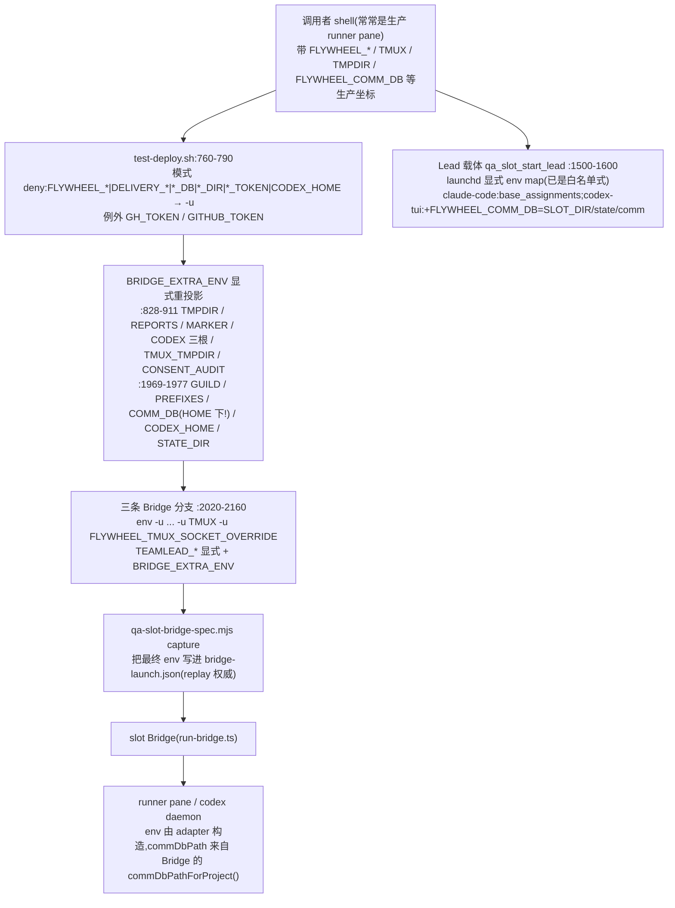

# FLY-2454 529 房 test slot 隔离洞修复 — 调研
Issue: FLY-2454 (https://linear.app/geoforge3d/issue/FLY-2454/529-房隔离-修两处-test-slot-隔离洞-test-deploy-走漏-resident-codex-三根-env-slot)
日期: 2026-09-09
基于: exploration.md

审计基线:`origin/main` = `d7b75c755`(2026-09-08)。所有行号以此为准。

## 1. slot 启动链:env 从哪来、到哪去



### 1.1 当前进 Bridge 的坐标清单(实测:本 runner 环境 + 脚本逐行)

调用者环境里会被 test-deploy 看到的坐标(2026-09-09 从本 runner pane `env` 取样,值已略):

`FLYWHEEL_AGENT_BACKEND` `FLYWHEEL_BRIDGE_URL` `FLYWHEEL_CALLBACK_PORT` `FLYWHEEL_CALLBACK_TOKEN` `FLYWHEEL_COMM_CLI` `FLYWHEEL_COMM_DB`(生产) `FLYWHEEL_EXEC_ID` `FLYWHEEL_INGEST_TOKEN` `FLYWHEEL_ISSUE_ID` `FLYWHEEL_LEAD_ID` `FLYWHEEL_PROJECT_NAME` `FLYWHEEL_RUNNER_STATE_DIR` `FLYWHEEL_STATE_DIR`(=`~/.flywheel`,注意没有 `/state`) `FLYWHEEL_WORKFLOW_SUBMISSION_EXPECTED` `TMPDIR`(runner-state 下的长路径) `TMUX`(生产默认 socket) `TMUX_PANE` `DISCORD_BOT_TOKEN` `DISCORD_STATE_DIR` `HOME`

逐项对照今天的处置:

| 坐标 | 今天 | 缺口 |
| --- | --- | --- |
| `FLYWHEEL_*` 全家族 | deny 后按需重投影 | 无(兜底网) |
| `FLYWHEEL_COMM_DB` | deny 后重设为 `${HOME}/.flywheel/comm/<slot-project>/comm.db` | Bridge 不读它;真正生效的 `FLYWHEEL_COMM_ROOT` 未设 ⇒ Bridge 走 `~/.flywheel/comm` 默认根 |
| `FLYWHEEL_STATE_DIR` | 重设为 `${SLOT_DIR}` | 无 |
| `TEAMLEAD_DB_PATH` | 显式 `${SLOT_DIR}/teamlead.db` | 无 |
| `FLYWHEEL_CODEX_*` 三根 / `CODEX_HOME` | 重设到 `${SLOT_DIR}/state/...` | 无 |
| `TMUX_TMPDIR` | 重设为 `${SLOT_DIR}` | 无 |
| `TMUX` | 三条分支各自 `-u TMUX` | 不在家族里,靠手写;`test-deploy-launch-boundary.test.sh` 有静态守卫 |
| `TMUX_PANE` | 未处理 | 走漏(当前无消费者) |
| `TMPDIR` | 重设为 `qa_slot_child_tmpdir` 短路径 | 不在家族里,靠手写 |
| `FLYWHEEL_DELIVERY_SECRET_PATH` | 重设 | 无 |
| `FLYWHEEL_KILL_LEDGER_ROOT` | 未设;`kill-ledger.ts:54-58` 回落 `FLYWHEEL_STATE_DIR/kill-ledger` = `${SLOT_DIR}/kill-ledger` | 位置对,但 teardown 随房拆 |
| `HOME` | 继承(必须) | Bridge 内 `homedir()` 硬编码的读者仍会看到生产 HOME(见 §3) |

### 1.2 Lead 载体侧

`qa_slot_start_lead`(`test-deploy.sh:1500-1600`)对两种载体都用**显式赋值列表**渲染 launchd manifest(`qa-launchd-env.py` 校验名字、拒绝 resolver-owned 名字、原子写),已经是白名单形态。差异只在 CommDB:

- claude-code 载体:`base_assignments` 不含 `FLYWHEEL_COMM_DB`,由 `claude-lead.sh:676` 无条件 `export FLYWHEEL_COMM_DB="${HOME}/.flywheel/comm/${PROJECT_NAME}/comm.db"`。
- codex-tui 载体:`codex_assignments` 显式 `FLYWHEEL_COMM_DB=${SLOT_DIR}/state/comm/${TEST_PROJECT_NAME}/comm.db`(`:1548,1558`)。

⇒ 同一间房里 Bridge(HOME 根)、claude Lead(HOME 根)、codex Lead(SLOT 根)**两套库**。

## 2. Bridge 侧全部破坏性原语与它们手里的坐标

kill-path-inventory(`packages/claude-runner/test/kill-path-inventory.ts`)把 runner-affecting 的 kill 限定在一组模块内;逐个核对它们的输入坐标:

| 原语 | 文件:行 | 经 `auditedSignal`? | 动手时握着的归属坐标 | 目标 |
| --- | --- | --- | --- | --- |
| Codex 孤儿清扫 `sweepCodexRunnerOrphans` | `teamlead/src/bridge/codex-runner-orphan-reaper.ts:435,711` | 是(`defaultSignalGroup`) | `candidate.socketPath`、`candidate.codexHome`、ledger 目录(`codexSessionStateDir(env)`) | pgid |
| MCP 子孙清扫 `reapMcpDescendants` | `mcp-descendant-reaper.ts:183` | 是 | 只有 pane pid;pane pid 来自 `runner-teardown.ts:29` plain `tmux display -p -t W '#{pane_pid}'` | pid |
| Codex daemon 进程组 `reapCodexDaemonForExecution` / `killTree` | `claude-runner/src/codex-daemon-runtime.ts:226,787,802,1000+` | 是 | `opts.socketPath`;ledger `session.json`(`codexSessionStateDir`) | pgid / pid |
| 精确窗口杀 `cleanupExactWorkflowTmuxWindow` | `tmux-lookup.ts:540-640` | 是(`auditedSignalAsync`) | `identity.socketPath`(显式 `-S`) | tmux-window |
| 默认窗口杀 `killTmuxWindow` | `tmux-lookup.ts:943-1001` | 是 | 无(plain `tmux`,解析靠 `TMUX_TMPDIR`) | tmux-window |
| cmux 链接会话杀 `killCmuxLinkedSession` | `tmux-lookup.ts:1011-1075` | 部分(`kill-session` 直接 exec) | 无(plain `tmux`) | tmux-session |
| scaffold 窗口清理 | `claude-runner/src/TmuxAdapter.ts:2149-2170` | 是 | 无(plain `tmux`) | tmux-window |
| TUI 窗口关闭 | `codex-runner-tui-window.ts:1233` | 是 | 无(plain `tmux`) | tmux-window |
| viewer / terminal reaper | `viewer-session-reaper.ts:150` `terminal-tab-reaper.ts:161` | 否(直接 execFile) | 无(plain `tmux`) | tmux-session(viewer) |

结论:

1. **pgid / pid 类**杀路在动手时都握着一个 slot 坐标(socket 或 ledger 路径),可以逐次校验。
2. **tmux 类**分两种:带 `-S socketPath` 的可逐次校验;plain `tmux` 的解析完全由进程 env 的 `TMUX_TMPDIR`/`TMUX` 决定,只能在**启动时**一次性校验(`TMUX_TMPDIR` 在根下、`TMUX` 为空)。plain 调用也可以顺手把 `#{socket_path}` 读出来作证据(同一条 `display-message` 多加一个字段,`tmux-lookup.ts:252-257` 已经在做 4 字段格式串),但这是加固而非必需。
3. 咽喉 `auditedSignal` 的输入类型 `AuditedSignalInput`(`kill-ledger.ts:18-26`)没有归属字段;结果联合 `AuditedSignalResult`(`:28-39`)的失败种类是 `invalid_target | ledger_failed | signal_failed`。ledger 行 `schemaVersion: 1`,消费者 `scripts/lib/kill-ledger-append.mjs:11-37` 只按位置字段写、不校验多余字段 ⇒ **追加可选字段不破坏 v1 读者**。

### 2.1 清扫器的 canonical inventory 守卫为什么挡不住 2231

`codex-runner-orphan-reaper.ts:426-428 isWithinSocketRoot()` 检查 socket 在 `FLYWHEEL_CODEX_DAEMON_SOCKET_ROOT` 之下;`canonicalHomeForExecution()` 检查 home 在 `FLYWHEEL_CODEX_HOMES_ROOT` 之下。两者的「根」都来自 env。env 被走漏 ⇒ 根就是生产根 ⇒ 守卫全过。这正是「输入被毒化,守卫按设计工作」。新守卫必须拿一个**不可能被同一次走漏毒化**的参照物:`FLYWHEEL_ISOLATION_ROOT` 由 test-deploy 直接从 `SLOT_DIR` 写入,不从 caller 环境继承(deny 家族 `*_ROOT` 会先删掉任何继承值)。

### 2.2 pgid 自保护现状

`codex-daemon-runtime.ts:985-1030 createDefaultKillGroup`:拒绝 `pgid <= 1`、`pgid === pid || pgid === ppid`、自己的 pgid。`kill-ledger.ts:64-80 mutationTarget`:拒绝 `target <= 1`。这些防的是「杀自己」,不防「杀别人的合法进程」。

## 3. CommDB 路径的全部推导点(镜像词汇盘点)

| 位置 | 推导方式 | 认 `FLYWHEEL_COMM_ROOT`? | 读/写 | 搬到 `SLOT_DIR/state/comm` 后 |
| --- | --- | --- | --- | --- |
| `teamlead/src/bridge/commdb-path.ts:19-27 commDbRootDir/commDbPathForProject` | `COMM_ROOT || COMM_DIR || ~/.flywheel/comm` | 是 | 读写(Bridge 权威) | 自动跟随 |
| `teamlead/src/bridge/actions.ts:117-121 commDbPathFor` | 同上(重复实现) | 是 | 读写 | 自动跟随;建议改调 `commDbPathForProject` |
| `teamlead/src/bridge/plugin.ts:11146-11148` | 同上 | 是 | 读 | 自动跟随 |
| `teamlead/src/lead-backends/codex/gateway/gateway-main.ts:158-159` | 同上 | 是 | 读写(Codex Lead gateway) | 自动跟随(需把 `FLYWHEEL_COMM_ROOT` 投影进 codex Lead env;`codex-lead-runtime.ts:1419` 已在转发名单) |
| `teamlead/src/bridge/commdb-probes.ts:33-36 openCommDb` | 硬编码 `homedir()` | 否 | 只读探针 | slot 下读到不存在的库 → `undefined`(静默假阴性)。改调 `commDbPathForProject`,生产等价 |
| `teamlead/src/bridge/commdb-session-prune.ts:39-43 resolveCommDbPath` | 调 `commDbPathForProject` | 是 | 读 | 自动跟随 |
| `flywheel-comm/src/resolve-db-path.ts:14-22` | `FLYWHEEL_COMM_DB` > `--project` → 硬编码 `homedir()` | 否 | CLI 读写 | runner/Lead 都带 `FLYWHEEL_COMM_DB`,`--project` 分支很少走到;仍建议 `--project` 认 `FLYWHEEL_COMM_ROOT`,生产等价 |
| `flywheel-comm/src/cleanup.ts:87-89` | 硬编码 glob `~/.flywheel/comm/*/comm.db` | 否 | 清理工具 | 不在 slot 路径上;不动,记账 |
| `inbox-mcp/src/index.ts:40-43` lease dir | `projectName ? ~/.flywheel/comm/<p> : dirname(commDbPath)` | 否 | 写 `.inbox-ready-<lead>` | 生产下两支相等;统一为 `dirname(commDbPath)` 字节等价,slot 下随库进 SLOT_DIR |
| `terminal-mcp/src/index.ts:41` | 硬编码 `homedir()` | 否 | 读 | 不在 slot 关键路径;记账,不动 |
| `teamlead/scripts/claude-lead.sh:676` | 无条件 `export FLYWHEEL_COMM_DB=${HOME}/...` | 否 | Lead 读写 | 改 `${FLYWHEEL_COMM_DB:-${HOME}/.flywheel/comm/${PROJECT_NAME}/comm.db}`;生产 wrapper 不设该变量 ⇒ 等价(七个 `run-codex-lead-*.sh` 已是这种写法) |
| `teamlead/scripts/claude-lead.sh:2366` | 同上(第二处) | 否 | 读 | 同上改法 |
| `scripts/test-deploy.sh:1729 LEASE_DIR` | `${HOME}/.flywheel/comm/${TEST_PROJECT_NAME}` | — | 等 lease | 改为 `${SLOT_DIR}/state/comm/${TEST_PROJECT_NAME}` |
| `scripts/test-deploy.sh:1973` | `FLYWHEEL_COMM_DB=${HOME}/...` | — | 摆设 | 删,改设 `FLYWHEEL_COMM_ROOT=${SLOT_DIR}/state/comm` |
| `scripts/test-teardown.sh:1124 COMMDB_DIR` | `${HOME}/.flywheel/comm/${PROJECT_NAME}` | — | 归档/删 | 改为 SLOT 根;保留对旧 HOME 路径的**只读**检测并告警(过渡:旧房残留) |

生产等价性论证:每处改动都是「env 未设 ⇒ 表达式求值与今天逐字相同」;生产 wrapper(`~/.flywheel/bin/flywheel-lead-wrapper.sh`)与 launchd plist 不设 `FLYWHEEL_COMM_ROOT` / `FLYWHEEL_COMM_DB`(plan 里列为实现期必核项,不是假设)。

## 4. 现有测试资产与 CI 位置

| 资产 | 覆盖 | 可复用点 |
| --- | --- | --- |
| `scripts/__tests__/test-deploy-fly1389.test.sh`(CI Script Tests) | hermetic 起真 slot Bridge(stub lead/gh/tmux),从**活进程 env dump** 断言隔离(FLY-2284 15/15) | 新增断言:`FLYWHEEL_ISOLATION_ROOT` / `FLYWHEEL_COMM_ROOT` 出现且值在 SLOT_DIR 下;`~/.flywheel/comm` 字面不再出现 |
| `scripts/__tests__/test-deploy-launch-boundary.test.sh`(CI) | 三条分支静态契约(`-u` 计数、deny 家族字面) | 改为断言契约文件被消费且 inline 坐标赋值为零 |
| `scripts/__tests__/test-deploy-generalized.test.sh:942-995`(CI) | **真 detached socket holder + 真 lsof + pgid reap 正向夹具** | 阴性对照的「像孤儿」诱饵直接抄这个配方 |
| `packages/teamlead/src/__tests__/tmux-lookup.real-tmux.test.ts`(CI Unit) | 真 tmux 服务器(私有 socket)起窗口 | 2287 形状的「生产侧」诱饵窗口用同款起法 |
| `packages/claude-runner/test/kill-ledger.test.ts` / `kill-path-inventory.test.ts` | ledger 合同 / kill 路径清单 | 新字段与新失败种类在此加合同;inventory 新增 boundary 模块分类 |
| `packages/teamlead/src/__tests__/close-runner.test.ts` `crash-reaper.test.ts` | 现有 kill 序列 mock 测试 | 回归:生产模式下(无 root)零差异 |
| `scripts/__tests__/ci-shell-suite-enumeration.test.sh` | 新 shell suite 必须登记 ci.yml 或 manual-only | 新 shell suite 必须加进 `ci.yml` 相应 job |

CI 事实:Unit job `ubuntu-latest` 已 `Ensure lsof/tmux`(`ci.yml:181`);Script Tests 分 5 个 job 枚举 shell suite,`test-deploy-*` 在 job 1/5 与 launch-boundary 段(`ci.yml:556-640`)。

## 5. 归属证明方式的实测

| 方式 | 实测(2026-09-09,本机 macOS 25.6.0,runner shell) | 结论 |
| --- | --- | --- |
| `ps -Eww -o command= -p <pid>` / `ps eww -p <pid>` | 对自己的 shell 也返回 0 个 env 项 | macOS 下不可靠(沙箱/加固运行时会屏蔽);`qa-launchd-lead.sh:301-330` 同款探针只在 `/proc` 可读时稳 |
| 祖先链 `ppid` 回溯 | Codex daemon `detached:true`(`codex-daemon-runtime.ts:980`)、tmux 服务器 daemonize,均 ppid=1 | 对关键目标失效 |
| 路径归属(`realpath` 后前缀比较) | `qa-reap-codex-slot-daemons.mjs:29-44 ownedDirectory()` 已这样做,并注明 macOS `/tmp`→`/private/tmp` 要 lexical 与 canonical 分开用 | 采用;沿用同一比较规则 |

## 6. 与 FLY-2352 演练的耦合点

演练 = 在 slot 起 Codex 体 → 重启 slot Bridge(`scripts/test-cycle-bridge.sh`,FLY-2237 slot-only cycle 原语)→ 看 reown。cycle 的 replay 以 `bridge-launch.json` 为 env 权威(`qa-slot-bridge-spec.mjs capture`),所以新坐标只要进 `BRIDGE_EXTRA_ENV` 就会被 capture,重启后仍在。启动自检在 replay 时同样跑 ⇒ 演练里的每一次 Bridge 重启都会重新证明边界。

## 7. 真机快照法(供 QA 与文档)

```bash
# 生产 Codex 舰队(pid pgid etime socket),排序后比对
ps -axo pid=,pgid=,etime=,command= | grep -E '(^|/)codex app-server' | grep -v grep \
  | sed -E 's/.*--listen[= ]unix:\/\/([^ ]+).*/\1/' | sort
# 生产默认 tmux 服务器的窗口清单
tmux -S "/private/tmp/tmux-$(id -u)/default" list-windows -a \
  -F '#{session_name}|#{window_id}|#{window_name}' | sort
```

前后逐字 diff 为空 = 舰队与窗口零变化。诱饵窗口(`tmux new-window -d -n fly2454-decoy`)必须在两次快照里**都在**。注意生产 runner 在窗口期内自然完成会让 tmux 清单变化,那类差异要能用生产 StateStore 事件解释,且 slot kill ledger 里不得有对应目标。
