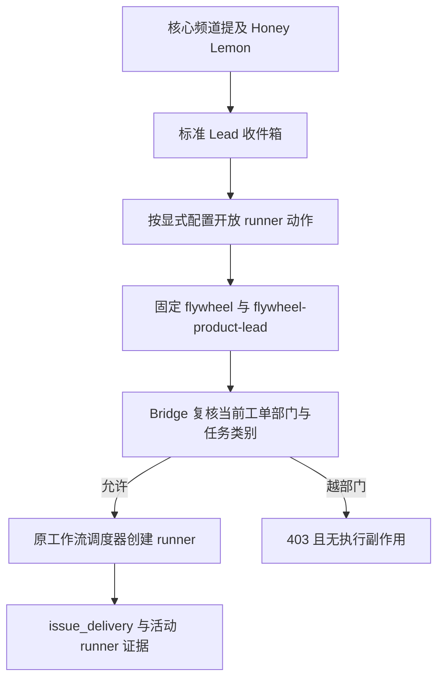
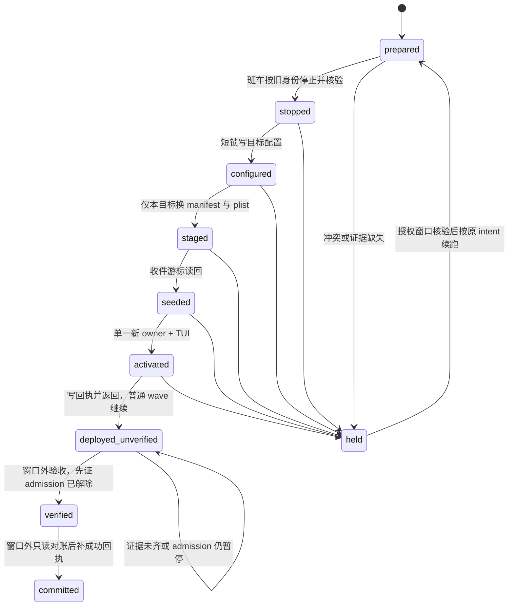

# FLY-2459 Codex 部门 Lead — 实施计划
Issue: FLY-2459 (https://linear.app/geoforge3d/issue/FLY-2459/2441-能派-runner-的部门-lead-跑-codex-后端补-codex-lead-动作面的-startmanage-runner)
日期: 2026-09-10
基于: research.md

状态: R2 有效 design review APPROVED（2026-09-11T02:23Z；request cd1accb0-b633-4867-be9c-cab0918b2e9a）。本文件是已批准设计，尚未实现或迁移生产。

## 1. Founder 概览

让 Honey Lemon 在同一身份和频道里，用 Astra/high 思考并派出产品 runner，同时保留原部门闸、审批规则和重启授权。

Lead 是部门负责人，runner 是被派去执行具体工单的工作进程。Codex backend 是运行该负责人的软件引擎；换引擎仍保留 Honey Lemon 原来的 bot、部门、频道与任务责任。TUI 是 founder 能在 cmux 中看见并操作的终端界面；生产继续使用它。

三个交付：显式开启的 start/list/status/read/send/respond 动作；可审计、由既有班车执行的手动迁移；真实核心频道 @ 后派单的逐跳证据。管理台显示配置事实，并给出受控迁移指引。跨厂商在线切换仍由现有写入端拒绝，本单不伪装已经提供一个安全切换按钮。



### 1.1 关键选择

| 决定 | 理由 | 拒绝的替代方案 |
|---|---|---|
| 新增 `codexRunnerActions` 显式开关 | canSpawnRunners 历史缺省为 true，不能代表新能力授权 | 给全部 full-access 或部门 Lead 自动加工具 |
| 一份 runner 工具实现，两个已有 MCP 挂载点 | Honey Lemon 走 full-access/lead_actions；旧受限 gateway 不是她的入口 | 仅编辑 action-surface 名字清单 |
| 工单允许的受控手动切换 | 通用 launcher 已存在，跨厂商事务尚不存在 | UI 解禁后直接 restart；仅换模型名 |
| canonical `gpt-6-astra` + high | `astra` 是别名，当前 runtime 原样传 model | 把 Lead 切换误写成 runner 模板变化 |
| start 的 pending/unknown 明确保留 | Bridge 可先启动再返回 202/409 | 将所有非 2xx 当作未启动并重发 |

### 1.2 范围与完成证据

设计节点完成 = 三篇 DOC-FLOW 文档、评论 HTML、有效 APPROVED、commit/push、发布/报告、phase_design_complete。整个 issue 的完成还需要后续代码测试与获授权的生产验收，不能用设计完成替代。

不改 tpl_code/tpl_simple_code 或 implement 模板；不改 R1/R2/R4、部门路由语义、founder 四类保留 review/ship checkpoint、不增加 merge/terminate/retry/close 普通工具、不建新调度器、不启动 headless 生产 Lead。本节点不实施，不操作生产切换或测试发信。

## 2. 配置、身份与单一能力解析

### 2.1 数据合同

在 `packages/config/src/codex-lead-capabilities.ts` 新建无 I/O 的 resolver，经 `packages/config/src/index.ts` 导出。`ProjectConfig` 在原始类型校验之后调用，其他 TS 消费者使用同一函数；shell 只读取同一 resolver 的 selector JSON 输出。

```ts
type CodexLeadCapabilityInput = {
  backend?: string;
  codexProfile?: string;
  companion?: boolean;
  external?: boolean;
  canSpawnRunners?: boolean;
  codexRunnerActions?: boolean;
};
type CodexLeadCapability = {
  eligible: boolean;
  runnerActionsEnabled: boolean;
  reason: string | null;
};
```

规则逐行固定：

1. `codexRunnerActions` 缺省/false 不启用；非 boolean 拒绝。禁止字符串、truthy、环境自动猜测。
2. true 要求原始配置显式 `canSpawnRunners === true`、`companion !== true`、`external !== true`、显式 profile 为 write-capable/full-access；原始 canSpawn 缺省不能被后续归一化误当显式授权。ProjectConfig 在 normalization 前记住 presence 并校验；resolver 对原始 row 调用。
3. 旧的非派 runner Codex Lead，保持原 recognized-tier 准入；派 runner Codex Lead 仅在规则 2 成立时 eligible。PM/triage/external 等原校验仍独立执行。
4. effective runnerActionsEnabled = backend 为 codex-app-server 且规则 2 成立。Claude 可存符合规则 2 的 dormant 开关，仍没有新增 Codex 工具。
5. 缺 profile + companion=true 的旧兼容行为保持；companion 绝不因新开关升级。非法配置 fail closed，不回落默认 profile。

Honey Lemon 的 profile 是可配置项：迁移 planner 接收可选 `--codex-profile`，缺省沿用现有 Codex Lead（稳定键 codex-infra-bot-lead）的 launcher/profile 解析方式，不新增 Honey Lemon 专用默认。当前 infra TUI 与标准 generic launcher 都使用 full-access（分别为 run-codex-infra-bot-tui.sh:75 与 flywheel-lead.sh:170）；实现将现有默认抽为共享 resolver 供 planner/launcher 消费，不依赖跨 Lead 的生产配置值动态授权。当前解析结果为 full-access，因此下列是当前默认候选，需 planner 展示并经现行 launcher preflight 校验；planner 在生成任何 intent **之前**拒绝非 full-access 的当前 generic TUI/profile 组合，零 intent、零配置写入；不能把失败拖到停旧 owner 以后，也不能静默换 profile。可配置指使用公共 profile 参数/解析合同，不承诺本单增加 generic TUI 可用档位。最终只改本 row 的以下字段，其他字段保持：

```json
{
  "backend": "codex-app-server",
  "codexProfile": "full-access",
  "model": "gpt-6-astra",
  "effort": "high",
  "canSpawnRunners": true,
  "codexRunnerActions": true
}
```

`projectName=flywheel`、`agentId=flywheel-product-lead` 是稳定身份；显示名、botUserId、botTokenEnv、department/labels、chat/roundtable、summary role、project root、Discord stateDir 均不改。alias 只在边界经现有模型 registry 解析，持久化 canonical ID；Astra 的 Lead high 不从 runner 的 xhigh 默认推导。当前模型 registry 无 Astra lead surface，本单手动路径不新增可选菜单或改变其他 surface；只读显示用现有 getModelRegistryEntry 的 canonical label。

### 2.2 完整消费者清单

- `packages/teamlead/src/ProjectConfig.ts`：新字段、raw 校验、旧准入替换。
- `packages/teamlead/src/bridge/fleet-capabilities.ts`：isCodexEligible 委托；旧 `GPT-5` 固定 Codex 只读条目改成该 Lead 实际配置的 canonical model/effort 投影；未知历史 ID 只读原样显示，不当可写目标。
- `packages/teamlead/src/resident-codex-lead-roster.ts` 与 `scripts/resident-codex-lead-recover.sh`：已审计但本单不改。它们还要求 codexResidencyPatrol=true，recover 仅认 Mufasa/InfraBot 专用 wrapper，不适用于 generic carrier。Honey Lemon 不设置 patrol 开关；其存活保障是现有 launchd KeepAlive 和普通 restart wave，不声称获得专用 residency 自愈。
- `packages/flywheel-comm/src/lead-identity.ts`、`commands/lead-identity.ts`、`commands/lead-registry.ts`：能力只放在 **IdentityLeadRow/selector/env 的独立投影**，不向 CanonicalLeadIdentity 增加任何 capability 字段，且不改 v1IdentityDigest 的字段集合、序列化顺序和 schema version。explicit flag 从 raw row 解析，selector 输出 eligible/enabled；CanonicalLeadIdentity 原字节结构不变。新增回归用一组既有多 Lead fixtures 比较升级前后 identityDigest 逐字节相同；即使新开关置 false/缺省也不能多出 digest 字段。Honey Lemon 唯一预期 digest 变化来自原本就参与摘要的 backend 改动，且发生在其旧 owner 退出之后。
- `packages/teamlead/scripts/lib/canonical-lead-identity.sh`：导出 `FLYWHEEL_CODEX_LEAD_RUNNER_ACTIONS=0|1`，继承值与 registry 不一致拒绝；launcher 清理 ambient 后再导入。
- `scripts/lib/lead-restart-lifecycle.sh:558–571`：generic 分支使用已验证 selector 的 eligibility 替换 canSpawn=false 条件；保留 backend、full-access、root、argv、PID/start、manifest、R4 所有其他条件。
- `scripts/flywheel-lead.sh:170,230`：当前 profile export 与 selector gate，连同 lifecycle.sh:566 的 full-access 条件，均纳入 planner 兼容性检查；当前非 full-access 的迁移候选在 planner 即拒绝。继承清洗、preflight 显式开关和运行材料一致；新建 row 默认不加开关。
- `packages/teamlead/src/bridge/fleet-console-model.ts` 与 `management-topology-source.ts`：正确只读模型和迁移原因；现有 frontend 按 server fields 渲染，不复制准入策略。

### 2.3 环境、凭证与租约

runtime/MCP 在启动时从选定 registry source 的精确 project/lead key 重读能力，与 canonical identity/env 比对。每次 runner tool 调用再重读并要求仍 enabled、backend/profile/identityDigest 未变化；关闭开关后旧 inventory 即使仍显示，调用也拒绝，无 HTTP/DB 副作用。重新启用需受管重启以更新 inventory。

共用已有 canonical identity builder，而不是在 tool 参数或新 JSON 中拼授权字段。传递完整 `authorizeLeadWrite` 所需非秘密身份字段：project、Lead、leadKey、backend、summaryRole/duty/granularity/assignmentDigest、discordStateDir/botUserId、identityDigest、projects path，以及现有 carrier/lease 环境合同。保持当前 lease mode 和验证；没有 context 的 child 启动失败。

`write-capable`：canonical 非秘密 context 由 runtime 的受信 MCP 配置注入；需要的秘密/carrier bearer 继续走既有 secret broker 内存通道（扩展 broker typed payload），不得放模型 shell 环境/配置文件/工具响应。`full-access`：使用既有 env_vars 名字转发与 canonical context builder；不新增网络/本地权限，也不声称 full-access 被完全隔离。

Bridge runner 动作需要 `BRIDGE_URL`/`TEAMLEAD_API_TOKEN`；direct outbound 同时开启时 credential name 集合是原 Discord 名字与 Bridge 所需名字的并集，bridge outbound 维持原 Bridge 名字。off/direct 保持原行为。runtime、TUI daemon 白名单、MCP builder、配置 renderer、validator 使用同一所需名字集合；缺凭证 fail startup，无 direct fallback。

## 3. Runner 工具合同

新建 `packages/teamlead/src/lead-backends/codex/runner-actions.ts`，导出工具描述、strict schema、expected names 和注册函数，两个入口共用。base tools 不改变；只在 enabled 时追加以下六个名字：

| 名字 | 模型可传字段 | 结果 |
|---|---|---|
| start_runner | issueId、taskCategory、idempotencyKey | started/pending/refused/unknown 与 safe IDs |
| list_runners | mode=active/live/recent_terminal/recent/stuck，缺省 active | 本项目本 Lead session 摘要，最多100条，truncated |
| get_runner_status | executionId | session lifecycle + pane 状态，明确二者来源 |
| read_runner_tmux | executionId、lines=1..200，缺省80 | 最多32KiB文本及 truncated |
| send_runner | executionId、text、idempotencyKey | queued、instructionId、executionId |
| respond_runner | questionId、answer | queued 或 existing responseId |

所有 schema 拒绝额外字段。issueId 使用既有 Bridge identifier/UUID 解析，executionId 必须 exact execution ID（UUID），questionId 为 UUID；idempotencyKey 1..128 ASCII `[A-Za-z0-9._:-]`；text/answer 非空、最多8000 UTF-8 bytes，拒 NUL。taskCategory 的规范类型来自 `work-kind.ts`，但模型可选项/描述必须由 `resolveLeadMenus({projectRoot, leadId})` 的本 Lead 已采纳菜单投影，不展示整个全局目录。Honey Lemon 当前为 prd / product_design_flow / prototype（`.flywheel/menus/adoption.yaml`）；不能把这三个值硬编码成新表。startup 生成 schema，调用时重读同一 resolver；移除/未采纳/解析失败时工具侧拒绝且零 HTTP，新采纳项可在下次 MCP 配置重建后出现。Bridge 原菜单校验继续兜底。HTTP 15s abort、响应最大256KiB，非 JSON/超限为 unknown；不用 shell 拼接请求。

### 3.1 Start

发送唯一现有接口：

```ts
POST /api/runs/start
{
  issueId,
  projectName: trusted.projectName,
  leadId: trusted.leadId,
  sessionRole: "main",
  taskCategory,
  idempotencyKey: "codex-lead:" + sha256(JSON.stringify([
    trusted.projectName, trusted.leadId, issueId, idempotencyKey
  ]))
}
```

request 中不允许 model/effort/templateId/agentName、freshStart/resume/quotaRecovery/internal context、owner 覆盖。docTier 使用 Bridge 现有 default full；若业务菜单要求其他档位，后续按同一菜单合同增量设计，不能绕过菜单。

由 Bridge 查当前 Linear labels 与 DepartmentRegistry；不改 403 语义或 flag。工具 startup/call-time 显式能力是受管工具边界，Bridge 的现有 API token/部门检查是调度权限边界，本单不把 shared API token 描述成新的 Lead 专属凭证。

结果 allowlist 只投影 outcome/httpStatus/code/executionId/workflowRunId/workflowNodeId/issueId/idempotencyKey/retryAfterSeconds，错误正文只保留有限非秘密解释。2xx 且 success=true 为 started；202 LAUNCH_PENDING 为 pending；400 参数/菜单验证、401/403 和明确 start 前部门拒绝为 refused。429 且匹配 Bridge admission 的 typed reason 是确定的未派发 refused，投影有效整数 Retry-After 为 retryAfterSeconds，可稍后以原 key 再调用；wrapper 仍不自动 POST。未识别的429/409、5xx、timeout、malformed、断线均 unknown，保留任何已回 executionId。404/502 若没有可核对的 start 前 typed code 仍保守 unknown，不靠错误自然语言猜测阶段。绝不复用 retry 专用 mapHttpDispatchOutcome。

**重试政策**：wrapper 不自动再次 POST；pending/unknown 返回原 key 和只读核验建议。同业务 request 必须保存并重用原 key；Bridge start reservation 为唯一持久事实。若已找到本 issue 活动执行，转状态/消息管理，不换 key 再起。人工/Lead 确认需要新业务执行，且原 run 已结束，才能以新业务 key 启动；不提供绕过操作。相同 key 携不同 issue 会派生不同 scoped key；同 issue/key 的 taskCategory 冲突已由现有 canonicalSubmissionDigest（含 taskCategory/categorySource/tier）+ claimWorkflowRouteDecision 产生409 WORK_KIND_ROUTE_DECISION_CONFLICT，位于 priorResponse 重放之前（runs-route.ts:3115–3163，StateStore.ts:31115–31130）。本单 **不修改 runs-route.ts 或 StateStore 的调度/重放逻辑**，只增加该既有合同的回归证据。

验收同时观察 Bridge start 请求身份、workflow reservation、`issue_delivery` 与 live execution；started response 单独不足以证明端到端。

### 3.2 Read scope

先以 trusted project/Lead 过滤 session，再触达 detail/capture/status。list API 的 leadId 不是跨项目防线；输出每行再次检查 `session.project_name===trusted.projectName && matchesLead(session, trusted.leadId, freshProjects)`，unknown config 拒绝。detail GET 按 exact executionId，响应 execution_id 必须相同，禁止 issue alias fallback。

抽出共享 `resolveScopedRunner`：从受信 StateStore 的只读查询获取 exact session（已有 gateway 使用的 DB/lookup 模式），验证 project、matchesLead、executionId 后才调用 Bridge 状态/capture；参数化 SQL、只读 DB、finally close。不能为读状态新建写数据库实例。session identity/project/labels 在调用前重验，捕获数据最多32KiB，列表仅 issueId/executionId/status/role/backend/updatedAt，不输出路径/env/credentials。

### 3.3 Send / Respond

共用既有 Comm helper，禁止 tmux send-keys、二套 mailbox、自由选择 dbPath、冒充 actor。

- `commands/send.ts` 增加可选稳定 `instructionId`；现有调用不传时仍 randomUUID。新增 package subpath export `flywheel-comm/send`；原 CLI 无删除/重命名。ID 从 project/lead/executionId/idempotencyKey 的固定 canonical JSON hash 派生 UUID。相同 sender/recipient/content/provenance 返回原 ID；冲突抛错；发生重启导致 provenance 不同也明确冲突，不伪称去重成功。插入与 declared-state 清理同一个 CommDB 事务，重放不额外改变已消费 runner 的状态。
- 模型给 text 原样作为普通指令，`fromAgent`/`toAgent`/dbPath 来自 canonical context 和 exact scoped session。先调用现有 authorizeLeadWrite，事务内维持同一 sender provenance 检查。`queued` 只证明落库；消费证据走既有 mailbox 状态。
- respond 先读取真实 question，要求其收件 Lead 与本身份一致，owner 是本项目本部门的 exact execution；将 expectation（owner/checkpoint 或 expectNoCheckpoint）交给既有 `respond` + guardedResponse，最后事务再次核验。四个保留 checkpoint 全拒绝：approve_to_ship/review_design/founder_review/review_code；stop report、已关闭/过期/改属问题同样拒绝。普通 answer 不能落 founder approval 表。
- 不改变既有 request_runner_lifecycle/relay_ship_decision 或 verifyApproval/verifyLifecycleConsent。自然语言建议不成为 R1/R2/R4 授权。

### 3.4 注册、库存与 profile

`action-surface.ts` 导出 base gateway set + conditional runner names。`gateway/gateway-main.ts` 与 `lead-actions/lead-actions-main.ts` 使用同一 registerRunnerActions；未开启时不注册，手动调用未知名称也拒绝。基础 sets 不变。

`write-capable` headless 的 gateway allowlist、既有真实 inventory、dry-run 必须来自同一 resolver；该既有 live inventory 的 missing/extra/empty 继续 fail closed。

**full-access（尤其生产 TUI）只使用现行静态配置闸，不增加启动期活体 inventory/ready watcher，也不等待首条业务消息之前的工具 advertisement。** `codex-lead-tui-runtime.ts:573–577,689–697` 已记录 MCP 每轮临时拉起、旧 watcher 曾30s误超时拆掉 Mufasa。保持这个运行时决策：main() 在 daemon 启动前用 assertFullAccessLeadActionsConfigGate + assertFullAccessSandboxConfig 核对可信 command/args/env/env_vars/enabled_tools；enabled_tools 从新共享清单精确生成，缺项/多项在静态配置层拒绝。服务端注册单元测试证明配置清单与注册一致，child 的每次 handler 仍执行 capability/identity 校验。首轮六工具实际调用证据属于窗口外 QA；没有启动期 inventory 是正常，不因空广播拆 Lead。新工具运行失败必须报告未验收，不能靠启动期伪 ready 通过，也不扩大 full-access 内置工具限制。

`lead-actions/mcp-config.ts` 去掉固定两工具断言，增加 conditional enabled_tools。`codex-lead-tui-home.sh` 用新小型 trusted TS CLI（`packages/teamlead/src/bin/render-lead-actions-config.ts`）输出现有配置片段；同一 builder 服务 headless/TUI/renderer，避免 Python 再复制名字/credential 列表。stdout 仅非秘密 config 与 credential 名字，原 auth 文件不读出。

Lead 行为文档在 `packages/teamlead/lead-rules-base/` 新增 `codex-runner-actions.md`，由现有 bundle 编入；说明 taskCategory 查询、原 key 保存、queued 语义和保留门。不要更改 runner 模板。

## 4. 受控手动迁移与回滚

### 4.1 实施形状

新建 `scripts/lib/lead-backend-migration.sh`（source-only），在 `scripts/restart-services.sh` **既有 updater reason、restart lock、R4 授权和 admission pause 成立之后，普通 Lead census/restart wave 之前**调用。该临界区调用只执行 prepared 到 activated，写 deployed_unverified 回执后有界退出，绝不等待人工 @、新 runner admission 或 verified/committed。迁移仅消费 `~/.flywheel/lead-backend-migrations/FLY-2459-honey-lemon.json` 的经过验证 intent；该路径无 watcher、无 QueueDirectories、不能唤醒 updater。没有有效 intent 则无操作。

新增 `packages/flywheel-comm/src/lead-backend-migration.ts` 和对应 CLI command `lead-registry plan-backend-migration --project flywheel --lead flywheel-product-lead --to-backend codex-app-server --model gpt-6-astra --effort high --runner-actions --out <intent>`，可选 `--codex-profile`；缺省使用上述现行解析，当前 generic TUI 只接受 full-access，其他值在创建 intent 前拒绝。只生成候选/非秘密摘要，不写 registry、不启动服务。`apply` 不作为 runner/Lead CLI 暴露：由受信 source-only helper 调内部编译入口执行每步持久化。已有独立 updater 是唯一生产执行者，原定时/urgent ticket 消费规则不变；intent 不是重启授权，普通 `--reason`/环境标记也不构成 R4 权限。

intent v1：migrationId、issue、exact Lead key、expected deployed commit、目标六字段、expected 当前目标 row/manifest/plist hashes、createdAt、phase、每阶段 evidence。receipt 不含 tokens/auth/密钥内容；registry 只保存本 row 非秘密字段和摘要，其他数据不备份到 artifact。文件/目录 0600/0700，拒 symlink、非法 key/path、额外字段、无法匹配的 deployment SHA；仅本 issue/目标的首次迁移受支持，其他目标给明确 unsupported。

实现同时将 helper 加入 `scripts/package-onboard.sh`、`scripts/package-onboard-files.allow`、`scripts/converge-flywheel-bin.sh` 所有相关 FILES 清单 **及 `is_first_adoption_name()`**，名称准确为 `lib/lead-backend-migration.sh`。首次安装无 adoption marker 必须正常 adopt，不触发 bin_integrity_drift severe；已有受管文件真漂移仍拒绝。测试确认编译后的内部 entry 和脚本均可用。不得留下只在源码 checkout 能跑的路径。

### 4.2 状态机与崩溃恢复



每一步先在 receipt 写入 step-intent 并 fsync，再做副作用，再读回写完成记录。中断后先观察真实 registry/plist/process/cursor 并匹配 pre/postimage，不能单凭 phase 文件猜成功。held 只描述迁移状态；下一次既有授权窗口处理，不新增自动重启/无限内部重试。

| 阶段 | 精确动作 | 必须拒绝/恢复行为 |
|---|---|---|
| prepared | 确认依赖代码已部署、独立 Codex home 已有 auth 文件且不读取内容、full-access/TUI preflight、所需 Bridge credential 在实际进程可解析、同 bot identity、当前 summary verify-activation、所有订阅频道清单和可核对 cutoff、无未决副作用；写非秘密 preimages | 缺账号登录由部署责任人处理；当前节点不登录。不能证明未知待办处理状态则保持旧 owner，不进入停机 |
| stopped | 在 registry 仍是旧 backend 时用既有 lifecycle helper 停旧 owner；核对 label、PID、start time、argv、旧 lease 与退出；阻止旧单元被 KeepAlive 复活 | 不确认退出不得修改 registry/启动新 owner；停止使用原授权，不接受 intent 自身授权 |
| configured | 取得 `${PROJECTS_FILE}.cfglock`，重读 fresh registry/summary receipt；只 CAS 目标 row expected fields，校验候选完整配置，atomic temp+fsync+rename+dir fsync；释放短锁；前后 summary assignment digest 应完全不变且 verify-activation 通过 | 不拿配置锁等待重启。其他 row 并行变更可保留并重新计算候选；目标 row 冲突保持 stopped/held，不全文件覆盖或重建 summary receipt |
| staged | 在 restart lock 内，用选中 row 生成一个目标 manifest/plist 临时文件；核对旧文件 preimage/label/carrier 已停止，备份该目标普通文件后逐个 atomic replace；每个替换写检查点 | 不调用全局 materialize --force，不让 generic install 覆盖异构 plist。部分替换根据 hashes 续跑，未知内容拒绝；对同 label 的非本目标文件永不覆盖 |
| seeded | 复用 seed-lead-inbound-cursor 编译工具，给 migrationId/writerStopped/empty unresolved/逐频道 last confirmed message；覆盖 chat 与 #flywheel-core 及所有实际订阅频道，读回 digest | writerStopped 必须有 stopped 实测证据；缺 cutoff 不 baseline latest。已存在推进 cursor 不倒退。旧 Claude sessionId 不变成 Codex threadId |
| activated（窗内终点） | canonical identity 重新 mint（backend 改了 digest），旧 carrier/lease 已退出；现有 preflight + generic install/load 单一新 job，恢复到可见 TUI；只核对配置、进程身份及 carrier 基本启动证据；写 deployed_unverified 后返回0，让普通 wave 继续并按原流程释放 admission/restart lock | 不使用 headless 代验收；不调用 start、不等 @、不做 TUI live inventory。正常 wave 对已迁移目标按本次已核验 activation 回执避免再启动；其他 Leads 仍按原规则处理。真启动失败写 held/错误回执，走既有清理/恢复流程，不吞异常 |
| verified（窗口外） | QA/部署验收责任人先确认原 restart wave 已结束，GET /api/admission/pause 得到 ok=true、admissionPause.active=false；再按已获验收授权进行真实 @/派单/403、model/effort与pane取证，并在下一次获授权班车重启后复验 | admission仍active/未知就等待，不自行resume，不发测试start，不改变租约；证据不齐保持 deployed_unverified，不持restart lock，不阻碍部署。实际 @/runner 操作只由验收责任人执行 |
| committed（窗口外） | 新只读对账入口 `lead-registry verify-backend-migration --migration <id> --evidence <file>` 核验 exact Lead key/deployment/目标文件hash、真实source/delivery/run/node/activation/issue_delivery和进程证据；在迁移目录专用短锁下CAS更新本 receipt 为 verified/committed；不调用start、restart、resume、registry mutation | 输入只提供证据ID，核验器从现有权威状态读取并匹配，不能信任用户文件自称passed。无效或不齐不改成功状态。相同 evidence digest 重复调用幂等；不同证据冲突明确拒绝。写失败保留intent，后续同命令只读核对后补receipt，不等下个重启窗、不重复派单 |

窗内helper与窗口外verifier是不同入口；后者只写本任务证据，不是部署/派单授权，也不会打开 R1/R2/R4。既有 admission resume 只由原 owner-qualified流程执行（restart-services.sh:3391）；即使该流程保留pause，迁移也能正常结束为 deployed_unverified，后续验收等待其实际解除。

普通 updater 只在 deployed-sha 落后才做 scheduled restart：新 helper 不能增加“只改配置也唤醒班车”的第三种触发。发布此实现的正常部署窗可消费已准备 intent；若错过该窗，等下次正常部署窗或走现有 founder urgent 票，不能自行 kickstart。

### 4.3 游标与回滚

切换前建立对每个频道连续“已处理完成”的 message prefix；它不是最后收到的 message。若无法从已有 ACK/输出回执核实 Claude 最后处理边界，部署责任人先在旧 owner 活着时完成待办对账，再停；仍有不明副作用就 held。不导入 Claude 会话文件、不清空 mailbox、不补造 ACK。停机窗口选一个既有真实消息或获授权的无副作用标记，启动后证明该 sourceMessageId 被标准收件链消费。

失败默认 held，不自动回滚或继续发新业务。授权班车的回滚先停/确认新 owner 退出，且只在当前目标字段/manifest/plist 仍匹配本 intent postimage 时恢复旧目标字段和旧 carrier 文件；CAS 保留其他 Lead 的改动。后端 identity/lease 重新按旧 registry 建立，旧会话仅在确认身份相容后恢复。若新 Codex 已消费消息/派 runner，保留这些业务结果和新游标证据，先对账再恢复旧 owner；不能倒退 cursor、删 runner 或恢复旧全库备份。无法形成连续消费边界就保持 held，让原停止/灭火路径仍可用。

### 4.4 管理台与手动路书

新增 `engineering/doc/FLY-2459-codex-department-lead/honey-lemon-cutover.md` 由 implement 填入最终可执行 CLI、部署 SHA 和证据表。管理台 backend reason 改为“跨厂商切换需受控迁移：先生成迁移计划，由 updater 班车执行”，链接该已合入 runbook。保留 backendWritable=false、同源/loopback/CSRF 和写端拒绝。两套 fleet 展示都用实际 configured backend/model；文案说明“配置值，生效以进程验收为准”。HTML 插值 escape，链接只接受固定 repo-relative 文档目标，运行时用 textContent。

## 5. 实施分块与验证

每块依次：新增行为失败用例 → 定向运行确认失败原因 → 最小实现 → 定向绿 → commit。不要从根 `pnpm test` 触达 macOS tmux 测试。本文无已运行产品测试的声明。

| 块 | 文件/操作 | 红灯与绿灯判据 |
|---|---|---|
| A 能力 | config 新 resolver/export + ProjectConfig/fleet/IdentityLeadRow/selector/canonical shell/generic lifecycle (§2.2) | explicit true 正例；missing/false/字符串/companion/external/PM/implicit canSpawn 负例；全部非目标 Lead identityDigest 逐字节不变；shared准入输出同一真值表；generic不获得专用residency覆盖；planner非full-access零intent拒绝 |
| B 工具链 | runner-actions 新模块 + gateway/main + lead-actions/main/config/mcp-config + 两 runtime + TUI renderer CLI + auth/broker typed context +规则文档 | 两挂点六工具同 schema/handler；off 两/五工具不变；write-capable既有live inventory缺/多/空拒绝；full-access/TUI静态配置缺/多拒绝；TUI启动无advertisement仍正常存活，零live-ready等待；新旧配置/身份/lease 冲突零写 |
| C 读写派单 | shared send export/stable ID/事务；runner scope/read/start/respond wrapper；既有route-category冲突回归，不改dispatcher | 未采纳menu工具侧零HTTP；403部门零start；既有WORK_KIND_ROUTE_DECISION_CONFLICT回归；429 admission refused/Retry-After正确且无自动POST；同ID跨project零读写；exact execution拒alias；202/后launch409/timeout无自动POST；same send重放无新指令/副作用；conflict拒；四保留checkpoint拒；queued不冒充消费 |
| D 手动迁移 | comm migration planner/internal entry + source-only helper + restart-services插点 +单目标manifest/plist生成 + packaging清单 +runbook +管理台只读文案/真实模型 | 假launchctl台架逐阶段crash/replay；stale目标拒；其他row保留；未停旧owner不写新配置；partial swap恢复；cursor缺失/unknown副作用拒；无双owner；条件回滚；R4无授权拒；intent不能触发updater；activated有界返回让原wave/resume继续；窗口内start调用为0；窗口外verifier不调用控制面；首次adoption不产生severe |
| E 集成/QA | 隔离两profile action harness +生产准入路书，真实验收证据 | 完整下表，fixture成功不冒充生产；最后确认原implement模板未改 |

对应现有定向命令（新增测试同目录加入相应命令）：

```bash
pnpm --filter flywheel-config test:run src/__tests__/codex-lead-capabilities.test.ts
pnpm --filter flywheel-teamlead test:run src/__tests__/ProjectConfig.test.ts src/__tests__/fleet-capabilities.test.ts src/__tests__/resident-codex-lead-roster.test.ts
pnpm --filter flywheel-teamlead test:run src/lead-backends/codex/__tests__/action-surface.test.ts src/lead-backends/codex/__tests__/codex-lead-runtime.test.ts src/lead-backends/codex/__tests__/codex-lead-tui-runtime.test.ts src/lead-backends/codex/__tests__/runner-actions.test.ts
pnpm --filter flywheel-teamlead test:run src/lead-backends/codex/gateway/__tests__/gateway-main.test.ts src/lead-backends/codex/lead-actions/__tests__/mcp-config.test.ts src/lead-backends/codex/lead-actions/__tests__/lead-actions-integration.test.ts src/__tests__/start-e2e.test.ts
pnpm --filter flywheel-comm test:run src/__tests__/lead-identity.test.ts src/__tests__/lead-identity-cli.test.ts src/__tests__/send-mailbox.test.ts src/__tests__/respond-mailbox.test.ts src/__tests__/respond.gate.test.ts src/__tests__/lead-backend-migration.test.ts
pnpm --filter flywheel-teamlead test:run src/__tests__/management-topology-source.test.ts src/__tests__/management-existing-writers.test.ts
bash scripts/__tests__/flywheel-lead.test.sh
bash scripts/__tests__/resident-codex-lead-recover.test.sh
bash scripts/__tests__/lead-restart-lifecycle-generic-carrier.test.sh
bash scripts/__tests__/lead-backend-migration.test.sh
bash packages/teamlead/scripts/__tests__/codex-lead-tui-home.test.sh
pnpm -r build
pnpm lint
```

新增 `pnpm --filter flywheel-teamlead test:run src/bin/seed-lead-inbound-cursor.test.ts` 覆盖游标接缝；新增 shell suite 登记 `.github/workflows/ci.yml`，同步 CI 精确枚举测试，不用改测试期望掩盖实际缺文件。验证包装目录内相同命令入口。数据库测试只用临时 fixture；若 QA 需读生产 DB，用受管 snapshot runner 命令并释放，禁止 cp 活库。

### 5.1 行为级验收矩阵

| 验收 | 正面证据 | 必须同时观察的负面/失败证据 |
|---|---|---|
| 后端/模型 | Honey Lemon exact Lead key、单进程 start identity、可见 Codex pane、真实线程 start/resume model=gpt-6-astra + high；fleet显示配置 | 只有 projects.json/snapshot不够；headless不够；默认model fallback失败 |
| 首个派单 | 获授权在 #flywheel-core @ 本 bot；sourceMessageId→mailbox deliveryId→Codex turn→POST身份和category→workflowRunId/node/activation→issue_delivery→live runner | 用带 Flywheel-Product label 且未运行的 PRD 类验收单（FLY-2457仅作类别参考，不强制重开历史卡）；不能代Lead直接curl作为正例 |
| 部门闸 | 被测Bridge启动参数/安全投影证实 BRIDGE_DEPT_SCOPE_REJECT=on（或未设置且该构建默认on）；529台架须在起房前显式 TEST_BRIDGE_DEPT_SCOPE_REJECT=on，不能沿用test-deploy默认off；确认实际进程生效后，同一次能力下本部门单成功 | 越部门返回403 DEPT_SCOPE_REJECT；StateStore session/start reservation/issue_delivery 与 Comm新增指令均无该越界请求副作用 |
| 默认开关 | explicit full-access + canSpawn=true + codexRunnerActions=true 有六工具 | canSpawn=true但无开关仍不能作为派runner Codex入场；canSpawn=false/companion无工具；stale child flag 也拒绝 |
| 管理动作 | 查询自己的runner，send指令入箱并被消费，respond普通问题入箱并被消费 | 跨project、跨部门、alias execution、问题owner错配、四保留checkpoint拒绝；无approval/lifecycle表新增 |
| 持久切换 | cfglock事务、目标文件hash、唯一新owner、summary digest不变、migration receipt；下一次获授权班车重启后仍Astra/high | 不倒退backend、不重复派单、不跳过停机窗口@；未验证保持显式未验收状态 |
| 原边界 | R4未授权重启回归拒绝、旧direct/off和非派runnerCodex行为保持 | 无新ticket源、无自动kickstart、无implement模板变化、无任何merge/ship动作 |

## 6. 交付与风险状态

风险主要是已有工具环境缺完整身份、start 启动后错误分类、单目标 carrier 迁移与游标未知副作用。每项都有明确文件、失败行为与测试，不以 prompt 承诺代替运行时判断。

HTML 的三个 Mermaid 源位于本目录；mmdc 首次与标准重试均被本机 Chromium 启动权限拒绝，按任务 h 条交付明确 `DIAGRAM PENDING LOCAL RENDER`，不声称图已渲染。HTML 评论层必须在发布后的 nonce/CSP 下验证，汇总 marker 只是修改意见，不是批准。

有效评审通过后本节点 commit/push final artifacts，publish-only 并向实际 Lead 报 URL；再写角色可复用经验（按本会话更高层 memory write 路径规则记录到 addendum），执行 phase_design_complete 并 park。没有任何后继派发或生产动作。

### Lead 方向答复

2026-09-10，问题 `4f1f2716-9fcc-43bb-bb57-eb7f8b03a6f9`：Lead 同意手动显式切换、只读管理台指引、runner opt-in 与现有授权复用；FLY-264 已 Canceled，不等待它。profile 必须可配置，默认沿用现有 Codex Lead launcher 解析，不由本单硬编码指定。此方向答复不是 design-review APPROVED。

### R1 逐项修订

见 review-history.md：3 HIGH、7 MEDIUM、1 LOW 全部核对当前源码并修订；方向不变，新增能力不参与 v1 identityDigest，TUI保留静态配置闸，真实验收与receipt闭合在窗口外进行。R2已取得新gate/request的有效APPROVED，批准证据见review-history.md。

## Follow-ups（Lead 指令：留档，不新增修复或工单）

`[lead-instruction c761125a-8035-45b5-ab28-ac546c81ba95]` 于 R1 文档修订完成后的本次提交前信箱检查中取得。R1 文档澄清已经形成，保留当前提交；自本指令收到后不再为 advisory 增加修复或新工单。后续轮次只处理该轮 blocking findings；review运行期间不推提交；最多到R3，R3再次CHANGES则把原文报告Lead，不开R4。此流程指令不等于review-ruling，不把任何HIGH标记settled。

R1 advisory findingKey 留档：converge-first-adoption-entry-missing、start-outcome-429-unclassified、route-category-conflict-already-covered、residency-recover-not-applicable-to-generic-carrier、dept-scope-flag-must-be-pinned-on、codex-profile-configurable-only-nominally、taskcategory-enum-should-project-adopted-menu、verification-doc-title-mislabeled。其原建议与指令前文档处置见review-history.md；后续不据此派生新任务。

### R2 advisories（仅留档，未修）

有效reviewVerdict=APPROVED，reviewerVerdict=APPROVED；按上述Lead指令仅记录，不新增设计修复或工单，不发R3。

| findingKey | severity | 评审指出的剩余问题 / 后续责任边界 |
|---|---|---|
| wave-skip-mechanism-unspecified | MEDIUM | activated回执如何避免同一wave再次启动尚无机制；需在后续工程判断中明确“不干预wave、以窗口外最终进程为准”或仅本次运行的受验证跳过。不能把可写磁盘receipt误作跨部署跳过权。本节点仅记录，未选择或实现替代方案。 |
| deployed-unverified-has-no-failure-edge | MEDIUM | 状态图缺deployed_unverified到held的确定失败边；后续需明确负面验收如何进入现有条件回滚/已消费副作用对账。本节点仅记录，未修改状态图或追加控制动作。 |
| start-429-typed-reason-not-projected | LOW | 429 classified refused的结果allowlist尚未包括typed reason，仅有Retry-After等字段。后续可考虑固定词表reason投影，本节点未修改响应合同。 |
