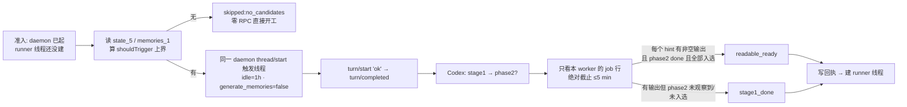

# FLY-2460 Codex 准入蒸馏通道 — 实施计划
Issue: FLY-2460 (https://linear.app/geoforge3d/issue/FLY-2460/2355b3-codex-自蒸馏从不触发runner-家里模型拿不到原生-memory-工具memory-stage1-后台任务从不跑)
日期: 2026-09-09
基于: research.md

状态: **codex-approved**(v4,R4 APPROVED,2026-09-09;Lead 授权 R4 为最后一轮,question 378972df)。基线: 7aec15367(main)。Lead 裁定:question 5e177363(2026-09-09,不回填、不开 dedicated_tools、预算 ≤5 min 超时不阻塞,+四条要求)与 question b24705c1(2026-09-09,**接受**准入时通道与 E4 keyed 口径;legacy → seed 半程记「无自然人口,本单不证明」;不加巡逻、不回填、不加受控旧家触发;「add nothing else」)。

## 1. 给 founder 的说明

### 1.1 一句话

Codex 的记忆分两步:先把每次任务的日记「摘要」进数据库(stage1),再由一个每 6 小时最多跑一次的「整理」把摘要合并成模型开工时真正读的那页纸(phase2 → `memory_summary.md`)。Codex 只在「同一个家的下一次开机」做这两步,而且日记必须凉满 1 小时(0.153.2 源码硬钳,改不了)。本单让**下一次派到同一个家的 runner 在开工前先按一次「摘要+整理」按钮**:上一次的日记一定会被摘要进库;如果那页纸的 6 小时冷却已过,整理也会当场完成,这一次的第一轮就能读到上一任经验;冷却没过,则这一次只把摘要存好,再下一次开工时读到。每次都留一张回执,写明这两步各到了哪一步、花了多少时间与 token。

### 1.2 承诺的精确边界(R2 #1)

| 保证 | 条件 | 回执状态 |
|---|---|---|
| 上一批合格线程(= 全部 `hints`)的 stage1 摘要在本次 runner 第一轮之前持久化到 `memories_1.sqlite` | 每个 hint 都有本 worker 的 `memory_stage1` job `done` **且** `stage1_outputs` 有该线程行、`raw_memory`/`rollout_summary` 非空、`source_updated_at ≥ jobs.input_watermark`(Codex 会把 no_output 的 job 也标 done 并删旧输出:`phase1.rs:260-263`、`state memories.rs:939-1000`) | `stage1_done` |
| 本次第一轮**能读到**(`memory_summary.md` 已由本次 phase2 更新且含上一批) | 上一条成立 **且** 本 worker 的 phase2 `done` **且** 每个 hint 的输出行 `selected_for_phase2=1` 且 `selected_for_phase2_source_updated_at = source_updated_at`(phase2 只选 top-256:`types.rs:52`、`state memories.rs:392-505`;成功时打标:`:1240-1291`) | `readable_ready` |
| 否则 | 任一 hint 未 claim / job done 但无输出 / 输出未入选 / phase2 未观察到 | `partial` 或 `stage1_done`(见 §3.5);可读要等下一次执行 |

「这一次首轮一定读到」**不是**本单的保证;E4 只在 `readable_ready` 时断言首轮读到。



### 1.3 Lead 要求的落点

1. 只在本执行自己的 daemon 与家里触发 → §3.2 R1。 2. 触发线程 `generate_memories=false` → §3.2 R3。 3. 每次记录 token 与墙钟 → §4 `cost`。 4. 529 真机验收 → §7(E4 按 b24705c1 口径)。 5. 不改 FLY-2359 → §9。

## 2. 稳定身份与显示标签

| 名称 | 定义 |
|---|---|
| `distillStepId` | `= executionId`;每次执行最多一次(仅首次 daemon 会话) |
| 触发线程 `triggerThreadId` | 通道 `thread/start` 创建,`memory_mode='disabled'` |
| `hints[]` | §3.1 算出的**保守上界**候选(可能多于 Codex 实际 claim) |
| `claimed[]` | `jobs` 中 `worker_id = triggerThreadId` 的 `memory_stage1` 行(**唯一权威**) |
| `expectedButUnclaimed[]` / `claimedUnexpected[]` | `hints − claimed` / `claimed − hints`;前者非空 ⇒ 顶层最多 `partial`(§3.5) |
| 回执 | `<CODEX_HOME>/.flywheel-memory-distill/<executionId>.json`,0600,原子写;隐藏目录,FLY-2359 白名单不复制 |
| 日志前缀 | `[codex-memory-distill]`,一行一执行 |
| 每行 stage1 结果 | `done_with_output` / `done_no_output` / `error` / `pending` / `unclaimed` |
| 顶层状态词表 | `readable_ready` / `stage1_done` / `partial` / `skipped:<reason>`;reason ∈ `no_candidates` `db_unreadable` `runtime_stopped` `thread_start_failed` `turn_start_failed` `no_claim_observed_within_45s` `timeout` |

## 3. 行为规则

### 3.1 `shouldTrigger` 上界(只决定要不要发 RPC,不是成功判据)

只读打开 `state_5.sqlite`(缺失 = 没有线程 → `skipped:no_candidates`)与 `memories_1.sqlite`(缺失 = 没有历史 job/输出,排除集为空);打开/查询失败 → `skipped:db_unreadable`。谓词按 Codex 0.153.2 的选择器取**保守上界**:

```
hints = threads
  WHERE archived = 0 AND preview <> ''                         -- push_thread_filters, state/src/runtime/threads.rs:1383-1390
    AND source IN ('cli','vscode','atlas','chatgpt')           -- rollout/src/lib.rs:70-77(atlas/chatgpt 是 Custom 字符串)
    AND memory_mode = 'enabled'
    AND updated_at_ms <= now - 1h                              -- clamp 下限 config/src/types.rs:394
    AND updated_at_ms >= now - 10d                             -- 与 R3 显式覆盖的 max_rollout_age_days=10 同一合同
  MINUS 已最新: stage1_outputs.source_updated_at >= updated_at_ms/1000
             OR jobs(memory_stage1,id).last_success_watermark >= updated_at_ms/1000   -- try_claim_stage1_job 的两条跳过
  ORDER BY updated_at_ms DESC LIMIT 8                          -- Flywheel 自定批上限 = Codex stage1 并发 8(memories/write/src/lib.rs:81);Codex 自身 clamp 是 1–128
```

不模拟 `retry_at`/`retry_remaining`/全局 running 上限:那些只会让 Codex 少 claim,由 `expectedButUnclaimed` 观测。`hints` 为空 → `skipped:no_candidates`,零 RPC、零模型调用,只写极小回执。

### 3.2 触发规则

- **R1 只在本执行的 daemon/家**:`CodexDaemonGoalRuntime.runGoal` 在**首次** `startSession` 之后、`ensureThread` 之前调用注入的 `beforeFirstThread({client, codexHome, signal})`;`restarts > 0` 或 `resumeThreadId` 存在时不调用;钩子不接受任何外部路径。
- **R2 跳过**:`enabled=false` → 钩子不注入(零调用零回执);进入时 `runtime.stopped || client.isClosed()` → `skipped:runtime_stopped`。
- **R3 触发线程**(`thread/start`,`timeoutMs = 剩余预算`):`cwd = 执行 cwd`,`sandbox="read-only"`,`approvalPolicy="never"`,`baseInstructions="Reply with exactly: ok"`,`config = {"memories.min_rollout_idle_hours": 1, "memories.max_rollout_age_days": 10, "memories.max_rollouts_per_startup": min(hints.length, 8), "memories.generate_memories": false}`,不设 `ephemeral`。`max_rollout_age_days=10` 是把 Codex 默认值显式钉成与 §3.1 同一合同,不是放宽。
- **R4 触发 turn**:`turn/start` 文本 `"ok"`(`timeoutMs = 剩余预算`);此前用 `setEvents({onNotification})` 接管事件槽捕获该线程的 `turn/completed`,通道结束时清空事件槽。
- **R5 不覆盖** `min_rate_limit_remaining_percent`、`use_memories`、`dedicated_tools`。

### 3.3 并发与安全边界

- Codex 只 claim `updated_at ≤ now−1h` 的线程(不可降的下限);正在写 rollout 的活线程 `updated_at` 在最近几秒,不会被 claim。
- 沿用 Codex 对「闲置 >1h 的活线程」的 provisional-memory 语义:它会被蒸馏一次「到目前为止」,合并进 `memory_summary.md`,在它恢复写入并被再次蒸馏之前,其他任务可能短暂读到这份**过时但非伪造**的摘要;恢复后 `updated_at` 前进、水位落后,下一次通道会重蒸馏。风险表显式接受(§6)。
- 不持锁、不改 lease/marker;不记录 per-candidate 存活状态(R2 #6:`threads.id` 与 lease 文件名 executionId 没有本地映射,不为观测字段引入 StateStore)。

### 3.4 绝对截止与 goal 预算(R2 #4)

- 钩子入口第一件事:`deadline = now + waitBudgetMs`(默认 300 000)。之后的 DB 打开/查询(`better-sqlite3` `timeout` = 剩余)、`thread/start`、`turn/start`、每次 sleep(默认 5s)都从剩余时间里扣;剩余 ≤0 即 `skipped:timeout`。上限就是 `waitBudgetMs`,不是相加。
- goal 预算不被侵蚀:`runGoal` 在 :504 记的 `runStartedAt` 改为在钩子返回后 `runStartedAt = originalRunStartedAt + distillWallMs`;重启复用同一个调整后的锚点(不再加预算)。测试:钩子耗满接近预算后,首次 goal 的 active/waiting 上限与改动前相同;restart 不重置。

### 3.5 完成屏障(只看本 worker)

1. 等触发线程 `turn/completed`;`turn/start` 抛错 → `skipped:turn_start_failed`。
2. 等 `jobs` 出现 `worker_id = triggerThreadId` 的任意行;45s 内未出现 → `skipped:no_claim_observed_within_45s`(守卫或 Codex 过滤;**只是 45s 内未观察到**,后台任务仍可能稍后 claim,回执如此措辞)。
3. 等本 worker 的 `memory_stage1` 行全部离开 `running`;逐条记 `after ∈ {done,error,pending}`、`lastError`。
4. 再等最多 15s 看本 worker 的 `memory_consolidate_global` 行:出现则等它离开 `running`,记 `phase2.observed="claimed"`, `phase2.status`;否则 `phase2.observed="not_observed_within_15s"`。
5. 逐行归类(每个 hint):本 worker job `done` 且 `stage1_outputs` 该线程行存在、`raw_memory`/`rollout_summary` 非空、`source_updated_at ≥ jobs.input_watermark` → `done_with_output`;job `done` 但无匹配输出行 → `done_no_output`(Codex no_output 分支);`error` / `pending` 照记;无本 worker job 行 → `unclaimed`(进 `expectedButUnclaimed`)。
6. 顶层状态:**覆盖集 = 全部 `hints`**。所有 hint 都是 `done_with_output`(至少一条)且本 worker 的 phase2 `done` 且每个 hint 输出行 `selected_for_phase2=1` 且 `selected_for_phase2_source_updated_at = source_updated_at` → `readable_ready`;所有 hint 都是 `done_with_output` 但 phase2 未观察到/未 done/未全部入选 → `stage1_done`;任一 hint 为 `done_no_output`/`error`/`pending`/`unclaimed`,或 phase2 `error`,或本 worker 只 claim 了 phase2 而无 stage1 行 → `partial`;截止 → `skipped:timeout`(已完成的行如实列出)。`claimedUnexpected` 只观测,不影响状态。
7. `signal`(runtime.stop)→ 立即停止,`skipped:runtime_stopped`;Codex 侧 running 行由其 1h lease 自愈。
8. 结束不删触发线程、不动 `memories/`、不动 `jobs`、不动 `stage1_outputs`。

### 3.6 幂等与重放

- 每次执行只在首次会话建立时跑一次;重启/resume 不跑。重新派发同一 executionId 会再跑:排除集已含蒸馏过的线程,最坏多一次极短 turn。回执按 `executionId` 覆盖写,`attempt = 旧 attempt + 1`;旧回执按 §6 读取,不合格视为不存在并记 `receiptPriorInvalid=true`。

### 3.7 回滚边界

- 关闭:`FLYWHEEL_CODEX_MEMORY_DISTILL=off`,在 `packages/teamlead/src/bridge/run-infra.ts` 组合 adapter 时解析一次;`off` ⇒ 不注入钩子(零 RPC、零 DB、零回执),组合时一条 info;缺省/其他值 ⇒ 开(其他值 warn 一次)。唯一新增 env。
- 不改 Codex 二进制、任何家的 `config.toml`、FLY-2358 租约/marker、FLY-2359 seed。回滚 = revert 本 PR;遗留触发线程与回执无害。

## 4. 回执结构

```json
{
  "version": 1, "executionId": "…", "home": "<CODEX_HOME>", "homeKind": "keyed|legacy", "attempt": 1,
  "status": "readable_ready|stage1_done|partial|skipped:<reason>",
  "triggerThreadId": "…|null",
  "hints": [{"threadId":"…","updatedAt":"ISO","rolloutBytes":12345678}],
  "claimed": [{"threadId":"…","before":"absent|done|error","after":"done_with_output|done_no_output|error|pending","lastError":null,
               "output":{"present":true,"sourceUpdatedAt":1788900000,"inputWatermark":1788900000,"selectedForPhase2":true}}],
  "expectedButUnclaimed": ["…"], "claimedUnexpected": ["…"],
  "phase2": {"observed":"claimed|not_observed_within_15s","status":"done|error|running|null"},
  "stage1OutputsBefore": 0, "stage1OutputsAfter": 1,
  "cost": {
    "wallMs": 96000,
    "triggerThreadTotalTokens": {"value": 1234, "availability": "exact|unavailable", "source": "threads.tokens_used read after turn/completed; short re-poll within deadline if row not yet visible"},
    "hintRolloutBytesTotal": {"value": 12345678, "availability": "exact", "note": "raw rollout file bytes, volume proxy only"},
    "phase2Tokens": {"value": null, "availability": "unavailable", "note": "Codex 只记 metrics,不落 DB"}
  },
  "startedAt": "ISO", "finishedAt": "ISO"
}
```

`value=null ⇔ availability="unavailable"`;E6 对实际触发路径断言 `triggerThreadTotalTokens.value` 为非负整数。回执与日志不含记忆正文、prompt、凭据。

## 5. 改动清单(chunk id 与 progress.md 同名)

| chunk | 文件 | 内容 | 测试 |
|---|---|---|---|
| C1 `client-config` | `claude-runner/src/codex-daemon-client.ts` | `startThread` 新增可选 `config?: Record<string, string\|number\|boolean>` 与 `timeoutMs?`;不传时 params 逐字节不变 | `test/codex-daemon-client.test.ts`:传 config 时 params 含原样 `config`;不传无该键;timeout 透传 |
| C2 `distill-module` | 新 `claude-runner/src/codex-memory-distill.ts` | §3.1 上界查询、§3.4 截止、§3.5 屏障、§4 回执(原子 0600、旧回执硬化读取)、成本;注入 `now/sleep/openDb/stat` | 新 `test/codex-memory-distill.test.ts`:临时 sqlite 造 `threads/jobs/stage1_outputs`;覆盖 no_candidates、preview 空排除、archived 排除、atlas/chatgpt 纳入、两条「已最新」排除、1h/10d 边界、state DB 缺失=no_candidates、memories DB 缺失=不排除、db 损坏=db_unreadable、no_claim 45s、第 46s 才出现 stage1 的时序(回执措辞为 within_45s)、部分 claim(expectedButUnclaimed)、claimedUnexpected、stage1 done→phase2 未观察=stage1_done、phase2 claimed→done 且全部入选=readable_ready、phase2 done 但目标输出 `selected_for_phase2=0`(超 256 上限被挤出)=stage1_done、job done 但输出行缺失/被删(Codex no_output)=done_no_output→partial、输出行水位旧于 `input_watermark`=partial、部分 claim(T0 done 而 T1 unclaimed)=partial、只有 phase2 claim 无 stage1 行=partial、第 16s 才出现 phase2=不计入 readable、error→partial、timeout、signal 中止、截止扣减(RPC/sleep/DB)、token 行未可见→短轮询→unavailable、回执原子/0600/attempt、旧回执 symlink/非普通文件/超 64KiB/身份不符 |
| C3 `runtime-seam` | `claude-runner/src/codex-daemon-goal-runtime.ts` | `RunGoalInput.beforeFirstThread?`;仅 `restarts===0 && !resumeThreadId && !stopped && !client.isClosed()` 调用;`stop()` → `signal.abort()`;钩子抛错只记日志;`runStartedAt` 按 §3.4 加回 distill 墙钟 | `test/codex-daemon-goal-runtime.test.ts`:首次调用且在 ensureThread 前;restart/resume 不调用;stop 中止且 drained;抛错不影响 goal;goal 预算不被侵蚀、restart 复用调整后锚点 |
| C5 `adapter-hook` | `CodexTmuxAdapter.ts` | deps `memoryDistill?: {enabled, waitBudgetMs?, pollMs?}`;enabled 时把 C2 包成 `beforeFirstThread` 传入 `runGoal` | `test/CodexTmuxAdapter.test.ts`:enabled 时钩子先于 onThreadReady;disabled 零注入;钩子抛错不改变 outcome/收尾 |
| C6 `wiring` | `teamlead/src/bridge/run-infra.ts` | 解析 `FLYWHEEL_CODEX_MEMORY_DISTILL` 一次,传 `memoryDistill.enabled` | run-infra 接线测试:缺省 on;精确 `off` 关;其他值 warn+on |
| C7 `deps` | `claude-runner/package.json` | `better-sqlite3` + `@types/better-sqlite3`(workspace 同版本) | `pnpm install` 后现有套件不变 |
| C8 `qa-runbook` | 本文件夹 `qa-runbook.md` | §7 路书、sqlite 取证命令、两段式排程 | QA 节点执行 |

```bash
pnpm --filter flywheel-claude-runner test -- codex-memory-distill codex-daemon-client codex-daemon-goal-runtime CodexTmuxAdapter
pnpm --filter flywheel-teamlead test -- run-infra
pnpm --filter flywheel-claude-runner build && pnpm -r typecheck
```

不得运行 `**/tmux-viewer.macos.test.ts`。实施顺序:C7 → C1 → C2 → C3 → C5 → C6 → C8。

## 6. 负面守卫与接受的风险

- 触发线程 `read-only` + `never` + 一句话基指令。
- SQL 只读、固定语句、无拼接;路径只来自 daemon session 的 `codexHome`。
- 回执目录 `lstat` 普通目录;写入随机临时名 `O_EXCL|0600` 再 `rename`;旧回执 `open(O_NOFOLLOW)` → `fstat` 普通文件 ≤64 KiB → `version/executionId/home` 校验。
- 首轮延迟上限 = `waitBudgetMs`(绝对截止);「有界延迟首轮,绝不绕过或跳过收尾」。
- 不降限额守卫;`skipped:no_claim_observed_within_45s` 一周后可统计。
- **接受**:闲置 >1h 的活线程被 provisional 蒸馏后,恢复前其他任务可能短暂读到过时摘要(Codex 原生语义);**接受**:某岗位最后一次执行要等该岗位下一次派发;**接受**:phase2 6h 冷却内只能 `stage1_done`。

## 7. 验收证据(529 房,QA 节点执行)

前置:`scripts/test-deploy.sh <slot> --generalized --codex-runner --no-lead --expect-head <sha>`;claude-runner dist 自行 build 并核对字节。目标 keyed 家 `agents/<project>/implement` 从零开始。

| # | 证据 | 判据 |
|---|---|---|
| E1 首任务 | 真实 Codex implement 任务 T1 结束;回执 `skipped:no_candidates` | 回执存在;`jobs` 无 `memory_stage1` |
| E2 stage1 | T1 结束 ≥1h 后派真实任务 T2;T2 回执 `status ∈ {readable_ready, stage1_done}`,`claimed[]` 含 T1 根线程 `after=done_with_output` 且 `output.present=true`,`jobs` 该行 `worker_id = triggerThreadId`,`expectedButUnclaimed=[]` | `sqlite3 <home>/memories_1.sqlite 'select job_key,status,worker_id from jobs'` |
| E3 非模板 | `stage1_outputs` 有 T1 线程行,`raw_memory`/`rollout_summary` 非空、不含 "No raw memories yet"/"No consolidated rollout memories yet",`rollout_slug` 含 T1 issue 关键词 | `select thread_id,length(raw_memory),rollout_slug from stage1_outputs` |
| E4 首轮读到 | 当 T2 回执 `readable_ready`(该家上次 phase2 成功距 T2 >6h,路书按此排程;T1 输出行 `selected_for_phase2=1`):T2 第一轮模型 receipt 复述 T1 的 slug/关键词(prompt 只给主题);且 `CODEX_HOME=<home> codex debug prompt-input` 的 `memories.instructions` 段含该 slug。当 T2 只是 `stage1_done`:同样断言在 ≥6h 后的 T3 上成立,且 T2 **不得**被记为首轮可读 | 两段式排程写进 qa-runbook |
| E5 阴性 | `FLYWHEEL_CODEX_MEMORY_DISTILL=off` 重跑 T2 形态:无回执、`jobs` 无本 worker 行、首轮照常;RED 变异真实改变被测字节 | 同上 |
| E6 成本与延迟 | 回执 `cost.wallMs ≤ waitBudgetMs`,`triggerThreadTotalTokens.value` 为非负整数;T2 派发到首轮延迟差 = `wallMs`±5s;首次 goal 的超时上限与改动前一致 | `jq` 汇总命令写进路书 |
| E7 legacy → seed | 按 Lead 裁定(b24705c1):无自然人口,本单不证明;不做受控旧家触发,不回填 | 记事实 |

## 8. 依赖与顺序

- FLY-2358 keyed 家在 main(前提)。FLY-2359(PR #1131)与本 PR 互不依赖,本 PR 不改其文件;原「retire → seed」验收要求已由 b24705c1 裁定 supersede,FLY-2359 从本单验收依赖移除。

## 9. 非目标

- 不回填 288 个旧家(每家 ≈95s、stage1 输入 ≈ 模型窗口 70%(10–15 万 token),≈8 小时串行、≈3–4 千万 token,且须在 FLY-2359 首次 seed 前做才有效)。
- 不开 `dedicated_tools`;不改 Codex 二进制、不绕 1h 闲置下限、6h phase2 冷却、25% 守卫;不加 Bridge 巡逻;不改 FLY-2359;不处理 `codex exec` 来源白名单问题。

## 10. 对应关系

- 根因 file:line:exploration §2(含 1h clamp);实验 `exp-evidence/`(≥1h 旧线程 + 同家再启动 + 覆盖 → 真记忆);接缝 research §3;取证 research §4。
- Lead 裁定:`5e177363`、`b24705c1`。Codex 评审:R1、R2、R3 修订点见 §1.2、§2、§3.1、§3.4、§3.5、§4(R3:成功状态绑定输出行与 `selected_for_phase2`,覆盖集 = 全部 hints)。

## 11. 修订轨迹与 Lead 裁定记录

| 轮 | 结论 | 主要修订 |
|---|---|---|
| R1(v1 收尾通道) | CHANGES REQUESTED,9 条 | `min_rollout_idle_hours` clamp(1,48) 否决收尾当场蒸馏;lease 计数 TOCTOU;假 done;控制流/预算;token 精度;kill switch;E4 legacy 链;接线点 |
| R2(v2 准入通道) | CHANGES REQUESTED,7 条 | 可读 vs 落库拆开;E4 待 Lead(b24705c1 已裁);候选改上界 hints;deadline 锚点;负观察措辞;删 liveLease;事实同步 |
| R3(v3) | CHANGES REQUESTED,4 条 | job done ≠ 有输出;phase2 done ≠ 入选;unclaimed → partial;research 措辞 |
| R4(v4) | **APPROVED** | 冻结范围内无剩余项 |

Lead 裁定:`5e177363`(默认三条 + 四条要求)、`b24705c1`(准入时通道 + E4 keyed 口径)、`378972df`(授权 R4 为最后一轮;MEDIUM/LOW 视为接受)。评审原文:`codex-review/round1..4.md`。
