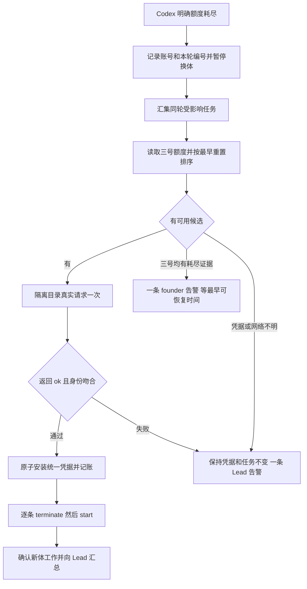

# FLY-2465 Codex 舰队自动切号 — 实施计划
Issue: FLY-2465 (https://linear.app/geoforge3d/issue/FLY-2465/2371-根治-codex-舰队级自动切号限额信号-按最早重置挑号-切-codex-重起被收的体全池打满才发-founder)
日期: 2026-09-09
基于: research.md

## 1. 结果与范围

Codex 账号额度耗尽时，系统自动暂停无效换体，按最早额度重置时间选可用账号，隔离验证后切换统一凭据，再恢复本次事故中的任务；三个号全部耗尽才通知 founder。正常网络、一个候选号可用的六任务台架要求首次观察到限额后 600 秒内全部新体工作，无 founder 介入。

本计划是设计节点交付，不代表已实现/上线。源码基线 227058c73；Lead 在问题 7bac2cb7-e969-486e-86a4-094c62088a71 确认三号范围、排序和探针失败边界。只用 registry 的 school/personal/business；personal1/personal2 保持退役。现有 role=manual_backup 作为历史身份字段保留，新增自动政策只由本功能定义，不因旧显示文案禁止 founder 已授权的自动使用。



不改 Claude quota daemon、Claude registry、Claude review retry；不复活 account-switch-route（仍 410）；不重启健康 runner/Lead，不更换模型，不自动购买或兑换 credit。成功切号会改变 canonical auth；只有已验证为共享链接的受管 home 才可进入自动恢复。生产仍有普通文件副本，不能从源码的新建分支推出迁移已完成；上线前须满足下面的 FLY-2404 前置条件。探针阶段绝不改变 live auth。发布由独立 updater 的窗口执行，merge 与部署分开。

### 1.1 必须先落地的凭据迁移条件（T0）

R1 后在 2026-09-09 19:17Z 只做 lstat 清点：878 个旧 execution-home auth 都是普通文件；agents/flywheel/eng_design 是链接，agents/flywheel/implement 仍是副本。`codex-home.ts:1919` 明确保留既有普通文件的复制分支，并写 `.credential-copy-pending`；新建 home 才直接链接。此事实替代 R1 的「生产已经共享」假设。

依赖既有 FLY-2404 的部署/迁移能力（见同 issue plan §2 A4–A6、§4；`scripts/codex-credential-cutover.sh`、`codex-home-link-truth.sh`、`codex-home-credential-sweep.mjs`）。由独立 updater/既有迁移 owner 在部署窗口完成，不由设计或运行中的恢复任务热切健康进程。这里的前置不是再次向 founder 要自动切号许可，而是上线的机器校验条件：

- 以各项目 CommDB、keyed leases、实际进程归属和已批准的逐-home清单交叉清点**受管活跃家**；所有会载入/刷新 canonical 同一链的活跃家必须链接到同一真源。活跃不明/普通副本/错误链接=readiness_failed，阻止开启自动切号，Lead 一条诊断；不拿目录存在或单纯 lease 文件当活体证明。
- 保留 FLY-2404 逐-home 范围，不能自动把独立登录的 Mufasa/infra-bot 等并入；若候选池的刷新链还被独立活跃副本使用，候选记 in_use_unshared，不从其副本跑会轮换令牌的隔离 probe。独立账号的其他登录链不由本单迁移。
- 旧 878 家不全量迁移；其中死亡的历史家不构成活跃共享要求。若本次恢复将复用一个旧副本家，必须在真实进程已排空、持久 lease 归零及原 home admission 锁下，调用已有 `migrateCodexAgentHomeCredential`（keyed）或受既有进程 fencing 包裹的 `migrateCodexHomeCredential`，然后回读链接，才可启动。证据不明则等待/Lead 诊断，不擦除或复制覆盖。新家直接建链接。
- `provisionCodexHomeAt` 对旧文件的兼容分支不全面删除，但 quota-managed 启动必须在它之前完成上述迁移/拒绝；在实际 launch fence 再次验证**目标 home/auth.json** 是正确链接、解析后的身份和当前 generation一致，无 `.credential-copy-pending`。不能仅检查 canonical 本身。刚好在切换前读过旧快照的 provisioning 也必须重新读目标后才绑定/launch。
- 部署出具带 build SHA、受管清单摘要和逐-home检查结果的 readiness receipt，启动时重新验证，不能永久信任旧receipt。FLY-2465 的自动切号开关默认on，但能力生效还须 readiness=true；迁移不成立不得把受限事故回退给盲换体。
- QA 不能只用干净新家跑600秒场景：必须加入旧副本拒绝、drained迁移后恢复6体、N体同时跨真实/严格假权威刷新边界且0永久auth死亡；A格计时从已满足部署前置的首次限额信号开始。生产交付验收包含前置落地证据，不能把未完成迁移的部署标成完成。

## 2. 身份、事件与唯一事实源

采用现有 registry/identifyCodexAuth 作为唯一账号身份库。profile 是稳定登记键，School 等仅显示标签；accountKey = SHA256(规范 profile + provider accountId)，缺 accountId 时使用既有验证后的 email 生成摘要。摘要用于状态，原始 email/token 不进新日志。label 变化不能改变旧事故归属。

单个 `CodexQuotaSignalV1` 类型放在 `packages/core/src/codex-quota.ts`，导出给 adapter、Bridge、comm helper；schema 和枚举只在这里定义：

```typescript
type CodexQuotaSignalV1 = {
  version: 1;
  vendor: 'codex';
  source: 'goal_ended' | 'review_exec';
  sourceEventId: string;
  bindingId: string;             // Bridge 预先登记的 execution 或 review invocation
  evidence: 'usageLimited' | 'usageLimitExceeded';
  observedAt: string;            // 合法 ISO，仅记录，不代替服务端时间
};
type CodexQuotaBindingV1 = {
  bindingId: string;
  executionId: string;
  runId: string | null;
  accountKey: string;
  profile: string;
  generation: number;            // 非负安全整数
  credentialRootKey: string;
  purpose: 'runner' | 'review';
};
```

客户端不能指定切换目标、凭据路径、run 列表或新 generation。Bridge 从可信 binding 解析这些值，校验 bearer、project/execution ownership、adapter/reviewer family。review 的父执行可以是 Claude，必须依据登记的 reviewer purpose=review + vendor=codex，不能依据作者模型误分类。

TerminalFailureKind 新增 `goal_usage_limited`，failureReason 固定限额信息，附 quotaSignal；不扩用 environment=unauthorized 表示配额。同步 adapter-types、normalizer、Blueprint、ExecutionEventEmitter、DirectEventSink、HTTP event-route、StateStore 严格字段校验。usageLimited 永远是失败；paused/budgetLimited/blocked/unauthorized 保持既有语义。

账号 generation 是 canonical root 下持久化单调代数，不是 execution id，不因刷新 token 增长。首次初始化为 1；成功选择不同账号或同号在观察到额度恢复后重新启用递增。事故唯一键 `codex:<rootKey>:<generation>`。同代的六个 binding 各加入集合，只插入一条 usage_limit 事件。换号后迟到旧事件只更新旧事故的目标集合，不再次切号或标记新号 limited；若已存在当前代 probe-success，可通过相同恢复流程恢复迟到的旧任务。

runner binding 在启动已认证 backend 前持久化，记录实际载入账号；账号更新通知若无法确认真实身份，绑定进入 identity_uncertain，不可猜新 generation。已有 daemon 的旧绑定不随 canonical 文件变化盲改；下次明确认证身份后再登记。发现旧 daemon 重新读到不同账号又返回限额时，先隔离查询该账号真实额度确认，不用单纯文件当前值覆盖事件归属。

## 3. 持久化模型与恢复

协调器是 Bridge 内唯一长寿命消费者，复用 StateStore 事务/导出机制；账号文件安装使用 canonical-root 的共享文件锁，跨进程防手动 CLI 争抢。QA 显式注入 state root、profiles root、canonical root、raw codex binary、Bridge URL，禁止缺省回落到生产。

新增表（均幂等 CREATE/索引；SQL 参数绑定，不拼接输入）：

| 表 | 主键与字段 | 权威职责 |
| --- | --- | --- |
| codex_quota_binding | binding_id PK；execution_id/run_id/purpose/account_key/profile/generation/root_key/created_at | 锁定信号归属；review invocation 有独立 binding |
| codex_quota_incident | incident_id PK；UNIQUE(root_key,generation)；state、first_seen_at、next_attempt_at、selection_id、target_profile、probe_result、probe_at、prior_auth_digest、installed_auth_digest、installed_generation、failure_code | 事故与 prepared→installing→committed→recovering→settled；故障态 retry_wait/pool_exhausted/probe_failed/identity_uncertain |
| codex_quota_target | PK(incident_id,target_kind,target_id)；run_id、node_id、attempt、old_execution_id、state、terminate_key、start_key、start_request_json、new_run_id、new_execution_id、last_error | 每个 run 或 review 的恢复 cursor；多个本轮 execution 按 run 去重 |
| codex_quota_observation | PK(root_key,account_key,limit_id)；profile、observed_at、primary/secondary window JSON、auth_health、credential_fingerprint、last_refresh、invalid_reason | 额度观察；不复制 registry 身份定义，不存 token |
| codex_quota_admission_wait | start_key PK；run_id/execution_id/node_id/root_key/generation/dispatch_json/request_context/state | 绑定已经存在的 append-only start reservation；waiting→resuming→released/abandoned，明确排队而不创建第二份reservation |
| codex_quota_outbox | event_id PK；incident_id、kind、destination、payload_json、delivery_state、receipt_id | usage_limit/Lead 汇总/founder 耗尽/失败一条消息的投递与重放 |

文件 `${stateRoot}/codex-quota/active.json` 是供 CLI 读取的原子生成号投影，不是第二份权威账本；含 schemaVersion/rootKey/profile/accountKey/generation。Bridge 启动先对 canonical 实际身份、安装记录和投影对账，再开放 Codex admission；未知版本/坏 JSON = Lead 诊断、零自动写，不覆盖修好。

审计权威是 incident + outbox，追加 `${stateRoot}/codex-quota/switch-audit.jsonl` 为巡检可读投影：每次选择尝试一行 `schemaVersion,switchId,incidentId,at,vendor,from,to,reason,probeResult,committed,generation,recoveredCount`。switchId 去重；投影中断按权威记录补齐，半行截断安全处理；审计不可用不会抹掉真实切换状态，失败由 Lead 事件显式报出。失败尝试也写 committed=false 行，不能看起来像成功切号。

### 3.1 先暂停，后异步修复

在记录 usageLimited 的同一 StateStore 事务中写 signal/binding 归属、incident、target、暂停证据和唯一 usage_limit outbox；之后才能返回事件成功。Generalized 走 recordEnrolledTerminalSignal 的真实早 return 分支，legacy 路径调用同一 quota persistence 服务。持久化失败不确认事件成功，也不让该 quota failure 进入普通重试。

守卫必须覆盖：

1. StateStore.rollbackDeadWorkflowNodeExecution，必须在替换计数和插入 execution 前检查。
2. workflow engine 创建/claim dispatch intent 与 adapter 的 commitWorkflowLaunch fence，防事故发生前已排队的 intent 复活。
3. legacy DecisionLayer/run-dispatcher 对相同 execution 的自动 retry。
4. runs/start 的 Codex admission（T2明确负责）：在 `runs-route.ts` 的 `resolveNodeDispatchAtLaunch` 之后、`admitGeneralizedWorkflowExecution` 之前（当前3124附近）用 `dispatchResolution.dispatch.vendor` 判断；该解析值已包含vendor，无需提前调用尚未产生的getWorkflowExecutionRuntime。Codex且paused时，保留已有不可变start reservation/route decision，事务upsert codex_quota_admission_wait，返回202 `CODEX_QUOTA_QUEUED`+同run/execution/startKey；零admit/输出凭据/物理启动，不把202写进永久successful start-response cache。不能删/改append-only reservation。相同key查询/重放只返回同一waiter；恢复后coordinator按保存的可信请求和相同key重入原route一次，重新解析vendor并admit，成功后waiter=released；取消/人工hold/终态则abandoned并永不启动。既有cached成功response仍遵原重放校验；有waiter时不能将它误判成已经启动。Claude绕过此Codex guard、无waiter。admit事务与最后launch fence再次检查pause，覆盖检查后才出现限额的竞态；若已admit，保留同activation等待恢复，不能分配新execution。legacy入口在已解析backend后、真正dispatch前采用同一waiter合同。恢复请求只凭服务端incident有效probe-success许可通过。
5. review wrapper 的 preflight：配额暂停时不再启动审查进程、不增加 review round；保存原工作并等待恢复。

暂停是专门 quota 记录，不把所有 run 一律改成人工 held。已 held 的恢复只接受 latest hold=retry_limit_escalated 且本次 quota provenance；人工 hold、cancel、ship、不同故障、foreign root、已换成健康 successor 全拒绝。启动一次 backfill 扫描持久化历史 usageLimited + retry_limit_escalated 对；缺可信账号绑定的记录仅作 Lead 待核项，不归罪当前账号，也不自动 kill。

## 4. 额度读取和选号

数据源是本地 Codex app-server `account/rateLimits/read`，优先已有新鲜 observation（≤60秒），否则在候选号独立 0700 home 中用 file store、profile auth 副本读取，无模型请求；每号最多20秒。候选池在身份验证前还需通过§1.1的刷新链活跃使用者检查；所有会刷新该候选号的隔离reader/probe按accountKey串行，不能两个临时副本同时刷新同一链。运行 `initialize`/`initialized` 后 account/read 验证身份，再 rateLimits/read；无 logout/login/credit 兑换/外部邮件调用。所有临时文件0600，退出销毁，仅新鲜候选号凭据经身份验证后可回存该 profile；绝不通过修改 live auth 探测。

按本地 0.153.2 schema 处理 rateLimitsByLimitId，优先本次实际使用的 codex limitId；没有 map 时用单桶 rateLimits。不能拿 Spark/其他限额桶代替本次模型的额度。秒级 resetsAt 乘1000且检查 finite/合理范围，usedPercent 必须整数0..100，null window 保留 unknown，不假设5小时/周长度。missing/expired observation、未知 scope、auth-error 各显式归类，不伪造 reset。

可用 = registry 身份匹配、非已证实 refresh-invalid，相关所有有效窗口 usedPercent<100 且无 provider 明确 reached。已耗尽号在 `max(耗尽窗口 reset)` 之前不可用；无 reset 的耗尽号60秒再读额度，成功读到可用才解除。读到 invalid_grant/revoked/明确刷新令牌失败则隔离该号，直到其 credential fingerprint 改变并验证；access token exp 过去或 last_refresh 老旧本身不是 refresh-invalid。

排序完全确定：

```text
candidates = profiles.filter(available)
resetKey = min(相关有效窗口的未来 resetsAt)，无已知窗口为 Infinity
remainingKey = min(相关有效窗口的 100-usedPercent)，全 unknown 为 -1
sort by (resetKey ASC, remainingKey DESC, profile ASC)
```

最早重置指先用即将重置的可用额度，绝不是选择还在限额中的账号。已过期 reset 必须重读后再排序；同 timestamp 更多 remaining 优先；profile 仅最终稳定 tie-break。无可靠额度但身份有效的号只有在没有已知可用候选时作为 unknown 候选，必须通过同一真探针；不能把它宣称为最早 reset。

若无候选：三个登记账号均有新鲜耗尽证据 → pool_exhausted；含身份失效/缺文件 → no_usable_credentials；含网络/协议不明 → observation_unavailable。后两者仅一条 Lead 诊断。全池状态最早下次可恢复点 = min(每号 max(耗尽窗口 reset))；到时重读，仍满不新发 founder 消息。未知 reset 则60秒重读。只有整个事故池恢复到可用后才解除耗尽消息 latch；不同账号失败不能连续发多条 founder 告警。

## 5. 真探针、原子切号和竞争

每个 selection attempt 只探测排序第一候选号一次。使用原始 codex 绝对路径，不用会换模型的 wrapper；保留被测模型族/额度桶，在空 cwd 与独立 CODEX_HOME 下运行：

```text
codex exec --sandbox read-only --skip-git-repo-check --output-last-message <private-result-file>
  -c cli_auth_credentials_store="file" -m <实际目标模型> "Reply exactly ok. Do not call tools."
```

以 execFile argv 调用，不经 shell 拼接；清理会选取其他凭据/服务的 ambient token、CODEX_HOME、provider override，最小配置无 MCP/插件/hook，保留必要可信网络证书配置。超时60秒，专属进程组 TERM→KILL并等收集完成。成功必须 exit=0 + output-last-message.trim()==ok + 无结构化错误/工具调用 + 探针后 auth 身份仍是候选。stdout 里出现 ok 不构成通过；不得依靠 prompt 作为权限边界。

失败 → durable probe_failed + 一条 Lead 告警；canonical auth/active generation 不变，terminate/start调用数=0，review 不重跑，blind replacement=0。本轮不得探第二个号或把错误转成换号成功。到 next_attempt_at=now+60秒后，仅在重新观察到候选可用/凭据更新/临时错误恢复证据后开始一个新的 selection attempt，同 incident 告警 latch 保持；无新证据不反复 exec。明确全池耗尽后按 reset 重新观察，不忙轮询。探针明确耗尽可更新该候选号的 quota observation，但本次失败边界仍不变。

安装按以下顺序，所有 live 写只发生在真探针成功后：

1. 持久化 prepared（选择、proof、旧 auth 摘要、新 auth 摘要、有效 generation）。探针临时凭据可能刷新，取探针最终版本。
2. 取得 canonical-root 文件锁；使用现有 mkdir-lock 模式及 owner PID/start identity，不能只按墙钟过期抢锁。手动 use/save 的 live 安装也使用同一短锁。探针阶段不长期持锁，不能阻碍在飞进程。
3. 重读 canonical 身份和 digest；必须与选择时快照一致。若同号 token 刷新，更新凭据观察并重新评估，不用旧副本覆盖；若手动切号，撤销本选择，按真实身份推进新代，未有有效探针时不恢复任务。
4. 再读事故状态、候选 fingerprint、proof age≤90秒；不符合即不写，记录 stale_selection。**自动路径不把 outgoing canonical 回存旧 profile，完全删除 R1 的旧账号备份步骤。** JWT 身份、last_refresh、可用 access token 甚至一次 account/read 都不足以证明旋转刷新链仍活着；本单不新增强制刷新来取得导出许可。旧 profile 在成功/失败两条自动路径均保持原字节，独立 save 的更新也不得被覆盖。旧 canonical 快照如用于崩溃证据，只能进与候选池隔离的 0600 quarantine，不能自动提升为候选或覆盖 profile，审计记 pool_export=skipped_unproven。目标 profile 只接收其自身通过真 probe 后的最终版本，并在写入前比较选择时的 profile digest；并发 save/变化则取消本次安装，不覆盖新内容。

   代价明确：旧 profile 若已落后于刷新链，它以后可能验证失败而被隔离；不能为维持可用号数量拿身份相同的未经证明字节修复它。使用已有显式 profile save/login 运维路径补充可用凭据不属于自动切号动作，且只有三个号均有耗尽证据才发 founder 告警。恢复健康候选无需等待旧账号回存。此处选择“不回写”这一可验证边界，避免另建无法约束 native 刷新竞争的导出协议。
5. durable installing 后把通过探针的 auth 原子 rename 到 canonical auth，回存目标 profile、更新 .active hint，再持久化 committed/new generation，输出active投影。sidecar从不作权威。只有 committed+canonical identity/digest核对成功才发恢复许可。
6. 启动恢复前及每个目标前检查当前 generation 与 canonical 身份相符，并在该目标的 home admission/launch fence 内重新 lstat/readlink 目标auth入口、通过链接读取实际身份、匹配generation/binding；若provision携带旧快照或仍为普通副本则拒绝启动。文件被外部换回/改变 → 暂停恢复并重新对账，不盲用旧成功证明。

崩溃对账：prepared且文件旧→可取消重试；installing且文件新摘要匹配→补齐 committed/投影后继续；文件旧→不标成功，重评估；既非旧也非新→identity_uncertain，禁止重起且一条Lead诊断。已 committed 后不得因 start失败自动回滚账号；新号可能已被其他任务使用。CLI外直接login/refresh不遵守锁，所以保持identity/digest再核对与启动前校验，绝不声称能使第三方写入参与数据库事务。

## 6. 自动恢复 run 与 review

### 6.1 run

恢复者位于 Bridge，使用已有 master凭据在内存调用同一实例的认证 API（不把凭据放argv、日志或事件），只允许显式本机配置地址。QA用隔离Bridge/token。每目标事务保存原始issueId/projectName/leadId、work kind、pinned template与entry node、branch/worktree、模型与tier；从可信run/session/reservation恢复，禁止从告警正文读。源run与恢复run链接在target表。

依次：

- GET/StateStore重读 run诊断，确认为本事故失败且无live执行、无较晚operator hold/cancel/ship或健康新run。未确认死亡不强杀、不collectExecutions。
- `POST /api/runs/<runId>/terminate` body `{reason:'codex quota recovery <incident>',clientRequestId:'codex-quota:<incident>:<run>:terminate'}`。只有成功/同request已完成才进入terminated；409 liveness回到等待，其他拒绝一条Lead诊断。
- `POST /api/runs/start` 使用既有run管理契约，带 `idempotencyKey:'codex-quota:<incident>:<run>:start'`，以及原issue/project/lead/branch/workKind/template/node/tier绑定。为避免最新模板漂移，runs-route新增仅服务端可解引用的 `quotaRecoveryId`：由target已保存的pinned snapshot恢复原节点/阶段和worktree，不接受客户端上传template snapshot。它仍走现有授权、reservation、branch continuity、TURN、admission和物理启动检查，不直接INSERT替代runs/start。
- HTTP超时响应丢失以相同key重放，查询reservation/新run映射收敛，不生成新key。不重复terminate已确认的旧run。新run启动后通过session_started+新execution的绑定代数、真实liveness确认 recovered，不以HTTP202充当复活。
- 六个run最多并发2个恢复请求，容量不足待admission，不伪造600秒通过。失败单目标保留cursor不阻断其他目标；所有已知目标恢复后向对应Lead发一次汇总，包含from/to与old/new run ids；晚到target增量更新同事故记录。

新run不保留旧进程内存或保证Codex thread复用；它保留已有持久化进度、工作树和阶段身份，语义等价Lead手工terminate→start。未提交内容不强制clean/reset，工作树冲突沿现有hold规则报告。

### 6.2 Codex 审查

真实Codex审查在一次性 `scripts/codex-with-fallback.sh` 路径，不能把名字叫codex_review_job的Claude审查coordinator当入口。新增 repo-owned `scripts/lib/codex-quota-client.mjs`，安装到同一vendored release；通过既有ingest token和新 `/api/codex/quota/bind|observe|status` 小路由完成注册/上报/查询。run wrapper在exec前登记 invocation id、parent execution、purpose=review、实际账号身份，服务端验证parent和root，再发binding id；无Flywheel身份的手动CLI不接入舰队恢复，保留原exit语义。

wrapper读取原始CodexJSON错误/已核对的CLI usage cap文案；`usageLimitExceeded`直接报告；`429`只有伴随明确usage cap或同binding新鲜100%额度证据才报告；generic rateLimitExceeded/capacity/network/模型不支持保持原行为。使用bounded解析器（4KiB error tail、拒绝假JSON/拼接注入），raw输出不进入网络和日志。注册/上报/status接口只接收类型化信号，不接受任意命令或路径。事件先本地持久化可重放spool，Bridge入库后ack；wrapper崩溃不丢限额事实。

该review invocation作为target，父run健康时不terminate父run。**等待预算与审查执行预算分开**：初次执行仍受现有TOTAL/ATTEMPT≤1800秒约束；quota wait单独累计monotonic elapsed、最多1800秒，15秒查询一次，等待期间零exec。成功commit许可且当前generation一致后，仅允许一次quota重跑，以原argv/cwd、**新的完整执行预算1800秒**运行并重新注册binding；等待时间与初次失败消耗不扣这一次新执行的预算。每个logical invocation最多initial + wait + one retry，墙钟上界5400秒；不得通过多个generation反复reset预算。wait耗尽返回专用exit75和`CODEX_QUOTA_WAIT_EXPIRED`，不是exit124/CODEX_GUARD_TIMEOUT_MARKER，也不计成审查timeout/verdict；只有真实执行超预算才保持124。明确quota marker进入wrapper调用方已有失败报告时必须保留quota分类，不能伪造APPROVED。

probe_failed明确返回受控quota失败，本次不重跑；后续调用preflight仍见pause。wrapper退出/父run取消则target记abandoned，由既有review门保持未通过，Lead汇总显示需重发；不能保存任意命令给Bridge执行。resident daemon的无超时直通契约不变，review verdict/head校验不变。T5用fake clock断言wait1500秒后审查执行1200秒仍有完整预算、wait1801秒=75无exec、实际执行1801秒才=124、第二次quota无新预算。

## 7. 告警与巡检契约

首个使用额度耗尽的事件保留 eventType=usage_limit，`metadata.codexQuota={vendor:'codex',incidentId,profile,generation,state}`，eventId稳定为incidentId。采用专用Codex分支接入现有alert sink/AutoRepairBot：返回自动处理已入队，不进入Claude accountSwitch也不降级needs_human。自动恢复无需依靠infra bot账号还有额度。

内部usage_limit记录/Lead事件不等于founder通知。一次成功事故：一条usage_limit、每归属Lead一条恢复汇总、founder消息0。一次probe失败：usage_limit仍仅1，Lead可操作诊断仅1，founder0。全池耗尽：一个pool-exhaustion latch绑定本次暂停周期，founder事件id `codex-pool-exhausted:<root>:<poolEpisode>` 仅1；文案说明三号额度及最早可恢复时间、需人工credit选择，绝不自动消费/发送provider邮件。禁用自动切号时仍保持quota暂停和Lead诊断，不回落盲换体。

outbox必须使用现有可幂等队列/消息receipt；投递前记录稳定nonce，响应丢失先查询匹配nonce的已发送记录再重试，避免崩溃后重复founder消息。若transport无法核验，标delivery_uncertain交Lead，不反复创建新消息。台架必须断言真实隔离message sink的条数，不能只数函数调用。

STEP 2追加稳定行：`CODEX_SWITCH at=... from=business to=school reason=usageLimited probe=ok committed=yes generation=8 recovered=6/6`；无记录=`CODEX_SWITCH none`；缺表/坏投影=`CODEX_SWITCH unavailable reason=...`。按传入state root读取最近一条已提交和最近失败尝试，维护原STEP2状态，输出不含token/email/auth路径。新读取helper `scripts/lib/codex-quota-summary.mjs` 被snapshot调用，兼容未迁移旧库为none；损坏为unavailable不能假装none。T6同步更新 `scripts/converge-flywheel-bin.sh` 的普通/`.flywheel-prebuilt` 两套FILES、`is_first_adoption_name()`，把`lib/codex-quota-summary.mjs`以管理文件形式安装到state/bin/lib；同步 `scripts/package-onboard.sh` 的PO_SCRIPT_FILES以及FLY-1062 packaged-path-audit条目。`lead-patrol-snapshot.sh`从checkout的SCRIPT_DIR/lib或已收敛state/bin/lib解析同名helper，不能假设symlink调用的SCRIPT_DIR指向repo。新增mjs须纳入script-sanity的Node语法/类型支持与有Node依赖的包closure；用真实converged和packaged形式跑STEP2，不止checkout。首次采纳静默，之后缺失/漂移遵现有告警语义。

## 8. 实施任务与红绿顺序

每任务都先写以下失败断言并运行，看到预期红侧，再最小实现/重构，再运行同组绿侧，独立commit。设计节点不写实现代码。路径均相对repo。

| 任务 | 文件与动作 | 必须先出现的红侧证据 |
| --- | --- | --- |
| T0 共享凭据前置 | 新增 `packages/teamlead/src/codex-quota/readiness.ts`，修改 `packages/teamlead/src/bridge/plugin.ts`；复用 `scripts/codex-credential-cutover.sh` / `scripts/codex-home-link-truth.sh` / `packages/claude-runner/src/codex-home.ts`迁移API；在部署说明明确FLY-2404前置与逐-home范围 | 活跃副本/未知归属=readiness失败；仅仓库有link分支不算就绪；旧副本恢复拒绝，drained迁移后6体跨刷新边界不死亡 |
| T1 信号合同 | 新增 `packages/core/src/codex-quota.ts`及导出；修改 `packages/core/src/adapter-types.ts`、`packages/claude-runner/src/codex-daemon-adapter-helpers.ts`、`packages/claude-runner/src/CodexTmuxAdapter.ts`、`packages/teamlead/src/terminal-failure-info.ts`；核对 `packages/edge-worker/src/Blueprint.ts`和`packages/edge-worker/src/ExecutionEventEmitter.ts`透传 | usageLimited目前failure缺失；signal round-trip丢字段；generic429不被认可 |
| T2 持久化/暂停/准入队列 | 修改 `packages/teamlead/src/StateStore.ts`；新增 `packages/teamlead/src/bridge/codex-quota-store.ts`；修改 `packages/teamlead/src/DirectEventSink.ts`、`packages/teamlead/src/bridge/event-route.ts`、`packages/teamlead/src/bridge/workflow-engine-dispatcher.ts`、`packages/teamlead/src/bridge/run-dispatcher.ts`、`packages/teamlead/src/bridge/retry-dispatcher.ts`、`packages/teamlead/src/bridge/runs-route.ts`；复用 `packages/teamlead/src/workflow-dispatch-resolution.ts`的vendor解析 | 6事件只1事故；每个guard有独立反例；paused Codex=1reservation+1waiter+0launch，same-key重放不增加；unpause只启动1次；Claude照常；cancel/人工hold后不启动 |
| T3 候选/探针 | 新增 `packages/teamlead/src/codex-quota/candidate-selector.ts`、`packages/teamlead/src/codex-quota/quota-reader.ts`、`packages/teamlead/src/codex-quota/probe.ts`；复用 `packages/claude-runner/bin/codex-account-core.mjs`身份core | reset/remaining tie不符；refresh-invalid或in_use_unshared被选；probe非零却live写/重起；keyring/环境串号；候选reader/probe串行 |
| T4 安装/回存/恢复 | 新增 `packages/teamlead/src/codex-quota/coordinator.ts`、`packages/teamlead/src/codex-quota/run-recovery.ts`、`packages/claude-runner/bin/codex-account-install.mjs`及`.d.mts`；修改 `packages/claude-runner/bin/flywheel-codex-profile.mjs`、`packages/claude-runner/src/index.ts`、`packages/teamlead/src/bridge/plugin.ts`、`packages/teamlead/src/bridge/runs-route.ts`、`packages/claude-runner/src/codex-home.ts`、`packages/claude-runner/src/CodexTmuxAdapter.ts`的目标home fence | 身份正确但旧链revoked时pool原bytes不变；成功切入时旧profile仍不写；并发目标profile更新使安装取消；prepared/installing崩溃收敛；旧provision快照在target检查被拒；start丢响应仅1run |
| T5 review与发布闭包 | 新增 `packages/teamlead/src/bridge/codex-quota-route.ts`、`scripts/lib/codex-quota-client.mjs`；修改 `scripts/codex-with-fallback.sh`、`scripts/install-codex-guard.sh`、`packages/teamlead/src/bridge/plugin.ts` | review vendor按绑定不按作者；generic429不切；wait/exec分预算；新helper-only变化触发新release；从flattened release实际运行成功 |
| T6 通知/巡检/打包 | 修改 `packages/teamlead/src/LeadAlertNotifier.ts`、`packages/teamlead/src/bridge/AutoRepairBot.ts`、`packages/teamlead/src/bridge/infra-alert-wiring.ts`；新增 `scripts/lib/codex-quota-summary.mjs`；修改 `scripts/lead-patrol-snapshot.sh`、`scripts/converge-flywheel-bin.sh`、`scripts/package-onboard.sh`、`scripts/lib/script-sanity.sh`及`engineering/doc/FLY-1062-npm-distribution/packaged-path-audit.md` | 一次事故的public alert计数；ack丢失去重；state/bin和packaged两种STEP2都有真实摘要；首次adopt零severe；secret canary无泄漏；原FINDING保留 |
| T7 隔离台架 | 新增 `scripts/qa-fly-2465-codex-quota.sh`与fixture、同目录qa-evidence.md；复用529隔离Bridge/session/liveness及FLY-2404严格刷新权威夹具 | 基线business耗尽→blind replacement；修复后真probe门控6/6恢复；迁移后跨强制刷新边界无永久auth死亡；outgoing坏链不毁pool |

测试文件：新增 `packages/claude-runner/test/codex-quota-signal.test.ts`、`packages/teamlead/src/__tests__/StateStore.codex-quota.test.ts`、`packages/teamlead/src/bridge/__tests__/codex-quota-coordinator.test.ts`、`codex-quota-route.test.ts`、`codex-quota-recovery.test.ts`；扩展既有CodexTmuxAdapter、terminal-failure-info、DirectEventSink、event-route、workflow-engine-dispatcher、runs-route、codex-account-ledger、codex-shim、scripts/__tests__/codex-guard.test.sh、lead-patrol-snapshot.test.sh。安装helper须跟runtime source同release原子发布。T5/T4明确同步 `scripts/install-codex-guard.sh` 四组独立清单：source存在/regular-file检查+Node syntax检查、content_hash输入、cp staging清单、chmod与staged node --check清单；新client、共享account-install及它的全部本地import依赖均进入清单。release是扁平布局，wrapper解析client须先SCRIPT_DIR/lib/codex-quota-client.mjs、再SCRIPT_DIR/codex-quota-client.mjs；用node绝对路径调用并维持只读mode。测试改helper一字节但wrapper不变，必须生成新hash并实际执行新版；缺helper安装fail-loud。T6扩展 `scripts/__tests__/converge-flywheel-bin.test.sh`、`scripts/__tests__/packaged-seams.test.sh`和snapshot测试覆盖两个发布形态。

定向命令（每组T任务增量执行，最后完整受影响package checks）：

```bash
pnpm --filter flywheel-claude-runner test:run -- codex-quota-signal.test.ts CodexTmuxAdapter.test.ts codex-account-identity.test.ts codex-account-ledger.test.ts codex-shim.test.ts
pnpm --filter flywheel-teamlead test:run -- codex-quota terminal-failure-info DirectEventSink event-route workflow-engine-dispatcher runs-route
bash scripts/__tests__/codex-guard.test.sh
bash scripts/__tests__/lead-patrol-snapshot.test.sh
bash scripts/__tests__/converge-flywheel-bin.test.sh
bash scripts/__tests__/packaged-seams.test.sh
pnpm --filter flywheel-teamlead test:run -- runner-quota-scan account-switch-route account-switch-repair review-quota-retry review-request-coordinator
pnpm --filter flywheel-core build
pnpm --filter flywheel-claude-runner typecheck
pnpm --filter flywheel-edge-worker typecheck
pnpm --filter flywheel-teamlead typecheck
pnpm --filter flywheel-comm typecheck
```

成功标准是所有选中文件实际运行通过；不能以匹配0个测试成功代替。实现后rg sweep所有quota/failure consumer，若触及其他exhaustive类型或validator必须同步覆盖。无需新增持久feature flag；复用配置机制新增 `codex_quota_auto_switch` 默认on，仅控制自动写/恢复，关后仍保留无盲换的配额暂停，Claude旗标不变。

## 9. 验收矩阵与真实证据

| 格 | 输入与断言 | 证据 |
| --- | --- | --- |
| A 业务号限额 | 6真实隔离run同代usageLimited；1 usage_limit vendor=codex；按reset选择；1真exec probe ok后6个terminate/start；600秒内6个新execution绑定新代且工作 | 时间线、事件SQL、隔离API receipts、原始二进制身份/version、probe exit/结果摘要、新体liveness；founder sink=0 |
| B probe失败 | 选定可用候选但exec timeout/非零/假ok/identity错/工具调用；live凭据逐字节不变、代数不变、API调用0、replacement0、Lead诊断1 | 凭据仅hash对比、calls journal、outbox与sink计数 |
| C 全池满 | 三号有效耗尽窗口；反复事件+重启Bridge+reset前重复tick；founder实际消息1、blind replacement0 | 唯一事件/nonce、message sink id、workflow_run/node/launch计数 |
| D 排序 | earlier reset胜过更多余额；同reset更多余额胜；同值profile稳定；空窗口/秒单位/过期窗口/限额周窗口/invalid refresh | 纯fixture断言+reader边界测试 |
| E 重放和竞态 | 六并发、旧代迟到、跨project同root、QA不同root、手动use、token刷新、生成号投影坏、install各崩溃点 | 重建store/coordinator后唯一commit、零错账号归罪、零跨root写 |
| F 恢复负例 | 人工held/cancel/ship、健康successor、live进程、不同failure、未知旧binding、模板漂移 | 所有拒绝格terminate/start=0；retry_limit+可信quota历史格能恢复 |
| G 审查429 | 真installed wrapper调用fixture CLI发结构化usageLimitExceeded；仅429/rateLimitExceeded对照；作者Claude仍正确标review vendor=codex | vendored命令捕获、绑定与incident同代、暂停期间exec=0、成功后原argv重跑；无伪APPROVED |
| H 通知/审计 | message ack丢失、投影半行、巡检老库/坏库、secret canary、STEP2原FINDING | 稳定nonce无重复founder；最近switch行可读；无token；原状态保留 |
| J 迁移与刷新寿命 | 真实生产形状的旧副本/活跃副本/错误链接；drained迁移；6共享进程同时强制刷新；switch-away旧链无效而pool另有有效凭据 | readiness/逐home证据、0副本launch、严格权威ledger、6体均能后续请求、pool原hash保留；不能用刚出生600秒健康替代跨刷新边界 |
| I Claude回归 | 原Claude runner scan、quota daemon、account-switch-route410、review reset parser、auto repair | 同一fixture before/after payload与状态语义一致 |

台架分两层：纯fixture确定性故障与调度测试；隔离实机层用临时home与受控可用profile跑一次真实codex exec，并以同一结果门控隔离Bridge真实terminate/start。纯stub ok只能证明编排，不算“真探针”。不能以生产切号验证设计；真实账号材料只留本地0600临时目录，不入artifact、commit、日志；台架退出清理自己PID/home，禁用生产fallback。真实live网络不可用则QA明确未完成A，不可降成通过。

## 10. 迁移、回滚与交付

- FLY-2404受管活跃家迁移与逐目标链接校验是本功能生产启用前置；独立updater/既有迁移owner执行受控窗口，FLY-2465发布报告必须附其当前可核对证据，尚未落地时功能交付未完成。
- additive schema migration先于协调器/admission guard；所有codex生产入口安装新signal能力后启用消费。老binding缺失拒绝自动归罪，记录可审查backfill，不伪造身份。
- 不迁移registry三号、旧身份snapshot、不重写历史FLY-2003设计；在新功能注释说明founder新授权替代旧“仅人工”政策。`next`仍禁用，wrapper本身不切号。
- 关闭自动化开关只停止probe/commit/restart，持久pause和outbox仍在。回退代码须独立updater先停止新的恢复事务、确认无installing、保留schema和审计；不能回到不识别quota pause的旧调度器继续盲换。需全量回退时通过现有admission pause阻止Codex新启动，直到可读该记录的版本恢复。
- 成功切号后不自动回切旧号；若操作员明确回退账号，也经共享安装锁/身份校验、重新验证可用，推进generation，不删事故证据。
- 设计完成：exploration/research/plan、Mermaid源与内联SVG HTML（本机渲染失败时采用合同规定的明确待渲染标记）、设计评审有效APPROVED；提交推送；publish-only；Lead URL报告；phase_design_complete；park。后续实施/QA由DAG推进，本设计节点不派发、不merge、不部署。
