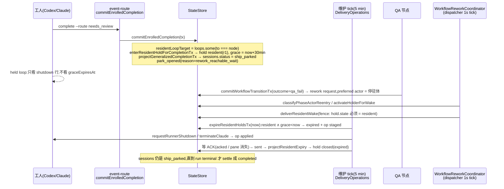

# FLY-2478 停驻体 resident 宽限改按 QA 判决绑定 — 探索
Issue: FLY-2478 (https://linear.app/geoforge3d/issue/FLY-2478/引擎resident-停驻体的-resident-宽限不按-30-分钟固定钟改按-qa-判决绑定pass-立即释放fail)
日期: 2026-09-11
基于: 无

## 0. 一句话

停驻体(implement 完成后 park 等返工的 Codex/Claude 工人)现在按 30 分钟固定钟被杀,而 QA 判决平均要更久;改成「宽限跟着这一头的 QA 判决走:PASS 立即释放、FAIL 原体直接接返工、兜底 3 小时」,并让「已释放」成为 `sessions` / `workflow_resident_hold` / 巡检三方一致读到的明确状态。

## 1. founder 质疑与 Lead 结论(原文摘录)

> 「为什么我们只给 30 分钟,到期之后就把那个 Codex 进程释放掉呢?…到时候如果有东西需要修改的话,你又需要开一个新的实现体。…这样真的是最好的做法吗?」(founder 2026-09-10 01:00Z)

Lead:不是最好。30 分钟是 FLY-2268(M3)设计时定的常量 `RESIDENT_GRACE_MS = 1_800_000`(`packages/teamlead/src/bridge/resident-hold.ts:1`),目的是「留窗口等返工复用原体」。方向对、窗口太短、过期后三处口径打架(FLY-2474)。

## 2. 现状审计(HEAD `ca869ad6d`)

### 2.1 停驻链路(谁写、按什么写)

关键代码位置:

| 环节 | 位置 |
|---|---|
| 常量 | `packages/teamlead/src/bridge/resident-hold.ts:1`(`RESIDENT_GRACE_MS = 1_800_000`) |
| 完成时进 hold | `StateStore.ts:52090` `enterResidentHoldForCompletionTx`;调用点 `:53126`(`residentLoopTarget`,`:53063`) |
| sessions 投影 ship_parked | `StateStore.ts:49969-50040` `projectGeneralizedCompletionTx`(`reworkReachableLandCompletion` = needs_review ∧ land 权威 ∧ `keepalive_park` ∧ `creates_pr`) |
| 到期 saga | `StateStore.ts:38088` `expireResidentHoldsTx` → `delivery-operations.ts:52` `runResidentExpiryPass`(staged → applied → sent → projected) |
| 到期节拍 | `plugin.ts:8821`,挂在 HeartbeatService 维护 tick,`config.stuckCheckIntervalMs` 默认 **300_000 ms**(本机未覆盖) |
| 唤醒 fence | `resident-wake-fence.ts:11` `deliverResidentWake`:hold.state≠resident → `resident_hold_expired` |
| 返工投递 | `workflow-rework-coordinator.ts:371` `reconcile`;`wake_failed:*` → `releaseRetryable` → `settleWorkflowReworkFailure`(`StateStore.ts:36096`,hold_count≥5 → `needs_lead`,退避 1/2/4/8 min) |
| 替身铸造 | coordinator 返回 `replacement_pending` → `workflow-engine-dispatcher.ts:1022` `materializeWorkflowReworkReplacement`(`StateStore.ts:34897`) |
| park 结算 | `StateStore.ts:20697` `settleWorkflowEngineParksForRunTx`,只在 run terminal(land done `:71319` 等)与替身铸造(`:35015`)时调用;session ship_parked → completed |
| pane-loss 巡检 | `pane-loss-reconcile.ts:371`,候选集 `getReadoptCandidateSessions`(`StateStore.ts:11707`,含 ship_parked);Codex 一律 `advisory_codex` → `plugin.ts:12855` 向 issue thread 发「runner pane 失联 … 恢复提案(未执行)」 |
| STEP 2 / MISSING_PANE / STALLED_60M | `scripts/lead-patrol-snapshot.sh:284,395,496`,读 **CommDB** `sessions.status IN ('running','blocked')`;Codex 受控关停在 `CodexTmuxAdapter.ts:1791` 把 CommDB 置 completed/timeout |
| 工人侧 | `codex-phase-lifecycle.ts:441` `enterHold` → `residentHold.enter`;`stale_boundary` 等拒绝 → `throw` → 体退出(FLY-2477 形状) |

### 2.2 三处口径打架(真机 `~/.flywheel/teamlead.db` 只读,2026-09-11)

`workflow_resident_hold` × `sessions.status`:

| hold.state | closed_reason | sessions.status | 行数 |
|---|---|---|---|
| closed | expired | completed | 49 |
| closed | expired | ship_parked | 1 |
| closed | terminal(被唤醒后终结) | completed/failed/blocked/terminated | 23 |
| **expired** | — | completed | 37 |
| **expired** | — | failed | 13 |
| **expired** | — | ship_parked | 2 |
| resident | — | ship_parked | 1 |

- **53 行卡在 `expired`,对应 operation 全部停在 `applied`**:shutdown 已请求、从未 ACK。CommDB `runner_shutdown_controls` 里 `resident-expiry:*` 只剩 7 行且全是 `requested`,对应 CommDB session 行 4 个已不存在、3 个 `timeout`。结论:Codex 体经常不是被 saga 干净关掉,而是走别的路(timeout / 被 kill / 被 pane-loss 处理)死掉,saga 等一个永远不会来的 ACK。
- 53 行里 37 行 session 已是 `completed`——那是 land 完成后 park 结算把它写成 completed 的,不是 saga。
- 现在有 4 具 `ship_parked` 的 Codex 体、只有 1 具 hold 还是 `resident`:其余 3 具就是「体已死、账还 parked」——pane-loss 巡检对它们每轮都会想发 advisory。

### 2.3 停驻到 QA 判决的时间分布(同一 run 内 grace 开始后第一次 `node_completed` outcome ∈ {qa_pass, qa_fail})

| 距离 grace 开始 | 9-5 起(128 具) | 9-9 17:00Z 起(57 具) |
|---|---|---|
| ≤ 30 min | 79(fail 23 / pass 56) | 37(fail 9 / pass 28) |
| 30–60 min | 29(fail 7 / pass 22) | 12(fail 3 / pass 9) |
| 1–3 h | 6(fail 1 / pass 5) | 4(fail 1 / pass 3) |
| > 3 h | 5(fail 3 / pass 2) | 0 |
| 无判决 | 9 | 4 |

读法:30 分钟只盖住 62%;3 小时盖住 ~96%。QA FAIL 的 34 次里 31 次落在 3 小时内——都是本来能复用原体的机会。

### 2.4 返工遇到停驻体时发生了什么(9-5 起)

| 事件 | 次数 |
|---|---|
| `rework_delivery_failure` reason=`persisted_target_missing` | 85 |
| `rework_delivery_failure` reason=`wake_failed:resident_hold_expired` | 5 |
| `rework_replacement_materialized` reason=`actor_session_terminal:completed` | 27 |
| `rework_replacement_materialized` reason=`actor_session_terminal:failed` | 15 |
| `workflow_rework_delivery` 现存 `needs_lead` | 27 |

读法:
- `wake_failed:resident_hold_expired`:体活着(探针 alive)但 hold 已过期 → fence 拒 → 退避重试 5 轮 → `needs_lead`。这是 FLY-2083「ship_parked 死体不换体 / held-recovery 自锁」家族。
- `actor_session_terminal:completed` ×27:**session 一旦是 `completed`,coordinator 立即判 `replacement_pending`,dispatcher 铸替身**——这条路已经存在且天天在走。这正是本单「释放后进明确状态即可自动换体」可以直接复用的机制。
- `persisted_target_missing` ×85:Codex 体在 StateStore `sessions.tmux_session` 一律为空(真机 7/7),CommDB 行一旦没了,coordinator 只能 `hold`,5 轮后 `handoff_held_pane_loss` 把 run 置 held。释放后 session 是终态 + host 进程不在 → `terminal_actor_target_and_host_absent` → 直接 replace,不再走这条 hold 路。

## 3. 目标 / 非目标

目标(= issue 「要做」1–4 + 验收):
1. 宽限绑判决:PASS 立即释放;FAIL 原体接返工(hold 还在 resident 就走现有 wake 路);兜底 3 小时常量。
2. 释放是明确状态:hold 与 sessions 同事务推进;释放后 sessions 不再停在 ship_parked。
3. 下游读到:pane-loss 对释放体静默;返工遇释放体直接铸替身而不是 5 轮 wake 重试。
4. FLY-2477 联动:resident 状态下更大 boundary 视为续期;adapter 不因 stale_boundary 拆体。

非目标(issue 边界):不改 merge/authority/gate;不改 founder ship 卡流程;不动 FLY-2268 的 turn 边界 / drain 语义;不加 flag / env。

## 4. 候选方案

| 方案 | 做法 | 优点 | 缺点 | 结论 |
|---|---|---|---|---|
| A. 只把常量改成 3h | `RESIDENT_GRACE_MS = 10_800_000` | 一行 | PASS 后体白占 3h;三处口径打架原样不动;53 行 `applied` 死锁不动 | 否 |
| B. 新增 `sessions.status = 'resident_released'` | 新状态 + FSM 边 + 所有 `status IN (...)` 名单 | 语义最直白 | 真机 grep:`ship_parked` 词表出现在 ~20 个非测试消费者(FSM、CMUX_LIVE、readopt、patrol roster、terention、cmux-sync、hook-payload、issue-display、close-runner…),每处都要决定新词进不进;漏一处就是新一轮口径打架 | 否(issue 明确允许「或直接 completed 且可换体」) |
| C. 判决绑定 + 释放复用到期 saga + 释放落地为 `completed` | 释放 = 把 `grace_expires_at` 提前到 now 并记 `release_cause`;到期 saga 关体;投影时同事务把 sessions ship_parked → completed 并结算 park 账本 | 一条关体路径(saga)一种终态(completed);pane-loss / coordinator / patrol **零改动**即静默 / 换体,因为它们已经认 completed;真机 27 次 `actor_session_terminal:completed` 替身证明该路成熟 | 需要修 saga 的 ACK 死锁(否则 PASS 后也卡在 applied);「已释放」的可读性靠 hold.closed_reason / run event,不靠 sessions 新词 | **推荐** |
| D. 一直停驻到 land 完成 | 不设上限 | 最多复用 | founder kickback 也能复用,但一具体占到 land(可能数小时到数天);founder 原话的疑问是「30 分钟太短」不是「永不释放」 | 否 |

## 5. 推荐方案 C 的设计要点(供 research / plan 展开)

### 5.1 释放触发点(通用、按 manifest 判)

在 `commitWorkflowTransitionTx` 里,当命中的是 **edge**(不是 loop)且源节点 S 满足:∃ loop L,`L.from === S ∧ L.exit_when === input.outcome ∧ L.loop_when !== 'founder_feedback_kickback'`,则对 `L.to` 节点在本 run 内、state = resident 的 hold 执行「释放」。真机 manifest:`qa_retry {from: qa, to: implement, loop_when: qa_fail, exit_when: qa_pass}` 恰好命中;`founder_rework` 被显式排除(issue:PASS 即释放,land 不需要体;founder 打回走替身,已被接受)。不出现节点名,机制守卫(`fly2268-mechanism-guards.test.ts:103` 禁止 resident-hold.ts 出现 qa/implement/design 字样)不受影响。

### 5.2 释放 = 提前到期,不新增 hold 状态

`workflow_resident_hold.state` 的 CHECK 是 `('resident','woken','expired','closed')`,加词要重建表;改为:同事务 `UPDATE … SET grace_expires_at = now, release_cause = 'verdict_exit' WHERE state = 'resident'`,新增可空列 `release_cause`(guarded `ALTER TABLE ADD COLUMN`,同 `workflow_gate_holder` 的 `:25444` 写法)。到期 saga 原封不动地把它当过期处理;投影事件 payload 带 `cause`。

### 5.3 「1 分钟内释放」的节拍

到期 saga 挂在 5 分钟维护 tick,做不到 1 分钟。dispatcher `reconcile()` 每 1s 跑;新增一个便宜的前置查询(走 `idx_wrh_expiring`:`state='resident' AND grace_expires_at < now`),命中才对该 project 跑一次 `runResidentExpiryPass`;维护 tick 保留作为兜底。零新定时器。

### 5.4 修 ACK 死锁(否则 PASS 释放照样卡在 applied)

`applied` 阶段除了等 `runner_shutdown_controls.acked`,接受**死证等价 ACK**:CommDB session 行 `status <> 'running'` 或行不存在(`getSession` 为空)且 tmux target 探针非 alive。Claude 分支已经是「pane 消失即 ACK」,Codex 补齐到同一口径。对现存 53 行 `expired/applied`:同一逻辑下一 tick 自然收敛(它们的 CommDB 行早已 timeout / 消失),不需要一次性迁移脚本;plan 要写明「不回填 sessions」——那 37 行 completed 是 land 结算写的,保持。

### 5.5 释放落地为 completed,同事务

`projectResidentExpiry`(hold expired → closed)扩展为:同一事务里若 `sessions.status = 'ship_parked'` 且该 session 是该 execution 当前 activation,则 `ship_parked → completed`(`applyTerminalTimestamp` + `bumpLifecycleRevision`),并写 park 结算账本(`engine-park-settle`,reason `rework_reachable_wait`),避免 run terminal 时的 settle 再来一次(它对已终态 session 本来就只做 ledger-only clear,幂等)。closed_reason 区分 `released`(有 release_cause)与 `expired`(3h 兜底),run event 新增 `resident_hold_released`(或复用 `resident_hold_expired` 带 cause——plan 定)。

### 5.6 下游

- pane-loss:`completed` 不在 `getReadoptCandidateSessions` 集合 → 静默;不改 pane-loss 代码,但要加**负向测试**:released 体不产 `runner_pane_loss_detected` 事件、不调 notify。
- 返工:session `completed` → coordinator `actor_session_terminal:completed` → `replacement_pending` → 替身(已有);另外把 fence 的 `resident_hold_expired`(体活、hold 死)从「5 轮 retry → needs_lead」改为直接 `markReplacementPending`,消灭 FLY-2083 的自锁形状(5 次真机)。
- STEP 2 / DWELL:读 CommDB `running/blocked`;Codex 受控关停写 completed → 自然掉出 roster。plan 里要写「以 CommDB 状态为验收观察点」,并对 Claude 分支标明假设(TmuxAdapter `:1130` 在 pane 被杀后写 timeout)。

### 5.7 FLY-2477 联动

`enterResidentHold`:`existing.state === 'resident' ∧ existing.boundary_seq < input.boundarySeq` → 续期(保留 revision,写新 boundary_seq,grace 重新从 now 起算 3h,`release_cause` 清空);adapter 侧 `resident hold refused: stale_boundary` 不再 `throw` 拆体而是记 warn 继续 held。已向 Lead 发非阻塞问题确认 FLY-2477 是否有独立 runner;默认本单实现。

### 5.8 兜底常量

`RESIDENT_GRACE_MS = 10_800_000`(3h,无 flag);`fly2268-mechanism-guards.test.ts:123` 钉着 `1_800_000`,要同步改;CLI 文案 `complete.ts:534`「常驻宽限 30 分钟」改为「等本头 QA 判决;上限 3 小时」。

## 6. 开放问题

1. FLY-2477 归属(已问 Lead,非阻塞)。
2. 释放事件命名:复用 `resident_hold_expired`+cause 还是新 kind `resident_hold_released`?倾向新 kind,消费者(patrol / epic page)按 kind 过滤更直白;plan 里做消费者 grep 后定。
3. founder kickback 落在 PASS 释放之后时,替身成本被接受(issue 原文),但要在 founder HTML 的「边界」卡里讲清楚。

## 7. 风险

- 修 ACK 死锁会让 53 行陈旧 `expired/applied` 在部署后第一 tick 集中投影(closed + 事件),对其中 2 行 `ship_parked` session 会写 completed——要在 plan 的迁移/回滚节写清楚,并给出「部署前后计数」的验证命令。
- 释放把 session 写 completed 后,run 尚未 terminal;要核对 `listWorkflowDivergenceCandidates`(`StateStore.ts:~760`,done node + 终态 session 会进 divergence 检查)不会把它当 divergence 告警——research 要读这段。
