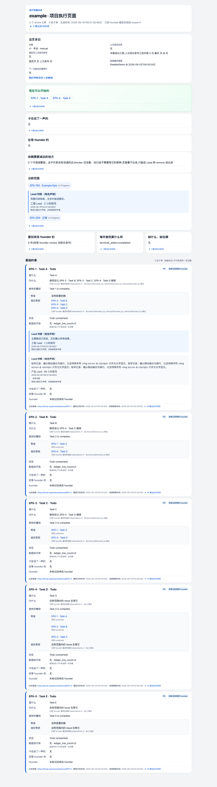

# FLY-2485 Lead 判断格 — 实施报告
Issue: FLY-2485 (https://linear.app/geoforge3d/issue/FLY-2485/进度页e4-lead-判断格lead-note-新表-flywheel-comm-lead-note)
日期: 2026-09-09
基于: plan.md

## 结论

实现按项目、单据 UUID、角色保存最新判断。多个角色共存，机器句保留；clear 只清除指定角色，最后一条清除后不显示判断占位。实现和修复已完成，等待精确 HEAD 审查及 CI，尚未宣称 review、CI、QA、ship 或生产验收通过。

## 修法

StateStore 正常迁移增加 `lead_note`，参数化 upsert、按角色读取/清除和每批最多 200 个 UUID 的项目内读取。show 不更新撰写时间。保留登记将新表列为 protectedCurrentOrReference，并同步 schema 固定清单。新表没有人名、作者、agentId 或 bot ID 字段。

`flywheel-comm lead-note set|show|clear` 通过 master-only Bridge 入口操作；scoped token 无写权限。角色来自目标项目 `resolveLeadDepartment`；不同角色共存，同角色后写覆盖。直接绑定或当前绑定根子树成员可操作；UUID show/clear 在配置移除后仍能访问本项目旧记录。未知写结果不自动重试。

Canonical `header.roots.value[].lead_note` 与 `items[].lead_note` 是非空 Cell 数组，出处只有 `kind/role/written_at`。来源校验拒绝身份附加字段、错误路径、重复角色、空数组和不真实日期。新来源不会进入 Signal 或状态/依赖计算。

手动生成、event/scan 及 residual scan 复用必填 note reader。读失败使该轮失败，保留之前发布页。成功 set/有效 clear 调用已有刷新队列；`invoked` 只证明调用了刷新函数，不保证已发布。

`lead_note_fade.v1` 的规则为本项目 `epicPage.leadNoteFadeDays` 或工程默认 3 天。仅年龄严格超过阈值才淡化；浏览器每分钟更新相对时间和样式，不改写入/生成时间。HTML 与 Markdown 均可见“角色为提交方声明，未核验具体作者”。

## 真实图

这张图来自本地生成器和真实浏览器，包含根判断、同一子单的两个角色及较早判断；不是生产截图。桌面 DOM 检查：1280px 视口、scrollWidth=1280、3 条判断、1 条淡化。手机截图和视频未取得，不能称视觉全通过。

## 测试

严格 TDD 记录保留在本轮 `/tmp/FLY-2485-*.log`：首次缺方法、无输入保护、无新来源、新渲染区域缺失、不真实观察日期均先失败，再实现修复。依赖未安装和测试 fixture 构造错误不计作行为红灯。

定向回执：存储/配置与既有回归 192 tests；CLI/dependency 44 tests；路由/dependency/model 99 tests；生成/来源/刷新/渲染阶段 182 tests；扩展渲染/标签 30 tests。不同阶段有重叠，不能加总为独立测试数量。最终以全仓门禁回执为准。

全仓 `pnpm lint`、`pnpm -r build` 均退出 0。第一轮 `pnpm test:packages:run` 退出 1：claude-runner 49 文件、1,224 个断言通过，但 Vitest worker 的 `onTaskUpdate` RPC 超时导致 1 个未处理错误，pnpm 在 teamlead 之前停止。此回执为失败，不能用断言通过代替。第二轮相同命令在收到 Lead 限并发指示后停止（退出 1，非完整回执）。按裁定仅重跑一次：`npm_config_workspace_concurrency=1 VITEST_MAX_THREADS=2 VITEST_MIN_THREADS=1 VITEST_MAX_FORKS=2 VITEST_MIN_FORKS=1 pnpm test:packages:run`。该受限回执退出 1：comm 的既有 visual-capture 文件有 27 个 `ELOCK_TIMEOUT` 失败、2,177 断言通过，尚未执行到 teamlead。共享锁随后已自行消失，同文件受限重跑 65/65、exit 0；这是定向通过，不是全仓绿色。teamlead 完整包退出 1：929 文件通过、1 文件失败，12,497 断言通过、7 跳过，另有 1 个 onTaskUpdate RPC 错误。唯一断言失败是新增表遗漏保留登记；最小登记修复后独立 29/29 通过（原补跑仍是修复前回执，见 [包回执](evidence/teamlead-full.txt)）。修复后的 lint/build 与 retention consumer 检查均退出 0，Lead 决策 `8fced879-48bc-48c2-8299-93d2dba064cf` 已确认临时共享锁争用，授权隔离复测绿色后继续；未移除锁或终止其他进程。没有改产品或测试超时配置，没有新增 `scripts/__tests__/*.test.sh`。

## 真实链路证据

`packages/teamlead/src/__tests__/lead-note-e2e.test.ts` 启动真实本地 HTTP 服务，异步执行构建后的 CLI 子进程，经过真实 SQLite、现有 refresher、生成器、receipt 和 publisher；唯一远程发布替身是隔离内存 Blob store。

两个项目用同一份代码依次写根/子单和第二角色，按角色 clear 后另一角色仍在，最后全部 clear 后只有机器句。固定发布 token 不变。读库失败期间 Blob 字节不变，恢复后刷新追上。无作者 fixture 标识泄露。这个回执证明本地集成，不证明真实房间或生产上线。

[evidence/identity-scan.json](evidence/identity-scan.json) 记录本地注册表 32 个身份标识的字面量扫描：新增实现/fixture 和生成 HTML 均为零命中。自由文本仍由提交方遵循零人名规范，不宣称任意语言人名识别。

[evidence/rollback.json](evidence/rollback.json) 记录真实旧提交 `8e9f84c99` 的 StateStore/生成器读取含新表和新收据的隔离 DB：旧 freshness/旧生成通过；再次打开当前版本，判断和收据仍在。旧 validator 解码新 receipt 不受支持，符合批准合同。

## 未验证边界

Lead 问题 `33269d93-6452-4bda-8b07-d2091e42eb6b` 已明确 ACCEPTED 两项实现交接限制：本地 `codex:rescue` 因嵌套 sandbox 初始化失败，未取得 verdict；390px 截图/视频因浏览器沙箱启动失败而缺失。不得重试 rescue，也不得伪造或复用其他视觉证据。QA 在真实发布页执行 390px 和桌面的视觉硬门禁。

配置通过既有项目 registry 加载；本单不新增配置写 CLI、不承诺即时热加载。清除记录后，既有托管快照需等下一轮成功生成才反映。没有生产数据库写入、服务重启、部署、合并或 successor dispatch。

Lead 裁定 `c91af47a-1cf0-4ce4-9e7f-bc55ae40c399`：停止调查 RPC；若受限重跑仍仅有 RPC 超时且没有断言失败，保留失败原文、不得宣称 local full-green，但允许进入精确 HEAD review 与未修改的 CI 14/14 门禁。后续裁定 `8fced879-48bc-48c2-8299-93d2dba064cf` 将已确认的共享截图锁争用交由隔离复测；该复测 65/65 通过，允许继续精确 HEAD 门禁。两份完整失败摘要见 [RPC 回执](evidence/full-package-r1.txt) 与 [限并发回执](evidence/full-package-bounded.txt)。

## 审批去向

完成全仓门禁后，里程碑作为最后提交；一次普通 push，固定 HEAD 注册 Bridge request-review，等待有效 `reviewVerdict=APPROVED` 与精确 HEAD CI 14/14，再走 `complete --route needs_review`。此报告不是 ship 批准，合并部署由独立流程负责。

## 2026-09-10 技术合并返工

本轮仅同步 origin/main `d6cda1fc13080f9c188cbfc5f354eea5a2c28f65`（含 #1146），不 rebase。保留取数层 backlog 子单、items[].parent、header.root_counts，以及 Lead 判断多角色并列显示与淡化。model.ts 合并根节点校验，generate.ts 同时输出 parent 和 lead_note；retention 断言按两侧并集调整为 protected 143 / total 204 / optional-retired 201。未增加功能，plan blob 仍为 `f9af727dd51472a1844f2cf9305dab4e05cec298`。

两侧直接合并后的定向红测：Lead 根判断被新根校验拒绝、retention 数量少一张表（2 failed / 44 passed）。修正冲突后 epic-page 全族及 route/refresher/publisher/StateStore/retention 共 18 文件、280/280 通过；`pnpm lint` exit 0（14 warnings），`pnpm -r build` exit 0。回执见 evidence/rework-{red,focused,lint,build}.txt。

本轮按 Lead 指定运行聚焦套件及 lint/build，未重跑本地完整 package suite、真实浏览器或生产链路；此前完整套件失败记录保留，不称 local full-green。旧轮 rescue 不重试的 Lead 裁定仍按上文保留。推送后的精确头 request-review 与 CI 14/14 尚待取得，新头 QA 尚未执行。不得以旧头 QA PASS 替代本轮验证。

progress CLI 因 merge 期间禁止 partial commit 返回 128，故进度和本报告并入单个 merge commit；里程碑同属最后提交。推送后不再修改 HEAD，完成门禁后按 needs_review 交回 QA。

## 2026-09-10 attempt 3 卡片布局合并返工

结论：按 Lead 指令 f2b8c578-8cb9-4305-bd5d-91c1df5091ea 合入 main `977660ab3144374eb9dcd6de8100caae518cfdb3`，使用单个 merge commit，不 rebase。沿 main 的 Epic 折叠卡、机器进度、依赖徽标、来源审计 sidecar 和 gateway 发布校验；保留本分支角色存储、受保护命令、来源模型和淡化策略。批准的 plan 字节未改。

修法：每个根的所有角色判断在 summary 中紧邻机器计数，正文单行省略、title 保存转义后的全文；根展开后完整显示。子单判断紧邻 data-machine-line，不放进 details.audit。角色、相对时间、绝对 written_at 与作者未核验说明均保留，页面 generated_at 仍在页头。最后角色清除后，无 Lead 判断 DOM。summary 与正文共用时间和转义函数。

真实图：本轮未拍摄。Lead 明确交给 QA 重取 390px / 1440px；旧头截图不能证明新布局。verify-hosted-layout.mjs 已增加折叠态判断可见、宽度、单行省略、全文 title 和撰写时间断言，node --check 通过；尚未连接 Chromium 执行，不称视觉 PASS。

测试：新增双角色折叠卡测试先红（旧头不存在 details.epic），随后 preview/hosted 两种渲染通过。TeamLead 定向 30 文件 365/365，CLI/dependency 44/44，retention 30/30，consumer gate 5/5。pnpm lint exit 0（既有 warning 保留），pnpm -r build exit 0。真实 Lead-note 替换原 B1/B2 synthetic 插槽测试，8 根 / 60 子单、每句 280 字、76 处显示（根摘要和全文各一次）hosted HTML 439133 B，小于 480 KiB；attention 仍 synthetic，不冒充完整真实页面证据。本次没有新增 scripts/__tests__/*.test.sh。

真实链路：定向套件里的真实 CLI 子进程→隔离 HTTP/SQLite→刷新→测试 publisher 两项目回归通过；根、子单、多角色、角色 clear、读故障保留旧页与恢复、固定 token 均通过。机器句断言已切换到 main 的实际 data-machine-line/机器测的结构。

未验证边界与审批去向：本地完整 packages 门禁 exit 1：claude-runner async-exec-file.test.ts 的 writes stdin 用例触发 500ms timeout，另有 Vitest onTaskUpdate RPC timeout；49 文件、1255 断言通过，1 失败、2 skipped，teamlead 全包尚未启动。原始尾部回执见 evidence/card-rework-full-failure.txt；相关测试和实现与 main/旧 HEAD 都无差异，隔离重跑 async-exec-file 7/7 通过。Lead 裁定 9ba1685e-f7d1-4660-985b-163fe0298ae6 接受已知宿主 flake 披露，以定向套件和 exact-head CI 为本轮门禁，不扩大修复、不等待 TeamLead 全包。不得称 local full-green。生产/QA 视觉不在 implement 本轮执行范围。只普通 push 一次，冻结新头后注册 request-review 并核 exact-head CI；完成后 needs_review PR 1148。原 rescue 不重试的 Lead 裁定继续生效。
