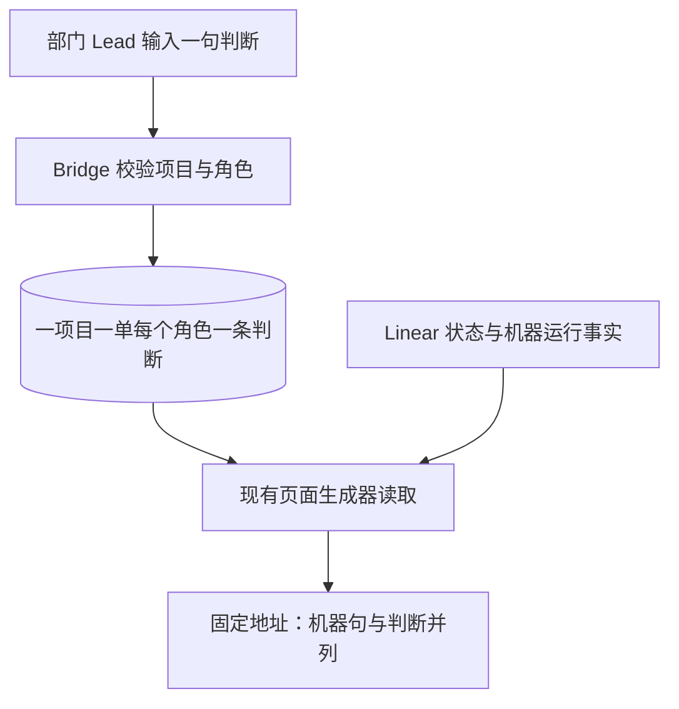

# FLY-2485 Lead 判断格 — 实施计划
Issue: FLY-2485 (https://linear.app/geoforge3d/issue/FLY-2485/进度页e4-lead-判断格lead-note-新表-flywheel-comm-lead-note)
日期: 2026-09-09
基于: research.md

状态：R2 有效 reviewVerdict=APPROVED，原始 reviewerVerdict=APPROVED。评审请求 `e172fabe-61e0-440a-ba1c-6c5158fbed9d`；6 条非阻塞建议与交接边界见 review-round-2.md。批准的是设计，尚未实现或完成产品验证。

Lead 裁定：问题 `913a8ccb-7321-43d1-8953-034c00ecb876`（同时答复 `2cb86bbf-53b8-4f1d-b281-3d8ffc6abc1b`）明确一项目一单每个角色保留最新一句，不同角色共存；本版已采用。后续问题 `99e28443-02c3-4f76-bbcf-6fd19029f8c7` 已获 AGREED：写范围改为直接绑定 OR 当前绑定根子树，补缺标签/跨 team 在页子单反例。此文是实施合同，不是已实现/已验证声明。

## 一、给阅读者的结论

Lead 是部门负责人角色。负责人用命令给一张单按角色写一句“现在到哪了”，不同角色可并存，页面在机器说明旁显示它，并标注角色和写入时间。没写就只有机器说明；默认超过 3 天变淡，仍可读、不会自动删除。

Epic 是包含多张子单的一块工作。Epic 和子单使用相同写入方式，不等其他进度页改造；现有根列表的位置保留。状态、依赖、审批与排序仍由各自原有来源决定。

### 用户能看到的变化

1. 写入前：机器句“设计阶段 · 第 1 次”。
2. 写入后：原机器句保留，旁边出现“Lead 判断：方案已收敛，正在补验证路径”，以及“工程 Lead · 2 小时前写”、完整写入时间；页头仍有页面生成时间。
3. 清除某角色后：下一次成功刷新仅移除该角色的句子；清除最后一个角色后只剩机器句，没有“暂无”判断占位。
4. 过期：超过配置天数的句子变淡并注明“较早判断”，不会改任何状态或假装重新写过。

### 核心流程



Bridge 是接收内部命令的服务；生成器把真实数据变成一份只读页面。写入成功之后沿现有刷新队列更新固定链接，成功回执不冒充已发布。

## 二、技术契约

### 1. 范围、身份与角色

- 存储键唯一为 `(project_name, issue_uuid, role)`，project_name 为项目注册表精确键；issue_uuid 为 Linear 返回的稳定 UUID。identifier 只是查找/显示名称，不作持久主键，不存标题/人名/agentId/bot ID。
- CLI 接受标准 issue identifier（沿 dependency 的 identifier grammar），set 用现有 `lookupLinearIssueByIdentifier` 得到 UUID。写范围谓词为 `issueMatchesBinding(issue,binding) || membership(snapshot,issue.id)`：先检查本单直接绑定；不满足时调用现有 `fetchLinearActiveScopeSnapshot`，用完整 snapshot 的 `roots[].id ∪ descendantIds` 判断该单属于绑定根的子树。页面对子单不要求继承 team/project/label，写入口也不能加这项隐藏排除。
- 直接绑定分支不按状态限制，允许暂停 Epic；子树分支包括当前页面 items 与尚未显示的 backlog descendants。只有两分支都否定才 403 issue_outside_project；snapshot 无根/缺日常声明/分页截断/超界时不能把不完整证明说成跨项目，返回 422 scope_membership_unavailable；上游超时/失败 502 linear_unavailable，零写入。不得直接相信调用方传入的 root/parent/scope 布尔值，不修改查询 scope 或放宽 token。单据符合直接绑定时无需 snapshot，避免无 active scope 阻碍合法写入。
- role 是部门的稳定标识，使用 `resolveLeadDepartment` 从目标项目现有 leads 生成允许集合；取消额外 ASCII 正则：role 是非空、无首尾空白、无控制符/换行的原始部门字符串，允许中文、内嵌空格与既有标点；不 lowercase/NFC/slugify 显式 department。set 要求 exact membership。若配置中的某部门不满足这些最小文本条件，该角色 set 明确返回 422 role_configuration_invalid（不默默丢弃、不导致整个项目/Bridge 启动失败）；未配置角色返回 400 invalid_role。show/clear 违反文本条件返回 400 invalid_role；否则只按相同文本条件并按原始字符串匹配旧行，以便配置移除后仍可清理。不使用 SummaryRole、不把 persona-bearing agentId 解析成角色；中文显示名只在它本来就是配置 department 时可作 role。
- 项目内所有已有部门都可使用，与 issue owning Lead/部门无绑定；不增加 canSpawnRunners 限制。整个项目没有任何可用 department/首个 match label 时，set 返回 422 role_configuration_missing；若仅某一 Lead 缺这两项，不为它猜角色，其他已配置部门继续可用。同部门的多个 Lead 共用同一格，互相更新该部门的最新一句；这不是逐个 Lead 的独立笔记，也没有作者级追溯。
- 显示名只在 `epic-page/labels.ts` 一处生成：engineering→工程 Lead、product→产品 Lead、operations→运维 Lead、infra→基础设施 Lead、pm→产品规划 Lead、content→内容 Lead、life→生活 Lead、growth→增长 Lead、reflection→复盘 Lead、xuanxue→玄学 Lead；既有 `*-triage` 部门显示“分流 Lead”。这些来自本轮实际部门集合，删除不存在的 qa/cos 映射。未知已配置角色统一显示 escaped `部门 Lead（<role>）`，角色身份仍是原始字符串，显示词绝不反向解析成身份。词表只负责显示，不定义第二份身份允许集合。更换显示名不迁移存储键。
- 凭据沿 dependency 的 `masterOnlyAuthMiddleware`：无配置 503；scoped 403；无效/缺失 401；只允许 master。不得把浏览器 session、CORS 或客户端传来的 role 当身份验证。shared token 不提供逐 Lead 签名。页面判断区域和 Markdown 必须可见说明“角色为提交方声明，未核验具体作者”，不只在报告中披露；保留 PRD 要求的“<角色> · N 小时前写”并将标签写为“Lead 判断（角色声明）”。
- F13/S3 的自动保证是角色来源受约束、零作者身份字段、零人名硬编码。Lead 必须用角色写自由文本；QA 对新增代码、fixture、JSON、HTML、Markdown、报告执行配置身份词的字面量扫描。此范围不等于任意自然语言人名识别，不能宣传此类保证。

### 2. 新表、事务、重试

正常 `StateStore.create` migration 中新增 `lead_note`，全新空表，无推断、回填或从旧评论迁移。

```sql
CREATE TABLE IF NOT EXISTS lead_note (
  project_name TEXT NOT NULL,
  issue_uuid TEXT NOT NULL,
  role TEXT NOT NULL,
  text TEXT NOT NULL,
  written_at TEXT NOT NULL,
  PRIMARY KEY (project_name, issue_uuid, role)
);
```

- 使用已有 SQLite transaction / parameter binding / save 风格；动态输入绝不拼 SQL。无需新索引：复合主键已经覆盖 project 分区读取。
- StateStore 提供四个小入口：`setLeadNote({projectName,issueUuid,role,text,writtenAt})`、`getLeadNote(projectName,issueUuid,role)`、`clearLeadNote(projectName,issueUuid,role)`、`getLeadNotes(projectName,issueUuids)`。批量读取使用 project 参数与 UUID 参数列表，最多 200 个 UUID 一批，仅占位符串由固定集合长度生成，值全部绑定；根和子单 UUID 先去重。
- set 每次成功调用都是一次新的撰写，用服务端 `now().toISOString()` 更新时间，事务 upsert 仅替换同一角色的正文与时间。不同角色各存一行；同角色最近提交者胜出；不新建 revision/history/op-id 机制。不声称网络 exactly-once。
- 写入未知结果（网络断开、无效响应/5xx）CLI 返回非零，提示先 show 核实；不自动重试写，以免旧请求覆盖后来一句或伪造更新时间。
- clear 必须显式 --role，只删除该角色，返回 `changed:boolean`；重复 clear 成功且 changed=false。不写清除墓碑、默认角色或空句。show 和生成都不得修改 written_at。set/show 成功回执给出 issue_uuid；show/clear 的 --issue 除 identifier 外可接受 UUID，用已配置 project_name+本地 UUID+role 直接读取/清除，不调用 Linear、不要求当前 linear binding 仍存在；只操作该项目既有行，不能借 UUID 写新记录。未知本地 UUID 的 show 返回空，clear changed=false。不新增 alias 表、批量删除或新的凭据路径。
- Store 失败不返回 ok，不请求刷新；read helper 不迁移/创建表。读取失败不得转换成无记录：生成整轮失败，由现有 `runEpicPageAttempt` 记录 transient failure 并保留上一张已发布页及其旧生成时间。状态入口能查失败；不对旧页面追加虚构结果。
- 旧版可忽略新表。回滚保留 lead_note 和历史出处收据，下一次旧版生成回到机器显示。新增 kind/reason 的旧收据不能喂给旧 schema validator；正常生成/freshness 读路径无需解码历史收据，禁止自动删表/删历史去“兼容”。降级操作与部署属于 updater，另有真实旧版读/生成验收。

### 3. 命令与 HTTP

仅新增 `commands/lead-note.ts` 并在 `src/index.ts` 的帮助、switch 注册；复用 `node:util.parseArgs`、原生 fetch/URLSearchParams 和现有 token/Bridge 环境约定。无需新 CLI 框架。

```text
flywheel-comm lead-note set --project example --issue EXM-12 --role engineering --text '方案已收敛，正在补验证路径'
flywheel-comm lead-note show --project example --issue EXM-12
flywheel-comm lead-note clear --project example --issue EXM-12 --role engineering
# Linear 不可用时，可将 --issue 换为前次回执中的 issue_uuid（仅 show/clear）
```

- `--project` 可回落 FLYWHEEL_PROJECT_NAME；Bridge URL 与 token 取法同 dependency。set 必须有 role/text；clear 必须有 role 且拒绝 text；show 可选 role 过滤并拒绝 text；未知、重复、位置参数全部报 invalid_arguments。禁止 `--actor`、`--written-at`、`--status`、`--force`。
- `POST /api/lead-note/set` body 精确 `{projectName,issue,role,text}`；`GET /api/lead-note/show?projectName=...&issue=...[&role=...]`；`POST /api/lead-note/clear` 精确 `{projectName,issue,role}`。不挂页面写入口，不放宽 scoped token 路由允许表。
- show/clear 用 identifier 时沿上述 lookup+范围证明；用 RFC4122 形式 UUID（8-4-4-4-12 十六进制）时走本地已存记录分支，reject set 的 UUID 输入。两种目标保持同一 --issue/body issue 字段。POST 必须 JSON object，拒绝数组/null、多余字段、错误类型；GET 拒绝重复 query/数组与未知字段。本地形状校验在 lookup/SQL 前完成，auth 更早；范围证明在 lookup/snapshot 之后、SQL mutation 之前完成。
- text 按 NFC + trim 规范化；1–280 Unicode code points，一行，拒绝 C0/C1 控制字符、CR/LF/U+2028/U+2029。文字是纯文本，绝不解析 Markdown/HTML/命令。不尝试以句号推断“只有一句”。role 不隐式取 agentId。
- 200 set：`{ok:true,command:"set",project,issue,issue_uuid,note:{text,role,written_at},refresh:"invoked"|"unavailable"}`。
- 200 show：`{ok:true,command:"show",project,issue,issue_uuid,notes:Array<{text,role,written_at}>}`，无记录 notes=[]；总按 role 字典序，无 role 时返回该单所有角色，有 role 时只返回匹配者。纯只读，不调用 `/api/epic-page/generate`。
- 200 clear：`{ok:true,command:"clear",project,issue,issue_uuid,role,changed,refresh:"invoked"|"unavailable"|"unchanged"}`。
- 错误 stdout JSON `{ok:false,error:<稳定码>,status?:number}`，stderr 一句诊断；不回显 token、原始上游对象、请求 text 或作者身份。400 invalid_arguments/invalid_role/invalid_text/unsupported_option；404 unknown_project/project_unbound/issue_not_found；403 issue_outside_project；501 linear_not_configured；502 linear_unavailable；500 store_error；422 scope_membership_unavailable/role_configuration_invalid/role_configuration_missing。
- 每次成功 set、实际生效 clear 调现有 `requestRefresh(project,"lead_note_changed")`；返回 invoked 仅表示调用了 void requestRefresh，不证明入队、生成或发布；它内部可能记录 skip/错误并正常返回。回调未接线或同步抛错才 unavailable。记录仍 durable ok，实际刷新结果看现有 epic-page status/refresh 账本；不为本单改造 requestRefresh 返回类型。Linear 故障时 UUID clear 可完成本地删除，但旧托管快照要等下一次成功生成才消失，不能宣传即时撤回网页。

### 4. 统一页面结构与兼容

保留 schema_version=1，作为可选增量扩展：旧页面无字段仍有效；新生成器总是写策略字段，没记录时不写 lead_note；有记录时是按 role 字典序的非空 Cell 数组。字段保持 PRD 名 lead_note，数组承载 Lead 裁定的多角色共存。不能新增镜像 `roots`。

```text
items[i].lead_note?                         → 非空 Cell<string>[]
header.roots.value[i].lead_note?            → 非空 Cell<string>[]
lead_note_policy?                          → Cell<{fade_after_days:number}>

每个角色判断的 Cell：
  value: 一句纯文本
  provenance: {kind:"lead_note",role:"engineering",written_at:"2026-09-09T12:00:00.000Z"}
  observed_at: 本次读库时点
  source_updated_at: 与 written_at 完全相同
```

- role/written_at 唯一位置为 provenance；不在 item/root 再镜像。非空 Cell 不带 missing，值符合 text boundary；observed_at/source_updated_at 必须有效 UTC，source_updated_at 必须等于 written_at。写入日期有效性使用标准 Date 解析加 ISO 规范核验，不只看正则。
- 新来源仅允许上述两个 lead_note 数组的元素路径；`Signal.provenance` 明确保持 statestore|commdb，其他 Cell 不能借新 kind 自称 Lead。
- 完整闭集接线：`model.ts RULE_IDS` 增 `lead_note_fade.v1`，`REFRESH_REASONS` 增 `lead_note_changed`；document 顶层 `requireExactKeys` 的 optional list 增 `lead_note_policy`，存在时 assertCell 并校验 value 只有有限正数 fade_after_days。receipt 的 refresh reason 验证继续复用同一 REFRESH_REASONS，不复制第二份枚举。
- `assertEpicPage` item 仅增加 optional lead_note 非空数组，单独校验每一格，不加入 required ITEM_CELLS/gaps 枚举。根数组每个对象检查原字段与 optional lead_note 非空数组；数组 role 必须唯一并按字典序排列。无注释字段兼容；空数组/重复角色/乱序数组拒绝。
- 对 `/header/roots/value/<index>/lead_note/<role-index>` 的精确路径，用同一 `assertCell` 校验嵌套 Cell 并停止进入其 value 的 timestamp-key scan；其他任意嵌套 observed_at/written_at 仍拒绝。不全局允许 value 中出现时间戳。
- receipt 保留外层 `/header/roots` 来源，另收集每个实际存在的根/子判断 Cell；新增 kind 验证，严格拒绝 author/name/agentId 等额外 key。每个角色路径独立且稳定排序；收据只含出处/时间，不新增正文副本。
- 扩展 HTML/Markdown provenance 分支，避免落到 derived 的 rule/from；source traversal 要测试根来源和根判断同时存在且各一次。
- generatedAt 一次捕获；note 写入时间保真，freshness sourceCells 加实际 note 的 observed_at。contentDigest 保留 written_at；set 同文本重新写也能被识别为新撰写。
- 手动路由、event/scan plugin wiring 都经同一 materialize reader。先拿 root/items UUID 去重，再批量读本项目记录，再同步生成文档；不因 note 扩大 scope。
- 如果 E3 先合入并移动根字段，由实施者依当前 TURN 检查并只迁移这一个 canonical 路径及引用/测试；保持同一合同，不同时维护两套根数据。

### 5. 配置、淡化与显示

- 在 `ProjectEntry` 增可选 `epicPage?: {leadNoteFadeDays?:number}`，由 `loadProjects` 校验 object 和精确子键。缺省解析为 3；显式值要求有限正数且 `N * 86_400_000` 仍有限，拒绝 0/负数/NaN/Infinity/字符串。允许小数天，不造无理由的上限。
- 解析值在物化时进入 `lead_note_policy`，来源 `{kind:"derived",rule:"lead_note_fade.v1",from:[]}`，observed_at=generatedAt；规则明文“本项目 epicPage.leadNoteFadeDays 或工程默认 3”。规则不用于任何状态计算。旧文档缺策略时同一默认常量回落 3。
- 配置持久化于已有项目 registry，不通过本单 CLI 修改；经已有配置加载流程生效，下一轮生成带新策略，具体热加载能力以部署运行时为准，不承诺即时热更。
- age = `max(0, nowMs - Date.parse(written_at))`；仅 `age > N * 86_400_000` 淡化。恰好 N 天不淡化；N−1 天正常，N+1 天淡化。不能用日期字符串、午夜或 observed_at 计算。
- 初次 HTML/Markdown 用可注入 now 生成；HTML 已有一分钟刷新脚本扩展为更新所有 `[data-lead-written-at]` 的相对时间和淡化 class，阈值从 escaped DOM data 属性读取，不把正文拼进 script。Lead 时间 updater 与已有 freshness-age updater 各自判断所需节点，不把整段函数挂在现有 `if(!root||!age)return` 之后；缺少页面年龄节点不应阻断 Lead 时间更新。浏览器时钟早于写入时用“刚写”，完整时间仍在。
- 1 小时内“<角色> · 刚写”；其余“<角色> · N 小时前写”。完整 written_at 用可见 time 元素，页头 generated_at 同屏可找；较早句加“较早判断”标签，并降低背景/强调色，正文保持可读对比度，不能整卡 opacity 造成不可读。
- 所有角色句按 role 稳定排序放在现有机器 executionSummary 后的相邻行；根在 scope overview 中将已有 root 状态与判断放同一 root 容器。保留机器句全部内容，无注释则不输出判断 DOM、空白徽标、审计占位或“暂无”。
- HTML 文字/role/时间及属性均走现有 escapeHtml；Markdown 走 escapeMarkdownTableCell，放独立段并注明较早判断。不扩大成 E3 卡片重做或历史 Markdown 表格清理。
- HTML script 合并到现有唯一 `<script nonce="__CSP_NONCE__">`；只用 addEventListener/textContent，零派生 innerHTML、零 inline handler、零远程脚本/字体。页面不具备 lead-note 写能力，设计报告留言仅本地保存/复制。

## 三、实施步骤与验收证据

R1 回应详见 review-round-1.md。每个步骤先运行下述失败用例，确认命中缺失行为，再做最小实现、跑同组测试并提交。不要运行真实项目 set/clear 充当单测。

### T1 配置和当前值存储

文件：`packages/teamlead/src/ProjectConfig.ts`、`StateStore.ts`；测试新增 `src/__tests__/lead-note-store.test.ts` 和 `project-lead-note-config.test.ts`。

1. 临时 SQLite fixture：首次迁移表空；重复迁移无变化；set→close→reopen→get 字段完全相同；同角色再 set 覆盖旧句、行数仍 1；第二角色 set 后行数 2、两个角色都保留；两个不同 Lead 以相同 role 写入时共用一格、后写覆盖，这是按角色的合同；clear 一个角色不影响另一个；不同 project 同 UUID 不串；clear 两次分别 true/false。
2. 参数化输入含引号仍只写目标行；故意写失败不能触发刷新。只读 maintenance fixture 不存在表时返回显式错误、不创建表。
3. 配置缺省 3；2.5 生效；0/-1/字符串/null/溢出无效，不能静默回落。旧项目无配置正常启动。
4. 实现 schema/四个存储入口/配置解析；只改本单必要位置。

### T2 受保护写入口与命令

文件：新增 `packages/teamlead/src/bridge/lead-note-route.ts`、`packages/flywheel-comm/src/commands/lead-note.ts`；注册于 `bridge/plugin.ts` 与 `flywheel-comm/src/index.ts`；测试新增 `bridge/__tests__/lead-note-route.test.ts`、`commands/__tests__/lead-note.test.ts`。

1. HTTP 在无 token/master 配置缺失/scoped 下拒绝且 lookup、SQL 调用 0 次；有效 token 下项目未知/跨绑定/不存在也零写。
2. Epic root 和子单分别 set/show/clear；暂停 root、backlog 子单允许写；直接绑定失败且 snapshot 子树不含该单时才拒绝；反例 fixture：已显示子单缺 scope label、不同 team 前缀、无 project，各自仍可 set/show/clear。snapshot 截断/无日常根/超界返回 scope_membership_unavailable、网络失败返回 linear_unavailable，均零写入；直接绑定成功时 snapshot 调用 0 次。
3. --role 只接受目标项目已配置部门；persona/未知角色/仅显示映射名/其他项目独有角色拒绝；中文 department 与含空格 department 精确匹配成功，不做 slug 转换；配置角色含控制符返回 role_configuration_invalid，其他合法角色仍可写。不解析 agentId，不回传 lookup.assignee。
4. text 1/280 code points 成功、0/281 失败；emoji 按 code points；换行/control、注入字段、duplicate 参数拒绝；转义字符正文保持原字面意图。
5. show 不生成、无 SQL mutation、不刷新；重复 clear 没有刷新；成功写但刷新 callback 抛错仍 durable ok + unavailable；真实 void refresher 内部 skip 后正常返回只报 invoked，不冒充已排队。另测 UUID show/clear 在 Linear 抛错时 lookup 0 次、删除仅匹配 project+UUID+role，identifier 分支仍明确失败。网络不明结果不自动写重试。
6. stdout 单一 JSON，stderr 与 exit code 按契约；新 HTTP response 类型校验要覆盖 malformed JSON/note shape。

### T3 来源模型和两条生成线路

文件：`epic-page/{model,generate,materialize,receipt}.ts`，`bridge/{epic-page-route,plugin}.ts`；测试扩展对应 model/generate/materialize/receipt 与 bridge route/refresher tests。

1. 有根/子两记录的同一 snapshot，输出两个精确 lead_note 数组元素路径，role/written_at 保真，root 外层来源仍在；收据包含两 note 且无正文/人名键。
2. 零记录旧 fixture 仍有效，页面没有 note 字段；无记录不得被写成 null/空串。新 kind 错路径、invalid timestamp、source_updated_at 不一致与多余身份 key 全部拒绝。
3. 嵌套根 lead_note 可通过，而其他任意 value 的时间戳仍拒绝；Signal 新来源拒绝。
4. DB read 故障使整次生成失败、没有新页面 publication，旧 URL/版本/时间不被伪造；故障恢复后现有扫描追上。
5. 同一存储由 manual generate 和 event/scan 各跑一次，二者都有 root/item notes、同阈值。缺 RULE_IDS/REFRESH_REASONS/顶层 optional key 任一接线的 fixture 明确失败，三个补齐才通过。生成过程中又 set/clear 的事件保证后续一轮最终反映新记录。
6. 对比无 note/双角色 note/单角色 clear/全清除四份输出：state/run/ready/stuck/dependency_review、residual action 集合完全相同；content digest 能区分 written_at 改变，receipt digest 包含来源。

### T4 并列渲染与时间边界

文件：`epic-page/{render-html,render-markdown,labels}.ts`；新增本目录 `lead-note.ts` 仅承载共享的默认值/时间计算（两种 renderer 与 generate 实际复用，禁止泛化为 renderer 框架）；扩展 `epic-page/__tests__/render.test.ts`、`labels.test.ts`。

1. 固定 now，默认 N=3，写入 N−1/N/N+1 天分别正常/正常/淡化；自定义 N=5 同样覆盖；now 早于 written_at 不出现负小时。
2. 机器句内容保持，Lead 句紧邻并视觉区分，根/子都出现角色、相对小时、可见绝对时间；generated_at 同时可见；角色声明的作者未核验说明在页面和 Markdown 可读，而不是仅存在审计报告。
3. 没记录时无 Lead 文案/DOM；clear 指定角色后只消失该角色；最后一个角色 clear 后新 HTML 只有机器句。当前浏览器打开超过阈值时一分钟脚本更新淡化，不刷新 written_at 或 generated_at；移除 freshness-age 节点再跑脚本，Lead 时间仍更新。
4. text 含 ``/`</script>`/`</textarea>`、引号、`&`：HTML 显示字面文本，不执行；Markdown 无结构注入。所有 runtime 写入用 textContent/value。
5. 手机 390px 与桌面截图检验：较早句可读，长句换行无横向撑破；512 KiB 边界保持现有明确拒绝，失败不替换固定页。

### T5 联通证据和报告

1. 隔离 fixture Bridge + SQLite + 测试 publisher：通过真实 CLI set 根与子 → 现有刷新队列 → HTML → clear 一个角色 → HTML 保留其他角色 → clear 最后角色 → 仅机器句 HTML。记录命令退出码、脱敏 JSON、收据 source path、发布版本/固定 URL token 一致性。
2. 用第二个项目/不同 Lead 部门 fixture 重跑相同流程；同样结构、无串项目。Lead 名称配置更换不能改变机器句/角色字段，产物不含配置身份词。
3. 扫描本单新增实现字节与生成产物中的身份词，用配置提供 fixture 值，不在产品代码维护人名 denylist。检查新表 PRAGMA 列、请求/响应 keys 均没有作者身份键。自由文本不用人名的流程约束单独列出，不能用空结果夸大扫描范围。
4. 旧版程序针对包含新表/新 receipt 的隔离数据库跑原有 freshness/生成 smoke；新版本重新读取旧零 note fixture。保留 downgrade 不支持旧 validator 解码新 receipt 的限制。
5. 最终 ship report 按项目骨架：结论、修法、真实图、测试、真实链路证据、未验证边界、审批去向，零表格；只有实际 QA 证据才能写 PASS。此设计节点的 HTML 只称设计，不发 ship 许可。

### 定向执行命令

在 implementation 工作树已按仓库方式安装依赖后运行：

```sh
pnpm --filter flywheel-teamlead exec vitest run src/__tests__/lead-note-store.test.ts src/__tests__/project-lead-note-config.test.ts src/bridge/__tests__/lead-note-route.test.ts
pnpm --filter flywheel-comm exec vitest run src/commands/__tests__/lead-note.test.ts src/commands/__tests__/dependency.test.ts
pnpm --filter flywheel-teamlead exec vitest run src/epic-page/__tests__ src/bridge/__tests__/epic-page-route.test.ts src/bridge/__tests__/epic-page-refresher.test.ts src/__tests__/epic-page-publisher.test.ts src/__tests__/statestore-epic-page.test.ts
pnpm --filter flywheel-teamlead typecheck
pnpm --filter flywheel-comm typecheck
git diff --check
```

预期为定向测试全过、typecheck 无错误；先失败用例输出和最终输出分别保留。此节点不执行未来不存在的实现测试，不将静态 HTML 验收算成产品通过。

## 四、设计节点完成证据

1. 提交本目录文档、Mermaid 源/本地 SVG（或按合同明确本地渲染失败）、最终 HTML。
2. stage design_review 后显式 gate + request-review；以 structured `reviewVerdict` 的 APPROVED 为唯一通过信号。CHANGES_REQUESTED 修改后新一轮；advisories 发给 Lead。
3. HTML 每节可留言、pathname 隔离存储、单 nonce script、复制失败 fallback、每个 ≤1800 字符段以 `【页面意见汇总】FLY-2485` 起首；该 marker 从不是 pass。
4. 有效 APPROVED 后提交推送最终产物，publish-report --publish-only，核 hosted 200/nonce/CSP，并向 Lead 报告 DESIGN-HTML ready。之后更新 progress、complete --route phase_design_complete、park，保持 phase keep-alive。
