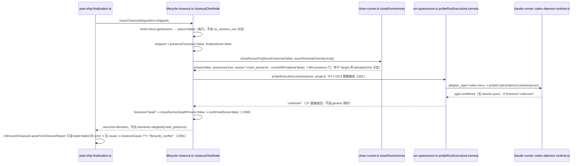

# FLY-2490 shipped 收尾对「起步即 failed 的 Codex 空体」永久保留 — 探索

Issue: FLY-2490 (https://linear.app/geoforge3d/issue/FLY-2490/病根-shipped-收尾对起步即-failed无窗口无-commdb-行的体不强清closerunner-的-crash-preserve)
日期: 2026-09-11
基于: 无

## 0. 一句话

一具在 worktree 接管阶段就失败、从未起过 tmux 窗口 / Codex daemon / CommDB 行的 Codex 实现体，在 issue 已 shipped 的收尾里被 `closeRunner` 的 FLY-116 crash_preserve 门当成「需要保留取证的崩溃体」，而收尾自己的独立死亡证明（FLY-2313 加的救援路径）又因为 Codex daemon 探针把「根本没有 daemon 证据」和「daemon 状态不确定」混成同一个 `unknown` 而永远拿不到证据，于是 `confirmedGone` 永远 false、land 重试 9 次后 held、标签错贴成 `lifecycle_conflict`。

## 1. 症状（只读证据，取自 2026-09-11 10:58 的 `VACUUM INTO` 快照）

| 面 | 观测 |
|---|---|
| StateStore `sessions` | `c070fce7-2b7e-44cb-9073-26b4e3200ede` / FLY-2351 / `status=failed` / `adapter_type=codex-tmux` / `tmux_session=NULL` / `last_error=worktree_takeover_failed: …` / `started_at=2026-09-09 07:24:19` |
| 该体的 `session_events` | 全部只有 5 条：`session_started`、`session_failed`、`issue_thread_infra_notified`、`linear_issue_start_outcome`（07:24）和 **一条** `lead_close_runner_preserved`（19:00:37，event_id 按 `executionId-leadId` 去重，后续 17 次 closeout 撞 UNIQUE 不再写） |
| issue 级 `session_events`（execution_id=`closeout-FLY-2351`） | `closeout_issue_items_blocked` × 18，payload 恒为 `{"reason":"nodes_not_confirmed_gone","nodes":[{"executionId":"c070fce7…","blockedBy":["confirmed_gone_false","communications_finalized_false"]}]}`；`closeout_report` × 18，`outcome=blocked`、`nodes=10`；首条 2026-09-09 19:00:37，末条 2026-09-10 09:20:45 |
| CommDB `sessions` | 该 execution **0 行**（从未注册） |
| 磁盘 | `~/.flywheel/state/codex-sessions/c070fce7…/` 不存在（无 `session.json`，即无 `daemonPgid`）；`~/.flywheel/cdx-sock/e30f58a6dcdc5373.sock|.lock` 均不存在 |
| `land_operation` | `land:63068a7b…` / PR #1133 / `state=held` / `current_step=notification:finalization_partial` / `last_error=retry_exhausted:issue_closeout_incomplete:cause=lifecycle_conflict` / `retry_count=9` / `resume_generation=1`；`resume_authorized:1` 由 flywheel-eng-lead 在 2026-09-10 05:20:40 手动触发过一次，随后再 9 次全部 blocked 后于 09:20:44 再次 held |

补充：issue 描述里说的「land 无限退避重试」实际是「每轮最多 9 次、约 4 小时后 held」（`workflowEngineAlertPayload` 文案与 `land_operation.retry_count=9` 一致）；held 之后只有 `POST /api/lifecycle/land/<operation-id>/resume` 才会再跑。所以修复合入后**不会自动收敛**，需要一次 Lead 的 resume（见 §6）。

## 2. 代码链路（逐行）

三段关键代码：

1. `packages/teamlead/src/bridge/close-runner.ts:480-507` — `isPreserveState && !opts.forcePreserved` ⇒ 写 `lead_close_runner_preserved(reason=crash_preserve)` 并返回 `closed:false / preserved:true`。这个门**在** `getTmuxTargetFromCommDb` 的 `!target ⇒ alreadyGone:true` 分支（:743）之前，所以「无东西可保留」也被挡。
2. `packages/teamlead/src/bridge/lifecycle-closeout.ts:1481-1500` — FLY-2313 的救援：`if (!closeRunnerDeathProven && preserved)` 调 `probeExecutionLiveness`，`"dead"` + lookup `gone` ⇒ `executionDeathProven=true` ⇒ `confirmedGone=true` ⇒ `finalizeCommDbSessionFn`（无行时 UPDATE/DELETE 0 行、`ok:true`）。**这条路径本身是对的**，测试 `lifecycle-closeout.test.ts:460` 已证明「probe=dead + lookup=gone ⇒ complete」。
3. `packages/teamlead/src/bridge/run-quiescence.ts:32-38` — `codex-tmux` 先问 `probeCodexDaemonLiveness`；`"unknown"` 立即返回，不看 tmux / 进程表。而 `codex-daemon-runtime.ts inspectCodexDaemonOwnership` 在 `readPersistedDaemonPgid` 拿不到 pgid 时**无条件**返回 `liveness:"unknown"`（:158-166），并不区分「session.json 里 pgid 存在但进程组状态查不出」与「压根没有 session.json」。

`lifecycle-closeout.ts:1091`（issue 里引的行号）实为 `post-ship-finalization.ts:1091` 的 `closeoutCause ??= "lifecycle_conflict"`。

## 3. 为什么这具体「没有 daemon 证据」是可靠的死亡前置

- `packages/edge-worker/src/Blueprint.ts:1470-1480`：`worktree_takeover_failed` 在 worktree 阶段直接 `return {success:false}`，**早于**适配器启动——没有 tmux 窗口、没有 daemon、没有 CommDB 行。
- `CodexTmuxAdapter.ts:1620-1625` + `codex-daemon-runtime.ts` 的 `onSpawnIdentity`：spawn 之后**同步**（在 socket 轮询之前）写 `session.json.daemonPgid`；写失败则 spawn 自己杀掉进程组（"fail-close and deliberately does not catch"）。所以「无 `daemonPgid`」只有两种来源：从未 spawn，或 spawn 后持久化失败已被杀。
- daemon 的 argv 是 `codex app-server --remote-control --listen unix://<sha1(execId)[:16]>.sock …`，**不含** execution id ⇒ `pgrep -f <execId>` 抓不到 daemon。这正是 FLY-1940 让 Codex 先问 daemon 探针的原因，也是为什么不能简单地把 `unknown` 当 dead——必须只在「零 daemon 证据」时才放行到 generic 探针。
- generic 探针（`generalized-launch-recovery.ts:49-110`）对「CommDB 无行」的路径要求三重缺席：CommDB 无 target、tmux 按 `@flywheel_exec_id` marker 发现为 `missing`、`pgrep -f execId` 退出码 1。这和 claude-tmux 体判死的标准完全一致（`generalized-launch-recovery.test.ts:83` FLY-1572 anchor）。

## 4. 这一族有多大（快照统计）

| 条件 | 行数 |
|---|---|
| `status∈{failed,blocked}` 且 `tmux_session` 为空（全项目） | 592 |
| 其中 `adapter_type=codex-tmux` | failed 244 + blocked 73 |
| 其中 `last_error` 以 `worktree_takeover_failed` 开头 | 64（codex 40 / claude 24） |
| 上述 592 行里在 CommDB 仍有 `sessions` 行的 | 9 |

说明：StateStore 的 `tmux_session` 列大多为空，**不能**当「从未起窗」的证据（`zombie: tmux window runner-flywheel:…` 的行也是 NULL）；CommDB 行会在 finalize 时被删，缺行也不是证据。所以修法**不能**用「`tmux_session` NULL + 无 CommDB 行 ⇒ gone」这种表面谓词（issue 描述里的第一个方向），只能走「零 daemon 证据 ⇒ 允许 generic 探针说话 ⇒ 三重缺席才判死」。claude-tmux 体不受此病影响（它们本来就走 generic 探针，`lifecycle-closeout` 的救援路径对它们有效）。

## 5. 与既有病根的边界

- FLY-116：crash_preserve 门本身保留（有窗口的崩溃体仍不杀）。本单不改 `closeRunner` 的门。
- FLY-2313（#1069, 2026-09-04）：加了「preserved 后独立探活」救援；对 `:pending` 窗口与 claude 体有效，对「codex-tmux 且无 daemon 状态」无效——本单补的正是这一格。
- FLY-1940：「Codex daemon 不在 tmux 里，generic argv 证据证不了它死」——本单保持这条原则：**只有**在没有任何 daemon 所有权记录、socket 也没人监听时，才允许 generic 探针；`session.json` 里有 pgid 但进程组 `unknown` 的仍 fail-closed。
- FLY-2091：永不终结的 session 行 —— 不相关，本体已是 `failed` 终态。

## 6. 修复后如何收敛（无数据迁移）

- 不改任何表、不回填历史行。
- FLY-2351 的 `land_operation` 现在是 `held`；Bridge 重启到含修复的构建后，由 Lead 调 `POST /api/lifecycle/land/land:63068a7b…/resume`（body `{actor, reason}`），land 会重跑 finalization → closeout → 本次 `probeRunExecutionLiveness` 返回 `dead` → `confirmedGone=true` → thread 归档 / Linear 一致性（thread 已被手动归档、Linear 已 Done，这两步幂等）。
- 其它 held 在同一 cause 上的 land op：设计阶段用只读 SQL 列一次（plan §测试证据），由 Lead 决定是否逐个 resume；不做自动扫。

## 7. 待定问题（非阻塞）

1. cause 词表新 token 命名：`nodes_not_confirmed_gone`（与 `closeout_issue_items_blocked.reason` 同词，一个词表）。
2. 状态门用 `failed|blocked`（= `CRASH_PRESERVE_STATES`）而非全部终态：closeout 只对 preserved 节点调探针，本来就落在这两个状态；run quiescence 对 `completed` 的 Codex 体不需要这条放行（正常完成的体一定写过 `daemonPgid`）。保持最窄。
3. `CRASH_PRESERVE_STATES` 目前定义在 `close-runner.ts`，而 `close-runner.ts` import `run-quiescence.ts`；要在 `run-quiescence.ts` 引用它必须把两组状态集抽到叶子模块，否则形成循环 import。
