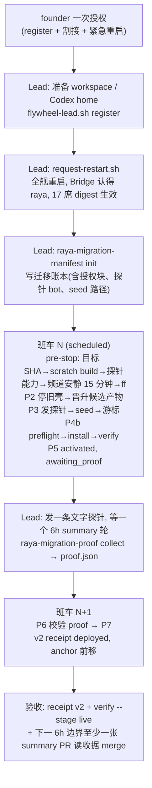

# FLY-2496 Raya 宿主激活 — 探索
Issue: FLY-2496 (https://linear.app/geoforge3d/issue/FLY-2496/raya宿主激活-生产-raya-卡在旧壳-0f77e977班车判-host-capability-absent缺)
日期: 2026-09-13
基于: 无

## 0. 一句话

FLY-2445 已把 Raya 的"标准 Codex Lead"载体合进两仓，但生产宿主上**没有任何一步**把它接通电：班车（`com.flywheel.updater`，每天 00:00 / 12:00 PT 自动跑的部署脚本）每次都判 `host-capability-absent` 然后跳过，旧壳 brain 继续跑在 2026-09-06 的 Raya 代码上。本单要设计的是**宿主激活包**：founder 授权 → Lead 在宿主做最小注册 → 班车用已合入的 P0–P7 事务完成割接 → 以 v2 deploy-receipt 验收。

## 1. 生产现状（2026-09-13 22:40Z 实测，只读）

| 项 | 实测值 | 来源 |
|---|---|---|
| Raya 生产 checkout `~/.flywheel/raya/code` | HEAD `0f77e977`（2026-09-06 #25），branch main，clean | `git -C … log` |
| `origin/main` | `9d63a2b2`（FLY-2445 #61，删 apps/brain、apps/voice，留 `.lead/raya/identity.md` + `packages/cos`） | `git rev-parse origin/main` |
| `~/.flywheel/raya/deployed-sha` | `0f77e977` | 文件 |
| `~/.flywheel/raya/deploy-receipt.json` | schemaVersion 1，outcome `rolled_back`，failure `preflight-rc:1:rolled-back`，checked_at 2026-09-09 19:05Z | 文件 |
| 旧壳 | launchd `com.xrli.raya.brain` pid 54811（2026-09-08 00:05 起），`node apps/brain/dist/cli.js run`；`com.xrli.raya.voice` plist 在、job 未加载 | `launchctl list`、`ps` |
| 班车判定 | 2026-09-10 00:20 PT 起每个 scheduled wake 都是 `raya shuttle: host capability absent — skipped`（共 8 次）；urgent wake 一律 `skipped wake=urgent` | `/tmp/flywheel-updater.log` |
| 9-9 12:05 PT 那班 | 已把 checkout ff 到 `9d63a2b2` 并 **`pnpm build` 成功**（`raya@0.1.0 build`、`@raya/cos@0.1.0 build`），随后旧载体 preflight 找不到 `apps/brain/node_modules/@raya/contracts` → 回滚到 `0f77e977` | 日志 5905–5952 行 |
| `~/.flywheel/manifests/raya-raya.json` | **不存在**（16 个 Lead manifest 里没有 raya） | `ls` |
| `~/.flywheel/projects.json` | 6 个项目、16 个 Lead，**无 raya 行** | `jq` |
| `~/Dev/raya-lead-workspace` | **不存在** | `ls` |
| `~/.codex-raya` | **不存在**（旧壳用的是 `~/.flywheel/raya/codex-home`，计划明确不复用） | `ls` |
| `~/.flywheel/raya/migrations/FLY-2445-standard-lead/` | **不存在**（班车 P2 起步硬要求其中的 `manifest.json`） | `ls` |
| `RAYA_BOT_TOKEN` | 在 Bridge 的 `~/.flywheel/.env` 里有 1 行（班车也 source 这个文件） | `grep -c` |
| `~/.flywheel/raya/memory` | git 仓 2 个 commit，`MEMORY.md` 有 1 行未提交改动 | `git status` |
| Bridge | `/health` ok，delivery loop 16 个 Lead，**没有 raya** | `curl` |
| 巡检 | `raya checkout … overdue=yes`：v1 回执 + manifest 缺 ⇒ `carrier_mismatch=yes` ⇒ `shuttle_stale=yes`，每 tick 都 overdue | `lead-patrol-snapshot.sh:1104-1148` |

结论：issue 里"缺 manifests/raya-raya.json"只是**第一道**闸；后面还有四道（projects.json 行、workspace、Codex home、迁移账本）也全缺。

## 2. Issue 给的"待做"为什么在生产上跑不通

Issue 描述的链条是：founder 授权 → Lead 跑 `flywheel-lead.sh install --project raya --lead raya`（"注册 = P2，产生 canonical manifest"）→ 下一班车自动跑 P0–P7 → v2 receipt。逐条对照代码：

### 2.1 `install` 不产 manifest，而且会立刻起新 Lead

- canonical manifest 由 **`register`** 产（`scripts/flywheel-lead.sh:586-632`：`lead-registry add` 事务提交 → `materialize-lead-manifests.sh` 渲染 → 校验绑定 → 打印 `effectiveAt:"next-bridge-restart"`）。
- `install`（`:746-770`）**要求 manifest 已存在**（`:97-100` 缺则 rc 78），只写 plist 并 `launchctl bootstrap`（`scripts/lib/supervisor.sh:241-242`，RunAtLoad + KeepAlive）——也就是**立刻起进程**。
- 旧壳 brain 还在用同一个 bot token 收发 #raya。人手先 `install` = 两个 owner 同时在线，正是 FLY-2445 plan §2.5 明令禁止的"同时运行两个 owner"。
- 班车自己在 P4b 调用 `install`（`scripts/lib/updater-raya-deploy.sh:296-307`：preinstall fence → bridge token ready → `preflight` → `install` → `verify --stage installed`），而且是在 P2/P3 已停旧壳之后。

⇒ founder 授权的人手步骤应是 **`register`**（R1 原文"唯一入口是公共 `flywheel-lead.sh install`"指的是"唯一被允许的安装工具"，班车调用它即满足）。Lead 已裁定（问题 `02cdabc6`）：人手永不 `install`。

### 2.2 班车 P2 起步硬要求迁移账本，仓里没人产它

`updater_raya_pass`（`updater-raya-deploy.sh:774-807`）：`raya_host_capable` → 拿锁 → `raya_prepare_source`。后者第一批检查（`:683-700`）就有 `raya_manifest_base_valid`：要求 `~/.flywheel/raya/migrations/FLY-2445-standard-lead/manifest.json` 是 0600 普通文件、`schemaVersion 1`、`migration_id`、`checkpoint ∈ P2..P7`、`unresolved[]`。后续阶段还要读：

| 字段 | 谁读 | 用途 |
|---|---|---|
| `cursor.path`、`cursor.seed_input` | P3（`:290-295`） | 调 `seed-lead-inbound-cursor.js` 写新 Lead 的收信游标 |
| `bridge.token_env/token_resolved/bot_user_id/alert_channel_id`、`lead_bot_user_id` | P4b `raya_bridge_token_ready`（`:254-261`） | 只核字段值，不自己去验 |
| `registry_digest`、`summary_receipt_digest` | P6 `raya_p6_evidence_valid`（`:327-365`） | 必须与 proof 里 `lead.*_digest` 相等 |

全仓 grep（排除 `__tests__`）：写这些字段的只有测试夹具 `scripts/__tests__/updater-raya-deploy.test.sh:48-56`。**没有生产工具。** 同理 P6 的 `proof.json`（`raya_standard_collect_proof :367-387`，缺文件 → `awaiting_proof`）也没有产出者。

后果：一旦 `register` 让 `raya_host_capable` 变真，而账本不存在，每个 scheduled wake 都会走 `raya_fail source-prepare-failed`（`:764-772`）：写一份 `outcome=failed` 的 v2 回执覆盖现有回执、发 **severe** `Raya deploy failed` 并 @founder。这不是"下一班车自动跑 P0–P7"，是每 12 小时一次误告警。

### 2.3 停旧壳需要一个班车环境里没有的开关

`raya_quiesce_legacy_owner`（`:220-235`）遇到 `com.xrli.raya.brain/voice` plist 时要求 `RAYA_MIGRATION_ALLOW_LEGACY_STOP=1`，否则返回 1 → 同样 `source-prepare-failed`。班车 plist 的 `EnvironmentVariables` 只有 `PATH`；`~/.flywheel/.env` 里也没有它。设计里必须给它一个**带 founder 授权痕迹**的来源，而不是让人去改 updater plist。

### 2.4 `register` 之后 16 个在飞 Lead 会立刻失去发言权，直到全舰重启

`lead-registry add` 会重算 `summaryAssignmentDigest`，它进入每一席的 `identityDigest`；Lead 进程只在出生时把两者写进 env，`send/respond` 在 lease 判定前比对（`packages/flywheel-comm/src/lead-lease.ts:2689-2699`），不等就 fail-closed。FLY-2401 research §7 已描述过这个"16 席加到 17 席"效应。scheduled 班车只在 Flywheel main 有新 SHA 时才重启（日志 `result=scheduled_current` 的那几班 20 秒就结束）；所以 register 之后需要**立即**一次全舰重启，唯一合规来源是 R4 的 founder 紧急重启票 `scripts/request-restart.sh`（目标 = origin/main 头，`restart-services.sh` 的重启范围恒为全舰，"Diff classification (build/install only; never restart scope)" `:1929`）。

### 2.5 register 之后、install 之前，全舰重启会把 raya 记成 failed

`scripts/lib/lead-restart-lifecycle.sh:767-781`：枚举 `manifests/*.json`，只要 projects.json 能解析出 backend 就 `class=restart`；`restart_lead`（`restart-services.sh:2286+`）对 codex backend 走 bootout/bootstrap 编排，plist 不存在 → `launchctl bootstrap failed twice` → `failed+1` → 部署失败告警。而 2.4 要求 register 后立刻全舰重启。**两条现有规则互相咬死**，必须改其中一条。

### 2.6 P6 必须有一条"旧停新启之间"到达 #raya 的真实消息，可那个窗口只有班车醒着

`raya_p6_evidence_valid` 要求 `cutover.window_message_id / window_delivery_id / window_outbound_message_id` 三者非空（plan §6.2"窗口补齐证明"：只有启新后的探针成功不算）。P3 停旧壳和 P5 启新 Lead 在同一班车里相隔几分钟，发生在 00:0x 或 12:0x PT。除非有人恰好在那几分钟里往 #raya 发消息，否则 P6 永远不通过，回执永远停在 `refused / p5-awaiting-real-p6-evidence`。

好消息：Lead 自己的 chat 频道对 bot 作者**不设 mention 门**（`mention-gate.ts:151` `if (!isShared) return true`），收信源只是把 `authorBot` 记下来。所以班车可以在 P3 停旧壳之后、用一枚**兄弟 bot**（不是 Raya 自己、更不是 founder 本人）往 #raya 发一条唯一标记的探针，这条消息天然落在窗口内，且能被新 Lead 收到。

### 2.7 旧壳没有可导出的收信游标

旧 brain 的 `RAYA_STATE_DIR=~/.flywheel/raya/data/state` 下只有 `leads/`、`voice-evidence/`、`voice-session.json`，没有任何 cursor 文件；它是实时 gateway，且 voice/meeting 两个入口各自异步处理，没有一条出站能证明"之前全部已处理"。所以 P3 **不做任何"已处理"推断**：班车只在 #raya 已安静 15 分钟（无人类消息）时才停旧壳，否则推迟到下一班；停机窗口 [T0,T1] 内出现的人类消息一律记为 `unresolved`、停在 P3 由 Lead 人工对账并写不可变回执；更早的历史由 founder 授权行里的 `baseline=quiet15m` 令牌明确划为"不在本次补录范围"（这是被授权的历史基线声明，不是证明）。探针（2.6）发在停机之后，是新 owner 后缀的第一条，用它证明窗口没丢信。

## 3. 目标与非目标

**目标**
1. 让 founder 一次明确授权就能覆盖整条链，且每一步都留下可核对的痕迹。
2. 人手只做**不会改变谁在回 #raya** 的动作：`register`、工作区、Codex home、写迁移账本。停旧、装新、切换全部由班车在既有 P0–P7 事务里做。
3. 班车在"已 register 但尚未授权割接"的中间态**不误告警**、不覆盖回执（Lead 裁定：每班一行 info）。
4. P6 证据可由一个 source-only 工具从真实系统读出并写成 `proof.json`，不手打 JSON。
5. 验收 = v2 receipt（schemaVersion 2、carrier standard-lead、两仓 SHA）+ `flywheel-lead.sh verify --stage live` + 激活后下一个 6h 边界至少一张 summary PR 被 Raya 读收据 merge。

**非目标**
- 不回滚 Raya 仓到有 brain 的旧头（issue 明令）。
- 不绕 updater 手动部署（R4）；不新造调度器、专属 wrapper、专属 plist。
- 不在本单实现 FLY-2445 P2 里的 14 行 `import-cos-context`（其消费者 `lead-directory` 至今 inert，2445 review LOW follow-up；Lead 裁定移出关键路径）。
- 不解决"读收据 merge 无来源标记"——只在验收时观察并开 follow-up。
- 不恢复语音（归 FLY-2446）。

## 4. 候选方案

### 4.1 谁产迁移账本 / 授权开关

| 方案 | 做法 | 取舍 |
|---|---|---|
| **A（选）** 新增 source-only 一次性工具 `raya-migration-manifest`，在 register 之后由 Lead 运行；账本内带 `authorization` 块（founder 授权的消息 id、时间、授权人），班车读到它才导出 `RAYA_MIGRATION_ALLOW_LEGACY_STOP=1` | 授权痕迹与账本同文件、同 0600；班车无需改 plist；缺账本 = 未授权 = 一行 info 跳过 | 多一个工具（约 300 行 TS + 测试） |
| B 改 updater plist 加环境变量 | 一行改动 | 要 bootout/bootstrap updater 本身（R4 敏感）；授权无痕迹；账本仍没人产 |
| C 让班车 P2 自己 register + 生成账本 | 与 2445 plan 文字最像 | Bridge/全舰重启在班车里发生在 raya 段**之前**，register 后 16 席会 fail-closed 12 小时；要在 raya 段里再触发一次全舰重启，风险面太大 |

### 4.2 register 后的全舰重启与"有 manifest 无 plist"

| 方案 | 做法 | 取舍 |
|---|---|---|
| **A（选）** `lead-restart-lifecycle.sh` 新增分类 `pending-install`：manifest 在、projects.json 能解析、但 plist 不存在且 job 未加载 → 跳过并发一条去重 warning；founder 紧急重启票在 register 后立即跑一次全舰 | 改动约 10 行 + 测试；raya 中间态可见但不计 failed；顺带覆盖所有"已 register 未 install"的 Lead | 一个 plist 被误删的 claude Lead 从 failed 变 warning（仍可见） |
| B register 后立刻人手 install | 零代码 | 双 owner（2.1），否决 |
| C 等 scheduled 班车顺带重启 | 零代码 | 16 席 fail-closed 时长不可控（最长 12h） |

### 4.3 P6 窗口消息与 seed

| 方案 | 做法 | 取舍 |
|---|---|---|
| **A（选）** 班车 P3：停旧壳（逐 job 记毫秒时间戳）→ 用账本指定的兄弟 bot（`window_probe.bot_token_env`）POST 探针到 #raya（intent+nonce 先落账本，重跑按 nonce 回找不重发）→ 停机前已确认频道安静 15 分钟（否则不停旧壳）；停机窗口内出现的人类消息进 `unresolved` 停下等 Lead 对账，否则 seed = 停机前最后一条 → 写 `seed_input`（0600）→ 既有 seed 工具 | 窗口消息必然存在；人手零参与；不做处理推断，不可证明的区间 fail-closed | updater 里多几次 Discord REST（已有 lead-alert 先例）；founder 深夜还在 #raya 说话 → 那班不切，等下一班 |
| B seed 由账本工具提前算，人手/Lead 在窗口发消息 | 班车零改动 | 窗口在凌晨、几分钟，人做不到；且提前算的 seed 会让新 Lead 重放旧壳已答过的消息 |
| C 把探针改成 Raya 自己 bot 发 | 少一枚 token | 收信源忽略自己的消息，探针不会入信箱，P6 不通过 |

### 4.4 P6 证据

| 方案 | 做法 | 取舍 |
|---|---|---|
| **A（选）** source-only 工具 `raya-migration-proof`：从 launchd/ps、Codex Lead state dir、CommDB mailbox、Discord REST、`flywheel-lead.sh preflight`、公共 `lead-alert.sh` 取证，写 `proof.json`（0600） | 与 `raya_p6_evidence_valid` 逐字段对应；可重复跑；失败一律 fail-closed 且说明缺哪项 | 需要一个只读 SQL 面（mailbox 表）和一个 `activation_probe` 告警 kind |
| B runbook 手写 proof.json | 零代码 | 30 个字段、6 个 id 手抄，一字错就 `proof-invalid` severe；违背"不手写 manifest" |

## 5. 选定路线（一图）

## 6. 诚实边界

- 从 register 到 P5 之间（建议 ≤ 40 分钟：23:20 PT register，00:00 PT 班车），summary 6h 边界若恰好落在其中，rider 会解析到 raya 但 runtime 尚未起，那一槽的事件会留 `delivered_at=NULL`。与今天"从未响过"等价，不是回退。
- 首次迁移没有"上一个已验标准版本"，`rollback_target` 为 null；P3 之后任何失败都**不会**自动把旧 brain 拉回来（plan §6.5 明文）。要恢复旧脑属于恢复被 founder 要求退役的架构，需单独授权。
- 旧壳没有任何"处理过哪条消息"的持久记录（stdout 日志为空、metrics 只有 token 计数、文字回复不带 `message_reference`），所以机器无法证明停机前某条消息已被处理。班车因此只在 #raya 已安静 15 分钟（无人类消息）时才切换，否则推迟到下一班、旧壳不动；更早的历史按 founder 授权行里的 `baseline=quiet15m` 令牌明确划为"不在本次补录范围"，这是被授权的历史基线声明，不是证明。
- `import-cos-context`（Raya 统管 14 位 Lead 的名册元数据）不在本次；Raya 的 `directory()` 端口在激活后返回空名册，CoS"点名其他 Lead"的业务要等 follow-up。
- 读收据 merge 目前没有来源标记（issue 备注），merge receipt 也没有 actor 字段、merge 走宿主 `gh` 凭据。验收时只能证明"Raya 轮次触发并留下 roundId 绑定的 merge 回执、时间晚于投递"，不能证明 GitHub actor 是 Raya bot；actor provenance 是 follow-up。
