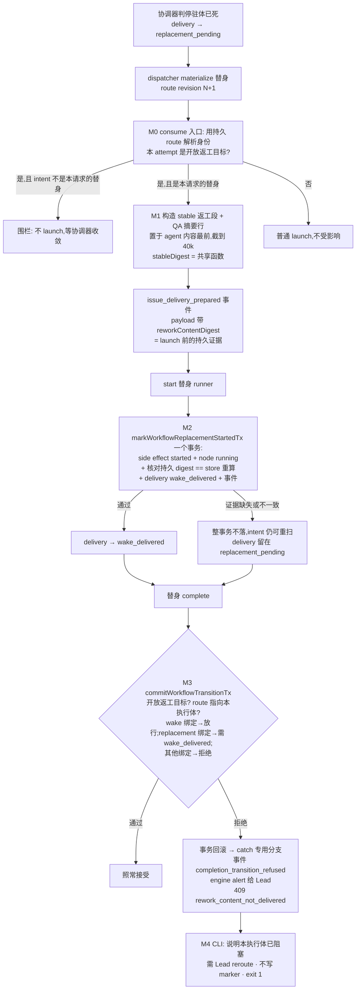

# FLY-2504 返工换体后替身未收返工内容即完成 — 实施计划

Issue: FLY-2504 (https://linear.app/geoforge3d/issue/FLY-2504/病根-返工换体后替身未收到返工内容即在同头-complete引擎照单接受-node-completed-空转一轮-qarework)
日期: 2026-09-10
基于: research.md

**Status**: codex-approved(Codex design review 4 轮:5 → 6 → 4 → 4+1 advisory,BLOCKER/HIGH 全部并入;批准 = R3/R4 有效结论 + Lead 裁定 60a8a9f0,见 §9 / §9.1)

## 0. 目标与非目标

目标:让「返工目标 attempt 的每一次 launch 都是带返工上下文的替身」成为引擎围栏而非假设;让「launch 标记翻 wake_delivered」绑定到 launch 前已持久化的内容证据;让「返工内容未送达的完成」在引擎 transition 路径上被拒绝、留痕、告警。类键 `node_completed_accepted_without_rework_receipt` 关死。

非目标(见 exploration §5):不改 schema、不加 flag / hold 形状、不加事件 kind、不让替身自动重走 wake、不做零 diff 门、不动信箱继承、不为 wake 模式新增 send-intent 同步。

## 1. 总览



## 2. 模块

### M0 — launch 前的持久身份围栏(不再以 `intent.reason` 为权威)

位置:`DISP:consume()`,**在 `adoptKnownSession` 之前**(现状 `:2288-2295` 先 adopt,`:2335-2423` 才识别替身)。

```ts
// consume() 开头(run/node 解析之后、任何 markStarted 之前):
const reworkTarget = store.resolveOpenWorkflowReworkTarget({ runId, nodeId, attempt });
// → undefined | { conflict:true } | { requestId, routeRevision, preferredActorExecutionId, deliveryState, request, route }
// 定义:workflow_rework_request r JOIN 最新 workflow_rework_route_revision rr JOIN workflow_rework_delivery d
//      WHERE r.run_id=? AND rr.target_node_id=? AND rr.target_attempt=? AND d.state <> 'completed'
//      命中 > 1 行 → { conflict:true }(fail closed:不 launch,log)
const replacement = reworkTarget
  ? (reworkTarget.preferredActorExecutionId === intent.execution_id
      && intent.reason === `rework_replacement:${reworkTarget.requestId}`
      && reworkTarget.deliveryState === "replacement_pending")
    ? buildReplacementLaunch(reworkTarget)      // M1;失败 → throw engine_rework_replacement_context_invalid(launch 前)
    : FENCE                                      // 不 launch:log `engine_rework_target_launch_fenced:<requestId>:<deliveryState>`,return false
  : undefined;
const adopted = this.adoptKnownSession(intent, replacement);   // 恢复路径拿同一个 replacement 对象(含 stableDigest)
```

- 围栏含义:本 attempt 已是开放返工目标,但这次 launch 不是「该请求的替身且送达行在等替身」——通用死体回滚生成的普通重试意图(协调器尚未收敛)、送达行 revision 已指向别的执行体、送达行 `held/needs_lead`。不 launch,返回 false,意图留在账本;协调器收敛后(`SS:34805-34822` 改意图 reason、送达行 `replacement_pending`、revision 指向本执行体)下一 tick 自然通过。
- 首次 spawn、普通 loop 重试、非返工节点走 `D0`,行为不变。
- 现有 `replacementContext` 闭包(`:2340-2421`)的校验逻辑整体搬进 `buildReplacementLaunch`,不重复实现。admission 的 `activationMode:"replacement"`(`:2626-2631`)改由 `replacement` 对象驱动。
- `adoptKnownSession(intent, replacement)`(Codex R3 #1):session 行不是 launch 证据(`runs-route.ts:3362-3372` 已有同样注释)。活 session 分支**只有在 `getGeneralizedLaunchDelivery(store, executionId)` 成立**(`generalized-launch-recovery.ts:124-133`:owner `committed_generation === owner_generation` 且 `delivery_state === "delivered"`)时才调 M2 的原子方法;否则返回 `undefined` 让 `consume` 继续走 `recoverOrAcquireWorkflowLaunch`(`DISP:2656`)的 owner 状态机(lease 内 hold、过期后 reacquire + re-drive),不能每 tick 卡在 adopt。`preserveTerminalNode` 分支不调标记(现状不变)。

### M1 — 替身 launch 信封内联返工段,证据在 launch 前持久化

**新文件** `packages/teamlead/src/bridge/workflow-rework-context.ts`(纯函数,只依赖行类型与 `canonicalSubmissionDigest`):

```ts
export interface WorkflowReworkContext { requestId; authority; authorityContext: unknown; target: { nodeId; attempt; invalidationScope; verificationPolicy } }
export function buildWorkflowReworkContext({ request, route }): { ok:true; context } | { ok:false; reason:"authority_context_corrupt" };
export function isWorkflowReworkNodeReuseContext(context: unknown): boolean;     // 从 wake-copy.ts:1-13 搬来
export function renderWorkflowReworkContextLine(context: unknown): string;       // `${node_reuse ? "Verification context" : "Rework context"}: ${JSON.stringify(context)}` —— wake 与 launch 共用
export function renderWorkflowReworkLaunchStableSection({ context, baseRevision }): string;      // 不含 QA 摘要;两侧都能从不可变行重算
export function workflowReworkLaunchDigest({ requestId, routeRevision, stableSection }): string;  // canonicalSubmissionDigest
export function renderWorkflowReworkLaunchSection({ stableSection, qaSummary? }): string;         // = stableSection + "\nQA summary: <…|(no QA summary provided)>"(固定插在末尾)
export const WORKFLOW_AGENT_CONTENT_BUDGET = 40_000;                              // 与 Blueprint.ts:2792 同值,由 dispatcher 先行执行
```

- `buildWorkflowReworkContext` 形状逐字等于 `COORD:739-749`,协调器改调它;`renderWorkflowReworkContextLine` 保留 `node_reuse` 分支,`workflow-rework-wake-copy.ts:106-121` 改调它;wake 文案逐字节不变(P4)。
- stable 段(英文,进提示词):

```
## Rework context (replacement launch)

You replace a dead actor for rework request <requestId>. Authority: <authority>. Previous verdict: <authorityContext.outcome ?? "n/a">.
Base revision under rework: <baseRevision>. Do the requested rework before completing; a completion with no change against the base revision may be sent back by the verifying node.
<renderWorkflowReworkContextLine(context)>
```

  完整段 = stable 段 + `QA summary:` 行(`authority === "qa"` 且 `authorityContext.sourceExecutionId` 为字符串时调 `qaFixSummary` `:2964-2978`,≤1000 字符;否则 `(no QA summary provided)`)。**digest 只覆盖 stable 段**(Codex R2 #6):它证明的是「核心返工上下文进了信封」,不证明 QA 摘要行——QA 摘要来自可变的事件流,不可在 store 侧确定重算;写进诚实边界。
- 拼装与截断归 dispatcher(Codex R1 #2a):

```ts
const stableSection = renderWorkflowReworkLaunchStableSection({ context, baseRevision });
const fullSection = renderWorkflowReworkLaunchSection({ stableSection, qaSummary });
if (fullSection.length > WORKFLOW_AGENT_CONTENT_BUDGET) throw new Error("engine_rework_replacement_context_invalid");
const composed = [fullSection, agentContent, leadAttributionContent ?? founderFeedbackSection ?? ""].filter(Boolean).join("\n\n");
const workflowAgentContent = composed.slice(0, WORKFLOW_AGENT_CONTENT_BUDGET);
if (!workflowAgentContent.startsWith(fullSection)) throw new Error("engine_rework_replacement_context_invalid");
const stableDigest = workflowReworkLaunchDigest({ requestId, routeRevision, stableSection });
```

  返工段最前,截断只吃 role / 归属段尾部;`Blueprint.ts:2792` 的 `slice(0, 40_000)` 对 ≤ 40k 输入恒等。lead / founder 段文本不变,整体后移到返工段之后。
- **launch 前持久证据(Codex R2 #3)**:dispatcher 交给 Blueprint 的 `prepareWorkflowIssueDelivery` 闭包(`DISP` 侧包装,`Blueprint.ts:1647-1666` 调用)追加传入 `reworkContentDigest: stableDigest`;`StateStore.prepareWorkflowIssueDelivery`(`SS:31301`)入参加可选 `reworkContentDigest?: string`(64 位 hex 校验),写进 `issue_delivery_prepared` payload(`:31457-31473`),并随 `issue_delivery` 提交一起复制(`:31558-31570`)。该事件在外部 `start` 之前落盘(生产 seq 363 早于 365/367),是「这个 activation 的信封带了哪份核心上下文」的 append-only 证据。不加事件 kind、不加列。

### M2 — 替身 started 一个事务,标记只认持久证据

**新 StateStore 方法** `markWorkflowReplacementStartedTx`(仅替身 launch 走它;非替身 `markStarted` 不变),一个 `db.transaction` 内,**先全部只读校验、全部通过后才写**(Codex R3 #2:StateStore 的 transaction 回调正常 `return` 会提交已执行的 SQL,只有 `throw` 才回滚;所以不能先写后验):

**只读校验阶段**(任一失败 → `return { ok:false, reason }`,此时尚无任何写):

1. run 归属 / 项目 / issue 与 `expectedEngineOwned` 围栏(Codex R3 #2;实现见 1b,一处真源)。
2. binding.mode = replacement 且 `rework_request_id` 一致;request / route / delivery / node 一致性同今天 `SS:35450-35475`;delivery.state = `replacement_pending`(`wake_delivered` 且本 revision/execution 的新格式 `rework_replacement_launched` receipt 存在 → 幂等早退 `{ok:true, updated:false}`;`wake_delivered` 而无 receipt → `{ok:false, reason:"rework_replacement_launch_content_missing"}`,R4 #2)。
1b. run 身份围栏用抽出的 `requireWorkflowRunIdentityTx({ runId, projectName, issueId, expectedEngineOwned })`(R4 #4):从 `applyWorkflowLedgerBatch` 的事务内联段 `SS:61462-61498` 抽出,**`applyWorkflowLedgerBatch` 与本方法共同调用**,普通 `markStarted` 路径的 fence 不移除、SQL 与错误语义不复制;两个调用面各加 wrong project / wrong issue / wrong `engine_owned` 的零写入回归(N16)。
3. **launch 已提交**(Codex R3 #1):`workflow_launch_owner` 满足 `committed_generation === owner_generation` 且 `delivery_state === "delivered"`(即 `getGeneralizedLaunchDelivery` 谓词);否则 `{ok:false, reason:"rework_replacement_launch_not_committed"}`。
4. **证据核对**:按 owner 的精确 `(committed_generation, delivery_attempt)` 读 `issue_delivery:<executionId>:<generation>:<attempt>` 事件(launch commit 时由 `commitWorkflowIssueDeliveryEvidenceTx` `SS:31513-31570` 从 prepared 复制,带 `preparedEventUid`),要求 `payload.activationId === binding.activation_id`、`payload.preparedEventUid` 形状正确、`payload.reworkContentDigest` 为 64 位 hex;用 M1 共享函数从不可变的 request + route 重算 `stableDigest`;缺失或不等 → `{ok:false, reason:"rework_replacement_launch_content_missing"}`。**不按「最新 prepared」取**:repair claim 会先递增 `delivery_attempt` 并置 `repairing`(`SS:33557-33589`),最新 prepared 可能是未提交甚至失败的重投候选。

**写阶段**(只在上面全部通过后):

5. side effect → `started`(复用私有 Tx seam `transitionWorkflowSideEffectTx` `SS:61651`)。
6. `upsertWorkflowRunNodeTx(state:"running", executionId)`。
7. delivery `replacement_pending → wake_delivered`,投影 sent_at / received_at,验证路径 → active(同今天 `:35484-35523`)。
8. 事件 `rework_replacement_launched`,**uid `rework_replacement_launched:<requestId>:<routeRevision>:<executionId>`**(Codex R2 #4),payload 追加 `routeRevision`、`contentDigest`、`carrier:"launch_envelope"`。

- 拒绝时 side effect 仍 `intent_recorded/launch_committed`,下一 tick 重扫 → `consume` → M0 → `adoptKnownSession` → 再试(不重复 start);delivery 留在 `replacement_pending`。
- 老代码启动、没有 `reworkContentDigest` 证据的在飞替身,升级后在 adopt 时被第 4 步拒绝 → 停在 `replacement_pending` → complete 被 M3 拒绝并进入 operator 面(见 M3)。**旧裸 prompt 不会被现算 digest 误认证**。
- `received_at` 保留 launch 时投影(信封被提交即视为已读,与 issue 正文同标准)。诚实边界。

### M3 — transition 接受前校验本 attempt 的返工送达

位置:`commitWorkflowTransitionTx`(`SS:55265`),紧接 `node_attempt_not_current`(`:55467-55481`)之后。**唯一豁免**:`authorityDrivenGate`(Codex R2 核实 gate 目标不可能是返工目标)。**不豁免 `allowCompletedWriter`**(Codex R2 #1):hold-resume 的 `reconstruct_completion`(`SS:46403-46480`)撞开放返工目标时,transition 返回 `ok:false` → 该路径已有的 `throw WorkflowEngineInvariantError("workflow_hold_completion_transition_refused:…")`(`:46481-46485`)让整个 resume 事务回滚(含刚插的 completion 行);操作员必须先通过下文的 operator 面关闭该送达,再 resume。

**operator 面(Codex R3 #3,R4 #1 修正)**:`completion_receipt_missing` 的 resume action 是 `reconstruct_completion`(`hold-shape-registry.ts:110-114`),只有 `delivery_undeliverable_no_recipient` 才有 `resume_undeliverable` → `deliveryResume`(cancel / reroute,`SS:46838-46852, 47015-47039`);operator reroute 也要求已存在 open 且 `stage='undeliverable'` 的送达 episode(`SS:43374-43392`)。单纯的 `replacement_pending` + M3 拒绝不会产生这个 episode。R4 核实:`holdUndeliverableTx`(`SS:44836-44927`)**不创建** episode,入口就要求 episode 已 open 且 `stage='undeliverable'`、run active、grace 已过、recipient terminal、liveness absent/unknown;episode 只由 projector 在分类为 terminal-undeliverable 时创建(`SS:47620-47674`),活着的 `replacement_pending` 收件人得不到该分类(`delivery-contract/watch.ts:200-211`);`response_reroute_unsupported`(`SS:44409-44519`)只是 mailbox 的 `runHeld:false` 事件,不是绕过谓词的先例。所以不能「复用一段代码」,要把它定义为 **FLY-2278 同一 producer 的显式第二种 cause**:

- 新私有方法 `openReworkContentUndeliverableTx({ requestId, routeRevision, executionId, sourceEventId, now, alertIdentity })`,**一个 StateStore transaction**:(1) 按精确 contract_ref `{table:"workflow_rework_delivery", pk:requestId, routeRevision}` 锁定 live `workflow_delivery_attempt`(`superseded_by_attempt_id IS NULL AND settlement_reason IS NULL`);(2) 关闭该 attempt 任何当前 open episode,创建确定性 episode(`episode_id` 由 `{attemptId, cause:"rework_content_not_delivered"}` 的 canonical digest 派生,幂等)并置 `stage='undeliverable'`;(3) 交给**抽出的单一 finalizer** `finalizeUndeliverableHoldTx`(从 `holdUndeliverableTx` 的尾段抽出,两个 producer 共用):run `active → held`、`delivery_reroute_operator_required` 事件(shape `delivery_undeliverable_no_recipient`,payload 增加 `cause:"rework_content_not_delivered"`,liveness 字段填 `{verdict:"not_applicable", reason:"content_never_sent"}`)、稳定的 refusal 事件、**恰一条** alert(escalationUid = refusal uid;不再另发 `delivery_reroute_outcome`)。(4) 重放:同 refusal uid 已存在 → **先于** `run.status='active'` 检查返回 `operator_already_required`,零写。
- 只有 `rework_content_not_delivered` 走这条 operator 路;`rework_receipt_identity_conflict`(stale / 错误执行体)**只拒绝、留痕、告警,不改 delivery / run**(N5),否则会伤及当前健康的送达。
- FLY-2278 合同同步修订:`delivery_undeliverable_no_recipient` 的 producer 从两个变成「两个 producer、两种 cause」,payload 合同加 `cause` 字段,inventory 测试更新;`SET status='held'` 写点仍是同一个 finalizer(不增写点)。
- 崩溃屏障:refusal 事件与 hold 在同一事务;若事务失败整体不落,不会出现「告警说 run held 而实际未 held」。

之后操作员用既有 `resumeWorkflowHold` + `deliveryResume`:
- **cancel** → 送达 `completed`(`cancelled_by_operator`),M3 放行,该 attempt 按「无返工」完成;若确实零 diff,QA 会再判 fail、开新的返工请求、走正常 wake 路(生产 seq 388-399 已证明这条自愈)。
- **reroute** → 新 revision + 送达回 `pending`;若 preferred actor 仍是这个已 running 的替身,协调器的 reservation 检查(pending 送达 ↔ 节点 pending/admitted)会让它 `rework_target_not_reserved`——**reroute 到同一个 running 替身不可送达**,写进已知限制;reroute 到新 actor 的可行性由既有 operator reroute 语义决定,本单不扩。
不加 hold 形状(复用 `delivery_undeliverable_no_recipient`),不加事件 kind。

```ts
const targets = this.workflowSelectAll(`<同 M0 查询>`, [input.runId, input.nodeId, input.attempt]);
for (const t of targets) {
  const detail = { requestId: t.request_id, deliveryState: t.state, routeRevision: t.revision };
  if (t.preferred_actor_execution_id !== input.executionId || t.delivery_route_revision !== t.revision) {
    result = { ok:false, reason:"rework_receipt_identity_conflict", detail }; return;
  }
  const binding = this.workflowSelectAll(
    `SELECT mode FROM workflow_execution_binding WHERE execution_id=? AND run_id=? AND node_id=? AND attempt=? AND rework_request_id=?`,
    [input.executionId, input.runId, input.nodeId, input.attempt, t.request_id])[0];
  if (binding?.mode === "wake") continue;                       // R1 边界:wake 送达由协调器/回执路径负责,不用投影推断
  if (binding?.mode === "replacement") {
    // R4 #2:不只看状态,还要看当前 revision/execution 的新格式 launch receipt
    const receipt = this.workflowSelectAll(
      `SELECT payload FROM workflow_run_event WHERE event_uid = ?`,
      [`rework_replacement_launched:${t.request_id}:${t.revision}:${input.executionId}`])[0];
    const receiptOk = receipt && payload(receipt).carrier === "launch_envelope" && isHex64(payload(receipt).contentDigest);
    if (t.state === "wake_delivered" && receiptOk) continue;
    if (t.state === "completed" && (receiptOk || t.last_error === "cancelled_by_operator")) continue;
  }
  result = { ok:false, reason:"rework_content_not_delivered", detail }; return;   // replacement 未标记 / 无新格式 receipt、spawn 绑定、无绑定
}
```

- **存量裸 prompt 替身**(R4 #2):老代码已把送达行翻成 `wake_delivered` 但没有新格式 receipt,M3 因 receipt 缺失拒绝并进入 operator 面;Lead cancel 后 `completed + cancelled_by_operator` 放行。M2 的幂等早退同样改为「`wake_delivered` 且本 revision/execution 的新格式 receipt 存在」才早退,否则按 `rework_replacement_launch_content_missing` 拒绝(存量行不会被「补一个标记」洗白)。

- wake 绑定放行(Codex R2 #5):协调器 `wakeActor` 成功与 `awaiting_receipt` CAS 之间崩溃时内容已真实送出,M3 不能用 `turn_granted` 推断「从未发出」;wake 路的其余保障是既有的 `:56360/:56452` CAS 与回执投影。
- 类型(Codex R1 #4):`WorkflowTransitionResult` 失败分支扩为 `{ ok:false; reason:string; detail?: WorkflowTransitionRefusalDetail }`,`WorkflowTransitionRefusalDetail = { requestId; deliveryState; routeRevision }`;`commitEnrolledCompletion` 在 `:52848-52851` 抛错前保存 `transitionRefusalDetail`;`WorkflowCompletionResult` union 增加 `{ ok:false; reason:"rework_content_not_delivered"|"rework_receipt_identity_conflict"; detail; retryable:false }`。
- 事务语义(已核实):`commitEnrolledCompletion` 对 `!transition.ok` 抛错回滚整事务;事件与告警写在 catch 块(`:52899-52970`)的专用分支 `recordReworkDeliveryRefusal(...)`(私有,事务外,与 `recordLandHeadUnavailableRefusal` `:52049` 同形),**先于**通用 `transition_refused` 包装:
  - 事件:复用 kind `completion_transition_refused`;uid `completion_transition_refused:<transitionReason>:<requestId>:<routeRevision>:<executionId>:<deliveryState>`;payload 稳定 `{attempt, transitionReason, requestId, deliveryState, routeRevision}`(不含 `sourceEventId`)。同键重复 complete 只留一条;revision bump 或状态变化各再留一条(FLY-2278 generation 语义)。
  - 告警:`enqueueWorkflowEngineAlert`(既有通道,severity warning),`escalationUid` = 同 uid;title `Rework completion refused for <issueId>`;body `Execution <executionId> tried to complete <nodeId>#<attempt> for rework <requestId> (route revision <n>) while delivery is <deliveryState>: <reason sentence>. The run is now held as delivery_undeliverable_no_recipient; resume it with cancel or reroute.`;`metadata.workflowEngine.disposition = "rework_completion_refused"`。
  - operator 面:仅 `rework_content_not_delivered` 分支调 `openReworkContentUndeliverableTx`(见上),refusal 事件 + hold + 一条 alert 同一事务;identity conflict 分支只写 refusal 事件 + alert。
  - 返回 `{ ok:false, reason, detail, retryable:false }` → `event-route.ts:1318-1328` 原样 409。
- 其余 `commitWorkflowTransitionTx` 调用点(`SS:46466, 54917, 55184, 58521, 58968, 59098`)只拿到 `ok:false` reason,不落事件不告警;`:46466` 见上(fail-closed 回滚)。

### M4 — CLI 文案与 marker 处置

`packages/flywheel-comm/src/commands/complete.ts`:409 且 `reason ∈ {rework_content_not_delivered, rework_receipt_identity_conflict}` →

```
[complete] refused (<reason>): rework <requestId> for this node is in delivery state "<deliveryState>"; this execution never received the rework content.
This execution is BLOCKED. It cannot complete until the Lead reroutes or re-delivers the rework; the Lead has been alerted.
Do NOT retry blindly. `flywheel-comm turn` / `flywheel-comm inbox` only read instructions already sent; if a Lead instruction or rework wake arrives, act on it and complete again.
```

这两个 reason 不写 fail-close marker(`NO_MARKER_REASONS`,在 `:590` 前判断);exit 1;不重试。`complete-marker-reconciler.ts` 不改。

## 3. 稳定标识与展示标签

| 类型 | 值 | 说明 |
|---|---|---|
| 事件(复用 kind) | `completion_transition_refused`,payload `transitionReason ∈ {rework_content_not_delivered, rework_receipt_identity_conflict}` | uid 见 M3 |
| 事件(复用 kind) | `issue_delivery_prepared` / `issue_delivery` payload 追加可选 `reworkContentDigest` | launch 前证据;非替身 launch 不带 |
| 事件 uid 变更 | `rework_replacement_launched:<requestId>:<routeRevision>:<executionId>`(原 `:<requestId>`) | payload 追加 `routeRevision`、`contentDigest`、`carrier="launch_envelope"` |
| 拒绝 reason(新,409 原样) | `rework_content_not_delivered`、`rework_receipt_identity_conflict` | 同一 catch 分支、同一 disposition、同一 CLI 模板 |
| launch 标记拒绝 reason(新) | `rework_replacement_launch_content_missing` | `markWorkflowReplacementStartedTx` 返回;整事务不落 |
| 围栏日志(新,仅 log) | `engine_rework_target_launch_fenced:<requestId>:<deliveryState>` | 不是事件不是告警 |
| 告警 disposition(新值,旧通道) | `rework_completion_refused` | severity warning |
| 提示词段标题 | `## Rework context (replacement launch)` | 与 wake 共用 `renderWorkflowReworkContextLine` |
| 常量 | `WORKFLOW_AGENT_CONTENT_BUDGET = 40_000` | 与 `Blueprint.ts:2792` 同值;不读 env |

## 4. 迁移、部署预检与回滚边界

- **无 schema 迁移**,无新列、无 flag、无 hold 形状、无新事件 kind、无新告警层。
- **存量在飞替身**(Codex R2 #3/#4)两类:
  - (a) 送达行 `wake_delivered` 但没有新格式 launch 证据——部署前后各跑只读 SQL:

```sql
SELECT d.request_id, rr.revision, rr.preferred_actor_execution_id, d.updated_at
  FROM workflow_rework_delivery d
  JOIN workflow_rework_route_revision rr
    ON rr.request_id = d.request_id AND rr.revision = d.route_revision
  JOIN workflow_execution_binding b
    ON b.execution_id = rr.preferred_actor_execution_id
   AND b.rework_request_id = d.request_id AND b.mode = 'replacement'
 WHERE d.state = 'wake_delivered'
   AND NOT EXISTS (
     SELECT 1 FROM workflow_run_event e
      WHERE e.kind = 'rework_replacement_launched'
        AND e.execution_id = rr.preferred_actor_execution_id
        AND json_extract(e.payload, '$.requestId') = d.request_id
        AND json_extract(e.payload, '$.routeRevision') = rr.revision
        AND json_extract(e.payload, '$.carrier') = 'launch_envelope'
        AND length(json_extract(e.payload, '$.contentDigest')) = 64
        AND json_extract(e.payload, '$.contentDigest') NOT GLOB '*[^0-9a-f]*');
```

    (R4 #2:`GLOB '[0-9a-f]*'` 只约束首字符,改为长度 64 且不含非 hex 字符。)命中项的**可执行处置**:它们没有 open 的 undeliverable episode,不能直接 `deliveryResume`;但升级后其下一次 complete 会被 M3 因 receipt 缺失拒绝并进入 operator 面,Lead 再 cancel。部署门只要求把命中项登记并盯到进入 operator 面(或由 Lead 主动让其 complete 一次触发),不要求停流。

    (Codex R3 #4:直接 join replacement binding、绑 `routeRevision` / `carrier` / digest 形状,旧 revision 的新格式事件不会替当前 revision 过检。)命中项的处置是**部署门**的一部分:Lead 对每一条用 `resumeWorkflowHold` + `deliveryResume` cancel,或让其在下一次 complete 时经 M3 进入 operator 面;部署清单记录处置结果。
  - (b) 送达行 `replacement_pending` 且已有 replacement binding + 活 session(老代码 start 后、标记前崩溃):**不需要预检**——升级后 M2 因缺 `reworkContentDigest` 证据拒绝标记,M3 拒绝其 complete 并推进 operator 面。不需要停流(quiescent)部署。
- **回滚是条件式的**(Codex R3 #4):revert PR 后,复用既有 kind 的拒绝事件与追加 payload 字段只是多余字段;但 `rework_replacement_launched` 的 uid 在新旧代码间不同——对**部署前已由旧代码写过 request-only uid** 的 request,新代码 launch 第二代时 uid 不同、不冲突;对**新代码期间才首次 launch** 的开放 request,回滚后旧代码若再 launch 同一 request 会写 request-only uid,同样无同名行、不冲突。真正的回滚前置条件只有一条:回滚时刻处于 `replacement_pending` 且靠新围栏等待收敛的 intent,回滚后会被旧代码按普通 spawn 启动(回到本 bug)——因此回滚前先跑 §4(a) 同族的查询列出 `replacement_pending` 行,由 Lead cancel 或等其收敛后再回滚。
- 部署顺序:teamlead 与 flywheel-comm 同一 PR;`packages/edge-worker` 的 Blueprint 不改(闭包在 dispatcher 侧)。CLI 先上线:409 走通用分支不致错;Bridge 先上线:旧 CLI 写 marker → 回放隔离 → Lead 可见。
- 自托管规则:merge 与 deploy 分离,只由独立 updater 在窗口部署。

## 5. 负向守卫(必须有测试)

| # | 场景 | 期望 |
|---|---|---|
| N1a | 替身送达行 `replacement_pending`(标记未打),`commitWorkflowTransitionTx` 直接调用 | `{ok:false, reason:"rework_content_not_delivered", detail.deliveryState="replacement_pending"}`;送达行不变;节点不 done;无 `edge_traversed` / `node_completed` |
| N1b | 同场景经 `commitEnrolledCompletion` | `{ok:false, reason, detail, retryable:false}`;`workflow_node_completion` 无行;`completion_transition_refused` 事件恰一条且 `payload.transitionReason` 正确;告警恰一条 disposition `rework_completion_refused` |
| N2a | N1b 用两个不同 `sourceEventId` 各 complete 一次 | 仍拒绝;事件 / 告警各一条;无 `workflow_event_uid_conflict` |
| N2b | N2a 后 route revision bump 再 complete | 新增一条事件、一条告警 |
| N3 | `markWorkflowReplacementStartedTx`:launch 已提交但 `issue_delivery` payload 无 `reworkContentDigest` | `{ok:false, reason:"rework_replacement_launch_content_missing"}`;side effect 仍非 started;节点仍非 running;送达行仍 `replacement_pending`;无 `rework_replacement_launched`;验证路径仍 pending(**全不落**,逐项断言) |
| N4 | 同上但 digest 与 store 重算不等 | 同 N3 |
| N4b | prepared + session 存在但 launch **未提交**(owner `committed_generation IS NULL`) | `adoptKnownSession` 返回 undefined,`consume` 进入 `recoverOrAcquireWorkflowLaunch`;不调标记;**允许一次 start redrive**(R4 #3:owner 未提交时 reacquire + re-drive 是既有合同,`SS:32711-32795`),断言 execution id、idempotency key / gate token 的 fencing,最终只有一个物理 session / goal / committed generation |
| N4e | legacy `wake_delivered` 替身(无新格式 receipt)complete | M3 拒绝 `rework_content_not_delivered`,进入 operator 面(run held,可 resume);Lead `deliveryResume:cancel` 后再 complete 被接受(`completed + cancelled_by_operator`) |
| N16 | `requireWorkflowRunIdentityTx` 两个调用面各三例:wrong project / wrong issue / wrong `engine_owned` | 零写入,错误语义与今天 `applyWorkflowLedgerBatch` 相同 |
| N4c | 已提交 attempt N 旁有未提交的 prepared N+1(repair 候选) | 标记只认 `issue_delivery:<exec>:<gen>:N`;N+1 的 prepared 不参与 |
| N4d | repair 提交 N+1 后 | 标记只认 `issue_delivery:<exec>:<gen>:N+1` 的 digest |
| N5 | route 指向别的执行体的 attempt 上,某执行体 complete | `rework_receipt_identity_conflict`;事件 / 告警各一条;无状态变化 |
| N6 | 非返工目标 attempt 的完成;`mode=wake` 绑定在 `turn_granted / awaiting_receipt / wake_delivered` 任一状态下的完成 | M3 不拒绝,行为逐字节同今天(fly2096 / StateStore.workflow-rework / fly2278 全族绿) |
| N7 | CLI 收到 409 两种 reason | 打印阻塞文案;不写 marker;exit 1;不重试 |
| N8 | `authority_context_json` 损坏的替身意图 | launch 前抛 `engine_rework_replacement_context_invalid`;`fake.start` 零次;无 `issue_delivery_prepared` |
| N9 | crash-after-start:`fake.start` 成功(已写 `issue_delivery_prepared` 带 digest)、进程在标记前停止;下一次 `reconcile()` 走 `adoptKnownSession` | 标记成功;送达行 `wake_delivered`;事件含 `contentDigest`;`fake.start` 总计一次 |
| N9b | N9 变体:标记第 4 步失败(mock 篡改 prepared payload) | 全事务不落;side effect 未 started;下一 tick 再次进入 adopt 并再次拒绝(不重复 start) |
| N10 | generic rollback 先到:普通重试意图,协调器不可用(mock `busy`)或 `next_retry_at` 未到 | `fake.start` 零次;log 含 `engine_rework_target_launch_fenced`;意图非终态;mock 协调器收敛后 `fake.start` 一次且内容含返工段 |
| N11 | role 内容 39.5k + 返工段 | 内容以完整返工段开头、总长 ≤ 40_000;prepared payload 的 digest 与标记重算一致 |
| N12 | 返工段本身 > 40_000 | launch 前抛 `engine_rework_replacement_context_invalid`;`fake.start` 零次 |
| N13 | hold-resume `reconstruct_completion` 撞开放返工目标(送达 `replacement_pending`) | resume 抛 `workflow_hold_completion_transition_refused:rework_content_not_delivered`;completion 行不存在(回滚);run 仍 held(completion_receipt_missing 仍在);经真实 public API:M3 拒绝分支已开的 `delivery_undeliverable_no_recipient` hold → `resumeWorkflowHold` + `deliveryResume:cancel` → 送达 `completed`(cancelled_by_operator)→ 再 resume completion hold 成功 |
| N13b | M3 拒绝分支的 operator 面 | 拒绝后 `listWorkflowHolds(runId)` 含 `delivery_undeliverable_no_recipient`;`delivery_reroute_operator_required` 事件 payload `cause="rework_content_not_delivered"`;refusal 事件、hold、**恰一条** alert 同一事务;重复拒绝(run 已 held)→ `operator_already_required`,零写 |
| N13c | identity conflict 分支 | 只有 refusal 事件 + alert;delivery / run / episode 零变化(N5 加强) |
| N14 | 同一 request 两代替身 launch 证据共存:替身 #1 launch(标记成功)→ 通用死体回滚 + `convergeWorkflowReworkWriterReplacement` 得 revision N+2 → 替身 #2 launch | 两条 `rework_replacement_launched`(不同 uid)共存;无 uid 冲突;送达行 `wake_delivered` 且 revision = N+2 |
| N15 | 老代码启动的替身:session 活、launch 已提交、binding replacement、送达 `replacement_pending`、`issue_delivery` 无 `reworkContentDigest`;升级后 adopt,再 complete | 标记拒绝(N3);complete 被 M3 拒绝、告警、run held 为 `delivery_undeliverable_no_recipient`;Lead `deliveryResume:cancel` 后该执行体再 complete 被接受 |

正向:

| # | 场景 | 期望 |
|---|---|---|
| P1 | dispatcher 替身流(qa authority) | `fake.start` 收到的 `workflowAgentContent` 以 `## Rework context (replacement launch)` 开头,含 requestId、`qa_fail`、QA 摘要行、与 wake 同一行 `Rework context: {…}`;`issue_delivery_prepared` payload 含 `reworkContentDigest`;`rework_replacement_launched` payload 含 `routeRevision`、`contentDigest`、`carrier` |
| P2 | lead / founder authority 替身 | 归属段 / 反馈段文本不变,位于返工段与 role 之后 |
| P3 | 标记成功 → 替身 complete | 接受;送达行 `completed`;`rework_verification_completed` 或 `_chained` 存在(fly2096「96 分钟」测试改为先写 prepared 证据后仍绿) |
| P4 | 协调器 wake 文案(含 `node_reuse` 的 `Verification context`) | coordinator.test / e2e 的 `wakes[]` 断言逐字节不变 |

## 6. 测试证据(TDD,先红后绿)

1. `packages/teamlead/src/__tests__/fly2504-rework-replacement-receipt.test.ts`(新):从 `fly2096-rework-stall-hold.test.ts` 的 `seedLaunchedReplacement` fork 出 `seedReplacementBeforeLaunchMark()`(含写入带 digest 的 `issue_delivery_prepared`);覆盖 N1a、N1b、N2a、N2b、N3–N6、N13、N14、N15、P3。N1b 需要 enrolled completion 夹具(activation + turn + session):从 `StateStore.generalized-execution.test.ts` / `workflow-decision-routes.test.ts` 复用,没有就最小搭。RED 证据以 N1a 为准。
2. `workflow-engine-dispatcher.test.ts` `:2558-2688` 扩展:P1、P2、N8–N12;断言 `fake.start` 参数与调用次数、`issue_delivery_prepared` payload。
3. `workflow-rework-coordinator.test.ts` / `workflow-rework.e2e.test.ts`:P4 不改断言只跑绿;e2e 追加端到端:死体 → 围栏 → 替身 launch(含内容 + 证据)→ 原子标记 → complete 接受 → 送达 completed。
4. `packages/flywheel-comm/src/__tests__/complete.test.ts`:N7,桩 409 两种 reason。
5. 其余 transition 调用点(`SS:54917, 55184, 58521, 58968, 59098`)各一条最小回归:返工目标 attempt 上调用,断言 `ok:false` 且无事件 / 告警(或该入口既有测试族绿)。
6. 类型:`pnpm --filter flywheel-teamlead typecheck`。
7. 本地跑法:`pnpm --filter flywheel-teamlead exec vitest run src/__tests__/fly2504-rework-replacement-receipt.test.ts src/__tests__/fly2096-rework-stall-hold.test.ts src/__tests__/fly2278-hold-cancel.test.ts src/__tests__/workflow-engine-dispatcher.test.ts src/bridge/__tests__/workflow-rework-coordinator.test.ts src/bridge/__tests__/workflow-rework.e2e.test.ts src/__tests__/StateStore.workflow-rework.test.ts`;`pnpm --filter flywheel-comm test`。不跑 core 包全量;若跑,必须 `--exclude test/tmux-viewer.macos.test.ts`。
8. QA 节点交接证据:PR 绑定 head 的 CI 三分片绿;N1a 的 RED→GREEN 输出;P1 / N11 的 `workflowAgentContent` 快照;§4(a) 预检 SQL 在生产库(只读)的结果。

## 7. 已知限制(写进 founder HTML 的诚实边界)

- **digest 只证明核心返工上下文进了信封,不证明 QA 摘要行**:QA 摘要来自可变事件流,store 侧不可确定重算。
- **围栏让 generic-rollback-first 的替身晚最多约 3 分钟启动**(等协调器下一次 claim 收敛)。
- **围栏不自动恢复 `held / needs_lead`**:既有语义(FLY-2278),本单只是不再绕过。
- **第二张面孔只变响亮,不自动恢复**:任何停在 `replacement_pending` 的已启动执行体(老代码启动、证据缺失、协调器收敛前的旧执行体)其 complete 被拒绝、告警、run held;由 Lead 用既有 `deliveryResume` 处置。
- **reroute 到同一个 running 替身不可送达**(协调器 reservation 检查);对停在 `replacement_pending` 的已启动替身,可用的处置是 cancel(之后若零 diff,QA 会再判 fail 并开新返工请求走正常 wake 路——多一轮 QA,但可见)或 reroute 到新 actor。自动 re-wake 另开单。
- **hold-resume 撞开放返工目标会失败**(fail-closed),操作员须先经 undeliverable hold cancel / reroute 该送达。
- **launch 未提交的替身**(prepared + session 但 owner 未 committed)不被标记,走既有 owner 恢复状态机。
- **wake 绑定不受 M3 约束**:runner 忽略 wake 直接完成不在本类。
- **`received_at` 在替身路是近似**(信封提交即视为已读)。
- **同一 request 经 `materializeWorkflowReworkReplacement` 只能铸一次替身**(`SS:34944-34975` 按 requestId 幂等);第二代只在通用回滚 + 收敛路径出现(N14 即此路径)。本单不改这一点。
- **其余六个 transition 入口**撞上 M3 只拿 reason,不落事件不告警。
- **旧 marker 撞新守卫**按 `complete-marker-reconciler.ts:1100-1111` 隔离,由 Lead 处置。
- **`markWorkflowReplacementStartedTx` 仍按 execution_id 取单条 binding**(FLY-2352 的多绑定问题),新铸替身只有一条 binding。
- **零 diff 不拦**。

## 8. 实施顺序与提交切分

1. `workflow-rework-context.ts` + 协调器 / wake-copy 改用它(P4 绿)。
2. RED:fly2504 测试 N1–N6、N13–N15;dispatcher P1/P2/N8–N12;CLI N7 全红。
3. M3(类型扩展 + transition 守卫 + catch 专用分支 + 告警)→ N1/N2/N5/N6/N13 绿。
4. M1(`prepareWorkflowIssueDelivery` 证据 + 有界内容)+ M2(原子 started + 证据核对 + 新 uid)+ M0(围栏 + adopt 透传)→ P1/P2/P3/N3/N4/N8–N12/N14/N15 绿。
5. M4(CLI)→ N7 绿。
6. typecheck、聚焦套件、push、CI 三分片;§4(a) 预检 SQL 在生产库只读试跑并附结果。

## 9. Codex 评审记录

| 轮 | 结论 | 条数 | 处置 |
|---|---|---|---|
| R1 | CHANGES REQUESTED | 5 | 全采纳:M0 围栏、返工段前置有界、幂等 uid、typed detail、文案 |
| R2 | CHANGES REQUESTED | 6 | 全采纳:去 `allowCompletedWriter` 豁免、替身 started 原子化、证据改进 `issue_delivery_prepared`、launch uid 含 revision+exec、wake 绑定放行、stable digest |
| R3 | CHANGES REQUESTED | 4 | 全采纳:标记只认 owner 已提交的精确 `issue_delivery`、adopt 走 owner 状态机、事务内先验后写、M3 拒绝推进既有 undeliverable operator 面、预检 SQL 绑 revision/carrier、条件式回滚 |
| R4(最后一轮,Lead 裁定 35d5a26b) | CHANGES REQUESTED | 2 BLOCKER + 2 HIGH + 1 ADVISORY | BLOCKER/HIGH 全并入:operator 面改为 FLY-2278 同 producer 的显式第二种 cause(原子事务 + 单一 finalizer,identity conflict 不开 hold);M2/M3 对 `wake_delivered` 替身验新格式 receipt 而非只看状态,存量裸 prompt 不再被放行;N4b 允许一次 start redrive;抽 `requireWorkflowRunIdentityTx` 两路共用;SQL hex 条件修正。ADVISORY(#5 `preparedEventUid` 精确相等而非形状校验)**留档不修**,实现时可顺手做 |
| 裁定 | **APPROVED(Lead 裁定 60a8a9f0)** | — | 四条 BLOCKER/HIGH 全采纳并入(§9.1),ADVISORY 留档(§10),不开 R5;以「R3/R4 有效结论 + 本裁定」为设计批准 |

## 9.1 R4 采纳(Lead 裁定 60a8a9f0:以「R3/R4 有效结论 + 本裁定」为设计批准;代码审阶段评审器逐条核这四处)

| R4 条目 | 落实点 | 验收 |
|---|---|---|
| #1 BLOCKER operator 面 | §2 M3「operator 面」:新私有 `openReworkContentUndeliverableTx`,作为 FLY-2278 `delivery_undeliverable_no_recipient` 同 producer 的显式第二种 cause(payload `cause:"rework_content_not_delivered"`,liveness `not_applicable`);单事务内锁定 live attempt → 关旧 episode、建确定性 undeliverable episode → 单一 finalizer `finalizeUndeliverableHoldTx`(从 `holdUndeliverableTx` 尾段抽出,两 producer 共用)写 run held + operator_required 事件 + refusal 事件 + 恰一条 alert;同 uid 重放先于 `run.status='active'` 检查返回 `operator_already_required`;`rework_receipt_identity_conflict` 只拒绝留痕告警、不动 delivery/run;事件与 hold 同事务即崩溃 barrier;FLY-2278 producer/payload 合同与 inventory 测试同步修订 | N13、N13b、N13c、N1b(告警恰一条) |
| #2 BLOCKER 存量 `wake_delivered` 绕过 | §2 M2 第 2 步:`wake_delivered` 只有本 revision/execution 的新格式 `rework_replacement_launched` receipt 存在才幂等早退,否则 `rework_replacement_launch_content_missing`;§2 M3:replacement 绑定的 `wake_delivered` 必须有 receipt(`carrier="launch_envelope"` + 64 hex digest),`completed` 只在有 receipt 或 `last_error='cancelled_by_operator'` 时放行;§4(a) SQL 改 `length=64 AND NOT GLOB '*[^0-9a-f]*'`,命中项处置 = 下一次 complete 进 operator 面后 Lead cancel | N4e、N15、§4(a) 生产只读试跑 |
| #3 HIGH N4b 与 owner 合同矛盾 | §5 N4b 改为允许一次 start redrive(owner 未提交时 reacquire + re-drive 是既有合同 `SS:32711-32795`),断言 execution id / idempotency key / gate token fencing 与单一物理 session、goal、committed generation;N9 保留「已 committed 时 adopt 只补标记、start 一次」 | N4b、N9 |
| #4 HIGH run 身份围栏一处真源 | §2 M2 步骤 1b:抽 `requireWorkflowRunIdentityTx`(run 存在 / project / issue / `expectedEngineOwned`),`applyWorkflowLedgerBatch` 与 `markWorkflowReplacementStartedTx` 共同调用;普通路径 fence 不移除、SQL 与错误语义不复制 | N16(两调用面各 wrong project / issue / engine_owned 零写入) |
| #5 ADVISORY | §10 留档 | — |

## 10. Follow-ups(留档,不修、不开新单 —— Lead 指令 d5916eb7)

- **Codex R4 ADVISORY #5**:M2 第 4 步对 `preparedEventUid` 做精确相等校验(期望值 `issue_delivery_prepared:<executionId>:<generation>:<deliveryAttempt>` 四个字段 M2 都掌握),而不是形状校验。实现时可顺手做,不作为验收项。
- **自动 re-wake 已启动的替身**(exploration 方案 C):停在 `replacement_pending` 的已启动替身目前只能由 Lead cancel / reroute;若要自动补送返工内容,需改协调器的 reservation 检查与 admission 模式。
- **信箱继承**:替身是新 UUID,Lead 发给死体的指令被 `recipient_terminal` 判死,不转投替身(`mailbox-queue.ts:1946-1977`)。
- **wake 模式的 send-intent / receipt 同步**:M3 对 wake 绑定放行是因为回执投影落后真实回执约 60 秒;若要把守卫扩到 wake 路,需先有 complete 前的同步投影。
- **`materializeWorkflowReworkReplacement` 按 requestId 幂等**(`SS:34944-34975`):同一请求经此路只能铸一代替身,第二代只在通用回滚 + 收敛路径出现。
