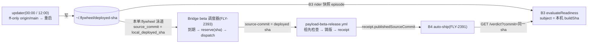

# FLY-2508 更新器与 beta 线对齐 — 探索
Issue: FLY-2508 (https://linear.app/geoforge3d/issue/FLY-2508/1143b3a-更新器与-beta-线对齐本机-updater-部署的-main-commit-与-beta-铸版的)
日期: 2026-09-13
基于: 无

> **一句话**:让 beta 铸版的 `sourceCommit` 恰好等于本机 updater 真跑过的 `deployed_sha`,做法是让 FLY-2393 的 Bridge beta 调度器在 flywheel 泳道上改从本机 `~/.flywheel/deployed-sha` 取源 commit,而不是取 `origin/main` HEAD;B3 判据不改、updater 不改、legacy cron 不改。

## 1. 问题

B3(FLY-2390,PR #1156 未合入)的 `evaluateReadiness()` 只对**本机真跑过且此刻仍在跑**的 `sourceCommit` 给 green:

- `anchor` 来自 `release_deployment_anchors`,rider 只对 `localDeployedSha` 快照(`plan.md §4.1 步骤 1`);没有 anchor ⇒ `no_deployment_evidence`。
- `localDeployedSha !== subject.sourceCommit` ⇒ `not_currently_deployed`。

而 beta 铸版的 `sourceCommit` 是 `origin/main` 在铸版时刻的 HEAD。两条线各自追 main、但在不同时刻采样,所以几乎永远不相等。B4(FLY-2391)拿着 beta 的 `sourceCommit` 问 B3 ⇒ `unknown` ⇒ auto-ship-on-silence 拿不到 green。

## 2. 实核事实(2026-09-13,本机生产库只读副本 + GitHub API)

| 事实 | 证据 |
|---|---|
| 本机 `deployed-sha` = `4bad8ae2`;`origin/main` = `26ebc493`,中间 3 个 merge(#1168、#1162、#1164,均 2026-09-13 15:1x PDT) | `cat ~/.flywheel/deployed-sha`;`git log 4bad8ae2..origin/main` |
| Bridge `/health` `buildSha = 4bad8ae2`,与 deployed-sha 一致 | `curl localhost:9876/health` |
| `deployment_events` 由 `scripts/restart-services.sh:record_deployed_range` 写入,`source=fallback-git-log`,**每个批次里每个 merge 一行**,`deployed_sha` = 批次头 | 表最新 8 行:批次 `4bad8ae2` 含 merge `4bad8ae2/d953f15f/69364399` |
| updater 每天 00:00 / 12:00(本地)只在 `deployed-sha ≠ origin/main` 时 `merge --ff-only origin/main` 后重启;另有 founder urgent token 路径(target 必须是 `origin/main` 祖先) | `scripts/update-flywheel.sh:634-655`、`:415-429`;`scripts/launchd/com.flywheel.updater.plist` |
| Bridge beta 调度器(FLY-2393,#1160 已合入)**尚未接管**:`beta_schedule_lanes` / `beta_schedule_occurrences` 两表为空;GitHub 仓库变量里没有 `FW_BETA_SCHEDULER_OWNER`(缺省 = legacy);生产 `~/Dev/flywheel/.flywheel/config.yaml` 没有 `beta_release` 段 | sqlite 只读副本;`gh api repos/xrliAnnie/flywheel/actions/variables` |
| 现在铸 beta 的是 GitHub Actions legacy cron(`0 */6 * * *`),源 = 该次运行的 `GITHUB_SHA` = main HEAD;GitHub 读不到本机文件 | `.github/workflows/payload-beta-release.yml` |
| Bridge 调度器接管后,源 = `transport.head(binding)` = `GET /repos/{repo}/commits/{defaultBranch}` | `beta-release-scheduler.ts:336`、`beta-release-github.ts:279-292` |
| 接收端 workflow 已有「冻结 SHA 必须可从默认分支到达」祖先检查,以及 `no_change` / `covered_by_newer`(已有后代 beta 时不把指针退回旧代码) | `scripts/release/beta-schedule-receipt.mjs:assessBetaSource`;FLY-2393 plan §5 第 2 条 |
| 2390 设计体举的例子:beta.4 铸自 `92532e22`(09-10 16:33),本机跑的 `d964e9fc`(09-10 17:42);前者是后者的祖先,中间恰 1 个 merge | `git merge-base --is-ancestor` |
| **legacy beta 线已停摆**:#1160 合入 main(`4bad8ae2`,09-12 20:04Z)后,workflows 列表里 `payload-beta-release.yml` 的 name 退化为文件路径,main 上每次 push 生成 `event=push, jobs=0, failure` 的 run(`gh run view` 提示 workflow file issue),09-13 全天零 schedule run;最后一次成功 schedule 是 09-12 18:15Z(`ca869ad6`) | `gh run list --workflow payload-beta-release.yml`;已以 FINDING 上报 Lead(report `c2684bd8`)。**Lead 裁定:已知且已有主,是 FLY-2534**(根因是 job 级 `env` 里引用 `runner.temp`,不是我最初猜的 `queue: max`;修法 = 改该 env + 全 workflow 加 actionlint 守卫),本单只记为前置阻断,不另开单、不碰 workflow |

## 3. 三个候选与裁定

| 候选 | 做法 | 评估 | 裁定 |
|---|---|---|---|
| **1. beta 从本机 deployed-sha 铸** | Bridge 调度器在 flywheel 泳道读 `~/.flywheel/deployed-sha` 作为 `source-commit` | 一处改动、零新凭据、复用 B3 已有的 `readLocalDeployedSha` 与同一个 env(`FLYWHEEL_DEPLOYED_SHA_FILE`);语义自洽:「beta = founder 机器一直在跑的那份代码」;接收端已有祖先检查与 `covered_by_newer` 兜住回滚;代价:只在 Bridge 接管后生效,legacy cron 期间不对齐 | **采纳**(Lead `d8284868`) |
| 2. B3 按祖先关系归因 | beta `S` 是 deployed `D` 的祖先且中间「无 runtime 改动」⇒ 视为已 soak | `S` 的字节从未在本机跑过;「哪些路径算 runtime」是一套要长期维护的镜像词表,分类错一次就会把没 soak 的代码判 green;违反 B3 fail-closed 与 PRD 同 `sourceCommit` 身份链(promote 必须从同一 commit 出干净版本);而且当前节奏下 beta 通常比 deployed **新**,该方向根本帮不上 | **拒绝** |
| 3. updater 部署 beta 的 sourceCommit | updater 改读 manifest,部署 beta 指向的 commit | 机器更新耦合 endpoint 可用性;urgent token 部署更新的 commit 之后,下一轮 `ff-only` 回不到旧 beta sha,每 12h 告警一次直到新 beta 出现;把外部服务内容变成本机部署目标,扩大信任面;且 beta 每 6h 换 sha,episode 更短,B3 更难 green | **拒绝** |

不给 legacy cron 另造「机器把 deployed-sha 推到 GitHub 变量」的写通道(Lead 同一裁定):那是为过渡态增加一条带凭据的出站写路径,而过渡态的退出方式(接管)已经在 FLY-2393 runbook 里。

## 4. 对齐之后的第二道阻断(已知限制,本单不解)

B3 policy 默认 `soakHours = 12`,且 Q1 裁定要求 `sourceCommit` 仍是**当前** `deployed_sha`。updater 每 12h 只要 main 前进就换 sha ⇒ 一个 sha 的 episode ≈ 12h ⇒ green 窗口 ≈ 0,只有 main 静止半天才可能 green。

Lead 裁定(`5f9d4132`):本单选 (c) —— 不动 `FLYWHEEL_READINESS_SOAK_HOURS`、不动 updater 节奏;QA 判据改为「verdict 离开 `no_deployment_evidence`,落在 `soak_insufficient | green | hold` 之一,且 `sourceCommit` = deployed sha」;plan 里把 `SOAK_HOURS < 12` 列为 founder 产品参数选项,由 Lead 另行呈给 founder。

## 5. 方向(进 research / plan)

- **一个真相源**:`deployed-sha` 文件已是 updater、restart-services、B3 三方共用的身份;本单只是让 beta 调度器也读它,路径与校验复用 B3 的 `readLocalDeployedSha`(`release-readiness/subject.ts`,env `FLYWHEEL_DEPLOYED_SHA_FILE`)。
- **策略而非硬编码项目名**:`beta_release.source_commit: default_branch_head | local_deployed_sha`,默认不变;放在 FLY-2393 已定的唯一配置位置(canonical root 的 `.flywheel/config.yaml`),不进 env、不进 roster。
- **fail-closed**:读不到 / 非法 sha ⇒ 该泳道 `attention`,**不**退回 main HEAD;sha 不在默认分支上(用已有 compare API)⇒ `attention`,不 dispatch。
- **可审计**:occurrence 冻结 `source_origin`,管理台显示「内部测试版取自:本机已部署版本」;QA 证据链 = `occurrence.source_origin` → `receipt.publishedSourceCommit` → B3 verdict 的 `subject.sourceCommit === evidence.localDeployedSha`。
- **不做**:不改 B3 代码、不改 updater、不改 workflow、不给 legacy cron 对齐、不接管(接管是 FLY-2393 runbook 的运维步骤,是本单生效前置)。

## 6. 依赖与前置

1. FLY-2390 PR #1156 合入(提供 `readLocalDeployedSha` 与 B3 本身)。
2. legacy beta workflow 解析故障修复 = **FLY-2534**(Lead 已认领,实现中)——否则没有任何真实 beta 可供 QA;本单 QA 判据依赖 FLY-2534 先落地。
3. FLY-2393 runbook 的 flywheel 接管(配置 `beta_release` 段 + `FW_BETA_SCHEDULER_OWNER=paused→bridge` + 排空)。
