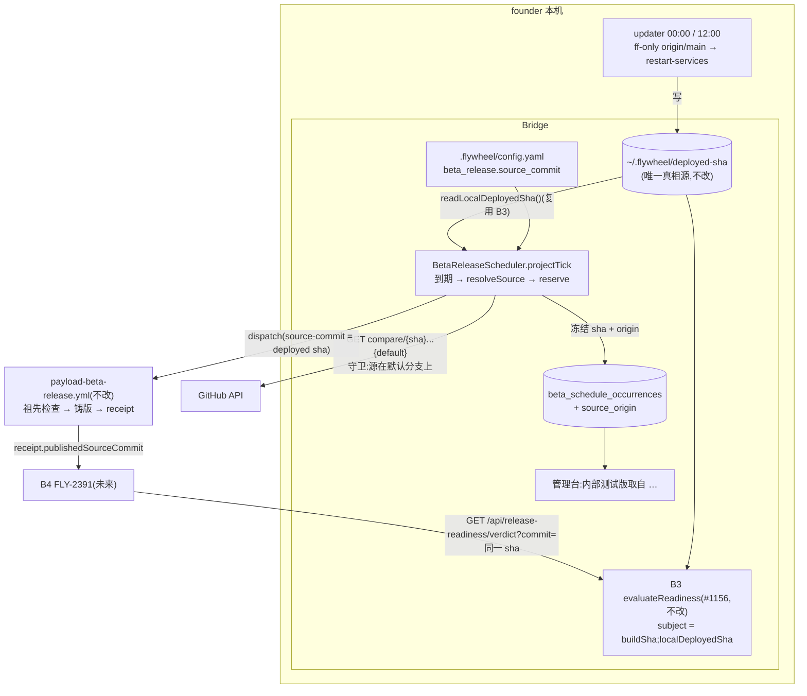
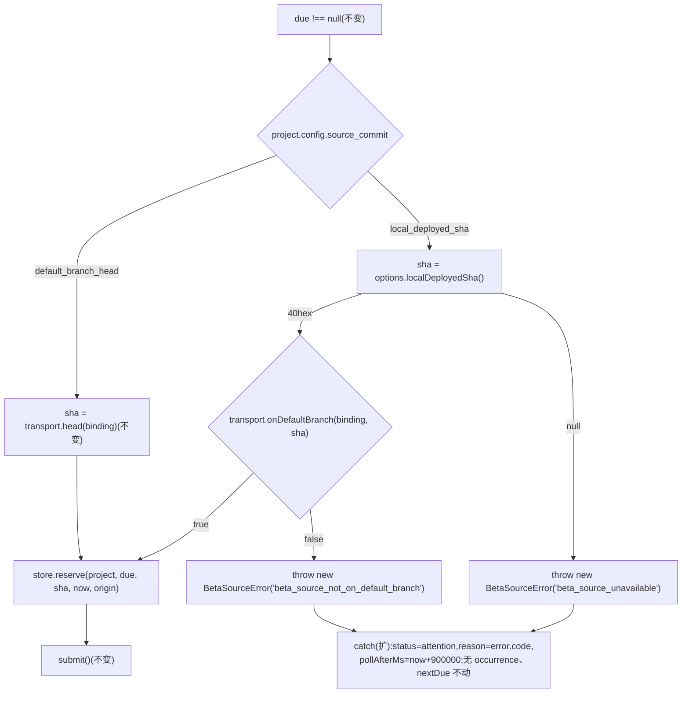

# FLY-2508 更新器与 beta 线对齐 — 实施计划
Issue: FLY-2508 (https://linear.app/geoforge3d/issue/FLY-2508/1143b3a-更新器与-beta-线对齐本机-updater-部署的-main-commit-与-beta-铸版的)
日期: 2026-09-13
基于: research.md

> **一句话**:给 FLY-2393 的 Bridge beta 调度器加一个按项目配置的取源策略 `beta_release.source_commit`,flywheel 泳道设为 `local_deployed_sha` 后,每次到期冻结的 `source-commit` 就是本机 updater 真跑着的 `~/.flywheel/deployed-sha`(复用 B3 的 `readLocalDeployedSha`);读不到或不在默认分支上 ⇒ 该泳道 `attention`、不 dispatch、不退回 main HEAD;occurrence 冻结 `source_origin` 供审计,管理台一行标签。**不改** B3、updater、workflow、legacy cron;接管仍是 FLY-2393 runbook 的运维步骤。
> **Lead 裁定已折入**:`d8284868`(采纳候选 1,拒 2 / 3,接管为生效前置,不给 legacy 造写通道);`5f9d4132`(soak 12h 与 updater 12h 的窗口问题选 (c):本单不动 SOAK_HOURS 与 updater 节奏,QA 判据 = verdict 离开 `no_deployment_evidence` 落入 `soak_insufficient | green | hold` 且 `sourceCommit` = deployed sha)。
> **评审记录**:§11。

---

## 0. 全景



## 1. 稳定身份与展示标签

| 身份 | 形状 | 谁分配 | 展示(标签只在 `fleet-console-html.ts` 的客户端固定映射一处) |
|---|---|---|---|
| **取源策略** `BetaSourceOrigin` | `"default_branch_head" \| "local_deployed_sha"`;常量与类型在 `packages/config/src/beta-release-config.ts` 一处导出,teamlead 只 import | 项目 `.flywheel/config.yaml` 的 `beta_release.source_commit`;缺省 `default_branch_head` | `主分支最新` / `本机已部署版本` |
| occurrence 来源 | `beta_schedule_occurrences.source_origin TEXT NULL`,值 ∈ 上表或 `NULL`(本单之前的历史行) | `reserve()` 冻结,之后不变 | 历史行显示 `主分支最新(历史)` |
| 泳道观测 | `BetaScheduleObservation.sourceOrigin: BetaSourceOrigin \| null`(未配置 / 无 config 时 `null`) | 每 tick 从当前 config 投影 | 同上 |
| 失败原因码(新增,与现有 `beta_*` 同族,进 `reason`) | `beta_source_unavailable`(文件缺失 / 非 40hex)、`beta_source_not_on_default_branch`(compare 不通过) | 调度器 | `内部测试版需要检查` + reason 原文 |
| 源 sha | 40hex 小写,现有校验不变(`reserve` 拒非法) | `readLocalDeployedSha` 或 `head()` | 现有 `lastPublished.sourceCommit` |

**命名红线**:不在任何地方硬编码项目名 `flywheel` 来选策略;策略只来自配置。

## 2. 合同

### 2.1 配置(`parseBetaReleaseConfig`,唯一校验点)

```yaml
beta_release:
  interval_hours: 6
  workflow_file: payload-beta-release.yml
  token_env: FLYWHEEL_BETA_ACTIONS_TOKEN
  source_commit: local_deployed_sha      # 新增,可选;缺省 default_branch_head
```

- 允许键白名单加 `source_commit`;值必须是上述两个字符串之一,其它类型 / 值 ⇒ `throw Error("beta_release.source_commit must be default_branch_head or local_deployed_sha")`(错误信息不回显输入值,与现有惯例一致)。
- `BetaReleaseConfig.source_commit: BetaSourceOrigin`(解析后总有值;缺省填 `default_branch_head`),`ConfigLoader.ts` 与 `beta-release-config-source.ts` 走同一函数,零额外分支。
- `local_deployed_sha` 语义:读 `FLYWHEEL_DEPLOYED_SHA_FILE ?? ~/.flywheel/deployed-sha`,这是**宿主机全局**文件,只对自托管在本机的项目有意义;配到别的项目会被 §2.3 守卫挡下(attention),文档写明。

### 2.2 调度器(`projectTick`,只动取源那一步)



- `BetaReleaseScheduler` options 新增 `localDeployedSha?: () => string | null`;未注入而配置要求 `local_deployed_sha` ⇒ 视同 `null` ⇒ `beta_source_unavailable`(fail-closed,测试覆盖)。
- `BetaReleaseTransport` 新增 `onDefaultBranch(binding, sha, signal): Promise<boolean>`;`BetaReleaseGitHub` 实现:`GET {path}/compare/{sha}...{encodeURIComponent(defaultBranch)}`,通过条件 `status ∈ {identical, ahead} ∧ behind_by === 0 ∧ merge_base_commit.sha === sha`;非 200 / schema 错按现有 `BetaGitHubError` 抛出(进 attention,原因码 `beta_github_http_*` / `beta_github_schema`),**不**当作 `true`。
- `BetaSourceError extends Error { code }`,与 `BetaGitHubError` 平行;`catch` 里 `reason = error instanceof BetaGitHubError || error instanceof BetaSourceError ? error.code : "beta_observation_failed"`。
- `local_deployed_sha` 路径不调用 `head()`;`default_branch_head` 路径字节不变(现有测试全部原样通过是完成判据之一)。
- 每 tick 观测新增 `sourceOrigin`(来自 `project.config?.source_commit ?? null`),写入 `observations` 与 `unboundObservations`(持久化的 `BetaStoredObservation` 不加列,页面读到的是内存观测)。

### 2.3 守卫顺序(fail-closed,固定)

1. 文件读不到 / 非 40hex ⇒ `beta_source_unavailable`。
2. compare 不通过 ⇒ `beta_source_not_on_default_branch`。
3. 才 `reserve`。任一失败:不 reserve、不 dispatch、不退回 `head()`。

### 2.4 管理台

- `ManagementBetaScheduleView.sourceOrigin: BetaSourceOrigin | null`(加法字段);validator 允许 `null` 或两枚举值,其它 ⇒ `throw new Error("invalid beta schedule source origin")`。语义 = **当前配置的取源策略**(来自本 tick 的 config 投影),不是 active occurrence 或最近发布的来源;切换策略后 active occurrence 仍保持冻结值,页面文案写「当前配置:内部测试版取自 …」以免误读。
- `fleet-console-html.ts` 的渲染在浏览器内嵌脚本里,拿不到服务端 TS 函数;因此 DTO 只带已校验的枚举,前端对两个枚举值做固定映射(`default_branch_head → 主分支最新`、`local_deployed_sha → 本机已部署版本`、`null → 不显示`),在「当前 N 小时」旁加一行,文本经 `esc()`。服务端 `beta-release-management.ts` 不再另定义标签函数(避免两处词表)。
- 不新增路由、不新增写接口。

### 2.5 B3 / B4 接口(不改,只写清用法)

- B4 应以 receipt 的 `publishedSourceCommit` 作为 `GET /api/release-readiness/verdict?commit=` 的值,`baseVersion` = 该 commit 的 `doc/VERSION`。
- 对齐成立的可审计链:`beta_schedule_occurrences.source_origin = 'local_deployed_sha'` → `receipt.sourceCommit = publishedSourceCommit`(`published` / `no_change`)→ verdict `subject.sourceCommit === evidence.localDeployedSha` 且 reasons 不含 `not_currently_deployed` / `no_deployment_evidence`。

## 3. 数据模型与迁移

### 3.1 新列

```sql
ALTER TABLE beta_schedule_occurrences ADD COLUMN source_origin TEXT;  -- NULL = 本单之前的历史行
```

- `BetaReleaseStore.migrate()` 沿用 `PRAGMA table_info` + 缺列才 `ALTER`(`beta-release-store.ts:39-56` 同款),幂等。
- `occurrenceSelect` 加 `source_origin AS sourceOrigin`;`BetaOccurrence.sourceOrigin: BetaSourceOrigin | null`。
- `reserve(project, due, sourceCommit, now, sourceOrigin)`:第五参数必填,写入同一 INSERT;值不在枚举 ⇒ 抛错(边界校验)。
- 唯一约束 `(project_name, binding_revision, scheduled_at_ms)` 与 `occurrenceId` 派生**不变**(策略不参与身份)。

### 3.2 配置

- 生产 `~/Dev/flywheel/.flywheel/config.yaml` 的 `beta_release` 段由**接管运维步骤**写入(含 `source_commit: local_deployed_sha`),本 PR 不改任何生产配置。
- 策略变更(空闲时改 config)与 FLY-2393 频率变更同语义:active occurrence 保持冻结 sha 与 origin;下一次到期用新策略。

### 3.3 回滚边界

- 还原 PR:`source_origin` 列留在库里(惰性,NULL 语义不变),无害。
- **注意**:旧二进制的 `parseBetaReleaseConfig` 不认识 `source_commit` ⇒ 整块 `config_invalid` ⇒ 该泳道停派(fail-closed,不误发)。回滚二进制时必须同时从 config.yaml 删掉该键,写进 runbook 补充节。
- **数据迁移:无**;**不可回滚项:无**。

## 4. 代码结构与改动清单

```
packages/config/src/beta-release-config.ts        BETA_SOURCE_ORIGINS 常量 + BetaSourceOrigin 类型 + source_commit 解析/缺省/拒绝
packages/config/src/index.ts                       导出上述类型/常量
packages/teamlead/src/bridge/beta-release-contract.ts   BetaOccurrence.sourceOrigin
packages/teamlead/src/bridge/beta-release-store.ts      migrate 加列;occurrenceSelect;reserve 第五参数
packages/teamlead/src/bridge/beta-release-github.ts     onDefaultBranch();BetaSourceError 定义(或独立小文件 beta-release-source.ts)
packages/teamlead/src/bridge/beta-release-scheduler.ts  options.localDeployedSha;transport.onDefaultBranch;resolveSource;catch 扩;observation.sourceOrigin
packages/teamlead/src/bridge/beta-release-runtime.ts    注入 localDeployedSha: () => readLocalDeployedSha()(来自 release-readiness/subject.ts,#1156)
packages/teamlead/src/bridge/beta-release-management.ts sourceOrigin 投影(只传枚举,不定义标签)
packages/teamlead/src/bridge/management-console-contract.ts  view 字段 + validator
packages/teamlead/src/bridge/fleet-console-html.ts      一行标签(esc)
engineering/doc/FLY-2393-project-beta-cadence/runbook.md  追加「source_commit 与回滚注意」小节(文档)
```

**不改**:`evaluate.ts` / `service.ts` / `subject.ts`(B3)、`update-flywheel.sh`、`restart-services.sh`、`payload-beta-release.yml`、`beta-schedule-receipt.mjs`、`payload-release.mjs`、`truth.ts`(env 已由 #1156 登记)、`BetaStoredObservation` 持久化形状、`occurrenceId` 派生。

## 5. 负向守卫(必须有测试)

| 守卫 | 断言 |
|---|---|
| 默认策略字节不变 | 未配置 `source_commit` 的项目:`head()` 被调用、`onDefaultBranch` 不被调用、`localDeployedSha` 不被调用;现有调度器测试原样通过 |
| 文件缺失 / 非法 | `localDeployedSha()` 返回 `null` ⇒ 无 occurrence、无 dispatch、`status=attention, reason=beta_source_unavailable, pollAfterMs=now+15min`;`head()` 未被调用(不退回 HEAD) |
| 未注入读取器 | 配置要求 `local_deployed_sha` 但 options 无 `localDeployedSha` ⇒ 同上 `beta_source_unavailable` |
| 源不在默认分支 | `onDefaultBranch` 返回 `false` ⇒ `beta_source_not_on_default_branch`,无 occurrence |
| compare 网络 / schema 错 | `BetaGitHubError` ⇒ attention 且原因码是 GitHub 码,不是 `true` 也不是 `beta_source_*` |
| 恢复 | 冷却后文件出现 ⇒ 下一 tick reserve 成功,due 被 coalesce,不重复补历史周期 |
| 冻结不变 | active occurrence 存在时改策略 ⇒ 该 occurrence 的 `sourceCommit` / `sourceOrigin` 不变;结算后下一次用新策略 |
| origin 持久化 | reserve 后读回 `sourceOrigin`;迁移前的行读回 `null`;`migrate()` 跑两次不报错 |
| 非法 origin | `reserve(..., "x")` 抛错 |
| 回滚场景 | 源 sha 比现有 beta 旧:受理 → receipt `covered_by_newer` → 现有结算路径(`succeeded`,`publishedSourceCommit` 为后代)不变;**断言该轮 `publishedSourceCommit !== occurrence.sourceCommit`,因此不满足 §8.6 的对齐判据(非 vacuous:同一夹具里 `published` 轮次满足)** |
| 配置边界 | `source_commit: 1` / `"main"` / `null` / `""` ⇒ 拒;错误信息不含输入值;`default_branch_head` / `local_deployed_sha` 通过;缺省填 `default_branch_head`;ConfigLoader 同源 |
| 管理台 | view 带 `sourceOrigin`;validator 拒 `"x"`、收 `null`;DOM 渲染出标签且 XSS 字符串被转义 |
| 运行时装配 | `createBetaReleaseRuntime` 把 `readLocalDeployedSha` 接上,`FLYWHEEL_DEPLOYED_SHA_FILE` 指向临时文件时读到该值 |
| compare API 形状 | `identical` / `ahead` 通过;`behind` / `diverged` / `merge_base ≠ sha` ⇒ `false`(`beta_source_not_on_default_branch`);404 / 非 200 / schema 错 ⇒ 抛 `BetaGitHubError`,原因码保持 `beta_github_http_404` 等 GitHub 码(404 也可能是仓库或权限不可见,不归为源问题);路径经 `path()` 校验;`defaultBranch` 经 `encodeURIComponent` |

## 6. 测试策略(TDD:先红后绿)

| 层 | 文件 | 覆盖 |
|---|---|---|
| 配置 | `packages/config/src/__tests__/beta-release-config.test.ts`;`packages/teamlead/src/bridge/__tests__/beta-release-config-source.test.ts`(解析结果新增必填默认字段,现有夹具期望值需同步) | §5「配置边界」 |
| 传输 | `bridge/__tests__/beta-release-github.test.ts` | `onDefaultBranch` 全部分支(fetch stub 已有 `/compare/` 分支) |
| store | 现有 beta store 测试文件 | 迁移幂等、`sourceOrigin` 读写、非法值 |
| 调度器 | `bridge/__tests__/beta-release-scheduler.test.ts` | §5 调度器各行;夹具加 `onDefaultBranch` 与 `localDeployedSha` 注入 |
| 管理台 | `management-console-beta-dom.test.ts` + 合同 validator 测试 | §5「管理台」 |
| 运行时 | `beta-release-runtime` 测试(新增或扩) | §5「运行时装配」 |
| 回放 | 不新增;B3 回放夹具不动 | — |

## 7. 分块与完成判据

| chunk | 内容 | 完成判据 |
|---|---|---|
| C1 | 配置类型 / 常量 / 解析 + 配置测试 | config 包测试绿 |
| C2 | contract / store 加列 + reserve 第五参数 + store 测试 | store 测试绿;迁移幂等 |
| C3 | transport `onDefaultBranch` + `BetaSourceError` + 传输测试 | github 测试绿 |
| C4 | 调度器取源分支 + catch 扩 + observation + 运行时注入 + 调度器 / 运行时测试 | 调度器测试绿(含既有例原样) |
| C5 | 管理台 view / validator / 标签 / HTML + DOM 测试;runbook 补充节 | 管理台测试绿 |
| C6 | 全仓 build、定向套件(排除 `**/tmux-viewer.macos.test.ts`)、biome;PR | CI 绿 |

## 8. 部署与激活次序

1. **前置 A**:FLY-2390 PR #1156 合入(`readLocalDeployedSha` 来源 + B3 本身)。实现节点从合入后的 main 开分支。
2. **前置 B = FLY-2534**:legacy `payload-beta-release.yml` 解析故障(FINDING 已报 Lead,report `c2684bd8`;Lead 裁定已有主 —— FLY-2534 实现中,根因是 job 级 `env` 引用 `runner.temp`,修法 = 改该 env + 全 workflow 加 actionlint 守卫)。未修复前 GitHub 拒绝该 workflow 的任何运行,接管后 Bridge dispatch 同样失败。**本单不修、不另开单、不碰 workflow**;§8.6 的 QA 依赖 FLY-2534 先落地。
3. 本 PR 合入 main → updater 窗口部署(不重启任何额外服务)。此时生产无 `beta_release` 段,行为字节不变。
4. **接管(FLY-2393 runbook 步骤 1-6,运维执行,不在本单)**:写 flywheel `beta_release` 段(含 `source_commit: local_deployed_sha`)、设 `FLYWHEEL_BETA_ACTIONS_TOKEN_ENVS`、owner `paused → 排空 → bridge`。
5. 首个到期:occurrence `source_origin='local_deployed_sha'`、`source_commit` = 当时 deployed-sha;workflow 出 receipt,按 outcome 三分支:
   - `published | no_change`:`publishedSourceCommit === occurrence.sourceCommit`,**进入第 6 步对齐 QA**。
   - `covered_by_newer`(deployed-sha 比现有 beta 旧:回滚或 urgent 部署旧 sha 时会发生):只证明「指针未回退、本 occurrence 安全结算」,`publishedSourceCommit` 是后代、≠ deployed sha,**不算本单验收通过**;等下一个 deployed-sha / 下一次到期产生 `published | no_change` 再做第 6 步。
   - 回执缺失 / 非法:现有 attention 路径,与本单无关。
6. **QA 判据(Lead 裁定 c;仅对第 5 步的 `published | no_change` 分支)**:对该 `publishedSourceCommit` 调 `GET /api/release-readiness/verdict?commit=&baseVersion=`:`state ∈ {unknown(soak_insufficient), green, hold}`,reasons **不含** `no_deployment_evidence` / `not_currently_deployed`,`subject.sourceCommit === evidence.localDeployedSha`;同时管理台显示「本机已部署版本」。QA 报告必须写明首轮 outcome 是哪个分支;`covered_by_newer` 轮次因 `occurrence.sourceCommit !== publishedSourceCommit`(稳定身份事实,与 updater 之后是否推进到该后代无关)不能作为本单同一 sha 对齐的证据,其 B3 结果不得写成对齐失败或对齐成功。

## 9. 不做(显式)

- 不改 B3 判定、verdict 形状、policy 默认值(含 `FLYWHEEL_READINESS_SOAK_HOURS`)。
- 不改 updater 节奏、部署目标、`deployed-sha` 写法;不给 legacy cron 对齐;不造「机器 → GitHub 变量」写通道。
- 不改 workflow / 接收端 / publisher;解析故障由已认领的 FLY-2534 修复,本单仅把其落地作为 QA 前置,不另开单。
- 不执行接管、不改生产配置、不发布 beta、不部署。
- 不实现 B4;不做祖先归因;不硬编码项目名。

## 10. 风险与已知限制

| 风险 / 限制 | 说明与缓解 |
|---|---|
| **soak 12h 与 updater 12h 的窗口 ≈ 0**(Lead 裁定 c) | 对齐后 verdict 从 `no_deployment_evidence` 变为 `soak_insufficient`,只有 main 静止半天才可能 green。founder 产品参数选项:把 `FLYWHEEL_READINESS_SOAK_HOURS` 设为 <12(纯 env,B3 已支持并写进 verdict `policy`),由 Lead 另行呈报;本单不改 |
| 对齐只在接管后生效 | legacy cron 期间 B4 仍拿 `unknown`;这是 Lead 认可的过渡态 |
| 前置 B(FLY-2534)未落地 ⇒ 无真实 beta | QA 不可达,直到 FLY-2534 合入并部署;不用 mock beta 冒充验收 |
| 首轮 outcome 是 `covered_by_newer` | 不算通过也不算失败,按 §8.5 等下一轮 `published \| no_change` |
| 读文件与 compare 之间的 TOCTOU 窗口 | updater 若在这几秒内推进 deployed-sha,本轮冻结的是刚退出运行的旧 sha;B3 的 `not_currently_deployed` 会挡住错误 green,是可用性残余风险而非安全风险(Codex R1 advisory 3,留档 F4) |
| 误配到非自托管项目 | compare 守卫 ⇒ attention;runbook 写明该键只对自托管项目有意义 |
| 回滚二进制而 config 仍含新键 | 泳道 `config_invalid` 停派(fail-closed);runbook 补充节要求同时删键 |
| 每次到期多 1 次 compare 调用 | 6h 一次,10s timeout,在 GitHub 配额内可忽略 |

## 11. 评审记录

| 轮 | 结论 | 处理 |
|---|---|---|
| R1(2026-09-13,thread `01a09cf4-6162-7552-8591-d6acd22fc1c9`) | CHANGES REQUESTED,2 blocking + 5 advisory | #1 §8.2 / §10 / F1 同步为 FLY-2534(Lead 裁定 `c2684bd8`);#2 §8.5 拆 `published \| no_change` / `covered_by_newer` / 非法三分支,§5 加非 vacuous 断言。advisory:A1 / A2 / A4 只做措辞澄清(§2.4 前端固定映射、文案语义、404 原因码),A5 进 §6 测试清单,A3 记 §10 + F4 |
| R2(2026-09-13,同 thread) | CHANGES REQUESTED,1 blocking + 2 advisory | #1 §9「不做」一行残留「另开单」改为 FLY-2534 修复、本单只作前置;advisory:§1 表头 / §4 清单删掉服务端标签函数残留(research §3 同步),§8.6「必然 not_currently_deployed」改为稳定身份表述 |

## 12. Follow-ups(留档,不在本单修)

| # | 来源 | 内容 |
|---|---|---|
| F1 | 本单实核 → Lead 裁定 | legacy `payload-beta-release.yml` 解析故障 = **FLY-2534**(已有主,实现中);本单只作为前置阻断引用,不另开单 |
| F2 | Lead 裁定 `5f9d4132` | `FLYWHEEL_READINESS_SOAK_HOURS < 12` 作为 founder 产品参数,Lead 呈报 |
| F3 | 本单 | 接管后若希望「同 sha 不再每 6h 跑一次 assess」,可在调度器侧短路 `no_change`;当前 assess 步已 `build=false`,成本可忽略,先不做 |
| F4 | Codex R1 advisory 3 | 读文件与 compare 之间的 TOCTOU:若产品要求「reserve 时刻严格相等」,可在 compare 后同步复读一次、变化则不 reserve;v1 依赖 B3 `not_currently_deployed` 兜底 |
