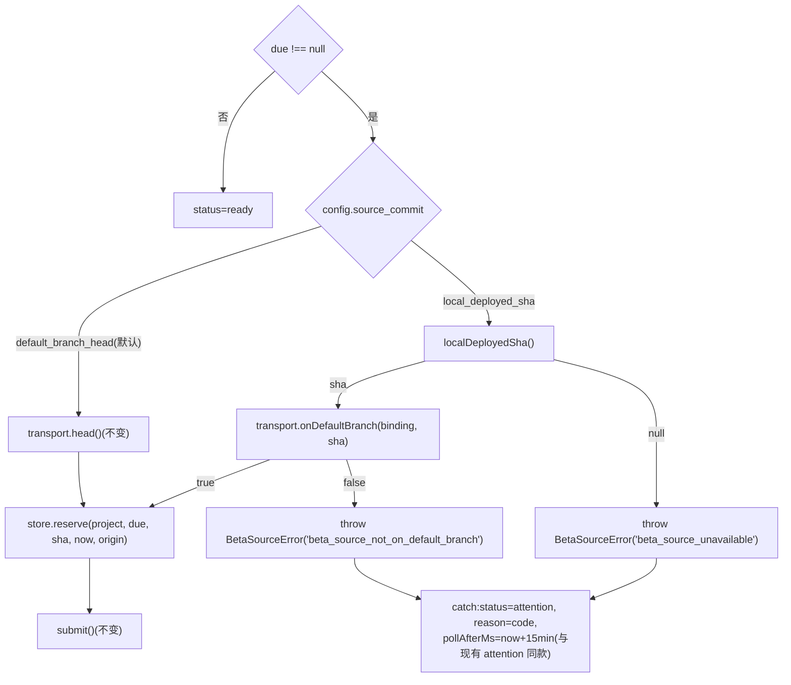

# FLY-2508 更新器与 beta 线对齐 — 调研
Issue: FLY-2508 (https://linear.app/geoforge3d/issue/FLY-2508/1143b3a-更新器与-beta-线对齐本机-updater-部署的-main-commit-与-beta-铸版的)
日期: 2026-09-13
基于: exploration.md

> 目的:把 exploration §5 的方向落到具体代码位置,核对每个消费者,确认「改一处、复用三处」成立,并把接收端 / B3 / updater 三方**不需要改**的理由写清楚。

## 1. 源 commit 今天在哪里被决定

| 阶段 | 位置 | 现状 |
|---|---|---|
| 到期 → 冻结源 | `packages/teamlead/src/bridge/beta-release-scheduler.ts:336` `const sha = await transport.head(binding, signal)`,随后 `store.reserve(project, due, sha, now)` | 唯一的取源点;`head()` 在 `beta-release-github.ts:279-292` 打 `GET /repos/{repo}/commits/{defaultBranch}` |
| 冻结 | `beta-release-store.ts:169-222 reserve()`:校验 40hex,事务内建 occurrence + 占 `active_occurrence_id` | occurrence 表 `source_commit TEXT NOT NULL`,无来源列 |
| 派发 | `beta-release-github.ts:293-341 dispatch()`:inputs `schedule-key / source-commit / project-key` | 不关心 sha 从哪来 |
| 接收 | `.github/workflows/payload-beta-release.yml` `assess` 步 → `scripts/release/beta-schedule-receipt.mjs:assessBetaSource`:`merge-base --is-ancestor <sourceCommit> origin/main` 不通过 ⇒ `beta_source_unreachable`;再对照 manifest 现有 internal-beta:同 sha ⇒ `no_change`,已有后代 ⇒ `covered_by_newer`,无祖先关系 ⇒ attention | 接收端已能处理「源比 main HEAD 旧」和「源比现有 beta 旧」两种情形 |
| 回执核验 | `beta-release-github.ts:469-485`:`covered_by_newer` 时用 `GET /repos/{repo}/compare/{sourceCommit}...{publishedSourceCommit}` 核 `status=ahead ∧ behind_by=0 ∧ merge_base=sourceCommit` | compare API 的读法已存在,可直接复用为「源在默认分支上」的前置守卫 |

结论:**只有取源点需要变**。接收端与回执合同对「源是 main 上的任一祖先 commit」已是既定语义(FLY-2393 plan §5 第 2 条:「排队 20 分钟后 main 前进仍发布已冻结、已进入默认分支的版本」)。

## 2. deployed-sha 这个真相源的三个现有读者

| 读者 | 路径 / 校验 | 备注 |
|---|---|---|
| updater | `scripts/update-flywheel.sh:21` `DEPLOYED_SHA_FILE=${HOME}/.flywheel/deployed-sha`;`deployed_sha()` 只 `cat` | 写者是 `restart-services.sh`(`:40`、`:534` 附近,部署收敛后写) |
| B3(#1156 分支) | `packages/teamlead/src/bridge/release-readiness/subject.ts:29-39 readLocalDeployedSha(path = FLYWHEEL_DEPLOYED_SHA_FILE ?? ~/.flywheel/deployed-sha)`,`^[0-9a-f]{40}$` 否则 `null` | env 已登记 `truth.ts NON_FLAG_ALLOWLIST`(2390 分支) |
| B3 rider | `listDeploymentEpisodesForSha(localDeployedSha)` 从 `deployment_events(project_name='flywheel', environment='production')` 推 episode | `deployment_events.deployed_sha` 的值就是这个文件的值(`record_deployed_range` 传 `--deployed-sha "$new"`) |

本单第四个读者 = beta 调度器,**必须复用 `readLocalDeployedSha`**(同一 env、同一正则、同一 `null` 语义),因此 #1156 合入是硬前置;不在 beta 代码里再抄一个读取函数。

`readLocalDeployedSha` 是同步 `readFileSync`。调度器 `projectTick` 是 async,并发上限 4;一次 40 字节文件读在到期时刻发生(6h 一次),不构成阻塞问题;不放进 GitHub 请求路径。

## 3. 配置合同的唯一位置

- 类型与纯校验:`packages/config/src/beta-release-config.ts parseBetaReleaseConfig`,允许键白名单 `["interval_hours","workflow_file","token_env"]`(`:21-27`)。新键必须加入这里,否则整块 `config_invalid` ⇒ 泳道停派(这一点是回滚时的注意事项,见 plan §3.5)。
- `ConfigLoader.ts:167-168` 与 `beta-release-config-source.ts:56` 调同一函数;`revision = sha256(文件全文)`(`:60`),字段变化自然换 revision,不需要额外处理。
- 管理台只消费枚举(FLY-2393 plan §4);`fleet-console-html.ts` 的渲染是浏览器内嵌脚本,拿不到服务端 TS 函数,所以展示标签只能在它的客户端固定映射一处,服务端 DTO 只传已校验枚举。

## 4. 「源在默认分支上」守卫的 API 形状

`GET /repos/{owner}/{repo}/compare/{base}...{head}`,取 `base = 候选源 sha`,`head = binding.defaultBranch`:

| 情形 | `status` | `behind_by` | `merge_base_commit.sha` | 判定 |
|---|---|---|---|---|
| 源 = HEAD | `identical` | 0 | = 源 | 通过 |
| 源是 HEAD 祖先(常态:本机落后 main) | `ahead` | 0 | = 源 | 通过 |
| 源在 HEAD 之后(不可能,但 fail-closed) | `behind` | >0 | ≠ 源 | 拒 |
| 源不在默认分支 / 被 force-push 掉 / 别的仓的 sha | `diverged` 或 404 | — | — | 拒 |

与 `receipt()` 里 `covered_by_newer` 的核验逻辑同一形状,可抽成 `BetaReleaseGitHub.onDefaultBranch(binding, sha, signal)` 复用。每次到期 1 次调用,不进管理台读路径。已有的 `request()` 提供 10s timeout、2 MiB 上限、固定 origin、`redirect: "error"`。

## 5. 调度器状态机里插入点与失败分类

- 现有 `catch`(`beta-release-scheduler.ts:341-350`)只认 `BetaGitHubError` 的 `code`,其它一律 `beta_observation_failed`。需要让 `BetaSourceError` 也带 `code` 进 `reason`,否则管理台看不到是「本机没读到 sha」。
- 失败发生在 `reserve()` 之前:没有 occurrence、没有 active 指针、`nextDueAtMs` 不动。冷却 15 分钟后下一 tick 重新 `due()`(`store.due` 会 coalesce),所以修好文件后自动恢复,不需要人工推进。
- `head()` 在 `local_deployed_sha` 路径**不再调用**;`default_branch_head` 路径字节不变。

## 6. 三个不改的地方,理由

| 不改 | 理由 |
|---|---|
| B3 `evaluateReadiness` / verdict 形状 | verdict 已带 `subject.sourceCommit` 与 `evidence.localDeployedSha`,对齐后二者相等即是「归因依据」;`not_currently_deployed` / `no_deployment_evidence` 两个 reason 码就是对齐失败的显式信号。加「祖先归因」字段会引入被拒的候选 2 语义 |
| updater / restart-services | 候选 3 被拒;`deployed-sha` 的写法与 `deployment_events` 的记法不变 |
| `payload-beta-release.yml` / `beta-schedule-receipt.mjs` | 接收端对任意 main 祖先源已有完整处理(§1);legacy cron 的解析故障是另一张单 |

## 7. 回滚场景推演(接收端已有语义)

| 场景 | deployed-sha 变化 | 下一次到期 | 结果 |
|---|---|---|---|
| 正常前进 | `D1 → D2` | 源 = `D2` | `published`(新 beta)或 `no_change`(D2 已铸) |
| main 静止 | `D2` 不变 | 源 = `D2` | `no_change`,`assess` 步 `build=false`,不构建 |
| restart-services 回滚 | `D2 → D1` | 源 = `D1` | 现有 beta 是 `D1` 后代 ⇒ `covered_by_newer`,指针不回退;B3 对 `D1` 开新 episode;B4 看最新 beta(`D2`)⇒ `not_currently_deployed` ⇒ 不 green(fail-closed 正确) |
| founder urgent token 部署 `X`(main 祖先) | `→ X` | 源 = `X` | 与正常前进同;若 `X` 比现有 beta 旧 ⇒ `covered_by_newer` |
| 文件缺失 / 非 40hex | — | `beta_source_unavailable` | attention,不 dispatch,不退回 HEAD |
| 误把 `local_deployed_sha` 配到非自托管项目 | flywheel 的 sha | compare `diverged` ⇒ `beta_source_not_on_default_branch`;compare 404 ⇒ 保持 GitHub 码 `beta_github_http_404`(404 也可能是仓库 / 权限不可见) | attention,不 dispatch |

## 8. 测试基础设施核对

- 调度器测试 `beta-release-scheduler.test.ts` 用内存 `StateStore` + 手写 `BetaReleaseTransport` 夹具(`:27-75`),`head()` 固定返回 `"a".repeat(40)`;新增 `onDefaultBranch` 与 `localDeployedSha` 注入点后夹具可逐例覆盖。
- GitHub 传输测试 `beta-release-github.test.ts:272` 已有 `/compare/` 的 fetch stub 分支,可扩到新方法。
- 配置测试 `packages/config/src/__tests__/beta-release-config.test.ts` 三例(缺省 / 拒绝 / ConfigLoader 同源),按同款加 `source_commit` 例。
- 管理台 DOM 测试 `packages/teamlead/src/__tests__/management-console-beta-dom.test.ts` 以 `betaSchedule` 夹具渲染;合同校验在 `management-console-contract.ts:398-427`。
- store 迁移已有 `PRAGMA table_info + ALTER TABLE ADD COLUMN` 惯例(`beta-release-store.ts:39-56`),occurrence 表可同法加列。

## 9. 前置与阻断(进 plan §8)

1. **#1156(FLY-2390)合入**——`readLocalDeployedSha` 的来源;不合入就无法复用,也无 B3 可验。
2. **legacy beta workflow 解析故障 = FLY-2534**(exploration §2 最后一行;Lead 裁定已有主,根因是 job 级 `env` 引用 `runner.temp`)——修好前 GitHub 不接受该 workflow 的任何 dispatch,接管后的 Bridge dispatch 同样会失败;本单 QA 依赖它先落地。
3. **FLY-2393 接管 runbook**(`engineering/doc/FLY-2393-project-beta-cadence/runbook.md` 步骤 1-6)——配置段、凭据允许集 `FLYWHEEL_BETA_ACTIONS_TOKEN_ENVS`、owner `paused → 排空 → bridge`。本单只新增配置段里的一个键,不执行接管。
