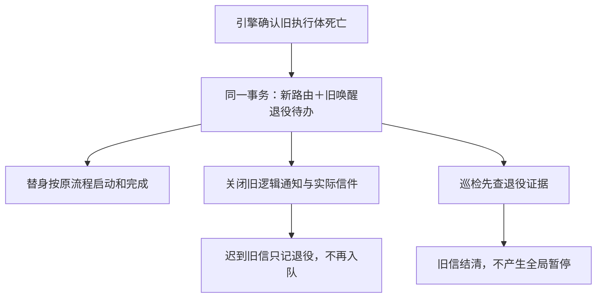

# FLY-2517 换体后旧唤醒退役 — 实施计划
Issue: FLY-2517 (https://linear.app/geoforge3d/issue/FLY-2517/病根-引擎-proven-dead-replacement-换体后仍向旧体投-phase-wakerework-wake20-分钟后判)
日期: 2026-09-11
基于: research.md

状态：设计评审待提交。范围：design 文档；以下代码行为由 implement / QA 节点实现及验证。

## 1. 面向 founder 的决定

引擎确认换体时，同时宣布旧唤醒失效；替身继续承担任务，旧信不再因无人接收而暂停整条工作流。

activation 是“一次阶段任务”的编号；execution 是“承担任务的一次执行体”的编号；epoch 是“这次拿到工作权”的序号。退役只匹配这三个精确身份和那次返工，避免误删下一轮任务。这里的“退役”表示不再投递，不代表收到或完成任务。



成功标准：事故相同顺序下，20 分钟后 run 仍 active；替身失败仍受正常保护；已被旧信暂停的 run 可通过受限 cancel 关闭该原因，且其他暂停原因继续有效。

## 2. 不变量与范围

1. **授权事实来自引擎提交**：只接受 `rework_replacement_materialized` 或 `rework_writer_replacement_converged` 的不可变 receipt，并核对相邻 route revision、旧 binding、activation turn。session.status / heartbeat / 文字“已完成”不构成退役依据。
2. **换体事务是业务线性化点**：事务提交后，旧 wake 的投递合同不再有铸 hold 的资格；comm 源收敛可以重试。
3. **新义务保留**：旧 phase/turn wake 退役，不改新 route 的 `workflow_rework_delivery`、launch receipt、QA、founder gate 或 completion 的判定。
4. **收件人不可改写**：不把旧 wake 的 content、凭证、epoch 搬给替身。
5. **真实回执不可伪造**：不为退役写 started_at、received_at、consumed_at、acked_at；已有真实时间原样保留。
6. **单一证明算法**：StateStore 的 `resolveReworkWakeRetirementProofTx` 是业务判定真源；watch、hold、backfill、operator close 均用它。CommDB 仅保存经过 StateStore 授权的效果回执，不能自行从 liveness 推导退役。
7. **不扩全家族 cancel**：phase_wake 只有精确匹配退役记录才可关闭。founder、gate、doorbell、普通 phase、其他 issue / run / request 不变。
8. 本单不修 FLY-2477 旧体为何死亡、FLY-2504 内容回执、通用 running-actor reroute 或 QA `execution_binding_ambiguous` 查询。避免误 hold 后，QA 的原权限路径自然可用；不降低其 active-run 围栏。

## 3. 数据与接口

### 3.1 稳定身份及显示文案

```ts
type ReworkWakeIdentity = {
  wakeId: string; activationId: string; epoch: number; executionId: string;
};
type ReworkWakeRetirementProof = ReworkWakeIdentity & {
  retirementId: string; runId: string; requestId: string;
  nodeId: string; attempt: number;
  oldRouteRevision: number; newRouteRevision: number;
  replacementExecutionId: string; replacementEventUid: string;
};
```

`retirementId = "rework-wake-retirement:" + canonicalSubmissionDigest([runId, requestId, oldRouteRevision, executionId, activationId, epoch])`。显示文案用“换体后的旧唤醒已退役”；稳定原因码 `superseded_by_rework_replacement`，不把中文显示文案当 API 枚举。

新 `packages/flywheel-comm/src/rework-wake-identity.ts` 导出 strict metadata parser 和 `buildReworkWakeId({requestId,activationId,epoch})`，从 db 子路径 re-export 供两个包复用，coordinator 改调它而不改变现有 wire bytes。parser 只接受 `kind === "workflow_rework"`、非空 string、正安全整数 epoch，拒绝 array / null / 损坏 JSON。

解析 metadata 仅获得身份线索，不获得权限。必须与父 `turn_wake_outbox` 的 wake_id / execution / activation / epoch / purpose 一致；project、issue 的 canonical 值由 run 和现有 issue alias resolver 校验。不得从 content 或 `root_id.split(':')` 取权限。已投影的新 ref 包含完整 identity、runId、projectName、issueId；它是可验证缓存。

### 3.2 StateStore 持久退役待办

新增 `workflow_rework_wake_retirement`（StateStore migrations / row mapping / types 均在现有 StateStore.ts 体系内）：

| 字段 | 合同 |
|---|---|
| retirement_id | TEXT PRIMARY KEY，上述确定性 digest |
| run_id, request_id, node_id, attempt | 精确业务归属；attempt 正整数 |
| old_route_revision, new_route_revision | 正整数，new = old + 1 |
| execution_id, replacement_execution_id | 旧体、新体，不允许相等 |
| activation_id, epoch, wake_id | 不可变旧 binding + turn；epoch 正整数 |
| replacement_event_uid | 精确引擎 receipt 引用 |
| created_at | 引擎换体事务的 now |
| projected_at | nullable；CommDB 幂等效果成功后写入，失败留空 |

UNIQUE `(execution_id, activation_id, epoch)`、UNIQUE `wake_id`；索引 pending `(projected_at, retirement_id)` 及 `(run_id, execution_id, activation_id, epoch)`。身份列 INSERT 后不可变（trigger 允许 projected_at 仅 NULL→时间），禁止普通更新覆盖。所有值参数化，SQL 表名只用静态 allowlist。

这是跨库效果的待办，不另造“任务已完成”的状态。真实证明仍是原 route / binding / receipt；不新增 mirrored replacement 词汇。无退役记录不代表必须继续：历史回填可由同一 resolver 生成。

### 3.3 CommDB 效果回执

新增 `runner_rework_wake_retirement`，PRIMARY KEY retirement_id，UNIQUE `(execution_id,activation_id,epoch)` 与 wake_id，保存 proof 的完整 tuple、replacement_event_uid、applied_at。它是 StateStore 退役待办的接收回执，不允许 runner enqueue 请求写入或指定。没有 source 行时也必须落此表。

`runner_phase_wakes` additive nullable `retirement_id`；保持 pending/started/finished CHECK 不变。扩展 RunnerPhaseWake / projection row 与 SELECT 列清单。不要复用 `t2_result` 或 `last_push_result`，它们已有诊断/重试语义。

新 typed methods：

```ts
// StateStore: internal engine API, not REST body fields
resolveReworkWakeRetirementProofTx(identity: ReworkWakeIdentity):
  | { kind: "proven"; proof: ReworkWakeRetirementProof }
  | { kind: "unproven"; reason: string };
listPendingReworkWakeRetirements({afterId?,limit}): ReworkWakeRetirementProof[];
markReworkWakeRetirementProjected({retirementId,now}): void;

// CommDB: privileged in-process application only
applyReworkWakeRetirement(proof: ReworkWakeRetirementProof, nowMs: number):
  { ok: true; idempotentReplay: boolean };
```

proof 用结构值跨包传递，不引入 flywheel-comm → teamlead 的依赖。日期、ID、整数边界校验；同 retirementId 不同字节报 conflict，不能 INSERT OR IGNORE 吞掉差异。

## 4. M1 — 换体事务与历史证明

`materializeWorkflowReworkReplacement`、`convergeWorkflowReworkWriterReplacement` 在既有 next route、replacement receipt 写入后、事务提交前调用 `recordReworkWakeRetirementsTx`：

1. 对该 request / target node / target attempt / **旧 execution** 枚举 mode=wake 的不可变 binding，连接同 activation 的 activation_turn。无 binding / turn 表示尚无可证明已发的 wake，不生成猜测性记录。
2. 验证 request.run_id、run.project / issue、binding.rework_request_id、turn.execution / issue、旧 route 的 preferred actor、旧→新相邻 revision、event kind / node / execution / payload.requestId / deadExecutionId / newExecutionId / routeRevision / launchOrdinal。materialized receipt uid 按 request 幂等；convergence uid 含 new revision。
3. 只承认上述两个 engine interpreter 及对应 receipt。不能仅查“最新 route 指向别人”。泛化 rollback 必须等 convergence receipt；普通 operator reroute 不因此获得退役权。
4. 由共用函数构造 logical wakeId，写唯一 retirement row。已存在必须全部身份字段相等；回放不重复生成。
5. 对已有 **精确 identity** 的 phase_wake / turn_wake 投影调用同一个 settle-if-present Tx seam，reason=`superseded_by_rework_replacement`，关闭其 open episode；不构造虚假的 child attempt，不写消费时钟。旧 ref 缺 identity 留给 M3 hydration，最终 hold 检查仍必须重验。
6. 任一写 CAS 或 receipt 冲突 throw，回滚 route / dispatch / retirement / settlement 全部内容；先只读验证再写。保持现有新体 launch、park settlement 和凭证撤销。

**历史 resolver** 用同一组不可变表和严格比较生成同一 proof（不能用函数入参的 reason 当证据）。相邻 route 可不是当前最新 revision：多次换体后，旧 A→B 的凭证仍成立，B→C 另有自己的 proof。旧 activation 永不重新授权，已证明撤销单调有效。

新增有界回填页扫描按 `(run_id, event_seq)` 的两种 replacement event，每页最多 `DELIVERY_MAINTENANCE_PAGE_SIZE`，在现有 delivery maintenance cycle 内先处理后执行 watch；记录 cursor，不在 boot 全表扫描、不扫所有 sessions。active / held 都可生成退役效果；**不自动恢复 held run**。缺旧 turn、损坏 receipt、route 不一致记录计数和一条按 event uid 去重的诊断，保留旧保护。

## 5. M2 — 跨库效果、迟到入队与 claim

在 `bridge/delivery-operations.ts` 的 `runPass` 开始处理一页 pending retirement（独立有界 lane，cursor 纳入现有 continuation，不能耗尽其他 lane 配额）。调用 CommDB apply；成功后 StateStore projected_at CAS。即使 run held 也处理，不能先用 active filter 排除本类。

CommDB apply 使用 `.transaction(...).immediate()`：

1. 对 receipt upsert 先核相同身份；新记录必须匹配本 comm 根的 parent outbox 或已有 `runner_workflow_activation` 身份。若历史 parent 已剪枝，完整 StateStore proof + 本根 project/run 校验可落回执，不能单靠用户 metadata；若本地持久身份存在但冲突则拒绝。
2. 写 retirement receipt，随后匹配 logical wake tuple 的父 `turn_wake_outbox`：pending / pushing → cancelled 并释放 claim；acked 原样保留，不伪造或清空 ack。迟到 `finishTurnWakePush` 仍受原 state/token CAS。
3. 枚举该 exact old tuple 的 phase 源，排除 metadata kind 非 workflow_rework；pending（包含 deferred_midturn）→ finished、retirement_id、finished_at，清 claim；started → finished，保留真实 started_at；finished 只追加 retirement_id，不覆盖真实诊断/回执。重复 apply 返回成功。
4. 不清 mailbox、不关 runner、不推进新 rework delivery。已经开始的旧 turn 不能撤回，业务副作用继续由原 TURN / credentials 拦截。

**入口**：`CommDB.enqueueRunnerPhaseWake` 及 owned/resident wrapper 共用同一事务检查 retirement receipt，先于 live-consumer rejection（受限于精确退役 identity）与 pending insert。命中时插入 finished + retirement_id 审计行，返回 `kind:"disposed"`；同 ID 重投返回可确认的 disposed / duplicate，receiver ack transport，不告警、不重试、不唤醒 runner。没有源行甚至源已剪枝都有效。`enqueueTurnWake` 也检查 receipt，不重新建立可 push 父行。任何 mismatched tuple / 非 rework metadata 按原规则处理。

**消费竞态**：新增 CommDB `claimRunnerPhaseWakeStart` 原子返回 `started | replay | disposed | missing`；旧 `markRunnerPhaseWakeStarted` boolean API 保留为兼容 wrapper，退役行必为 false。Codex lifecycle 接口和 daemon port 改为 typed result；`reactivateWake` disposed 时 return false，零 startTurn、零解 phase hold、零 budget restore，继续 observe 其他 wake。正常 started / 无 retirement 的真实 finished 保留既有 replay 行为。Claude receipt-wake claims（db.ts claim/T2 seams）排除 retirement_id 非空；缓存发起前必须重查 claim。

崩溃序列：State commit→Comm apply 前：M3 禁 hold，重启补 apply；Comm apply→projected_at 前：重放比对同 proof；观察 wake→退役→claim：disposed；claim→退役→RPC：无法撤回已获得 claim 的 RPC，但旧 execution 无新 TURN，不能提交新任务结果。跨库窗口内旧 transport 最多成为待处置信件，不具有暂停 run 的权力。

## 6. M3 — 投影与铸 hold 的最后防线

修改 `projector.ts` phase / turn lanes 及 unsettled pass、`watch.ts`、`delivery-operations.ts`：

1. 从 source metadata + parent outbox 获取严格 identity；通过 StateStore binding/turn 校验后，补入 contract_ref_json 的 `reworkWake` 字段。新 `bindProjectedReworkWakeIdentity` 只允许缺失→精确值 CAS，已有冲突拒绝，不改 root/attempt/PK。
2. retirement 在首次投影之前已存在：可以原子 mint+settle；不留下活的中间 attempt。已存在则 exact settle，记录 reason。projector 不得用 legacy rearm 重新激活该 reason。source retirement_id 只提供索引提示，最终使用 StateStore proof。
3. watch 在 classify/liveness 之前处理 proven retirement；operations 在 successor/reroute 之前处理。旧 open episode 即使已选入内存也不可铸新 hold。
4. `holdUndeliverableTx` 在 active-run / grace / liveness 判断之前，对 phase_wake、对应 rework turn_wake 做 `resolveReworkWakeRetirementProofTx`；命中结清并返回 `{held:false,reason:"superseded_by_rework_replacement"}`，外层 save 包含该返回理由。direct caller 也不能绕过。
5. 历史 ref 未 hydrated：operations 从 immutable source tuple 传 internal observation，验证 physicalId === ref.pk、recipient === input recipient，再由同一 Tx resolver 重验；不接受 HTTP caller 提供的证明。source 已缺失且无 typed ref 时，不猜 identity，保留明确的未解决诊断。
6. `recordWorkflowDeliveryRerouteOperatorRequired` 同样排除已 settled / retired attempt，避免旧选择集制造无意义 operator 警报；不改变它现有 runHeld=false。
7. source 已真实 finished / received 与退役并存：保留真实时钟，retirement 仅结清旧 obligation。已由其他 reason settled 时不覆盖原因，不通过通用 settlement helper 强行二次结清；用 exact immutable proof 留补充退役审计。

**故意不加入**“任意 activation completed 就豁免 phase_wake”。换体证据足够覆盖本类，避免把上一轮完成错误套用到新任务。替身完成前同样不受旧信拖累。

## 7. M4 — 历史 hold 的受限关闭

沿用公开 `hold resume --decision cancel`、现有 master 认证和 canonical digest / clientRequestId 协议。不新增通用 unauthenticated close API、不新增命令，不从自然语言推断授权。

新增内部 `resolveRetiredWakeHoldCloseTx({runId,holdEventUid})`，读取该 run 的真实 `delivery_reroute_operator_required` 事件，要求 shape、family=phase_wake、root / attempt / physicalId / recipient 一致，并由 attempt typed ref 或 M3 精确 hydration 获得 retirement proof。

| 源状态 | 处理 |
|---|---|
| 活 attempt，精确 retirement proof | 允许 cancel；先确保 M2 effect，随后 exact settle / close |
| 已由本 retirement settled、episode 已关闭 | 允许只补 hold resume receipt；不要求 live episode，不重新投递 |
| 其他 settlement_reason 但 exact immutable retirement proof 存在 | 保留原 reason，仅关闭该过时 hold；记录 source resolution |
| attempt / source 被剪枝，但有绑定 exact attempt/physicalId 的持久 retirement close 证据 | 可幂等补回执；不能仅按旧 execution 推断 |
| source 缺失且无精确绑定，或 family/tuple 冲突 | 拒绝，reason=`phase_wake_retirement_unproven`，run 不变 |
| 未退役的 phase wake | 保留 `cancel_not_supported_for_phase_wake` |

为剪枝后恢复，M3 结清时写 `rework_wake_attempt_retired:<attemptId>` 事件，payload 含 retirementId、physicalId、rootId、attemptId、runId、identity；M4 只认此 append-only 精确绑定，不能用缺失 source 当授权。

`deliveryUndeliverableRequiredDecisions(family, {retiredWakeClosable})` 从同一 resolver 的结果返回：可关闭旧 phase → `["reroute_to", "cancel"]`（reroute 仅对下节精确完成目标返回 no-op）；普通 phase → `["reroute_to"]`；其他 family 保持现状。`workflowHoldAuthoritativePrecondition`、list/resumable 与 resume 实际执行使用相同 capability，避免 UI 显示不能执行的命令。

在 `resumeWorkflowHold` 现有 hold_changed 检查之前识别此窄 capability，但不放松 run_exists、hold event 所属、run_held 或其他 family 检查。操作仍 `staged → applied → projected`；持久操作证据绑定 retirementId + physical/attempt 身份，客户端重复参数不得改证明。effects 已应用就直接 applied，不再要求父/源存在。

`applyWorkflowDeliveryCancellation` 对此分支不再强制 settlement_reason=NULL；recheck retirement proof + exact attempt/ref，已结清只补 applied，不覆盖其他 settlement。`projectWorkflowHoldResume` 沿用同一事务的 remainingRunHolds 检查与 held→active CAS、carrier revival、hold_resumed receipt；其他 run hold 存在则仍 held。新出现的 hold 在投影事务重算；run 已 terminal 不得复活。

`bridge/runs-route.ts:411-540`只负责认证、boundary schema 和调用；不得把 retirementId/证明作为 public request 可选字段。客户端 canonical body 和授权机制不变。实现时现有 hold route 测试必须走 HTTP master auth，不能仅测 StateStore。

### 7.1 Lead 并入 FLY-2518：失败解锁与已完成目标 no-op

授权来源：问题 `a1aa3413-1dbd-4025-83bd-7d8c57caaabc` 的 Lead 回复明确要求一并覆盖两个最低条目。本计划不修改 FLY-2478 resident grace/释放态、FLY-2490 shipped closeout crash_preserve、FLY-2498 eng_design 交接 CommDB session 终结。

**B1：staging 被拒绝必须终结本次操作。** `DeliveryOperations.runPass` hold lane 当前 `if (staged.kind !== "staged") continue` 会让 hold_resume 永远 staged，下一次请求被 `hold_resume_in_progress` 拒绝。改成穷尽 switch：

- `staged`：原 apply 路径。
- `rejected`：`markWorkflowHoldResumeFailed({operationId,now,error:staged.reason})`；该方法改为一个事务内 CAS + `hold_resume_failed:<operationId>` 事件（kind=`hold_resume_failed`，绑定 run、holdEventUid、sourceAttemptId、targetExecutionId、reason），失败行不再进入 pending 查询；同请求返回 prior failed，**新 clientRequestId** 可再次 stage/resume。
- `operator_required`：同样以明确 reason 终结本次不可执行的 manual operation，避免另一种静默悬挂；原自动 episode lane 沿用 operator-required 报警语义。
- `noop`：B2 路径。没有 physical reroute，因此不可将 `physicalRerouteCommitted` 置 true，不增加 reroute generation/cap 计数。

失败记录只解除该操作的“处理中”占用，不写 hold_resumed、不改 run.status、不清其他 hold。实际 physical reroute 已提交后的恢复走原应用重放路径，不能误标 failed 再开始第二个转投。保留 `stagedRerouteOperationId` 与 `physicalRerouteCommitted` 原 crash guards。

**B2：目标已完成对应任务，关闭旧信而不重投。** 新内部 `resolveCompletedReworkWakeTargetTx({runId,holdEventUid,targetExecutionId})` 使用 M4 的 exact source identity + M1 replacement proof，再要求：

1. targetExecutionId 等于 proof.replacementExecutionId；replacement 的 binding 精确同 run / request / node / attempt，mode=replacement，取该 activation 的记录而非按 execution 随便取一条。
2. `getWorkflowNodeCompletion(runId,nodeId,attempt)` 的 execution_id、activation_id 等于目标 binding；其 event_uid 在同 run 的 completion event 存在且内容相符，completion_submission_digest 非空。run 可以 held；**不要求 session live / run active**。
3. `workflow_rework_delivery.state=completed`、route_revision 与此 proof 的 new revision 相同；该 revision actor 等于 target；FLY-2504 的 `rework_replacement_launched:<requestId>:<revision>:<target>` 内容回执存在且合法。后一轮 route / 新 request 不能借旧 completion 通过。
4. 这里“同一 activation”指本事故中**有明确换体映射的同一次返工任务**；旧 wake activation 与替身 activation 可能不同，不能伪造字符串相等。必须由 request/node/attempt + 旧→新 route + 两条 binding + 精确完成回执连接，不用 session.status=completed 代替。

`resumeWorkflowHold` 及 runs-route 的 currentHold 能力检查先运行这项 narrow proof，再进入 `reroute_target_invalid` 的 live-target 检查；proof 通过才允许该 completed target。`stageWorkflowDeliveryRerouteTx` 在 live target guard 前返回 `{kind:"noop",reason:"target_obligation_completed",retirementId,completionEventUid}`。operations 在必需 open episode 的早退之前，同样按 hold operation 重新验证：M2/M3 可能已经关闭了源 episode。

no-op 成功仍要完成 M2 source retirement，随后将这次 hold_resume 标 applied，并记录 `delivery_reroute_noop:<operationId>`（含 retirementId、sourceAttemptId、targetExecutionId、targetActivationId、completionEventUid）。最终 `projectWorkflowHoldResume` 关闭对应 hold；只有零其他 run hold 才 active。无 child attempt、无 transport push、无新 route、无假回执。重复操作同一 canonical 返回相同 no-op receipt。证明在 stage→apply 之间变化时标 failed + 事件，不能 fallback 到给终态体真的发信。

现有已 staged 自锁项在新 runPass 中自然命中 B1 或 B2，**不能先要求操作员重新 resume** 才让修复生效。上游 stage public confirmation token 仍绑定 canonical 原 decision 和 target；不得把 reroute_to 悄悄改写成 cancel 影响摘要。

## 8. 迁移、部署、回滚

- Additive 表和 nullable 列；不修改原状态 CHECK，不重写历史 route / receipt，不改变既有 wire wakeId。迁移第二次执行无变化。
- 新 bridge / CommDB 协议 consumer 必须同版部署；旧 Codex daemon 在内存中的 void markWakeStarted 无法获得 typed disposed 行为，已有在飞 RPC 的限制必须披露，后续节点需验证新会话使用目标版本。不宣称 source finish 能撤回它。
- pending retirement 和 Comm receipt 不按 source queue 的 retention 规则删除。只允许既有明确 run 终态归档一起回收，且需确认 transport 不会重放；本单不新增激进剪枝，存量增长按每次换体一个 tuple 计。
- 回填 active / held，默认不 auto-resume；操作员可 `hold list` 后对列出 cancel 的精确 hold 处理，不必冒险 reroute 到已 running / completed 替身。
- 日志记录 retirementId / request / old/new route / effect lag / failure reason，不记录 wake 内容、凭证或密钥。
- 功能回滚保留表、列和历史结清结果，禁止把 finished 改回 pending、禁止复活旧 credentials。若回滚到不识别 retirement 的 bridge，需要先完成 pending effects，并保留 M3 hold guard 或先通过正常工作流使有关 run 终态；否则只能 forward-fix。不允许以清空退役记录实现“回滚”。
- 合并和上线分开；上线由 independent updater 在其窗口完成。设计节点不重启、不操作真实 QA slot、不改 live DB。

## 9. 实施顺序与验收矩阵

每个 chunk：写失败测试 → 确认目标断言失败 → 最小实现 → 运行聚焦测试 → 提交。先不要改变业务源码去迎合测试 fixture。

| Chunk | 修改文件 | 具体产物 |
|---|---|---|
| C1 | `flywheel-comm/src/rework-wake-identity.ts`, `db.ts`; `teamlead/src/bridge/workflow-rework-coordinator.ts`, `StateStore.ts` | 共用 parser / wakeId builder、两库 schema、单一 proof resolver、两个换体入口的事务待办 |
| C2 | `flywheel-comm/src/db.ts`; `teamlead/src/bridge/delivery-operations.ts` | exact Comm effect、迟到 enqueue disposal、bounded pending replay |
| C3 | `teamlead/src/bridge/delivery-contract/projector.ts`, `watch.ts`, `StateStore.ts` | identity hydration、mint+settle、最终 hold guard、bounded history backfill |
| C4 | `claude-runner/src/codex-phase-lifecycle.ts`, `codex-daemon-client.ts`; `teamlead/src/bridge/resident-receiver-supervisor.ts`; `flywheel-comm/src/db.ts` | typed claim disposed；所有 enqueue return 消费者处理可确认 disposal |
| C5 | `StateStore.ts`, `bridge/hold-shape-registry.ts`, `bridge/delivery-operations.ts`, `bridge/runs-route.ts` 与 hold route tests | guarded cancel、settled-source close、B1 failed 解锁、B2 completed-target no-op、并存 hold 和幂等恢复 |
| C6 | 聚焦测试、迁移重跑、consumer sweep、文档证据 | CI head、RED→GREEN、无新增全局 hold / 错误消费时钟 |

新增 `teamlead/src/__tests__/fly2517-rework-wake-retirement.test.ts` 复用 FLY-2504 / FLY-2278 的真实两库 fixtures，新增 `flywheel-comm/src/__tests__/db.fly2517-wake-retirement.test.ts`。不要只 stub proof=true。

| ID | 场景 | 必须断言 |
|---|---|---|
| T1 | 原事故：QA fail → old wake pending → materialize → 替身带 FLY-2504 receipt 完成 → 时钟 +21min → projector/watch/ops 两遍 | 旧源 finished + retirement_id；父 cancelled 或原 acked；旧 attempt settled；无 runHeld=true 事件；run active；QA 正常提交 accepted |
| T2 | 换体后替身尚未启动 / 完成 | 旧信不 hold；新 rework delivery 仍 replacement_pending；新义务失联仍产生现有保护 |
| T3 | writer-replacement convergence 及同 request 二次换体 | A、B 各自旧 tuple 退役；C 的通知活跃；不同 retirementId / receipt |
| T4 | replacement Tx 在 retirement insert 或 settlement CAS 抛错 | route、dispatch、retirement、attempt 全部回滚；正常 replay 一个待办 |
| T5 | State commit / Comm apply / projected receipt 每个边界崩溃，分别重启 | 收敛一次，无旧 hold；正确性不依赖内存 cursor |
| T6 | 迟到新 physical ID、同 ID 重投、源剪枝后迟到；parent 已 acked | disposed 可 ack，零 pending/消费时钟；真实 ack 不变 |
| T7 | observe → retire → claim 与 claim → retire 两种顺序 | 前者零 startTurn/预算恢复；后者保留真实 started、旧 TURN 无权写入 |
| T8 | projector mint 前退役、旧 ref hydration 后退役、watch 先选中再退役、直接调用 hold writer | 均无活旧合同/误 hold，legacy rearm 不重开 |
| T9 | 任一 project/run/request/node/attempt/execution/activation/epoch/route/receipt 不匹配；损坏 metadata/缺 parent 且无可信 proof | 不生成退役、不吞信、不允许 cancel；正常告警仍可达 |
| T10 | founder、doorbell、gate、普通 phase、同 actor 新 activation | 原状态和 handler 调用字节不变 |
| T11 | 已 held，源 live / 已 retired / 已 settled / episode closed / 有精确绑定的源剪枝 | hold list 给 cancel；public master resume 成功；同 request replay 无额外事件 |
| T12 | 不同 clientRequestId 重复 close、同 ID 不同 canonical、其他 hold 并存、close 中新 hold 出现、run terminal | 正确冲突或幂等；其他 hold 保留；不复活 terminal；无全局 status 修改 |
| T13 | 未 retired phase cancel、错误 holdEventUid、非 master HTTP、跨 run physicalId | 明确拒绝、零新 receipt / mutation |
| T14 | 新库、旧库迁移两次、有界 backfill >一页、坏行夹在正常行间、后续 pages | schema 幂等、页不丢失、坏行不饿死后续、active/held 都处理、源与 tombstone retention 不耦合 |
| T15 | FLY-2504 内容未送达替身 complete；真 undeliverable phase | 既有拒绝 / hold 不被退役 guard 豁免 |

| T16 | B1：已 staged hold-resume，stage reroute 返回 rejected；重复 pass / 重启；再用新 clientRequestId | 原操作 failed + 唯一 hold_resume_failed 事件；旧请求返回 failed；新请求不再 in_progress；hold 仍存在 |
| T17 | B2：替身同任务已完成，原 staged reroute 与新 public reroute_to 请求，分别在 episode open / retired closed 状态 | no-op success + 关 episode/hold；无 child、无发信、无新 revision；run 按其他 hold 决定是否 active |
| T18 | B2 负例：不同 target/request/attempt/activation、只 session completed、缺 launch content receipt、后续 route 已变；physical reroute 已提交后崩溃 | 不误 no-op；拒绝有失败事件；已提交物理效果继续原恢复，不重复转投 |

### 精确运行命令

```sh
pnpm --filter flywheel-teamlead exec vitest run src/__tests__/fly2517-rework-wake-retirement.test.ts src/__tests__/fly2504-rework-replacement-receipt.test.ts src/__tests__/StateStore.workflow-rework.test.ts src/__tests__/fly2278-undeliverable-hold.test.ts src/__tests__/fly2278-hold-cancel.test.ts src/__tests__/fly2278-comm-reroute-flow.test.ts src/__tests__/fly2248-r6-projector-recovery.test.ts src/__tests__/fly2339-bounded-delivery-maintenance.test.ts src/__tests__/hold-shape-registry.test.ts src/__tests__/workflow-decision-routes.test.ts src/bridge/__tests__/runs-route.run-management.test.ts
pnpm --filter flywheel-comm exec vitest run src/__tests__/db.fly2517-wake-retirement.test.ts src/__tests__/db.fly2248-delivery-reroute.test.ts src/__tests__/db.fly2268.test.ts src/__tests__/receipt-wake-state-machine.test.ts
pnpm --filter flywheel-claude-runner exec vitest run test/codex-phase-lifecycle.test.ts test/codex-daemon-client.test.ts
pnpm --filter flywheel-comm typecheck
pnpm --filter flywheel-teamlead typecheck
pnpm --filter flywheel-claude-runner typecheck
```

实现节点核对测试路径是否仍存在（本设计基线已定位）；如果测试 runner 与文件使用 Node test 则按其 package script 执行，禁止把 Vitest flags 塞给 Node。不要在 macOS 跑能触发 tmux-viewer 的 root 全量 test。CI 使用仓库既有要求。

代码提交前 sweep：`rg 'enqueueRunnerPhaseWake|claimRunnerPhaseWakeStart|markRunnerPhaseWakeStarted|markWakeStarted|RunnerPhaseWake|runner_phase_wakes' packages scripts`，逐个确认接口、disposal、SELECT columns、alert/retention 消费者；新 tests 覆盖所有新增 typed return 的生产消费者。公共 CLI 未删除/改名。

## 10. 设计交付与诚实边界

- 本阶段交付 exploration / research / plan / progress 与 Mermaid 源、内嵌本地 SVG 的 `design.html`；Apple-light、逐节评论、localStorage 按 pathname 隔离、单 nonce 脚本、1800 字评论分块及 clipboard fallback。
- 本地验证只证明文档、图与评论交互，不证明引擎修复已实现。评审 gate 的 effective reviewVerdict=APPROVED 后，commit/push，publish-only，向 Lead 报 hosted URL，phase_design_complete 后 park。
- 事故现场已手工恢复的历史效果不在本节点重演；实施测试用隔离 fixtures。源证据缺失时保留不确定性，不用“替身大概完成了”关闭 hold。

Follow-ups：按 Lead 对 `cfc1e146-a1ae-4792-a645-d4e71a3f5a36` 的裁定，R1 五项 advisory 不纳入本次已批设计；原文见 `design-review.json`，撤回的建议草稿仅作后续参考：`/private/tmp/FLY-2517-advisory-proposed.diff`。
