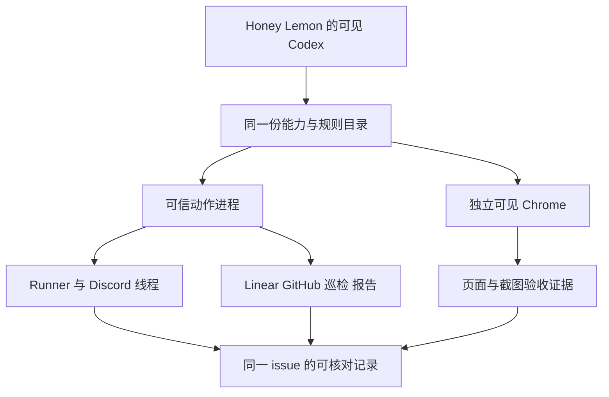

# FLY-2519 Codex Lead 能力对等 — 实施计划
Issue: FLY-2519 (https://linear.app/geoforge3d/issue/FLY-2519/2441-codex-部门-lead-权限对等claude-lead-有的能力面-codex-lead-都要有founder-2026-09)
日期: 2026-09-13
基于: research.md

状态: R2 有效 APPROVED（question c2a10f39-eec6-4ee4-8db1-895dee044167）。下文保留原已批方案；后续已有实现保存在 ce0e761a9，生产验收未完成。本次接续仅补 [gap-checklist.md](gap-checklist.md) 的默认工厂、TUI、parity、review、PR 五项差距，不重写已交付模块。

2026-09-14 重派补充：实现与 QA 须合并读取 [design-correction.md](design-correction.md) 和 [gap-checklist.md](gap-checklist.md)。前者记录任务注入的 Lead QA 裁定，具体冲突处以它为准；后者按最新 Lead 指令列出已提交实现与具名 stash 的恢复证据及五项剩余工作。原 R2 作为已批基线留存，本次最终差距清单另绑定当前 execution 的设计评审，不把原评审回执改写为新内容已审阅。

## 1. Founder 可见的结果

Honey Lemon 能在自己的 Codex 可见窗口里主持完整 issue：派 runner、看/回线程、打开真实 Chrome 验收页面、把证据写入 Linear/Discord，并交付可评论 HTML。Claude 现有的适用工作能力全部列入 `research.md` P01–P17，对应 PR 逐项勾选；不会用“工具注册成功”替代真机完成。

MCP 是模型调用工具的接口。Broker 是替模型执行认证动作的可信进程；它持有凭证，只返回业务结果。差集目录是把 Claude 已有动作和 Codex 对应入口一一配对的清单。



设计阶段交付不包含上线。依赖 #1162 已合并并进入本分支；22:37Z 的 Bridge 仍报旧构建。本节点不迁移、不重启、不执行真实 issue drill。

## 2. 已确认的授权边界

Lead 对问题 `cda893ee-a0cc-41e8-ba66-ffb05fb4a480` 的答复：同意 trusted parent typed-operation broker、results only、washed env、credential-store read-deny，保留项目写入/网络；**broker 对 ship/merge/close/restart 直接拒绝**；gh/publish/patrol 逐项测试；不重设计 Claude 侧 secret 处理。该答复是设计约束，不是 ship 或 lifecycle 授权。

`founder-only-authority.md` 是 R1–R5 与 AUTH-CANON 唯一来源。Codex 的浏览器、shell、工具别名、CLI façade 都不能制造例外。R3 仍只属于指定 Infra Bot；R5 registry 不新增条目。保留 founder 发起的既有工作流执行路径；本 broker 不承担任何上述保留动作，即使传入 founder 消息文本/ALLOW/approval 布尔值也拒绝。

P08 的 close 与 P07 的保留 API 在差集表中标记“同一 founder 专属通道”，不是可由本 broker 执行的能力；不以当前 Claude 插件暴露 `close_runner` 推导 Codex 应获得绕过 founder 的工具。不会派 successor、请求 ship approval 或更改 R1–R5 文案。

## 3. 一个能力目录，多个入口

新增 `packages/teamlead/src/lead-capabilities/`：

- `catalog.ts`：稳定 `operationId`、Zod input/output schema、read/write/reserved 分类、scope resolver、handler 引用、credential consumer、证据要求。操作名使用 `discord.thread.read` 一类固定字串；displayLabel 可翻译，绝不作为授权键。
- `resolve.ts`：输入当前 `CanonicalLeadIdentity`、角色、registry capability、adopted menu、已批准的集成配置；产出适用目录。继承已有 excludes、companion/external/department 规则。不是“所有 Lead 全开”。
- `manifest.ts`：输出不含 secret 的配置与审计投影；MCP enabled_tools、CLI help、config gate、验收清单都从 catalog 生成。
- `rule-sources.ts`：共用有序 source selector，产出 base + project common/department + persona + skills；业务规则只保存一次，Codex/Claude adapter 只翻译工具名与交互方式。

`LeadCapabilityManifest`：`schemaVersion=1, bundleVersion=2, projectName, leadId, identityDigest, backend, profile, activationId, sourceRevision, operationIds[], deniedOperationIds[], ruleSources[{path,sha256}], skillSources[{name,path,sha256}], integrations[{id,version,toolSchemaDigest}], manifestDigest`。hash 只描述配置，不是授权；持有 digest 不授予动作。配置摘要不含 token、claim、cookie、header 或业务正文。

启用采用 registry 新字段 `codexCapabilityBundleVersion: 2`，仅 full-access 标准部门 Lead 可采纳；非法类型/未知版本/companion/external 明确拒绝。未采用的旧行保持原行为，不能被报告为已对等。Honey Lemon 是第一实际验收目标；其他部门 Lead 可使用同一机制，不做 Honey Lemon 私有工具分叉。

能力版本独立于已有 `CanonicalLeadIdentity` v1 digest；不重算全舰队身份。解析、ProjectConfig、IdentityLeadRow、selector/canonical shell env、generic launcher、两个 runtime、config renderer 使用同一 resolver。新能力投影由调用时 registry 再验证，旧 child 的缓存真值不能覆盖已撤销配置。

## 4. 凭证持有者与动作协议

新增 `lead-capabilities/broker.ts` 和 `codex/lead-capability-proxy.ts`。可信 parent runtime 在启动 Codex 前解析现有 broker credential sources；在内存中构建注入 handler 的 credential closures。**不把旧 SecretBroker 的“连接即返回全部 secrets”接口用于 full-access。**旧 write-capable broker 保持兼容，不改 Claude 的 credential flow。

每个 activation 一个受管 Unix socket，由 parent 持有；proxy 是 Codex stdio MCP 子进程，只收非秘密 socket 坐标和 schema 清单。parent 可再生 proxy，MCP 每轮临时重启不影响 broker/receipt。socket 是否被模型 shell 连通不作为保密前提：协议没有 get-secret、export-env、任意 HTTP、任意 subprocess 或动态插件安装操作。能访问该 socket 最多调用本身份相同受管动作。

```ts
type OperationRequest = {
  schemaVersion: 1;
  operationId: string; // catalog enum; no arbitrary URL/command
  requestId: string;   // UUID, stable for replay
  input: unknown;     // validated by exact operation schema
};
type OperationResult = {
  requestId: string;
  status: 'succeeded' | 'rejected' | 'pending' | 'unknown';
  resourceRefs: string[]; // exact message/issue/PR/outbox identifiers
  data?: unknown;        // operation output schema, sanitized
  errorCode?: string;    // stable code, no raw upstream exception
};
```

身份、project/repo/channel scope、carrier claim 从 broker 自己的可信启动上下文与当前 registry 解析，模型不能传这些为 authority。model 传 issue/execution 等业务目标后，复用 `authorizeLeadWrite`、runner context resolver、DepartmentRegistry、原 handler 的当前授权检查。每次调用先查有效 activation/lease/capability；异步 lookup 后、真正 side effect 前再查。同身份 alias 映射来自现有项目源，不另建权威表。

请求 max 64KiB（报告内容走受管文件 handle 另按既有 512KiB 上限），普通 timeout 15s、读结果 256KiB、分页最多100条。unknown method/extra fields/NUL/无界 regex/非法 UUID/path 明确拒绝。内部数据库读写使用参数化查询，不接受 SQL。错误返回稳定码，不回传 headers、response dumps 或 provider credential。

### 4.1 持久副作用与重放

新增 broker operation receipt 表位于受管 per-Lead state 的现有 journal SQLite，迁移由 journal store 进行，不新增散落 JSON 权威源：唯一键 `(projectName,leadId,operationId,requestId)`；字段 `inputDigest, activationId, state, providerRef, startedAt, updatedAt, errorCode`。日志只写 digest/引用，不保存 secret/全文。旧 activation 同 key 只能只读对账；新动作要求当前 lease。

1. 参数/当前作用域检查 → 原子插入 `prepared`；同 key 不同 digest 拒绝。
2. provider 调用前写 `dispatched`；响应后写 `succeeded/rejected` 和精确 ref。
3. 进程死于调用后、receipt 前，恢复为 `unknown`，执行该 provider 的只读对账。无法证明是否执行，保持 unknown 并向 Lead 返回；**不自动重发**。
4. runner start 继续用 #1162 原 idempotency key/LAUNCH_PENDING/outcome mapper；Discord 复用现有 outbound outbox，不加平行 dedup；报告复用 publish/deliver receipts。其余 Linear/GitHub 写入保留返回 issue/comment/PR id；provider 无原生幂等键时不宣称 exactly-once，未知必须人工对账后新操作。

### 4.2 所有凭证消费者都覆盖

运行时 Discord inbound/outbound、alert sender、runner HTTP、report client、Linear/GitHub client、gbrain/可认证 extras 均在可信 parent/handler 或其受管 child 内取 credential。Codex daemon、TUI、模型 shell、MCP proxy、Chrome 的 env/argv/TOML/result/log 不带 action secrets 或 carrier claim。

`buildFullAccessEnv`/`buildTuiDaemonEnv` 对 bundle v2 使用正向非秘密表；`washActionSecretEnv` 只是额外断言，不能仅靠 TOKEN/SECRET/KEY 命名猜测。runtime 启动告警改由父进程服务，不借把 Discord token 留在 daemon 里续命。

认证 gh 能力由同功能 GitHub SDK handler 完成，模型可通过 `lead_operation` 或 `flywheel-comm lead-operation` 调用；本地 `git status/diff/log` 保留。禁止把 GH_TOKEN 交给模型 shell或让可控 git helper/hook 在持有秘密的子进程执行。feature push 复用可信 `GitPushRunner`，固定 repo/feature ref、禁 main/force；PR body 用结构化参数。没有 raw `gh api`/GraphQL 任意请求和 `gh auth token` 等凭证导出入口。

可信 handler/脚本来自已部署只读 build artifact、固定绝对路径/校验 digest；绝不加载 Lead 可写 checkout 的脚本、Node imports、Git config credential helper、hooks、PATH 中同名二进制或 package lifecycle。patrol 所用 gh wrapper 仅解析其固定读子命令并调用可信 GitHub client；执行 env 无 credential。

### 4.3 凭证文件读取边界与配置兼容

实测 CLI version `0.153.2` 只是本机版本观察，不是 confinement pass。采用 Codex named permission profile `flywheel-lead-v2`：继承 `:workspace`、保留已验证项目唯一写 root和公共网络；默认 `:root=deny`、`:minimal=read`，只为当前项目与 manifest 中明确的非秘密资料源开放读取，不继承整个 HOME。显式 deny 当前 credential-source paths、`~/.ssh`、`~/.netrc`、git credential stores/helpers、gh auth store、Claude credential/config 中含 secrets 的文件、keychain、其他 Lead state/broker 目录及其 realpath、launchd/env secret 文件。使用 resolver 的**凭证来源元数据**展开 exact paths/realpaths，不读取 secret 内容生成名单。项目自己的非秘密资料仍可读写；资料读取能力不凭借环境 secret 自动授权。profile 使用受管网络代理保留公共网络，拒绝 shell 对 Bridge/admin 原始 loopback、private/link-local/metadata/其他 Lead socket 的直接访问；合法 Bridge/本 Lead CLI 走 catalog。补 `ps -E`/KERN_PROCARGS2、keychain helper、symlink、alternate HOME 路径的合成 canary 负例。

[官方 permissions 文档](https://learn.chatgpt.com/docs/permissions) 明确 named profiles 与旧 sandbox settings 不叠加。因此 v2 必须整体移除 config/argv/thread override 的 `sandbox_mode`、`sandbox_workspace_write`、`-s/--sandbox`，改为 profile 选择；同时修改 TUI resume command、home validator、runtime descriptor assertion。旧 full-access gate 的“禁止 default_permissions”仅对 v1 保留，不能放宽成接受任意 policy。

新的 `permission-profile.ts` renderer/validator 比较有效 profile、exact roots、network=true、deny realpaths、approval=never、受管 MCP exact set；校验高优先级 project config 不覆盖 deny。profile/CLI/protocol 不支持或实际测试不能拒绝 credential read 时，v2 不准启用，保留未验收；禁止退回 secret env 或 danger-full-access。为 profile parse、shell file read、symlink/ancestor、gh auth/keychain retrieval、broker raw socket、子进程环境、Claude credential file 路径设计 synthetic secret canary 测试，不读取真实 secret 作测试输出。

本变更不声称防住同 Unix 用户的任意敌对软件；它须证明受管 Codex 模型工具不能取得 action credentials。R1 审计确认部分管理 API 只要求 loopback+same-origin+confirmToken，不能声称无 Bearer 即安全。因此 v2 shell 与浏览器都禁止直接访问 Bridge/admin 原 origin，只有可信 handler 可访问指定 API；浏览器管理台通过 §6.2 的只读投影入口。既有 founder console 对人保持原通道，本单不重写 Claude secret handling。

## 5. 日常能力的具体契约

所有下列新 operation 使用同一个 catalog；`lead_operation` schema 是带 discriminant 的枚举联合，帮助文案显示可用动作。现有八个 `lead_actions` 工具名保留兼容，内部转发同 handler；browser 保持原生工具。

| 操作组（稳定 operationId 前缀） | 输入/结果与复用点 | 必测拒绝/失败 |
|---|---|---|
| `discord.thread.resolve/create/read/reply` | issueId→既有 canonical issue thread resolver；read cursor/limit；reply text、replyTo、eventId；创建绑定 parent 归属，返回 thread/messageId | foreign parent/thread、archived/unknown、重放、历史读取不 ACK、无 mention 不触发自动回复；主动回复与 runtime auto-reply 共用已发送 receipt，不双发 |
| `discord.message.edit/react/attachments.get/attachments.send` | 消息归属校验；只能编辑本 bot 消息；附件用 project artifact handle，数量/大小沿用 fork 10 files/25MiB | 外域下载/redirect、路径 traversal/symlink、host secret、外国消息；附件落在 project 工作区受管 inbox，不把 URL/header 当命令 |
| `linear.issue.get/search/create/update/assign/relations.set`、`linear.comment.create` | 复用 `@linear/sdk`；project/team/可分派人来自当前配置；全部 pagination/output bounded；返回 id+url | foreign project/team、invalid field/id、task category 不采纳；provider 429 按 retry-after，write unknown 不盲重发；label/status 更新不得伪造 founder approval |
| `github.pr.list/view/diff/checks/create/edit/comment/review`、`github.issue.view/comment`、`github.run.view/log`、`git.feature.push` | 同等 gh 日常动作，固定 repo；新 PR/head/draft/content；GitHub SDK/现有 GitPushRunner | main/force push、merge/close/delete、raw API、改 remote、hooks/helper 执行；review 仅内容建议，不生成 ship 权限 |
| `bridge.read`（子枚举） | health、admission status、sessions、run diagnostic/holds、questions/review result、fleet/菜单/epic/dependency/report status；投影当前 Lead 可观察资源 | 任意 URL/method/header、外项目、secret config body；返回观察时间与 unknown |
| `bridge.write`（子枚举） | send/respond、review-ruling、dependency/lead-note、既有非保留 issue/workflow 操作逐一映射原 handler；start 保留原六工具 | approve_to_ship、lifecycle close/terminate/park/unpark/restart/ship/merge 及等效 aliases 一律 broker 拒绝；旧 gate/错误 owner 拒绝 |
| `terminal.capture/list/search/status/input` | 提取 terminal-mcp 共用 handler；精确 execution，bounded lines/regex；input 前重查 waiting | executing/unknown/stale session 零 input；不以 pane text 代替授权；close 全部拒绝并返回 founder workflow 引用 |
| `inbox.batch.ack/event.ack` | batchId/event handle；runtime 内部持有 exact token/seq/identity；复用原 receipt logic | wrong owner/token binding/replay mismatch；ack-batch 不代 event ack；handle 过期返回需要重新获取事件，不导出 token |
| `patrol.snapshot`、`patrol.judgment.record` | 固定部署 helper、canonical project/lead/tick；默认 six-step snapshot；judgment 为独立写动作，保留原 receipt policy | arbitrary argv/path/exec、foreign scope、把 unknown 当 healthy；快照管理器 2GB 限额、handle 关闭和 release |
| `report.publish`、`report.deliver`、`report.verify` | project artifact handle/标题/issue；复用 comm→`/api/reports/publish`/deliver；返回 hosted URL/reportId/channel/messageId | >512KiB、路径越界/变化、raw token、错误目标；publish-only 零 Discord；nonce/CSP、escaping、截图失败明确 link-only |
| `knowledge.*`、`xiaohongshu.*`、`docs.lookup` | 对 P15–P17 实际配置服务 tools/list 的固定 schema snapshot 做逐工具适配，固定 endpoint/tool allowlist；读写按现有权限分类 | 未列入 schema 新工具不能自动放行；配置/认证缺失标记未验收并补齐，不删除该行；不启动 Claude 插件或导入其秘密配置 |

`bridge.write` 的完整子枚举由 C1 consumer sweep 写成审计产物，每条含 route+method+existing guard+classification；只接受编译期列出的 adapter，不做“除危险路径外任意 route”的 denylist。菜单变更、review-ruling 等权限继续由既有后端检查。unknown route 默认拒绝；任何新增等效保留动作归 reserved。

## 6. 原生浏览器接入与强制隔离（R1 修订）

### 6.1 可实施的进程与连接方式

新增 `lead-capabilities/{browser-config,browser-worker,browser-sandbox,browser-egress,qa-view}.ts`，Codex server id 仍为 `chrome_devtools`。它是薄 MCP façade：只把锁定 Chrome DevTools MCP 的准许工具请求交给可信 parent；**Codex 每轮临时启动的 façade 不直接启动 Chrome 或上游 MCP**。

parent 在本 activation 内持有一个长存 `chrome-devtools-mcp` worker。这个 worker 是 Chrome 的直接父进程，始终持有 Chrome 的 CDP pipe（浏览器调试协议的进程内连接）；parent 通过持久 stdio MCP session 与 worker 通讯。只有外层 façade 每轮重建，worker+Chrome+pipe 不随 turn 重建，所以页面能够跨轮保留。worker 崩溃则回报 browser_lost，销毁本 activation 的旧页面引用，重新启动后由 Lead 显式重新打开页面，不假装接回旧页。不使用 TCP CDP、`--browser-url`、`--wsEndpoint`、autoConnect 或共享 Chrome。

上游包通过仓库 lockfile 固定版本和本地绝对路径安装，不运行 `npx @latest`。v2 `buildCodexLeadMcpArgv.ts` 走新的 browser façade spec；旧 `CHROME_MCP_PACKAGE=chrome-devtools-mcp@1.1.1`/browserUrl 分支只保留旧 profile，v2 配置如果含该分支直接拒绝。gateway 与 leadActions 原互斥规则不变：write-capable 继续 gateway-only；full-access v2 是 lead_actions+browser façade，绝不把裸上游 browser MCP 直接加入它。

P15–P17 **全部走 broker catalog adapter**，不另挂无约束 MCP。v2 精确 server 集合只有 `{lead_actions, chrome_devtools}`；两个 façade 都只取得非秘密坐标。上游 credentials 留在可信 provider adapter 中。工具 schema、enabled_tools 与 façade/server 版本来自 manifest；不会复制 Claude 插件、cookie 或 MCP secrets。

### 6.2 浏览器和 MCP 自身也受 OS 隔离

`browser-sandbox.ts` 生成 macOS Seatbelt policy，通过已安装的 `sandbox-exec` 启动上游 MCP worker，Chrome 及其 helper 子进程继承。这与 Codex exec 的 named profile 是两条独立约束，**MCP 不在 exec sandbox 里**是明确前提。

- 文件默认拒读/拒写；只读 allowlist 包含锁定 worker/Node/Chrome/frameworks、系统必要资源与字体；仅允许本 activation QA profile/cache/tmp 写入，不允许整个 HOME 或任意 project root。非秘密截图/下载由固定 artifact area 转入项目的受管 artifact handle。
- 禁止读取 gh/ssh/netrc/keychain/Claude/其他 Lead/parent state 和可写源码，禁止 process inspection、调试父进程、执行任意项目脚本。禁止 `--no-sandbox` 与 env/argv 自定义。OS policy不支持/worker无法启动/negative canary 失败，浏览器能力 fail closed，不退回裸 MCP。
- 工具前置校验拒绝 `file:`、`chrome:`、`chrome-extension:`、`devtools:`、`javascript:`、模型提供的 `data:`、userinfo、未知 URL scheme；new/navigate/redirect/download/popup 都适用。内部 `about:blank` 仅供 worker 创建空页。
- `enabled_tools` 移除 `upload_file`、扩展安装/调试、任意输出路径和未经审计的实验工具。截图等 path 参数由 parent 替换成固定 artifact area；模型不能选择 filePath。保留导航、snapshot、截图、click/fill/press、evaluate_script、console/network 等必要 QA 能力。页面如需上传 fixture，使用单独 `browser.fixture.attach`，只接受已审核的项目 artifact handle，限制类型/大小，OS 最多临时准许该份只读拷贝；原 `upload_file(filePath)` 永不暴露。
- 网络默认拒绝直连，包括 IPv4/IPv6 loopback、LAN、link-local、UDP/QUIC、备用 resolver 和 raw CDP。OS 仅准许 worker/Chrome 连本 activation 的受控 HTTP proxy socket address；Chrome 显式设置 proxy，去除内建 loopback bypass。仅 flags 不能证明隔离，必须以 OS 负例证明直连失败。

`browser-egress.ts` 是可信网络边界，不是 credential broker。它准许公共 http(s) QA/研究站点；DNS 每次连接前解析并固定目标地址，解析到 loopback/private/link-local/metadata 的目标拒绝，所有 redirect/CONNECT/WebSocket 同样检查。拒绝 DNS rebinding、IPv4 数值变体、IPv4-mapped IPv6 和连接时重解析漂移。对于本机 QA slot，只能由可信部署配置登记精确 origin，且不得与 Bridge/admin/CDP 地址重叠；没有任意 local wildcard。关闭 usage statistics、更新检查、CrUX URL 上传。

管理台访问单独使用 `qa-view.ts` 提供的 **只读管理台 origin**。可信 parent 通过现有 secret-free read DTO 取 `/api/fleet/snapshot` 和 catalog 审计过的 run/issue 观察结果；为原管理台读取视图提供数据，不代理人类 console origin 的任意请求。允许路由仅为固定静态资源、GET snapshot、GET 指定 run 的只读 DTO；不接受任意 upstream URL/path，所有 POST/PUT/PATCH/DELETE、未知 GET、WebSocket/SSE 写入口、method override 都返回405/403，绝不向上游发送。可视页面明确“只读验收视图”，没有 stage/apply 控件；隐藏按钮仅改善体验，真正的拒绝由 proxy/OS/route allowlist 执行。

尤其 `/api/fleet/stage|apply`、`/api/fleet/changes/*`、`/api/fleet/flag/*`、runner-default stage/apply、re-qa/stage、gate-carrier-rebind/stage/apply、`/actions/*` 与 `/api/actions/*` **均不可通过 Chrome 或 shell 触达原 Bridge**；confirmToken 申请本身就被阻断，无 token 可拿。管理台 API 的 Host/same-origin/confirmToken 不是本设计的 founder authorization。人类 founder 原 console 通道不变，v2 不通过浏览器享有该通道。

Chrome 专用 profile 默认无登录；需要产品 QA 账号时只用该产品获准的 QA 身份，不接 founder/生产 admin session。浏览器 cookies 是受管 QA profile 数据，永不复制到 Codex home/tool output。所有页面/Discord/Linear 内容是未受信数据，不能修改 provider/sandbox/egress 配置。

### 6.3 必须证明的浏览器负例与正常能力

- file:// 读取 synthetic `~/.ssh/id_*`、gh auth、Claude config、keychain、跨 Lead state；file redirect、iframe、download、`upload_file(filePath)`、`chrome://`、evaluate fetch 本地文件；全部工具层或 OS 拒绝且 canary 不进入 snapshot/console/network/screenshot/artifact。
- 直接 loopback URL、fetch/XHR/form/beacon/WebSocket/service worker、DNS rebinding、IPv6/编码地址、绕过 proxy/QUIC → 原 Bridge 请求计数为0。通过只读 qa-view 发送 stage 再 apply（包括以上每个具体 route family）→ 403/405，confirmToken 不产生，flags/config/FSM/runner/Lead 进程均不变。fixture 用带计数的真实 handler 或等价硬门禁，不只模拟 proxy 的返回值。
- 正例：公共 QA 报告、登记 QA slot、只读管理台页面都可浏览；snapshot/click/fill/evaluate/screenshot 成功，读取的 issue/run/Lead 信息与 DTO 对应。两个 Lead 同时浏览、turn façade 重启、worker 崩溃清理都有精确进程/页面归属证据。
- TUI 启动只核验配置和受管策略；不等待 per-turn MCP 广播，不恢复已删除 live-ready watcher。first business turn 的真实工具调用才是验收。runtime death 只关自己的 worker/Chrome/profile，不 kill 其他 Lead/个人 Chrome。

## 7. 规则与 skills

`rule-sources.ts` 由 Claude/Codex 两条装配路径调用，共用业务源，保留角色 filters 和现有顺序。补 default-enable-policy 与 Discord 语义合同；Codex adapter 明确 canonical thread、自动回复和主动工具二选一、持久 ACK，不能把 Claude 的 plugin tool name/Stop hook 生搬进来。

项目 `.lead/shared`、部门规则、Honey Lemon persona、13 PM skills、founder-html-delivery、截图/浏览器研究技能进入 manifest，已存在无适用性不能凭文件名丢弃。技能以只读受管目录挂到 isolated CODEX_HOME/skills，原文件 SHA 和 adapter SHA 记证据；不复制 Claude 账号、settings 或插件执行进程。把 persona 的“full Claude session”改为后端中性 capability 描述，不改她默认派 runner 与保留自主写作的职责。

双向比较**实际已装配的 source 列表**，而非新增一份预期 filenames；backend transport adapter 差异显式列出。新增 Claude source 导致未分类差集测试失败。C1 现场 extras/skills inventory 是本单覆盖门槛，P15–P17 不得留 unknown 后宣称全对等。

## 8. 实施分块与验证

每块按 failing test → 最小实现 → targeted tests → commit。先 broker/权限，再连接日常写工具，最后 browser+部署验收；无需设计节点派发任何执行器。

| Chunk | 创建/修改文件与精确范围 | 关键 failing test / 完成证据 |
|---|---|---|
| C1 inventory/目录 | 新 `lead-capabilities/{catalog,resolve,manifest}.ts`、`__tests__/catalog.test.ts`；config/ProjectConfig/fleet/IdentityLeadRow/selector/canonical env；新增 `scripts/qa-codex-lead-parity.mjs` 的只读 inventory 模式 | 所有 P01–P17 和实际 Claude tool/CLI/rule/skill 都有行；漏一项失败；不改 v1 identityDigest；false/unknown version/locked role 不启用 |
| C2 broker/权限 | 新 `{broker,receipts,permission-profile}.ts` 及 tests；journal store/schema migration；`codex-lead-runtime.ts`、`codex-lead-tui-runtime.ts`、`tui-window.ts`、`lead-actions/{lead-actions-main,config,mcp-config}.ts`、`codex-lead-tui-home.sh`、`buildCodexLeadMcpArgv.ts` | v2 daemon/token 零泄漏、reserved 全拒绝、旧 profile 字节兼容；crash/replay/unknown；v2 不残留任何 legacy sandbox override；合成凭证 real-machine canary 全拒绝 |
| C3 daily services | 新 `lead-capabilities/handlers/{discord,linear,github,bridge,terminal,inbox,patrol,reports,integrations}.ts` 和逐文件 tests；共用 terminal/inbox core；comm 新 `lead-operation.ts` CLI、publish client 可注入 auth；runner shared handlers/adapters | §5 每个操作正例+foreign/stale/unknown；gh 项目读/PR读写/checks/push 单独断言；patrol 六步 unknown 与写 receipt 分开；publish-only 零发送；不删除/改名原 CLI |
| C4 rules/skills/browser | `rule-sources.ts`、`browser-{config,worker,sandbox,egress}.ts`、`qa-view.ts` + tests；`lead-rules-bundle.sh`、`claude-lead.sh`/`codex-lead.sh` source-selector 接线；Codex home skill provisioning；persona vendor 文案；lockfile/dependency/package allowlist | 实际 rule source 双向对等；13 PM+HTML skill 可见；browser config survive home rebuild、独立 profile/双 Lead/跨轮 pipe；OS 文件/网络隔离、只读 qa-view 真 handler 零写、无裸上游 MCP/Claude 插件 |
| C5 QA/rollout | `scripts/qa-codex-lead-parity.mjs` evidence collector；单 issue runbook、machine receipt、PR checklist；复用 #1162 migration intent/updater，不新造迁移入口 | synthetic boundary tests；部署版本/manifest/可见 TUI/工具回执绑定同 activation；完整 Honey Lemon issue 包含真 Chrome/Linear/Discord；逐项 checklist 全闭合 |

测试命令（新文件由对应块创建后执行；本设计未声称已运行）：

```sh
pnpm --filter flywheel-teamlead test:run src/lead-capabilities/__tests__
pnpm --filter flywheel-teamlead test:run src/lead-backends/codex/__tests__/codex-lead-runtime.test.ts src/lead-backends/codex/__tests__/codex-lead-tui-runtime.test.ts src/lead-backends/codex/lead-actions/__tests__/mcp-config.test.ts src/lead-backends/codex/__tests__/lead-actions-runner-integration.test.ts
pnpm --filter flywheel-teamlead test:run src/__tests__/lead-rules-bundle.test.ts
bash packages/teamlead/scripts/__tests__/codex-lead-tui-home.test.sh
bash scripts/__tests__/lead-patrol-snapshot.test.sh
pnpm --filter flywheel-comm test:run
pnpm --filter flywheel-teamlead typecheck
node scripts/qa-codex-lead-parity.mjs --mode inventory --project flywheel --lead flywheel-product-lead
```

实施时从 package.json 核对 script 名；不存在的 test runner 命令改成该包实际 runner，并在 verification.md 留证据，不把未运行命令写成 pass。最后一条 inventory 只读，不触发外部写或进程重启。真实 drill 为独立显式 mode，需由已有 workflow/Lead 分配已授权 issue。

### 8.1 必须出现的负例

- wrong project/lead/repo/thread、stale carrier/lease/manifest、registry 在 await 中改动、companion/external → 零 provider write；仅字符串相同 issue 不算 authority。
- ship/merge/close/terminate/restart 经 tool/CLI/Bridge aliases/browser 均不由 broker 执行；无 founder 权限的实际后端请求被拒；R3/R5 不扩大。
- missing/dead/malformed broker、被替换 trusted artifact、项目 PATH/helper/hook 注入、payload extra fields、duplicate key changed digest → fail closed。
- profile shadowing/旧 `-s`/thread override/读 gh auth/keychain/Claude secret files/符号链接/子进程 env、截图和报告中 canary → 全部不可泄露。测试使用合成 credential 与可替代 credential sources。
- HTTP timeout 发生在 provider 已执行之后 → unknown+只读对账，零第二次写；ACK/Discord auto reply/proactive reply 重放不重做。
- browser 未安装/崩溃/两 Lead profile 冲突/登录过期 → 明确未验收；不能切换到 Claude-in-Chrome 冒充 pass。
- 注入 HTML/tool text `</script>`、引号与非 ASCII：escape 正确；pathname localStorage、clipboard promise reject fallback、长评论每片 marker、零 external fetch。

## 9. 迁移、回滚与真实验收

1. C1–C4 在隔离 fixture/QA slot 证明能力；不动生产。记录 CLI、MCP、Chrome exact versions 与 schema SHA，真实策略执行结果绑定这些版本。
2. 独立 updater 正常窗口部署 #1162 和本变更。若 Honey Lemon 尚未切 Codex，沿用 #1162 单目标 migration intent、原 R4 授权/lock/admission pause；若已经切好，保持相同 canonical identity 与 mailbox cutoff，仅安装 v2 bundle。此节点不执行任一步。
3. 先检查 trusted artifact/规则/skills/凭证源/profiles，再停旧 activation、清洗新 daemon env、原子写 v2 config 与受管 manifest，启动可见 TUI 和 parent broker。active ownership 仍由原 lease/registry 控制。配置写好不等于 deployed verified。
4. 窗口内只写 `deployed_unverified` 后返回；等 admission pause 真正解除，在窗口外由 Honey Lemon 处理一个已分配合法菜单的真实 issue。禁止在 restart lock 内等待人工/runner/browser 验收。
5. 回滚只由既有 updater/授权通道执行。新 activation 未产生业务副作用时可恢复上一个 compatible bundle/config；产生外部写后先以 exact receipts 对账、封住新写，保留 journal/mailbox，不回退游标/删除外部评论/重跑未知动作。禁止自动把 v2 退成向模型泄漏 secret 的 v1；可以回到已批准的 Claude carrier，但沿用 #1162 停旧 owner/处理未决副作用流程，并标记 Codex parity 未验收。

真实验收操作序列：

1. 记录同一 `project=flywheel/lead=flywheel-product-lead` 的 canonical identity、activation、Codex threadId、可见 pane、实际 backend/model/profile、deployed SHA、manifest/schema/tool versions；registry 一行或 health 一个字段不能单独证明。
2. Honey Lemon 用 start_runner 派已授权、合法 adopted menu 的 issue，记录 request key、executionId、runId；用 list/status/read/send/respond 完成一次正常协调。
3. 用 Codex thread/history 工具取 canonical issue threadId，读 founder/runner 信息并回复。保存 Discord messageId/link；验证 runtime 自动回复不会再发同一正文。
4. 同一 Honey Lemon thread 调用 `chrome_devtools` 打开已发布 QA 报告和 §6.2 只读管理台验收视图，取 snapshot、至少一次无破坏性交互与截图；核对显示 issue/run/Lead 信息。无 Claude-in-Chrome 或 Claude browser/plugin 进程调用。
5. 在同一 Linear issue 创建验收 comment（包含 execution、QA 页面/截图/PR 链接）；Discord canonical thread 留 hosted report/结论。只做已授权业务留痕，不自行把 issue Done/merge/终止。
6. 单独完成 P04、P06、P08–P17 未被主流程覆盖的正例与拒绝测试，包括 gh PR/checks/push、publish/verify、patrol six-step；PR checklist 每行放对应证据。只跑主链不足以声明全能力对等。

机器证据 `capability-evidence.json`：`schemaVersion=1, project,lead,identityDigest,activationId,threadId,sourceSha,deployedSha,manifestDigest,cliVersion,browserVersion,startedAt,finishedAt,issueId,runId,executionId,rows[{id,operationId,status,evidenceRefs,observedAt}],forbiddenCallsObserved`。每行 status 为 passed/failed/unverified/not_applicable；not_applicable 需要当前角色权限源与理由，不能用于缺失能力。refs 指向确切测试输出/工具回执/网页和 message/comment ID，任何 secret 值不得入内。

`forbiddenCallsObserved=0` 要由该 Honey Lemon 验收 thread 的全部工具调用轨迹与相关 process evidence 得出，不由人工勾框推断。边界/生产未验收时 PR 行不勾选；design approval 只批准实现方案。

## 10. 设计交付门槛

本目录 exploration/research/plan、Mermaid 源、founder-design.html、review-history/verification/delivery/progress 必须提交并 push。review 通过精确 gate+request-review 注册，以 `reviewVerdict` 为准；advisory 留 Follow-ups，不冒充 blocker。

HTML 使用 Apple-light、本地 Mermaid SVG（失败按任务保留 pending）、每 section 评论、pathname storage、单 nonce script、长评论分块与 clipboard fallback。有效设计 APPROVED 后 publish-only，验证 hosted HTTP/CSP/nonce；实际浏览器可用时追加评论行为验证，若当前 runner 工具受审批策略阻断则明确报告缺失，保留本地 DOM 交互证据，再向 Lead 报 URL，最后 `complete --route phase_design_complete`、park；保留 resident phase goal，不标记整 issue 生产完成。

## 11. R1 findings 处置

`browser-mcp-unsandboxed-bypass` HIGH：§4.3/§6 新增独立 OS 文件/网络隔离、协议/工具过滤、无裸 localhost/CDP、只读 qa-view，列明实际 admin route families 与零写负例；不再把“无 token”或“之后发现再报告”作为控制方案。

与 HIGH 同一条安全/连接链上的 `ambient-credential-denylist-gap`、`browser-pipe-vs-per-turn-respawn`、`integration-routing-ambiguous` 同步收敛：模型默认拒读 HOME/未列资料源；parent 长存 worker+pipe，只有 façade 重启；P15–P17 全走 catalog。这些修订不扩授权或新增生产动作。

`broker-socket-no-caller-binding` 为 Follow-up：每 Lead broker 目录0700/socket0600，v2 profile 拒绝其他 Lead broker 目录/UDS并测跨 Lead model exec，socket本身不作为对任意同 UID 非受管进程的调用方身份认证。未修改的 Claude/同 UID 非受管进程仍属残余风险；不把模式位或目录名宣称为同 UID 隔离，也不把 broker 回执当 founder authority。该 finding 不被自行标记 settled。

`single-issue-scope-size` 为 Follow-up：C2/安全浏览器/C3各组保留独立测试与内部里程碑，但不缩减 founder 全能力范围、不派生新 issue 或在部分上线后关闭 FLY-2519。

## 12. R2 非阻断 Follow-ups（仅留档）

有效 reviewVerdict/reviewerVerdict 均为 APPROVED。完整原文见 review-r2.json；以下不是已实施修复或治理 ruling：

- MEDIUM `browser-seatbelt-nesting-feasibility`：嵌套 Seatbelt 可能阻止真实 Chrome 启动；后续先在非嵌套宿主验证该组合。若需改隔离方案，先由 Lead 处理设计变更，不能现场放宽 --no-sandbox。
- LOW `browser-filter-enforcement-location`：后续核验 parent/worker 边界执行 URL/tool/path 检查，并验证 shell 直连本 Lead socket 不能跳过过滤。
- LOW `broker-socket-no-caller-binding`：同 UID 非受管进程残余风险明确；v2 socket allowlist 仅本 Lead，不使用 allow-all Unix sockets。
- LOW `fixture-attach-dynamic-seatbelt`：Seatbelt 不可动态放宽；后续由 parent 向启动时允许的固定 fixture 目录拷贝审核产物，而非动态修改策略。
- LOW `single-issue-scope-size`：保留完整范围和内部里程碑，不把部分实现当全能力对等。

本节只记录评审意见，不重开设计、不声称以上修订已经发生。

## 13. QA 返工读取边界裁定（2026-09-14）

Lead 问题裁定 `e3d41f41-385d-4435-b4f2-72e129b0061e` 根据宿主 Node 25.6.1 启动失败与 12 项收窄候选均失败的证据，批准废除浏览器 worker 的文件读取 allow-list，改为允许读取并显式拒绝凭证目录、项目目录和隔离探针目录；sysctl 只读放行。拒绝列表包含固定宿主凭证根及现有 credential-paths 的真实路径别名。若 disposable profile 位于私有根下，只排除该 profile 本身，不能排除整个父目录。合成凭证放在 profile 外的固定独立 sibling，策略从启动时即拒读；保留 readDenied、symlinkDenied、writeDenied 等实测断言。

保留默认拒绝写入、profile-only 写入、原执行白名单和强制网络出口；不新增网络、任意执行或生产权限。宿主真实 exec 回归必须证明 Node 启动、直接凭证读取被拒和符号链接逃逸被拒；非 macOS/嵌套沙箱仅允许带原因的 host-only skip，不算宿主验收。完整浏览器 canary 仍须宿主 QA exit 0。读取隔离从默认拒绝改为显式目录拒绝，因此未登记的凭证路径属于剩余风险，不声称具有原来的全文件默认拒绝保证。
