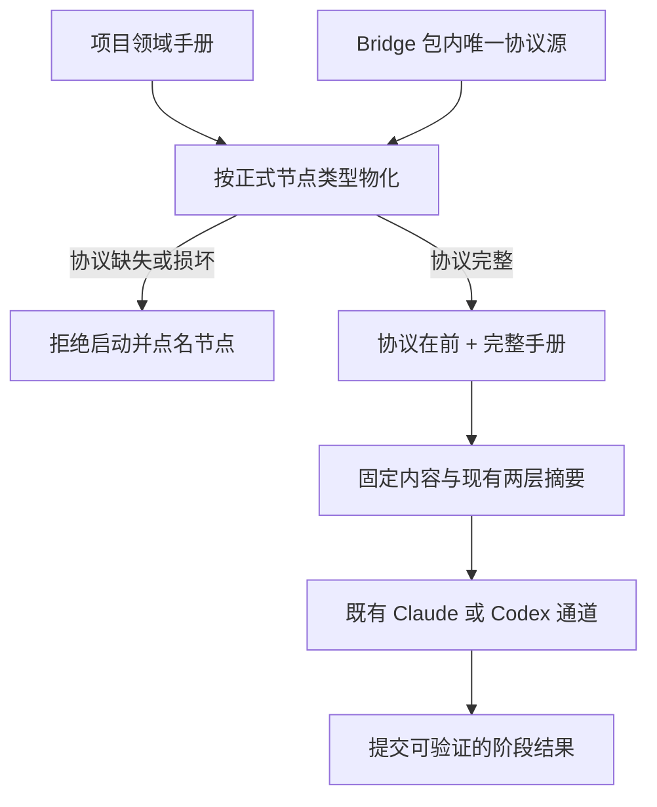

# FLY-2533 快照阶段协议 — 实施计划
Issue: FLY-2533 (https://linear.app/geoforge3d/issue/FLY-2533/病根-非-work-kind-项目起-runner-不带-taskcategory-409-dag-entry-not)
日期: 2026-09-13
基于: research.md

## 1. 创始人概览

让每个项目的执行器在开工前拿到完整的阶段完成规则；缺规则就拒绝启动，同时把分类缺省造成的 409 错误讲清楚。

Bridge 是启动和协调执行器的服务。运行快照（snapshot）是一次运行已经固定的指令与配置；摘要（digest）是用来发现内容变化的校验值。平台协议放在项目领域手册前，两者一起写进快照。后续恢复仍使用当初固定的指令。

状态：待正式设计评审。采用 issue 已裁定 B‴；本文件是设计节点的交付，不代表代码已实现或 QA 已通过。基线 `26ebc4931`。正式审批证据另存 validation.md，批准后不再修改本计划 blob。



| 实施批次 | 可观察结果 | 验证 |
| --- | --- | --- |
| P1 协议源与兼容文件 | 项目手册不再承担平台协议维护；旧文件仍能直接消费 | 生成一致性、完整部署包、缺资产拒绝 |
| P2 快照物化 | 协议完整在前，全部有效内容受摘要保护 | A/C；V2/V3、两个读取分支、旧运行恢复 |
| P3 加载与诊断 | QA/实现同文件被拒；409 提示分类和认证种类 | D/E 与原路由负向回归 |
| P4 通道与隔离验收 | 真实 Claude QA 提交 claim；Flywheel 指令不重复 | B/F；候选与基线配对证据 |

Lead 对问题 `13da1f44-f11f-4f06-b9fc-029d8506b4ca` 已回复确认 type 映射、review 独立协议和 gate/land 豁免，并要求 F 证明等价有效 prompt：相同协议正文只出现一次、领域内容完整保留。该回复是范围解释，正式设计 gate 另行执行。

主要取舍：生成兼容节点文件增加少量开发检查，换取既有直接读文件入口的连续性。新运行以新协议为准，旧运行保持当时快照。协议与完整手册合计超过 40,000 字符时拒绝启动，错误点名节点类型；新快照不截断任一部分。

## 2. 锁定范围

必须交付 issue 裁定 1–7 与 QA A–F。不得缩回仅修 409；不得补默认 `*`；不得在非 Flywheel 项目创建 registry；不改 `.flywheel/config.yaml` schema；不改 Blueprint systemPromptLines，实施方案选择整个 Blueprint 生产文件不改；不加 protocolDigest 或数据库 schema。

新协议只在 **新 V2/V3 snapshot materialization** 进入。schema 1 只保留既有恢复。gate/land 是引擎执行结构节点，无模型进程，不参与注入。现有正式 `review` 类型也需协议，避免 fail-closed 误伤合法模板。新节点类型尚无协议时拒绝新物化。

安全与权限来自固定 capabilities、动态命令和服务器凭据。协议是执行说明，不能授权提交、变更能力、读取别人的凭据或自行合并。所有阶段先服从注入的准确 TURN/执行身份/生命周期；不得硬编码本 issue 的 executionId、Lead、项目名、路径、模型。

## 3. 文件与消费者清单

| 文件 | 变更/验证责任 |
| --- | --- |
| 新 `packages/teamlead/phase-protocols/{design,implement,qa,generic,review}.md` | 唯一人工维护的平台协议，固定内容无项目变量 |
| 新 `packages/teamlead/src/workflow-phase-protocol.ts` | 类型到固定资产路径；读取/校验；精确块去重；最终长度预算；纯文本组合 |
| 新 `scripts/sync-phase-protocols.mjs` | 只在开发中更新既有节点的托管段；默认 `--check`，显式 `--write`；无网络/运行派发 |
| `.flywheel/agents/nodes/{eng_design,implement,qa,general,general.bare,general.matt,pm,product_design,proto}.md` | 抽取平台段为生成投影，保留领域条款、frontmatter、变体工作法与原文件路径 |
| `packages/teamlead/src/workflow-run-snapshot.ts` | 两条 readAgent 分支统一在取内容后、算摘要前组合；只改新 builder |
| `packages/teamlead/src/workflow-menu.ts` | loadLegacyProjectRoster 比较 qa/implement 的已验证文件身份 |
| `packages/teamlead/src/bridge/runs-route.ts` | 指定 409 增加提示和两个回显字段，保留现有决策分支 |
| `packages/teamlead/package.json` | files 包含 phase-protocols；build 前做源/投影 --check，不自动改工作树 |
| `scripts/package-onboard.sh` / `scripts/package-onboard-files.allow` | PO_PACKAGE_ASSETS 加 teamlead:phase-protocols；资产 allowlist 五个固定文件 |
| 新 `packages/teamlead/src/__tests__/workflow-phase-protocol.test.ts` | 资产、精确去重、失败与长度测试 |
| 现有 `workflow-run-snapshot.test.ts` / `workflow-menu.test.ts` / `workflow-menu-registry.test.ts` | 新固定字节和旧快照/角色语义回归 |
| 现有 `workflow-template-selection.test.ts` / `bridge/__tests__/runs-route.dag-entry.test.ts` | 无写入失败、幂等、分类与认证矩阵 |
| 现有 `packages/edge-worker/src/__tests__/Blueprint.generalized-workflow.test.ts`、`Blueprint.fly1356-skill-framework.test.ts` | 最终 prompt 字节、40k、旧变体；不改 Blueprint 生产代码 |
| 现有 `packages/claude-runner/test/{TmuxAdapter,CodexTmuxAdapter}.test.ts` | 实际 prompt-file / 首轮 kick text 字节 |
| 新 `scripts/__tests__/fly2533-phase-protocol-assets.test.sh`；现有 package-onboard smoke/角色协议脚本 | 无源 checkout 的安装包和生成一致性 |
| 新 `scripts/qa-fly-2533-phase-protocol.mjs`（实现节点准备，QA 执行） | slot-only A/B 驱动与证据提取；不得接受生产 URL/路径 |

`engineer.md`、`product_designer.md` 为未显式声明 type 的 legacy 领域入口，本单不据名称为其派生协议；若抽取触及其公共段必须保持既有 raw-file 语义。所有新资产路径都在 Flywheel 自己仓内，不创建目标项目 registry。

## 4. 协议源、内容与兼容生成

### 4.1 正式类型映射

直接消费已有 `WorkflowNodeTypeId` 联合，不再造第二套节点词表。

| type | 源文件 | 角色举例 | 完成规则 |
| --- | --- | --- | --- |
| design | design.md | eng_design | 已批准计划、提交/发布 founder HTML、精确 design completion、按动态 epilogue park |
| implement | implement.md | implement | 已批准计划、TDD、评审、PR、精确 completion；不自行派 QA 或 ship |
| qa | qa.md | qa | 实测、必要 ship HTML 先发布、再 qa-result；保留 credential，按 accepted verdict 后续命令收尾 |
| generic | generic.md | general/pm/product_design/proto | 遵守 pinned 输出/PR/no_code 选择，不默认套用实现或 QA 生命周期 |
| review | review.md | 任意合法 review 节点 | 服从 pinned verdict pair，现有 qa-result 提交 decision，由服务器定 review_verdict/qa_verdict；不发明 review-result CLI |
| gate/land | 无 | founder_gate/land | 引擎结构节点，不创建 runner，也不读取协议 |

qa.md 的 Reporting 和 PASS ship-report ordering 是抽取依据；implement/eng_design Work loop/Boundaries 中的平台项逐条抽取。529 操作、Flywheel pnpm 命令、具体工具技能仍为领域手册。vendor-neutral 段不得要求 Claude 专属 skill 或把 Codex 请求评审替换成裸 stage change。

每份协议必须写明以下共同句义：执行当前动态命令；保持 execution/activation 凭据；TURN 之前不改共享工作树；报告是结构化回执而非口头“完成”；不自行派后继；不越过服务器授权。共同句义分别进入五份角色协议时仅保留所需最短文字，不复制整个 runner contract。

### 4.2 拟定最小协议正文（英文，实施时须逐条保留）

```text
[design]
Follow the injected design mandate, TURN, DOC-FLOW paths and exact command identities. Produce the exploration, research and implementation plan; obtain the effective approved design-review verdict using the injected review request flow. Commit and push the required artifacts. Publish and report the mandatory founder HTML before the exact design completion command. Follow the injected handoff or park epilogue. Do not implement, dispatch successors, request shipping authority or merge.

[implement]
Execute the approved plan under the injected TURN. Use failing test, minimal fix, green verification and refactor for behavior changes. Preserve the approved design and project verification gates. Obtain the effective code-review verdict using the injected request flow, commit/push and open the required PR. Report and complete with the exact injected route and identity. Do not dispatch QA or merge; the controller and ship workflow own advancement.

[qa]
Verify the current reviewed head independently and keep product fixes with its author. When the injected mandate requires a founder ship report, publish it successfully before PASS. Preserve FLYWHEEL_WORKFLOW_SUBMISSION_CREDENTIAL and use the exact injected qa-result command with your evidence and pass/fail verdict; a text report or running session is not a verdict. Record the accepted claim receipt. If receipt and report are a compound action, retry only the unaccepted half without changing the accepted verdict payload. Never strip a consumed credential or manufacture another verdict to retry. After acceptance follow only the injected epilogue; do not add a universal completion/park rule or commit after a gate-entry head is sealed.

[generic]
Follow the injected bounded mandate, TURN, pinned capabilities and output contract. Submit required structured output before its specified completion route. Create a PR only when this execution requires one; use the authorized no-code route only when its conditions hold. Use the exact report/review/completion commands and preserve all execution credentials. Do not infer shipping or QA authority from this general role or dispatch successors.

[review]
Review only the artifact and head identified by the pinned decision contract. Keep your submission credential and use the injected qa-result command to submit pass/fail plus evidence; the server determines the verdict family and accepted claim. Do not invent a review-result command, reuse a consumed credential, mutate the reviewed head, or add a completion/park rule beyond the injected epilogue. Report the accepted decision receipt; prose alone is not an accepted verdict.
```

这些是平台协议的最小句义与正文起点；抽取迁移的条款表是另一项必须验证的完整性证据，不能用缩短正文删除原有必要保障。动态 prompt 已含 qa-result（Blueprint:1911–1937），本单提高优先顺序与可靠可得性，不能宣称原先绝无该指令。是否改善真实执行仍由 QA B 判定。

### 4.3 生成文件而非人工副本

生成器按固定显式文件清单将源正文放入如下唯一托管块；既有节点文件中的领域文本不进入协议源，也不由脚本猜测抽取：

```text
<!-- FLYWHEEL_PHASE_PROTOCOL:qa:BEGIN -->
<exact bytes of qa.md, one normalized trailing LF>
<!-- FLYWHEEL_PHASE_PROTOCOL:qa:END -->
```

首次迁移人工逐条划分平台/领域条款并在 `protocol-extraction.md`（本 issue 实施产物）列出旧条款→唯一源或保留手册的位置。把重复旧协议段移入托管块，保留周围领域内容。后续 `--write` 只能替换已存在的单一配对块，缺块、多块、错类型、嵌套标记直接失败；禁止 regex 按语义搜索并删除。初次布置标记是受代码审查的一次性编辑。

`--check` 从唯一源生成预期块并比较，不自动修复、不访问网络。它同时检查清单中同类文件全部覆盖，及重复平台段迁移表。read-only CI/build 检查失败则拒绝发布。原节点路径和 frontmatter 继续给 legacy reader 使用。general 的 baseline/matt/bare 各自工作法保留；不能互相覆盖。

新 snapshot 的去重只移除与当前类型、当前协议正文精确相等的完整托管块；不允许 marker 存在就跳过注入。遇到任何协议标记但无法完整验证（错类型、旧正文、重复或损坏）拒绝新物化，错误点名节点/type；无标记的外部手册照常前置。项目作者可以写普通文本，不必学会标记格式。该校验不授予任何新权限。

## 5. 新快照组合与失败边界

### 5.1 固定加载路径

`workflow-phase-protocol.ts` 以 `new URL('../phase-protocols/<type>.md', import.meta.url)` 定位资源；白名单来自已有正式 type，每个 executable type 对应同名文件；gate/land 提前返回。路径绝不取自 `canonicalRoot`、body、环境变量或 roster。

读取时检查文件是普通文件、realpath 在固定 protocol 根内、UTF-8 内容非空。每次新快照读取本次所需协议，一次物化内同一 type 使用同一读到的值；不进程永久缓存，因此临时缺文件无法借旧缓存继续新启动。打包部署需代码和资源同一版本、原子切换，禁止现场半写资源。

新内部 API（不暴露 REST/config 选项）：

```ts
loadWorkflowPhaseProtocols(types: readonly WorkflowNodeTypeId[]): ReadonlyMap<WorkflowNodeTypeId, string>
composeWorkflowPhaseAgent(input: {
  nodeId: string; nodeType: WorkflowNodeTypeId;
  protocol: string; source: string;
}): { content: string }
```

同一次 builder 预先加载 needed executable types，再让两个 readAgent 路径使用该 map。加载异常包装为 `WORKFLOW_PHASE_PROTOCOL_UNAVAILABLE node=<id> type=<type> cause=missing|empty|unsafe_path|invalid_block|oversize`；不同 node 共用 type 时至少点名首个受影响 node。不把源码内容、token、任意异常堆栈放进用户 reason。

### 5.2 长度与摘要算法

保持原 agent 路径 realpath 防逃逸校验，读取**完整源**后才去掉精确托管块。不能先 slice 再解析块。取唯一源规范化尾部 LF，加一个固定分隔符 `\n\n---\n\n`，然后校验完整 UTF-16 code unit 长度（Lead 对报告 `d7ec1b82-6f6d-4637-af6f-7ad52735b2cc` 的回复要求总长超限 fail-closed）：

```ts
const prefix = protocol.replace(/\n+$/, "") + "\n\n---\n\n";
const domain = stripExactManagedBlock(source, nodeType, protocol);
if (!domain.trim()) throw agentContentEmpty();
const content = prefix + domain;
if (content.length > 40_000) throw protocolError("oversize");
return { content };
```

示例伪代码中的 stripExactManagedBlock/protocolError/agentContentEmpty 由本模块实现，行为严格按 §4.3 和错误定义，不引入外部 API。前缀和领域正文必须完整；总长超限报 `WORKFLOW_PHASE_PROTOCOL_UNAVAILABLE node=<id> type=<type> cause=oversize` 并包含安全的 total/limit 数值，不输出手册内容。不得警告后截断、改用旧路径或创建会话。不写新 snapshot 字段。

`agent.digest = canonicalSubmissionDigest(content)`；现有 builder 再算 snapshot_digest；manifest_digest 不变。最终 content.length <=40,000，因此现有 Blueprint 二次 slice 不再改变新 snapshot 的有效字节。不要修改 parser、workflowNodeAgentContent、replay、recovery 或 engine retry 来读取 live 协议。

### 5.3 副作用屏障

让上述异常从 StateStore 事务开始前冒泡，route 保持 `GENERALIZED_WORKFLOW_REJECTED` 409，reason 包含稳定内部错误码及 node/type。不得 catch 后创建 legacy runner，不得延后到 dispatch 后只打印日志。

必须断言失败前后：active run、start reservation、dispatch effect、session/running row、dispatch calls 均无新增；有旧 shadow 时其 supersession 状态不变。不允许生产 SQLite 手工修复。重试同一个失败的幂等 key 在文件恢复后可正常物化；已成功的 key 只重放旧内容。

## 6. roster 文件身份

在 `loadLegacyProjectRoster` 中保留所有现有验证。收集 qa/implement 已验证的 `{configuredPath, canonicalPath, dev, ino}`；两角色都存在时，相同 realpath 或相同 dev+ino 均拒绝，以覆盖 `./`、符号链接和硬链接。错误：

```text
IC_ROSTER_QA_IMPLEMENT_SAME_FILE: ic-roster.qa (<qa path>) and ic-roster.implement (<implement path>) must resolve to different files
```

不要求每个 roster 都有这两个角色。不同文件允许，即使正文相同；本单提供文件身份隔离，不宣称能证明模型或人的独立性。不得根据 role 文本、文件 basename 或相似内容推断身份。加载报错向既有调用链传播；不自动改 roster 或 registry。

## 7. 409 响应合同

仅修改原 `freshMain && !freshNoWorkflowPhaseLegacy && !generalizedSelection` 分支。保留 409、code、success:false、silent:false，追加字段名准确为 `taskCategory`、`authKind`。

```ts
const categoryHint = `pass taskCategory (${WORK_KIND_CATEGORIES.join("|")}) or bind category "*"`;
res.status(409).json({
  success: false,
  code: "DAG_ENTRY_NOT_MATERIALIZED",
  reason: "fresh main-role code dispatch did not resolve a schema-v2 workflow binding; refusing a legacy runner with no QA evidence path; " + categoryHint +
    (requestAuthKind === "master" ? "" : "; fresh DAG entry requires master authentication"),
  taskCategory: typeof req.body.taskCategory === "string" ? req.body.taskCategory : null,
  authKind: requestAuthKind,
  silent: false,
});
```

分类列表复用当前 SSOT `WORK_KIND_CATEGORIES`，测试确认当前字符串为 `code|simple_code|prd|product_design_flow|prototype|generic`，不再维护第二个六项数组。仅回显已限制为 string 的原值（含空串/空格），无值或非 string 为 JSON null；不把无值伪造为收到 `*`，不回显任意对象、auth header 或 body.authKind。reason 不插入用户字符串；JSON 序列化现有机制保留。如 UI 展示回显，必须 textContent 或 HTML escape。

本单不增加 category 校验或改路由；work-kind 输入错误、认证拒绝、DAG 关闭、recovery、显式 no-three-stage 仍由原分支处理。scoped 即使带合法分类也不获得 master 权限。`reconcileDefaultDagCategoryBindings` 的无 `*` 断言继续通过。

## 8. TDD 实施顺序与可执行检查

每个批次：先加下列可观察断言并运行确认失败，再最小实现、运行变绿、重构、提交并推进 implement progress。没有 runtime 依赖的文档/生成物检查不写镜像测试。

### P1：唯一源与安装包

1. 新协议 loader/generator 测试：五类型非空，结构节点不读文件；自定义 cwd/目标项目伪造 protocols 不影响加载；缺、空、路径逃逸、标记损坏、过长拒绝。
2. 添加源、精确生成块、初次迁移条款表与生成器；保持 legacy 原文件包含所有必需规则。generic 三变体分开验证。
3. 修改 package files/PO_PACKAGE_ASSETS/allowlist。运行实际 po_assemble 或 pack 解包 fixture，在没有源仓路径的临时目录从 dist 调 loader；断言五个文件可读且与源字节相同。删一个解包协议文件必须失败，不能回退源码目录。
4. `node scripts/sync-phase-protocols.mjs --check` 必须通过；故意改变一份投影块内容后 check 必须非零且点名文件，再恢复测试 fixture。

### P2：新快照与旧恢复

使用现有 fixture()、handbookFixture() 与小型临时 project root。参数化 schema 2/3 和显式 agent_file/role 两分支。

| 场景 | 必须断言 |
| --- | --- |
| 同一 manifest、纯领域内容 vs 组合内容 | manifest_digest 同；agent.digest 和 snapshot_digest 不同；固定 content 以完整协议开头 |
| 改协议一字符、改领域一字符 | 两者各自使 agent/snapshot 摘要变化 |
| 40k-1/40k/40k+1 总长、中文/emoji 长度边界 | <=40k 完整接受，>40k 拒绝且 node/type/total/limit 正确；无截断，领域全文精确相等 |
| 托管生成块 | canonical 协议恰一次；领域其余文本与源一致；相同源重复物化得到完全相同内容 |
| 无协议资产 | 新 build 抛 node/type；StateStore/route 零新增副作用 |
| 任意 node id 搭配合法 type | 根据 type 注入；不依 id/name |
| 原 V1/V2/V3 无协议 snapshot | parser 接受原摘要；删除/修改 live 协议后 replay/recovery 内容摘要完全不变 |
| artifact generic / auxiliary generic / review / land graph | 不新加 PR/QA 权限；固定输出和 verdict 能力保持原值 |

具体命令：

```sh
pnpm --filter flywheel-teamlead exec vitest run src/__tests__/workflow-phase-protocol.test.ts src/__tests__/workflow-run-snapshot.test.ts src/__tests__/workflow-template-selection.test.ts src/__tests__/workflow-menu.test.ts src/__tests__/workflow-menu-registry.test.ts
```

### P3：roster 与入口诊断

参数化 roster 同一路径、`./`、in-root symlink、hardlink 均拒绝；不同真实文件、只有 general、仅 implement/qa 一项均保留原合法性；绝对/越界/不存在继续原拒绝。

用 runs-route.dag-entry 的 startHarness/post 构造非 work-kind 项目（显式保持 work-kind OFF，不能靠全局 flag 恰好关闭）、无 `*` binding：省略、空白、非 string、明确分类但无对应绑定返回诊断；master + 明确绑定成功；scoped + 合法分类仍拒绝且 authKind=scoped；tokenless 保留其原认证拒绝。body.authKind=master 不改变真实 scoped 回显。还测显式管理员建立 `*` 的既有成功路径，不让种子自动建立。

```sh
pnpm --filter flywheel-teamlead exec vitest run src/bridge/__tests__/runs-route.dag-entry.test.ts src/bridge/__tests__/pipeline-config-source.test.ts
```

期待所有失败路径 h.calls.length=0，并检查 fixture 中 run/reservation/session/effects 计数；有 shadow 的失败不能 supersede。不要只断言 reason 包含词语就宣称 C 已通过。

### P4：双 vendor 字节与 F

从基线 git blob 和候选角色源在同一个测试 harness、相同 manifest/identity/issue/配置下分别生成完整 appendSystemPrompt。保存每节点/vendor 的 before/after UTF-8 字节和 UTF-16 长度；两种增长率均 <=10%。同时要求 canonical protocol 正文出现一次、领域要求迁移表逐条可见，不得通过删保障或加无关 padding 达标。

覆盖 Flywheel 所有采用角色 eng_design/implement/qa/general/pm/product_design/proto，及 legacy general baseline/matt/bare。Blueprint generalized fixture 检验它接到的文本等于 snapshot.content；Claude adapter 真正写到 prompt file 的文本包含该片段，Codex adapter 首轮 kick text 包含同一片段。AGENTS.md 固定合同继续独立，不把动态协议迁入其中。

```sh
pnpm --filter flywheel-edge-worker exec vitest run src/__tests__/Blueprint.generalized-workflow.test.ts src/__tests__/Blueprint.fly1356-skill-framework.test.ts
pnpm --filter flywheel-claude-runner exec vitest run test/TmuxAdapter.test.ts test/CodexTmuxAdapter.test.ts
bash scripts/__tests__/fly2533-phase-protocol-assets.test.sh
bash scripts/__tests__/test-qa-executor-529-nton-contract.sh
```

测试若发现严格同输入预算或旧语义不成立，修正抽取/兼容生成，不提高 10% 上限、不修改 Blueprint 注入架构绕过裁定。

## 9. QA A–F 证据矩阵与 529 执行合同

| 判据 | 必交证据 | 不足以证明 |
| --- | --- | --- |
| A | 两个相同 manifest 的 content/digest 差异；前置 offset=0，V2/V3 两分支 | 仅检查文件里出现关键词 |
| B | 真 Claude QA、非 registry 领域 roster 的 paired 529 运行，精确 accepted qa_verdict claim | stub 模拟 claim、running、终端说 PASS |
| C | 缺文件/空协议/错类型拒绝，错误点名类型；无新增 running/session/effect/run/reservation | 已启动后告警 |
| D | qa/implement 相同真实文件加载报错及不同文件正控 | 仅比较配置字符串 |
| E | 原 409 的精确 hint、taskCategory/authKind 字段和认证负控 | 自动补默认绑定让错误消失 |
| F | 全部角色/两个 vendor 的完整 prompt 大小比、协议一次及语义迁移表 | 只测源文件尺寸 |

B/C 的 529 操作由持有 QA TURN 的后续节点执行，本设计阶段禁止启动或派活。驱动从 `test-deploy.sh` deploy JSON 取得 slot Bridge、hostRepo、dbPath、buildSha、leadCarrier/label/socket；验证 slot 所有可变 state、凭据、频道都隔离。脚本拒绝非 loopback+slot port、生产 repo 路径、生产 project/Lead/频道，并保留 delivery secret slot 路径。先通过 launchd PID + manifest PID + private tmux main + inbox lease 现有 topology 检查。

不得直接沿用 `--generalized` 创建 registry 的 fixture。在 slot project 使用非 flywheel 项目名，删除**测试 fixture 自己创建**的 registry 或从不创建；写现有 config 结构、adoption(simple_code)、roster，qa/implement 指向两个不含平台协议的纯领域文件；确认文件摘要/内容记录且 qa 不指向 implement。使用 slot 数据创建明确 simple_code binding 与固定模板 override，QA vendor=claude 并钉住完整模型/effort；保存有效 snapshot.dispatch，不能由最终角色名反推 vendor。不使用 `--stub-runner`。

对照两次使用相同任务文本、领域文件、模板、模型/effort、初始测试 repo；基线来自 `26ebc4931` 的独立 slot 代码，候选来自 PR head，各自独立 run/idempotency key/activation，避免复用旧快照。让真实 implement 完成一件确定的小型假活并进入 QA，允许 QA 依指定场景 FAIL 或 PASS，但 accepted claim.family 必须 qa_verdict 且 target 对准 QA 当前 activation；最终候选验收还要所要求的 PASS 场景。测试不能自己替 QA 调 qa-result 来制造成功。

先固定每臂 QA 激活后的观察窗口 10 分钟（每 30 秒读取隔离状态）；保存 baseline 是否 running/是否已有 claim 的实际结果。没有 claim 仅表述“该窗口内无 claim”。若基线也成功，不能编写“注入前卡住”的虚假结论；报告未复现原行为并交 Lead 决定额外场景，B 对照保持未证实。候选未提 claim 则 B FAIL，不得用 API 手工注入补证据。

证据包含 base/candidate SHA、slot buildSha、协议/领域内容、snapshot_digest、runId/nodeId/attempt/activationId/executionId、QA vendor/model/effort、claimId/serverSeq、family、status、target/subject HEAD、accepted decision 和工作流结果；全部来自 slot 权威数据或受支持读 API，不根据日志文字猜测。若需要复制 live slot DB，同样走 snapshot-control，不 cp 活库。凭据只记录 presence/class，不落盘明文。

C 在候选 slot 的 **Bridge 包协议目录** 移走 qa 协议文件（不动生产、不仅删项目手册），用新 key 新运行发起，验证响亮拒绝及零新运行副作用，再恢复文件。已有成功 snapshot replay 在资源缺失时仍使用原固定内容。测试完成收集证据后使用 test-teardown，关闭所有 DB 句柄。

## 10. 合并、部署、回滚与剩余风险

实现阶段必跑 `pnpm lint`、`pnpm -r build`、`pnpm test:packages:run` 和所有新增 shell 测试；macOS 不跑可能触发本机 tmux viewer 的根 `pnpm test`。范围测试只证明对应契约，真实 B/F 证据必须另外记录。

代码、五协议资产和生成节点投影同一 PR/部署包；构建 --check 阻止半更新。由独立 updater 正常窗口部署；merge 不等于上线。设计/实现/QA 都不得自行重启生产服务。

回滚整个发布包（代码+协议+投影），新启动回到旧行为；旧 snapshot 不变，不重新算 digest、不补字段、不热重注入。已经固定新协议的运行恢复继续使用其快照；旧解析器结构无需新字段，应由回滚版本读新结构的兼容测试证明。无法靠回滚文件修复既有旧快照缺协议的问题，需独立授权新运行，不能现场改 DB。

不保证 LLM 必定服从协议；平台 claim/权限校验仍是执行真值。文件不同也不保证知识来源独立。旧运行没有本次注入，超长新手册将拒绝启动，调用方需精简内容后重试。B 需要真实受控复现；本单不能把静态测试等同生产验证。

## 11. 设计阶段交接与审核清单

本 design node 提交 exploration.md、research.md、plan.md、progress.md、flow.mmd、model.mmd、design.html、validation.md；本地 mmdc 成功则保存并内嵌 SVG，失败按任务重试一次后明确 DIAGRAM PENDING LOCAL RENDER，保留源并报告。

正式流程：stage design_review --plan → gate review_design（必带消息且 --no-block）→ request-review（同 questionId 和 plan 路径）→ check 有效 reviewVerdict。CHANGES 修 named blocker 并新 gate；APPROVED 的 advisories 作为 follow-up 报 Lead，不重新打开已批准设计。

APPROVED 后确保全部产物 commit/push、ledger 完整；publish-report --publish-only，验证 hosted HTTP 200/CSP nonce/评论功能，向实际 Lead 报 DESIGN-HTML ready。最后 complete --route phase_design_complete，按服务器指示 park。设计完成只交接阶段，resident goal 保持到 issue-terminal，由 orchestrator 派后继。
