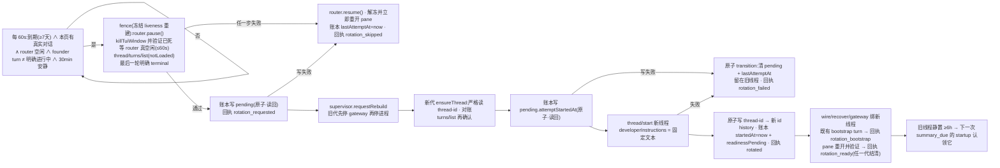

# FLY-2550 常驻 Lead 线程轮换 — 实施计划
Issue: FLY-2550 (https://linear.app/geoforge3d/issue/FLY-2550/2355e-常驻-lead-记忆蒸馏真拦点-codex-threadsid-current-thread-id-排除常驻-lead-永不换)
日期: 2026-09-14
基于: research.md

**版本**: v4(R3 后:unknown 只挡 pending 不挡 preflight;fence 期间冻结 liveness 重建;attempt 标记失败也落 backoff;readinessPending 跨代结清;E4 按耐久 cut 分段;E7 七类结果;`thread/turns/list` 延迟前置验证;C3 补 SQLite store)· **状态**: codex-approved(R4 APPROVED,4 轮;Lead 裁定 `3e8fcad4`;5 条非阻塞 follow-ups 见 `follow-ups.md`)· **实施已放行(Lead question `98fab9f8-af97-4f9b-b1e2-a4e8ad20d6d8`,2026-09-15)**

## 1. 给 founder 的说明

### 1.1 一句话

Codex 只会在「一段对话结束、放凉 6 小时之后」把它整理成记忆;而 Mufasa 从 6 月 9 日起一直在同一段对话里,永远没有「结束」。本计划让 Mufasa **每 7 天换一页**:在没人说话的时候,开一段全新对话;旧的那页原地留着,6 小时后 Codex 自己来整理它。**新的一页不带任何旧对话原文**——两轮评审都指出,把旧对话(不管是模型写的便签还是原文摘录)塞进新页的高权限说明里,都是让无人确认的自动回合去执行历史内容;所以连续性只靠 Codex 整理出来的记忆摘要,以及换页期间到达的消息在新页上照常回答。founder 在 Discord 里感觉不到换页,只是每周会看到终端里的 Mufasa 窗口重开一次。

### 1.2 承诺的精确边界

| 保证 | 条件 | 证据 |
|---|---|---|
| 到期、本页确有真实对话、且经可证明的 fence 确认空闲后,Lead 换到一条全新线程;旧线程原地不动(不归档、不改 memory_mode、不 resume、**从 fence 建立起零 turn**) | 轮换开关未关;fence 全部通过;`thread/start` 与 `thread-id` 写入成功 | `thread-rotation.jsonl` 一行 `rotated`;`thread-id` = 新 id;`thread-id.history` 追加一行;旧 rollout 行数/末行时间在 `rotated.at` 后不变(§7 E1) |
| 旧线程在下一次 memory startup 时满足全部候选条件(research §1) | 旧线程距最后一轮 ≥6h,且该次 startup 没被额度闸拦 | §7 E2 逐谓词 SQL |
| 新线程的 `developerInstructions` 是**代码内置的固定文本**(只嵌入 ISO 时间与上一页线程 id,均经校验),不含任何对话内容 | — | 单元测试逐字断言;回执 `developerNoteChars` |
| 轮换失败不丢对话:fence 任一步失败就解除 fence 留在旧线程;`thread/start` 或 `thread-id` 写失败也留在旧线程;**任何失败/跳过都落耐久 `lastAttemptAt`**,6h 内不重试 | — | 回执 `rotation_skipped:*` / `rotation_failed:*`,`thread-id` 未变,账本 `lastAttemptAt` |
| 每个 pending 至多产生一次 `thread/start`(不因重启而重复);代价是「attempt 标记已落盘但结果未知」的崩溃段(§3.4 W2)会**放弃**这次换页而不是重放 | — | 账本 `pending.attemptStartedAt` 先于 `thread/start`;测试连续三次重启只有一次 `thread/start` |
| 换页的「就绪」由任一后继代结清:`rotation_ready`(gateway 就绪 ∧ pane 验证存活)或 `rotation_degraded`,不因中途重启而永久缺失 | 账本 `readinessPending` 未被清 | 回执 `rotation_ready` / `rotation_degraded`;W5 测试 |

**不是本计划的保证**:Codex 一定会在某个时刻产出 `rollout_summaries/`(额度闸、phase2 6h 冷却、模型侧失败都在 Codex 手里);founder 一周内一定「感觉到」Mufasa 记得更多(读路径只在新上下文窗口注入,且 `memory_summary.md` 截 2500 token);新页记得上一页的细节(它只有记忆摘要)。回执与 history 是尽力写入(§3.5 P5/P8);账本才是权威。

### 1.3 核心流程



## 2. 稳定身份与显示标签

| 名称 | 定义 |
|---|---|
| 模块 | `packages/teamlead/src/lead-backends/codex/codex-lead-thread-rotation.ts`(纯函数 + 注入 fs/clock) |
| 线程 id 形状 | `THREAD_ID_RE = /^[0-9a-f]{8}-[0-9a-f]{4}-[0-9a-f]{4}-[0-9a-f]{4}-[0-9a-f]{12}$/`;`tui-window.ts` 的 `SAFE_ID` 仍是 tmux 命令行字符集守卫,两者都要过 |
| 开关 | env `FLYWHEEL_CODEX_LEAD_THREAD_ROTATION`:精确 `off` ⇒ 关;缺省 ⇒ 开;其它值 ⇒ warn 一次并按开。字段 `threadRotationEnabled`。**唯一新增 env**。`off` ⇒ 不起定时器、不消费 pending、不结清 readiness、零账本写、零回执 |
| 常量(写死) | `ROTATION_PERIOD_MS = 7×86 400 000`;`ROTATION_QUIET_MS = 1 800 000`;`ROTATION_RETRY_BACKOFF_MS = 21 600 000`;`ROTATION_CHECK_INTERVAL_MS = 60 000`;`PENDING_TTL_MS = 3 600 000`;`FENCE_IDLE_WAIT_MS = 60 000`;`TURNS_LIST_TIMEOUT_MS = 10 000`;`LEDGER_MAX_BYTES = 65 536`;`THREAD_ID_FILE_MAX_BYTES = 256`;`CLOCK_SKEW_MS = 300 000`;`ROTATION_READY_TIMEOUT_MS = 120 000` |
| 固定 developer 文本 `rotationDeveloperNote(at, previousThreadId)` | `"[系统换页 · <ISO>] 这是一段新的对话页;上一页线程 <previousThreadId> 已按周期封存,不会再有新内容。你的长期记忆摘要由系统另行注入;不要假设上一页的任何未完成事项仍然有效,founder 会在需要时重新告诉你。"`(只嵌入经 `THREAD_ID_RE` 校验的 id 与 `toISOString()` 输出;`developerNoteChars` = 其长度) |
| 账本 | `<stateDir>/thread-rotation.json`,0600,原子写(同目录临时名 `O_EXCL` + `rename`)+ 写后读回校验;形状见 §3.1 |
| 回执 | `<stateDir>/thread-rotation.jsonl`,append-only,一行一事件(§4) |
| 线程真相 | `<stateDir>/thread-id`;TUI 路径 `readThreadIdStrict`(§3.1);`writeThreadId` 原子写(headless 共用,行为不变) |
| 线程历史 | `<stateDir>/thread-id.history`,append `"<ISO> <from> -> <to> reason=<reason>"` |
| 日志前缀 | `[codex-lead-thread-rotation]` |
| 代内状态(内存) | `attemptInFlight`(fence 进行中)· `rotationFenceHeld`(fence 建立到交给 supervisor 或解除为止;为 true 时 liveness tick **只 probe 不 create**)· `founderTurnActive ∈ unknown · true · false`(代初 unknown)· `lastActivityAt` · `rotationDisabledThisGeneration: string | null` |
| supervisor 新方法 | `DaemonConnectionSupervisor.requestRebuild(reason): boolean` |
| router 新方法 | `LeadInputRouter.isIdle(): boolean`;`pause()` / `resume()`(暂停时 `submit/submitBatch` 照常 durable `accepted` 并入队,`pump` 不出队;`resume` 后立即 `pump`) |
| journal 新方法 | `countCompletedSince(sinceMs): number` — `JournalStore` 接口(`LeadJournal.ts`)+ 内存实现 + `SqliteJournalStore.ts`(`SELECT count(*) FROM journal WHERE state='completed' AND created_at > ?`;新增索引 `journal_state_created_idx ON journal(state, created_at)`);`LeadJournal` facade 透传 |
| `turns/list` 用法 | `CodexLeadProcess.request("thread/turns/list", {threadId, limit: 1, sortDirection: "desc", itemsView: "notLoaded"})`,经**局部** bounded wrapper(`TURNS_LIST_TIMEOUT_MS`;超时后底层 promise 的迟到结果被吞掉,不改 `CodexLeadProcess` 的全局 60s);判定:返回数组**空** ⇒ busy;最后一轮 `status ∈ {completed, interrupted, failed}` ⇒ terminal(通过);`inProgress`、其它值、错、超时、形状不符 ⇒ busy。**前置证据 C0**:在 Mufasa 7.1 MB rollout 的只读拷贝家上连续两次测 `turns/list(notLoaded)` 延迟,均 <10s 才允许实施 C7 |
| `killTuiWindow` | 改为返回 `boolean`:`exec(...).ok` 且随后 `isTuiWindowAlive() === false` 才 true |
| `ensureTuiHealthy` | 改为返回 `boolean`(pane 已验证存活);`rotationFenceHeld` 为 true 时不 create,只返回 probe 结果 |
| demux 新回调 | `wireDemuxedProcess({ onFounderTurnStarted?: (turnId) => void })` |
| 事件词表 | `reconciled{reason}` · `rotation_requested` · `rotation_skipped{reason}` · `rotated` · `rotation_bootstrap` · `rotation_ready` · `rotation_degraded` · `rotation_failed{reason}`;`reconciled.reason ∈ pristine · ledger_missing · ledger_unreadable · thread_id_ahead_of_ledger · pending_stale · pending_expired · pending_attempted · pending_busy · thread_changed_turnless`;`rotation_skipped.reason ∈ founder_turn_active · router_busy · pane_kill_unverified · turns_list_busy · pending_write_failed · rebuild_refused`;`rotation_failed.reason ∈ attempt_mark_failed · thread_start_failed · thread_id_invalid · thread_id_write_failed`;`lastAttemptOutcome` 只能取 `rotation_failed:<reason>`、`rotation_skipped:<reason>`、`rotated`、`reconciled:pending_attempted`、`reconciled:pending_busy` 之一;`bootstrapOutcome ∈ completed · timeout · dispatch_failed · skipped_rollout_exists` |

## 3. 行为规则

### 3.1 线程真相、账本、对账

**`readThreadIdStrict(path)` 分类**(TUI 路径;headless 的 `readThreadId` 不动):`missing`(ENOENT)· `unreadable` · `symlink_or_irregular`(`lstat` 非普通文件)· `oversize`(> `THREAD_ID_FILE_MAX_BYTES`)· `empty` · `unsafe`(不匹配 `THREAD_ID_RE`)· `ok{id}`。**只有 `missing` 走 pristine**;其余五类 ⇒ `ensureThread` 抛错(fail-loud,日志含路径与分类,不起新线程,不写任何东西)。**失败层**:首次 bring-up 失败由 `DaemonConnectionSupervisor.start()` 抛给 launchd(launchd KeepAlive 重拉,可见);已成功启动后的重建失败才走 supervisor backoff。两者都是人工恢复态。

**账本形状**(8 键):

```json
{ "v": 1, "currentThreadId": "<uuid>", "startedAt": "<ISO>",
  "previousThreadId": "<uuid>|null",
  "lastAttemptAt": "<ISO>|null", "lastAttemptOutcome": "<enum>|null",
  "pending": { "requestedAt": "<ISO>", "fromThreadId": "<uuid>", "reason": "period", "attemptStartedAt": "<ISO>|null" } | null,
  "readinessPending": { "to": "<uuid>", "requestedAt": "<ISO>", "degradedAt": "<ISO>|null" } | null }
```

**读取校验(任一不过 ⇒ `ledger_unreadable`)**:`open(O_NOFOLLOW)` → `fstat` 普通文件、`size ≤ LEDGER_MAX_BYTES` → JSON 顶层对象、键集合恰为 8 键(未知键拒绝)→ `v === 1` → `currentThreadId` 匹配 `THREAD_ID_RE` → **所有时间字段**(`startedAt`、`lastAttemptAt`、`pending.requestedAt`、`pending.attemptStartedAt`、`readinessPending.requestedAt`、`readinessPending.degradedAt`)为 canonical ISO(`new Date(s).toISOString() === s`)、finite、且 `≤ now + CLOCK_SKEW_MS` → `previousThreadId` null 或 `THREAD_ID_RE` → `lastAttemptOutcome` null 或 §2 词表 → `pending` null 或恰含四键、`fromThreadId` 匹配、`reason === "period"` → `readinessPending` null 或恰含三键、`to` 匹配。

**对账(每代 `ensureThread` 入口;`saved = readThreadIdStrict()`)**:

| 情形 | 动作 | 回执 |
|---|---|---|
| `missing` | 既有路径 `startThread` → `writeThreadId`;账本 `{current: new, startedAt: now, previous: null, pending: null, readinessPending: null}` | `reconciled:pristine` |
| 账本缺失/不可读,`saved` ok | `current = saved`,`startedAt` = rollout 文件名时间戳(`rolloutTimestampFor`:`sessions/**` 下 basename **精确**匹配 `^rollout-(\d{4}-\d{2}-\d{2}T\d{2}-\d{2}-\d{2})-<saved>\.jsonl$`,恰一个才采用;否则 `now`),其余 null | `reconciled:ledger_missing` / `ledger_unreadable` |
| `currentThreadId !== saved` | `previous = current`,`current = saved`,`startedAt = now`,`pending = null`;`readinessPending` 若其 `to === saved` 则保留(W3 后继续结清),否则清 | `reconciled:thread_id_ahead_of_ledger` |
| `pending.fromThreadId !== saved` | 清 `pending` | `reconciled:pending_stale` |
| `pending.attemptStartedAt !== null` | 清 `pending`;`lastAttemptAt = attemptStartedAt`,`lastAttemptOutcome = "reconciled:pending_attempted"`(该 pending 的唯一一次 `thread/start` 机会已用掉;进入 6h backoff) | `reconciled:pending_attempted` |
| `now − pending.requestedAt > PENDING_TTL_MS` | 清 `pending` | `reconciled:pending_expired` |
| 非 pending 路径下既有 turnless 自愈换了线程 | `previous = saved`,`current = new`,`startedAt = now`,`pending = null`;history `reason=turnless` | `reconciled:thread_changed_turnless` |

对账需要写账本而写失败 ⇒ 内存账本继续启动,`rotationDisabledThisGeneration = "ledger_write_failed"`(本代不触发、不消费 pending、不结清 readiness),warn。

### 3.2 到期判定与 fence(旧代内,定时器 60s,`unref`,`stop()` 清除)

**到期条件**(全部为真才进入 fence):`threadRotationEnabled` ∧ 未 `stopped` ∧ `rotationDisabledThisGeneration === null` ∧ `!attemptInFlight` ∧ `ledger.pending === null` ∧ `now − startedAt ≥ ROTATION_PERIOD_MS` ∧ (`lastAttemptAt === null` ∨ `now − lastAttemptAt ≥ ROTATION_RETRY_BACKOFF_MS`) ∧ `journal.countCompletedSince(startedAt) ≥ 1` ∧ `router.isIdle()` ∧ **`founderTurnActive !== true`**(`unknown` 允许进入 fence,由第 4 步权威判定)∧ `now − lastActivityAt ≥ ROTATION_QUIET_MS`。

- `founderTurnActive`:代初 `unknown`;`onFounderTurnStarted(id)` ⇒ `true` 记 id;`onFounderTurnCompleted(id)` 同 id ⇒ `false`;fence 第 4 步明确 terminal ⇒ `false`。**`unknown` 永远不能直接授权写 pending**,只能经第 4 步。
- `lastActivityAt` = max(本代 `wire()` 完成, 最近 `onInputAccepted`, 最近 sidecar turn 完成, 最近 founder started/completed)。
- **fence 序列**(`attemptInFlight = true`;任一步失败 ⇒ **解除**:`router.resume()`、`rotationFenceHeld = false`、**立即调用一次 `ensureTuiHealthy()`** 重开 pane(不等下一 tick)、账本原子 transition `{lastAttemptAt: now, lastAttemptOutcome: "rotation_skipped:<reason>"}`(写失败则禁用本代轮换;恢复 router/pane;rebuild_refused 且 pending 清不掉时仍保持 fence)、回执 `rotation_skipped:<reason>`、`attemptInFlight = false`):
  1. `rotationFenceHeld = true`;`router.pause()`。
  2. `killTuiWindow(tuiSpec)` 必须返回 true;否则 `pane_kill_unverified`。**fence 期间 liveness tick 只 probe 不 create**(C7 用 fake timers 跨 ≥3 个 20s cadence 断言 pane 不重建)。
  3. 等 `router.whenIdle()`,上限 `FENCE_IDLE_WAIT_MS`;超时 ⇒ `router_busy`。
  4. `founderTurnActive === true` ⇒ `founder_turn_active`;否则 `thread/turns/list`(§2 规则):非 terminal ⇒ `turns_list_busy`;terminal ⇒ `founderTurnActive = false`。
  5. 写 pending(`{requestedAt: now, fromThreadId: current, reason: "period", attemptStartedAt: null}`,原子 + 读回);失败 ⇒ `pending_write_failed`。回执 `rotation_requested {completedSinceStart}`。
  6. `requestRebuild("thread_rotation")`;返回 false ⇒ `rebuild_refused`,并清 pending(原子 transition 含 `lastAttemptAt`);清失败 ⇒ **保持 `router.pause()` 与 `rotationFenceHeld`,pane 不重开,error 日志**——宁可停摆可见,不留武装的 pending;下一次重启由新代按 §3.1/§3.3 处理。成功交给 supervisor 后 `rotationFenceHeld` 随代 `stop()` 消亡。
- `attemptInFlight` 只覆盖 fence 进行中;终态即清。6h backoff 完全由耐久 `lastAttemptAt` 控制;`attemptInFlight`/`rotationFenceHeld` 不参与 backoff。
- 每 tick 不写回执;只在 fence 结果时写。

### 3.3 轮换执行(新代 `ensureThread`;gateway 未开、router 未建、旧 pane 已验证死、本代 liveness 尚未启动)

对账后若 `pending !== null` ∧ `threadRotationEnabled` ∧ `rotationDisabledThisGeneration === null`:
1. `thread/turns/list`(`saved`,§2 规则):非 terminal ⇒ 原子 transition `{pending: null, lastAttemptAt: now, lastAttemptOutcome: "reconciled:pending_busy"}`、回执 `reconciled:pending_busy`,走既有 `resumeThread(saved)` 继续服务(transition 写失败 ⇒ pending 留在盘上无 `attemptStartedAt`,`rotationDisabledThisGeneration`,下次重启再判)。
2. **耐久 attempt 标记**:账本写 `pending.attemptStartedAt = now`(原子 + 读回)。失败 ⇒ 原子 transition `{pending: null, lastAttemptAt: now, lastAttemptOutcome: "rotation_failed:attempt_mark_failed"}`;该 transition 也失败 ⇒ pending 原样留盘(无 `attemptStartedAt`)、`rotationDisabledThisGeneration = "ledger_write_failed"`(**不在内存里假装有 backoff**);回执 `rotation_failed:attempt_mark_failed`;`resumeThread(saved)` 继续。**没有落盘的 attempt 标记就没有 `thread/start`。**
3. `startThread({ ...threadParams, developerInstructions: rotationDeveloperNote(now, saved) })`。失败 ⇒ transition `{pending: null, lastAttemptAt: now, lastAttemptOutcome: "rotation_failed:thread_start_failed"}`(写失败 ⇒ pending 仍带 `attemptStartedAt`,下一代 `pending_attempted` 兜底,不会再 start)、回执、`resumeThread(saved)` 继续。返回 id 不匹配 `THREAD_ID_RE`/`SAFE_ID` ⇒ 同上,reason `thread_id_invalid`。
4. `writeThreadId(newId)`(原子)。失败 ⇒ `rotation_failed:thread_id_write_failed`,同 3。成功 ⇒ history 追加(失败 warn);账本 `{current: newId, startedAt: now, previous: saved, pending: null, lastAttemptAt: now, lastAttemptOutcome: "rotated", readinessPending: {to: newId, requestedAt: pending.requestedAt, degradedAt: null}}`(失败 ⇒ 继续,回执 `ledgerWriteFailed: true`,下一代 W3);回执 `rotated {from, to, requestedAt, developerNoteChars, wallMs, ledgerWriteFailed}`。
5. 返回 `newId`。`wire(newId)` 照旧:既有 bootstrap turn 结束(或因 rollout 已存在而跳过)时,若账本 `readinessPending.to === newId` ⇒ 回执 `rotation_bootstrap {to, requestedAt, outcome}`(任一代最多记录一次;跨代可能重复,E7 只计 completed 并按 `to` 去重,不新增去重状态);`ensureTuiHealthy()` 返回 pane 状态。
6. **readiness 结清(任一代,`wire()` 完成、`startGateway` 成功后,以及此后每个 liveness tick)**:若账本 `readinessPending !== null` 且 `readinessPending.to === current`:gateway ready ∧ pane 验证存活 ⇒ 先原子写账本 `readinessPending = null`,成功后回执 `rotation_ready {to, requestedAt, readyMs: now − requestedAt, late: readyMs > ROTATION_READY_TIMEOUT_MS}`;若 `now − requestedAt > ROTATION_READY_TIMEOUT_MS` ∧ `degradedAt === null` ∧ 仍未 ready ⇒ 先原子写账本 `degradedAt = now`,成功后回执 `rotation_degraded {to, gatewayReady, paneAlive}`(至多一次),之后继续等 ready。`readinessPending.to !== current`(线程又变了)⇒ 清并回执 `rotation_degraded {reason: superseded}`。

不做:不 `thread/archive`、不 `thread/memoryMode/set`、不 `thread/compact/start`、不 `thread/fork`、不 resume 旧线程(除失败回退)、不读旧 rollout 正文、不改 `config.toml`、不写 `CODEX_HOME`。

### 3.4 崩溃窗口与重放(按耐久 cut 分段;E4 按此验收)

| 段 | 窗 | 状态 | 下一代行为 |
|---|---|---|---|
| (a) | W0 fence 中崩溃 | 无 pending | 正常启动;quiet 重新计时 |
| (a) | W1 pending 已写、attempt 标记前崩溃 | pending(`attemptStartedAt=null`) | TTL 内且 `turns/list` terminal ⇒ 消费(最终一次 `rotated`);否则 `pending_expired`/`pending_busy` 后由 tick 重走 fence |
| (b) | W2 attempt 标记已写、`thread-id` 写前崩溃(含 `thread/start` 结果未知) | pending(`attemptStartedAt` 有值),thread-id 旧,可能一条孤儿 | `pending_attempted`:清 pending、进 6h backoff、**不再 start**;本次换页**放弃**(零 `rotated`);6h 后 tick 重新走 fence |
| (c) | W3 `writeThreadId` 成功、账本写前崩溃 | thread-id 新,账本 current 旧 + pending | `thread_id_ahead_of_ledger`:current=新、startedAt=now、pending 清;`rotated` 回执可缺(history 补证);无 readinessPending ⇒ 本次不写 ready/degraded |
| (c) | W4 账本成功、回执前崩溃 | 一切正确,少 `rotated` 行 | 无动作;`readinessPending` 在,后继代结清 ready/degraded |
| (c) | W5 wire 中崩溃 | thread-id 新,`readinessPending` 在 | 既有启动路径;rollout 仍缺则再跑既有 bootstrap;后继代按 §3.3 步 6 结清(`late` 可能为 true) |

重放:每个 pending 至多一次 `thread/start`(W2 规则);(b) 段的代价是放弃而非重放——当前 API 无客户端幂等线程 id,无法两全。

### 3.5 持久化写失败合同

| 写点 | 失败时 current thread | gateway / pane | 内存状态 | 下次启动 |
|---|---|---|---|---|
| P1 pending 写(fence 第 5 步) | 不变 | fence 解除:router resume,pane 立即重开 | `lastAttemptAt` transition 失败则禁用本代 | backoff 后再试;写失败下次先对账 |
| P1b rebuild_refused 后清 pending 失败 | 不变 | **router 保持 pause,pane 不重开**,error 日志 | 停摆可见 | 新代对账:TTL 内 ⇒ §3.3(`turns/list` 保护);否则过期 |
| P2 attempt 标记写(§3.3 步 2) | 旧 | 正常起 | 清 pending 的 transition 成功 ⇒ 耐久 backoff;也失败 ⇒ `rotationDisabledThisGeneration` | 后者:pending 无 `attemptStartedAt` ⇒ 下次重启再判(仍受 `turns/list` 保护);孤儿零个 |
| P3 `thread/start` 失败后 transition | 旧 | 正常起 | — | pending 带 `attemptStartedAt` ⇒ `pending_attempted`,不再 start |
| P4 `writeThreadId` | 旧 | 正常起 | — | 同 P3(孤儿一条,无害) |
| P5 history 追加 | 新 | 正常起 | warn | 无 |
| P6 轮换后账本写 | **新** | 正常起 | `ledgerWriteFailed: true`;本代不再触发 | W3;无 readinessPending ⇒ 本次不写 ready/degraded |
| P7 对账写 / readiness 结清写 | 由 thread-id 决定 | 正常起 | `rotationDisabledThisGeneration`(结清写失败只 warn,下一 tick 重试) | 再对账 |
| P8 回执 append | 不变 | 不变 | warn | 无 |

账本每次写后读回并按 §3.1 校验、字段逐一比对;不一致按写失败处理。

### 3.6 与既有合同的关系

- `LeadJournal.recover()`:pause 期间 `accepted` 的条目在新代重派到新线程(既有);不改。
- `brain/lifecycle.jsonl`、`heartbeat.json`、`metrics/context-usage.jsonl`:形状不改。
- 普通 connection-loss 重建(`onLoss`)保持「不杀 pane、带 backoff、不 pause router、liveness 照常」;轮换重建由旧代 fence 显式杀 pane 并冻结 liveness、首步不等 backoff——两条路各自测试。
- 新线程的 bootstrap turn 是既有行为;`developerInstructions` 固定文本不含任何可执行历史。
- **残余竞态(接受并如实验收)**:fence 第 4 步通过之后、`requestRebuild` 真正停 gateway 之前,router 已 pause、pane 已死且 liveness 不重建,founder 无输入通道;唯一残余是 daemon 侧其它客户端(生产拓扑不存在)。E1 用旧 rollout 行数/末行时间证明零追加;若出现追加,判 E1 失败而不是解释掉。

### 3.7 回滚边界

- `FLYWHEEL_CODEX_LEAD_THREAD_ROTATION=off` 写进 launcher env 后重启 ⇒ 零定时器、零账本写、零回执、不消费 pending、不结清 readiness。
- 代码回滚 = revert PR;`thread-id` 指向的就是有效线程;账本/回执/history 残留无害。
- 不动 FLY-2357 pin、FLY-2382 summary_due、FLY-2460。

## 4. 回执结构(`thread-rotation.jsonl`)

```json
{"v":1,"at":"<ISO>","event":"rotation_requested","leadId":"mufasa-lead","projectName":"growth","from":"<uuid>","requestedAt":"<ISO>","completedSinceStart":23}
{"v":1,"at":"<ISO>","event":"rotated","leadId":"…","projectName":"…","from":"<uuid>","to":"<uuid>","requestedAt":"<ISO>","developerNoteChars":142,"wallMs":900,"ledgerWriteFailed":false}
{"v":1,"at":"<ISO>","event":"rotation_bootstrap","leadId":"…","projectName":"…","to":"<uuid>","requestedAt":"<ISO>","outcome":"completed"}
{"v":1,"at":"<ISO>","event":"rotation_ready","leadId":"…","projectName":"…","to":"<uuid>","requestedAt":"<ISO>","readyMs":48000,"late":false}
{"v":1,"at":"<ISO>","event":"rotation_degraded","leadId":"…","projectName":"…","to":"<uuid>","requestedAt":"<ISO>","gatewayReady":true,"paneAlive":false}
{"v":1,"at":"<ISO>","event":"rotation_failed","reason":"thread_start_failed","leadId":"…","projectName":"…","from":"<uuid>","requestedAt":"<ISO>","wallMs":30000}
{"v":1,"at":"<ISO>","event":"rotation_skipped","reason":"turns_list_busy","leadId":"…","projectName":"…","from":"<uuid>"}
{"v":1,"at":"<ISO>","event":"reconciled","reason":"pending_attempted","leadId":"…","projectName":"…","currentThreadId":"<uuid>","startedAt":"<ISO>"}
```

字段只来自本进程(id 经 `THREAD_ID_RE`);不写任何对话内容。`rotation_bootstrap` 每代可记一次,E7 对 completed 记录按 `to` 去重。

## 5. 改动清单(chunk id 与 progress.md 同名)

| chunk | 文件 | 内容 | 测试 / 证据 |
|---|---|---|---|
| C0 `turns-list-latency`(实施前置证据) | 无代码;evidence 文件 `codex-review/turns-list-latency.md` | 在 Mufasa 家的**只读拷贝**(rsync 排除 auth.json,软链主机凭据,FLY-2460 §2.6 配方)上起 daemon,对 7.1 MB 线程连续两次 `thread/turns/list {limit:1, sortDirection:"desc", itemsView:"notLoaded"}`,记 wallMs 与返回 `status` 词表 | 两次均 <10s ⇒ 放行 C7;否则停下回设计另选权威 active-turn 接缝(不得把上限调成无限) |
| C1 `rotation-module` | 新 `packages/teamlead/src/lead-backends/codex/codex-lead-thread-rotation.ts` | 常量、`THREAD_ID_RE`、`parseThreadRotationEnabled`、`readThreadIdStrict`、账本读(8 键全字段校验)/原子写(读回)/对账表/原子 transition 助手、`isRotationDue`、`rolloutTimestampFor`、`rotationDeveloperNote`、`boundedTurnsList`(局部 10s wrapper,吞迟到结果)、回执 append | 新 `__tests__/codex-lead-thread-rotation.test.ts`:env 三态;strict 七类;账本各字段坏值(六个时间字段各测未来/非 canonical)、未知键、readinessPending 形状 ⇒ `ledger_unreadable`;对账全部情形(含 readinessPending 保留/清除);到期矩阵(每条件单独为假 ⇒ 不到期;`unknown` 不阻止进入);`turns/list` 判定矩阵(空数组/inProgress/未知 status/错/超时 ⇒ busy;三种 terminal ⇒ 通过;迟到结果被吞);rollout 名 0/1/2 匹配;developer 文本逐字;写后读回不一致 ⇒ 失败 |
| C2 `router-pause-idle` | `LeadInputRouter.ts` | `isIdle()`、`pause()`、`resume()` | pause 期间 submit ⇒ accepted 不 dispatching;resume 出队;`whenIdle` 语义 |
| C3 `journal-count` | `LeadJournal.ts`(`JournalStore` 接口 + 内存 store)、`SqliteJournalStore.ts`(SQL + 索引) | `countCompletedSince(sinceMs)` 三处实现 | 两个 store 各测边界(=since 不计,>since 计,含 founder-terminal 行);SQLite 索引存在 |
| C4 `supervisor-request-rebuild` | `DaemonConnectionSupervisor.ts` | `requestRebuild(reason)` | 请求 ⇒ 恰一次 stop + 一次新代且无首步等待;请求期间 loss ⇒ 单循环;stopped ⇒ false;普通 loss 回归 |
| C5 `tui-window-verified` | `tui-window.ts` | `export const SAFE_ID`;`killTuiWindow` 返回验证 boolean | kill 失败 ⇒ false;kill ok 但仍活 ⇒ false;ok ⇒ true |
| C6 `demux-founder-started` | `codex-lead-tui-runtime.ts`(`wireDemuxedProcess`) | foreign `turn/started` ⇒ `onFounderTurnStarted` | started/completed 成对;sidecar 自身 turn 不触发 |
| C7 `tui-runtime-wiring` | `codex-lead-tui-runtime.ts`、`codex-lead-runtime.ts`(`writeThreadId` 原子化) | 配置字段;tick;代内状态五项;§3.2 fence 六步与解除(含 `rotationFenceHeld` 冻结 liveness、解除时立即 `ensureTuiHealthy`);`ensureThread` §3.1/§3.3;`rotation_bootstrap`;readiness 结清(每 tick);`deps.requestRebuild` 注入 | `codex-lead-tui-runtime.test.ts`:**代初 unknown + Discord completed + terminal list ⇒ 可轮换**;unknown/空数组/未知 response 不能直接授权 pending;fence 每步失败的解除(含立即重开 pane 恰一次);fake timers 跨 ≥3 个 liveness cadence,fence 内 pane 从不重建;pause 期间 Discord submit 只 accepted;pending 消费全路径(`turns/list(旧,notLoaded)` → `thread/start(新,developerInstructions 逐字)`,无 `thread/resume(旧)`,attempt 标记先于 start);W1/W2/W3/W4/W5 各一条含三次重启的重放测试 ⇒ 恰一次或零次 `thread/start` 按段;attempt 标记失败 + 清成功 ⇒ +30m 不试、+6h 可试;清也失败 ⇒ 本代不消费;`thread/start` 失败/非法 id/`writeThreadId` 失败 ⇒ 留旧 + backoff + `thread/resume(旧)`;pristine;strict 五类抛错;非 pending turnless 更新账本;同代 +6h 重试可达;`countCompletedSince=0` 不触发;`rotation_bootstrap` completed 按 `to` 去重;ready/degraded/late/superseded 与 W5 重启前后 120s;`off` ⇒ 零写。`codex-lead-runtime.test.ts`:`writeThreadId` 原子 + headless 回归 |
| C8 `docs` | `research.md`、`qa-runbook.md`、`prd-supplement-FLY-2119.md` | 与 plan 词表/时序/谓词机械对齐 | 提交前 grep 词表一致 |

```bash
pnpm --filter flywheel-teamlead test -- codex-lead-thread-rotation LeadInputRouter LeadJournal SqliteJournalStore DaemonConnectionSupervisor codex-lead-tui-runtime codex-lead-runtime tui-window
pnpm --filter flywheel-teamlead build && pnpm -r typecheck && pnpm lint
```

不得运行 `**/tmux-viewer.macos.test.ts`。实施顺序:C0 → C5 → C1 → C2 → C3 → C4 → C6 → C7 → C8。

## 6. 负面守卫与接受的风险

- 轮换全程零模型 turn、零工具、零外发、零旧 rollout 读取;唯一模型 turn 是新线程上既有的 bootstrap turn,其 developer 文本固定、不含历史。
- 新页不带旧对话:founder 换页后的第一句可能需要重述上下文(接受;记忆摘要在下一次新上下文窗口注入)。
- 输入 fence 每一步可验证,失败即解除并立即恢复 pane;`turns/list` 与 founder 状态「未知即不放行」,但 unknown 不构成永久门禁。
- 每个 pending 至多一次 `thread/start`;(b) 段崩溃 ⇒ 放弃这次换页(6h 后再试),不重放。
- 6h backoff 只由耐久 `lastAttemptAt` 决定;写不下 backoff 就禁用本代,不在内存里假装。
- `thread-id` 损坏不再被当成首次启动;人工恢复态可见。
- `thread/turns/list` 在 legacy 线程上会全量重放 rollout(0.154.0 源码注释),所以 C0 先量再实施;fail-closed 方向(慢 ⇒ busy ⇒ 不换页)不会错切线程,但会让首轮换永远不成——这是 C0 存在的理由。
- 首次轮换的旧线程(97 天 / 7.1 MB)会被 stage1 截到 70% 窗口(接受,历史债)。
- Infra Bot / 切过来的 Raya 跑同一运行时:没有真实对话的页永不轮换;不想让某 Lead 轮换就在其 launcher 写 `off`。
- 额度闸(25%)在 Codex 手里;验收把「被拦」与「未解释」分开。

## 7. 验收证据(529 房 + 生产一周观测)

| # | 证据 | 判据 |
|---|---|---|
| E0 前置 | C0 延迟证据文件 | 两次 `turns/list(notLoaded)` 对 7.1 MB 线程均 <10s,并记录 `status` 词表 |
| E1 轮换发生 | 529 房隔离 daemon + TUI 运行时;先发 ≥1 条 Discord 消息;账本 `startedAt` 改成 8 天前;静置 30 分钟 | 回执依次 `rotation_requested` → `rotated` → `rotation_bootstrap` → `rotation_ready`;`thread-id` = `rotated.to`;history 一行;tmux 命令行含新 id;新 rollout 首个 developer 消息逐字 = `rotationDeveloperNote`;**旧 rollout 在 `rotated.at` 时刻的 `(行数, 末行 timestamp)` 快照与 24h 后完全相同**;fence 期间(`rotation_requested.at` 前 ≤70s)tmux 无重建 |
| E2 旧线程满足全部候选谓词 | `T = rotated.at + 6h` 后,对 state_5 拷贝 | 逐谓词 SQL(qa-runbook §2)⇒ `vscode / 0 / enabled / 1 / 1 / 1`;research §6 候选 SQL(current=`$NEW`)含 `$OLD`;另列 `jobs` 里 `$OLD` 的 `memory_stage1` 行(eligible 与 claim 分开) |
| E3 真摘要 | 同家再起一次根会话(生产 = 下一次 `summary_due`;529 房 = FLY-2460 exploration §2.6 配方)| `jobs` `memory_stage1` `job_key=$OLD status=done`;`stage1_outputs` 该行 `raw_memory`/`rollout_summary` 非空;`rollout_summaries/` 出现与该行 `rollout_slug` 对应的文件且正文非模板 |
| E4 崩溃/中断按耐久 cut 分段 | 单元:C7 用 barrier 精确覆盖 (a)(b)(c);真机:`rotation_requested` 后随机 `kill` daemon,事后**先由账本/thread-id/history 判定落在哪段**,再套判据 | (a):最终恰一次 `rotated`、一条新线程;(b):零 `rotated`、`thread-id` 不变、`reconciled:pending_attempted`、6h 内无新 pending、孤儿 ≤1;(c):新 id 为真相、无第二次 `thread/start`,`rotated` 行可缺(history 若缺失记为 P5 写失败事实),`readinessPending` 若在则后继代写 ready/degraded |
| E5 阴性 | `FLYWHEEL_CODEX_LEAD_THREAD_ROTATION=off` 重跑 E1 | 无 `rotation_requested`;账本字节不变;预置 pending 不消费;预置 readinessPending 不结清 |
| E6 崩溃窗手工 | (a) W3;(b) W2;(c) `thread-id` 非法;(d) W5:账本 `readinessPending` 在、重启 | (a)(b)(c) 同 v3;(d):新代结清 `rotation_ready{late}` 或 `rotation_degraded` 恰一次 |
| E7 生产一周 | 窗口 `[rotated.at + 6h, rotated.at + 7d]`;`S = S_journal + S_boot`:`S_journal` = `journal` 中 `state='completed' AND created_at ∈ 窗口`(已含 founder-terminal 观察行);`S_boot` = 回执 `rotation_bootstrap` 中 `outcome='completed'` 且 `at ∈ 窗口` 的 distinct `to` 数;`Q` = `logs` 表 `file='memories/write/src/guard.rs' AND ts ∈ 窗口`;`J` = `jobs` 中 `$OLD` 的 `memory_stage1` 行(`status,last_error`);`O` = `stage1_outputs` 中 `thread_id=$OLD` 且 `raw_memory`/`rollout_summary` 非空 | 七类结果:`summary_done_for_old`(`J.status='done'` ∧ `O` 存在 ∧ `rollout_summaries/` 有对应 slug 文件);`blocked_by_quota_gate`(`S > 0` ∧ `Q === S` ∧ `J` 空);`claimed_but_not_done`(`J` 存在且 `status≠done` 或 `O` 空;**失败**,列 status/last_error);`eligible_but_unclaimed`(`Q < S` ∧ `J` 空 ∧ E2 谓词全真;**失败**,开单);`not_eligible`(E2 谓词有假 ⇒ 回 E2);`no_rotation`(无 `rotated` ⇒ 回 E1);`measurement_inconsistent`(`Q > S` 或无法归类,附 raw counts 上报,不判成功或失败)。可执行查询见 qa-runbook §7 |
| E8 反向指标 | 同一 `logs_2.sqlite`,上线前后各 7 天 | `guard.rs` 跳过行 / 该窗口 `S`(比率)不高于上线前;raw counts 并列;`#flywheel-alerts` 的 Codex 额度类告警逐条列出对照 |

## 8. 依赖与顺序

- 无代码前置;C0 是实施前置证据。FLY-2382 summary_due 已在生产;FLY-2357 pin 已在 Mufasa 家。
- PRD 补充并入依赖 PR #1024 落地(docs-only,不阻塞)。

## 9. 非目标

- 不给 Raya legacy 壳或 `~/.codex-raya` 做记忆设计(Lead 裁定 `8b57c58e`);不改 launcher pin(`3c0d79c9`)。
- 不调四道闸、不开新 pin、不加 FLY-2460 通道到 Lead、不加 Bridge 巡逻、不加管理台开关。
- 不做任何形式的旧对话携带(模型便签:R1 否决;原文摘录进 developer 层:R2 否决)。不做「按话题轮换」、不做 founder 手动换页命令。不要求 Codex 提供客户端幂等线程 id(当前 API 没有)。

## 10. 对应关系

- 根因与门:exploration §2.1、research §1–2。周期算式:research §3。接缝:research §5(含 `turns/list` 全量重放事实与 `CodexLeadProcess` 60s 全局超时)。量法:research §6。
- Lead 裁定:`8b57c58e`、`3c0d79c9`;三轮安全阀询问 `3e8fcad4`。Codex R1/R2/R3:`codex-review/r1.md`、`r2.md`、`r3.md`。

## 11. 修订轨迹与 Lead 裁定记录

| 轮 | 结论 | 主要修订 |
|---|---|---|
| v1 | R1 CHANGES REQUESTED(5 HIGH / 3 MED) | — |
| v2 | R2 CHANGES REQUESTED(4 HIGH / 4 MED) | 删模型交接 turn ⇒ 摘录;fence;对账;写点表;事件;验收;chunk |
| v3 | R3 CHANGES REQUESTED(3 HIGH / 5 MED) | 删摘录 ⇒ 固定 developer 文本;fence 六步;`attemptStartedAt`;strict thread-id;ready 绑 pane;E7 统计;活动门 |
| v4 | **R4 APPROVED**(scoped,Lead `3e8fcad4`;5 条非阻塞 follow-ups → `follow-ups.md`,实施时收口) | R3#1:due 只拒 `founderTurnActive === true`,`unknown` 可进 fence,第 4 步只认明确 terminal(§3.2、§2);R3#2:`rotationFenceHeld` 冻结 liveness create,解除时立即重开(§2、§3.2);R3#3:E4/W 表按耐久 cut (a)(b)(c) 分段,(b) 段明确「放弃不重放」(§3.4、§7);R3#4:`attempt_mark_failed` 与 `pending_busy` 都是含 `lastAttemptAt` 的原子 transition,写不下就禁用本代(§3.3、§3.5);R3#5:账本加 `readinessPending{to, requestedAt, degradedAt}`,任一代结清 ready/degraded,`superseded` 分支(§3.1、§3.3 步 6、W5);R3#6:新增 `rotation_bootstrap` completed 按 `to` 去重,E7 七类结果,`summary_done_for_old` 绑 `$OLD` 的 job+output+slug(§4、§7);R3#7:`itemsView:"notLoaded"`、局部 10s wrapper、C0 延迟前置证据、E0(§2、§5、§7);R3#8:C3 明列 `SqliteJournalStore.ts` + 索引,§3.1 失败层改为 launchd/supervisor 两层 |


## 12. 实施对齐(2026-09-15)

- C0 已通过:590.55 / 865.26 ms,两次均 completed;见 `codex-review/turns-list-latency.md`。
- R4 follow-ups F1–F5 已收口。F3 采用方案①:统计端按 `to` 去重,不添加运行时账本字段。
- 账本示例实际为 8 个顶层键;按完整 JSON 形状严格校验。实现使用已有 zod,无新增依赖。
- paused router 的 `whenIdle` 等待当前执行完成;暂停期间 accepted 队列留给新代恢复,不要求队列清空。
- readiness 写成功后才发回执,避免磁盘失败重试重复宣称 ready/degraded;若写成功后进程中断,回执可能缺失,账本仍是权威。
- journal 查询只读本 Lead 独立 journal.db,不读 StateStore/session_events,不新增保留策略或清理对象。
- 定向测试新增独立文件 `codex-lead-tui-runtime.rotation.test.ts`,覆盖生产组装和真实 journal,外部 daemon/TUI/网关为受控替身。
- Lead 当前验证约束:不在主机运行全包 suite;执行定向测试、构建和 lint,全包结果以 exact-head CI 为准。review 期间冻结 HEAD。
